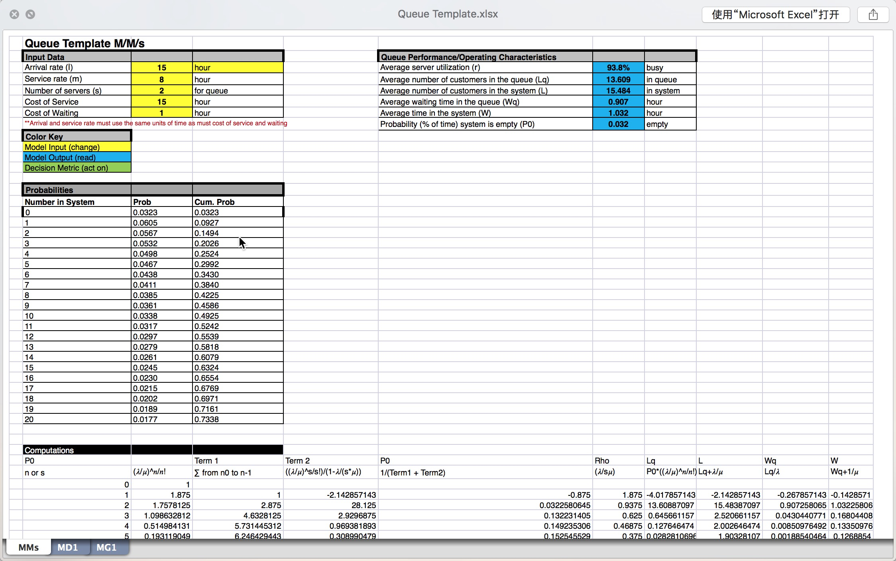

# Tech Talk

缓存问题

微博是把几乎所有用户的用户列表都存到缓存的吗？大概缓存存了多少用户（大概占比）？
毕竟要保持db穿透小于2%那样子？（db最好能扛多少百分比的穿透，其实还是看实际性能和数据表的吧，估计还是得压测…）

答：99%
“db最好能扛多少百分比的穿透，其实还是看实际性能和数据表的吧，估计还是得压测…”，
跟百分比没关系，跟绝对量有关系，假设总请求量是A，DB能扛B，命中率就是1-B/A。
不过也得考虑成本，端口内存大小，端口数量等其他因素。

---

刚才是说，缓存命中率99%，穿透率1%。还是说，缓存了几乎99%用户的关注数据（感觉因该都要，最好都存上？）

答：“最好都能存”，没有最好的事 [笑哭]
访问有冷热区分，都放内存，性能没问题，成本有问题。

---

不存长尾数据的话，也得要数据支撑[表情] 不然自己人爬一下数据就穿透了[表情]

答：这个得了解业务了，每个业务访问模型不一定一样。
不过可以用代数啊 [笑哭]

---

感觉得找一个excel之外，也能公式联动的软件来算这些数了

答：类似这种搞一个

---

我用的 Numi https://numi.io/

答：嗯，用代数就好了，别用算数 [笑哭]
完了往里面代数就好了，
毕竟不同的业务，具体数值不太一样
有的业务，40%命中率就已经很不错了[笑哭]

---

感觉是因为量太大，缓存结构复杂了？

答：最好设计出来的，越简单越好

---

网上会看 redis-benchmark 和 mc 的 benchmark，
实际问 feed 组的舍友，说是监控的 get/set 操作大概要 2~3ms，
不知道是监控的精确度问题，还是实际上是这样。

毕竟跟官方 benchmark 的对比应该差距蛮大的，
benchmark 1ms redis 都能有 70+ ，
mc 1ms 也能处理个 50 的样子，
实际上一旦分布式，加上网络，确实就要 2~3ms 了

答：“监控get/set是2～3ms” — 是这个数，包含网络开销，分布式。只是平均数。
这个是client端采样，redis 只从 server 端看，确实能到每秒6w多qps，
这个值一般用来评估资源容量，性能不看这个。

---
