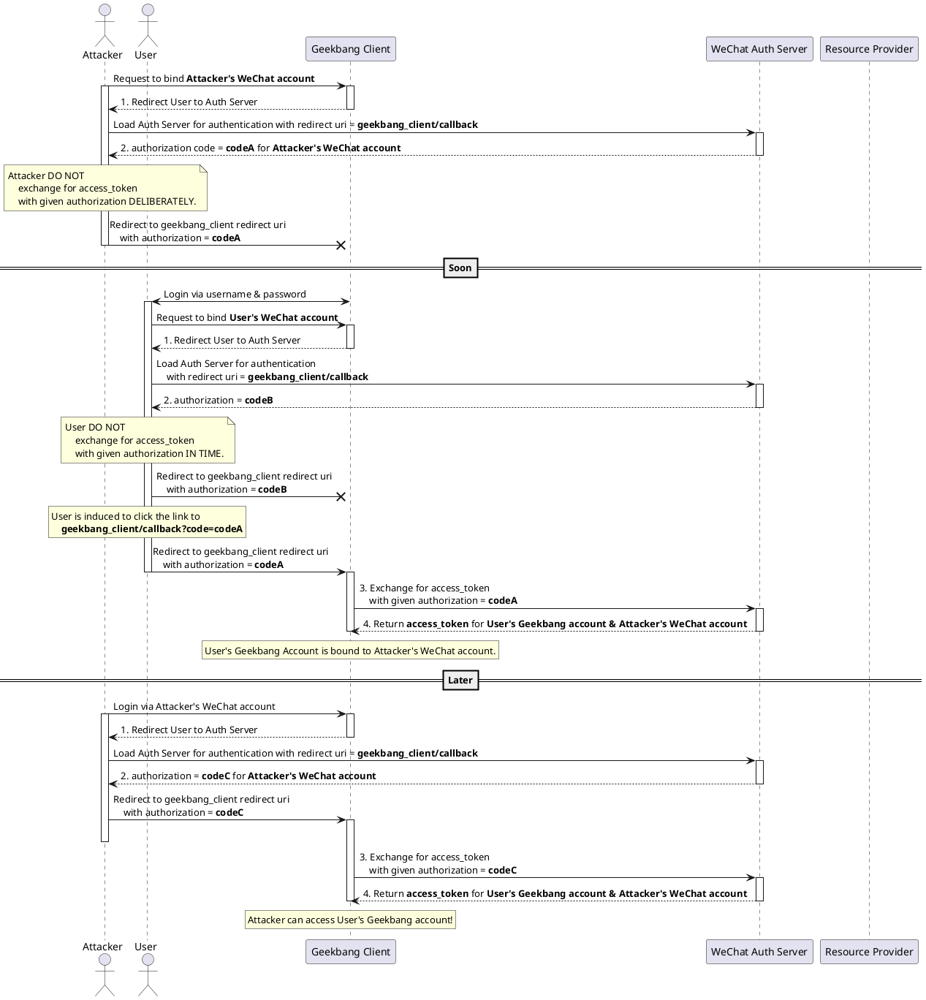
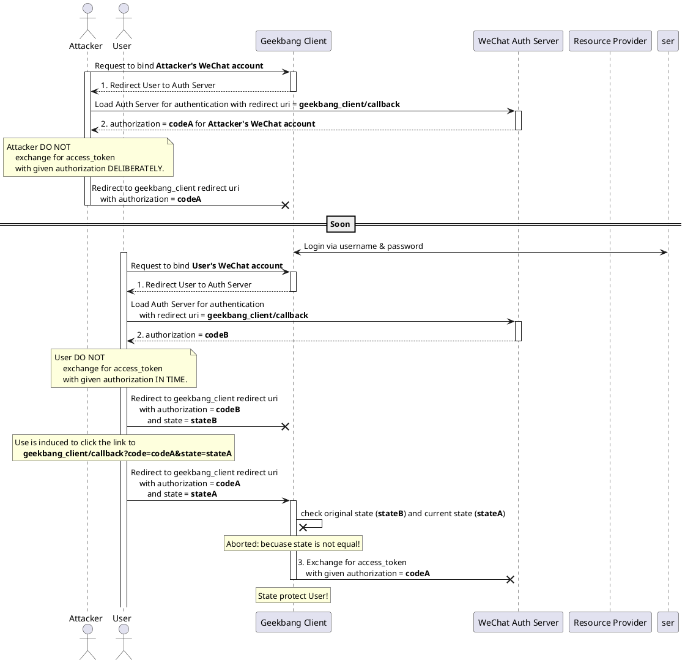

# CSRF Attack on OAuth 2.0

## Fraud to Bind WeChat Account

## Problem

```plantuml
@startuml
actor attacker as "Attacker"
actor user as "User"

participant geekbang_client as "Geekbang Client"

participant auth_serv as "WeChat Auth Server"
participant protected_res as "Resource Provider"

attacker -> geekbang_client: Request to bind **Attacker's WeChat account**
activate attacker
activate geekbang_client
attacker <-- geekbang_client: 1. Redirect User to Auth Server
deactivate geekbang_client

attacker -> auth_serv: Load Auth Server for authentication with redirect uri = **geekbang_client/callback**
activate auth_serv
attacker <-- auth_serv: 2. authorization code = **codeA** for **Attacker's WeChat account**
deactivate auth_serv

note over attacker
    Attacker DO NOT
        exchange for access_token
        with given authorization DELIBERATELY.
endrnote

attacker -x geekbang_client: Redirect to geekbang_client redirect uri \n    with authorization = **codeA**
deactivate attacker

==Soon==

user <-> geekbang_client: Login via username & password
activate user
user -> geekbang_client: Request to bind **User's WeChat account**
activate geekbang_client
user <-- geekbang_client: 1. Redirect User to Auth Server
deactivate geekbang_client

user -> auth_serv: Load Auth Server for authentication \n    with redirect uri = **geekbang_client/callback**
activate auth_serv
user <-- auth_serv: 2. authorization = **codeB**
deactivate auth_serv

note over user
    User DO NOT
        exchange for access_token
        with given authorization IN TIME.
endrnote

user -x geekbang_client: Redirect to geekbang_client redirect uri \n    with authorization = **codeB**

rnote over user
    User is induced to click the link to
        **geekbang_client/callback?code=codeA**
endrnote

user -> geekbang_client: Redirect to geekbang_client redirect uri \n    with authorization = **codeA**
deactivate user
activate geekbang_client

geekbang_client -> auth_serv: 3. Exchange for access_token \n    with given authorization = **codeA**
activate auth_serv
geekbang_client <-- auth_serv: 4. Return **access_token** for **User's Geekbang account & Attacker's WeChat account**
deactivate auth_serv
deactivate geekbang_client

rnote over geekbang_client
    User's Geekbang Account is bound to Attacker's WeChat account.
endrnote

==Later==

attacker -> geekbang_client: Login via Attacker's WeChat account
activate attacker
activate geekbang_client
attacker <-- geekbang_client: 1. Redirect User to Auth Server
deactivate geekbang_client

attacker -> auth_serv: Load Auth Server for authentication with redirect uri = **geekbang_client/callback**
activate auth_serv
attacker <-- auth_serv: 2. authorization = **codeC** for **Attacker's WeChat account**
deactivate auth_serv

attacker -> geekbang_client: Redirect to geekbang_client redirect uri \n    with authorization = **codeC**
activate geekbang_client
deactivate attacker

geekbang_client -> auth_serv: 3. Exchange for access_token \n    with given authorization = **codeC**
activate auth_serv
geekbang_client <-- auth_serv: 4. Return **access_token** for **User's Geekbang account & Attacker's WeChat account**
deactivate auth_serv
deactivate geekbang_client

rnote over geekbang_client
    Attacker can access User's Geekbang account!
endrnote

@enduml
```

### Solution

```plantuml
@startuml
actor attacker as "Attacker"
actor user as "User"

participant geekbang_client as "Geekbang Client"

participant auth_serv as "WeChat Auth Server"
participant protected_res as "Resource Provider"

attacker -> geekbang_client: Request to bind **Attacker's WeChat account**
activate attacker
activate geekbang_client
attacker <-- geekbang_client: 1. Redirect User to Auth Server
deactivate geekbang_client

attacker -> auth_serv: Load Auth Server for authentication with redirect uri = **geekbang_client/callback**
activate auth_serv
attacker <-- auth_serv: 2. authorization = **codeA** for **Attacker's WeChat account**
deactivate auth_serv

note over attacker
    Attacker DO NOT
        exchange for access_token
        with given authorization DELIBERATELY.
endrnote

attacker -x geekbang_client: Redirect to geekbang_client redirect uri \n    with authorization = **codeA**
deactivate attacker

==Soon==

ser <-> geekbang_client: Login via username & password
activate user
user -> geekbang_client: Request to bind **User's WeChat account**
activate geekbang_client
user <-- geekbang_client: 1. Redirect User to Auth Server
deactivate geekbang_client

user -> auth_serv: Load Auth Server for authentication \n    with redirect uri = **geekbang_client/callback**
activate auth_serv
user <-- auth_serv: 2. authorization = **codeB**
deactivate auth_serv

note over user
    User DO NOT
        exchange for access_token
        with given authorization IN TIME.
endrnote

user -x geekbang_client: Redirect to geekbang_client redirect uri \n    with authorization = **codeB** \n        and state = **stateB**

rnote over user
    Use is induced to click the link to
        **geekbang_client/callback?code=codeA&state=stateA**
endrnote

user -> geekbang_client: Redirect to geekbang_client redirect uri \n    with authorization = **codeA** \n        and state = **stateA**
activate geekbang_client

geekbang_client -x geekbang_client: check original state (**stateB**) and current state (**stateA**)

rnote over geekbang_client
    Aborted: becuase state is not equal!
endrnote

geekbang_client -x auth_serv: 3. Exchange for access_token \n    with given authorization = **codeA**
deactivate geekbang_client

rnote over geekbang_client
    State protect User!
endrnote

@enduml
```
