# Fundamentals of Software Architecture

《软件架构基础》

---

References

- Book "Fundamentals of Software Architecture" Mark Richards, Neal Ford 著
    - 《软件架构基础》（影印版）
    - [Table Of Content](/book/fundamentals-of-software-architecture-toc.md)

<!--

## 缩略版 TOC

TODO : 还是太长需要继续缩略, 再展示其精华到首页 README.md 中 (2021/12/10)

- 1\. Introduction
    - Expectations of an Architect : Keep Current with Latest Trends / Ensure Compliance with Decisions / Diverse Exposure and Experience / Have Bussines Domain Knowledge / Understand and Navigate Politics
    - Intersection of Architecture and … : Engineering Practices / Operations & DevOps / Process / Data
- Part 1. Foundations
    - 2\. Architectural Thinking : Architecture Versus Design / Technical Breadth / Analyze Trade-Offs / Understanding Business Drivers / Balancing Architecutre and Hands-On Coding
    - 3\. **Modularity** : Measuring Modularity / **Cohesion** / **Coupling** / **Abstractness, Instability, and Distance from the Main Sequence** / **Distance from the Main Sequence** / **Connascence** / **Unifying Coupling and Connascence Metrics** / From Modules to Components
    - 4\. **Architecture Characteristics** : Trade-Offs and Least Worst Architecture / Defined : (Partially) Listed : Operational / Structural / Cross-Cutting
    - 5\. Indentifying Architectural Characteristics: Extracting Architecture Characteristics from Domain Concerns and Requirements / Characteristics: Explicit / Implicit
    - 6\. Measuring and Governing Architecture Characteristics
        - Measuring : Operational / Structural / Process
        - Governance and Fitness Function : Governing Architecture Characteristics / Fitness Functions
    - 7\. Scope of Architecture Characteristics: Coupling and Connascence / Architectural Quanta and Granularity
    - 8\. Component-Based Thinking : Component Scope / Developer Role
        - **Architect Role** : **Architecture Partitioning** / Case Study : Silicon Sanwiches: Partitioning
        - Component Identification Flow : Identifying Initial Components / Assign Requirements to Components / Analyze Roles and Responsibilities / Analyze Architecture Characteristics / Restructure Components
        - Component Granularity
        - Architecture Quantum Redux : Choosing Between Monolithic Versus Distributed Architectures
- Part 2. Architure Styles
    - 9\. Foundations: Fundamental Patterns: Big Ball of Mud / Unitary Architecture / Client/Server
        - **Monolithic Versus Distributed Architectures** - **Fallacies** :
            - The Network Is Reliable / Latency Is Zero / Bandwidth Is Infinite / The Network Is Secure / The Topology Never Changes / There Is Only One Administrator / Transport Cost Is Zero / The Network Is Homogeneous
    - 10\. **Layered** : Layers of Isolation
    - 11\. **Pipeline** : **Pipes** / **Filters**
    - 12\. **Microkernel** : **Core System** or **Plug-In Components** / **Registry** / **Contracts**
    - 13\. **Service-Based** : Service Design and Granularity / Database Partitioning
    - 14\. **Event-Driven** : **Broker** / **Mediator**
        - Asynchronous Capabilities / Error Handling / Prevent Data Loss / Broadcast Capabilities / Request-Reply / Choosing Between Request-Reply and Event-Based / Hybrid** Event-Driven Architectures
    - 15\. **Space-Based**
        - Processing Unit / Virtualized Middleware / Data Pumps / Data Writers / Data Readers
        - Data Collisions / Cloud Versus On-Premises Implementations / Replicated Versus Distributed Caching / Near-Cahce Considerations
    - 16\. **Orchestration-Driven Service-Oriented** : Reuse … and Coupling / Taxonomy : Business / Enterprise / Application / Infrastructure / Orchestration / Message Flow
    - 17\. **Microservices**
        - Bounded Context : Granularity / Data Isolation
        - Distributed / API Layer / Operational Reuse / Frontends
        - Communication : Choreography and Orchestration / Transactions and Sages
- ……

-->

## Table of Contents

-   Preface: Invalidating Axioms _( 公理 )_

-   1\. Introduction

    - Defining Software Architecture
    - Expectations of an Architect
        - Continually Analyze the Archituecture
        - Keep Current with Latest Trends
        - Ensure Compliance _( 服从 )_ with Decisions
        - Diverse _( 不同的 )_ Exposure _( 显露? )_ and Experience
        - Have Bussines Domain Knowledge
        - Understand and Navigate _( 操纵 )_ Politics
    - Intersection _( 交叉点 )_ of Architecture and …
        - **Engineering Practices**
        - **Operations / DevOps**
        - **Process**
        - **Data**
    - **Laws of Software Architecutre**

### Part 1. Foundations

-   2\. Architectural _( 建筑学上的 )_ Thinking

    - Architecture Versus Design
    - Technical Breadth
    - Analyze Trade-Offs
    - Understanding Business Drivers
    - Balancing Architecutre and Hands-On Coding

-   3\. **Modularity _( 模块性 )_**

    - Definition
    - Measuring Modularity
        - **Cohesion**
        - **Coupling**
        - **Abstractness, Instability, and Distance from the Main Sequence**
        - **Distance from the Main Sequence**
        - **Connascence _( 共生性 )_**
        - **Unifying Coupling and Connascence Metrics**
    - **From Modules to Components**

-   4\. **Architecture Characteristics _( 特征 )_** Defined

    - Architectural Characteristics ( Partially ) Listed
        - **Operational** Architecture Characteristics
        - **Structural** Architecture Characteristics
        - **Cross-Cutting** Architecture Characteristics
    - Trade-Offs and Least Worst Architecture

-   5\. Indentifying Architectural Characteristics

    - Extracting Architecture Characteristics from Domain Concerns
    - Extracting Architecture Characteristics from Requirements
    - Case Study: Silicon Sandwiches
        - Explicit Characteristics
        - Implicit Characteristics

-   6\. Measuring and Governing Architecture Characteristics

    - Measuring Architecture Characteristics
        - Operational Measures
        - Structural Measures
        - Process Measures
    - Governance _( 管理 )_ and Fitness _( 适当 )_ Function
        - Governing Architecture Characteristics
        - Fitness Functions

-   7\. **Scope** of Architecture Characteristics

    - **Coupling and Connascence**
    - **Architectural Quanta _( 量 )_ and Granularity _( 粒度 )_**
        - Case Study: Going, Going, Gone

-   8\. Component-Based Thinking

    - Component Scope
    - **Architect Role _( 职责 )_**
        - **Architecture Partitioning _( 分割 )_**
        - Case Study: Silicon Sanwiches: Partitioning
    - **Developer Role**
    - Component Identification Flow
        - Identifying Initial Components
        - Assign Requirements to Components
        - Analyze Roles and Responsibilities
        - Analyze Architecture Characteristics
        - Restructure Components
    - Component Granularity
    - Component Design
        - Discovering Components
    - Case Study: Going, Going, Gone: Discovering Components
    - Architecture Quantum Redux: Choosing Between Monolithic Versus Distributed Architectures

### Part 2. Architure Styles

-   9\. Foundations

    - Fundamental Patterns
        - Big Ball of Mud
        - Unitary _( 统一的 )_ Architecture
        - Client / Server
    - **Monolithic Versus Distributed Architectures**
        - **Fallacy _( 谬误 )_ #1: The Network Is Reliable**
        - **Fallacy #2: Latency Is Zero**
        - **Fallacy #3: Bandwidth Is Infinite**
        - **Fallacy #4: The Network Is Secure**
        - **Fallacy #5: The Topology Never Changes**
        - **Fallacy #6: There Is Only One Administrator**
        - **Fallacy #7: Transport Cost Is Zero**
        - **Fallacy #8: The Network Is Homogeneous**
        - Other Distributed Considerations

-   10\. **Layered** Architecture Style

    - Topology
    - **Layers of Isolation**
    - Adding Layers
    - Other Considerations
    - Why Use This Architecture Style
    - Architecture Characteristics Ratings

-   11\. **Pipeline** Architecture Style

    - Topology
        - **Pipes**
        - **Filters**
    - Example
    - Architecture Characteristics Ratings

-   12\. **Microkernel** Architecture Style

    - Topology
        - **Core System**
        - **Plug-In Components**
    - **Registry**
    - **Contracts**
    - Examples of Use Cases
    - Architecture Characteristics Ratings

-   13\. **Service-Based** Architecture Style

    - Topology
    - Topology Variants
    - Service Design and Granularity
    - **Database Partitioning**
    - Example Architecture
    - Architecture Characteristics Ratings
    - When to Use This Architecture Style

-   14\. **Event-Driven** Architecture Style

    - Topology
    - **Broker** Topology
    - **Mediator** Topology
    - **Asynchronous Capabilities**
    - **Error Handling**
    - **Prevent Data Loss**
    - **Broadcast Capabilities**
    - **Request-Reply**
    - Choosing Between Request-Reply and **Event-Based**
    - **Hybrid** Event-Driven Architectures
    - Architecture Characteristics Ratings

-   15\. **Space-Based** Architecture Style

    - General Topology
        - **Processing Unit**
        - **Virtualized Middleware**
        - **Data Pumps _( 泵 )_**
        - **Data Writers**
        - **Data Readers**
    - **Data Collisions**
    - **Cloud Versus On-Premises _( 内部部署 )_ Implementations**
    - **Replicated Versus Distributed Caching**
    - **Near-Cahce** Considerations
    - Implementation Examples
        - Correct Ticketing System
        - Online Auction System
    - Architecture Characteristics Ratings

-   16\. **Orchestration-Driven Service-Oriented** Architecture

    - History and Philosophy
    - Topology
    - Taxonomy
        - **Business** Services
        - **Enterprise** Services
        - **Application** Services
        - **Infrastructure** Services
        - **Orchestration** Services
        - **Message Flow**
    - **Reuse … and Coupling**
    - Architecture Characteristics Ratings

-   17\. **Microservices** Architecture

    - History
    - Topology
    - **Distributed**
    - **Bounded Context**
        - **Granularity**
        - **Data Isolation**
    - **API Layer**
    - Operational Reuse
    - **Frontends _( 前端的 )_**
    - Communication
        - **Choreography _( 舞蹈舞蹈设计 )_ and Orchestration**
        - **Transactions and Sages _( 圣人, 智者 )_**
    - Architecture Characteristics Ratings
    - Additional References

-   18\. Choosing the Appropriate Architecture Style

    - Shifting "Fashion" in Architecture
    - **Decision Criteria _( 标准, 条件 )_**
    - Monolith Case Study: Silicon Sandwiches
        - Modular Monolith
        - Microkernel
    - Distributed Case Study: Going, Going, Gone

### Part 3. Techniques and Soft Skills

-   19\. **Architecture Decisions**

    - Architecture Decision **Anti-Patterns**
        - **Governing Your Assets** Anti-Pattern
        - **Groundhog Day _( 土拨鼠日 )_** Anti-Pattern
        - **Email-Driven** Architecture Anti-Pattern
    - Architecturally Significant
    - Architecture Decision Records
        - Basic Structure
        - Storing ADRs
        - ADRs as Documentation
        - Using ADRs for Standards
        - Example

-   20\. Analyzing Architecture **Risk**

    - Risk Matrix
    - Risk Assessments _( 估价 )_
    - Risk Storming
        - Identification
        - Consensus
    - Agile Story Risk Analysis
    - Risk Storming Examples
        - Availability
        - **Elasticity _( 弹性 )_**
        - Security

-   21\. Diagramming and Presenting Architecture

    - Diagramming
        - Tools
        - Diagramming Standards: **UML, C4, and ArchiMate**
        - Diagram Guidelines
    - Presenting
        - Manipulating Time
        - Incremental Builds
        - **Infodecks Versus Presentations**
        - **Slides Are Half of the Story**
        - Invisibility

-   22\. Making Teams Effective

    - Team Boundaries
    - Architect Personalities
        - Control Freak _( 怪物; 反常的事 )_
        - Armchair _( 扶手椅 )_ Architect
        - Effective Architect
    - How Much Control?
    - Team Warning Signs
    - **Leveraging Checklists**
        - **Developer Code Completion** Checklist
        - **Unit and Functional Testing** Checklist
        - **Software Release** Checklist
    - Providing Guidance
    - Summary

-   23\. Negotiation and Leadership Skills

    - **Negotiation and Facilitation** _( 助长, 简易化 )_
        - Negotiating with Business Stakeholders
        - Negotiating with Other Architects
        - Negotiating with Developers
    - The Software Architect as a Leader
        - The 4 C's of Architecture
        - Be Pragmatic, Yet Visionary _( 有眼光的, 有远见的 )_
        - Leading Teams By Example
    - Integrating with the Development Team
    - Summary

-   24\. Developing a Career Path

    - The 20-Minute Rule
    - Developing a Personal Radar
        - The ThoughtWorks Technology Radar
        - Open Source Visualization Bits
    - Using Social Media
    - Parting Words of Advice

-   Appendix. Self-Assessment Questions

-   Index

## Preface: Invalidating Axioms

Architecture characteristics referes to the "-illities" that the system must support

- Availability 可用性
- Reliability 可靠性
    - _Software Reliability is the probability of failure-free software operation for a specified period of time in a specified environment. ( [ref](https://users.ece.cmu.edu/~koopman/des_s99/sw_reliability/#:~:text=Software%20Reliability%20is%20the%20probability,important%20factor%20affecting%20system%20reliability.&text=Measurement%20in%20software%20is%20still%20in%20its%20infancy.) )_
- Testability 可测试性
- Scalability 可伸缩性
    - _Scalability handles the changing needs of an application within the confines of the infrastructure via statically adding or removing resources to meet applications demands if needed. ( [ref](https://blog.turbonomic.com/blog/on-technology/cloud-elasticity-vs-cloud-scalability#:~:text=The%20purpose%20of%20Elasticity%20is,meet%20applications%20demands%20if%20needed.) )_
- Security 安全性
- Agility 敏捷性
- Fault Tolerance 错误容忍性
- Elasticity 弹性
    - _The purpose of Elasticity is to match the resources allocated with actual amount of resources needed at any given point in time. ( [ref](https://blog.turbonomic.com/blog/on-technology/cloud-elasticity-vs-cloud-scalability#:~:text=The%20purpose%20of%20Elasticity%20is,meet%20applications%20demands%20if%20needed.) )_
- Recoverability 可恢复性
- Performance 性能
- Deployability 可部署性
- Learnability 可学习性?

_( [Scalability vs. Elasticity](https://blog.turbonomic.com/blog/on-technology/cloud-elasticity-vs-cloud-scalability#:~:text=The%20purpose%20of%20Elasticity%20is,meet%20applications%20demands%20if%20needed.) )_

## C1. Introduction

Laws of Software Architecture

> Everything in software architecture is a trade-off.

_—— First Law of SOftware Architecture_

> If an architect thinks they discovered something that isn't a trade-off, more likely they just haven't identified the trade-off yet.

_—— Corollary 1_

> Why is more important than how.

_—— Second Law of Software Architecture_

# Part 1. Foundations

## C2. Architectureal Thinking

### Technical Breadth

Technical Depth & Technical Breadth

### Analyze Trade-Offs

Trade-offs between topics and queues

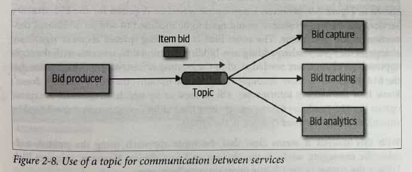
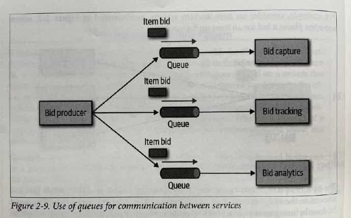

Topic advantages

- Architecture extensibility
- Service decoupling

Topic disadvantages

- Data access and data security conerns
    _( 可以像阿里那样用管理后台管控 topic 接入, 但实际可以通过代码绕过去 )_
- No heterogeneous contents
    _( 不同消费方关注的字段各不相同, 生产方只能提供消费方所需字段的超集, 没法为消费方按需提供数据 )_
- Monitoring and programmatic scalability
    _( 无法单独监控 topic 的消息消费情况, 就难以为各个消费方单独做自动扩缩容 )_

_( icehe : 初见, 感觉基于 topic 是 "完美的" , 实则同样存在的取舍平衡 )_

### Balancing Architecure and Hands-on Coding

First way is to do frequent proof-of-concepts or POCs.

- … it also helps validate an architecuture decision by talking the implementation details into account.
- _Our advice when doing proof-of-concept work is that, whenever possible, the architect should write the best production-quality code they can._

Another way an architect can remain hands-on is to tackle some of the technical debt stories or architecture stories, _freeing the development team up to work on the critical functional user stories._

- _Similarly, working on bugfixes within an iteration…_
- Leveraging automation by creating simple command-line tools and analyzers _to help the development team with their day-to-day tasks is another great way to maintain hands-on coding skills while making the development team more effective_

Do frequent code reviews.

---

[ArchiUnit](https://www.archunit.org/)

ArchUnit is a free, simple and extensible library for checking the architecture of your Java code using any plain Java unit test framework. That is, ArchUnit can check dependencies between packages and classes, layers and slices, check for cyclic dependencies and more. It does so by analyzing given Java bytecode, importing all classes into a Java code structure.

## C3. Modularity

### Measuring Modularity

#### Cohesion

_( 内聚 )_

- **Functional** cohesion
    - Every part of the module is related to the other, ant he module contains everything essential to function
- **Sequential** cohesion
    - Two modules interact, where one outputs data that becomes the input ofr the other
- **Communicational** cohesion
    - Two modules form a communication chain
    - e.g. ad a record to db → gen an email based on it
- **Procedural** cohesion
    - Must execute in particular order
- **Temporal** cohesion
    - Related based on timing dependencies
    - e.g. things that must be initialized at system startup
- **Logical** cohesion
    - Related logically but not functionally
    - e.g. StringUtils package
        - Operations are related, but the functions are quite different
- **Coincidental** cohesion _( negative )_
    - e.g. not related but being in the same source file

**LCOM** : Lack of Cohesion in Methods

- The sume of sets of methods not shared via sharing fields

#### Coupling

_( 耦合 )_

**Afferent** coupling _( 传入的 ≈ incoming )_
**Efferent** coupling _( 输出的 ≈ outgoing )_

Afferent coupling measure the number of incoming connections to a code artifact (component, class, function, and so on).

Efferent coupling measures the outgoing connections to toher code artifacts.

#### Abstractness, Instability

**Abstractness** is the ratio of abstract artifacts ( abstract classes, interfaces, and so on ) to concrete artifacts ( implementation ) .

$$
A = \frac{\sum{m^a}}{\sum{m^c}}
$$

- $m^a$ represents abstract elements (interfaces or abstract classes) with the module
- $m^c$ represents concrete elements (nonabstract classes)

**Instability** is the ratio of efferent coupling to the sum of both efferent and afferent coupling.

$$
I = \frac{C^e}{C^e+C^a}
$$

- $c^e$ represents efferent (or outgoing) coupling
- $c^a$ represents afferent (or incoming) coupling

The instability _( 不稳定 )_ metric determines the volatility _( 变化无常, 不稳定 )_ of a code base. A code base that exhibits high degrees of instability breaks more easily when changed because of high coupling.

#### Distance from the Main Sequence

$$
D = |A+I-1|
$$

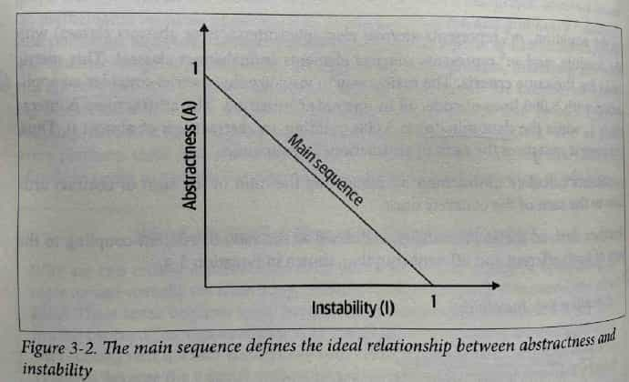

**Limitations of Metrics**

For example, **cyclomatic complexity** measures complexity in code bases but cannot distinguish from **essential complexity** (because the underlying problem is complex) or **accidental complexity** (the code is more complex than it should be).

#### Connascence

[Connascence - Wikipedia](https://en.wikipedia.org/wiki/Connascence)

_icehe : 很像 coupling 耦合, 怎么翻译比较好? 联动?_

> Two components are connascent if a change in one would require the other to be modified in order to maintain the overall correctness of the system.
>
> —— _Meilir Page-Jones_

##### Static Connascence

**Static connascence** referes to source-code-level coupling (as opposed to execution-time coupling);
it is a refinement of the afferent and efferent couplings defined by _Structured Design_.

In other words, architects view the following types of static connascence as the _degree_ to which something is coupled, either afferently or efferently:

-   Connascence of Name (CoN)

    Multiple components must agree on the name of an entity.

    _Names of methods represents the most common way that code bases are coupled and the most desirable._

-   Connascence of Type (CoT)

    Multiple components must agree on the type of an entity.

    _e.g. statically typed languages, and dynamically typed languages offering selective typing_

-   Connascence of Meaning (CoM) or Connascence of Convention (CoC)

    Multiple components must agree on the meaning of particular values.

    _e.g. hard-coded numbers rather than constants_

-   Connascence of Position (CoP)

    Multiple entities must agree on the order of values.

    _e.g. parameter values for method and function calls ( wrong parameter order of function )_

-   Connascence of Algorithm (CoA)

    Multiple entities must agree on a particular algorithm.

    _e.g. defines a security hashing algorithm that must run on both the server and client and produce identical results to authenticate the user_

##### Dynamic Connascence

**Dynamic connascence** analyses calls at runtime.

Different types of dynamic connascence:

-   Connascence of Execution (CoE)

    The order of execution of multiple components.

-   Connascence of Timing (CoT)

    The timing of the execution of multiple components.

    _e.g. a race condition caused by two threads executing at the same time_

-   Connascence of Values (CoV)

    Occurs when serveral values relate on one another and must change together.

    _e.g. the more common and problematic case involves transactions, especially in distributed system:_
    _When an architect designs a system with separate databases, yet needs to update a single value across all of the databases, all the values must change together or not at all._

-   Connascence of Identity (CoI)

    Occurs when serveral values relate on one another and must change together. _( icehe : 竟然这句跟上文一样? )_

    _e.g. two independent components that must share and update a common data structure, such as a distributed quque._

##### Connascence Properties

_Some properties of connascence help developers use it wisely._

-   **Strength**

    Architects determine the _strength_ of connanascence by the ease with which a developer can refactor that type of coupling; _differenct types of connascence are demonstrably more desirable._

    _e.g. consider the case of connascence of meaning, which developers can improve by refactoring to connascence of name by creating named constant rather than a magic value._

    

-   **Locality**

    The _locality_ of connascence mearsures how proximal the modules are to each other in the code base.

    _Proximal code (in the same module) typically has more and higher forms of connascence than more separated code (in separate modules or code bases) ._
    _In other words, forms of connascence that indicate poor coupling when far apart are fine when closer together._

    _e.g. if two classes in the same component have connascence of meaning, it is less damaging to the code base than if two components have the same form of connascence._

-   **Degree**

    The _degree_ of connascence related to the size of its impact —— does it impact a few classes or many?

    _Lesser degrees of connascence damage code bases less._

Three guidelines for using connascence to improve system modularity:

1. Minimize overall connascence by breaking the system into encapsulated elements
2. Minimize any remaining connascence that crosses encapsulation boundaries
3. Maximize the connascence within encapsulation boundaries

_The lengendary software architecture innovator Jim Weirich offers two great pieces of advices:_

- **Rule of Degree**: convert strong forms of connascence into weaker forms of connascence
- **Rule of Locality**: as the distance between software elements increases, use weaker forms fo connascence

#### Unifying Coupling and Connascence Metrics

From an architect's point of view, these two views (coupling and connascence) overlap.

… Connascence cares about how things are coupled together.

… What structured programming called _data coupling_ (method calls), connascence provides advice for how that coupling should manifest.

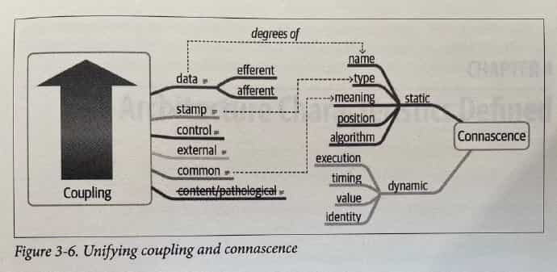

_The structured programming couipling concepts appear on the left, while the connascence appear on the right._

### From Modules to Components

We use _module_ throughtout as a generic name for a bundling of related code.

_We'll disscuss more in Chapter 8._

## C4. Architecture Characteristics Defined

A software solution consists of both domain requirements and architectural.

- **Auditability**
- **Performance**
- **Security**
- **Requirements**
- **Data**
- **Legality**
- **Scalability**

An architecture characteristic meets three criteria

- Specifies a nondomain design consideration
- Influences some structuralaspect of the design
- Is critical or important to application success

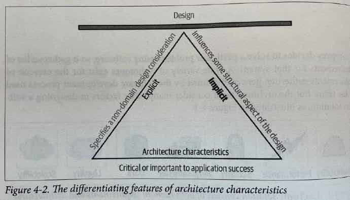

_The choice of a triangle is intentional:_
_each of the definition elements supports the others,_
_which in turn support the overall design of the system._

-   Specifies a nondomain design consideration

    When designing an application, the requirements specify what the application should do;
    architecture characteristics specify operational and design crieria for success,
    concerning how to implement the requirements and why certain choices were made.

-   Influences some structural aspect of the design

-   Critical or important to application success

    Applications shouldn't support for each characteristics adds complexity to the design.
    Thus a critical job for architects lies in choosing the fewest architecture characteristics rather than the most possible.

### Architectural Characteristics (Partially) Listed

#### Operational Architectural Characteristics

Term & Definition

-   **Availability**

    How long the system will need to be available.
    ( if 24/7, steps need to be in place to allow the system to be up and running quickly in case of any failure ) .

-   **Continuity** _( 连续性 )_

    **Disaster recovery capacity**.

-   **Performance**

    Includes stress testing, peak analysis, analysis of the frequency of fucntions used, cpacity required, and response times.
    _Performance acceptance sometimes require an exercises of its own, talking months to complete._

-   **Recoverability**

    Bussiness continuity requirements _( 业务连续性? )_
    ( e.g., in case of a disaster, how quickly is the system required to be online again? ) .
    This will affect the cakup strategy and requirements for duplicated hardware.

-   **Reliability / safety**

    Assess if the system needs to be **fail-safe** _( 自动放故障的 )_ ,
    or if it is mission critical _( 关键任务 )_ in a way that affects lives.
    If it fails, will it cost the company large sums of money?

-   **Robustness**

    Ability to **handle error and boundary conditions while running**
    if the internet connection goes down or if there's a power outage or hardware failure.

-   **Scalability**

    Ability for the system to perform and operate as the number of users or requests increses.

#### Structural Architecture Characteristics

-   **Configurability**

    Ability for the end users to easily change aspects of the software's configuration ( through usable interface ) .

-   **Extensibility**

    How important it is to plug new pieces of fucntionality in.

-   **Installability**

    Ease of system installation on all necessary platforms.

-   **Leverageability / reuse**

    Ability to leverage common components across multiple products.

-   **Localization**

    Support for multiple languages on entry/query screens in data fields; on reports, multibyte charater requirements and units of measure or currencies.

-   **Maintainability**

    How easy it is to apply changes and enhance the system?

-   **Portability**

    Does the system need to run on more than one platform? _( For example, does the frontend need to run against oracle as well as SAP DB? )_

-   **Supportability**

    What level of technical support is needed by the application? What level of logging and other facilities are required to debug errors in the system?

-   **Upgradeability**

    Ability to easily/quickly upgrade from a previous version of this application/solution to a newer version on servers and clients.

#### Cross-Cutting Architecture Characteristics

-   **Accessibility** _( 可得性 )_

    **Access to all your users, including those with disabilities** like colorblindness or hearing loss.

-   **Archivability** _( 可归档 )_

    Will the data need to be **archived or deleted after aperiod of time**?
    _( For example, customer accounts are to be deleted after three months or marked as obsolete and archived to a secondary database for future access. )_

-   **Authentication** _( 鉴权 )_

    Security requirements to **ensure users are who they say they are.**

-   **Authorization** _( 授权 )_

    Security requirements to **ensure users can access only certain functions within the application** ( by use case, subsystem, webpage, business rule, field level, etc. )

-   **Legal** _( 合法性 )_

    What legislative constraints is the system operating in ( data protection, Sarbanes Oxley, GDPR, etc. ) ?
    What reservation rights does the company require?
    Any regulations regarding the way the application is to be built or deployed?

-   **Privacy** _( 隐私 )_

    Ability to **hide transactions from internal company employees**
    ( entrypted transactions so even DBAs and network architects cannot see them ) .

-   **Security**

    Does the data need to be entrypted in the databases?
    Entrypted for network communication between internal systems?
    What type of authentication needs to be in place for remote user access?

-   **Supportability**

    What level of technical support is needed by the application?
    What level of logging and other facilities are required to debug errors in the system?

-   **Usability/achievability** _( 可用性?/可实现性? )_

    Level of training required for users to achieve their goals with the application/solution.
    Usability requirements need to be treated as seriously as any other architectureal issuce.

**Italy-ility**

- _Years ago, becuse of a freak communication outage, the head office had lost communication with the Italian branches, and it was organizationally traumatic._
- Italy-ility is **a unique combination of availability, recoverability, and resilience.**

#### Others from ISO

-   **Performance efficiency**

    ……
    It includes
    _time behavior_ ( measure of reponse, processing times, and/or throughput rates ) ,
    _resource utilization_ ( amounts and types of resources used ) , and
    _capacity_ ( degree to which the maximum established limits are exceeded ) .

-   **Compatibility**

    Degree to which a product, system, or component can exchange information with other products, systems, or components
    and/or perform its required functions while sharing the same hardware or sofware environment.

    It includes
    _coexistence_ _( 共存 )_
    ( can perform its required functions efficiently while sharing a common environment and resources with other products ) and
    **_interoperability_ ( degree to which two or more systems can exchange and utilize information ) .**

-   **Usability**

    Users can use the system effectively, efficiently, and satisfactorily for its intended purpose.

    It includes
    **_appropriateness recognizability_ ( users can recognize whether the software is appropriate for their needs ) ,**
    _learnability_ ( … ) ,
    _user error protection_ ( … ) , and
    _accessibility_ ( make the software available to people who with the widest range of characteristics and capabilities ) .

-   **Reliability**

    Degree to which a system functions under specified conditions for a specified period of time.

    It includes
    **_maturity_ ( does the software is operational and accessible ) ,**
    _fault tolerance_ ( … ) ,
    _recoverability_ ( … ) .

-   **Security**

    ……
    It includes
    **_confidentiality_ _( 机密性 )_ ( data is accessible only to those authorized to have access ) ,**
    **_integrity_ ( the software prevents unauthorized access to or modification of software or data ) ,**
    **_nonrepudiation_ _( 不否认, 不拒绝 )_ , ( can actions or events be proven to have taken place ) ,**
    **_accountability_ ( can user actions of a user be traced ) ,** and
    _authenticity_ ( proving the identity of a user )

-   **Maintainability**

    Represnts the degree of effectiveness and efficiency to which developers can modify the software to improve it, correct it, or adapt it to changes in environment and/or requirements.

    It includes
    **_modularity_** ( … ) ,
    **_reusability_** ( … ) ,
    **_analyzability_** ( … ) ,
    **_modifiability_** ( … ) , and
    **_testability_** ( … )

-   **Portability**

    Degree to which developers can transfer a system, product, or component from one hardware, software, or other operational or usage environment to another.

    It includes
    _adaptability_
    ( can developers effectively and efficiently adapt the software for different or evlving hardware, software, or other operational or usage environments ) ,
    _installability_ ( can the software be installed and/or uninstalled in a specified environment ) , and
    _replacebility_ ( how easily developers can replace the functionality with other software ) .

**The Many Ambiguities in Software Architecture**

A consistent frustration amongst architects is the lack of clear definitions of so many critical things,
including the activity of software architecture itself!
This leads companies to define their own terms for common things,
which leads to industry-wide confusion because architects either use opaque terms or,
worse yet, use the same terms for wildly different meanings.
As much as we'd like,
we can't impose a standard nomenclature _( 命名法 )_ on the software development world.
However, we do follow and recommend the advice from domain-driven design
to establish and use ubiquitous _( 无处不在的 )_ language amonst fellow employees
to help ensure fewer term-based misunderstandings.

### Trades-Offs and Least Worst Architecture

……
The bigger problem lies with the fact that each architecture characteristics often has an impact on others.
For example, if an architect wants to improve _security_, it will almost certainly negatively impact _performance_:
the application must do more on-the-fly _( 即时 )_ encryption, indirection for secrets hiding,
and other activities that potentially degrade performance.

……
Each  architecture characteristic that an architect designs support for potentially complicates the overall design.

Thus, **architects rarely encounter the situation where they are able to design a system and maximize every single architecture characteristic.**
**More often, the decisions come down to trade-offs between several competing concerns.**

> Never shoot for the best architecture, but rather the least worst architecture.

Too many architecture characteristics leads to generic solutions that are trying to solve every business problem, and those architectures rarely work because the design becomes unwieldy _( 不易移动或操作的, 笨重的, 庞大的 )_ .

## C5. Identifying Architecture Characteristcis

### Extracting Architecture Characteristics from Domain Concerns

……
One tip when collaborating with domain stakeholders to define the driving architecture characteristics
is to work hard to **keep the final list as short as possible.**
A common anti-pattern _( 反模式, 反面的模式, 反例 )_ in architecture entails tyrings to design a _generic architecture_,
one that supports _all_ the architecture characteristics.
……
_Supporting too many architecture characteristics leads to greater and greater complexity_
_before the architect and developers have even started addressing the problem domain,_
_the original motivation for writing the software._
**Don't obses over _( 痴迷 )_ the number of the characteristics,**
**but rather the motivation to keep design simple.**

Translation of domain concers to architecture characteristics

|Domian concern|Architecture characteristics|
|-|-|
|Mergers and acquisitions|Interoperability, scalability, adaptability, extensibility|
|Time to market|Agility, testability, deployability|
|User satisfaction|Performance, availability, fault tolerance, testability, deployability, agility, security|
|Competitive advantage|Agility, testability, deployablity, scalability, availability, fault tolerance|
|Time and budget|Simplicity, feasibility|

### Extracting Architecture Characteristics from Requirements

<!--

**The Origin of Architecture Katas**

- [Architectural Katas](https://archkatas.herokuapp.com/)
    - Related: [nealford.com/katas](https://nealford.com/katas/)

-->

#### Case Study: Silicon Sanwiches

##### Explicit Characteristics

……

- Scalability —— the ablility to handle a large number of concurrent users without serious performance degradation.
- Elasticity —— the ablility to handle bursts of requests.

##### Implicit Characteristics

It's important to note that there are no correct answers in choosing architecture characteristics, only incorrect ones:

> There are no wrong answers in architecture, only expensive ones.

_Architects must remeber:_

> There is no best design in architecture, only a least worst collection of trade-offs.

**Of the operational architecture characteristics, performance is likely the least critical for success.**
Of course, the developers don't mean to build an application that has terrible performance,
but rather one that doesn't prioritize performance over other characteristics,
such as scalability or availability.

## C6. Measuring and Governing Architecture Characteristics

### Measuring Architecture Characteristics

……

#### Operational Measures

……

#### Structural Measures

……

**Cyclomatic Complexity**

CC = E - N + 2

- N: nodes ( lines of codes )
- E: edges ( possible decisions )
- 2: a simplification for a single function/method

For fan-out calls to other methods
(known as _connected components_ in graph theory ) ,
the more general formula is:

CC = E - N + 2P

- P: the number of connected components

**What's a Good Value for Cyclomatic Complexity?**

……

#### Process Measures

……

### Governance and Fitness Functions

……

#### Governing Architecture Characteristics

Governance, derived from the Greek word **kubernan** ( to steer _( 掌舵, 驾驶 )_ ) …

……

#### Fitness Functions

**Fitness function**:
an object function used to assess how close the output comes to achieving the aim.

**Architecture fitness function**:
Any mechanism that provides an objective integrity assessment of some architecture characteristics or combination of architecture characteristics

……

> Architect must ensure that developers understand the purpose of the fitness function before imposing it on them.

## C7. Scope of Architecture Characteristics

### Coupling and Connascence

( icehe : 我将 connascence 理解翻译为 "联动性" )

……

### Architectural Quanta and Granularity

_The word quantum derives from Latin, meaning "how great" or "how much."_

**Architecture quantum**

And independently deployable artifact with high functional cohesion and synchrous connscence

- Independently deployable
- High functional cohesion
- Synchronous connscence
    -   It implies synchronous calls within an application context or between distributed service that for this architecture quantum.
    -   For example, if one service in microservice architecture calls another one synchrounously,
        each service cannot exhibit extreme differences in operational architecture characteristcis.
    -   If the caller is much more scalable that the callee, timeouts and other reliability concerns will occur.
    -   Thus, synchronous calls create dynamic connascence for the length of the call —— if one is waiting for the other,
        their operational architecture characteristics must be the same for the duration of the call.

### Case Study: Going, Going, Gone

……

## C8. Component-Based Thinking

### Component Scope

……

### Architect Role

Architecture is indenpendent from the development process.

……

**Generally the component is the lowest level of the software system an architect interacts directly with**,
_with the exception of many of the code quality metrics that affect code bases holistically ( 整体地 ) ._

Components consist of classes or functions _( depending on the implementation platform )_ ,
whose design falls under the responsibility of tech leads or developers.

**It's not that architects shouldn't involve themselves in class design**
**( particularly when discovering or applying design patterns ) ,**
**but they should avoid micromanaging each decision from top to bottom in the system.**

If architects never allow other roles to make decisions of consequence,
the organization will struggle with empowering the next generation of architects.

**An architect must identify components as one of the first tasks on a new project.**

But before an architect can identify components,
they must know how to partition the architecture.

#### Architecture Partitioning

**Top-level partitioning** _( 顶层分区 )_

- Layered
- Modular

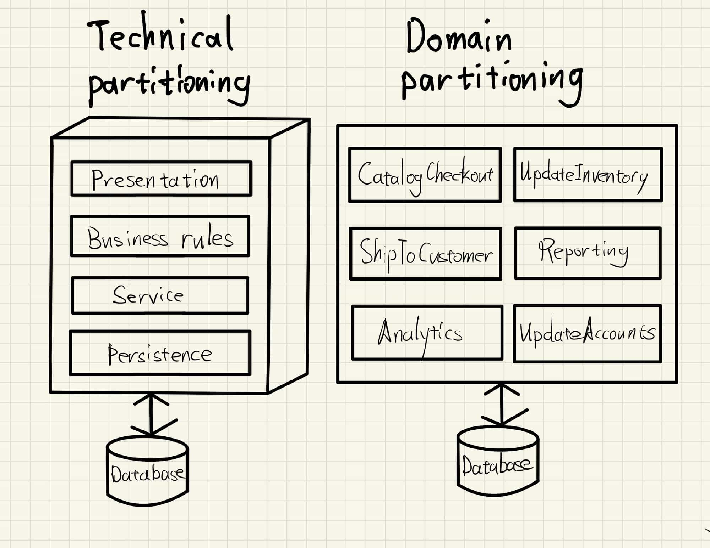

The architect has partitioned functionality of the system into _technical capabilities_:

- presentation
- bussiness rules
- service
- persistence
- …

_This way of organizing a code base certainly makes sense._
_All the persistence code resides in one layer in the architecture,_
_making it easy for developers to find persistence-realted code._

_Even though the basic concept of layer architecture predates ( 领先 ) it by decades,_
_the Model-View-Controller design pattern matches with this architectureal pattern.,_
_making it easy for develpers to understand._
_Thus, it is often the default architecture in many organizations._

_An interesting side effect of the predominance ( 优势, 卓越 ) of the layered architecture_
_relates to how companies seat different project roles._
_When using a layered architecture,_
_it makes some sense to have all the backed developers sit together in one department,_
_the DBAs in another, the presentation team in another, and so on._

Because of **Conway's law**, this make sense in those organizations.

##### Conway's Law

> Organizations which design systems … are constained to produce designs which are copied of the communications structures of these organizations.

Paraphrased ( 意译 ) , this law suggests that **when a group of people designs some technical artifact,**
**the communication structures between the people end up replicated in the design.**

_People at all levels of organizations see this law in action,_
_and they sometimes make decisions based on it._
_For example, it is common for organizations to partition workers based on technical capabilities,_
_which make sense from a pure organizational sense_
_but hamper ( 妨碍 ) collaboration because of artifical separation of common concerns._

##### Domain-Driven Design

In DDD, the architect identifies domians or workflows independent and decoupled from each other.

The microservice architecture style is based on this philosophy.
**In a modular monolith, the architect partitions the architecture around domains or workflows rather than technical capabilities.**

It has a huge impact on how an architect decideds how to initially identify components ——
does the architect want to partition things technically or by domain? …

Most realistic softwares software systems require workflows that cut across technical capabilities.

icehe: 一般情况下在实践层面, 不同的业务通常根据 "领域" (domain) 来划分边界和职责, 然后在 "领域" 内部再根据技术能力 "分层" (layered) 来进一步划分边界和职责.

### Developer Role

In general, class and function design is the shared responsibility of architects, tech leads, and developers,
with the lion's share going to developer roles.

_通常来说, 类和方法的设计职责由架构师、技术负责人和研发共同分担, 其中最大的份额归于研发角色_

**Developers should never take components designed by architects as the last word;**
**all software design benefits from iteration.**

_研发永远不要把架构师的组件设计当做最后的定论; 所有的软件设计都会从迭代中收益._

Rather, that **initial design should be viewed as a first draft,**
**where implementation will reveal more details and refinements.**

_最初的设计应该被视为第一版草稿, 然后它的具体实现会揭示更多细节, 从中发现可以改进的细节._

### Component Identification Flow

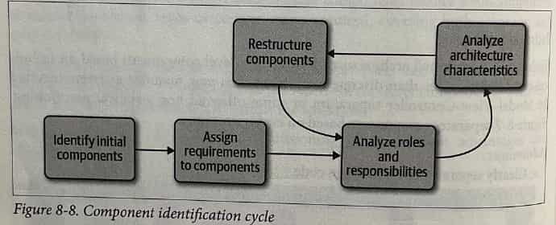

#### Identifying Initial Components

…

_icehe: 几乎不可能在一开始就设计好, 所以要不断迭代以改善最初的设计_

#### Assign Requirements to Components

_Once an architect has identified initial components,_
the next step aligns requirements (or user stories) to those components
to see how well they fit.

_This may entail ( 需要 ) createing new components, consolidating existing ones,_
_or breaking components apart because they have too much responsibility._

This mapping doesn't have to be exact —— the architect is attempting to
find a good coarse-grained substrate ( 粗粒度基底 )
to allow further design and refinement by architects, tech leads, and/or developers.

#### Analyze Roles and Responsibilities

<!-- _… Thinking about both the roles and behaviors the application must support allows the architect to align the components and domain granularity ( 粒度 ) ._ -->

…

#### Analyze Architecture Characteristics

…

#### Restructure Components

Feekback is critical in software design.
Thus, architects must continually iterate on their component design with developers.

**Designing software provides all kinds unexpected difficulties**
**—— no one can anticipate all unknown issues that usually occur during software projects.**
Thus, an iterative approach to component design is key.

First,
**it's virtually impossible to account for all the different discoveries and edge cases**
**that will arise that encourage redesign.**

Secondly,
**as the architecture and developers delve more deeply into building the application,**
**they gain a more nuanced understanding of where behavior and roles should lie.**

_( icehe : 很真实, 所以不要妄图在一个 Scrum 的开始时就能确认清楚 设计方案、最后期限和需求范围. )_

### Component Granularity

Finding the proper granularity for components is one of an architect's most difficult task.

**Too fine-grained _( 细粒度 )_ a component design leads to**
**too much communication between components to achieve results.**

**Too coarse-grained _( 粗粒度 )_ components encourage high internal coupling,**
**which leads to difficulties in deployability and testability,**
**as well as modularity-related negative side effects.**

### Component Design

No accepted "correct" way exists to design components. …

#### Discovering Components

_Architects, often in collaboration with other roles such as …,_
create an initial component design
based on gneral knowledge of the system and how they choose to decompose it,
based on technical or domain partitioning.

The team goal is an initial design that
partitions the problem space into coarse chunks that take into account
differeing architecture characteristics.

##### Entity Trap

While there is no one true way to ascertain _( 弄清; 确认 )_ components,
a common anti-pattern lurks _( 潜伏; 埋伏; 潜藏 )_ : the _entity trap_.  …

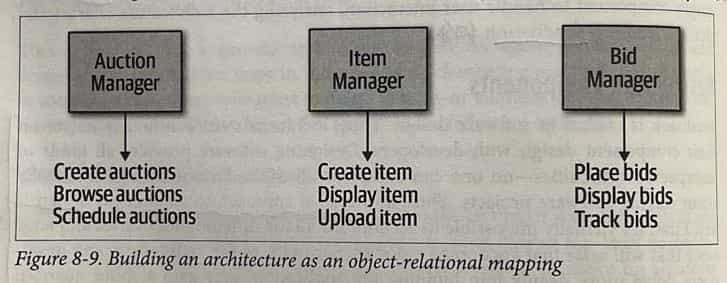

_The architect has basically taken entity identified in the requirements and_
_made a Manager component based on that entity._

**This isn't an architecture; it's a component-relational mapping of a framework to a database.**
**In other words, if a system only needs simple databased CRUD operations ( create, read, update, delete ) ,**
**then the architect can download a framework to create user interfaces directly from the database.**

The entity trap anti-pattern arises
when an architect incorrectly identifies the database relationships as workflows in the application,
_a correspondence that rarely manifests in the real world._

Rather, **this anti-pattern generally indicates lack of thought about the actual workflows of the application.**

##### Actor/Actions approach

_In this approach, originally defined by the Rational Unified Process,_
architects identify actors who perform activities with the application
and the actions those actors may perform.

_It provides a technique for discovering the typical users of the system_
_and what kinds of things they might do with the system._

This style of component decomposition works well for all types of systems, monolithic or distributed.

_( icehe : 其实就是 "用户/用例" 的分析和分解 )_

##### Event storming

_Event storming_ as a component discovery technique
comes from domain-driven design (DDD)
and shares popularity with microservices,
_also heavilly influenced by DDD._

In event storming the architect assumes **the project will use messages and/or events**
**to communicate between the various components.**

To that end, the team tries to determine which events occur in the system
based on requirements and identified roles,
and buildcomponents around those event and message handlers.

This works well in distributed architectures
like microservices that use events and messages,
because it helps architects define the messages used in the eventual system.

##### Workflow approach

An alternative to event storming offeres a more generic approach
for architects not using DDD or messaging.

_The workflow approach models the components around workflows,_
_much like event storming,_
_but without the explicit constraints of building a messages-based system._

_A workflow approach identifies the key roles,_
_determines the kinds of workflows these roles engage in,_
_and builds components around the identified activities._

### Case Study: Going, Going, Gone: Discovering Components

If a team has no special constraints
and is looking for a goo gneral-purpose component decomposition,
the Actor/Actions approach works well as a generic solution.

…

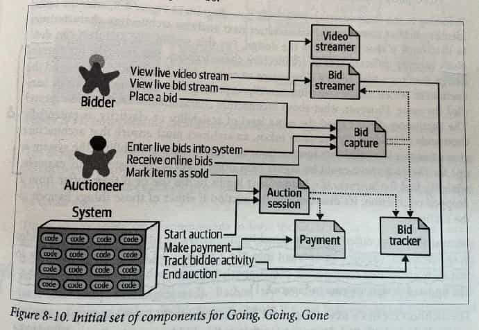

For example,
the currrent design features a Bid Capture components
to capture bids from both bidders and the auctioneer,
which makes sense functionallly:
capturing bids from anyone can be handled the same.

**However, what about architecture characteristics around bid capture?**
**The auctioneer doesn't need the same level of scalability or elasticity**
**as potential thousands of bidders.**

**By the same token, an architect must ensure that architecture characteristics like**
**reliability ( connection don't drop ) and**
**available ( the system is up )**
**for the auctioneer could be higher than other parts of the system.**

…

Because they have differing levels of architecture characteristics,
the architect decides to split the Bid Capture into Bid Capture and Auctioneer Capture
so that each of the two components can support differing architecture characteristics.

### Architecture Quantum Redux: Choosing Between Monolithic Versus Distributed Architectures

That in turn leads an architect toward an important decision
as the finish their initial component design:
**should the architecture be monolithic or distributed?**

A _monolithic_ architecture typically features a single deployable unit,
including all functionality of the system that runs in the process,
typically connected to a single database.

_Types of monolithic architecture include the layered and modular monolith._

A _distributed_ architecture is the opposite ——
the application consists of multiple services running in their own ecosystem,
communicating via networking protocols.

**Distributed architectures may feature finer-grained deployment models,**
where each service may have its own release cadence _( 节奏 )_ and engineering practices,
based on the development team and their priorities.

---

The fundamental decision rests on how many quanta
the architecture discovers during the design process.

If the system can manager with a single quantum
( in other words, one set of architecture characteristics ) ,
then a monolith architecture offers many advantages.

On the other hand, differing architecture characteristics for components,
requires a distributed architecture to accommodate differing architecture characteristics.

# Part 2. Architeure Styles

**Architecture Style**

- The **overarching _( 首要的 )_ structure of how the user interface and backend source code are orgainized**
    - ( such as within layers of a monolithic deployment or seqparately deployed )
- and **how that source code interacts with datastore**.

**Arcitecture Patterns**

- **Lower-level design structures that help form specific solutions within an architecture style**
    - ( such as how to achieve high scalability or high performance within a set of operations or between sets of services )

_Understanding architecture styles occupies much of the time and effort for new architects because they share importance and abundance._

Architects must understand the various styles
and the trade-offs encapsulated within each to make effective decisions;
each architecture style embodies a well-known set of trade-offs
that help an architect make the right choice for a particular business problem.

## C9. Fundations

_Architecture styles, sometimes called architecture patterns,_
_describe a named relationship of components_
_covering a variety of architecture characteristics._

**An architecture style name, similar to design patterns,**
**creates a single name that acts as shorthand between experienced architecture.**

_For example, when an architect talks about a layered monolith,_
_their target in the conversation understands aspects of structure,_
_which kinds of architecture characteristics work well_
_( and which ones can cause problems ) ,_
_typical deployment models, data strategies, and a host of other information._

**Each name captures a wealth of understood details,**
**one of the purposes of design patterns.**

### Fundamental Patterns

#### Big Ball of Mud

> A Big Ball of Mud is
> haphazardly _( 偶然地, 随意地, 无计划地 )_ structured,
> sparawling _( 蔓生的, 不规则地伸展的 )_ ,
> sloppy _( 邋遢的, 做事马虎的 )_ ,
> duct-tape-and-baling-wire _( 管道胶布和打包线 )_ ,
> spaghetti-code juggle _( 意大利面条代码 )_ .
>
> These systems show unmistakable _( 显而易见的, 不会弄错的 )_
> signs of unregulated _( 未受管理的 )_ growth,
> and repeated, expedient _( 权宜之计 )_ repair.
>
> Infomation is shared promiscuously _( 杂乱的 )_
> among distant elements of the system,
> often to the point where nearly all the important information
> becomes global or duplicated.
>
> The overall structure of the system may never have been well defined.
>
> If it was, it may have eroded _( 腐蚀 )_ beyond recognition.
> Programmers with a shred of _( 一丝 )_ architecture sensibility
> shun _( 避开 )_ these quagmires _( 沼泽 )_ .
>
> Only those who are unconcerned about architecture,
> and, perhaps, are comfortable with the inertia _( 惯性 )_ of day-to-day chore _( 讨厌或累人的工作 )_
> of patching the holes in these failing disks, are content to work on such systems.
>
> —— Brian Foote and Joseph Yoder

_In modern terms,_
_a big ball of mud might describe a simple scripting application_
_with event handlers wired directed to database calls,_
_with no internal structure._
_Many trivial ( 不重要的 ) applications start like this_
_then become unwieldy as they continue to grow_

_In general, architects want to avoid this type of architecture at all costs._
_The lack of structure makes change incresingly difficult._
_This type of architecture also suffers from problems in_
_deployment, testability, scalability, and performance._

_Unfortunately, this architecture anti-pattern occurs quite commonly in the real world._
Few architects intend to create one,
but many projects inadvertently _( 漫不经心地, 疏忽地 )_ manager to create a mess
because of lack of governance around code quality and structure.

#### Unitary Architecture

_When software originated, there was only the computer, and software ran on it._
Through the various eras of hardware and software evolution,
the two started as single entity,
then split as the need for more sophisticated capabilities grew.

……
As networking PCs became common,
distributed systems ( such as client/server ) appeared.

_Few unitary ( 单一的, 统一的 ) architectures exist outside embedded systems and other highly constrained environments._

**Generally, software systems tend to grow in functionality over time,**
**requiring separation of concerns to maintain operational architecture characteristics,**
**such as performance and scale.**

#### Client / Server

……

A fundamental style in architecture separates technical functionality between **frontend and backend**,
called _two-tier ( 两层 )_ , or _client / server_ , architecture.

##### Desktop + database server

……

##### Browser + web server

The separation of responsibilities was similar to the desktop variant
but with even thinner clients as browers,
_allowing a wider distribution both inside and outside firewalls._

……

##### Three-tier

…… a database tier using an industrial-strength database server,
an application tier managed by an application server,
frontend coded in generated HTML,
and increasingly, JavaScript, as its capabilities expanded.

……

##### Three-Tier, Language Design, and Long-Term Implications

……

**One of the common headaches with existing languages such as C++ was**
**how cumbersome it was to move objects over the networks**
**in a consistent way between systems.**

**Thus, the designers of Java decided to build this capability**
**into the core of the language using a mechanism called _serialization_.**

Every **Object** in Java implements an interface that requires it to support serialization.

The designers figured that
since three-tier architecture would forever be the architecture style,
baking it into the language would offer a great convenience.

……

_Understanding the long-term implications of design decisions has always eluded us,_
_in software, as in other engineering disciplines._

The perpetual advice to **favor simple designs is in many ways defense against future consequences.**

( 一个长久不变的建议是 **"倾向使用简单的设计", 它可以在很多方面上抵抗未来的不良影响.** )

#### Monolithic Versus Distributed Architectures

Monolithic

- Layered architecture _( Chapter 10 )_
- Pipeline architecture  _( Chapter 11 )_
- Microkernel architecture  _( Chapter 12 )_

Distributed

- Service-based architecture _( Chapter 13 )_
- Event-driven architecture _( Chapter 14 )_
- Space-based architecture _( Chapter 15 )_
- Service-oriented architecture _( Chapter 16 )_
- Microservices architecture _( Chapter 17 )_

The first group issues facing all distributed architecture are described in
[the fallacies of distributed computing](https://en.wikipedia.org/wiki/Fallacies_of_distributed_computing).

A fallacy is something that is believed or assumed to be true but is not.

##### Fallacy _( 谬误 )_ #1: The Network Is Reliable

……

##### Fallacy #2: Latency Is Zero

……

When a local call is made to another component via a method or function call,
that **time (t_local) is measured in nanoseconds or microseconds.**

However, when that same call is made through a remote access protocol
(such as REST, messaging, or RPC),
the **time measured to access that service (t_remote) is measured in milliseconds.**

……

When using any distributed architecture,
architects must know this latency average.

It is the only way of determininpercentileg
whether a distributed architecture is feasible,
particularly when considering microservices
due to the fine-grained nature of the services
and the amount of communication between those services.

Assuming an average of 100 milliseconds of latency per request,
chaining together 10 service calls to perform a particular business function
adds 1,000 miliseconds to the request!

**Knowing the average latency is important,**
**but event more important is also knowing the 95th to 99th percentile.**
**While an average latency might yield only 60 milliseconds (which is good),**
**the 95th percentile might be 400 milliseconds!**

It's usually this "long tail" latency that will kill performance in distributed architecture.

##### Fallacy #3: Bandwidth Is Infinite

Bandwidth is usually not a concern in monolithic architectures,
because once processing goes into a monolith,
little or no bandwidth is required to process that business request.

Once systems are broken apart into smaller deployment units (services)
in distributed architecture such microservices,
communication to and between these services significantly utilizes bandwidth,
causing networks to slow down, thus impacting latency (fallacy #2) and reliability (fallacy #1) .

……

**Stamp coupling** in distributed architectures consumes significant amounts of bandwidth.

> Stamp coupling _is a fairly low type of coupling._
> It is also known as **data-structure coupling**
> because it occurs when modules share a composite data structure.
>
> When a composite data structure is shared between two modules,
> some of the fields in the data structure may not even be used.
> For example, **a module passes a composite data structure to another module,**
> **which then just uses one field in it.**
>
> It is similar to **data coupling**,
> except that the data shared is a composite data type rather than primitive data values
> and that not all of the values shared may be used.
>
> ( from [Stamp coupling (data-structured coupling)](https://www.oreilly.com/library/view/software-architects-handbook/9781788624060/568555d1-7312-414d-bae1-2db148544ec0.xhtml) )

##### Fallacy #4: The Network Is Secure

……

##### Fallacy #5: The Topology Never Changes

This fallacy refers to the overall network tpology,
including all of the routers, hubs, switchers, firewalls, networks, and appliance _( 器具 )_
used within the overall network.

……

##### Fallacy #6: There Is Only One Administrator

……

##### Fallacy #7: Transport Cost Is Zero

**Transport cost here does not refer to latency,**
**but rather to actual cost in terms of money**
associated with making a "simple RESTful call".

Architects assume (incorrectly) that
the necessary infrastructure is in place
and sufficient for making a simple RESTful call
or breaking apart a monolithic application.
It is usually not.

Distributed architectures cost significant ly more than monolithic architectures,
primarily due to increased needs for additional hardware, servers, gateways, firewalls, new subnets, proxies, and so on.

##### Fallacy #8: The Network Is Homogeneous

Most architects and developers assume a network is hmogeneous
—— made up by only one network hardware vendor.
Most companies have multiple network hardware vendors in their infrastructure,
if not more _( 如果没有更多的话 )_ .

**The significance of this fallacy is that**
**not all of those heterogeneous hardware vendors ply together well.**

……

##### Other Distributed Considerations

###### Distributed Logging

Performing root-cause analysis to determine why a particular order was dropped
is very difficult and time-consuming in a distributed architecture
due to the distribution of application and system logs.

……

Logging consolidation tools such as Splunk
help to consolidate information
from various sources and systems together
into one consolidated log and console,
but these tools only scratch the surface of the complexities
involved with distributed logging.

_Detailed solutions and patterns for distributed logging_
_are outside the scope of this book._

###### Distributed Transactions

……

Standard **commits** and **rollbacks** executed from persistence frameworks
leverage ACID ( atomicity, consistency, isolation, durability )  transactions
to guarentee that the data is updated
in a correct way to ensure high data consistency and integrity.

**Distributed architectures rely on what is called _eventually consistency_**
**to ensure the data processed by separated deployment units**
**is at some specified point in time all synchronized into a consistent state.**
This is one of the trade-offs of distributed architecture:
high scalability, performance, and availability
at the sacrifice of data consistency and data integrity.

[Transactional sagas](https://microservices.io/patterns/data/saga.html) _( 必读 )_
are one way to manage distributed transactions.
**Sagas utilize either _event sourcing_ for compensation**
**or _finite state machine_ manage the state of transaction.**

In addition to sagas, **BASE transactions** are used.  BASE stands for

- **Basic Available**
- **Soft state**
- **Eventual consistency**.

**Soft state in BASE refers to the transit of data from a source to a target,**
**as well as the inconsistency between data sources.**
Based on the _basic availability_ of the systems
or services involved, the systems will _eventually_ become consistent
through the use of architecture patterns and messing.

###### Contract Maintenance and Versioning

Contract creation, maintenance, and versioning.

**A contract is behavior and data that is agreed upon by both the client and the service.**
**Contract maintenance is particularly difficult in distributed architectures,**
**primarily due to decoupled services and systems owned by different teams and departments.**
**Event more complex are the communication models needed for version deprecation.**

## C10. Layered Architecture Style

The layered architecture, also known as the _n-tier_ architecture style,
is one of most common architecture styles.

**Layered architecture is the de facto _( 实际存在的 )_ standard for most applications,**
**primarily because of its simplicity, familiarity, and low cost.**

**It is also a very natural way to develop applications due to**
**[Conway's law](https://en.wikipedia.org/wiki/Conway's_law),**
**which states that organizations that design systems are constrained to produce designs**
**which are copies of the communication structures of thes orgainzations.**

……

The layered architecture style also falls into several architecture anti-patterns,
including the _architecture by implication_ anti-pattern
and the _accidental architecture_ anti-pattern.

If a developer or architect is unsure which architecture style they are using,
or if an Agile development team "just starts coding",
chances are good that is the layered architecture style they are implementing.

### Topology

Components within the layered architecture style
are organized into logical horizontal layers,
with each layer performing a specific role within the application
( such as presentation logic or business logic ) .

Although there are no restrictions
in terms of the number and types of layers that must exist,
most layered architectures consist of four standard layers:
**presentation, business, persistence, and database.**

……

_separation of concerns_

……

The layered architecture is **technically partitioned architecture**
( as opposed to a domain-partitioned architecture ) .

……

### Layers of Isolation

Each layer in the layered architecture style can be either **closed** or **open**.

**A closed layer means that as a request moves top-down from layer to layer,**
**the request cannot skip any layers,**
**but rather must go through the layer immediately below it to get to the next layer.**

……

**The _layered of isolation_ concept means that**
**changes made in one layer of architecture**
**generally don't impact or affect components in other layers,**
providing the contracts between those layers remain unchanged.

Each layer is independent of the other layers,
thereby having little or no knowledge of the inner workings
of other layers in the architecture.

The layers of isolation concept also
allows any layer in the architecture to be replaced
without impacting any other layer
( again, assuming well-defined contracts and the use of the [business delegate pattern](https://en.wikipedia.org/wiki/Business_delegate_pattern) ) .

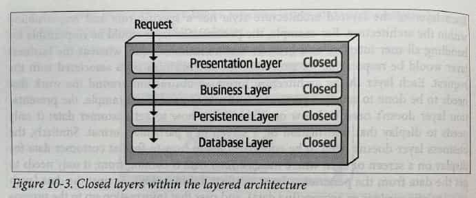

### Adding Layers

While **closed layers facilitate layers of isolation**
**and therefore help isolate change within the architecture**,
there are times when it makes sense for certain layers to be open.

For example,
suppose there are shared objects within the business layer
that contain common functionality for business components
( such date and string utility classes, auditing classes, logging classes and so on ) .

Suppose there is an architecture decision stating that
the presentation layer is restricted from using these shared business objects.
This scenario is difficult to govern and control
because architecturally the presentation layer has access to the bussiness layer,
and hence has access to the shared objects within that layer.

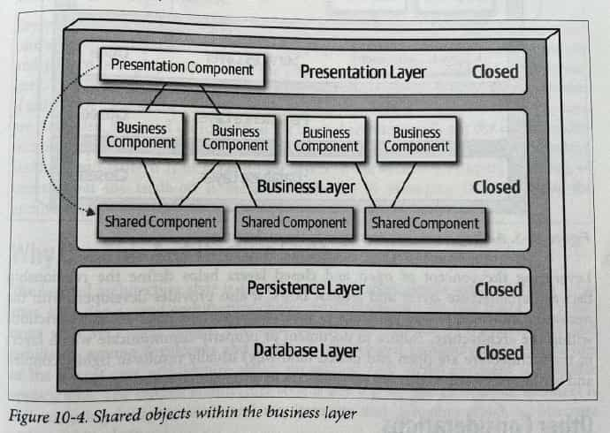

One way to architecturally mandate this restriction is
to **add the architecture a new services layer containing all the shared business objects.**
**Adding this new layer now architecturally**
**restricts the presentation layer from accessing the shared business objects**
**because the business layer is closed.**

However, the new services layer must be marked as _open_;
otherwise the business layer would be forced to
go through the services layer to access the persistence layer.

Marking the services layer as open allows the business layer to
either access that layer ( as indicated by the solid arrow ) ,
or bypass the layer and go to the next one down
( as indicated by the dotted arrow in the figure below ) .

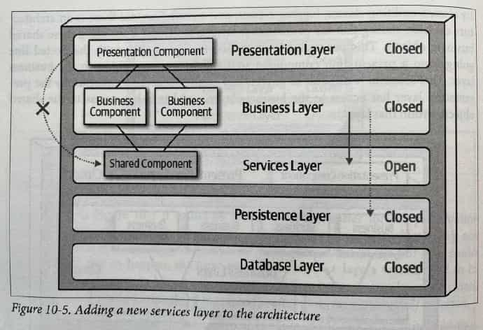

……

### Other Considerations

**The layered architecture makes for a good starting point for most applications**
**when it is not known yet exactly which architecture style will ultimately be used.**

This is a common practice for many microservices efforts
when architects are still determing
whether microservices is the right architecture choice,
but development must begin.

However, when using this technique, be sure to keep reuse at a minimum
and keep object hierarchies ( depth of inheritance tree ) fairly shallow
so as to maintain a good level of modularity.
_This will help facilitate the move to another architecture style later on._

One thing to watch out for with the layered architecture
is **architecture sinkhole** _( 污水坑 )_ anti-pattern.

This anti-pattern occurs when requests move from layer to layer
as simple pass-through processing with no business logic performed within each layer.
……

The key to determining whether the architecture sinkhole anti-pattern is at play
is to analyze the percentage of requests that fall into this category.
The 80-20 rule is usually a good practice to follow.

_For example, it is acceptable if only 20 percent of the requests are sinkholes._
_However, if 80 percent of the requests are sinkholes,_
_it a good indicator that the layered architecture_
_is not the correct architecture style for the problem domain._

### Why Use This Architecture Style

…… _( As mentioned above )_

### Architecture Characteristics Ratings

……

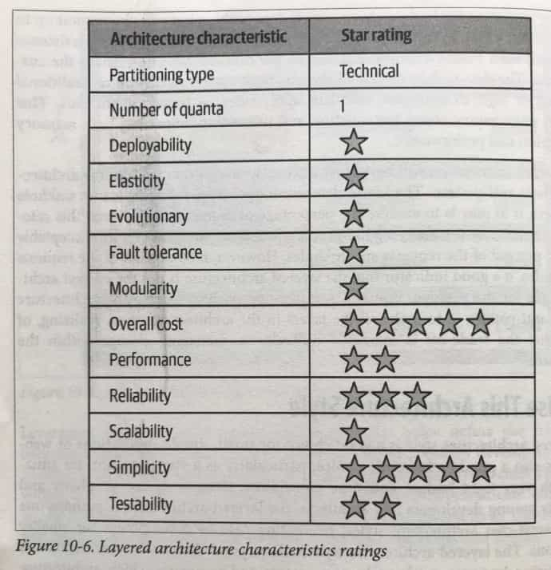

**Overall cost and simplicity are the primary strengths** of the layered architecture style.

**Being monolithic** in nature, layered architecture
**don't have the complexities associated with distributed architecture styles**,
**are simple and easy to understand, and are relatively low cost to build and maintain.**

However, as a cautionary note,
**these ratings start to quickly diminish**
**as monolithic layered architectures get bigger and consequently more complex.**

Both deployability and testability rate very low for this architecture style.
_( icehe : 第一反应 —— 测试和部署的评价这么低么? 看了后面的解释还是可以理解的. )_

**Low Deployability**

_Deployability rates low due to the cremony of deployment ( effort to deploy ) , high risk, and lack of frequent deployments._

_A simple three-line change to a class file in the layered architecture_
_requires the entire deployment unit to be redeployed,_
_taking in protential database changes, configuration changes,_
_or other coding changes sneaking in alongside the original change._

_Furthermore, this simple three-line change_
_is usually bundled with dozens of other changes,_
_thereby increasing deployment risk even further_
_( as well as increasing ther frequency of deployment ) ._

_( icehe: 说实话这段话, 现在还不是特别能理解 2021-08-18 )_

**Low Testability**

With a simple three-line change,
most developers are not going to spend hours
executing the entire regression test suite ( 回归测试套件 )
( even if such a thing were to exist in the first place ) ,
particularly along with dozons of other changes
being made to the monolithic application at the same time.
……

**Medium Reliability**

_Mostly due to the lack of network traffic, bandwidth, and latency found in most distributed architecture. …_

**Very Low Elasticity and Scalability**

_Primarily due to **monolithic deployments** and the **lack of architecture modularity**_

## C11. Pipeline Architecture Style

One the fundamental styles in software architecture that appears again and again
is the _pipeline_ architecture ( aka. the _pipes and filters_ architecture ) .

_As soon as developers and architects decided to split functionality into discrete parts, this pattern followed._
_Most developers know this architecture as this underlying principle_
_behind Unix terminal shell languages, such as Bash and Zsh._

_Developers in many functional programming languages will see parallels_
_between language constructs and elements of this architecture._

### Topology

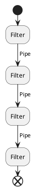

_The pipes and filters coordinate in specific fasion,_
_with pipes forming one-way communication between filters,_
_usually in a point-to-point fashion._

#### Pipes

**_Pipes_ in this architecture form the communication channel between filters.**

Each pipe is typically unidirectional ( 单向的 ) and point-to-point
( rather than broadcast ) for performance reasons,
accepting input from one source and always directing output to another.

The payload carried on the pipes may be any data format,
but architects favor smaller amounts of data to enable high performance.

#### Filters

**_Filters_ are self-contained, independent from other filters, generally stateless.**
**Filters should perform one task only.**
**Composite tasks should be handled by a sequence of filters rather than single one.**

Four types of filters exist within this architecture style:

-   **Producer**

    The starting point of a process,
    outbound _( 开往外地/外国的 )_ only,
    sometimes called the **source**.

-   **Transformer**

    Accepts input,
    optionally performs a transformation on some or all of the data,
    then forwards it to the outbound pipe.

    Functional advocates will recognize this feature as **map**.

-   **Tester**

    Accepts input, tests one or more criteria,
    then optionally produces output, based on the test.

    Functional programmers will recognize this as similar to **reduce**.

    _( icehe : 我竟然还以为这应该对应 Java Stream API 里的 filter , 其实应该是 reduce … )_

-   **Comsumer**

    The termination point for pipeline flow.

    Consumers sometimes persist the final result of the pipeline process to a database,
    _or they may display the final results on a user interface screen._

**The unidirectional nature and simplicity of each of the pipes and filters**
**encourages compositional resuse.**

### Example

The pipeline architecture pattern appears in a variety of applications,
especially tasks that **facilitate simple, one-way processing**.

**ETL tools ( extract, transform, and load )**
leverage the pipeline architecture as well for the flow and modification of data
from one database or datasource to another.

_Orchestrators and mediators such as Apache Camel_
_utilize the pipeline architecture to pass information_
_from one step in a bussiness process to another._

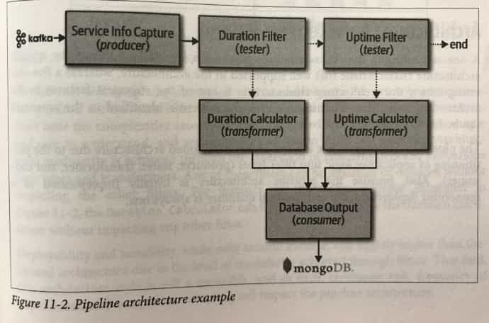

……

### Architecture Characteristics Ratings

……

**The pipeline architecture style is technically partitioned architecture**
**due to the partitioning of application logic into filters**
( producer, tester, transformer, and consumer ) .

Aslo, because the pipeline architecture
is **usually implemented as a monolithic deployment**,
the architectural quantum is always one.

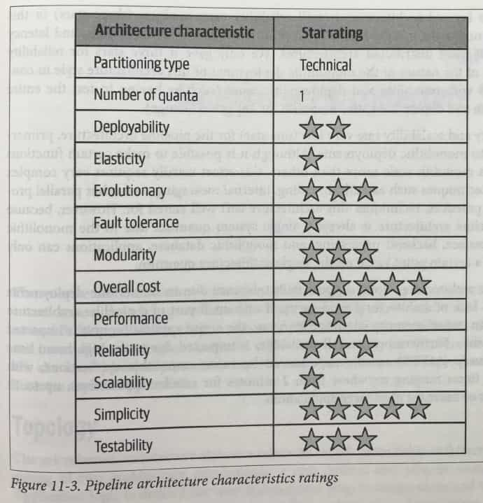

**Best Overall Cost and Simplicity**

_Overall cost and simplicity combined with modularity are the primary strengths of the pipeline architecture style._

**Medium Architecture modularity**

_Architecture modularity is achived through the separation of concerns_
_between the various filter types and transformers._
_Any of these filters can be modified or replace without impacting the other filters._

**Medium Deployability and Testability**

……

**Low Elasticity and Scalability**

Primarily due to monolithic deployments.

**Low Available**

Pipeline architecture **don't support fault tolerance**
due to monolithic deployments and lack of **architectural modularity**.

_If one small part of a pipeline architecture causes an out-of-memory condition to occur,_
_the entire application unit is impacted and crashes._

Furthermore, overall availability is impacted
due to the high **mean time to recovery ( MTTR )**
_usually experienced by most monolithic applications,_
_with startup times ranging anywhere from 2 minutes for smaller applications,_
_up to 15 minutes or more for most large applications._

## C12. Microkernel Architecture Style

**The _micorkernel_ architecture style**
**( also referred to as the _plug-in_ architecture )**
was coined ( 铸造, 创造 ) serveral decades ago
and is still widely used today.

It is a natural fit for product-based applications
( packaged and made available for download and installation
as a single, monolithic deployment,
typically installed on the customer's site as a third-party product )
but is widely used in many nonproduct custom business applications as well.

### Topology

The microkernel architecture style is relatively simple monolithic architecture
**consisting of two architecture components: a core system and plug-in components.**

Application logic is divided
between **independent plugin-in components and the basic core system**,
**providing extensibility, adaptability,**
**and isolation of application features**
**and custom processing logic.**

#### Core System

The _core system_ is formally defined as **the minimal functionality required to run the system.**

_The Eclipse IDE is a good example of this._

……

Depending on the size and complexity,
the core system can be implemented as a layered architecture or a modular monolith.

In some cases, the core system can be split into separately deployed domain services,
with each domain service containing specific plug-in components specific to that domain.

_For example, suppose Payment Processing is the domain service representing the core system._
_Each payment method ( credit card, PayPal, store credit, gift card, and purchase order )_
_would be separate plug-in components specific to the payment domain._

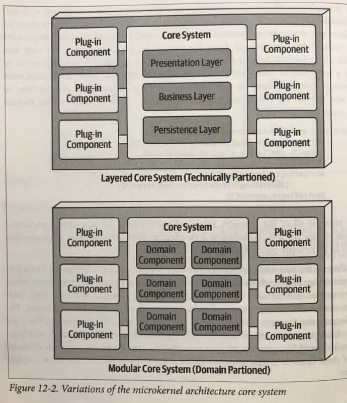

#### Plug-In Components

**Plug-in components are standalone, independent components**
**that contain specialized processing, additional features,**
**and custom code meant to enhance or extend the core system.**

Additionally, they can used to **isolate highly volatile code**,
creating better maintainablity and testability within the application.
Ideally, **plug-in components should be independent of each other**
**and have no dependentcies between them.**

The communication between the plug-in components and the core system
is generally point-to-point,
meaning the **"pipe" that connects the plugin-in to the core system**
**is usually a method invocation or function call**
**to the entry-point class of the plug-in component.**

In addition,
**the plug-in components can be added or removed at runtime**
**without having to redeploy the core system or other plug-ins**,
and they are **usually managed through frameworks**
_such as OpenService Gateway Initiative ( OSGi ) for Java_, ……

Point-to-point plug-in components can be implemented as shared libraries
_( such as a JAR, DLL, or GEM ) , package anmes in java, or namespaces in C#._

……

Plug-in components do not always have to
be point-to-point communication with the core system.

Other alternatives exist,
**including using REST or messageing**
**as a means to invoke plug-in functionality,**
**with each plug-in being a standalone service**
**( or maybe even a microservice implemented using a container ) .**

_Although this may soud like a good way to increase overall scalability,_
_note that this topology is still only a single architecture quantum_
_due to the monolithic core system._
_Every request must first go through the core system_
_to get to the plug-in service._

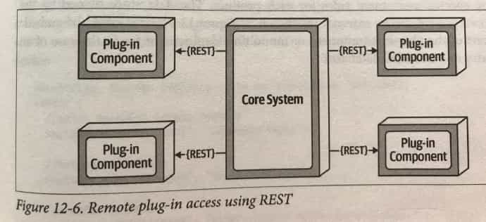

**The benefits of the remote access approach**
**to accessing plug-in components implemented as individual services**
**is that it provides better overall component decoupling,**
**allows for better scalability and throughput,**
**and allows for runtime changes without any special frameworks**
_like OSGi, Jigsaw, or Prism._

It also allows for asynchronous communications to plug-ins,
which, depending on the scenario,
could significantly improve overall user responsiveness.

_Using the electronics recycling example,_
_**rather than having to wait for the electronic device assessment to run,**_
_the core system, could **make an asynchronous request** to kick off ( 开始 )_
_an assessment for a paticular device._

_When the assessment completes,_
_the plug-in can **notify the core system**_
_**through another asynchrounous messaging channel**,_
_which in turn would notify the user that the assessment is complete._

With these benefits comes trade-offs. ……

_( icehe : 省略的这段内容有参考性, 但价值不是特别大, 是老生常谈、经验之谈、常识, 没必要特意做笔记了 )_

### Registry

**The core system needs to know about**
**which plug-in modules are available**
**and how to get to them.**

One common way of implementing this is through a **plug-in registry**.
This registry **contains information about each plug-in module,**
**including** things like its **name, data contract, and remote access protocol details**
_( depending on how the plug-in is connected to the core system ) ._

The registry can be as simple as an internal map structure
owned by the core system containing a key and the plug-in component reference,
or it can be as complex as a registry and disconvery tool
either embedded within the core system or deployed externally
( such as Apache ZooKeeper or Consul ) .

### Contracts

**The contracts between the plug-in components and the core system**
**are usually standard across a domain of plug-in components**
**and include behavior, input data, and output data returned from the plug-in component.**

Custom contracts are typically found in situations
where plug-in components are developed by a third party
where you have no control over the contract used by the plug-in.

In such cases, it is common to create an adapter
between the plug-in contract and your standard contract
so that the core system doesn't need specialized code for each plug-in.

_Plug-in contracts can be implemented in XML, JSON,_
_or even objects passed back and forth_
_between the plug-in and the core system_

### Examples of Use Cases

……

### Architecture Characteristics Ratings

Similar to the layered architecture style,
**simplicity and overall cost are the main strengths**
of the microkernel architecture style,
and **scalability, fault tolerance, and extensibility its main weakness**.

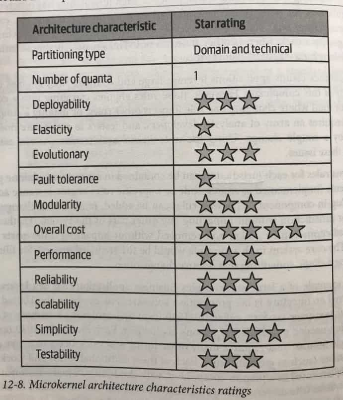

_Like the layered architecture style,_
the number of quanta is always singular (one)
because all requests must go through the core system
to get to independent plug-in components.

The microkernel architecture style is unique
in that it is the only architecture style
that can be **both domain partitioned and technically partitioned**.
……

**Testability, deployability, and reliability rate a little above average**,
primary because functionality can be isolated to independent plug-in components.

If done right, this reduces the overall testing scope of changes
and also reduces overall risk of deployment,
particularly if plug-in components are deployed in a runtime fashion.

**Modularity and extensibility also rate a little above average**.

…… additional functionality can be added, removed, and changed
through independent, self-contained plug-in components,
thereby making it relatively easy to extend and enhance applications created
using this architecture style and allowing teams to respond to changes much faster.

## C13. Service-Based Architecture Style

### Topology

### Topology Variants

### Service Design and Granularity

### Database Partitioning

### Example Architecture

### Architecture Characteristics Ratings

### When to Use This Architecture Style

## C14. Event-Driven Architecture Style

### Topology

### Broker Topology

### Mediator Topology

### Asynchronous Capabilities

### Error Handling

### Prevent Data Loss

### Broadcast Capabilities

### Request-Reply

### Choosing Between Request-Reply and Event-Based

### Hybrid Event-Driven Architectures

### Architecture Characteristics Ratings

## C15. Space-Based Architecture Style

### General Topology

#### Processing Unit

#### Virtualized Middleware

#### Data Pumps _( 泵 )_

#### Data Writers

#### Data Readers

### Data Collisions

### Cloud Versus On-Premises _( 内部部署 )_ Implementations

### Replicated Versus Distributed Caching

### Near-Cahce Consideratio

### Implementation Examples

#### Correct Ticketing System

#### Online Auction System

### Architecture Characteristics Ratings

## C16. Orchestration-Driven Service-Oriented Architecture

### History and Philosophy

### Topology

### Taxonomy

#### Business Services

#### Enterprise Services

#### Application Services

#### Infrastructure Services

#### Orchestration Services

#### Message Flow

### Reuse … and Coupling

### Architecture Characteristics Ratings

## C17. Microservices Architecture

### History

### Topology

### Distributed

### Bounded Context

#### Granularity

#### Data Isolation

### API Layer

### Operational Reuse

### Frontends _( 前端的 )_

### Communication

#### Choreography _( 舞蹈舞蹈设计 )_ and Orchestration

#### Transactions and Sages _( 圣人, 智者 )_

### Architecture Characteristics Ratings

### Additional References

## C18. Choosing the Appropriate Architecture Style

### Shifting "Fashion" in Architecture

### Decision Criteria _( 标准, 条件 )_

### Monolith Case Study: Silicon Sandwiches

#### Modular Monolith

#### Microkernel

### Distributed Case Study: Going, Going, Gone

# Part 3. Techniques and Soft Skills

## C19. Architecture Decisions

### Architecture Decision **Anti-Patterns**

#### Governing Your Assets Anti-Pattern

#### Groundhog Day _( 土拨鼠日 )_ Anti-Pattern

#### Email-Driven Architecture Anti-Pattern

### Architecturally Significant

### Architecture Decision Records

#### Basic Structure

#### Storing ADRs

#### ADRs as Documentation

#### Using ADRs for Standards

#### Example

## C20. Analyzing Architecture Risk

### Risk Matrix

### Risk Assessments _( 估价 )_

### Risk Storming

#### Identification

#### Consensus

### Agile Story Risk Analysis

### Risk Storming Examples

#### Availability

#### Elasticity _( 弹性 )_

#### Security

## C21. Diagramming and Presenting Architecture

### Diagramming

#### Tools

#### Diagramming Standards: UML, C4, and ArchiMate

#### Diagram Guidelines

### Presenting

#### Manipulating Time

#### Incremental Builds

#### Infodecks Versus Presentations

#### Slides Are Half of the Story

#### Invisibility

## C22. Making Teams Effective

### Team Boundaries

### Architect Personalities

#### Control Freak _( 怪物; 反常的事 )_

#### Armchair _( 扶手椅 )_ Architect

#### Effective Architect

### How Much Control?

### Team Warning Signs

### Leveraging Checklists

#### Developer Code Completion Checklist

#### Unit and Functional Testing Checklist

#### Software Release Checklist

### Providing Guidance

### Summary

## C23. Negotiation and Leadership Skills

### Negotiation and Facilitation _( 助长, 简易化 )_

#### Negotiating with Business Stakeholders

#### Negotiating with Other Architects

#### Negotiating with Developers

### The Software Architect as a Leader

#### The 4 C's of Architecture

#### Be Pragmatic, Yet Visionary _( 有眼光的, 有远见的 )_

#### Leading Teams By Example

### Integrating with the Development Team

### Summary

## C24. Developing a Career Path

### The 20-Minute Rule

### Developing a Personal Radar

#### The ThoughtWorks Technology Radar

#### Open Source Visualization Bits

### Using Social Media

### Parting Words of Advice

# Appendix. Self-Assessment Questions

# Index
