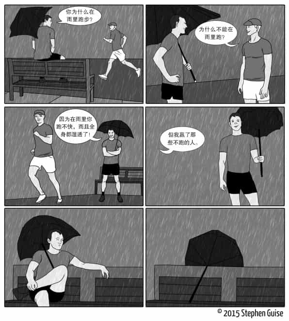

# How to Be an Imperfectionist

The New Way to Self-Acceptance, Fearless Living, and Freedom from Perfectionism

---

Reference

- [Douban.com - How to Be an Imperfectionist: The New Way to Self-Acceptance, Fearless Living, and Freedom from Perfectionism](https://book.douban.com/subject/35390276)

---

## Table of Contents

第1章 导言

- 实用完美主义者
- “我可真是个完美主义者”
- 完美主义是什么
- 完美主义相关研究

第2章 完美主义者的思维方式

- 三种完美主义标准
- 完美主义的根源
- 完美主义的“好处”
- 完美主义是驱策还是束缚了你

第3章 完美主义的毒性

- 完美主义是剂毒药
- 完美主义百害而无一利吗
- 被动生活:电视和完美主义
- 完美主义会影响发挥
- 自我设限导致我们畏缩不前
- 完美主义习惯:完美才合格
- 如何改变

第4章 不完美主义带来的自由

- 不受限制
- 亲和力与信任度
- 追求不完美主义的过程
- 如何做一个不完美主义者

第5章 过高期待

- 情绪与期待
- 知足常乐
- 降低行动标准
- 关注过程，看淡结果

第6章 纠结不放

- 纠结者的错误认识
- 从接受现实到采取行动
- 分清意外与失败
- “应该”式自我对话
- 活在当下
- 应对纠结的技巧小结

第7章 认同需求

- 人类为何会有认同寻求
- 成为不完美主义者会令你信心大增
- 许可与尷尬
- 叛逆练习

第8章 过失担忧

- 一场不够 完美的比赛
- 对犯错的担心造成的影响
- 冒牌者综合征
- 二进制思维
- 通过简单化来消除阻力
- 视进步为成功

第9章 行动顾虑

- 拒绝预设，重在体验
- 完美主义与拖延症的关联
- 完美决策者的痛苦经历
- 快速决策
- 信息越多，问题越多
- 数量重于质量

第10章 应用指南

- 是结束，也是开始
- 放弃对最佳路径的幻想
- 策略总结
- 整体上的完美主义(2种对策)
- 过高期待(4种对策)
- 纠结不放(5种对策)
- 认同需求(4种对策)
- 过失担忧(4种对策)
- 行动顾虑(3种对策)
- 应用说明
- 专项微习惯
- 尾声之末

## 第1章 导言

### 实用完美主义者

完美主义者往往会因为理想与现实间的巨大差距而精神崩溃或不知所措，
这种差距彻底摧毁了他们不断进步、享受生活的能力。
只有不完美主义者才能忍受生活中的不完美，而不完美才是我们这个世界的本质。

_(Kindle Locations 204-207)_

### “我可真是个完美主义者”

“我可真是个完美主义者” —— 也许我们都说过或听过别人说过这样的话。
你是否察觉到，说这句话时，虽然当事人是在承认缺点，却总暗暗带有一种骄傲？
说这话时，当事人总是会笑起来。人们普遍认为完美主义是一个积极的缺点，
所以每当在面试中遇到“你最大的缺点是什么”这个无聊问题时，“完美主义”就成了最受青睐的答案。
完美主义者渴望永远做到完美，无论是在行为处事、外在形象还是内心情绪上。
表面上看，这似乎的确值得骄傲，但仔细挖掘其真实含义后，你就会发现事实并非如此。
一旦将“主义”加在“完美”或“不完美”后面，将其概念化，衍生出的新词就彻底颠覆了原词的本来含义。
完美主义不再完美，而意味着缺乏理性、极具杀伤力和局限性，甚至会致命（如导致厌食症、精神抑郁或自杀）。

_(Kindle Locations 211-218)_

**如果你不能重新定义完美主义，无法认清它是一种有杀伤力的消极心态，那么你对其优越感的错觉必将阻碍你做出任何形式的积极改变。**
_(Kindle Locations 223-224)_

### 完美主义是什么

…… 提出了“弗罗斯特多维完美主义量表”（FrostMultidimensionalPerfectionismScale，FMPS）。
以下是弗罗斯特定义的完美主义的6个表现形式及其常用缩写。

- 过失担忧（CM）
- 个人标准（PS）
- 来自父母的预期（PE）
- 来自父母的批评（PC）
- 行动顾虑（DA）
- 整洁有序（OR）

_(Kindle Locations 240-247)_

…… 按照完美主义的来源可将其分成几个大类。

- 自我导向：衡量自身的不切实际的标准及完美主义的动力
- 他人导向：衡量他人的不切实际的标准和完美主义的动力
- 社会导向：认为他人期待自己做到完美

_(Kindle Locations 251-255)_

如果把上述两个表格结合起来又会如何呢？……
它包含以下8个表现形式表，可分为两个大类。

- 内心自觉的完美主义
    - 整洁有序
    - 追求卓越
    - 计划周密
    - 对他人要求过高
- 自我评价的完美主义
    - 过失担忧
    - 认同需求
    - 父母压力
    - 纠结不放

_(Kindle Locations 256-266)_

根据这些概念的核心程度及其解决难度，我对其进行了分析与梳理，
最终确定了其中最为重要的五个表现形式。
我们如果想批判完美主义，可以从以下五方面入手
（根据它们在本书中出现的顺序排列，括号中标注的是其来源）：

- **过高期待**（我新增的内容）
- **纠结不放**（希尔）
- **认同需求**（希尔）
- **过失担忧**（弗罗斯特）
- **行动顾虑**（弗罗斯特）

我们暂且不谈完美主义的“优点”，比如追求卓越、整洁有序，
因为这些本就不属于问题，也就不需要我们想办法去解决。

_(Kindle Locations 273-281)_

## 第2章 完美主义者的思维方式

### 三种完美主义标准

**完美主义标准一般有三种：情境、品质与数量。**

_(Kindle Location 294)_

#### 完美情境

如果过于追求情境的完美，当事人就会丧失在很多情境下行动的机会。
让我们以锻炼为例，将所谓情境标准进一步细化。

1.  地点：

    我们所处的地点对我们的行动必然有着巨大影响。
    话虽如此，**一个人只要下定决心，即便是在教堂里、派对中或是长途驾驶的路上也会找到运动的办法。**
    这些都是我们从来不会想到的潜在运动的场所。在这些地方完成锻炼其实并非难事。

    比方说，在车里你可以把手臂放到身体两侧，将身体支撑起来；
    也可以保持收腹，锻炼腹部肌肉；你还可以保持坐姿，提起膝盖反复靠近胸部。
    如果你愿意解开安全带（不推荐），你还会有更多运动选择！
    我和家人在长途旅行间隙就常常在休息区用开合跳的方式做运动。

2.  时段：

    你是否只愿意在下午4点前做运动？如果是这样，如果你是个朝九晚五的上班族，
    除非你愿意在上班前或上班过程中做运动，不然你真没有太多可用于健身的时段了。

    **虽然我觉得晚上9点运动并非理想的选择，但每次这样做都不会让我后悔，**
    **因为晚上9点虽非运动的最佳时段，但总好过于一天没运动。**

3.  资源：

    **有些人也会因为缺少某些东西而拒绝行动。你是否只愿意身着运动服饰在健身房运动？**
    **事实上，你只要不是个完美主义者，唯一需要的健身器械就是你自己的身体。**

_(Kindle Locations 296-300)_

#### 完美质量

这类完美主义可谓无人不知，无人不晓。
具有这种完美主义特点的人对完美质量的永恒追求接近病态。
这类完美主义最常见于工作场合，但家庭生活中也并不少见 ——
比如，有些人无法容忍家里没达到一尘不染，或子女的成绩不够优秀。

_(Kindle Locations 309-311)_

#### 完美数量

对数量追求完美，指的是那种只要数量达不到预期就无法心满意足的状态。
如果你问我有多少人因为完美主义而痛苦，我认为世界上95%的人会遇到这个问题，而背后的主要原因就是他们在意数量的完美。

人们似乎更在乎品质的完美：要有完美的发型，要维护完美的人际关系，要保持办公桌的一尘不染，等等。
但是，追求数量的完美主义思维比追求品质或情境的更具杀伤力，因为人们普遍对其接受度很高，所以往往对其视而不见 —— 毕竟，每个人都希望拥有可观的成就。
目标的大小其实是判定完美主义的重要指标，然而很多人没能意识到这一点，这种完美主义并未得到足够的重视。

**几乎每个人都在不知不觉中效仿着身边人的目标，并在这个过程中变成了完美主义者。**
**每个“正常”目标从数量角度看都具有完美主义色彩，而且几乎每个人都设定过类似的目标：比如六个月内减掉15千克体重，一年内写完一本书，每年赚到六位数，每周读完一本书，等等。**
**这些目标并非无法完成，但它们之所以被视作完美主义，是因为这种目标似乎暗示了不如预期的进步是不够好的。**
**过去，我曾经是个完美主义者，认为每次运动必须保证至少20（最好30）分钟，如果时间不够，那次运动就不够理想。**

**这样的目标就像撑竿跳：只要跳不过就算失败，只要跳过了就是成功。**
**你跳到多高并不重要，你能不能跳过成了唯一的标准。**
**这种将目标做两极化处理的观点本应激励我们朝着目标的方向努力，甚至超越目标，事实上却成了非常低级的策略，只会加剧完美主义的问题。**

你可曾听过有人吹嘘自己能做三个俯卧撑？
为什么不会有人建网站宣称可以帮助人们成功减少30%的债务？
同样，又有哪些流行的健身计划会承诺将你的身材从差提升到中等偏下？

虽然上述进步都是有意义的，但你在一生之中似乎很少会遇见它们。
**我们总是把部分成功定义成失败，这大错特错。**
**如果成功不够完美，我们就会感到尴尬，甚至还会觉得丢脸。**
**这种想法不仅缺乏理智，而且还会对我们的进步和人生幸福造成致命伤害。**
**完美主义者无法接受微小的价值或进步；他们只看重宏大、顺利、完美的成功。**

成败标准分明的宏大目标比比皆是。
**因为完美主义过于极端，所以任何过于“正常”的事物都不可能成为完美主义。**
**这也就是说，极端与否已经成了衡量完美主义的标准。**

_(Kindle Locations 313-316)_

### 完美主义的根源

#### 缺乏安全感

**你如果对什么事情缺乏安全感，就想想这世上与你有同样问题的人那么多，他们中很多都活得非常自信、幸福。这样一来，你的内心就会充满力量，感到安慰。**

_(Kindle Locations 353-354)_

_( icehe: 对啊, 有的人比我弱鸡 (不必提厉害的亲友) , 但却比我过得好, 那为何我自己不值得过得更好呢? )_

#### 自卑情结

总的来讲，有自卑情结的人通常会有两种反应 —— 他们要么会努力表现得超乎常人（有人名副其实，有人做做样子），要么选择自我封闭。
这两种反应都是对错误想法做出的可以理解的反应。
**如果你真心觉得自己不如他人，那么表现得像遇到危险的河豚（攻击他人）或海龟（缩头躲藏）也就没什么难以理解的了。**
**你越看不起自己，就越可能找机会补偿。**
**如果你属于攻击性强的外向型人格，自卑情结会让你做出河豚式的反应；**
**如果你属于消极、害羞的内向型人格，你就会采取海龟式的反应。**

_(Kindle Locations 358-363)_

**你之所以感觉自己比任何人都差，是因为你对自己和他人做出了不公正的评价：**
**在你眼里，要么其他人都是毫无缺点的完人（哈哈！），要么你自己连一般水平都比不上，要么是两种心态的混合。**
**如果你过高地估计他人，那你只有做到完美才能与他人媲美；如果你觉得自己不如他人，你也只有通过追求完美才能成为自己眼中的“普通人”。**
**不管是哪种情况，背后的道理如出一辙：自卑情结源于不公正的评价标准和对人性的不正确认识，正是这种心理导致你成为一个完美主义者。**

_(Kindle Locations 369-373)_

_( icehe: 本质来说, 觉得自己属于消极、内向的人格. 虽然自己也健谈, 但是社交聊天还是在消耗我的能量, 需要独处来才能恢复. )_

#### 对现状不满

如果你对自己的生活不满，那你成为完美主义者的可能性就会直线飙升。
不是所有完美主义者都不喜欢自己的生活，但那些对现状不满的人确实更容易成为完美主义者。
这虽然与我们的直觉相悖，却是不争的事实：如果你对当下的生活不满，就很容易假装或坚称它很好。
不满现状的人最容易营造出一副满足的假象。

**面对现实，正视缺点，接受不完美的现状 —— 做到这些并非易事，有些人一辈子也无法掌握要领。**
现在我要问一个有趣的问题：有些人没有足够的能力容忍自身的缺陷，其过错究竟在谁呢？
有研究发现，父母的教育方式与孩子能否成为完美主义者之间有着密不可分的关系。
然而，虽然最初让孩子接触完美主义的是父母对孩子的苛求，但我认为不应把所有责任都归咎于父母，学校教育也有不可推卸的责任。

_(Kindle Locations 375-382)_

#### 学校教育的消极影响

学校用分数来衡量学生的学业，本质上说，这个办法没什么不好，但问题是，不少学校把焦点都放在了提高分数上，希望学生都能考出A。
虽然C代表的才是平均水平，但许多学生和家长只会接受A，A以下的任何分数都会让他们失望。
这听上去毫不陌生吧？多数人制定目标的过程都是如此。
学校之所以会采用分数制度，学生之所以会制定完美目标，都是因为大家有一种错觉，以为想得到理想的结果，就该设定理想的目标（比如考出A或减重25千克等）。

另外，**学校教育我们，只要付出最大程度的努力，就会取得优异的成绩；**
**然而，人生告诉我们，最大程度的努力只是让取得优异成绩成为可能而已。**
**学生们走出校门，步入人才市场，即便不犯任何错误，也仍然会因为没能成功求职而在现实的考场上失利。**
学校正是滋养完美主义思维的温床。

_(Kindle Locations 384-391)_

_( icehe: 当年读书也很惧怕考试, 考试很少有超水平发挥的, 大多数情况都不尽如人意… )_

### 完美主义的“好处”

**完美主义是一台制造借口的机器，只要建立了完美的标准，实现与否似乎就变得不再重要。**
**你还可以用这些标准来应对内心深处的恐惧和迟疑。**
**如果我觉得自己不擅长写作，我就可以在这方面树立一个高不可攀的标准，从而让自己彻底打消尝试写作的想法 ——**
**比方说，我希望自己所写文章的初稿就能像海明威一样练达，像莎士比亚一样睿智，这样的目标只会导致我完全不想动笔，一个字也不愿意写！**

完美主义者喜欢远离恐惧的事物时获得的所谓安全感，这种完全不用付出努力追求卓越的心态也就成了人们成为完美主义者最主要的原因。
想想我们什么时候最追求完美，你就能明白其中的道理。
你是否注意到，风险（和恐惧）越大，人们就越容易表现出完美主义的症状？

**对大多数人来说，比起受到赞美，他们更希望能避免难堪。**
**作家与研究者布蕾妮·布朗（BrenéBrown）说过，完美主义是一副重达20吨的盾，我们无论走到哪里都举着它，希望能保护自己免受伤害。**
**“而事实上，” 她说，“它的唯一作用就是让别人看不到我们。”**
**如果没人能看到你，你就再也不会感到尴尬了。**
**但是，有任何人愿意一辈子都无法被人看到吗？其实，被人关注以及偶尔的难堪是都人生不可或缺的部分。**

_(Kindle Locations 395-398)_

_( icehe: 过于真实. 但比起在小团队弱团队里当 "扛把子", 也不如在大团队强团队里当 "傻逼". 成长速度完全不一样. )_

#### 关于强大的错觉

**对强大的渴望和对无能的担心，这两种想法都会令人感到巨大压力，而完美主义似乎是解决这两个问题的唯一办法。**
**你可以在假想自己强大的同时保护自己不陷入任何难堪境地。**
**在这种情况下，毫无作为似乎更能证明你的巨大潜力，因为对完美的渴望已经（在用光所有借口后）暗示你具备最终实现目标的能力。**
**然而事实上，毫无作为只会埋没你的潜力，无论是对他人来说还是在你自己眼中。**

**如果说完美主义是一座冰山，海面上露出的那个尖顶就是对完美的渴望，而海面下那占据了冰山90%的主体则是对失败的恐惧。**
虽然我们不愿将后者示人，但它确实在左右我们的行为。

**让我们感到恐惧的不是失败带来的直接后果，而是自己可能会得不到一心追求的事物的想法。**

**我们之所以抱着完美主义不放，不是因为失败的成本增加了，而是因为回报的重要性提升了。**
**有些东西，我们越想得到，就越害怕得不到，那些会导致我们以完美主义为借口不去实施的低风险、高回报的行为就是“完美”的例子：约女孩出去，请求加薪，会见陌生人，尝试新事物等。**

_(Kindle Locations 408-411)_

_( icehe: 只要不去努力尝试, 失败也不丢脸… 还可以继续愉快地装杯… )_

#### 对于失败的两点思考

首先，构成失败的第一个要素是失败的直接影响。
例如，如果你没能跳过一道深沟，就可能掉进去，受重伤甚至死亡。
但上文中我们提到的失败的例子并不会造成什么严重影响。
遭到拒绝后，你或许会感到些许难过或自信受挫，但在大多数情况下，你并不会因此有什么实质的损失。

**但是，即便是这些几乎零风险的行动，还是会令我们产生恐惧心理，其原因就在于失败的第二个要素——失败的意义及其象征。**
**如果你失败了，你自然会思考其背后的原因。**
**她为什么拒绝我？我为什么得不到加薪？我第一次甚至试了十次都搞不定一个魔方游戏，难道是因为我是个笨蛋？**

**这些问题的答案就是我们心中最恐惧的事情。**
**老板说不能给你加薪，为什么？你可能会想是因为自己不够优秀，表现不令人满意，甚至事业已经发展到了尽头。**
**突然间，本来零风险的尝试却给你的信心和自尊带来了致命的打击。**

**令我们害怕的是这些事情的失败对我们自我的影响。**
**我们害怕失败会暴露我们的缺点，打破我们易碎的希望和梦想。**
**这些才是我们真正害怕的东西！**
**过去的我也是个完美主义者，特别担心两性关系中那些“有象征意义的失败”。**
**我觉得，如果一个女孩拒绝了我，那其他女孩肯定也不会接纳我！**

**完美主义能保护我们免遭这种象征性的失败。**
**因为低风险、高回报的机会往往都与我们渴望的爱情、事业、人际交往上的成功相关，所以一次失败可能就代表了我们在相应方面的常态。**
**然而，理性考虑，你的失败不过是一次偶然的结果，并不能左右你的一生。**

_(Kindle Locations 422-427)_

_( icehe: 当年还在微博 MAPI 工作的时候, 就应该勇敢跟领导提出晋升加薪的要求… 当年就不至于要苦哈哈地在微博呆了三年半… )_

我们必须面对现实——完美主义并不能保护我们。
诚然，它能保护我们的自信和希望不被彻底摧毁（否则它也不会如此受欢迎），按照这种逻辑，完美主义者似乎成了谨慎、负责的代言人。

对此，我想请你思考一个可能会改变你一生的问题：你真的想要或需要这种所谓的保护吗？

**被保护并不一定是件好事。**
**想想那些在人类保护下长大的动物，因为缺乏必备技能，已经无法在野外生存；**
**想想单个肌纤维，虽然运动时受到不断拉扯，却会因此变得更加强壮。**
**可见，保护往往会削弱被保护者的能力。**

**随着时间的推移，完美主义会显著削弱我们的能力，因为它让我们避开了犯错或失败的机会，**
**而这些错误和失败，短期来看确实会带来伤害，但是长期来讲对我们大有裨益。**
**原因是，如果你能承受某种不幸，并因此而变得强大，那你就不需要所谓的“保护”。**
**没有了保护，你会变得更加优秀。**

_(Kindle Locations 442-451)_

_( icehe: 觉得自己读初中高中的时候就该去打打工, 亲身体会工作的艰苦, 那么当年学习恐怕更有动力… )_

### 完美主义是驱策还是束缚了你

有时，完美主义过分驱策了你，而有时则束缚了你，还有一些时候是二者兼具。

受到过分驱策的完美主义者永远不知满足。
之所以这样说，不仅是因为他们总是不懈地追求更美好的事物，还因为他们对自己已经拥有的事物和自己或他人的表现从不满足。

受到束缚的完美主义者，指的是那些被失败的恐惧禁锢，人生因此受到局限的人。
他们只求安稳度日，看看电视，做些“该”做的事，不敢冒任何风险。

受到过分驱策的人面对的最大难题是过高期待和纠结不放，而令受到束缚的人最为困扰的是过失担忧和行动顾虑。
不过，两种人都会存在认同需求问题，这也正是造成一些人选择逃避或走向极端的主要原因。

_(Kindle Locations 453-460)_

_( icehe: 束缚了我… )_

## 第3章 完美主义的毒性

励志卓越可以成为你努力的动力，追求完美却只会让你身心俱疲。

—— 作家哈丽雅特·布莱克（HarrietBraiker）

### 完美主义是剂毒药

……

### 完美主义百害而无一利吗

心理学家阿舍·派屈（AsherPacht）认为，无论如何，完美主义都是消极的。
而格林斯庞在总结所谓“健康完美主义”时写道：“健康完美主义者并非真正追求完美的人。”

这句话非常重要。
要是全世界都能看到这句话的真谛，我们就不再会因完美主义而感到任何困惑。
**而如今，我们还会迷茫，是因为追求卓越是所有人成功的必要前提。**
**正因如此，许多人才把完美主义也看作为实现成功而做出的“必要努力” —— 特别是在艺术领域——同时，他们也把本章讨论的所有消极影响一同当作成功的要素。**
**如果你以为只有成为完美主义者才能有所成就，那你很可能也会把过分的自我批评以及完美主义的其他消极倾向都看作正当甚至必要的因素（然而它们并不是）。**

但是，过去人们对完美主义给出的一刀切的定义如今已日渐模糊，它已经渗透到社会的各个角落。
我可以花上好几页的篇幅援引无数名人声称自己是完美主义者的论调，然而，大部分人只不过是在表达他们追求卓越的决心，
还有一些人实际上是在表达自己善于进行自我批评，另外还有一些人二者兼具。

_(Kindle Locations 502-513)_

### 被动生活:电视和完美主义

如果你是那种行动受到完美主义束缚的人，我敢打赌，你一定会把大量时间花在电视上。
**完美主义者和拖延症患者都爱看电视，因为看电视不会出错。**
**看电视是绝对被动的行为，因此也就成了自动、简单、有所回报又不会犯错的“成就”。**
**任何被动行为对完美主义者来说都是安全的，因为他们不用去积极参与什么事，也就不会搞砸任何事。**

_(Kindle Locations 530-533)_

_( icehe: 太真实了, 我只不过把这件事换成了看 TED "演讲视频", B站的 "干货视频" 等等等等… )_

### 完美主义会影响发挥

…… 研究发现，完美主义程度高的那组研究对象“缩写测试的表现明显差于完美主义程度低的另一组”。

虽然该研究的样本很小，但两组的差异仍然是有意义的。
一个可行的解释是，**不太追求完美主义的人会经常练习写作（阻止人们动笔写作的唯一原因并非缺乏想法，而是完美主义），因此练就了更强的写作能力。**

另外一种解释是，**完美主义往往会把你的意识强度调整到极限，会干扰潜意识活动，这就会给创造性、专注力以及由潜意识主导的活动带去消极影响。**

_(Kindle Locations 558-562)_

### 自我设限导致我们畏缩不前

生活中，你是否遇到过那种失败后立即就能找到一堆现成借口的人？我以前就是那样的。

**“自我设限”** 的概念指的正是这种人的行为。
**他们公开或在内心为自己的行动设下限制，而这些限制在失败时可以成为开脱的借口。**
**在公开自我设限的情况下，当事人可能会在赛跑时让别人的起跑线比自己的更靠近终点，这样一来，如果他们输掉比赛，就可以说是因为别人少跑一段。**
**在内心自我设限的情况下，他们虽然和别人从同一点起跑，但可能会在心里想“我膝盖受伤了，而且累得不行”而不是“我一定要赢得这次比赛”。**

_(Kindle Locations 575-580)_

之所以说自我设限是完美主义的特质，是因为有了它，你就可以在自己的失败旁边加个脚注，好像这次失败事出有因一样。
但事实上，自我设限会成为你成功路上的障碍。
**<u>你永远在保证安全第一，从不是想去赢得胜利。</u>**
**有多少球队就是因为在比赛的最后一节一心求稳而被对手运用战术逆袭的？**
**这样的例子不胜枚举。当然，有些求稳的球队的确拿下了比赛，这就如同有些人即使自我设限也能取得胜利一样。**
**但是，<u>你只要看过球队全力应战的表现后，就很难再将求稳战术视为最佳打法了。</u>**

_(Kindle Locations 583-587)_

我知道有人会说我老生常谈，但我还是要说，**<u>人生苦短，不容我们一味求稳。</u>**
**<u>对正常人来讲，100岁的寿命已经是极限了，我们有什么理由不在合理范围内洒脱地生活？这正是不完美主义者的特点。</u>**
**<u>你也许因为那些所谓有力的借口而错过了自己想做的事，而到生命尽头，这些借口是不会给你成就感的。</u>**

**人的一生始终都在追求两样东西——舒适度和成长度。**
**若想在某个领域有所成长，你就必须面对不断增加的风险、不确定性甚至不适感。**
**除此之外别无他法。** 我们来看一个具体的例子。

我一直希望身材变得结实，为了实现这一目标，我就必须面对一系列的不适。
我得练习举起相当重的杠铃，这对我的身心都是一种考验。
每次推举或拉伸，我都会感觉到自己身体的疲惫；而心理上，我也感到无比烦躁，大脑一直在骚扰我，说：“斯蒂芬，快放下杠铃，去打游戏吧！”

_(Kindle Locations 592-600)_

举重会造成肌肉纤维的酸痛，这就如同我们在经历失败或不安后内心会感到痛苦一样。
但接下来，肌肉会得到重塑，变得更加强壮，这也如同失败后总结了教训的我们会变得更强大一样。
这绝非陈词滥调，从神经学角度讲，在频繁经历失败或痛苦后，我们的大脑在面对这些失败和痛苦时便会具备更强的抗压力。
想象一下有两位男性，一位被女孩拒绝过200次，另一位从未有此遭遇，那么下一次两个人都遭到拒绝时，哪一位会更好地应对呢？当然是大脑已经熟悉了整个过程的第一位。

想想各行各业最娴熟的专业人士吧，他们也曾经笨手笨脚，或表现糟糕。
通往卓越的路一开始都崎岖不平，我想这一点大家都清楚，但我们似乎并没有意识到我们在潜意识中经常通过自我设限绕开颠簸的道路，假装真存在一条平坦的上升通道。
这样的通道并不存在。每次遇到失败，我们都试图找出一个借口，却不愿接受我们虽然有时会失败，但也会重整旗鼓的事实。

_(Kindle Locations 601-609)_

人们会自我设限的领域通常有以下这些。

- 事业：比如在工作中三心二意或放松懈怠，就好像在为某个特殊场合或合适时机“预先储存”精力一样
- 爱情：比如对待一份感情不全心投入，总是保持距离等
- 人际关系：比如找各种借口避免和人交谈，假装不在乎等
- 个人形象：比如不愿表现出最好水平，这样一来如果被人拒绝，你就有了合理的借口解释
- 健康：比如因为受了点小伤或出了点小问题就拒绝运动，而这些问题其实都不影响运动

_(Kindle Locations 615-623)_

### 完美主义习惯：完美才合格

**完美主义就是这样一种“不可见”的习惯，它是一整套认定“做到完美才算合格”的思维方式。**
你可以看到这种思维的问题所在：完美怎么能和合格画上等号呢？
如果在你眼中，凡事都要做到完美才算合格，那你的人生就永远不可能达到可以接受的水平，更别说美好了。

### 如何改变

#### 靠动力就够了吗

依靠动力改变习惯是这类策略中最受推崇的，然而这种方法存在致命的缺陷。
这是一种“昙花一现”的方法，可是要知道，真正的改变不能一蹴而就。

你是否曾经试着 **寻找动力去做一些积极的事、所谓寻找动力，以我的理解来看，就是操控情绪。**
当下，你对某事其实是无感的，要想对其付出心力，你就必须让自己变得对其充满兴趣。
比如，对许多工作任务来说，你只有先想到它们都有什么好处，才会想要采取行动。

#### 行动带来情绪

情绪会激励我们采取行动，但反过来也一样：行动也会带来情绪。
行动让我们产生特定情绪，情绪又会让我们采取行动。
世界上大多数人关注的是后者，而前者往往被人忽略，然而正是在行动产生情绪以后，情绪又会激发更多的行动。

人们总喜欢说爱是行动，不是情绪。
但其实爱既是行动，也是情绪，而且二者会相互作用以达成一致。
如果你以行动表现出爱，你也会感受到更多爱，但是如果你感受不到爱了，你也就不太可能再有任何行动了。
解决这点的最好办法是什么呢？很多证据表明，找回失去的爱的最好办法就是从行动开始。

…… 一个简单的动作就可以严重影响我们体内的化学水平，从而影响我们内心的情绪。
还有许多其他更直接的证据可以证明，**行动先行的对策在改变我们的情绪(增加动力)方面确实有很大优势。**
前文提到的杜克大学的研究也显示，行动比思维更容易导致研究对象情绪的改变，差距有近两倍。

在动力策略中，思维先行是改变情绪的标准做法。
要是自身没有达到一种自愿采取行动的心理和情绪状态，人们并不会主动采取行动。

另一个问题是，**思维很容易受到人们本想依靠其摒弃的情绪的左右，** 这样一来，靠情绪实现改变就越发困难了。
这也就是为什么动力策略的效果是有限的。
**我们如果真的缺乏需要的情绪，改变并不是寻找动力或想想自己的目标这么容易就能达成的事。**
你或许能偶尔成功，但不会每次都成功。

**动力策略如此受推崇，对我们来说实非幸事，因为只有先做出行动，才更容易获得动力。**
**对于依靠动力的人来说，这个说法似乎毫无说服力，因为他们坚信一个存在漏洞的前提：如果没有足够动机，他们就不会采取行动。**
但是要知道，我们除了动机还有意志力，有了它，我们甚至可以逆情绪而行动。
而且，如果我们将依靠意志力行动变成一种规律，那我们就出色地迈出了激发最大动力、采取更多行动的第一步。

关键是，行动本身就是最好的出发点，因为它能引发更多的行动；而一味寻找更多动力前进的方法并不可靠，也很低效。
动力策略的另一前提是你永远愿意被激励，但试想已下，
如果你的终极目标是受到激励而去健身，工作一天后，你发现自己根本不愿意被激励，也不愿提高自己的动力，那你又会怎么办呢？
动力策略背后的逻辑建立在你的弱点之上，然而，更好的办法是从你的优势下手。

#### 动力的两种不同类型

**动力或许能让你产生写一本书的想法，但无法驱策你完成写作的行动。**
原因何在？第一种动力只需要给你一个大体的原因，让你产生写书的想法，而第二种动力需要时刻提供一种激励，场合不同，心境不同，方式也不尽相同。
我想每个人都有这样的经历： **虽然总体来说，我们想做某事，但到了具体实施阶段，我们却可能改变心意。**

我们不需要的正是那种起伏不定的动力，它总是在变，所以根本不可靠。
过去，你的一些目标之所以无疾而终，正是拜这种动力所赐。
如果你经常制定目标，信誓旦旦地坚持一到六个星期后又总是出于各种原因而突然放弃，那你一定已经对这种始终在变化的动力对目标的破坏作用深有感触。

**人们之所以会把动力当成一个单一概念讨论，是因为他们会用做某事的理由来代替让他们想做这件事的情绪的火花。**

**如果你把做事的理由与做事的意愿混为一谈，那么你失去对后者的感觉的时候，就要重新为写书、健身、打扫或冥想找出理由。**

身边的大量证据表明，比起思维，行动能让我们产生更强大、可靠的情感反应。
虽然我们每天用于思考的时间远远超过用于行动的，但行动的影响力仍有思考的两倍，这足以说明行动与情绪的关联更为紧密。

如果你以为“只要有想法就必定产生意愿”这种动力策略逻辑每次都能奏效，那你恐怕就天真了，因为这是违背人类情绪多变的本性的。
我们一定不要低估消极、焦虑、慵懒情绪的破坏力。
或许可以这样说：**一旦你把感觉当成行动与否的决定因素，你就彻底沦为了情绪的奴隶。**
**你可以尝试各种激励技巧，但最终的结果一定如你的情绪一样根本不可靠。**

#### 习惯会耗尽动力吗

**靠动力引发行动还有一个问题，就是动力在本质上是与习惯不能兼容的。**
前文提到的得克萨斯的研究结果显示，与习惯性的行为相比，我们对非习惯性的行为有明显更为强烈的情绪。
**随着行为的不断重复，我们的潜意识就会慢慢接受这种规律，神经通路也会得到巩固，从而导致我们对它情绪投入的降低。**
这对我们来说是一种本能反应。

现在，想象有这样一个人，他正被情绪引发的动力驱策，想要培养一个习惯（比如在 做年初计划的时候）。
随着培养习惯的过程发展，情绪的影响会越来越弱，直到最后他的内心已经波澜不惊，而结果则是他要么（靠意志力）完成了游泳的任务，要么任凭计划不了了之。
这就是许多人在尝试朝新目标努力一至六个星期后常常会放弃的原因。那段时间正好是行动转化为潜意识的阶段，也是情绪（和动力作用）消退的阶段。

## 第4章 不完美主义带来的自由

你只要在前进，不论多慢，都会把那些瘫在沙发上的家伙远远甩在身后。—— 佚名

### 不受限制

不完美主义并不等于懒散、低标准、安于失败、不追求优秀与进步或对世事漠不关心。
从其本质上说，不完美主义也追求美好，采取积极行动，但并不指望达到完美，更不用说把完美当成理所应当的结果了。
**比起把事情做好，不完美主义认为重要的是先把事情做完。**
当然，不完美主义与把事情做好并不抵触，它只是消除了对失败的严重恐惧。

**不完美主义的重要前提，或者说关键，是标准低并不意味着结果不如意。**
**人们常有一个错误想法：只有目标完美了，结果才能更接近完美。**
**但事实正好相反：比起完美主义心态，只有你接受不完美，结果才能更接近完美。**

其实这个道理并不仅限于人类，不完美的美在我们的身边随处可见。
钻石之所以闪闪发光，是因为接受了切割打磨，而在此之前，它不过是一块粗鄙的碳化合物。
经过漫长岁月里的高温和挤压，碳最终变成了钻石。
你可以把你的努力想象成将碳块塑造成钻石的高温和挤压。
当然，我们不仅需要努力，还需要时间与坚持，才能成长为更强大的自己。
**完美主义之所以无效，是因为它的前提就不成立，它竟然认为伟大的成就可以在首次尝试时就实现。**

身为一个不完美主义者的首要好处是，你可以在更多的场合获得行动力，受到的压力更小，取得的成果更大。
一个人越是勇敢、自信、轻松，就越容易接受生活中的不完美。
**如果你希望人生中有好事发生，即使你的轮胎气不足、车身已生锈、前车灯坏了，你也必须即刻出发。**
因为只有走出去，你才能看到新世界、
邂逅新的可能性，才能有更多实现成长、享受人生的机会。

#### 一项想象训练

如果你真心接受自己的不自信、缺点和过失，你的人生又会怎么样呢？
现在，发挥想象力，感受一下在一个你从未相信过不完美主义的领域里，不完美主义将带给你怎样的自由感。
如果你 能想象出来，你就能发现不完美主义的无限魅力。

**好，现在你已经充分认识到自己的所有问题，但这些问题不会对你造成困扰。**
**你发现以前你做事总想尽善尽美，但此时此刻你已经释然了。**
**虽然你犯了好几个错误，你却可以处之泰然。**
**你竟然已经不在乎别人对你品头论足，不在乎被人拒绝，不在乎是否犯错，也不在乎一切是否完美了。**
**这种新心态让你不再紧张焦虑，而是处于一种完全放松、平静、专注、高效的状态。**
现在的你正在参加一个派对，你竟然即兴跳出了几个大家从未见过的舞蹈动作。（要知道，这需要巨大的勇气，但你竟毫不犹豫地跳了。）

不完美主义者总能充分享受生活。
不完美主义者勇于做自己这也是他们被人喜欢和艳羡的主要原因。
不完美主义者身上有明显的缺点，却因为比别人大胆而总是显得积极而自信。他们会让人感到羡慕：这家伙有这样那样的毛病，竟然还能这么自信、有趣、成功……
我本来也可以这样，但我没有!

以前，当我还是一个完美主义者的时候，我并没能找到女朋友。
每次看到情侣在一起，我就会想，她竟然能看上他？我比他身材好！那家伙有什么好？我比他帅！她竟然选他？他看上去就很无聊。
那时的我，嫉妒所有身边有伴的人，却从未采取任何行动去主动寻找伴侣。
原因当然是我害怕走出去，承担一个不完美的现实带来的风险，于是我就这样被困在了原地。

### 亲和力与信任度

真诚地探讨努力过程而非完美目标会让我们更有亲和力，有益于人际交往。
请记住这句话：探讨努力，而非完美。

人们更容易信任他们有更多接触的事物，而他们更愿意接触那些会做出不完美的事的不完美的人。
你是否发现最受欢迎的演讲者往往都是那些谦逊的人？优秀的演讲者从不会自吹自擂，相反，他们总是喜欢讲一些自嘲的笑话，要想与人打成一片，这样做才是明智之举。

诚然，自我吹捧也可能打动听众，但前提是他们已经在感性层面接受了你（否则，他们只会讨厌你）。
而如果在他人赞美你的成就时，你却主动表示谦虚，人们会更受打动。

### 追求不完美主义的过程

以下是成功转变为不完美主义者所要经历的全部阶段。

1. 不完美的思维
2. 不完美的决定
3. 不完美的行动
4. 不完美的改变
5. 不完美的成功

---

1.  不完美的思维：我是否可以开始写博客？

    缺点：很少有博客能盈利，而我需要的是工作，博客会浪费很多时间。

2.  不完美的决定：虽然有顾虑，我还是决定马上开一个博客。

    缺点：不知从何开始，我完全没有经验。

3.  不完美的行动：我知道第一步该做什么，于是注册了 deepexistence.com。
    如今，我已经明白该如何安装 WordPress，如何推出一个主题，如何撰写及发布帖子，可谓大功告成。
    接下来，我将再写几篇客座文章吸引流量，想想都兴奋!

    缺点：这是一个耗时良久的学习过程，主题我就已经改了几十遍，最初写的帖子也着实不够完美。

    此时此刻，只要你采取行动，你体内住着的那个完美主义者就会越来越安静。
    因为比起完美主义者的多虑，现实情况要好得多。
    你可能确实会遇到担心的问题，但待你身处其中后，你会惊喜地发现那些缺点没什么大不了的。

4.  不完美的改变：我开了博客，但谈不上成功。
    努力了两年，我也只累积了 440 位注册用户，同时期的博主中很多人的成绩都比我好。
    对整个博客的设计，我也不太有把握：我的定位是否太过宽泛。
    当然，除此之外，还有许多其他问题。
    不过，我并没有放弃，而是在所学知识的基础上做出了改变我再一次修改了主题，
    缩小了内容范围（只讨论专注力及习惯养成的话题），增加了投稿量，改变了客座文章的写作策略。

    缺点：表面上我是失败了，毕竟我的博客没有赢得很好的反响。

5.  不完美的成功：如今，我过上了理想的生活。
    我的博客并不能带来直接收入，但我可以利用这个平台展示我的书籍与课程，这确实会带给我经济效益。
    更令我开心的是，我的作品能够帮助他人，这也成了生活给我最大的回馈。

### 如何做一个不完美主义者

#### 不完美主义的杠杆

核心：奉行完美主义还是不完美主义，主要取决于你真正关心的是什么。
下表列出了一个不完美主义者会更在意（和更不在意）的事物，如果你愿意听取我的建议，你的人生会更加幸福。

- **不那么在意结果，更在意过程。**
- **不那么在意问题本身，更在意在有问题存在的情况下能取得的进展。如果有些问题必须解决，那就关注具体的解决办法。**
- **不那么在意别人对你的看法，更在意你想成为什么样的人，成就什么样的事。**
- 不那么在意行动正确与否，更在意是否在行动。
- **不那么在意失败，更关注成功。**
- **不那么在意所谓时机，更在意任务本身。**

总体来说，不完美主义背后的逻辑是：不那么在意条件和结果，而关心眼前具体怎么做才能掌控自己的身份与人生，积极前行。

## 第5章 过高期待

你如果能把期待降低到最低，便会对拥有的一切心存感激。

—— 斯蒂芬·霍金 Stephen Hawking

### 情绪与期待

完美主义和不完美主义都对情绪有着强烈的影响。
完美主义会让人产生负罪感，感到焦虑、自卑、缺乏自信、易怒。
相反，不完美主义却会令人感到满足、幸福、开心、平静，产生符合实
际的自我价值感。

相较之下，孰好孰坏不言自明，但上面的结论是如何得出的
呢?

**我们的情绪很大程度上来源于我们的预期。**
总体来说，如果事情达到或超出了预期，你就会有积极的情绪，否则就会有消极的情绪。道理就是这么简单。

……最有效的办法是针对最开始的环节找出解决办法，比如，要想少吃饼干，最好的做法是根本不买，而不是在家里存满饼干后靠自己的意志力来解决问题。
同理，要想改变自己的情绪，最好的做法是改变自己内心的期待，因为它是决定情绪的先导因素。

首先，金钱会让人开心，但研究表明，随着时间的流逝，金钱的影响力会减弱。
原因就是，随着金钱增加，人们的期待也会增加，会期待挣更多钱。
如果你期待今天挣10美元，而实际拿到了100美元，那你就会欣喜若狂。
但如果有人期待自己一天能挣1000美元，而只拿到100美元，那他们自然会灰心失望。
所以你会发现，两个人虽然都挣了100美元，但情绪反应却截然不同。

#### 总体期待与具体期待

人们的期待有两种 —— 总体期待和具体期待。
**最好的组合是你的总体期待很高（如自信）但具体期待很低（如适应力和做具体事的信心）。**

**总体期待是你对自己的大致预期，是你人生的天花板。**
如果你精神抑郁，你的总体期待就会很低；如果你乐观向上，你的总体期待就会很高。
简单来说，总体期待高代表你是乐观的，但这并不适用于某种具体情况和事件。
**总体期待太低之所以是个问题，不是因为它设置了一个你无法超越的目标，而是因为它让你发展出了根本不愿尝试的心态。**

**那些被完美主义困扰的人，总体期待、信心和自尊心普遍较低，因为他们那些过高的具体期待很少能得到满足。**
**比如，作为社交完美主义者，他们的社交标准很可能是像詹姆斯邦德系列电影中那样的，他们希望每次交流都能无比顺畅、自如……还有完美。**
**因为他们很少（甚至从未）达到过具体标准，这自然就降低了他们的自信心和总体期待。**

**长此以往，就会形成一个恶性循环，因为每次与别人交流时（甚至在开口之前），他们的内心期待都会瞬间崩塌。**
**一张嘴，要么内容欠妥，要么表达有误，要么喋喋不休，要么沉默到尴尬，要么话题无聊，要么紧张到出汗，要么自己慌乱，要么对方焦虑，要么眼神接触不自然，要么过度关注对方的小毛病。**

……

**如果一个人的总体期待高，意味着他相信自己的生活会好事连连。**
**但是他们对社交的具体期待低，也就是说他们预想到将有许多问题发生，也欣然接受任何社交情景都可能不尽如人意的事实。**

_想象一下，如果这个人在跟别人说话时不小心打了个嗝，他们会说句“抱歉”，笑起来，并继续与对方谈话。_
_这个“可怕事件”提供了一个笑料，反而会让谈话的氛围更轻松。_
_而周围的人看到这个人应对尴尬场面的轻松态度后，自然也会跟着放松下来。_
_一个充斥着不完美情况的夜晚结束时，不完美主义者玩得很开心，他们的总体期待也相应得到了提升。_
_他们并非有多擅长社交，只是有效地降低了自己的具体期待，尽量避免将自己的希望寄托于某个时刻、某次对话甚至是这整个晚上。_

_你看到两种情况的差别了吗？_
**对个别事件降低期待，甚至将期待值降低到零，你的自信就会提升，因为即便出现任何问题或失误，你都可以处变不惊。**
**当有问题发生，你一如既往稳定的信心会成为你的精神支柱。**
**你绝不会成为风中飘零的树叶，不会稍有风吹草动就偏离正轨。**

对社交有更高期待的人反倒付出和收获更少，听上去很可笑吧？
造成这种结果的原因就是，**他们期待在一个与不完美的人打交道的不完美的世界里做到完美。**

### 知足常乐

#### 永不满足

_完美主义者通常拥有强烈的“永不满足”的偏见。_
_我希望在你读到这里时，我能让你给“满足”下一个新定义。_
**接受你的人生，它就是不够完美，你要想的不是“永不满足”，而是“这就够了”。**
知足常乐并非一个被动状态，它是个人成长的最高标准：心无旁骛、欲望纯粹地做一些对你自己或世界有益的事。
学会满足甚至可以让我们避免陷入束手无策、被动反应的境地。

如果我们总是对人生不满，就会无法前进。
白天时间不够，晚上睡眠不足，今天上午我表现得不好，我的钱不够多，我（因为无数可能原因）不够优秀。

然而，事实上，我们完全可以和我们的局限、瑕疵之处以及不断流逝的岁月和解。
即使在恶劣的环境下，只要多想正面的事，你就能感到心满意足。
**你还在呼吸吗？还有人爱你吗？你的猫咪可爱吗？** 你总是可以找到一些令人满意的地方，而且你也需要这么做。
**只有你自己能决定是否对自己的生活满意。**
社会上很多事都会并且都在影响你对满足的感知，但这些情绪只是一种影响，并非最终结果。
_请从今天开始接受知足常乐的心态，享受这种心态带给你的自由和快乐。_

---

说到不满足，它也可能带来积极的改变，因为你如果对现状不满，通常就会想办法改变。
那你该如何在知足常乐的重要心态和不知满足提供的动力之间取得一种平衡呢?

#### 还能更好 vs. 永不满足

**所谓“足够”并不是指具体数量，而是代表了对数量（偶尔对质量）感到满足的心态。**
**总有不切实际期待的完美主义者，会经常感到永不满足。**

**不满足的心态本来可以转变成一种动力，让你变得更好，收获更多，但是如果这种感觉太过强烈，就会彻底抹杀所谓动力。**

……

“永不满足”的根源是一种宏观上的不满、不适及无望感。
这种心态意味着不论做什么，你都无法得到内心的满足，因为你看不到终点，也就永远不会有满足感——有的只是愧疚和遗憾。
完美主义者永远在自己的生活中寻找满足感，然而他们所谓的满足只存在于自己的想象中。

相反，**“还能更好”的心态则源于兴奋、强大和愉悦感，对了，甚至还包括满足。**
它暗含的意思是，**你的需求某种程度上已经得到满足了，只是你还想得到更多，而只要你肯努力，更大的满足感便触手可及。**
当你感觉自己“还能更好”时，你会继续努力，却并不是出于责任心或负罪感。

### 降低行动标准

有过高期待的完美主义者总会等到条件完美后再去采取行动。
他们如果要写书，就会等到有一定精力时再写。
这是因为如果精力太差，他们会觉得自己的状态更适合看电视，在精力更充沛时才能去做一些需要更高主动性的事。
他们还要求自己有足够的动力（也就是说，他们得产生想做这件事的欲望）。
他们只会在理想的写作地点用喜欢的设备写作，此外身边还必须备有充足的咖啡和食物。
那可能必须是个月圆之夜吧。

这样的人，根本写不出什么东西。

**他们无法接受不理想的条件，这简直大错特错。**
**做事的关键在于迈出第一步去做的这个动作。**

……

**如果生活中有什么事情对你很重要，你就应该致力于将其日常化——不要将其特殊化——因为习惯本身就是日常化的。**
**任何事一旦成为习惯，就不再需要特殊的场合，甚至可能让你感觉无聊。**
设想那些希望每天坚持锻炼的人，他们把这件事视为高高在上的目标，每次做完30分钟的运动，他们都会感觉自己完成了一项壮举，这样的人真能坚持下去吗？
相反，**一种行为只有被日常化，我们才可能将其坚持下去。**
**要想坚持一件事，必须将其培养为习惯。**

### 关注过程，看淡结果

**取得结果的唯一方 式就是完成相应的过程。无论你多么想要得到什么，都不可能跳过获取它的过程。**
不完美主义者大都不在意结果，因为一旦看淡了结果，过程本身便容易了许多。

当然，**看淡结果，并不代表不去努力。**
**不努力的原因是对整件事不上心，而看淡结果背后的逻辑是“我会尽最大努力，但结果就顺其自然了”。**

这是面对人生的黄金心态，甚至可以说是一种“完美”的心态。
**有一种错误观点害人不浅：如果你不在意结果，那么你就不知道该怎么努力。**
**结果和努力的关系就像动力与行动的关系一样，我们总是错误地认为要想实现乙，就必须做到甲，而我要告诉你的是，你完全可以忽略对结果的诉求，只要做得好，仍然可以得到预期的结果。**

- **完美主义者把对良好结果的预期作为过程中的动力。**
- **不完美主义者关注的是过程本身，至于结果，则是水到渠成的事。**

看到不完美主义者的行动为什么更高效了吗？
**不完美主义者正视过程本身而不是将其视为达成目的的手段。**
**在人生中各个方面，最明智的做法始终是关注你能控制的部分，在这里是过程，而不是结果。**
**事实上，关注过程本身其实就是关注结果!**

**关注结果不仅对促进努力毫无作用，反而会直接或间接导致各种形式的完美主义（过失担忧、行动顾虑、纠结不放）。**
它虽然有一定激励作用，但也无法抵消分心给你的努力带来的消极作用。

_icehe: 早就不满意 "结果导向" 的企业价值观了, 但总说不明白是哪里不对; 作者的说法个人觉得还是很有道理的. 谋事在人, 成事在天; 但行好事, 莫问前程; 太多事情不是努力就可以做到得到的._

#### 你无须关注的一些结果

“看淡结果”的一些具体做法如下。

- 淡化对分数的关注，从而提高自己的应试能力
- 淡化对遭到拒绝的担心，从而在社交场合更放松
- 淡化失误和不完美表现，从而更好地演讲
- 淡化对焦虑想法和情绪的在意（随它们去，不强行化解它们），从而减焦虑
- 减少对消极想法的担忧，从而缓解抑郁
- 淡化对工作量（或质量）的关注，从而提高效率

_要想把更多注意力放在过程中，最好的办法是养成微习惯。_
_微习惯本身就是在关注过程。_
_如果你的目标只是回一封邮件，虽然结果小到不值一提，但可贵的是你开始了回邮件的过程，养成了回邮件的习惯。_
_过程的意义不仅是实现结果，它还可以帮助我们克服恶劣环境的影响。_

#### 应对恶劣环境

环境从另一方面反映了不切实际的期待。
你很可能发现自己身处的环境完全不在自己预料之内，你根本没有做好准备。
遇到恶劣环境时，你会感觉自己束手无策，这也是导致抑郁、绝望和懒惰的一个主要原因。

……

**人在一生中无论做什么事都会遭遇阻力，困难可能会超出你能忍受的程度，条件和结果可能都不合你的心意。**
对马库斯来说，全世界最严酷的军事训练（海豹突击队的水中爆破基本训练）与五年后他在阿富汗的亲身经历相比算是小菜一碟，但我们必须要说，正是之前的训练锻炼了他的内心，让他学会只关注求生的过程。
要知道，他经历的那种可怕境遇对大多数人来说都是无法承受的。

**归根结底，主要的区别在于你考虑的是环境还是过程。**
海豹突击队员有着惊人的意志力，即便经历的是人间地狱般的折磨，他们也能把全部心思放在过程上。
**而魔鬼训练周中那些退出的精英，就像马库斯猜测的那样，很可能一直在担忧未来要经历什么，这让他们在到达自身极限后败下阵来。**

**那些对环境过于在乎的人，一旦开始思考“我累了”，就会反复陷入这种想法无法自拔，过于关注疲惫这件事。**
这样一来，他们后续的行动无疑会受到环境的左右一无法积极应对，只有被动反应。
相反，那些关注过程的人在执行任务时，即便意识到“我累了”，也会迅速把焦点转回执行任务的过程中来。

换句话说，关注环境的人关心的是问题而非解决办法，以至于他们总是被动地应付环境，而非积极地追求自己的目标。
不过好在这样的人都是可以改变现状的。

#### 成功者关注的是过程

_想象一下，你只有3名战友，而敌方的100多人正浩浩荡荡地从山顶下来。_
_你们之间不仅人数相差悬殊，对方还占据有利地形，从高处兵分两路包抄你们。_
_你们已经尽了全力，3名战友都牺牲了，周遭地势险峻，你数次跌倒，伤痕累累，疼痛难忍，一枚榴弹在你不远处落下，爆炸的弹片击中了你的腿部，你失去重心，向山下滚去。_

_这正是马库斯·勒特雷尔执行任务时的遭遇。_
让他在这种情况下存活的正是帮他完成突击队训练的那同一种方法 —— 即关注求生的过程，思考下一步该做什么。
海豹突击队的严酷训练教会了他，**无论环境多艰苦、多无助，最好的办法就是决定下一步做什么，然后实施。**

#### 对过程的关注如何战胜恶劣环境的影响

-   关注环境者：

    我为什么要计划今早锻炼呢？我太累了，真想再休息一天。
    我浑身酸痛，眼睛都睁不开，怎么可能举得动杠铃呢?不可能，要不我再躺几分钟。
    （结果一睡就是几个小时）

-   关注过程者：

    （半梦半醒之间）我只需要翻一个身，到床那边。
    （扑通一声掉下床）哎哟！好了，现在我只需要走或者爬两步，去把闹钟关了。
    为了避免迷迷糊糊地把闹钟关掉，昨晚我特意将它放在远一点的地方。

**关注过程者在起床时并不会考虑健身的事，因为过程还没有进行到那一步。**
**再难的过程，只要分解成一步一步去看，难度就会降低；相反，如果看得太长远，人们则会望而却步。**
**这并不是说关注过程者从来不会考虑苛刻的环境，只是他们会对自己说：“确实不好办，但我还是想一步一步做下去，看最终会怎样。”**
**你一旦最终到了健身房（或者其他目的地）并开始了训练，你就会惊喜地发现自己最初找到的关于环境借口是站不住脚的。**

**关注过程，是改变环境的最好办法。**

#### 改变认识

已经从两方面分析了不切实际的期待。

- 环境就是当下的条件（行动前）
- 结果就是对未来的预期（行动后）

最好的情况是，我们对以上两点都置之不理，因为不管在乎哪一个，我们都会削弱自己的行动力，原因如下。

- 我们会把当下环境作为不作为的借口：我没办法跑两千米，因为我实在太累了。
- 我们会担心结果不够好（另一种借口）：跑步太难受了，我又跑不了多远，根本不会起到实质性的锻炼作用。

不论是担心眼下的环境还是未来的结果，你都是在给自己的不作为找借口这太容易了。
要想实现内心的自由，你就要无视当下的环境及可能的结果。

## 第6章 纠结不放

**对过去纠结不放，表面上看似乎对你有所帮助，但实际上，因为毫无作为，你并没有为事情的解决做出任何实质性行动。**

—— 卡拉·格雷森 ( Carla Grayson )

### 纠结者的错误认识

纠结者（的思想和行动印证了他们）总是抱有以下想法。

1. 要想解决问题，就得关注问题本身。
2. 他人对自己抱有很高的期待。
3. 自己的身份完全取决于自身表现好坏（而非行动和本性）。
4. 任何偶发的消极结果都是个人失败的证明。
5. 希望回到过去（这些人对过去耿耿于怀，希望能穿越回去，做出改变）。

_icehe: 太真实了, 两三年前可能还在偶尔会做 "回到过去" 的白日梦…… 然而这只是自我麻痹的阿Q行为, 对现实生活没有任何助益._

### 从接受现实到采取行动

#### 纠结不可修复的损失，接受现实才是唯一的解决之道

**所谓沉没成本，就是那些已经无法改变的伤害、代价或不幸。**
**对待它们最理性的办法就是，不管它们的影响有多可怕，你都要接受它们。**
**什么时候算是真正接受了沉没成本？当你不再对其耿耿于怀的时候。**

_icehe: 直到最近两年才算是接受了自己 "糟糕的过去" , 本质还是现在的生活足够充实快乐了, 才慢慢地不那么在意过去的大失败了. 本质还是要改善自己的生活._

…… 我们纠结的某事也许是悲剧的，而悲剧的罪魁祸首可能正是纠结者自身。
**但到了某种时候，我们必须明白，事情一旦发生，无论怎么愧疚、悔恨、纠结，都已无法挽回。**
**时间不可能停滞不前，更不会倒退，所以我们别无选择，只能继续前进。**
**否则，那伤人的过往将会永远把我们裹挟在痛苦之中，让本已终止的伤害延续下去。**

放下过去、继续前进并不是对那些你曾经伤害的人的不敬，因为纠结不放并不能解决任何问题，也不能弥补任何过错。
自我惩罚并不能弥补你犯下的错误，或改变已经发生的事实。
**纠结不放是一种绝望而无谓的挣扎。**
**你的反思并不能改变过去，只能让你进一步自我否定，而接受现实才是当前困境的解决方法。**

所谓接受现实，意味着你要忍受全部痛苦。
如果事态严重，必然会造成伤害。
但你只要接受了现实，就给了自己一条可以继续前进的生路。
**你要接受人性存在弱点的事实，这一点至关重要，你可以犯错误 —— 哪怕是可怕的错误 一 因为你就是个普通人。**

#### 纠结可以修复的过失，接受现实，重新来过

我们其实有超级强大的选择能力，但在纠结不放时却放弃了这种能力。
纠结的杀伤力极大，但很容易成为一种习惯。
解决办法就是继续尝试、练习、改进，这样下去，随着时间的积累。
你就会发现自己纠结干那些可以修复的错误的做法是多么愚蠢。

针对纠结的毛病，最关键的解决办法就是把注意力引导到更有意义的地方去。
**如果过失不可修复，那就把注意力转移到更有兴趣的地方；如果过失可以修复，那就对自己纠结的事情采取新的行动。**

### 分清意外与失败

**纠结者甚至可以说所有人 一 常常混淆意外与失败这两种情况。**
**如果你能分清二者，你对过往的纠结就能立即、显著地减少。**

简言之，**意外的结果不能被视为失败。**
**如果严格按照词义分析，一次意外的结果可能也相当于一次“失败”（即不成功的结果），这样说也无妨。**
但问题是，大部分人都把失败看成自身表现欠佳造成的过失或行为缺陷。
这样一来，失败的外延就远远超出了它“未能成功的行动”的基本含义。
要知道，**我们根本无法左右意外的结果，所以不应该将失败与意外画上等号。**

#### 关于失败的统计数据

……

#### 意外与失败的区别

**任何存在偶然因素的目标都是如此。**
**也就是说，如果发生不幸，并且是偶然因素决定的，那么你就无权（更没有任何理由）认为这标志着你个人的失败。**
**了解了这一点，对我们所有人来说都是一种解脱，我们再也不必纠结于以前曾经拒绝过我们的工作、异性、各种机会和奖励。**
**只要谁会获奖，谁会加薪，谁的书会出版是由他人决定的，那就一定存在偶然性。**
**你只要有了这种认识，就可以立即将那些曾经令你失望的偶然性结果抛诸脑后了。**
**（不过最开始的时候，你还需不断提醒 自己才能做到。）**

……

与意外不同，失败是完全可以预知的结果。失败其实是件好事，我真心这样认为。
失败甚至比意外更令人释然，因为失败的原因比意外更容易解读。
如果你摸了10个不同物体的表面，却不知道是被哪个烫伤的，接下来哪怕摸的是塑料，你也会心有余悸。
如果 一件事你在任何条件下都做不好，这种情况就是失败。

**意外和失败可能会有部分重合，因为如果你采用了错误的方法去碰运气，很可能每次都会遭遇失败。**
**很多时候，很难判断到底是失败还是意外，所以你如果受到了挫折，需要问问原因。**
**受挫后询问对方的反馈是需要勇气的，但是你如果能做到，就将受益匪浅，因为下次你就知道该如何改进了。**

-   **如果有些事依赖偶然因素，一定要固执地坚持尝试。**

    如果尝试一件由偶然因素决定的事不需要你付出任何代价，不会产生任何成本，你没有理由放弃投稿一篇文章、邀请异性共进晚餐、申请梦想中的工作、和老板商讨加薪这些事都没有什么成本，但一旦成功，就会带给你很多好处，所以不必感到抱歉请立即采取行动。一定要有行动力。

-   **如果失败了，就换个方法重新来过。**

    **切实的失败和偶然导致的失败不同可以让你吸取经验，避免重蹈覆辙（爱迪生那些失败的灯泡就是这个道理的最好证明）。**

-   **如果你怀疑某件事的消极结果属于意外和失败的结合，那你也不要放弃这一次，你要根据失败成分的多少来调整做事的方法。**

### “应该”式自我对话

……

#### 如何改进自我对话方式

1.  **寻求理解**

    要想改进糟糕的自我对话方式，可以采用那些旨在改善与他人不良关系的谈话技巧（毕竟，“自我关系”也是一种关系）。
    史蒂芬.科维（Stephen Covey）在他的《高效能人士的七个习惯》（The 7 Habits of Highly Effective People）中写道，“首先要寻求理解他人，之后才能被他人理解”。
    这条宝贵的建议不仅能改进你的人际关系，也能帮助你与自己内心那个纠结者达成和解。

    具体做法：**每次你要纠结一件事，就先给自己30秒的时间想一想你当时为什么会那么做。**
    **人做事时，总是会以对自己有利的方式去做。**
    **想想当时你的动机是什么，接受自己并非完人这一事实。**
    如果此刻你对“之前的自己”有了充分的理解，那么你在评价自己之前的行为时就不会那么苛刻了（这就像减轻对他人批判的关键在于增强对他们的理解一样)。
    我们如果不花些时间认识自己，就很容易苛责自己。

    对某些不良事物上瘾的人很容易谴责自己不够坚定，但是如果他们花些时间来了解成瘾的本质以及人性的脆弱，可能就会对自己多一分同情，少一分责备，这样才有可能走出因愧疚而再次上瘾的恶性循环。

2.  **要说“可以”，而不是“应该”**

    如果你不小心锯掉了自己的手指，你可能会后悔自己没能更小心一点，或者是用一个更安全的工具。
    这样想很好，对你很有帮助。但纠结的最大问题在于时间。
    **思考另一种做法可能带来的不同结果这件事本身是合理的，但是如果到了纠结的程度，原本的好处就会被浪费的时间以及反复出现的消极情绪抵消。**

    我们使用的语言与我们花多少时间反思过去有着不可分的关系。

    我们完全可以用“本可以”的表达替代“本应该”，因为“可以”只是指出一种可能性。
    “应该”总是有一种确定和必须的感觉，而“可以”则代表着开放与自由。
    **用开放的心态看待人生才是正确的选择，毕竟漫漫人生路，本就是柳暗花明的。**

    ……

    **比起“本应该”，“本可以”呈现的心态更为开放，因此也是个更好的选择，因为谁能准确预测我们的决定和发生在我们身上的事情未来会产生何种影响呢？**
    断然说“本应该”或“本不该”是非常短视的做法。

    大学毕业后找工作时，我在面试时犯了一些错误，可能正是它们让我失去了几个工作机会，但是正因如此，我才努力开创了自己的事业道路。
    要是放在以前，我可能会说，“面试时，我本不该那么说”。
    但是，如果我按照原来的计划，一毕业就找到工作，我高度怀疑自己还能否写出一本被译成十几种文字的书。

### 活在当下

**纠结者的最大问题在于他们不敢再次尝试。**

- 面试惨败，便总是纠结自己在面试中的错误表现，而不是放下包袱继续前行，申请其他工作（甚至再次申请之前拒绝自己的公司）。
- 晚餐场合说错话，就不再继续聊天，缩进自己的壳， 一门心思纠结自己本不该说的话，却不行动起来去补救过失。
- 曾经被女孩拒绝，于是就一直活 在失败的阴影里，不再主动邀约，错过一个又一个机会（而后再为此懊恼）。
- 在运动受伤后便对自己的不幸耿耿于怀，没能第一时间去看医生， 寻找康复的办法。
- 考试失败后只会郁闷，却不为下次更好表现而努力。

如果你一直为小事纠结，也会为大事纠结的，因为纠结不放已经成了你应对不幸的方式。
它成了你习惯性的反应，而且还会愈演愈烈；严重时，你甚至会对几个星期、几个月甚至几年前发生的事耿耿于怀。
针对纠结这一问题，我们前面提到了一些解决办法：认清过去已无法挽回这一事实，了解意外和失败并没有多可怕，……

#### 如何用计时器行动起来

-   **任务倒计时：每次计时器提醒时间到，你必须立即开始行动，完成任务。**

    如果你需要开始一项任务， 但因为缺乏动力而拖拖拉拉的时候，可以采用倒计时的办法。
    这种办法每次对我都很有用，不过最好还能将它与微习惯策略结合起来明确最开始你可以用哪些小行动来促使自己前行。
    例如，你对做运动有抵触心理，就可以先换上健身服（或者更具体点儿，穿上运动短裤）。
    必须保证自己在计时器铃响之前完成换衣服的任务。

    这个办法之所以有效，是因为它给了我们一个非常清晰的时间点，督促我们按时开始某项任务。
    如果你总觉得什么时候开始都无所谓，那你就很容易拖延。
    至于你可以给自己多少时间，可以根据具体情况而定。
    我每次用这种办法的时候，如果当下没什么其他事要忙，那我就给自己60秒——60秒已经足够让我放松下来，为具体行动做好准备。

-   **决定倒计时：你必须在限定时间之内做出决定。**

    倒计时可以给你轻微压力，督促你尽快对某事做出具体的决定，或至少弄清“具体需要采取什么行动”的问题。
    坚持每天使用倒计时的办法，给自己施加点儿压力，你就能有效地提高自己做决定的信心以及速度。
    的确，压力会让人不自在，但只要处于合理范围内，它就可以有效帮助我们行动起来。

    你需要确保自己有足够长的时间想好自己的打算——但是也不要考虑太久。
    **对我个人来说，最舒服的状态是3~10分钟，具体时长取决于决定的复杂程度。**

-   **注意力定时:你可以用这个计时器来规定自己在多长时间内必须专注于你选择的任务（严禁分心做其他事情）**

    我给自己规定好集中注意力的时间后，经常会超时，因为我已经全身心投入任务，忘了时间。

    提示：你如果有一台苹 果笔记本，可以采用 全屏模式，这样你就能屏蔽其他程序，全心投入设定的任务中。
    你可以要求自己：**只要没到规定时间，就不能打开其他程序。**
    相信我，**即便是像“我就看一下邮件”这样的小事也会严重影响你的效率。**
    **小的违规也会造成分神，就像小的进步也会带来巨大产出一样。**
    **无论出于什么理由，你都不要打破自己对注意力定时的规定。**

    如果你觉得长时间投入地做一件事太难，你只是需要练习。
    从规定自己专注5分钟开始，然后慢慢增加时长。
    不论什么事，只要能每天坚持练习，分心也好，专心也罢 —— 你都会做得更顺手。
    现在的大部分人都非常善于第一时间对短信或即时消息做出回应，而对重要事情的集中力却有待提高。
    _只要多练习，我们一定能有所改进。_

-   **番茄工作法：工作25分钟，休息5分钟，然后再重复该模式。**

    _这个方法非常有名，也非常有效。_
    我个人的问题是，当我专心于一项工作时，25分钟是不够的。
    不过我相信，**不一定非要工作25分钟，每天都可以对时长做出调整。**
    我的做法就是随机应变，有时候，我的专注力可以长达一个小时，
    有时候，我感觉那天最多能坚持20分钟（至少在那20分钟开始前我是这么认为的）。

    话虽这样说，这种模式背后的道理是没错的，这种方法比毫无章法地工作要好得多。
    以下就是我从番茄工作法的网站上找到的步骤：

    1. **明确任务**
    2. **用计时器设定25分钟**
    3. **认真完成任务，直到铃响**
    4. **在纸上做出标记，以示完成**
    5. **休息一会儿（3~5分钟）**
    6. **重复四次后，可以进行一次长时间的休息（15~30分钟）**

-   **劳逸交替法:工作1小时，放松1小时，然后重复该模式。**

    这种一张一弛的办法能让你在每次认真工作后都可以享受充足的放松时间。

    如果你也觉得放松时间太长不是件好事，你可以这么想：
    2012年，希腊人的平均工作时间是2034小时，而德国人的工作时间是1397小时。
    虽然希腊人工作时间长，但从每个小时的GDP产出来看，德国人要比希腊人高效70%
    （虽然德国人平均每人少工作600多个小时，但其总体效率却更高）。
    这组对比并不完美，因为两个国家的社会经济状况有着很大差异，但其间的差距已经足够说明问题
    ——工作时长并不是衡量产出的唯一标准。

    有时候，专注、投入地工作1小时后，哪怕休息2个小时也不为过。
    你肯定有过类似经历：有时“工作”了4个小时，却没什么成效；而有时虽然只工作了20分钟，却有大功告成的快感。

    **帕金森定律提到，工作会根据你分配给它的时间自动压缩或膨胀。**
    **如果你给自己更多时间放松、更短时间工作，那按照帕金森定律的逻辑，你就会努力提高效率。**
    **另外，别忘了，因为有充足的时间休息，你就会拥有更充沛的精力以更专注、更高强度的状态完成接下来的工作。**

    你是应该选择这个办法还是番茄工作法呢？你可以两个都试试。
    番茄工作法背后的逻辑是每次给你的身体和大脑短时间的放松，以便它们能重振精神（为完成下面的任务做好准备）。
    而劳逸交替法背后的原理是给工作更好的回报。
    理论上讲，这种方法能让你的神经系统在工作与玩乐之间建立积极的联系，毕竟大脑更欢迎那些能够直接带来回报的行动（习惯的原理即是如此）。

#### 计时器工具

-   简易厨房计时器（一个简单的机械计时器! ）

    这种计时器最好，因为定起时来非常快捷，要比应用软件的计时器容易操作得多。

-   iPhone or iPad

    不需要任何应用，iOS操作系统本身就安装有计时器。
    选择时钟这个应用，就能看到下面有计时器这一选项。
    设定时间，计时开始，你还可以选择不同的铃声模式。

-   ……

### 应对纠结的技巧小结

纠结不放其实是一个关注焦点的问题 ——
你一直遗憾地纠结过去（甚至希望有时间机器能把你带回去），而忽略了为实现幸福生活眼下该做的事。
每当你发现自己又在纠结过去的消极事件时，你可以用以下办法来改善情况。

1.  **接受沉没成本，毕竟发生的事情已无法挽回。**

    **每天（特定时间、地点或习惯行为之后）专门花点儿时间来回顾过去，接受既定现实。** 这种练习有助于培养出关注当下的思维方式。

2.  **如果你纠结的事情与你的个人表现相关，你要明确它属于意外还是失败。**

    **如果是意外，那就再试试；如果是失败，那就要庆祝自己排除了一种错误途径，可以再想新的办法，重新来过。**
    如果你怀疑意外和失败的成分兼而有之，比如反复遭到拒绝，那你就要在找到新办法后继续尝试。

3.  修正错误的自我对话方式。

    **如果你发现自己陷入了“本应该”的思维陷阱可以尝试使用“本可以”取而代之，因为“本可以”让人感觉多了一种可能性，而不是仅仅在批判错误。**
    同样，你要努力理解自己当时的决定。
    不论做什么事我们总是有做它的理由，既然这样，你就要努力理解自己当时的想法，要像在法庭上为自己辩护那样全力以赴。

4.  **积极行动起来。**

    纠结不放带来的最大的问题是无所作为。
    **如果你的想法一直停留在过去，就不可能高效地专注于当下。**
    要想让自己积极起来，你要培养一些每天都做得到的微习惯，不仅如此，你还可以将微习惯的逻辑应用到其他方面，即从小事开始，用计时器作为辅助。
    如果你对之前吵的架耿耿于怀，那么就定下目标，在什么时间内给某个朋友打个电话或发封邮件，确定一定要按下“拨号”或“发送”键。
    过不了多久，你们也许就会开始为别的事开心地大笑朋友会帮助你走出消极情绪的旋涡。

#### 应用举例

……

## 第7章 认同需求

那些一心想要获得他人认同的人很难达成心愿，而那些勇于做自己的人却总能获得更多认同。

—— 作家韦恩.戴尔 ( Wayne Dyer )

### 人类为何会有认同寻求

人类之所以寻求认同，主要有两个原因。

1.  **他们缺乏自尊和自信，因此希望从他人处获得这些。**

    缺乏自信的人容易为自己的行为寻求他人的许可。
    比起自己的想法，他们更在意别人的意见。
    然而，你从他人处获得的信心与你的自信完全是两码事。

2.  **他们希望每个人都能喜欢自己。**

    一旦有了这种想法，你的所有行为都会受到影响，哪怕在你独处时也会如此。
    在你的想象中，总有人关注着你的一举一动。
    我给这一问题的解决方法起了个有趣的名字“叛逆行动”，方法本身也和它的名字一样有趣。

### 成为不完美主义者会令你信心大增

缺乏自信会造成内心的不安，如果你对某些事情没把握，你自然希望寻求进一步的确认。
因此，认同需求这一问题的解决办法就是增强自信。
只要增强了自信，你也就不再需要他人的认同来明确自身价值了。

#### 三重自信法

1.  **化学法**

    在前文中，我介绍了艾米卡迪的研究。
    其结果显示，受试者保持自信身姿站立两分钟后，体内睾酮指标就会上升20%，而皮质醇指标则会下降25%。
    仅仅两分钟的简单“努力”就使得体内刺激信心的化学成分有了如此巨大的改变。

    在任何场合，我们都可以通过这种方法增强自信。
    要知道，自信是你在人生中任何领域都需要具备的一种内在品质。
    ……

2.  **假装自信**

    我坚持认为，**只要装得像、装得久，总有一天会弄假成真。**
    这个办法听起来似乎不太好，毕竟有谁愿意做假呢？
    但它的全部目标只是让你暂时收起对自己的顾虑，像一个自信的人一样思考和做事。
    如果你以前从来没有扮演过自信者，你确实需要练习这样做，而且一开始你确实会感觉自己有些做作。
    ……

3.  **调整参照标准**

    提升自信的传统办法都存在缺陷，因为它们只关注对自我的提升。
    我刚才介绍的两种办法也都可以提升自信，但这样只做到了一半，因为信心从来都不是孤立存在的，它与很多方面息息相关。
    普遍意义上讲， **所谓自信，就是与你自己心里设定的标准相比，你认为你的个人能力到了何等水平。**

#### 自信的个性化设置

**建立强大自信的关键是明确你现在对什么有自信，然后在此基础上努力。**

如果你对自己某些方面的表现没有信心，那你很容易感情用事，而非深思熟虑。
别忘了，这本书的目的就是要提供给你一些深思熟虑的策略，帮助你把控自己的情绪。
所以我的建议是，**不要试图改变自己，而应该改变自己的标准因为标准改起来更容易。**

我可以讲一个亲身经历。
对之前的我来说，完美主义危害最大的领域就是恋爱，这一点从前面的讲述中你也能略知一二。
在我心中，优雅与自信的模范是詹姆斯邦德，这种标准导致我根本无法与有好感的女孩搭讪。
因为我不可能成为詹姆斯·邦德（不过女士们，我已经很接近他了），当时，我的自信被彻底毁掉了。
于是，我索性一改之前的做法，不再试图将自己打造成他那种样子，而是开始改变自己的标准。
我应用了不完美主义的法宝，把标准降到了最低，把比较对象变成了那只巨龟。
我至少能比一只巨龟优雅吧（也能比它快很多吧）。

从现实角度考虑，我把自己的新标准定为能够大方地跟女孩打招呼。
对于这一点，我还是很有自信做到的，而且不出所料，我确实做到了。
**我不再追求把对方逗笑或是迷倒，那会给我太大压力。**
几个月后，我竟然能主动邀请陌生女孩约会了，其中一位还说我一定拥有“一往无前的勇气”，我能在健身房的众目睽睽之下与正在使用健身器械的她搭讪，真是“太有自信了”。
看，我的自信心确实有了迅速提升，但你知道为什么会这样吗？

你可以想想标准到底意味着什么。
如果你把詹姆斯邦德视为标准，希望在与异性交往时可以像他一样游刃有余，那你的标准恐怕高得离谱了，但你也可以说达到邦德的水平就“够了”。
你不会在达到邦德的水平后因为没能超越他而感到不安。
邦德的水平就够了。而对我来说，只要能主动与女孩打招呼就够了。
“……就够了”可以说是最不完美主义的概念了。

如果你每次都能轻松实现既定目标，也不必太过忧虑接下来该怎么办。
**如果标准定得太高，你本来就无须担心之后怎么办；但如果标准比较低，我必须要提醒你，不要把自己当成一只追逐讨厌兔子的猎狗。**
**你要允许自己在达到标准后享受成就感，毕竟这是你自信的基石。**
**把标准定低还有一个好处，那就是你很可能超额完成任务。**
如果你有了成功的快感，自然就会处于放松的状态，不必再为“达标’而焦虑，而这正是自信之人才有的状态。
所以，把标准定低其实有一箭双雕的效果。

……

### 许可与尷尬

对认同的需求会在你和你的想法之间筑起一道墙。

与完美主义的所有表现形式一样，对许可的需求可能会让我们丧失自由。
**你可能觉得如果没有获得他人的认可，你的决定存在风险，原因很简单，就是他人的认可给了你一层额外的舒适和安全感（就像听到医生说你可以做哪些事一样）。**

**这一现象或许是我们从小受到的教育方式造成的，又或许是因为缺乏安全感，总之，我们中确实有太多人在行动时过度依赖他人的许可。**
求得许可成了我们社交生活中一个非常重要的部分，让我们周围遍布着各种各样的规矩（即具体的要求或禁止事项）一联邦法律、州法律、公司政策、社会规范和礼仪等等。

**为了保证社会正常运行，有些规矩是必要的；但也有很多规矩被夸大了，让我们对一些无关紧要的事大惊小怪。**
在下午三点还能吃冰激凌吗？
走向一个陌生人并搭讪属于被社会接受的行为吗？
给同一个人连续发四封邮件合适吗？
**即使这些问题的答案是否定的，违反这些规矩也无伤大雅。**

**为你的决定找一个保护伞不仅是不必要的，甚至还有很大的害处，因为一旦形成这样的习惯，你就会慢慢变成一个缺乏自信的人。**
**自信之人从来不需要他人的许可。**

**所有行为都会产生后果，但能真正造成严重影响的并不多。**
**更多时候，人们担心的不过是尴尬或拒绝罢了。**
比如，连续给一个人 发四封邮件后，你可能会觉得自己很冒失，这可能导致对方拒绝你的请求，但如果你真的那么坚持，或许你会因此在其他发信人中脱颖而出。
所以，根本没必要有任何担心，如果你想做什么事，只要你有合适的理由，那就去做吧。

**被人拒绝可能会令人沮丧，但是请记住，这种拒绝和失败是一次性的：你只是被那一个人在那个时间以那种方式在那个领域拒绝了而已。**
遭到一次拒绝不等于未来再无翻身之日。

#### 尴尬情绪无关紧要

**尴尬情绪对我们来说也没什么好处。**
**你能想到尴尬情绪改善了你生活的任何例子吗？**
**尴尬的作用仅仅是打消我们做事的积极性，以避免造成更多尴尬，这是一种循环论证。**
**疼痛能让我们学会避免更多疼痛，但它有一种重要作用 —— 让我们得以保护自己。**
如果你已经感到疼痛，却还不断伤害自己，那你必然会造成更为严重甚至永久的身体伤害，因为疼痛意味着你已经在伤害自己的身体了。
但尴尬与之不同，**除了尴尬自己产生的不适以外，它并不会造成什么严重的问题。**

也就是说，**如果你能消除尴尬情绪，尴尬带来的麻烦就消失了。**
**做令你感到尴尬的事情（只要不伤害到他人），唯一可能的后果就是让某些人疏远你，但是，如果这是你坚持做自己所要付出的代价，那么被一部分人疏远也没什么大不了的（毕竟这样的事情经常发生）。**

刻意追寻尴尬的做法是极端的，而且毫无意义。
我之所以这么说，是因为大多数人走了另一个极端：**为了保护自己的形象，他们拉低了“尴尬点”。不然为什么会有那么多人在该跳舞的场合也放不开手脚呢？**

你是否见过有人在大庭广众下丢脸？他们给了你什么感觉？
**内心深处，你是不是有些嫉妒他们无须获得任何人的许可就能做出一些疯狂之事的勇气？**

**对尴尬情绪不敏感是件好事，这能带给你真正的自由。**
**世上那些“疯狂”的人都是如此 —— 尴尬根本不会对他们造成任何困扰。**
然而我们大部分人都太循规蹈矩了，即使没有任何条条框框，我们也不敢尝试做会带来尴尬的事情。

我并不是在劝你去街上裸奔。
我只是想告诉你，尴尬本身没什么好怕的。
只有多丢几次脸，你才能对它泰然处之。
完美主义者只有通过不完美的行动才能摆脱追求完美的毛病，其背后的原因就是习惯，而我们习惯了的生活方式才让我们感到最舒服。

### 叛逆练习

……

那些对认同有强烈渴求的人绝不可能成为一个叛逆者。
他们很难按自己的方式生活，因为无论做什么事，他们都要遵循某些标准，即便没有标准，他们至少也要以最不容易受到批评的方式生活。
这些人要做的就是对自己的认同需求说不，这需要多加练习。
只有不再关心他人的认同，才能获得做自己的自由，大胆尝试以前想都不敢想的事。

认同需求可以很宽泛，也可以很具体。
你可以只需要某些人的认同，也可能需要整个社会的认同，或二者都需要。
一位害羞的单身男士也许在每次行动之前都需要得到女孩的认可。
如果他向一位女孩表白，对方没有做出积极回应，他就会觉得对方不认为他有资格成为自己的伴侣，或者不认同他表白的方式。

千万不要把叛逆和无礼、麻木混为一谈。
叛逆的人可能的确有这些特质，但叛逆的重点是你不要让自己的行为受到他人控制。
在21世纪的今天，背一个土气的腰包就算是一种叛逆行为。

**你不可能取悦所有人，而取悦某些人群是毫无意义的，因为只要你做自己，就一定已经取悦了一部分人而疏远了另一部分。**
**你不需要特意去取悦谁，就已经做到了这一点。**

**认同需求会伤害你的身份认同。**
这个事实告诉我们另一个事实:那些需要他人认同的人往往无法正确认识自己。
**你了解自己，才更容易活出自我；如果你不够了解自己或许是因为年纪太小，或许是因为长久以来你一直在模仿他人一那你就难免要从外界寻找身份认同。**

**不要试图在他人那里寻求认同，否则你将永远不可能获得来自自己的认同。**

这件事说起来容易，做起来难。
多年以来一直没能找到自我的人，不可能一夜之间改变。
不过，你可以迈出最基本的一步叛逆，对所有束缚你天性的传统说不。
你只有在能够自由选择时，才可能真正找到自我。

**回想你曾经做过的选择，以及认同需求对其造成的影响。**
**你的认同需求来自谁，那个一直窥探你生活并对其指手画脚的人吗？**
**还是那些尊重你想法的家人和朋友？**
**还是因为处于你这个阶段的人对自己无法回应社会期待存在一种共通的担忧？**

……

下面是几个通用的叛逆练习：

- 在公共场合保持自信站姿
- 在公共场合唱歌
- 在公共场所躺倒三十秒
- 背腰包
- 与陌生人攀谈
- 慢动作前进

## 第8章 过失担忧

过失是人类无法摆脱的特质，请务必接受你的过失；毕竟，最宝贵的经验往往都需要付出痛苦的代价。即使是致命的过失，至少也可以为他人提供前车之鉴。

—— 艾尔·弗兰肯（ Al Franken ）

### 一场不够完美的比赛

在2008年的十大室内竞技锦标赛的600米比赛中，希瑟·德尼登（Heather Dorniden)夺冠的呼声相当高。
600米的比赛需要跑三圈，参赛队员各就各位后，发令枪一响，比赛正式开始。

刚开始，所有参赛者都并驾齐驱，等第二圈快结束的时候，希瑟占据了领先优势。
但她在与第二名争抢卡位时，不小心摔了一跤，顿时成了最后一名。
她爬起来，继续比赛。解说员也对她的失利感到十分遗憾。
“万幸的是她没有受伤。”一位解说员说。
“好在她的队友跑到了前面，所以她们队可能还有机会。”另一位解说员说。

她能坚持完成比赛就很令人钦佩了，但事实是，她不仅完成了比赛，而且赢得了比赛。
从视频中看，整个过程令人难以置信，有人说非常激动人心。
当我们看到希瑟在跌倒后立刻爬起来，并毫不气馁地再次全力以赴投入比赛时，我们心中会响起一句慨叹：“这就是人性的伟大之处。”

但这件事不仅给我带来了鼓舞和感动。
我们仔细想想这一事实：一个犯了更多错误的女孩反而赢了那些犯错误没她多的。

请认真想想，一场比赛下来，冠军却是那个在比赛中出现了严重的失误的人，而那些失利的人在比赛过程中却并未出现明显失误。
**太多时候，我们都以为犯错就自动意味着失败，但事实上，犯错只是让我们陷入了一种会导致失败的心理心态。**
**如果希瑟跌倒后放弃比赛而最终失利，那我们可能都会认为摔跤是她失利的原因。**
**但既然我们已经知道她在摔跤后依然获得冠军，就足以说明我们之前的想法是错的。**
**如果希瑟跌倒后放弃比赛，那她失败的原因不是跌倒而是丧失了继续努力的勇气。**
**我相信她自己也非常欣慰能够坚持到最后，她的胜利不禁让我们反思我们之前那些过早放弃的行为。**

**当然，她的成功绝不是比赛中摔的那一跤的结果，但成功很多时候都离不开百折不挠的坚持。**

### 对犯错的担心造成的影响

对犯错的担心会导致我们犯更多的错吗？对此，科学研究并没有得出明确的结论。
_第三章中提到的研究显示，_ **完美主义者在完成创意写作任务时表现欠佳，其中部分原因就是他们对犯错的担忧影响了他们发挥创意的表现。**
但另有两个研究显示，对犯错的担心并未导致学生在学业中犯下更多错误。
话虽如此其中一个研究也发现，**“对犯错的担心会导致学生对课程难度的过高估计、更强的焦虑感以及更多的消极情绪。”**

_( icehe : 确实, 就像我自己会过高估计面试的难度, 过高估计要学习的知识的艰深程度. )_

对篮球运动员罚球的数据统计更可以说明问题。数据显示，主场球队队员
在压哨时刻的罚球表现更差，而在抢进攻篮板方面却很有作为。主场球队能够
感受到更多来自球迷的支持，但与此同时，他们也会感受到更大的压力，每次
命悬一线时，他们就会告诫自己不能犯错，不能让球队和球迷失望。他们内心
越是这么想，越是想把比赛打好，就会分散越多精力，从而导致在罚球时表现失常（因为罚球需要的是精细动作技能）。
与比赛中节奏最慢的罚球时不同，每次当球队大比分落后，队员在抢篮板时根本没有时间担心犯不犯错。
在全场比赛中，他们别无选择，只能依靠本能和下意识的反应。
另一个原因是，没有抢到篮板不会被看作一种搞丢机会的失误。

研究证明，对过失的担忧会令我们对当前的情况有更多意识，可能会增加我们犯错的频率。_不过，这并不是我最担心的问题。_

对过失的过分担心会增加你的焦虑和对行动的恐惧。
前面提到的研究是关于被试做出某些行动的，比如让篮球运动员罚球、让学生考试等，但现实生活中，过分的担忧甚至可能让你我做出彻底放弃的决定，从此不再尝试某件事。

上述研究和数据无法帮助我们判断过失担忧的心态在行动之前的影响，只能让我们了解它在行动后展现的效果。
这让研究变得更有趣，但这似乎并不能解决我们大部分人的问题，因为对我们来说，更大的问题是过失担忧导致的不作为。
致力于研究完美主义的休伊特和弗莱特曾经-语道破问题的实质，“完美主义者对几乎所有没有十足把握的事情，都选择敬而远之” 。

### 冒牌者综合征

如果你对犯错这件事过分担心，你可能患有冒牌者综合征。
冒牌者综合征一直被视为完美主义的同胞兄弟。
在心理学中，冒牌者综合征指的是有些人看起来非常成功，但内心深处却“有强烈的蒙骗他人的感觉，仿佛成就都是虚假的”。
这样的人表面上成就显赫、风光无限，却总感觉自己名不副实。

研究显示，这种定义下的 **“冒牌者”对过失特别敏感，错误引发的焦虑也更为严重。**
患上冒牌者综合征，并不是说你真的名不副实一只 是你内心产生了这种感觉。
如果你觉得自己不能胜任自己的工作或声望，你就患上了冒牌者综合征。
有些非常成功的人士正是因为太成功才会出现这个问题。

……

**冒牌者们有一个奇怪的特质 —— 他们会向他人揭示自己的缺点。**
比起呈现给外界的总体形象，他们更关心自己的每次具体表现，他们 **甚至故意想要推翻自己被高估的公众形象。**

> 汤普森（Thompson，2000）等研究者发现，与非冒牌者相比，**冒牌者对消极评价有更强的恐惧，所以他们成功的一大动力就是达到他人设定的标准。**

……

冒牌者会参照他人在某个领域设定的标准（但往往有所夸大），然后感到自己相形见细。
_来看看冒牌者综合征对我们的行动力有哪些消极影响。_

> 他们还会 **尽力掩饰自己的不完美之处，具体做法就是拒绝出席可能暴露自身缺陷的场合。**
> 冒牌者身上的这些特质与完美主义者的问题很相近。
> 完美主义者同样过分敏感，也有强烈的想要拓饰自己错误的想法，目的都是彰显自身的完美。
> （弗罗斯特等, 1995）

如果在外界眼中你是个成功人士，那请记住一点，人类的成就之所以伟大，就是因为我们都非完人（否则成功也就不足为奇了) 。
若你能以这样的视角看待人生，你就不必因为要匹配完美形象而再给自己施加任何压力了。
如果你之所以这么做，是担心别人期待你做到完美，那请你放轻松，因为事实上大部分人根本不在乎你的表现。

> 活出真我，表达自己的真实情绪。
> **介意你表现的人对你而言并不重要，而对你真正重要的人根本就不介意你的表现。**
> —— 苏斯博士（Dr. Seuss）

- **不完美主义者能看见并且接受自己的不完美，无论取得什么成就，在他们看来都十分难得。**
- 完美主义者不遗余力地维护自己的完美形象，无论取得多大的成就，在他们眼中都不值一提。

患有冒牌者综合征的人总是习惯性地将自己的成就与心目中的理想模板进行比较，因此总是戴着有色眼镜看待自己的成就。
这一问题的解决办法就是看清真实的自己。
**接受自己的缺陷，并忘记自己所谓的完美形象。**
**真实的你才是你的根本，即便是错误，也是其不可分割的一部分。**
**犯错误很正常，根本无须大惊小怪。**

**你不要妄想通过无视缺点或转移注意力的办法来解决问题，只有真正接受自己的缺点，把它们当成朋友一样对待，你才可能真正彻底摆脱它给你的自信和思想带来的影响。**

#### 冒牌者综合征是成功人士专属吗

> 哈维（Harvey，1981）表示，任何无法内化其成就的人都可能把自己看成一个冒牌者，这种症状并不专属于在社会上功成名就的小部分人。

**有些人仅仅因为被他人爱着便会产生冒牌者综合征。**
**他们觉得自己不配获得别人的爱，总是担心自己如果犯错，就会暴露缺点，并因此失去爱。**
**他们可能觉得，只有自己成为完美的伴侣、伙伴或父母，才能拥有别人的爱，而他们是不可能一直保持完美的。**

_应对冒牌者综合征，除了认清真实的自己外，最好的办法是内化你的成就，你可以把它们用白纸黑字记录下来。_
_在内化的过程中，请时刻记住，你并不完美。_
_只有这样，你的成就感才能不降反升。_

#### 冒牌者综合征的具体疗法

**把你的成就记录下来，这包括你做过的最了不起的事、获得的最高的荣誉等。**
**你可以用纸质记事本或以电子形式把你的成就写下来。**
每次感觉自己名不副实的时候，你都可以回顾一下自己的记录。
人花点时间列这份清单是有意义的，你只需花上几分钟，却会因此而受益终生。
即使你没有冒牌者综合征的问题，总结一下自己的成绩也是有好处的。
当你有了新成就，把它们补上去。
这份清单也可以被视为一份进度报告（记下获得成就的具体日期，这样一来，你就能对自己的人生轨迹形成一个全面的认识) 。

正如过失担忧是完美主义的一个表现形式，而冒牌者综合征则是过失担忧的一个表现形式。
接下来，我们再来回顾一下过失担忧这个问题。
**简单说，过失担忧就是对错误引发的后果的担心。**
**其他的先不用说，犯错至少不是一件愉快的事。**
**所以单纯因为这一点而想避免犯错完全是可以理解的，但过失担忱之所以是个问题，是因为它容易让你变得被动、无聊，甚至一事无成。**

爱因斯坦对犯错的态度是：“**如果你从来没有犯过错误，这只能说明你从来没有尝试过新鲜事物。**”

**我们的行为都源于我们对恐惧和欲望的反应。**
**对那些入惧大于欲望的人来说，采取行动去改善自己的生活是很难的事。**

……

### 二进制思维

……

#### 数字与模拟

……

如果我们用电视的数字信号和模拟信号来给任务分类，我们就会发现, “模拟任务”是无法做到尽善尽美的，而“数字任务及其概念却可以。
要想得到完美的模拟图像，模拟信号也必须是完美的，但即使数字信号不强，图像依然可以完美。
我们来看两种表现形式的例子。

-   **常见数字任务**：

    想象一下，此刻你的任务是按下开关，打开房间里的灯。
    你只要按一下，任务就顺利完成了。
    即使过程中你绊了一下、撞了膝盖、跌了一跤，但你只要按下开关，就成功完成了开灯的任务，没有所谓只完成一半的概念——开关要么开，要么关。
    在二进制的角度，开关向上就是“1”，向下就是“0”。
    记住，我们关心的是你是否完成了任务，并不在乎过程中你做得好不好。

-   **常见模拟任务**：

    如果你的任务是发表演讲，想做到徇底失败或豪无瑕疫都是不可能的，你的表现一定介平两者之间。
    你可能说错了一个词，摆了一个尴众的手势，或是中间有一个太长的停顿。
    **你可能说吞吞吐吐地讲了一些发人深省的话，也可能行云流水地发表了一通老生常谈。**
    你的演讲可能进行得还算顺利，也许不是特别令人满意，总而言之，不管中途出现了什么问题，你的演讲表现都是优缺点共存的，是一种模拟的效果。
    请注意，我们此处关心的问题和上面开关的例子截然相反：你在乎的是你演讲的表现，而不是你是否做了演讲。

把典型的模拟任务转变成数字任务：
想象一下，你的任务是在5000人面前演讲，大部分人都会把这个任务视为模拟任务，因为你的演讲肯定是介于尽善尽美和一无是处之间的一种表现。
但是，**如果你把所谓的演讲成功定义成“走上了讲台并传达了信息”呢？我们就这样试一下。**
**如果你走上台，说了该说的话，你就成功了。**
**这样一来，你唯一可能失败的方式就是一句话也不说。**
**即使你的演讲中出现了很多失误，你所得的分数也是 1 而不是 0。非常成功!**

……

通常情况下，人们总是鼓励完美主义者说，要想改变，就要接受不完美，但更现实可行的办法是重新定义所谓“完美”。
采用数字任务这个办法，你就可以自然而然地做到这一点。
能在5000人面前做演讲，这本身就是一种成功。
能勇敢去做，不在乎结果，这已经是非常了不起的成就了。

**“完美”是用来形容事物的，所以当有人说自己是完美主义者时，他们是想说他们在很多领域都追求完美。**
**但即使明确了具体的领域，比如“完美主义作家”，这种说法还是模糊不清。**
**是完美的语法吗？还是完美的句式？完美的叙事方式？**
**如果想说“一切都要做到完美”，你必须列举出一切”具体都包括什么，不然没法设定目标。**
**而这种对完美的模糊追求正是完美主义者常见的矛盾表现，必然会造成荒雇的失败结局。**
而二进制思维把完美的标准具体化，使其变得更具可行性，也就简化了对完美的追求。
它因此令人满意——你可以因为完美地实现了可行的目标而获得巨大的满足感。

#### 二进制思维的应用

……

以前的我，在女孩面前总是畏首畏尾，总想追求完美，担心出错——一说错话，表错情，冒犯对方，外形不好，等等。
我之所以能有所突破，就是因为我转变了自己的思维方式，开始用二进制思维想问是。
我甚至知道转变是具体从哪一时刻开始的。

有一天，我在杂货店看到一个特别漂亮的女孩，属于以前我完全不敢搭话的那种类型，因为我觉得风险实在太高了，我一定会把事情搞砸。
但那时我已经开始考虑二进制思维一段时间了，知道自己应该实践一下，于是，我便给自己设定了一个可以做到的二进制目标。

- 如果我能张口跟她打招呼 = 1 。
- 如果我什么也不做 = 0 。

那种体验真是太好了，因为那个任务真的非常容易（只要说一个字就行），而且我毕生第一次因为没有强迫自己做到妙语连珠而感到无比轻松。
只要完成打招呼的任务，我就可以跑出商店了。
就这样，我硬着头皮朝对方走过去，捕所到她的眼神，挤出了一个“嗨"。
她似乎有点惊讶，但也回了我一句“嗨”。
我接下来什么也没说，径直走向下一个货架。
很奇怪吧？没错！她是不是一头雾水？当然是！
我是否依然成功完成了任务？是的。

我知道就其本质而言，我这次任务表现一点儿都不完美，但没关系，我成功了。
就如同即使数字信号再弱，只要能成功传输就能呈现完美画质一样，我虽然只是弱弱地打了个招呼，但对我来说这就是完美的成功。

我假装查看食品货架，但内心却在为自己这个小小的胜利感到雀跃。
有趣的是，她不久后就走到了我身边，我想一定是我们那只有一个字的对话引起了她的兴趣，于是我问她今天过得怎么样，和她进行了一次短暂而令人愉快的交谈。
我没有向她要电话号码，我当时也很紧张，但是整个对话对我来说已经是额外的惊喜了。
如今，我搭讪和要号码的水平有了很大提高，我该感谢二进制思维。

---

-   **发表演讲**：

    你发表了一次有史以来最烂的演讲，是否还能将其视为一次成功呢？
    当然可以，只要用二进制思维就能做到。
    为什么不呢？毕竟，这世上没有多少人天生就是能言善辩的演讲高手。
    没有练习，谁都很难做到。

    _我一直都说，比起演说，我更擅长写作，确实如此。_
    但是每次遇到视频采访的邀约，我几乎都会接受。
    每次同意采访和接受采访之后，我都觉得自己取得了成功。
    如今，经历了十几次采访之后，我敢说，我的表现比起第一次 〈痛苦的) 糟糕经历已经有了几百倍的提升，当然，需要改进的地方还是很多。

    如果我一开始就用模拟思维看待这些采访任务，担心自己表现得不够好，那我一个采访都不会接。
    或者说，就算我不小心接受了第一个采访，我肯定也会在之后纠结于自己的精糕表现，无论如何也不可能接受后续的邀约了。

-   **参加考试**：

    有很多办法可以把参加考试也当成一个数字任务。
    **考试需要的就是好好准备，所以你完全可以把复习多少小时或是每页复习多长时间作为目标（而不是担心自己能记住多少内容) 。**
    **至于考试本身，“尽力发挥，把题答完”的态度乃是制胜的方法。**
    **如果你每道题都尽力而为，就已经算是成功了。**
    但如果你还是没能及格呢？
    如果真是那样，担心也于事无补，所以不要担心了。

-   **提高社交水平**：

    交际算是我们从事的活动中风险最大的一个，因为一旦失败，我们就会感到孤独，好像无法在世界上找到自己的位置。
    然而大干世界，只要勇于尝试，每个人都能找到适合自己的圈子。

    如果你天生害羞，我可以再给你加一条规则: 每当你觉得自己应该与人交际但又心生丽惧的时候，你要做的就是站在对方面前，对着他/她说话。
    你可能结结巴巴的，显得很傻，但你做了重要的事——练习。
    **害羞的人总希望不用通过练习就找到让自己健谈的“绝佳方法”。**
    **其实“面向对方，开口讲话”是最为简单、有效的方法。**
    你越勇于尝试，就越能通过反馈学到表达和与人沟通的方法，与人对话时也就越自在和纯熟。

---

我之前就说过很多次，我是个一见到女孩就脸红的人。
但接下来，你将看到二进制思维给我的想法带来的改变。

作为一个完美主义者：我要先跟她说什么呢？
她知道自己很漂亮，恭维她的相貌会让我看起来和其他人没什么不一样。
但我又想说些好听的，让她知道我对她的好感，那样会不会显得我太着急？
或许我应该跟她开个玩笑？开什么玩笑呢？我不想用那些老套的台词。
但那些话的确很有趣，她没准会喜欢。
……我还在想主动搭讪会不会太尴尬的时候，却发现她五分钟前就走了。

作为一个不完美主义者：只要开口，我就赢了。说声“嗨”就行。

什么是自由？就是你走向一个女孩，哪怕被自己绊了一下，紧张到咳嗽了三次，结结巴巴说出第一个字，但只要你开口了，你就成功了。

这种做法的另一个好处是 **关注点的改变。**
**很多时候，我们慌张的原因是考虑了太多的变量，担心出错〈即模拟思维模式) 。**
**我应该跟她说什么？要是丢脸怎么办？要是她已经名花有主，我不就是在浪费时间？**
**这些细节我们都不得而知，所以在我们行动之前，它们真的无关紧要。**
**让我们停止内心的各种假设，采用二进制思维尽快行动起来，在实践中去发现细节的真相吧。**

#### 错误有大有小

洗衣服是一个绝佳的二进制任务，这听上去或许有点奇怪。
洗衣服这件事，我特别不在行，每次把洗好的衣服拿出来时，我总会掉一两件到地上。
前不和久的一次，洗衣机刚开始转，我想把洗衣篮放回原处时，却发现我漏洗了一只脏袜子。
可以说，我犯了一个错误。

漏洗一只袜子这样的错误并不会给我们的心理造成多大的伤害，为什么？
因为错误有大有小，对人造成的影响也不同，但这是为什么？

令人困扰的并不是犯错这件事本身（如漏洗袜子、没碰到开关之类) ，我们之所以感到恐惧，是因为错误意味着我们是怎样的人。
当然，这种担心没有任何道理，希琴·德尼登就用她的亲身经历告诉我们，即使犯了错，她也能夺冠。
所以错误并不能定义我们，也无法决定我们的未来，真正发挥作用的是我们对错误的反应。

虽然不是所有错误都会给人带来同样的感受，但我们对待所有错误的态度应该是一样的——吸取教训，继续前行。
或许有一天，我能做到一只袜子也不漏掉；但即使做不到，我也不会因此放弃洗衣服。

### 通过简单化来消除阻力

数字任务会简化我们的目标（打开开关=1，发表演讲=1，不作为=0) ，而完美主义者的恐惧则导致他们终日纠结于复杂的想法中无法自拔。
在脑中把所有可能的犯错方式过一遍，会耗费我们很多心力。
这种胡思乱想对他们很有用，因为 **对各种错误的假想给他们造成的巨大的压力和和惧会驱使他们只从事自己有把握的活动，因为只有这些事才能让他们找到心理安慰，直到下一个循环开始。**
_现在你明白为什么我说完美主义是拖延症的罪魁祸首了吧?_

**导致拖延症的深层原因不是懒惰，而是过于复杂的目标以及随之而来的恐惧心理，而二者正是源自完美主义心态。**

二进制思维是不完美主义的核心理念，可以有效缓解你对过失的担忧。
在这种思维下，错误不再给你一种错误的感觉。
二进制思维可以赋予你强大的力量，因为它剥村了你的“借口”，证你远离各种拖延行为，如看电视。
因为行动目标已被简化，你再也没有任何借口去逃避，只能勇敢去做。

**拿运动为例，你不需要以万事俱备为前提。**
**如果你认同这一点，你就自动放弃了各种借口，比如没精神、设施不好、时机不对、地点不当，等等。**
**既然是借口，就是说它们并不代表你的目标不可能实现，只是意味着条件不够理想罢了。**
**如果你叫停自己对“完美”运动的需求，那你的运动就变成了对借口免疫的活动。**
这样一来, “只要做了就是胜利”的心态就成了推动你前进的巨大动力。

二进制思维只在乎事实——发没发生？
而模拟思维却更为主观，关注太多方面——质量、影响、感受、过失，以及最主要的，是否接近完美。

#### 通过简单化来消除阻力

环顾周围，你经常能看到人们陷入类似抑郁-消极-抑郁-消极、内疚-暴饮暴食-内疚-暴饮暴食、疲惫-念惰-疲惫-合惰这样的循环。
这些恶性循环之所以比比皆是，是因为为它们是阻力最少的默认路径。
我们很容易走上这样的路径，因为我们喜欢省力的方式。

虽然人类有很多优点，但不可和否认，我们都喜欢走阻力更小的路。
诚然，我们有时也会选择艰难道路，但那需要付出巨大的精力和意志力！
我生活在美国，我们的 **整个社会就建立在把困难的事情简单化的基础上。**

我们把衣服扔进洗衣机这个神奇的盒子里，衣服会干干净净地出来。
我们把脏盘子放进另一个神奇的盒子里，它们也会干干净净地出来。
微波炉是另一个几分钟之内就能准备好餐食的神奇的盒子。
电视机是让我们可以换位体验其他人的精彩人生的神奇的盒子。
这些神奇的盒子之所以广受欢迎，就是因为它们让我们的生活更加轻松。

**我们都喜欢轻松，强迫自己做艰难的事并非长久之计，因为我们内心是抵触的。**
**所以更好的办法是把困难的问题简单化。**
只要有了这个认识，你就会理解为什么当我开玩笑般定下每天做一个俯卧撑的目标后，我的健身计划（和我的人生) 却发生了质的变化。
因为我的目标很容易做到，人简直太容易了，即使我想不坚持都难。
这个目标颠覆了我对健身的认识，没过多久，我就彻底放弃了对所谓完美健身的追求。

要想一直成功下去，秘诀之一就是将无数小目标与二进制思维结合起来: 每天一个俯卧撑 =（二进制的）1 = 成功。
二进制思维给成功下了一个新的定义，让你重新认清所谓完美，而无数个小目标又让成功变得唾手可得，也就因此打消了你所有不作为的借口。

富人会更富，懒人会更懒，自信者会更加自信，健美者会更加健美，肥胖者会更加肥胖。
世间的事大多如此。如果你正在为陷入抑郁、焦虑、暴饮暴食、羞愧这样的恶性循环而苦恼，那么你已经懂得负能量的巨大危害。
哪怕是再强大的人也会被它折磨得万念俱灰。
我要告诉你的是，让人们陷入恶性循环的原理同样也可以让你进入通往成功的良性循环。

**只有把目标简单化，让成功变得比失败更容易，你才能走进 “成功的良性循环”。**

### 视进步为成功

不完美主义者期待的不是完美的结果，而是完美的进步和持续发展。
你每天都能有所进步，这不算完美吗？
你能每天记录下自己不间断的进步，这不算完美吗？
只要坚持，哪怕每天只有很小的进步，哪怕这些进步存在瑕疵，累积下来，也会产生惊人的效果。

大部分人都已经意识到，人生的关键是做正确的事。
这不是说让你成为一个工作狂 —— 人生并不止于此。
所谓正确的事，可能是指在需要“充电”的时候放松地去看一部电影或补个午觉。
放松是和谐、幸福人生的重要部分。
与此相对的是毫无主见、终日随波逐流的消极生活方式。

#### 成功即进步

**即便我绊了一下，摔了个嘴啃泥，我也还是比原地不动前进了一些。**
**一次行动不管多么不起眼，多么问题重重 —— 只要能够对你有所帮助，就是有益的。**
……

因为完美主义者对成功的定义有误，即使当天已经做了80个俯卧撑，他们还是因为没有达到设定的100个而沮丧。
他们的身体得到了锻炼，但他们未来的进步空间却因为这种想法而受到了损害。
如果你总是因为做不到完美而自责，短期内你确实会有进步，这摧毁你对自己的价值和能力的认同。
即使伤害不大，你也可以把它和珍惜自己的每一点进步的思维相比，看看情况会不会有所不同。
……

#### 点滴式成功更宝贵

从我们呱呱坠地开始，社会标准便训练我们要追求大获全胜的感觉。
读书时，我们学习一整个学期就是为了最后的期末考试，希望能取得A。
走出校园后，我们接受工作面试，也总是以最终能找到一份出人头地的工作为荣。
**因为看到有人将目标设定为减重25千克，又总能听说有人做到了，我们就天真地以为那才是所谓成功 —— 前期的大量投入就是为了最后能一举获得丰厚的回报。**

只要回答一个简单的问题，你就能理解上述想法的不足：不论做什么事，如果每次只做一点点，那你是不是会想做更多？
乐事薯片有这样一句广告词“你不可能只吃一片”，这是因为人性使然，在体会到成功的快感后，我们是不会舍得停下来的。
我们对成功的欲望就如同鲨鱼嗜血！乐事明白，品尝到一片美味的薯片就如同体会到了成功的快感。
（回报），你一定会想要体会更多，不想就此停止，这就是点滴式成功背后的逻辑。

有些人认为，要想有所成就，就必须设定一个够大的目标，比如想每天做20个俯卧撑，那一开始就要把目标设定到20个。
截至今日，已有好几千人采用微习惯策略证明了这一理论的错误所在，也已有好几百人与我分享了不断超越最初目标的快感。

虽然社会文化给我们造成了误导，但事实上，成功本来就不是一蹴而就的事。
成功的本质就是点滴进步的积累。
即使有人体会过一举成功的兴奋，这也绝不足以激励他们迈向更高的巅峰，毕竟，我们每天都需要燃料来支撑我们当天的进步。

在这里，发挥作用的还有另一个因素，那就是自主性（自由）。
**所谓自主性，就是你能掌控自己的决策，并愿意承担相应的后果。**
**如果你设定了一个过于宏大的目标，你就把主动权交给了目标本身，而丧失了自己的掌控力。**
**面对高高在上的目标，你完全臣服，俨然成了它的奴仆。**
**更可怕的是，你制定目标的过程可能非常武断，或者只参考了社会规范，却没有考虑到自己的实际情况** ——
比如，你的目标是减重25或50千克，你每星期都去健身房好几次，要完成一个健身计划，等等。
这样一来，目标就成了你的家长，每天监督你不能偷懒，而理由就是“计划如此”。
而你也只能硬着头皮，遵照一个月以前制定的、你已经感到乏味的目标，痛苦地坚持。

你有没有发现，其实这是一种隐性的自我惩罚？
**与所有的自我惩罚一样，这种方式可以在短时间内奏效，但很快你就会产生逆反心理，潜意识随时会高呼着跑出来揭竿而起。**
**对儿童来说，叛逆会表现为一时的情绪激动，但对成年人来说，叛逆的做法就是放纵自己看电视，无谓地在网上浪费时间，或是找出各种办法回避目标。**
……

## 第9章 行动顾虑

**一个下周开始的完美的计划，不如一个即刻开始的不错的计划。**
—— 乔治·S.巴顿 ( George·S.Patton )

### 拒绝预设，重在体验

假如你对自己未来的打算或即将做的事情有任何顾虑，你该如何应对？
自然是延期行动，直到有了十足把握再说。

预设是人们对某些行动产生顾虑的主要原因。
所谓预设，就是对可能结果的预判或想象，但预设往往并不准确。
你是否有过这样的经历：在做某些需要努力才能完成的事情之前，你已经在潜意识里把它定性成了难度极大、令人心烦的任务？
你之所以有这种想法，背后是有原因的。

……

#### 从经验中虚心学习

预设的问题是它过于理论化。
你可以做一辈子的预设，但要想知道事情究竟会怎么发展，唯一的办法就是亲身实践。
一旦开始实践的过程，你就会发现，最初的预设存在很多问题。
对这些问题进行总结后，未来的你就可以尽量避免被错误的预设蒙蔽。

### 完美主义与拖延症的关联

……

#### 陷入考虑阶段无法自拔

我们做决定时，都是先思考（权衡利弊）然后才实施（做出行动），我们会对行动产生顾虑，并不总是因为行动起来不划算 —— 更多的时候是决定这一过程本身的问题。
选择做一件事就意味着同时要放弃另一件事，想到这一点，有些人就感到为难，因为他们害怕自己没能做出最佳决定。
如果你能下定决心去完成一项任务，你就会从思考模式转换到实施阶段，开始行动。

#### 完美和恐惧导致本末倒置

完美主义和恐惧谁引起了谁，取决于不同的人。
如果你感到害怕，那么你脆弱的心态就会迫使你把事情做到尽善尽美（或者干脆放弃）。
如果你一直追求完美，凡事皆期待最好的结果，这种压力就会导致你产生恐惧心理。
完美主义和恐惧心理真是天造地设的一对。

鉴于我们面对的大多数重要任务也是最令人恐惧的，恐惧往往会驱使我们选择零风险或无意义的替代任务来把时间填满（即让我们轻重不分、本末倒置）。
到时候，你会把时间放在打无聊的游戏或浏览社交媒体等没用的事情上，好像这些事非做不可一样，而把真正重要的事放在了一边。

许多人都把完美主义当成借口，把它作为掩饰自己恐惧的面具。
面具下的那个你害怕面对我们其实事事不完美的现实。

……

我们之所以说完美主义可能毁了你的生活，是因为它会让你丢了西瓜拣芝麻。
下面我们就来分析一下它和拖延症的关联。
拖延症（即滞留在思考阶段的状态）的虚假好处是，它维护了完美的幻想。
你只有迈出实际的一步，说“我要开始动手写书了”，才会开始接受一系列不完美的状况的洗礼。
这一阶段的不完美可能包括许多状况：精力欠佳，思路匮乏，没有写作动力，不在状态。
或是不管什么原因导致的创作信心不足等。
行动之前，似乎要万事俱备后，你才会进入完美的状态，获得完美的思路，产出完美的结果。
只有行动起来，你才会被现实所打败，直至发现一切并不简单。
虽然我们都知道要想有所成就，必须经历艰苦而并不风光的奋斗，但我们对工作和人生的完美的幻想还是挥之不去，因为那是我们出自感性的渴望（而非理性的需求）。
现实生活中，不管是工作条件还是工作结果都不可能完美。

……

#### 来自好莱坞的经验

电影中主人公无畏的气概与当机立断的行事风格总是相辅相成、密不可分的。

詹姆斯·邦德（他肯定不算不勇敢）的心理活动可能是“嗯……或许，我们应该……不对……嗯……我也不知道该怎么办”吗？
不，他不会这样。他一定是还没等我写完这几个字，就已经快速、自信地做出了决定。
有时，他的决定也是错误的。（不完美），可能让他被三个人用枪指着头，但你猜他接下来会怎么办？
他总是会被编剧救出来。好，不说编剧，还是来看看邦德本人吧。他总能随机应变，转危为安。
如果你成了一名真正的不完美主义者，随机应变也会成为你的武器。也就是说，你会努力让自己化险为夷。

这不就是人生的关键吗？行动起来，随机应变，转危为安。
比起原地不动，非要等到有了十足把握才有所作为，随机应变才更令人兴奋，成效也更显著。
如果你愿意在不完美的条件下做出不完美的决定采取不完美的行动，你就能够克服拖延症的毛病。
你在各个阶段都可以接受自己不完美的表现，任何理由就都无法成为你拖延的借口。
同时，你也不必再害怕失败，因为失败不过是过程的一部分：“我知道前路并不完美，但是我愿意勇敢前行。”

### 完美决策者的痛苦经历

我想给你讲两个人的故事，一个是完美决策者（PDM），另一个是不完美决策者（IDM）两个人都想找女朋友。
我们分别看看他们会遇到什么情况。

……

#### 第四回合

……

**我们一直像追寻梦寐以求的圣杯一般对待正确决策，但不完美决策者之所以成为最后的赢家，并不是因为他们的决策有多正确，相反，不完美决策者比完美决策者犯的错误多得多。**
**但如果你犯的错误不会对你造成永久的伤害，就会反过来给你很大的帮助。**
IDM（不完美决策者）经历的每一次拒绝、 每一记耳光都为他提供了更多的信息，教会他该如何展示自己，让他未来的交流更加自如。
回头审视，他做的那些糟糕的选择，到最后都成了最好的选择。
假设如此，现实生活也是如此。

你遇到的各种情况越多，你的外壳就越坚硬，你对疼痛和恐惧也就越不敏感。
对每五年才被女孩拒绝一次的人来说，痛苦感要比每星期都被拒绝的人强烈得多。
对经常做演讲且每次都做得很糟糕的人来说，内心的消极感触比起第一次演讲的新手要弱得多。
我们的大脑就是这样运转的，正如心理学家尼克·弗里查（Nico Fridja）所说，“持续的乐趣会逐渐消退，同样，持续的苦难也会让人逐渐失去痛感”。

**如果你被任何形式的顾虑阻碍了行动的脚步，那么你的人生将失去意义。**
**相反，如果你拼尽全力追求自己的梦想，就一定会想到解决办法。**
**尝试并犯错才是经得起时间考验的进步途径。**

如果无法摆脱行动顾虑的困扰，培养哪些方面的技能才能对这一问题有直接的帮助呢？
之前我们讨论过，拖延症患者总是无法从过度思考阶段脱身，因为他们不仅对自己的想法存疑，而且还担心它不是眼下最好的选择。
针对这种症状，以行动为基础的办法最简单易行 —— 快速决策。

### 快速决策

做决定总是很难，因为这个过程包含了太多变量：时机、难度、回报、风险、其他选择以及各种期待等。
此时此刻，如果你需要在写故事、做运动和弹吉他之间做出选择，表面上看起来确实是一件非常复杂的事，大脑面临着非常艰难的任务，需要找出决定某一选择是“最佳选择”的关键因素。
而且，问题还不止于此。你可能会评估出，此刻弹吉他是最好的选择，但你还记得之前我们讨论过在思考与实施的两个步骤中，完美主义者是如何纠结于“完美选择”而犹豫不前的吗？
如果你一直犹豫不决，完全无法进入实施阶段，那你很可能又会回到第一阶段，陷入无数复杂的变量细节中无法自拔。
更糟糕的是，这很可能成为你的习惯。

事实上，你完全不必陷入过度思考的怪圈，相反，可以培养一种速战速决的习惯，设法快速进入实施阶段。
**我们做的所有决定，最终都是为了实施。**
**实施就意味着行动，行动就意味着学习和进步，而只有学习和进步才是通往成功的路。**

我并不是在鼓励莽撞行动，而是在分辨在什么情况下沉迷于思考对我们是无益的。

**只要你意识到做某事的好处大于坏处，就应该立刻开始行动。**
**只要你不是在做其他更重要的事情，你就应该立刻行动，千万不要想着先吃个零食再说，也不要去看社交媒体。**
**这些事属于心理残渣，会让你完全忘记最初的想法，迫使你重新进行一遍思考。**

这就是克服拖延症的关键办法，但要说清楚也并不容易，因为整个过程都是在你自己的大脑中进行的你很可能会想，“哦，太好了，我应该花时间去健身”。于是你做了决定。
如果你有时间健身，而且也确实打算去做，那过度思考并将它与你可以做的其他任何事比较就没有任何意义了。
最近，我一直在练习快速决策的技能，也确实能做到比以往更快地采取更多行动。
**一个有效的办法就是把自己的脑子“关掉”，没必要的时候，不要任由自己过度分析。**

#### 大部分决策无关紧要

回到我们生活中的场景，我们经常做的决定无非是关于读书、写作、报税、运动以及和朋友聊天的，
而这些事的共同特点就是风险都很低，机会成本也十分接近也就是说，根本不可能做出错误选择。
我从来没有在洗衣服后痛哭流涕，更不需要花好几天的时间来平复悲痛。
可是即便这样，我们还是很容易在这些事情上犯拖延的毛病，为什么呢？

综合考虑我们之前讨论的所有因素，答案已经不言自明：
**我们（习惯性地）以为，既然我们的大脑是一部强大的分析机器，我们就应该用它去做一切无关紧要的决定。**

在做一些重大决定，比如考虑结婚对象、权衡按揭贷款的方式以及选择职业方向时，我们具有强大分析能力的大脑确实很有用。
但在做简单决定时，大脑并不能给我们多大帮助。

#### 如何运用这一发现打败拖延症

**我们的精力应该被用在那些一旦做出错误选择就会带来真正风险的事情上。**
**该洗衣服还是弹吉他这样的小选择根本就没有所谓对错之分，除非你已经没有干净袜子穿了。**
**如果你纠结于晚餐是该吃牛排还是三文鱼，那我建议你选三文鱼，不过无论如何你都不该在这样的事情上浪费决策的精力。**
**如果你要选择一种方式来消磨时间，在你觉得不错的主意中任选一个就可以。**

但是，如果想做到这一点，你必须要做到以下几点。

-   接受不完美。

-   思考错误决定可能带来的风险和后果。

    （通常情况下风险是零，那你也就没有任何压力非要做出“正确选择”了。）

-   简化思路，不要过度思考每个选项。

    如果该项活动=好事，那就去做。
    这种思考问题的方式就像原始人的一样简单，但非常有效。

-   当你当机立断地做出决定，迅速进入行动模式，节省下来的时间和精力可以让你做更多喜欢的事。

    大脑中负责决策的部分是前额皮质，而决策本身又是一个耗费精力的任务，所以如果我们能加速这一过程, 就能节省大量精力。

#### 拖延到最后一刻

你可能会考虑存在一个截止日期的情况，这时，你对时间节点有明确的认识，但在很多时候，你还是会拖到最后一刻，这种现象与之前我们讨论的情况并无二致。
**虽然你已经非常清楚在某个特定日期前你必须完成目标，但没有明确要从何时开始，于是这项任务就被淹没在众多其他活动之中。**

下面我将介绍两个方法来解决这一问题。

-   方法一：短期的解决办法是制定分阶段计划，这个办法简单却有效。

-   方法二：要想永久解决这一问题，你要对自己进行改造。

    **每当你感觉应该开始做这项任务时，你就要真正行动起来（彻底结束思考阶段）。**
    **千万不要翻来覆去地想，要付诸行动。**
    这样反复训练足够多次，你就能养成一种全新的做事习惯。
    这样做还会带给你一个额外的好处 —— **快速决策的习惯会让你给他人留下一种自信、无畏的印象。**

#### 两分钟原则

要想缩短无效的思考时间，一个可行的好办法就是戴维·艾伦 (David Allen) 在《搞定:无压工作的艺术》(Getting Things Done) 一书中提到的“两分钟原则”：
如果做一件事只需要两分钟甚至更少，那就根本没有思考的必要，做就是了。
因为在这种情况下，所谓思考只能耗费更多（前额皮质发挥分析作用时需要的）认知能量，从而导致效率低下。
**这是个聪明的办法，因为对那些两分钟之内就能完成的事情，过分思考根本毫无意义。**

_花两分钟甚至不到两分钟就能搞定的事情包括：_

- _打扫你房间的地板_
- _给洗衣机下达清洗、烘干和分类中任一指令_
- _倒一杯水_
- _写一封邮件并发送_
- _完成一个微习惯_

我们再来回顾一下快速决策的要点：

1. **审慎对待真实存在的风险。**_( icehe : 是否存在真正需要关注的重要风险 )_
2. **面对一项任务，要尽量做到当机立断，以尽快结束思考阶段（你需要降低行动标准，放弃对“最佳选择”的执着，寻找“可行”的办法） 。**
3. 遵循两分钟原则，减少无谓思考。
4. 实践上述三条建议，你就能克服拖延的毛病，凡事做到当机立断，迅速行动

### 信息越多，问题越多

顾虑会让人们去寻找更多信息来支持自己的决定。
在灰色地带，更多的信息会帮助你找到方向，这种情况似乎给了拖延以借口，有时会让拖延行为看起来很有收获。

**如果你感觉需要获取更多信息帮助自己做决定，你很可能就暂时不会做决定。**
具体情况可以分为以下两种。

1. **你确实可以获取更多信息，而且在它们的帮助下轻松做出了选择。**
2. **你根本无法获得更多信息，或即便得到信息，它们也不会对你的决定有任何帮助。**

当你发现自己又顾虑重重，迟迟不采取行动时，问问自己属于上述哪种情况。
**事实上，暂时不做决定永远不是好选择，因为即使你真的需要更多信息来帮助自己做决定，你也可以在当下迅速做出寻找新信息的决定；如果新增的信息也无法帮助你，那你应该在知道这一点后立刻下决定。**
无论是哪种情况，你都在积极行动，而不是在被动等待。

_比如，你想修一座菜园，这不是什么刻不容缓的事，所以你总感觉自己有大把的时间去准备，不必急于一时。_
_再说，还有许多关于园艺的准备步骤和注意事项需要你了解。_
_在信息不足和时间充裕的共同作用下，你的小菜园很可能只是梦一样的存在了。_

顾虑会让人们去寻找更多信息来支持自己的决定。
在灰色地带，更多的信息会帮助你找到方向，这种情况似乎给了拖延以借口，有时会让拖延行为看起来很有收获。

**如果你感觉需要获取更多信息帮助自己做决定，你很可能就暂时不会做决定。**
具体情况可以分为以下两种。

1. **你确实可以获取更多信息，而且在它们的帮助下轻松做出了选择。**
2. **你根本无法获得更多信息，或即便得到信息，它们也不会对你的决定有任何帮助。**

当你发现自己又顾虑重重，迟迟不采取行动时，问问自己属于上述哪种情况。
**事实上，暂时不做决定永远不是好选择，因为即使你真的需要更多信息来帮助自己做决定，你也可以在当下迅速做出寻找新信息的决定；如果新增的信息也无法帮助你，那你应该在知道这一点后立刻下决定。**
无论是哪种情况，你都在积极行动，而不是在被动等待。

_比如，你想修一座菜园，这不是什么刻不容缓的事，所以你总感觉自己有大把的时间去准备，不必急于一时。_
_再说，还有许多关于园艺的准备步骤和注意事项需要你了解。_
_在信息不足和时间充裕的共同作用下，你的小菜园很可能只是梦一样的存在了。_

我比较喜欢的方法是行动起来，边做边学。

#### 风险、回报和可能性

**普遍来讲，真正能够协助我们做决定的信息根本不像我们主观以为的那么多。**
**如果有人不停地寻找信息做支撑，很可能是因为缺乏自信。**
**自信是指一种能勇敢进入未知境地并相信自己能全身而退的状态。**
**自信是对自己的肯定，自信的人相信自己虽然不能永远做出最佳决定，但始终能做到随机应变。**

在极少数情况下，你确实需要做更多功课，获取更多信息；但是大多数情况下你只需要问问自己以下问题。

1. **最糟的结果会是怎样的？有多大可能性事态会演变成最糟结果，如果最糟结果出现了，我还能恢复吗？**
2. **最好的结果会是怎样的？有多大可能性会得到最好结果，能好到什么程度？**
3. **最可能发生的结果是怎样的？**

你可以用10分制来评估可能的结果，10分为最高分。
如果好结果的可能性可以达到10，而糟糕结果的只有4，那么去做就是一个正确的决定。
这个办法能让你更直观地看到风险和回报，能帮助你获取足够充分的信息做出决定。

### 数量重于质量

……

#### 先从数量做起，然后再进行完善

……

## 第10章 应用指南

### 是结束，也是开始

……

### 放弃对最佳路径的幻想

……

### 策略总结

……

**永远不要将内疚作为前进的动力。**

……

成长的路上偶尔出现完美主义（及它的那些表现形式）并不要紧，重要的是你应对的态度和办法。

### 整体上的完美主义(2种对策)

1\. 改变你的关注重点：每天花上一分钟的时间思考及想象以下内容。

-   忽略结果，关注自己的投入。

    _"我会尽最大努力, 但结果就顺其自然了."_
    _关注过程本身, 至于结果, 则是水到渠成的事._

-   **忽略问题，关注自己在问题条件下取得的进步。**
    **如果你必须解决一个问题，就把重点放在解决过程上。**

    _那些对环境过于在乎的人, 一旦开始思考 "我累了", 就会反复陷入这种想法无法自拔, 过于关注疲惫这件事._
    _无论环境多艰苦、多无助, 最好的办法就是决定下一步做什么, 然后实施._

-   忽略他人看法，关注内心真实想法：你到底想成为谁，想做什么。

    _或许是我们从小受到的教育方式造成的, 又或许是因为缺乏安全感, 总之, 我们中确实有太多人在行动时过度依赖他人的许可._

    _你不可能取悦所有人, 而取悦某些人群是毫无意义的, 因为只要你做自己, 就一定已经取悦了一部分人而疏远了另一部分._
    _你不需要特意去取悦谁，就已经做到了这一点。_

-   **不纠结于是否做得正确，重点是做了就比不做强。**

    _即便我绊了一下，摔了个嘴啃泥，我也还是比原地不动前进了一些._
    _一次行动不管多么不起眼，多么问题重重, 只要能够对你有所帮助, 就是有益的._

-   忽略失败，多想想成功。
    <!-- icehe : 又忘了具体内涵… -->
-   忽略所谓时机，多想想任务本身。
    <!-- icehe : 又忘了具体内涵… -->

2\. 遵循不完美主义者的过程思维：每天花一分钟，用不完美主义者的过程思维思考当天的计划，想象一下，**如果你在过程的五个阶段都能接受不完美的结果，那你当天的整体计划将取得怎样大的进展。**

- a. 不完美的 **思维**
- b. 不完美的 **决定**
- c. 不完美的 **行动**
- d. 不完美的 **转变**
- e. 不完美但成功的 **结果**

### 过高期待(4种对策)

1\. **调整自身预期**：花上一分钟时间仔细审视你自己的预期。

你可以提高自己的总体预期，降低自己的具体预期。
这意味着 **在整体上你对自己和自己的人生持有一种乐观的态度，对自己的能力有信心。**
**但在具体问题上，不管是从宏观还是微观层面上，出现的结果很可能不尽人意。**
比如，在与别人的对话中，你可能会说一句让自己后悔的话，甚至对整个谈话过程都很后悔 —— 这些都是“具体”问题。
正因如此，你不要让自己对任何个体事件或行动做出具体的预期，你要学会从容面对失败，懂得它们不过是全局的一个小的组成部分。

你对自己行程中的各项活动抱有怎样的期待呢？
如果预期过高，请把它们降低；更好的选择是彻底放弃预期，保持随机应变的心态。
这样做并不会影响你享受生活中发生的好事，只会帮你为消极结果做好心理准备。
请在整体上保持乐观态度，不把希望寄托在任何具体事项上 —— 只有这样，在遭遇不完美时，你才能做到随机应变。

2\. **正确判断是否足够**：这个观念既可以应用在具体事情上，也可以指导你的整体人生。

在你受到完美主义困扰的具体问题上，判断一下今天做到什么程度就足够了；或者，你也可以将目前的人生状态定为满意的标准。
要想做到这一点，最好的办法就是将其变成微习惯，每天花上一分钟的时间来培养知足常乐的心态。
要用负责的心态对所谓“足够”做出判断，只有你自己知道对你而言多少算够，不要让周围盛行的“永不满足”的心态成为你的座右铭。
当然，针对具体事情，你也可以做出“不够”的判定，这样一来，你就会惊奇地发现，在生活的某些方面，你需要的其实很少。
我的公寓虽然只有14平方米，但对我来说已经足够了，……

3\. **降低标准：根据自身需求，选择性地培养微习惯。**

4\. **关注过程**：

**每天开始时，思考一下当天的哪个任务是最让你头疼的，然后把它拆分成一个又一个具体可行的步骤。**
**在每个时间节点，想办法提醒自己要完成哪个具体步骤。**
**这样一来，最初那项高不可攀的任务已经不再令人望而却步。**

### 纠结不放(5种对策)

### 认同需求(4种对策)

### 过失担忧(4种对策)

### 行动顾虑(3种对策)

### 应用说明

### 专项微习惯

### 尾声之末

---

Todos?

-   《 如何成为不完美主义者 》
-   不那么在意问题本身，更在意在有问题存在的情况下能取得的进展。
-   不那么在意行动正确与否，更在意是否在行动。
-   不那么在意所谓时机，更在意任务本身。
