# Part II. Distributed Data

References

- Book "Designing Data-Intensive Applications"
    - ZH Ver. :《 数据密集型应用系统设计 》

## Replication

_( 数据复制 )_

Replication means

- **keeping a copy of the same data on multiple machines that are connected via a network**.

_There are several reasons why you might want to replicate data :_

- To keep data geographically close to your users ( and thus **reduce latency** )
- To allow the system to continue working even if some of its parts have failed ( and thus **increase availability** )
- To scale out the number of machines that can serve read queries ( and thus increase **read throughput** )

_Three popular algorithms for replicating changes between nodes :_

- **Single-leader** replication _( 单主节点复制 -- 主从复制 )_
- **Multi-leader** replication _( 多主节点复制 )_
- **Leaderless** replication _( 无主节点复制 )_

### Leaders and Followers

_( 主节点与从节点 )_

- Each node that stores a copy of the database is called a **replica**.

_How do we ensure that all the data ends up on all the replicas?_

- _Every write to the database needs to be processed by every replica._

The most common solution for this is called **leader-based replication ( aka. active/passive or master–slave replication )** . It works as follows:

- 1\. One of the replicas is designated the **leader ( aka. master or primary )** .
    - When clients want to write to the database, they **must send their requests to the leader**, which first writes the new data to its local storage.
- 2\. The other replicas are known as **followers ( read replicas, slaves, secondaries, or hot standbys )** .
    - Whenever the leader writes new data to its local storage, it also sends the data change to all of its followers as part of a replication log or change stream.
    - Each follower takes the log from the leader and updates its local copy of the database accordingly, by applying all **writes in the same order as they were processed on the leader**.
- 3\. When a client wants to read from the database, it can query either the leader or any of the followers.
    - However, writes are only accepted on the leader ( the followers are read-only from the client's point of view ).

_This mode of replication is a built-in feature of many relational databases_

#### Synchronous Versus Asynchronous Replication

_( 同步复制与异步复制 )_

_In the example of the following image :_

- The replication to follower 1 is **synchronous**.
    - The leader waits until follower 1 has confirmed that it received the write before reporting success to the user, and before making the write visible to other clients.
- The replication to follower 2 is **asynchronous**.
    - The leader sends the message, but doesn't wait for a response from the follower.

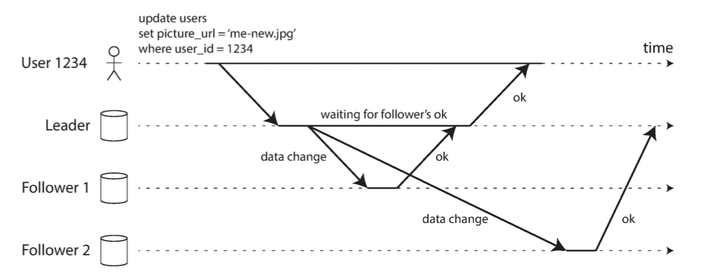

_For that reason, it is impractical for all followers to be synchronous :_

- _any one node outage would cause the whole system to grind to a halt._
- In practice, if you enable synchronous replication on a database, it usually means that one of the followers is synchronous, and the others are asynchronous.
    - If the synchronous follower becomes unavailable or slow, one of the asynchronous followers is made synchronous.
    - This guarantees that you have an up-to-date copy of the data on at least two nodes : the leader and one synchronous follower.
    - This configuration is sometimes also called **semi-synchronous**. _( 半同步 )_
    - _( 保证主节点和其中一个从节点拥有最新的数据副本 )_

Often, leader-based replication is configured to be completely asynchronous.

- In this case, if the leader fails and is not recoverable, any writes that have not yet been replicated to followers are lost.
    - This means that a write is not guaranteed to be durable, even if it has been confirmed to the client.
    - However, a fully asynchronous configuration has the advantage that the leader can continue processing writes, even if all of its followers have fallen behind.
    - _( 虽然无法保证数据的持久化, 但是写吞吐量更好 )_
- _Weakening durability may sound like a bad trade-off,_
    - _but asynchronous replication is nevertheless widely used, especially if there are many followers or if they are geo‐ graphically distributed._

_Setting Up New Followers_

- _omitted…_

#### Handling Node Outages

- _Any node in the system can go down, perhaps unexpectedly due to a fault, but just as likely due to planned maintenance._
- _Our goal is to keep the system as a whole running despite individual node failures, and to keep the impact of a node outage as small as possible._

_How do you achieve high availability with leader-based replication?_

**Follower failure : Catch-up recovery** _( 从节点失效 : 追赶式恢复 )_

- On its local disk, each follower keeps a log of the data changes it has received from the leader.
- _If a follower crashes and is restarted, or if the network between the leader and the follower is temporarily interrupted, the follower can recover quite easily :_
    - from its log, it knows the last transaction that was processed before the fault occurred.
- Thus, the follower can connect to the leader and request all the data changes that occurred during the time when the follower was disconnected.
    - _When it has applied these changes, it has caught up to the leader and can continue receiving a stream of data changes as before._

**Leader failure : Failover** _( 主节点失效 : 节点切换 )_

- **failover** : _Handling a failure of the leader is trickier ( 棘手的 ) :_
    - one of the followers needs to be promoted to be the new leader,
    - clients need to be reconfigured to send their writes to the new leader,
    - and the other followers need to start consuming data changes from the new leader.
- _Failover can happen manually or automatically. An automatic failover process usually consists of the following steps :_
    - 1\. Determining that the leader has failed.
        - There is no foolproof _( 万无一失的 )_ way of detecting what has gone wrong, so most systems simply use a timeout :
            - nodes frequently bounce messages back and forth between each other,
            - and if a node doesn't respond for some period of time -- say, 30 seconds -- it is assumed to be dead.
            - _( If the leader is deliberately taken down for planned maintenance, this doesn't apply. )_
    - 2\. Choosing a new leader.
        - This could be done through an election process ( where the leader is chosen by a majority of the remaining replicas ), or a new leader could be appointed by a previously elected controller node.
        - The best candidate for leadership is usually the replica with the most up-to-date data changes from the old leader ( to minimize any data loss ).
        - Getting all the nodes to agree on a new leader is a consensus problem.
    - 3\. Reconfiguring the system to use the new leader.
        - Clients now need to send their write requests to the new leader.
        - If the old leader comes back, it might still believe that it is the leader, not realizing that the other replicas have forced it to step down.
        - The system needs to ensure that the old leader becomes a follower and recognizes the new leader.
- _Failover is fraught ( 忧虑的 ) with things that can go wrong: ( 充满很多变数 )_
    - If asynchronous replication is used, the new leader may not have received all the writes from the old leader before it failed.
        - If the former leader rejoins the cluster after a new leader has been chosen, what should happen to those writes?
            - The new leader may have received conflicting writes in the meantime.
        - The most common solution is for the old leader's unreplicated writes to simply be discarded, _which may violate clients' durability expectations._
    - Discarding writes is especially dangerous if other storage systems outside of the database need to be coordinated with the database contents.
        - _omitted…_
    - In certain fault scenarios _( 情景 )_, it could happen that two nodes both believe that they are the leader.
        - This situation is called **split brain** _( 脑裂 )_, and it is dangerous :
            - if both leaders accept writes, and there is no process for resolving conflicts, data is likely to be lost or corrupted.
        - As a safety catch, some systems have a mechanism to shut down one node if two leaders are detected.
        - However, if this mechanism is not carefully designed, you can end up with both nodes being shut down.
    - What is the right timeout before the leader is declared dead?
        - A longer timeout means a longer time to recovery in the case where the leader fails.
        - However, if the timeout is too short, there could be unnecessary failovers.
            - _For example, a temporary load spike could cause a node's response time to increase above the timeout, or a network glitch could cause delayed packets._
        - If the system is already struggling with high load or network problems, an unnecessary failover is likely to make the situation worse, not better.

#### Implementation of Replication Logs

**Statement-based replication** _( 基于语句的复制 )_

- In the simplest case, the leader logs every write request ( statement ) that it executes and sends that statement log to its followers.
    - _For a relational database, this means that every INSERT, UPDATE, or DELETE statement is forwarded to followers, and each follower parses and executes that SQL statement as if it had been received from a client._
- _Although this may sound reasonable, there are various ways in which_ this approach to replication can break down :
    - _Any statement that calls a nondeterministic function, such as NOW() to get the current date and time or RAND() to get a random number, is likely to generate a different value on each replica._
    - _If statements use an autoincrementing column, or if they depend on the existing data in the database ( e.g., UPDATE ... WHERE <some condition> ), they must be executed in exactly the same order on each replica, or else they may have a differ‐ ent effect._
        - _This can be limiting when there are multiple concurrently executing transactions._
    - _Statements that have side effects ( e.g., triggers, stored procedures, user-defined functions ) may result in different side effects occurring on each replica, unless the side effects are absolutely deterministic._
- _It is possible to work around those issues._
    - _For example,_ the leader can replace any nondeterministic function calls with a fixed return value when the statement is logged so that the followers all get the same value.
    - _However, because there are so many edge cases, other replication methods are now generally preferred._
- Statement-based replication was used in MySQL before version 5.1.
    - It is still sometimes used today, as it is quite compact, but **by default MySQL now switches to row-based replication** if there is any nondeterminism in a statement.

**Write-ahead log (WAL) shipping** _( 基于预写日志的传输 )_

- _We found that_ **usually every write is appended to a log** :
    - In the case of a log-structured storage engine, this log is the **main place for storage**.
        - Log segments are compacted and garbage-collected in the background.
    - In the case of a B-tree, which overwrites individual disk blocks, **every modification is first written to a write-ahead log so that the index can be restored to a consistent state after a crash**.
- _The main disadvantage is that the log describes the data on a very low level : a WAL contains details of which bytes were changed in which disk blocks._
    - _This makes replication closely coupled to the storage engine._
    - If the database changes its storage format from one version to another, it is typically not possible to run different versions of the database software on the leader and the followers.

**Logical (row-based) log replication** _( 基于行的逻辑日志复制 )_

- _An alternative is to use different log formats for replication and for the storage engine, which_ allows the replication log to be decoupled from the storage engine internals.
    - This kind of replication log is called a **logical log**, to distinguish it from the storage engine's ( physical ) data representation.
- A logical log for a relational database is usually **a sequence of records describing writes to database tables at the granularity of a row** : _( 一系列记录来描述数据表行级别的请求 )_
    - For an inserted row, the log contains the new values of all columns.
    - For a deleted row, the log contains enough information to uniquely identify the row that was deleted.
        - _Typically this would be the primary key, but if there is no primary key on the table, the old values of all columns need to be logged._
    - For an updated row, the log contains enough information to uniquely identify the updated row, and the new values of all columns ( or at least the new values of all columns that changed ).
- A transaction that modifies several rows generates several such log records, followed by a record indicating that the transaction was committed.
    - _MySQL's **binlog** ( when configured to use row-based replication ) uses this approach._
- _A logical log format is also easier for external applications to parse._
    - _This aspect is useful if you want to send the contents of a database to an external system, such as a data warehouse for offline analysis, or for building custom indexes and caches._
    - This technique is called **change data capture** _( 变更数据捕获 )_ .

Trigger-based replication _( 基于触发器的复制 )_

- _omitted…_

### Problems with Replication Lag

_( 复制滞后问题 )_

The followers will eventually catch up and become consistent with the leader. For that reason, this effect is known as **eventual consistency** _( 最终一致性 )_ .

- _When the lag is so large, the inconsistencies it introduces are not just a theoretical issue but a real problem for applications._

#### Reading Your Own Writes

_( 读自己的写 )_

_( icehe : 很常见的解决思路/套路, 必须记住的常识 )_

_If the user views the data shortly after making a write, the new data may not yet have reached the replica._

- _To the user, it looks as though the data they submitted was lost, so they will be understandably unhappy._

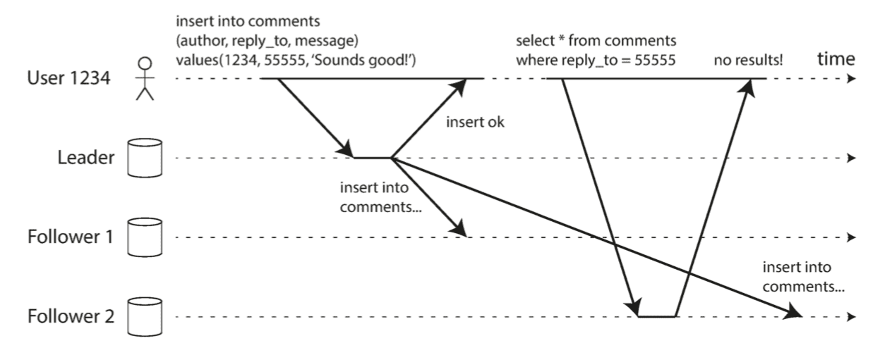

In this situation, we need **read-after-write consistency**, also known as **read-your-writes consistency**.

- This is a guarantee that if the user reloads the page, they will always see any updates they submitted themselves.
- It makes no promises about other users : other users' updates may not be visible until some later time.
    - _However, it reassures the user that their own input has been saved correctly._

_How can we implement read-after-write consistency in a system with leader-based replication?_

- When reading something that the user may have modified, read it from the leader; otherwise, read it from a follower.
    - _This requires that you have some way of knowing whether something might have been modified, without actually querying it._
    - For example, user profile information on a social network is normally only editable by the owner of the profile, not by anybody else.
        - Thus, a simple rule is : always read the user's own profile from the leader, and any other users' profiles from a follower.
- If most things in the application are potentially editable by the user, that approach won't be effective, as most things would have to be read from the leader ( negating the benefit of read scaling ).
    - _( 如果应用的大多数内容都可能被所有用户修改, 那么以上方法不太有效, 因为它将导致大部分内容都必须经由主节点. 这就丧失了读操作的伸缩性/拓展性 )_
    - _In that case, other criteria may be used to decide whether to read from the leader._
    - _For example, you could track the time of the last update and, for one minute after the last update, make all reads from the leader._
        - _You could also monitor the replication lag on followers and prevent queries on any follower that is more than one minute behind the leader._
- The client can remember the timestamp of its most recent write -- then the system can ensure that the replica serving any reads for that user reflects updates at least until that timestamp.
    - _( 客户端可以记住最新更新时的时间戳, 并附在读请求中, 根据此信息, 系统可以确保对该用户提供都服务时, 都至少包含了该时间戳的更新 )_
    - _If a replica is not sufficiently up to date, either the read can be handled by another replica or the query can wait until the replica has caught up._
    - _The timestamp could be a logical timestamp ( something that indicates ordering of writes, such as the log sequence number ) or the actual system clock ( in which case clock synchronization becomes critical ) ._
- _If your replicas are distributed across multiple datacenters ( for geographical proximity to users or for availability ), there is additional complexity._
    - Any request that needs to be served by the leader must be routed to the datacenter that contains the leader.

_Another complication arises_ when the same user is accessing your service from multiple devices, _for example a desktop web browser and a mobile app._

In this case you may want to provide **cross-device read-after-write consistency** _( 跨越设备的 写后读 一致性 )_ :

- if the user enters some information on one device and then views it on another device, they should see the information they just entered.

_In this case, there are some additional issues to consider:_

- _Approaches that require remembering the timestamp of the user's last update become more difficult, because the code running on one device doesn't know what updates have happened on the other device._
    - _This metadata will need to be centralized._
- _If your replicas are distributed across different datacenters, there is no guarantee that connections from different devices will be routed to the same datacenter._
    - _( For example, if the user's desktop computer uses the home broadband connection and their mobile device uses the cellular data network, the devices' network routes may be completely different. )_
    - If your approach requires reading from the leader, you may first need to route requests from all of a user's devices to the same datacenter.
        - _( icehe : 使用用户 ID 来作为路由的依据, 以便路由到同一 数据中心/分片 )_

#### Monotonic Reads

_( 单调读 )_

_( icehe : 保证连续读的情况下, 数据不会来回变化; 展示层常见的缺陷/bug )_

A user first reads from a fresh replica, then from a stale _( 不新鲜的 )_ replica. Time appears to go backward.

- To prevent this anomaly _( 异常/反常 )_ , we need **monotonic reads**.

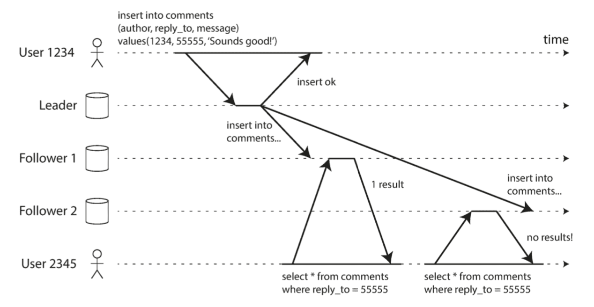

Monotonic reads is a guarantee that this kind of anomaly does not happen.

- _It's a lesser guarantee than strong consistency, but a stronger guarantee than eventual consistency._
- When you read data, you may see an old value; monotonic reads only means that if one user makes several reads in sequence, they will not see time go backward .
    - _i.e., they will not read older data after having previously read newer data._

#### Consistent Prefix Reads

_( 前缀一致读 )_

_( icehe : 即时通讯软件必须解决的问题! )_

The example of replication lag anomalies concerns violation of causality. _Imagine the following short dialog between Mr. Poons and Mrs. Cake :_

```text
- Mr. Poons : How far into the future can you see, Mrs. Cake?
- Mrs. Cake : About ten seconds usually, Mr. Poons.
```

- _There is a causal dependency between those two sentences : Mrs. Cake heard Mr. Poons's question and answered it._

_Now, imagine a third person is listening to this conversation through followers._

- _The things said by Mrs. Cake go through a follower with little lag, but the things said by Mr. Poons have a longer replication lag. This observer would hear the following :_

```text
- Mrs. Cake : About ten seconds usually, Mr. Poons.
- Mr. Poons : How far into the future can you see, Mrs. Cake?
```

- _To the observer it looks as though Mrs. Cake is answering the question before Mr. Poons has even asked it. Such psychic powers are impressive, but very confusing._

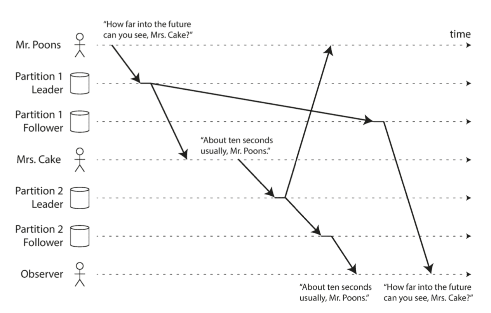

Preventing this kind of anomaly requires another type of guarantee : **consistent prefix reads**.

- This guarantee says that **if a sequence of writes happens in a certain order, then anyone reading those writes will see them appear in the same order**.

_This is a particular problem in partitioned ( sharded ) databases._

- If the database always applies writes in the same order, reads always see a consistent prefix, so this anomaly cannot happen.
- However, in many distributed databases, different partitions operate independently, so there is no global ordering of writes :
    - _when a user reads from the database, they may see some parts of the database in an older state and some in a newer state._

One solution is to make sure that **any writes that are causally related to each other are written to the same partition**  -- but in some applications that cannot be done efficiently.

- _There are also algorithms that explicitly keep track of causal dependencies._

Solutions for Replication Lag

- _omitted…_

### Multi-Leader Replication

Leader-based replication has one major downside : there is only one leader, and all writes must go through it.

- If you can't connect to the leader for any reason, for example due to a network interruption between you and the leader, you can't write to the database.

A natural extension of the leader-based replication model is to allow more than one node to accept writes.

- _Replication still happens in the same way : each node that processes a write must forward that data change to all the other nodes._
- We call this a **multi-leader** configuration ( aka. **master–master** or **active/active** replication ).
    - _In this setup, each leader simultaneously acts as a follower to the other leaders._

#### Use Cases for Multi-Leader Replication

- It rarely makes sense to use a multi-leader setup within a single datacenter, because the benefits rarely outweigh the added complexity.
    - _( 单机房内使用 "多主节点" 没有意义 )_
- _However, there are some situations in which this configuration is reasonable._

**Multi-datacenter operation** _( 多数据中心 )_

- _Imagine you have a database with replicas in several different datacenters_ ( perhaps so that you can tolerate failure of an entire datacenter, or perhaps in order to be closer to your users ) .
    - In a multi-leader configuration, you can have a leader in each datacenter.
- _Compare how the single-leader and multi-leader configurations fare in a multi-datacenter deployment :_
    - Performance
        - In a single-leader configuration, every write must go over the internet to the datacenter with the leader.
        - This can add significant latency to writes and might contravene the purpose of having multiple datacenters in the first place.
        - In a multi-leader configuration, every write can be processed in the local datacenter and is replicated asynchronously to the other datacenters.
        - _Thus, the inter-datacenter network delay is hidden from users, which means the perceived performance may be better._
    - Tolerance of datacenter outages
        - In a single-leader configuration, if the datacenter with the leader fails, failover can promote a follower in another datacenter to be leader.
        - In a multi-leader configuration, each datacenter can continue operating independently of the others, and replication catches up when the failed datacenter comes back online.
    - Tolerance of network problems
        - Traffic between datacenters usually goes over the public internet, which may be less reliable than the local network within a datacenter.
        - A single-leader configuration is very sensitive to problems in this inter-datacenter link, because writes are made synchronously over this link.
        - A multi-leader configuration with asynchronous replication can usually tolerate network problems better : a temporary network interruption does not prevent writes being processed.
- _Although multi-leader replication has advantages, it also has a big downside :_ the same data may be concurrently modified in two different datacenters, and those write conflicts must be resolved.

**Clients with offline operation** _( 离线客户端操作 )_

- _Another situation in which multi-leader replication is appropriate is_ if you have an application that needs to continue to work while it is disconnected from the internet.
    - Every device has a local database that acts as a leader ( it accepts write requests ), and there is an asynchronous multi-leader replication process ( sync ) between the replicas of your data on all of your devices.
    - _The replication lag may be hours or even days, depending on when you have internet access available._
- _From an architectural point of view, this setup is essentially the same as multi-leader replication between datacenters, taken to the extreme :_ each device is a "datacenter", and the network connection between them is extremely unreliable.
    - _The multi-leader replication is a tricky thing to get right._

**Collaborative editing** _( 协作编辑 )_

- Real-time collaborative editing applications allow several people to edit a document simultaneously.
    - _We don't usually think of collaborative editing as a database replication problem, but it has a lot in common with the previously mentioned offline editing use case._
- When one user edits a document, the changes are instantly applied to their local replica _( the state of the document in their web browser or client application )_ and asynchronously replicated to the server and any other users who are editing the same document.
    - If you want to guarantee that there will be no editing conflicts, the application must obtain a lock on the document before a user can edit it.
    - _If another user wants to edit the same document, they first have to wait until the first user has committed their changes and released the lock._
    - This collaboration model is equivalent to single-leader replication with transactions on the leader.
- However, for faster collaboration, you may want to **make the unit of change very small and avoid locking**.

#### Handling Write Conflicts

Synchronous versus asynchronous conflict detection

- _omitted…_

**Conflict avoidance**

- _The simplest strategy for dealing with conflicts is to avoid them :_ if the application can ensure that all writes for a particular record go through the same leader, then conflicts cannot occur.
    - _Since many implementations of multi-leader replication handle conflicts quite poorly,_ avoiding conflicts is a frequently recommended approach.
- _For example,_ in an application where a user can edit their own data, you can ensure that requests from a particular user are always routed to the same datacenter and use the leader in that datacenter for reading and writing.
    - _Different users may have different "home" datacenters ( perhaps picked based on geographic proximity to the user ) ,_ but from any one user's point of view the configuration is essentially single-leader.
- However, sometimes you might want to change the designated leader for a record --
    - perhaps because one datacenter has failed and you need to reroute traffic to another datacenter, or
    - perhaps because a user has moved to a different location and is now closer to a different datacenter.
- In this situation, conflict avoidance breaks down, and you have to deal with the possibility of concurrent writes on different leaders.

**Converging toward a consistent state** _( 收敛于一致状态 )_

- A single-leader database applies writes in a sequential order : if there are several updates to the same field, the last write determines the final value of the field.
- In a multi-leader configuration, there is no defined ordering of writes, so it's not clear what the final value should be.
- _There are various ways of_ achieving convergent conflict resolution :
    - Give each write a unique ID ( e.g., a timestamp, a long random number, a UUID, or a hash of the key and value ), pick the write with the highest ID as the winner, and throw away the other writes.
        - If a timestamp is used, this technique is known as **last write wins (LWW)**.
        - Although this approach is popular, it is dangerously prone to data loss.
    - Give each replica a unique ID, and let writes that originated at a higher-numbered replica always take precedence over writes that originated at a lower-numbered replica.
        - _This approach also implies data loss._
    - Somehow **merge the values together**
        - e.g., order them alphabetically and then concatenate them.
    - **Record the conflict** in an explicit data structure that preserves all information, and write application code that **resolves the conflict** at some later time ( perhaps by prompting the user ).

**Custom conflict resolution logic** _( 自定义冲突解决逻辑 )_

- _As the most appropriate way of resolving a conflict may_ depend on the application, most multi-leader replication tools let you write conflict resolution logic using appli‐ cation code.
- _That code may be executed on write or on read:_
    - On write
        - As soon as the database system detects a conflict in the log of replicated changes, it calls the conflict handler.
    - On read
        - When a conflict is detected, all the conflicting writes are stored.
        - The next time the data is read, these multiple versions of the data are returned to the applica‐ tion.
        - The application may prompt the user or automatically resolve the conflict, and write the result back to the database.

#### Multi-Leader Replication Topologies

- _omitted…_
    - Circular topology 环形拓扑
    - Star topology 星型拓扑
    - All-to-all topology 全部至全部型拓扑

### Leaderless Replication

_( 无主节点复制 )_

Single-leader and multi-leader replication -- are based on the idea that **a client sends a write request to one node (the leader)**, and the **database system takes care of copying that write to the other replicas**.

- A leader determines the order in which writes should be processed, and followers apply the leader's writes in the same order.

_Some data storage systems take a different approach, abandoning the concept of a leader and_ **allowing any replica to directly accept writes from clients**.

In some leaderless implementations, the client directly sends its writes to several replicas,

- while in others, a **coordinator** node does this on behalf of the client _( 协调者代表客户端进行写入 )_ .
    - However, unlike a leader database, that **coordinator does not enforce a particular ordering of writes**.

#### Writing to the Database When a Node Is Down

_( 节点失效时写入数据库 )_

- Write
    - It's sufficient for 2 out of 3 replicas to acknowledge the write :
        - after client has received 2 ok responses, we consider its write to be successful.
- Read
    - When a client reads from the database, it doesn't just send its request to one replica :
        - **read requests are also sent to several nodes in parallel**.
    - The client may get different responses from different nodes;
        - i.e., the up-to-date value from one node and a stale value from another.
    - **Version numbers** are used to determine which value is newer.

**Read repair and anti-entropy** _( 读修复与反熵 )_

- Goal : _The replication scheme should_ ensure that eventually all the data is copied to every replica.
- _Two mechanisms are often used in **Dynamo-style datastores** :_
    - **Read repair**
        - When a client makes a read from several nodes in parallel, it can detect any stale responses.
        - The client sees a stale value and writes the newer value back to that replica.
        - This approach works well for values that are frequently read.
    - **Anti-entropy process**
        - In addition, some datastores have a background process that constantly looks for differences in the data between replicas and copies any missing data from one replica to another.
        - _Unlike the replication log in leader-based replication, this anti-entropy process does not copy writes in any particular order, and there may be a significant delay before data is copied._

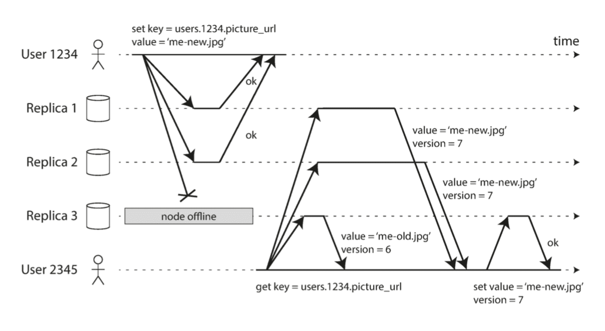

**Quorums** for reading and writing _( 法定人数 / 法定票数 / 仲裁 )_

- If there are **n replicas**, **every write must be confirmed by w nodes** to be considered successful, and we must **query at least r nodes for each read**.
    - _( In our example, n = 3, w = 2, r = 2. )_ As long as **w + r > n**, _we expect to get an up-to-date value when reading, because_ at least one of the r nodes we're reading from must be up to date.
    - Reads and writes that obey these r and w values are called **quorum reads and writes** _( 法定票数读/仲裁读 , 法定票数写/仲裁写 )_ .
    - _You can think of r and w as the minimum number of votes required for the read or write to be valid._
- _In Dynamo-style databases, the parameters n, w, and r are typically configurable._
    - A common choice is to make n an odd number ( typically 3 or 5 ) and to set w = r = (n + 1) / 2 ( rounded up ) _( 向上取整 )_ .
    - _However, you can vary the numbers as you see fit._
        - For example, a workload with few writes and many reads may benefit from setting w = n and r = 1.
        - This makes reads faster, but has the disadvantage that just one failed node causes all database writes to fail.
- The quorum condition, w + r > n, allows the system to tolerate unavailable nodes as follows:
    - _( icehe : 尽可能同时保证 (折衷) 一致性和可用性, 但是系统实现更复杂 )_
    - _If w < n, we can still process writes if a node is unavailable._
    - _If r < n, we can still process reads if a node is unavailable._
    - _With n = 3, w = 2, r = 2 we can tolerate one unavailable node._
    - _With n = 5, w = 3, r = 3 we can tolerate two unavailable nodes._
    - _Normally, reads and writes are always sent to all n replicas in parallel._
        - _The parameters w and r determine how many nodes we wait for -- i.e., how many of the n nodes need to report success before we consider the read or write to be successful._

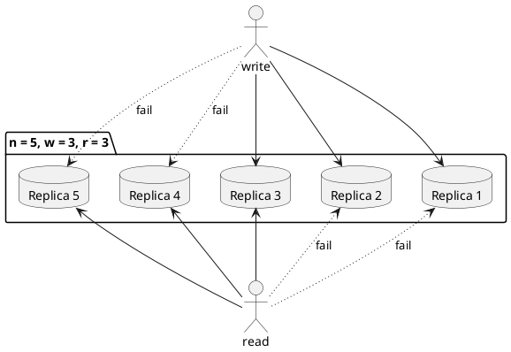

#### Limitations of Quorum Consistency

_If you have n replicas, and you choose w and r such that w + r > n, you can generally expect every read to return the most recent value written for a key._

- This is the case because **the set of nodes to which you've written and the set of nodes from which you've read must overlap**.
- That is, among the nodes you read there must be **at least one node with the latest value**.

_Often, r and w are chosen to be a majority ( more than n/2 ) of nodes, because that ensures w + r > n while still tolerating up to n/2 node failures._

- But quorums are not necessarily majorities -- **it only matters that the sets of nodes used by the read and write operations overlap in at least one node**.
- _Other quorum assignments are possible, which allows some flexibility in the design of distributed algorithms._

You may also set w and r to smaller numbers, so that w + r ≤ n. _( i.e., the quorum condition is not satisfied. )_

- _In this case, reads and writes will still be sent to n nodes, but a smaller number of successful responses is required for the operation to succeed._
- With a smaller w and r you are more likely to read stale values, because it's more likely that your read didn't include the node with the latest value.
- On the upside, this configuration allows lower latency and higher availability:
    - _if there is a network interruption and many replicas become unreachable, there's a higher chance that you can continue processing reads and writes._
- _Only after the number of reachable replicas falls below w or r does the database become unavailable for writing or reading, respectively._

_However, even with w + r > n, there are likely to be edge cases where stale values are returned. These depend on the implementation, but possible scenarios include :_

- If a **sloppy quorum** is used, the w writes may end up on different nodes than the r reads, so there is no longer a guaranteed overlap between the r nodes and the w nodes.
- If two writes occur concurrently, it is not clear which one happened first.
    - In this case, the only safe solution is to merge the concurrent writes.
    - If a winner is picked based on a timestamp ( last write wins ), writes can be lost due to **clock skew** _( 时钟偏差 )_ .
- If a write happens concurrently with a read, the write may be reflected on only some of the replicas.
    - In this case, it's undetermined whether the read returns the old or the new value.
- If a write succeeded on some replicas but failed on others ( for example because the disks on some nodes are full ), and overall succeeded on fewer than w replicas, it is not rolled back on the replicas where it succeeded.
    - This means that if a write was reported as failed, subsequent reads may or may not return the value from that write.
- If a node carrying a new value fails, and its data is restored from a replica carrying an old value, the number of replicas storing the new value may fall below w, breaking the quorum condition.
- _Even if everything is working correctly, there are edge cases in which you can get unlucky with the timing._

**Monitoring staleness** _( 监控旧值 )_

From an operational perspective, it's important to monitor whether your databases are returning up-to-date results.

- _Even if your application can tolerate stale reads, you need to be aware of the health of your replication._
- If it falls behind significantly, it should alert you so that you can investigate the cause
    - ( for example, a problem in the network or an overloaded node ).

_For leader-based replication, the database typically exposes metrics for the replication lag, which you can feed into a monitoring system._

- This is possible because writes are applied to the leader and to followers in the same order, and each node has a position in the replication log ( the number of writes it has applied locally ).
- By subtracting a follower's current position from the leader's current position, you can measure the amount of replication lag.

_In systems with leaderless replication, there is no fixed order in which writes are applied, which makes monitoring more difficult._

- _If the database only uses read repair ( no anti-entropy ), there is no limit to how old a value might be -- if a value is only infrequently read, the value returned by a stale replica may be ancient._

**Sloppy Quorums and Hinted Handoff** _( 宽松的法定票数 与 数据回传 )_

- _However, quorums ( as described so far ) are not as fault-tolerant as they could be._
    - A network interruption can easily cut off a client from a large number of database nodes.
    - Although those nodes are alive, and other clients may be able to connect to them, to a client that is cut off from the database nodes, they might as well be dead.
    - In this situation, it's likely that fewer than w or r reachable nodes remain, so the client can no longer reach a quorum.
- _In a large cluster ( with significantly more than n nodes ) it's likely that_ the client can connect to some database nodes during the network interruption, just not to the nodes that it needs to assemble a quorum for a particular value.
    - _In that case, database designers face a trade-off :_
        - A. _Is it better to return errors to all requests for which we cannot reach a quorum of w or r nodes?_
        - B. Or should we accept writes anyway, and **write them to some nodes that are reachable but aren't among the n nodes** on which the value usually lives?
    - The latter is known as a **sloppy quorum** _( 宽松的仲裁 )_ :
        - writes and reads still require w and r successful responses,
        - but those may include nodes that are not among the designated n "home" nodes for a value. _( icehe : 我的理解 -- 这些读写可能暂存在原定 n 个节点之外的节点中 )_
    - **Hinted handoff** _( 数据回传 )_
        - Once the network interruption is fixed, any writes that one node temporarily accepted on behalf of another node are sent to the appropriate "home" nodes.
- Sloppy quorums are particularly useful for increasing write availability : _as long as any w nodes are available, the database can accept writes._
    - _However, this means that even when w + r > n, you cannot be sure to read the latest value for a key, because the latest value may have been temporarily written to some nodes outside of n._
    - It's only an assurance of durability _( 保证持久性的措施 )_ , namely that the data is stored on w nodes somewhere.
        - There is no guarantee that a read of r nodes will see it until the hinted handoff has completed.
    - _Sloppy quorums are optional in all common Dynamo implementations._

**Multi-datacenter operation** _( 多数据中心的操作 )_

- _Cassandra and Voldemort implement their multi-datacenter support within the normal leaderless model :_
    - the number of replicas n includes nodes in all datacenters, _and in the configuration you can specify how many of the n replicas you want to have in each datacenter_.
- Each write from a client is sent to all replicas, regardless of datacenter,
    - but **the client usually only waits for acknowledgment from a quorum of nodes within its local datacenter** so that it is unaffected by delays and interruptions on the cross-datacenter link.
- The higher-latency writes to other datacenters are often configured to happen asynchronously, _although there is some flexibility in the configuration._

#### Detecting Concurrent Writes

_( 检测并发写 )_

Dynamo-style databases allow several clients to **concurrently write to the same key**, which means that conflicts will occur even if strict quorums are used.

- _The situation is similar to multi-leader replication, although in Dynamo-style databases conflicts can also arise during read repair or hinted handoff._

The problem is that **events may arrive in a different order at different nodes**, due to variable network delays and partial failures.

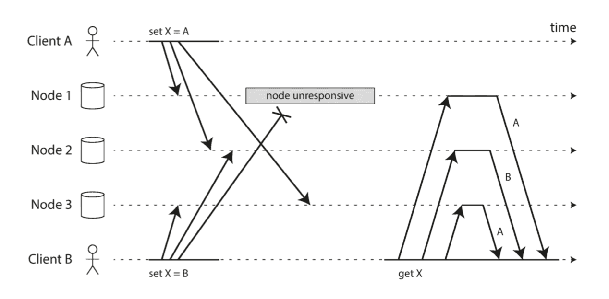

_If each node simply overwrote the value for a key whenever it received a write request from a client, the nodes would become permanently inconsistent._

**Last write wins ( discarding concurrent writes )** _( 最后写入者胜利 ( 丢弃并发写入 ) )_

- One approach for achieving eventual convergence is to declare that **each replica need only store the most "recent" value and allow "older" values to be overwritten and discarded**.
    - _Then, as long as we have some way of unambiguously determining which write is more "recent", and every write is eventually copied to every replica, the replicas will eventually converge to the same value._
- As indicated by the quotes around "recent," this idea is actually quite misleading.
    - We say the writes are concurrent, so their order is undefined.
    - We can **attach a timestamp to each write**, pick the biggest timestamp as the most "recent," and discard any writes with an earlier timestamp.
    - This conflict resolution algorithm, called **last write wins (LWW)**.
- _LWW achieves the goal of eventual convergence, but at the cost of durability._
    - _There are some situations, such as caching, in which lost writes are perhaps acceptable._
    - _If losing data is not acceptable, LWW is a poor choice for conflict resolution._
- _The only safe way of using a database with LWW is to ensure that_ a key is only written once and thereafter treated as immutable, thus avoiding any concurrent updates to the same key.

**The "happens-before" relationship and concurrency**

- _omitted…_

**Capturing the happens-before relationship**

- _( 比较复杂, 详情看原书, 而且有必要搞明白! )_
    - _( icehe : 如何巧妙地靠同时保存一个 key 的多个版本 value, 以及版本号来处理多设备同步 value 并解决冲突的问题! ( 不过只是对一个数据集追加元素的操作场景 ) )_

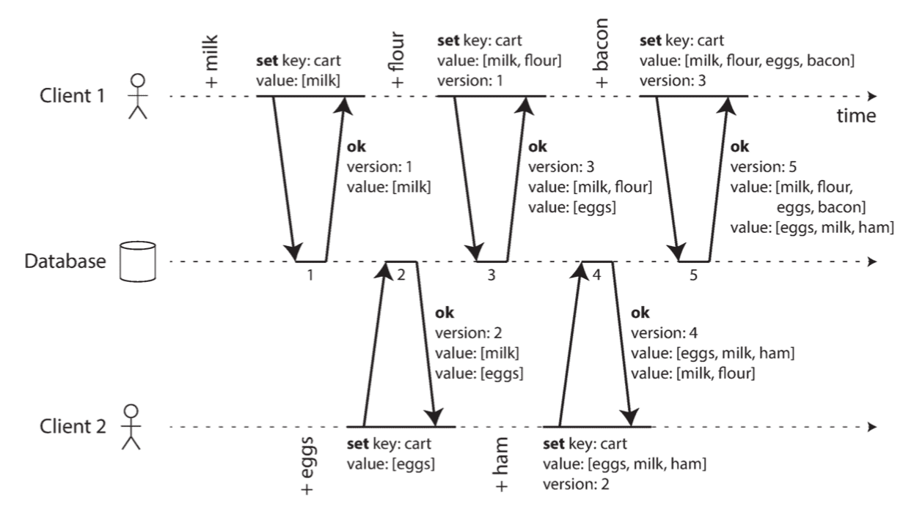

**Merging concurrently written values**

- _( 比较复杂, 详情看原书, 而且有必要搞明白! )_
    - _( icehe :不只是对一个数据集追加元素, 还得移除元素, 这时还需要 "A deletion marker is known as a **tombstone** ( 墓碑 ) ." )_

**Version vectors** _( 版本矢量 )_

- The collection of version numbers from all the replicas is called a version vector.
    - Version vectors are sent from the database replicas to clients when values are read, and need to be sent back to the database when a value is subsequently written.
- _( 详情看原书 )_

## Partitioning

_( 数据分区 )_

- _Replication -- that is, having multiple copies of the same data on different nodes._
- For very large datasets, or very high query throughput, that is not sufficient :
    - we need to break the data up into **partitions**, aka. **sharding**.
- _Normally, partitions are defined in such a way that_ **each piece of data ( each record, row, or document ) belongs to exactly one partition**.
- The main reason for wanting to partition data is **scalability**.
    - _Different partitions can be placed on different nodes in a shared-nothing cluster._
    - _Thus, a large dataset can be distributed across many disks, and the query load can be distributed across many processors._

_Terminological confusion_

- _What we call a partition here is called_
    - a **shard** in MongoDB, Elasticsearch, and SolrCloud _; it's known as_
    - a **region** in HBase,
    - a **tablet** in Bigtable,
    - a **vnode** in Cassandra and Riak _, and_
    - a **vBucket** in Couchbase.
- _However, **partitioning** is the most established term, so we'll stick with that._

**Partitioning and Replication**

- Partitioning is usually combined with replication so that copies of each partition are stored on multiple nodes.
    - _This means that, even though each record belongs to exactly one partition, it may still be stored on several different nodes for fault tolerance._
- A node may store more than one partition.
    - _Each partition's leader is assigned to one node, and its followers are assigned to other nodes._
    - **Each node may be the leader for some partitions and a follower for other partitions.**

### Partitioning of Key-Value Data

_( 键-值数据的分区 )_

Our goal with partitioning is to **spread the data and the query load evenly across nodes**.

If the partitioning is unfair, so that some partitions have more data or queries than others, we call it **skewed** _( 倾斜 )_ .

- The presence of skew makes partitioning much less effective.
    - In an extreme case, all the load could end up on one partition, so 9 out of 10 nodes are idle and your bottleneck is the single busy node.
    - A partition with disproportionately _( 严重不成比例的 )_ high load is called a **hot spot** _( 热点 )_ .

#### Partitioning by Key Range

_( 基于键区间的分区 )_

One way of partitioning is to **assign a continuous range of keys ( from some minimum to some maximum ) to each partition.**

- _The ranges of keys are not necessarily evenly spaced ( 分布均匀 ) , because your data may not be evenly distributed._

_omitted…_

#### Partitioning by Hash of Key

_( 基于关键字哈希的分区 )_

Because of this risk of skew and hot spots, many distributed datastores **use a hash function to determine the partition for a given key**.

- This technique is good at distributing keys fairly among the partitions.
- _The partition boundaries can be evenly spaced, or they can be_ chosen pseudorandomly _( 伪随机地选择 )_
    - in which case the technique is sometimes known as **consistent hashing** _( 一致性哈希 )_ .
- _Unfortunately however, by using the hash of the key for partitioning we_ lose a nice property of **key-range partitioning** : the ability to do efficient range queries.
    - _Keys that were once adjacent are now scattered across all the partitions, so their sort order is lost._

_Consistent Hashing_

- Consistent hashing is a way of evenly distributing load across an internet-wide system of caches such as a content delivery network (CDN).
    - It uses randomly chosen partition boundaries to avoid the need for central control or distributed consensus.
    - Note that consistent here has nothing to do with _( 与…无关 )_ replica consistency or ACID consistency, but rather describes a particular approach to **rebalancing** _( 动态平衡 )_ .
    - This particular approach actually doesn't work very well for databases, so **it is rarely used in practice** _( the documentation of some databases still refers to consistent hashing, but it is often inaccurate )_ .
    - _Because this is so confusing, it's best to_ avoid the term consistent hashing and just call it hash partitioning instead.

A table in Cassandra can be declared with **a compound primary key ( 复合主键 ) consisting of several columns**.

- Only the first part of that key is hashed to determine the partition, but the other columns are used as a concatenated index for sorting the data in Cassandra's SSTables.

The **concatenated index** ( 组合索引 ) _approach enables an elegant data model for one-to-many relationships._

- _For example, on a social media site, one user may post many updates._
    - _If the primary key for updates is chosen to be `( user_id, update_timestamp )`, then you can efficiently retrieve all updates made by a particular user within some time interval, sorted by timestamp._
    - _Different users may be stored on different partitions, but within each user, the updates are stored ordered by timestamp on a single partition._

#### Skewed Workloads and Relieving Hot Spots

_omitted…_

### Partitioning and Secondary Indexes

_( 分区与二级索引 )_

- The problem with secondary indexes is that they don't map neatly to partitions.
- There are two main approaches to partitioning a database with secondary indexes: **document-based partitioning** and **term-based partitioning**. _( 基于文档 / 基于词条 )_
    - _document-partition index - local index_
    - _term-partition index - global index_

#### Partitioning Secondary Indexes by Document

_( 基于文档分区的二级索引 )_

Each partition is completely separate : each partition maintains its own secondary indexes, covering only the documents in that partition.

- _It doesn't care what data is stored in other partitions._
- Whenever you need to write to the database _-- to add, remove, or update a document --_ you only need to deal with the partition that contains the document ID that you are writing.
- For that reason, a **document-partitioned index** is also known as a **local index** ( as opposed to a **global index** ) .

_Thus, if you want to search for something referring to secondary index,_ you **need to send the query to all partitions, and combine all the results you get back**.

- _This approach to querying a partitioned database is sometimes known as_ **scatter / gather** _( 分散 / 聚集 )_ , _and it can make read queries on secondary indexes quite expensive._
- _Even if you query the partitions in parallel, scatter/gather is prone to tail latency amplification ( 长尾延迟放大 ) ._
- Nevertheless, it is widely used : MongoDB, Riak, Cassandra, Elasticsearch, SolrCloud, and VoltDB all use document-partitioned secondary indexes.
    - _( icehe : 大多数产品使用基于文档的二级索引 ( 本地索引 ) , 毕竟瓶颈通常在写入/更新, 而非查询 )_

#### Partitioning Secondary Indexes by Term

 _( 基于词条的二级索引分区 )_

Rather than each partition having its own secondary index ( a local index ), we can construct a **global index** that covers data in all partitions.

- However, we can't just store that index on one node, since it would likely become a bottleneck and defeat the purpose of partitioning.
- A global index **must also be partitioned**, but it can be partitioned differently from the primary key index.

We call this kind of index **term-partitioned** _( 词条分区 )_ , because the term we're looking for determines the partition of the index.

- The name term comes from **full-text indexes** _( 全文索引 )_ ( a particular kind of secondary index ), where the **terms are all the words that occur in a document**.

The advantage of a global ( term-partitioned ) index over a document-partitioned index is that it can make reads more efficient :

- rather than doing scatter/gather over all partitions, a client only needs to make a request to the partition containing the term that it wants.

However, the downside of a global index is that **writes are slower and more complicated**,

- because a write to a single document may now affect multiple partitions of the index ( every term in the document might be on a different partition, on a different node ).

In practice, updates to global secondary indexes are often asynchronous _( that is, if you read the index shortly after a write, the change you just made may not yet be reflected in the index )_ .

### Rebalancing Partitions

_( 分区再平衡 )_

_Over time, things change in a database:_

- _The query throughput increases, so you want to add more CPUs to handle the load._
- _The dataset size increases, so you want to add more disks and RAM to store it._
- _A machine fails, and other machines need to take over the failed machine's responsibilities._

_All of these changes call for data and requests to be moved from one node to another._

- The process of moving load from one node in the cluster to another is called **rebalancing** _( 再平衡 / 动态平衡 )_ .

_No matter which partitioning scheme is used, rebalancing is usually expected to meet some minimum requirements:_

- _After rebalancing, the load ( data storage, read and write requests ) should be shared fairly between the nodes in the cluster._
- _While rebalancing is happening, the database should continue accepting reads and writes._
- _No more data than necessary should be moved between nodes, to make rebalancing fast and to minimize the network and disk I/O load._

#### Strategies for Rebalancing

**How not to do it: hash mod N** _( 取模 )_

- _( icehe : 书中说该策略不合适的理由是, 频繁地增加新的节点时, 数据迁移成本很高 )_
    - _( 实际实践中, "取模" 才是最常见的再平衡策略 )_
    - _( 扩容 : 节点个数设置为 2 的幂次方, 然后每次扩容时翻倍 )_
    - _( 故障转移 : 每个节点都至少有一个从节点作为备用, 故障时直接切换到备用节点即可 )_

**Fixed number of partitions** _( 固定数量的分区 )_

- Fortunately, there is a fairly simple solution :
    - **create many more partitions than there are nodes, and assign several partitions to each node**.
- For example, a database running on a cluster of 10 nodes may be split into 1,000 partitions from the outset so that approximately 100 partitions are assigned to each node.
    - If a node is added to the cluster, the new node can steal a few partitions from every existing node until partitions are fairly distributed once again.
    - _If a node is removed from the cluster, the same happens in reverse._

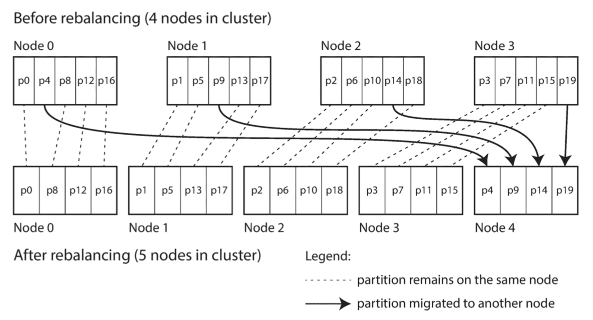

- _In this configuration,_ **the number of partitions is usually fixed when the database is first set up and not changed afterward**.
    - _Although in principle it's possible to split and merge partitions,_ a fixed number of partitions is operationally simpler, and **so many fixed-partition databases choose not to implement partition splitting**.
    - _Thus, the number of partitions configured at the outset is the maximum number of nodes you can have,_ so you **need to choose it high enough to accommodate future growth**.
    - _However, each partition also has management overhead, so it's counterproductive to choose too high a number._
- Choosing the right number of partitions is difficult if the total size of the dataset is highly variable ( for example, if it starts small but may grow much larger over time ).
    - _Since each partition contains a fixed fraction of the total data, the size of each partition grows proportionally to the total amount of data in the cluster._
    - If partitions are very large, rebalancing and recovery from node failures become expensive.
    - But if partitions are too small, they incur too much overhead.
    - _The best performance is achieved when the size of partitions is "just right," neither too big nor too small, which can be hard to achieve if the number of partitions is fixed but the dataset size varies._
    - _( icehe : 因为超出预期的数据量级增长, 并不常见; 所以对于一般的场景, 这是一个非常好的再平衡策略! )_

**Dynamic partitioning**

- _For databases that use key range partitioning, a fixed number of partitions with fixed boundaries would be very inconvenient : if you got the boundaries wrong, you could end up with all of the data in one partition and all of the other partitions empty._
    - _Reconfiguring the partition boundaries manually would be very tedious._
- _For that reason, key range–partitioned databases such as_ HBase and RethinkDB create partitions dynamically.
    - **When a partition grows to exceed a configured size** _( on HBase, the default is 10 GB )_, **it is split into two partitions** _so that approximately half of the data ends up on each side of the split_.
    - Conversely, **if lots of data is deleted and a partition shrinks below some threshold, it can be merged with an adjacent partition**.
    - This process is similar to what happens at the top level of a B-tree.
- _Each partition is assigned to one node, and each node can handle multiple partitions, like in the case of a fixed number of partitions._
    - In the case of HBase, **the transfer of partition files happens through HDFS**, the underlying distributed filesystem.
- _An advantage of dynamic partitioning is that_ the number of partitions adapts to the total data volume.
    - _If there is only a small amount of data, a small number of partitions is sufficient, so overheads are small;_
    - _if there is a huge amount of data, the size of each individual partition is limited to a configurable maximum._
- While the dataset is small -- until it hits the point at which the first partition is split -- all writes have to be processed by a single node while the other nodes sit idle.
    - _To mitigate ( 试缓和 ) this issue, HBase and MongoDB_ allow an initial set of partitions to be configured on an empty database ( this is called **pre-splitting** _( 预分裂 )_ ).
    - _In the case of key-range partitioning, pre-splitting requires that you already know what the key distribution is going to look like._
- _Dynamic partitioning is not only suitable for key range–partitioned data, but can equally well be used with hash-partitioned data._

**Partitioning proportionally to nodes** _( 按节点比例分区 )_

- **With dynamic partitioning, the number of partitions is proportional to the size of the dataset**, since the splitting and merging processes **keep the size of each partition between some fixed minimum and maximum**.
    - _On the other hand,_ **with a fixed number of partitions, the size of each partition is proportional to the size of the dataset**.
    - _In both of these cases, the number of partitions is independent of the number of nodes._
    - _( icehe : 这里只是为了说明之前的分区方式跟接下一个分区方式的异同; 接下来才介绍 "按节点比例分区" )_
- _A third option,_ used by Cassandra and Ketama, is to **make the number of partitions proportional to the number of nodes** -- in other words, to **have a fixed number of partitions per node**.
    - _In this case,_ the size of each partition grows proportionally to the dataset size while the number of nodes remains unchanged, but when you increase the number of nodes, the partitions become smaller again.
    - _Since a larger data volume generally requires a larger number of nodes to store,_ this approach also **keeps the size of each partition fairly stable**.
- When a new node joins the cluster, it randomly chooses a fixed number of existing partitions to split, and then takes ownership of one half of each of those split partitions while leaving the other half of each partition in place.
    - The **randomization can produce unfair splits**, _but when averaged over a larger number of partitions ( in Cassandra, 256 partitions per node by default ) , the new node ends up taking a fair share of the load from the existing nodes._
    - _Cassandra 3.0 introduced an alternative rebalancing algorithm that avoids unfair splits._
- Picking partition boundaries randomly requires that hash-based partitioning is used _( so the boundaries can be picked from the range of numbers produced by the hash function )._
    - _Indeed, this approach corresponds most closely to the original definition of consistent hashing._

#### Operations: Automatic or Manual Rebalancing

 _( 自动与手动再平衡操作 )_

_Does the rebalancing happen automatically or manually?_

- There is a gradient between
    - **fully automatic rebalancing** ( the system decides automat‐ ically when to move partitions from one node to another, without any administrator interaction ) and
    - **fully manual** ( the assignment of partitions to nodes is explicitly configured by an administrator, and only changes when the administrator explicitly reconfigures it ) .
- _For example, Couchbase, Riak, and Voldemort generate a suggested partition assignment automatically, but require an administrator to commit it before it takes effect._

Fully automated rebalancing can be convenient, _because there is less operational work to do for normal maintenance._

- However, it can be **unpredictable**.
- _Rebalancing is an expensive operation, because it requires rerouting requests and moving a large amount of data from one node to another._
- _If it is not done carefully, this process can overload the network or the nodes and harm the performance of other requests while the rebalancing is in progress._

_Such automation can be dangerous in combination with automatic failure detection._

- _For example, say one node is overloaded and is temporarily slow to respond to requests._
- _The other nodes conclude that the overloaded node is dead, and automatically rebalance the cluster to move load away from it._
- _This puts additional load on the overloaded node, other nodes, and the network -- making the situation worse and potentially causing a cascading failure._

For that reason, it can be a good thing to **have a human in the loop for rebalancing**.

- It's slower than a fully automatic process, but it can help **prevent operational surprises**.
- _( icehe : 实践中的取舍, 再平衡分区的操作频率不高, 即使要自动化, 也缺少实践演练, 还是人工操作更靠谱 )_

### Request Routing

_( 请求路由 )_

When a client wants to make a request, how does it know which node to connect to?

- As partitions are rebalanced, the assignment of partitions to nodes changes.
- Somebody needs to stay on top of those changes in order to answer the question.

This is an instance of a more general problem called **service discovery** _( 服务发现 )_ , _which isn't limited to just databases._

- Any piece of software that is accessible over a network has this problem, especially if it is aiming for high availability ( running in a redundant configuration on multiple machines ).

_On a high level, there are a few different approaches to this problem :_

- 1\. Allow clients to contact any node ( e.g., via a round-robin load balancer ).
    - If that node coincidentally owns the partition to which the request applies, it can handle the request directly;
    - otherwise, it forwards the request to the appropriate node, receives the reply, and passes the reply along to the client.
- 2\. Send all requests from clients to a **routing tier** _( 路由层 )_ first, which determines the node that should handle each request and forwards it accordingly.
    - This routing tier does not itself handle any requests; it only acts as a partition-aware load balancer.
- 3\. Require that clients be aware of the partitioning and the assignment of partitions to nodes.
    - In this case, a client can connect directly to the appropriate node, without any intermediary.

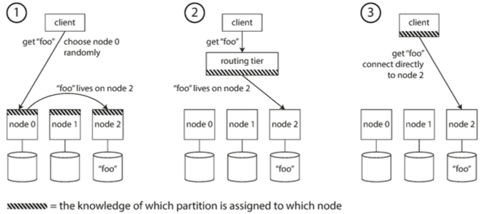

How does the component making the routing decision _( which may be one of the nodes, or the routing tier, or the client )_ learn about changes in the assignment of partitions to nodes?

- Many distributed data systems rely on a separate coordination service such as **ZooKeeper** to keep track of this cluster metadata.
    - Each node registers itself in ZooKeeper, and ZooKeeper maintains the authoritative mapping of partitions to nodes.
    - Other actors, such as the routing tier or the partitioning-aware client, can subscribe to this information in ZooKeeper.
    - Whenever a partition changes ownership, or a node is added or removed, ZooKeeper notifies the routing tier so that it can keep its routing information up to date.

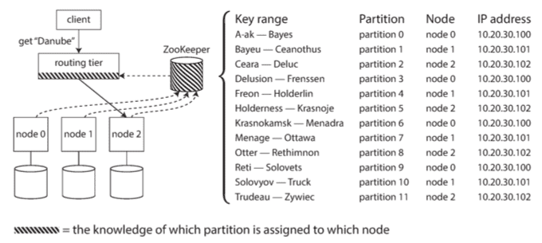

_When using a routing tier or when sending requests to a random node,_ clients still need to find the IP addresses to connect to.

- _These are not as fast-changing as the assignment of partitions to nodes, so it is often sufficient to_ use DNS for this purpose.

#### Parallel Query Execution

_So far we have focused on very simple queries that read or write a single key ( plus scatter/gather queries in the case of document-partitioned secondary indexes ) ._

- _This is about the level of access supported by most NoSQL distributed datastores._

However, **massively parallel processing (MPP)** relational database products, often used for analytics, are much more sophisticated in the types of queries they support.

- _A typical data warehouse query contains several join, filtering, grouping, and aggregation operations._
- _The MPP query optimizer breaks this complex query into a number of execution stages and partitions, many of which can be executed in parallel on different nodes of the database cluster._
- _Queries that involve scanning over large parts of the dataset particularly benefit from such parallel execution._

_omitted…_

## Transactions

> Some authors have claimed that general two-phase commit is too expensive to support, because of the performance or availability problems that it brings.
> We believe it is better to have application programmers deal with performance problems due to overuse of transactions as bottlenecks arise, rather than always coding around the lack of transactions.
>
> -- James Corbett et al., Spanner: Google's Globally-Distributed Database (2012)

_In the harsh reality of data systems, many things can go wrong:_

- _The database software or hardware may fail at any time ( including in the middle of a write operation ) ._
- _The application may crash at any time ( including halfway through a series of operations ) ._
- _Interruptions in the network can unexpectedly cut off the application from the database, or one database node from another._
- _Several clients may write to the database at the same time, overwriting each other's changes._
- _A client may read data that doesn't make sense because it has only partially been updated._
- _Race conditions between clients can cause surprising bugs._

Ransactions have been the mechanism of choice for simplifying these issues.

- A transaction is a way for an application to **group several reads and writes together into a logical unit.**
    - Conceptually, all the reads and writes in a transaction are executed as one operation : **either the entire transaction succeeds (commit) or it fails ( abort, rollback )**.
    - If it fails, the application can safely retry.
- With transactions, error handling becomes much simpler for an application, because it doesn't need to worry about partial failure
    - _i.e., the case where some operations succeed and some fail ( for whatever reason ) ._

Transactions are not a law of nature; they were created with **a purpose, namely to simplify the programming model for applications accessing a database**.

- _By using transactions, the application is free to ignore certain potential error scenarios and concurrency issues, because the database takes care of them instead ( we call these **safety guarantees** ( 安全性保证 ) )._

_Not every application needs transactions, and sometimes there are advantages to weakening transactional guarantees or abandoning them entirely ( for example, to achieve higher performance or higher availability ) . Some safety properties can be achieved without transactions._

### The Slippery Concept of a Transaction

_( 深入理解事务 )_

_( slippery : 狡猾的 / 不稳定的 / 不可靠的 / 难以捉摸的 )_

#### The Meaning of ACID

The **safety guarantees** provided by transactions are often described by the well-known acronym **ACID**, which stands for **Atomicity, Consistency, Isolation, and Durability**.

- _It was coined ( 创造 (新词) ) in 1983 by Theo Härder and Andreas Reuter in an effort to_ establish precise terminology for **fault-tolerance mechanisms in databases**.
- _As we shall see, there is a lot of ambiguity around the meaning of isolation._

Systems that do not meet the ACID criteria are sometimes called **BASE**, which stands for **Basically Available, Soft state, and Eventual consistency**.

- _This is even more vague than the definition of ACID._
- It seems that the only sensible definition of BASE is "not ACID"; _i.e., it can mean almost anything you want ( 它没有承诺任何东西 ) ._

**Atomicity** _( 原子性 )_

- In general, atomic refers to something that cannot be broken down into smaller parts.
    - The word means similar but subtly different things in different branches of computing.
    - For example, in **multi-threaded programming** _( 多线程编程 )_ :
        - If one thread executes an **atomic operation**, that means **there is no way that another thread could see the half-finished result of the operation**.
        - The system can only be in the state it was before the operation or after the operation, not something in between.
    - _By contrast,_ in the context of ACID, atomicity is not about concurrency.
        - _It does not describe what happens if several processes try to access the same data at the same time,_ because that is covered under the letter I, for isolation.
- _Rather, ACID atomicity describes what happens if a client wants to make several writes, but a fault occurs after some of the writes have been processed -- for example, a process crashes, a network connection is interrupted, a disk becomes full, or some integrity constraint is violated_.
    - If the writes are grouped together into an atomic transaction, and the transaction cannot be completed (committed) due to a fault, then the transaction is aborted and the database must discard or undo any writes it has made so far in that transaction.
- _Without atomicity, if an error occurs partway through making multiple changes, it's difficult to know which changes have taken effect and which haven't._
    - _The application could try again, but that risks making the same change twice, leading to duplicate or incorrect data._
    - Atomicity simplifies this problem : if a transaction was aborted, the application can be sure that it didn't change anything, so it can safely be retried.
- The ability **to abort a transaction on error and have all writes from that transaction discarded** is the defining feature of **ACID atomicity**.
    - _Perhaps abortability would have been a better term than atomicity, but we will stick with atomicity since that's the usual word._

**Consistency** _( 一致性 )_

- The word **consistency** is terribly overloaded:
    - In Chapter 5 we discussed replica consistency and the issue of **eventual consistency** that arises in asynchronously replicated systems.
    - **Consistent hashing** is an approach to partitioning that some systems use for rebalancing.
    - In the CAP theorem, the word consistency is used to mean **linearizability**.
    - In the context of ACID, consistency refers to an application-specific notion of the database being in a "**good state**."
    - _( It's unfortunate that the same word is used with at least four different meanings. )_
- _The idea of ACID consistency is that you have certain statements about your data (invariants) that must always be true._
- However, this **idea of consistency depends on the application's notion of invariants, and it's the application's responsibility to define its transactions correctly so that they preserve consistency**.
    - _This is not something that the database can guarantee : if you write bad data that violates your invariants, the database can't stop you._
    - _( However, in general, the application defines what data is valid or invalid -- the database only stores it. )_
- Atomicity, isolation, and durability are properties of the database, whereas **consistency ( in the ACID sense ) is a property of the application**.
    - **The application may rely on the database's atomicity and isolation properties in order to achieve consistency**, but it's not up to the database alone.
    - Thus, the letter C doesn't really belong in ACID.
        - Joe Hellerstein has remarked that **the C in ACID was "tossed in to make the acronym work"** in Härder and Reuter's paper, and that it wasn't considered important at the time.

**Isolation** _( 隔离性 )_

- _Most databases are accessed by several clients at the same time._
    - That is no problem if they are reading and writing different parts of the database, but if they are accessing the same database records, you can run into concurrency problems ( **race conditions** _( 竞态条件 )_ ).
    - _( 竞态条件 : 不恰当的执行时序, 可能导致不正确的结果出现 )_
- Isolation in the sense of ACID means that **concurrently executing transactions are isolated from each other** : they cannot step on each other's toes.
    - The classic database textbooks formalize isolation as **serializability**  _( 可线性化 )_ , which means that each transaction can pretend that it is the only transaction running on the entire database.
    - The database ensures that **when the transactions have committed, the result is the same as if they had run serially ( one after another ) , even though in reality they may have run concurrently**.
- _However, in practice, serializable isolation is rarely used, because it carries a performance penalty._
    - _Some popular databases, such as Oracle 11g, don't even implement it._
    - _In Oracle there is an isolation level called "serializable," but it actually implements something called **snapshot isolation**, which is a weaker guarantee than serializability._

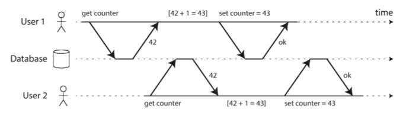

**Durability** _( 持久性 )_

- The purpose of a database system is to **provide a safe place where data can be stored without fear of losing it**.
    - Durability is the promise that **once a transaction has committed successfully, any data it has written will not be forgotten, even if there is a hardware fault or the database crashes**.
- In a single-node database, durability typically means that **the data has been written to nonvolatile storage** such as a hard drive or SSD.
    - It usually also involves a **write-ahead log** or similar, which allows recovery in the event that the data structures on disk are corrupted.
    - In a replicated database, durability may mean that the data has been successfully copied to some number of nodes.
        - _In order to provide a durability guarantee,_ a database must **wait until these writes or replications are complete before reporting a transaction as successfully committed**.

#### Single-Object and Multi-Object Operations

_( 单对象与多对象事务操作 )_

_To recap, in ACID, atomicity and isolation describe what the database should do_ if a client makes several writes within the same transaction :

- Atomicity
    - If an error occurs halfway through a sequence of writes, the transaction should be aborted, and the writes made up to that point should be discarded.
    - _In other words, the database saves you from having to worry about partial failure, by giving an all-or-nothing guarantee._
- Isolation
    - Concurrently running transactions shouldn't interfere with each other.
    - _For example, if one transaction makes several writes, then another transaction should see either all or none of those writes, but not some subset._

**Single-object write**

- Storage engines almost universally aim to provide atomicity and isolation on the level of a single object ( such as a key-value pair ) on one node.
    - Atomicity can be implemented using a log for crash recovery, and
    - isolation can be implemented using a lock on each object ( allowing only one thread to access an object at any one time ) .
- _Some databases also provide more complex atomic operations,_
    - _such as an increment operation, which removes the need for a **read-modify-write** cycle._
    - _Similarly popular is a **compare-and-set ( CAS )** operation, which allows a write to happen only if the value has not been concurrently changed by someone else._
- _These single-object operations are useful, as they can prevent lost updates when several clients try to write to the same object concurrently._
    - _However, they are not transactions in the usual sense of the word._
    - Compare-and-set and other single-object operations have been dubbed _( 号称 )_ "lightweight transactions" or even "ACID" for marketing purposes, but that terminology is misleading.
    - A transaction is usually understood as a mechanism for grouping multiple operations on multiple objects into one unit of execution.

**The need for multi-object transactions**

- Many distributed datastores have abandoned multi-object transactions because they are difficult to implement across partitions, and they can get in the way in some scenarios where very high availability or performance is required.
- _In many other cases writes to several different objects need to be coordinated :_
    - _In a relational data model, a row in one table often has a foreign key reference to a row in another table._
        - _( Similarly, in a graph-like data model, a vertex has edges to other vertices. )_
        - _Multi-object transactions allow you to ensure that these references remain valid : when inserting several records that refer to one another, the foreign keys have to be correct and up to date, or the data becomes nonsensical._
    - In a document data model, the fields that need to be updated together are often within the same document, which is treated as a single object -- no multi-object transactions are needed when updating a single document.
        - However, document databases lacking join functionality also encourage **denormalization**.
        - When denormalized information needs to be updated, you need to update several documents in one go.
        - _Transactions are very useful in this situation to prevent denormalized data from going out of sync._
    - In databases with secondary indexes ( almost everything except pure key-value stores ), the indexes also need to be updated every time you change a value.
        - _These indexes are different database objects from a transaction point of view :_
            - _for example, without transaction isolation, it's possible for a record to appear in one index but not another, because the update to the second index hasn't happened yet._

**Handling errors and aborts**

- _A key feature of a transaction is that_ it can be aborted and safely retried if an error occurred.
    - _ACID databases are based on this philosophy :_ if the database is in danger of violating its guarantee of atomicity, isolation, or durability, it would rather abandon the transaction entirely than allow it to remain half-finished.
- _Not all systems follow that philosophy, though._
    - In particular, **datastores with leader‐less replication work much more on a "best effort" basis**,
    - which could be summarized as "the database will do as much as it can, and if it runs into an error, it won't undo something it has already done" -- so it's the application's responsibility to recover from errors.
- **The whole point of aborts is to enable safe retries.** _( 支持重试是中止流程的重点 )_
- _Although retrying an aborted transaction is a simple and effective error handling mechanism, it isn't perfect :_
    - _If the transaction actually succeeded, but the network failed while the server tried to acknowledge the successful commit to the client ( so the client thinks it failed ),_
        - then retrying the transaction causes it to be performed twice -- unless you have an additional application-level deduplication mechanism in place.
        - _( icehe : 重复执行, 可能导致冗余数据的问题 )_
    - _If the error is due to overload, retrying the transaction will make the problem worse, not better._
        - To avoid such feedback cycles, you can limit the number of retries, use **exponential backoff** _( 指数退避 )_ , and handle overload-related errors differently from other errors ( if possible ).
        - _( icehe : 无脑重试, 可能导致服务雪崩的问题 )_
    - _It is only worth retrying after transient errors ( for example due to deadlock, isolation violation, temporary network interruptions, and failover ) ;_
        - after a permanent error ( e.g., constraint violation ) a retry would be pointless.
        - _( icehe : 永久性故障, 不应该重试; 实践中图省事, 经常不区分失败的情况就进行重试 )_
    - _If the transaction also has side effects outside of the database, those side effects may happen even if the transaction is aborted._
        - _For example, if you're sending an email, you wouldn't want to send the email again every time you retry the transaction._
        - If you want to make sure that several different systems either commit or abort together, **two-phase commit** _( 两阶段提交 )_ can help.
        - _( icehe : 注意事务相关操作的副作用 -- 可能在事务前后进行一些其它操作, 例如发短信/邮件 )_
    - _If the client process fails while retrying, any data it was trying to write to the database is lost._

### Weak Isolation Levels

 _( 弱隔离级别 )_

Databases have long tried to **hide concurrency issues from application developers by providing transaction isolation**.

- In theory, isolation should make your life easier by letting you **pretend that no concurrency is happening** :
    - **serializable isolation**  _( 串行化隔离 )_ means that the database **guarantees that transactions have the same effect as if they ran serially** _( i.e., one at a time, without any concurrency )_ .
- Serializable isolation has a performance cost, and many databases don't want to pay that price.
    - It's therefore common for systems to use **weaker levels of isolation**, which protect against some concurrency issues, but not all.
    - _Those levels of isolation are much harder to understand, and they can lead to subtle bugs, but they are nevertheless used in practice._

#### Read Committed

 _( 读提交 )_

The most basic level of transaction isolation is **read committed**. _It makes two guarantees:_

1. When reading from the database, you will **only see data that has been committed** ( no **dirty reads** ) .
2. When writing to the database, you will **only overwrite data that has been committed** ( no **dirty writes** ) .

**No dirty reads**

- _Imagine a transaction has written some data to the database, but the transaction has not yet committed or aborted._
    - Can another transaction see that uncommitted data? If yes, that is called a dirty read.
- _omitted…_

**No dirty writes**

- _What happens if two transactions concurrently try to update the same object in a database?_
    - _We don't know in which order the writes will happen, but we normally assume that the later write overwrites the earlier write._
    - _However, what happens if the earlier write is part of a transaction that has not yet committed,_ so the later write overwrites an uncommitted value? This is called a dirty write.
- Transactions running at the read committed isolation level must prevent dirty writes, usually by **delaying the second write until the first write's transaction has committed or aborted**.

**Implementing read committed**

- Read committed is **the default setting** _in Oracle 11g, PostgreSQL, SQL Server 2012, MemSQL, and many other databases._
- _Prevent dirty writes_
    - Most commonly, databases prevent dirty writes by using **row-level locks** _( 行级锁 )_ :
    - when a transaction wants to modify a particular object ( row or document ) , it must first acquire a lock on that object.
    - It must then hold that lock until the transaction is committed or aborted.
    - _Only one transaction can hold the lock for any given object;_
        - _if another transaction wants to write to the same object, it must wait until the first transaction is committed or aborted before it can acquire the lock and continue._
    - _This locking is done automatically by databases in read committed mode ( or stronger iso‐ lation levels ) ._
- _Prevent dirty reads_
    - _How do we prevent dirty reads? One option would be to_ use the same lock, and to require any transaction that wants to read an object to briefly acquire the lock and then release it again immediately after reading.
        - _This would ensure that a read couldn't happen while an object has a dirty, uncommitted value ( because during that time the lock would be held by the transaction that has made the write ) ._
        - _( icehe : 性能太差 -- 加大延迟, 降低吞吐 )_
    - _However, the approach of requiring read locks does not work well in practice,_
        - because one long-running write transaction can force many read-only transactions to wait until the long-running transaction has completed.
        - _This harms the response time of read-only transactions and is bad for operability :_
            - a slowdown in one part of an application can have a knock-on ( 使产生连锁反应的 ) effect in a completely different part of the applica‐ tion, due to waiting for locks.
    - _For that reason, most databases prevent dirty reads_ using the approach illustrated below  :
        - for every object that is written, the database **remembers both the old committed value and the new value set by the transaction that currently holds the write lock**.
        - While the transaction is ongoing, any other transactions that read the object are simply given the old value.
        - Only when the new value is committed do transactions switch over to reading the new value.

#### Snapshot Isolation and Repeatable Read

_( 快照级别隔离与可重复读 )_

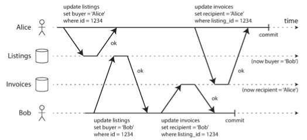

- _Say Alice has $1,000 of savings at a bank, split across two accounts with $500 each._
    - _Now a transaction transfers $100 from one of her accounts to the other._
    - _If she is unlucky enough to look at her list of account balances in the same moment as that transaction is being processed, she may see one account balance at a time before the incoming payment has arrived ( with a balance of $500 ) , and the other account after the outgoing transfer has been made ( the new balance being $400 ) ._
    - _To Alice it now appears as though she only has a total of $900 in her accounts -- it seems that $100 has vanished into thin air._
- This anomaly is called a **nonrepeatable read** or **read skew** _( 不可重复读 或 读倾斜 )_.

_Snapshot isolation is the most common solution to this problem._

- The idea is that each transaction reads from a consistent snapshot of the database --
    - that is, the transaction sees all the data that was committed in the database at the start of the transaction.
- Even if the data is subsequently changed by another transaction,
    - each transaction sees only the old data from that particular point in time.

_Snapshot isolation is a boon ( 愉快/慷慨的 ) for long-running, read-only queries such as backups and analytics._

- _It is very hard to reason about the meaning of a query if the data on which it operates is changing at the same time as the query is executing._
- When a transaction can see a consistent snapshot of the database, frozen at a particular point in time, it is much easier to understand.

_Snapshot isolation is a popular feature : it is supported by PostgreSQL, MySQL with the InnoDB storage engine, Oracle, SQL Server, and others._

**Implementing snapshot isolation**

- The database must potentially **keep several different committed versions of an object**,
    - _because various in-progress transactions may need to see the state of the database at different points in time._
- _Because it maintains several versions of an object side by side, this technique is known as_ **multi-version concurrency control ( MVCC )** _( 多版本并发控制 )_ .
    - _A typical approach is that_ read committed uses a separate snapshot for each query,
    - while snapshot isolation uses the same snapshot for an entire transaction.
- _When a transaction is started, it is given a unique, always-increasing_ **transaction ID ( txid )** .
    - _Whenever a transaction writes anything to the database,_ **the data it writes is tagged with the transaction ID of the writer**.

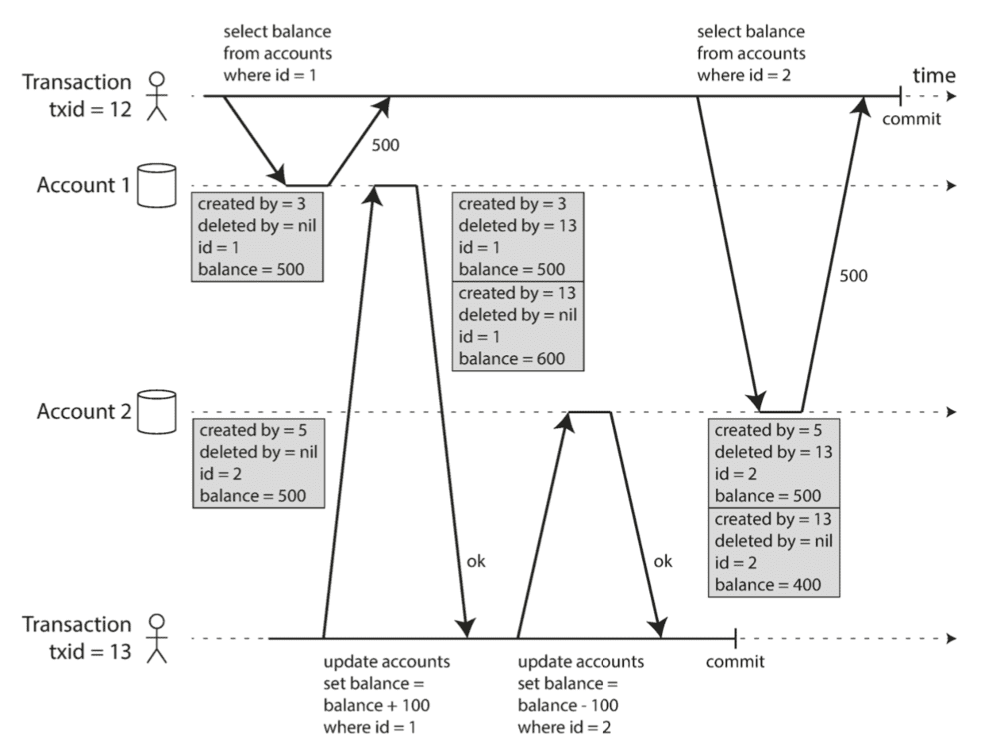

- Each row in a table has a **created_by** field, containing the ID of the transaction that inserted this row into the table.
- Moreover, each row has a **deleted_by** field, which is initially empty.
    - If a transaction deletes a row, the row isn't actually deleted from the database, but it is marked for deletion by setting the deleted_by field to the ID of the transaction that requested the deletion.
    - _At some later time, when it is certain that no transaction can any longer access the deleted data, a garbage collection process in the database removes any rows marked for deletion and frees their space._
- An update is internally translated into a delete and a create.

**Visibility rules for observing a consistent snapshot** _( 一致性快照的可见性规则 )_

- _When a transaction reads from the database,_ transaction IDs are used to decide which objects it can see and which are invisible.
- _By carefully defining visibility rules, the database can present a consistent snapshot of the database to the application._ This works as follows:
    - 1\. At the start of each transaction, the database makes a list of all the other transactions that are in progress ( not yet committed or aborted ) at that time.
        - Any writes that those transactions have made are ignored, even if the transactions subsequently commit.
    - 2\. Any writes made by aborted transactions are ignored.
    - 3\. Any writes made by transactions with a later transaction ID ( i.e., which started after the current transaction started ) are ignored, regardless of whether those transactions have committed.
    - 4\. All other writes are visible to the application's queries.
- _Put another way, an object is visible if both of the following conditions are true :_
    - At the time when the reader's transaction started, the transaction that created the object had already committed.
    - The object is not marked for deletion, or if it is, the transaction that requested deletion had not yet committed at the time when the reader's transaction started.

**Indexes and snapshot isolation**

- _How do indexes work in a multi-version database?_
- A. One option is to have **the index simply point to all versions of an object and require an index query to filter out any object versions that are not visible to the current transaction**.
    - _When garbage collection removes old object versions that are no longer visible to any transaction, the corresponding index entries can also be removed._
- B. _Another approach is used in CouchDB, Datomic, and LMDB._
    - Although they also use B-trees, they use an **append-only/copy-on-write** _( 追加/写时复制 )_ variant that does **not overwrite pages of the tree when they are updated, but instead creates a new copy of each modified page**.
    - _Parent pages, up to the root of the tree, are copied and updated to point to the new versions of their child pages._
    - _Any pages that are not affected by a write do not need to be copied, and remain immutable._
- C. With append-only B-trees, every write transaction ( or batch of transactions ) **creates a new B-tree root, and a particular root is a consistent snapshot of the database at the point in time when it was created**.
    - There is no need to filter out objects based on transaction IDs because subsequent writes cannot modify an existing B-tree; they can only create new tree roots.
    - _However, this approach also requires a background process for compaction and garbage collection._
- _( icehe : 看的还不是很明白 2020-06-28 )_

**Repeatable read and naming confusion** _( 可重复读与命名混淆 )_

- _Snapshot isolation is a useful isolation level, especially for read-only transactions._
    - _However, many databases that implement it call it by different names._
    - In Oracle it is called **serializable** _( 可串行化 )_ , and in PostgreSQL and MySQL it is called **repeatable read**.
- _The reason for this naming confusion is that the_ SQL standard doesn't have the concept of snapshot isolation,
    - _because the standard is based on System R's 1975 definition of isolation levels and snapshot isolation hadn't yet been invented then._
    - Instead, it defines repeatable read, which looks superficially similar to snapshot isolation.
    - PostgreSQL and MySQL call their snapshot isolation level repeatable read because it meets the requirements of the standard, and so they can claim standards compliance.

#### Preventing Lost Updates

**Atomic write operations** _( 原子写操作 )_

- Many databases provide **atomic update operations**, which remove the need to implement **read-modify-write cycles** in application code.
    - They are usually the **best solution if your code can be expressed in terms of those atomic operations**.
- Atomic operations are usually implemented by taking an **exclusive lock** _( 排它锁 )_ on the object _when it is read so that no other transaction can read it until the update has been applied._
    - This technique is sometimes known as **cursor stability** _( 游标稳定性 )_ .
    - Another option is to simply **force all atomic operations to be executed on a single thread**.

**Explicit locking** _( 显式加锁 )_

- _Another option for preventing lost updates, if the database's built-in atomic operations don't provide the necessary functionality,_ is for the application to **explicitly lock objects that are going to be updated**.

**Automatically detecting lost updates** _( 自动检测更新消失 )_

- _An alternative is to_ allow them to execute in parallel and, if the transaction manager detects a lost update, abort the transaction and force it to retry its read-modify-write cycle.
- _An advantage of this approach is that databases can perform this check efficiently in conjunction with snapshot isolation._
    - Indeed, PostgreSQL's repeatable read, Oracle's serializable, and SQL Server's snapshot isolation levels automatically detect when a lost update has occurred and abort the offending transaction.
    - However, **MySQL/ InnoDB's repeatable read does not detect lost updates**.
    - _Some authors argue that a database must prevent lost updates in order to qualify as providing snapshot isolation, so MySQL does not provide snapshot isolation under this definition._

**Compare-and-set** _( 原子比较与设置 )_

- _In databases that don't provide transactions, you sometimes find an atomic compare-and-set operation._
    - The purpose of this operation is to **avoid lost updates by allowing an update to happen only if the value has not changed since you last read it**.
    - _If the current value does not match what you previously read, the update has no effect, and the read-modify-write cycle must be retried._

**Conflict resolution and replication** _( 冲突解决复制 )_

- Locks and compare-and-set operations assume that there is a single up-to-date copy of the data.
    - However, databases with multi-leader or leaderless replication usually allow several writes to happen concurrently and replicate them asynchronously, so they cannot guarantee that there is a single up-to-date copy of the data.
    - _Thus, techniques based on locks or compare-and-set do not apply in this context._
- _A common approach in such replicated databases is to_ **allow concurrent writes to create several conflicting versions of a value ( also known as siblings ) , and to use application code or special data structures to resolve and merge these versions after the fact**.
- Atomic operations can work well in a replicated context, especially if they are **commutative** _( 可交换的 )_ ( i.e., you can **apply them in a different order on different replicas, and still get the same result** ) .
    - _For example, incrementing a counter or adding an element to a set are commutative operations._
- _On the other hand, the last write wins (LWW) conflict resolution method is prone to lost updates._
    - _Unfortunately, LWW is the default in many replicated databases._

#### Write Skew and Phantoms

 _( 写倾斜和幻读 )_

**Characterizing write skew**

- _( icehe : "写倾斜" 跟 "脏写" 和 "更新丢失" 相比, 是更为微妙的写冲突现象, 详见原书 )_

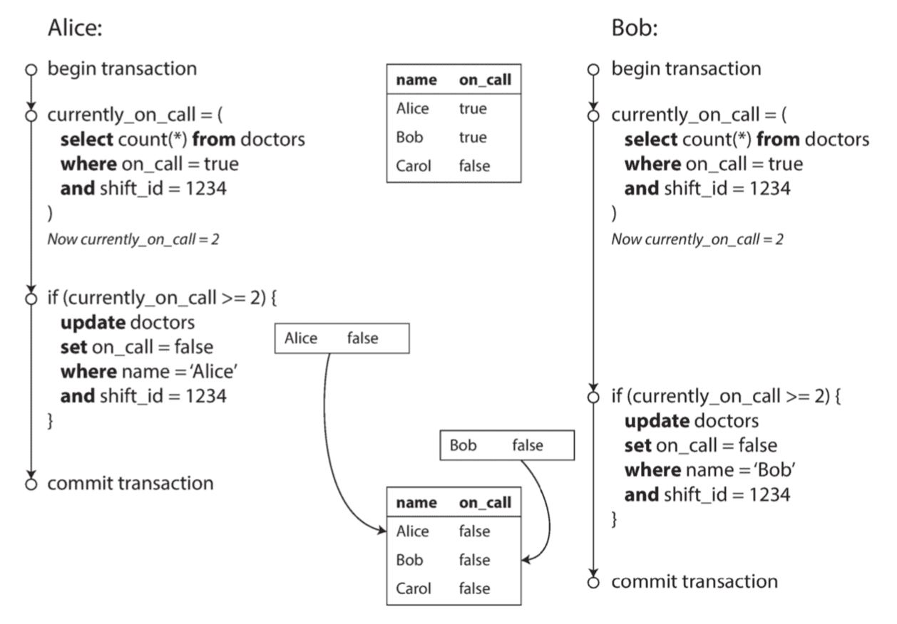

- _Explain the example above :_
    - _In each transaction, your application first checks that two or more doctors are currently on call; if yes, it assumes it's safe for one doctor to go off call._
    - _Since the database is using snapshot isolation, both checks return 2, so both transactions proceed to the next stage._
    - _Alice updates her own record to take herself off call, and Bob updates his own record likewise._
    - _Both transactions commit, and now no doctor is on call._
    - _Your requirement of having at least one doctor on call has been violated._
- _With write skew, our optional ways of preventing lost updates are more restricted:_
    - _Atomic single-object operations don't help, as multiple objects are involved._
    - The automatic detection of lost updates that you find in some implementations of snapshot isolation unfortunately doesn't help either :
        - _write skew is not automatically detected in PostgreSQL's repeatable read, MySQL/InnoDB's repeatable read, Oracle's serializable, or SQL Server's snapshot isolation level._
        - **Automatically preventing write skew requires true serializable isolation**.
    - _Some databases allow you to configure constraints, which are then enforced by the database ( e.g., uniqueness, foreign key constraints, or restrictions on a particular value )._
        - However, in order to specify that at least one doctor must be on call, you would need a constraint that involves multiple objects.
        - Most databases do not have built-in support for such constraints, but you may be able to implement them with triggers or materialized views, depending on the database.
    - If you can't use a serializable isolation level, the second-best option in this case is probably to **explicitly lock the rows that the transaction depends on**.
        - _In the doctors example, you could write something like the following:_

```sql
BEGIN TRANSACTION;

SELECT * FROM doctors
    WHERE on_call = true
    AND shift_id = 1234 FOR UPDATE;

UPDATE doctors
    SET on_call = false WHERE name = 'Alice' AND shift_id = 1234;

COMMIT;
```

- As before, `FOR UPDATE` tells the database to lock all rows returned by this query.

**More examples of write skew**

- _( 详见原书 )_

**Phantoms causing write skew** _( 幻读导致写倾斜 )_

- This effect, where a write in one transaction changes the result of a search query in another transaction, is called a **phantom** _( 幻读 )_ .
    - Snapshot isolation avoids phantoms in read-only queries, but in read-write transactions, phantoms can lead to particularly tricky cases of write skew.

**Materializing conflicts** _( 实例化冲突 )_

- _If the problem of phantoms is that there is no object to which we can attach the locks, perhaps we can artificially introduce a lock object into the database._
- This approach is called **materializing conflicts**, because it takes a phantom and turns it into a lock conflict on a concrete set of rows that exist in the database.
    - _Unfortunately, it can be hard and error-prone ( 容易出错 ) to figure out how to materialize conflicts, and it's ugly to let a concurrency control mechanism leak into the application data model._
    - _For those reasons, materializing conflicts should be considered a last resort if no alternative is possible._
    - **A serializable isolation level is much preferable in most cases**.

### Serializability

_( 串行化 )_

Serializable isolation is usually regarded as the strongest isolation level.

- It guarantees that **even though transactions may execute in parallel, the end result is the same as if they had executed one at a time, serially, without any concurrency**.
- _Thus, the database guarantees that if the transactions behave correctly when run individually, they continue to be correct when run concurrently -- in other words, the database prevents all possible race conditions._

_Most databases that provide serializability today use one of three techniques :_

- Literally **executing transactions in a serial order** _( 严格按照串行顺序执行 )_ .
- **Two-phase locking**, which for several decades was the only viable option.
- **Optimistic concurrency control** techniques such as serializable snapshot isolation.

#### Actual Serial Execution

_( 实际串行执行 )_

The simplest way of avoiding concurrency problems is to **remove the concurrency entirely** : to **execute only one transaction at a time, in serial order, on a single thread**.

- _The approach of executing transactions serially is_ implemented in VoltDB/H-Store, Redis, and Datomic.
- _A system designed for single-threaded execution can sometimes perform better than a system that supports concurrency,_ because it can avoid the coordination overhead of locking.
- However, its throughput is limited to that of a single CPU core.

**Encapsulating transactions in stored procedures** _( 采取存储过程封装事务 )_

- _omitted…_
- Systems with single-threaded serial transaction processing don't allow interactive multi-statement transactions.
    - Instead, the application must submit the entire transaction code to the database ahead of time, as a stored procedure.
    - Provided that all data required by a transaction is in memory, the stored procedure can execute very fast, without waiting for any network or disk I/O.

**Pros and cons of stored procedures** _( 存储过程的优缺点 )_

- _omitted…_
- _Disadvantages :_
    - Code running in a database is difficult to manage : compared to an application server, it's harder to debug, more awkward to keep in version control and deploy, trickier to test, and difficult to integrate with a metrics collection system for monitoring.
    - A database is often much more performance-sensitive than an application server, because a single database instance is often shared by many application servers.
        - A badly written stored procedure ( e.g., using a lot of memory or CPU time ) in a database can cause much more trouble than equivalent badly written code in an application server.
- _Modern implementations of stored procedures have abandoned PL/SQL and use existing general-purpose programming languages instead :_
    - _VoltDB uses Java or Groovy, Datomic uses Java or Clojure, and Redis uses Lua._

**Partitioning**

- Executing all transactions serially makes concurrency control much simpler, but limits the transaction throughput of the database to the speed of a single CPU core on a single machine.
    - _Read-only transactions may execute elsewhere, using snapshot isolation, but for applications with high write throughput, the single-threaded transaction processor can become a serious bottleneck._
- _In order to scale to multiple CPU cores, and multiple nodes, you can potentially partition your data._
    - _If you can find a way of partitioning your dataset so that each transaction only needs to read and write data within a single partition, then each partition can have its own transaction processing thread running independently from the others._
    - _In this case,_ you can give each CPU core its own partition, which allows your transaction throughput to scale linearly with the number of CPU cores.
- _For any transaction that needs to access multiple partitions, the database must coordinate the transaction across all the partitions that it touches._
    - The stored procedure needs to be performed in lock-step across all partitions to ensure serializability across the whole system.

**Summary of serial execution**

- _Serial execution of transactions has become a viable way of achieving serializable isolation within certain constraints :_
    - Every transaction must be small and fast, because it takes only one slow transaction to stall all transaction processing.
    - It is limited to use cases where the active dataset can fit in memory.
        - Rarely accessed data could potentially be moved to disk, but if it needed to be accessed in a single-threaded transaction, the system would get very slow.
        - **If a transaction needs to access data that's not in memory, the best solution may be to abort the transaction, asynchronously fetch the data into memory while continuing to process other transactions, and then restart the transaction when the data has been loaded**. This approach is known as **anti-caching** _( 反高速缓存 )_ .
    - Write throughput must be low enough to be handled on a single CPU core, or else transactions need to be partitioned without requiring cross-partition coordination.
    - Cross-partition transactions are possible, but there is a hard limit to the extent to which they can be used.

#### Two-Phase Locking (2PL)

 _( 两阶段加锁 )_

_For around 30 years,_ there was **only one widely used algorithm for serializability in databases** : **two-phase locking (2PL)**.

- **2PL is not 2PC**
    - _Note that while two-phase locking (2PL) sounds very similar to **two-phase commit (2PC)**, they are completely different things._
- Sometimes called **strong strict two-phase locking ( SS2PL )** to distinguish it from other variants of 2PL.

As soon as anyone wants to write ( modify or delete ) an object, exclusive access is required :

- If transaction A has read an object and transaction B wants to write to that object, B must wait until A commits or aborts before it can continue.
    - _( This ensures that B can't change the object unexpectedly behind A's back. )_
- If transaction A has written an object and transaction B wants to read that object, B must wait until A commits or aborts before it can continue.
    - _( Reading an old version of the object, is not acceptable under 2PL. )_

_In 2PL, writers don't just block other writers; they also block readers and vice versa._

**Implementation of two-phase locking** _( 实现两阶段加锁 )_

- _The blocking of readers and writers is implemented by a having a lock on each object in the database._
- The lock can either be in **shared mode** or in **exclusive mode**. _The lock is used as follows :_
    - If a transaction wants to **read an object, it must first acquire the lock in shared mode**.
        - Several transactions are allowed to hold the lock in shared mode simultaneously, but if another transaction already has an exclusive lock on the object, these transactions must wait.
    - If a transaction wants to **write to an object, it must first acquire the lock in exclusive mode**.
        - No other transaction may hold the lock at the same time ( either in shared or in exclusive mode ), so if there is any existing lock on the object, the transaction must wait.
    - If a transaction **first reads and then writes an object, it may upgrade its shared lock to an exclusive lock**.
        - _The upgrade works the same as getting an exclusive lock directly._
    - After a transaction has acquired the lock, it **must continue to hold the lock until the end of the transaction ( commit or abort )** .
        - This is where the name "two-phase" comes from :
            - **the first phase ( while the transaction is executing ) is when the locks are acquired**, and
            - **the second phase ( at the end of the transaction ) is when all the locks are released**.
- _Since so many locks are in use, it can happen quite easily that transaction A is stuck waiting for transaction B to release its lock, and vice versa._
    - This situation is called **deadlock**.
    - _The database automatically detects deadlocks between transactions and aborts one of them so that the others can make progress._
    - _The aborted transaction needs to be retried by the application._

**Performance of two-phase locking**

- _( icehe : 反正就是容易导致 死锁产生 / 长时间等待 / 低吞吐量 / 长耗时 / 请求失败 / 服务停顿 … )_
- _omitted…_

**Predicate locks** _( 谓词锁 )_

- _It works similarly to the shared/exclusive lock described earlier,_ but rather than belonging to a particular object ( e.g., one row in a table ), it belongs to all objects that match some search condition, _such as :_

```sql
SELECT * FROM bookings
    WHERE room_id = 123 AND
        end_time > '2018-01-01 12:00' AND
        start_time < '2018-01-01 13:00';
```

- _The key idea here is that_ a predicate lock applies even to objects that do not yet exist in the database, but which might be added in the future ( phantoms ) .
    - _If two-phase locking includes predicate locks, the database prevents all forms of write skew and other race conditions, and so its isolation becomes serializable._

**Index-range locks** _( 索引区间锁 )_

- _Unfortunately, predicate locks do not perform well : if there are many locks by active transactions, checking for matching locks becomes time-consuming._
    - For that reason, **most databases with 2PL actually implement index-range locking** _( 索引区间锁 )_ ( aka. **next-key locking** _( 间隙锁 )_ ) , _which is a simplified approximation of predicate locking._
- It's safe to **simplify a predicate by making it match a greater set of objects**.
    - Either way, **an approximation of the search condition is attached to one of the indexes**.
    - _Now, if another transaction wants to insert, update, or delete a booking for the same room and/or an overlapping time period, it will have to update the same part of the index._
    - _In the process of doing so, it will encounter the shared lock, and it will be forced to wait until the lock is released._
- _Index-range locks are not as precise as predicate locks would be_
    - ( they **may lock a bigger range of objects than is strictly necessary to maintain serializability** ) ,
    - but since **they have much lower overheads**, they are a good compromise.

#### Serializable Snapshot Isolation (SSI)

_( 可串行的快照隔离 )_

Are serializable isolation and good performance fundamentally at odds with each other?

- Perhaps not : an algorithm called **serializable snapshot isolation (SSI)** is very promising.
    - _It provides full serializability, but has only a small performance penalty compared to snapshot isolation._
    - _SSI is fairly new: it was first described in 2008._

**Pessimistic versus optimistic concurrency control** _( 悲观与乐观并发控制 )_

- **Two-phase locking is a so-called pessimistic concurrency control mechanism** :
    - it is based on the principle that if anything might possibly go wrong ( as indicated by a lock held by another transaction ), it's better to wait until the situation is safe again before doing anything.
    - _It is like mutual exclusion, which is used to protect data structures in multi-threaded programming._
- **Serial execution is, in a sense, pessimistic to the extreme** :
    - _it is essentially equivalent to each transaction having an exclusive lock on the entire database ( or one partition of the database ) for the duration of the transaction._
    - _We compensate for the pessimism by making each transaction very fast to execute, so it only needs to hold the "lock" for a short time._
- By contrast, **serializable snapshot isolation is an optimistic concurrency control technique**.
    - _Optimistic in this context means that_ instead of blocking if something potentially dangerous happens, transactions continue anyway, in the hope that everything will turn out all right.
    - When a transaction wants to commit, the database checks whether anything bad happened ( i.e., whether isolation was violated );
        - if so, the transaction is aborted and has to be retried.
    - _Only transactions that executed serializably are allowed to commit._
- On top of snapshot isolation, **SSI adds an algorithm for detecting serialization conflicts among writes and determining which transactions to abort**.

**Decisions based on an outdated premise** _( 基于过期的条件做决定 )_

- _We observed a recurring pattern : a transaction reads some data from the database, examines the result of the query, and decides to take some action ( write to the database ) based on the result that it saw._
- _To be safe,_ the database needs to assume that any change in the query result ( the premise ) means that writes in that transaction may be invalid.
    - In order to provide serializable isolation, the database must **detect situations in which a transaction may have acted on an outdated premise _( 前提 )_ and abort the transaction in that case**.
- _How does the database know if a query result might have changed? There are two cases to consider:_
    - **Detecting reads of a stale MVCC object version ( uncommitted write occurred before the read )**
    - **Detecting writes that affect prior reads ( the write occurs after the read )**

**Detecting stale MVCC reads** _( 检测是否读取了过期的 MVCC 对象 )_

- _Recall that_ snapshot isolation is usually implemented by **multi-version concurrency control (MVCC)** .
- The database **needs to track when a transaction ignores another transaction's writes due to MVCC visibility rules**.
    - **When the transaction wants to commit, the database checks whether any of the ignored writes have now been committed.**
    - **If so, the transaction must be aborted.**
- _omitted…_
- By **avoiding unnecessary aborts**, SSI preserves snapshot isolation's support for long-running reads from a consistent snapshot.

**Detecting writes that affect prior reads** _( 检测写是否影响了之前的读 )_

- _( 详情见原书, 不赘述例子, 但它值得温习 )_
- When a transaction writes to the database, it must look in the indexes for any other transactions that have recently read the affected data.
    - This process is similar to acquiring a write lock on the affected key range, but rather than blocking until the readers have committed, the lock acts as a tripwire _( 绊网 / 单绊线入侵检测? )_ :
        - it simply notifies the transactions that the data they read may no longer be up to date.
- _( icehe : 数据库检测到多个事务间可能存在的冲突时, (可能受影响的) 后提交的事务会被中止 )_

**Performance of serializable snapshot isolation**_( 可串行化隔离的性能 )_

- Compared to two-phase locking, the big advantage of serializable snapshot isolation is that **one transaction doesn't need to block waiting for locks held by another transaction**.
    - _Like under snapshot isolation, writers don't block readers, and vice versa._
    - This design principle makes query latency much more predictable and less variable.
    - In particular, read-only queries can run on a consistent snapshot without requiring any locks, which is very appealing for read-heavy workloads.
- _Compared to serial execution, serializable snapshot isolation is not limited to the throughput of a single CPU core :_
    - _FoundationDB distributes the detection of serialization conflicts across multiple machines, allowing it to scale to very high throughput._
    - _Even though data may be partitioned across multiple machines, transactions can read and write data in multiple partitions while ensuring serializable isolation._
- The rate of aborts significantly affects the overall performance of SSI. _( 事务中止的比例显著影响 SSI 的性能表现 )_
    - For example, a transaction that reads and writes data over a long period of time is likely to run into conflicts and abort,
        - so SSI requires that read-write transactions be fairly short ( long-running read-only transactions may be okay ).
    - _However, SSI is probably less sensitive to slow transactions than two-phase locking or serial execution._

### Summary

We characterized those isolation levels by discussing various examples of **race conditions** :

- **Dirty reads**
    - One client reads another client's writes before they have been committed.
    - The read committed isolation level and stronger levels prevent dirty reads.
- **Dirty writes**
    - One client overwrites data that another client has written, but not yet committed.
    - Almost all transaction implementations prevent dirty writes.
- **Read skew ( nonrepeatable reads )**
    - _( 在同一个事务内 )_ A client sees different parts of the database at different points in time.
    - This issue is most commonly prevented with **snapshot isolation**, which allows a transaction to read from a consistent snapshot at one point in time.
    - It is usually implemented with **multi-version concurrency control (MVCC)**.
- **Lost updates**
    - Two clients concurrently perform a read-modify-write cycle.
    - One overwrites the other's write without incorporating its changes, so data is lost.
    - Some implementations of snapshot isolation prevent this anomaly automatically, while others require a **manual lock ( SELECT FOR UPDATE )**.
- **Write skew**
    - A transaction reads something, makes a decision based on the value it saw, and writes the decision to the database.
    - However, by the time the write is made, the premise of the decision is no longer true.
    - Only **serializable isolation** prevents this anomaly.
- **Phantom reads**
    - A transaction reads objects that match some search condition.
    - Another client makes a write that affects the results of that search.
    - **Snapshot isolation** prevents straightforward phantom reads, but phantoms in the context of write skew require special treatment, such as **index-range locks**.

We discussed three different approaches to implementing serializable transactions :

- **Literally executing transactions in a serial order**
    - If you can make each transaction very fast to execute, and the transaction throughput is low enough to process on a single CPU core, this is a simple and effective option.
- **Two-phase locking**
    - For decades this has been **the standard way of implementing serializability**, but many applications **avoid using it because of its performance characteristics**.
- **Serializable snapshot isolation ( SSI )**
    - _A fairly new algorithm that avoids most of the downsides of the previous approaches._
    - It uses an optimistic approach, allowing transactions to proceed without blocking.
    - When a transaction wants to commit, it is checked, and it is aborted if the execution was not serializable. _( icehe : 这里的总结太模糊, 详见上文/原书的例子 )_

Note that

- _The examples in this chapter_ used a relational data model.
- _In this chapter, we explored ideas and algorithms mostly_ in the context of a database running on a single machine.
    - _Transactions in distributed databases open a new set of difficult challenges._

## The Trouble with Distributed Systems

- We will now turn our pessimism to the maximum and assume that **anything that can go wrong will go wrong**.
    - _Experienced systems operators will tell you **that is a reasonable assumption**._
- We will look into problems with **networks**; **clocks and timing** issues; and we'll discuss to **what degree they are avoidable** _( 问题的可控程度 )_ .

### Faults and Partial Failures

_( 故障与部分失效 )_

- _omitted…_

#### Cloud Computing and Supercomputing

_( 云计算和超算 )_

- High-Performance Computing (HPC) _( 例如, 超级计算机 )_
- _omitted…_

If we want to make distributed systems work, we must accept the possibility of partial failure and build fault-tolerance mechanisms into the software.

- In other words, we need to **build a reliable system from unreliable components**.
- **There is no such thing as perfect reliability, so we'll need to understand the limits of what we can realistically promise**.
- _( 世界上没有完美的可靠性, 我们需要的是现实可行的保证 )_

### Unreliable Networks

- _omitted…_
- The usual way of handling this issue is a **timeout** :
    - after some time you give up waiting and assume that the response is not going to arrive.

#### Network Faults in Practice

_( 现实中的网络故障 )_

- _omitted…_

#### Detecting Faults

_( 检测故障 )_

- _omitted…_

#### Timeouts and Unbounded Delays

_( 超时与无限期的延迟 )_

- _omitted…_

**Network congestion and queueing** _( 网络拥堵与排队 )_

- _omitted…_

#### Synchronous Versus Asynchronous Networks

_( 同步与异步网络 )_

**Can we not simply make network delays predictable?** _( 我们是否可以简单地保证延迟可控 )_

- _omitted…_

### Unreliable Clocks

_( 不可靠的时钟 )_

_Clocks and time are important._ Applications depend on clocks in various ways to answer questions like the following :

1. Has this request timed out yet?
2. What's the 99th percentile response time of this service?
3. How many queries per second did this service handle on average in the last five minutes?
4. How long did the user spend on our site?
5. When was this article published?
6. At what date and time should the reminder email be sent?
7. When does this cache entry expire?
8. What is the timestamp on this error message in the log file?

#### Monotonic Versus Time-of-Day Clocks

_( "单调时钟" 与 "墙上时钟" )_

_Modern computers have at least two different kinds of clocks :_

- a time-of-day clock _( 墙上时钟 / 钟表时间 )_ _and_
- a monotonic clock _( 单调时钟 )_ .

_Although they both measure time, it is important to distinguish the two, since they serve different purposes._

**Time-of-day clocks** _( 墙上时钟 )_

- A time-of-day clock does what you intuitively expect of a clock :
    - it **returns the current date and time according to some calendar** ( aka. **wall-clock time** ).
    - _For example, `clock_gettime(CLOCK_REALTIME)` on Linux and `System.currentTimeMillis()` in Java return the number of seconds (or milliseconds) since the epoch : midnight UTC on January 1, 1970, according to the Gregorian calendar, not counting leap seconds._
- Time-of-day clocks are usually synchronized with **NTP**, which means that a timestamp from one machine (ideally) means the same as a timestamp on another machine.
    - In particular, **if the local clock is too far ahead of the NTP server, it may be forcibly reset and appear to jump back to a previous point in time**.
    - These jumps, as well as the fact that **they often ignore leap seconds _( 闰秒 )_ , make time-of-day clocks unsuitable for measuring elapsed time**.
    - _( icehe : ( 可能因为出错或闰秒而 ) 时钟对齐时, 时间点会回跳或前跳, 那么用它来计算时间间隔就不靠谱了 )_

**Monotonic clocks** _( 单调时钟 )_

- A monotonic clock is **suitable for measuring a duration (time interval)**, _such as a timeout or a service's response time :_
    - `clock_gettime(CLOCK_MONOTONIC)` on Linux and `System.nanoTime()` in Java are monotonic clocks, for example.
    - The name comes from the fact that they are guaranteed to always move forward ( whereas a time-of-day clock may **jump back** _( 回拨 )_ in time ).
- _You can check the value of the monotonic clock at one point in time, do something, and then check the clock again at a later time._
    - _The difference between the two values tells you how much time elapsed between the two checks._
    - _However, the absolute value of the clock is meaningless : it might be the number of nanoseconds since the computer was started, or something similarly arbitrary._

#### Clock Synchronization and Accuracy

_( 时钟同步与准确性 )_

Monotonic clocks don't need synchronization, but time-of-day clocks need to be set according to an NTP server or other external time source in order to be useful.

- _omitted…_

#### Relying on Synchronized Clocks

_( 依赖同步的时钟 )_

**Timestamps for ordering events** _( 时间戳与事件顺序 )_

- _Let's consider one particular situation in which it is tempting, but dangerous, to rely on clocks :_ ordering of events across multiple nodes.
    - _For example,_ if two clients write to a distributed database, who got there first? Which write is the more recent one?
- _omitted…_

**Clock readings have a confidence interval** _( 时钟的置信区间 )_

- _omitted…_
- _An interesting exception is_ **Google's TrueTime API in Spanner**, which explicitly reports the confidence interval on the local clock.
    - When you ask it for the current time, you get back two values : `[earliest, latest]` , which are the earliest possible and the latest possible timestamp.
    - _Based on its uncertainty calculations, the clock knows that the actual current time is somewhere within that interval._
    - _The width of the interval depends, among other things, on how long it has been since the local quartz clock ( 本地石英钟 ) was last synchronized with a more accurate clock source._

**Synchronized clocks for global snapshots** _( 全局快照的同步时钟 )_

- _However, when a database is distributed across many machines, potentially in multiple datacenters, a global, monotonically increasing transaction ID ( across all partitions ) is difficult to generate, because it requires coordination._
    - **The transaction ID must reflect causality** _( 因果关系 )_ :
        - _if transaction B reads a value that was written by transaction A, then B must have a higher transaction ID than A -- otherwise, the snapshot would not be consistent._
- Can we **use the timestamps from synchronized time-of-day clocks as transaction IDs**?
    - If we could get the synchronization good enough, they would have the right properties : later transactions have a higher timestamp.
    - The problem, of course, is the **uncertainty about clock accuracy**.

#### Process Pauses

_( 进程暂停 )_

- _omitted…_
- A thread might be paused for long because of various reasons :
    - Many programming language runtimes ( such as the Java Virtual Machine ) have a **garbage collector (GC)** that occasionally needs to stop all running threads.
    - In **virtualized environments**, a virtual machine can be suspended ( pausing the execution of all processes and saving the contents of memory to disk ) and resumed ( restoring the contents of memory and continuing execution ) .
    - On end-user devices such as laptops, execution may also be suspended and resumed arbitrarily,
        - e.g., when the user closes the lid of their laptop _( 休眠 )_ .
    - When the **operating system context-switches** to another thread, or when the **hypervisor switches to a different virtual machine** ( when running in a virtual machine ) , the currently running thread can be paused at any arbitrary point in the code.
    - If the application performs synchronous disk access, a thread may be paused **waiting for a slow disk I/O operation to complete**.
    - If the operating system is configured to allow swapping to disk (paging), a simple memory access may result in a **page fault** that requires a page from disk to be loaded into memory.
    - A Unix process can be paused by sending it the **SIGSTOP signal**, for example by pressing Ctrl-Z in a shell.
- _( 详情看原书 )_

**Response time guarantees** _( 响应时间保证 )_

- _omitted…_

**Limiting the impact of garbage collection** _( 调整垃圾回收的影响 )_

- _omitted…_

### Knowledge, Truth, and Lies

- _omitted…_

#### The Truth Is Defined by the Majority

 _( 真相由多数决定 )_

- _omitted…_
- **A node cannot necessarily trust its own judgment of a situation**.
    - _A distributed system cannot exclusively rely on a single node, because a node may fail at any time, potentially leaving the system stuck and unable to recover._
    - Instead, **many distributed algorithms rely on a quorum**, that is, voting among the nodes :
        - _decisions require some minimum number of votes from several nodes in order to reduce the dependence on any one particular node._
- That includes decisions about declaring nodes dead.
    - If a quorum of nodes declares another node dead, then it must be considered dead, even if that node still very much feels alive.
    - **The individual node must abide by the quorum decision and step down**.

**The leader and the lock** _( 主节点与锁 )_

- _omitted…_
- If a node continues acting as the chosen one, even though the majority of nodes have declared it dead, _it could cause problems in a system that is not carefully designed._
    - Such a node could send messages to other nodes in its self-appointed capacity _( 自以为正确 )_, and **if other nodes believe it, the system as a whole may do something incorrect**.

**Fencing tokens** _( Fencing 令牌 )_

- Let's assume that every time the lock server grants a lock or lease, it also returns a **fencing token, which is a number that increases every time a lock is granted** ( e.g., incremented by the lock service ) .
    - We can then **require that every time a client sends a write request to the storage service, it must include its current fencing token**.
- Checking a token on the server side may seem like a downside, but it is arguably _( 可论证地 )_ a good thing : _it is unwise for a service to assume that its clients will always be well behaved._

#### Byzantine Faults

_( 拜占庭故障 )_

- In this book we assume that **nodes are unreliable but honest** :
    - they may be slow or never respond ( due to a fault ), and their state may be outdated ( due to a GC pause or network delays ) ,
    - but we assume that **if a node does respond, it is telling the "truth"** :
        - _to the best of its knowledge, it is playing by the rules of the protocol._
- Distributed systems problems become much harder **if there is a risk that nodes may "lie"** ( send arbitrary faulty or corrupted responses ) --
    - _for example, if a node may claim to have received a particular message when in fact it didn't._
    - Such behavior is known as a **Byzantine fault**, and the problem of reaching consensus _( 共识 )_ in this untrusting _( 不可信的 )_ environment is known as the **Byzantine Generals Problem** _( 拜占庭将军问题 )_.
- A system is **Byzantine fault-tolerant** _( 拜占庭容错 )_ if it continues to operate correctly even if some of the nodes are malfunctioning and not obeying the protocol, or if malicious attackers are interfering with the network.

**Weak forms of lying** _( 弱的谎言形式 )_

- _Although we assume that nodes are generally honest, it can be worth adding mechanisms to software that guard against weak forms of "lying" -- for example, invalid messages due to hardware issues, software bugs, and misconfiguration._
    - _Such protection mechanisms are not full-blown ( 成熟的 ) Byzantine fault tolerance, as they would not withstand ( 承受 ) a determined adversary, but they are nevertheless simple and pragmatic steps toward better reliability._

#### System Model and Reality

_( 系统模型和现实 )_

With regard to **timing assumptions** _( 计时方面的假设 )_ , three system models are in common use:

- **Synchronous model**
    - The synchronous model assumes bounded network delay, bounded process pauses, and bounded clock error.
    - _This does not imply exactly synchronized clocks or zero network delay; it just means you know that network delay, pauses, and clock drift will never exceed some fixed upper bound._
    - The synchronous model is not a realistic model of most practical systems, because unbounded delays and pauses do occur.
- **Partially synchronous model**
    - Partial synchrony means that a system behaves like a synchronous system most of the time, but it sometimes exceeds the bounds for network delay, process pauses, and clock drift.
    - This is a realistic model of many systems : most of the time, networks and processes are quite well behaved -- otherwise we would never be able to get anything done -- but we have to reckon with _( 处理/对付 )_ the fact that any timing assumptions may be shattered _( 损坏 )_ occasionally.
    - _When this happens, network delay, pauses, and clock error may become arbitrarily large._
- **Asynchronous model**
    - In this model, an algorithm is not allowed to make any timing assumptions -- in fact, it does not even have a clock ( so it cannot use timeouts ) .
    - Some algorithms can be designed for the asynchronous model, but it is very restrictive.

Moreover, besides timing issues, we have to **consider node failures** _( 考虑节点失效 )_ . The three most common system models for nodes are:

- **Crash-stop faults**
    - _In the crash-stop model, an algorithm may assume that a node can fail in only one way, namely by crashing._
    - This means that the node may suddenly stop responding at any moment, and thereafter that node is gone forever -- **it never comes back**.
- **Crash-recovery faults**
    - We assume that nodes may crash at any moment, and **perhaps start responding again after some unknown time**.
    - _In the crash-recovery model, nodes are assumed to have stable storage ( i.e., nonvolatile disk storage ) that is preserved across crashes, while the in-memory state is assumed to be lost._
- **Byzantine (arbitrary) faults**
    - Nodes may do absolutely anything, including **trying to trick and deceive other nodes**.

**Correctness of an algorithm**

- _omitted…_

**Safety and liveness** _( 安全性与活跃性 (活性) )_

- _omitted…_
    - Safety : Nothing bad ever happens.
    - Liveness : Something good eventually happens.

**Mapping system models to the real world** _( 将系统模型映射到现实世界 )_

- _Safety and liveness properties and system models are very useful for reasoning about the correctness of a distributed algorithm._
    - _However, when implementing an algorithm in practice, the messy facts of reality come back to bite you again, and it becomes clear that the system model is a simplified abstraction of reality._
    - _For example,_ algorithms in the crash-recovery model generally assume that data in stable storage survives crashes.
        - However, what happens if the data on disk is corrupted, or the data is wiped out due to hardware error or misconfiguration?
        - What happens if a server has a firmware bug and fails to recognize its hard drives on reboot, even though the drives are correctly attached to the server?
- However, **a real implementation may still have to include code to handle the case where something happens that was assumed to be impossible**,
    - even if that handling boils down to `printf("Sucks to be you")` and `exit(666)` --
    - i.e., letting a human operator clean up the mess. _( 让操作人员清理最后的烂摊子 )_
    - _( This is arguably the difference between computer science and software engineering. )_
        - _( 这些错误处理很好地体现了计算机科学和软件工程质检的差异 )_

## Consistency and Consensus

_( 一致性与共识 )_

The best way of building fault-tolerant systems is to **find some general-purpose abstractions with useful guarantees, implement them once, and then let applications rely on those guarantees**.

- _This is the same approach as we used with transactions :_ by using a transaction,
    - the application can pretend that there are no crashes (atomicity),
    - that nobody else is concurrently accessing the database (isolation),
    - and that storage devices are perfectly reliable (durability).
- Even though crashes, race conditions, and disk failures do occur, the transaction abstraction hides those problems so that the application doesn't need to worry about them.

One of the most important abstractions for distributed systems is **consensus** :

- _that is,_ **getting all of the nodes to agree on something.**

We need to **understand the scope of what can and cannot be done** :

- _in some situations, it's possible for the system to tolerate faults and continue working;_
- _in other situations, that is not possible._

### Consistency Guarantees

_( 一致性保证 )_

- _If you look at two database nodes at the same moment in time, you're likely to see different data on the two nodes, because write requests arrive on different nodes at different times._
    - These **inconsistencies occur no matter what replication method the database uses ( single-leader, multi-leader, or leaderless replication )** .
- Most replicated databases provide at least **eventual consistency** _( 最终一致性 )_ ,
    - which means that if you stop writing to the database and wait for some unspecified length of time, then eventually all read requests will return the same value.
    - _In other words, the inconsistency is temporary, and it eventually resolves itself ( assuming that any faults in the network are also eventually repaired ) ._
    - A better name for eventual consistency may be **convergence** _( 收敛 )_ , as we expect all replicas to eventually converge to the same value.
- However, this is a very weak guarantee -- _it doesn't say anything about when the replicas will converge._
    - _Until the time of convergence, reads could return anything or nothing._
- **Transaction isolation** is primarily about **avoiding race conditions due to concurrently executing transactions**,
    - whereas **distributed consistency** _( 分布式一致性 )_ is mostly about **coordinating the state of replicas in the face of delays and faults**.
- _This chapter covers a broad range of topics, but as we shall see, these areas are in fact deeply linked :_
    - **linearizability** _( 可线性化 )_ : the strongest consistency models in common use.
    - **Ordering events** _( 事件顺序 )_ in a distributed system : particularly around causality _( 因果性的 )_ and total _( 总体的 )_ ordering.
    - Atomically commit a **distributed transaction**, which will finally lead us toward solutions for the consensus problem.

### Linearizability

_( 可线性化 )_

- **Linearizability** is also known as **atomic consistency** _( 原子一致性 )_ , **strong consistency** _( 强一致性 )_ , **immediate consistency**, or **external consistency** _( 外部一致性 )_ .
- But the basic idea is to **make a system appear as if there were only one copy of the data, and all operations on it are atomic**.
    - _With this guarantee, even though there may be multiple replicas in reality, the application does not need to worry about them._

#### What Makes a System Linearizable?

_( 如何达到线性化 )_

- _( 例子比较复杂微妙, 但很有必要理解清楚, 详情看原书 )_

- _Each operation in the figure below ( 下图 ) is marked with a vertical line ( inside the bar for each operation ) at the time when we think the operation was executed._
    - _Those markers are joined up in a sequential order, and the result must be a valid sequence of reads and writes for a register ( every read must return the value set by the most recent write ) ._
- _The **requirement of linearizability** is that the lines joining up the operation markers always move forward in time ( from left to right ), never backward._
    - _This requirement ensures the **recency guarantee** ( 就近保证 ) we discussed earlier :_
        - **once a new value has been written or read, all subsequent reads see the value that was written, until it is overwritten again.**

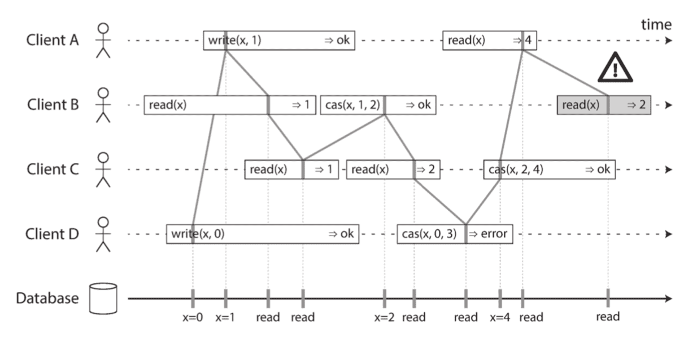

- _Visualizing the points in time at which the reads and writes appear to have taken effect._
    - _The final read by B is not linearizable._

_There are a few interesting details to point out in figure above :_

- _First client B sent a request to read x, then client D sent a request to set x to 0, and then client A sent a request to set x to 1._
    - _Nevertheless, the value returned to B's read is 1 ( the value written by A ) ._
    - _This is okay : it means that the database first processed D's write, then A's write, and finally B's read._
    - Although this is not the order in which the requests were sent, it's an acceptable order, because the three requests are concurrent.
    - _Perhaps B's read request was slightly delayed in the network, so it only reached the database after the two writes._
- _Client B's read returned 1 before client A received its response from the database, saying that the write of the value 1 was successful._
    - This is also okay : it doesn't mean the value was read before it was written, it just means the ok response from the database to client A was slightly delayed in the network.
- This model doesn't assume any transaction isolation : another client may change a value at any time.
    - _For example, C first reads 1 and then reads 2, because the value was changed by B between the two reads._
    - An atomic **compare-and-set (cas)** operation can be used to check the value hasn't been concurrently changed by another client :
        - _B and C's cas requests succeed, but D's cas request fails ( by the time the database processes it, the value of x is no longer 0 ) ._
- The final read by client B ( in a shaded bar ) is not linearizable.
    - _The operation is concurrent with C's cas write, which updates x from 2 to 4._
    - _In the absence of other requests, it would be okay for B's read to return 2._
    - However, client A has already read the new value 4 before B's read started, so B is not allowed to read an older value than A.

**Linearizability Versus Serializability**

- Linearizability is easily confused with serializability, as both words seem to mean something like "can be arranged in a sequential order."
- _However, they are two quite different guarantees, and it is important to distinguish between them :_
    - **Serializability**
        - Serializability is **an isolation property of transactions**, where every transaction may read and write multiple objects ( rows, documents, records ) .
        - It guarantees that transactions behave the same as if they had executed in some serial order ( each transaction running to completion before the next transaction starts ) .
        - _It is okay for that serial order to be different from the order in which transactions were actually run._
    - **Linearizability**
        - Linearizability is **a recency guarantee _( 最新值保证 )_ on reads and writes of a register ( an individual object )** .
        - _It doesn't group operations together into transactions, so it does not prevent problems such as write skew, unless you take additional measures such as materializing conflicts._
- A database may provide both serializability and linearizability, and this combination is known as **strict serializability** _( 严格的可串行化 )_ or **strong one-copy serializability ( strong-1SR )** _( 强的单副本可串行化 )_ .
    - Implementations of serializability based on two-phase locking  or actual serial execution are typically linearizable.
- However, **serializable snapshot isolation is not linearizable** :
    - by design, it makes reads from a consistent snapshot, to avoid lock contention between readers and writers.
    - _The whole point of a consistent snapshot is that it does not include writes that are more recent than the snapshot, and thus reads from the snapshot are not linearizable._

#### Relying on Linearizability

_( 可线性化的依赖条件 )_

**Locking and leader election** _( 加锁与主节点选举 )_

- A system that uses **single-leader replication** needs to **ensure that there is indeed only one leader**, not several ( **split brain** ) .
    - One way of electing a leader is to use a lock :
        - every node that starts up tries to acquire the lock, and the one that succeeds becomes the leader.
    - _No matter how this lock is implemented, it must be linearizable :_ all nodes must agree which node owns the lock; _otherwise it is useless._
- _Coordination services like **Apache ZooKeeper** and **etcd** are often used to implement distributed locks and leader election_.

**Constraints and uniqueness guarantees** _( 约束与唯一性保证 )_

- _omitted…_
- A hard uniqueness constraint, such as the primary key you typically find in relational databases, requires linearizability.
    - _Other kinds of constraints, such as foreign key or attribute constraints, can be implemented without requiring linearizability_

**Cross-channel timing dependencies** _( 跨通道时序依赖 )_

- _If Alice hadn't exclaimed the game score, Bob wouldn't have known that the result of his query was stale._
    - _He would have just refreshed the page again a few seconds later, and eventually seen the final score._
    - _The linearizability violation was only noticed **because there was an additional communication channel in the system** ( Alice's voice to Bob's ears ) ._
- _omitted…_

#### Implementing Linearizable Systems

_( 实现线性化系统 )_

Since linearizability essentially means

- "**behave as though there is only a single copy of the data, and all operations on it are atomic**", the simplest answer would be to really only use a single copy of the data.
- _However, that approach would not be able to tolerate faults : if the node holding that one copy failed, the data would be lost, or at least inaccessible until the node was brought up again._
- The most common approach to making a system fault-tolerant is to use replication.

_Revisit the replication methods, and compare whether they can be made linearizable :_

- **Single-leader replication ( potentially linearizable )**
    - In a system with single-leader replication, the leader has the primary copy of the data that is used for writes, and the followers maintain backup copies of the data on other nodes.
        - If you make reads from the leader, or from synchronously updated followers, they have the potential to be linearizable.
        - However, not every single-leader database is actually linearizable, either by design ( e.g., because it uses snapshot isolation ) or due to concurrency bugs.
    - _Using the leader for reads relies on the assumption that you know for sure who the leader is._
        - It is quite possible for a node to think that it is the leader, when in fact it is not -- and if the delusional _( 妄想的 )_ leader continues to serve requests, it is likely to violate linearizability.
        - _With asynchronous replication, failover may even lose committed writes, which violates both durability and linearizability._
- **Consensus algorithms ( linearizable )**
    - Some consensus algorithms, bear a resemblance _( 相似/形似 )_ to single-leader replication.
    - However, consensus protocols contain measures to prevent split brain and stale replicas.
    - _Thanks to these details, consensus algorithms can implement linearizable storage safely._
        - _This is how ZooKeeper and etcd work, for example._
- **Multi-leader replication ( not linearizable )**
    - _Systems with multi-leader replication are generally not linearizable,_ because they concurrently process writes on multiple nodes and asynchronously replicate them to other nodes.
- **Leaderless replication ( probably not linearizable )**
    - For systems with leaderless replication ( Dynamo-style ) , people sometimes claim that you can obtain "strong consistency" by requiring quorum reads and writes ( w + r > n ) .
        - _Depending on the exact configuration of the quorums, and depending on how you define strong consistency, this is not quite true._
    - "Last write wins" conflict resolution methods based on time-of-day clocks are almost certainly nonlinearizable, because clock timestamps cannot be guaranteed to be consistent with actual event ordering due to clock skew.
        - Sloppy quorums also ruin any chance of linearizability.
        - Even with strict quorums, nonlinearizable behavior is possible.

**Linearizability and quorums** _( 线性化与法定票数 )_

- _( 详见原书例 )_
- It is possible to **make Dynamo-style quorums linearizable at the cost of reduced performance** :
    - a reader must **perform read repair synchronously**, before returning results to the application, and
    - a writer must **read the latest state of a quorum of nodes** before sending its writes.
- _However, Riak does not perform synchronous read repair due to the performance penalty._
    - _Cassandra does wait for read repair to complete on quorum reads,_ but it loses linearizability _if there are multiple concurrent writes to the same key_, due to its use of last-write-wins conflict resolution.
- _In summary,_ it is safest to assume that **a leaderless system with Dynamo-style replication does not provide linearizability**.

#### The Cost of Linearizability

_( 线性化的代价 )_

- _( 详见原书例 )_
- A network interruption forces a choice between linearizability and availability.
- If clients can **connect directly to the leader datacenter**, _this is not a problem,_ since the application continues to work normally there.
    - _But clients that can only reach a follower datacenter will experience an outage ( 断供 ) until the network link is repaired._

**The CAP theorem**

- The applications that don't require linearizability can be more tolerant of network problems.
    - _This insight is popularly known as the_ **CAP theorem**, _named by Eric Brewer in 2000._
    - CAP was originally proposed as a rule of thumb _( 概测法 / 经验法则 )_ , without precise definitions, with the goal of starting a discussion about trade-offs in databases.
- The Unhelpful CAP Theorem
    - CAP is sometimes presented as **Consistency, Availability, Partition tolerance : pick 2 out of 3**.
        - Unfortunately, putting it this way is misleading because **network partitions are a kind of fault**, _so they aren't something about which you have a choice :_ **they will happen whether you like it or not**.
    - **When a network fault occurs, you have to choose between either linearizability or total availability**.
        - Thus, a better way of phrasing CAP would be **either Consistent or Available when Partitioned**.
        - _A more reliable network needs to make this choice less often, but at some point the choice is inevitable._
    - _In discussions of CAP there are several contradictory definitions of the term availability, and the formalization as a theorem does not match its usual meaning._
        - _Many so-called "highly available" ( fault-tolerant ) systems actually do not meet CAP's idiosyncratic ( 特殊的 ) definition of availability._
        - _All in all, there is a lot of misunderstanding and confusion around CAP, and it does not help us understand systems better, so CAP is best avoided._

**Linearizability and network delays** _( 线性化与网络延迟 )_

- Although linearizability is a useful guarantee, surprisingly few systems are actually linearizable in practice.
    - For example, even **RAM on a modern multi-core CPU is not linearizable** : if a thread running on one CPU core writes to a memory address, and a thread on another CPU core reads the same address shortly afterward, it is not guaranteed to read the value written by the first thread ( unless a **memory barrier** or **fence** _( 内存屏障或 fence 指令 )_ is used ) .
- **It makes no sense to use the CAP theorem to justify the multi-core memory consistency model** :
    - _within one computer we usually assume reliable communication, and we don't expect one CPU core to be able to continue operating normally if it is disconnected from the rest of the computer._
    - **The reason for dropping linearizability is performance, not fault tolerance.**
- The same is true of many distributed databases that choose not to provide linearizable guarantees : they do so primarily to **increase performance, not so much for fault tolerance**.
    - _Can't we maybe find a more efficient implementation of linearizable storage? It seems the answer is no_ _( icehe : 目前是这样的 )_ .

### Ordering Guarantees

_( 顺序保证 )_

#### Ordering and Causality

_( 顺序保证与因果关系 )_

- _omitted…_
- If a system obeys the ordering imposed by causality, we say that it is **causally consistent** _( 因果一致性 )_ .
    - For example, **snapshot isolation provides causal consistency** :
        - _when you read from the database, and you see some piece of data, then you must also be able to see any data that causally precedes it ( assuming it has not been deleted in the meantime ) ._

**The causal order is not a total order** _( 因果顺序并非全序 )_

- A **total order** _( 全序 )_ allows any two elements to be compared,
    - so if you have two elements, you can always say which one is greater and which one is smaller.
    - _For example, natural numbers are totally ordered : if I give you any two numbers, say 5 and 13, you can tell me that 13 is greater than 5._
- The difference between a total order and a partial order is reflected in different data‐ base consistency models:
    - **Linearizability** _( 可线性化 )_
        - In a linearizable system, we have a total order of operations :
            - _if the system behaves as if there is only a single copy of the data, and every operation is atomic, this means that for any two operations we can always say which one happened first._
    - **Causality** _( 因果关系 )_
        - Two operations are **concurrent** if neither happened before the other.
        - _Put another way, two events are ordered if they are causally related ( one happened before the other ) , but they are incomparable if they are concurrent._
        - _This means that_ causality defines a partial order _( 偏序 )_ , not a total order :
            - _some operations are ordered with respect to each other, but some are incomparable._
- _Therefore, according to this definition,_ there are no concurrent operations in a linearizable datastore :
    - there must be a single timeline along which all operations are totally ordered.
    - _There might be several requests waiting to be handled, but the datastore ensures that every request is handled atomically at a single point in time, acting on a single copy of the data, along a single timeline, without any concurrency._

**Linearizability is stronger than causal consistency**_( 可线性化强于因果一致性 )_

- **Linearizability implies causality** : any system that is linearizable will preserve causality correctly.
- Making a system linearizable can **harm its performance and availability**, especially if the system has significant network delays _( for example, if it's geographically distributed )_ .
    - _For this reason, some distributed data systems have abandoned linearizability, which allows them to achieve better performance but can make them difficult to work with._
- In fact, **causal consistency is the strongest possible consistency model that does not slow down due to network delays, and remains available in the face of network failures**.

**Capturing causal dependencies** _( 捕获因果依赖关系 )_

- _omitted…_

#### Sequence Number Ordering

_( 序列号排序 )_

- _omitted…_
- In a database with single-leader replication, the **replication log defines a total order of write operations** that is consistent with causality.
    - The leader can simply **increment a counter for each operation, and thus assign a monotonically increasing sequence number to each operation in the replication log**.

**Noncausal sequence number generators** _( 非因果序列发生器 )_

- _If there is not a single leader ( perhaps because you are using a multi-leader or leader‐ less database, or because the database is partitioned ) , it is less clear how to generate sequence numbers for operations._
- _Various methods are used in practice :_
    - Each node can generate its own independent set of sequence numbers.
        - _For example, if you have two nodes, one node can generate only odd numbers and the other only even numbers._
        - In general, you could **reserve some bits in the binary representation of the sequence number to contain a unique node identifier**, _and this would ensure that two different nodes can never generate the same sequence number._
    - You can **attach a timestamp from a time-of-day clock ( physical clock ) to each operation**.
        - _Such timestamps are not sequential, but if they have sufficiently high resolution, they might be sufficient to totally order operations._
        - _This fact is used in the last write wins conflict resolution method._
    - You can **preallocate blocks of sequence numbers** _( 预先分配序列号的区间范围 )_ .
        - _For example, node A might claim the block of sequence numbers from 1 to 1,000, and node B might claim the block from 1,001 to 2,000._
        - _Then each node can independently assign sequence numbers from its block, and allocate a new block when its supply of sequence numbers begins to run low._
- The causality problems occur because these **sequence number generators do not correctly capture the ordering of operations across different nodes**.

**Lamport timestamps**

- **Each node has a unique identifier, and each node keeps a counter of the number of operations it has processed**.
    - The Lamport timestamp is then simply a pair of `(counter, node ID)` .
    - Two nodes may sometimes have the same counter value, but by including the node ID in the timestamp, each timestamp is made unique.
- _A Lamport timestamp bears no relationship to a physical time-of-day clock, but it provides total ordering :_
    - _if you have two timestamps, the one with a greater counter value is the greater timestamp;_
    - _if the counter values are the same, the one with the greater node ID is the greater timestamp._
- _When a node receives a request or response with a maximum counter value greater than its own counter value, it immediately increases its own counter to that maximum._
- Lamport timestamps are sometimes confused with **version vectors**.
    - _Although there are some similarities, they have a different purpose :_
        - version vectors can distinguish whether two operations are concurrent or whether one is causally dependent on the other,
        - whereas Lamport timestamps always enforce a total ordering.
    - From the total ordering of Lamport timestamps, you cannot tell whether two operations are concurrent or whether they are causally dependent.
    - _The advantage of Lamport timestamps over version vectors is that they are more compact._

**Timestamp ordering is not sufficient** _( 时间戳排序依然不够 )_

- _omitted…_

#### Total Order Broadcast

_( 全序关系广播 )_

- Single-leader replication determines a total order of operations by choosing one node as the leader and sequencing all operations on a single CPU core on the leader.
    - _The challenge then is_ how to scale the system if the throughput is greater than a single leader can handle, and also how to handle failover if the leader fails.
    - _In the distributed systems literature ( 研究文献 ) , this problem is known as_ **total order broadcast** or **atomic broadcast**.
- _Scope of ordering guarantee_
    - Partitioned databases with a single leader per partition often maintain ordering only per partition,
        - _which means they cannot offer consistency guarantees ( e.g., consistent snapshots, foreign key references ) across partitions._
        - _Total ordering across all partitions is possible, but requires additional coordination._
- _**Total order broadcast** is usually described as a protocol for exchanging messages between nodes._
    - _Informally ( 非正式地 ) , it requires that two safety properties always be satisfied:_
        - **Reliable delivery** _( 可靠发送 )_
            - No messages are lost : if a message is delivered to one node, it is delivered to all nodes.
        - **Totally ordered delivery**
            - Messages are delivered to every node in the same order.
- _Of course, messages will not be delivered while the network is interrupted,_
    - _but an algorithm can_ **keep retrying so that the messages get through when the network is eventually repaired ( and then they must still be delivered in the correct order )** .

**Using total order broadcast** _( 使用全序关系广播 )_

- Consensus services such as **ZooKeeper** and **etcd** actually implement total order broadcast.
- Total order broadcast is exactly what you need for database replication :
    - if every message represents a write to the database, and every replica processes the same writes in the same order, then the replicas will remain consistent with each other ( aside from _( 除…之外 )_ any temporary replication lag ) .
    - _This principle is known as **state machine replication** ( 状态机复制 ) ._
- _Another way of looking at total order broadcast is that it is a way of creating a log ( as in a replication log, transaction log, or write-ahead log ) : delivering a message is like appending to the log._
    - _Since all nodes must deliver the same messages in the same order, all nodes can read the log and see the same sequence of messages._
- _Total order broadcast is also useful for implementing a lock service that provides **fencing tokens** ( icehe : 就像是 tcp 交互时的 seq num ) ._
    - _Every request to acquire the lock is appended as a message to the log, and all messages are sequentially numbered in the order they appear in the log._
    - _The **sequence number** can then serve as a fencing token, because it is monotonically increasing._
        - _In ZooKeeper, this sequence number is called `zxid`._

**Implementing linearizable storage using total order broadcast** _( 采用全序关系广播实现线性化存储 )_

- Total order broadcast is asynchronous : messages are guaranteed to be delivered reliably in a fixed order, but there is **no guarantee about when a message will be delivered** _( so one recipient ( 接收者 ) may lag behind the others )_ .
    - By contrast, linearizability is a recency guarantee _( ( 时效上的 ) 就近保证 )_ : a read is guaranteed to see the latest value written.
- However, if you have total order broadcast, you can build linearizable storage on top of it.
    - _For example, you can ensure that usernames uniquely identify user accounts._
- _Imagine that for every possible username, you can have a linearizable register with an atomic compare-and-set operation._
    - _Every register initially has the value null ( indicating that the username is not taken ) ._
    - _When a user wants to create a username, you execute a compare-and-set operation on the register for that username, setting it to the user account ID, under the condition that the previous register value is null._
    - _If multiple users try to concurrently grab the same username, only one of the compare-and-set operations will succeed, because the others will see a value other than null ( due to linearizability ) ._
- _You can_ implement such a linearizable compare-and-set operation as follows by using total order broadcast as an append-only log :
    - 1\. Append a message to the log, tentatively _( 暂时地/实验性地 )_ indicating the username you want to claim.
    - 2\. Read the log, and wait for the message you appended to be delivered back to you.
    - 3\. Check for any messages claiming the username that you want.
        - **If the first message for your desired username is your own message, then you are successful** :
            - you can commit the username claim _( perhaps by appending another message to the log )_ and acknowledge it to the client.
        - If the first message for your desired username is from another user, you abort the operation.
- _Because log entries are delivered to all nodes in the same order,_ if there are several concurrent writes, **all nodes will agree on which one came first**.
    - _Choosing the first of the conflicting writes as the winner and aborting later ones ensures that all nodes agree on whether a write was committed or aborted._
    - _A similar approach can be used to implement serializable multi-object transactions on top of a log._
- _While this procedure ensures **linearizable writes**, it doesn't guarantee **linearizable reads** --_
    - if you read from a store that is asynchronously updated from the log, it may be stale.
    - _( To be precise, the procedure described here provides sequential consistency, sometimes also known as **timeline consistency** ( 时间线一致性 ) , a slightly weaker guarantee than linearizability. )_
    - _To make reads linearizable, there are a few options :_
        - You can sequence reads through the log by appending a message, reading the log, and performing the actual read when the message is delivered back to you.
            - _The message's position in the log thus defines the point in time at which the read happens._
            - _( Quorum reads in etcd work somewhat like this. )_
        - If the log allows you to fetch the position of the latest log message in a linearizable way, you can query that position, wait for all entries up to that position to be delivered to you, and then perform the read.
            - _( This is the idea behind ZooKeeper's `sync()` operation. )
        - You can make your read from a replica that is synchronously updated on writes, and is thus sure to be up to date.
            - _( This technique is used in chain replication ( 链式复制 ) . )_

**Implementing total order broadcast using linearizable storage** _( 采用线性化存储实现全序关系广播 )_

- _Assume that we have linearizable storage, and show how to build total order broadcast from it._
    - _The easiest way is to_ assume you have a linearizable register that stores an integer and that has an atomic increment-and-get operation.
        - _Alternatively, an atomic compare-and-set operation would also do the job._
    - _The algorithm is simple :_
        - for every message you want to send through total order broadcast, you **increment-and-get the linearizable integer**, and then **attach the value you got from the register as a sequence number to the message**.
        - You can then send the message to all nodes ( resending any lost messages ) , and the recipients will deliver the messages consecutively by sequence number.
    - _Note that unlike Lamport timestamps, the numbers you get from incrementing the linearizable register form a sequence with no gaps._
        - Thus, if a node has delivered message 4 and receives an incoming message with a sequence number of 6, it knows that it must wait for message 5 before it can deliver message 6.
- _How hard could it be to make a linearizable integer with an atomic increment-and-get operation?_
    - _The problem lies in handling the situation when network connections to that node are interrupted, and restoring the value when that node fails._
    - _In general, if you think hard enough about linearizable sequence number generators, you inevitably end up with ( 以…告终 ) a consensus algorithm._
- _This is no coincidence : it can be proved that_ **a linearizable compare-and-set ( or increment-and-get ) register and total order broadcast are both equivalent to consensus**.

### Distributed Transactions and Consensus

_( 分布式事务与共识 )_

- _There are a number of situations in which it is important for nodes to agree. For example :_
    - **Leader election** _( 主节点选举 )_
        - In a database with single-leader replication, all nodes need to agree on which node is the leader.
        - The leadership position might become contested _( 受到争议的 )_ if some nodes can't communicate with others due to a network fault.
        - _In this case, consensus is important to avoid a bad failover ( 失效备援/故障切换 ) ,_ resulting in a **split brain** situation in which two nodes both believe themselves to be the leader.
        - If there were two leaders, they would both accept writes and their data would diverge _( 产生分歧 )_ , leading to inconsistency and data loss.
    - **Atomic commit** _( 原子事务提交 )_
        - In a database that supports transactions spanning several nodes or partitions, we have the problem that a transaction may fail on some nodes but succeed on others.
        - _If we want to maintain transaction atomicity ( in the sense of ACID ) , we have to get all nodes to agree on the outcome of the transaction :_
            - either they all abort/roll back ( if anything goes wrong ) or they all commit ( if nothing goes wrong ) .
        - _This instance of consensus is known as the **atomic commit problem**._
- _Atomic commit problem_
    - **Atomic commit** _is formalized slightly differently from consensus :_
        - an atomic transaction can **commit only if all participants vote to commit**, and **must abort if any participant needs to abort**.
    - Consensus is allowed to decide on any value that is proposed by one of the participants.
    - _However, atomic commit and consensus are reducible ( 可约的/可化简的 ) to each other._
    - _Nonblocking atomic commit is harder than consensus -- see "Three-phase commit"._
- _It turns out that **2PC** is a kind of **consensus algorithm** -- but not a very good one._
    - _By learning from 2PC we will then work our way toward better consensus algorithms, such as those used in **ZooKeeper (Zab)** and **etcd (Raft)**._

#### Atomic Commit and Two-Phase Commit (2PC)

_( 原子提交与两阶段提交 )_

- The purpose of **transaction atomicity** _( 事务原子性 )_ is to **provide simple semantics in the case where something goes wrong in the middle of making several writes**.
    - _The outcome of a transaction is either a successful commit, in which case all of the transaction's writes are made durable,_
    - _or an abort, in which case all of the transaction's writes are rolled back ( i.e., undone or discarded ) ._
- Atomicity prevents failed transactions from littering _( 乱丢/把…弄得乱七八糟 )_ the database with half-finished results and half-updated state.
    - _This is especially important for multi-object transactions and databases that maintain secondary indexes._
    - Each secondary index is a separate data structure from the primary data -- thus, if you modify some data, the corresponding change needs to also be made in the secondary index.
    - Atomicity ensures that the secondary index stays consistent with the primary data _( if the index became inconsistent with the primary data, it would not be very useful )_ .

**From single-node to distributed atomic commit** _( 从单节点到分布式的原子提交 )_

- For transactions that execute at a single database node, atomicity is commonly implemented by the storage engine.
    - _When the client asks the database node to commit the transaction,_ the **database makes the transaction's writes durable ( typically in a write-ahead log (WAL) ) and then appends a commit record to the log on disk**.
    - _If the database crashes in the middle of this process, the transaction is recovered from the log when the node restarts :_
        - _if the commit record was successfully written to disk before the crash, the transaction is considered committed;_
        - _if not, any writes from that transaction are rolled back._
- _Thus, on a single node, transaction commitment crucially depends on the order in which data is durably written to disk :_ first the data, then the commit record.
    - _The key deciding moment for whether the transaction commits or aborts is the moment at which the disk finishes writing the commit record :_
        - _before that moment, it is still possible to abort ( due to a crash ) ,_
        - _but after that moment, the transaction is committed ( even if the database crashes ) ._
- What if multiple nodes are involved in a transaction?
    - It is not sufficient to simply send a commit request to all of the nodes _and independently commit the transaction on each one._
    - _In doing so, it could easily happen that_ **the commit succeeds on some nodes and fails on other nodes**, _which would violate the atomicity guarantee :_
        - _Some nodes may detect a constraint violation or conflict, making an abort necessary, while other nodes are successfully able to commit._
        - _Some of the commit requests might be lost in the network, eventually aborting due to a timeout, while other commit requests get through._
        - _Some nodes may crash before the commit record is fully written and roll back on recovery, while others successfully commit._
- _If some nodes commit the transaction but others abort it, the nodes become inconsistent with each other._
    - _And_ **once a transaction has been committed on one node, it cannot be retracted again** _if it later turns out that it was aborted on another node._
    - _For this reason, a node must only commit once it is certain that all other nodes in the transaction are also going to commit._
- **A transaction commit must be irrevocable** _( 不可撤销的 )_ -- _you are not allowed to retroactively ( 追溯地 ) abort a transaction after it has been committed._
    - _The reason for this rule is that_ **once data has been committed, it becomes visible to other transactions**, _and thus other clients may start relying on that data; …_
- It is possible for **the effects of a committed transaction to later be undone by another**, **compensating transaction** _( 补偿性事务 )_ .
    - _However, from the database's point of view this is a separate transaction, and thus any_ **cross-transaction correctness requirements are the application's problem**.

**Introduction to two-phase commit** _( 两阶段提交 )_

- **Two-phase commit** is an algorithm for achieving **atomic transaction commit across multiple nodes** -- i.e., to ensure that either all nodes commit or all nodes abort.
    - _It is a classic algorithm in distributed databases._
    - _2PC is used internally in some databases and also_ made available to applications in the form of **XA transactions** _( which are supported by the Java Transaction API, for example )_ or via **WS-AtomicTransaction** for SOAP web services.

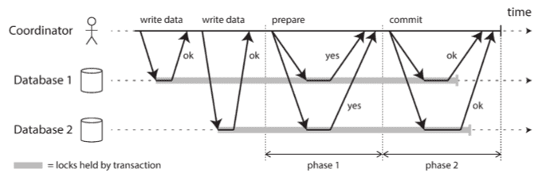

- _Don't confuse 2PC and 2PL_
    - _Two-phase commit (2PC) and two-phase locking are two very different things._
    - 2PC provides atomic commit in a distributed database,
        - whereas 2PL provides serializable isolation.
    - _To avoid confusion, it's best to think of them as entirely separate concepts and to ignore the unfortunate similarity in the names._
- _2PC uses a new component that does not normally appear in single-node transactions :_ a **coordinator** ( aka. **transaction manager** ) .
    - The coordinator is often implemented as
        - a library within the same application process _that is requesting the transaction_
            - _( e.g., embedded in a Java EE container ) ,_
        - but it can also be a separate process or service.
- A **2PC transaction begins with** the application reading and **<u>writing data on multiple database nodes</u>**, _as normal._
    - _( We call these database nodes **participants** in the transaction. )_
    - When the application is ready to commit, **the coordinator begins phase 1 : it sends a <u>prepare request</u> to each of the nodes**, asking them whether they are able to commit.
    - The coordinator then tracks the responses from the participants :
        - **If all participants reply "yes,"** indicating they are ready to commit, then **the coordinator sends out a <u>commit request</u> in phase 2**, and the commit actually takes place _( 发生/举行 )_ .
        - **If any of the participants replies "no," the coordinator sends an <u>abort request</u> to all nodes in phase 2.**

**A system of promises** _( 系统的承诺 )_

- _Surely the prepare and commit requests can just as easily be lost in the two-phase case. What makes 2PC different?_
- _To understand why it works, we have to break down the process in a bit more detail :_
    - 1\. When the application wants to begin a distributed transaction, it **requests a transaction ID from the coordinator**.
        - _This transaction ID is_ globally unique.
    - 2\. **The application begins a single-node transaction on each of the participants**,
        - and attaches the globally unique transaction ID to the single-node transaction.
        - All reads and writes are done in one of these single-node transactions.
        - If anything goes wrong at this stage _( for example, a node crashes or a request times out )_ , the coordinator or any of the participants can abort.
    - 3\. **When the application is ready to commit, the coordinator sends a prepare request to all participants**, tagged with the global transaction ID.
        - If any of these requests fails or times out, the coordinator sends an abort request for that transaction ID to all participants.
    - 4\. **When a participant receives the prepare request, it makes sure that it can definitely commit the transaction** under all circumstances.
        - This includes writing all transaction data to disk ( a crash, a power failure, or running out of disk space is not an acceptable excuse for refusing to commit later ) , and checking for any conflicts or constraint violations.
        - By replying "yes" to the coordinator, the node promises to commit the transaction without error if requested.
        - _In other words, the participant surrenders ( 放弃 ) the right to abort the transaction, but without actually committing it._
    - 5\. **When the coordinator has received responses to all prepare requests, it makes a definitive decision on whether to commit or abort the transaction** ( committing only if all participants voted "yes" ) .
        - **The coordinator must write that decision to its transaction log on disk** so that it knows which way it decided in case it subsequently crashes.
        - This is called the **commit point** _( 提交点 )_ .
    - 6\. **Once the coordinator's decision has been written to disk, the commit or abort request is sent to all participants.**
        - **If this request fails or times out, the coordinator must retry forever until it succeeds.**
        - There is no more going back : if the decision was to commit, that decision must be enforced, no matter how many retries it takes.
        - _If a participant has crashed in the meantime, the transaction will be committed when it recovers -- since the participant voted "yes," it cannot refuse to commit when it recovers._
- _Thus, the protocol contains two crucial_ "**points of no return**" _( 不归路 )_ :
    - **when a participant votes "yes,"** it promises that it will definitely be able to commit later
        - _( although the coordinator may still choose to abort )_ ;
    - and **once the coordinator decides**, that decision is irrevocable.
- _Those promises ensure the atomicity of 2PC._

**Coordinator failure** _( 协调者发生故障 )_

- If the coordinator fails before sending the prepare requests, a participant can safely abort the transaction.
    - But once the participant has received a prepare request and voted "yes," it can no longer abort unilaterally _( 单方面地 )_ --
        - it must wait to hear back from the coordinator whether the transaction was committed or aborted.
    - _If the coordinator crashes or the network fails at this point,_ the participant can do nothing but wait.
    - _A participant's transaction in this state is called in doubt or uncertain._
- Without hearing from the coordinator, the participant has no way of knowing whether to commit or abort.
- The only way 2PC can complete is by waiting for the coordinator to recover.
    - This is why the coordinator must write its commit or abort decision to a transaction log on disk before sending commit or abort requests to participants :
        - when the coordinator recovers, it determines the status of all in-doubt transactions by reading its transaction log.
    - Any transactions that don't have a commit record in the coordinator's log are aborted.
    - _Thus, the commit point of 2PC comes down to a regular single-node atomic commit on the coordinator._

**Three-phase commit** _( 三阶段提交 )_

- Two-phase commit is called a **blocking atomic commit protocol** _( 阻塞式原子提交协议 )_ due to the fact that 2PC can become stuck waiting for the coordinator to recover.
    - In theory, it is possible to make an atomic commit protocol nonblocking, so that it does not get stuck if a node fails.
- As an alternative to 2PC, an algorithm called **three-phase commit (3PC)** has been proposed.
    - However, 3PC **assumes a network with bounded delay and nodes with bounded response times**;
        - (but) in most practical systems **with <u>unbounded</u> network delay and process pauses**, it **cannot guarantee atomicity**.
- _In general,_ **nonblocking atomic commit requires a perfect failure detector** -- i.e., a reliable mechanism for telling whether a node has crashed or not.
    - **In a network with unbounded delay a timeout is not a reliable failure detector, because a request may time out due to a network problem even if no node has crashed**.
    - _For this reason,_ 2PC continues to be used, despite the known problem with coordinator failure.

#### Distributed Transactions in Practice

_( 实践中的分布式事务 )_

- _Distributed transactions, especially those implemented with two-phase commit, have a mixed reputation._
    - _On the one hand,_ they are seen as **providing an important safety guarantee** that would be hard to achieve otherwise _( 其它方案难以企及的 )_ ;
    - on the other hand, they are criticized for **causing operational problems, killing performance, and promising more than they can deliver**.
    - _Many cloud services choose not to implement distributed transactions due to the operational problems they engender ( 使产生/造成 ) ._
- _Some implementations of distributed transactions carry a heavy performance penalty --_
    - for example, distributed transactions in MySQL are reported to be over 10 times slower than single-node transactions, _so it is not surprising when people advise against using them._
    - **Much of the performance cost inherent in two-phase commit is due to the additional disk forcing (`fsync`) that is required for crash recovery, and the additional network round-trips.**

**Exactly-once message processing**

- _For example, a message from a message queue can be acknowledged as processed if and only if the database transaction for processing the message was successfully committed._
    - This is **implemented by atomically committing the message acknowledgment _( 自动提交消息确认 )_ _and_ the database writes in a single transaction _( 数据库 (单个事务) 的写入 )_** .
    - _With distributed transaction support,_ this is possible, even if the message broker and the database are two unrelated technologies running on different machines.
- _If either the message delivery or the database transaction fails, both are aborted, and so the message broker may safely redeliver the message later._
    - Thus, by atomically committing the message and the side effects of its processing, we can ensure that the message is effectively processed exactly once, even if it required a few retries before it succeeded.
    - _The abort discards any side effects of the partially completed transaction._
- _Such a distributed transaction is_ **only possible if all systems affected by the transaction are able to use the same atomic commit protocol**, _however._
    - _For example, say a side effect of processing a message is to send an email, and the email server does not support two-phase commit :_
        - _it could happen that the email is sent two or more times if message processing fails and is retried._
    - But if all side effects of processing a message are rolled back on transaction abort, then the processing step can safely be retried as if nothing had happened.

**XA transactions** _( XA 交易 )_

- **X/Open XA** _( short for **eXtended Architecture** )_ is a standard for implementing two-phase commit across heterogeneous technologies.
    - _It was introduced in 1991 and has been widely implemented :_ XA is supported by
        - many traditional relational databases _( including PostgreSQL, MySQL, DB2, SQL Server, and Oracle )_ _and_
        - message brokers _( including ActiveMQ, HornetQ, MSMQ, and IBM MQ )_ .
- XA is not a network protocol -- **it is merely a C API for interfacing with a transaction coordinator**.
    - _Bindings for this API exist in other languages; for example, in the world of Java EE applications, XA transactions are implemented using the Java Transaction API (JTA), which in turn is supported by many drivers for databases using Java Database Connectivity (JDBC) and drivers for message brokers using the Java Message Service (JMS) APIs._
- XA assumes that your application uses a network driver or client library to communicate with the participant databases or messaging services.
    - If the driver supports XA, that means it calls the XA API to find out whether an operation should be part of a distributed transaction -- and if so, it sends the necessary information to the database server.
    - The driver also exposes callbacks through which the coordinator can ask the participant to prepare, commit, or abort.
- The transaction coordinator implements the XA API.
    - _The standard does not specify how it should be implemented,_ but in practice the coordinator is often simply a library that is loaded into the same process as the application issuing the transaction _( not a separate service )_ .
    - _It keeps track of the participants in a transaction, collects partipants' responses after asking them to prepare ( via a callback into the driver ) , and uses a log on the local disk to keep track of the commit/abort decision for each transaction._
- If the application process crashes, or the machine on which the application is running dies, the coordinator goes with it.
    - _Any participants with prepared but uncommitted transactions are then stuck in doubt._
    - Since the coordinator's log is on the application server's local disk, that server must be restarted, and the coordinator library must read the log to recover the commit/abort outcome of each transaction.
    - Only then can the coordinator use the database driver's XA callbacks to ask participants to commit or abort, as appropriate.
    - _The database server cannot contact the coordinator directly, since all communication must go via its client library._

**Holding locks while in doubt** _( 停顿时仍持有锁 )_

- _Why do we care so much about a transaction being stuck in doubt?_ The problem is with **locking**.
    - Database transactions usually take a row-level exclusive lock on any rows they modify, to prevent dirty writes.
    - In addition, if you want serializable isolation, a database using two-phase locking would also have to take a shared lock on any rows read by the transaction.
- The database cannot release those locks until the transaction commits or aborts.
    - Therefore, when using two-phase commit, a transaction must hold onto the locks throughout the time it is in doubt.
    - **If the coordinator's log is entirely lost for some reason, those locks will be held forever** -- _or at least until the situation is manually resolved by an administrator._
- While those locks are held, no other transaction can modify those rows.
    - Depending on the database, other transactions may even be blocked from reading those rows.
    - This can **cause large parts of your application to become unavailable until the in-doubt transaction is resolved**.

**Recovering from coordinator failure**_( 从协调者故障中恢复 )_

- However, in practice, orphaned _( 孤儿 )_ in-doubt transactions do occur  -- that is, transactions for which the coordinator cannot decide the outcome for whatever reason _( e.g., **because the transaction log has been lost** or **corrupted due to a software bug** )_ .
    - These transactions cannot be resolved automatically, so they sit forever in the database, holding locks and blocking other transactions.
- _Even rebooting your database servers will not fix this problem, since a correct implementation of 2PC must preserve the locks of an in-doubt transaction even across restarts ( otherwise it would risk violating the atomicity guarantee ) ._
- The only way out is for an administrator to manually decide whether to commit or roll back the transactions.
    - _The administrator must examine the participants of each in-doubt transaction, determine whether any participant has committed or aborted already, and then apply the same outcome to the other participants._
    - _Resolving the problem potentially requires a lot of manual effort, and most likely needs to be done under high stress and time pressure during a serious production outage._
- Many XA implementations have an **emergency escape** _( 紧急避险 )_ hatch called **heuristic decisions** _( 启发式决策 )_ :
    - allowing a participant to unilaterally decide to abort or commit an in-doubt transaction without a definitive decision from the coordinator.
    - To be clear, heuristic here is a euphemism for probably breaking atomicity, since it violates the system of promises in two-phase commit.
    - Thus, **heuristic decisions are intended only for getting out of catastrophic situations, and not for regular use**.

**Limitations of distributed transactions** _( 分布式事务的限制 )_

- _XA transactions solve the real and important problem of keeping several participant data systems consistent with each other, but as we have seen,_ they also introduce major operational problems.
- In particular, the key realization is that the transaction coordinator is itself a kind of database ( in which transaction outcomes are stored ) , and so it needs to be approached with the same care as any other important database:
    - If the coordinator is not replicated but runs only on a single machine, it is **a single point of failure** for the entire system ( since its failure causes other application servers to block on locks held by in-doubt transactions ) .
        - Surprisingly, many coordinator implementations are **not highly available by default**, or have only rudimentary _( 初步的, 基本的 )_ replication support.
    - Many server-side applications are developed in a stateless model ( as favored by HTTP ) , with all persistent state stored in a database, which has the advantage that application servers can be added and removed at will.
        - _However, when the coordinator is part of the application server, it changes the nature of the deployment._
        - Suddenly, the coordinator's logs become a crucial part of the durable system state -- as important as the databases themselves, since the coordinator logs are required in order to recover in-doubt transactions after a crash.
        - Such application servers are no longer stateless.
    - Since XA needs to be compatible with a wide range of data systems, it is necessarily a lowest common denominator _( 最小公分母 )_ .
        - For example, it cannot detect deadlocks across different systems ( since that would require a standardized protocol for systems to exchange information on the locks that each transaction is waiting for ) , and it does not work with SSI ( see "Serializable Snapshot Isolation" ) , since that would require a protocol for identifying conflicts across different systems.
    - For database-internal distributed transactions ( not XA ) , the limitations are not so great -- for example, a distributed version of SSI is possible.
        - However, there remains the problem that for 2PC to successfully commit a transaction, all participants must respond.
        - Consequently, if any part of the system is broken, the transaction also fails.
        - Distributed transactions thus have a tendency of amplifying failures, which runs counter to our goal of building fault-tolerant systems.

#### Fault-Tolerant Consensus

_( 支持容错的共识 )_

- Informally, consensus means **getting several nodes to agree on something**.
    - _For example, if several people concurrently try to book the last seat on an airplane, or the same seat in a theater, or try to register an account with the same username,_
    - then a consensus algorithm could be used to determine which one of these mutually incompatible operations should be the winner.
- _The consensus problem is normally formalized as follows :_
    - one or more nodes may **propose** values, and the consensus algorithm **decides** on one of those values.
- _In this formalism ( 形式体系 ) , a consensus algorithm must satisfy the following properties :_
    - **Uniform agreement** _( 协商一致性 )_
        - No two nodes decide differently. _( 都接受相同的决议 )_
    - **Integrity** _( 诚实性 )_
        - No node decides twice. _( 决定不能反悔 )_
    - **Validity** _( 合法性 )_
        - If a node decides value v, then v was proposed by some node.
    - **Termination** _( 可终止性 )_
        - Every node that does not crash eventually decides some value. _( 所有节点如果不崩溃, 则最终一定可以达成决议 )_
- The uniform agreement and integrity properties define the core idea of consensus : **everyone decides on the same outcome, and once you have decided, you cannot change your mind**.
    - The **validity** property exists mostly to **rule out _( 排除 )_ trivial solutions** _( 不重要的/琐碎的 → 无意义的 )_ .
    - The **termination** property formalizes _( 使形式化 → 引入了 )_ the idea of fault tolerance.
        - _In particular, 2PC does not meet the requirements for termination._
- _There is a limit to the number of failures that an algorithm can tolerate :_
    - _in fact, it can be proved that_ **any consensus algorithm requires at least a majority of nodes to be functioning correctly in order to assure termination.**
    - That majority can safely form a **quorum**.
- Thus, the **termination** property is subject to the assumption that **fewer than half of the nodes are crashed or unreachable**.
- **Most consensus algorithms assume that there are <u>no Byzantine faults</u>**.
    - _That is, if a node does not correctly follow the protocol ( for example, if it sends contradictory messages to different nodes ) , it may break the safety properties of the protocol._
    - It is possible to **make consensus robust against Byzantine faults as long as fewer than one-third of the nodes** are **Byzantine-faulty**.

**Consensus algorithms and total order broadcast** _( 共识算法与全序广播 )_

- The best-known fault-tolerant consensus algorithms are **Viewstamped Replication (VSR)**, **Paxos**, **Raft**, and **Zab**.
- Most of these algorithms actually don't directly use the formal model described here _( proposing and deciding on a single value, while satisfying the agreement, integrity, validity, and termination properties )_ .
    - Instead, they **decide on a sequence of values, which makes them total order broadcast algorithms.**
- Remember that total order broadcast requires messages to be delivered exactly once, in the same order, to all nodes.
    - _If you think about it, this is equivalent to performing several rounds of consensus :_
        - in each round, nodes propose the message that they want to send next,
        - and then decide on the next message to be delivered in the total order.
- So, **total order broadcast is equivalent to repeated rounds of consensus** _( each consensus decision corresponding to one message delivery )_ :
    - _Due to the **agreement** property of consensus,_ all nodes decide to deliver the same messages in the same order.
    - _Due to the **integrity** property,_ messages are not duplicated.
    - _Due to the **validity** property,_ messages are not corrupted and not fabricated out of thin air _( 凭空伪造 )_ .
    - _Due to the **termination** property,_ messages are not lost.
- _Viewstamped Replication, Raft, and Zab implement total order broadcast directly,_ because that is more efficient than doing repeated rounds of one-value-at-a-time consensus.
    - _In the case of Paxos, this optimization is known as **Multi-Paxos._
    - Raft 算法动画演示 : [中文版](http://www.kailing.pub/raft/index.html) / [英文原版](http://thesecretlivesofdata.com/raft/)

**Single-leader replication and consensus**_( (单主节点) 主从复制与共识 )_

- _Single-leader replication takes all the writes to the leader and applies them to the followers in the same order, thus keeping replicas up to date._
    - Isn't this essentially total order broadcast? How come we didn't have to worry about consensus?
- The answer comes down to how the leader is chosen.
    - If the leader is manually chosen and configured by the humans in your operations team, you essentially have a "consensus algorithm" of the dictatorial _( 独裁的 )_ variety :
        - only one node is allowed to accept writes _( i.e., make decisions about the order of writes in the replication log )_ ,
        - and if that (leader) node goes down, the system becomes unavailable for writes _until the operators manually configure a different node to be the leader._
    - _Such a system can work well in practice,_ but **it does not satisfy the termination property of consensus** because it requires human intervention in order to make progress.

**Epoch numbering and quorums**

- _omitted…_

**Limitations of consensus** _( 共识的局限性 )_

- _omitted…_

#### Membership and Coordination Services

_( 成员与协调服务 )_

**Allocating work to nodes** _( 节点任务分配 )_

- _omitted…_

**Service discovery** _( 服务发现 )_

- _omitted…_

**Membership services** _( 成员服务 )_

- _omitted…_
