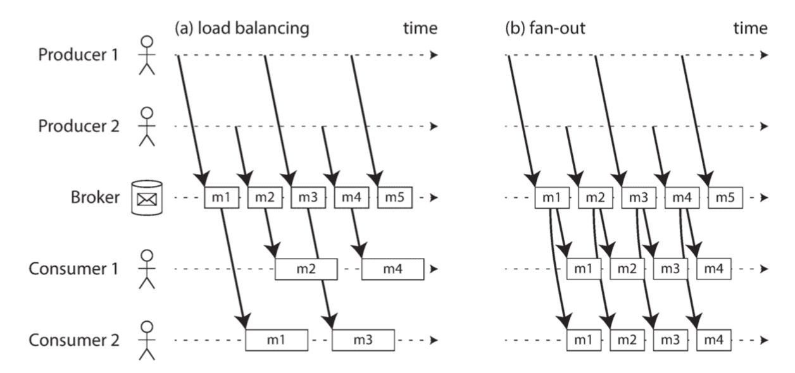
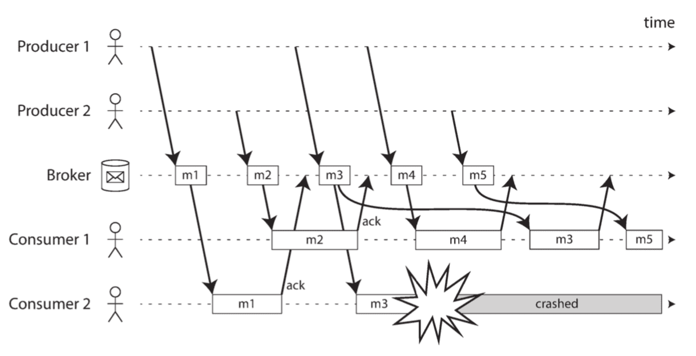

# Derived Data

Designing Data-Intensive Applications - Part III

---

References

- Book "Designing Data-Intensive Applications"
    - ZH Ver. :《 数据密集型应用系统设计 》

## Batch Processing

_( 批处理系统 )_

_Let's distinguish three different types of systems :_

- **Services ( online systems )**
    - A service waits for a request or instruction from a client to arrive.
    - When one is received, the service tries to handle it as quickly as possible and sends a response back.
    - Response time is usually the primary measure of performance of a service, and availability is often very important _( if the client can't reach the service, the user will probably get an error message )_ .
- **Batch processing systems ( offline systems )**
    - A batch processing system takes a large amount of input data, runs a job to process it, and produces some output data.
    - _Jobs often take a while ( from a few minutes to several days ) , so there normally isn't a user waiting for the job to finish._
    - _Instead, batch jobs are often scheduled to run periodically ( for example, once a day ) ._
    - The primary performance measure of a batch job is usually throughput ( the time it takes to crunch through an input dataset of a certain size ) .
- **Stream processing systems ( near-real-time systems )**
    - Stream processing is somewhere between online and offline/batch processing ( so it is sometimes called near-real-time or nearline processing ) .
    - Like a batch processing system, a stream processor consumes inputs and produces outputs _( rather than responding to requests )_ .
    - _However, a stream job operates on events shortly after they happen, whereas a batch job operates on a fixed set of input data._
    - _This difference allows stream processing systems to have lower latency than the equivalent batch systems._
    - As stream processing builds upon batch processing.

### Batch Processing with Unix Tools

_( 使用 UNIX 工具进行批处理 )_

#### Simple Log Analysis

_( 简单日志分析 )_

_For example, say you want to_ find the five most popular pages on your website.

```bash
cat /var/log/nginx/access.log |
    awk '{print $7}' |
    sort             |
    uniq -c          |
    sort -r -n       |
    head -n 5
```

1. `cat` Read the log file.
2. `awk` Split each line into fields by whitespace, and output only the seventh such field from each line, which happens to be the requested URL.
3. `sort` Alphabetically sort the list of requested URLs.
    - _If some URL has been requested n times, then after sorting, the file contains the same URL repeated n times in a row._
4. `uniq -c` The uniq command filters out repeated lines in its input by checking whether two adjacent lines are the same.
    - _The -c option tells it to also output a counter : for every distinct URL, it reports how many times that URL appeared in the input._
5. `sort -r -n` The second sort sorts by the number (-n) at the start of each line, which is the number of times the URL was requested.
    - _It then returns the results in reverse (-r) order, i.e. with the largest number first._
6. `head -5` Finally, head outputs just the first five lines (-n 5) of input, and discards the rest.

**Chain of commands versus custom program** _( 命名链与自定义程序 )_

- _omitted…_

**Sorting versus in-memory aggregation** _( (使用磁盘) 排序与内存中的聚合 )_

- If the job's working set is larger than the available memory, **the sorting approach has the advantage that it can make efficient use of disks**.
    - Chunks of data can be sorted in memory and written out to disk as segment files, and then multiple sorted segments can be merged into a larger sorted file.
    - **Mergesort has sequential access patterns that perform well on disks.**
- _The `sort` utility in GNU Coreutils (Linux) automatically handles larger-than-memory datasets by spilling to disk, and automatically parallelizes sorting across multiple CPU cores._

#### The Unix Philosophy

_( UNIX 设计哲学 )_

The idea of **connecting programs with pipes** became part of what is now known as the **Unix philosophy**.

_The philosophy was described in 1978 as follows :_

1. Make each program do one thing well.
    - To do a new job, build afresh _( adv. 重新 )_ rather than complicate old programs by adding new "features".
2. Expect the output of every program to become the input to another, as yet unknown, program.
    - Don't clutter output with extraneous _( 无关的 )_ information.
    - Avoid stringently columnar _( 严格的表格 )_ or binary input formats.
    - Don't insist on interactive input.
3. Design and build software, even operating systems, to be tried early, ideally within weeks.
    - Don't hesitate to throw away the clumsy ( 笨拙的 ) parts and rebuild them.
4. Use tools in preference to _( 优先于… )_ unskilled _( 不熟练的 )_ help to lighten a programming task,
    - even if you have to detour _( 绕道 )_ to build the tools and expect to throw some of them out after you've finished using them.

**A uniform interface** _( 统一接口 )_

- _If you expect the output of one program to become the input to another program, that means those programs must use the same data format -- in other words, a compatible interface._
    - _If you want to be able to connect any program's output to any program's input, that means that all programs must use the same input/output interface._
- **In Unix, that interface is a file ( or, more precisely, a file descriptor ) .**
    - _A file is just an ordered sequence of bytes._

**Separation of logic and wiring** _( 逻辑和布线的分离 )_

- _Another characteristic feature of Unix tools is their_ use of standard input (stdin) and standard output (stdout).
    - _If you run a program and don't specify anything else, stdin comes from the keyboard and stdout goes to the screen._
- _There are limits to what you can do with stdin and stdout._
    - Programs that need multiple inputs or outputs are possible but tricky.
- You can't pipe a program's output into a network connection.
    - _Except by using a separate tool, such as `netcat` or `curl`._
    - Unix started out trying to represent everything as files, but the **BSD sockets API deviated from that convention**.
    - _The research operating systems Plan 9 and Inferno are more consistent in their use of files : they represent a TCP connection as a file in /net/tcp._

**Transparency and experimentation** _( 透明与测试 )_

- _omitted…_
- The biggest limitation of Unix tools is that they run only on a single machine --
    - _and that's where tools like Hadoop come in._

### MapReduce and Distributed Filesystems

- **MapReduce jobs read and write files on a distributed filesystem**.
    - _In Hadoop's implementation of MapReduce,_ that filesystem is called **HDFS (Hadoop Distributed File System)**, an open source reimplementation of the Google File System (GFS).
- HDFS is based on the **shared-nothing principle**, _in contrast to the **shared-disk** approach of Network Attached Storage (NAS) and Storage Area Network (SAN) architectures_.
    - Shared-disk storage is implemented by a centralized storage appliance, _often using custom hardware and special network infrastructure such as Fibre Channel ( 光纤通信 ) ._
    - _On the other hand,_ the shared-nothing approach requires no special hardware, _only computers connected by a conventional datacenter network._
- _omitted…_

#### MapReduce Job Execution

_( MapReduce 作业执行 )_

**MapReduce** is a programming framework with which you can write code to process large datasets in a distributed filesystem like HDFS.

- The output from the **mapper** is always sorted before it is given to the **reducer**.

_To create a MapReduce job, you need to_ implement two callback functions, the mapper and reducer, _which behave as follows :_

- **Mapper**
    - The mapper is **called once for every input record**, and its job is to extract the key and value from the input record.
    - For each input, it may generate any number of key-value pairs (including none).
    - _It does not keep any state from one input record to the next, so each record is handled independently._
- **Reducer**
    - The MapReduce framework takes the key-value pairs produced by the mappers, collects all the values belonging to the same key, and calls the reducer with an iterator over that collection of values.
    - The reducer can produce output records ( such as the number of occurrences of the same URL ) .

**Distributed execution of MapReduce** _( MapReduce 的分布式执行 )_

- Parallelization of Hadoop MapReduce jobs is based on **partitioning** :
    - the input to a job is typically a directory in HDFS,
    - and each file or file block within the input directory is considered to be a separate partition that can be processed by a separate map task.
- The **MapReduce scheduler** tries to run each mapper on one of the machines that stores a replica of the input file, provided that _( 假如/如果 )_ machine has enough spare RAM and CPU resources to run the map task.
    - This principle is known as **putting the computation near the data** :
        - _it saves copying the input file over the network, reducing network load and increasing locality ( 访问的局部性 ) ._
- The `reduce` side of the computation is also partitioned.
    - _While the number of map tasks is determined by the number of input file blocks, the number of reduce tasks is configured by the job author ( it can be different from the number of map tasks ) ._
    - To ensure that **all key-value pairs with the same key end up at the same reducer**, the framework uses a hash of the key to determine which reduce task should receive a particular key-value pair.
- _omitted…_

**MapReduce workflows**

- _omitted…_

#### Reduce-Side Joins and Grouping

_( Reduce 端的 join 和 group by 操作 )_

**Example: analysis of user activity events**

- _omitted…_

**Sort-merge joins** _( 排序-合并 join )_

- _omitted…_

**Bringing related data together in the same place** _( 将相关数据放到一起 )_

- _omitted…_

**GROUP BY** _( 分组 )_

- _omitted…_

**Handling skew** _( 处理数据倾斜 )_

- _omitted…_

#### Map-Side Joins

_( Map 端的 join 操作 )_

_( icehe : 又开始看不太懂了 )_

**Broadcast hash joins** _( 广播哈希 join )_

- The simplest way of performing a map-side join applies in the case where **a large dataset is joined with a small dataset**.
- _omitted…_

**Partitioned hash joins** _( 分区哈希 join )_

- _omitted…_
- This approach only works if **both of the join's inputs have the same number of partitions**, with records assigned to partitions based on the same key and the same hash function.

**Map-side merge joins**_( map 端的合并 join )_

- Another variant of a map-side join applies if the input datasets are not only partitioned in the same way, but also **sorted based on the same key**.
- _omitted…_

**MapReduce workflows with map-side joins** _( 具有 map 端 join 的工作流 )_

- _omitted…_

#### The Output of Batch Workflows

_( 批处理工作流的输出 )_

- _omitted…_

**Building search indexes** _( 生成搜索索引 )_

- Google's original use of **MapReduce was to build indexes for its search engine**,
    - which was implemented as a workflow of 5 to 10 MapReduce jobs.
- _Although Google later moved away from using MapReduce for this purpose, it helps to understand MapReduce if you look at it through the lens of building a search index._
    - _( Even today, Hadoop MapReduce remains a good way of building indexes for Lucene/Solr. )_
- _If you need to perform a full-text search over a fixed set of documents,_
    - _then a batch process is a very effective way of building the indexes :_
        - the mappers partition the set of documents as needed,
        - each reducer builds the index for its partition, and the index files are written to the distributed filesystem.
    - _Building such document-partitioned indexes parallelizes very well._
- Alternatively, it is possible to **build indexes incrementally**. If you want to add, remove, or update documents in an index,
    - **Lucene** writes out new segment files and **asynchronously merges and compacts segment files in the background**.
- _omitted…_

**Key-value stores as batch process output**_( 批处理输出键值 )_

- _omitted…_

**Philosophy of batch process outputs** _( 批处理输出的哲学 )_

- _omitted…_

#### Comparing Hadoop to Distributed Databases

_( 对比 Hadoop 与分布式数据库 )_

**Diversity of storage** _( 存储多样性 )_

- Databases require you to structure data according to a particular model ( e.g., relational or documents ),
    - whereas files in a distributed filesystem are just byte sequences, which can be written using any data model and encoding.
    - _They might be collections of database records, but they can equally well be text, images, videos, sensor readings, sparse matrices, feature vectors, genome sequences, or any other kind of data._
- _omitted…_

**Diversity of processing models** _( 处理模型的多样性 )_

- _omitted…_
- The Hadoop ecosystem includes both random-access OLTP databases _such as HBase_ and MPP-style analytic databases _such as Impala_.
    - Neither HBase nor Impala uses MapReduce, but both use HDFS for storage.
    - _They are very different approaches to accessing and processing data, but they can nevertheless coexist and be integrated in the same system._

**Designing for frequent faults** _( 针对频繁故障的设计 )_

- _omitted…_

### Beyond MapReduce

_( 超越 MapReduce )_

- _omitted…_

#### Materialization of Intermediate State

_( 中间状态实体化 )_

- _omitted…_

**Dataflow engines** _( 数据流引擎 )_

- _In order to fix these problems with MapReduce, several new execution engines for distributed batch computations were developed,_
    - the most well known of which are **Spark**, **Tez**, and **Flink**.
- _There are various differences in the way they are designed, but they have one thing in common :_
    - they **handle an entire workflow as one job, rather than breaking it up into independent subjobs**.
- _omitted…_

**Fault tolerance** _( 容错 )_

- _omitted…_

**Discussion of materialization** _( 关于实体化的讨论 )_

- _Returning to the Unix analogy,_
    - we saw that **MapReduce** is like writing the output of each command to a temporary file, whereas **dataflow engines look much more like Unix pipes**.
- **Flink** especially is built around the idea of pipelined execution :
    - that is, **incrementally passing the output of an operator to other operators**, and **not waiting for the input to be complete before starting to process it**.
- _omitted…_

#### Graphs and Iterative Processing

_( 图与迭代处理 )_

- _omitted…_

**The Pregel processing model**

- As an optimization for batch processing graphs, the **bulk synchronous parallel (BSP)** _( 批量同步并行 )_ model of computation has become popular.
    - _Among others, it is implemented by Apache Giraph, Spark's GraphX API, and Flink's Gelly API._
    - It is also known as the **Pregel model**, _as Google's Pregel paper popularized this approach for processing graphs._
- _omitted…_

**Fault tolerance** _( 容错 )_

- _omitted…_

**Parallel execution**

- _omitted…_

#### High-Level APIs and Languages

- The higher-level languages and APIs such as Hive, Pig, Cascad‐ ing, and Crunch became popular because **programming MapReduce jobs by hand is quite laborious** _( 费力的 )_ .
    - _As Tez emerged, these high-level languages had the additional benefit of being able to move to the new dataflow execution engine without the need to rewrite job code._
    - _Spark and Flink also include their own high-level dataflow APIs, often taking inspiration from FlumeJava._
- _omitted…_

**The move toward declarative query languages** _( 转向声明式查询语言 )_

- _omitted…_

**Specialization for different domains** _( 不同领域的专业化 )_

- _omitted…_

### Summary

_The two main problems that distributed batch processing frameworks need to solve are :_

- **Partitioning**
    - In MapReduce, mappers are partitioned according to input file blocks.
    - The output of mappers is repartitioned, sorted, and merged into a configurable number of reducer partitions.
    - The purpose of this process is to bring all the related data --  _e.g., all the records with the same key_  -- together in the same place.
    - _Post-MapReduce dataflow engines try to avoid sorting unless it is required, but they otherwise take a broadly similar approach to partitioning._
- **Fault tolerance**
    - MapReduce frequently writes to disk, which makes it easy to recover from an individual failed task without restarting the entire job but slows down execution in the failure-free case.
    - Dataflow engines perform less materialization of intermediate state and keep more in memory, which means that they need to recompute more data if a node fails.
    - _Deterministic operators reduce the amount of data that needs to be recomputed. ( icehe : 不太懂这句的意思 )_

_We discussed several join algorithms for MapReduce, most of which are also internally used in MPP databases and dataflow engines._

They also provide a good illustration of **how partitioned algorithms work** :

- **Sort-merge joins**
    - Each of the inputs being joined goes through a mapper that extracts the join key.
    - By partitioning, sorting, and merging, all the records with the same key end up going to the same call of the reducer.
    - _This function can then output the joined records._
- **Broadcast hash joins**
    - One of the two join inputs is small, so it is not partitioned and it can be entirely loaded into a hash table.
    - Thus, you can start a mapper for each partition of the large join input, load the hash table for the small input into each mapper, and then scan over the large input one record at a time, querying the hash table for each record.
- **Partitioned hash joins**
    - If the two join inputs are partitioned in the same way ( using the same key, same hash function, and same number of partitions ) , then the hash table approach can be used independently for each partition.

## Stream Processing

_( 流处理系统 )_

_One big assumption remained throughout Chapter 10 :_

- namely, that the input is bounded -- _i.e., of a known and finite size_ -- so the batch process knows when it has finished reading its input.
    - _For example, the **sorting operation** that is central to MapReduce must read its entire input before it can start producing output :_
        - _it could happen that the very last input record is the one with the lowest key, and thus needs to be the very first output record, so starting the output early is not an option._

In general, a "**stream**" refers to **data that is incrementally made available over time**.

- _The concept appears in many places :_
    - in the stdin and stdout of Unix,
    - programming languages ( lazy lists ) ,
    - filesystem APIs ( such as Java's FileInputStream ) ,
    - TCP connections,
    - delivering audio and video over the internet, and so on.

### Transmitting Event Streams

_( 发送事件流 )_

In a stream processing context, a record is more commonly known as an **event**, _but it is essentially the same thing :_

- _a small, self-contained, immutable object containing the details of something that happened at some point in time._
- _An event usually contains a timestamp indicating when it happened according to a time-of-day clock._

_In batch processing, a file is written once and then potentially read by multiple jobs._

- _Analogously ( 类似地 )_ , in streaming terminology,
    - an event is generated once by a **producer** ( aka. a **publisher** or **sender** ) ,
    - and then potentially processed by multiple **consumers** ( **subscribers** or **recipients** ) .
- _In a filesystem, a filename identifies a set of related records;_
    - in a streaming system, related events are usually grouped together into a **topic** or **stream** _( 主题 / 流 )_.

#### Messaging Systems

_( 消息系统 )_

_Within this **publish/subscribe** model, different systems take a wide range of approaches, and_ there is no one right answer for all purposes.

_To differentiate the systems, it is particularly helpful to ask the following two questions :_

1. What happens if **the producers send messages faster than the consumers can process** them?
    - _Broadly speaking, there are three options :_
        - the system can **drop messages**,
        - **buffer messages** in a queue, or
        - **apply backpressure** _( 背压 )_ ( also known as **flow control** ; i.e., blocking the producer from sending more messages).
            - _For example, Unix pipes and TCP use backpressure : they have a small fixed-size buffer, and if it fills up, the sender is blocked until the recipient takes data out of the buffer._
    - _If messages are buffered in a queue, it is important to understand what happens as that queue grows._
        - _Does the system crash if the queue no longer fits in memory, or does it **write messages to disk?**_
        - _If so, how does the disk access affect the performance of the messaging system?_
2. What happens if nodes **crash or temporarily go offline** -- are any messages lost?
    - As with databases, durability may require some combination of **writing to disk and/or replication**, which has a cost.
    - _If you can afford to **sometimes lose messages**, you can probably **get higher throughput and lower latency** on the same hardware._

**Direct messaging from producers to consumers** _( 生产者与消费者之间的直接消息传递 )_

- _A number of messaging systems use direct network communication between producers and consumers without going via intermediary nodes:_
    - **UDP multicast** _is widely used in the financial industry for streams such as stock market feeds,_ where low latency is important.
        - Although UDP itself is unreliable, application-level protocols can recover lost packets _( the producer must remember packets it has sent so that it can retransmit them on demand )_ .
    - **Brokerless messaging libraries** such as **ZeroMQ** and **nanomsg** _take a similar approach, implementing publish/subscribe messaging_ over TCP or IP multicast.
    - **StatsD** and **Brubeck** use unreliable UDP messaging for collecting metrics from all machines on the network and monitoring them.
        - _( In the StatsD protocol, counter metrics are only correct if all messages are received; using UDP makes the metrics at best approximate. )_
    - If the **consumer exposes a service on the network**, producers can make a direct HTTP or RPC request to push messages to the consumer.
        - This is the idea behind **webhooks**, a pattern in which a **callback URL of one service is registered with another service**, _and it makes a request to that URL whenever an event occurs._
        - _( icehe : 消费者提供接口, 由生产者来调用 )_
- _Although these direct messaging systems work well in the situations for which they are designed,_ they generally **require the application code to be aware of the possibility of message loss**.
    - _The faults they can tolerate are quite limited :_ even if the protocols detect and retransmit packets that are lost in the network, they generally **assume that producers and consumers are constantly online**.
- If a consumer is offline, it may miss messages that were sent while it is unreachable.
    - Some protocols allow the producer to retry failed message deliveries, but this approach may break down if the producer crashes, losing the buffer of messages that it was supposed to retry.

**Message brokers** _( 消息代理 )_

- A widely used alternative is to send messages via a **message broker** ( aka. a **message queue** ) , which is essentially **a kind of database that is optimized for handling message streams**.
    - _It runs as a server, with producers and consumers connecting to it as clients._
    - _Producers write messages to the broker, and consumers receive them by reading them from the broker._
- _By centralizing the data in the broker, these systems can more easily tolerate clients that come and go (connect, disconnect, and crash), and_ the question of durability is moved to the broker instead.
    - _Some message brokers only keep messages in memory, while others ( depending on configuration ) write them to disk so that they are not lost in case of a broker crash._
    - Faced with slow consumers, they generally **allow unbounded queueing ( as opposed to dropping messages or backpressure )**, _although this choice may also depend on the configuration._
- _A consequence of queueing is also that consumers are generally asynchronous :_
    - when a producer sends a message, it normally only waits for the broker to confirm that it has buffered the message _and does not wait for the message to be processed by consumers._
    - The delivery to consumers will happen at some undetermined future point in time -- _often within a fraction of a second, but sometimes significantly later if there is a queue backlog._

**Message brokers compared to databases**_( 消息代理与数据库的对比 )_

- _Some message brokers can_ even participate in two-phase commit protocols using XA or JTA.
- _This feature makes them quite similar in nature ( 实质上 ) to databases, although there are still important practical differences between message brokers and databases :_
    - Databases **usually keep data until it is explicitly deleted**, _whereas most message brokers automatically delete a message when it has been successfully delivered to its consumers._
        - _Such message brokers are not suitable for long-term data storage._
    - _Since they quickly delete messages,_ most message brokers **assume that their working set is fairly small** -- _i.e., the queues are short._
        - _If the broker needs to buffer a lot of messages because the consumers are slow ( perhaps spilling messages to disk if they no longer fit in memory ) , each individual message takes longer to process, and the overall throughput may degrade._
    - _Databases often support secondary indexes and various ways of searching for data, while_ message brokers often support some way of **subscribing to a subset of topics matching some pattern**.
        - _The mechanisms are different, but both are essentially ways for a client to select the portion of the data that it wants to know about._
    - _When querying a database, the result is typically based on a point-in-time snapshot of the data;_
        - _if another client subsequently writes something to the database that changes the query result, the first client does not find out that its prior result is now outdated ( unless it repeats the query, or polls for changes ) ._
        - By contrast, message brokers **do not support arbitrary queries**, but they **do notify clients when data changes** _( i.e., when new messages become available )_.

**Multiple consumers** _( 多个消费者 )_

- When multiple consumers read messages in the same topic, _two main patterns of messaging are used :_
    - **Load balancing** _( 负载均衡 )_
        - **Each message is delivered to one of the consumers**, _so the consumers can share the work of processing the messages in the topic._
        - _The broker may assign messages to consumers arbitrarily._
        - _This pattern is useful when the messages are expensive to process, and so you want to be able to add consumers to parallelize the processing._
            - _( In AMQP, you can implement load balancing by having multiple clients consuming from the same queue, and in JMS it is called a shared subscription (共享订阅) . )_
    - **Fan-out** _( 扇出式 )_
        - **Each message is delivered to all of the consumers**.
        - Fan-out allows several independent consumers to each "tune in" _( 收听/收看 )_ to the same broadcast of messages, without affecting each other -- _the streaming equivalent of having several different batch jobs that read the same input file._
        - _( This feature is provided by topic subscriptions in JMS, and exchange bindings in AMQP. )_



- The two patterns can be combined : _for example,_
    - two separate groups of consumers may each subscribe to a topic,
        - _such that each group collectively receives all messages,_
    - but within each group only one of the nodes receives each message.

**Acknowledgments and redelivery** _( 确认与重新投递 )_

- Consumers may crash at any time, so it could happen that a broker delivers a message to a consumer but the consumer never processes it, or only partially processes it before crashing.
    - _In order to ensure that the message is not lost,_ message brokers use **acknowledgments** : a client must explicitly tell the broker when it has finished processing a message so that the broker can remove it from the queue.
- If the connection to a client is closed or times out without the broker receiving an acknowledgment, _it assumes that the message was not processed, and therefore it delivers the message again to another consumer._
    - ( Note that it could happen that the message actually was fully processed, but the acknowledgment was lost in the network. _Handling this case requires an atomic commit protocol._ )
- When combined with load balancing, this redelivery behavior has an interesting effect on the **ordering of messages**.
    - _The consumers generally process messages in the order they were sent by producers._
    - _However, consumer 2 crashes while processing message m3, at the same time as consumer 1 is processing message m4._
    - _The unacknowledged message m3 is subsequently redelivered to consumer 1, with the result that consumer 1 processes messages in the order m4, m3, m5._
    - _Thus, m3 and m4 are not delivered in the same order as they were sent by producer 1._
    - _( icehe : 如果应用层逻辑对收到的消息由因果/顺序方面的要求, 就很容易出问题 )_



- _Even if the message broker otherwise tries to_ preserve the order of messages _( as required by both the JMS and AMQP standards )_ , the combination of load balancing with redelivery inevitably leads to messages being reordered.
    - _To avoid this issue, you can use a separate queue per consumer ( i.e., not use the load balancing feature ) ._

#### Partitioned Logs

_( 分区日志 )_

- _Even message brokers that_ durably write messages to disk quickly delete them again after they have been delivered to consumers, because they are built around a transient messaging mindset _( 瞬间的消息传递思维 )_ .
- _Databases and filesystems take the opposite approach :_ everything that is written to a database or file is normally expected to be permanently recorded, at least until someone explicitly chooses to delete it again.
- _Why can we not have a hybrid ( 混合使用 )_ , combining the durable storage approach of databases with the low-latency notification facilities of messaging? This is the idea behind **log-based message brokers**.

**Using logs for message storage** _( 基于日志的消息存储 )_

- _A log is simply an append-only sequence of records on disk._
- _The same structure can be used to implement a message broker :_
    - a producer sends a message by appending it to the end of the log, and a consumer receives messages by reading the log sequentially.
    - If a consumer reaches the end of the log, it waits for a notification that a new message has been appended.
    - _The Unix tool `tail -f`, which watches a file for data being appended, essentially works like this._
- In order to scale to higher throughput _than a single disk can offer,_ **the log can be partitioned**.
    - Within each partition, the broker assigns a **monotonically increasing sequence number, or offset**, _to every message._
    - _Such a sequence number makes sense because a partition is append-only, so the messages within a partition are totally ordered._
    - _There is no ordering guarantee across different partitions._
- **Apache Kafka**, Amazon Kinesis Streams, and Twitter's DistributedLog are **log-based message brokers**.
    - _Even though these message brokers write all messages to disk,_ they are able to achieve throughput of millions of messages per second **by partitioning across multiple machines**, and **fault tolerance by replicating messages**.

**Logs compared to traditional messaging** _( 对比日志与传统消息系统 )_

- The **log-based approach trivially supports fan-out messaging**, because several consumers can independently read the log without affecting each other -- reading a message does not delete it from the log.
    - _To achieve load balancing across a group of consumers, instead of assigning individual messages to consumer clients,_ the broker can **assign entire partitions to nodes in the consumer group**.
- Each client then consumes all the messages in the partitions it has been assigned.
    - Typically, when a consumer has been assigned a log partition, it reads the messages in the partition sequentially, in a straightforward single-threaded manner.
    - _This coarsegrained ( 粗粒度的 ) load balancing approach has some downsides :_
        - The number of nodes sharing the work of consuming a topic can be at most the number of log partitions in that topic, _because messages within the same partition are delivered to the same node._
        - If a single message is slow to process, it holds up _( 阻挡 )_ the processing of subsequent messages in that partition ( a form of **head-of-line blocking** ).
- _Thus, in situations where_ messages may be expensive to process and you want to parallelize processing on a message-by-message basis, and where message ordering is not so important, the **JMS/AMQP** style of message broker is preferable.
    - _On the other hand, in situations with_ high message throughput, where each message is fast to process and where message ordering is important, the **log-based** approach works very well.

**Consumer offsets** _( 消费者偏移量 )_

- _Consuming a partition sequentially makes it easy to tell which messages have been processed : all messages with an offset less than a consumer's current offset have already been processed, and all messages with a greater offset have not yet been seen._
    - _Thus,_ the broker does not need to track acknowledgments for every single message -- it only needs to **periodically record the consumer offsets**.
- _If a consumer node fails, another node in the consumer group is assigned the failed consumer's partitions, and it starts consuming messages at the last recorded offset._
    - _If the consumer had processed subsequent messages but not yet recorded their offset, those messages will be processed a second time upon restart._
    - _( icehe : 这个特性会导致没办法保证一个消息有且仅被消费一次? )_

**Disk space usage** _( 磁盘空间使用 )_

- _If a slow consumer cannot keep up with the rate of messages, and it falls so far behind that its consumer offset points to a deleted segment, it will miss some of the messages._
    - Effectively, the log implements a **bounded-size buffer that discards old messages when it gets full** ( aka. **a circular buffer** or **ring buffer** ) _( 循环/环形缓冲区 )_ .
    - _However, since that buffer is on disk, it can be quite large._

**When consumers cannot keep up with producers** _( 当消费者跟不上生产者时 )_

- _Three choices of what to do_ if a consumer cannot keep up with the rate at which producers are sending messages :
    - dropping messages,
    - buffering, or
    - applying backpressure.
- _In this taxonomy ( 分类系统 ) ,_ the log-based approach is a form of **buffering with a large but fixed-size buffer** _( limited by the available disk space )_ .
- _You can_ **monitor how far a consumer is behind the head of the log**, and raise an alert if it falls behind significantly.
    - _As the buffer is large, there is enough time for a human operator to fix the slow consumer and allow it to catch up before it starts missing messages._

**Replaying old messages** _( 重新处理消息 )_

- _We noted previously that_ with AMQP- and JMS-style message brokers, processing and acknowledging messages is a destructive operation, since it causes the messages to be deleted on the broker.
    - _On the other hand,_ in a log-based message broker, consuming messages is more like reading from a file : _it is a read-only operation that does not change the log._

### Databases and Streams

_( 数据库与流 )_

- In fact, **a replication log is a stream of database write events**, produced by the leader as it processes transactions.
    - The followers apply that stream of writes to their own copy of the database and thus end up with an accurate copy of the same data.
    - _The events in the replication log describe the data changes that occurred._
- _We also came across_ the state machine replication principle in "Total Order Broadcast", which states :
    - if every event represents a write to the database, and every replica processes the same events **in the same order**, then the replicas will all end up in the same final state.
    - _( Processing an event is assumed to be a deterministic ( 确定性的 ) operation. )_

#### Keeping Systems in Sync

_( 保持系统同步 )_

- As the same or related data appears in several different places, they need to be **kept in sync** with one another :
    - _if an item is updated in the database, it also needs to be updated in the cache, search indexes, and data warehouse._
    - _With data warehouses this synchronization is usually performed by ETL processes, often by taking a full copy of a database, transforming it, and bulk-loading it into the data warehouse -- in other words, a batch process._
- If periodic full database dumps are too slow, an alternative that is sometimes used is **dual writes** _( 双重写入 )_ , in which the application code explicitly writes to each of the systems when data changes :
    - _for example, first writing to the database, then updating the search index, then invalidating the cache entries ( or even performing those writes concurrently ) ._
    - However, dual writes have some serious problems, one of which is a **race condition**.
    - _( icehe : 此处不赘述, 其实就是并发写入导致竞态条件的问题 ( 多个不同的数据存储系统中的相关值被写成了不一致的值, 例如 DB 跟 Cache ) )_

#### Change Data Capture

_( 变更数据捕获 )_

- _More recently, there has been growing interest in_ **change data capture (CDC)**, which is the process of **observing all data changes written to a database and extracting them in a form in which they can be replicated to other systems**.
    - _CDC is especially interesting if **changes are made available as a stream**, immediately as they are written._
- _For example, you can capture the changes in a database and continually apply the same changes to a search index._
    - _If the log of changes is applied in the same order, you can expect the data in the search index to match the data in the database._
    - _The search index and_ **any other derived data systems are just consumers of the change stream**.

**Implementing change data capture** _( 实现数据捕获 )_

- _Change data capture is a mechanism for_ ensuring that all changes made to the system of record are also reflected in the derived data systems so that the derived systems have an accurate copy of the data.
- _Essentially, change data capture makes one database the leader ( the one from which the changes are captured ) , and turns the others into followers._
    - _A log-based message broker is well suited for transporting the change events from the source database, since it preserves the ordering of messages._
- **Database triggers** _can be used to implement change data capture by_ registering triggers that observe all changes to data tables and add corresponding entries to a changelog table.
    - _However, they tend to be fragile and have_ significant performance overheads.
    - **Parsing the replication log** can be a more robust approach, _although it also comes with challenges,_ such as handling schema changes.
- _LinkedIn's Databus, Facebook's Wormhole, and Yahoo!'s Sherpa use this idea at large scale._
    - _Bottled Water implements CDC for PostgreSQL using an API that **decodes the write-ahead** log,_
    - _Maxwell and Debezium do something similar **for MySQL by parsing the binlog**,_
    - _Mongoriver **reads the MongoDB oplog**, and_
    - _GoldenGate provides similar facilities for Oracle._

**Initial snapshot** _( 原始快照 )_

- _If you have the log of all changes that were ever made to a database, you can reconstruct the entire state of the database by replaying the log._
    - _However, in many cases, keeping all changes forever would require too much disk space, and replaying it would take too long, so the log needs to be truncated._
- _Building a new full-text index, for example, requires a full copy of the entire database -- it is not sufficient to only apply a log of recent changes, since it would be missing items that were not recently updated._
    - _Thus, if you don't have the entire log history, you need to start with a **consistent snapshot** ( 一致性快照 ) ._
- _The snapshot of the database must correspond to a known position or offset in the change log, so that you know at which point to start applying changes after the snapshot has been processed._
    - _Some CDC tools integrate this snapshot facility, while others leave it as a manual operation._

**Log compaction** _( 日志压缩 )_

- _If you can only keep a limited amount of log history, you need to go through the snapshot process every time you want to add a new derived data system._
    - However, **log compaction** provides a good alternative.
- _omitted…_
- _This log compaction feature is supported by Apache Kafka._

**API support for change streams** _( 对变更流的 API 支持 )_

- Increasingly, databases are beginning to **support change streams as a first-class interface**, _rather than the typical retrofitted ( 花样翻新 ) and reverse-engineered ( 逆向工程的 ) CDC efforts._ _For example,_
    - _RethinkDB allows queries to subscribe to notifications when the results of a query change,_
    - _Firebase and CouchDB provide data synchronization based on a change feed that is also made available to applications, and_
    - _Meteor uses the MongoDB oplog to subscribe to data changes and update the user interface._
- _VoltDB allows transactions to continuously export data from a database in the form of a stream._
    - _The database represents an output stream in the relational data model as a table into which transactions can insert tuples, but which cannot be queried._
    - _The stream then consists of the log of tuples that committed transactions have written to this special table, in the order they were committed._
    - _External consumers can asynchronously consume this log and use it to update derived data systems._
- _Kafka Connect is an effort to integrate change data capture tools for a wide range of database systems with Kafka._
    - _Once the stream of change events is in Kafka, it can be used to update derived data systems such as search indexes, and also feed into stream processing systems._

#### Event Sourcing

_( 事件溯源 )_

- Similarly to change data capture, **event sourcing** involves **storing all changes to the application state as a log of change events**.
- _The biggest difference is that event sourcing applies_ the idea at a different level of abstraction :
    - In change data capture, the application uses the database in a mutable way, updating and deleting records at will.
        - The log of changes is extracted from the database at a low level _( e.g., by parsing the replication log )_ , _which ensures that the order of writes extracted from the database matches the order in which they were actually written, avoiding the race condition._
        - _The application writing to the database does not need to be aware that CDC is occurring._
    - In event sourcing, the application logic is explicitly built on the basis of immutable events that are written to an event log.
        - In this case, the event store is appendonly, _and updates or deletes are discouraged or prohibited._
        - **Events are designed to reflect things that happened at the application level, rather than low-level state changes.**
- _Event sourcing is a powerful technique for data modeling :_
    - from an application point of view it is more meaningful to record the user's actions as immutable events, rather than recording the effect of those actions on a mutable database.
    - _Event sourcing makes it easier to evolve applications over time,_ helps with debugging by **making it easier to understand after the fact why something happened**, _and guards against application bugs._
- _Event sourcing is similar to the **chronicle data model** ( 编年史数据模型 ) , and there are also similarities between an event log and the fact table that you find in a star schema._

**Deriving current state from the event log**_( 通过事件日志导出当前状态 )_

- _omitted…_

**Commands and events** _( 命令和事件 )_

- The event sourcing philosophy is careful to distinguish between **events** and **commands**.
    - _When a request from a user first arrives, it is initially a command :_
        - _at this point it may still fail, for example because some integrity condition is violated._
    - The application must first validate that it can execute the command.
        - **If the validation is successful and the command is accepted, it becomes an event**, which is durable and immutable.
- A consumer of the event stream is not allowed to reject an event :
    - _by the time the consumer sees the event, it is already an immutable part of the log, and it may have already been seen by other consumers._
    - Thus, any validation of a command needs to happen synchronously, before it becomes an event.

#### State, Streams, and Immutability

_( 状态、流与不可变性 )_

- No matter how the **state changes**, there was always **a sequence of events that caused those changes**.
    - _Even as things are done and undone, the fact remains true that those events occurred._
    - The key idea is that mutable state and an append-only log of immutable events do not contradict each other: they are two sides of the same coin.
    - The log of all changes, the changelog, represents the evolution of state over time.

**Advantages of immutable events** _( 不变事件的优势 )_

- _omitted…_

**Deriving several views from the same event log** _( 相同的事件日志派生多个视图 )_

- Having an explicit translation step from an event log to a database makes it easier to evolve your application over time :
    - if you want to introduce a new feature that presents your existing data in some new way, you can **use the event log to build a separate read-optimized view** for the new feature, and **run it alongside the existing systems without having to modify them**.
    - _Running old and new systems side by side is often easier than performing a complicated schema migration in an existing system._
        - _Once the old system is no longer needed, you can simply shut it down and reclaim its resources._
- _Storing data is normally quite straightforward if you don't have to worry about how it is going to be queried and accessed; many of the complexities of schema design, indexing, and storage engines are the result of wanting to support certain query and access patterns._
    - _For this reason,_ you gain a lot of flexibility by separating the form in which data is written from the form it is read, and by allowing several different read views.
    - _This idea is sometimes known as_ **command query responsibility segregation (CQRS)** _( 命令查询职责分离 )_ .
- _The traditional approach to database and schema design is based on the fallacy ( 谬论 ) that data must be written in the same form as it will be queried._
    - _Debates about normalization and denormalization become largely irrelevant_ if you can translate data from a write-optimized event log to read-optimized application state :
        - it is entirely reasonable to **denormalize data in the read-optimized views, as the translation process gives you a mechanism for keeping it consistent with the event log**.

**Concurrency control** _( 并发控制 )_

- _The biggest downside of event sourcing and change data capture is that the consumers of the event log are usually asynchronous,_
    - so there is a possibility that a user may make a write to the log, then read from a log-derived view and find that their write has not yet been reflected in the read view.
- _One solution would be to perform the **updates of the read view synchronously** with appending the event to the log._
    - _This requires a transaction to combine the writes into an atomic unit, so either you need to keep the event log and the read view in the same storage system, or you need a distributed transaction across the different systems._
- _omitted…_

**Limitations of immutability** _( 不变性的限制 )_

- _omitted…_

### Processing Streams

_( 流处理 )_

_You can process one or more input streams to produce one or more output streams._

- _Streams may go through a **pipeline** ( 流水线 ) consisting of several such processing stages before they eventually end up at an output._
- _A piece of code that processes streams like this is known as an **operator** or a **job**._

The one crucial difference to batch jobs is that **a stream never ends**.

#### Uses of Stream Processing

_( 流处理的适用场景 )_

**Complex event processing** _( 复杂事件处理 )_

- **Complex event processing (CEP)** is _an approach developed in the 1990s_ for analyzing event streams, _especially geared toward the kind of application that_ requires **searching for certain event patterns**.
    - Similarly to the way that a **regular expression** allows you to search for certain patterns of characters in a string, **CEP** allows you to **specify rules to search for certain patterns of events in a stream**.
- _omitted…_

**Stream analytics** _( 流分析 )_

- _Analytics tends to be less interested in finding specific event sequences and is_ more oriented toward **aggregations and statistical metrics over a large number of events** -- _for example :_
    - _Measuring the rate of some type of event ( how often it occurs per time interval )_
    - _Calculating the rolling average of a value over some time period_
    - _Comparing current statistics to previous time intervals_
        - _( e.g., to detect trends or to alert on metrics that are unusually high or low compared to the same time last week )_
- Such statistics are usually **computed over fixed time intervals**.
    - The time interval over which you aggregate is known as a **window**  _( 窗口 )_ .
- Stream analytics systems sometimes use **probabilistic algorithms** _( 概率算法 )_ , _such as **Bloom filters** for set membership, **HyperLogLog** for cardinality estimation ( 基数估计 ) , and various percentile estimation ( 百分比估计 ) algorithms._
    - _Probabilistic algorithms produce approximate results, but have the advantage of_ requiring significantly less memory in the stream processor than exact algorithms.
    - _This use of approximation algorithms sometimes leads people to believe that stream processing systems are always lossy and inexact, but that is wrong :_
        - there is nothing inherently approximate about stream processing, and probabilistic algorithms are **merely an optimization**.
- _Many open source distributed stream processing frameworks are designed with analytics in mind :_
    - for example, Apache Storm, Spark Streaming, Flink, Concord, Samza, and Kafka Streams.
    - _Hosted services include Google Cloud Dataflow and Azure Stream Analytics._

**Maintaining materialized views** _( 维护物化视图 )_

- _omitted…_

**Search on streams** _( 在流上搜索 )_

- _Besides CEP, which allows searching for patterns consisting of multiple events,_ there is also sometimes a **need to search for individual events based on complex criteria**, such as **full-text search queries**.
    - The **percolator** _( 过滤器 )_ feature of **Elasticsearch** is one option for implementing this kind of **stream search**.
- _Conventional search engines first index the documents and then run queries over the index._
    - _By contrast, searching a stream turns the processing on its head :_
        - the queries are stored, and the documents run past the queries, _like in CEP._
        - _In the simplest case, you can test every document against every query, although this can get slow if you have a large number of queries._
        - To optimize the process, it is possible to **index the queries as well as the documents**, and thus narrow down the set of queries that may match.

**Message passing and RPC** _( 消息传递和 RPC )_

- _omitted…_

#### Reasoning About Time

_( 流的时间问题 )_

- _omitted…_

**Event time versus processing time** _( 事件事件与处理时间 )_

- _There are many reasons why processing may be delayed :_
    - _queueing,_
    - _network faults,_
    - _a performance issue leading to contention in the message broker or processor,_
    - _a restart of the stream consumer, or_
    - _reprocessing of past events while recovering from a fault or after fixing a bug in the code._
- _omitted…_

**Knowing when you're ready** _( 了解什么时候准备就绪 )_

- A tricky problem when defining windows in terms of event time is that **you can never be sure when you have received all of the events for a particular window, or whether there are some events still to come**.
- You can **time out and declare a window ready after you have not seen any new events for a while**, but it could still happen that some events were buffered on another machine somewhere, delayed due to a network interruption.
- _You need to be able to_ handle such straggler _( 掉队者 )_ events that arrive after the window has already been declared complete. _Broadly, you have two options :_
    - 1\. **Ignore the straggler events**, _as they are probably a small percentage of events in normal circumstances._
        - _You can track the number of dropped events as a metric, and alert if you start dropping a significant amount of data._
    - 2\. **Publish a correction**, _an updated value for the window with stragglers included._
        - _You may also need to retract the previous output._
- _In some cases it is possible to_ **use a special message to indicate, "From now on there will be no more messages with a timestamp earlier than t,"** which can be used by consumers **to trigger windows**.
    - _However, if several producers on different machines are generating events, each with their own minimum timestamp thresholds, the consumers need to keep track of each producer individually._
    - _Adding and removing producers is trickier in this case.._

**Whose clock are you using, anyway?** _( 你用谁的时钟? )_

- _The timestamp on the events should really be the time at which the user interaction occurred, according to the mobile device's local clock._
    - _However, the clock on a user-controlled device often cannot be trusted, as it may be accidentally or deliberately set to the wrong time._
    - _The time at which the event was received by the server ( according to the server's clock ) is more likely to be accurate, since the server is under your control, but less meaningful in terms of describing the user interaction._
- _To adjust for incorrect device clocks, one approach is to_ log three timestamps :
    - _The time at which the event occurred, according to the device clock_
    - _The time at which the event was sent to the server, according to the device clock_
    - _The time at which the event was received by the server, according to the server clock_
- By **subtracting the second timestamp from the third**, you can **estimate the offset between the device clock and the server clock** _( assuming the network delay is negligible compared to the required timestamp accuracy )_ .
    - _You can then apply that offset to the event timestamp, and thus estimate the true time at which the event actually occurred ( assuming the device clock offset did not change between the time the event occurred and the time it was sent to the server ) ._

**Types of windows** _( 窗口类型 )_

- Several types of windows are in common use :
    - **Tumbling window** _( 轮转窗口 )_
        - A tumbling window has a fixed length, and **every event belongs to exactly one window**.
        - _For example, if you have a 1-minute tumbling window, all the events with timestamps between 10:03:00 and 10:03:59 are grouped into one window, events between 10:04:00 and 10:04:59 into the next window, and so on._
    - **Hopping window** _( 跳跃窗口 )_
        - A hopping window also has a fixed length, but **allows windows to overlap in order to provide some smoothing**.
        - _For example, a 5-minute window with a hop size of 1 minute would contain the events between 10:03:00 and 10:07:59, then the next window would cover events between 10:04:00 and 10:08:59, and so on._
        - _You can implement this hopping window by first calculating 1-minute tumbling windows, and then aggregating over several adjacent windows._
    - **Sliding window** _( 滑动窗口 )_
        - A sliding window **contains all the events that occur within some interval of each other**.
        - _For example, a 5-minute sliding window would cover events at 10:03:39 and 10:08:12, because they are less than 5 minutes apart (note that tumbling and hopping 5-minute windows would not have put these two events in the same window, as they use fixed boundaries)._
        - A sliding window can be implemented by **keeping a buffer of events sorted by time and removing old events when they expire from the window**.
    - **Session window** _( 会话窗口 )_
        - Unlike the other window types, a session window **has no fixed duration**.
        - Instead, it is defined by **grouping together all events for the same user that occur closely together in time**, and
            - the window **ends when the user has been inactive for some time** _( for example, if there have been no events for 30 minutes )_ .
        - _**Sessionization** is a common requirement for website analytics._

#### Stream Joins

_( 流式 join )_

_Distinguish three different types of joins :_

- stream-stream joins,
- stream-table joins, _and_
- table-table joins.

**Stream-stream join (window join)** _( 流和流 join ( 窗口 join ) )_

- _To implement this type of join,_ a stream processor needs to maintain state :
    - _for example, all the events that occurred in the last hour, indexed by session ID._
- _Whenever a event, it is added to the appropriate index, and the stream processor also checks the other index to see if another event for the same session ID has already arrived._
    - _If there is a matching event, you emit an event saying which search result was clicked._
    - _If the search event expires without you seeing a matching click event, you emit an event saying which search results were not clicked._

**Stream-table join (stream enrichment)** _( 流和表 join ( 流信息丰富 ) )_

- _This process is sometimes known as_ enriching the activity events with information from the database.
- _The database lookup could be implemented by querying a remote database;_
    - _however, such remote queries are likely to be slow and risk overloading the database._
    - _Another approach is to load a copy of the database into the stream processor so that it can be queried locally without a network round-trip. ( icehe : 当然这样一致性/时效性差, 需要及时同步更新 )_
- _The difference to batch jobs is that_ **a batch job uses a point-in-time snapshot of the database as input**,
    - _whereas a stream processor is long-running, and the contents of the database are likely to change over time,_ so **the stream processor's local copy of the database needs to be kept up to date**.
- This issue can be **solved by change data capture** :
    - _the stream processor can subscribe to a changelog of the user profile database as well as the stream of activity events._
    - _When a profile is created or modified, the stream processor updates its local copy._
- _Thus, we obtain a join between two streams : the activity events and the profile updates._
    - _( icehe : 所以这时实质上类似于 stream-stream join )_
    - _The biggest difference is that for the table changelog stream, the join uses a window that reaches back to the "beginning of time" ( a conceptually infinite window ) , with newer versions of records overwriting older ones._
    - _For the stream input, the join might not maintain a window at all._
    - _( icehe : 当然实际上是没法完全等价的, 因为对于数据库来说, 它的窗口是无限的 )_

**Table-table join (materialized view maintenance)** _( 表和表 join ( 物化视图维护 ) )_

- _( 详见原书例, 值得一看, 关于 Twitter 用户 Timeline 的处理 )_
    - _( 视为用户两类行为的事件流的 join 及后续处理 : ( 发推, 删推 ) x ( 关注, 取消关注 ) )_
- _omitted…_

**Time-dependence of joins** _( join 的时间依赖性 )_

- _In a partitioned log, the ordering of events within a single partition is preserved,_ but there is typically **no ordering guarantee across different streams or partitions**.
- _If events on different streams happen around a similar time, in which order are they processed?_
    - _…_
    - _Such **time dependence** can occur in many places._
- _If the ordering of events across streams is undetermined, the join becomes nondeterministic, which means you cannot rerun the same job on the same input and necessarily get the same result._
- In data warehouses, this issue is known as a **slowly changing dimension (SCD)**  _( 缓慢变化的维度 )_ , and it is often **addressed by using a unique identifier for a particular version of the joined record**.
    - _This change makes the join deterministic, but has the consequence that log compaction is not possible, since all versions of the records in the table need to be retained._

#### Fault Tolerance

 _( 流处理的容错 )_

- The **batch** approach :
    - _Although restarting tasks means that records may in fact be processed multiple times,_ **the visible effect in the output is as if they had only been processed once**.
    - This principle is known as **exactly-once semantics**  _( 唯一一次的语义 )_, although **effectively-once** _( 有效一次 )_ _would be a more descriptive term._
- The **stream** approach :
    - _The same issue of fault tolerance arises in stream processing, but it is less straightforward to handle :_
        - waiting until a task is finished before making its output visible is not an option, because a stream is infinite and so you can never finish processing it.

**Microbatching and checkpointing** _( 微批处理和校验点 )_

- One solution is to **break the stream into small blocks**, and **treat each block like a miniature _( 小规模的 )_ batch process**.
    - _This approach is called_ **microbatching** _( 微批处理 )_ , _and it is used in **Spark Streaming**._
    - _The batch size is typically around one second, which is the result of a performance compromise :_
        - _smaller batches incur greater scheduling and coordination overhead,_
        - _while larger batches mean a longer delay before results of the stream processor become visible._
- _Microbatching also implicitly provides a **tumbling window** equal to the batch size ( windowed by processing time, not event timestamps ) ;_ any jobs that **require larger windows need to explicitly carry over state from one microbatch to the next**.
- _A variant approach, used in **Apache Flink**,_ is to **periodically generate rolling checkpoints of state and write them to durable storage**.
    - If a stream operator crashes, it can restart from its most recent checkpoint and discard any output generated between the last checkpoint and the crash.
    - The **checkpoints are triggered by barriers in the message stream**, _similar to the boundaries between microbatches, but without forcing a particular window size._
- _omitted …_

**Atomic commit revisited** _( 重新审视原子提交 )_

- _omitted …_
- … Unlike XA, _these implementations_ **do not attempt to provide transactions across heterogeneous technologies**, _but instead keep them internal by managing both state changes and messaging within the stream processing framework._
    - The overhead of the transaction protocol can be amortized _( 摊销 )_ by processing several input messages within a single transaction.

**Idempotence** _( 幂等性 )_

- Our goal is to **discard the partial output of any failed tasks so that they can be safely retried without taking effect twice**.
    - **Distributed transactions** _are one way of achieving that goal, but another way is to rely on_ **idempotence**.
- An idempotent operation is one that **you can perform multiple times, and it has the same effect as if you performed it only once**.
- _Even if an operation is not naturally idempotent, it can often be made idempotent with a bit of extra metadata._
    - _For example, when consuming messages from Kafka, **every message has a persistent, monotonically increasing offset**.
    - _When writing a value to an external database, you can include the offset of the message that triggered the last write with the value._
    - _Thus, you can_ **tell whether an update has already been applied, and avoid performing the same update again.**
- _The state handling in Storm's Trident is based on a similar idea._
    - Relying on idempotence implies several assumptions :
        - restarting a failed task must replay the same messages in the same order _( a log-based message broker does this )_ ,
        - the processing must be deterministic, _and_
        - no other node may concurrently update the same value.
- _Idempotent operations can be an effective way of achieving exactly-once semantics with only a small overhead._

**Rebuilding state after a failure** _( 故障后重建状态 )_

- Any stream process that requires state -- _for example,_ any windowed aggregations _( such as counters, averages, and histograms )_ and any tables and indexes used for joins -- must **ensure that this state can be recovered after a failure**.
- _One option is to_ **keep the state in a remote datastore and replicate it**, _although having to query a remote database for each individual message can be slow._
    - _An alternative is to_ **keep state local to the stream processor, and replicate it periodically**.
    - _Then, when the stream processor is recovering from a failure, the new task can read the replicated state and resume processing without data loss._
- _For example, Flink periodically captures snapshots of operator state and writes them to durable storage such as HDFS;_
    - _Samza and Kafka Streams replicate state changes by sending them to a dedicated Kafka topic with log compaction, similar to change data capture._
    - _VoltDB replicates state by redundantly processing each input message on several nodes._
- _In some cases,_ it may not even be necessary to replicate the state, because it **can be rebuilt from the input streams**.
    - _For example, if the state consists of aggregations over a fairly short window, it may be fast enough to simply replay the input events corresponding to that window._
    - _If the state is a local replica of a database, maintained by change data capture, the database can also be rebuilt from the log-compacted change stream._

### Summary

Compare two types of message brokers:

- **AMQP/JMS-style message broker**
    - The broker assigns individual messages to consumers, and consumers acknowledge individual messages when they have been successfully processed.
    - Messages are deleted from the broker once they have been acknowledged.
    - _This approach is appropriate as an asynchronous form of RPC, for example in a task queue, where the exact order of message processing is not important and where there is no need to go back and read old messages again after they have been processed._
- **Log-based message broker**
    - The broker assigns all messages in a partition to the same consumer node, and always delivers messages in the same order.
    - Parallelism is achieved through partitioning, and consumers track their progress by checkpointing the offset of the last message they have processed.
    - The broker retains messages on disk, so it is possible to jump back and reread old messages if necessary.

## The Future of Data Systems

- Fault-tolerance algorithms that help improve reliability _( 可靠 )_
- Partitioning to improve scalability _( 可伸缩 )_
- Mechanisms for evolution _( 可演化 )_
- Abstraction improves maintainability _( 可维护 )_

### Data Integration

_( 数据集成 )_

_If you have a problem such as "I want to store some data and look it up again later," there is no one right solution, but many different approaches that are each appropriate in different circumstances._

- A software implementation typically has to pick one particular approach.
- **It's hard enough to get one code path robust and performing well** _( 功能健壮, 性能又好 )_ -- **trying to do everything in one piece of software almost guarantees that the implementation will be poor.**

### Combining Specialized Tools by Deriving Data

 _( 采用派生数据来组合工具 )_

- _For example, it is common to need to integrate an OLTP database with a full-text search index in order to handle queries for arbitrary keywords._
    - _Although some databases (such as PostgreSQL) include a full-text indexing feature, which can be sufficient for simple applications, more sophisticated search facilities require specialist information retrieval tools._
    - _Conversely, search indexes are generally not very suitable as a durable system of record, and so many applications need to combine two different tools in order to satisfy all of the requirements._
- _We touched on the issue of integrating data systems in "Keeping Systems in Sync"._
    - _As the number of different representations of the data increases, the integration problem becomes harder._
    - _Besides the database and the search index, perhaps you need to keep copies of the data in analytics systems ( data warehouses, or batch and stream processing systems ) ;_
    - _maintain caches or denormalized versions of objects that were derived from the original data;_
    - _pass the data through machine learning, classification, ranking, or recommendation systems;_
    - _or send notifications based on changes to the data._

**Reasoning about dataflows** _( 为何需要数据流 )_

- _omitted …_

**Derived data versus distributed transactions** _( 派生数据与分布式事务 )_

- _The classic approach for keeping different data systems consistent with each other involves distributed transactions, such as "Atomic Commit and Two-Phase Commit (2PC)"._
    - _How does the approach of using derived data systems fare in comparison to distributed transactions?_
- _At an abstract level, they achieve a similar goal by different means._
    - **Distributed transactions decide on an ordering of writes by using locks for mutual exclusion ( see "Two-Phase Locking (2PL)" ) , while CDC and event sourcing use a log for ordering.**
    - **Distributed transactions use atomic commit to ensure that changes take effect exactly once, while log-based systems are often based on deterministic retry and idempotence _( 确定性重试和幂等性 )_ .**
- The biggest difference is that transaction systems usually provide linearizability, _which implies useful guarantees such as reading your own writes._
    - _On the other hand, derived data systems are often updated asynchronously, and so they do not by default offer the same timing guarantees._
- _Within limited environments that are willing to pay the cost of distributed transactions, they have been used successfully._
    - _However, I think that XA has poor fault tolerance and performance characteristics, which severely limit its usefulness._
- In the absence of widespread support for a good distributed transaction protocol, _I believe that_ **log-based derived data is the most promising approach for integrating different data systems**  _( 当下的情况 )_ .

**The limits of total ordering** _( 全序的局限 )_

- With systems that are small enough, constructing a totally ordered event log is entirely feasible _( 可行的 )_ _( as demonstrated by the popularity of databases with single-leader replication, which construct precisely such a log )._
- _However, as systems are scaled toward bigger and more complex workloads, limitations begin to emerge :_
    - In most cases, constructing a totally ordered log requires all events to pass through a single leader node that decides on the ordering.
        - _If the throughput of events is greater than a single machine can handle, you need to partition it across multiple machines._
        - _The order of events in two different partitions is then ambiguous._
    - _omitted …_

**Ordering events to capture causality** _( 排序事件以捕获因果关系 )_

- _omitted …_

#### Batch and Stream Processing

_( 批处理和流处理集成 )_

- _I would say that_ the goal of data integration is to **make sure that data ends up in the right form in all the right places**.
- _omitted …_
- **Spark** performs **stream processing on top of a batch processing engine** by **breaking the stream into microbatches**,
    - whereas Apache **Flink** performs **batch processing on top of a stream processing engine**.

**Maintaining derived state** _( 保持派生状态 )_

- **Batch processing** has a quite strong functional flavor _( 风味/风格 )_ _( even if the code is not written in a functional programming language )_ :
    - it encourages deterministic, pure functions whose output depends only on the input and which have no side effects other than the explicit outputs, treating inputs as immutable and outputs as append-only.
    - **Stream processing** _is similar, but it_ extends operators to allow managed, fault-tolerant state.
- _omitted …_

**Reprocessing data for application evolution** _( 为应用程序演化而重新处理数据 )_

- _omitted …_

**The lambda architecture** _( Lambda 架构 )_

- If **batch processing is used to reprocess historical data, and stream processing is used to process recent updates**, _then how do you combine the two?_
    - _The **lambda architecture** is a proposal in this area that has gained a lot of attention._
- _The core idea of the lambda architecture is that_ incoming data should be recorded by appending immutable events to an always-growing dataset, similarly to event sourcing.
    - _From these events, read-optimized views are derived._
    - The lambda architecture proposes **running two different systems in parallel** :
        - _a batch processing system such as Hadoop MapReduce, and_
        - _a separate stream-processing system such as Storm._
- In the lambda approach,
    - **the stream processor consumes the events and quickly produces an approximate update to the view**;
    - **the batch processor later consumes the same set of events and produces a corrected version of the derived view**.
    - _The reasoning behind this design is that_ **batch processing is simpler and thus less prone to bugs**, while **stream processors are thought to be less reliable and harder to make fault-tolerant**.
        - _Moreover, the stream process can use fast approximate algorithms while the batch process uses slower exact algorithms._
- _However, I also think that it has a number of_ practical problems :
    - Having to maintain the same logic to run both in a batch and in a stream processing framework is significant additional effort.
        - _Although libraries such as Summingbird provide an abstraction for computations that can be run in either a batch or a streaming context,_ the operational complexity of debugging, tuning, and maintaining two different systems remains.
        - _( icehe : 同时维护两套逻辑, 违反了简单性, 维护麻烦, 更容易出现人为的 bug )_
    - 合并数据比较麻烦 : _omitted…_
    - 在大型数据集中, 处理代价太高 : _omitted…_

**Unifying batch and stream processing** _( 统一批处理与流处理 )_

- _omitted …_

### Unbundling Databases

_( 分拆数据库 )_

- At a most abstract level, databases, Hadoop, and operating systems all perform the same functions :
    - **they store some data, and they allow you to process and query that data**.
    - A database stores data in records of some data model ( rows in tables, documents, vertices in a graph, etc. ) while an operating system's filesystem stores data in files -- but at their core, both are "information management" systems.
    - _The Hadoop ecosystem is somewhat like a distributed version of Unix._
- _Unix and relational databases have approached the information management problem with very different philosophies._
    - **Unix** viewed its purpose as **presenting programmers with a logical but fairly low-level hardware abstraction**,
    - whereas **relational databases** wanted to **give application programmers a high-level abstraction that would hide the complexities of data structures on disk, concurrency, crash recovery, and so on**.
    - _Unix developed pipes and files that are just sequences of bytes,_
    - _whereas databases developed SQL and transactions._
- _Which approach is better? Of course, it depends what you want._
    - Unix is "simpler" in the sense that it is a fairly thin wrapper around hardware resources;
    - relational databases are "simpler" in the sense that a short declarative query can draw on a lot of powerful infrastructure _( query optimization, indexes, join methods, concurrency control, replication, etc. )_ without the author of the query needing to understand the implementation details.

#### Composing Data Storage Technologies

_( 编排多种数据存储技术 )_

_Various features provided by databases and how they work, including :_

- **Secondary indexes**, which allow you to efficiently search for records based on the value of a field.
- **Materialized views**, which are a kind of precomputed cache of query results
- **Replication logs**, which keep copies of the data on other nodes up to date
- **Full-text search indexes**, which allow keyword search in text and which are built into some relational databases.

**Creating an index** _( 创建一个索引 )_

- _Think about what happens when you run_ CREATE INDEX to create a new index in a relational database.
    - The database has to **scan over a consistent snapshot of a table**, pick out all of the field values being indexed, sort them, and write out the index.
    - Then it must **process the backlog of writes that have been made since the consistent snapshot was taken** _( assuming the table was not locked while creating the index, so writes could continue )_ .
    - _Once that is done, the database must continue to keep the index up to date whenever a transaction writes to the table._

**The meta-database of everything** _( 元数据库 )_

- _If we start from the premise that_ there is no single data model or storage format that is suitable for all access patterns, _I speculate that_ there are two avenues _( 林荫道 )_ by which different storage and processing tools can nevertheless be composed into a cohesive system :
    - **Federated _( 联合的 )_ databases : unifying reads** _( 联合数据库 : 统一读端 )_
        - It is possible to provide a unified query interface to a wide variety of underlying storage engines and processing methods -- an approach known as **a federated database or polystore** _( 联合数据库 或 聚合存储 )_ .
            - _For example, PostgreSQL's foreign data wrapper feature fits this pattern._
            - _Applications that need a specialized data model or query interface can still access the underlying storage engines directly, while users who want to combine data from disparate places can do so easily through the federated interface._
        - _A federated query interface follows the relational tradition of a single integrated system with a high-level query language and elegant semantics, but a complicated implementation._
    - **Unbundled databases : unifying writes** _( 分布式数据库 : 统一写端 )_
        - _While federation addresses read-only querying across several different systems,_ it does not have a good answer to synchronizing writes across those systems.
            - _We said that within a single database, creating a consistent index is a built-in feature._
            - _When we compose several storage systems, we similarly need to ensure that all data changes end up in all the right places, even in the face of faults._
            - Making it easier to reliably plug together storage systems _( e.g., through change data capture and event logs )_ is like unbundling a database's index-maintenance features in a way that can synchronize writes across disparate technologies.

**Making unbundling work** _( 分离式如何工作 )_

- The traditional approach to **synchronizing writes requires distributed transactions across heterogeneous _( 混杂的 )_ storage systems**, which I think **is the wrong solution**.
    - _Transactions within a single storage or stream processing system are feasible,_ but when data crosses the boundary between different technologies, I believe that **an asynchronous event log with idempotent writes is a much more robust and practical approach**.
- _For example, distributed transactions are used within some stream processors to achieve exactly-once semantics, and this can work quite well._
    - _However, when a transaction would need to involve systems written by different groups of people ( e.g., when data is written from a stream processor to a distributed key-value store or search index ) , the lack of a standardized transaction protocol makes integration much harder._
    - **An ordered log of events with idempotent consumers** is a much simpler abstraction, and thus much more feasible to implement across heterogeneous systems.
- The big advantage of log-based integration is **loose coupling between the various components**, _which manifests ( 证明 ) itself in two ways :_
    - 1\. At a system level, asynchronous event streams make the system as a whole **more robust to outages or performance degradation** of individual components.
        - If a consumer runs slow or fails, the event log can buffer messages, allowing the producer and any other consumers to continue running unaffected.
        - The faulty consumer can catch up when it is fixed, so it doesn't miss any data, and the fault is contained.
        - _By contrast, the synchronous interaction of distributed transactions tends to escalate ( 逐步加强 ) local faults into large-scale failures._
    - 2\. At a human level, unbundling data systems **allows different software components and services to be developed, improved, and maintained independently** from each other by different teams.
        - _Specialization allows each team to focus on doing one thing well, with well-defined interfaces to other teams' systems._
        - **Event logs** provide an interface that is powerful enough to **capture fairly strong consistency properties** ( due to durability and ordering of events ) , but also general enough to be **applicable to almost any kind of data**.

**Unbundled versus integrated systems** _( 分离式与集成式系统 )_

- The goal of unbundling is **not to compete with individual databases on performance for particular workloads**;
    - the goal is to allow you to **combine several different databases in order to achieve good performance for a much wider range of workloads than is possible with a single piece of software**.

**What's missing?** _( 遗漏了什么 )_

- _omitted …_

#### Designing Applications Around Dataflow

 _( 围绕数据流设计应用系统 )_

- The approach of unbundling databases by **composing specialized storage and processing systems with application code** is also becoming known as the "**database inside-out**" approach _( 数据库由内向外 方法 )_ .

**Application code as a derivation function** _( 应用程序代码作为派生函数 )_

- _omitted …_

**Separation of application code and state** _( 应用程序代码与状态分离 )_

- Deployment and cluster management tools such as **Mesos, YARN, Docker, Kubernetes**, and others are designed specifically for the purpose of running application code.
- _Most web applications today are deployed as_ **stateless services**, _in which any user request can be routed to any application server, and the server forgets everything about the request once it has sent the response._
    - _This style of deployment is convenient, as servers can be added or removed at will, but the state has to go somewhere : typically, a database._
    - The trend has been to **keep stateless application logic separate from state management** _( databases ) : not putting application logic in the database and not putting persistent state in the application._

**Dataflow : Interplay between state changes and application code**_( 数据流 : 状态变化和应用程序代码之间的相互影响 )_

- _omitted …_
- Stable message ordering and fault-tolerant message processing are quite stringent demands, _but they are much less expensive and more operationally robust than distributed transactions._

**Stream processors and services** _( 流式处理与服务 )_

- The currently trendy style of application development involves **breaking down functionality into a set of services that communicate via synchronous network requests** _such as REST APIs._
    - The advantage of such a **service-oriented architecture** over a **single monolithic application** is primarily **organizational scalability _( 组织伸缩性 )_ through loose coupling _( 松散耦合 )_** :
        - _different teams can work on different services, which reduces coordination effort between teams ( as long as the services can be deployed and updated independently ) ._
- _omitted …_

#### Observing Derived State

_( 观察派生数据 )_

- _omitted …_

**Materialized views and caching** _( 实体化视图和缓存 )_

- _A full-text search index is a good example :_ the write path updates the index, and the read path searches the index for keywords.
    - _Both reads and writes need to do some work._
        - _Writes need to update the index entries for all terms that appear in the document._
        - _Reads need to search for each of the words in the query, and apply Boolean logic to find documents that contain all of the words in the query (an AND operator), or any synonym of each of the words (an OR operator)._
- If you didn't have an index, a search query would have to scan over all documents (like grep), _which would get very expensive if you had a large number of documents._
    - No index means less work on the write path (no index to update), but a lot more work on the read path.

**Stateful, offline-capable clients** _( 有状态, 可离线客户端 )_

- Do as much as possible using a local database on the same device, without requiring an internet connection, and sync with remote servers in the background when a network connection is available.
    - _Since mobile devices often have slow and unreliable cellular internet connections, it's a big advantage for users if their user interface does not have to wait for synchronous network requests, and if apps mostly work offline._

**Pushing state changes to clients** _( 状态变更推送至客户端 )_

- _More recent protocols have moved beyond the basic request/response pattern of HTTP :_
    - server-sent events _( the EventSource API )_ and **WebSockets** provide communication channels by which
        - a web browser can keep an open TCP connection to a server, and the server can actively push messages to the browser as long as it remains connected.
    - _This provides an opportunity for_ the server to actively inform the end-user client about any changes to the state it has stored locally, reducing the staleness of the client-side state.
- _In terms of our_ **model of write path and read path**, actively pushing state changes all the way to client devices means **extending the write path all the way to the end user**.
    - _When a client is first initialized, it would still need to use a read path to get its initial state, but thereafter it could rely on a stream of state changes sent by the server._

**End-to-end event streams** _( 端到端的事件流 )_

- _It would be very natural to extend this programming model to also_ allow a server to push state-change events into this client-side event pipeline.
    - Thus, state changes could flow through an **end-to-end** write path :
        - _from the interaction on one device that triggers a state change,_
        - _via event logs and through several derived data systems and stream processors, all the way to the user interface of a person observing the state on another device._
    - _These state changes could be propagated with fairly low delay -- say, under one second end to end._
- _In order to extend the write path all the way to the end user, we would need to fundamentally rethink the way we build many of these systems :_
    - moving away from **request/response interaction** and toward **publish/subscribe dataflow**.
    - _I think that the advantages of more responsive user interfaces and better offline support would make it worth the effort._

**Reads are events too** _( 读也是事件 )_

- When a stream processor writes derived data to a store _( database, cache, or index )_ , and when user requests query that store, **the store acts as the boundary between the write path and the read path**.
    - _The store allows random-access read queries to the data that would otherwise require scanning the whole event log._
- _In many cases, the data storage is separate from the streaming system._
    - _But recall that stream processors also need to maintain state to perform aggregations and joins._
    - _This state is normally hidden inside the stream processor,_ but some frameworks allow it to also be queried by outside clients, turning the stream processor itself into a kind of simple database.
- _The writes to the store go through an event log, while reads are transient ( 短暂的 ) network requests that go directly to the nodes that store the data being queried._
    - _This is a reasonable design, but not the only possible one._
    - _It is also possible to **represent read requests as streams of events**, and send both the read events and the write events through a stream processor;_
        - _the processor responds to read events by emitting the result of the read to an output stream._
- When both the writes and the reads are represented as events, _and routed to the same stream operator in order to be handled, we are in fact **performing a stream-table join between the stream of read queries and the database**._
- Recording a log of read events potentially also has benefits with regard to tracking causal dependencies and data provenance across a system :
    - _it would **allow you to reconstruct what the user saw before they made a particular decision**._

**Multi-partition data processing** _( 多分区数据处理 )_

- _For queries that only touch a single partition, the effort of_ sending queries through a stream and collecting a stream of responses _is perhaps overkill ( 过犹不及 / 大材小用 ) ._
    - _However, this idea opens the possibility of_ distributed execution of complex queries that need to **combine data from several partitions, taking advantage of the infrastructure for message routing, partitioning, and joining** _that is already provided by stream processors._

### Aiming for Correctness

_( 端到端的正确性 )_

- _omitted …_
- _Even if infrastructure products like databases were free from problems,_ application code would still need to correctly use the features they provide, _which is error-prone if the configuration is hard to understand ( which is the case with weak isolation levels, quorum configurations, and so on ) ._

#### The End-to-End Argument for Databases

_( 数据库端对端的争议 )_

- _omitted …_

**Exactly-once execution of an operation** _( Exactly-once (有且仅有一次) 执行操作 )_

- _An idea called **exactly-once** ( or **effectively-once** ) semantics_
    - _If something goes wrong while processing a message, you can either give up ( drop the message -- i.e., incur data loss ) or try again._
    - If you try again, there is **the risk that it actually succeeded the first time**, but you **just didn't find out about the success, and so the message ends up being processed twice**.
    - _Processing twice is a form of data corruption._
- _In this context,_ **exactly-once means arranging the computation such that the final effect is the same as if no faults had occurred**, even if the operation actually was retried due to some fault.
- One of the most effective approaches is to **make the operation idempotent**;
    - that is, to **ensure that it has the same effect, no matter whether it is executed once or multiple times**.
    - _However, taking an operation that is not naturally idempotent and making it idempotent requires some effort and care : you may need to maintain some additional metadata ( such as the set of operation IDs that have updated a value ) , and ensure **fencing** when failing over from one node to another._

**Duplicate suppression** _( 重复消除 )_

- _omitted …_
- _( icehe : 结论 -- 几乎无法完全保证 )_
    - _例如使用数据库连接的提交包含多条写语句的事务 ( 可能因为重试同一条写语句发了两遍 ),_
    - _即使是强一致的两阶段提交协议 ( 协调者故障重启后, 重新确认事务提交或终止, 无法保证交易只能执行一次 ) ,_
    - _还有网络连接不稳定导致重复提交表单_

**Operation identifiers** _( 操作标识符 )_

- _To make the **operation idempotent** through several hops of network communication,_
    - _it is not sufficient to rely just on a transaction mechanism provided by a database -- you need to consider the end-to-end flow of the request._
- _For example, you could_ **generate a unique identifier for an operation ( such as a UUID )** _and include it as a hidden form field in the client application,_ or **calculate a hash of all the relevant form fields to derive the operation ID**.
    - _If the web browser submits the POST request twice, the two requests will have the same operation ID._
    - _You can then pass that operation ID all the way through to the database and_ **check that you only ever execute one operation with a given ID**.

```sql
ALTER TABLE requests ADD UNIQUE (request_id);

BEGIN TRANSACTION;

INSERT INTO requests
    (request_id, from_account, to_account, amount)
    VALUES('0286FDB8-D7E1-423F-B40B-792B3608036C', 4321, 1234, 11.00);

UPDATE accounts SET balance = balance + 11.00 WHERE account_id = 1234;
UPDATE accounts SET balance = balance - 11.00 WHERE account_id = 4321;

COMMIT;
```

- _The example above_ relies on a uniqueness constraint on the `request_id` column.
    - If a transaction attempts to insert an ID that already exists, the INSERT fails and the transaction is aborted, preventing it from taking effect twice.
    - Relational databases can generally maintain a uniqueness constraint correctly, even at weak isolation levels
    - ( whereas an application-level check-then-insert may fail under nonserializable isolation. )

**The end-to-end argument** _( 端到端的争论 )_

- The function in question was **duplicate suppression** _( 重复消除 )_ .
    - _We saw that TCP suppresses duplicate packets at the TCP connection level, and some stream processors provide so-called exactly-once semantics at the message processing level,_
    - but that is **not enough to prevent a user from submitting a duplicate request** if the first one times out.
    - By themselves, _TCP, database transactions, and stream processors_ cannot entirely rule out _( 排除 )_ these duplicates.
    - Solving the problem **requires an end-to-end solution : a transaction identifier that is passed all the way from the end-user client to the database**.
- _The end-to-end argument also applies to **checking the integrity of data** :_
    - _omitted…_
- _A similar argument applies with **encryption** :_
    - _omitted…_
- Although **the low-level features** _( TCP duplicate suppression ( 复制消除 ) , Ethernet checksums ( 校验和 ) , WiFi encryption ( 加密 ) )_ **cannot provide the desired end-to-end features by themselves**, _they are still useful,_ since they **reduce the probability of problems at the higher levels**.

**Applying end-to-end thinking in data systems** _( 在数据系统中采用端到端的思路 )_

- _An application uses a data system that provides comparatively strong safety properties, such as **serializable transactions**, that **does not mean the application is guaranteed to be free from data loss or corruption**._
    - _The application itself needs to take end-to-end measures ( 措施 ) , such as duplicate suppression, as well._
- The fault-tolerance mechanisms are hard to get right.
    - _Low-level reliability mechanisms, such as those in TCP, work quite well, and so the remaining higher-level faults occur fairly rarely._
    - _( 底层的可靠性机制没有问题, 由此已经降低了高层故障的发生概率 )_
- Transactions have long been seen as a good abstraction, _and I do believe that they are useful._
    - _They take a wide range of_ possible issues ( concurrent writes, constraint violations, crashes, network interruptions, disk failures ) and collapse them down to two possible outcomes : **commit or abort**.
    - _That is a huge simplification of the programming model,_ but I fear that it is not enough.
- _Transactions are expensive, especially when they involve heterogeneous ( 异构的 ) storage technologies._
    - _When we refuse to use distributed transactions because they are too expensive, we end up having to reimplement fault-tolerance mechanisms in application code._
    - _As numerous examples throughout this book have shown,_ reasoning about _( 推出结论 )_ concurrency and partial failure is difficult and counterintuitive _( 不够直观的 )_ , _and so I suspect that_ most application-level mechanisms do not work correctly.
    - _The consequence is lost or corrupted data._

#### Enforcing Constraints

_( 强制约束 )_

**Uniqueness constraints require consensus** _( 唯一性约束需要达成共识 )_

- In a distributed setting, **enforcing _( 实施, 强制 )_ a uniqueness constraint requires consensus** :
    - if there are several concurrent requests with the same value, the system somehow _( adv. 以某种方法 / 莫名其妙地 )_ needs to **decide which one of the conflicting operations is accepted, and reject the others as violations of the constraint**.
- The most common way of achieving this consensus is to **make a single node the leader**, and put it in charge of making all the decisions.
    - _If you need to tolerate the leader failing, you're back at the consensus problem again._
- **Uniqueness checking can be scaled out by partitioning** _based on the value that needs to be unique._
    - _For example, if you need to ensure uniqueness by request ID, you can ensure all requests with the same request ID are routed to the same partition._
- _However, asynchronous multi-master replication is ruled out, because it could happen that different masters concurrently accept conflicting writes, and thus the values are no longer unique._
    - _If you want to be able to_ immediately reject any writes that would violate the constraint, synchronous coordination is unavoidable.

**Uniqueness in log-based messaging** _( 基于日志的消息传递唯一性 )_

- The log ensures that all consumers see messages in the same order -- a guarantee that is formally known as **total order broadcast** and is equivalent to **consensus**.
    - _In the unbundled database approach with log-based messaging, we can use a very similar approach to enforce uniqueness constraints._
- _A stream processor consumes all the messages in a log partition sequentially on a single thread._
    - Thus, if the log is partitioned based on the value that needs to be unique, a stream processor can unambiguously and deterministically decide which one of several conflicting operations came first.
- _The approach works not only for uniqueness constraints, but also for many other kinds of constraints._
    - Its fundamental principle is that **any writes that may conflict are routed to the same partition and processed sequentially**.

**Multi-partition request processing** _( 多分区请求处理 )_

- _It turns out that_ **equivalent correctness can be achieved with partitioned logs, and without an atomic commit** :
    - _( 使用分区日志是可以实现同等的正确性, 并且不需要原子提交 )_
    - _1\. The request to transfer money from account A to account B is **given a unique request ID by the client, and appended to a log partition based on the request ID**._
    - _2\. A stream processor reads the log of requests._
        - _**For each request message it emits two messages to output streams** :_
            - _a debit ( 记入借方 ) instruction to the payer account A (partitioned by A), and_
            - _a credit ( 记入贷方 ) instruction to the payee account B (partitioned by B)._
        - _The original request ID is included in those emitted messages._
    - _3\. Further processors consume the streams of credit and debit instructions, **deduplicate ( 消除重复 ) by request ID**, and apply the changes to the account balances._
- _Steps 1 and 2 are necessary because **if the client directly sent the credit and debit instructions, it would require an atomic commit across those two partitions to ensure that either both or neither happen**._
    - **To avoid the need for a distributed transaction, we first durably log the request as a single message, and then derive the credit and debit instructions from that first message**.
    - **Single-object writes are atomic in almost all data systems, and so the request either appears in the log or it doesn't**, without any need for a multi-partition atomic commit.
- If the stream processor in step 2 crashes, it **resumes processing from its last checkpoint**.
    - In doing so, **it does not skip any request messages, but it may process requests multiple times** and produce duplicate credit and debit instructions.
    - _However, since it is deterministic, it will just produce the same instructions again, and the processors in step 3 can_ **easily deduplicate them using the end-to-end request ID**.

#### Timeliness and Integrity

_( 时效性与完整性 )_

_More generally, I think the term consistency conflates ( 合并 ) two different requirements that are worth considering separately:_

- **Timeliness** _( 时效性 )_
    - _Timeliness means ensuring that users_ **observe the system in an up-to-date state**.
        - _We saw previously that if a user reads from a stale copy of the data, they may observe it in an inconsistent state._
        - _However, that inconsistency is temporary, and will eventually be resolved simply by waiting and trying again._
    - **The CAP theorem uses consistency in the sense of linearizability**, _which is a strong way of achieving timeliness._
        - _Weaker timeliness properties like read-after-write ( "read your own writes" ) consistency can also be useful._
- **Integrity** _( 完整性 )_
    - _Integrity means_ **absence of corruption**; i.e., no data loss, and no contradictory or false data.
        - _In particular, if some derived dataset is maintained as a view onto some underlying data, the derivation must be correct._
    - **If integrity is violated, the inconsistency is permanent** : _waiting and trying again is not going to fix database corruption in most cases._
        - Instead, **explicit checking and repair is needed**.
        - _In the context of ACID transactions, consistency is usually understood as some kind of application-specific notion of integrity._
        - _**Atomicity** and **durability** are important tools for **preserving integrity**._
- _In slogan form :_
    - **violations of timeliness are "eventual consistency,"**
    - _whereas_ **violations of integrity are "perpetual inconsistency."**

**Correctness of dataflow systems** _( 数据流系统的正确性 )_

- _The reliable stream processing systems can preserve integrity without requiring distributed transactions and an atomic commit protocol,_
    - _which means they can potentially achieve comparable correctness with much better performance and operational robustness._
- _We achieved this integrity through a combination of mechanisms:_
    - Representing the content of the **write operation as a single message**, which **can easily be written atomically** -- _an approach that fits very well with event sourcing._
    - **Deriving all other state updates from that single message using deterministic derivation functions**, _similarly to stored procedures._
    - **Passing a client-generated request ID through all these levels of processing, enabling end-to-end duplicate suppression and idempotence.**
    - **Making messages immutable and allowing derived data to be reprocessed from time to time**, _which makes it easier to recover from bugs._

**Loosely interpreted constraints** _( 宽松的约束 )_

- _Many real applications can **actually get away with much weaker notions of uniqueness** :_
    - _If two people concurrently register the same username or book the same seat, you can send one of them a message to apologize, and ask them to choose a different one._
        - This kind of change to correct a mistake is called a **compensating transaction** _( 补偿性事务 )_ .
    - _omitted…_

**Coordination-avoiding data systems** _( 无协调的数据系统 )_

- _We have now made two interesting observations :_
    - 1\. Dataflow systems can maintain integrity guarantees on derived data without atomic commit, linearizability, or synchronous cross-partition coordination.
    - 2\. Although strict uniqueness constraints require timeliness _( 时效性 )_ and coordination, many applications are actually fine with loose constraints that may be temporarily violated and fixed up later, as long as integrity is preserved throughout _( 自始至终 )_ .
- _Taken together ( 总之 ) , these observations mean that_ dataflow systems can provide the data management services _for many applications_ without requiring coordination, while still giving strong integrity guarantees.
    - _They can_ achieve better performance and fault tolerance than systems that need to perform synchronous coordination.
- _For example, such a system could_ operate distributed across multiple datacenters in a multi-leader configuration, asynchronously replicating between regions.
    - _Any one datacenter can_ continue operating independently from the others, because no synchronous cross-region coordination is required.
    - _Such a system would have_ weak timeliness guarantees -- it **could not be linearizable without introducing coordination** -- but it can still have strong integrity guarantees.
- Serializable transactions are still useful as part of maintaining derived state, _but they can be run at a small scope where they work well._
    - Heterogeneous distributed transactions such as XA transactions are not required.
    - Synchronous coordination can still be introduced in places where it is needed _( for example, to enforce strict constraints before an operation from which recovery is not possible )_ , but there is no need for everything to pay the cost of coordination _if only a small part of an application needs it._
- _You can aim to_ find the best trade-off for your needs -- the sweet spot _( 最有效点 / 最佳击球位置 )_ where there are **neither too many inconsistencies nor too many availability problems**.

#### Trust, but Verify

_( 信任, 但要确认 )_

- _All of our discussion of correctness, integrity, and fault-tolerance has been under the assumption that_ **certain things might go wrong, but other things won't.**
    - _( … 基于某些假设 : 某些事情会出错, 而其它事情不会出错 )_
    - _We call these assumptions our_ **system model** :
        - _for example, we should assume that_
            - processes can crash,
            - machines can suddenly lose power, _and_
            - the network can arbitrarily delay or drop messages.
        - _But we might also assume that_
            - data written to disk is not lost after `fsync`, that data in memory is not corrupted, _and that_
            - the multiplication _( 乘法 )_ instruction of our CPU always returns the correct result.
- These assumptions are quite reasonable, as they are true most of the time, and **it would be difficult to get anything done if we had to constantly worry about our computers making mistakes**.
    - Traditionally, system models take a binary approach toward faults :
        - we **assume that some things can happen, and other things can never happen**.
    - In reality, it is more a question of probabilities :
        - some things are more likely, other things less likely.
    - The question is **whether violations of our assumptions happen often enough that we may encounter them in practice.**

**Maintaining integrity in the face of software bugs** _( 软件缺陷时的完整性 )_

- _omitted…_
- _When it comes to application code, we have to assume many more bugs, since most applications don't receive anywhere near the amount of review and testing that database code does._

**Don't just blindly trust what they promise** _( 不要盲目相信承诺 )_

- _omitted…_

**A culture of verification** _( 验证的文化 )_

- _I hope that in the future we will see_ more self-validating or self-auditing systems that continually check their own integrity, rather than relying on blind trust.
- Weaker consistency guarantees became the norm under the banner of NoSQL, and less mature storage technologies became widely used.
    - _Yet,_ because the audit mechanisms had not been developed, we continued building applications on the basis of blind trust, _even though this approach had now become more dangerous._
    - _Let's think for a moment about designing for **auditability** ( 可审计性 ) ._

**Designing for auditability** _( 可审计性的设计 )_

- Event-based systems can provide better auditability.
    - _For the event log, we can use hashes to check that the event storage has not been corrupted._
    - _For any derived state, we can rerun the batch and stream processors that derived it from the event log in order to check whether we get the same result, or even run a redundant derivation in parallel._

**The end-to-end argument again** _( 端对端的论点再讨论 )_

- If we cannot fully trust that every individual component of the system will be free from corruption -- that every piece of hardware is fault-free and that every piece of software is bug-free -- then we **must at least periodically check the integrity of our data**.
    - _If we don't check, we won't find out about corruption until it is too late and it has caused some downstream damage, at which point it will be much harder and more expensive to track down the problem._

**Tools for auditable data systems** _( 审计数据系统的工具 )_

- _It would be interesting to_ use **cryptographic** ( 密码/加密 ) tools to prove the integrity of a system _in a way that is robust to a wide range of hardware and software issues, and even potentially malicious actions._
    - _Cryptocurrencies ( 加密货币 ) , blockchains, and distributed ledger ( 账本 ) technologies such as Bitcoin, Ethereum, Ripple, Stellar, and various others  have sprung up to explore this area._
- _Essentially,_ they are distributed databases, with a data model and transaction mechanism, in which different replicas can be hosted by mutually untrusting organizations.
    - _The replicas continually check each other's integrity and use a consensus protocol to agree on the transactions that should be executed._
- I am somewhat skeptical about the Byzantine fault tolerance aspects of these technologies, and I find **the technique of proof of work (e.g., Bitcoin mining) extraordinarily wasteful**.
- Cryptographic auditing ( 密码审计 ) and integrity checking ( 完整性检查 ) often relies on **Merkle trees**, which are trees of hashes that can be used to efficiently prove that a record appears in some dataset (and a few other things).
    - _Outside of the hype of cryptocurrencies,_ **certificate transparency** _( 证书透明性 )_ is a security technology that **relies on Merkle trees to check the validity of TLS/SSL certificates**.

### Doing the Right Thing

_( 做正确的事情 )_

- _omitted…_
- _( icehe : 主要是隐私/道德方面的考量 )_

#### Predictive Analytics

_( 预测性分析 )_

- _omitted…_

**Bias and discrimination** _( 偏见与歧视 )_

- _omitted…_

**Responsibility and accountability** _( 责任与问责 )_

- _omitted…_

**Feedback loops** _( 反馈环路 )_

- _omitted…_

#### Privacy and Tracking

_( 数据隐私与追踪 )_

- _omitted…_

**Surveillance** _( 监视 )_

- _omitted…_

**Consent and freedom of choice** _( 赞成与选择的自由 )_

- _omitted…_

**Privacy and use of data** _( 数据隐私和使用 )_

- _Having privacy does not mean keeping everything secret;_ it means having **the freedom to choose which things to reveal to whom, what to make public, and what to keep secret**.
    - **The right to privacy is a decision right** : it enables each person to decide where they want to be on the spectrum ( 范围/光谱 ) between secrecy and transparency in each situation.
    - _It is an important aspect of a person's freedom and autonomy ( 自主 ) ._
- _omitted…_

**Data as assets and power** _( 数据作为资产和权力 )_

- _omitted…_

**Remembering the Industrial Revolution** _( 记住工业革命 )_

- _omitted…_

**Legislation and self-regulation** _( 立法与自律 )_

- _omitted…_

## Glossary

asynchronous 异步

- Not waiting for something to complete _( e.g., sending data over the network to another node )_ , and not making any assumptions about how long it is going to take.

atomic 原子性

- 1\. In the context of concurrent operations :
    - describing an operation that appears to take effect at a single point in time, so another concurrent process can never encounter the operation in a "half-finished" state.
- 2\. In the context of transactions :
    - grouping together a set of writes that must either all be committed or all be rolled back, even if faults occur.

backpressure 背压

- Forcing the sender of some data to slow down because the recipient cannot keep up with it.
    - Also known as flow control.

batch process 批处理

- A computation that takes some fixed ( and usually large ) set of data as input and produces some other data as output, without modifying the input.

bounded 有界

- Having some known upper limit or size.
    - Used for example in the context of network delay and datasets.

Byzantine fault 拜占庭错误

- A node that behaves incorrectly in some arbitrary way, for example by sending contradictory _( 矛盾的 )_ or malicious _( 恶意的 )_ messages to other nodes.

cache 缓存

- A component that remembers recently used data in order to speed up future reads of the same data.
    - It is generally not complete _( 并非数据全集 )_ : thus, if some data is missing from the cache, it has to be fetched from some underlying, slower data storage system that has a complete copy of the data.

CAP theorem _( 原理/原则 )_

- A widely misunderstood theoretical result that is not useful in practice.

causality 因果关系

- The dependency between events that arises when one thing "happens before" another thing in a system.
    - For example, a later event that is in response to an earlier event, or builds upon an earlier event, or should be understood in the light of an earlier event.

consensus 共识

- A fundamental problem in distributed computing, concerning getting several nodes to agree on something ( for example, which node should be the leader for a database cluster ) .
    - The problem is much harder than it seems at first glance.

data warehouse 数据仓库

- A database in which data from several different OLTP systems has been combined and prepared to be used for analytics purposes.

declarative 声明式

- Describing the properties that something should have, but not the exact steps for how to achieve it.
    - In the context of queries, a query optimizer takes a declarative query and decides how it should best be executed.

denormalize 反规范化

- To introduce some amount of redundancy or duplication in a normalized dataset, typically in the form of a cache or index, in order to speed up reads.
    - A denormalized value is a kind of precomputed query result, similar to a materialized view.

derived data 派生数据

- A dataset that is created from some other data through a repeatable process, which you could run again if necessary.
    - Usually, derived data is needed to speed up a particular kind of read access to the data.
    - Indexes, caches, and materialized views are examples of derived data.

deterministic 确定性

- Describing a function that always produces the same output if you give it the same input.
    - This means it cannot depend on random numbers, the time of day, network communication, or other unpredictable things.

distributed 分布式

- Running on several nodes connected by a network.
    - Characterized by _( 以…为特征 )_ partial failures _( 部分失效 )_ : some part of the system may be broken while other parts are still working, and it is often impossible for the software to know what exactly is broken.

durable 持久化

- Storing data in a way such that you believe it will not be lost, even if various faults occur.

ETL

- Extract–Transform–Load.
    - The process of extracting data from a source database, transforming it into a form that is more suitable for analytic queries, and loading it into a data warehouse or batch processing system.

failover 切换

- In systems that have a single leader, failover is the process of moving the leadership role from one node to another.

fault-tolerant 容错

- Able to recover automatically if something goes wrong ( e.g., if a machine crashes or a network link fails ) .

flow control 流控 (流量控制)

- See backpressure above.

follower 从副本

- A replica that does not directly accept any writes from clients, but only processes data changes that it receives from a leader.
    - Also known as a secondary, slave, read replica, or hot standby.

full-text search 全文检索

- Searching text by arbitrary keywords, often with additional features such as matching similarly spelled words or synonyms.
    - A full-text index is a kind of secondary index that supports such queries.

graph 图

- A data structure consisting of vertices ( things that you can refer to, also known as nodes or entities ) and edges ( connections from one vertex to another, also known as relationships or arcs ) .

hash 哈希

- A function that turns an input into a random-looking number.
    - The same input always returns the same number as output.
    - Two different inputs are very likely to have two different numbers as output, although it is possible that two different inputs produce the same output ( this is called a collision ) .

idempotent 幂等

- Describing an operation that can be safely retried; if it is executed more than once, it has the same effect as if it was only executed once.

index 索引

- A data structure that lets you efficiently search for all records that have a particular value in a particular field.

isolation 隔离性

- In the context of transactions, describing the degree to which concurrently executing transactions can interfere with each other.
    - Serializable isolation provides the strongest guarantees, but weaker isolation levels are also used.

join 联结

- To bring together records that have something in common.
    - Most commonly used in the case where one record has a reference to another ( a foreign key, a document reference, an edge in a graph ) and a query needs to get the record that the reference points to.

leader 主节点, 主副本

- When data or a service is replicated across several nodes, the leader is the designated replica that is allowed to make changes.
    - A leader may be elected through some protocol, or manually chosen by an administrator.
    - Also known as the primary or master.

linearizable 线性化

- Behaving as if there was only a single copy of data in the system, which is updated by atomic operations.

locality 局部化

- A performance optimization : putting several pieces of data in the same place if they are frequently needed at the same time.

lock 锁

- A mechanism to ensure that only one thread, node, or transaction can access something, and anyone else who wants to access the same thing must wait until the lock is released.

log 日志

- An append-only file for storing data.
    - A write-ahead log is used to make a storage engine resilient against crashes,
        - a log-structured storage engine uses logs as its primary storage format,
        - a replication log is used to copy writes from a leader to followers, and
        - an event log can represent a data stream.

materialize 实体化, 物化

- To perform a computation eagerly and write out its result, as opposed to calculating it on demand when requested.

node 节点

- An instance of some software running on a computer, which communicates with other nodes via a network in order to accomplish some task.

normalized 规范化

- Structured in such a way that there is no redundancy or duplication.
    - In a normalized database, when some piece of data changes, you only need to change it in one place, not many copies in many different places.

OLAP 联机分析处理

- Online analytic processing.
    - Access pattern characterized by aggregating ( e.g., count, sum, average ) over a large number of records.

OLTP 联机事务处理

- Online transaction processing.
    - Access pattern characterized by fast queries that read or write a small number of records, usually indexed by key.

partitioning 分区

- Splitting up a large dataset or computation that is too big for a single machine into smaller parts and spreading them across several machines.
    - Also known as sharding.

percentile 百分位数

- A way of measuring the distribution _( 分布 )_ of values by counting how many values are above or below some threshold.
    - For example, the 95th percentile response time during some period is the time t such that 95% of requests in that period complete in less than t, and 5% take longer than t.

primary key 主键

- A value ( typically a number or a string ) that uniquely identifies a record.
    - In many applications, primary keys are generated by the system when a record is created ( e.g., sequentially or randomly ) ; they are not usually set by users.
    - See also secondary index.

quorum 法定票数, 仲裁

- The minimum number of nodes that need to vote on an operation before it can be considered successful.

rebalance 再平衡

- To move data or services from one node to another in order to spread the load fairly.

replication 复制

- Keeping a copy of the same data on several nodes ( replicas ) so that it remains accessible if a node becomes unreachable.

schema 模式

- A description of the structure of some data, including its fields and datatypes.
    - Whether some data conforms to a schema can be checked at various points in the data's lifetime, and a schema can change over time.

secondary index 二级索引

- An additional data structure that is maintained alongside _( 在…旁边 )_ the primary data storage and which allows you to efficiently search for records that match a certain kind of condition.

serializable 可串行化

- A guarantee that if several transactions execute concurrently, they behave the same as if they had executed one at a time, in some serial order.

shared-nothing 无共享架构

- An architecture in which independent nodes -- each with their own CPUs, memory, and disks -- are connected via a conventional network, in contrast to shared-memory or shared-disk architectures.

skew 倾斜

- 1\. Imbalanced load across partitions, such that some partitions have lots of requests or data, and others have much less.
    - Also known as hot spots.
- 2\. A timing anomaly _( 时序异常 )_ that causes events to appear in an unexpected, nonsequential order.

split brain 脑裂

- A scenario in which two nodes simultaneously believe themselves to be the leader, and which may cause system guarantees to be violated.

stored procedure 存储过程

- A way of encoding the logic of a transaction such that it can be entirely executed on a database server, without communicating back and forth with a client during the transaction.

stream process 流式处理

- A continually running computation that consumes a never-ending stream of events as input, and derives some output from it.

synchronous 同步

- The opposite of asynchronous.

system of record 记录系统

- A system that holds the primary, authoritative _( 权威的/可靠的 )_ version of some data, also known as the source of truth.
    - Changes are first written here, and other datasets may be derived from the system of record.

timeout 超时

- One of the simplest ways of detecting a fault, namely by observing the lack of a response within some amount of time.
    - However, it is impossible to know whether a timeout is due to a problem with the remote node, or an issue in the network.

total order 全序关系

- A way of comparing things ( e.g., timestamps ) that allows you to always say which one of two things is greater and which one is lesser.
    - An ordering in which some things are incomparable ( you cannot say which is greater or smaller ) is called a partial order.

transaction 事务

- Grouping together several reads and writes into a logical unit, in order to simplify error handling and concurrency issues.

two-phase commit (2PC) 两阶段提交

- An algorithm to ensure that several database nodes either all commit or all abort a transaction.

two-phase locking (2PL) 两阶段加锁

- An algorithm for achieving serializable isolation that works by a transaction acquiring a lock on all data it reads or writes, and holding the lock until the end of the transaction.

unbounded

- Not having any known upper limit or size. The opposite of bounded.

## 读者跋

2020/07/13

又重温了 "事务" 和 "复制与共识" 这两章一遍, 补完笔记, 终于算啃完这本五百多页的书了.

想起自己时不时在对某些技术术语一知半解甚至望文生义的情况下, 就敢开始高谈阔论, 胡诌一番, 实际上大家鸡同鸭讲, 真是羞死人了.

这次算是系统性地补了许多技术常识, 例如 : 范规化/反规范化, 背压, 全序/偏序 (对, 就是前这3对概念, 我之前都没记牢) , 一致性/可线性化, 两阶段提交 (早年面试被问得一脸懵逼) , (多节点) 共识

书里不教该怎么直接使用那些 "工具", 代码怎么写; 但是告诉这个抽象层/技术的历史 ( 为什么会出现/为了解决怎样的问题 ) , 有什么取舍/限制 ( 适用的场景 ) , 后来又发展成怎样了 ( 有哪些替代方案 ) , 具体的实现有哪些 ( ZooKeeper/etcd/Consul, Cassandra/HBase, Elasticsearch/Solr, Protocol Buffer/Thrift (我才知道这俩是本质一样的技术…) ) , 每章末尾还列举了不少值得拓展阅读的引用文献.

大致了解了 分布式系统的可用性/一致性/时效性 大概能做到什么程度 (极限), 还有不可靠的时钟 (所以为啥 Google Spanner 使用原子钟对齐时间), 无界的网络延迟 (分区), 端到端的正确性…

英文原版是 2017 年出版的, 总之觉得算是近年一本难得的新出的好书.

<!--

自己复述概念

- 脏读 : 一个事务, 读到了另一个事务部分提交的数据写入
- 脏写 : 一个事务, 覆盖了另一个事务部分提交的数据写入 ( 后写入的覆盖先写入的 )

-->
