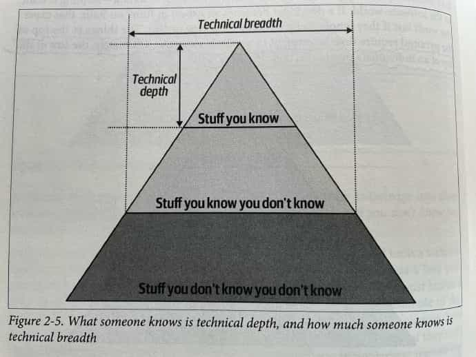
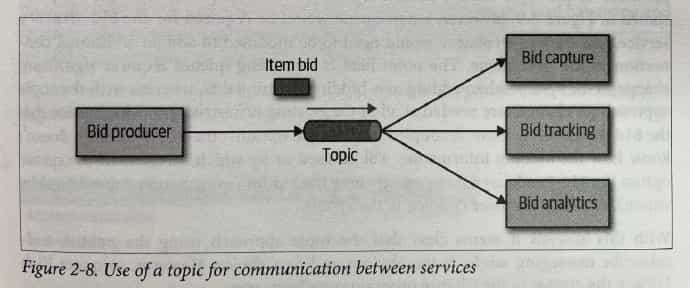
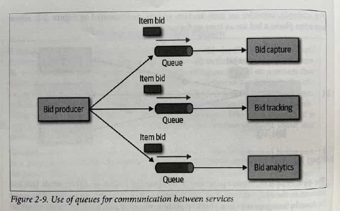
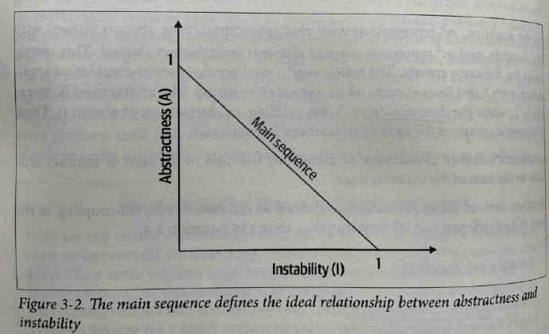
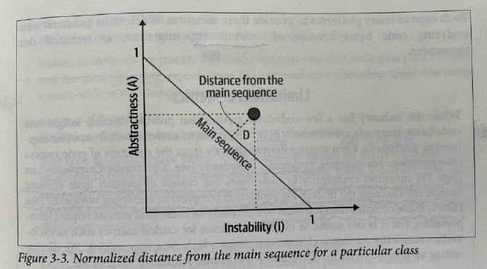
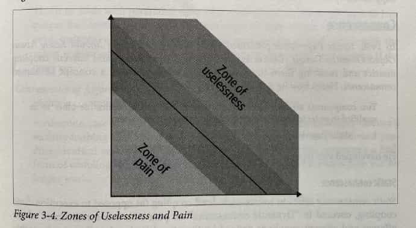
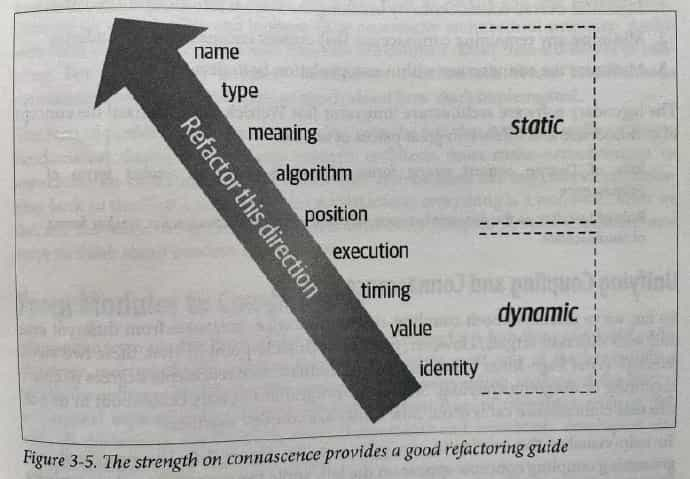

# Fundamentals of Software Architecture

《软件架构基础》（影印版）Mark Richards, Neal Ford 著

---

References

- Book "Fundamentals of Software Architecture"
    - 《软件架构基础》（影印版）
    - [TOC](/books/fundamentals-of-software-architecture-toc.md)

## Table of Contents

-   Preface: Invalidating Axioms _( 公理 )_

-   1\. Introduction

    - Defining Software Architecture
    - Expectations of an Architect
        - Continually Analyze the Archituecture
        - Keep Current with Latest Trends
        - Ensure Compliance _( 服从 )_ with Decisions
        - Diverse _( 不同的 )_ Exposure _( 显露? )_ and Experience
        - Have Bussines Domain Knowledge
        - Understand and Navigate _( 操纵 )_ Politics
    - Intersection _( 交叉点 )_ of Architecture and …
        - **Engineering Practices**
        - **Operations / DevOps**
        - **Process**
        - **Data**
    - **Laws of Software Architecutre**

### Part 1. Foundations

-   2\. Architectural _( 建筑学上的 )_ Thinking

    - Architecture Versus Design
    - Technical Breadth
    - Analyze Trade-Offs
    - Understanding Business Drivers
    - Balancing Architecutre and Hands-On Coding

-   3\. **Modularity _( 模块性 )_**

    - Definition
    - Measuring Modularity
        - **Cohesion**
        - **Coupling**
        - **Abstractness, Instability, and Distance from the Main Sequence**
        - **Distance from the Main Sequence**
        - **Connascence _( 共生性 )_**
        - **Unifying Coupling and Connascence Metrics**
    - **From Modules to Components**

-   4\. **Architecture Characteristics _( 特征 )_** Defined

    - Architectural Characteristics ( Partially ) Listed
        - **Operational** Architecture Characteristics
        - **Structural** Architecture Characteristics
        - **Cross-Cutting** Architecture Characteristics
    - Trade-Offs and Least Worst Architecture

-   5\. Indentifying Architectural Characteristics

    - Extracting Architecture Characteristics from Domain Concerns
    - Extracting Architecture Characteristics from Requirements
    - Case Study: Silicon Sandwiches
        - Explicit Characteristics
        - Implicit Characteristics

-   6\. Measuring and Governing Architecture Characteristics

    - Measuring Architecture Characteristics
        - Operational Measures
        - Structural Measures
        - Process Measures
    - Governance _( 管理 )_ and Fitness _( 适当 )_ Function
        - Governing Architecture Characteristics
        - Fitness Functions

-   7\. **Scope** of Architecture Characteristics

    - **Coupling and Connascence**
    - **Architectural Quanta _( 量 )_ and Granularity _( 粒度 )_**
        - Case Study: Going, Going, Gone

-   8\. Component-Based Thinking

    - Component Scope
    - **Architect Role _( 职责 )_**
        - **Architecture Partitioning _( 分割 )_**
        - Case Study: Silicon Sanwiches: Partitioning
    - **Developer Role**
    - Component Identification Flow
        - Identifying Initial Components
        - Assign Requirements to Components
        - Analyze Roles and Responsibilities
        - Analyze Architecture Characteristics
        - Restructure Components
    - Component Granularity
    - Component Design
        - Discovering Components
    - Case Study: Going, Going, Gone: Discovering Components
    - Architecture Quantum Redux: Choosing Between Monolithic Versus Distributed Architectures

### Part 2. Architure Styles

-   9\. Foundations

    - Fundamental Patterns
        - Big Ball of Mud
        - Unitary _( 统一的 )_ Architecture
        - Client / Server
    - **Monolithic Versus Distributed Architectures**
        - **Fallacy _( 谬误 )_ #1: The Network Is Reliable**
        - **Fallacy #2: Latency Is Zero**
        - **Fallacy #3: Bandwidth Is Infinite**
        - **Fallacy #4: The Network Is Secure**
        - **Fallacy #5: The Topology Never Changes**
        - **Fallacy #6: There Is Only One Administrator**
        - **Fallacy #7: Transport Cost Is Zero**
        - **Fallacy #8: The Network Is Homogeneous**
        - Other Distributed Considerations

-   10\. **Layered** Architecture Style

    - Topology
    - **Layers of Isolation**
    - Adding Layers
    - Other Considerations
    - Why Use This Architecture Style
    - Architecture Characteristics Ratings

-   11\. **Pipeline** Architecture Style

    - Topology
        - **Pipes**
        - **Filters**
    - Example
    - Architecture Characteristics Ratings

-   12\. **Microkernel** Architecture Style

    - Topology
        - **Core System**
        - **Plug-In Components**
    - **Registry**
    - **Contracts**
    - Examples of Use Cases
    - Architecture Characteristics Ratings

-   13\. **Service-Based** Architecture Style

    - Topology
    - Topology Variants
    - Service Design and Granularity
    - **Database Partitioning**
    - Example Architecture
    - Architecture Characteristics Ratings
    - When to Use This Architecture Style

-   14\. **Event-Driven** Architecture Style

    - Topology
    - **Broker** Topology
    - **Mediator** Topology
    - **Asynchronous Capabilities**
    - **Error Handling**
    - **Prevent Data Loss**
    - **Broadcast Capabilities**
    - **Request-Reply**
    - Choosing Between Request-Reply and **Event-Based**
    - **Hybrid** Event-Driven Architectures
    - Architecture Characteristics Ratings

-   15\. **Space-Based** Architecture Style

    - General Topology
        - **Processing Unit**
        - **Virtualized Middleware**
        - **Data Pumps _( 泵 )_**
        - **Data Writers**
        - **Data Readers**
    - **Data Collisions**
    - **Cloud Versus On-Premises _( 内部部署 )_ Implementations**
    - **Replicated Versus Distributed Caching**
    - **Near-Cahce** Considerations
    - Implementation Examples
        - Correct Ticketing System
        - Online Auction System
    - Architecture Characteristics Ratings

-   16\. **Orchestration-Driven Service-Oriented** Architecture

    - History and Philosophy
    - Topology
    - Taxonomy
        - **Business** Services
        - **Enterprise** Services
        - **Application** Services
        - **Infrastructure** Services
        - **Orchestration** Services
        - **Message Flow**
    - **Reuse … and Coupling**
    - Architecture Characteristics Ratings

-   17\. **Microservices** Architecture

    - History
    - Topology
    - **Distributed**
    - **Bounded Context**
        - **Granularity**
        - **Data Isolation**
    - **API Layer**
    - Operational Reuse
    - **Frontends _( 前端的 )_**
    - Communication
        - **Choreography _( 舞蹈舞蹈设计 )_ and Orchestration**
        - **Transactions and Sages _( 圣人, 智者 )_**
    - Architecture Characteristics Ratings
    - Additional References

-   18\. Choosing the Appropriate Architecture Style

    - Shifting "Fashion" in Architecture
    - **Decision Criteria _( 标准, 条件 )_**
    - Monolith Case Study: Silicon Sandwiches
        - Modular Monolith
        - Microkernel
    - Distributed Case Study: Going, Going, Gone

### Part 3. Techniques and Soft Skills

-   19\. **Architecture Decisions**

    - Architecture Decision **Anti-Patterns**
        - **Governing Your Assets** Anti-Pattern
        - **Groundhog Day _( 土拨鼠日 )_** Anti-Pattern
        - **Email-Driven** Architecture Anti-Pattern
    - Architecturally Significant
    - Architecture Decision Records
        - Basic Structure
        - Storing ADRs
        - ADRs as Documentation
        - Using ADRs for Standards
        - Example

-   20\. Analyzing Architecture **Risk**

    - Risk Matrix
    - Risk Assessments _( 估价 )_
    - Risk Storming
        - Identification
        - Consensus
    - Agile Story Risk Analysis
    - Risk Storming Examples
        - Availability
        - **Elasticity _( 弹性 )_**
        - Security

-   21\. Diagramming and Presenting Architecture

    - Diagramming
        - Tools
        - Diagramming Standards: **UML, C4, and ArchiMate**
        - Diagram Guidelines
    - Presenting
        - Manipulating Time
        - Incremental Builds
        - **Infodecks Versus Presentations**
        - **Slides Are Half of the Story**
        - Invisibility

-   22\. Making Teams Effective

    - Team Boundaries
    - Architect Personalities
        - Control Freak _( 怪物; 反常的事 )_
        - Armchair _( 扶手椅 )_ Architect
        - Effective Architect
    - How Much Control?
    - Team Warning Signs
    - **Leveraging Checklists**
        - **Developer Code Completion** Checklist
        - **Unit and Functional Testing** Checklist
        - **Software Release** Checklist
    - Providing Guidance
    - Summary

-   23\. Negotiation and Leadership Skills

    - **Negotiation and Facilitation** _( 助长, 简易化 )_
        - Negotiating with Business Stakeholders
        - Negotiating with Other Architects
        - Negotiating with Developers
    - The Software Architect as a Leader
        - The 4 C's of Architecture
        - Be Pragmatic, Yet Visionary _( 有眼光的, 有远见的 )_
        - Leading Teams By Example
    - Integrating with the Development Team
    - Summary

-   24\. Developing a Career Path

    - The 20-Minute Rule
    - Developing a Personal Radar
        - The ThoughtWorks Technology Radar
        - Open Source Visualization Bits
    - Using Social Media
    - Parting Words of Advice

-   Appendix. Self-Assessment Questions

-   Index

## Preface: Invalidating Axioms

Architecture characteristics referes to the "-illities" that the system must support

- Availability 可用性
- Reliability 可靠性
    - _Software Reliability is the probability of failure-free software operation for a specified period of time in a specified environment. ( [ref](https://users.ece.cmu.edu/~koopman/des_s99/sw_reliability/#:~:text=Software%20Reliability%20is%20the%20probability,important%20factor%20affecting%20system%20reliability.&text=Measurement%20in%20software%20is%20still%20in%20its%20infancy.) )_
- Testability 可测试性
- Scalability 可伸缩性
    - _Scalability handles the changing needs of an application within the confines of the infrastructure via statically adding or removing resources to meet applications demands if needed. ( [ref](https://blog.turbonomic.com/blog/on-technology/cloud-elasticity-vs-cloud-scalability#:~:text=The%20purpose%20of%20Elasticity%20is,meet%20applications%20demands%20if%20needed.) )_
- Security 安全性
- Agility 敏捷性
- Fault Tolerance 错误容忍性
- Elasticity 弹性
    - _The purpose of Elasticity is to match the resources allocated with actual amount of resources needed at any given point in time. ( [ref](https://blog.turbonomic.com/blog/on-technology/cloud-elasticity-vs-cloud-scalability#:~:text=The%20purpose%20of%20Elasticity%20is,meet%20applications%20demands%20if%20needed.) )_
- Recoverability 可恢复性
- Performance 性能
- Deployability 可部署性
- Learnability 可学习性?

_( [Scalability vs. Elasticity](https://blog.turbonomic.com/blog/on-technology/cloud-elasticity-vs-cloud-scalability#:~:text=The%20purpose%20of%20Elasticity%20is,meet%20applications%20demands%20if%20needed.) )_

## C1. Introduction

Laws of Software Architecture

> Everything in software architecture is a trade-off.

_—— First Law of SOftware Architecture_

> If an architect thinks they discovered something that isn't a trade-off, more likely they just haven't identified the trade-off yet.

_—— Corollary 1_

> Why is more important than how.

_—— Second Law of Software Architecture_

# Part 1. Foundations

## C2. Architectureal Thinking

### Technical Breadth

Technical Depth & Technical Breadth

### Analyze Trade-Offs

Trade-offs between topics and queues

Topic advantages

- Architecture extensibility
- Service decoupling

Topic disadvantages

- Data access and data security conerns
    _( 可以像阿里那样用管理后台管控 topic 接入, 但实际可以通过代码绕过去 )_
- No heterogeneous contents
    _( 不同消费方关注的字段各不相同, 生产方只能提供消费方所需字段的超集, 没法为消费方按需提供数据 )_
- Monitoring and programmatic scalability
    _( 无法单独监控 topic 的消息消费情况, 就难以为各个消费方单独做自动扩缩容 )_

_( icehe : 初见, 感觉基于 topic 是 "完美的" , 实则同样存在的取舍平衡 )_

### Balancing Architecure and Hands-on Coding

First way is to do frequent proof-of-concepts or POCs.

- … it also helps validate an architecuture decision by talking the implementation details into account.
- _Our advice when doing proof-of-concept work is that, whenever possible, the architect should write the best production-quality code they can._

Another way an architect can remain hands-on is to tackle some of the technical debt stories or architecture stories, _freeing the development team up to work on the critical functional user stories._

- _Similarly, working on bugfixes within an iteration…_
- Leveraging automation by creating simple command-line tools and analyzers _to help the development team with their day-to-day tasks is another great way to maintain hands-on coding skills while making the development team more effective_

Do frequent code reviews.

---

[ArchiUnit](https://www.archunit.org/)

ArchUnit is a free, simple and extensible library for checking the architecture of your Java code using any plain Java unit test framework. That is, ArchUnit can check dependencies between packages and classes, layers and slices, check for cyclic dependencies and more. It does so by analyzing given Java bytecode, importing all classes into a Java code structure.

## C3. Modularity

### Measuring Modularity

#### Cohesion

_( 内聚 )_

- **Functional** cohesion
    - Every part of the module is related to the other, ant he module contains everything essential to function
- **Sequential** cohesion
    - Two modules interact, where one outputs data that becomes the input ofr the other
- **Communicational** cohesion
    - Two modules form a communication chain
    - e.g. ad a record to db → gen an email based on it
- **Procedural** cohesion
    - Must execute in particular order
- **Temporal** cohesion
    - Related based on timing dependencies
    - e.g. things that must be initialized at system startup
- **Logical** cohesion
    - Related logically but not functionally
    - e.g. StringUtils package
        - Operations are related, but the functions are quite different
- **Coincidental** cohesion _( negative )_
    - e.g. not related but being in the same source file

**LCOM** : Lack of Cohesion in Methods

- The sume of sets of methods not shared via sharing fields

#### Coupling

_( 耦合 )_

**Afferent** coupling _( 传入的 ≈ incoming )_
**Efferent** coupling _( 输出的 ≈ outgoing )_

Afferent coupling measure the number of incoming connections to a code artifact (component, class, function, and so on).

Efferent coupling measures the outgoing connections to toher code artifacts.

#### Abstractness, Instability

**Abstractness** is the ratio of abstract artifacts ( abstract classes, interfaces, and so on ) to concrete artifacts ( implementation ) .

$$
A = \frac{\sum{m^a}}{\sum{m^c}}
$$

- $m^a$ represents abstract elements (interfaces or abstract classes) with the module
- $m^c$ represents concrete elements (nonabstract classes)

**Instability** is the ratio of efferent coupling to the sum of both efferent and afferent coupling.

$$
I = \frac{C^e}{C^e+C^a}
$$

- $c^e$ represents efferent (or outgoing) coupling
- $c^a$ represents afferent (or incoming) coupling

The instability _( 不稳定 )_ metric determines the volatility _( 变化无常, 不稳定 )_ of a code base. A code base that exhibits high degrees of instability breaks more easily when changed because of high coupling.

#### Distance from the Main Sequence

$$
D = |A+I-1|
$$

**Limitations of Metrics**

For example, **cyclomatic complexity** measures complexity in code bases but cannot distinguish from **essential complexity** (because the underlying problem is complex) or **accidental complexity** (the code is more complex than it should be).

#### Connascence

[Connascence - Wikipedia](https://en.wikipedia.org/wiki/Connascence)

_icehe : 很像 coupling 耦合, 怎么翻译比较好? 联动?_

> Two components are connascent if a change in one would require the other to be modified in order to maintain the overall correctness of the system.
>
> —— _Meilir Page-Jones_

##### Static Connascence

**Static connascence** referes to source-code-level coupling (as opposed to execution-time coupling);
it is a refinement of the afferent and efferent couplings defined by _Structured Design_.

In other words, architects view the following types of static connascence as the _degree_ to which something is coupled, either afferently or efferently:

-   Connascence of Name (CoN)

    Multiple components must agree on the name of an entity.

    _Names of methods represents the most common way that code bases are coupled and the most desirable._

-   Connascence of Type (CoT)

    Multiple components must agree on the type of an entity.

    _e.g. statically typed languages, and dynamically typed languages offering selective typing_

-   Connascence of Meaning (CoM) or Connascence of Convention (CoC)

    Multiple components must agree on the meaning of particular values.

    _e.g. hard-coded numbers rather than constants_

-   Connascence of Position (CoP)

    Multiple entities must agree on the order of values.

    _e.g. parameter values for method and function calls ( wrong parameter order of function )_

-   Connascence of Algorithm (CoA)

    Multiple entities must agree on a particular algorithm.

    _e.g. defines a security hashing algorithm that must run on both the server and client and produce identical results to authenticate the user_

##### Dynamic Connascence

**Dynamic connascence** analyses calls at runtime.

Different types of dynamic connascence:

-   Connascence of Execution (CoE)

    The order of execution of multiple components.

-   Connascence of Timing (CoT)

    The timing of the execution of multiple components.

    _e.g. a race condition caused by two threads executing at the same time_

-   Connascence of Values (CoV)

    Occurs when serveral values relate on one another and must change together.

    _e.g. the more common and problematic case involves transactions, especially in distributed system:_
    _When an architect designs a system with separate databases, yet needs to update a single value across all of the databases, all the values must change together or not at all._

-   Connascence of Identity (CoI)

    Occurs when serveral values relate on one another and must change together. _( icehe : 竟然这句跟上文一样? )_

    _e.g. two independent components that must share and update a common data structure, such as a distributed quque._

##### Connascence Properties

_Some properties of connascence help developers use it wisely._

-   **Strength**

    Architects determine the _strength_ of connanascence by the ease with which a developer can refactor that type of coupling; _differenct types of connascence are demonstrably more desirable._

    _e.g. consider the case of connascence of meaning, which developers can improve by refactoring to connascence of name by creating named constant rather than a magic value._

    

-   **Locality**

    The _locality_ of connascence mearsures how proximal the modules are to each other in the code base.

    _Proximal code (in the same module) typically has more and higher forms of connascence than more separated code (in separate modules or code bases) ._
    _In other words, forms of connascence that indicate poor coupling when far apart are fine when closer together._

    _e.g. if two classes in the same component have connascence of meaning, it is less damaging to the code base than if two components have the same form of connascence._

-   **Degree**

    The _degree_ of connascence related to the size of its impact —— does it impact a few classes or many?

    _Lesser degrees of connascence damage code bases less._

Three guidelines for using connascence to improve system modularity:

1. Minimize overall connascence by breaking the system into encapsulated elements
2. Minimize any remaining connascence that crosses encapsulation boundaries
3. Maximize the connascence within encapsulation boundaries

_The lengendary software architecture innovator Jim Weirich offers two great pieces of advices:_

- **Rule of Degree**: convert strong forms of connascence into weaker forms of connascence
- **Rule of Locality**: as the distance between software elements increases, use weaker forms fo connascence

#### Unifying Coupling and Connascence Metrics

TODO

### From Modules to Components

TODO

# Part 2. Architeure Styles

# Part 3. Techniques and Soft Skills
