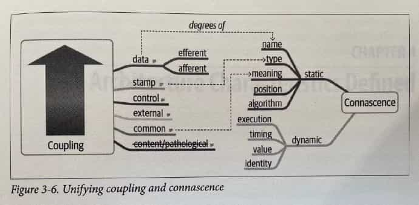
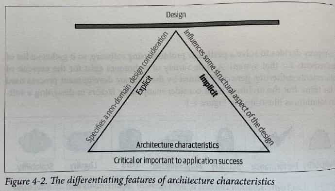
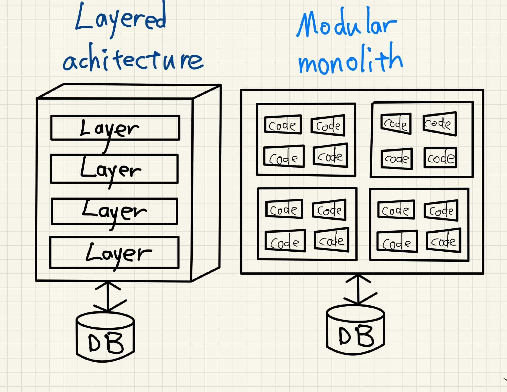
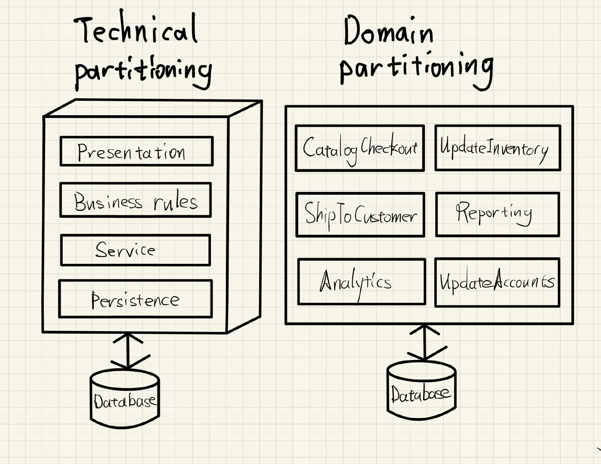
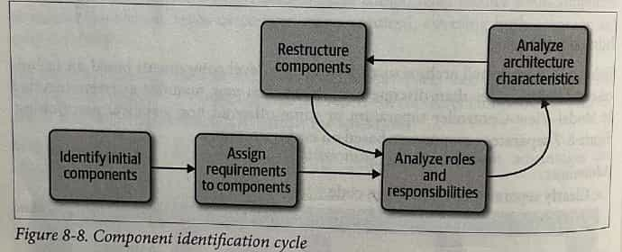

# Fundamentals of Software Architecture

《软件架构基础》

---

References

- Book "Fundamentals of Software Architecture" Mark Richards, Neal Ford 著
    - 《软件架构基础》（影印版）
    - [Table Of Content](/books/fundamentals-of-software-architecture-toc.md)

## Table of Contents

-   Preface: Invalidating Axioms _( 公理 )_

-   1\. Introduction

    - Defining Software Architecture
    - Expectations of an Architect
        - Continually Analyze the Archituecture
        - Keep Current with Latest Trends
        - Ensure Compliance _( 服从 )_ with Decisions
        - Diverse _( 不同的 )_ Exposure _( 显露? )_ and Experience
        - Have Bussines Domain Knowledge
        - Understand and Navigate _( 操纵 )_ Politics
    - Intersection _( 交叉点 )_ of Architecture and …
        - **Engineering Practices**
        - **Operations / DevOps**
        - **Process**
        - **Data**
    - **Laws of Software Architecutre**

### Part 1. Foundations

-   2\. Architectural _( 建筑学上的 )_ Thinking

    - Architecture Versus Design
    - Technical Breadth
    - Analyze Trade-Offs
    - Understanding Business Drivers
    - Balancing Architecutre and Hands-On Coding

-   3\. **Modularity _( 模块性 )_**

    - Definition
    - Measuring Modularity
        - **Cohesion**
        - **Coupling**
        - **Abstractness, Instability, and Distance from the Main Sequence**
        - **Distance from the Main Sequence**
        - **Connascence _( 共生性 )_**
        - **Unifying Coupling and Connascence Metrics**
    - **From Modules to Components**

-   4\. **Architecture Characteristics _( 特征 )_** Defined

    - Architectural Characteristics ( Partially ) Listed
        - **Operational** Architecture Characteristics
        - **Structural** Architecture Characteristics
        - **Cross-Cutting** Architecture Characteristics
    - Trade-Offs and Least Worst Architecture

-   5\. Indentifying Architectural Characteristics

    - Extracting Architecture Characteristics from Domain Concerns
    - Extracting Architecture Characteristics from Requirements
    - Case Study: Silicon Sandwiches
        - Explicit Characteristics
        - Implicit Characteristics

-   6\. Measuring and Governing Architecture Characteristics

    - Measuring Architecture Characteristics
        - Operational Measures
        - Structural Measures
        - Process Measures
    - Governance _( 管理 )_ and Fitness _( 适当 )_ Function
        - Governing Architecture Characteristics
        - Fitness Functions

-   7\. **Scope** of Architecture Characteristics

    - **Coupling and Connascence**
    - **Architectural Quanta _( 量 )_ and Granularity _( 粒度 )_**
        - Case Study: Going, Going, Gone

-   8\. Component-Based Thinking

    - Component Scope
    - **Architect Role _( 职责 )_**
        - **Architecture Partitioning _( 分割 )_**
        - Case Study: Silicon Sanwiches: Partitioning
    - **Developer Role**
    - Component Identification Flow
        - Identifying Initial Components
        - Assign Requirements to Components
        - Analyze Roles and Responsibilities
        - Analyze Architecture Characteristics
        - Restructure Components
    - Component Granularity
    - Component Design
        - Discovering Components
    - Case Study: Going, Going, Gone: Discovering Components
    - Architecture Quantum Redux: Choosing Between Monolithic Versus Distributed Architectures

### Part 2. Architure Styles

-   9\. Foundations

    - Fundamental Patterns
        - Big Ball of Mud
        - Unitary _( 统一的 )_ Architecture
        - Client / Server
    - **Monolithic Versus Distributed Architectures**
        - **Fallacy _( 谬误 )_ #1: The Network Is Reliable**
        - **Fallacy #2: Latency Is Zero**
        - **Fallacy #3: Bandwidth Is Infinite**
        - **Fallacy #4: The Network Is Secure**
        - **Fallacy #5: The Topology Never Changes**
        - **Fallacy #6: There Is Only One Administrator**
        - **Fallacy #7: Transport Cost Is Zero**
        - **Fallacy #8: The Network Is Homogeneous**
        - Other Distributed Considerations

-   10\. **Layered** Architecture Style

    - Topology
    - **Layers of Isolation**
    - Adding Layers
    - Other Considerations
    - Why Use This Architecture Style
    - Architecture Characteristics Ratings

-   11\. **Pipeline** Architecture Style

    - Topology
        - **Pipes**
        - **Filters**
    - Example
    - Architecture Characteristics Ratings

-   12\. **Microkernel** Architecture Style

    - Topology
        - **Core System**
        - **Plug-In Components**
    - **Registry**
    - **Contracts**
    - Examples of Use Cases
    - Architecture Characteristics Ratings

-   13\. **Service-Based** Architecture Style

    - Topology
    - Topology Variants
    - Service Design and Granularity
    - **Database Partitioning**
    - Example Architecture
    - Architecture Characteristics Ratings
    - When to Use This Architecture Style

-   14\. **Event-Driven** Architecture Style

    - Topology
    - **Broker** Topology
    - **Mediator** Topology
    - **Asynchronous Capabilities**
    - **Error Handling**
    - **Prevent Data Loss**
    - **Broadcast Capabilities**
    - **Request-Reply**
    - Choosing Between Request-Reply and **Event-Based**
    - **Hybrid** Event-Driven Architectures
    - Architecture Characteristics Ratings

-   15\. **Space-Based** Architecture Style

    - General Topology
        - **Processing Unit**
        - **Virtualized Middleware**
        - **Data Pumps _( 泵 )_**
        - **Data Writers**
        - **Data Readers**
    - **Data Collisions**
    - **Cloud Versus On-Premises _( 内部部署 )_ Implementations**
    - **Replicated Versus Distributed Caching**
    - **Near-Cahce** Considerations
    - Implementation Examples
        - Correct Ticketing System
        - Online Auction System
    - Architecture Characteristics Ratings

-   16\. **Orchestration-Driven Service-Oriented** Architecture

    - History and Philosophy
    - Topology
    - Taxonomy
        - **Business** Services
        - **Enterprise** Services
        - **Application** Services
        - **Infrastructure** Services
        - **Orchestration** Services
        - **Message Flow**
    - **Reuse … and Coupling**
    - Architecture Characteristics Ratings

-   17\. **Microservices** Architecture

    - History
    - Topology
    - **Distributed**
    - **Bounded Context**
        - **Granularity**
        - **Data Isolation**
    - **API Layer**
    - Operational Reuse
    - **Frontends _( 前端的 )_**
    - Communication
        - **Choreography _( 舞蹈舞蹈设计 )_ and Orchestration**
        - **Transactions and Sages _( 圣人, 智者 )_**
    - Architecture Characteristics Ratings
    - Additional References

-   18\. Choosing the Appropriate Architecture Style

    - Shifting "Fashion" in Architecture
    - **Decision Criteria _( 标准, 条件 )_**
    - Monolith Case Study: Silicon Sandwiches
        - Modular Monolith
        - Microkernel
    - Distributed Case Study: Going, Going, Gone

### Part 3. Techniques and Soft Skills

-   19\. **Architecture Decisions**

    - Architecture Decision **Anti-Patterns**
        - **Governing Your Assets** Anti-Pattern
        - **Groundhog Day _( 土拨鼠日 )_** Anti-Pattern
        - **Email-Driven** Architecture Anti-Pattern
    - Architecturally Significant
    - Architecture Decision Records
        - Basic Structure
        - Storing ADRs
        - ADRs as Documentation
        - Using ADRs for Standards
        - Example

-   20\. Analyzing Architecture **Risk**

    - Risk Matrix
    - Risk Assessments _( 估价 )_
    - Risk Storming
        - Identification
        - Consensus
    - Agile Story Risk Analysis
    - Risk Storming Examples
        - Availability
        - **Elasticity _( 弹性 )_**
        - Security

-   21\. Diagramming and Presenting Architecture

    - Diagramming
        - Tools
        - Diagramming Standards: **UML, C4, and ArchiMate**
        - Diagram Guidelines
    - Presenting
        - Manipulating Time
        - Incremental Builds
        - **Infodecks Versus Presentations**
        - **Slides Are Half of the Story**
        - Invisibility

-   22\. Making Teams Effective

    - Team Boundaries
    - Architect Personalities
        - Control Freak _( 怪物; 反常的事 )_
        - Armchair _( 扶手椅 )_ Architect
        - Effective Architect
    - How Much Control?
    - Team Warning Signs
    - **Leveraging Checklists**
        - **Developer Code Completion** Checklist
        - **Unit and Functional Testing** Checklist
        - **Software Release** Checklist
    - Providing Guidance
    - Summary

-   23\. Negotiation and Leadership Skills

    - **Negotiation and Facilitation** _( 助长, 简易化 )_
        - Negotiating with Business Stakeholders
        - Negotiating with Other Architects
        - Negotiating with Developers
    - The Software Architect as a Leader
        - The 4 C's of Architecture
        - Be Pragmatic, Yet Visionary _( 有眼光的, 有远见的 )_
        - Leading Teams By Example
    - Integrating with the Development Team
    - Summary

-   24\. Developing a Career Path

    - The 20-Minute Rule
    - Developing a Personal Radar
        - The ThoughtWorks Technology Radar
        - Open Source Visualization Bits
    - Using Social Media
    - Parting Words of Advice

-   Appendix. Self-Assessment Questions

-   Index

## Preface: Invalidating Axioms

Architecture characteristics referes to the "-illities" that the system must support

- Availability 可用性
- Reliability 可靠性
    - _Software Reliability is the probability of failure-free software operation for a specified period of time in a specified environment. ( [ref](https://users.ece.cmu.edu/~koopman/des_s99/sw_reliability/#:~:text=Software%20Reliability%20is%20the%20probability,important%20factor%20affecting%20system%20reliability.&text=Measurement%20in%20software%20is%20still%20in%20its%20infancy.) )_
- Testability 可测试性
- Scalability 可伸缩性
    - _Scalability handles the changing needs of an application within the confines of the infrastructure via statically adding or removing resources to meet applications demands if needed. ( [ref](https://blog.turbonomic.com/blog/on-technology/cloud-elasticity-vs-cloud-scalability#:~:text=The%20purpose%20of%20Elasticity%20is,meet%20applications%20demands%20if%20needed.) )_
- Security 安全性
- Agility 敏捷性
- Fault Tolerance 错误容忍性
- Elasticity 弹性
    - _The purpose of Elasticity is to match the resources allocated with actual amount of resources needed at any given point in time. ( [ref](https://blog.turbonomic.com/blog/on-technology/cloud-elasticity-vs-cloud-scalability#:~:text=The%20purpose%20of%20Elasticity%20is,meet%20applications%20demands%20if%20needed.) )_
- Recoverability 可恢复性
- Performance 性能
- Deployability 可部署性
- Learnability 可学习性?

_( [Scalability vs. Elasticity](https://blog.turbonomic.com/blog/on-technology/cloud-elasticity-vs-cloud-scalability#:~:text=The%20purpose%20of%20Elasticity%20is,meet%20applications%20demands%20if%20needed.) )_

## C1. Introduction

Laws of Software Architecture

> Everything in software architecture is a trade-off.

_—— First Law of SOftware Architecture_

> If an architect thinks they discovered something that isn't a trade-off, more likely they just haven't identified the trade-off yet.

_—— Corollary 1_

> Why is more important than how.

_—— Second Law of Software Architecture_

# Part 1. Foundations

## C2. Architectureal Thinking

### Technical Breadth

Technical Depth & Technical Breadth

### Analyze Trade-Offs

Trade-offs between topics and queues

Topic advantages

- Architecture extensibility
- Service decoupling

Topic disadvantages

- Data access and data security conerns
    _( 可以像阿里那样用管理后台管控 topic 接入, 但实际可以通过代码绕过去 )_
- No heterogeneous contents
    _( 不同消费方关注的字段各不相同, 生产方只能提供消费方所需字段的超集, 没法为消费方按需提供数据 )_
- Monitoring and programmatic scalability
    _( 无法单独监控 topic 的消息消费情况, 就难以为各个消费方单独做自动扩缩容 )_

_( icehe : 初见, 感觉基于 topic 是 "完美的" , 实则同样存在的取舍平衡 )_

### Balancing Architecure and Hands-on Coding

First way is to do frequent proof-of-concepts or POCs.

- … it also helps validate an architecuture decision by talking the implementation details into account.
- _Our advice when doing proof-of-concept work is that, whenever possible, the architect should write the best production-quality code they can._

Another way an architect can remain hands-on is to tackle some of the technical debt stories or architecture stories, _freeing the development team up to work on the critical functional user stories._

- _Similarly, working on bugfixes within an iteration…_
- Leveraging automation by creating simple command-line tools and analyzers _to help the development team with their day-to-day tasks is another great way to maintain hands-on coding skills while making the development team more effective_

Do frequent code reviews.

---

[ArchiUnit](https://www.archunit.org/)

ArchUnit is a free, simple and extensible library for checking the architecture of your Java code using any plain Java unit test framework. That is, ArchUnit can check dependencies between packages and classes, layers and slices, check for cyclic dependencies and more. It does so by analyzing given Java bytecode, importing all classes into a Java code structure.

## C3. Modularity

### Measuring Modularity

#### Cohesion

_( 内聚 )_

- **Functional** cohesion
    - Every part of the module is related to the other, ant he module contains everything essential to function
- **Sequential** cohesion
    - Two modules interact, where one outputs data that becomes the input ofr the other
- **Communicational** cohesion
    - Two modules form a communication chain
    - e.g. ad a record to db → gen an email based on it
- **Procedural** cohesion
    - Must execute in particular order
- **Temporal** cohesion
    - Related based on timing dependencies
    - e.g. things that must be initialized at system startup
- **Logical** cohesion
    - Related logically but not functionally
    - e.g. StringUtils package
        - Operations are related, but the functions are quite different
- **Coincidental** cohesion _( negative )_
    - e.g. not related but being in the same source file

**LCOM** : Lack of Cohesion in Methods

- The sume of sets of methods not shared via sharing fields

#### Coupling

_( 耦合 )_

**Afferent** coupling _( 传入的 ≈ incoming )_
**Efferent** coupling _( 输出的 ≈ outgoing )_

Afferent coupling measure the number of incoming connections to a code artifact (component, class, function, and so on).

Efferent coupling measures the outgoing connections to toher code artifacts.

#### Abstractness, Instability

**Abstractness** is the ratio of abstract artifacts ( abstract classes, interfaces, and so on ) to concrete artifacts ( implementation ) .

$$
A = \frac{\sum{m^a}}{\sum{m^c}}
$$

- $m^a$ represents abstract elements (interfaces or abstract classes) with the module
- $m^c$ represents concrete elements (nonabstract classes)

**Instability** is the ratio of efferent coupling to the sum of both efferent and afferent coupling.

$$
I = \frac{C^e}{C^e+C^a}
$$

- $c^e$ represents efferent (or outgoing) coupling
- $c^a$ represents afferent (or incoming) coupling

The instability _( 不稳定 )_ metric determines the volatility _( 变化无常, 不稳定 )_ of a code base. A code base that exhibits high degrees of instability breaks more easily when changed because of high coupling.

#### Distance from the Main Sequence

$$
D = |A+I-1|
$$

**Limitations of Metrics**

For example, **cyclomatic complexity** measures complexity in code bases but cannot distinguish from **essential complexity** (because the underlying problem is complex) or **accidental complexity** (the code is more complex than it should be).

#### Connascence

[Connascence - Wikipedia](https://en.wikipedia.org/wiki/Connascence)

_icehe : 很像 coupling 耦合, 怎么翻译比较好? 联动?_

> Two components are connascent if a change in one would require the other to be modified in order to maintain the overall correctness of the system.
>
> —— _Meilir Page-Jones_

##### Static Connascence

**Static connascence** referes to source-code-level coupling (as opposed to execution-time coupling);
it is a refinement of the afferent and efferent couplings defined by _Structured Design_.

In other words, architects view the following types of static connascence as the _degree_ to which something is coupled, either afferently or efferently:

-   Connascence of Name (CoN)

    Multiple components must agree on the name of an entity.

    _Names of methods represents the most common way that code bases are coupled and the most desirable._

-   Connascence of Type (CoT)

    Multiple components must agree on the type of an entity.

    _e.g. statically typed languages, and dynamically typed languages offering selective typing_

-   Connascence of Meaning (CoM) or Connascence of Convention (CoC)

    Multiple components must agree on the meaning of particular values.

    _e.g. hard-coded numbers rather than constants_

-   Connascence of Position (CoP)

    Multiple entities must agree on the order of values.

    _e.g. parameter values for method and function calls ( wrong parameter order of function )_

-   Connascence of Algorithm (CoA)

    Multiple entities must agree on a particular algorithm.

    _e.g. defines a security hashing algorithm that must run on both the server and client and produce identical results to authenticate the user_

##### Dynamic Connascence

**Dynamic connascence** analyses calls at runtime.

Different types of dynamic connascence:

-   Connascence of Execution (CoE)

    The order of execution of multiple components.

-   Connascence of Timing (CoT)

    The timing of the execution of multiple components.

    _e.g. a race condition caused by two threads executing at the same time_

-   Connascence of Values (CoV)

    Occurs when serveral values relate on one another and must change together.

    _e.g. the more common and problematic case involves transactions, especially in distributed system:_
    _When an architect designs a system with separate databases, yet needs to update a single value across all of the databases, all the values must change together or not at all._

-   Connascence of Identity (CoI)

    Occurs when serveral values relate on one another and must change together. _( icehe : 竟然这句跟上文一样? )_

    _e.g. two independent components that must share and update a common data structure, such as a distributed quque._

##### Connascence Properties

_Some properties of connascence help developers use it wisely._

-   **Strength**

    Architects determine the _strength_ of connanascence by the ease with which a developer can refactor that type of coupling; _differenct types of connascence are demonstrably more desirable._

    _e.g. consider the case of connascence of meaning, which developers can improve by refactoring to connascence of name by creating named constant rather than a magic value._

    

-   **Locality**

    The _locality_ of connascence mearsures how proximal the modules are to each other in the code base.

    _Proximal code (in the same module) typically has more and higher forms of connascence than more separated code (in separate modules or code bases) ._
    _In other words, forms of connascence that indicate poor coupling when far apart are fine when closer together._

    _e.g. if two classes in the same component have connascence of meaning, it is less damaging to the code base than if two components have the same form of connascence._

-   **Degree**

    The _degree_ of connascence related to the size of its impact —— does it impact a few classes or many?

    _Lesser degrees of connascence damage code bases less._

Three guidelines for using connascence to improve system modularity:

1. Minimize overall connascence by breaking the system into encapsulated elements
2. Minimize any remaining connascence that crosses encapsulation boundaries
3. Maximize the connascence within encapsulation boundaries

_The lengendary software architecture innovator Jim Weirich offers two great pieces of advices:_

- **Rule of Degree**: convert strong forms of connascence into weaker forms of connascence
- **Rule of Locality**: as the distance between software elements increases, use weaker forms fo connascence

#### Unifying Coupling and Connascence Metrics

From an architect's point of view, these two views (coupling and connascence) overlap.

… Connascence cares about how things are coupled together.

… What structured programming called _data coupling_ (method calls), connascence provides advice for how that coupling should manifest.

_The structured programming couipling concepts appear on the left, while the connascence appear on the right._

### From Modules to Components

We use _module_ throughtout as a generic name for a bundling of related code.

_We'll disscuss more in Chapter 8._

## C4. Architecture Characteristics Defined

A software solution consists of both domain requirements and architectural.

- **Auditability**
- **Performance**
- **Security**
- **Requirements**
- **Data**
- **Legality**
- **Scalability**

An architecture characteristic meets three criteria

- Specifies a nondomain design consideration
- Influences some structuralaspect of the design
- Is critical or important to application success

_The choice of a triangle is intentional:_
_each of the definition elements supports the others,_
_which in turn support the overall design of the system._

-   Specifies a nondomain design consideration

    When designing an application, the requirements specify what the application should do;
    architecture characteristics specify operational and design crieria for success,
    concerning how to implement the requirements and why certain choices were made.

-   Influences some structural aspect of the design

-   Critical or important to application success

    Applications shouldn't support for each characteristics adds complexity to the design.
    Thus a critical job for architects lies in choosing the fewest architecture characteristics rather than the most possible.

### Architectural Characteristics (Partially) Listed

#### Operational Architectural Characteristics

Term & Definition

-   **Availability**

    How long the system will need to be available.
    ( if 24/7, steps need to be in place to allow the system to be up and running quickly in case of any failure ) .

-   **Continuity** _( 连续性 )_

    **Disaster recovery capacity**.

-   **Performance**

    Includes stress testing, peak analysis, analysis of the frequency of fucntions used, cpacity required, and response times.
    _Performance acceptance sometimes require an exercises of its own, talking months to complete._

-   **Recoverability**

    Bussiness continuity requirements _( 业务连续性? )_
    ( e.g., in case of a disaster, how quickly is the system required to be online again? ) .
    This will affect the cakup strategy and requirements for duplicated hardware.

-   **Reliability / safety**

    Assess if the system needs to be **fail-safe** _( 自动放故障的 )_ ,
    or if it is mission critical _( 关键任务 )_ in a way that affects lives.
    If it fails, will it cost the company large sums of money?

-   **Robustness**

    Ability to **handle error and boundary conditions while running**
    if the internet connection goes down or if there's a power outage or hardware failure.

-   **Scalability**

    Ability for the system to perform and operate as the number of users or requests increses.

#### Structural Architecture Characteristics

-   **Configurability**

    Ability for the end users to easily change aspects of the software's configuration ( through usable interface ) .

-   **Extensibility**

    How important it is to plug new pieces of fucntionality in.

-   **Installability**

    Ease of system installation on all necessary platforms.

-   **Leverageability / reuse**

    Ability to leverage common components across multiple products.

-   **Localization**

    Support for multiple languages on entry/query screens in data fields; on reports, multibyte charater requirements and units of measure or currencies.

-   **Maintainability**

    How easy it is to apply changes and enhance the system?

-   **Portability**

    Does the system need to run on more than one platform? _( For example, does the frontend need to run against oracle as well as SAP DB? )_

-   **Supportability**

    What level of technical support is needed by the application? What level of logging and other facilities are required to debug errors in the system?

-   **Upgradeability**

    Ability to easily/quickly upgrade from a previous version of this application/solution to a newer version on servers and clients.

#### Cross-Cutting Architecture Characteristics

-   **Accessibility** _( 可得性 )_

    **Access to all your users, including those with disabilities** like colorblindness or hearing loss.

-   **Archivability** _( 可归档 )_

    Will the data need to be **archived or deleted after aperiod of time**?
    _( For example, customer accounts are to be deleted after three months or marked as obsolete and archived to a secondary database for future access. )_

-   **Authentication** _( 鉴权 )_

    Security requirements to **ensure users are who they say they are.**

-   **Authorization** _( 授权 )_

    Security requirements to **ensure users can access only certain functions within the application** ( by use case, subsystem, webpage, business rule, field level, etc. )

-   **Legal** _( 合法性 )_

    What legislative constraints is the system operating in ( data protection, Sarbanes Oxley, GDPR, etc. ) ?
    What reservation rights does the company require?
    Any regulations regarding the way the application is to be built or deployed?

-   **Privacy** _( 隐私 )_

    Ability to **hide transactions from internal company employees**
    ( entrypted transactions so even DBAs and network architects cannot see them ) .

-   **Security**

    Does the data need to be entrypted in the databases?
    Entrypted for network communication between internal systems?
    What type of authentication needs to be in place for remote user access?

-   **Supportability**

    What level of technical support is needed by the application?
    What level of logging and other facilities are required to debug errors in the system?

-   **Usability/achievability** _( 可用性?/可实现性? )_

    Level of training required for users to achieve their goals with the application/solution.
    Usability requirements need to be treated as seriously as any other architectureal issuce.

**Italy-ility**

- _Years ago, becuse of a freak communication outage, the head office had lost communication with the Italian branches, and it was organizationally traumatic._
- Italy-ility is **a unique combination of availability, recoverability, and resilience.**

#### Others from ISO

-   **Performance efficiency**

    ……
    It includes
    _time behavior_ ( measure of reponse, processing times, and/or throughput rates ) ,
    _resource utilization_ ( amounts and types of resources used ) , and
    _capacity_ ( degree to which the maximum established limits are exceeded ) .

-   **Compatibility**

    Degree to which a product, system, or component can exchange information with other products, systems, or components
    and/or perform its required functions while sharing the same hardware or sofware environment.

    It includes
    _coexistence_ _( 共存 )_
    ( can perform its required functions efficiently while sharing a common environment and resources with other products ) and
    **_interoperability_ ( degree to which two or more systems can exchange and utilize information ) .**

-   **Usability**

    Users can use the system effectively, efficiently, and satisfactorily for its intended purpose.

    It includes
    **_appropriateness recognizability_ ( users can recognize whether the software is appropriate for their needs ) ,**
    _learnability_ ( … ) ,
    _user error protection_ ( … ) , and
    _accessibility_ ( make the software available to people who with the widest range of characteristics and capabilities ) .

-   **Reliability**

    Degree to which a system functions under specified conditions for a specified period of time.

    It includes
    **_maturity_ ( does the software is operational and accessible ) ,**
    _fault tolerance_ ( … ) ,
    _recoverability_ ( … ) .

-   **Security**

    ……
    It includes
    **_confidentiality_ _( 机密性 )_ ( data is accessible only to those authorized to have access ) ,**
    **_integrity_ ( the software prevents unauthorized access to or modification of software or data ) ,**
    **_nonrepudiation_ _( 不否认, 不拒绝 )_ , ( can actions or events be proven to have taken place ) ,**
    **_accountability_ ( can user actions of a user be traced ) ,** and
    _authenticity_ ( proving the identity of a user )

-   **Maintainability**

    Represnts the degree of effectiveness and efficiency to which developers can modify the software to improve it, correct it, or adapt it to changes in environment and/or requirements.

    It includes
    **_modularity_** ( … ) ,
    **_reusability_** ( … ) ,
    **_analyzability_** ( … ) ,
    **_modifiability_** ( … ) , and
    **_testability_** ( … )

-   **Portability**

    Degree to which developers can transfer a system, product, or component from one hardware, software, or other operational or usage environment to another.

    It includes
    _adaptability_
    ( can developers effectively and efficiently adapt the software for different or evlving hardware, software, or other operational or usage environments ) ,
    _installability_ ( can the software be installed and/or uninstalled in a specified environment ) , and
    _replacebility_ ( how easily developers can replace the functionality with other software ) .

**The Many Ambiguities in Software Architecture**

A consistent frustration amongst architects is the lack of clear definitions of so many critical things,
including the activity of software architecture itself!
This leads companies to define their own terms for common things,
which leads to industry-wide confusion because architects either use opaque terms or,
worse yet, use the same terms for wildly different meanings.
As much as we'd like,
we can't impose a standard nomenclature _( 命名法 )_ on the software development world.
However, we do follow and recommend the advice from domain-driven design
to establish and use ubiquitous _( 无处不在的 )_ language amonst fellow employees
to help ensure fewer term-based misunderstandings.

### Trades-Offs and Least Worst Architecture

……
The bigger problem lies with the fact that each architecture characteristics often has an impact on others.
For example, if an architect wants to improve _security_, it will almost certainly negatively impact _performance_:
the application must do more on-the-fly _( 即时 )_ encryption, indirection for secrets hiding,
and other activities that potentially degrade performance.

……
Each  architecture characteristic that an architect designs support for potentially complicates the overall design.

Thus, **architects rarely encounter the situation where they are able to design a system and maximize every single architecture characteristic.**
**More often, the decisions come down to trade-offs between several competing concerns.**

> Never shoot for the best architecture, but rather the least worst architecture.

Too many architecture characteristics leads to generic solutions that are trying to solve every business problem, and those architectures rarely work because the design becomes unwieldy _( 不易移动或操作的, 笨重的, 庞大的 )_ .

## C5. Identifying Architecture Characteristcis

### Extracting Architecture Characteristics from Domain Concerns

……
One tip when collaborating with domain stakeholders to define the driving architecture characteristics
is to work hard to **keep the final list as short as possible.**
A common anti-pattern _( 反模式, 反面的模式, 反例 )_ in architecture entails tyrings to design a _generic architecture_,
one that supports _all_ the architecture characteristics.
……
_Supporting too many architecture characteristics leads to greater and greater complexity_
_before the architect and developers have even started addressing the problem domain,_
_the original motivation for writing the software._
**Don't obses over _( 痴迷 )_ the number of the characteristics,**
**but rather the motivation to keep design simple.**

Translation of domain concers to architecture characteristics

|Domian concern|Architecture characteristics|
|-|-|
|Mergers and acquisitions|Interoperability, scalability, adaptability, extensibility|
|Time to market|Agility, testability, deployability|
|User satisfaction|Performance, availability, fault tolerance, testability, deployability, agility, security|
|Competitive advantage|Agility, testability, deployablity, scalability, availability, fault tolerance|
|Time and budget|Simplicity, feasibility|

### Extracting Architecture Characteristics from Requirements

<!--

**The Origin of Architecture Katas**

- [Architectural Katas](https://archkatas.herokuapp.com/)
    - Related: [nealford.com/katas](https://nealford.com/katas/)

-->

#### Case Study: Silicon Sanwiches

##### Explicit Characteristics

……

- Scalability —— the ablility to handle a large number of concurrent users without serious performance degradation.
- Elasticity —— the ablility to handle bursts of requests.

##### Implicit Characteristics

It's important to note that there are no correct answers in choosing architecture characteristics, only incorrect ones:

> There are no wrong answers in architecture, only expensive ones.

_Architects must remeber:_

> There is no best design in architecture, only a least worst collection of trade-offs.

**Of the operational architecture characteristics, performance is likely the least critical for success.**
Of course, the developers don't mean to build an application that has terrible performance,
but rather one that doesn't prioritize performance over other characteristics,
such as scalability or availability.

## C6. Measuring and Governing Architecture Characteristics

### Measuring Architecture Characteristics

……

#### Operational Measures

……

#### Structural Measures

……

**Cyclomatic Complexity**

CC = E - N + 2

- N: nodes ( lines of codes )
- E: edges ( possible decisions )
- 2: a simplification for a single function/method

For fan-out calls to other methods
(known as _connected components_ in graph theory ) ,
the more general formula is:

CC = E - N + 2P

- P: the number of connected components

**What's a Good Value for Cyclomatic Complexity?**

……

#### Process Measures

……

### Governance and Fitness Functions

……

#### Governing Architecture Characteristics

Governance, derived from the Greek word **kubernan** ( to steer _( 掌舵, 驾驶 )_ ) …

……

#### Fitness Functions

**Fitness function**:
an object function used to assess how close the output comes to achieving the aim.

**Architecture fitness function**:
Any mechanism that provides an objective integrity assessment of some architecture characteristics or combination of architecture characteristics

……

> Architect must ensure that developers understand the purpose of the fitness function before imposing it on them.

## C7. Scope of Architecture Characteristics

### Coupling and Connascence

( icehe : 我将 connascence 理解翻译为 "联动性" )

……

### Architectural Quanta and Granularity

_The word quantum derives from Latin, meaning "how great" or "how much."_

**Architecture quantum**

And independently deployable artifact with high functional cohesion and synchrous connscence

- Independently deployable
- High functional cohesion
- Synchronous connscence
    -   It implies synchronous calls within an application context or between distributed service that for this architecture quantum.
    -   For example, if one service in microservice architecture calls another one synchrounously,
        each service cannot exhibit extreme differences in operational architecture characteristcis.
    -   If the caller is much more scalable that the callee, timeouts and other reliability concerns will occur.
    -   Thus, synchronous calls create dynamic connascence for the length of the call —— if one is waiting for the other,
        their operational architecture characteristics must be the same for the duration of the call.

### Case Study: Going, Going, Gone

……

## C8. Component-Based Thinking

### Component Scope

……

### Architect Role

Architecture is indenpendent from the development process.

……

**Generally the component is the lowest level of the software system an architect interacts directly with**,
_with the exception of many of the code quality metrics that affect code bases holistically ( 整体地 ) ._

Components consist of classes or functions _( depending on the implementation platform )_ ,
whose design falls under the responsibility of tech leads or developers.

**It's not that architects shouldn't involve themselves in class design**
**( particularly when discovering or applying design patterns ) ,**
**but they should avoid micromanaging each decision from top to bottom in the system.**

If architects never allow other roles to make decisions of consequence,
the organization will struggle with empowering the next generation of architects.

**An architect must identify components as one of the first tasks on a new project.**

But before an architect can identify components,
they must know how to partition the architecture.

#### Architecture Partitioning

**Top-level partitioning** _( 顶层分区 )_

- Layered
- Modular

The architect has partitioned functionality of the system into _technical capabilities_:

- presentation
- bussiness rules
- service
- persistence
- …

_This way of organizing a code base certainly makes sense._
_All the persistence code resides in one layer in the architecture,_
_making it easy for developers to find persistence-realted code._

_Even though the basic concept of layer architecture predates ( 领先 ) it by decades,_
_the Model-View-Controller design pattern matches with this architectureal pattern.,_
_making it easy for develpers to understand._
_Thus, it is often the default architecture in many organizations._

_An interesting side effect of the predominance ( 优势, 卓越 ) of the layered architecture_
_relates to how companies seat different project roles._
_When using a layered architecture,_
_it makes some sense to have all the backed developers sit together in one department,_
_the DBAs in another, the presentation team in another, and so on._

Because of **Conway's law**, this make sense in those organizations.

##### Conway's Law

> Organizations which design systems … are constained to produce designs which are copied of the communications structures of these organizations.

Paraphrased ( 意译 ) , this law suggests that **when a group of people designs some technical artifact,**
**the communication structures between the people end up replicated in the design.**

_People at all levels of organizations see this law in action,_
_and they sometimes make decisions based on it._
_For example, it is common for organizations to partition workers based on technical capabilities,_
_which make sense from a pure organizational sense_
_but hamper ( 妨碍 ) collaboration because of artifical separation of common concerns._

##### Domain-Driven Design

In DDD, the architect identifies domians or workflows independent and decoupled from each other.

The microservice architecture style is based on this philosophy.
**In a modular monolith, the architect partitions the architecture around domains or workflows rather than technical capabilities.**

It has a huge impact on how an architect decideds how to initially identify components ——
does the architect want to partition things technically or by domain? …

Most realistic softwares software systems require workflows that cut across technical capabilities.

icehe: 一般情况下在实践层面, 不同的业务通常根据 "领域" (domain) 来划分边界和职责, 然后在 "领域" 内部再根据技术能力 "分层" (layered) 来进一步划分边界和职责.

### Developer Role

In general, class and function design is the shared responsibility of architects, tech leads, and developers,
with the lion's share going to developer roles.

_通常来说, 类和方法的设计职责由架构师、技术负责人和研发共同分担, 其中最大的份额归于研发角色_

**Developers should never take components designed by architects as the last word;**
**all software design benefits from iteration.**

_研发永远不要把架构师的组件设计当做最后的定论; 所有的软件设计都会从迭代中收益._

Rather, that **initial design should be viewed as a first draft,**
**where implementation will reveal more details and refinements.**

_最初的设计应该被视为第一版草稿, 然后它的具体实现会揭示更多细节, 从中发现可以改进的细节._

### Component Identification Flow

#### Identifying Initial Components

…

_icehe: 几乎不可能在一开始就设计好, 所以要不断迭代以改善最初的设计_

#### Assign Requirements to Components

_Once an architect has identified initial components,_
the next step aligns requirements (or user stories) to those components
to see how well they fit.

_This may entail ( 需要 ) createing new components, consolidating existing ones,_
_or breaking components apart because they have too much responsibility._

This mapping doesn't have to be exact —— the architect is attempting to
find a good coarse-grained substrate ( 粗粒度基底 )
to allow further design and refinement by architects, tech leads, and/or developers.

#### Analyze Roles and Responsibilities

<!-- _… Thinking about both the roles and behaviors the application must support allows the architect to align the components and domain granularity ( 粒度 ) ._ -->

…

#### Analyze Architecture Characteristics

…

#### Restructure Components

Feekback is critical in software design.
Thus, architects must continually iterate on their component design with developers.

**Designing software provides all kinds unexpected difficulties**
**—— no one can anticipate all unknown issues that usually occur during software projects.**
Thus, an iterative approach to component design is key.

First,
**it's virtually impossible to account for all the different discoveries and edge cases**
**that will arise that encourage redesign.**

Secondly,
**as the architecture and developers delve more deeply into building the application,**
**they gain a more nuanced understanding of where behavior and roles should lie.**

_( icehe : 很真实, 所以不要妄图在一个 Scrum 的开始时就能确认清楚 设计方案、最后期限和需求范围. )_

### Component Granularity

Finding the proper granularity for components is one of an architect's most difficult task.

**Too fine-grained _( 细粒度 )_ a component design leads to**
**too much communication between components to achieve results.**

**Too coarse-grained _( 粗粒度 )_ components encourage high internal coupling,**
**which leads to difficulties in deployability and testability,**
**as well as modularity-related negative side effects.**

### Component Design

No accepted "correct" way exists to design components. …

#### Discovering Components

_Architects, often in collaboration with other roles such as …,_
create an initial component design
based on gneral knowledge of the system and how they choose to decompose it,
based on technical or domain partitioning.

The team goal is an initial design that
partitions the problem space into coarse chunks that take into account
differeing architecture characteristics.

##### Entity Trap

While there is no one true way to ascertain _( 弄清; 确认 )_ components,
a common anti-pattern lurks _( 潜伏; 埋伏; 潜藏 )_ : the _entity trap_.  …

TODO 配图

_The architect has basically taken entity identified in the requirements and_
_made a Manager component based on that entity._

**This isn't an architecture; it's a component-relational mapping of a framework to a database.**
**In other words, if a system only needs simple databased CRUD operations ( create, read, update, delete ) ,**
**then the architect can download a framework to create user interfaces directly from the database.**

The entity trap anti-pattern arises
when an architect incorrectly identifies the database relationships as workflows in the application,
_a correspondence that rarely manifests in the real world._

Rather, **this anti-pattern generally indicates lack of thought about the actual workflows of the application.**

###### Naked Objects and Similar Frameworks

TODO 2021-07-11 11:48:19

##### Actor/Actions Approach

### Case Study: Going, Going, Gone: Discovering Components

### Architecture Quantum Redux: Choosing Between Monolithic Versus Distributed Architectures

# Part 2. Architeure Styles

# Part 3. Techniques and Soft Skills
