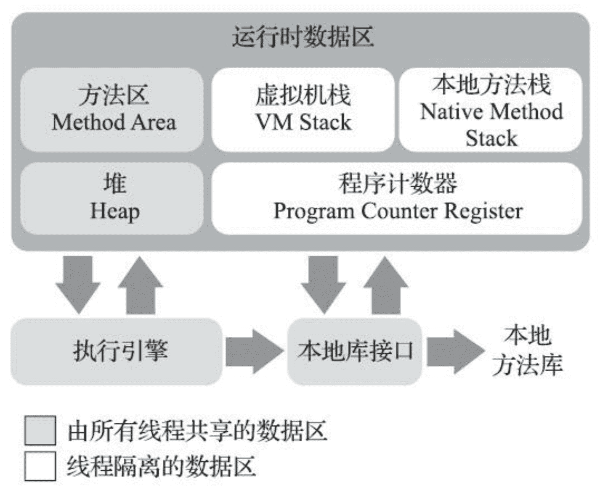
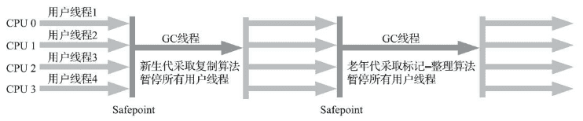
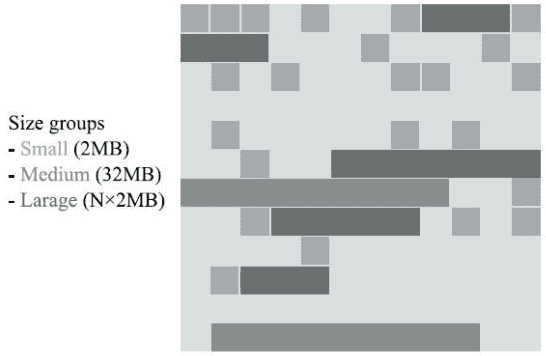
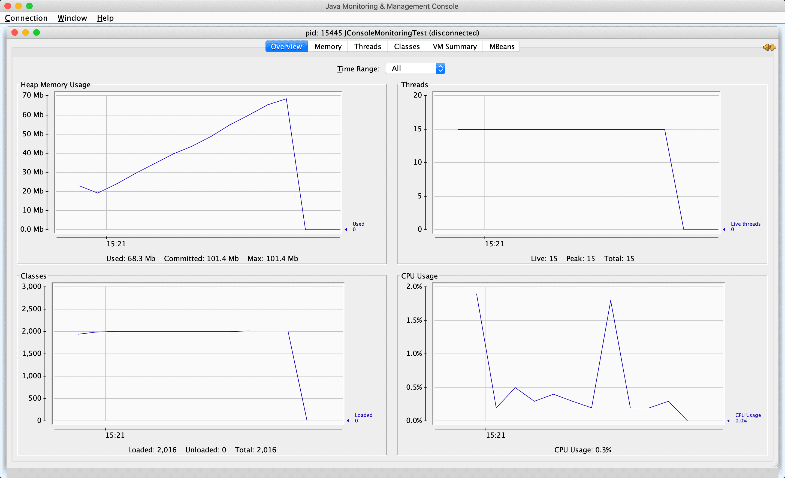
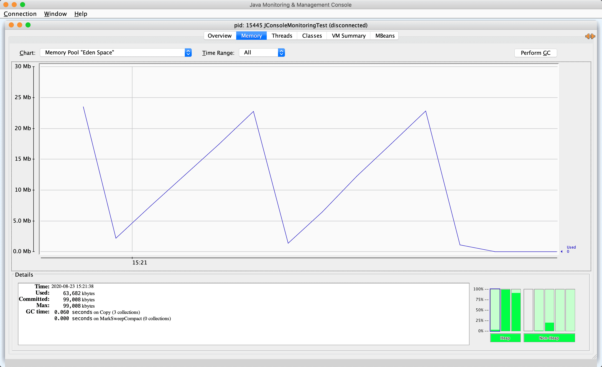
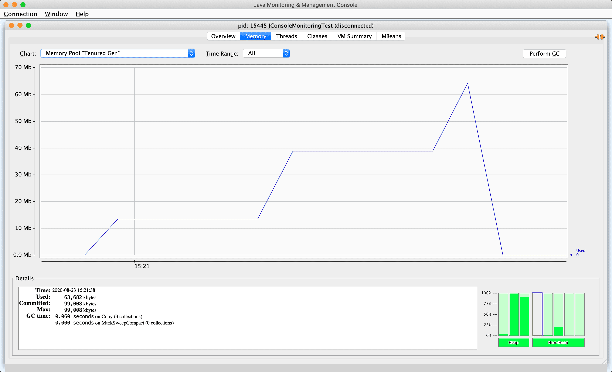
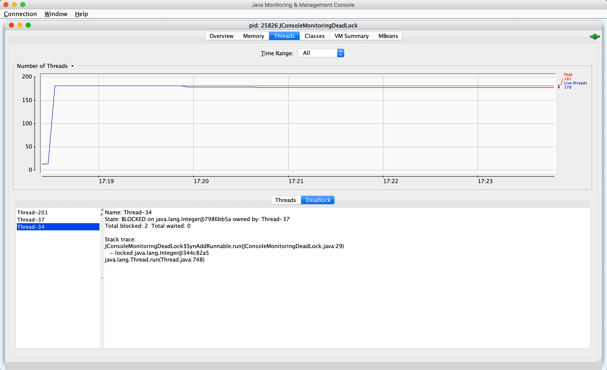

# Automatic Memory Management

Understanding Java Virtual Machine - Part 1 & 2

---

References

- Book《深入理解 Java 虚拟机：JVM 高级特性与最佳实践》
    - 英文书名 : Understanding the Java Virtual Machine - Advanced Features and Best Practices, Third Edition
    <!-- - 垃圾回收算法手册: 自动内存管理的艺术 -->
    <!-- - Java 性能优化权威指南 / Effective Java -->

## 走近 Java

### Java 历史

Keywords

- 自动内存管理 : 永久代 / 元空间
- 垃圾回收算法和收集器 : ZGC - 低延迟全并发收集器
    - 跨代引用 : 记忆集 / 卡表 / 并发标记 / 原始快照算法
- 命令行和可视化工具 : JHSDB / JFR / JMC
- 执行子系统
- 类加载过程 : 加载 / 验证 / 准备 / 解析 / 初始化
    - 找到正确的方法 : 符号表?
    - 如何执行字节码 / 内存结构
    - 对动态语言的支持
- 热点探测 / 即时编译 (JIT) : Graal 编译器
- 内存模型 : 结构 / 原子性 / 可见性 / 有序性
- 线程安全
- …

#### 优点

- 一次编译, 到处(随处)运行. Write Once, Run Anywhere.
- 相对安全的内存管理和访问机制
    - 避免绝大部分内存泄露和指针越界
- 实现了热点代码检测 & 运行时编译及优化
- _完善的 API_

运行在 JVM 上的编程语言

- Kotlin
- Clojure
- JRuby
- Groovy
- …

#### JDK 特性

- JDK 1.1
    - JAR 文件格式
    - JDBC
    - **JavaBeans**
    - _RMI - Remote Method Invocation 远程方法调用_
    - 语言层面
        - Inner Class 内部类 & Reflection 反射
- JDK 1.2
    - ? EJB
    - _? Java Plug-in_
    - _? Java IDL_
    - **JIT - Just In Time 即时编译器**
    - 语言层面
        - 关键字 scrictfp - strict float point 精确浮点
- JDK 1.3
    - Java 类库改进 : 数学运算 / Timer API / …
    - JNDI - Java Naming and Directory Interface 命名和目录接口
    - ……
- JDK 1.4
    - 正则表达式
    - 异常链
        - _指将捕获的异常包装进一个新的异常中并重新抛出的异常处理方式_
        - _原异常被保存为新异常的一个属性, 例如 cause_
        - _这个想法是指一个方法应该抛出定义在相同的抽象层次上的异常, 但不丢弃更低层次的信息_
    - **NIO - Java Non-blocing IO 非阻塞性 IO**
        - _为所有的原始类型提供 (Buffer) 缓存支持_
        - _字符集编码解码解决方案_
        - _Channel ：一个新的原始 I/O 抽象_
        - _支持锁和内存映射文件的文件访问接口_
        - _提供多路 (non-blocking) 非阻塞式的高伸缩性网络I/O_
    - 日志类 log
    - XML 解析器
    - _? XSLT 转换器_
- JDK 1.5 → JDK 5 _( 命名方式转变 )_
    - 语法
        - 自动装箱
        - 泛型
        - 动态注解
        - 枚举
        - 可变长参数
        - 遍历循环 foreach
    - JMM - Java Memory Model 内存模型
    - java.util.concurrent 并发包
- JDK 6
    - _J2EE / J2SE / J2ME → Java EE / Java SE / Java ME ( 命名转变 )_
    - 初步的动态语言支持
    - 编译器注解处理器
    - 微型 HTTP 服务器 API
    - 虚拟机内部改进
        - 锁与同步
        - 垃圾收集
        - 类加载
- JDK 7
    - **G1 - Garbage-First 收集器**
    - _加强对非 Java 语言的调用支持_
    - 可并行的类加载架构
- JDK 8
    - **Lambda 表达式, 支持函数式编程**
    - 动态语言支持 _( 例如 Groovy )_
    - 新的时间日期 API _( 例如 LocalDateTime )_
    - _JEP - JDK Enhancement Proposals 来定义和管理发布的特性_
- JDK 9
    - **Jigsaw 虚拟机层面的模块化支持**
    - _管理发布变化_
        - _3月 / 9月 各发布一个大版本, 避免引发交付风险_
        - _每三年划出一个 LTS - Long Term Support 长期支持版本_
            - _JDK 8 & JDK 11 是 LTS 版本, 下一个是 JDK 17_
- JDK 10
    - 内部重构
        - 统一源仓库
        - 统一垃圾收集器接口
        - 统一即时编译接口 : 引入 Graal 即时编译器
    - _2018.6 JMC 开发团队解散_
    - _2018.10 最后一届 JavaOne 大会_
- JDK 11
    - **ZGC 革命性的垃圾收集器**
    - 类型推断加入 Lambda 语法
- JDK 12
- JDK 13
    - [语法糖](https://mp.weixin.qq.com/s?src=11&timestamp=1584695676&ver=2228&signature=yUmOZYGmdezPvlNcdVw7CK4MptGLS70zFrklGJlGoQpJ-ejAUISbIxSwH9wn6j6aSHHYSZIA7m3q7DkDP3Tbn1XQSKpf2raY8aqowgGAwD9xTyPjwItuupWgwo4r36ut&new=1)
        - switch 表达式 _( 简化了传统写法, 增强了语法糖和用法 )_
        - Text Blocks 文本块 _( 不用转义, 使用三重双引号, 划出文本块 )_

题外话 : **JVM 的 GC 释放的内存会还给操作系统吗?**

- GC 后的内存如何处置, 其实是取决于不同的垃圾回收器的. **因为把内存还给 OS, 意味着要调整 JVM 的堆大小, 这个过程是比较耗费资源的**
- 在 JDK 11 中, Java 引入了 ZGC, 这是一款可伸缩的低延迟垃圾收集器, 但是当时只是实验性的. 并且, **ZGC 释放的内存是不会还给操作系统的. **

### JVM 发展

Exact VM

- **Exact Memory Management 准确式内存管理**
    - aka. Non-Conservative/Accurate Mem. Mgt.
    - 指 **VM 可以知道某个位置数据的类型**, 例如 整数 12345

_BEA Liquid VM / Azul VM_

- _针对特定架构的硬件, 进行优化, 充分发挥硬件性能_
    - 自带操作系统/越过操作系统, 不需要再进行内核态/用户态的切换, 直接控制硬件…… 等

#### HotSpot VM

- 默认的 JVM
- _(也有)_ **准确式内存管理**
- **热点探测技术** _( 通过执行计数器, 找到最具编译价值的代码 )_
    - **即时编译** JIT ( Just In Time ) 或 栈上替换编译 OSR ( On-Stack Replacement )

#### Graal VM

- **无语言倾向 : "Run Programs Faster Anywhere."**
- 在 HotSpot VM 的基础上, 增强成跨语言全栈虚拟机
    - 可以作为任何语言的运行平台使用
        - _包括 Java / Scala / Groovy / Kotlin 等 JVM 之上的语言_
        - _还有 C / C++ / Rust 等基于 LLVM 的语言_
        - _还有 JavaScript / Ruby / Python / R 等_
    - _无额外开销地混合使用这些编程语言_
    - _支持不同语言中混用对方接口和对象_
    - _也支持这些语言使用已经编写好的本地库文件_
- 原理 :
    - 将不同语言的源码, 编译成中间格式 _( 例如 LLVM 字节码 )_
    - 通过解释器转换为能被 Graal VM 接受的中间表示 _( IR - Intermediate Representation )_


#### 即时编译器

- _对需要长时间运行的应用来说, 由于经过充分预热, 热点代码会被 HotSpot 的探测机制准确定位捕获, 并将其编译为物理硬件可直接执行的机器码_
    - _在这类应用中 Java 的运行效率很大程度上取决于即时编译器所输出的代码质量_
- **C1 编译器** : 编译时间短, 代码优化程度低 -- 客户端编译器
- **C2 编译器** : 编译时间长, 代码优化程度高 -- 服务器编译器
    - 通常它们会在分层编译机制下, 与解释器互相配合来共同构成 HotSpot VM 的执行子系统
- **Graal 编译器** : C2 的替代者
    - 可维护性更好, 性能还反超历史悠久的 C2 _( 代码复杂难以维护 )_
    - 支持更复杂的优化
        - Partial Escape Analysis 部分逃逸分析
        - Aggressive Speculative Optimization 预测性优化 _( 比较激进 )_

**提前编译 AOT - Ahead of Time Compilation**

- 相对于 "即时编译" 的概念, 提前将所有代码编译好
    - 启动更快, 不用预热
    - 但是破坏了 "一次编写, 到处运行" 的约定
        - 不同的硬件和操作系统需要不同的发行包
- _"向 Native 迈进" , 性能更好, 内存占用更小, 运行时环境更小_

### 源码调试入门

References :

- OpenJDK Mercurial Repositories : https://hg.openjdk.java.net/jdk
- <i>优雅地在 Mac OS Catalina 下 编译 Open JDK 13 : https://cloud.tencent.com/developer/article/1522903 </i>

#### 安装与编译

**On macOS**

- 1\. Install Xcode
    - _omitted…_
- 2\. Select Xcode

```bash
$ sudo xcode-select --switch /Applications/Xcode.app/Contents/Developer
```

- 3\. Configure : 依赖项检查 / 参数配置 / 构建输出目录结构 / …

```bash
$ bash configure --enable-debug --with-jvm-variants=server
# or
$ bash configure

# output
(omitted…)
====================================================
A new configuration has been successfully created in
/Users/IceHe/Documents/jdk12-06222165c35f/build/macosx-x86_64-server-fastdebug
using configure arguments '--enable-debug --with-jvm-variants=server'.

Configuration summary:
* Debug level:    fastdebug
* HS debug level: fastdebug
* JVM variants:   server
* JVM features:   server: 'aot cds cmsgc compiler1 compiler2 dtrace epsilongc g1gc graal jfr jni-check jvmci jvmti management nmt parallelgc serialgc services shenandoahgc vm-structs'
* OpenJDK target: OS: macosx, CPU architecture: x86, address length: 64
* Version string: 12-internal+0-adhoc.mac.jdk12-06222165c35f (12-internal)

Tools summary:
* Boot JDK:       openjdk version "12.0.1" 2019-04-16 OpenJDK Runtime Environment (build 12.0.1+12) OpenJDK 64-Bit Server VM (build 12.0.1+12, mixed mode, sharing)  (at /Library/Java/JavaVirtualMachines/openjdk-12.0.1.jdk/Contents/Home)
* Toolchain:      clang (clang/LLVM from Xcode 9.4.1)
* C Compiler:     Version 9.1.0 (at /usr/bin/clang)
* C++ Compiler:   Version 9.1.0 (at /usr/bin/clang++)

Build performance summary:
* Cores to use:   4
* Memory limit:   8192 MB
```

- 4\. Compile OpenJDK
    - _如果多次编译, 或者目录结构成功产生后又再次修改了配置,_
    - _必须先使用 `make clean` 和 `make dist-clean` 命令清理目录, 才能确保新的配置生效_

```bash
$ make images
```

- 5\. Test java

```bash
$ cd build/[config_name]/jdk
# e.g. `cd build/macosx-x86_64-server-fastdebug/jdk/`

$ ./bin/java -version

# output
openjdk version "12-internal" 2019-03-19
OpenJDK Runtime Environment (fastdebug build 12-internal+0-adhoc.mac.jdk12-06222165c35f)
OpenJDK 64-Bit Server VM (fastdebug build 12-internal+0-adhoc.mac.jdk12-06222165c35f, mixed mode)
```

_在 `configure` 命令以及后面的 make 命令的执行过程中, 会在 "build/配置名称" 目录下产生如下目录结构_

- _`buildtools/` : 用于生成、存放编译过程中用到的工具_
- _`hotspot/` : HotSpot 虚拟机编译的中间文件_
- _`images/` : 使用 `make *-image` 产生的镜像存放在这里_
- _`jak/` : 编译后产生的 JDK 就放在这里_
- _`support/` : 存放编译时产生的中间文件_
- _`test-results/` : 存放编译后的自动化测试结果_
- _`configure-support/` : 这三个目录是存放执行 `configure`、`make` 和 `test` 的临时文件_
- _`make-supPort/`_
- _`test-supPort/`_

_依赖检查通过后便可以输入 `make images` 执行整个 OpenJDK 编译了, 这里 `imasges` 是 `product-images` 编译目标 (Target) 的简写别名, 这个目标的作用是编译出整个 JDK 镜像. 其它编译目标还有 :_

- _`hotspot` : 只编译 HotSpot 虚拟机_
- _`hotspot-<variant>` : 只编译特定模式的 HotSpot 虚拟机_
- _`docs-image` : 产生 JDK 的文档镜像_
- _`test-image` : 产生 JDK 的测试镜像_
- _`al1-images` : 相当于连续调用 `product`、`docs`、`test` 三个编译目标_
- _`bootcycle-images` : 编译两次 JDK, 其中第二次使用第一次的编译结果作为Bootstrap JDK_
- _`clean` : 清理 `make` 命令产生的临时文件_
- _`dist-clean` : 清理 `make` 和 `configure` 命令产生的临时文件_

#### IDE 调试

IDE Debug

- Build JDK as above
- Download & open **JetBrains CLion**
- Select `File` → `New CMake Project from Sources…` & click `Ok`
- Edit Run/Debug Configuration as below


## 内存区域 & 内存溢出异常

### 运行时数据区

JVM Runtime Data Area _( JVM 运行时数据区 )_



#### 程序计数器

**Program Counter Register** _( 程序计数器 )_

- 当前线程所执行的字节码的行号指示器 _( 跟软硬件/操作系统的体系结构类似 )_
- **字节码解释器工作时, 通过改变该计数器来选取下一条需要执行的字节码指令**
- 即 程序控制流的指示器 -- 分支/循环/跳转/错误处理/线程恢复 均依赖它
- JVM 多线程, 每个线程都需要独立的程序计数器, 所以它是 线程私有的内存数据

#### 虚拟机栈

**Java Virtual Machine Stack** _( Java 虚拟机栈 )_

- 也是线程私有的, 生命周期与线程相同
- 每个方法被执行时, JVM 都会创建一个栈帧 Stack Frame
    - 用于存储 局部变量表 / 操作栈 / 动态链接 / 方法出口等信息
    - 每个方法被调用直至执行完毕, 对应着一个栈帧从入栈到出栈的过程
- 局部变量表
    - 存放编译器可知的数据
        - Java 基本数据类型 : boolean / byte / …… / long / double
        - 对象引用 reference : 可能是引用指针 / 句柄 / …
        - returnAddress 类型 : 指向一条字节码指令的位置
    - 数据类型 : 在变量表中, 以局部变量槽 Slot 来表示
        - 除了 long 和 double 用 2 个变量槽, 其它类型只用 1 个
        - 变量槽 slot 实际多大, 由 JVM 具体的实现来决定

#### 本地方法栈

**Native Method Stack** _( 本地方法栈 )_

- 跟虚拟机栈的区别
    - **虚拟机栈 : 为虚拟机执行 Java 方法 ( 也就是字节码 ) 服务**
    - **本地方法栈 : 为虚拟机使用到的本地 ( Native ) 方法服务**
        - _? Java 方法 ( 字节码 ) 和 Native 方法的区别 ( 书后面应该会说 ) ?_
- 有的虚拟机如 HotSpot VM 直接把 VM Stack 和 Native Method Stack 合二为一

#### Java 堆

**Java Heap** _( Java 堆 )_

- 所有线程共享的一块内存区域, VM 启动时创建
- **所有的对象实例以及数组都应当在堆上分配**
- 垃圾收集器管理 Java Heap, 也被成为 GC 堆 ( Garbage Collected Heap )
    - 从回收内存的角度看, 现代垃圾收集器 大部分都基于 **分代收集理论设计**
    - 从分配内存的角度看, 所有线程共享的 Java 堆 可以划分出多个线程私有的分配缓冲区, 以提升分配效率
        - **TLAB - Thread Local AllocationBuffer 线程私有分配缓冲区**
- Java Heap 可以处于物理上不连续的内存空间中 _( 虚拟内存空间? )_
- Java Heap 既可以被实现为 固定大小的, 也可以是 可拓展的
    - 主流都是 可拓展的 ( 通过参数 `-Xmx` 和 `-Xms` 设定 )

#### 方法区

**Method Area** _( 方法区  )_

- _各个线程共享的内存区域_
- **存储 已被虚拟机加载的类型信息 / 常量 / 静态变量 / 即时编译器编译后的代码缓存 / …**
- _本质上, 永久代 ( Permanent Generation ) 和方法区并不是等价的_
    - 因为仅仅是当时的 HotSpot 虚拟机设计团队选择把收集器的分代设计扩展至方法区, 或者说使用永久代来实现方法区而已
    - _这样使得 HotSpot 的垃圾收集器能够像管理 Java8 一样管理这部分内存, 省去专门为方法区编写内存管理代码的工作_
    - _但是对于其它虚拟机实现, 譬如 BEA JRockit、IBM J9 等来说, 是不存在永久代的概念的_
    - 到了 JDK 8 完全废弃了永久代的概念, _改用与 JRockit、J9 一样_ 在本地内存中实现的 **Metaspace 元空间** 来代替方法区

**Runtime Constant Pool** _( 运行时常量池 )_

- 是 Method Area 的一部分
- 常量池表 **Constant Pool Table : 存放编译器生成的各种字面量与符号引用**
    - 它们在类加载后, 存放到方法区的运行时常量池中

#### 直接内存

**Direct Memory** _( 直接内存 )_

- 并不是虚拟机运行时数据区的一部分, 也不是 JVM 规范中定义的内存区域
- JDK 1.4 加入 **NIO ( New Input/Output )**
    - 引入基于通道 Channel 与缓冲区 Buffer 的 I/O 方式
    - **可以使用 Native 函数直接分配 (Java) <u>堆外内存</u>**
        - _直接内存的分配不会受到 Java 堆大小的限制, 但毕竟本机物理内存有限, 小心内存溢出_
    - 然后通过一个存储在 Java Heap 里的 DirectByteBuffer 对象作为这块内存的引用进行操作
    - _显著提高性能, 因为避免了在 Java Heap 和 Native Heap 中来回复制数据_

### HotSpot VM 的对象和内存

#### 对象的创建

- **new** 指令 -> 检查指令的参数是否能在 **常量池** 中定位到一个类的 **符号引用**
- 并且检查这个 符号引用 代表的类是否已被 **加载**、**解析** 和 **初始化** 过
- 若无, 必须先执行相关的 **类加载过程** (详情暂略)
- 为新创建的对象 分配内存, 并将内存空间置 0
    - 内存大小在类加载后可以完全确定
- 执行 构造函数, 即 Class 文件中的 `<init>()` 方法

#### 内存分配

- **Bump The Pointer 指针碰撞**
    - 假设 Java 堆中内存是绝对规整的, 所有被使用过的内存都存放在一边, 空闲的内存被放在另一边, 中间放着一个指针作为分界点的指示器
    - 分配内存就仅仅是把那个指针向空闲空间方向挪动一段与对象大小相等的距离, 这种分配方式称为 "指针碰撞" ( Bump The Pointer ) .
- **Free List 空间列表**
    - 但如果 Java 堆中的内存并不是规整的, 已被使用的内存和空闲的内存相互交错在一起, 那就没有办法简单地进行指针碰撞了; 虚拟机就必须维护一个列表, 记录上哪些内存块是可用的
    - 在分配的时候从列表中找到一块足够大的空间划分给对象实例, 并更新列表上的记录, 这种分配方式称为 "空闲列表" ( Free List )
- **Compact 空间压缩整理**
    - 选择哪种分配方式由 Java 堆是否规整决定, 而 Java 堆是否规整又由所采用的垃圾收集器是否带有 "空间压缩整理" ( Compact ) 的能力决定
- **Sweep 清除**
    - 因此, 当使用 Serial、ParNew 等带压缩整理过程的收集器时, 系统采用的分配算法是指针碰撞, 既简单又高效
    - 而当使用 CMS 这种基于清除 ( Sweep ) 算法的收集器时, 理论上就只能采用较为复杂的空闲列表来分配内存
- Object Header 对象头 : 对象相关的信息存放处

如何保证能成功地并发分配内存

- _对象创建 在虚拟机中是非常频繁的行为, 即使仅仅修改一个指针所指向的位置, 在并发情况下也并不是线程安全的_
- _可能出现正在给对象 A 分配内存, 指针还没来得及修改, 对象 B 又同时使用了原来的指针来分配内存的情况_
- _有以下两个可选的解决方案 :_
    - A. 对分配内存空间的动作进行同步处理
        - 采用 **CAS 配上失败重试** 的方式保证更新操作的原子性
    - B. 把内存分配的动作按照线程划分在不同的空间之中进行
        - 即每个线程在 Java 堆中预先分配一小块内存, 称为 **TLAB - Thread Local Allocation Buffer** 本地线程分配缓存
        - 那个线程要分配内存, 就在那个线程的 TLAB 分配
        - 等 TLAB 用完了, 分配新的缓存区时, 才需要同步锁定
            - _通过 `-XX:+/-UseTLAB` 参数来设定虚拟机是否启用 TLAB_

**内存的初始化**

- 内存分配完成之后, 虚拟机必须将分配到的内存空间 ( 但不包括对象头 ) 都初始化为 0 值
- 如果使用了 TLAB 的话, 这一项工作也可以提前至 TLAB 分配时顺便进行
- 这步操作保证了对象的实例字段在 Java 代码中可以不赋初始值就直接使用
    - _使程序能访问到这些字段的数据类型所对应的 0 值_

#### 对象的内存布局

- 在 HotSpot 虚拟机里, 对象在堆内存中的存储布局可以划分为
    - 1\. **Header** 对象头
        - Mark Word
        - 类型指针
    - 2\. **Instance Data** _( 实例数据 )_
    - 3\. **Padding** _( 对齐填充 )_

##### 对象头

1\. **Object Header** _( 对象头 )_

- HotSpot VM 里, 对象头包括两类信息 :
    - 1\. **Mark Word** : 存储对象自身的运行时数据 _( 使用 bitmap 方式存储 )_
        - HashCode
        - GC 分代年龄
        - _? 锁状态标志_
        - _? 线程持有的锁_
        - _? 偏向进程 ID_
        - _? 偏向时间戳_
    - 2\. 类型指针
        - 即对象指向它的类型元数据的指针
        - JVM 通过它来确定该对象是哪个类的实例
        - _不是所有 VM 实现都必须在对象数据上保留类型指针_
        - 如果对象是一个 Java 数组, 还必须有一块用于记录数据长度的数据
            - _因为虚拟机可以通过普通 Java 对象的元数据确定 Java 对象的大小_
            - _但是如果是数组的话, 将无法通过类型元数据中的信息推断出数组的大小_
    - 3\. Padding 对齐填充
        - HotSpot VM 的自动内存管理系统, 要求对象起始地址必须是 8 bytes 的整数倍

_对象自身的运行时数据_

- 存储的这些信息, 长度在 32 位和 64 位的 VM ( 未开启压缩指针 ) 分别为 32 bits 和 64 bits -- 官方称为 **Mark Word**
- 考虑到 VM 的空间效率, 它是一个动态定义的数据结构
    - 在极小的空间内存储尽可能多的数据, 根据对象的状态复用自己的存储空间 -- 按位存储
        - _Mark Work 布局 & 每位的含义 : 32 位虚拟机的存储布局情况如下_

```cpp
// Bit-format of an object header (most significant first, big endian layout below) :
//
// 32 bitst
// hash:25 ------------>| age:4    biased_lock:1 lock:2 (normal object)
// JavaThread*:23 epoch:2 age:4    biased_lock:1 lock:2 (biased object)
// size:32 ------------------------------------------>| (CMS free block)
// PromotedObjecty:29 ---------->| promo_bits:3 ----->| (CMS promoted object)
```

##### 实例数据

_2\. **Instance Data** ( 实例数据 )_

- _实例数据部分是对象真正存储的有效信息, 即我们在程序代码里面所定义的各种类型的字段内容, 无论是从父类继承下来的, 还是在子类中定义的字段都必须记录起来_
- _这部分的存储顺序会受到虚拟机分配策略参数 ( `-XX: FieldsAllocationStyle` 参数 ) 和字段在 Java 源码中定义顺序的影响_
- HotSpot 虚拟机默认的分配顺序为 longs/doubles, ints, shorts/chars, bytes/booleans, oops (Ordinary Object Pointers, OOPs) , 从以上默认的分配策略中可以看到, 相同宽度的字段总是被分配到一起存放, 在满足这个前提条件的情况下, 在父类中定义的变量会出现在子类之前
- _如果 HotSpot 虚拟机的 `+XX: CompactFields` 参数值为 true ( 默认就为true ) , 那子类之中较窄的变量也允许插入父类变量的空隙之中, 以节省出一点占空间_

##### 对齐填充

_3\. **Padding** ( 对齐填充 )_

- _对象的第三部分是对齐填充, 这并不是必然存在的, 也没有特别的含义, 仅起着占位符的作用_
- _由于 HotSpot 虚拟机的自动内存管理系统要求对象起始地址必须是 8 字节的整数倍, 换句话说就是任何对象的大小都必须是 8 字节的整数倍_
- _对象头部分已经被精心设计成正好是 8 字节的倍数 ( 1 倍或者 2 倍 ) , 因此如果对象实例数据部分没有对齐的话, 就需要通过对齐填充来补全_

#### 对象的访问定位

- Java 程序通过 stack 上的 reference 数据来操作 heap 上的具体 object
- VM 规范中没有规定 reference 应该通过什么方式来定位和访问
- 主流方式有 :
    - A. **handle 句柄**
        - Java Heap 中划分出句柄池, reference 中存储的就是对象的句柄地址
        - 句柄中包含 : _( 见下图 1 )_
            - **对象实例数据的 指针**
            - 类型数据的指针 _(指出各实例数据的数据类型)_
        - 优点 : reference 存储稳定的句柄地址
            - 对象被移动时 _(垃圾收集时会异动对象)_ , 只需要改变句柄中的 实例数据指针, 不需要修改 reference 本身
    - B. **direct pointer 直接指针**
        - reference 中直接存储 对象地址
        - 地址所指的数据 包含 : _( 见下图 2 )_
            - **对象实例数据**
            - 类型数据的指针
        - 优点 : 速度更快, 节省一次指针定位的时间
    - HotSpot VM 主要使用 direct pointer 的方式访问对象 _(当然也有例外情况)_


### 实战 : OutOfMemeoryError

概念区分

- 内存泄露 Memory Leak
- 内存溢出 Memory Overflow

JVM 参数

- `-Xms` 设置 堆的最小值, 例如 -Xms20m
- `-Xmx` 设置 堆的最大值, 例如 -Xmx4g
- `-Xmn` 设置 新生代的大小
- `-Xss` 设置 栈容量, 例如 -Xss128k
    - 不同版本的 JVM 和操作系统, 栈容量最小值限制有所不同
        - JDK 11
            - Linux 228K
            - Windows 180K
- `-Xoss` 设置 本地方法栈容量

#### Java 堆溢出

**Java Heap OverflowError**

[File : HeapOOM.java](src/understand-jvm/HeapOOM.java ':include :type=code java')

_Output_

[File : HeapOOM.out](src/understand-jvm/HeapOOM.out ':include :type=code bash')

#### 虚拟机栈和本地方法栈溢出

**VM Stack and Native Method StackOverflowError**

[File : JavaVMStackSOF.java](src/understand-jvm/JavaVMStackSOF.java ':include :type=code java')

_Output_

```bash
stack length:18606
Exception in thread "main" java.lang.StackOverflowError
    at JavaVMStackSOF.stackLeak(JavaVMStackSOF.java:17)
    at JavaVMStackSOF.stackLeak(JavaVMStackSOF.java:17)
    at JavaVMStackSOF.stackLeak(JavaVMStackSOF.java:17)
    …(省略后续1021行)…
```

Another example

[File : JavaVMStackSOF2.java](src/understand-jvm/JavaVMStackSOF2.java ':include :type=code java')

_Output_

```bash
stack length:4684
Exception in thread "main" java.lang.StackOverflowError
    at JavaVMStackSOF2.test(JavaVMStackSOF2.java:117)
    at JavaVMStackSOF2.test(JavaVMStackSOF2.java:117)
    at JavaVMStackSOF2.test(JavaVMStackSOF2.java:117)
    …(省略后续1021行)…
```

#### 虚拟机栈内存不足

**VM Stack OutOfMemoryERROR**

[File : JavaVMStackOOM.java](src/understand-jvm/JavaVMStackOOM.java ':include :type=code java')

#### 直接内存不足

Direct Memory OutOfMemoryError

- 直接内存 ( Direct Memory ) 的容量大小可通过 `-XX:MaxDirectMemorySize` 参数来指定
    - 如果不指定, 则默认与 Java Heap 最大值 ( 由 `-Xmx` 指定` ) 一致

[File : DirectMemoryOOM.java](src/understand-jvm/DirectMemoryOOM.java ':include :type=code java')

_Output_

```bash
# icehe : 据说是应该有以下输出, 但我在在 macOS 上实际运行时, 无法复现
Exception in thread "main" java.lang.OutOfMemorYyEIIOL
    at sun.misc.Unsafe.allocateMemory (Native Method)
    at org.fenixsoft.oom.DMOOM.main(DMOOM.Jjava:20)
```

## 垃圾收集器 & 内存分配策略

"Java 与 C++ 之间有一堵由动态内存分配和垃圾收集技术所围成的高墙, 墙外的人想进去, 墙里面的人却想出来."

- _icehe : 感觉大多数人跨到这堵墙 "垃圾回收" 的那一侧之后, 就不想跨回去了_

**垃圾收集 GC - Garbage Collection**

- Which : 哪些内存需要回收
- When : 什么时候回收
- How : 如何回收

### 对象是否存活

#### 引用计数

**Reference Counting** _( 引用计数算法 )_

- 占用额外的内存来进行计数
    - 优点 : 原理简单, 判定效率高
- 主流 JVM 没有选用 引用计数算法 来管理内存
    - 主要原因 : 有许多例外情况要考虑, 需要大量额外的处理
        - 例如, 引用计数很难解决对象之间相互引用的问题

#### 可达性分析

**Reachability Analysis** _( 可达性分析算法 )_

- 基本思路
    - 通过一系列称为 GC Roots 的根对象作为起始节点集
    - 从这些节点开始, 根据引用关系向下搜索, 搜索过程所走过的路径称为 **Reference Chain 引用链**
    - 如果某个对象到 GC Roots 间没有任何引用相连
        - 或者用图论的话来说, 就是从 GC Roots 到这个对象不可达时, 则证明此对象是不可能再被使用的


#### GC Roots

**固定可作为 <u>GC Roots</u> 的对象**

- VM Stack ( 栈帧中的本地变量表 ) 中引用的对象
    - _例如, 各个线程被调用的方法堆栈中使用的参数、局部变量、临时变量等_
- Method Area 中静态属性引用的对象
    - _例如 Java 类的引用类型静态变量_
- Method Area 中常量引用的对象
    - _例如 字符串常量池 String Table 中的引用_
- Native Method Stack 中 JNI ( 即通常所说的 Native 方法 ) 引用的对象
- JVM 内部的引用 _例如 :_
    - 基本数据类型对应的 Class 对象
    - 一些常驻的异常对象 NullPointerException、OutOfMemoryError 等
    - 系统类加载器
- 所有被同步锁 ( synchronized 关键字 ) 持有的对象
- 反应 JVM 内部情况的 JMXBean、JVMTI 中注册的回调、本地代码缓存等

_某类 "食之无味弃之可惜" 的对象_

- 当内存空间还够用时, 能保存在内存中
- 如果内存空间在 GC 后仍然紧张, 这些对象就会被抛弃

_所以, 要扩充 reference 的概念 ( 以便描述某类对象 )_

- Strongly Reference 强引用 : 对应传统 "引用" 的定义
- Soft Reference 软引用 : 还有用但非必须的对象
    - 在系统发生内存溢出异常前, 对这些对象进行第二次回收
    - 如果内存还是不足, 才会抛 StackOverflowError
- Weak Reference 弱引用 : 非必须的对象, 比软引用更弱
    - 只能生存到下一次垃圾收集发生为止
- Phantom Reference 虚引用 : 幽灵引用 / 幻影引用 -- 最弱的引用
    - 一个对象是否拥有虚引用, 完全不会对其生存期构成影响
    - 无法通过它取得对象实例
    - 设置它的 唯一目的 : 能在对象被收集器回收时, 收到一个系统通知 _( 详情? )_

#### 回收的判断过程

**对象是否回收的判断过程 : 两次标记过程**

- 如果对象 Reachability Analysis 后发现没有与 GC Roots 相连接的 Reference Chain -- 第一次被标记
- 随后进行一次筛选, 条件是此对象是否有必要执行 finalized() 方法
    - 如果对象没有覆盖 (自定义的) 的 finalize() 方法
    - 或者 finalize() 已经被 VM 调用过
    - 就会被视为 "没有必要执行 finalize()" ( 然后第二次被标记 -> 回收 ( 死亡 ) )
- 如有必要, 执行 finalize()
    - 对象被放置到 F-Queue 队列中
    - 稍候有 VM 自动建立、低调度优先级的 Finalizer 线程去执行它们的 finalize() 方法
    - 稍后收集器将对 F-Queue 中的对象进行第二次 小规模的标记
        - 如果此时, 对象将 this 重新与引用连上的任何一个对象, 就可以暂时免除被回收 ( 死亡 ) , 可以继续存活

_示例 : 对象在 finalize() 中拯救自己 -- 重新与引用链上的任何一个对象建立关联_

[File : FinalizeEscapeGC.java](src/understand-jvm/FinalizeEscapeGC.java ':include :type=code java')

_Output_

[File : FinalizeEscapeGC.out](src/understand-jvm/FinalizeEscapeGC.out ':include :type=code bash')

_@Deprecated : 避免使用 finalize()_

- finalize() 脱胎于 C++ 的析构函数 ( 妥协, 让 C/C++ 程序员更容易接受 Java )
- 缺点 : 运行代码高昂, 不确定性大, 无法保证各个对象的调用顺序
- 例如 关闭外部资源 ( close file ), 用 try-finally 比使用 finallize() 更及时合理

#### 方法区回收内存

- 主要回收 : 废弃的常量 & 不再使用的类型
- _方法区垃圾收集的 "性价比" 通常比较低_
    - _在 Java 8 中, 尤其是在新生代中, 对常规应用进行一次垃圾收集通常可以回收 70% ~ 99% 的内存空间_
    - _相比之下, 方法区回收过于苛刻的判定条件, 其区域垃圾收集的回收成果往往远低于此_
    - _存在实现方法区类型卸载的收集器 ( 如 JDK 11 时期的 ZGC 收集器就不支持类卸载 )_
- 判定一个常量是否 "废弃" 还是相对简单, 而要判定一个类型是否属于 "不再被使用的类" 的条件就比较苛刻了. 需要同时满足下面三个条件:
    - 该类所有的实例都已经被回收
        - 也就是 Java 堆中不存在该类及其任何派生子类的实例
    - 加载该类的类加载器已经被回收
        - 这个条件除非是经过精心设计的可替换类加载器的场景
        - 如 OSGi、JSP 的重加载等, 否则通常是很难达成的
    - 该类对应的 java.lang.Class 对象没有在任何地方被引用, 无法在任何地方通过反射访问该类的方法
- 在大量使用反射、动态代理、CGLib 等字节码框架, 动态生成 JSP 以及 OSGi 这类频繁自定义类加载器的场景中
    - 通常都需要 Java 虚拟机具备类型卸载的能力, 以保证不会对方法区造成过大的内存压力

### 垃圾收集算法

Garbage Collection Algorithm _( 垃圾收集算法 )_

- 从如何判定对象消亡的角度出发, 可以划分
    - **Reference Counting GC 引用计数式垃圾收集** -- 直接垃圾收集
    - **Tracing GC 追踪式垃圾收集** -- 间接垃圾收集 ( 主流 )

#### 分代收集理论

**Generational Collection** _( 分代收集理论 )_

- 符合大多数程序运行实际情况的经验法则 ( 分代假说在此之上建立 )
    - **Weak Generational Hypothesis 弱分代假说** : 绝大多数对象都是朝生夕灭的
    - **Strong Generational Hypothesis 强分代假说** : 熬过越多次垃圾收集过程的对象就越难以消亡
    - **Intergenerational Reference Hypothesis 跨代引用假说** : 跨代引用相对于同代引用来说仅占极小数
- 垃圾收集器的设计原则 :
    - 应该 **将 Java 堆划分出不同的区域, 然后将回收对象依据其年龄, 分配到不同的区域中存储**
        - **Age 年龄 : 即熬过垃圾收集过程的次数**

由于 Java 堆划分出的不同区域, 可以根据进行回收的区域范围来划分 **回收类型**

- **Partial GC** 部分收集 : 指目标不是完整收集整个 Java 堆的垃圾收集
    - **Minor GC / Young GC** : 指目标只是新生代的垃圾收集
    - **Major GC / Old GC** : 指目标只是老年代的垃圾收集
        - _目前只有 CMS 收集器有单独收集老年代的行为_
        - _Majar GC 的说法有点含混不清, 需根据上下文来判断, 可能指的是整堆收集_
    - **Mixed GC** 混合收集 : 指目标是收集整个新生代 以及部分老年代的垃圾收集
        - _目前只有 G1 收集器会有这种行为_
- **Full GC** 整堆收集 : 收集整个 Java 堆和方法区的垃圾收集

针对不同区域安排与其存储对象存亡特征相匹配的垃圾收集算法, 发展出 :

- **Mark-Copy** 标记-复制算法
- **Mark-Sweep** 标记-清除算法
- **Mark-Compact** 标记-整理算法

Java Heap 区域的划分

- Young Generation 新生代 / Nursery  婴儿区
    - 每次垃圾收集时, 都发现有大批对象死去
    - 只存活少量对象, 逐步晋升到老年代去存放
- Old Generation 老年代 / Tenured 长存区
- ……

跨代引用的新生代对象的回收

- 在新生代上建立一个全局的数据结构 ( 被称为 **Remembered Set 记忆集** )
- 这个结构把老年代划分为若干小块, 标识出老年代的哪一块内存会存在跨代引用
- 此后发生 Minor GC 时, 只有包含了跨代引用的小块内存里的对象才会被加入到 GC Roots 进行扫描

#### 标记-清除

**Mark-Sweep** _( 标记-清除算法 )_

- 最基础的垃圾收集算法
- 过程
    - 先标记出所有需要回收的对象 / 先标记出所有存活的对象
    - 统一回收所有标记的对象 / 统一回收所有未被标记的对象
- 缺点
    - 执行效率不稳定 : 对象越多, 效率越低
    - 内存空间碎片化 : 标记、清除后, 会产生大量不连续的内存碎片
        - 当分配较大对象 难以找到连续的内存时, 不得不提前触发另一次垃圾收集动作

#### 标记-复制

**Mark-Copy** _( 标记-复制算法 )_

- 简称 "复制算法", 为解决 Mark-Sweep 面对大量可回收对象时执行效率低的问题而发明
- _其中一种_ -- **Semispace Copying** _( 半区复制 )_
    - 过程 :
        - 将可用内存按容量划分为大小相等的两块, 每次只使用其中的一块
            - 当这一块内存用完了, 就将还存活着的对象复制到另一块上面
            - 然后再把已使用过的内存空间一次清理掉
    - 取舍
        - 如果内存中多数对象都是存活的, 这种算法会产生大量的内存间复制的开销
        - 但对于多数对象都是可回收的情况, 算法需要复制的只是占少数的存活对象
        - 而且每次都针对整个半区进行内存回收, 分配内存时也就不用考虑有空间碎片的复杂情况
            - 只需要移动堆顶指针, 按序分配即可
        - 可用内存缩小为原来的一半, 空间浪费大
- 现在的商用 JVM 大多数优先采用了这种收集算法去回收新生代
    - 新生代 "朝生夕灭" 的量化描述 : 新生代 98% 的对象熬不过第一轮收集
    - 所以不需要按照 1:1 的比例来划分新生代的内存空间

##### Appel 式回收

**Appel** 式回收 _( 命名为作者的名字 )_

- HotSpot VM 的 Serial、ParNew 等新生代收集器均采用这种策略来设计新生代的内存布局
- 具体做法
    - 把新生代分为 一块较大的 **Eden** 空间 和 两块较小的 **Survivor** 空间
    - **每次分配内存只是用 Eden 和其中一块 Survivor**
    - **发生垃圾收集时, 将 Eden 和 Survivor 中仍然存活的对象一次性复制到另一块 Survivor 空间上**
    - 然后直接清理掉 Eden 和已用过的那块 Survivor 空间
- HotSpot VM 默认 Eden 和 Survivor 的大小比例是 8:1
    - **80% Eden + 10% Survivor + 10% Survivor** : 只有 10% 的新生代内存会被浪费
- "逃生门" 设计 : 因为有可能有超过 10% 新生代对象存活, 一块 Survivor 空间放不下
    - 这时需要依赖其它内存区域 ( 一般是老年代 ) 进行 **Handle Promotion** _( 分配担保 )_
    - 如果另外一块 Survivor 没有足够空间存放上一次新生代收集下来的存活对象, 这些对象便将通过分配担保机制直接进入老年代

#### 标记整理

**Mark-Compact** _( 标记-整理算法 )_

- 针对 **老年代 大多数对象都将继续存活** 的特点设计的算法
- 过程
    - 先标记出所有需要回收的对象 / 先标记出所有存活的对象
    - 让所有存活的对象都向内存空间的一端移动, 然后直接清理掉边界以外的内存
        - Mark-Compact 跟 Mark-Sweep 的区别 : 移动式 V.S. 非移动式
- 取舍
    - 每次回收都有大量对象存活的区域, 需要 **移动存储对象, 并更新所有引用这些对象的地方**, 负担极重
    - 必须 **全程暂停用户应用程序才能进行**, 这种停顿被为 **Stop The World**
    - 如果希望少移动少整理对象, 内存的分配和访问会变得复杂 ( 例如, 利用 "分区空闲分配链表" 来解决 )
    - 内存访问是最频繁的操作, 这样会直接影响应用的吞吐量 _( 简而言之, 各有利弊, 不可避免 )_
    - 内存的分配和访问, 比垃圾收集的效率高, 如果打算尽可能保证吞吐量的话, 那么扬长避短, 牺牲垃圾收集就比较划算
        - HotSpot VM 中 **关注吞吐量的 Parallel Scavenge 收集器基于 Mark-Compact** 算法
        - **关注延迟的 CMS 收集器基于 Mark-Sweep** 算法
- "和稀泥式" 的解决方案
    - **平时都采用 Mark-Sweep 算法, 暂时容忍内存碎片, 减少停顿**
    - **直到内存碎片化程度影响到对象分配时, 再采用 Mark-Compact 算法收集一次**
    - CMS 收集器 采用该方案

### HotSpot 的算法细节实现

#### 根节点枚举

GC Roots 枚举

- 以 Reachability Analysis 算法中从 GC Roots 集合找引用链的操作, 需要高效
- 迄今为止, 所有 collectors 在进行 GC Roots 枚举这一步骤时, 都必须暂停用户线程 ( Stop The World )
    - 查找引用链的过程, 可以和用户线程并发
    - 必须在一个能保证一致性的快照中, 才能执行
        - 因为根节点集合的引用关系在这个过程中一旦变化, 分析结果就保证不了正确
- HotSpot VM 使用一组成为 **OopMap ( Oridinary Object Pointer Map )** 来达到检查执行上下文的引用位置
    - _一旦类加载动作完成时, HotSpot 就会把对象内什么偏移量上是什么类型的数据计算出来_
    - _在即时编译 ( JIT ) 过程中, 也会在特定的位置记录下 栈里和寄存器里 哪些位置是引用 ( OOP )_
    - _这样收集器在扫描时就可以直接得知这些信息了, 并不需要真正一个不漏地从方法区等 GC Roots 开始查找_

#### 安全点

**Safepoint** _( 安全点 )_

- 可能导致引用关系变化, 或者说导致 OopMap 内容变化的指令很多
    - 不可能为每一条指令都声称对应的 OopMap, 会耗费过多的内存
    - 所以只在特定的位置生成 OopMap, 这些位置成为 **Safepoint 安全点**
- 设定 safepoint 的意义!
    - _用户程序执行时, 并非在代码指令流的任意位置都能停顿下来开始垃圾收集_
    - _而是强制要求必须执行到达 safepoint 之后才能暂停用户线程 ( Stop The World )_
- 如何选取 safepoint
    - _以 "是否具有让程序长时间执行的特征" 为标准来选定_
    - _最明显满足该标准的地方就是 "指令序列复用的地方"_
        - _例如 : 方法调用 / 循环跳转 / 异常跳转 等_
- 如何在垃圾收集时, 让所有线程都跑到最近的命令点
    - _**Preemptive Suspension 抢先式中断**_
        - _先把所有用户线程全部中断_
        - _如果有用户线程中断的地方不在安全点上, 就恢复它的执行, 让它一会再重新中断, 直到跑到安全点上_
        - _( 现在几乎没有 VM 实现采用它来响应 GC 事件 )_
    - **Voluntary Suspension 主动式中断**
        - 不直接对线程操作, 仅仅设置一个标志位
        - 各个线程执行过程时会不断地主动去轮询这个标志
        - 一旦发现中断标志为真时, 就自己再最近的安全点上主动中断挂起
- 执行 "轮询标志位" 代码的地方, 跟 safepoint 所在的地方是重合的!
    - _( icehe : 之前看了好几遍, 都看不懂原书这段话… )_
    - 而且执行 "创建对象" 代码以及其它需要在 Java 堆上分配内存的地方也是 _( 跟 safepoint 所在的地方重合 )_
    - _这是为了及时检查是否即将要发生垃圾收集, 避免内存不足以分配新对象的情况_

#### 安全区域

**Safe Region** _( 安全区域 )_

- _Safepoint 机制保证了程序执行时, 在不太长的时间内就能遇到进入 GC 过程的 safepoint_
    - _但是 "程序不执行时" 即程序没分配到 CPU 时间的时候, 相关线程无法响应 VM 的中断请求_
        - _( 例如, 用户线程处于 sleep 或 blocked 状态 )_
    - _而且它们此时无法走到安全的地方去中断挂起自己, VM 也显然不能持续等待它们重新被激活 ( 分配到 CPU 时间 )_
    - _所以这时必须引入_ **Safe Region 安全区域**
    - _它指能够在某一段代码片段中, 引用关系不会发生变化, 在这个区域中任意地方开始 GC 都是安全的_
- 用户线程执行到 safe region 的代码时, 首先会表示自己已经进入了 safe region
    - 那么 VM 发起 GC 时就不必管这些已声明自己在 safe region 内的线程
- **当线程离开 safe region 时, 要检查 VM 是否已经完成 GC Roots 的枚举**
    - _( 或者垃圾收集过程中其它需要暂停用户线程的阶段 )_
- **如果完成了, 线程就可以继续执行, 否则就必须一直等待, 直到收到可以离开安全区的信号为止**

#### 记忆集与卡表

**Remembered Set & Card Table** _( 记忆集与卡表 )_

- 由于跨代引用的问题, 新生代 GC 时, 用 Remembered Set 避免把整个 Old Generation 加进 GC Roots 扫描范围
- 记录精度 : 调整记录精度以降低 Remembered Set 的存储和维护成本
    - 字长精度 : 每个记录精确到一个 **machine word length 机器字长**, 寻址位数 ( 32 or 64 ), 包含的是跨代指针
    - 对象精度 : 每个记录精确到一个 object , 该 object 里有字段含有 **cross-generational pointers 跨代指针**
    - 卡精度 : 每个记录精确到一块内存区域, 改区域内有对象含有跨代指针
        - 使用 Card Table 的方式来实现 Remembered Set
        - `CARD_TABLE[this address >> 9] = 0;`
        - 每个 **Card Page 卡页** 是 2 ^ 9 = 512 bytes
- 如果记忆集/卡表的数组元素值标识为 1, 表示指定的 引用指针/对象/卡页 存在着跨代指针, _称为这个元素变脏 ( dirty )_

#### 写屏障

**Write Barrier** _( 写屏障 )_

- _它跟 内存屏障 没有关系!_
- 问题 : 如何维护 card table 的元素 ? _如何变脏 ? 谁把它们变脏 ?_
    - 写屏障可以看作是 VM 层面的 **AOP 切面**
        - 在引用对象赋值时产生一个 **Around 环形通知**, 供程序执行额外的操作
- _屏障分类_
    - **Read Barrier 读屏障**
    - **Write Barrier 写屏障**
        - Pre-Write Barrier 写前屏障
        - Post-Write Barrier 写后屏障
            - 此时更新 记忆集/卡表 的状态
    - _( 详情见原文 )_
- _AOP - Aspect Oriented Programming 面向切面编程_

#### 并发的可达性分析

- _在 GC Roots 枚举的步骤中, 由于 GC Roots 相比起整个 Java Heap 中全部的对象毕竟还算是极少数_
    - _且在各种优化技巧 ( 例如 OopMap ) 的加持下, 它带来的停顿已经非常短暂且相对固定 ( 不随 Heap 容量而增长了 )_
    - _可是从 GC Roots 再继续往下遍历对象图, 这一步骤的停顿时间就必定会与 Java Heap 容量直接成正比例关系_
    - 为了降低用户线程的停顿, 必须在一致性的 snapshot 上进行对象图的遍历
- 按照 "是否访问过" 将对象标记为一下三种颜色 :
    - 白色 : 表示对象尚未被垃圾收集器访问过 _( 在分析结束的阶段仍为白色的对象, 就是不可达的 )_
    - 黑色 : 表示对象已经被垃圾收集器访问过, 且对象的所有引用都已经被扫描过 _( 就是安全存活的对象 )_
    - 灰色 : 表示对象已经被垃圾收集器访问过, 但这个对象上至少存在一个引用还没被扫描过
- "对象消失" 的问题 -- 即本应该是黑色的对象被误标为白色 _( 导致原本应该存活的对象标为已消亡  )_
    - 赋值器插入了一条或多条从黑色对象到白色对象的新引用
    - 赋值器删除了全部从灰色对象到该白色对象的直接或间接引用
- "对象消失" 的解决方案 -- 破坏以上两个条件的任意一个即可
    - **Incremental Update 增量更新**
    - **Snapshot At The Beginning (SATB) 原始快照**


#### 增量更新

Incremental Update _( 增量更新 )_

- 当黑色对象插入新的指向白色对象的引用关系时, 就将这个新插入的引用记录下来
- 等并发扫描结束之后, 再将这些记录过的引用关系中的黑色对象为根, 重新扫描一次


#### 原始快照

Snapshot At The Beginning (SATB) _( 原始快照 )_

- 当灰色对象要删除指向白色对象的引用时, 就将这个要删除的引用记录下来
- 等并发扫描结束之后, 再将这些记录过的引用关系中的灰色对象为根, 重新扫描一次


- 增量更新 <!-- ( Incremental Update ) --> 用的是 写后屏障 ( Post-Write Barrier ) , 记录了所有新增的引用关系
- 原始快照 <!-- ( Snapshot At The Beginning ) --> 用的是 写前屏障 ( Pre-Write Barrier ) , 将所有即将被删除的引用关系的旧引用记录下来

_Reference :_

- _面试官 : 你说你熟悉 JVM ? 那你讲一下并发的可达性分析 - 知乎 :_ https://zhuanlan.zhihu.com/p/108706654

### 经典垃圾收集

_何谓 "经典"_

- _"经典" 一词是为了跟目前几款仍处于试验状态但执行效果上有革命性改进的高性能低延迟收集器区分开来_
- _经典的垃圾收集器 千锤百炼, 足够成熟_

#### 收集器关系

经典垃圾收集器的关系

- Young Generation
    - Serial
        - _Mark-Copy & Single-thread_
    - ParNew
        - _Mark-Copy & Parallel_
    - Parallel Scavenge
        - _Mark-Copy & Parallel_
- Tenured Generation
    - CMS - _Concurrent Mark Sweep_
        - _Mark-Sweep & Parallel_
        - _保底/降级时使用 Serial Old ?_
    - Serial Old ( MSC )
        - _Mark-Compact & Single-thread_
    - Parallele Old
        - _Mark-Compact & Parallel_
- Both
    - G1 - _Garbage First_
        - _? & Mostly Concurrent_
    - ZGC
        - _?_

_如果 ( 下图的 ) 两个收集器之间存在连线, 就说明它们可以搭配使用_


#### Serial

Serial 收集器

- _最基础, 历史最悠久_
- Features : **Young Generation, Mark-Copy & Single-thread**
    - 必须 Stop The World _( 暂停用户线程 )_ , 直到收集结束
- Advantage : 简单高效, **所有收集器里额外 Memory Footprint _( 内存占用 )_ 最小的**
    - 迄今为止, 依然是 HotSpot VM 运行在 **客户端模式下的默认新生代收集器**

_Serial / Serial Old 收集器运行示意图_



#### ParNew

ParNew 收集器

- _ParNew 实质上是 Serial 收集器的多线程并行版本_
- Features : **Young Generation, Mark-Copy & Parallel**
    - JDK 7 前的首选新生代收集器, **适宜运行在服务端模式下的 HotSpot VM**
    - 只有 ( 新生代的 ) Serial 和 ParNew 能与 ( 老年代的 ) CMS 收集器 配合工作
        - _CMS - Concurrent Mark Sweep 收集器 第一款真正意义上的 支持并发的垃圾收集器_
- _Options : `-XX:+UseParNewGC` 来限制垃圾收集的线程数_

_ParNew / Serial Old 收集器运行示意图_


#### Parallel Scavenge

Parallel Scavenge 收集器

- _表面上和 ParNew 很类似, 特别之处在于 -- Parallel Scavenge 也称为 "吞吐量优先收集器"_
- Features : **Young Generation, Mark-Copy, Parallel**
- Target : _Differ CMS from Parallel Scavenge_
    - CMS 收集器 : 尽可能缩短 ( GC 时 用户线程的 ) pause time  _( 停顿时间 )_
    - Parallel Scavenge 收集器 : **达到一个可控制的 throughput** _( 吞吐量 )_
        - 吞吐量 = 运行用户代码的时间 / ( 运行用户代码的时间 + 运行垃圾收集的时间 )
            - 处理器总消耗时间 = 运行用户代码的时间 + 运行垃圾收集的时间
- _Options :_
    - 精确控制吞吐量
        - `-XX:MaxGCPauseMillis` 最大垃圾收集停顿时间
            - 取值 > 0 , 尽力保证不超过用户的设定值
            - _应该取恰当的值, 避免总体性能 ( 吞吐量过度下降 )_
        - `-XX:GCTimeRatio` GC 时间占总时间的比率 → 吞吐量大小 _( 吞吐量的倒数 )_
            - 取值 0 < n < 100, 默认值 99
            - _例如, 取值 19 则最大 GC 时间占总时间的 5% = 1 / ( 1 + 19 )_
    - `+XX:+UseAdaptiveSizePolicy` 垃圾收集的自适应的调节策略 ( GC Ergonomics )
        - 不需要手动调节细节参数
            - `-Xmn` 新生代的大小
            - `-XX:SurvivorRatio` Eden 与 Survivor 区的比例
            - `-XX:PretenureSizeThreshold` 晋升老年代对象的大小

#### Serial Old

Serial Old 收集器

- _Serial Old 是 Serial 收集器的老年代版本_
- Features : **Old Generation, Mark-Compact, Single-thread**
    - 主要存在意义 : **供客户端模式下的 HotSpot VM 使用**
- Usage : 服务器模式下的 主要用途
    - A. JDK 5 及之前, 与 Parallel Scavenge 收集器搭配使用
    - B. **作为 CMS 收集器发生失败时的后备预案**, 在并发收集发生 **Concurrent Mode Failure** 时使用

_Serial / Serial Old 收集器运行示意图_


#### Parallel Old

Parallel Old 收集器

- _Parallel Old 是 **Parallel Scavenge 收集器的老年代版本**_
- Features : **Old Generation, Mark-Compact, Parallel**
    - _与新生代用的 Parallel Scavenge 收集器搭配使用_

_Parallel Scavenge / Parallel Old 收集器运行示意图_


#### Cocurrent Mark Sweep

CMS - Cocurrent Mark Sweep 收集器

- Target : **获取最短回收停顿时间**
    - _B/S 架构系统的服务端上, 重视响应速度, 给用户更好的交互体验_
- Features : **Old Generation, Mark-Sweep, Parallel**
    - 并发收集、**低停顿**, 也被称为 **Concurrent Low Pause Collector** "并发低停顿收集器"
- _Options :_
    - `-XX:CMSInitiatingOccupancyFraction` 调整 CMS 的触发百分比
        - _JDK 5 时, 使用偏保守的 68% ; JDK 6 时, 已经默认提升至 92%_

_CMS 收集器运行示意图_


##### 运作过程

- 1\. **CMS initial mark** 初始标记
    - 仅仅只是标记一下 GC Roots 能直接关联到的对象, 速度很快
- 2\. **CMS concurrent mark** 并发标记
    - 从 GC Roots 的直接关联对象开始遍历整个对象图的过程
    - 耗时较长但不需要停顿用户线程, 可以与垃圾收集线程一起并发
- 3\. **CMS remark** 重新标记
    - 为了修正并发标记期间, 因用户程序继续运作而导致标记产生变化的那一部分对象的标记记录
    - 停顿时间比初始标记阶段稍长, 但远比并发标记时间短
- 4\. **CMS concurrent sweep** 并发清除
    - 清理删除掉标记阶段判断的已经死亡的对象
    - 可以与用户线程一起并发
- 其中 initial mark、remark 仍然需要 Stop The World

##### 缺点

- 对处理器资源十分敏感 _( 面向并发设计的程序都对处理器资源敏感 )_
    - 默认启动的回收线程数 = ( 处理器核心数 + 3 ) / 4
        - 处理器核心 >= 4 时, 只占用 < 25% 的处理器运算资源
        - 处理器核心 < 4 时, 对用户程序的影响就比较大
- 无法处理 **Floating Garbage** "浮动垃圾"
    - Floating Garbage : 在 CMS 并发标记和并发清理阶段, 用户进程继续运行; 用户程序自然产生新的垃圾对象, 它们出现在标记过程结束之后, 无法在当次收集中处理掉它们, 只能等下一次垃圾收集来处理
    - 由于在 GC 阶段用户线程还需要持续运行, 就需要预留足够的内存空间提供给用户线程使用
        - _所以它不能像其它收集器那样等到老年代几乎填满了再收集_
        - 要是 CMS 运行期间预留的内存无法满足程序分配新对象的需要, 就会出现 Concurrent Mode Failure "并发失败"
        - 此时 VM 不得不启动后备预案 : Stop The World 冻结用户线程的执行, 临时启用 Serial Old 收集器进行 Full GC
- _Mark-Sweep 算法本身就会使内存空间碎片化, 碎片过多时, 也会提前触发 Full GC_

#### Garbage First

Garbage First 收集器

- Features : **New & Old Generation, 面向局部回收 & Region 内存布局, Parallel**
    - 简称 G1, 开创了 面向局部回收的设计思路 & 基于 Region 的内存布局形式
    - 被 Oracle 官方称为 全功能的垃圾收集器 **Fully-Featured Garbage Collector**
        - _( 同时能用在新生代 & 老年代 )_
    - _G1 和 CMS 收集器被官方并称为 The Mostly Concurrent Collectors_
- Usage : 主要面向 服务端应用, 旨在替换 CMS 收集器
    - **JDK 9 及以上版本的 HotSpot VM, 默认在服务端模式下使用 G1 收集器**
    - _取代了 Parallel Scavenge & Parallel Old 组合_
- History : 作为 CMS 收集器的替代者和继承者, 希望建立起 **Pause Prediction Model 停顿时间模型** 的收集器
    - Pause Prediction Model : **支持指定在一个长度为 M 毫秒的时间片段内, 消耗在垃圾收集上的时间大概率不会超过 N 毫秒的目标**
    - 算是 实时 Java ( RTSJ ) 的中断实时垃圾收集器 的特征
- Target :
    - _并非纯粹追求 低延迟_, 而在延迟可控的情况下, 获得尽可能高的吞吐量
        - 默认的停顿目标 200 ms, 合理范围 100ms ~ 300ms
- Design : 设计导向 _( 从 G1 开始 )_
    - 追求能够应付应用的内存 Allocation Rate 分配速率, 不追求一次把整个 Java 堆全部清理干净
- _Options :_
    - `-XX:G1HeapRegionSize` 设定 Region 的大小 ( 1 MB ~ 32 MB , 应为 2 的 N 次幂 )

_JDK 10 统一 GC 接口_

- HotSpot VM 统一垃圾收集器接口 Garbage Collector Interface
    - 将内存回收的 行为与实现分离 ( 职责分离的设计原则 )
    - _以此为基础移除或加入一款收集器更容易, 易于控制风险_

##### Collection Set

Collection Set _( 回收集 )_

- _简称 CSet_
- Mixed GC 模式 : 面向 Heap 内存的任何部分来组成 CSet ( 回收集 )
    - 衡量标准不再是属于哪个分代 ( 新生代 / 老年代 )
    - 而是哪块内存中存放的垃圾数量最多, 回收收益最大

##### Region 内存布局

基于 Region 的堆内存布局

- 把连续的 Java 堆划分为多个 大小相等 的独立区域 **Region**
    - _不再坚持 固定大小 & 固定数量 的分代区域划分_
    - 每个 Region 都可以根据需要, 扮演新生代的 Eden 空间 / Survivor 空间 / 老年代空间
        - 对扮演不同角色的 Region 采用不同的策略处理
    - Region 大小取值范围 : 1MB ~ 32MB, 且应为 2 的 N 次幂
        - Humongous 区域 : 专门用来存储 大对象
            - 大对象 : 超过一个 Region 容量一半的对象
            - 如果实在太大, 就存放在连续的 N 个 Humongous Region 中
- 遵循分代收集理论设计
    - _新生代 & 老年代不再固定, 都是一系列 Region 的动态集合_

整体处理的做法

- **将 Region 作为单次回收的最小单元** → 能够建立可预测的停顿时间模型
    - 有计划地避免在整个 Java 堆中进行全区域的垃圾收集
- G1 收集器跟踪各个 Region 里面的垃圾堆积的 "价值" 大小
    - 即 回收所获得的空间大小 以及回收所需时间 的经验值
- **维护一个优先级列表, 根据用设定允许的停顿时间, 优先回收价值收益最大的 Region**
    - _`-XX:MaxGCPauseMillis` 指定停顿时间, 默认 200 ms_

##### 细节问题

_详见原书, 以下为部分摘录_

- 解决多个独立 Region 间跨 Region 引用对象的问题?
    - 使用更复杂的记忆集避免全堆做 GC Roots 扫描
    - 每个 Region 都有自己的 Remembered Set
        - 记录下别的 Region 指向自己的指针, 并标记这些指针分别在哪些卡页的范围内
        - 这是双向的卡表结构 : 记录了 "我指向谁", 还记录了 "谁指向我"
    - G1 内存占用较高, 甚至能达到整个堆容量的 20%
- 解决用户线程改变对象引用时, 保证不能打破原本的对象图结构的问题? _否则标记结果错误_
    - CMS 采用 增量更新算法 实现
    - G1 采用 原始快照 SATB ( Snapshot At The Beginning ) 算法
    - TAMS ( Top at Mark Start ) 指针
        - 并发回收过程中的新对象分配内存的区域, 必须要在两个这样的指针位置以上
        - 这些位置的对象被隐式标记为存活, 不纳入回收范围
- 怎样建立可靠的停顿预测模型?
    - G1 收集器以 **Decaying Average 衰减均值** 为理论基础来实现
        - Decaying Average : 指比普通的平均值更容易受到新数据的影响
    - _GC 过程中, G1 会记录每个 Region 的回收耗时、每个 Region 记忆集里的脏卡数量 等各个可测量的步骤花费的成本_
        - _并分析得出平均值、标准偏差、置信度等统计信息_

##### 运作过程

- **Initial Marking 初始标记**
    - 仅仅标记一下 GC Roots 能直接关联到的对象
    - 并修改 TAMS ( Top at Mark Start ) 指针的值
        - 让下一阶段用户线程并发运行时, 能正确地在可用的 Region 中分配新对象
    - _本阶段需要停顿, 但耗时很短, 而且借用进行 Minor GC 的时候同步完成_
        - _所以 G1 Collector 这阶段实际并没有额外的停顿 ( ?现在还不太理解为啥这里没停顿? )_
- **Concurrent Marking 并发标记**
    - 从 GC Roots 开始对 Heap 中的对象进行可达性分析, 递归扫描整个 Heap 里的对象图, 找出要回收的对象
        - _耗时较长, 但可与用户线程并发执行_
    - 当对象图扫描完成以后, 还要重新处理 SATB ( Snapshot At The Beginning ) 记录下的在并发UI有引用变动的对象
- **Final Marking 最终标记**
    - 对用户线程做另一个短暂的暂停, 用于处理并发阶段结束后仍遗留下来的最后那少量的 SATB 记录
- **Live Data Counting and Evacuation 筛选回收**
    - 整体来看基于 Mark-Sweep
        - 负责更新 Region 的统计数据, 对各个 Region 的回收价值和成本进行排序
        - 根据用户所期望的停顿时间来执行回收计划, 可以自由选择任意多个 Region 构成回收集
    - 局部上看基于 Mark-Copy
        - 把决定回收的那一部分 Region 的存活对象复制到空的 Region 中
        - 再清理掉整个旧 Region 中的全部空间
    - _整个过程涉及存活对象的移动, 必须暂停用户线程, 由多条收集器线程并行完成_


##### 缺点

G1 为了 GC 产生的内存 Footprint _( 占用 )_ 还是程序运行时的额外执行 Load _( 负载 )_ 都要比 CMS 要高

- Memory Footprint 内存占用 :
    - G1 : 堆中每一个 Region 都必须有一份 Card Table
        - 导致其 Remembered Set 可能会占整个 Heap 容量的 20% 甚至更高
    - CMS : 其 Card Table 全局只有唯一一份
        - 而且只需要处理 Old Generation 到 Young Generation 的引用, 反过来不需要
- Execution Load 执行负载 :
    - CMS : 使用 Post-Write Barrier 同步更新 Card Table
    - G1 : 除了使用 Post-Write Barrier 异步处理 _( 由于其 Card Table 更复杂, 操作更繁琐 )_
        - 为了实现 SATB ( 原始快照 ) 搜索算法, 还要 Pre-Write Barrier 来跟踪并发时的指针变化情况
            - _( icehe : 哪些变化情况? )_
        - _因为比 CMS 消耗更多计算资源, G1 不得不将其实现为类似消息队列的结构_
            - _把 Pre-Write Barrier 和 Post-Write Barrier 中要做的事放到队列中, 再异步处理_
- _目前在小内存应用上 CMS 的表现大概率仍然优于 G1_
    - _而在大内存应用上 G1 则大多能发挥其优势_
    - _这个优劣势的 Java Heap 容量平衡点通常在 6 GB ~ 8 GB 之间_

### 低延迟垃圾收集器

- **Low-Latency Garbage Collector** _( 低延迟垃圾收集器 )_
- aka. **Low-Pause-Time Garbage Collector** _( 低停顿垃圾收集器 )_

衡量垃圾收集器的最重要 3 项指标 -- 不可能三角

- Memory Footprint 内存占用 ( → 低 )
- Throughput 吞吐量 ( → 大 )
- Latency 延迟 ( → 低 )
    - _现在硬件廉价了, 可用的内存越来越大, 但是随着堆内存越大, GC 所需时间也越长_

Trade-off : 指标取舍

- 能容忍多占用一些内存
- 但是都追求 "低延迟"

各款收集器的并发情况

- _( icehe : G1 在 Finish Mark 之后那部分是标错了吗? )_


### Shenandoah 收集器

Features

- _New & Old Generation_
- 面向局部回收 & Region 堆内存布局 _( like G1 )_
    - 支持 **并发整理** 算法
    - 默认 **不使用分代收集**
    - 用 Connection Matrix _( 连接矩阵 )_ 记录跨 Region 引用关系
- _Parallel_

Target

- **能在任何 Heap 内存大小下, 都可以把 GC 的 Pause Time 限制在 10ms 以内**

_History_

- _非 Oracle 官方的 RedHat 公司独立发展的垃圾收集器_
- 比 ZGC 更像是 G1 收集器的继承者
    - 相似的堆内存布局
    - 初始标记、并发标记等许多阶段的处理思路一致
    - _甚至共享了一部分实现代码_

#### 与 G1 的不同

与 G1 的三处明显不同

- 支持 **并发整理** 算法
    - G1 在回收阶段支持多线程并行, 但不能与用户线程并行, 而 Shenandoah 可以
- 默认 **不使用分代收集**
    - _基于性价比权衡, 分代收集的优先级较低_
- 改用 **Connection Matrix 连接矩阵** 的全局数据结构来记录跨 Region 关系
    - _摒弃了 G1 收集器中耗费大量内存和计算资源去维护的 Remembered Set_
    - 可以理解为 **一张二维表格, Region M 有对象指向 Region N 就在 N 行 M 列中打上标记**
    - 降低了处理跨 Region 指针时, Remembered Set 的维护消耗, 也降低了为 "伪共享问题" 的发生概率
        - _( icehe : 看过原书的对应小节, 还是没找到 "伪共享问题" 是啥问题 )_


#### 运作过程

- **Initial Marking** 初始标记 _( 与 G1 一样 )_
    - "Stop The World"
    - 标记与 GC Roots 直接关联的 objects
- **Concurrent Marking** 并发标记 _( 与 G1 一样 )_
    - 与用户线程并发
    - _遍历对象图,_ 标记出全部可达的对象
- **Final Marking** 最终标记 _( 与 G1 一样 )_
    - 处理剩余的 SATB 扫描
    - 并在这个阶段统计出回收价值更高的 Region, _它们将构成 CSet ( 回收集 ), 有一小段短暂的暂停_
- **Concurrent Cleanup** 并发清理
    - 清理 **Immediate Garbage Region** ( 整个区域连一个存活对象也没有的 Region )
- **Concurrent Evacuation** 并发回收 _( 核心差异点 )_
    - 先将存活 objects 复制到其他未使用的 Region 时, 如果要和用户线程一起并发, 会导致 :
        - 移动后的 object , 内存中的 reference 还指向旧 object 的 address, 没法一瞬间改过来
        - _用户线程这时读写内存中的这些移动中的 objects, 要保证不出错, 实现会比较复杂_
    - 通过 **Read Barrier** 和称为 **Brooks Pointers** 的指针转发 来解决 _( 后文详述 )_
- **Initial Update Reference** 初始引用更新
    - Concurrent Evacuation 阶段复制对象结束后, 还需要把 Heap 中所有指向旧 object 的 reference , 修正为复制后的新 address !
    - **该阶段只为了建立一个线程集合点**, 确保所有并发回收阶段中进行的收集器线程都完成了存活对象的移动任务
- **Concurrent Update Reference** 并发引用更新
    - 与用户线程并发
    - 真正开始进行 Update Reference 操作
- **Final Update Reference** 最终引用更新
    - 完成 Heap 中对象的 Update Reference 后, 还要修正存在于 GC Roots 中的 reference
- **Concurrent Cleanup** 并发清理 _( 第二次 )_
- 经过 Concurrent Evacuation 和 Update Reference 之后, 整个 CSet ( 回收集 ) 中所有 Region 再无存活对象
    - _回收这些 Region 的内存空间_


#### Brooks Pointer

##### 实现方式

- Rodney A. Brooks 使用 **Forwarding Pointer** _( 转发指针, aka. Indirection Pointer )_ 来实现对象移动与用户程序并发的一种解决方案
    - 在原有对象布局结构的 ( Object Header ) 最前面统一增加一个新的引用字段 Forwarding Pointer
    - 在正常不处于并发移动的情况下, 该引用指向对象自己 _( 见下图 )_
- _从结构上来看, Brooks 提出的转发指针与某些早期 Java VM 使用过的 Handle 定位有一些相似之处, 两者都是一种间接性的对象访问方式_
    - _差别是 Handle 通常会统一存储在专门的 **Handle Pool ( 句柄池 )** 中, 而 Forwarding Pointer 分散存放在每个 Object Header 前面_
    - _所有间接对象访问技术的缺点都是相同的, 也是非常显著的 --_ 每次对象访问会带来一次额外的转向开销, _尽管这个开销已经被优化到只有一行汇编指令的程度_
- _此前, 要做类似的并发操作, 通常是在被移动对象原有的内存上设置 **Memory Protection Trap ( 保护陷阱 )**_
    - _一旦用户程序访问到归属于旧对象的内存空间就会产生 "自陷中断", 进入预设好的 "异常处理器" 中, 再由其中的代码逻辑把访问转发到复制后的新对象上_
    - _虽然确实能够实现对象移动与用户线程并发, 但是如果没有操作系统层面的直接支持, 这种方案将导致用户态频繁切换到核心态, 代价是非常大的, 不能频繁使用_


##### 并行读写

_假设以下 3 件事情同时并行进行_

- 1\. 收集器线程复制了新的对象副本
- 2\. 用户线程更新对象的某个字段
- 3\. 收集器线程更新转发指针的引用值为新副本地址

_如果事件 2 在事件 1 和 3 之间发生, 将导致用户线程对 object 的变更发生在旧 object 中_

- Shenandoah 的解决方式 : 通过 **CAS ( Comapre And Swap )** 操作来保证并发时 object 的访问正确性
    - _( icehe : 对比的应该是对象的实际地址 )_
- CAS - Comapre And Swap : 通过将内存中的值与指定值进行比较, 当数值一样时将内存中的值替换为新的值
    - _可用于在多线程编程中实现不被打断的数据交换操作, 从而避免多线程同时改写某一数据时由于执行顺序不确定性以及中断的不可预知性产生的数据不一致问题_


##### 执行效率

Forwarding Pointer 的执行效率

- 实现 Brooks Pointer 需要覆盖全部的对象访问操作, Shenandoah 不得不 **同时设置 Write & Read Barrier, 拦截并加入额外的转发处理**
    - _代码里对象读取的频率要比对象写入的频率高很多, Read Barrier 数量自然也要比 Write Barrier 多得多, 所以 Write Barrier 的使用必须更加谨慎, 不允许任何的重量级操作_
- 计划在 JDK 13 中将 Shenandoah 的 **内存屏障模型改进为基于 Load Reference Barrier** _( 引用访问屏障 )_ 的实现
    - 所谓 Load Reference Barrier 是指 **内存屏障只拦截对象中数据类型为引用 _( reference )_ 类型的读写操作, 而不去管原生  _( native )_ 数据类型等其他非引用字段的读写**
    - _能够省去大量对 原生类型、对象比较、对象加锁 等场景中设置内存屏障所带来的消耗_
- _RedHat 官方在 2016 年所发表的 Shenandoah 实现论文中给出的应用实测数据_ _( 见下图 )_
    - 测试内容 : **使用 ElasticSearch 对 200GB 的维基百科数据进行索引**
        - _测试时 Pause Time 比其他几款收集器确实有了质的飞跃, 但也并未实现 Max Pause Time 控制在 10 ms 以内的目标_
        - _而吞吐量方面则出现了很明显的下降, 其总运行时间是所有测试收集器中最长的_
    - _弱项 : Lower Throughput_ _( 高运行负担使得吞吐量下降 )_
    - _强项 : Low Pause Time_

|收集器|运行时间|最大停顿|平均停顿|
|-|-|-|-|
|**Shenandoah**|_2016 :_ _387.602 s_<br/> _2017 :_ **335 s**|**320 ms**|**89.79 ms**|**53.01 ms**|
|G1|312.052 s|11.7 s|1.24 s|450.12 ms|
|CMS|285.264 s|12.78 s|4.39 s|852.26 ms|
|Parallel Scavenge|260.092 s|6.59 s|3.04 s|823.75 ms|

### ZGC 收集器

**Z Garbage Collector**

Target

- 目标跟 Shenandoah 目标高度一致, 但实现思路有显著差异
    - _尽可能对 Throughput 影响不大的前提下, 实现在任意 Heap 内存大小下都可以把 GC Pause Time 限制在 10 ms 内的 Low Latency_

_History_

- _ZGC 更像是 PGC ( Pauseless GC ) 和 C4 ( Concurrent Continuously Compacting Collector ) 的同胞兄弟_

Features

- Region 堆内存布局
    - _( 暂时 )_ **不设分代**
    - 支持 **并发整理** 算法
        - 使用了 **Read Barrier** _( 读屏障 )_ , **Colored Pointer** _( 染色指针 )_ & **内存多重映射** 等技术
- 以低延迟为首要目标
- Parallel

#### 内存布局

ZGC 的 Region 内存布局

- ZGC 的 Region _( 跟 Shenandoah 相比 )_ 具有动态性
    - 动态创建和销毁
    - 动态的区域容量大小
        - _x64 硬件平台下, 可以有大中小三类容量_
            - **Small Region : 固定 2MB, 用于放置小于 256KB 的小对象**
            - **Medium Region : 容量固定为 32MB, 用于放置大于等于 256KB 但小于 4MB 的对象**
            - **Large Region : 容量不固定, 可以动态变化, 必须为 2MB 的整数倍**
                - 实际容量可能比 4MB 还小
                - 在 ZGC 的实现中不会被 reallocate _( 重分配 )_
- _ZGC 的 Region 被官方称为 Page 或 ZPage_



#### 染色指针

Colored Pointer _( 染色指针 )_

- _它是 ZGC 的标志性技术_
    - _其它类似的技术可能称其为 Tag Pointer 或者 Version Pointer_

##### 设计思路

VM & GC 所需的额外信息, _通常保存在 Object Header 中, 包括_

- 对象的 Hash Code
- 分代 Age _( 年龄 )_
- 锁记录

_这些信息保存在 Object Header 可能出现的问题_

- 如果对象存在被移动过的可能性, 即不能保证对象访问能够成功呢?
- 有一些根本就不会去访问对象, 但又希望得知该对象的某些信息的应用场景呢?
- 能不能 **从指针或者与对象内存无关的地方得到这些信息**? 譬如是否能够看出来对象被移动过?

关键优化点

- 追踪式收集算法的 Marking 阶段, 就可就只跟 Pointer 打交道而不必设计指针所引用的对象本身的场景
    - **本质上这些 Marks 只跟 Object Reference 有关, 而与 Object 本身无关**
    - _某个 Object 只有它的 Reference 关系能决定它存活与否, Object 上其它所有的属性都不能够影响它的存活判定结果_

##### 标记方案

HotSpot VM 的几种收集器有不同的标记实现方案

- 有的把 Marks 直接记录在 Object Header 上
    - 例如 Serial Collector
- 有的把 Marks 记录在与 Object 相互独立的数据结构上
    - 例如 G1 & Shenandoah 使用了一种相当于堆内存的 1/64 大小的, 称为BitMap 的结构来记录标记信息
- 而 ZGC 的 Colored Pointer 是最直接的、最纯粹的, 它 **直接把标记信息记在引用对象的 Pointer 上**
    - 这时, 与其说可达性分析是遍历对象图来标记对象, 还不如说是 **遍历 Reference Graph 来标记 Reference 了**

##### 存储

_Colored Pointer 是一种直接将少量额外的信息存储在 Pointer 上的技术, 如何用指针本身存储额外信息呢?_

- 在 64 位系统中, 理论上可访问的内存高达 16 EB (2^64)
    - _2 ^ 10 ≈ 10 ^ 3 = K 千_
    - _2 ^ 20 ≈ 10 ^ 6 = M 百万_
    - _2 ^ 30 ≈ 10 ^ 9 = G 十亿_
    - _2 ^ 40 ≈ 10 ^ 12 = T_
    - _2 ^ 50 ≈ 10 ^ 15 = P_
    - _2 ^ 60 ≈ 10 ^ 18 = E_
- 实际上, 因为
    - 需求 -- 用不了那么多内存
    - 性能 -- 地址越宽在做地址转换时, 需要的页表级数越多
    - 成本 -- 消耗更多晶体管
- 所以 AMD64 架构只支持 52 位 ( 4 PB ) 的地址总线和 48 位 ( 256 TB ) 虚拟地址空间
    - 实际上, 硬件实际最大能支持的内存只有 256 TB
    - 实际上, 操作系统也有约束
        - 64 位 Linux 则分别支持
            - 47 位 ( 128 TB ) 的进程虚拟地址空间
            - 46 位 ( 64 TB ) 的物理地址空间
        - 64 位 Windows 系统只支持 44 位 ( 16 TB ) 的物理地址空间
- 于是, ZGC 染色指针技术 使用了指针其中剩下的位数
    - Linux 64 位指针的高 18 位不能使用, 剩下 46 位
        - 剩下的 46 位中, 低 42 位保存指针, 导致 ZGC 能够管理的内存不可以超过 4 TB ( 2 ^ 42 )
    - 高 4 位存储四个标志信息
        - 46 位 : 是否只能通过 `finalize()` 方法才能被访问到
        - 45 位 : 是否进入重分配集 ( 即被移动过 )
        - 44~43 位 : 三色标记信息


##### 优势

染色指针的 3 大优势 _( JEP )_

- 可以使得一个某个 Region 的存活 Object 被移走之后, 该 Region 立刻就能被释放和重用
    - 而不用等待整个 Heap 中所有指向该 Region 的 Reference 都被修正后才能清理
    - _该特性名为 "**自愈**", 后文详述_
- 可以大幅减少在垃圾收集过程中内存屏障的使用数量, 性能更高
    - _设置内存屏障, 尤其是写屏障的目的通常是为了记录对象引用的变动情况_
    - _如果将这些信息直接维护到指针中, 显然就可以省去一些专门的记录操作_
    - _目前为止, ZGC 都并未使用任何 Write Barrier, 只使用了 Read Barrier_
        - _不只因为 Colored Pointer, 还因为 ZGC 暂不支持分代收集, 所以没有跨代收集的问题_
- 可以作为一种可拓展的存储结构用来记录更多与对象标记、重定位过程相关的数据, 以便日后进一步提高性能
    - _现在 Linux 下的 64 位指针还有前 18 位并未使用, 它们虽然不能用来寻址, 却可以通过其它手段用于信息记录_
    - _如果开发了这 18 位, 既可以腾出已用的 4 个标志位, 将 ZGC 可支持的最大 Heap 内存从 4 TB 拓展到 64 TB, 也可以利用其余位置再存储更多的标志_
        - _譬如, 存储一些追踪信息来让垃圾收集器在移动 Object 时能将低频次使用的 Object 移动到不常访问的内存区域. _

##### 底层实现

_要顺利应用 Colored Pointer 有一个必须解决的前置问题 :_

- JVM 作为一个普通的进程, 这样随意重新定义内存中某些指针的其中几位, OS 是否支持? 处理器是否支持?

_无论中间过程如何, 程序代码最终都要转换为机器指令流交付给处理器去执行_

- 处理器可不会管指令流中的指针哪部分存的是标志位, 哪部分才是真正的寻址地址, 只会把整个指针都视作一个内存地址来对待
    - _这个问题在 Solaris/SPARC 平台上比较容易解决, 因为 SPARC 硬件层面本身就支持_ **虚拟地址掩码**, 设置之后其机器指令直接就可以忽略掉染色指针中的标志位
    - 但在 x86-64 平台上并没有提供类似的黑科技, ZGC 设计者就只能采取其它的补救措施了, 这里面的解决方案要涉及 **虛拟内存映射技术**

虛拟内存映射技术 _是 x86 计算机体系中的经典设计_

- 处理器会使用 Paging Management Mechanism _( 分页管理机制 )_ 把 Linear Address Space _( 线性地址空间 )_ 和 Physical Address Space _( 物理地址空间 )_ 分别划分为大小相同的块, 这样的内存块被称为 Page _( 页 )_
- 通过在 Linear Address Space 的 Page 与 Physical Address Space 的 Page 之间建立的 mapping 表, Paging Management Mechanism 会进行 Linear Address Space 到 Physical Address Space 的 Mapping, 完成 Linear Address 到 Physical Address 的转换

ZGC 的 Colored Pointer 在 Linux / x86-64 平台下的底层实现

- 使用了 **Multi-Mapping** _( 多重映射 )_ **将多个不同的 Virtual Memory Address 映射到同一个 Physical Memory Address 上**
    - _这是一种 "many-to-one mapping", 意味着 ZGC 在 Virtual Memory 中看到的 Address Space 要比实际的 Heap 内存容量来得更大_
    - 把 Colored Pointer 中的标志位看作是 Address 的分段符, 那只要将这些不同的地址段都映射到同一个 Physical Memory Space
    - _经过 Multi-Mapping 转换后, 就可以使用 Colored Pointer 正常进行 addressing 了,_ _效果见下图_


#### 运作过程

_ZGC 的运作过程大致可划分为 4 个大的阶段_

- _全部 4 个阶段都可以并发执行, 仅在 2 个阶段中间会存在短暂的停顿小阶段_
- 这些停顿的小阶段, 譬如初始化 GC Root 直接关联对象的 Mark Start, 与之前 G1 和 Shenandoah 的 Initial Mark 阶段并没有什么差异

ZGC 运作过程

- **Pause Mark Start** _( 短暂停顿的 "初始标记" )_
    - _同 G1 & Shenandoah 的 Initial Marking,_ 初始化 GC Root
- **Concurrent Mark** _( 并行标记 )_
    - 遍历 Object Graph 做 Reachability Analysis
    - _与 G1 & Shenandoah 不同的是 :_ ZGC 的 Marks 是在 Pointer 上而不是在 Object 上进行的
        - **更新 Colored Pointer 中的 Marked 0 & Marked 1 标志位**
- **Pause Mark End** _( 短暂停顿的 "最终标记" )_
    - _同 G1 & Shenandoah 的 Final Marking,_ 处理剩余的 SATB 扫描
- **Concurrent Prepare for Relocate** _( 并发预备重分配 )_
    - **需要根据特定的查询条件统计得出本次收集过程要清理哪些 Region, 将这些 Region 组成 Relocation Set _( 重分配集 )_**
    - _ZGC 的 Relocation Set 与 G1 Collecotr 的 Collection Set 还是有区别的_
        - _ZGC 划分 Region 的目的并非为了像 G1 那样做收益优先的增量回收_
        - _相反,_ **ZGC 每次回收都会扫描所有的 Region, 用范围更大的扫描成本换取省去 G1 中记忆集的维护成本**
    - _因此,_ ZGC 的 Relocation Set 只是决定了里面的存活 Object 会被重新复制到其它的 Region 中, 里面的 Region 会被释放
        - 而并不能说回收行为就只是针对这个集合里面的 Region 进行, 因为标记过程是针对全堆的
        - _( icehe : Marking 是针对全 Heap 进行的操作; Relocation Set 只是决定将哪些 Region 中的存活 Object 复制到其它 Region, 然后再释放这些 Region )_
        - _此外, 在 JDK 12 的 ZGC 中开始支持的类卸载以及弱引用的处理, 也是在这个阶段中完成的_
- **Pause Relocate Start** _( 短暂停顿的 "初始重分配" )_
    - icehe : 应该类似于 G1 & Shenandoah 的 Initial Update Reference _( 初始引用更新 )_ 阶段?
- **Concurrent Relocate** _( 并发重分配 )_
    - _Relocate 是 ZGC 执行过程中的核心阶段_
    - **要把 Relocation Set 中的存活的 Object 复制到新的 Region 上**
        - **并为 Relocation Set 中的每个 Region 维护一个 <u>Forward Table _( 转发表 )_</u> , 记录从旧 Object 到新 Object 的转向关系**
    - 得益于 Colored Pointer 的支持, ZGC 收集器能仅从 Reference 上就明确得知一个 Object 是否处于 Relocation Set 之中
        - ZGC 的 Pointer **Self-Healing _( 自愈 )_** 能力
            - **如果用户线程此时并发访问了位于 Relocation Set 中的对象, 这次访问将会被预置的 Memory Barrier 所截获**
            - **然后立即根据 Region 上的 Forward Table 记录将访问转发到新复制的 Object 上**
            - **并同时修正更新该引用的值, 使其直接指向新对象**
        - Self-Healing 优点 : **只有第一次访问旧 Object 会陷入 Forwarding, 也就是只慢一次**
            - 对比 Shenandoah 的 Brooks Pointer, 则是每次对象访问都必须付出的固定开销, 简单地说就是每次都慢
            - _因此 ZGC 对用户程序的 Runtime Load 要比 Shenandoah 来得更低一些些_
        - _另外一个直接的好处 : 由于染色指针的存在,_ **一旦 Relocation Set 中某个 Region 的存活 Object 都复制完毕后, 这个 Regon 就可以立即释放, 然后用于新 Object 的 Allocation ( 但是转发表还得留着不能释放掉 )**
            - _哪怕堆中还有很多指向这个 Object 的未更新 Pointer 也没有关系, 这些旧 Pointer 一旦被使用, 它们都是可以 Self-Healing 的_
- **Concurrent Remap** _( 并发重映射 )_
    - **修正整个 Heap 中指向 Relocation Set 中旧 Object 的所有 Reference**
    - _这一点从目标角度看是与 Shenandoah 的 Concurrent Update Reference 阶段一样的, 但是 ZGC 的 Concurrent Remap 并不是一个必须要 "迫切" 去完成的任务_
        - _因为即使是旧 Reference, 它也是可以 Self-Healing 的, 最多只是第一次使用时多一次 Forwarding 和 Correction 操作_
        - Remap 清理这些旧 Reference 的主要目的是为了不变慢 _( 还有清理结束后可以释放 Forward Table 这样的附带收益 )_
    - **ZGC 很巧妙地把 Concurrent Remap 阶段要做的工作, 合并到了下一次 GC 循环中的 Concurrent Mark 阶段里去完成**
        - 反正它们都是要遍历所有 Object 的, 这样合并就节省了一次遍历 Object Graph 的开销
        - **一旦所有 Pointer 都被修正之后, 原来记录新旧 Object 关系的 Forward Table 就可以释放掉了**


#### 缺点

缺点

- ZGC 以上的选择也限制了它 : **能承受的 Object Alloction Rate 不会太高**
- _可以想象以下场景来理解 ZGC 的这个劣势_
    - ZGC 准备要对一个很大的 Heap 做一次完整的并发 GC, 假设其全过程要持续 10 min 以上
        - _( 切勿混淆 Concurrent Time 与 Pause Time, ZGC 立的 Flag 是 Pause Time 不超过 10 ms )_
    - 在这段时间里, 由于应用的 **Object Allocation Rate** 很高, 将创造大量的新 Object
        - 这些新 Object 很难进入当次 GC 的标记范围, 通常就只能全部当作存活 Object 来看待
        - 尽管其中绝大部分 Object 都是朝生夕灭的, 这就产生了大量的 **Floating Garbage**
    - 如果这种高速 Allocation 持续维持的话, 每一次完整的并发 GC 周期都会很长
        - 回收到的 Memory Spage 持续小于期间并发产生的 Floating Garbage 所占的空间, Heap 中剩余可腾挪的空间就越来越小了

解决办法

- _目前唯一的办法 :_ **尽可能地增加 Heap 容量大小, 获得更多喘息的时间**

改进方向

- 但是若要从根本上提升 ZGC 能够应对的 Object Allocation Rate, 还是需要引入 **Generational Collection** _( 分代收集 )_
    - 让新生 Object 都在一个专门的 Region 中创建
    - 然后专门针对这个 Region 进行更频繁、更快的 GC
- _Azul 的 C4 收集器实现了 Generational Collections 后, 能够应对的 Object Allocation Rate 就比不分代的PGC 收集器提升了 10 倍之多_

#### 性能

_其它优点_

- _ZGC 还有一个常在技术资料上被提及的优点 :_ 支持 **NUMA-Aware 的内存分配**
    - **NUMA ( Non-Uniform Memory Access, 非统一内存访问架构 )** _是一种为多处理器或者多核处理器的计算机所设计的内存架构_
    - _由于摩尔定律逐渐失效, 现代处理器因频率发展受限转而向多核方向发展_
    - _以前原本在北桥芯片中的内存控制器也被集成到了处理器内核中, 这样每个处理器核心所在的裸晶 ( DIE, 集成电路? ) 都有属于自己内存管理器所管理的内存_
    - _如果要访问被其他处理器核心管理的内存, 就必须通过 Inter-Connect 通道来完成, 这要比访问处理器的本地内存慢得多_
    - **在 NUMA 架构下, ZGC 收集器会优先尝试在请求线程当前所处的处理器的本地内存上分配对象, 以保证高效内存访问**
    - _在 ZGC 之前的收集器就只有针对吞吐量设计的 Parallel Scavenge 支持 NUMA 内存分配_

_从官方给出的测试结果来看, 用 "令人震惊的、革命性的 ZGC" 来形容都不为过_

- _以下两图是 ZGC 与 Pallel Scavenge、G1 三款收集器通过 SPECjbb 2015 的测试结果_
    - 在 ZGC 的 "弱项" Throughput 方面, 以 Low Pause 为首要目标的 **ZGC 已经达到了以高吞吐量为目标 Parallel Scavenge 的 99% , 直接超越了 G1**
        - 如果将 Throughput 测试设定为面向 SLA ( Service Level Ageements ) 应用的 "Critical Throughput" 的话, ZGC 的表现甚至还反超了 Parallel Scavenge 收集器
    - 而在 ZGC 的强项 Pause Time 测试上, 它就毫不留情地 **与 Parlel Scavenge、G1 拉开了两个数量级的差距**
    - 不论是平均停顿, 还是 95% Pause 、99% Pause 、 99.9% Pause , 抑或是 Max Pause Time , ZGC 均能毫不费劲地控制在 10 ms 之内
        - _以至于把它和另外两款停顿数百近千毫秒的收集器放到一起对比, 就几乎显示不了 ZGC 的柱状条, 必须把结果的纵坐标从线性尺度调整成对数尺度 ( 纵坐标轴的尺度是对数增长的 ) 才能观察到 ZGC 的测试结果_


### 选择 GC 收集器

#### Epsilon 收集器

Features

- **不能够进行 GC** _( No-Op Garbage Collector )_

Situation

- 很长一段时间以来, Java 技术体系的发展重心都在面向 **长时间、大规模的企业级应用和服务端应用**
    - _可是近年来大型系统从传统单体应用向微服务化、无服务化方向发展的趋势已越发明显_
    - _Java 在这方面比起 Golang 等后起之秀来确实有一些先天不足, 使用率正渐渐下降_
- 传统 Java 有着 **内存占用较大, 在容器中启动时间长, 即时编译需要缓慢优化** 等特点
    - _这对大型应用来说并不是什么太大的问题, 但对短时间、小规模的服务形式就有诸多不适_
    - _为了应对新的技术潮流, 最近几个版本的 JDK 逐渐加入了 **提前编译、面向应用的类数据共享** 等支持_
- Epsilon 也是有着类似的目标

Target

- **对于短时间、小规模的应用, 如果只需要运行数分钟甚至数秒, 只要 JVM 正确分配内存, 在 Heap 耗尽之前退出**
    - 那么负载极小、没有任何回收的行为的 Epsilon 便是很恰当的选择

#### 收集器的权衡

应用程序的主要关注点是什么?

- 如果是 **数据分析、科学计算类** 的任务, 目标是能尽快算出结果, 那 **Throughput** 就是主要关注点
- 如果是 **SLA 应用**, 那么 **Pause Time** 直接影响服务质量, 严重的甚至会导致事务超时, 这样 **Latency** 就是主要关注点
- 而如果是 **客户端应用或者嵌入式应用**, 那么 GC 的 **Memory Footprint** 则是不可忽视的

_运行应用的基础设施如何?_

- _硬件规格 / 系统架构 / 处理器数量 / 内存大小 / 操作系统_

_使用 JDK 的发行商是什么? 版本号 是多少_

- _略_

举例, 设某个 **直接面向用户提供服务的 B/S 系统** 准备选择垃圾收集器, 一般来说 **Latency Time** 是这类应用的主要关注点

- 如果有充足的预算但没有太多调优经验, 那么一套带商业技术支持的专有硬件或者软件解决方案是不错的选择
    - Azul 公司以前主推的 Vega 系统和现在主推的 **Zing VM** 是这方面的代表, 这样你就可以使用传说中的 **C4 收集器** 了
- 如果虽然没有足够预算去使用商业解决方案, 但 **能够掌控软硬件型号, 使用较新的版本**, 同时又特别注重延迟
    - 那 **ZGC** 很值得尝试
- 如果 **对还处于实验状态的收集器的稳定性有所顾虑**, 或者应用 **必须运行在 Windows OS 下
    - 那 ZGC 就无缘了, 试试 **Shenandoah** 吧
- 如果接手的是遗留系统, **软硬件基础设施和 JDK 版本都比较落后**, 那就根据内存规模衡量一下
    - 对于大概 **4GB 到 6GB 以下的 Heap 内存**, **CMS** 一般能处理得比较好
    - **而对于更大的堆内存**, 可重点考察一下 **G1**

#### VM & GC Log

##### Basics

_直到 JDK 9 ,_ HotSpot VM 所有功能的日志都收归到了 `-Xlog` 参数上

```bash
-Xlog[:[selector][:[output][:[decorators] [:output-options]]]]
```

_命令行中最关键的参数是选择器 `[Selector]` , 它由 **Tag** ( 标签 ) 和 **Level** ( 日志级别 ) 共同组成_

- Tag : 可理解为虚拟机中某个功能模块的名字, 它告诉日志框架用户希望得到虚拟机哪些功能的日志输出
    - _垃圾收集器的标签名称为 `gg` , 垃圾收集器日志只是 HotSpot 众多功能日志的其中一项_
    - _全部支持的功能模块标签名如下所示 :_

```bash
add, age, alloc, annotation, aot, arguments, attach, barrier, biasedlocking, blocks, bot, breakpoint, …, gc, …
```

- Level : 日志级别从低到高, 共有 **Trace, Debug, Info, Warning, Error, Off** 等 6 种级别
    - _日志级别决定了输出信息的详细程度,_ **默认级别为 Info**
    - _HotSpot 的日志规则与 Log4j、SLF4j 这类 Java 日志框架大体上一致_
    - 另外, 还可以使用 **Decorator ( 修饰器 ) 来要求每行日志输出都附加上额外的内容**, _支持附在日志行上的信息包括:_
        - **time : 当前日期和时间**
        - uptime : VM 启动到现在经过的时间, 以秒为单位
        - _timemillis : 当前时间的毫秒数, 相当于 `System.currentTimeMillis()` 的输出_
        - _uptimemillis : 虚拟机启动到现在经过的毫秒数_
        - _timenanos: 当前时间的纳秒数, 相当于 `System.nanoTime()` 的输出_
        - _uptimenanos : 虚拟机启动到现在经过的纳秒数_
        - pid : 进程 ID
        - tid : 线程 ID
        - **level : 日志级别**
        - tags : 日志输出的标签集
    - 如果不指定, 默认值是 **uptime、level、tag** 这三个, _此时日志输出类似于以下形式:_

```bash
[3.080s] [info] [gc,cpu] gc(5) user=0.03s sys=0.00s real=0.01s
```

##### GC Log 参数

_在 JDK 9 统一日志框架前后是如何获得垃圾收集器过程的相关信息?_

- _以下均以 JDK 9 的 G1 收集器为例_
    - **JDK 9 下默认收集器就是 G1**, _所以命令行中没有指定收集器_
- _命令行输出示例 : 以下暂略_

查看 **GC 基本信息**

- JDK 9 前 `-XX:+PrintGC`
- JDK 9 后 **`-Xlog:gc`**

查看 **GC 详细信息**

- JDK 9 前 `-XX:+PrintGCDetails`
- JDK 9 后 **`-Xlog:gc*`**
    - 用通配符 `*` 将 GC Tag 下所有细分过程都打印出来
    - _如果把日志级别调整到 Debug 或者 Trace, 还将获得更多细节信息_

查看 **GC 前后的 Heap & Method Area 可用容量变化**

- JDK 9 前 `-XX:+PrintHeapAtGC`
- JDK 9 后 **`-Xlog:gc+heap=debug`**

查看 **GC 过程中用户线程 Concurrent Time _( 并行时间 )_ 以及 Pause Time**

- JDK 9 前 `-XX:+PrintApplicationConcurrentTime` & `-XX:+PrintGCApplicationStoppedTime`
- JDK 9 后 **`-Xlog:Safepoint`**

查看 **收集器 Ergonomics 机制自动调节的相关信息**

- JDK 9 前 `-XX:+PrintAdaptiveSizePolicy`
- JDK 9 后 **`-Xlog:gc+ergo*=trace`**
    - _**Ergonomics 机制 : 自动设置堆空间各分代区域大小、收集目标等内容**, 从 Parallel 收集器开始支持_

查看 熬过 GC 后剩余对象的年龄分布信息

- JDK 9 前 `-XX:+PrintTenuringDistribution`
- JDK 9 后 **`-Xlog:gc+age*=trace`**

JDK 9 前后日志参数变化

|JDK 9 前日志参数|JDK 9 后配置形式|
|-|-|
|-XX:+G1PrintHeapRegions|-Xlog:gc+region=trace|
|-XX:+G1PrintRegionLivenessInfo|-Xlog:gc+liveness=trace|
|-XX:+GlSummarizeConcMark|-Xlog:gc+marking=trace|
|-XX:+GlSummarizeRSetStats|-Xlog:gc+remset#=trace|
|-XX:+GCLogFileSize-, NumberOfGCLogFiles, UseGCLogFileRotation|Xlog:gc*:file=\<file\>::filecount=\<count\>,filesize=\<file size in kb\>|
|-XX:+PrintAdaptiveSizePolicy|-Xlog:gc+ergo*y=trace|
|-XX:+PrintClassHistogramAfterFullGC|-Xlog:classhisto*=trace|
|-XX:+PrintClassHistogramBeforeFullGC|-Xlog:classhisto*=trace|
|-XX:+PrintGCApplicationConcurrentTime|-Xlog:safepoint|
|-XX:+PrintGCApplicationStoppedTime|-Xlog:safepoint|
|-XX:+PrintGCDateStamps|使用 time 修饰器|
|-XX:+PrintGCTaskTimeStamps|-Xlog:gc+task=trace|
|-XX:+PrintGCTimeStamps|使用 uptime 修饰器|
|-XX:+PrintHeapAtGC|-Xlog:gc+heap=debug|
|-XX:+PrintHeapAtGCExtended|-Xlog:gc+heap=trace|
|-XX:+PrintJNIGCStalls|-XIog:gc+jni=debug|
|-XX:+PrintOlIdPLAB|-Xlog:gc+plab=trace|
|-XX:+PrintParallelOldGCPhaseTimes|-Xlog:gc+phases=trace|
|-XX:+PrintPLAB|-Xlog:gc+plab=trace|
|-XX:+PrintPromotionFailure|-Xlog:gc+promotion=debug|
|-XX:+PrintReferenceGC|-Xlog:gc+ref=debug|
|-XX:+PrintStringDeduplicationStatistics|-Xlog:gc+stringdedup|
|-XX:+PrintTaskqueue|-Xlog:gc+task+stats=trace|
|-XX:+PrintTenuringDistribution|-XIlog:gc+age=trace|
|-XX:+PrintTerminationStats|-Xlog:gc+task+stats=debug|
|-XX:+PrintTLAB|-Xlog:gc+tlab=trace|
|-XX:+TraceAdaptiveGCBoundary|-Xlog:heap+ergo=debug|
|-XX:+TraceDynamicGCThreads|-XIog:gc+task=trace|
|-XX:+TraceMetadataHumongousAllocation|-Xlog:gc+metaspace+alloc=debug|
|-XX:+G1TraceConcRefinement|-Xlog:gc+refine=debug|
|-XX:+G1TraceEagerReclaimHumongousObjects|-Xlog:gc+humongous=debug|
|-XX:+G1TraceStringSymbolTableScrubbing|-Xlog:gc+stringtable=trace|

##### GC 参数

|参数|描述|
|-|-|
|UseSerialGC|使用 **Serial + Serial Old** 的收集器组合进行内存回收,<br/>**VM 运行在 Client 模式下的默认值**|
|_UseParNewGC_|_使用 ParNew + Serial Old 的收集器组合进行内存回收,<br/>在 JDK 9 后不再支持_|
|UseConcMarkSweepGC|使用 **ParNew + CMS + Serial Old** 的收集器组合进行内存回收,<br/>Serial Old 收集器将作为 CMS 收集器出现<br/>"Concurrent Mode Failure" 失败后的后备收集器使用|
|UseParallelGC|使用 **Parallel Scavenge + Serial Old ( PS MarkSweep )**<br/>的收集器组合进行内存回收,<br/>**JDK 9 之前 VM 运行在 Server 模式下的默认值**|
|UseParallelOldGC|使用 **Parallel Scavenge + Parallel Old** 的收集器组合进行内存回收|
|SurvivorRatio|**新生代中 Eden 区域与 Suvivor 区域的容量比值**,<br/>**默认为 8** , 代表 Eden : Survivor = 8 : 1|
|PretenureSizeThreshold|**直接晋升到老年代的对象大小**.<br/>设置这个参数后, 大于该参数的对象将直接在老年代分配|
|MaxTenuringThreshold|**晋升到老年代的对象年龄**.<br/>每个对象在坚持过一次 Minor GC 之后, 年龄就增加 1 ,<br/>当超过这个参数值时就进入老年代|
|UseAdaptiveSizePolicy|**动态调整 Java 堆中各个区域的大小以及进入老年代的年龄**|
|HandlePromotionFailure|**是否允许分配担保失败**,<br/>即老年代的剩余空间不足以应付新生代的<br/>整个 Eden 和 Survivor 区的所有对象都存活的极端情况|
|ParallelGCThreads|_设置并行 GC 时进行内存回收的线程数_|
|GCTimeRatio|_GC 时间占总时间的比率, 默认值为 99, 即允许 1% 的 GC 时间.<br/>仅在使用 Parallel Scavenge 收集器时生效_|
|MaxGCPauseMillis|_设置 GC 的最大停顿时间.<br/>仅在使用 Parallel Scavenge 收集器时生效_|
|CMSInitiatingOccupancyFraction|_**设置 CMS 收集器在老年代空间被使用多少后触发垃圾收集**.<br/>默认值为 68% , 仅在使用 CMS 收集器时生效_|
|UseCMSCompactAtFullCollection|_设置 CMS 收集器在完成垃圾收集后是否要进行一次内存碎片整理.<br/>仅在使用 CMS 收集器时生效, 此参数从 JDK 9 开始废弃_|
|CMSFullGCsBeforeCompaction|_设置 CMS 收集器在进行若干次垃圾收集后再启动一次内存碎片整理.<br/>仅在使用CMS收集器时生效, 此参数从JDK 9开始废弃_|
|**UseG1GC**|**使用 G1 收集器, JDK 9 后的 Server 模式默认值**|
|**G1HeapRegionSize=n**|**设置 Region 大小**, 并非最终值|
|**MaxGCPauseMillis**|**设置 G1 收集过程目标时间, 默认值是 200ms**, 不是硬性条件|
|**G1NewSizePercent**|**新生代最小值, 默认值是 5%**|
|**G1MaxNewSizePercent**|**新生代最大值, 默认值是 60%**|
|**ParallelGCThreads**|**用户线程冻结期间并行执行的收集器线程数**|
|**ConcGCThreads=n**|**并发标记、并发整理的执行线程数**,<br/>对不同的收集器, 根据其能够并发的阶段, 有不同的含义|
|**InitiatingHeapOccupancyPercent**|**设置触发标记周期的 Java 堆占用率阈值. 默认值是 45%**.<br/>这里的 java 堆占比指 non_young_capacity_bytes, 包括 old+humongous|
|UseShenandoahGC|**使用 Shenandoah 收集器**.<br/>该选项在 OracleJDK 中不被支持, 只能在 OpenJDK 12<br/>_或者某些支持 Shenandoah 的 Backport 发行版本使用._<br/>_目前仍然要配合 `-XX:+UnlockExperimentalVMOptions` 使用_|
|ShenandoahGCHeuristics|Shenandoah 何时启动一次 GC 过程,<br/>其可选值有 adaptive / static / compact / passive / aggressive|
|**UseZGC**|**使用 ZGC 收集器**,<br/>目前仍然要配合 `-XX:+UnlockExperimentalVMOptions` 使用|
|**UseNUMA**|**启用 NUMA 内存分配支持**,<br/>目前只有 Parallel 和 ZGC 支持, _以后 G1 收集器可能也会支持该选项_|

### 实战 : 内存分配与回收策略

- 本节出现的代码如无特别说明, 均使用 HotSpot VM, 以客户端模式运行
- 本节验证的实际是使用 Serial + Serial Old 客户端默认收集器组合下的内存分配和回收的策略

#### 对象优先在 Eden 分配

[File : NewGenerationMinorGC.java](src/understand-jvm/NewGenerationMinorGC.java ':include :type=code java')

_Output_

[File : NewGenerationMinorGC.out](src/understand-jvm/NewGenerationMinorGC.out ':include :type=code bash')

Analysis

- 目标 : 尝试分配 3 个 2MB 大小和 1 个 4MB 大小的对象
- 在运行时通过 `-Xms20M  -Xmx20M -Xmn10M` 这些参数限制了 Java 堆大小为 20MB , 不可扩展
    - **其中 10MB 分配给新生代, 剩下的 10MB 分配给老年代**
- `-XX:SurvivorRatio=8` 决定了新生代中 Eden 区与 1 个 Survivor 区的空间比例是 8 : 1
    - 从输出的结果也清晰地看到 `eden space 8192K, from space 1024K, to space 1024K` 的信息
    - **新生代总可用空间为 9216KB ( 1 个 Eden 区 + 1 个 Survivor 区的总容量 )**
- 执行中分配 allocation4 对象的语句时会发生一次 Minor GC
    - 这次回收的结果是新生代从 6MB 左右变为 1MB 不到, 而总内存占用量则几乎没有减少
    - 因为 allocation1、2、3 等 3 个对象都是存活的, 虚拟机几乎没有找到可回收的对象
- 产生这次 GC 的原因是为 allocation4 分配内存时新生代内存不足
    - **Eden 已经被占用了 6MB , 剩余空间已不足以分配 allocation4 所需的 4MB 内存, 因此发生 Minor GC**
    - 垃圾收集期间虚拟机又发现 **已有的 3 个 2MB 大小的对象全部无法放入 Survivor 空间 ( Survivor 空间只有 1MB 大小 )**
    - **所以只好通过分配担保机制提前转移到老年代去**
- 这次收集结束后, 4MB 的 allocation4 对象顺利分配在 Eden 中
    - 因此程序执行完的结果是 Eden 占用 4MB ( 被 allocation4 占用 ) , Survivor 空闲, 老年代被占用 6MB (被allocation1、2、3占用)
    - _通过以上 GC 日志可以证实这一点_

#### 长期存活进入老年代

长期存活的对象将进入老年代

- VM 给每个对象定义了一个对象年龄 ( Age ) 计数器, 存储在对象头中
    - 对象通常在 Eden 区里诞生
    - 如果经过第一次 Minor GC 后仍然存活, 并且能被 Survivor 容纳的话,
    - 该对象会被移动到 Survivor 空间中, 并且将其对象年龄设为 1 岁
- **对象在 Survivor 区中每熬过一次 Minor GC, 年龄就增加 1 岁**
    - **当它的年龄增加到一定程度 ( 默认为 15 ) , 就会被晋升到老年代中**
    - **通过参数 `-XX:MaxTenuringThreshold` 设置对象晋升老年代的年龄阈值**

[File : New2OldGeneration.java](src/understand-jvm/New2OldGeneration.java ':include :type=code java')

_Output_

- `-XX:MaxTenuringThreshold=1`

[File : New2OldGenerationAtAge1.out](src/understand-jvm/New2OldGenerationAtAge1.out ':include :type=code bash')

- `-XX:MaxTenuringThreshold=15`

[File : New2OldGenerationAtAge15.out](src/understand-jvm/New2OldGenerationAtAge15.out ':include :type=code bash')

Analysis

- 当 `-XX:MaxTenuringThreshold=1` 时
    - allocation1 对象需要 256KB 内存, Survivor 空间可以容纳
    - allocation1 对象在第二次 GC 发生时进入老年代
    - 新生代己使用的内存在 GC 以后非常干净地变成 0KB
- 当 `-XX:MaxTenuringThreshold=15` 时
    - 第二次 GC 发生后, allocation1 对象则还留在新生代 Survivor 空间, 这时新生代仍然有 404KB 被占用

#### 动态对象年龄判断

Sample 1

[File : New2OldGenDynamicStd.java](src/understand-jvm/New2OldGenDynamicStd.java ':include :type=code java')

_Output_

[File : New2OldGenDynamicStd.out](src/understand-jvm/New2OldGenDynamicStd.out ':include :type=code bash')

Sample 2

[File : New2OldGenDynamicStd2.java](src/understand-jvm/New2OldGenDynamicStd2.java ':include :type=code java')

_Output_

[File : New2OldGenDynamicStd2.out](src/understand-jvm/New2OldGenDynamicStd2.out ':include :type=code bash')

Analysis

- _为了能更好地适应不同程序的内存状况, HotSpot VM 并不是永远要求对象的年龄必须达到 `-XX: MaxTenuringThreshold` 才能晋升老年代_
- **如果在 Survivor 空间中相同年龄所有对象大小的总和大于 Survivor 空间的一半,**
    - **年龄大于或等于该年龄的对象就可以直接进入老年代, 无须等到 `-XX:MaxTenuringThreshold` 中要求的年龄**
- _执行以上代码发现运行结果中 Survivor 占用仍然为 0% , 而老年代比预期增加了 6%_
    - _也就是说 allocation1 & allocation2 对象都直接进入了老年代, 并没有等到 15 岁的临界年龄_
    - _因为这 2 个对象加起来已经到达了 512KB , 并且它们是同年龄的, 满足同年对象达到 Survivor 空间一半的规则_
    - _只要注释掉其中一个对象的 new 操作, 就会发现另外一个就不会晋升到老年代了_

#### _空间分配担保_

[File : OldGenHandlePromotionFailure.java](src/understand-jvm/OldGenHandlePromotionFailure.java ':include :type=code java')

_Output_

[File : OldGenHandlePromotionFailureOff.out](src/understand-jvm/OldGenHandlePromotionFailureOff.out ':include :type=code bash')

Analysis

- _在发生 Minor GC 之前, VM 必须先检查老年代最大可用的连续空间是否大于新生代所有对象总空间_
    - _如果这个条件成立, 那这一次 Minor GC 可以确保是安全的_
    - _如果不成立, 则虚拟机会先查看 `-XX:HandlePromotionFailure` 参数的设置值是否允许担保失败 ( Handle Promotion Failure )_
        - _如果人允许, 那会继续检查老年代最大可用的连续空间是否大于历次晋升到老年代对象的平均大小_
            - _如果大于, 将尝试进行一次 Minor GC, 尽管这次 Minor GC 是有风险的_
            - _如果小于, 或者 `-XX:HandlePromotionFailure` 设置不允许冒险, 那这时就要改为进行一次 Full GC_
- _解释一下 "冒险" 是冒了什么风险_
    - **新生代使用复制收集算法, 但为了内存利用率, 只使用其中一个 Survivor 空间来作为轮换备份**
    - _因此当出现大量对象在 Minor GC 后仍然存活的情况, 最极端的情况就是内存回收后新生代中所有对象都存活_
    - _这时需要老年代进行分配担保, 把 Survivor 无法容纳的对象直接送入老年代, 这与生活中贷款担保类似_
    - _老年代要进行这样的担保, 前提是老年代本身还有容纳这些对象的剩余空间, 但一共有多少对象会在这次回收中活下来在实际完成内存回收之前是无法明确知道的_
    - _所以只能取之前每一次回收晋升到老年代对象容量的平均大小作为经验值, 与老年代的剩余空间进行比较, 决定是否进行 Full GC 来让老年代腾出更多空间_
- _"取历史平均值来比较" 其实仍然是一种赌概率的解决办法_
    - _也就是说假如某次 Minor GC 存活后的对象突增, 远远高于历史平均值的话, 依然会导致担保失败_
    - _如果出现了担保失败, 那就只好老老实实地重新发起一次 Full GC , 这样停顿时间就很长了_
    - _虽然担保失败时绕的圈子是最大的, 但通常情况下都还是会将 `-XX: HandlePromotionFailure` 开关打开, 避免 Full GC 过于频繁_

## 虚拟机性能监控、故障处理工具

给一个系统定位问题的时候, 知识、经验是关键基础, 数据是依据, 工具是运用知识处理数据的手段

- 这里说的 "数据" 包括但不限于
    - 异常堆栈
    - 虚拟机运行日志 _( icehe : ? )_
    - 垃圾收集器日志
    - 线程快照 ( threaddump / javacore 文件 ) _( icehe : ? )_
    - 堆转储快照 ( heapdump / hprof 文件 )_ 等

_用于监视 VM 运行状态和进行故障处理的工具, 根据软件可用性和授权的不同, 可以划分成 3 类 :_

- 商业授权工具
    - 主要是 **JMC ( Java Mission Control )** 及它要使用到的 **JFR ( Java Flight Recorder )**
        - _JMC 在 JDK 11 之前都无须独立下载, 但是在商业环境中使用它则是要付费的_
- 正式支持工具
    - _这一类工具属于被长期支持的工具, 不同平台、不同版本的 JDK 之间, 这类工具可能会略有差异, 但是不会出现某一个工具突然消失的情况_
- 实验性工具
    - _这一类工具在它们的使用说明中被声明为 "没有技术支持, 并且是实验性质的" ( Unsupported and Experimental ) 产品_
    - _日后可能会转正, 也可能会在某个 JDK 版本中无声无息地消失_
    - 但事实上它们通常都非常稳定而且功能强大, 也能在处理应用程序性能问题、定位故障时发挥很大的作用

### 基础故障处理工具

#### jps : VM 进程状况

- **jps - JVM Process Status Tool**
    - _( JDK 的很多小工具的名字都参考了 UNIX 命令的命名方式 )_
- _除了名字像 UNIX 的 `ps` 命令之外, 它的功能也和 `ps` 命令类似_
    - 可以列出正在运行的 VM Processes
    - 并显示 **VM 执行主类 ( Main Class, main() 函数所在的类 ) 名称**
    - 以及这些进程的 **本地虚拟机唯一 ID ( LVMID, Local Virtual Machine Identifer )**
- _其它的 JDK 工具大多需要输入它查询到的 LVMID 来确定要监控的是哪一个 VM Process_
    - **对于 Local VM Process 来说, LVMID 与 OS 的进程 ID ( PID, Process Identifier )是一致的**
    - _使用 Windows 的任务管理器或者 UNIX 的 `ps` 命令也可以查询到虛拟机进程的 LVMID_
    - **但如果同时启动了多个 VM Processes, 无法根据进程名称定位时, 那就必须依赖 `jps` 命令显示主类的功能才能区分了**
- 详见 : [java/cmd/jps](/java/cmd/jps.md)

#### jstat : VM 统计信息监视

- **jstat - JVM Statistics Monitoring Tool**
    - 用于监视 VM 各种运行状态信息的命令行工具
    - 可以显示本地或者远程 VM 进程中的类加载、内存、垃圾收集、即时编译等运行时数据
    - _在没有 GUI 图形界面、只提供了纯文本控制台环境的服务器上, 它将是运行期定位虚拟机性能问题的常用工具_
- 详见 : [java/cmd/jstat](/java/cmd/jstat.md)

#### jinfo : Java 配置信息

- **jinfo - Configuration Info for Java**
    - 实时查看和调整 VM 各项参数
    - 使用 `jps` 命令的 `-v` 参数可以查看 VM 启动时显式指定的参数列表
        - 但如果想知道未被显式指定的参数的系统默认值, 除了去找资料外, 就只能使用`jinfo` 的 `-flag` 选项进行查询
        - 如果只限于 JDK 6 或以上版本的话, 使用 `java -XX:+PrintFlagsFinal` 查看参数默认值
    - `jinfo` 使用 `-sysprops` 选项可以把 VM 进程的 `System.getProperties()` 的内容打印出来
- 详见 : [java/cmd/jinfo](/java/cmd/jinfo.md)

#### jmap : Java 内存映像

- **jmap - Memory Map for Java**
    - 用于生成 **堆转储快照 ( 一般称为 heapdump 或 dump 文件 )**
- 如果不使用 `jmap` 命令, 要想获取 Java 推转储快照也还有一些比较 "暴力" 的手段 :
    - 使用 `-XX:+HeapDumpOnOutOfMemoryError` 参数, 可以让 VM 在内存溢出异常出现之后自动生成堆转储快照文件
    - 通过 `-XX:+HeapDumpOnCtrlBreak` 参数, 则可以使用 `[Ctr]+[Break]` 键让虚拟机生成堆转储快照文件
    - 又或者在 Linux 系统下通过 `kill -3` 命令发送进程退出信号 "恐吓" 一下 VM , 也能顺利拿到堆转储快照
- `jmap` 的作用并不仅仅是为了获取堆转储快照
    - 它还可以查询 finalize 执行队列、Java Heap 和 Method Area 的详细信息
        - 例如, 空间使用率、当前用的是哪种收集器等
- 详见 : [java/cmd/jmap](/java/cmd/jmap.md)

#### jhat : VM 堆转储快照分析

- **jhat - JVM Heap Analysis Tool**
    - 与 `jmap` 命令搭配使用, 来分析 `jmap` 生成的堆转储快照
    - jhat 内置了一个微型的 HTTP/Web 服务器, 生成堆转储快照的分析结果后, 可以在浏览器中查看
- _不过实事求是地说, 在实际工作中, 除非手上真的没有别的工具可用, 否则多数人是不会直接使用 `jhat` 命令来分析堆转储快照文件的. 主要原因有两个方面_
    - _一是一般不会在部署应用程序的服务器上直接分析堆转储快照, 即使可以这样做, 也会尽量将堆转储快照文件复制到其他机器上进行分析_
        - _因为分析工作是一个耗时而且极为耗费硬件资源的过程, 既然都要在其他机器上进行, 就没有必要再受命令行工具的限制了_
    - 另外一个原因是 `jhat` 的分析功能相对来说比较简陋
- 后文将会介绍到的 **VisualVM** , 以及专业用于分析堆转储快照文件的 **Eclipse Memory Analyzer** 、**IBM HeapAnalyzer** 等工具, 都能实现比 `jhat` 更强大专业的分析功能
- 分析结果默认以包为单位进行分组显示
    - 分析内存泄漏问题主要会使用到其中的 "Heap Histogram" ( 与 `jmap -histo` 功能一样 )
    - _与 OQL 页签的功能, 前者可以找到内存中总容量最大的对象, 后者是标准的对象查询语言_
    - _使用类似 SQL 的语法对内存中的对象进行查询统计_
- 详见 : [java/cmd/jhat](/java/cmd/jhat.md)

#### jstack : 堆栈跟踪

- **jstack  - Stack Trace for Java**
    - 命令用于生成 VM 当前时刻的 **线程快照 ( 一般称为 threaddump 或者 javacore 文件 )**
    - 线程快照就是当前 VM 内每一条线程正在执行的方法堆栈的集合
- 生成线程快照的目的, 通常是 **定位线程出现长时间停顿的原因**
    - 如 **线程间死锁、死循环、请求外部资源导致的长时间挂起** 等, 都是导致线程长时间停顿的常见原因
    - _线程出现停顿时通过 `jstack` 来查看各个线程的调用堆栈, 就可以获知没有响应的线程到底在后台做些什么事情, 或者等待着什么资源_
- 从 JDK 5 起, **java.lang.Thread 类新增了一个 `getAllStackTraces()` 方法用于获取虚拟机中所有线程的 StackTraceElement 对象**
    - 使用这个方法可以通过简单的几行代码完成 jstack 的大部分功能
    - _在实际项目中不妨调用这个方法做个管理员页面, 可以随时使用浏览器来查看线程堆栈_
- 详见 : [java/cmd/jstack](/java/cmd/jstack.md)

#### 基础工具总结

- 上文只讲解了 6 个常用的命令行工具
- 在高版本的 JDK 中, 这些工具大多已有了功能更为强大的替代品
- 譬如 `jcmd` , `jhsdb` 的命令行模式, 但使用方法也是相似的
    - **[jcmd](/java/cmd/jcmd.md)** : send diagnostic **command** requests to a running JVM
    - **[jhsdb](/java/cmd/jhsdb.md)** : Java **HotSpot Debugger** ( attach to a Java process or launch a postmortem debugger to analyze the content of a core dump from a crashed JVM )
        - _Available after JDK 9_

##### 基础工具

- 用于支持基本的程序创建和运行

|名称|主要作用|
|-|-|
|~~appletviewer~~|~~在不使用 Web 浏览器的情况下运行和调试 Applet, JDK 11 中被移除~~|
|~~extcheck~~|~~检查 JAR 冲突的工具, 从 JDK 9 中被移除~~|
|**jar**|创建和管理 JAR 文件|
|**java**|Java 运行工具, 用于运行 Class 文件或 JAR 文件|
|**javac**|用于 Java 编程语言的编译器|
|_javadoc_|Java 的 API 文档生成器|
|javah|C 语言头文件和 Stub 函数生成器, 用于编写 JNI 方法|
|**javap**|Java 字节码分析工具|
|jlink|将 Module 和它的依赖打包成一个运行时镜像文件|
|**jdb**|基于 JPDA 协议的调试器, 以类似于 GDB 的方式进行调试 Java 代码|
|jdeps|Java 类依赖性分析器|
|_jdeprscan_|用于搜索 JAR 包中使用了“deprecated”的类, 从JDK 9 开始提供|

##### 性能监控和故障处理

- 用于监控分析 Java VM 运行信息, 排查问题

|名称|主要作用|
|-|-|
|**jps**|JVM Process Status Tool, 显示指定系统内所有的 HotSpot 虚拟机进程|
|**jstat**|JVM Statistics Monitoring Tool, 用于收集 Hotspot 虚拟机各方面的运行数据|
|**jstatd**|JVM Statistics Monitoring Tool Daemon , jstat 的守护程序, 局动一个 RMI 服务器应用程序,<br/>用于监视测试的 HotSpot 虚拟机的创建和终止, 并提供一个界面, 允许远程监控工具附加到在本地系统上运行的虚拟机.<br/>在 JDK 9 中集成到了 JHSDB 中|
|**jinfo**|Configuration Info for Java, 显示虚拟机配置信息.<br/>在 JDK 9 中集成到了 JHSDB 中
|**jmap**|Memory Map for Java, 生成虚拟机的内存转储快照 ( heapdump 文件 ).<br/>在 JDK 9 中集成到了 JHSDB 中|
|jhat|JVM Heap Analysis Tool, 用于分析堆转储快照,<br/>它会建立一个 HTTP/Web 服务器, 让用户可以在浏览器上查看分析结果.<br/>在 JDK 9 中被 JHSDB 代替|
|**jstack**|Stack Trace for Java, 显示虚拟机的线程快照.<br/>在 JDK 9 中集成到了 JHSDB 中|
|**jhsdb**|Java HotSpot Debugger, 一个基于 Serviceability Agent 的 HotSpot 进程调试器,<br/>从 JDK 9 开始提供|
|jsadebugd|Java Serviceability Agent Debug Daemon, 适用于 Java 的可维护性代理调试守护程序,<br>主要用于附加到指定的 Java 进程、核心文件, 或充当一个调试服务器|
|**jcmd**|JVM Command, 虚拟机诊断命令工具, 将诊断命令请求发送到正在运行的 Java 虚拟机.<br/>从 JDK 7 开始提供|
|**jconsole**|Java Console, 用于监控 Java 虚拟机的使用 JMX 规范的图形工具.<br/>它可以监控本地和远程和 JVM, 还可以监控和管理应用程序|
|**jmc**|Java Mission Control, 包含用于监控和管理 Java 应用程序的工具,<br/>而不会引入与这些工具相关联的性能开销.<br/>开发者可以使用 jmc 命令来创建 JMC 工具, 从 JDK 7 Update 40 开始集成到 OracleJDK 中|
|jvisualvm|Java VisualVM, 一种图形化工具, 可在 JVM 中运行时提供有关基于 Java 技术的应用程序 ( Java 应用程序 ) 的详细信息.<br/>Java VisualVM 提供内存和 CPU 分析、堆转储分析、内存泄漏检测、MBean 访问和垃圾收集.<br/>从JDK 6 Update 7 开始提供; 从JDK 9 开始不再打包入 JDK 中, 但仍保持更新发展, 可以独立下载|

##### 其它

_安全_

- _用于程序签名、设置安全测试等_

|名称|主要作用|
|-|-|
|_keytool_|管理密钥库和证书.<br/>主要用于获取或缓存 Kerberos 协议的票据授权票据.<br/>允许用户查看本地任据缓存和密钥表中的条目 ( 用于 Kerberos 协议 )|
|_jarsigner_|生成并验证 JAR 签名|
|_policytool_|管理策略文件的 GUI 工具,<br/>用于管理用户策略文件 ( .java.policy )<br/>在 JDK 10 中被移除|

_国际化_

- _用于创建本地语言文件_

|名称|主要作用|
|-|-|
|_native2ascii_|本地编码到 ASCII 编码的转换器 ( Native-to-ASCII Converter ) ,<br/>用于 "任意受支持的字符编码"和与之对应的 "ASCII 编码和 Unicode 转义" 之间的相互转换

_远程方法调用_

- _用于跨 Web 或网络的服务交互_

|名称|主要作用|
|-|-|
|_rmic_|Java RMI 编译器, 为使用 了 JRMP 或 IIOP 协议的远程对象生成 Stub、Skeleton 和 Tie 类, 也用于生成 OMG IDL|
|_rmiregistry_|远程对象注册表服务, 用于在当前主机的指定端口上创建并启动一个远程对象注册表|
|_rmid_|启动激活系统守护进程, 允许在虚拟机中注册或激活对象|
|_serialver_|生成并返回指定类的序列化版本 ID|

_Java IDL & RMI-IIOP_

- _在 JDK 11 中结束了十余年的 CORBA 支持这些工具不在提供_

|名称|主要作用|
|-|-|
|_tnameserv_|提供对命名服务的访问
|_idlj_|IDL 转 Java 编译器 ( IDL-to-Java Compiler ) , 生成映射 OMG IDL 接口的 Java 源文件,<br/>并启用以 Java 编程语言编写的使用 CORBA 功能的应用程序的 Java 源文件.<br/>IDL 意即接口定义语言 ( Interface Definition Language )|
|_orbd_|对象请求代理守护进程 ( Object Request Broker Daemon ) ,<br/>提供从客户端查找和调用 CORBA 环境服务端上的持久化对象的功能.<br/>使用 ORBD 代替瞬态命名服务 mameserv.<br/>ORBD 包括瞬态命名服务和持久命名服务.<br/>ORBD 工具集成了服务器管理器、互操作命名服务和引导名称服务器的功能.<br/>当客户端想进行服务器时定位、注册和激活功能时, 可以与 servertool 一起使用|
|_servertool_|为应用程序注册、注销、启动和关闭服务器提供易用的接口|

_部署工具_

- _用于程序打包、发布和部署_

|名称|主要作用|
|-|-|
|~~javapackager~~|~~打包、签名 Java 和 JavaFX 应用程序, 在 JDK 11 中被移除~~|
|_pack200_|使用 Java GZIP 压缩器将 JAR 文件转换为压缩的 Pack200 文件.<br/>压缩的压缩文件是高度压缩下的 JAR, 可以直接部署, 节省带宽并减少下载时间|
|_unpack200_|将 Pack200 生成的打包文件解压提取为 JAR 文件|

_Java Web Start_

|名称|主要作用|
|-|-|
|~~javaws~~|~~启动 Java Web Start 并设置各种选项的工具, 在 JDK 11 中被移除~~|

_Web Service 工具_

- _与 CORBA 一起在 JDK 11 中被移除_

|名称|主要作用|
|-|-|
|_schemagen_|用于 XML 绑定的 Schema 生成器, 用于生成 XML Schema 文件|
|_wsgen_|XML Web Service 2.0 的 Java API, 生成用于 JAX-WS Web Service 的 JAX-WS 便携式产物|
|_wsimport_|XML Web Service 2.0 的 Java API, 主要用于根据服务端发布的 WSDL 文件生成客户端|
|_xjc_|主要用于根据 XML Schema 文件生成对应的 Java 类|

_REPL & 脚本工具_

|名称|主要作用|
|-|-|
|_jshell_|基于 Java 的 Shell REPL ( Read-Eval-Print Loop ) 交互工具|
|_jjs_|对 Nashorn 引擎的调用入口.<br/>Nashorn 是基于 Java 实现的一个轻量级高性能 JavaScript 运行环境|
|_jrunscript_|Java 命令行脚本外壳工具 ( Command Line Script Shell ) ,<br/>主要用于解释执行 JavaScript、Groovy、Ruby 等脚本语言|

### 可视化故障处理工具

- 可视化工具以更加便捷的方式进行进程故障诊断和调试工作. 主要包括 4 个 :
    - JConsole
    - JHSDB
    - VisualVM
    - JMC

JConsole & JHSDB

- _其中, JConsole 是最古老, 早在 JDK 5 时期就已经存在的虚拟机监控工具_
    - Java SE 11 Docs - Tools References - `jconsole` : https://docs.oracle.com/en/java/javase/11/tools/jconsole.html
- _而 JHSDB 虽然名义上是 JDK 9 中才正式提供_

_VisualVM_

- _在 JDK 6 Update 7 中首次发布_
    - _直到 JRockit Mission Control 与 OracleJDK 的融合工作完成之前, 它都曾是 Oracle 主力推动的多合一故障处理工具_
- _现在它已经从 OracleJDK 中分离出来, 成为一个独立发展的开源项目_
    - _VisualVM 已不是 JDK 中的正式成员, 但仍是可以免费下载、使用的_

Java Mission Control

- _曾经是大名易易的来自 BEA 公司的图形化诊断工具_
- _随着 BEA 公司被 Oracle 收购, 它便被融合进 OracleJDK 之中, 在 JDK 7 Update 40 时开始随 JDK 一起发布_
    - _后来 Java SE Advanced 产品线建立, Oracle 明确区分了 Oracle OpenJDK 和 OracleJDK 的差别, JMC 从JDK 11 开始又 被移除出 JDK_
- _虽然在 2018 年 Oracle 将 JMC 开源并交付给 OpenJDK 组织进行管理, 但开源并不意味着免费使用_
    - _JMC 需要与 HotSpot 内部的 **"飞行记录仪" ( Java Flight Recorder, JFR )** 配合才能工作_
    - _而在 JDK 11 以前, JFR 的开启必须解锁 OracleJDK 的商业特性支持 ( 使用 JCMD 的 `VM.unlock_commercial_features` 或启动时加入 `-XX:+UnlockCommercialFeatures` 参数 ) , 所以这项功能在生产环境中仍然是需要付费才能使用的商业特性_

#### JHSDB : 基于服务性代理的调试工具

JDK 中提供了 JCMD 和 JHSDB 两个集成式的多功能工具箱

- 它们不仅整合了上一节介绍到的所有基础工具所能提供的专项功能
- 而且由于有着 "后发优势", 能够做得往往比之前的老工具们更好、更强大

JCMD、JHSDB 和基础工具的对比

|基础工具|JCMD|JHSDB|
|-|-|-|
|jps -lm|jcmd|N/A|
|jmap -dump \<pid\>|jcmd \<pid\> GC.heap_dump|jhsdb jmap --binaryheap|
|jmap -histo \<pid\>|jcmd \<pid\> GC.class_histogram|jhsdb jmap --histo|
|jstack \<pid\>|jcmd \<pid\> Thread.print|jhsdb jstack --locks|
|jinfo -sysprops \<pid\>|jcmd \<pid\> VM.system_properties|jhsdb info --sysprops|
|jinfo -flags \<pid\>|jcmd \<pid\> VM.flags|jhsdb jinfo --flags|

JHSDB 是一款基于 **服务性代理 ( Serviceability Agent, SA )** 实现的进程外调试工具

- 服务性代理是 HotSpot VM 中一组用于映射 JVM 运行信息的、主要基于 Java 语言 ( 含少量 JNI 代码 ) 实现的 API 集合
    - 服务性代理以 HotSpot 内部的数据结构为参照物进行设计, 把这些 C++ 的数据抽象出 Java 模型对象, 相当于 HotSpot 的 C++ 代码的一个镜像
- 通过服务性代理的 API, 可以在一个独立的 JVM 的进程里分析其他 HotSpot VM 的内部数据
    - 或者从HotSpot VM 进程内存中 dump 出来的转储快照里还原出它的运行状态细节
- **服务性代理的工作原理跟 Linux 上的 GDB 或者 Windows 上的 Windbg 是相似的**

通过实验来回答一个简单问题 : **staticObj、instanceObj、localObj 这三个变量本身 ( 而不是它们所指向的对象 ) 存放在哪里?**

- 答案 :
    - staticObj 随着 Test 的类型信息存放在 **Method Area**
    - instanceObj 随着 Test 的对象实例存放在 **Java Heap**
    - localObject 则是存放在 foo() **方法栈帧的局部变量表中**
- _通过理论知识得出的结论, 通过 JHSDB 来实践验证_

[File : JhsdbTestCase.java](src/understand-jvm/JhsdbTestCase.java ':include :type=code java')

_Output_

- ommitted

_Analysis_

- ommitted : 详见原书
    - ( icehe : 由于在 macOS 10.14.6 使用 Java 8 & 14 均无法实操, 所以跳过 )

#### JConsole : Java 监视与管理控制台

##### 简介

**JConsole - Java Monitoring and Management Console**

- 一款基于 **JMX ( Java Management Extensions )** 的可视化监视、管理工具
- 主要功能是通过 JMX 的 **MBean ( Managed Bean )** 对系统进行信息收集和参数动态调整
- _JMX 是一种开放性的技术, 不仅可以用在虚拟机本身的管理上, 还可以运行于 VM 之上的软件中_
    - **典型的如中间件大多也基于 JMX 来实现管理与监控**
- **VM 对 JMX MBean 的访问也是完全开放的**
    - _可以使用代码调用 API、支持 JMX 协议的管理控制台, 或者其他符合 JMX 规范的软件进行访问_

启动 JConsole

```bash
# macOS
$ jconsole
```

- "Memory" Tab 的作用相当于可视化的 `jstat` 命令
    - 用于监视被收集器管理的 VM Memory ( 被收集器直接管理的 Java Heap 和被间接管理的 Method Area ) 的变化趋势
- "Threads" Tab 的功能就相当于可视化的 `jstack` 命令
    - 遇到线程停顿的时候可以使用它的功能进行分析
    - "线程长时间停顿" 的主要原因 :
        - Wait for Resourses _( 等待外部资源 )_
            - DB Connection _( 数据库连接 )_
            - Network Resourses _( 网络资源 )_
            - Equipment Resources _( 设备资源 )_
        - Infinite Loop _( or Endless Loop )_ _( 死循环 )_
        - Lock-Wait _( 锁等待 )_

##### 内存监视

**Memory Monitoring**

[File : JConsoleMonitoringMemory.java](src/understand-jvm/JConsoleMonitoringMemory.java ':include :type=code java')

_Output_

```bash
$ java -Xms100m -Xmx100m -XX:+UseSerialGC JConsoleMonitoringTest
started at 2020-08-23T15:20:46.436851
finished at 2020-08-23T15:21:38.570885
duration = 52134 ms
```







Analysis

- 这段代码的作用是以 64KB / 50ms 的速度向 Java Heap 中填充数据, 一共填充 1000 次
- 使用 JConsole 的 "Memory" Tab 进行监视, 观察曲线和柱状指示图的变化
- _omitted ( icehe : 其它详见原书 )_

##### 线程监视

**Thread Monitoring**

###### 线程等待

[File : JConsoleMonitoringThreadWait.java](src/understand-jvm/JConsoleMonitoringThreadWait.java ':include :type=code java')

_Output_

```bash
$ java JConsoleMonitoringThreadWait
started at 2020-08-23T16:53:55.396
input 1st
input 2nd
finished at 2020-08-23T16:54:03.965
duration = 8569 ms
```

Analysis

- Before input 1st
    - 程序运行后, 首先在 "Threads" Tab 中选择 main Thread ( 如下图所示 )
    - 堆栈追踪显示 BufferedReader 的 `readBytes()` 方法正在等待 System.in 的键盘输入
    - 这时候线程为 Runnable 状态, Runnable 状态的线程仍会被分配运行时间
    - 但 `readBytes()` 方法检查到流没有更新就会立刻归还执行令牌给操作系统
    - 这种等待只消耗很小的处理器资源


- Before input 2nd
    - 接着监控 testBusyThread 线程 ( 如下图所示 )
    - testBusyThread 线程一直在执行空循环
    - 从堆栈追踪中看到一直在 MonitoringTest.java 代码的 21 行停留, 21 行的代码为 `while(true)`
    - 这时候线程为 Runnable 状态, 而且没有归还线程执行令牌的动作
    - 所以会在空循环耗尽操作系统分配给它的执行时间, 直到线程切换为止
    - 这种等待会消耗大量的处理器资源


- After input 2nd
    - 下图的 testLockThread 线程正处于正常的 **活锁等待** 中
        - 即等待 lock 对象的 `notify()` 或 `notifyAll()` 方法的出现
    - 线程这时候处于 WAITING 状态, 在重新唤醒前不会被分配执行时间, 这个线程便能激活继续执行


###### 线程死锁

一个无法再被激活的死锁等待

[File : JConsoleMonitoringDeadLock.java](src/understand-jvm/JConsoleMonitoringDeadLock.java ':include :type=code java')

_Output_

```bash
$ java JConsoleMonitoringDeadLock
started at 2020-08-23T17:18:12.179
start
3
3
3
…… ( icehe : 跳过后续重复的 30 行 )
end
finished at 2020-08-23T17:20:31.215
duration = 139036 ms
```

Analysis

- _代码开了 200 个线程去分别计算 1+2 以及 2+1 的值_
- 理论上 for 循环都是可省略的, 两个线程也可能会导致死锁
    - 不过那样概率太小, 需要尝试运行很多次才能看到死锁的效果
    - 如果运气不是特别差的话, 上面带 for 循环的版本最多运行两三次就会遇到线程死锁, 程序无法结束
- 造成死锁的根本原因 :
    - **`Integer.valueOf()` 方法出于减少对象创建次数和节省内存的考虑, 会对数值为 -128~127 之间的 Integer 对象进行缓存**
    - 如果 `valueOf()` 方法传入的参数在这个范围之内, 就直接返回缓存中的对象
- 也就是说代码中尽管调用了 200 次 `Integer.valueOf()` 方法, 但一共只返回了两个不同的 Integer 对象
- 假如某个线程的两个 `synchronized` 块之间发生了一次线程切换
    - 那就会出现线程 A 在等待被线程 B 持有的 `Integer.valueOf(1)`
    - 线程 B 又在等待被线程 A 持有的 `Integer.valueOf(2)`
    - 结果大家都跑不下去的情况


- 出现线程死锁之后, 点击 JConsole "Threads" 面板的 "Detect DeadLock" 按钮, 将出现一个新的 "Deadlock" Tab



### VisualVM : 多合-故障处理工具

**VisualVM - All-in-One Java Troubleshooting Tool**

- https://visualvm.github.io
- 功能最强大的运行监视和故障处理程序之一
- _曾经在很长一段时间内是 Oracle 官方主力发展的 VM 故障处理工具_
    - _JDK 9 之前自带_

_Oracle 曾在 VisualVM 的软件说明中写上了 "Al-in-One" 的字样, 预示着它除了常规的运行监视、故障处理外, 还将提供其他方面的能力, 例如 :_

- Profiling _( 性能分析 )_
    - _VisualVM 的性能分析功能比起 JProfiler、YourKit 等专业且收费的 Profiling 工具都不遑多让_
    - 而且相比这些第三方工具, VisualVM 还有一个很大的优点 :
        - 不需要被监视的程序基于特殊 Agent 去运行, 因此它的通用性很强, 对应用程序实际性能的影响也较小, 使得它可以直接应用在生产环境中
    - _这个优点是 JProfiler、YourKit 等工具无法与之媲美的_

#### 兼容范围 & 插件安装

_VisualVM 基于 NetBeans 平台开发工具, 所以一开始它就具备了通过插件扩展功能的能力, 有了插件扩展支持, VisualVM 可以做到_

- _显示 VM 进程以及进程的配置、环境信息 ( `jps` , `jinfo` )_
- _监视应用程序的 处理器, GC, Heap, Method Area, Threads ( `jstat` , `jstack` )_
- _dump 以及分析堆转储快照 ( `jmap` , `jhat` )_
- 方法级的程序运行性能分析, 找出被调用最多、运行时间最长的方法
- 离线程序快照 : 收集程序的运行时配置、线程 dump、内存 dump 等信息建立一个快照, _可以将快照发送开发者处进行 Bug 反馈_
- _其他插件带来的无限可能性_

启动 Visualvm

```bash
$ jvisualvm
```

#### 功能列举

- 主页 & 插件页


**双击 `VisualVM` 后**

- Overview


- Monitor


- Threads


- Sampler - CPU


- Sampler - Memory


- Visual GC


- Tracer


#### 生成 & 浏览堆转储快照

- _略, 详见原书_

#### 分析程序性能

- 在 "Profiler" Tab 中, VisualVM 提供了程序运行期间方法级的处理器执行时间分析以及内存分析
- 做 Profiling 分析肯定会对程序运行性能有比较大的影响, 所以一般不在生产环境使用这项功能
    - 或者改用 **JMC** 来完成, JMC 的 Profiling 能力更强, 对应用的影响非常轻微
- _其它略, 详见原书_

#### BTrace 动态日志跟踪

- _BTrace 它本身也是一个可运行的独立程序_
    - BTrace 的作用是在不中断目标程序运行的前提下, 通过 HotSpot VM 的 Instrument 功能, 动态加入原本并不存在的调试代码
- _这项功能对实际生产中的程序很有意义 :_
    - _如当程序出现问题时, 排查错误的一些必要信息时 ( 譬如, 方法参数、返回值等 )_
    - _在开发时并没有打印到日志之中以至于不得不停掉服务时, 都可以通 过调试增量来加入日志代码以解决问题_
    - _( icehe : 实际试用感觉还是不够方便 )_
- _用法 : 在应用程序面板中_
    - _右击要调试的程序, 会出现 "Trace Application…" 菜单_
    - _点击将进入 BTrace 面板_

**Tracing application…**

- BTraceTest.java

[File : BTraceTest.java](src/understand-jvm/BTraceTest.java ':include :type=code java')

- BTraceTestTracingScript.java

[File : BTraceTestTracingScript.java](src/understand-jvm/BTraceTestTracingScript.java ':include :type=code java')

_Output_

```bash
$ java BTraceTest
e
1000
```


### Java Mission Control : 可持续在线的监控工具

_Oracle Java SE Advanced & Suite 与普通 Oracle Java SE 在功能上的主要差别是前者包含了一系列的监控、管理工具, 譬如 :_

- 用于企业 JRE 定制管理的 **AMC ( Java Advanced Management Console )** 控制台、**JUT ( Java Usage Tracker )** 跟踪系统
- 用于持续收集数据的 **JFR ( Java Flight Recorder )** 飞行记录仪和用于监控 Java VM 的 **JMC ( Java Mission Control )**

_这些功能全部都是需要商业授权才能在生产环境中使用, 但根据 Oracle Binary Code 协议,_ 在个人开发环境中, 人允许免费使用 JIMC 和 JFR

- **JFR 是一套内建在 HotSpot VM 里面的监控和基于事件的信息搜集框架**
    - 与其他的监控工具 ( 如 JProfiling ) 相比, Oracle 特别强调它 **"可持续在线" (Always-On)** 的特性
    - JFR 在生产环境中对吞吐量的影响一般不会高于 1% ( 甚至号称是 Zero Performance Overhead )
    - 而且 JFR 监控过程的开始、停止都是完全可动态的, 即不需要重启应用
    - JFR的监控对应用也是完全透明的, 即不需要对应用程序的源码做任何修改, 或者基于特定的代理来运行
- **JMC** _最初是 BEA 公司的产品_
    - JMC 与虚拟机之间同样采取 JMX 协议进行通信
        - JMC 一方面作为 JMX 控制台, 显示来自虚拟机 MBean 提供的数据
        - 另一方面作为 JFR 的分析工具, 展示来自 JFR 的数据

启动 JMC

- 启动 JDK 自带的 JMC

```bash
$ jmc
```

- 或者下载独立安装的 JMC 后启动
    - JDK Mission Control (JMC) 7  Downloads : https://www.oracle.com/java/technologies/javase/products-jmc7-downloads.html

JMC 7 的 GUI

- MBean Server


- 在左侧的 "JVM Browser" Panel 中自动显示了通过 **JDP 协议 ( Java Discovery Protocol )** 找到的本机正在运行的 HotSpot VM 进程
- 如果需要监控其它服务器上的 JVM, 可在 "File → Connect…" 菜单中创建远程连接


要填写的信息应该在被监控 JVM 进程启动的时候以 VM 参数的形式指定, _以下是一份被监控端的启动参数样例 :_

```bash
-Dcom.sun.management.jmxremote.port=9999
-Dcom.sun.management.jmxremote.ssl=false
-Dcom.sun.management.jmxremote.authenticate=false
-Djava.rmi.server.hostname=192.168.31.4
-XX:+UnlockCommercialFeatures -XX:+FlightRecorder
```


- 此处略, 详见原书

### HotSpot VM 插件及工具

_开发团队曾经编写 ( 或者收集 ) 过不少虚拟机的插件和辅助工具, 它们存放在 HotSpot 源码 hotspot/src/share/tools 目录下, 包括 ( 含曾经有过但新版本中已被移除的 ) :_

- **Ideal Graph Visualizer** : 用于可视化展示 C2 即时编译器是如何将字节码转化为理想图, 然后转化为机器码的
- **Client Compiler Visualizer** : 用于查看 C1 即时编译器生成高级中间表示 ( HIR ) , 转换成低级中间表示 ( LIR ) 和做物理寄存器分配的过程
- _MakeDeps : 帮助处理 HotSpot 的编译依赖的工具_
- _Project Creator : 帮忙生成 Visual Studio 的 .project 文件的工具_
- _LogCompilation : 将 `-XX:+LogCompilation` 输出的日志整理成更容易阅读的格式的工具_
- **HSDIS : 即时编译器的反汇编插件**

#### HSDIS : JIT 生成代码反编译

##### 简介

_在《Java 虚拟机规范》里详细定义了 VM 指令集中每条指令的语义, 尤其是执行过程前后对操作数栈、局部变量表的影响_

- _这些细节描述与早期 Java VM ( Sun Classic VM ) 高度吻合, 但随着技术的发展, 高性能 VM 真正的细节实现方式已经渐渐与《Java虚拟机规范》所描述的内容产生越来越大的偏差_

《Java 虛拟机规范》中的规定逐渐成为 Java VM 实现的 "概念模型", 即实现只保证与规范描述等效 , 而不一定是按照规范描述去执行

- _由于这个原因, 我们在讨论程序的执行语义问题 ( 虚拟机做了什么 ) 时, 在字节码层面上分析完全可行_
- _但讨论程序的执行行为问题 ( 虚拟机是怎样做的、性能如何 ) 时, 在字节码层面上分析就没有什么意义了, 必须通过其他途径解决_

至于分析程序如何执行, 使用软件调试工具 ( GDB、Windbg 等 ) 来进行断点调试是一种常见的方式

- _但是这样的调试方式在 Java VM 中也遇到了很大麻烦_
    - 因为大量执行代码是通过即时编译器动态生成到代码缓存中的, 并没有特别简单的手段来处理这种混合模式的调试不得不通过一些曲线的间接方法来解决问题
- _在这样的背景下, 本节的主角 HSDIS 插件就正式登场了_

_HSDIS 是一个被官方推荐的 HotSpot VM 即时编译代码的反汇编插件_

- HSDIS 插件的作用是让 HotSpot 的 `-XX:+PrintAssembly` 指令调用它来把即时编译器动态生成的本地代码还原为汇编代码输出
    - 同时还会自动产生大量非常有价值的注释, 这样我们就可以通过输出的汇编代码来从最本质的角度分析问题
- _可以根据自己的操作系统和处理器型号, 从网上直接搜索、下载编译好的插件, 直接放到 JDK_HOM E/jre/bin/server 目录 ( JDK 9 以下 ) 或 JDK_HOME/lib/amd64/server ( JDK 9 或以上 ) 中即可使用_
    - _如果读者确实没有找到所采用操作系统的对应编译成品, 那就自己用源码编译一遍_
- _另外还有一点需要注意, 如果使用的是 SlowDebug 或者 FastDebug 版的 HotSpot , 那可以直接通过 `-XX:+PrintAssembly` 指令使用的插件_
    - _如果读者使用的是 Product 版的 HotSpot , 则还要额外加入一个 `-XX: +UnlockDiagnosticVMOptions` 参数才可以工作_

##### 测试样例

[File : HsdisTest.java](src/understand-jvm/HsdisTest.java ':include :type=code java')

_Prepare_

- _安装 HSDIS 插件 ( on macOS )_
    - https://github.com/liuzhengyang/hsdis#usage

```bash
# output omitted
$ git clone https://github.com/liuzhengyang/hsdis
$ cd hsdis
$ tar -zxvf binutils-2.26.tar.gz
$ make BINUTILS=binutils-2.26 ARCH=amd64
$ sudo cp build/macosx-amd64/hsdis-amd64.dylib /Library/Java/JavaVirtualMachines/jdk1.8.0_172.jdk/Contents/Home/jre/lib/server/
# Directory path of `jdk1.8.0_172.jdk` above should be replaced with the actiual value.
```

Execute

- Options
    - `-Xcomp`
        - 让 VM 以编译模式执行代码, 这样不需要执行足够次数来预热就能触发即时编译
    - `-XX:CompileCommand`
        - `-XX:CompileCommand=dontinline,HsdisTest.sum` 让编译器不要内联 sum()
        - `-XX:CompileCommand=compileonly,HsdisTest.sum` 让编译器只编译 sum()
    - `-XX:+PrintAssembly`
        - 输出反汇编内容
        - Reference : https://wiki.openjdk.java.net/display/HotSpot/PrintAssembly

```bash
$ javac Bar.java
$ java -XX:+UnlockDiagnosticVMOptions -XX:+PrintAssembly -Xcomp \
    -XX:CompileCommand=dontinline,HsdisTest.sum \
    -XX:CompileCommand=compileonly,HsdisTest.sum \
    HsdisTest | tee -a HsdisTest.out
```

_Output_

[File : HsdisTest.out](src/understand-jvm/HsdisTest.out ':include :type=code bash')

- Key parts of output

```bash
[Disassembling for mach='i386:x86-64']
[Entry Point]
[Constants]
  # {method} {0x000000011171c2a0} 'sum' '(I)I' in 'HsdisTest'
  # this:     rsi:rsi   = 'HsdisTest'
  # parm0:    rdx       = int
  #           [sp+0x40]  (sp of caller)
……
[Verified Entry Point]
  0x0000000114c41300: mov    %eax,-0x14000(%rsp)
  0x0000000114c41307: push   %rbp
  0x0000000114c41308: sub    $0x30,%rsp         ;*aload_0
                                                ; - HsdisTest::sum@0 (line 10)

  0x0000000114c4130c: mov    0xc(%rsi),%eax     ;*getfield a
                                                ; - HsdisTest::sum@1 (line 10)

  0x0000000114c4130f: movabs $0x76ab71488,%rsi  ;   {oop(a 'java/lang/Class' = 'HsdisTest')}
  0x0000000114c41319: mov    0x68(%rsi),%esi    ;*getstatic b
                                                ; - HsdisTest::sum@4 (line 10)

  0x0000000114c4131c: add    %esi,%eax
  0x0000000114c4131e: add    %edx,%eax
  0x0000000114c41320: add    $0x30,%rsp
  0x0000000114c41324: pop    %rbp
  0x0000000114c41325: test   %eax,-0xeac722b(%rip)        # 0x000000010617a100
                                                ;   {poll_return}
  0x0000000114c4132b: retq
……
```

Analysis

- `mov %eax, -0x14000(%rsp)` 检查栈溢
- `push %rbp` 保存上一栈帧基址
- `sub $0x30, %rsp` 给新帧分配空间
- `mov 0xc(%rsi), %eax` 取实例变量 `a` , 这里 `0xc(%rsi)` 就是 `rsi+0xc` 的意思
    - 前面代码片段 `[Constants]` 中提示了 `this: rsi:rsi = 'HsdisTest'` , 即 rsi 寄存器中放的就是 this 对象的地址
    - 偏移 0xc 是越过 this 对象的 Object Header, 之后就是实例变量 `a` 的内存位置
    - 这次是访问 Java Heap 中的数据
- `mov $0x76ab71488, %rsi` 取 HsdisTest 在 Method Area 的 Pointer
- `mov 0x68(%rsi), %esi`  取类变量 `b` , 这次是访问 Method Area 中的数据
- `add %esi, %eax` `add %edx, %eax` 做 2 次加法, 求 a+b+c 的值
    - 前面的代码把 a 放在 eax 中, 把 b 放在 esi 中
    - 而 c 在 `[Constants]` 中提示了, `parm0: rdx = int` , 说明 c 在 rdx 中 ( ??? )
        - _( icehe : 那么 rdx 里的 c 什么时候复制到 edx 里了? )_
- `add $0x30, %rsp` 撤销栈帧
- `pop %rbp` 恢复上一栈帧
- `test %eax, -0xeac722b(%rip)` 轮询方法返回处的 SafePoint
- `ret` 方法返回

JITWatch 可视化的编译日志分析工具

- 在这个例子中测试代码比较简单, 肉眼直接看日志中的汇编输出是可行的
    - 但在正式环境中 `-XX:+PrintAssembly` 的日志输出量巨大, 且难以和代码对应起来, 这就必须使用工具来辅助了
    - **JITWatch 是 HSDIS 经常搭配使用的可视化的编译日志分析工具**
- 为便于在 JITWatch 中读取, 可使用以下参数把日志输出到 logfile 文件 :

```bash
-XX:+UnlockDiagnosticVMOptions
-XX:+TraceClassLoading
-XX:+LogCompilation
-XX:LogFile=/tmp/logfile.log
-XX:+PrintAssembly
-XX:+TraceClassLoading
```

- JITWatch 加载日志, 可以看见执行期间使用过的各种对象类型和对应调用过的方法了
    - https://github.com/AdoptOpenJDK/jitwatch
- 此处图略, 详见原书
    - _( icehe : JITWtach 没有编译成功, 该内容不重要, 懒得体验, 暂且跳过 )_

## 调优案例分析与实战

- _案例一部分来源于作者处理过的实际问题, 还有另一部分来源于网上有特色和代表性的案例总结_
    - _出于对客户商业信息保护的原因, 在不影响前后逻辑的前提下, 对实际环境和用户业务做了一些屏蔽和精简_
- 将着重考虑如何 **在应用部署层面去解决问题**
    - _有不少案例中的问题的确可以在设计和开发阶段就先行避免, 但这并不是本书要讨论的话题_
    - _也有一些问题可以直接通过升级硬件或者使用最新 JDK 版本里的新技术去解决_
    - 但同时也会探讨如何在不改变已有软硬件版本和规格的前提下, 调整部署和配置策略去解决或者缓解问题

### 案例分析

#### 大内存硬件上的程序部署策略

Situation 背景

- 一个 15万 PV/日 左右的 **在线文档类型网站** 最近更换了硬件系统
    - 服务器的硬件为四路 Xeon 处理器、**16GB 物理内存**
    - 操作系统为 64 位 CentOS 5.4, Resin 作为 Web 服务器
        - Resin : https://baike.baidu.com/item/resin/8920052
- 整个服务器暂时没有部署别的应用, 所有硬件资源都可以提供给这访问量并不算太大的文档网站使用
    - 软件版本选用的是 64 位的 JDK 5, 管理员启用了一个虛拟机实例, 使用 `-Xmx` 和 `-Xms` 参数将 **Java Heap 大小固定在 12GB**

Diagnoses 诊断

- _使用一段时间后发现服务器的运行效果十分不理想,_ 网站经常不定期出现长时间失去响应
    - 监控服务器运行状况后发现, **网站失去响应是由垃圾收集停顿所导致的**
- 在该系统软硬件条件下, HotSpot VM 是以服务端模式运行
    - 默认使用的是 吞吐量优先收集器 回收 12GB 的 Java Heap
    - 一次 Full GC 的 Pause Time 就高达 14s
- 由于程序设计的原因, **访问文档时会把文档从磁盘提取到内存中**
    - **导致内存中出现很多由文档序列化产生的大对象, 这些大对象大多在分配时就直接进入了老年代, 没有在 Minor GC 中被清理掉**
    - **这种情况下即使有 12GB 的堆, 内存也很快会被消耗殆尽, 由此导致每隔几分钟出现十几秒的停顿**
    - _令网站开发、管理员都对使用 Java 技术开发网站感到很失望_
- _分析此案例的情况, 程序代码问题这里不延伸讨论_
    - 程序部署上的主要问题显然是 **过大的堆内存进行回收时带来的长时间的停顿**
- 经调查, 更早之前的硬件使用的是 32 位操作系统, 给 HotSpot 虛拟机只分配了 1.5GB 的堆内存
    - 当时用户确实感觉到使用网站比较缓慢, 但还不至于发生长达十几秒的明显停顿
    - 后来将硬件升级到 64 位系统、16GB 内存希望能提升程序效能, 却反而出现了停顿问题
    - 尝试过将 Java 堆分配的内存重新缩小到 1.5GB 或者 2GB, 这样的确可以避免长时间停顿, 但是在硬件上的投投资就显得非常浪费

Analysis 分析

- _每一款 JVM 中的每一款垃圾收集器都有自己的应用目标与最适合的应用场景_
    - _如果在特定场景中选择了不恰当的配置和部署方式, 自然会事倍功半_
- **目前单体应用在较大内存的硬件上主要的部署方式有 2 种 :**
    - **A. 通过一个单独的 JVM 实例来管理大量的 Java Heap 内存**
    - **B. 同时使用若干个 JVM , 建立逻辑集群来利用硬件资源**
- 此案例中的管理员采用了第一种部署方式
    - **对于用户交互性强、对停顿时间敏感、内存又较大的系统, 并不是一定要使用 Shenandoah、ZGC 这些明确以控制延迟为目标的垃圾收集器才能解决问题**
        - ( 当然不可否认, 如果情况允许的话, 这是最值得考虑的方案 )
- 使用 Parallel Scavenge / Old 收集器, 并且给 JVM 分配较大的堆内存也是有很多运行得很成功的案例的
    - 但前提是 **必须把应用的 Full GC 频率控制得足够低, 至少要低到不会在用户使用过程中发生, 譬如十几个小时乃至一整天都不出现一次 Full GC**
    - 这样可以 **通过在深夜执行定时任务的方式触发 Full GC 甚至是自动重启应用服务器来保持内存可用空间在一一个稳定的水平**
- **控制 Full GC 频率的关键是老年代的相对稳定**
    - 这主要取决于 **应用中绝大多数对象能否符合 "朝生夕灭" 的原则, 即大多数对象的生存时间不应当太长**
    - **尤其是不能有成批量的、长生存时间的大对象产生, 这样才能保障老年代空间的稳定**
- 在许多网站和 B/S 形式的应用里, 多数对象的生存周期都应该是请求级或者页面级的, 会话级和全局级的长生命对象相对较少
    - _只要代码写得合理, 实现在超大堆中正常使用没有 Full GC 应当并不困难, 这样的话, 使用超大堆内存时, 应用响应速度才可能会有所保证_
- _除此之外,_ 如果读者计划使用单个 JVM 实例来管理大内存, 还需要考虑下面可能面临的问题 :
    - **回收大块堆内存而导致的长时间停顿**, 自从 G1 收集器的出现, 增量回收得到比较好的应用, 这个问题有所缓解
        - 但要 **到 ZGC 和 Shenandoah 收集器成熟之后才得到相对彻底地解决**
    - **大内存必须有 64 位 JVM 的支持**
        - 但由于压缩指针、处理器缓存行容量 ( Cache Line ) 等因素, 64 位虚拟机的性能测试结果普遍略低于相同版本的 32 位虛拟机
    - 必须保证应用程序足够稳定
        - **因为这种大型单体应用要是发生了堆内存溢出, 几乎无法产生堆转储快照 ( 要产生十几 GB 乃至更大的快照文件 ) , 哪怕成功生成了快照也难以进行分析**
        - 如果确实出了问题要进行诊断, 可能就必须应用 JMC 这种能够在生产环境中进行的运维工具
    - **相同的程序在 64 位虚拟机中消耗的内存一般比 32 位虚拟机要大**
        - 这是由于 **指针膨胀, 以及数据类型对齐补白** 等因素导致的
        - 可以 **开启 ( 默认即开启 ) 压缩指针功能来缓解**
- _鉴于上述这些问题,_ 现阶段仍然有一些系统管理员选择第二种方式来部署应用 :
    - 同时使用若干个 JVM 建立逻辑集群来利用硬件资源
    - 具体做法
        - 在一台物理机器上启动多个应用服务器进程, 为每个服务器进程分配不同端口
        - 然后在前端搭建一个负载均衡器, 以反向代理的方式来分配访问请求
- _这里无须太在意均衡器转发所消耗的性能_
    - _即使是使用第一个部署方案, 多数应用也不止有一台服务器_
    - _因此应用中前端的负载均衡器总是免不了的_
- 考虑到在一台物理机器上建立逻辑集群的目的仅仅是尽可能利用硬件资源
    - 并不是要按职责、按领域做应用拆分, 也不需要考虑状态保留、热转移之类的高可用性需求, 不需要保证每个虚拟机进程有绝对准确的均衡负载
    - 因此使用 **无 Session 复制的亲合式集群** 是一一个相当合适的选择
        - 仅仅需要保障集群具备亲合性, 也就是均衡器按一定的规则算法 ( 譬如根据 Session ID 分配 ) 将一个固定的用户请求永远分配到一个固定的集群节点进行处理即可
        - _这样程序开发阶段就几乎不必为集群环境做任何特别的考虑_
- _当然, 第二种部署方案也不是没有缺点的,_ 如果使用逻辑集群的方式来部署程序, 可能会遇到下面这些问题 :
    - **节点竞争全局的资源**
        - **最典型的就是磁盘竞争, 各个节点如果同时访问某个磁盘文件的话 _( 尤其是并发写操作容易出现问题 )_ , 很容易导致 I/O 异常**
    - **很难最高效率地利用某些资源池**
        - **譬如连接池, 一般都是在各个节点建立自己独立的连接池**
            - _这样有可能导致一些节点的连接池已经满了, 而另外一些节点仍有较多空余_
        - _尽管可以使用集中式的 JNDI 来解决, 但这个方案有一定复杂性并且可能带来额外的性能代价_
    - **如果使用 32 位 JVM 作为集群节点的话, _各个节点仍然不可避免地_ 受到 32 位的内存限制**
        - _在 32 位 Windows 平台中每个进程只能使用 2GB 的内存, 考虑到堆以外的内存开销, 堆最多一般只能开到 1.5GB_
        - _在某些 Linux 或 UNIX 系统 ( 如Solaris ) 中, 可以提升到 3GB 乃至接近 4GB 的内存, 但 32 位中仍然受最高 4GB ( 2 的 32 次幂 ) 内存的限制_
    - **大量使用本地缓存 _( 如大量使用 HashMap 作为 K/V 缓存 )_ 的应用, 在逻辑集群中会造成较大的内存浪费**
        - 因为每个逻辑节点上都有一份缓存, 这时候可以考虑把本地缓存改为集中式缓存

Solution 解决方案

- _最后的部署方案并没有选择升级 JDK 版本_
    - 而是 **调整为建立 5 个 32 位 JDK 的逻辑集群**
    - **每个进程按 2GB 内存计算 ( 其中堆固定为 1.5GB )** , 共占用了 10GB 内存
    - 另外建立 **一个 Apache 服务作为前端均衡代理作为访问门户**
- 考虑到用户对响应速度比较关心, 并且 **文档服务的主要压力集中在磁盘和内存访问**
    - **处理器资源敏感度较低, 因此改为 CMS 收集器进行垃圾回收**
- _部署方式调整后, 服务再没有出现长时间停顿, 速度比起硬件升级前有较大提升_

#### 集群间同步导致的内存溢出

Situation 背景

- 一个基于 B/S 的 MIS 系统 _( MIS : Management Information System 管理信息系统 )_
    - 硬件为 2 台双路处理器, 8GB 内存的 HP 小型机
    - 应用中间件是 WebLogic 9.2 , 每台机器启动了 3 个 WebLogic 实例, 构成一个 6 个节点的亲合式集群
- **由于是亲合式集群, 节点之间没有进行 Session 同步, 但是有一些需求要实现部分数据在各个节点间共享**
    - **最开始这些数据是存放在数据库中的, 但由于读写频繁、竞争很激烈, 性能影响较大**
    - **后面使用 JBossCache 构建了一个全局缓存, 全局缓存启用后, 服务正常使用了一段较长的时间**
- 但在最近不定期出现多次的内存溢出问题
    - 在内存溢出异常不出现的时候, 服务内存回收状况一直正常, 每次内存回收后都能恢复到一个稳定的可用空间
    - 开始怀疑是程序某些不常用的代码路径中存在内存泄漏, 但管理员反映最近程序并未更新、升级过, 也没有进行什么特别操作
    - 只好 **让服务带着 `-XX:+HeapDumpOnOutOfMemoryError` 参数运行了一段时间**

Dignosis 诊断

- 在最近一次溢出之后, 管理员发回了堆转储快照
    - **发现里面存在着大量的 `orgjgroups.protocols.pbcast.NAKACK` 对象**
    - JBossCache 是基于自家的 JGroups 进行集群间的数据通信
    - JGroups 使用协议栈的方式来实现收发数据包的各种所需特性自由组合
    - 数据包接收和发送时要经过每层协议栈的 `up()` 和 `down()` 方法
    - 其中的 NAKACK 栈用于保障各个包的有效顺序以及重发


- 由于信息有传输失败需要重发的可能性, 在确认所有注册在 GMS ( Group Membership Service ) 的节点都收到正确的信息前, 发送的信息必须在内存中保留
    - 而此 MIS 的服务端中有一个负责安全校验的全局过滤器, 每当接收到请求时, 均会更新一次最后操作时间, 并且将这个时间同步到所有的节点中去, 使得一个用户在一段时间内不能在多台机器上重复登录
    - 在服务使用过程中, 往往一个页面会产生数次乃至数十次的请求, 因此这个过滤器导致集群各个节点之间网络交互非常频繁
- 当网络情况不能满足传输要求时, 重发数据在内存中不断堆积, 很快就产生了内存溢出
    - 这个案例中的问题, 既有 JBossCache 的缺陷, 也有 MIS 系统实现方式上的缺陷
    - JBossCache 官方的邮件讨论组中讨论过很多次类似的内存溢出异常问题, 据说后续版本也有了改进
- 而更重要的缺陷是, 这一类被集群共享的数据要使用类似 JBossCache 这种非集中式的集群缓存来同步的话, 可以允许读操作频繁
    - 因为数据在本地内存有一份副本, 读取的动作不会耗费多少资源
    - 但不应当有过于频繁的写操作, 会带来很大的网络同步的开销

Backgroup Knowledge 背景知识

- **WebLogic** ( Application Server )
    - Oracle WebLogic Server is a Java EE application server currently developed by Oracle Corporation.
    - References
        - Oracle WebLogic Server - Wikipedia : https://en.wikipedia.org/wiki/Oracle_WebLogic_Server
        - WebLogic - 百度百科 : https://baike.baidu.com/item/weblogic/451978
- **亲和式集群**
    - 由于 HTTP 请求是无状态的, 那么对于会话级别的事务, 如何保持用户的状态?
        - 在单个服务器中, 提供了 session-sessionID 的机制来保存用户的状态
        - 如果有多台服务器, 如何记录用户的状态? 有两个大方向 :
            - A. session 粘性
            - B. 共享 session
    - **session 粘性**
        - 这种方式也被称为 **亲和式集群**, 给 session 创造粘性, 意思是 **让用户每次都访问的同一个应用服务器**
        - _这样就要在前端服务器 Apache ( 反向代理 ) 中记录下用户首次访问的是哪个 Tomcat ( HTTP 服务器 ) , 将用户后续发送的请求都发送到这个 Tomcat 上_
        - _带来的影响 : 各个服务器负载不均衡, 因为只在用户首次访问的时候, 采用了负载均衡分发, 但是这个影响也不会那么明显_
    - References
        - Web 服务器集群 ( 亲和式集群, 集群中保持用户状态 ) : https://blog.csdn.net/liao0801_123/article/details/85042090
- **JBoss Cache**
    - Clustering for high availability
        - Since JBoss Cache is a replicated cache, state is always kept in sync with other servers in the cluster.
        - This makes any state stored in JBoss Cache resilient to server crashes or restarts, achieving high availability.
    - Clustered caching to remove bottlenecks
        - JBoss Cache still is, as it's name suggests, a cache.
        - It is a product designed to cache frequently accessed Java objects in order to dramatically improve the performance of applications.
        - This makes it easy to remove data access bottlenecks - such as connecting to a database.
        - And unlike non-cluster-aware caches which may go out of sync when there are concurrent updates, each JBoss Cache instance is aware of remote cache updates and can either invalidate or update it's state.
    - References
        - JBoss Cache : https://jbosscache.jboss.org

#### 堆外内存导致的溢出错误

Situation 背景

- 一个学校的小型项目, 基于 B/S 的电子考试系统
    - 为了实现 **客户端能实时地从服务器端接收考试数据**
    - 系统使用了 **反向 AJAX** 技术 ( 也称为 Comet 或者 Server Side Push ) , 选用 **CometD** 1.1.1 作为服务端推送框架
    - 服务器是Jetty 7.1.4, 硬件为一台很普通 PC 机, Core i5 CPU, 4GB 内存, 运行 32 位 Windows 操作系统
- 测试期间发现服务端 **不定时抛出内存溢出异常**
    - 服务不一定每次都出现异常, 但假如正式考试时崩溃一次, 那估计整场电子考试都会乱套
- 网站管理员尝试过 **把堆内存调到最大**
    - 32 位系统最多到 1.6GB 基本无法再加大了
    - 而且 **开大了基本没效果, 抛出内存溢出异常好像还更加频繁**
- **加入 `-XX:+HeapDumpOnOutOfMemoryError` 参数**
    - **居然也没有任何反应, 抛出内存溢出异常时什么文件都没有产生**
- 无奈之下只好挂着 **jstat** 紧盯屏幕
    - 发现 **垃圾收集并不频繁, Eden 区、Survivor 区、老年代以及方法区的内存全部都很稳定, 压力并不大**
    - 但就是 **照样不停抛出内存溢出异常**
- 最后, 在内存溢出后从系统日志中找到异常堆栈如下 :

```bash
[org.eclipse.jetty.util.log] handle failed java. lang.OutOfMemoryError: null
at sun.misc.Unsafe.allocateMemory(Native Method)
at java.nio.DirectByteBuffer.<init>(DirectByteBuffer.java:99)
at java.nio.ByteBuffer.allocateDirect(ByteBuffer.java:288)
at org.eclipse.jetty.io.nio.DirectNIOBuffer.<init>
……
```

Diagnosis 诊断

- _如果认真阅读过本书第 2 章, 看到异常堆栈应该就清楚这个抛出内存溢出异常是怎么回事了_
- _操作系统对每个进程能管理的内存是有限制的_
    - 这台服务器使用的 32 位 Windows 平台的限制是 2GB
    - 其中划了 1.6GB 给 Java Heap , 而 **Direct Memory 耗用的内存并不算入这 1.6GB 的 Heap 之内**
    - 因此它最大也只能在剩余的 0.4GB 空间中再分出一部分而己
- 在此应用中导致溢出的关键是 **垃圾收集进行时, 虚拟机虽然会对直接内存进行回收**
    - 但是 **Direct Memory 却不能像新生代、老年代那样, 发现空间不足了就主动通知收集器进行垃圾回收**
    - **它只能等待老年代满后 Full GC 出现后, "顺便" 帮它清理掉内存的废弃对象**
    - 否则就不得不一直等到抛出内存溢出异常时, 先捕获到异常, 再在 Catch 块里面通过 System.gc() 命令来触发垃圾收集
    - 但如果 JVM 再打开了 `-XX:+DisableExplicitGC` 开关, 禁止了人工触发垃圾收集的话, 那就只能眼睁睁看着堆中还有许多空闲内存, 自己却不得不抛出内存溢出异常了
- 而本案例中使用的 **CometD 1.1.1 框架, 正好有大量的 NIO 操作需要使用到直接内存**
- 从实践经验的角度出发, 在处理小内存或者 32 位的应用问题时, 除了 Java Heap 和 Method Area 之外, 我们注意到下面这些区域还会占用较多的内存, 这里所有的内存总和受到操作系统进程最大内存的限制 :
    - Direct Memory _( 直接内存 )_
        - 可通过 `-XX:MaxDirectMemorySize` 调整大小
        - 内存不足时抛出 OutOfMemory Error 或者 OutOfMemoryError: Direct buffer memory
    - 线程堆栈
        - 可通过 `-Xss` 调整大小
        - 内存不足时拋出 StackOverflowError ( 如果线程请求的栈深度大于虚拟机所允许的深度 ) 或者 OutOfMemoryError ( 如果 Java 虚拟机栈容量可以动态扩展, 当栈扩展时无法申请到足够的内存 )
    - Socket 缓存区
        - **每个 Socket 连接都有 Receive 和 Send 两个缓存区, 分别占大约 37KB 和 25KB 内存, 连接多的话这块内存占用也比较可观**
        - 如果无法分配, 可能会抛出 IOException: Too many open files 异常
    - JNI 代码 :
        - 如果代码中使用了 JNI 调用本地库, 那本地库使用的内存也不在堆中, 而是占用 JVM 的本地方法栈和本地内存的
    - 虚拟机和垃圾收集器 :
        - 虚拟机、垃圾收集器的工作也是要消耗一定数量的内存的

Backgroup Knowledge 背景知识

- **Reverse Ajax** ( 反向 AJAX, 也称为 Comet / Server Side Push )
    - Comet is **a web application model in which a long-held HTTPS request allows a web server to push data to a browser**, without the browser explicitly requesting it.
        - _Comet is an umbrella term, encompassing multiple techniques for achieving this interaction._
        - _All these methods rely on features included by default in browsers, such as JavaScript, rather than on non-default plugins._
        - _The Comet approach differs from the original model of the web, in which a browser requests a complete web page at a time._
    - _The use of Comet techniques in web development predates the use of the word Comet as a neologism for the collective techniques._
        - Comet is **known by several other names, including Ajax Push, Reverse Ajax, Two-way-web, HTTP Streaming, and HTTP server push** among others.
        - _The term Comet is not an acronym, but was coined by Alex Russell in his 2006 blog post Comet: Low Latency Data for the Browser._
    - In recent years, **the standardisation and widespread support of WebSocket and Server-sent events has rendered the Comet model obsolete.** _( 使 … 过时 )_
    - References
        - Comet (programming) - Wikipedia : https://en.wikipedia.org/wiki/Comet_(programming)
        - _反向 Ajax, 第 1 部分: Comet 简介 :_ https://www.ibm.com/developerworks/cn/web/wa-reverseajax1/index.html
- **CometD**
    - CometD is **a scalable WebSocket and HTTP based event and message routing bus.**
    - CometD makes use of WebSocket and HTTP push technologies known as **Comet** to provide low-latency data from the server to browsers and client applications.
    - _CometD defines a transport-agnostic protocol called **Bayeux**, and provides libraries in Java and JavaScript that implement this protocol._
    - _Applications can use the CometD libraries to write transport-independent applications, and CometD will take care of the transport details._
    - References
        - CometD – Highly Scalable Clustered Web Messaging : https://cometd.org/
- Eclipse **Jetty**
    - Eclipse Jetty Web Server **provides an HTTP server and Servlet container capable of serving static and dynamic content either from a standalone or embedded instantiations**.
    - The project provides :
        - Asynchronous HTTP Server
        - Standards based Servlet Container
        - websocket server
        - http/2 server
        - Asynchronous Client (http/1.1, http/2, websocket)
        - OSGI, JNDI, JMX, JASPI, AJP support
    - References
        - Jetty - Servlet Engine and Http Server : https://www.eclipse.org/jetty/about.html
        - Jetty (web server) - Wikipedia : https://en.wikipedia.org/wiki/Jetty_(web_server)

#### 外部命令导致系统缓慢

Situation 背景

- 一个数字校园应用系统
    - 运行在一台四路处理器的 Solaris 10 操作系统上
    - 中间件为 GlassFish 服务器
- 系统在做 **大并发压力测试的时候, 发现请求响应时间比较慢**
    - 通过操作系统的 `mpstat` 工具发现 **处理器使用率很高, 但是系统中占用绝大多数处理器资源的程序并不是该应用本身**
- 这是个不正常的现象, **通常情况下用户应用的处理器占用率应该占主要地位**, 才能说明系统是在正常工作
    - 通过 Solaris 10 的 **`dtrace` 脚本可以查看当前情况下哪些系统调用花费了最多的处理器资源**
    - dtrace 运行后发现 **最消耗处理器资源的竟然是 "fork" 系统调用**
- 众所周知, **"fork" 系统调用是 Linux 用来产生新进程的**
    - **在 Java 虛拟机中, 用户编写的 Java 代码通常最多只会创建新的线程, 不应当有进程的产生**, 这又是个相当不正常的现象

Diagnosis 诊断

- 通过联系该系统的开发人员, 最终找到了答案 :
    - **每个用户请求的处理都需要执行一个外部 Shell 脚本来获得系统的一些信息**
- 执行这个 Shell 脚本是 **通过 Java 的 `Runtime.getRuntime().exec()` 方法来调用的**
    - 这种调用方式可以达到执行 Shell 脚本的目的, 但是它在 JVM 中是非常消耗资源的操作
    - 即使外部命令本身能很快执行完毕, 频繁调用时创建进程的开销也会非常可观
- JVM 执行这个命令的过程是 **首先复制一个和当前虚拟机拥有一样环境变量的进程, 再用这个新的进程去执行外部命令, 最后再退出这个进程**
    - 如果频繁执行这个操作, 系统的消耗必然会很大, 而且不仅是处理器消耗, 内存负担也很重

Solution 解决方案

- 去掉这个 Shell 脚本执行的语句, **改为使用 Java 的 API 去获取这些信息** 后, 系统很快恢复了正常

Backgroud Knowledge 背景知识

- **GlassFish**
    - References
        - GitHub - javaee/glassfish: The Open Source Java EE Reference Implementation : https://github.com/javaee/glassfish
        - GlassFish : https://javaee.github.io/glassfish/

#### 服务器虚拟机进程崩溃

Situation 背景

- 一个基于 B/S 的 MIS 系统
    - 硬件为两台双路处理器、8GB 内存的 HP 系统
    - 服务器是 WebLogic 9.2 ( 与第二个案例中那套是同一个系统 )
- 正常运行一段时间后, 最近发现在 **运行期间频繁出现集群节点的虚拟机进程自动关闭的现象**
    - 留下了一个 `hs_err_pid###.log` 文件后, 虚拟机进程就消失了
    - 两台物理机器里的每个节点都出现过进程崩溃的现象
- 从系统日志中注意到, **每个节点的虚拟机进程在崩溃之前, 都发生过大量相同的异常**
    - 详见以下异常堆栈

```bash
java.net.SocketException: Connection reset
at java.net.SocketInputStream.read(SocketInputStream.java:168)
at java.io.BufferedInputStream.fill(BufferedInputStream.java:218)
at java.io.BufferedInputStream.read(BufferedInputStream.java:235)
at org.apache.axis.transport.http.HTTPSender.readHeadersFromSocket (HTTPSender.java:583)
at org.apache.axis.transport.http.HTTPSender.invoke(HTTPSender.java:143)
... 99 more
```

Diagnosis 诊断

- 这是一个 **远端断开连接的异常**
    - 通过系统管理员了解到系统最近与一个 OA 门户做了集成
    - 在 MIS 系统工作流的待办事项变化时, 要通过 Web 服务通知 OA 门户系统, 把待办事项的变化同步到 OA 门户之中
- 通过 SoapUI 测试了一下同步待办事项的几个 Web 服务
    - 发现调用后竟然需要长达 3 分钟才能返回, 并且返回结果都是超时导致的连接中断
- 由于 MIS 系统的用户多, 待办事项变化很快, 为了不被 OA 系统速度拖累, **使用了异步的方式调用 Web 服务**
    - 但由于 **两边服务速度的完全不对等, 时间越长就紧积了越多 Web 服务没有调用完成**
    - 导致 **在等待的线程和 Socket 连接越来越多, 最终超过虚拟机的承受能力后导致虚拟机进程崩溃**

Solution 解决方案

- 通知 OA 门户方 **修复无法使用的集成接口**
- 并 **将异步调用改为生产者/消费者模式的消息队列实现** 后, 系统恢复正常

#### 不恰当数据结构导致内存占用过大

Situation 背景

- 一个后台 RPC 服务器
    - 使用 64 位 JVM , 内存配置为 `-Xms4g -Xmx8g -Xmn1g` , 使用 ParNew 加 CMS 的收集器组合
- 平时对外服务的 Minor GC 时间约在 30ms 以内, 完全可以接受
    - 但业务上需要每 10min 加载一个约 80MB 的数据文件到内存进行数据分析
    - 这些数据会在内存中形成超过 100 万个 HashMap<Long, Long> 的 Entry
- 在这段时间里面 Minor GC 就会造成超过 500ms 的停顿
    - 对于这种长度的停顿时间就接受不了了, 有具体情况如下面的收集器日志所示

```bash
{Heap before GC invocations=95 (full 4):
 par new generation   total 903168K, used 803142K [0x00002aaaae770000, 0x00002aaaebb70000, 0x00002aaaebb
    eden space 802816K, 100% used [0x00002aaaae770000, 0x00002aaadf770000, 0x00002aaadf770000)
    from space 100352K,   0% used [0x00002aaae5970000, 0x00002aaae59c1910, 0x00002aaaebb70000)
    to   space 100352K,   0% used [0x00002aaadf770000, 0x00002aaadf770000, 0x00002aaae5970000)
concurrent mark-sweep generation total 5845540K, used 3898978K [0x00002aaaebb70000, 0x00002aac507f9000,
Concurrent-mark-sweep perm gen total 65536K, used 40333K [0x00002aacae770000, 0x00002aacb2770000, 0x000(
2011-10-28T11:40:45.162+0800: 226.504: [GC 226.504: [ParNew: 803142K-> 100352K(903168K), 0.5995670 secs]
Heap after GC invocations=96 (full 4):
 par new generation   total 903168K, used 100352K [0x00002aaaae770000, 0x00002-aaaebb70000, 0x00002aaaebr
    eden space 802816K,   0% used [0x00002aaaae770000, 0x00002aaaae770000, 0x00002aaadf770000)
    from space 100352K, 100% used [0x00002aaadf770000, 0x00002aaae5970000, 0x00002aaae5970000)
    to   space 100352K,   0% used [0x00002aaae5970000, 0x00002aaae5970000, 0x00002aaaebb70000)
concurrent mark-sweep generation total 5845540K, used 3955980K [0x00002aaaebb70000, 0x00002aac507f9000,
concurrent-mark-sweep perm gen total 65536K, used 40333K [0x00002aacae770000, 0x00002aacb2770000, 0x000(
Total time for which application threads were stopped: 0.6070570 seconds
```

Diagnosis 诊断

- 观察这个案例的日志, 平时 Minor GC 时间很短
    - 原因是新生代的绝大部分对象都是可清除的, 在 Minor GC 之后 Eden 和Survivor 基本上处于完全空闲的状态
- 但是在 **分析数据文件期间, 800MB 的 Eden 空间很快被填满引发垃圾收集**
    - 但 **Minor GC 之后, 新生代中绝大部分对象依然是存活的**
- 我们知道 **ParNew 收集器使用的是复制算法**
    - 这个算法的高效是建立在大部分对象都 "朝生夕灭" 的特性上的
    - **如果存活对象过多, 把这些对象复制到 Survivor 并维持这些对象引用的正确性就成为一个沉重的负担**
    - 因此导致垃圾收集的暂停时间明显变长

Solution 解决方案

- 如果不修改程序, 仅从 GC 调优的角度去解决这个问题
    - 可以 **考虑直接将 Survivor 空间去掉 ( 加入参数 `-XX:SurvivorRatio=65536` `-XX:MaxTenuringThreshold=0` 或者 `-XX: +AlwaysTenure` )**
    - **让新生代中存活的对象在第一次 Minor GC 后立即进入老年代, 等到 Major GC 的时候再去清理它们**
- 这种措施可以治标, 但也有很大副作用, 治本的方案必须要修改程序
    - 因为这里产生问题的 **根本原因是用 `HashMap<Long, Long>` 们结构来存储数据文件空间效率太低了**

Root Cause 根本原因

- 具体分析一下 HashMap 空间效率
    - 在 `HashMap<Long, Long>` 结构中, 只有 Key 和 Value 所存放的两个长整型数据是 **有效数据, 共 16 B ( 2 x 8 B )**
    - 这两个长整型数据 **包装成 java.lang.Long 对象** 之后, 就分别具有 **8 B 的 Mark Word、8 B 的 Klass 指针, 再加 8 B 存储数据的 long 值**
    - 然后这 2 个 Long 对象组成 **Map.Entry** 之后, 又多了 **16 B 的 Object Header**
    - 然后一个 **8 B 的 next 字段** 和 **4 B 的 int 型的 hash 字段**
    - 为了 **对齐**, 还必须添加 **4 B 的空白填充**
    - 最后还有 **HashMap 中对这个 Entry 的 8 B 的引用**
- 这样增加 2 个 Long 型数字, 实际耗费的内存为
    - **( Long ( 24 B ) x 2 ) + Entry ( 32 B ) + HashMap Ref ( 8 B ) = 88 Bytes**
    - **空间效率** 为有效数据除以全部内存空间, 即 **16 Bytes / 88 Bytes = 18%** 太低了

#### 由 Windows 虚拟内存导致的长时间停顿

Situation 背景

- 有一个带心跳检测功能的 GUI 桌面程序
    - 每 15 秒会发送一次心跳检测信号
    - 如果对方 30 秒以内都没有信号返回, 那就认为和对方程序的连接已经断开
- 程序上线后发现心跳检测有误报的可能
    - 查询日志发现误报的原因是 **程序会偶尔出现间隔约 1 分钟的时间完全无日志输出, 处于停顿状态**

Diagnosis 诊断

- 因为是桌面程序, 所需的内存并不大 `-Xmx256m`, 所以开始并没有想到是垃圾收集导致的程序停顿
    - 但是加入参数 `-XX:+PrintGCApplicationStoppedTime` `-XX:+PrintGCDateStamps` `-Xloggc:gclog.log` 后, 从收集器日志文件中确认了停顿确实是由垃圾收集导致的
    - 大部分收集时间都控制在 100 ms 以内, 但偶尔就出现一次接近 1 分钟的长时间收集过程

```bash
Total time for which application threads were stopped:  0.0112389 seconds
Total time for which application threads were stopped:  0.0001335 seconds
Total time for which application threads were stopped:  0.0003246 seconds
Total time for which application threads were stopped: 41.4731411 seconds
Total time for which application threads were stopped:  0.0489481 seconds
Total time for which application threads were stopped:  0.1110761 seconds
Total time for which application threads were stopped:  0.0007286 seconds
Total time for which application threads were stopped:  0.0001268 seconds
```

- 从收集器日志中找到长时间停顿的具体日志信息 ( 再添加了`-XX:+PrintReferenceGC` 参数 ) , 找到的日志片段如下所示
    - 从日志中看到, 真正执行垃圾收集动作的时间不是很长
    - 但从准备开始收集, 到真正开始收集之间所消耗的时间却占了绝大部分

```bash
2012-08-29T19:14:30.968+0800: 10069.800: [GC10099.225: [SoftReference, 0 refs, 0.0000109 secs]10099.226:……
# ( icehe : 日志内容太长了, 详见原书 )
```

- 除收集器日志之外, 还观察到这个 GUI 程序内存变化的一个特点
    - **当它最小化的时候, 资源管理中显示的占用内存大幅度减小, 但是虚拟内存则没有变化**
    - 因此怀疑 **程序在最小化时它的工作内存被自动交换到磁盘的页面文件之中了**
    - 这样发生垃圾收集时就有 **可能因为恢复页面文件的操作导致不正常的垃圾收集停顿**

Solution 解决方案

- _在 MSDN 上查证确认了这种猜想_
    - 在 Java 的 GUI 程序中要避免这种现象, 可以 **加入参数 `-Dsun.awt.keep WorkingSetOnMinimize=true`** 来解决
- _这个参数在许多 AWT 的程序上都有应用_
    - _例如 JDK ( 曾经 ) 自带的 VisualVM,_ 启动配置文件中就有这个参数, 保证程序在恢复最小化时能够立即响应
- _在这个案例中加入该参数, 问题马上得到解决_
    - 本案例来源于 ITEye HLLVM 和群组的讨论 : http://hllvm.group.iteye.com/group/topic/28745
    - http://support.microsoft.comy/default.aspx?scid=kb;en-us;293215

#### 由安全点导致长时间停顿

Situation 背景

- 有一个比较大的 **承担公共计算任务的离线 HBase 集群**
    - 运行在 JDK 8 上, 使用 G1 收集器
- **每天都有大量的 MapReduce 或 Spark 离线分析任务** 对其进行访问
    - 同时 **有很多其他在线集群 Replication 过来的数据写入**
    - 因为集群读写压力较大, 而离线分析任务对延迟又不会特别敏感
    - 所以将 **`-XX:MaxGCPauseMillis` 参数设置到了 500 ms**
- 不过运行一段时间后发现 **垃圾收集的停顿经常达到 3 秒以上**
    - 而且 **实际垃圾收集器进行回收的动作就只占其中的几百毫秒**, 现象如以下日志所示

```bash
[Times: user=1.51 sys=0.671, real=0.14 secs]
2019-06-25T 12:12:43.376+0800: 3448319.277: Total time for which application threads were stopped: 2.2645818 seconds
```

Diagnosis 诊断

- 考虑到不是所有读者都了解计算机体系和操作系统原理
    - 笔者先解释一下 user、sys、real 这三个时间的概念 :
        - **user** : 进程执行 **用户态** 代码所耗费的 **处理器时间**
        - **sys** : 进程执行 **核心态** 代码所耗费的 **处理器时间**
        - **real** : 执行动作 **从开始到结束** 耗费的 **时钟时间**
    - 请注意, 前面两个是处理器时间, 而最后一个是时钟时间
        - 它们的区别是 处理器时间代表的是线程占用处理器一个核心的耗时计数, 而时钟时间就是现实世界中的时间计数
        - 如果是单核单线程的场景下, 这两者可以认为是等价的
        - 但如果是 **多核环境下, 同一个时钟时间内有多少处理器核心正在工作, 就会有多少倍的处理器时间被消耗和记录下来**
- **在垃圾收集调优时, 主要依据 real 时间为目标来优化程序**
    - 因为最终用户只关心发出请求到得到响应所花费的时间, 也就是响应速度, 而不太关心程序到底使用了多少个线程或者处理器来完成任务
    - 日志显示这次垃圾收集一共花费了 0.14 秒, 但其中用户线程却足足停顿了有 2.26 秒
    - 两者差距已经远远超出了正常的 **TTSP ( Time To Safepoint )** 耗时的范畴
- 所以先加入 **参数 `-XX:+PrintSafepointStatistics` 和 `-XX: PrintSafepointStatisticsCount=1` 去查看安全点日志**
    - 具体如下所示 :

```bash
vmop    [threads: total initially_running wait_to_block]
65968.203: ForceAsyncSafepoint [931   1   2]
[time: spin block sync cleanup vmop] page_trap_count
[2255  0  2255 11  0]  1
```

- 日志显示当前虚拟机的操作 **( VM Operation, VMOP ) 是等待所有用户线程进入到安全点**
    - 但是 **有 2 个线程特别慢, 导致发生了很长时间的自旋等待**
- 日志中的 **2255 毫秒自旋 ( Spin ) 时间就是指由于部分线程已经走到了安全点**
    - 但是 **还有一些特别慢的线程并没有到, 所以垃圾收集线程无法开始工作, 只能空转 ( 自旋 ) 等待**
- 解决问题的第一步是把这两个特别慢的线程给找出来, _这个倒不困难_
    - 添加 **`-XX:+SafepointTimeout`** 和 **`-XX:SafepointTimeoutDelay=2000`** 两个参数
    - **让 JVM 在等到线程进入安全点的时间超过 2000 毫秒时就认定为超时**
    - 这样就会输出导致问题的线程名称, 得到的日志如下所示 :

```bash
# SafepointSynchronize::begin: Timeout detected:
# SafepointSynchronize::begin: Timed out while spinning to reach a safepoint.
# SafepointSynchronize::begin: Threads which did not reach the safepoint:
# "RpcServer.listener,port=24600" #32 daemon Prio=5 os_prio=0 tid=0x00007f4c14b22840
  nid=0xa621 runnable [0x00000000000000001]
java.lang.Thread.State: RUNNRBLE
# SafepointSynchronize::begin: (End of list)
```

- 从错误日志中顺利得到了导致问题的线程名称为 "RpcServer.listener,port=24600" 但是为什么它们会出问题呢?
    - 有什么因素可以阻止线程进入安全点?
- _在第 3 章关于安全点的介绍中, 已经知道_ 安全点是以 "是否具有让程序长时间执行的特征" 为原则进行选定的
    - 所以方法调用、循环跳转、异常跳转这些位置都可能会设置有安全点
- 但是 **HotSpot 虚拟机为了避免安全点过多带来过重的负担**, 对循环还有一项优化措施
    - 认为 **循环次数较少的话, 执行时间应该也不会太长**
    - 所以 **使用 int 类型或范围更小的数据类型作为索引值的循环默认是不会被放置安全点的**
    - 这种循环被称为 **可数循环 ( Counted Loop )**
    - 相对应地, **使用 long 或者范围更大的数据类型作为索引值的循环** 就被称为 **不可数循环 ( Uncounted Loop )** , 将会被放置安全点
- 通常情况下这个优化措施是可行的, 但循环执行的时间不单单是由其次数决定
    - **如果循环体单次执行就特别慢, 那即使是可数循环也可能会耗费很多的时间**

Solution 解决方案

- HotSpot 原本提供了 `-XX:+UseCountedLoopSafepoints` 参数去强制在可数循环中也放置安全点
    - 不过这个参数在 JDK 8 下有Bug, 有导致虚拟机崩溃的风险
    - 所以就不得不找到RpcServer线程里面的缓慢代码来进行修改
- 最终查明导致这个问题是 **HBase 中一个连接超时清理的函数**
    - 由于集群会有多个 MapReduce 或 Spark 任务进行访问
    - 而每个任务又会同时起多个 MapperReducerExecuter, 其每一个都会作为一个 HBase 的客户端, 这就导致了同时连接的数量会非常多
- 更为关键的是, **清理连接的索引值就是 int 类型**
    - 所以 **这是一个可数循环, HotSpot 不会在循环中插入安全点**.
- 当垃圾收集发生时, **如果 RpcServer 的 Listener 线程刚好执行到该函数里的可数循环时, 则必须等循环全部跑完才能进入安全点**
    - 此时 **其他线程也必须一起等着, 所以从现象上看就是长时间的停顿**
- _找到了问题, 解决起来就非常简单了_
    - **把循环索引的数据类型从 int 改为 long 即可**
    - 但如果不具备安全点和垃圾收集的知识, 这种问题是很难处理的
- 原始案例来自 "小米云技术" 公众号
    - 原文地址 : https://juejin.im/post/5d1b1fc46fb9a07ef7108d82 笔者做了一些改动
    - https://bugs.openjdk.java.net/browse/JDK-8161147

### 实战 : Eclipse 运行速度调优

- _很多 Java 开发人员都有一种错觉, 认为系统调优的工作都是针对服务端应用的, 规横越大的系统, 就需要越专业的调优运维团队参与_
    - _这个观点不能说不对, 只是有点狭隘了_
- _上一节中笔者所列举的案例确实大多是服务端运维、调优的例子, 但不只服务端需要调优, 其他应用类型也是需要_
    - _作为一个普通的 Java 开发人员, 学习到的各种虚拟机的原理和最佳实践方法距离我们并不遥远, 开发者身边就有很多场景可以使用上这些知识_
- _下面就通过一个普通程序员日常工作中可以随时接触到的开发工具开始这次实战_
    - _此实战是本书第 2 版时编写的内容, 今天看来里面的 Eclipse 和 HotSpot 版本已经较旧_
    - _不过软件版本的落后并未影响笔者要表达的意图, 本案例目前也仍然有相同的实战价值_
    - _所以在第 3 版里笔者并未刻意将 Eclipse 和 HotSpot 升级后重写一次_

#### 调优前的程序运行状态

- _略, 详见原书_

#### 升级 JDK 版本的性能变化及兼容问题

- _略, 详见原书_

#### 编译时间和类加载时间的优化

- 可以通过参数 `-Xverify:none` 禁止掉字节码验证过程

**Complile Time** _( 编译时间 )_

- **编译时间 ( Compile Time ) 指虚拟机的即时编译器 ( Just In Time Compiler ) 编译热点代码 ( Hot Spot Code ) 的耗时**
- Java 语言为了实现跨平台的特性, **Java 代码编译出来后形成 Class 文件中储存的是字节码 ( Byte Code ) , 虚拟机通过解释方式执行字节码命令**
    - _比起 C/C++ 编译成本地二进制代码来说, 速度要慢不少_
- _为了解决程序解释执行的速度问题, JDK 1.2 以后, HotSpot VM 内置了两个即时编译器_
    - **如果一段 Java 方法被调用次数到达一定程度, 就会被判定为热代码交给即时编译器即时编译为本地代码, 提高运行速度 ( 这就是 HotSpot VM 名字的来由! )**
- _而且完全有可能在运行期动态编译比 C/C++ 的编译期静态编译出来的结果要更加优秀_
    - 因为 **运行期的编译器可以收集很多静态编译器无法得知的信息, 也可以采用一些激进的优化手段**, _针对 "大多数情况" 而忽略 "极端情况" 进行假设优化_
    - 当优化条件不成立的时候再逆优化退回到解释状态或者重新编译执行
- _所以 Java 程序只要代码编写没有问题 ( 典型的是各种泄漏问题, 如内存泄漏、连接泄漏 )_
    - 随着运行时间增长, 代码被编译得越来越彻底, 运行速度应当是越运行越快的
- 不过, Java 的运行期编译的一大缺点就是
    - **进行编译需要消耗机器的计算资源, 影响程序正常的运行时间, 这也就是上面所说的 "编译时间"**

**Just-In-Time Compiler** _( 即时编译器 )_

- 与解释执行相对应的另一方面, HotSpot VM 还有另一个力度更强的即时编译器 :
    - 当虚拟机运行在客户端模式的时候, 使用的是一个代号为 **C1 的轻量级编译器**
    - 另外还有一个代号为 **C2 的相对重量级的服务端编译器** 能提供更多的优化措施
- 支持多层编译的 JVM, 可以同时使用多种即时编译器
- _其它略, 详见原书_

#### 调整内存设置控制垃圾收集频率

- 每当发生一次垃圾收集所有用户线程都必须跑到最近的一个 **安全点** 然后 **挂起线程来等待垃圾回收**
    - 这样过于频繁的垃圾收集就会导致很多没有必要的线程挂起及恢复动作
- 新生代垃圾收集频繁发生, 很明显是由于虚拟机分配给新生代的空间太小导致的
    - 所以完全有必要使用 `-Xmn` 参数手工调整新生代的大小
- ……
- **启动时 Full GC 大多数是由于老年代容量扩展而导致的**, 由永久代空间扩展而导致的也有一部分
    - 为了避免这些扩展所带来的性能浪费, **可以把 `-Xms` 和 `-XX:PermSize` 参数值设置为 `-Xmx` 和 `-XX:MaxPermSize` 参数值一样**
    - 这样就 **强制虚拟机在启动的时候就把老年代和永久代的容量固定下来, 避免运行时自动扩展**
- ……
- _其它略, 详见原书_

#### 选择收集器降低延迟

- _略, 详见原书_
