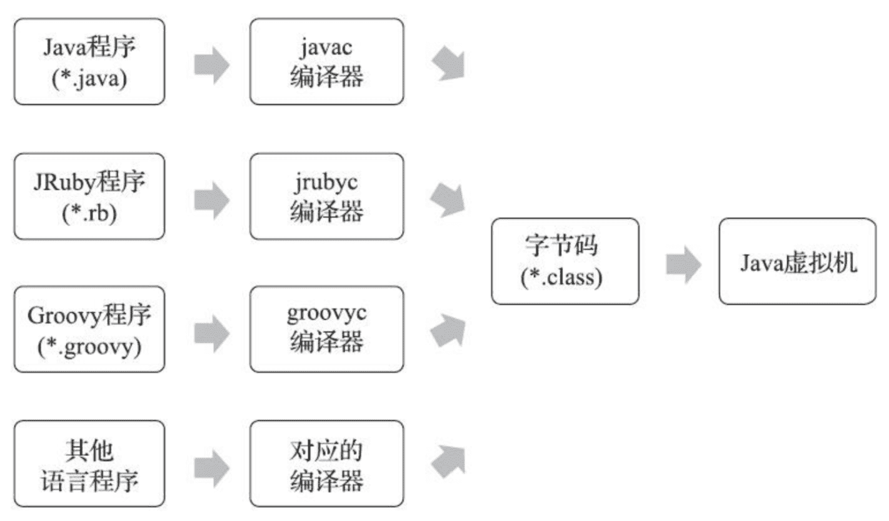
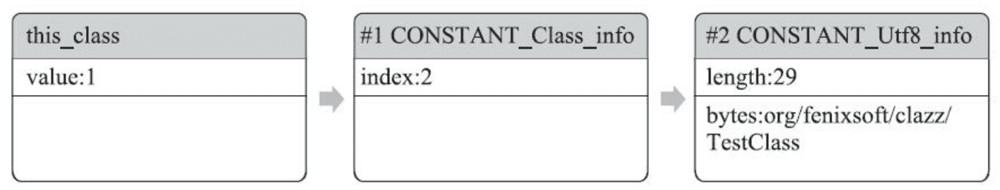

# Execution Engine

> Understanding Java Virtual Machine - Part 3

References

- Book《深入理解 Java 虚拟机：JVM 高级特性与最佳实践》
    - 英文书名 : Understanding the Java Virtual Machine - Advanced Features and Best Practices, Third Edition
    <!-- - 垃圾回收算法手册: 自动内存管理的艺术 -->
    <!-- - Java 性能优化权威指南 / Effective Java -->

## 类文件结构

- 代码编译的结果从本地机器码转变为字节码
    - _是存储格式发展的一小步, 却是编程语言发展的一大步_

### 无关性的基石

- 实现语言无关性的基础仍然是 **虚拟机** 和 **字节码存储格式**
    - **JVM** 不与包括 Java 语言在内的任何程序语言绑定, 它 **只与 "Class文件" 这种特定的二进制文件格式所关联**
    - Class 文件中 **包含了 JVM 指令集、符号表以及若干其他辅助信息**
- _基于安全方面的考虑,《Java 虚拟机规范》中要求在 Class 文件必须应用许多强制性的语法和结构化约束_
    - 但 **图灵完备的字节码格式, 保证了任意一门功能性语言都可以表示为一个能被 JVM 所接受的有效的 Class 文件**
    - _作为一个通用的、与机器无关的执行平台, 任何其他语言的实现者都可以将 JVM 作为他们语言的运行基础, 以 Class 文件作为他们产品的交付媒介_
    - _例如, 使用 Java 编译器可以把 Java 代码编译为存储字节码的 Class 文件, 使用JRuby 等其他语言的编译器一样可以把它们的源程序代码编译成 Class 文件_
- 虚拟机丝毫不关心 Class 的来源是什么语言, 它与程序语言之间的关系如下图所示
    - Java 语言中的各种语法、关键字、常量变量和运算符号的语义最终都会由多条字节码指令组合来表达
    - 这决定了字节码指令所能提供的语言描述能力必须比 Java 语言本身更加强大才行
    - _因此, 有一些 Java 语言本身无法有效支持的语言特性并不代表在字节码中也无法有效表达出来_
    - _这为其他程序语言实现一些有别于 Java 的语言特性提供了发挥空间_



### Class 类文件的结构

- Java 技术能够一直保持着非常良好的向后兼容性, Class 文件结构的稳定功不可没
    - _任何一门程序语言能够获得商业上的成功, 都不可能去做升级版本后, 旧版本编译的产品就不再能够运行这种事情_
- _本章所讲述的_ 关于 Class 文件结构的内容, 绝大部分都是在第一版的《Java虚拟机规范》( 1997 年发布, 对应于 JDK 1.2 时代的 JVM ) 中就已经定义好的
    - _内容虽然古老，但时至今日，Java 发展经历了十余个大版本、无数小更新, 那时定义的_ Class 文件格式的各项细节几乎没有出现任何改变
    - _尽管不同版本的《Java虚拟机规范》对 Class 文件格式进行了几次更新, 但基本上_ 只是在原有结构基础上新增内容、扩充功能, 并未对已定义的内容做出修改
- **Class 文件是一组以 8 Bytes 为基础单位的二进制流**
    - 各个数据项目严格按照顺序紧凑地排列在文件之中, 中间没有添加任何分隔符
        - _这使得整个 Class 文件中存储的内容几乎全部是程序运行的必要数据, 没有空隙存在_
    - **当遇到需要占用 8 Bytes 以上空间的数据项时, 则会按照高位在前的方式, 分割成若干个 8 Bytes 进行存储**
- _根据《Java虚拟机规范》的规定,_ **Class 文件格式采用一种类似于 C 语言结构体的伪结构来存储数据, 这种伪结构中只有两种数据类型 : "无符号数" 和 "表"**
    - **无符号数** : **基本的数据类型**
        - 以 **u1, u2, u4, u8** 来分别代表 1 Byte, 2 Bytes, 4 Bytes 和 8 Bytes 的无符号数
        - 可以用来 **描述数字、索引引用、数量值或者按照 UTF-8 编码构成字符串值**
    - **表** : 由多个无符号数或者其他表作为数据项构成的 **复合数据类型**
        - 为了便于区分, **所有表的命名都习惯性地以 "info" 结尾**
        - 用于 **描述有层次关系的复合结构的数据**, 整个 Class 文件本质上也可以视作是一张表
        - 这张 "表" 由下表所示的数据项按严格顺序排列构成

|类型|名称|数量|
|-|-|-|
|u4|magic|1|
|u2|minor_version|1|
|u2|major_version|1|
|u2|constant_pool_count|1|
|cp_info|constant_pool|constant_pool_count - 1|
|u2|access_flags|1|
|u2|this_class|1|
|u2|super_class|1|
|u2|interfaces_count|1|
|u2|interfaces|interfaces_count|
|u2|fields_count|1|
|field_info|fields|fields_count|
|u2|methods_count|1|
|method_info|methods|methods_count|
|u2|attributes_count|1
|attribute_info|attributes|attributes_count|

- 无论是 "无符号数" 还是 "表", **当需要描述同一类型但数量不定的多个数据时, 经常会使用一个前置的容量计数器加若干个连续的数据项的形式**
    - 这时候称这一系列连续的某一类型的数据为某一类型的 "集合"
- Class 的结构不像 XML 等描述语言
    - 由于它没有任何分隔符号, 所以在上表中的数据项，无论是顺序还是数量，甚至于数据存储的字节序 ( Byte Ordering, Class 文件中字节序为 Big-Endian ) 这样的细节, 都是被严格限定的
    - 哪个字节代表什么含义, 长度是多少, 先后顺序如何, 全部都不允许改变
- _接下来, 将要看这个表中各个数据项的具体含义_

### 魔数与 Class 文件的版本

- 每个 Class 文件的头 4 个字节被称为 **Magic Number** ( 魔数 )
    - 它的 **唯一作用是确定这个文件是否为一个能被虚拟机接受的 Class 文件**
- 不仅是 Class 文件, 很多文件格式标准中都有使用魔数来进行身份识别的习惯
    - _例如图片格式, GIF 或者 JPEG 等在文件头中都存有魔数_
- **使用魔数而不是扩展名来进行识别主要是基于安全考虑**
    - **因为文件扩展名可以随意改动**
    - 文件格式的制定者可以自由地选择魔数值, 只要这个魔数值还没有被广泛采用过而且不会引起混淆
- Class 文件的魔数的值为 `0xCAFEBABE`
    - _据 Java 开发小组最初的关键成员 Patrick Naughton 所说 : "我们一直在寻找一些好玩的、容易记忆的东西, 选择 0xCAFEBABE 是因为它象征着著名咖啡品牌 Peets Coffee 深受欢迎的 Baristas 咖啡"_
- 紧接着魔数的 4 个字节存储的是 Class 文件的版本号
    - 第 5 和第 6 个字节是次版本号 ( Minor Version )
    - 第 7 和第 8 个字节是主版本号 ( Major Version )
- **Java 的版本号是从 45 开始的, JDK 1.1 之后 的每个 JDK 大版本发布主版本号向上加 1**
    - _高版本的 JDK 能向下兼容以前版本的 Class 文件, 但不能运行以后版本的 Class 文件_
    - _因为《Java虚拟机规范》在 Class 文件校验部分明确要求了即使文件格式并未发生任何变化, 虚拟机也必须拒绝执行超过其版本号的 Class 文件_
    - 目前最新的 JDK 版本为 14, 可生成的 Class 文件主版本号最大值为 58.0

```bash
# on macOS
$ xxd HsdIsTest.class
00000000: cafe babe 0000 003a 001c 0a00 0200 0307  .......:........
00000010: 0004 0c00 0500 0601 0010 6a61 7661 2f6c  ..........java/l
00000020: 616e 672f 4f62 6a65 6374 0100 063c 696e  ang/Object...<in
00000030: 6974 3e01 0003 2829 5609 0008 0009 0700  it>...()V.......
00000040: 0a0c 000b 000c 0100 0948 7364 6973 5465  .........HsdisTe
00000050: 7374 0100 0161 0100 0149 0900 0800 0e0c  st...a...I......
00000060: 000f 000c 0100 0162 0a00 0800 030a 0008  .......b........
00000070: 0012 0c00 1300 1401 0003 7375 6d01 0004  ..........sum...
00000080: 2849 2949 0100 0443 6f64 6501 000f 4c69  (I)I...Code...Li
00000090: 6e65 4e75 6d62 6572 5461 626c 6501 0004  neNumberTable...
000000a0: 6d61 696e 0100 1628 5b4c 6a61 7661 2f6c  main...([Ljava/l
000000b0: 616e 672f 5374 7269 6e67 3b29 5601 0008  ang/String;)V...
000000c0: 3c63 6c69 6e69 743e 0100 0a53 6f75 7263  <clinit>...Sourc
000000d0: 6546 696c 6501 000e 4873 6469 7354 6573  eFile...HsdisTes
000000e0: 742e 6a61 7661 0021 0008 0002 0000 0002  t.java.!........
000000f0: 0000 000b 000c 0000 0008 000f 000c 0000  ................
00000100: 0004 0001 0005 0006 0001 0015 0000 0026  ...............&
00000110: 0002 0001 0000 000a 2ab7 0001 2a04 b500  ........*...*...
00000120: 07b1 0000 0001 0016 0000 000a 0002 0000  ................
00000130: 0005 0004 0006 0001 0013 0014 0001 0015  ................
00000140: 0000 0023 0002 0002 0000 000b 2ab4 0007  ...#........*...
00000150: b200 0d60 1b60 ac00 0000 0100 1600 0000  ...`.`..........
00000160: 0600 0100 0000 0a00 0900 1700 1800 0100  ................
00000170: 1500 0000 2900 0200 0100 0000 0dbb 0008  ....)...........
00000180: 59b7 0010 06b6 0011 57b1 0000 0001 0016  Y.......W.......
00000190: 0000 000a 0002 0000 000e 000c 000f 0008  ................
000001a0: 0019 0006 0001 0015 0000 001d 0001 0000  ................
000001b0: 0000 0005 05b3 000d b100 0000 0100 1600  ................
000001c0: 0000 0600 0100 0000 0700 0100 1a00 0000  ................
000001d0: 0200 1b
```

### 常量池

#### 简介

> Constant Pool

- 紧接着主、次版本号之后的是 **常量池入口**
    - 常量池可以比喻为 Class 文件里的资源仓库，它是 Class 文件结构中与其他项目关联最多的数据
    - 通常也是占用 Class 文件空间最大的数据项目之一

常量计数

- 由于常量池中 **常量的数量是不固定的**，所以在常量池的入口需要放置一项 u2 类型的数据，代表常量池容量计数值 ( `constant_pool_count` )
    - **`constant_pool_count` 是从 1 而不是 0 开始**
- 在 Class 文件格式规范制定之时，**设计者将第 0 项常量空出来是有特殊考虑的**
    - 目的在于，**如果后面某些指向常量池的索引值的数据在特定情况下需要表达 "不引用任何一个常量池项目" 的含义，可以把索引值设置为 0 来表示**
    - **Class 文件结构中只有常量池的容量计数是从 1 开始**
        - **对于其他集合类型，包括接口索引集合、字段表集合、方法表集合等的容量计数都与-般习惯相同，是从 0 开始**

常量分类

- 常量池中主要存放 **两大类常量** :
    - 字面量 ( **Literal** )
    - 符号引用 ( **Symbolic References** )
- 字面量 ( Literal ) **比较接近于 Java 语言层面的常量概念，如文本字符串、被声明为 final 的常量值等**
- 而符号引用则属于编译原理方面的概念，主要包括下面几类常量:
    - 被模块导出或者开放的包 ( Package )
    - 类和接口的全限定名 ( **Fully Qualified Name** )
    - 字段的名称和描述符 ( **Descriptor** )
    - 方法的名称和描述符
    - 方法句柄和方法类型 ( **Method Handle**, **Method Type**, **Invoke Dynamic** )
    - 动态调用点和动态常量 ( **Dynamically-Computed Call Site**, **Dynamically-Computed Constant** )

用途

- Java 代码在进行 `javac` 编译的时候，并不像 C 和 C++ 那样有 "连接" ( `link` ) 这一步骤，而是 **在 VM 加载 Class 文件的时候进行动态连接**
    - 也就是说，**在 Class 文件中不会保存各个方法、字段最终在内存中的布局信息**
    - 这些 **字段、方法的符号引用不经过 VM 在运行期转换的话是无法得到真正的内存入口地址**，也就无法直接被 VM 使用的
    - **当 VM 做类加载时，将会从 Constant Pool 获得对应的 Symbolic References, 再在类创建时或运行时解析、翻译到具体的内存地址之中**

#### 常量类型

- **Constant Pool 中每一项常量都是一个 <u>表</u>**
    - 最初常量表中共有 11 种结构各不相同的表结构数据
    - 后来为了更好地支持动态语言调用，额外增加了 4 种动态语言相关的常量
    - 为了支持 Java 模块化系统 ( Jigsaw ) , 又加入了CONSTANT_Module_info 和 CONSTANT_Package_info 两个常量
    - 所以截至 JDK 13，常量表中分别有 17 种不同类型的常量
- 这 17 类表都有一个共同的特点
    - **表结构起始的第一位是个 u1 类型的标志位 ( tag ) 代表着当前常量属于哪种常量类型**

|类型|标志|描述|
|-|-|-|
|CONSTANT_Utf8_info|1|UTF-8编码的字符串|
|CONSTANT_Integer_info|3|整型字面量|
|CONSTANT_Float_info|4|浮点型字面量|
|CONSTANT_Long_info|5|长整型字面量|
|CONSTANT_Double_info|6|双精度浮点型字面量|
|CONSTANT_Class_info|7|类或接口的符号引用|
|CONSTANT_String_info|8|字符串类型字面量|
|CONSTANT_Fieldref_info|9|字段的符号引用|
|CONSTANT_Methodref_info|10|类中方法的符号引用|
|CONSTANT_InterfaceMethodref_info|11|接口中方法的符号引用|
|CONSTANT_NameAndType_info|12|字段或方法的部分符号引用|
|CONSTANT_MethodHandle_info|15|表示方法句柄|
|CONSTANT_MethodType_info|16|表示方法类型|
|CONSTANT_Dynamic_info|17|表示一个动态计算常量|
|CONSTANT_InvokeDynamic_info|18|表示一个动态方法调用点|
|CONSTANT_Module_info|19|表示一个模块|
|CONSTANT_Package_info|20|表示一个模块中开放或者导出的包|

- 之所以说常量池是最烦琐的数据，是因为这17种常量类型各自有着完全独立的数据结构，两两之间并没有什么共性和联系，因此只能逐项进行讲解

**CONSTANT_Class_info** 型常量的结构

|类型|名称|数量|
|-|-|-|
|u1|tag|1|
|u2|name_index|1|

- tag 是标志位，它用于区分常量类型
- name_index 是常量池的索引值
    - 它指向常量池中一个 CONSTANT_Utf8_info 类型常量，此常量代表了这个类 ( 或者接口 ) 的全限定名

**CONSTANT_Utf8_info** 型常量的结构

|类型|名称|数量|
|-|-|-|
|u1|tag|1|
|u2|length|1|
|u1|bytes|length|

- length 值说明了这个 UTF-8 编码的字符串长度是多少字节
- 它后面紧跟着的长度为 length 字节的连续数据是一个使用 **UTF-8 缩略编码** 表示的字符串
    - UTF-8 缩略编码与普通 UTF-8 编码的区别是:
        - 从 `\u0001` 到 `\u007f` 之间的字符 ( 相当于 1~127 的 ASCII 码 ) 的缩略编码使用 1 个字节表示
        - 从 `\u0080` 到 `\u07ff` 之间的所有字符的缩略编码用 2 个字节表示
        - 从 `\u0800` 开始到 `\uffff` 之间的所有字符的缩略编码就按照普通 UTF-8 编码规则使用 3 个字节表示
- 在 JDK 的 bin 目录中，Oracle 公司已经为我们准备好一个 **专门用于分析 Class 文件字节码** 的工具 `javap`
    - 参数输出的 TestClass.class 文件字节码内容 ( 为节省篇幅，此清单中省略了常量池以外的信息 )

```java
// TestClass.java
package org.fenixsoft.clazz;

public class TestClass {

    private int m;

    public int inc() {
        return m + 1;
    }
}
```

```bash
# Prepare
$ javac TestClass.java

# Disassemble
$ javap -v TestClass
# or
$ javap -verbose TestClass

# output
Classfile /Users/IceHe/Documents/lib/books/src/understand-jvm/TestClass.class
  Last modified Sep 13, 2020; size 295 bytes
  SHA-256 checksum 080cab5c3401acf642960a2bf3c882b9b4d32eda4f94d79e95d9db856a5c50a4
  Compiled from "TestClass.java"
public class org.fenixsoft.clazz.TestClass
  minor version: 0
  major version: 58
  flags: (0x0021) ACC_PUBLIC, ACC_SUPER
  this_class: #8                          // org/fenixsoft/clazz/TestClass
  super_class: #2                         // java/lang/Object
  interfaces: 0, fields: 1, methods: 2, attributes: 1
Constant pool:
   #1 = Methodref          #2.#3          // java/lang/Object."<init>":()V
   #2 = Class              #4             // java/lang/Object
   #3 = NameAndType        #5:#6          // "<init>":()V
   #4 = Utf8               java/lang/Object
   #5 = Utf8               <init>
   #6 = Utf8               ()V
   #7 = Fieldref           #8.#9          // org/fenixsoft/clazz/TestClass.m:I
   #8 = Class              #10            // org/fenixsoft/clazz/TestClass
   #9 = NameAndType        #11:#12        // m:I
  #10 = Utf8               org/fenixsoft/clazz/TestClass
  #11 = Utf8               m
  #12 = Utf8               I
  #13 = Utf8               Code
  #14 = Utf8               LineNumberTable
  #15 = Utf8               inc
  #16 = Utf8               ()I
  #17 = Utf8               SourceFile
  #18 = Utf8               TestClass.java
{
  public org.fenixsoft.clazz.TestClass();
    descriptor: ()V
    flags: (0x0001) ACC_PUBLIC
    Code:
      stack=1, locals=1, args_size=1
         0: aload_0
         1: invokespecial #1                  // Method java/lang/Object."<init>":()V
         4: return
      LineNumberTable:
        line 3: 0

  public int inc();
    descriptor: ()I
    flags: (0x0001) ACC_PUBLIC
    Code:
      stack=2, locals=1, args_size=1
         0: aload_0
         1: getfield      #7                  // Field m:I
         4: iconst_1
         5: iadd
         6: ireturn
      LineNumberTable:
        line 8: 0
}
SourceFile: "TestClass.java"
```

#### 常量类型结构

- 因为 Java 中的 "类" 是无穷无尽的，无法通过简单的无符号数来描述一个方法用到了什么类
    - 因此在描述方法的这些信息时，需要引用 Constant Pool 中的 Symbolic Reference 进行表达

17 种常量项的结构定义

|常量|项目|类型|描述|
|-|-|-|-|
|CONSTANT_Utf8_info|tag|u1|值为 1|
||length|u2|UTF-8 编码的字符串占用了字节数|
||bytes|u1|长度为 length 的 UTF-8 编码的字符串|
|CONSTANT_Integer_info|tag|u1|值为 3|
||bytes|u4|按照高位在前存储的 int 值|
|CONSTANT_Float_info|tag|u1|值为 4|
||bytes|u4|按照高位在前存储的float值|
|CONSTANT_Long_info|tag|u1|值为 5|
||bytes|u8|按照高位在前存储的 long 值|
|CONSTANT_Double_info|tag|u1|值为 6|
||bytes|u8|按照高位在前存储的 double 值|
|CONSTANT_Class_info|tag|u1|值为 7|
||index|u2|指向全限定名常量项的索引|
|CONSTANT_String_info|tag|u1|值为 8|
||index|u2|指向字符串字面量的索引|
|CONSTANT_Fieldref_info|tag|u1|值为 9|
||index|u2|指向声明字段所属的类或者接口描述符<br/> CONSTANT_Class_info 的索引项|
||index|u2|指向字段描述符<br/> CONSTANT_NameAndType 的索引项|
|CONSTANT<br/>_Methodref_info|tag|u1|值为 10|
||index|u2|指向声明方法所属的类描述符<br/> CONSTANT_Class_info 的索引项|
||index|u2|指向名称及类型描述符<br/> CONSTANT_NameAndType_info 的索引项|
|CONSTANT<br/>_InterfaceMethodref_info|tag|u1|值为 11|
||index|u2|指向声明方法所属的接口描述符<br/> CONSTANT_Class_info 的索引项|
||index|u2|指向名称及类型描述符<br/> CONSTANT_NameAndType_info 的索引项
|CONSTANT<br/>_NameAndType_info|tag|u1|值为 12|
||index|u2|指向该字段或方法名称常量项的索引|
||index|u2|指向该字段或方法描述符常量项的索引|
|CONSTANT<br/>_MethodHandle_info|tag|u1|值为 15|
||reference_kind|u1|值必须在 1 至 9 之间 ( 包括 1 和 9 ) ,<br/> 它决定了方法句柄的类型.<br/> 方法句柄类型的值表示方法句柄的字节码行为|
||reference_index|u2|值必须是对常量池的有效索引|
|CONSTANT<br/>_MethodType_info|tag|u1|值为 16|
||descriptor_index|u2|值必须是对常量池的有效索引,<br/> 常量池在该索引处的项必须是<br/> CONSTANT_Utf8_info 结构,<br/> 表示方法的描述符|
|CONSTANT<br/>_Dynamic_info|tag|u1|值为 17|
||bootstrap_method<br/>_attr_index|u2|值必须是对当前 Class 文件中引导方法表的<br/> botstrap_methods[] 数组的有效索引|
||name_and<br/>_type_index|u2|值必须是对当前常量池的有效索引,<br/> 常量池在该索引处的项必须是 CONSTANT_NameAndType_info 结构,<br/> 表示方法名和方法描述符|
|CONSTANT<br/>_InvokeDynamic_info|tag|u1|值为 18|
||bootstrap_method<br/>_attr_index|u2|值必须是对当前 Class 文件中引导方法 :<br/> 表的bootstrap_ methods[] 数组的有效索引|
||name_and<br/>_type_index|u2|值必须是对当前常量池的有效索引,<br/> 常量池在该索引处的项必须是<br/> CONSTANT_NameAndType_info 结构,<br/> 表示方法名和方法描述符|
|CONSTANT_Module_info|tag|u1|值为 19|
||name_index|u2|值必须是对常量池的有效索引,<br/> 常量池在该索引处的项必须是<br/> CONSTANT_Uf8_info 结构,<br/> 表示模块名字|
|CONSTANT_Package_info|tag|u1|值为 20|
||name_index|u2|值必须是对常量池的有效索引,<br/> 常量池在该索引处的项必须是<br/> CONSTANT_Utf8_info 结构,<br/> 表示包名称|

### 访问标志

> Access Flags

- 在常量池结束之后，紧接着的 2 个字节代表访问标志 ( **access_flags** )
    - 这个标志用于识别一些类或者接口层次的访问信息, 包括 :
        - 这个 Class 是类还是接口
        - 是否定义为 public 类型
        - 是否定义为 abstract 类型
        - 如果是类的话, 是否被声明为 final
        - ……
- access_flags 中一共有 16 个标志位可以使用
    - 当前只定义了其中 9 个
    - 没有使用到的标志位要求一律为 0

具体的标志位以及标志的含义

|标志名称|标志值|含义|
|-|-|-|
|ACC_PUBLIC|0x0001|是否为 public 类型|
|ACC_FINAL|0x0010|是否被声明为 final, 只有类可设置|
|ACC_SUPER|0x0020|是否允许使用 invokespecial 字节码指令的新语义,<br/> invokespecial 指令的语义在 JDK 1.0.2 发生过改变,<br/> 为了区别这条指令使用哪种语义,<br/> JDK 1.0.2 之后编译出来的类的这个标志都必须为真|
|ACC_INTERFACE|0x0200|标识这是一个接口|
|ACC_ABSTRACT|0x0400|是否为abstract类型, 对于接口或者抽象类来说,<br/> 此标志值为真, 其他类型值为假|
|ACC_SYNTHETIC|0x1000|标识这个类并非由用户代码产生的|
|ACC_ANNOTATION|0x2000|标识这是一个注解|
|ACC_ENUM|0x4000|标识这是一个枚举|
|ACC_MODULE|0x8000|标识这是一个模块|

- _以 TestClass 为例, 一个普通 Java 类_
    - _不是接口、枚举、注解或者模块_
    - _被 `public` 关键字修饰但没有被声明为 `final` 和 `abstract`_
    - _并且它使用了 JDK 1.2 之后的编译器进行编译_
- _因此它的 `ACC_PUBLIC, ACC_SUPER` 标志应当为真_
    - _而 `ACC_FINAL, ACC_NTERFACE, ACC_ABSTRACT, ACC_SYNTHETIC, ACC_ANNOTATION, ACC_ENUM, ACC_MODULE` 这七个标志应当为假_
- _因此它的 `access_flags` 的值应为 : `0x0001 | 0x0020 = 0x0021`_

### 类索引、父类索引与接口索引集合

Class 文件中由以下 3 项数据来确定该类型的继承关系

- 类索引 `this_class`
- 父类索引 `super_class`
- 接口索引 `interfaces`

索引的数据类型

- 类索引 ( `this_class` ) 和父类索引 ( `super_class` ) 都是一个 u2 类型的数据
- 而接口索引集合 ( `interfaces` ) 是一组 u2 类型的数据的集合

索引的数据内容

- 类索引 : 确定这个类的全限定名
- 父类索引 : 确定这个类的父类的全限定名
    - 由于 Java 语言不允许多重继承, 所以 **父类索引只有 1 个**
        - 除了 java.lang.Object 之外，所有的 Java 类都有父类
        - 因此除了 java.lang.Object 外，所有 Java 类的父类索引都不为 0
- 接口索引集合 : 描述这个类实现了哪些接口
    - 这些被实现的接口将按 implements 关键字后的接口顺序从左到右排列在接口索引集合中
        - _( 如果这个 Class 文件表示的是一个接口, 则应当是 extends 关键字 )_
- 类索引、父类索引和接口索引集合都按顺序排列在访问标志之后
    - 类索引和父类索引用两个 u2 类型的索引值表示，它们各自指向一个类型为 CONSTANT_Class_ info的类描述符常量
    - 通过 CONSTANT_Class_info 类型的常量中的索引值可以找到定义在 CONSTANT_Utf8_info 类型的常量中的全限定名字符串



## 虚拟机类加载机制

## 虚拟机字节码执行引擎

## 类加载及执行子系统的案例和实战
