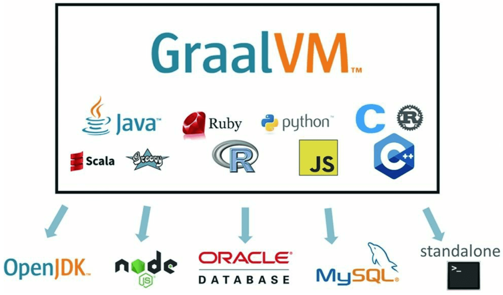
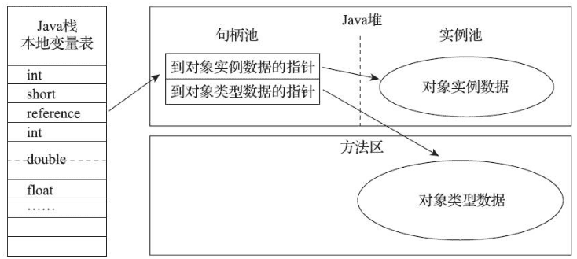
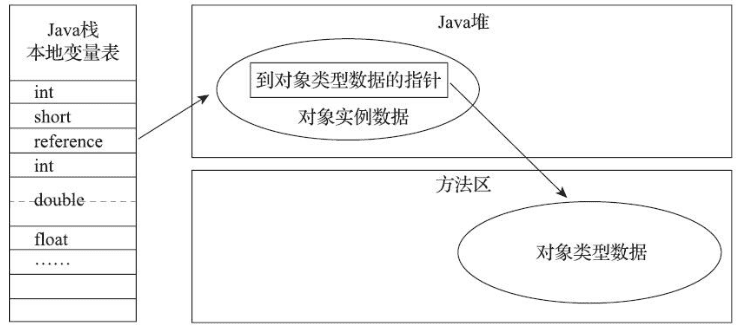
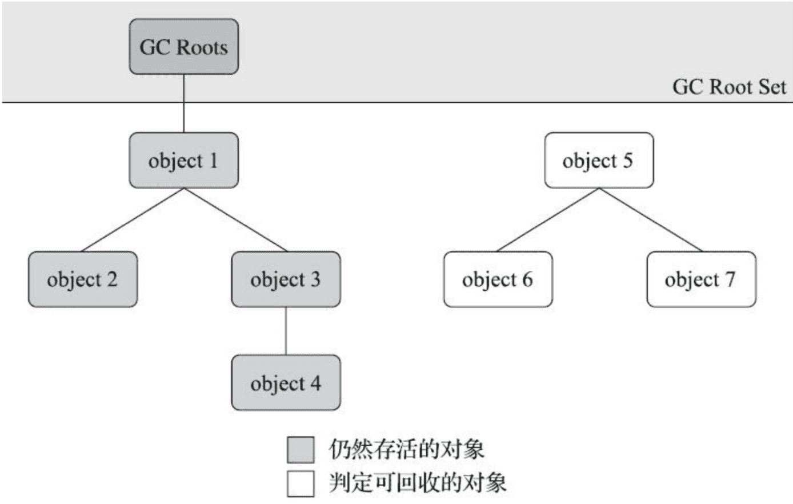
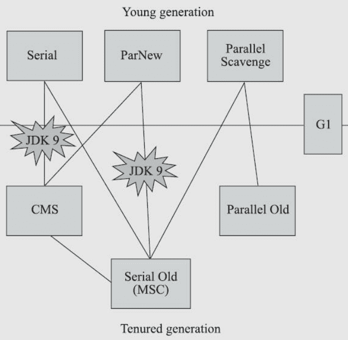
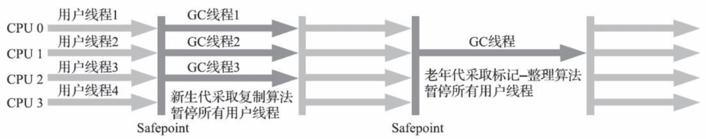
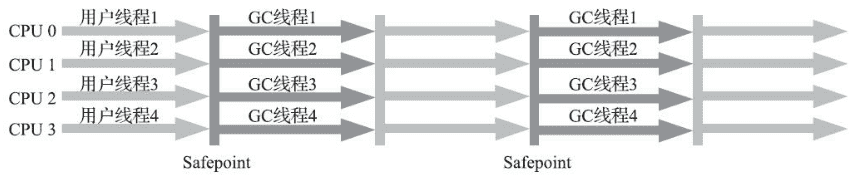
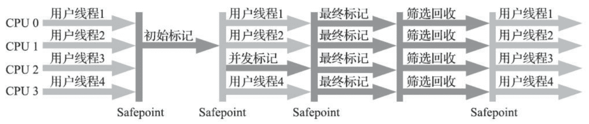

# Understanding Java Virtual Machine

References

- Book《深入理解 Java 虚拟机：JVM 高级特性与最佳实践》
    - 英文书名 : Understanding the Java Virtual Machine - Advanced Features and Best Practices, Third Edition
    <!-- - 垃圾回收算法手册: 自动内存管理的艺术 -->
    <!-- - Java 性能优化权威指南 / Effective Java -->

## 走近 Java

### Java 历史

Keywords

- 自动内存管理 : 永久代 / 元空间
- 垃圾回收算法和收集器 : ZGC - 低延迟全并发收集器
    - 跨代引用 : 记忆集 / 卡表 / 并发标记 / 原始快照算法
- 命令行和可视化工具 : JHSDB / JFR / JMC
- 执行子系统
- 类加载过程 : 加载 / 验证 / 准备 / 解析 / 初始化
    - 找到正确的方法 : 符号表?
    - 如何执行字节码 / 内存结构
    - 对动态语言的支持
- 热点探测 / 即时编译 (JIT) : Graal 编译器
- 内存模型 : 结构 / 原子性 / 可见性 / 有序性
- 线程安全
- …

#### 优点

- 一次编译, 到处(随处)运行. Write Once, Run Anywhere.
- 相对安全的内存管理和访问机制
    - 避免绝大部分内存泄露和指针越界
- 实现了热点代码检测 & 运行时编译及优化
- _完善的 API_

运行在 JVM 上的编程语言

- Kotlin
- Clojure
- JRuby
- Groovy
- …

#### JDK 特性

- JDK 1.1
    - JAR 文件格式
    - JDBC
    - **JavaBeans**
    - _RMI - Remote Method Invocation 远程方法调用_
    - 语言层面
        - Inner Class 内部类 & Reflection 反射
- JDK 1.2
    - ? EJB
    - _? Java Plug-in_
    - _? Java IDL_
    - **JIT - Just In Time 即时编译器**
    - 语言层面
        - 关键字 scrictfp - strict float point 精确浮点
- JDK 1.3
    - Java 类库改进 : 数学运算 / Timer API / …
    - JNDI - Java Naming and Directory Interface 命名和目录接口
    - ……
- JDK 1.4
    - 正则表达式
    - 异常链
        - _指将捕获的异常包装进一个新的异常中并重新抛出的异常处理方式_
        - _原异常被保存为新异常的一个属性, 例如 cause_
        - _这个想法是指一个方法应该抛出定义在相同的抽象层次上的异常, 但不丢弃更低层次的信息_
    - **NIO - Java Non-blocing IO 非阻塞性 IO**
        - _为所有的原始类型提供 (Buffer) 缓存支持_
        - _字符集编码解码解决方案_
        - _Channel ：一个新的原始 I/O 抽象_
        - _支持锁和内存映射文件的文件访问接口_
        - _提供多路 (non-blocking) 非阻塞式的高伸缩性网络I/O_
    - 日志类 log
    - XML 解析器
    - _? XSLT 转换器_
- JDK 1.5 → JDK 5 _( 命名方式转变 )_
    - 语法
        - 自动装箱
        - 泛型
        - 动态注解
        - 枚举
        - 可变长参数
        - 遍历循环 foreach
    - JMM - Java Memory Model 内存模型
    - java.util.concurrent 并发包
- JDK 6
    - _J2EE / J2SE / J2ME → Java EE / Java SE / Java ME ( 命名转变 )_
    - 初步的动态语言支持
    - 编译器注解处理器
    - 微型 HTTP 服务器 API
    - 虚拟机内部改进
        - 锁与同步
        - 垃圾收集
        - 类加载
- JDK 7
    - **G1 - Garbage-First 收集器**
    - _加强对非 Java 语言的调用支持_
    - 可并行的类加载架构
- JDK 8
    - **Lambda 表达式, 支持函数式编程**
    - 动态语言支持 _( 例如 Groovy )_
    - 新的时间日期 API _( 例如 LocalDateTime )_
    - _JEP - JDK Enhancement Proposals 来定义和管理发布的特性_
- JDK 9
    - **Jigsaw 虚拟机层面的模块化支持**
    - _管理发布变化_
        - _3月 / 9月 各发布一个大版本, 避免引发交付风险_
        - _每三年划出一个 LTS - Long Term Support 长期支持版本_
            - _JDK 8 & JDK 11 是 LTS 版本, 下一个是 JDK 17_
- JDK 10
    - 内部重构
        - 统一源仓库
        - 统一垃圾收集器接口
        - 统一即时编译接口 : 引入 Graal 即时编译器
    - _2018.6 JMC 开发团队解散_
    - _2018.10 最后一届 JavaOne 大会_
- JDK 11
    - **ZGC 革命性的垃圾收集器**
    - 类型推断加入 Lambda 语法
- JDK 12
- JDK 13
    - [语法糖](https://mp.weixin.qq.com/s?src=11&timestamp=1584695676&ver=2228&signature=yUmOZYGmdezPvlNcdVw7CK4MptGLS70zFrklGJlGoQpJ-ejAUISbIxSwH9wn6j6aSHHYSZIA7m3q7DkDP3Tbn1XQSKpf2raY8aqowgGAwD9xTyPjwItuupWgwo4r36ut&new=1)
        - switch 表达式 _( 简化了传统写法, 增强了语法糖和用法 )_
        - Text Blocks 文本块 _( 不用转义, 使用三重双引号, 划出文本块 )_

题外话 : **JVM 的 GC 释放的内存会还给操作系统吗？**

- GC 后的内存如何处置，其实是取决于不同的垃圾回收器的。**因为把内存还给 OS，意味着要调整 JVM 的堆大小，这个过程是比较耗费资源的。**
- 在 JDK 11 中，Java 引入了 ZGC，这是一款可伸缩的低延迟垃圾收集器，但是当时只是实验性的。并且，**ZGC 释放的内存是不会还给操作系统的。**

### JVM 发展

Exact VM

- **Exact Memory Management 准确式内存管理**
    - aka. Non-Conservative/Accurate Mem. Mgt.
    - 指 **VM 可以知道某个位置数据的类型**, 例如 整数 12345

_BEA Liquid VM / Azul VM_

- _针对特定架构的硬件, 进行优化, 充分发挥硬件性能_
    - 自带操作系统/越过操作系统, 不需要再进行内核态/用户态的切换, 直接控制硬件…… 等

#### HotSpot VM

- 默认的 JVM
- _(也有)_ **准确式内存管理**
- **热点探测技术** _( 通过执行计数器, 找到最具编译价值的代码 )_
    - **即时编译** JIT ( Just In Time ) 或 栈上替换编译 OSR ( On-Stack Replacement )

#### Graal VM

- **无语言倾向 : "Run Programs Faster Anywhere."**
- 在 HotSpot VM 的基础上, 增强成跨语言全栈虚拟机
    - 可以作为任何语言的运行平台使用
        - _包括 Java / Scala / Groovy / Kotlin 等 JVM 之上的语言_
        - _还有 C / C++ / Rust 等基于 LLVM 的语言_
        - _还有 JavaScript / Ruby / Python / R 等_
    - _无额外开销地混合使用这些编程语言_
    - _支持不同语言中混用对方接口和对象_
    - _也支持这些语言使用已经编写好的本地库文件_
- 原理 :
    - 将不同语言的源码, 编译成中间格式 _( 例如 LLVM 字节码 )_
    - 通过解释器转换为能被 Graal VM 接受的中间表示 _( IR - Intermediate Representation )_



#### 即时编译器

- _对需要长时间运行的应用来说，由于经过充分预热，热点代码会被 HotSpot 的探测机制准确定位捕获，并将其编译为物理硬件可直接执行的机器码_
    - _在这类应用中 Java 的运行效率很大程度上取决于即时编译器所输出的代码质量_
- **C1 编译器** : 编译时间短, 代码优化程度低 -- 客户端编译器
- **C2 编译器** : 编译时间长, 代码优化程度高 -- 服务器编译器
    - 通常它们会在分层编译机制下, 与解释器互相配合来共同构成 HotSpot VM 的执行子系统
- **Graal 编译器** : C2 的替代者
    - 可维护性更好, 性能还反超历史悠久的 C2 _( 代码复杂难以维护 )_
    - 支持更复杂的优化
        - Partial Escape Analysis 部分逃逸分析
        - Aggressive Speculative Optimization 预测性优化 _( 比较激进 )_

**提前编译 AOT - Ahead of Time Compilation**

- 相对于 "即时编译" 的概念, 提前将所有代码编译好
    - 启动更快, 不用预热
    - 但是破坏了 "一次编写, 到处运行" 的约定
        - 不同的硬件和操作系统需要不同的发行包
- _"向 Native 迈进" , 性能更好, 内存占用更小, 运行时环境更小_

### 源码调试入门

References :

- OpenJDK Mercurial Repositories : https://hg.openjdk.java.net/jdk
- <i>优雅地在 Mac OS Catalina 下 编译 Open JDK 13 : https://cloud.tencent.com/developer/article/1522903 </i>

#### 安装与编译

**On macOS**

- 1\. Install Xcode
    - _omitted…_
- 2\. Select Xcode

```bash
$ sudo xcode-select --switch /Applications/Xcode.app/Contents/Developer
```

- 3\. Configure : 依赖项检查 / 参数配置 / 构建输出目录结构 / …

```bash
$ bash configure --enable-debug --with-jvm-variants=server
# or
$ bash configure

# output
(omitted…)
====================================================
A new configuration has been successfully created in
/Users/IceHe/Documents/jdk12-06222165c35f/build/macosx-x86_64-server-fastdebug
using configure arguments '--enable-debug --with-jvm-variants=server'.

Configuration summary:
* Debug level:    fastdebug
* HS debug level: fastdebug
* JVM variants:   server
* JVM features:   server: 'aot cds cmsgc compiler1 compiler2 dtrace epsilongc g1gc graal jfr jni-check jvmci jvmti management nmt parallelgc serialgc services shenandoahgc vm-structs'
* OpenJDK target: OS: macosx, CPU architecture: x86, address length: 64
* Version string: 12-internal+0-adhoc.mac.jdk12-06222165c35f (12-internal)

Tools summary:
* Boot JDK:       openjdk version "12.0.1" 2019-04-16 OpenJDK Runtime Environment (build 12.0.1+12) OpenJDK 64-Bit Server VM (build 12.0.1+12, mixed mode, sharing)  (at /Library/Java/JavaVirtualMachines/openjdk-12.0.1.jdk/Contents/Home)
* Toolchain:      clang (clang/LLVM from Xcode 9.4.1)
* C Compiler:     Version 9.1.0 (at /usr/bin/clang)
* C++ Compiler:   Version 9.1.0 (at /usr/bin/clang++)

Build performance summary:
* Cores to use:   4
* Memory limit:   8192 MB
```

- 4\. Compile OpenJDK
    - _如果多次编译, 或者目录结构成功产生后又再次修改了配置,_
    - _必须先使用 `make clean` 和 `make dist-clean` 命令清理目录, 才能确保新的配置生效_

```bash
$ make images
```

- 5\. Test java

```bash
$ cd build/[config_name]/jdk
# e.g. `cd build/macosx-x86_64-server-fastdebug/jdk/`

$ ./bin/java -version

# output
openjdk version "12-internal" 2019-03-19
OpenJDK Runtime Environment (fastdebug build 12-internal+0-adhoc.mac.jdk12-06222165c35f)
OpenJDK 64-Bit Server VM (fastdebug build 12-internal+0-adhoc.mac.jdk12-06222165c35f, mixed mode)
```

_在 `configure` 命令以及后面的 make 命令的执行过程中, 会在 "build/配置名称" 目录下产生如下目录结构_

- _`buildtools/` : 用于生成、存放编译过程中用到的工具_
- _`hotspot/` : HotSpot 虚拟机编译的中间文件_
- _`images/` : 使用 `make *-image` 产生的镜像存放在这里_
- _`jak/` : 编译后产生的 JDK 就放在这里_
- _`support/` : 存放编译时产生的中间文件_
- _`test-results/` : 存放编译后的自动化测试结果_
- _`configure-support/` : 这三个目录是存放执行 `configure`、`make` 和 `test` 的临时文件_
- _`make-supPort/`_
- _`test-supPort/`_

_依赖检查通过后便可以输入 `make images` 执行整个 OpenJDK 编译了, 这里 `imasges` 是 `product-images` 编译目标 (Target) 的简写别名, 这个目标的作用是编译出整个 JDK 镜像. 其它编译目标还有 :_

- _`hotspot` : 只编译 HotSpot 虚拟机_
- _`hotspot-<variant>` : 只编译特定模式的 HotSpot 虚拟机_
- _`docs-image` : 产生 JDK 的文档镜像_
- _`test-image` : 产生 JDK 的测试镜像_
- _`al1-images` : 相当于连续调用 `product`、`docs`、`test` 三个编译目标_
- _`bootcycle-images` : 编译两次 JDK, 其中第二次使用第一次的编译结果作为Bootstrap JDK_
- _`clean` : 清理 `make` 命令产生的临时文件_
- _`dist-clean` : 清理 `make` 和 `configure` 命令产生的临时文件_

#### IDE 调试

IDE Debug

- Build JDK as above
- Download & open **JetBrains CLion**
- Select `File` → `New CMake Project from Sources…` & click `Ok`
- Edit Run/Debug Configuration as below


## 内存区域 & 内存溢出异常

### 运行时数据区

JVM Runtime Data Area _( JVM 运行时数据区 )_


#### 程序计数器

**Program Counter Register** _( 程序计数器 )_

- 当前线程所执行的字节码的行号指示器 _( 跟软硬件/操作系统的体系结构类似 )_
- **字节码解释器工作时, 通过改变该计数器来选取下一条需要执行的字节码指令**
- 即 程序控制流的指示器 -- 分支/循环/跳转/错误处理/线程恢复 均依赖它
- JVM 多线程, 每个线程都需要独立的程序计数器, 所以它是 线程私有的内存数据

#### 虚拟机栈

**Java Virtual Machine Stack** _( Java 虚拟机栈 )_

- 也是线程私有的, 生命周期与线程相同
- 每个方法被执行时, JVM 都会创建一个栈帧 Stack Frame
    - 用于存储 局部变量表 / 操作栈 / 动态链接 / 方法出口等信息
    - 每个方法被调用直至执行完毕, 对应着一个栈帧从入栈到出栈的过程
- 局部变量表
    - 存放编译器可知的数据
        - Java 基本数据类型 : boolean / byte / …… / long / double
        - 对象引用 reference : 可能是引用指针 / 句柄 / …
        - returnAddress 类型 : 指向一条字节码指令的位置
    - 数据类型 : 在变量表中, 以局部变量槽 Slot 来表示
        - 除了 long 和 double 用 2 个变量槽, 其它类型只用 1 个
        - 变量槽 slot 实际多大, 由 JVM 具体的实现来决定

#### 本地方法栈

**Native Method Stack** _( 本地方法栈 )_

- 跟虚拟机栈的区别
    - **虚拟机栈 : 为虚拟机执行 Java 方法 ( 也就是字节码 ) 服务**
    - **本地方法栈 : 为虚拟机使用到的本地 ( Native ) 方法服务**
        - _? Java 方法 ( 字节码 ) 和 Native 方法的区别 ( 书后面应该会说 ) ?_
- 有的虚拟机如 HotSpot VM 直接把 VM Stack 和 Native Method Stack 合二为一

#### Java 堆

**Java Heap** _( Java 堆 )_

- 所有线程共享的一块内存区域, VM 启动时创建
- **所有的对象实例以及数组都应当在堆上分配**
- 垃圾收集器管理 Java Heap, 也被成为 GC 堆 ( Garbage Collected Heap )
    - 从回收内存的角度看, 现代垃圾收集器 大部分都基于 **分代收集理论设计**
    - 从分配内存的角度看, 所有线程共享的 Java 堆 可以划分出多个线程私有的分配缓冲区, 以提升分配效率
        - **TLAB - Thread Local AllocationBuffer 线程私有分配缓冲区**
- Java Heap 可以处于物理上不连续的内存空间中 _( 虚拟内存空间? )_
- Java Heap 既可以被实现为 固定大小的, 也可以是 可拓展的
    - 主流都是 可拓展的 ( 通过参数 `-Xmx` 和 `-Xms` 设定 )

#### 方法区

**Method Area** _( 方法区  )_

- _各个线程共享的内存区域_
- **存储 已被虚拟机加载的类型信息 / 常量 / 静态变量 / 即时编译器编译后的代码缓存 / …**
- _本质上, 永久代 ( Permanent Generation ) 和方法区并不是等价的_
    - 因为仅仅是当时的 HotSpot 虚拟机设计团队选择把收集器的分代设计扩展至方法区, 或者说使用永久代来实现方法区而已
    - _这样使得 HotSpot 的垃圾收集器能够像管理 Java8 一样管理这部分内存, 省去专门为方法区编写内存管理代码的工作_
    - _但是对于其它虚拟机实现, 譬如 BEA JRockit、IBM J9 等来说, 是不存在永久代的概念的_
    - 到了 JDK 8 完全废弃了永久代的概念, _改用与 JRockit、J9 一样_ 在本地内存中实现的 **Metaspace 元空间** 来代替方法区

**Runtime Constant Pool** _( 运行时常量池 )_

- 是 Method Area 的一部分
- 常量池表 **Constant Pool Table : 存放编译器生成的各种字面量与符号引用**
    - 它们在类加载后, 存放到方法区的运行时常量池中

#### 直接内存

**Direct Memory** _( 直接内存 )_

- 并不是虚拟机运行时数据区的一部分, 也不是 JVM 规范中定义的内存区域
- JDK 1.4 加入 **NIO ( New Input/Output )**
    - 引入基于通道 Channel 与缓冲区 Buffer 的 I/O 方式
    - **可以使用 Native 函数直接分配 (Java) <u>堆外内存</u>**
        - _直接内存的分配不会受到 Java 堆大小的限制, 但毕竟本机物理内存有限, 小心内存溢出_
    - 然后通过一个存储在 Java Heap 里的 DirectByteBuffer 对象作为这块内存的引用进行操作
    - _显著提高性能, 因为避免了在 Java Heap 和 Native Heap 中来回复制数据_

### HotSpot VM 的对象和内存

#### 对象的创建

- **new** 指令 -> 检查指令的参数是否能在 **常量池** 中定位到一个类的 **符号引用**
- 并且检查这个 符号引用 代表的类是否已被 **加载**、**解析** 和 **初始化** 过
- 若无, 必须先执行相关的 **类加载过程** (详情暂略)
- 为新创建的对象 分配内存, 并将内存空间置 0
    - 内存大小在类加载后可以完全确定
- 执行 构造函数, 即 Class 文件中的 `<init>()` 方法

#### 内存分配

- **Bump The Pointer 指针碰撞**
    - 假设 Java 堆中内存是绝对规整的, 所有被使用过的内存都存放在一边, 空闲的内存被放在另一边, 中间放着一个指针作为分界点的指示器
    - 分配内存就仅仅是把那个指针向空闲空间方向挪动一段与对象大小相等的距离, 这种分配方式称为 "指针碰撞" ( Bump The Pointer ) .
- **Free List 空间列表**
    - 但如果 Java 堆中的内存并不是规整的, 已被使用的内存和空闲的内存相互交错在一起, 那就没有办法简单地进行指针碰撞了; 虚拟机就必须维护一个列表, 记录上哪些内存块是可用的
    - 在分配的时候从列表中找到一块足够大的空间划分给对象实例, 并更新列表上的记录, 这种分配方式称为 "空闲列表" ( Free List )
- **Compact 空间压缩整理**
    - 选择哪种分配方式由Java堆是否规整决定, 而 Java 堆是否规整又由所采用的垃圾收集器是否带有 "空间压缩整理" ( Compact ) 的能力决定
- **Sweep 清除**
    - 因此, 当使用 Serial、ParNew 等带压缩整理过程的收集器时, 系统采用的分配算法是指针碰撞, 既简单又高效
    - 而当使用 CMS 这种基于清除 ( Sweep ) 算法的收集器时, 理论上就只能采用较为复杂的空闲列表来分配内存
- Object Header 对象头 : 对象相关的信息存放处

如何保证能成功地并发分配内存

- _对象创建 在虚拟机中是非常频繁的行为, 即使仅仅修改一个指针所指向的位置, 在并发情况下也并不是线程安全的_
- _可能出现正在给对象 A 分配内存, 指针还没来得及修改，对象 B 又同时使用了原来的指针来分配内存的情况_
- _有以下两个可选的解决方案 :_
    - A. 对分配内存空间的动作进行同步处理
        - 采用 **CAS 配上失败重试** 的方式保证更新操作的原子性
    - B. 把内存分配的动作按照线程划分在不同的空间之中进行
        - 即每个线程在 Java 堆中预先分配一小块内存, 称为 **TLAB - Thread Local Allocation Buffer** 本地线程分配缓存
        - 那个线程要分配内存, 就在那个线程的 TLAB 分配
        - 等 TLAB 用完了, 分配新的缓存区时, 才需要同步锁定
            - _通过 `-XX:+/-UseTLAB` 参数来设定虚拟机是否启用 TLAB_

**内存的初始化**

- 内存分配完成之后, 虚拟机必须将分配到的内存空间 ( 但不包括对象头 ) 都初始化为 0 值
- 如果使用了 TLAB 的话, 这一项工作也可以提前至 TLAB 分配时顺便进行
- 这步操作保证了对象的实例字段在 Java 代码中可以不赋初始值就直接使用
    - _使程序能访问到这些字段的数据类型所对应的 0 值_

#### 对象的内存布局

- 在 HotSpot 虚拟机里, 对象在堆内存中的存储布局可以划分为
    - 1\. **Header** 对象头
        - Mark Word
        - 类型指针
    - 2\. **Instance Data** _( 实例数据 )_
    - 3\. **Padding** _( 对齐填充 )_

##### 对象头

1\. **Object Header** _( 对象头 )_

- HotSpot VM 里, 对象头包括两类信息 :
    - 1\. **Mark Word** : 存储对象自身的运行时数据 _( 使用 bitmap 方式存储 )_
        - HashCode
        - GC 分代年龄
        - _? 锁状态标志_
        - _? 线程持有的锁_
        - _? 偏向进程 ID_
        - _? 偏向时间戳_
    - 2\. 类型指针
        - 即对象指向它的类型元数据的指针
        - JVM 通过它来确定该对象是哪个类的实例
        - _不是所有 VM 实现都必须在对象数据上保留类型指针_
        - 如果对象是一个 Java 数组, 还必须有一块用于记录数据长度的数据
            - _因为虚拟机可以通过普通 Java 对象的元数据确定 Java 对象的大小_
            - _但是如果是数组的话, 将无法通过类型元数据中的信息推断出数组的大小_
    - 3\. Padding 对齐填充
        - HotSpot VM 的自动内存管理系统, 要求对象起始地址必须是 8 bytes 的整数倍

_对象自身的运行时数据_

- 存储的这些信息, 长度在 32 位和 64 位的 VM ( 未开启压缩指针 ) 分别为 32 bits 和 64 bits -- 官方称为 **Mark Word**
- 考虑到 VM 的空间效率, 它是一个动态定义的数据结构
    - 在极小的空间内存储尽可能多的数据, 根据对象的状态复用自己的存储空间 -- 按位存储
        - _Mark Work 布局 & 每位的含义 : 32 位虚拟机的存储布局情况如下_

```cpp
// Bit-format of an object header (most significant first，big endian layout below) :
//
// 32 bitst
// hash:25 ------------>| age:4    biased_lock:1 lock:2 (normal object)
// JavaThread*:23 epoch:2 age:4    biased_lock:1 lock:2 (biased object)
// size:32 ------------------------------------------>| (CMS free block)
// PromotedObjecty:29 ---------->| promo_bits:3 ----->| (CMS promoted object)
```

##### 实例数据

_2\. **Instance Data** ( 实例数据 )_

- _实例数据部分是对象真正存储的有效信息，即我们在程序代码里面所定义的各种类型的字段内容，无论是从父类继承下来的，还是在子类中定义的字段都必须记录起来_
- _这部分的存储顺序会受到虚拟机分配策略参数 ( `-XX: FieldsAllocationStyle` 参数 ) 和字段在 Java 源码中定义顺序的影响_
- HotSpot 虚拟机默认的分配顺序为 longs/doubles, ints, shorts/chars, bytes/booleans, oops (Ordinary Object Pointers，OOPs) , 从以上默认的分配策略中可以看到, 相同宽度的字段总是被分配到一起存放, 在满足这个前提条件的情况下, 在父类中定义的变量会出现在子类之前
- _如果 HotSpot 虚拟机的 `+XX: CompactFields` 参数值为 true ( 默认就为true ) , 那子类之中较窄的变量也允许插入父类变量的空隙之中, 以节省出一点占空间_

##### 对齐填充

_3\. **Padding** ( 对齐填充 )_

- _对象的第三部分是对齐填充, 这并不是必然存在的, 也没有特别的含义, 仅起着占位符的作用_
- _由于 HotSpot 虚拟机的自动内存管理系统要求对象起始地址必须是 8 字节的整数倍, 换句话说就是任何对象的大小都必须是 8 字节的整数倍_
- _对象头部分已经被精心设计成正好是 8 字节的倍数 (1倍或者2倍) , 因此如果对象实例数据部分没有对齐的话, 就需要通过对齐填充来补全_

#### 对象的访问定位

- Java 程序通过 stack 上的 reference 数据来操作 heap 上的具体 object
- VM 规范中没有规定 reference 应该通过什么方式来定位和访问
- 主流方式有 :
    - A. **handle 句柄**
        - Java Heap 中划分出句柄池, reference 中存储的就是对象的句柄地址
        - 句柄中包含 : _( 见下图 1 )_
            - **对象实例数据的 指针**
            - 类型数据的指针 _(指出各实例数据的数据类型)_
        - 优点 : reference 存储稳定的句柄地址
            - 对象被移动时 _(垃圾收集时会异动对象)_ , 只需要改变句柄中的 实例数据指针, 不需要修改 reference 本身
    - B. **direct pointer 直接指针**
        - reference 中直接存储 对象地址
        - 地址所指的数据 包含 : _( 见下图 2 )_
            - **对象实例数据**
            - 类型数据的指针
        - 优点 : 速度更快, 节省一次指针定位的时间
    - HotSpot VM 主要使用 direct pointer 的方式访问对象 _(当然也有例外情况)_




### 实战 : OutOfMemeoryError

概念区分

- 内存泄露 Memory Leak
- 内存溢出 Memory Overflow

JVM 参数

- `-Xms` 设置 堆的最小值, 例如 -Xms20m
- `-Xmx` 设置 堆的最大值, 例如 -Xmx4g
- `-Xss` 设置 栈容量, 例如 -Xss128k
    - 不同版本的 JVM 和操作系统, 栈容量最小值限制有所不同
        - JDK 11
            - Linux 228K
            - Windows 180K
- `-Xoss` 设置 本地方法栈容量

#### Java 堆溢出

**Java Heap OverflowError**

[File : HeapOOM.java](src/understand-jvm/HeapOOM.java ':include :type=code java')

_output :_

[File : HeapOOM.out](src/understand-jvm/HeapOOM.out ':include :type=code bash')

#### 虚拟机栈和本地方法栈溢出

**VM Stack and Native Method StackOverflowError**

[File : JavaVMStackSOF.java](src/understand-jvm/JavaVMStackSOF.java ':include :type=code java')

_output :_

```bash
stack length:18606
Exception in thread "main" java.lang.StackOverflowError
    at JavaVMStackSOF.stackLeak(JavaVMStackSOF.java:17)
    at JavaVMStackSOF.stackLeak(JavaVMStackSOF.java:17)
    at JavaVMStackSOF.stackLeak(JavaVMStackSOF.java:17)
    …(省略后续1021行)…
```

Another example

[File : JavaVMStackSOF2.java](src/understand-jvm/JavaVMStackSOF2.java ':include :type=code java')

_output :_

```bash
stack length:4684
Exception in thread "main" java.lang.StackOverflowError
    at JavaVMStackSOF2.test(JavaVMStackSOF2.java:117)
    at JavaVMStackSOF2.test(JavaVMStackSOF2.java:117)
    at JavaVMStackSOF2.test(JavaVMStackSOF2.java:117)
    …(省略后续1021行)…
```

#### 虚拟机栈内存不足

**VM Stack OutOfMemoryERROR**

[File : JavaVMStackOOM.java](src/understand-jvm/JavaVMStackOOM.java ':include :type=code java')

#### 直接内存不足

Direct Memory OutOfMemoryError

- 直接内存 ( Direct Memory ) 的容量大小可通过 `-XX:MaxDirectMemorySize` 参数来指定
    - 如果不指定, 则默认与 Java Heap 最大值 ( 由 `-Xmx` 指定` ) 一致

[File : DirectMemoryOOM.java](src/understand-jvm/DirectMemoryOOM.java ':include :type=code java')

_output :_

```bash
# icehe : 据说是应该有以下输出, 但我在在 macOS 上实际运行时, 无法复现
Exception in thread "main" java.lang.OutOfMemorYyEIIOL
    at sun.misc.Unsafe.allocateMemory (Native Method)
    at org.fenixsoft.oom.DMOOM.main(DMOOM.Jjava:20)
```

## 垃圾收集器 & 内存分配策略

"Java 与 C++ 之间有一堵由动态内存分配和垃圾收集技术所围成的高墙, 墙外的人想进去, 墙里面的人却想出来."

- _icehe : 感觉大多数人跨到这堵墙 "垃圾回收" 的那一侧之后, 就不想跨回去了_

> 垃圾收集 GC - Garbage Collection

- Which : 哪些内存需要回收
- When : 什么时候回收
- How : 如何回收

### 对象是否存活

#### 引用计数

**Reference Counting** _( 引用计数算法 )_

- 占用额外的内存来进行计数
    - 优点 : 原理简单, 判定效率高
- 主流 JVM 没有选用 引用计数算法 来管理内存
    - 主要原因 : 有许多例外情况要考虑, 需要大量额外的处理
        - 例如, 引用计数很难解决对象之间相互引用的问题

#### 可达性分析

**Reachability Analysis** _( 可达性分析算法 )_

- 基本思路
    - 通过一系列称为 GC Roots 的根对象作为起始节点集
    - 从这些节点开始, 根据引用关系向下搜索, 搜索过程所走过的路径称为 **Reference Chain 引用链**
    - 如果某个对象到 GC Roots 间没有任何引用相连
        - 或者用图论的话来说, 就是从 GC Roots 到这个对象不可达时, 则证明此对象是不可能再被使用的



#### GC Roots

**固定可作为 <u>GC Roots</u> 的对象**

- VM Stack ( 栈帧中的本地变量表 ) 中引用的对象
    - _例如, 各个线程被调用的方法堆栈中使用的参数、局部变量、临时变量等_
- Method Area 中静态属性引用的对象
    - _例如 Java 类的引用类型静态变量_
- Method Area 中常量引用的对象
    - _例如 字符串常量池 String Table 中的引用_
- Native Method Stack 中 JNI ( 即通常所说的 Native 方法 ) 引用的对象
- JVM 内部的引用 _例如 :_
    - 基本数据类型对应的 Class 对象
    - 一些常驻的异常对象 NullPointerException、OutOfMemoryError 等
    - 系统类加载器
- 所有被同步锁 ( synchronized 关键字 ) 持有的对象
- 反应 JVM 内部情况的 JMXBean、JVMTI 中注册的回调、本地代码缓存等

_某类 "食之无味弃之可惜" 的对象_

- 当内存空间还够用时, 能保存在内存中
- 如果内存空间在 GC 后仍然紧张, 这些对象就会被抛弃

_所以, 要扩充 reference 的概念 ( 以便描述某类对象 )_

- Strongly Reference 强引用 : 对应传统 "引用" 的定义
- Soft Reference 软引用 : 还有用但非必须的对象
    - 在系统发生内存溢出异常前, 对这些对象进行第二次回收
    - 如果内存还是不足, 才会抛 StackOverflowError
- Weak Reference 弱引用 : 非必须的对象, 比软引用更弱
    - 只能生存到下一次垃圾收集发生为止
- Phantom Reference 虚引用 : 幽灵引用 / 幻影引用 -- 最弱的引用
    - 一个对象是否拥有虚引用, 完全不会对其生存期构成影响
    - 无法通过它取得对象实例
    - 设置它的 唯一目的 : 能在对象被收集器回收时, 收到一个系统通知 _( 详情? )_

#### 回收的判断过程

**对象是否回收的判断过程 : 两次标记过程**

- 如果对象 Reachability Analysis 后发现没有与 GC Roots 相连接的 Reference Chain -- 第一次被标记
- 随后进行一次筛选, 条件是此对象是否有必要执行 finalized() 方法
    - 如果对象没有覆盖 (自定义的) 的 finalize() 方法
    - 或者 finalize() 已经被 VM 调用过
    - 就会被视为 "没有必要执行 finalize()" ( 然后第二次被标记 -> 回收 ( 死亡 ) )
- 如有必要, 执行 finalize()
    - 对象被放置到 F-Queue 队列中
    - 稍候有 VM 自动建立、低调度优先级的 Finalizer 线程去执行它们的 finalize() 方法
    - 稍后收集器将对 F-Queue 中的对象进行第二次 小规模的标记
        - 如果此时, 对象将 this 重新与引用连上的任何一个对象, 就可以暂时免除被回收 ( 死亡 ) , 可以继续存活

_示例 : 对象在 finalize() 中拯救自己 -- 重新与引用链上的任何一个对象建立关联_

[File : FinalizeEscapeGC.java](src/understand-jvm/FinalizeEscapeGC.java ':include :type=code java')

_output :_

[File : FinalizeEscapeGC.out](src/understand-jvm/FinalizeEscapeGC.out ':include :type=code bash')

_@Deprecated : 避免使用 finalize()_

- finalize() 脱胎于 C++ 的析构函数 ( 妥协, 让 C/C++ 程序员更容易接受 Java )
- 缺点 : 运行代码高昂, 不确定性大, 无法保证各个对象的调用顺序
- 例如 关闭外部资源 ( close file ), 用 try-finally 比使用 finallize() 更及时合理

#### 方法区回收内存

- 主要回收 : 废弃的常量 & 不再使用的类型
- _方法区垃圾收集的 "性价比" 通常比较低_
    - _在 Java 8 中, 尤其是在新生代中, 对常规应用进行一次垃圾收集通常可以回收 70% ~ 99% 的内存空间_
    - _相比之下, 方法区回收过于苛刻的判定条件，其区域垃圾收集的回收成果往往远低于此_
    - _存在实现方法区类型卸载的收集器 ( 如 JDK 11 时期的 ZGC 收集器就不支持类卸载 )_
- 判定一个常量是否 "废弃" 还是相对简单, 而要判定一个类型是否属于 "不再被使用的类" 的条件就比较苛刻了. 需要同时满足下面三个条件:
    - 该类所有的实例都已经被回收
        - 也就是 Java 堆中不存在该类及其任何派生子类的实例
    - 加载该类的类加载器已经被回收
        - 这个条件除非是经过精心设计的可替换类加载器的场景
        - 如 OSGi、JSP 的重加载等，否则通常是很难达成的
    - 该类对应的 java.lang.Class 对象没有在任何地方被引用, 无法在任何地方通过反射访问该类的方法
- 在大量使用反射、动态代理、CGLib 等字节码框架, 动态生成 JSP 以及 OSGi 这类频繁自定义类加载器的场景中
    - 通常都需要 Java 虚拟机具备类型卸载的能力, 以保证不会对方法区造成过大的内存压力

### 垃圾收集算法

Garbage Collection Algorithm _( 垃圾收集算法 )_

- 从如何判定对象消亡的角度出发, 可以划分
    - **Reference Counting GC 引用计数式垃圾收集** -- 直接垃圾收集
    - **Tracing GC 追踪式垃圾收集** -- 间接垃圾收集 ( 主流 )

#### 分代收集理论

**Generational Collection** _( 分代收集理论 )_

- 符合大多数程序运行实际情况的经验法则 ( 分代假说在此之上建立 )
    - **Weak Generational Hypothesis 弱分代假说** : 绝大多数对象都是朝生夕灭的
    - **Strong Generational Hypothesis 强分代假说** : 熬过越多次垃圾收集过程的对象就越难以消亡
    - **Intergenerational Reference Hypothesis 跨代引用假说** : 跨代引用相对于同代引用来说仅占极小数
- 垃圾收集器的设计原则 :
    - 应该 **将 Java 堆划分出不同的区域, 然后将回收对象依据其年龄, 分配到不同的区域中存储**
        - **Age 年龄 : 即熬过垃圾收集过程的次数**

由于 Java 堆划分出的不同区域, 可以根据进行回收的区域范围来划分 **回收类型**

- **Partial GC** 部分收集 : 指目标不是完整收集整个 Java 堆的垃圾收集
    - **Minor GC / Young GC** : 指目标只是新生代的垃圾收集
    - **Major GC / Old GC** : 指目标只是老年代的垃圾收集
        - _目前只有 CMS 收集器有单独收集老年代的行为_
        - _Majar GC 的说法有点含混不清, 需根据上下文来判断, 可能指的是整堆收集_
    - **Mixed GC** 混合收集 : 指目标是收集整个新生代 以及部分老年代的垃圾收集
        - _目前只有 G1 收集器会有这种行为_
- **Full GC** 整堆收集 : 收集整个 Java 堆和方法区的垃圾收集

针对不同区域安排与其存储对象存亡特征相匹配的垃圾收集算法, 发展出 :

- **Mark-Copy** 标记-复制算法
- **Mark-Sweep** 标记-清除算法
- **Mark-Compact** 标记-整理算法

Java Heap 区域的划分

- Young Generation 新生代 / Nursery  婴儿区
    - 每次垃圾收集时, 都发现有大批对象死去
    - 只存活少量对象, 逐步晋升到老年代去存放
- Old Generation 老年代 / Tenured 长存区
- ……

跨代引用的新生代对象的回收

- 在新生代上建立一个全局的数据结构 ( 被称为 **Remembered Set 记忆集** )
- 这个结构把老年代划分为若干小块, 标识出老年代的哪一块内存会存在跨代引用
- 此后发生 Minor GC 时, 只有包含了跨代引用的小块内存里的对象才会被加入到 GC Roots 进行扫描

#### 标记-清除

**Mark-Sweep** _( 标记-清除算法 )_

- 最基础的垃圾收集算法
- 过程
    - 先标记出所有需要回收的对象 / 先标记出所有存活的对象
    - 统一回收所有标记的对象 / 统一回收所有未被标记的对象
- 缺点
    - 执行效率不稳定 : 对象越多, 效率越低
    - 内存空间碎片化 : 标记、清除后, 会产生大量不连续的内存碎片
        - 当分配较大对象 难以找到连续的内存时, 不得不提前触发另一次垃圾收集动作

#### 标记-复制

**Mark-Copy** _( 标记-复制算法 )_

- 简称 "复制算法", 为解决 Mark-Sweep 面对大量可回收对象时执行效率低的问题而发明
- _其中一种_ -- **Semispace Copying** _( 半区复制 )_
    - 过程 :
        - 将可用内存按容量划分为大小相等的两块, 每次只使用其中的一块
            - 当这一块内存用完了, 就将还存活着的对象复制到另一块上面
            - 然后再把已使用过的内存空间一次清理掉
    - 取舍
        - 如果内存中多数对象都是存活的, 这种算法会产生大量的内存间复制的开销
        - 但对于多数对象都是可回收的情况, 算法需要复制的只是占少数的存活对象
        - 而且每次都针对整个半区进行内存回收, 分配内存时也就不用考虑有空间碎片的复杂情况
            - 只需要移动堆顶指针, 按序分配即可
        - 可用内存缩小为原来的一半, 空间浪费大
- 现在的商用 JVM 大多数优先采用了这种收集算法去回收新生代
    - 新生代 "朝生夕灭" 的量化描述 : 新生代 98% 的对象熬不过第一轮收集
    - 所以不需要按照 1:1 的比例来划分新生代的内存空间

##### Appel 式回收

**Appel** 式回收 _( 命名为作者的名字 )_

- HotSpot VM 的 Serial、ParNew 等新生代收集器均采用这种策略来设计新生代的内存布局
- 具体做法
    - 把新生代分为 一块较大的 **Eden** 空间 和 两块较小的 **Survivor** 空间
    - **每次分配内存只是用 Eden 和其中一块 Survivor**
    - **发生垃圾收集时, 将 Eden 和 Survivor 中仍然存活的对象一次性复制到另一块 Survivor 空间上**
    - 然后直接清理掉 Eden 和已用过的那块 Survivor 空间
- HotSpot VM 默认 Eden 和 Survivor 的大小比例是 8:1
    - **80% Eden + 10% Survivor + 10% Survivor** : 只有 10% 的新生代内存会被浪费
- "逃生门" 设计 : 因为有可能有超过 10% 新生代对象存活, 一块 Survivor 空间放不下
    - 这时需要依赖其它内存区域 ( 一般是老年代 ) 进行 **Handle Promotion** _( 分配担保 )_
    - 如果另外一块 Survivor 没有足够空间存放上一次新生代收集下来的存活对象, 这些对象便将通过分配担保机制直接进入老年代

#### 标记整理

**Mark-Compact** _( 标记-整理算法 )_

- 针对 **老年代 大多数对象都将继续存活** 的特点设计的算法
- 过程
    - 先标记出所有需要回收的对象 / 先标记出所有存活的对象
    - 让所有存活的对象都向内存空间的一端移动, 然后直接清理掉边界以外的内存
        - Mark-Compact 跟 Mark-Sweep 的区别 : 移动式 V.S. 非移动式
- 取舍
    - 每次回收都有大量对象存活的区域, 需要 **移动存储对象, 并更新所有引用这些对象的地方**, 负担极重
    - 必须 **全程暂停用户应用程序才能进行**, 这种停顿被为 **Stop The World**
    - 如果希望少移动少整理对象, 内存的分配和访问会变得复杂 ( 例如, 利用 "分区空闲分配链表" 来解决 )
    - 内存访问是最频繁的操作, 这样会直接影响应用的吞吐量 _( 简而言之, 各有利弊, 不可避免 )_
    - 内存的分配和访问, 比垃圾收集的效率高, 如果打算尽可能保证吞吐量的话, 那么扬长避短, 牺牲垃圾收集就比较划算
        - HotSpot VM 中 **关注吞吐量的 Parallel Scavenge 收集器基于 Mark-Compact** 算法
        - **关注延迟的 CMS 收集器基于 Mark-Sweep** 算法
- "和稀泥式" 的解决方案
    - **平时都采用 Mark-Sweep 算法, 暂时容忍内存碎片, 减少停顿**
    - **直到内存碎片化程度影响到对象分配时, 再采用 Mark-Compact 算法收集一次**
    - CMS 收集器 采用该方案

### HotSpot 的算法细节实现

#### 根节点枚举

GC Roots 枚举

- 以 Reachability Analysis 算法中从 GC Roots 集合找引用链的操作, 需要高效
- 迄今为止, 所有 collectors 在进行 GC Roots 枚举这一步骤时, 都必须暂停用户线程 ( Stop The World )
    - 查找引用链的过程, 可以和用户线程并发
    - 必须在一个能保证一致性的快照中, 才能执行
        - 因为根节点集合的引用关系在这个过程中一旦变化, 分析结果就保证不了正确
- HotSpot VM 使用一组成为 **OopMap ( Oridinary Object Pointer Map )** 来达到检查执行上下文的引用位置
    - _一旦类加载动作完成时, HotSpot 就会把对象内什么偏移量上是什么类型的数据计算出来_
    - _在即时编译 ( JIT ) 过程中，也会在特定的位置记录下 栈里和寄存器里 哪些位置是引用 ( OOP )_
    - _这样收集器在扫描时就可以直接得知这些信息了，并不需要真正一个不漏地从方法区等 GC Roots 开始查找_

#### 安全点

**Safepoint** _( 安全点 )_

- 可能导致引用关系变化, 或者说导致 OopMap 内容变化的指令很多
    - 不可能为每一条指令都声称对应的 OopMap, 会耗费过多的内存
    - 所以只在特定的位置生成 OopMap, 这些位置成为 **Safepoint 安全点**
- 设定 safepoint 的意义!
    - _用户程序执行时, 并非在代码指令流的任意位置都能停顿下来开始垃圾收集_
    - _而是强制要求必须执行到达 safepoint 之后才能暂停用户线程 ( Stop The World )_
- 如何选取 safepoint
    - _以 "是否具有让程序长时间执行的特征" 为标准来选定_
    - _最明显满足该标准的地方就是 "指令序列复用的地方"_
        - _例如 : 方法调用 / 循环跳转 / 异常跳转 等_
- 如何在垃圾收集时, 让所有线程都跑到最近的命令点
    - _**Preemptive Suspension 抢先式中断**_
        - _先把所有用户线程全部中断_
        - _如果有用户线程中断的地方不在安全点上, 就恢复它的执行, 让它一会再重新中断, 直到跑到安全点上_
        - _( 现在几乎没有 VM 实现采用它来响应 GC 事件 )_
    - **Voluntary Suspension 主动式中断**
        - 不直接对线程操作, 仅仅设置一个标志位
        - 各个线程执行过程时会不断地主动去轮询这个标志
        - 一旦发现中断标志为真时, 就自己再最近的安全点上主动中断挂起
- 执行 "轮询标志位" 代码的地方, 跟 safepoint 所在的地方是重合的!
    - _( icehe : 之前看了好几遍, 都看不懂原书这段话… )_
    - 而且执行 "创建对象" 代码以及其它需要在 Java 堆上分配内存的地方也是 _( 跟 safepoint 所在的地方重合 )_
    - _这是为了及时检查是否即将要发生垃圾收集, 避免内存不足以分配新对象的情况_

#### 安全区域

**Safe Region** _( 安全区域 )_

- _Safepoint 机制保证了程序执行时, 在不太长的时间内就能遇到进入 GC 过程的 safepoint_
    - _但是 "程序不执行时" 即程序没分配到 CPU 时间的时候, 相关线程无法响应 VM 的中断请求_
        - _( 例如, 用户线程处于 sleep 或 blocked 状态 )_
    - _而且它们此时无法走到安全的地方去中断挂起自己, VM 也显然不能持续等待它们重新被激活 ( 分配到 CPU 时间 )_
    - _所以这时必须引入_ **Safe Region 安全区域**
    - _它指能够在某一段代码片段中, 引用关系不会发生变化, 在这个区域中任意地方开始 GC 都是安全的_
- 用户线程执行到 safe region 的代码时, 首先会表示自己已经进入了 safe region
    - 那么 VM 发起 GC 时就不必管这些已声明自己在 safe region 内的线程
- **当线程离开 safe region 时, 要检查 VM 是否已经完成 GC Roots 的枚举**
    - _( 或者垃圾收集过程中其它需要暂停用户线程的阶段 )_
- **如果完成了, 线程就可以继续执行, 否则就必须一直等待, 直到收到可以离开安全区的信号为止**

#### 记忆集与卡表

**Remembered Set & Card Table** _( 记忆集与卡表 )_

- 由于跨代引用的问题, 新生代 GC 时, 用 Remembered Set 避免把整个 Old Generation 加进 GC Roots 扫描范围
- 记录精度 : 调整记录精度以降低 Remembered Set 的存储和维护成本
    - 字长精度 : 每个记录精确到一个 **machine word length 机器字长**, 寻址位数 ( 32 or 64 ), 包含的是跨代指针
    - 对象精度 : 每个记录精确到一个 object , 该 object 里有字段含有 **cross-generational pointers 跨代指针**
    - 卡精度 : 每个记录精确到一块内存区域, 改区域内有对象含有跨代指针
        - 使用 Card Table 的方式来实现 Remembered Set
        - `CARD_TABLE[this address >> 9] = 0;`
        - 每个 **Card Page 卡页** 是 2 ^ 9 = 512 bytes
- 如果记忆集/卡表的数组元素值标识为 1, 表示指定的 引用指针/对象/卡页 存在着跨代指针, _称为这个元素变脏 ( dirty )_

#### 写屏障

**Write Barrier** _( 写屏障 )_

- _它跟 内存屏障 没有关系!_
- 问题 : 如何维护 card table 的元素 ? _如何变脏 ? 谁把它们变脏 ?_
    - 写屏障可以看作是 VM 层面的 **AOP 切面**
        - 在引用对象赋值时产生一个 **Around 环形通知**, 供程序执行额外的操作
- _屏障分类_
    - **Read Barrier 读屏障**
    - **Write Barrier 写屏障**
        - Pre-Write Barrier 写前屏障
        - Post-Write Barrier 写后屏障
            - 此时更新 记忆集/卡表 的状态
    - _( 详情见原文 )_
- _AOP - Aspect Oriented Programming 面向切面编程_

#### 并发的可达性分析

- _在 GC Roots 枚举的步骤中, 由于 GC Roots 相比起整个 Java Heap 中全部的对象毕竟还算是极少数_
    - _且在各种优化技巧 ( 例如 OopMap ) 的加持下, 它带来的停顿已经非常短暂且相对固定 ( 不随 Heap 容量而增长了 )_
    - _可是从 GC Roots 再继续往下遍历对象图, 这一步骤的停顿时间就必定会与 Java Heap 容量直接成正比例关系_
    - 为了降低用户线程的停顿, 必须在一致性的 snapshot 上进行对象图的遍历
- 按照 "是否访问过" 将对象标记为一下三种颜色 :
    - 白色 : 表示对象尚未被垃圾收集器访问过 _( 在分析结束的阶段仍为白色的对象, 就是不可达的 )_
    - 黑色 : 表示对象已经被垃圾收集器访问过, 且对象的所有引用都已经被扫描过 _( 就是安全存活的对象 )_
    - 灰色 : 表示对象已经被垃圾收集器访问过, 但这个对象上至少存在一个引用还没被扫描过
- "对象消失" 的问题 -- 即本应该是黑色的对象被误标为白色 _( 导致原本应该存活的对象标为已消亡  )_
    - 赋值器插入了一条或多条从黑色对象到白色对象的新引用
    - 赋值器删除了全部从灰色对象到该白色对象的直接或间接引用
        - _( icehe : 一时没看懂这样做有什么影响, 好像并没有导致什么问题? 以后重读一下 )_
- "对象消失" 的解决方案 -- 破坏以上两个条件的任意一个即可
    - **Incremental Update 增量更新**
        - 当黑色对象插入新的指向白色对象的引用关系时, 就将这个新插入的引用记录下来
        - 等并发扫描结束之后, 再将这些记录过的引用关系中的黑色对象为根, 重新扫描一次
    - **Snapshot At The Beginning (SATB) 原始快照**
        - 当灰色对象要删除指向白色对象的引用时, 就将这个要删除的引用记录下来
        - 等并发扫描结束之后, 再将这些记录过的引用关系中的灰色对象为根, 重新扫描一次


### 经典垃圾收集

_何谓 "经典"_

- _"经典" 一词是为了跟目前几款仍处于试验状态但执行效果上有革命性改进的高性能低延迟收集器区分开来_
- _经典的垃圾收集器 千锤百炼, 足够成熟_

经典垃圾收集器的关系

- Young Generation
    - Serial
        - _Mark-Copy & Single-thread_
    - ParNew
        - _Mark-Copy & Parallel_
    - Parallel Scavenge
        - _Mark-Copy & Parallel_
- Tenured Generation
    - CMS - _Concurrent Mark Sweep_
        - _Mark-Sweep & Parallel_
        - _保底/降级时使用 Serial Old ?_
    - Serial Old ( MSC )
        - _Mark-Compact & Single-thread_
    - Parallele Old
        - _Mark-Compact & Parallel_
- Both
    - G1 - _Garbage First_
        - _? & Mostly Concurrent_
    - ZGC
        - _?_

#### 收集器关系

_如果 ( 下图的 ) 两个收集器之间存在连线, 就说明它们可以搭配使用_



#### Serial

Serial 收集器

- _最基础, 历史最悠久_
- Features : **Young Generation, Mark-Copy & Single-thread**
    - 必须 Stop The World _( 暂停用户线程 )_ , 直到收集结束
- Advantage : 简单高效, **所有收集器里额外 Memory Footprint _( 内存占用 )_ 最小的**
    - 迄今为止, 依然是 HotSpot VM 运行在 **客户端模式下的默认新生代收集器**

_Serial / Serial Old 收集器运行示意图_


#### ParNew

ParNew 收集器

- _ParNew 实质上是 Serial 收集器的多线程并行版本_
- Features : **Young Generation, Mark-Copy & Parallel**
    - JDK 7 前的首选新生代收集器, **适宜运行在服务端模式下的 HotSpot VM**
    - 只有 ( 新生代的 ) Serial 和 ParNew 能与 ( 老年代的 ) CMS 收集器 配合工作
        - _CMS - Concurrent Mark Sweep 收集器 第一款真正意义上的 支持并发的垃圾收集器_
- _可用参数 : `-XX:+UseParNewGC` 来限制垃圾收集的线程数_

_ParNew / Serial Old 收集器运行示意图_



#### Parallel Scavenge

Parallel Scavenge 收集器

- _表面上和 ParNew 很类似, 特别之处在于 -- Parallel Scavenge 也称为 "吞吐量优先收集器"_
- Features : **Young Generation, Mark-Copy, Parallel**
- _目标区别 : Differ CMS from Parallel Scavenge_
    - CMS 收集器 : 尽可能缩短 ( GC 时 用户线程的 ) pause time  _( 停顿时间 )_
    - Parallel Scavenge 收集器 : **达到一个可控制的 throughput** _( 吞吐量 )_
        - 吞吐量 = 运行用户代码的时间 / ( 运行用户代码的时间 + 运行垃圾收集的时间 )
            - 处理器总消耗时间 = 运行用户代码的时间 + 运行垃圾收集的时间
- _可用参数 :_
    - 精确控制吞吐量
        - `-XX:MaxGCPauseMillis` 最大垃圾收集停顿时间
            - 取值 > 0 , 尽力保证不超过用户的设定值
            - _应该取恰当的值, 避免总体性能 ( 吞吐量过度下降 )_
        - `-XX:GCTimeRatio` GC 时间占总时间的比率 → 吞吐量大小 _( 吞吐量的倒数 )_
            - 取值 0 < n < 100, 默认值 99
            - _例如, 取值 19 则最大 GC 时间占总时间的 5% = 1 / ( 1 + 19 )_
    - `+XX:+UseAdaptiveSizePolicy` 垃圾收集的自适应的调节策略 ( GC Ergonomics )
        - 不需要手动调节细节参数
            - `-Xmn` 新生代的大小
            - `-XX:SurvivorRatio` Eden 与 Survivor 区的比例
            - `-XX:PretenureSizeThreshold` 晋升老年代对象的大小

#### Serial Old

Serial Old 收集器

- _Serial Old 是 Serial 收集器的老年代版本_
- Features : **Old Generation, Mark-Compact, Single-thread**
    - 主要存在意义 : **供客户端模式下的 HotSpot VM 使用**
- 服务器模式下的 主要用途
    - A. JDK 5 及之前, 与 Parallel Scavenge 收集器搭配使用
    - B. **作为 CMS 收集器发生失败时的后备预案**, 在并发收集发生 **Concurrent Mode Failure** 时使用

_Serial / Serial Old 收集器运行示意图_


#### Parallel Old

Parallel Old 收集器

- _Parallel Old 是 **Parallel Scavenge 收集器的老年代版本**_
- Features : **Old Generation, Mark-Compact, Parallel**
    - _与新生代用的 Parallel Scavenge 收集器搭配使用_

_Parallel Scavenge / Parallel Old 收集器运行示意图_



#### Cocurrent Mark Sweep

CMS - Cocurrent Mark Sweep 收集器

- 目标 : **获取最短回收停顿时间**
    - _B/S 架构系统的服务端上, 重视响应速度, 给用户更好的交互体验_
- Features : **Old Generation, Mark-Sweep, Parallel**
    - 并发收集、**低停顿**, 也被称为 **Concurrent Low Pause Collector** "并发低停顿收集器"
- _可用参数 :_
    - `-XX:CMSInitiatingOccupancyFraction` 调整 CMS 的触发百分比
        - _JDK 5 时, 使用偏保守的 68% ; JDK 6 时, 已经默认提升至 92%_

_CMS 收集器运行示意图_


##### 运作过程

- 1\. **CMS initial mark** 初始标记
    - 仅仅只是标记一下 GC Roots 能直接关联到的对象, 速度很快
- 2\. **CMS concurrent mark** 并发标记
    - 从 GC Roots 的直接关联对象开始遍历整个对象图的过程
    - 耗时较长但不需要停顿用户线程, 可以与垃圾收集线程一起并发
- 3\. **CMS remark** 重新标记
    - 为了修正并发标记期间, 因用户程序继续运作而导致标记产生变化的那一部分对象的标记记录
    - 停顿时间比初始标记阶段稍长, 但远比并发标记时间短
- 4\. **CMS concurrent sweep** 并发清除
    - 清理删除掉标记阶段判断的已经死亡的对象
    - 可以与用户线程一起并发
- 其中 initial mark、remark 仍然需要 Stop The World

##### 缺点

- 对处理器资源十分敏感 _( 面向并发设计的程序都对处理器资源敏感 )_
    - 默认启动的回收线程数 = ( 处理器核心数 + 3 ) / 4
        - 处理器核心 >= 4 时, 只占用 < 25% 的处理器运算资源
        - 处理器核心 < 4 时, 对用户程序的影响就比较大
- 无法处理 **Floating Garbage** "浮动垃圾"
    - Floating Garbage : 在 CMS 并发标记和并发清理阶段, 用户进程继续运行; 用户程序自然产生新的垃圾对象, 它们出现在标记过程结束之后, 无法在当次收集中处理掉它们, 只能等下一次垃圾收集来处理
    - 由于在 GC 阶段用户线程还需要持续运行, 就需要预留足够的内存空间提供给用户线程使用
        - _所以它不能像其它收集器那样等到老年代几乎填满了再收集_
        - 要是 CMS 运行期间预留的内存无法满足程序分配新对象的需要, 就会出现 Concurrent Mode Failure "并发失败"
        - 此时 VM 不得不启动后备预案 : Stop The World 冻结用户线程的执行, 临时启用 Serial Old 收集器进行 Full GC
- _Mark-Sweep 算法本身就会使内存空间碎片化, 碎片过多时, 也会提前触发 Full GC_

#### Garbage First

Garbage First 收集器

- Features : **New & Old Generation, 面向局部回收 & Region 内存布局, Parallel**
    - 简称 G1, 开创了 面向局部回收的设计思路 & 基于 Region 的内存布局形式
    - 被 Oracle 官方称为 全功能的垃圾收集器 **Fully-Featured Garbage Collector**
        - _( 同时能用在新生代 & 老年代 )_
    - _G1 和 CMS 收集器被官方并称为 The Mostly Concurrent Collectors_
- 主要面向 服务端应用, 旨在替换 CMS 收集器
    - **JDK 9 及以上版本的 HotSpot VM, 默认在服务端模式下使用 G1 收集器**
    - _取代了 Parallel Scavenge & Parallel Old 组合_
- 作为 CMS 收集器的替代者和继承者, 希望建立起 **Pause Prediction Model 停顿时间模型** 的收集器
    - Pause Prediction Model : **支持指定在一个长度为 M 毫秒的时间片段内, 消耗在垃圾收集上的时间大概率不会超过 N 毫秒的目标**
    - 算是 实时 Java ( RTSJ ) 的中断实时垃圾收集器 的特征
- 实现目标 :
    - _并非纯粹追求 低延迟_, 而在延迟可控的情况下, 获得尽可能高的吞吐量
        - 默认的停顿目标 200 ms, 合理范围 100ms ~ 300ms
- 设计导向 : _( 从 G1 开始 )_
    - 追求能够应付应用的内存 Allocation Rate 分配速率, 不追求一次把整个 Java 堆全部清理干净
- _可用参数 :_
    - `-XX:G1HeapRegionSize` 设定 Region 的大小 ( 1 MB ~ 32 MB , 应为 2 的 N 次幂 )

_JDK 10 统一 GC 接口_

- HotSpot VM 统一垃圾收集器接口 Garbage Collector Interface
    - 将内存回收的 行为与实现分离 ( 职责分离的设计原则 )
    - _以此为基础移除或加入一款收集器更容易, 易于控制风险_

##### Collection Set

Collection Set _( 回收集 )_

- _简称 CSet_
- Mixed GC 模式 : 面向 Heap 内存的任何部分来组成 CSet ( 回收集 )
    - 衡量标准不再是属于哪个分代 ( 新生代 / 老年代 )
    - 而是哪块内存中存放的垃圾数量最多, 回收收益最大

##### Region 内存布局

基于 Region 的堆内存布局

- 把连续的 Java 堆划分为多个 大小相等 的独立区域 **Region**
    - _不再坚持 固定大小 & 固定数量 的分代区域划分_
    - 每个 Region 都可以根据需要, 扮演新生代的 Eden 空间 / Survivor 空间 / 老年代空间
        - 对扮演不同角色的 Region 采用不同的策略处理
    - Region 大小取值范围 : 1MB ~ 32MB, 且应为 2 的 N 次幂
        - Humongous 区域 : 专门用来存储 大对象
            - 大对象 : 超过一个 Region 容量一半的对象
            - 如果实在太大, 就存放在连续的 N 个 Humongous Region 中
- 遵循分代收集理论设计
    - _新生代 & 老年代不再固定, 都是一系列 Region 的动态集合_

整体处理的做法

- **将 Region 作为单次回收的最小单元** → 能够建立可预测的停顿时间模型
    - 有计划地避免在整个 Java 堆中进行全区域的垃圾收集
- G1 收集器跟踪各个 Region 里面的垃圾堆积的 "价值" 大小
    - 即 回收所获得的空间大小 以及回收所需时间 的经验值
- **维护一个优先级列表, 根据用设定允许的停顿时间, 优先回收价值收益最大的 Region**
    - _`-XX:MaxGCPauseMillis` 指定停顿时间, 默认 200 ms_

##### 细节问题

_详见原书, 以下为部分摘录_

- 解决多个独立 Region 间跨 Region 引用对象的问题?
    - 使用更复杂的记忆集避免全堆做 GC Roots 扫描
    - 每个 Region 都有自己的 Remembered Set
        - 记录下别的 Region 指向自己的指针, 并标记这些指针分别在哪些卡页的范围内
        - 这是双向的卡表结构 : 记录了 "我指向谁", 还记录了 "谁指向我"
    - G1 内存占用较高, 甚至能达到整个堆容量的 20%
- 解决用户线程改变对象引用时, 保证不能打破原本的对象图结构的问题? _否则标记结果错误_
    - CMS 采用 增量更新算法 实现
    - G1 采用 原始快照 SATB ( Snapshot At The Beginning ) 算法
    - TAMS ( Top at Mark Start ) 指针
        - 并发回收过程中的新对象分配内存的区域, 必须要在两个这样的指针位置以上
        - 这些位置的对象被隐式标记为存活, 不纳入回收范围
- 怎样建立可靠的停顿预测模型?
    - G1 收集器以 **Decaying Average 衰减均值** 为理论基础来实现
        - Decaying Average : 指比普通的平均值更容易受到新数据的影响
    - _GC 过程中, G1 会记录每个 Region 的回收耗时、每个 Region 记忆集里的脏卡数量 等各个可测量的步骤花费的成本_
        - _并分析得出平均值、标准偏差、置信度等统计信息_

##### 运作过程

- **Initial Marking 初始标记**
    - 仅仅标记一下 GC Roots 能直接关联到的对象
    - 并修改 TAMS ( Top at Mark Start ) 指针的值
        - 让下一阶段用户线程并发运行时, 能正确地在可用的 Region 中分配新对象
    - _本阶段需要停顿, 但耗时很短, 而且借用进行 Minor GC 的时候同步完成_
        - _所以 G1 Collector 这阶段实际并没有额外的停顿 ( ?现在还不太理解为啥这里没停顿? )_
- **Concurrent Marking 并发标记**
    - 从 GC Roots 开始对 Heap 中的对象进行可达性分析, 递归扫描整个 Heap 里的对象图, 找出要回收的对象
        - _耗时较长, 但可与用户线程并发执行_
    - 当对象图扫描完成以后, 还要重新处理 SATB ( Snapshot At The Beginning ) 记录下的在并发UI有引用变动的对象
- **Final Marking 最终标记**
    - 对用户线程做另一个短暂的暂停, 用于处理并发阶段结束后仍遗留下来的最后那少量的 SATB 记录
- **Live Data Counting and Evacuation 筛选回收**
    - 整体来看基于 Mark-Sweep
        - 负责更新 Region 的统计数据, 对各个 Region 的回收价值和成本进行排序
        - 根据用户所期望的停顿时间来执行回收计划, 可以自由选择任意多个 Region 构成回收集
    - 局部上看基于 Mark-Copy
        - 把决定回收的那一部分 Region 的存活对象复制到空的 Region 中
        - 再清理掉整个旧 Region 中的全部空间
    - _整个过程涉及存活对象的移动, 必须暂停用户线程, 由多条收集器线程并行完成_



##### 缺点

G1 为了 GC 产生的内存 Footprint _( 占用 )_ 还是程序运行时的额外执行 Load _( 负载 )_ 都要比 CMS 要高

- Memory Footprint 内存占用 :
    - G1 : 堆中每一个 Region 都必须有一份 Card Table
        - 导致其 Remembered Set 可能会占整个 Heap 容量的 20% 甚至更高
    - CMS : 其 Card Table 全局只有唯一一份
        - 而且只需要处理 Old Generation 到 Young Generation 的引用, 反过来不需要
- Execution Load 执行负载 :
    - CMS : 使用 Post-Write Barrier 同步更新 Card Table
    - G1 : 除了使用 Post-Write Barrier 异步处理 _( 由于其 Card Table 更复杂, 操作更繁琐 )_
        - 为了实现 STAB ( 原始快照 ) 搜索算法, 还要 Pre-Write Barrier 来跟踪并发时的指针变化情况
            - _( icehe : 哪些变化情况? )_
        - _因为比 CMS 消耗更多计算资源, G1 不得不将其实现为类似消息队列的结构_
            - _把 Pre-Write Barrier 和 Post-Write Barrier 中要做的事放到队列中, 再异步处理_
- _目前在小内存应用上 CMS 的表现大概率仍然优于 G1_
    - _而在大内存应用上 G1 则大多能发挥其优势_
    - _这个优劣势的 Java Heap 容量平衡点通常在 6 GB ~ 8 GB 之间_

### 低延迟垃圾收集器

- **Low-Pause-Time Garbage Collector** _( 低延迟垃圾收集器 )_

衡量垃圾收集器的最重要 3 项指标 -- 不可能三角

- Memory Footprint 内存占用 ( → 低 )
- Throughput 吞吐量 ( → 大 )
- Latency 延迟 ( → 低 )
    - _现在硬件廉价了, 可用的内存越来越大, 但是随着堆内存越大, GC 所需时间也越长_

指标取舍

- 能容忍多占用一些内存
- 但是都追求 "低延迟"

各款收集器的并发情况

- _( icehe : G1 在 Finish Mark 之后那部分是标错了吗? )_


### Shenandoah 收集器

目标

- 能在任何堆内存大小下, 都可以把垃圾收集的停顿时间限制在 10ms 以内

渊源

- 非 Oracle 官方领导开发的垃圾收集器
- 比 ZGC 更像是 G1 收集器的继承者
    - 相似的堆内存布局
    - 初始标记、并发标记等许多阶段的处理思路一致

与 G1 的三处明显不同

- 支持并发整理算法
    - G1 在回收阶段支持多线程并行, 但不能与用户线程并行, 而 Shenandoah 可以
- 默认不使用分代收集 : _基于性价比权衡, 分代收集的优先级较低_
- 摒弃了 G1 收集器中耗费大量内存和计算资源去维护的记忆集
    - Shenandoah 改用 连接矩阵 Connection Matrix 的全局数据结构来记录跨 Region 关系
        - 可以理解为 一张二维表格, Region M 有对象指向 Region N 就在 N 行 M 列中打上标记 (简述)
    - 降低了处理跨代指针时, 记忆集的维护消耗, 也降低了为伪共享问题 _(这个不太记得了…)_

工作过程 : 可参考原书图3-16

- 初始标记 Initial Marking
- 并发标记 Concurrent Marking
- 最终标记 Final Marking
- 并发清理 Concurrent Cleanup
    - 清理那些整个区域连一个存活对象也没有的 Region
        - 这种 Region 一般被称为 Immediate Garbage Region
- 并发收集 Concurrent Evacuation _(核心差异点)_
    - 先将存活对象复制到其他未使用的 Region 时, 如果要和用户线程一起并发, 会导致
        - 移动后的对象, 内存中的引用还指向旧对象的地址, 没法一瞬间改过来
        - _用户线程这时使用内存中的这些引用, 就会出错_
    - 通过 "读屏障" 和称为 Brooks Pointers 的指针转发 来解决 (后文再详述)
- 初始引用更新 Initial Update Reference
    - 并发回收阶段复制对象结束后, 还需要把堆中所有指向就对象的引用, 修正为复制后的新地址!
    - 该阶段只为了建立一个线程集合点, 确保所有并发回收阶段中进行的收集器线程都完成了存活对象的移动任务
- 并发引用更新 Concurrent Update Reference
    - 真正开始进行 引用更新操作
    - 与用户线程一起并发
- 最终引用更新 Final Update Reference
    - 解决对堆中的引用更新后, 还要修正存在于 GC Roots 中的引用
- 并发清理 Concurrent Cleanup
    - 经过并发回收和引用更新之后, 整个回收集中所有 Region 再无存活对象
    - 然后其它同上文中的 并发清理

**Brooks Pointer**

- 详见原书 _内容偏向底层实现, 不想记那么多细节_

### ZGC 收集器

Z Garbage Collector

- 目标跟 Shenandoah 目标高度一致, 但实现思路有显著差异
- _ZGC 更像是 PGC (Pauseless GC) 和 C4 (Concurrent Continuously Compacting Collector) 的同胞兄弟_
- 特点
    - 基于 Region 内存布局
    - _( 暂时 )_ 不设分代
    - 实现了可并发的 标记-整理算法
        - 使用了 : 读屏障、染色指针 和 内存多重映射 等技术
    - 以低延迟为首要目标

Region 内存布局

- ZGC 的 Region (跟 Shenandoah 相比) 具有动态性
    - 动态创建和销毁
    - 动态的区域容量大小
        - x64 硬件平台下, 可以有大中小三类容量
            - Small Region : 固定 2MB, 用于放置小于 256KB 的小对象
            - Medium Region : 容量固定为 32MB, 用于放置大于等于 256KB 但小于 4MB 的对象
            - Large Region : 容量不固定, 可以动态变化, 必须为 2MB 的整数倍
                - 实际容量可能比 4MB 还小
                - 在 ZGC 的视线中不会被 "重分配"
- _ZGC 的 Region 被官方称为 Page 或 ZPage_

染色指针 Colored Pointer

- 它是 ZGC 的标志性技术
    - _其它类似的技术可能称其为 Tag Pointer 或者 Version Pointer_

为什么指针本身可以存储额外的信息?

- 在 64 位系统中, 理论上可访问的内存高达 16 EB (2^64)
- 实际上, 因为
    - 需求 -- 用不了那么多内存
    - 性能 -- 地址越宽在做地址转换时, 需要的页表级数越多
    - 成本 -- 消耗更多晶体管
- 所以 AMD64 架构只支持 52 位 (4 PB) 和 48 位 (256 TB) 虚拟地址空间
    - 实际上, 硬件实际最大能支持的内存只有 256 TB
    - 实际上, 操作系统也有约束
        - 64 位 Linux 则分别支持
            - 47 位 (128 TB) 的进程虚拟地址空间
            - 46 位 (64 TB) 的物理地址空间
        - 64 位 Windows 系统只支持 44 位 (16 TB) 的物理地址空间
- 于是, ZGC 染色指针技术 使用了指针其中剩下的位数
    - Linux 64 位指针的高 18 位不能使用, 剩下 46 位
        - 剩下的 46 位中, 低 42 位保存指针, 导致 ZGC 能够管理的内存不可以超过 4 TB (2^42)
    - 高 4 位存储四个标志信息
        - (46 位) 是否只能通过 finalize() 方法才能被访问到
        - (45 位) 是否进入重分配集 (即被移动过)
        - (44-43 位) 三色标记信息

染色指针的三大优势

- 可以使得一个某个 Region 的存活对象被移走之后, 该 Region 立刻就能被释放和重用
    - 而不用等待整个堆中所有指向该 Region 的引用都被修正后才能清理
    - _该特性名为 "自愈", 后文详述_
- 可以大幅减少在垃圾收集过程中内存屏障的使用数量
    - _设置内存屏障, 尤其是写屏障的目的通常是为了记录对象引用的变动情况 (已经忘了屏障期间要做哪些操作?)_
    - _如果将这些信息直接维护到指针中, 嫌人家就可以省去一些专门的记录操作_
- 可以作为一种可拓展的存储结构用来记录更多与对象标记、重定位过程相关的数据，以便日后进一步提高性能

Epsilon 收集器

- 以不能够进行垃圾收集为 "卖点" 的收集器
    - 对于短时间、小规模的应用, 如果只需要运行数分钟甚至数秒, 只要 JVM 正确分配内存, 在 Heap 耗尽之前退出, 那么负载极小、没有任何回收的行为的 Epsilon 便是很恰当的选择

TODO

## 虚拟机性能监控、故障处理工具

- jps
- jstat
