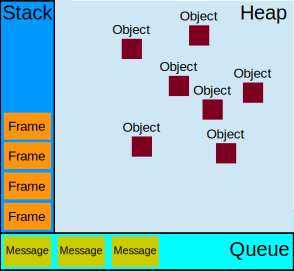
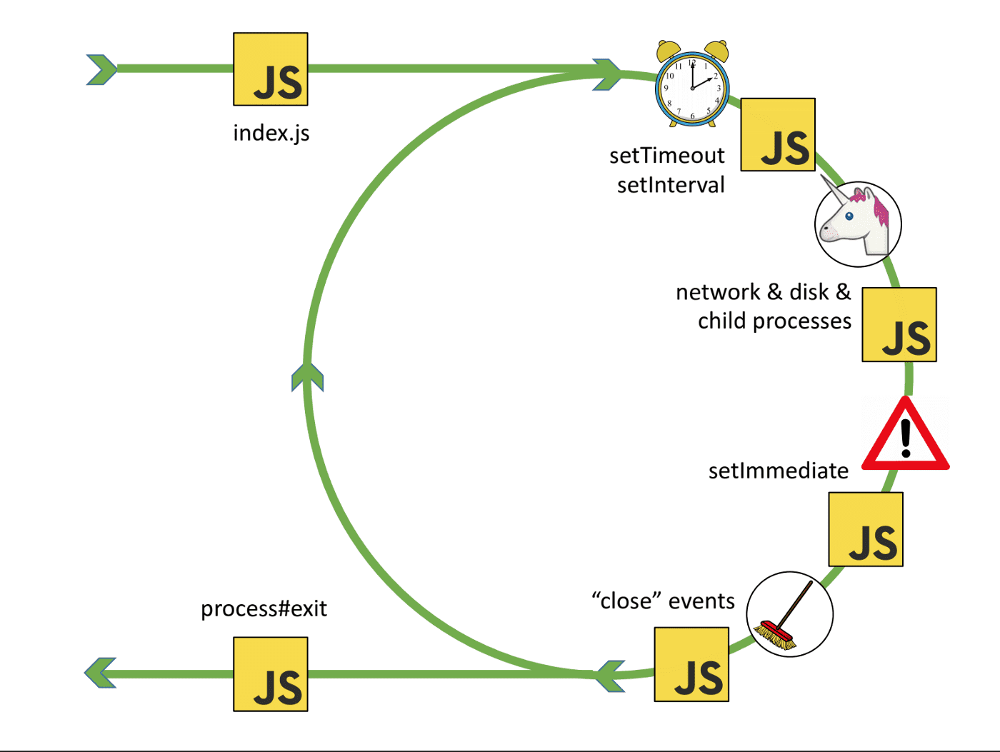

# Event Loop

JavaScript has a concurrency model based on an event loop

---

References

- [Concurrency model and the event loop - MDN Web Docs](https://developer.mozilla.org/en-US/docs/Web/JavaScript/EventLoop)
- [The Node.js Event Loop, Timers, and process.nextTick() - Node Docs](https://nodejs.org/en/docs/guides/event-loop-timers-and-nexttick/#what-is-the-event-loop)
- [Event Loop Cycle in Node.js - Medium](https://medium.com/@deedee8/event-loop-cycle-in-node-js-bc9dd0f2834f)

**JavaScript has a concurrency model based on an event loop**, which is responsible for executing the code, collecting and processing events, and executing queued sub-tasks.

_This model is quite different from models in other languages like C and Java._

## Runtime Concepts

The following sections explain a theoretical model.
Modern JavaScript engines implement and heavily optimize the described semantics.

### Visual representation**



### Stack

**Function calls form a stack of _frames_.**

```js
function foo(b) {
  let a = 10
  return a + b + 11
}

function bar(x) {
  let y = 3
  return foo(x * y)
}

const baz = bar(7) // assigns 42 to baz
```

Order of operations:

1. _When calling `bar`, a first frame is created containing references to `bar`'s arguments and local variables._
2. _When `bar` calls `foo`, a second frame is created and pushed on top of the first one, containing references to `foo`'s arguments and local variables._
3. _When `foo` returns, the top frame element is popped out of the stack (leaving only `bar`'s call frame)._
4. _When `bar` returns, the stack is empty._

Note that the arguments and local variables may continue to exist, as they are stored outside the stack — so they can be accessed by any [nested functions](https://developer.mozilla.org/en-US/docs/Web/JavaScript/Guide/Functions#nested_functions_and_closures) long after their outer function has returned.

### Heap

Objects are allocated in a heap which is just a name to denote a large ( mostly unstructured ) region of memory.

### Queue

**A JavaScript runtime uses a message queue, which is a list of messages to be processed.**
Each message has an associated function which gets called in order to handle the message.

**At some point during the event loop, the runtime starts handling the messages on the queue, starting with the oldest one.**
To do so, the message is removed from the queue and its corresponding function is called with the message as an input parameter.
As always, calling a function creates a new stack frame for that function's use.

**The processing of functions continues until the stack is once again empty.**
Then, the event loop will process the next message in the queue ( if there is one ).

## Event Loop

The **event loop** got its name because of how it's usually implemented, which usually resembles:

```js
while (queue.waitForMessage()) {
  queue.processNextMessage()
}
```

`queue.waitForMessage()` waits synchronously for a message to arrive ( if one is not already available and waiting to be handled ) .

### "Run-to-completion"

Each message is processed completely before any other message is processed.

This offers some nice properties when reasoning about<!-- 理解 --> your program, including the fact that **whenever a function runs, it cannot be pre-empted and will run entirely before any other code runs** ( and can modify data the function manipulates ) .

_This differs from C, for instance, where if a function runs in a thread, it may be stopped at any point by the runtime system to run some other code in another thread._

**A downside<!-- 负面 --> of this model is that if a message takes too long to complete, the web application is unable to process user interactions like click or scroll.**
The browser mitigates<!-- 使减轻 --> this with the "a script is taking too long to run" dialog.
A good practice to follow is to make message processing short and if possible cut down one message into several messages.

### Adding messages

In web browsers, messages are added anytime an event occurs and there is an event listener attached to it.
If there is no listener, the event is lost.
So a click on an element with a click event handler will add a message —— likewise with any other event.

The function `setTimeout` is called with 2 arguments: a message to add to the queue, and a time value (optional; defaults to 0).
The time value represents the (minimum) delay after which the message will actually be pushed into the queue.
If there is no other message in the queue, and the stack is empty, the message is processed right after the delay.
However, if there are messages, the `setTimeout` message will have to wait for other messages to be processed.
For this reason, the second argument indicates a minimum time —— not a guaranteed time.

_Here is an example that demonstrates this concept ( `setTimeout` does not run immediately after its timer expires ) :_

```js
const s = new Date().getSeconds();

setTimeout(function() {
  // prints out "2", meaning that the callback is not called immediately after 500 milliseconds.
  console.log("Ran after " + (new Date().getSeconds() - s) + " seconds");
}, 500)

while (true) {
  if (new Date().getSeconds() - s >= 2) {
    console.log("Good, looped for 2 seconds")
    break;
  }
}
```

### Zero delays

Zero delay doesn't actually mean the call back will fire-off after zero milliseconds.
Calling `setTimeout` with a delay of 0 (zero) milliseconds doesn't execute the callback function after the given interval.

**The execution depends on the number of waiting tasks in the queue.**
In the example below, the message `'this is just a message'` will be written to the console before the message in the callback gets processed, because the delay is the minimum time required for the runtime to process the request ( not a guaranteed time ) .

**Basically, the `setTimeout` needs to wait for all the code for queued messages to complete** even though you specified a particular time limit for your `setTimeout`.

```js
(function() {

  console.log('this is the start');

  setTimeout(function cb() {
    console.log('Callback 1: this is a msg from call back');
  }); // has a default time value of 0

  console.log('this is just a message');

  setTimeout(function cb1() {
    console.log('Callback 2: this is a msg from call back');
  }, 0);

  console.log('this is the end');

})();

// "this is the start"
// "this is just a message"
// "this is the end"
// "Callback 1: this is a msg from call back"
// "Callback 2: this is a msg from call back"
```

### Several runtimes communicating together

A web worker or a cross-origin `iframe` has its own stack, heap, and message queue.
**Two distinct runtimes can only communicate through sending messages via the [`postMessage`](https://developer.mozilla.org/en-US/docs/Web/API/Window/postMessage) method.**
This method adds a message to the other runtime if the latter listens to message events.

## Never blocking

A very interesting **property of the event loop model is that JavaScript, unlike a lot of other languages, <u>never blocks</u>**.
Handling I/O is typically performed via events and callbacks, so when the application is waiting for an [IndexedDB](https://developer.mozilla.org/en-US/docs/Web/API/IndexedDB_API) query to return or an [XHR](https://developer.mozilla.org/en-US/docs/Web/API/XMLHttpRequest) request to return, it can still process other things like user input.

_Legacy exceptions exist like `alert` or synchronous XHR, but it is considered a good practice to avoid them._
Beware: [exceptions to the exception do exist](https://stackoverflow.com/questions/2734025/is-javascript-guaranteed-to-be-single-threaded/2734311#2734311) ( but are usually implementation bugs, rather than anything else ) .

_icehe : 最后这一段没看懂, 以后再回顾 2021/11/17_

## Node.js Event Loop

References

- [The Node.js Event Loop, Timers, and process.nextTick() - Node Docs](https://nodejs.org/en/docs/guides/event-loop-timers-and-nexttick/#what-is-the-event-loop)

### What is?

The event loop is what **allows Node.js to perform non-blocking I/O operations**
—— **despite the fact that JavaScript is single-threaded**
—— **by offloading operations to the system kernel whenever possible**.

Since most modern kernels are multi-threaded, they can handle multiple operations executing in the background.
When one of these operations completes, the kernel tells Node.js so that the **appropriate callback may be added to the poll queue to eventually be executed**.

### Explained

When Node.js starts, it initializes the event loop, processes the provided input script (or drops into the REPL, which is not covered in this document) which may make async API calls, schedule timers, or call `process.nextTick()`, then begins processing the event loop.

The following diagram shows a simplified overview of the event loop's order of operations.

```txt
   ┌───────────────────────────┐
┌─>│           timers          │
│  └─────────────┬─────────────┘
│  ┌─────────────┴─────────────┐
│  │     pending callbacks     │
│  └─────────────┬─────────────┘
│  ┌─────────────┴─────────────┐
│  │       idle, prepare       │
│  └─────────────┬─────────────┘      ┌───────────────┐
│  ┌─────────────┴─────────────┐      │   incoming:   │
│  │           poll            │<─────┤  connections, │
│  └─────────────┬─────────────┘      │   data, etc.  │
│  ┌─────────────┴─────────────┐      └───────────────┘
│  │           check           │
│  └─────────────┬─────────────┘
│  ┌─────────────┴─────────────┐
└──┤      close callbacks      │
   └───────────────────────────┘
```

> Each box will be referred to as a "phase" of the event loop.

**Each phase has a FIFO queue of callbacks to execute.**
While each phase is special in its own way, generally, **when the event loop enters a given phase, it will perform any operations specific to that phase, then execute callbacks in that phase's queue until the queue has been exhausted or the maximum number of callbacks has executed**.
**When the queue has been exhausted or the callback limit is reached, the event loop will move to the next phase, and so on**.

Since any of these operations may schedule more operations and new events processed in the **poll** phase are queued by the kernel, poll events can be queued while polling events are being processed.
As a result, long running callbacks can allow the poll phase to run much longer than a timer's threshold.

_icehe : 上面这段话要表达什么, 暂时没看懂 2021/11/18_

……

### Phases Overview

-   **timers** : executes callbacks scheduled by **`setTimeout()`** and **`setInterval()`**.
-   **pending callbacks** : executes **I/O callbacks deferred to the next loop iteration**.
-   _**idle**, **prepare** : only used internally._
-   **poll** : retrieve **new I/O events**;
    execute **I/O related callbacks** ( almost all with the exception of close callbacks, the ones scheduled by timers, and `setImmediate()` ) ;
    node will block here when appropriate.
-   **check** : **`setImmediate()`** callbacks are invoked here.
-   **close callbacks**: some close callbacks, _e.g. `socket.on('close', …)`._



### Phases in Detail

#### timers

**A timer specifies the <u>threshold</u> after which a provided callback may be executed rather than the <u>exact</u> time a person wants it to be executed.**
**Timers callbacks will run as early as they can be scheduled after the specified amount of time has passed**; however, Operating System scheduling or the running of other callbacks may delay them.

> Technically, the **poll** phase controls when timers are executed.

_For example, say you schedule a timeout to execute after a 100 ms threshold, then your script starts asynchronously reading a file which takes 95 ms :_

```js
const fs = require('fs');

function someAsyncOperation(callback) {
  // Assume this takes 95ms to complete
  fs.readFile('/path/to/file', callback);
}

const timeoutScheduled = Date.now();

setTimeout(() => {
  const delay = Date.now() - timeoutScheduled;

  console.log(`${delay}ms have passed since I was scheduled`);
}, 100);

// do someAsyncOperation which takes 95 ms to complete
someAsyncOperation(() => {
  const startCallback = Date.now();

  // do something that will take 10ms...
  while (Date.now() - startCallback < 10) {
    // do nothing
  }
});
```

When the event loop enters the poll phase, it has an empty queue ( `fs.readFile()` has not completed ) , so it will wait for the number of ms remaining until the soonest timer's threshold is reached.
While it is waiting 95 ms pass, `fs.readFile()` finishes reading the file and its callback which takes 10 ms to complete is added to the **poll** queue and executed.
When the callback finishes, there are no more callbacks in the queue, so the event loop will see that the threshold of the soonest timer has been reached then wrap back to the **timers** phase to execute the timer's callback.
In this example, you will see that the total delay between the timer being scheduled and its callback being executed will be 105ms.

> To prevent the **poll** phase from starving the event loop, [libuv](https://libuv.org/) ( the C library that implements the Node.js event loop and all of the asynchronous behaviors of the platform ) also has a hard maximum ( system dependent ) before it stops polling for more events.

#### pending callbacks

This phase **executes callbacks for some system operations such as types of TCP errors**.

For example if a TCP socket receives `ECONNREFUSED` when attempting to connect, some \*nix systems want to wait to report the error.
This will be queued to execute in the **pending callbacks** phase.

#### poll

The poll phase has two main functions:

1. **Calculating how long it should block and poll for I/O**, then
2. **Processing events in the poll queue**.

When the event loop enters the poll phase and there are no timers scheduled, one of two things will happen :

-   If the **poll** **queue** is **not empty**, the event loop will **iterate through its queue of callbacks executing them synchronously until either the queue has been exhausted, or the system-dependent hard limit is reached**.

-   If the poll queue is **empty**, one of two more things will happen:

    -   If scripts have been scheduled by `setImmediate()`, the event loop will end the **poll** phase and continue to the **check** phase to execute those scheduled scripts.

    -   If scripts **have not** been scheduled by `setImmediate()`, the event loop will wait for callbacks to be added to the queue, then execute them immediately.

Once the **poll** queue is empty the event loop will check for timers whose time thresholds have been reached.
If one or more timers are ready, the event loop will wrap back to<!-- 绕回 --> the **timers** phase to execute those timers' callbacks.

#### check

This phase **allows a person to execute callbacks immediately after the <u>poll</u> phase has completed**.
If the **poll** phase becomes idle and scripts have been queued with `setImmediate()`, the event loop may continue to the **check** phase rather than waiting.

**`setImmediate()` is actually a special timer that runs in a separate phase of the event loop.**
It uses a libuv API that schedules callbacks to execute after the **poll** phase has completed.

Generally, as the code is executed, the event loop will eventually hit the **poll** phase where it will wait for an incoming connection, request, etc.
However, if a callback has been scheduled with `setImmediate()` and the **poll** phase becomes idle, it will end and continue to the **check** phase rather than waiting for **poll** events.

#### close callbacks

If a socket or handle is closed abruptly (e.g. `socket.destroy()`), the `'close'` event will be emitted in this phase.
Otherwise it will be emitted via `process.nextTick()`.

### setImmediate() vs setTimeout()

`setImmediate()` and `setTimeout()` are similar, but behave in different ways depending on when they are called.

- **`setImmediate()` is designed to execute a script once the current <u>poll</u> phase completes**.
- **`setTimeout()` schedules a script to be run after a minimum threshold in ms has elapsed**.

The order in which the timers are executed will vary depending on the context in which they are called.
If both are called from within the main module, then timing will be bound by the performance of the process ( which can be impacted by other applications running on the machine ) .

_For example, if we run the following script which is not within an I/O cycle ( i.e. the main module ) , the order in which the two timers are executed is non-deterministic, as it is bound by the performance of the process :_

```js
// timeout_vs_immediate.js
setTimeout(() => {
  console.log('timeout');
}, 0);

setImmediate(() => {
  console.log('immediate');
});
```

```bash
$ node timeout_vs_immediate.js
timeout
immediate

$ node timeout_vs_immediate.js
immediate
timeout
```

_However, if you move the two calls within an I/O cycle, the immediate callback is always executed first :_

```js
// timeout_vs_immediate.js
const fs = require('fs');

fs.readFile(__filename, () => {
  setTimeout(() => {
    console.log('timeout');
  }, 0);
  setImmediate(() => {
    console.log('immediate');
  });
});
```

```bash
$ node timeout_vs_immediate.js
immediate
timeout

$ node timeout_vs_immediate.js
immediate
timeout
```

The main advantage to using `setImmediate()` over `setTimeout()` is `setImmediate()` will always be executed before any timers if scheduled within an I/O cycle, independently of how many timers are present.

### process.nextTick()

#### Understanding process.nextTick()

You may have noticed that `process.nextTick()` was not displayed in the diagram, even though **it's a part of the asynchronous API**.
This is because **`process.nextTick()` is not technically part of the event loop**.
Instead, the nextTickQueue will be processed after the current operation is completed, regardless of the current phase of the event loop.
Here, an operation is defined as a transition from the underlying C/C++ handler, and handling the JavaScript that needs to be executed.

Looking back at our diagram, **any time you call `process.nextTick()` in a given phase, all callbacks passed to `process.nextTick()` will be resolved before the event loop continues**.
This can create some bad situations because **it allows you to "starve"<!-- (使)挨饿 --> your I/O by making recursive `process.nextTick()` calls**, which prevents the event loop from reaching the **poll** phase.

#### Why would that be allowed?

Why would something like this be included in Node.js?
Part of it is **a design philosophy where an API should always be asynchronous even where it doesn't have to be**.
_Take this code snippet for example :_

```js
function apiCall(arg, callback) {
  if (typeof arg !== 'string')
    return process.nextTick(callback, new TypeError('argument should be string'));
}
```

The snippet does an argument check and if it's not correct, it will pass the error to the callback.
The API updated fairly recently to allow passing arguments to `process.nextTick()` allowing it to take any arguments passed after the callback to be propagated as the arguments to the callback so you don't have to nest functions.

What we're doing is passing an error back to the user but only after we have allowed the rest of the user's code to execute.
**By using `process.nextTick()` we guarantee that `apiCall()` always runs its callback after the rest of the user's code and before the event loop is allowed to proceed.**
To achieve this, the JS call stack is allowed to unwind then immediately execute the provided callback which allows a person to make recursive calls to `process.nextTick()` without reaching a `RangeError: Maximum call stack size exceeded from v8`.

This philosophy can lead to some potentially problematic situations.
_Take this snippet for example:_

```js
let bar;

// this has an asynchronous signature, but calls callback synchronously
function someAsyncApiCall(callback) { callback(); }

// the callback is called before `someAsyncApiCall` completes.
someAsyncApiCall(() => {
  // since someAsyncApiCall hasn't completed, bar hasn't been assigned any value
  console.log('bar', bar); // undefined
});

bar = 1;
```

The user defines `someAsyncApiCall()` to have an asynchronous signature, but it actually operates synchronously.
When it is called, the callback provided to `someAsyncApiCall()` is called in the same phase of the event loop because `someAsyncApiCall()` doesn't actually do anything asynchronously.
As a result, the callback tries to reference bar even though it may not have that variable in scope yet, because the script has not been able to run to completion.

By placing the callback in a `process.nextTick()`, the script still has the ability to run to completion, allowing all the variables, functions, etc., to be initialized prior to the callback being called.
It also has the advantage of not allowing the event loop to continue.
It may be useful for the user to be alerted to an error before the event loop is allowed to continue.
Here is the previous example using `process.nextTick()` :

```js
let bar;

function someAsyncApiCall(callback) {
  process.nextTick(callback);
}

someAsyncApiCall(() => {
  console.log('bar', bar); // 1
});

bar = 1;
```

_Here's another real world example:_

```js
const server = net.createServer(() => {}).listen(8080);

server.on('listening', () => {});
```

When only a port is passed, the port is bound immediately.
So, the `'listening'` callback could be called immediately.
The problem is that the `.on('listening')` callback will not have been set by that time.

To get around this, the `'listening'` event is queued in a `nextTick()` to allow the script to run to completion.
This allows the user to set any event handlers they want.

#### process.nextTick() vs setImmediate()

We have two calls that are similar as far as users are concerned, but their names are confusing.

- `process.nextTick()` fires immediately on the same phase
- `setImmediate()` fires on the following iteration or 'tick' of the event loop

In essence, the names should be swapped.
**`process.nextTick()` fires more immediately than setImmediate()**, but this is an artifact of the past which is unlikely to change.
Making this switch would break a large percentage of the packages on npm.
Every day more new modules are being added, which means every day we wait, more potential breakages occur.
While they are confusing, the names themselves won't change.

> We recommend developers use `setImmediate()` in all cases because it's easier to reason about.

#### Why use process.nextTick()?

_There are two main reasons :_

1. Allow users to handle errors, cleanup any then unneeded resources, or perhaps try the request again before the event loop continues.
2. At times it's necessary to allow a callback to run after the call stack has unwound but before the event loop continues.

_One example is to match the user's expectations. Simple example:_

```js
const server = net.createServer();
server.on('connection', (conn) => { });

server.listen(8080);
server.on('listening', () => { });
```

Say that `listen()` is run at the beginning of the event loop, but the listening callback is placed in a `setImmediate()`.
Unless a hostname is passed, binding to the port will happen immediately.
For the event loop to proceed, it must hit the poll phase, which means there is a non-zero chance that a connection could have been received allowing the connection event to be fired before the listening event.

Another example is running a function constructor that was to, say, inherit from EventEmitter and it wanted to call an event within the constructor:

```js
const EventEmitter = require('events');
const util = require('util');

function MyEmitter() {
  EventEmitter.call(this);
  this.emit('event');
}
util.inherits(MyEmitter, EventEmitter);

const myEmitter = new MyEmitter();
myEmitter.on('event', () => {
  console.log('an event occurred!');
});
```

You can't emit an event from the constructor immediately because the script will not have processed to the point where the user assigns a callback to that event.
So, within the constructor itself, you can use `process.nextTick()` to set a callback to emit the event after the constructor has finished, which provides the expected results:

```js
const EventEmitter = require('events');
const util = require('util');

function MyEmitter() {
  EventEmitter.call(this);

  // use nextTick to emit the event once a handler is assigned
  process.nextTick(() => {
    this.emit('event');
  });
}
util.inherits(MyEmitter, EventEmitter);

const myEmitter = new MyEmitter();
myEmitter.on('event', () => {
  console.log('an event occurred!');
});
```

_icehe : 要想明白 `process.nextTick()` 的使用场景 & 用法, 要理解清楚代码的执行顺序! 所以很有必要仔细看懂各个例子._

## More Understanding

References

- [Event Loop Cycle in Node.js - Medium](https://medium.com/@deedee8/event-loop-cycle-in-node-js-bc9dd0f2834f)

### Event Driven Model

Node uses an event-driven model and this is all handled by a library called _libuv_ which provides a mechanism called an event loop. ……

> In computer programming, event-driven programming ( event model ) is a programming paradigm in which the flow of the program is determined by events such as user actions ( mouse clicks, key presses ) , sensor outputs, or messages from other programs or threads.

In other systems there is always a blocking call to start the event-loop.
Typically behaviour is defined through callbacks at the beginning of a script and at the end starts a server through a blocking call like `EventMachine.run()` in Ruby and `reactor.run()` in Python.

Node there is no such start-the-event-loop call.

- **Node simply enters the event loop after executing the input script.**
- **Node exits the event loop when there are no more callbacks to perform.**

This behaviour is like browser JavaScript —— the event loop is hidden from the user.

### What is Event Loop again

The event loop is what allows Node.js to **perform non-blocking I/O operations —— despite the fact that JavaScript is single-threaded —— by offloading operations to the system kernel whenever possible**.

Since most modern kernels are multi-threaded, they can handle multiple operations executing in the background.
When one of these operations completes, the kernel tells Node.js so that the appropriate callback may be added to the poll queue to eventually be executed.

### Misconceptions vs Reality

Present few misconceptions to avoid confusion.

1.  There is a main thread where the JavaScript code of the user runs in and another one that runs the event loop.

    -   **Misconception** :

        Every time we have an asynchronous operation, the main thread will hand over the work to the event loop thread and once it is done, the event loop thread will ping the main thread to execute a callback.

    -   **Reality** :

        **There is only one thread that executes JavaScript code and this is the thread where the event loop is running.**
        The execution of callbacks is done by the event loop.

2.  Everything that's asynchronous is handled by a thread pool.

    -   **Misconception** :

        Asynchronous operations, like working with the filesystems, doing outbound HTTP requests or talking to databases are always loaded off to a thread pool provided by libuv.

    -   **Reality** :

        **Libuv by default creates a thread pool with four threads to offload asynchronous work to.**
        **These threads are only used in special cases when there is no other way because modern OS (operating systems) and other systems, such as databases, already provide asynchronous interfaces**, so the engine will try to use them and if there is no async alternative, it will resort to the thread pool.

3.  The event loop is something like a stack or queue.

    -   **Misconception** :

        The event loop continuously traverses a FIFO (first-in, first-out) of asynchronous tasks and executes the callback when a task is completed.

    -   **Reality** :

        **While there are queue-like structures involved, the event loop does not run through and process a stack.**
        **The event loop as a process is a set of phases with specific tasks that are processed in an invocation manner.**
