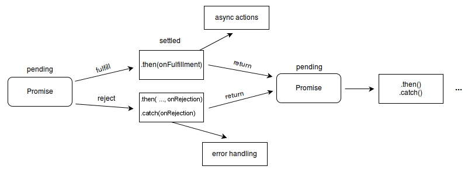

# Promise

The `Promise` object represents the eventual completion (or failure) of an asynchronous operation and its resulting value.

---

References

- [Promise - MDN Web Docs](https://developer.mozilla.org/en-US/docs/Web/JavaScript/Reference/Global_Objects/Promise)
- [Using Promises - MDN Web Docs](https://developer.mozilla.org/en-US/docs/Web/JavaScript/Guide/Using_promises)
- [An Introduction to Understanding Javascript Promises - Medium](https://medium.com/@PangaraWorld/an-introduction-to-understanding-javascript-promises-37eff85b2b08)

## Description

### Basics

**A `Promise` is a proxy for a value not necessarily known when the promise is created.**
It allows you to **associate handlers with an asynchronous action's eventual success value or failure reason**

_This lets asynchronous methods return values like synchronous methods:_
instead of immediately returning the final value, the asynchronous method returns a promise to supply the value at some point in the future.

A Promise is in one of these states:

- `unsettled`
    - **`pending`**: **initial state**, neither fulfilled nor rejected.
- `settled`
    - **`fulfilled`**: meaning that the operation was **completed successfully**.
    - **`rejected`**: meaning that the operation **failed**.

**A pending promise can either be _fulfilled_ with a value or _rejected_ with a reason (error).**
**When either of these options happens, the associated handlers queued up by a promise's then method are called.**

If the promise has already been fulfilled or rejected when a corresponding handler is attached, the handler will be called, so there is no race condition between an asynchronous operation completing and its handlers being attached.

_As the `Promise.prototype.then()` and `Promise.prototype.catch()` methods return promises, they can be chained._



> Note: _Several other languages have mechanisms for lazy evaluation and deferring a computation, which they also call "promises", e.g. Scheme ( and Future in Java ) ._
>
> **Promises in JavaScript represent processes that are already happening, which can be chained with callback functions.**
>
> If you are looking to lazily evaluate an expression, consider using a function with no arguments e.g. `f = () => expression` to create the lazily-evaluated expression, and `f()` to evaluate the expression immediately.

---

Note:

**A promise is said to be `settled` if it is either `fulfilled` or `rejected`, but not `pending` _( `unsettled`? )_ .**

You will also hear **the term `resolved` used with promises — this means that the promise is `settled` or `"locked-in"` to match the state of another promise.**
[States and fates](https://github.com/domenic/promises-unwrapping/blob/master/docs/states-and-fates.md) contain more details about promise terminology.

<!-- icehe: resolved 和 unresolved 概念没搞懂. -->

### Chained Promises

The methods

- `promise.then()`
- `promise.catch()`
- `promise.finally()`

are used to associate further action with a promise that becomes settled.

---

The `.then()` method takes up to two arguments;

- the **first** argument is a **callback** function for the **resolved** case of the promise, and
- the **second** argument is a **callback** function for the **rejected** case.

**Each `.then()` returns a newly generated promise object**, which can optionally be used for chaining; for example:

```js
const myPromise = new Promise((resolve, reject) => {
  setTimeout(() => {
    resolve('foo');
  }, 300);
});

myPromise
  .then(handleResolvedA, handleRejectedA)
  .then(handleResolvedB, handleRejectedB)
  .then(handleResolvedC, handleRejectedC);
```

Processing continues to the next link of the chain even when a `.then()` lacks a callback function that returns a Promise object.
Therefore, **a chain can safely omit every rejection callback function until the final `.catch()` .**

Handling a rejected promise in each `.then()` has consequences further down the promise chain.
Sometimes there is no choice, because an error must be handled immediately.
In such cases we must throw an error of some type to maintain error state down the chain.
On the other hand, in the absence of an immediate need, it is simpler to leave out error handling until a final `.catch()` statement.

A **`.catch()` is really just a `.then()` without a slot for a callback function for the case when the promise is resolved.**

```js
myPromise
    .then(handleResolvedA)
    .then(handleResolvedB)
    .then(handleResolvedC)
    .catch(handleRejectedAny);
```

……

**The termination condition of a promise determines the "settled" state of the next promise in the chain.**

A "resolved" state indicates a successful completion of the promise, while a "rejected" state indicates a lack of success.

**The return value of each resolved promise in the chain is passed along to the next `.then()`, while the reason for rejection is passed along to the next rejection-handler function in the chain.**

_The promises of a chain are nested like Russian dolls, but get popped like the top of a stack._
_The first promise in the chain is most deeply nested and is the first to pop._

```js
(promise D, (promise C, (promise B, (promise A))))
```

……

**A promise can participate in more than one nesting.**

_For the following code, the transition of `promiseA` into a "settled" state will cause both instances of `.then()` to be invoked._

```js
const promiseA = new Promise(myExecutorFunc);
const promiseB = promiseA.then(handleFulfilled1, handleRejected1);
const promiseC = promiseA.then(handleFulfilled2, handleRejected2);
```

**An action can be assigned to an <u>already "settled"</u> promise.**

In that case, the action ( if appropriate ) will be performed at the first asynchronous opportunity.
Note that promises are guaranteed to be asynchronous.
Therefore, an action for an already "settled" promise will occur only after the stack has cleared and a clock-tick has passed.
The effect is much like that of `setTimeout(action, 10)`.

<!--

#### _Incumbent settings object tracking_

A settings object is an [environment](https://html.spec.whatwg.org/multipage/webappapis.html#environment-settings-object) that provides additional information when JavaScript code is running.
This includes the **realm** and module map, as well as HTML specific information such as the origin.
The incumbent _( 在职的 )_ settings object is tracked in order to ensure that the browser knows which one to use for a given piece of user code.

To better picture this, we can take a closer look at how the **realm** might be an issue.
**A realm can be roughly thought of as the global object.**
What is unique about realms is that they **hold all of the necessary information to run JavaScript code**.
This includes objects like Array and Error.
Each settings object has its own "copy" of these and they are not shared.
That can cause some unexpected behavior in relation to promises.
In order to get around this, we track something called the incumbent settings object.
This represents information specific to the context of the user code responsible for a certain function call.

To illustrate this a bit further we can take a look at how an [\<iframe\>](https://developer.mozilla.org/en-US/docs/Web/HTML/Element/iframe) embedded in a document communicates with its host.
Since all web APIs are aware of the incumbent settings object, the following will work in all browsers:

_( icehe : 暂时理解不了这一小节的内容, 所以暂时隐藏掉 2021/11/16)_

-->

## Constructor

### Static methods

-   [`Promise.all(iterable)`](https://developer.mozilla.org/en-US/docs/Web/JavaScript/Reference/Global_Objects/Promise/all)

    Wait for all promises to be resolved, or for any to be rejected.

    If the returned promise resolves, it is resolved with an aggregating array of the values from the resolved promises, in the same order as defined in the iterable of multiple promises.

    If it rejects, it is rejected with the reason from the first promise in the iterable that was rejected.

    _icehe : 对比 `allSettled()`, `all()` 只要有其中一个 promise rejected, 就会中止并返回._

-   [`Promise.allSettled(iterable)`](https://developer.mozilla.org/en-US/docs/Web/JavaScript/Reference/Global_Objects/Promise/allSettled)

    Wait until all promises have settled (each may resolve or reject).

    Returns a Promise that resolves after all of the given promises is either fulfilled or rejected, with an array of objects that each describe the outcome of each promise.

    _icehe : 对比 `all()`, `allSettled()` 要等到所有 promise 都 fullfilled 或 rejected 之后, 才会返回._

-   [`Promise.any(iterable)`](https://developer.mozilla.org/en-US/docs/Web/JavaScript/Reference/Global_Objects/Promise/any)

    Takes an iterable of Promise objects and, as soon as one of the promises in the iterable fulfills, returns a single promise that resolves with the value from that promise.

    _icehe : 对比 `race()`, `anay()` 只要有其中一个 promise fullfilled, 就会中止并返回._

-   [`Promise.race(iterable)`](https://developer.mozilla.org/en-US/docs/Web/JavaScript/Reference/Global_Objects/Promise/reject)

    Wait until any of the promises is fulfilled or rejected.

    If the returned promise resolves, it is resolved with the value of the first promise in the iterable that resolved.

    If it rejects, it is rejected with the reason from the first promise that was rejected.

    _icehe : 对比 `any()`, `race()` 要等到所有 promise 都 fullfilled 或 rejected 之后, 才会返回._

-   [`Promise.reject(reason)`](https://developer.mozilla.org/en-US/docs/Web/JavaScript/Reference/Global_Objects/Promise/reject)

    Returns a new Promise object that is rejected with the given reason.

-   [`Promise.resolve(value)`](https://developer.mozilla.org/en-US/docs/Web/JavaScript/Reference/Global_Objects/Promise/resolve)

    Returns a new Promise object that is resolved with the given value.
    If the value is a thenable (i.e. has a then method), the returned promise will "follow" that thenable, adopting its eventual state;
    otherwise, the returned promise will be fulfilled with the value.

    Generally, if you don't know if a value is a promise or not, `Promise.resolve(value)` it instead and work with the return value as a promise.

### Instance methods

_See the [Microtask guide](https://developer.mozilla.org/en-US/docs/Web/API/HTML_DOM_API/Microtask_guide) to learn more about how these methods use the Microtask queue and services._

-   [`Promise.prototype.catch()`](https://developer.mozilla.org/en-US/docs/Web/JavaScript/Reference/Global_Objects/Promise/catch)

    Appends a rejection handler callback to the promise, and returns a new promise resolving to the return value of the callback if it is called, or to its original fulfillment value if the promise is instead fulfilled.

-   [`Promise.prototype.then()`](https://developer.mozilla.org/en-US/docs/Web/JavaScript/Reference/Global_Objects/Promise/then)

    Appends fulfillment and rejection handlers to the promise, and returns a new promise resolving to the return value of the called handler, or to its original settled value if the promise was not handled (i.e. if the relevant handler onFulfilled or onRejected is not a function).

-   [`Promise.prototype.finally()`](https://developer.mozilla.org/en-US/docs/Web/JavaScript/Reference/Global_Objects/Promise/finally)

    Appends a handler to the promise, and returns a new promise that is resolved when the original promise is resolved. The handler is called when the promise is settled, whether fulfilled or rejected.

## Using Promise

### Guarantees

_Unlike old-fashioned passed-in callbacks, a promise comes with some guarantees:_

-   Callbacks added with `then()` will **never be invoked before the completion of the current run of the JavaScript event loop**.
-   These callbacks will **be invoked even if they were added after the success or failure of the asynchronous operation** that the promise represents.
-   Multiple callbacks may be added by calling `then()` several times.
    They will **be invoked one after another, in the order in which they were inserted**.

_One of the great things about using promises is chaining._

### Chaining

See [Chained Promises](#chained-promises) above.

……

#### Comparison

In the old days, doing several asynchronous operations in a row would lead to the classic callback pyramid of doom:

```js
doSomething(function(result) {
  doSomethingElse(result, function(newResult) {
    doThirdThing(newResult, function(finalResult) {
      console.log('Got the final result: ' + finalResult);
    }, failureCallback);
  }, failureCallback);
}, failureCallback);
```

With modern functions, we attach our callbacks to the returned promises instead, forming a promise chain:

```js
doSomething()
.then(function(result) {
  return doSomethingElse(result);
})
.then(function(newResult) {
  return doThirdThing(newResult);
})
.then(function(finalResult) {
  console.log('Got the final result: ' + finalResult);
})
.catch(failureCallback);
```

The arguments to then are optional, and **`catch(failureCallback)` is short for `then(null, failureCallback)`**.

……

#### Chaining after a catch

It's possible to **chain after a failure, i.e. a `catch`**, which is useful to **accomplish new actions even after an action failed in the chain**.

```js
new Promise((resolve, reject) => {
    console.log('Initial');
    resolve();
})
.then(() => {
    throw new Error('Something failed');
    console.log('Do this');
})
.catch(() => {
    console.error('Do that');
})
.then(() => {
    console.log('Do this, no matter what happened before');
});
```

_Output:_

```bash
Initial
Do that
Do this, no matter what happened before
```

### Error propagation

```js
doSomething()
  .then(result => doSomethingElse(result))
  .then(newResult => doThirdThing(newResult))
  .then(finalResult => console.log(`Got the final result: ${finalResult}`))
  .catch(failureCallback);
```

Just like above _( but not the same, here are synchronized operations )_

```js
try {
  const result = syncDoSomething();
  const newResult = syncDoSomethingElse(result);
  const finalResult = syncDoThirdThing(newResult);
  console.log(`Got the final result: ${finalResult}`);
} catch(error) {
  failureCallback(error);
}
```

This symmetry with asynchronous code culminates in the `async`/`await` _syntactic sugar in ECMAScript 2017_ :

```js
async function foo() {
  try {
    const result = await doSomething();
    const newResult = await doSomethingElse(result);
    const finalResult = await doThirdThing(newResult);
    console.log(`Got the final result: ${finalResult}`);
  } catch(error) {
    failureCallback(error);
  }
}
```

### Promise rejection events

Whenever a promise is rejected, one of two events is sent to the global scope
( generally, this is either the [`window`](https://developer.mozilla.org/en-US/docs/Web/API/Window) or, if being used in a web [`worker`](https://developer.mozilla.org/en-US/docs/Web/API/Worker), it's the Worker or other worker-based interface ).

_The two events are:_

-   [`rejectionhandled`](https://developer.mozilla.org/en-US/docs/Web/API/Window/rejectionhandled_event)

    Sent when a promise is rejected, after that rejection has been handled by the executor's reject function.

-   [`unhandledrejection`](https://developer.mozilla.org/en-US/docs/Web/API/Window/unhandledrejection_event)

    Sent when a promise is rejected but there is no rejection handler available.

In both cases, the event (of type [`PromiseRejectionEvent`](https://developer.mozilla.org/en-US/docs/Web/API/PromiseRejectionEvent)) has as members a promise property indicating the `promise` that was rejected, and a [`reason`](https://developer.mozilla.org/en-US/docs/Web/API/PromiseRejectionEvent/reason) property that provides the reason given for the promise to be rejected.

These make it possible to offer fallback error handling for promises, as well as to help debug issues with your promise management.
These handlers are global per context, so all errors will go to the same event handlers, regardless of source.

One case of special usefulness: when writing code for Node.js, it's common that modules you include in your project may have unhandled rejected promises, logged to the console by the Node.js runtime.
You can capture them for analysis and handling by your code —— or just to avoid having them cluttering up your output —— by adding a handler for the Node.js `unhandledRejection` event (notice the difference in capitalization of the name), like this:

```js
process.on("unhandledRejection", (reason, promise) => {
  /* You might start here by adding code to examine the
   * "promise" and "reason" values. */
});
```

_For Node.js, to prevent the error from being logged to the console ( the default action that would otherwise occur ) , adding that `process.on()` listener is all that's necessary;_
_there's no need for an equivalent of the browser runtime's `preventDefault()` method._

_However, if you add that `process.on` listener but don't also have code within it to handle rejected promises, they will just be dropped on the floor and silently ignored._
_So ideally, you should add code within that listener to examine each rejected promise and make sure it was not caused by an actual code bug._

### Composition

……

### Timing

To avoid surprises, functions passed to `then()` will never be called synchronously, even with an already-resolved promise:

```js
Promise.resolve().then(() => console.log(2));
console.log(1); // 1, 2
```

**Instead of running immediately, the passed-in function is put on a microtask queue**, which means **it runs later ( only after the function which created it exits, and when the JavaScript execution stack is empty )** , just **before control is returned to the event loop**;
i.e. pretty soon:

```js
const wait = ms => new Promise(resolve => setTimeout(resolve, ms));

wait(0).then(() => console.log(4));
Promise.resolve().then(() => console.log(2)).then(() => console.log(3));
console.log(1); // 1, 2, 3, 4
```

_icehe : 以上执行顺序优先级的简短总结_

1. sync code
2. then( plain code )
3. then( event loop code )

#### Task queues vs microtasks

**_Promise_ callbacks are handled as a _[Microtask](https://developer.mozilla.org/en-US/docs/Web/API/HTML_DOM_API/Microtask_guide)_ whereas _[setTimeout()](https://developer.mozilla.org/en-US/docs/Web/API/setTimeout)_ callbacks are handled as _Task queues_.**

```js
const promise = new Promise(function(resolve, reject) {
  console.log("Promise callback");
  resolve();
}).then(function(result) {
  console.log("Promise callback (.then)");
});

setTimeout(function() {
  console.log("event-loop cycle: Promise (fulfilled)", promise)
}, 0);

console.log("Promise (pending)", promise);
```

_The code above will output:_

```js
Promise callback
Promise (pending) Promise {<pending>}
Promise callback (.then)
event-loop cycle: Promise (fulfilled) Promise {<fulfilled>}
```

_icehe : 暂时还理解不了, 以后回顾一下. 2021/11/17_

_For more details, refer to [Tasks vs microtasks](https://developer.mozilla.org/en-US/docs/Web/API/HTML_DOM_API/Microtask_guide/In_depth#tasks_vs_microtasks)._
