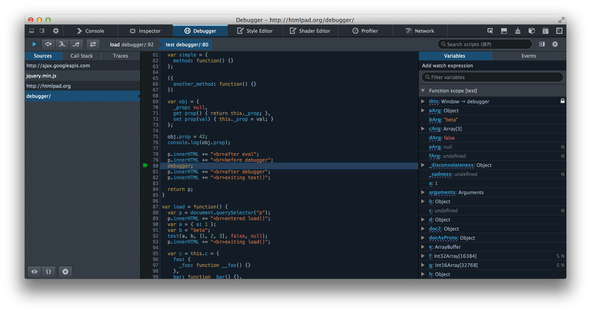

# debugger

`debugger` statement invokes any available debugging functionality, such as setting a breakpoint.

---

References:

- [debugger - MDN Web Docs](https://developer.mozilla.org/en-US/docs/Web/JavaScript/Reference/Statements/debugger)

## Syntax

```js
debugger;
```

## Usage

_The following example shows_ **code where a debugger statement has been inserted, to invoke a debugger (if one exists) when the function is called**.

```js
function potentiallyBuggyCode() {
  debugger;
  // do potentially buggy stuff to examine, step through, etc.
}
```

When the debugger is invoked, **execution is paused at the debugger statement**.
It is like a breakpoint in the script source.


