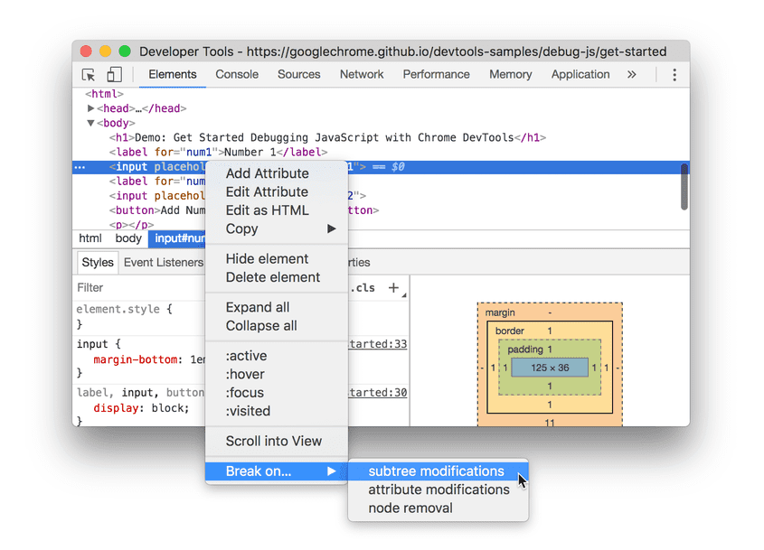

# debugger

`debugger` statement invokes any available debugging functionality, such as setting a breakpoint.

---

References:

- [debugger - MDN Web Docs](https://developer.mozilla.org/en-US/docs/Web/JavaScript/Reference/Statements/debugger)

## Syntax

```js
debugger;
```

## Usage

_The following example shows_ **code where a debugger statement has been inserted, to invoke a debugger (if one exists) when the function is called**.

```js
function potentiallyBuggyCode() {
  debugger;
  // do potentially buggy stuff to examine, step through, etc.
}
```

When the debugger is invoked, **execution is paused at the debugger statement**.
It is like a breakpoint in the script source.


# Pause code with breakpoints

Use breakpoints to pause your JavaScript code.

---

References

- [Pause your code with breakpoints - Chrome DevTools](https://developer.chrome.com/docs/devtools/javascript/breakpoints/)

## Breakpoint types

The most well-known type of breakpoint is line-of-code.

**But line-of-code breakpoints can be inefficient to set,**
**especially if you don't know exactly where to look,**
**or if you are working with a large codebase.**

You can save yourself time when debugging by knowing how and when to use the other types of breakpoints.

|Breakpoint Type|Use This When You Want To Pause…|
|-|-|
|Line-of-code|On an exact region of code.|
|Conditional line-of-code|On an exact region of code, but only when some other condition is true.|
|DOM|On the code that changes or removes a specific DOM node, or its children.|
|**XHR**|When an XHR URL contains a string pattern.|
|Event listener|On the code that runs after an event, such as click, is fired.|
|**Exception**|On the line of code that is throwing a caught or uncaught exception.|
|Function|Whenever a specific function is called.|

## Line-of-code

Ignored. ( I have already known. )

## DOM change



## XHR/Fetch


## Event listener


## Exception


or


## Function

**Call `debug(functionName)`, where functionName is the function you want to debug**,
when you want to pause whenever a specific function is called.

You can insert `debug()` into your code (like a `console.log()` statement) or call it from the DevTools Console.
`debug()` is equivalent to setting a line-of-code breakpoint on the first line of the function.

```js
function sum(a, b) {
  let result = a + b; // DevTools pauses on this line.
  return result;
}
debug(sum); // Pass the function object, not a string.
sum();
```

……
