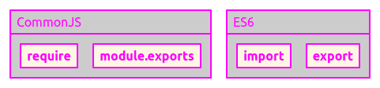

# JavaScript

aka. ECMAScript

---

References

- [JavaScript - Wikipedia](https://en.wikipedia.org/wiki/JavaScript)
    - aka. [ECMAScript](https://en.wikipedia.org/wiki/ECMAScript)
- [create-project.js.org](https://create-project.js.org/)

## peerDependencies

References

- [What is the difference between .js, .tsx and .jsx in React? - stack overflow](https://stackoverflow.com/questions/64343698/what-is-the-difference-between-js-tsx-and-jsx-in-react)

TL;DR:

- **`dependencies` and `devDependencies` are used to make a difference between the libraries that will be (or won't be) in your final bundle.**
- **`peerDependencies` are useful only if you want to create and publish your own library.**

### dependencies

The libraries under dependencies are those that your project really needs to **be able to work in production**.
_Usually, these libraries have all or part of their code in your final bundle(s)._

_The libraries you can find under dependencies include utility libraries such as lodash, classnames etc and also the "main" libraries of your project._

### devDependencies

As we can guess thanks to its name, the libraries under devDependencies are those that **you need during development**.

_So you'll find here different types of libraries such as:_

- **formatting libraries**: **eslint**, **prettier**, ...
- **bundlers**: webpack, gulp, **parceljs**, ...
- babel and all its plugins
- everything related to tests: enzyme, jest, ...
- a bunch of other libraries: storybook, react-styleguidist, **husky**, ...

### peerDependencies

95% of the time, you'll use only dependencies and devDependencies.
But if you want to create and publish your own library so that it can be used as a dependency, you may also need the peerDependencies.
Under this section, **you can indicate which versions of some of your important libraries are required**.

Let's imagine that **your project (ProjectA) uses an important library (peer-lib) and you know or at least guess that the project (MainProject) which will use your library will also use this peer-lib library.**
If you want to **make sure that the version of peer-lib used in MainProject works with your version in ProjectA, you should use peerDependencies.**

## require vs import

References

- [The difference between "require(x)" and "import x" - stack overflow](https://stackoverflow.com/questions/46677752/the-difference-between-requirex-and-import-x)
- [Require vs Import - EDUCBA](https://www.educba.com/require-vs-import)

<!-- - [JavaScript require() vs import()](https://flexiple.com/javascript-require-vs-import) -->

### Stack Overflow

Reference : [The difference between "require(x)" and "import x" - stack overflow](https://stackoverflow.com/questions/46677752/the-difference-between-requirex-and-import-x)



- You can't selectively load only the pieces you need with `require` but with **`import`**, you can **selectively load only the pieces you need**, which can save memory.
- **Loading is synchronous(step by step) for `require`** on the other hand **`import` can be asynchronous (without waiting for previous import)** so it can perform a little better than require.

### DDUCBA

Reference : [Require vs Import - EDUCBA](https://www.educba.com/require-vs-import)

#### Key Differences

Both are popular choices in the market; let us discuss some of the major differences:

-   `require` is more of dynamic analysis, and `import` is more of static analysis.
-   `require` Throws error at runtime and `import` throws error while parsing
-   `require` is Nonlexical and `import` is Lexical
-   `require`s to stay where they have put the file, and `import`s get sorted to the top of the file.
-   `import` is always run at the very beginning of the file and can't be run conditionally.
    On the other hand, `require` can be used inline, conditionally, …

#### Comparison Table

Syntax:

-   `require`

    ```js
    var dep = require(“dep”);
    console.log(dep.bar);
    dep.foo();
    ```

-   `import`

    ```js
    import {foo, bar} from “dep”;
    console.log(bar);
    foo();
    ```

Browsers support natively?

-   `require`

    As import remains in stage three and not enforced by browsers natively, we're unable to run any performance take a look at.

-   `import`

    Presently once you use import in your code, your transpilers it back to require the commonJS modeling system.
    Therefore for nowadays, each is the same.

Performance

-   `require`

    Though there aren't any performance profit at the instant,
    however, I'll still counsel to use import over require
    because it's about to be native in JS and will (just as a result of its native) perform higher than require.

-   `import`

    As a result of import is native; therefore, require doesn't perform higher as compare to import

Synchronous or Asynchronous?

-   `require`

    You will have dynamic loading wherever the loaded module name is not predefined.
    Loading is synchronous. Meaning if you have got multiple requires, they’re loaded and processed one by one. ES6

-   `import`

    You can use named imports to by selection load solely the items you would like.
    Which will save memory? **Import is asynchronous** (and in the current ES6 Module Loader, it, of course, is) and may perform a touch higher.
    Also, the require module system is not customarily based mostly.
    It's is extremely unlikely to become customary currently that ES6 modules exist.

<!--

### _require(x) vs import(x)_

Reference : [JavaScript require() vs import()](https://flexiple.com/javascript-require-vs-import)

_( icehe : `import()` 很少使用, 所以可以忽略. )_

Syntax and Explanation

#### _require()_

In Node.jS, `require()` is a built-in function to include external modules that exist in separate files.

- `require()` statement basically reads a JavaScript file, executes it, and then proceeds to return the export object.
- `require()` statement not only allows to add built-in core Node.js modules but also community-based and local modules.

Syntax:

- To include a module, the `require()` function is used with the name of the module:

```js
var myVar = require('http'); // to use built-in modules
Var myVar2 = require('./myLocaModule'); // to use local modules
```

#### _import()_

`import()` & `export()` statements are used to refer to an ES module.
Other modules with file types such as `.json` cannot be imported with these statements.
They are permitted to be used only in ES modules and the specifier of this statement can either be a URL-style relative path or a package name.
Also, the `import` statement cannot be used in embedded scripts unless such script has a `type="module"`.
A dynamic import can be used for scripts whose type is not "module"

Syntax:

```js
var myVac = import("module-name");
```

#### _Differences_

One of the major differences between `require()` and `import()` is that

- `require()` can be called from anywhere inside the program
- whereas `import()` cannot be called conditionally, it always runs at the beginning of the file.

To use the `require()` statement, a module must be saved with `.js` extension as opposed to `.mjs` when the `import()` statement is used.

ES modules can be loaded dynamically via the `import()` function unlike `require()`.

-->

## CJS, AMD, UMD, ESM

References

- [What are CJS, AMD, UMD, and ESM in Javascript? - dev.to](https://dev.to/iggredible/what-the-heck-are-cjs-amd-umd-and-esm-ikm)

In the beginning, Javascript did not have a way to import/export modules. This is a problem.
Then, people much, much smarter than me attempted to add modularity to Javascript.
Some of them are CJS, AMD, UMD, and ESM.

### CJS

References

- [CommonJS - Wikipedia](https://en.wikipedia.org/wiki/CommonJS)

CJS is short for **CommonJS**. _Here is what it looks like:_

```js
// importing
const doSomething = require('./doSomething.js');

// exporting
module.exports = function doSomething(n) {
  // do something
}
```

-   [CJS module format](https://blog.risingstack.com/node-js-at-scale-module-system-commonjs-require/).
-   CJS **imports module synchronously.**
-   You can **import from a library `node_modules` or local dir.**

    Either by `const myLocalModule = require('./some/local/file.js')` or `var React = require('react');` works.

-   When CJS imports, it will **give you a copy of the imported object.**

    CJS will **not work in the browser.**
    It will **have to be transpiled and bundled.**

### AMD

References:

- [Asynchronous Module Definition - Wikipedia](https://en.wikipedia.org/wiki/Asynchronous_module_definition)

AMD stands for **Asynchronous Module Definition**. _Here is a sample code:_

```js
define(['dep1', 'dep2'], function (dep1, dep2) {
  // Define the module value by returning a value.
  return function () {};
});
```

or

```js
// "simplified CommonJS wrapping" https://requirejs.org/docs/whyamd.html
define(function (require) {
    var dep1 = require('dep1'),
        dep2 = require('dep2');
    return function () {};
});
```

- AMD **imports modules asynchronously** (hence the name).
- AMD is **made for frontend (when it was proposed) (while CJS backend)**.
- AMD syntax is **less intuitive than CJS**. _I think of AMD as the exact opposite sibling of CJS._

### UMD

Reference:

- [UMD (Universal Module Definition) - github.com/umdjs/umd](https://github.com/umdjs/umd#:~:text=These%20are%20modules%20which%20are,(e.g%20RequireJS%20amongst%20others).)

UMD stands for **Universal Module Definition**. _Here is what it may look like:_

```js
(function (root, factory) {
    if (typeof define === "function" && define.amd) {
        define(["jquery", "underscore"], factory);
    } else if (typeof exports === "object") {
        module.exports = factory(require("jquery"), require("underscore"));
    } else {
        root.Requester = factory(root.$, root._);
    }
}(this, function ($, _) {
    // this is where I defined my module implementation

    var Requester = { // ... };

    return Requester;
}));
```

- Works on **front and back end** (hence the name universal).
- Unlike CJS or AMD, UMD is **more like a pattern to configure several module systems**.
- UMD is usually used as a fallback module when using bundler like Rollup/Webpack _( icehe : 暂时不太懂什么意思 2021/10/11 )_

### ESM

References:

- [Modules: ECMAScript modules - nodjs.org](https://nodejs.org/api/esm.html)
- [ES modules: A cartoon deep-dive - hacks.mozilla.org](https://hacks.mozilla.org/2018/03/es-modules-a-cartoon-deep-dive/) TBD?
- [Introduction to ES Modules - flaviocopes.com](https://flaviocopes.com/es-modules/) TBD?

ESM stands for **ES Modules**.  It is **Javascript's proposal to implement a standard module system**.

_I am sure many of you have seen this:_

```js
import React from 'react';
```

_Other sightings in the wild:_

```js
export default function() {
  // your Function
};
export const function1() {...};
export const function2() {...};
```

- Works in many modern browsers
- It has the best of both worlds: **CJS-like simple syntax and AMD's async**
- **[Tree-shakeable](https://developers.google.com/web/fundamentals/performance/optimizing-javascript/tree-shaking), due to ES6's [static module structure](https://exploringjs.com/es6/ch_modules.html#static-module-structure)**
- ESM allows bundlers like Rollup to [remove unnecessary code](https://dev.to/bennypowers/you-should-be-using-esm-kn3), allowing sites to ship less codes to get faster load.
- Can be called in HTML, just do:
    ```js
    <script type="module">
        import {func1} from 'my-lib';
        func1();
    </script>
    ```

### Summary

- **ESM** is the best module format thanks to its simple syntax, async nature, and tree-shakeability.
- **UMD** works everywhere and usually used as a fallback in case ESM does not work
- **CJS** is synchronous and good for back end.
- **AMD** is asynchronous and good for front end.

## `export`

References

- [export - developer.mozilla.org](https://developer.mozilla.org/en-US/docs/Web/JavaScript/Reference/Statements/export)
- _[export const vs. export default in ES6 - stack overflow](https://stackoverflow.com/questions/33611812/export-const-vs-export-default-in-es6)_
- _[Named Export vs Default Export in ES6 - Medium](https://medium.com/@etherealm/named-export-vs-default-export-in-es6-affb483a0910)_

### Introduction

**The export statement is used when creating JavaScript modules to export live bindings to functions, objects, or primitive values from the module so they can be used by other programs with the import statement.**
The value of an imported binding is subject to change in the module that exports it.
When a module updates the value of a binding that it exports, the update will be visible in its imported value.

Exported modules are in strict mode whether you declare them as such or not.
The export statement cannot be used in embedded scripts.

### Syntax

There are two types of exports:

- Named Exports (Zero or more exports per module)
- Default Exports (One per module)

```js
// Exporting individual features
export let name1, name2, …, nameN; // also var, const
export let name1 = …, name2 = …, …, nameN; // also var, const
export function functionName(){...}
export class ClassName {...}

// Export list
export { name1, name2, …, nameN };

// Renaming exports
export { variable1 as name1, variable2 as name2, …, nameN };

// Exporting destructured assignments with renaming
export const { name1, name2: bar } = o;

// Default exports
export default expression;
export default function (…) { … } // also class, function*
export default function name1(…) { … } // also class, function*
export { name1 as default, … };

// Aggregating modules
export * from …; // does not set the default export
export * as name1 from …; // Draft ECMAScript® 2O21
export { name1, name2, …, nameN } from …;
export { import1 as name1, import2 as name2, …, nameN } from …;
export { default, … } from …;
```

`nameN` **Identifier to be exported** (so that it can be imported via import in another script).

### Description

#### Named and Default

There are two different types of export, **named** and **default**.

You **can have multiple named exports per module but only one default export**.
Each type corresponds to one of the above syntax:

**Named exports**:

```js
// export features declared earlier
export { myFunction, myVariable };

// export individual features (can export var, let,
// const, function, class)
export let myVariable = Math.sqrt(2);
export function myFunction() { ... };
```

**Default exports**:

```js
// export feature declared earlier as default
export { myFunction as default };

// export individual features as default
export default function () { ... }
export default class { .. }

// each export overwrites the previous one
```

Named exports are useful to export several values.
During the import, it is mandatory to use the same name of the corresponding object.

_But a default export can be imported with any name for example:_

```js
// file test.js
let k; export default k = 12;
```

```js
// some other file
import m from './test'; // note that we have the freedom to use import m instead of import k, because k was default export
console.log(m);        // will log 12
```

_You can also rename named exports to avoid naming conflicts:_

```js
export { myFunction as function1,
         myVariable as variable };
```

#### Re-exporting / Aggregating

It is also **possible to "import/export" from different modules in a parent module so that they are available to import from that module.**
In other words, one can create a single module concentrating various exports from various modules.

This can be achieved with the "export from" syntax:

```js
export { default as function1,
         function2 } from 'bar.js';
```

Which is comparable to a combination of import and export:

```js
import { default as function1,
         function2 } from 'bar.js';
export { function1, function2 };
```

But where `function1` and `function2` do not become available inside the current module.

> Note: The following is syntactically invalid despite its import equivalent:

```js
import DefaultExport from 'bar.js'; // Valid
```

```js
export DefaultExport from 'bar.js'; // Invalid
```

The correct way of doing this is **to rename the export**:

```js
export { default as DefaultExport } from 'bar.js';
```

The "export from" syntax allows the `as` token to be omitted; however this will mean the default item cannot be imported as a named import:

```js
export { default, function2 } from 'bar.js';
```

### Examples

#### Using named exports

In a module `my-module.js`, we could include the following code:

```js
// module "my-module.js"
function cube(x) {
  return x * x * x;
}

const foo = Math.PI + Math.SQRT2;

var graph = {
  options: {
      color:'white',
      thickness:'2px'
  },
  draw: function() {
      console.log('From graph draw function');
  }
}

export { cube, foo, graph };
```

Then in the top-level module included in your HTML page, we could have:

```js
import { cube, foo, graph } from './my-module.js';

graph.options = {
    color:'blue',
    thickness:'3px'
};

graph.draw();
console.log(cube(3)); // 27
console.log(foo);     // 4.555806215962888
```

It is important to note the following:

-   You need to include this script in your HTML with a [`<script>`](https://developer.mozilla.org/en-US/docs/Web/HTML/Element/script) element of type="module", so that it gets recognized as a module and dealt with appropriately.
-   You can't run JS modules via a `file://` URL — you'll get [CORS](https://developer.mozilla.org/en-US/docs/Web/HTTP/CORS) errors.
    You need to run it via an HTTP server.

#### Using the default export

If we want to export a single value or to have a fallback value for your module, you could use a default export:

```js
// module "my-module.js"

export default function cube(x) {
  return x * x * x;
}
```

Then, in another script, it is straightforward to import the default export:

```js
import cube from './my-module.js';
console.log(cube(3)); // 27
```

#### Using export from

Let's take an example where we have the following hierarchy:

- `childModule1.js`: exporting `myFunction` and `myVariable`
- `childModule2.js`: exporting `myClass`
- `parentModule.js`: acting as an aggregator (and doing nothing else)
- top level module: consuming the exports of `parentModule.js`

This is what it would look like using code snippets:

```js
// In childModule1.js
let myFunction = ...; // assign something useful to myFunction
let myVariable = ...; // assign something useful to myVariable
export {myFunction, myVariable};
```

```js
// In childModule2.js
let myClass = ...; // assign something useful to myClass
export myClass;
```

```js
// In parentModule.js
// Only aggregating the exports from childModule1 and childModule2
// to re-export them
export { myFunction, myVariable } from 'childModule1.js';
export { myClass } from 'childModule2.js';
```

```js
// In top-level module
// We can consume the exports from a single module since parentModule
// "collected"/"bundled" them in a single source
import { myFunction, myVariable, myClass } from 'parentModule.js'
```

### Others

Notes

- **The syntax favours default exports as slightly more concise because their use case is more common** ([See the discussion here](https://esdiscuss.org/topic/moduleimport)).
- **A default export is actually a named export with the name `default`** so you are able to import it with a named import:
    ```js
    import { default as MyDefaultExport } from "./MyFileWithADefaultExport";
    ```

## _Transpilers_

> What They Are & Why We Need Them

<!-- icehe : 本文一般般 -->

References

- [JavaScript Transpilers: What They Are & Why We Need Them - scotch.io](https://scotch.io/tutorials/javascript-transpilers-what-they-are-why-we-need-them) on 2016-04-25

### Introduction

**Transpilers**, or **source-to-source** compilers, are tools that read source code written in one programming language, and produce the equivalent code in another language.
Languages you write that transpile to JavaScript are often called **compile-to-JS** languages, and are said to **target** JavaScript.

Oh, and, even though people tend to use "**compile**/r" and "**transpile**/r" interchangeably, I'll **prefer the latter term** in this article.

---

You've probably heard about [CoffeeScript](http://coffeescript.org/) and [TypeScript](https://www.typescriptlang.org/).

- CoffeeScript provides syntactic sugar for a [number of features](http://coffeescript.org/#loops) not yet native to JavaScript, while [discouraging some of JavaScript's "bad parts"](https://github.com/jashkenas/coffeescript/issues/1693).
- TypeScript is more drastic<!-- 激烈的 -->, adding [classical object-oriented semantics](https://www.typescriptlang.org/docs/handbook/2/objects.html) to a [fundamentally different language](https://scotch.io/tutorials/better-javascript-with-es6-pt-ii-a-deep-dive-into-classes).

Anything you can write in JavaScript, you can write in CoffeeScript or TypeScript.

```js
"use strict";

// Good 'ol JS
function printSecret ( secret ) {
    console.log(`${secret}. But don't tell anyone.`);
}

printSecret("I don't like CoffeeScript");
```

```js
"use strict"

# CoffeeScript
printSecret (secret) =>
    console.log '#{secret}. But don't tell anyone.'

printSecret "I don't like JavaScript."
```

```js
"use strict";

// TypeScript -- JavaScript, with types and stuff
function printSecret ( secret : string ) {
    console.log("${secret}. But don't tell anyone.");
}

printSecret("I don't like CoffeeScript.");
```

Trouble is, JavaScript environments only understand…… Well, JavaScript.
Trying those last two examples in your console will throw errors.
As a matter of fact, if you try that pure JavaScript example in an older browser, you'll still get an error.
[Template literals](https://developer.mozilla.org/en-US/docs/Web/JavaScript/Reference/Template_literals) still don't have reliable browser support.

That's where transpilers come in:
**The transpilers read CoffeeScript, TypeScript, and ES2015, and spit out JavaScript guaranteed to work anywhere.**

### In Defense of Transpilers

……

_In the case of languages that target JavaScript, it's largely a matter of preference or background._
**Writing in a language that "thinks" the way you do makes you more productive.**

- _People with backgrounds in OOP often like TypeScript because it's familiar territory._
- _Pythonistas like CoffeeScript._
- _Clojurists write ClojureScript. You get the idea._

But the rest of us, who are perfectly fine with writing plain JavaScript, still use transpilers,
because they're the only reliable way to use features from ES2015 and beyond.

#### _Tomorrow's JavaScript, Today_

( history ) ……

#### Tomorrow's JavaScript, Along the Way

References

- [TC39](https://en.wikipedia.org/wiki/Ecma_International#Committees) – responsible for ECMAScript.
- [The TC39 process for ECMAScript features](https://2ality.com/2015/11/tc39-process.html)

……

To recap, transpilers:

1. **Allow us to write compile-to-JavaScript languages**, like CoffeeScript, TypeScript, or ClojureScript;
2. Let us **use new and potential JavaScript features, reliably**; and
3. **Contribute to the development of the ECMAScript specification.**

### Using Transpilers

( using Babel ) ……

### Build Tools

( using Babel API ) ……

## File `*.d.ts`

References

- [About "*.d.ts" in TypeScript - stack overflow](https://stackoverflow.com/questions/21247278/about-d-ts-in-typescript)

The `d.ts` file is used to **provide typescript type information about an API that's written in JavaScript.**
The idea is that you're using something like jQuery or underscore, an existing javascript library.
You want to consume those from your typescript code.

Rather than rewriting jquery or underscore or whatever in typescript, you can instead write the `d.ts` file, which contains only the type annotations.
Then from your typescript code you get the typescript benefits of static type checking while still using a pure JS library.

This works thanks to TypeScript's constraint of not letting you add the `.ts` extension at the end of the `import` statement.
Because of that, when you reference some file, let's say, **`my-module.js`, if there is a `my-module.d.ts` next to it, then TypeScript will include its content:**

```js
src/
  my-module.js
  my-module.d.ts
  index.ts
```

```js
// my-module.js
const thing = 42;

module.exports = { thing };
```

```js
// my-module.d.ts
export declare const thing: number;
```

```js
// index.ts
import { thing } from "./my-module"; // <- no extension

// runtime implementation of `thing` is taken from ".js"
console.log(thing); // 42

// type declaration of `thing` is taken from ".d.ts"
type TypeOfThing = typeof thing; // number
```

## tslib

References

- [tslib - npmjs.com](https://www.npmjs.com/package/tslib)

**tslib is a runtime library for TypeScript that contains all of the TypeScript helper functions.**

This library is primarily used by the `--importHelpers` flag in TypeScript. ……

## Statement `"use strict";`

References

- [JavaScript Use Strict - w3schools.com](https://www.w3schools.com/js/js_strict.asp)

**`"use strict";` defines that JavaScript code should be executed in "strict mode".**

_It is not a statement, but a literal expression, ignored by earlier versions of JavaScript._

The purpose of "use strict" is to indicate that the code should be executed in "strict mode".
With strict mode, you can not, for example, use undeclared variables.
All modern browsers support "use strict" except Internet Explorer 9 and lower: ……

---

## TODO

Other Topics

- [WASM is AWSM](https://dev.to/vibalijoshi/wasm-is-awsm-3a98)
