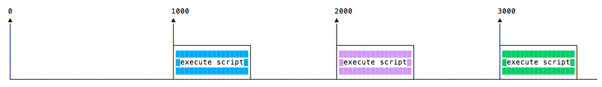
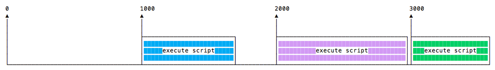
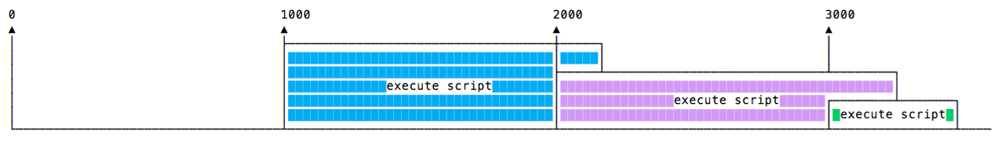
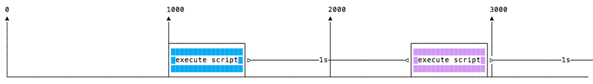

# Node.js

A JavaScript runtime built on Chrome's V8 JavaScript engine

---

References

- [nodejs.org](https://nodejs.org/en/)
  - Documentation
    - [API reference documentation](https://nodejs.org/api/) ( latest )
    - [ES6 features](https://nodejs.org/en/docs/es6/)
    - [Guides](https://nodejs.org/en/docs/guides/)

## About

As an **asynchronous event-driven JavaScript runtime**, Node.js is designed to build scalable network applications.
_In the following "hello world" example, many connections can be handled concurrently._
Upon each connection, the callback is fired, but **if there is no work to be done, Node.js will sleep**.

_This is in contrast to today's more common concurrency model, in which OS threads are employed._
_Thread-based networking is relatively inefficient and very difficult to use._

Furthermore, users of Node.js are **free from worries of dead-locking the process, since there are no locks**.
**Almost no function in Node.js directly performs I/O, so the process never blocks except when the I/O is performed using synchronous methods of Node.js standard library.**
Because nothing blocks, scalable systems are very reasonable to develop in Node.js.

_If some of this language is unfamiliar, there is a full article on [Blocking vs. Non-Blocking](https://nodejs.org/en/docs/guides/blocking-vs-non-blocking/)._

---

_Node.js is similar in design to, and influenced by, systems like Ruby's [Event Machine](https://github.com/eventmachine/eventmachine) and Python's [Twisted](https://twistedmatrix.com/trachttps://twistedmatrix.com/trac//)._

Node.js takes the event model a bit further.
It **presents an event loop as a runtime construct instead of as a library**.
_In other systems, there is always a blocking call to start the event-loop._
_Typically, behavior is defined through callbacks at the beginning of a script, and at the end a server is started through a blocking call like `EventMachine::run()`._
In Node.js, there is no such start-the-event-loop call.

- **Node.js simply enters the event loop after executing the input script.**
- **Node.js exits the event loop when there are no more callbacks to perform.**

_This behavior is like browser JavaScript —— the event loop is hidden from the user._

**HTTP is a first-class citizen in Node.js, designed with streaming and low latency in mind.**
This makes Node.js well suited for the foundation of a web library or framework.

Node.js being designed without threads doesn't mean you can't take advantage of multiple cores in your environment.
Child processes can be spawned by using our `child_process.fork()` API, and are designed to be easy to communicate with.
Built upon that same interface is the `cluster` module, which allows you to share sockets between processes to enable load balancing over your cores.

---

## Differences between Node.js and Browser

Both the browser and Node.js use JavaScript as their programming language.

……

What changes is the ecosystem.

- In the browser, most of the time what you are doing is interacting with the DOM, or other Web Platform APIs like Cookies.

  _And in the browser, we don't have all the nice APIs that Node.js provides through its modules, like the filesystem access functionality._

- Those do not exist in Node.js, of course.

  You don't have the `document`, `window` and all the other objects that are provided by the browser.

  Another big difference is that in Node.js you control the environment.
  Unless you are building an open source application that anyone can deploy anywhere, you know which version of Node.js you will run the application on.
  Compared to the browser environment, where you don't get the luxury to choose what browser your visitors will use, this is very convenient.

# Get Started

## Read environment variables

**The `process` core module of Node.js provides the `env` property which hosts all the environment variables that were set at the moment the process was started.**

_The below code runs `app.js` and set `USER_ID` and `USER_KEY`._

```bash
USER_ID=239482 USER_KEY=foobar node app.js
```

> Note: `process` does not require a "require", it's automatically available.

_Here is an example that accesses the `USER_ID` and `USER_KEY` environment variables, which we set in above code._

```bash
process.env.USER_ID // "239482"
process.env.USER_KEY // "foobar"
```

_In the same way you can access any custom environment variable you set._

If you have multiple environment variables in your node project, you can also **create an `.env` file in the root directory of your project**, and then **use the [dotenv](https://www.npmjs.com/package/dotenv) package to load them during runtime**.

```bash
# .env file
USER_ID="239482"
USER_KEY="foobar"
NODE_ENV="development"
```

```js
require('dotenv').config();

process.env.USER_ID; // "239482"
process.env.USER_KEY; // "foobar"
process.env.NODE_ENV; // "development"
```

> You can also run your js file with `node -r dotenv/config index.js` command if you don't want to import the package in your code.

## Command Line

### Accept arguments

_For example :_

```bash
$ node app.js joe
# or
$ node app.js name=joe
```

The way you retrieve it is **using the `process` object** built into Node.js.

It exposes an **`argv` property**, which is **an array that contains all the command line invocation arguments**.

- The first element is the full path of the `node` command.
- The second element is the full path of the file being executed.
- All the **additional arguments are present from the third position going forward**.

_You can iterate over all the arguments ( including the node path and the file path ) using a loop :_

```js
process.argv.forEach((val, index) => {
  console.log(`${index}: ${val}`);
});
```

_You can get only the additional arguments by creating a new array that excludes the first 2 params:_

```js
const args = process.argv.slice(2);
```

_If you have one argument without an index name, like this :_

```bash
node app.js joe
```

_you can access it using_

```js
const args = process.argv.slice(2);
args[0];
```

_In this case :_

```bash
node app.js name=joe
```

**`args[0]` is `name=joe`, and you need to parse it.**

---

The best way to do so is by using the [`minimist`](https://www.npmjs.com/package/minimist) library, which helps dealing with arguments:

```js
const args = require('minimist')(process.argv.slice(2));
args['name']; //joe
```

_Install the required `minimist` package using `npm`._

```bash
npm install minimist
```

_This time you need to use double dashes before each argument name:_

```bash
node app.js --name=joe
```

### Output

#### Basic output using the console module

Node.js provides a [`console` module](https://nodejs.org/api/console.html) which provides tons of very useful ways to interact with the command line.
It is basically the same as the `console` object you find in the browser.

The most basic and most used method is `console.log()`, which prints the string you pass to it to the console.
If you pass an object, it will render it as a string.

_You can pass multiple variables to console.log, for example :_

```js
const x = 'x';
const y = 'y';
console.log(x, y);
```

_and Node.js will print both._

We can also format pretty phrases by passing variables and a format specifier.
_For example :_

```js
console.log('My %s has %d years', 'cat', 2);
```

- `%s` format a variable as a string
- `%d` format a variable as a number
- `%i` format a variable as its integer part only
- `%o` format a variable as an object

**Clear the console**

`console.clear()` clears the console ( the behavior might depend on the console used ) .

#### Counting elements

`console.count()` is a handy method.

……

What happens is that `console.count()` will **count the number of times a string is printed, and print the count next to it**: ……

**Reset counting**

The `console.countReset()` method resets counter used with `console.count()`.

……

#### Print the stack trace

There might be cases where it's useful to print the call stack trace of a function, maybe to answer the question how did you reach that part of the code?

You can do so using `console.trace()` :

```js
const function2 = () => console.trace();
const function1 = () => function2();
function1();
```

This will print the stack trace.
_This is what's printed if we try this in the Node.js REPL :_

```bash
Trace
    at function2 (repl:1:33)
    at function1 (repl:1:25)
    at repl:1:1
    at ContextifyScript.Script.runInThisContext (vm.js:44:33)
    at REPLServer.defaultEval (repl.js:239:29)
    at bound (domain.js:301:14)
    at REPLServer.runBound [as eval] (domain.js:314:12)
    at REPLServer.onLine (repl.js:440:10)
    at emitOne (events.js:120:20)
    at REPLServer.emit (events.js:210:7)
```

#### Calculate the time spent

You can **easily calculate how much time a function takes to run, using `time()` and `timeEnd()`.**

```js
const doSomething = () => console.log('test');
const measureDoingSomething = () => {
  console.time('doSomething()');
  //do something, and measure the time it takes
  doSomething();
  console.timeEnd('doSomething()');
};
measureDoingSomething();
```

#### Others

**stdout and stderr**

As we saw

- console.log is great for printing messages in the Console.
  This is what's called the standard output, or `stdout`.

- console.error prints to the `stderr` stream.

  It will not appear in the console, but it will appear in the error log.

**Color the output**

You can color the output of your text in the console by using [escape sequences](https://gist.github.com/iamnewton/8754917).
An escape sequence is a set of characters that identifies a color.

```js
console.log('\x1b[33m%s\x1b[0m', 'hi!');
```

_You can try that in the Node.js REPL, and it will print "hi!" in yellow._

However, this is the low-level way to do this.
The simplest way to go about coloring the console output is by using a library.
[Chalk](https://github.com/chalk/chalk) is such a library, and in addition to coloring it also helps with other styling facilities, like making text bold, italic or underlined.

_You install it with `npm install chalk`, then you can use it:_

```js
const chalk = require('chalk');
console.log(chalk.yellow('hi!'));
```

_Using `chalk.yellow` is much more convenient than trying to remember the escape codes, and the code is much more readable._

**Create a progress bar**

[Progress](https://github.com/chalk/chalk) is an awesome package to create a progress bar in the console.
Install it using `npm install progress`

_This snippet creates a 10-step progress bar, and every 100ms one step is completed._
_When the bar completes we clear the interval :_

```js
const ProgressBar = require('progress');

const bar = new ProgressBar(':bar', { total: 10 });
const timer = setInterval(() => {
  bar.tick();
  if (bar.complete) {
    clearInterval(timer);
  }
}, 100);
```

### Accept input

Node.js since version 7 provides the [`readline` module](https://nodejs.org/api/readline.html) to perform exactly this :
**get input from a readable stream such as the `process.stdin` stream**, which during the execution of a Node.js program is the terminal input, one line at a time.

```js
const readline = require('readline').createInterface({
  input: process.stdin,
  output: process.stdout,
});

readline.question(`What's your name?`, (name) => {
  console.log(`Hi ${name}!`);
  readline.close();
});
```

_This piece of code asks the username, and once the text is entered and the user presses enter, we send a greeting._

The **`question()` method shows the first parameter ( a question ) and waits for the user input**.
It calls the callback function once enter is pressed.
In this callback function, we close the readline interface.

……

The simplest way is to use the [`readline-sync` package](https://www.npmjs.com/package/readline-sync) which is very similar in terms of the API and handles this out of the box.

**A more complete and abstract solution is provided by the [Inquirer.js package](https://github.com/SBoudrias/Inquirer.js).**

```js
const inquirer = require('inquirer');

var questions = [
  {
    type: 'input',
    name: 'name',
    message: "What's your name?",
  },
];

inquirer.prompt(questions).then((answers) => {
  console.log(`Hi ${answers['name']}!`);
});
```

Inquirer.js lets you do many things like **asking multiple choices**, having **radio buttons**, **confirmations**, and more.

It's worth knowing all the alternatives, especially the built-in ones provided by Node.js, but if you plan to take CLI input to the next level, Inquirer.js is an optimal choice.

## Expose functionality from file using exports

Node.js has a built-in module system.
A Node.js file can import functionality exposed by other Node.js files.

When you want to **import something you use**

```js
const library = require('./library');
```

**to import the functionality exposed in the `library.js` file that resides in the current file folder.**

In this file, functionality must be exposed before it can be imported by other files.
Any other object or variable defined in the file by default is private and not exposed to the outer world.

This is what the module.exports API offered by the [`module` system](https://nodejs.org/api/modules.html) allows us to do.

**When you assign an object or a function as a new exports property, that is the thing that's being exposed**, and as such, it can be imported in other parts of your app, or in other apps as well.

You can do so in 2 ways.

1.  The first is to **assign an object to `module.exports`**, which is an object provided out of the box by the module system, and this will **make your file export just that object**:

    ```js
    // car.js
    const car = {
      brand: 'Ford',
      model: 'Fiesta',
    };

    module.exports = car;
    ```

    ```js
    // index.js
    const car = require('./car');
    ```

2.  The second way is to **add the exported object as a property of `exports`**.
    This way **allows you to export multiple objects, functions or data**:

    ```js
    const car = {
      brand: 'Ford',
      model: 'Fiesta',
    };

    exports.car = car;
    ```

    or directly

    ```js
    exports.car = {
      brand: 'Ford',
      model: 'Fiesta',
    };
    ```

    And in the other file, you'll use it by referencing a property of your import:

    ```js
    const items = require('./items');
    const car = items.car;
    ```

    or

    ```js
    const car = require('./items').car;
    ```

    or you can use a destructuring assignment:

    ```js
    const { car } = require('./items');
    ```

What's the difference between `module.exports` and `exports`?

- **`module.exports` exposes the object it points to.**
- **`exports` exposes the properties of the object it points to.**

## npm package manager

### Introduction

`npm` is the standard package manager for Node.js.

……

It started as a way to download and manage dependencies of Node.js packages, but it has since become a tool used also in frontend JavaScript.

_There are many things that npm does._

> `Yarn` and `pnpm` are alternatives to npm cli. _You can check them out as well._

### Downloads

`npm` manages downloads of dependencies of your project.

#### Installing all dependencies

If a project has a `package.json` file, by running

```bash
npm install
```

it will install everything the project needs, in the `node_modules` folder, _creating it if it's not existing already._

#### Installing a single package

```bash
npm install <package-name>
```

……

_Often you'll see more flags added to this command:_

- `--save-dev` installs and adds the entry to the `package.json` file _devDependencies_
- `--no-save` installs but **does not** add the entry to the `package.json` file _dependencies_
- `--save-optional` installs and adds the entry to the `package.json` file _optionalDependencies_
- `--no-optional` will **prevent** optional dependencies from being installed

_Shorthands of the flags can also be used:_

- `-S`: `--save`
- `-D`: `--save-dev`
- `-O`: `--save-optional`

**The difference between `devDependencies` and `dependencies` is that the former contains development tools, like a testing library, while the latter is bundled with the app in production.**

_As for the `optionalDependencies` the difference is that build failure of the dependency will not cause installation to fail._
_But it is your program's responsibility to handle the lack of the dependency._
_Read more about [optional dependencies](https://docs.npmjs.com/cli/v7/configuring-npm/package-json#optionaldependencies)._

#### Updating packages

```bash
npm update
```

**`npm` will check all packages for a newer version that satisfies your versioning constraints.**

_You can specify a single package to update as well:_

```bash
npm update <package-name>
```

### Versioning

In addition to plain downloads, `npm` also manages **versioning**, so you can specify any specific version of a package, or require a version higher or lower than what you need.

_Many times you'll find that a library is only compatible with a major release of another library._
_Or a bug in the latest release of a lib, still unfixed, is causing an issue._

Specifying an explicit version of a library also helps to keep everyone on the same exact version of a package, so that the whole team runs the same version until the package.json file is updated.

In all those cases, versioning helps a lot, and `npm` follows the **semantic versioning (semver) standard**.

### Running Tasks

The `package.json` file supports a format for specifying command line tasks that can be run by using

```bash
npm run <task-name>
```

_For example :_

```json
{
  "scripts": {
    "start-dev": "node lib/server-development",
    "start": "node lib/server-production"
  }
}
```

_It's very common to use this feature to run Webpack :_

```json
{
  "scripts": {
    "watch": "webpack --watch --progress --colors --config webpack.conf.js",
    "dev": "webpack --progress --colors --config webpack.conf.js",
    "prod": "NODE_ENV=production webpack -p --config webpack.conf.js"
  }
}
```

_So instead of typing those long commands, which are easy to forget or mistype, you can run_

```bash
$ npm run watch
$ npm run dev
$ npm run prod
```

### Where to install packages?

When you install a package using `npm` you can perform 2 types of installation:

- a **local** install
- a **global** install

_By default, when you type an `npm install` command, like:_

```bash
npm install lodash
```

_the package is installed in the current file tree, under the `node_modules` subfolder._

_As this happens, `npm` also adds the `lodash` entry in the `dependencies` property of the `package.json` file present in the current folder._

**A global installation is performed using the `-g` flag:**

```bash
npm install -g lodash
```

When this happens, npm won't install the package under the local folder, but instead, it will use a global location.

**Where, exactly?**

- The **`npm root -g` command will tell you where that exact location is on your machine.**

  - On macOS or Linux this location could be `/usr/local/lib/node_modules.`
  - On Windows it could be `C:\Users\YOU\AppData\Roaming\npm\node_modules`

- If you use `nvm` to manage Node.js versions, however, that location would differ.

  I, for example, use nvm and my packages location was shown as `/Users/icehe/.nvm/versions/node/v16.13.0/lib/node_modules`.

### How to use or execute a package installed using npm

When you install a package into your `node_modules` folder using `npm` , or also globally, how do you use it in your Node.js code?

_Say you install `lodash`, the popular JavaScript utility library, using `npm install lodash`._
_This is going to install the package in the local node_modules folder._

**What if your package is an executable?**

- In this case, it will **put the executable file under the `node_modules/.bin/` folder**.

_One easy way to demonstrate this is [cowsay](https://www.npmjs.com/package/cowsay)._

_The cowsay package provides a command line program that can be executed to make a cow say something ( and other animals as well 🦊 ) ._

- _When you install the package using `npm install cowsay`, it will install itself and a few dependencies in the `node_modules` folder: …_
- _There is a hidden `.bin` folder, which contains symbolic links to the cowsay binaries: …_

**How do you execute those?**

- You can of course type `./node_modules/.bin/cowsay` to run it, and it works,
  but **`npx`**, included in the recent versions of `npm` (since 5.2), **is a much better option**.
  _You just run:_

  ```bash
  npx cowsay take me out of here
  ```

  and **`npx` will find the package location**.

### package.json guide

What's `package.json` for? What should you know about it, and what are some of the cool things you can do with it?

The `package.json` file is kind of a manifest for your project.
It can do a lot of things, completely unrelated.
It's **a central repository of configuration for tools**, for example.
It's also **where `npm` and `yarn` store the names and versions for all the installed packages**.

#### File structure

……

_Here's a much more complex example, which was extracted from a sample Vue.js application:_

```json
{
  "name": "test-project",
  "version": "1.0.0",
  "description": "A Vue.js project",
  "main": "src/main.js",
  "private": true,
  "scripts": {
    "dev": "webpack-dev-server --inline --progress --config build/webpack.dev.conf.js",
    "start": "npm run dev",
    "unit": "jest --config test/unit/jest.conf.js --coverage",
    "test": "npm run unit",
    "lint": "eslint --ext .js,.vue src test/unit",
    "build": "node build/build.js"
  },
  "dependencies": {
    "vue": "^2.5.2"
  },
  "devDependencies": {
    "autoprefixer": "^7.1.2",
    "babel-core": "^6.22.1",
    "babel-eslint": "^8.2.1",
    "babel-helper-vue-jsx-merge-props": "^2.0.3",
    "babel-jest": "^21.0.2",
    "babel-loader": "^7.1.1",
    "babel-plugin-dynamic-import-node": "^1.2.0",
    "babel-plugin-syntax-jsx": "^6.18.0",
    "babel-plugin-transform-es2015-modules-commonjs": "^6.26.0",
    "babel-plugin-transform-runtime": "^6.22.0",
    "babel-plugin-transform-vue-jsx": "^3.5.0",
    "babel-preset-env": "^1.3.2",
    "babel-preset-stage-2": "^6.22.0",
    "chalk": "^2.0.1",
    "copy-webpack-plugin": "^4.0.1",
    "css-loader": "^0.28.0",
    "eslint": "^4.15.0",
    "eslint-config-airbnb-base": "^11.3.0",
    "eslint-friendly-formatter": "^3.0.0",
    "eslint-import-resolver-webpack": "^0.8.3",
    "eslint-loader": "^1.7.1",
    "eslint-plugin-import": "^2.7.0",
    "eslint-plugin-vue": "^4.0.0",
    "extract-text-webpack-plugin": "^3.0.0",
    "file-loader": "^1.1.4",
    "friendly-errors-webpack-plugin": "^1.6.1",
    "html-webpack-plugin": "^2.30.1",
    "jest": "^22.0.4",
    "jest-serializer-vue": "^0.3.0",
    "node-notifier": "^5.1.2",
    "optimize-css-assets-webpack-plugin": "^3.2.0",
    "ora": "^1.2.0",
    "portfinder": "^1.0.13",
    "postcss-import": "^11.0.0",
    "postcss-loader": "^2.0.8",
    "postcss-url": "^7.2.1",
    "rimraf": "^2.6.0",
    "semver": "^5.3.0",
    "shelljs": "^0.7.6",
    "uglifyjs-webpack-plugin": "^1.1.1",
    "url-loader": "^0.5.8",
    "vue-jest": "^1.0.2",
    "vue-loader": "^13.3.0",
    "vue-style-loader": "^3.0.1",
    "vue-template-compiler": "^2.5.2",
    "webpack": "^3.6.0",
    "webpack-bundle-analyzer": "^2.9.0",
    "webpack-dev-server": "^2.9.1",
    "webpack-merge": "^4.1.0"
  },
  "engines": {
    "node": ">= 6.0.0",
    "npm": ">= 3.0.0"
  },
  "browserslist": ["> 1%", "last 2 versions", "not ie <= 8"]
}
```

_there are lots of things going on here:_

- `version` indicates the current version
- `name` sets the application/package name
- `description` is a brief description of the app/package
- **`main` sets the entry point for the application**
- `private` if set to `true` prevents the app/package to be accidentally published on `npm`
- **`scripts` defines a set of node scripts you can run**
- **`dependencies`** sets a list of `npm` packages installed as dependencies
- **`devDependencies`** sets a list of `npm` packages installed as development dependencies
- **`engines` sets which versions of Node.js this package/app works on**
- `browserslist` is used to tell which browsers ( and their versions ) you want to support
- ……

All those properties are used by either `npm` or other tools that we can use.

#### Properties breakdown

_This section describes the properties you can use in detail._
_We refer to "package" but the same thing applies to local applications which you do not use as packages._

_Most of those properties are only used on https://www.npmjs.com/, others by scripts that interact with your code, like `npm` or others._

……

Command-specific properties

**The `package.json` file can also host command-specific configuration, for example for Babel, ESLint, and more.**

_Each has a specific property, like `eslintConfig`, `babel` and others._
_Those are command-specific, and you can find how to use those in the respective command/project documentation._

#### Package versions

_You have seen in the description above version numbers like these: `~3.0.0` or `^0.13.0`._
_What do they mean, and which other version specifiers can you use?_

That symbol specifies which updates your package accepts, from that dependency.

**Given that using semver ( semantic versioning ) all versions have 3 digits,**

1. the first being the **major release**,
2. the second the **minor release** and
3. the third is the **patch release**,

you have these "[Rules](https://nodejs.dev/learn/semantic-versioning-using-npm/)".

_You can combine most of the versions in ranges, like this: `1.0.0 || >=1.1.0 <1.2.0`, to either use 1.0.0 or one release from 1.1.0 up, but lower than 1.2.0._

### package-lock.json file

_In version 5, npm introduced the `package-lock.json` file._

What's that?
You probably know about the package.json file, which is much more common and has been around for much longer.

The goal of `package-lock.json` file is **to keep track of the exact version of every package that is installed so that a product is 100% reproducible in the same way even if packages are updated by their maintainers**.

This **solves a very specific problem that `package.json` left unsolved**.
**In `package.json` you can set which versions you want to upgrade to** ( patch or minor ) , using the semver notation, for example:

- if you write `~0.13.0`, you want to **only update patch releases** : `0.13.1` is ok, but `0.14.0` is not.

- if you write `^0.13.0`, you want to **get updates that do not change the leftmost non-zero number** : 0.13.1, 0.13.2 and so on.

  If you write `^1.13.0`, you will get patch and minor releases: `1.13.1`, `1.14.0` and so on up to `2.0.0` but not `2.0.0`.

- If you write `0.13.0`, that is the **exact version that will be used**, always

You don't commit to Git your `node_modules` folder, which is generally huge, and when you try to replicate the project on another machine by using the `npm install` command, if you specified the `~` syntax and a patch release of a package has been released, that one is going to be installed.
Same for `^` and minor releases.

> If you specify exact versions, like `0.13.0` in the example, you are not affected by this problem.

_It could be you, or another person trying to initialize the project on the other side of the world by running `npm install`._

_So your original project and the newly initialized project are actually different._
_Even if a patch or minor release should not introduce breaking changes, we all know bugs can (and so, they will) slide in._

**The `package-lock.json` sets your currently installed version of each package <u>in stone</u>, and `npm` will use those exact versions when running `npm ci`**.

_This concept is not new, and other programming languages package managers ( like Composer in PHP ) use a similar system for years._

The **`package-lock.json` file needs to be committed to your Git repository**, _so it can be fetched by other people, if the project is public or you have collaborators, or if you use Git as a source for deployments._

**The dependencies versions will be updated in the `package-lock.json` file when you run `npm update`.**

……

### Find the installed version of a package

**To see the version of all installed npm packages, including their dependencies:**

```bash
$ npm list
/Users/joe/dev/node/cowsay
└─┬ cowsay@1.3.1
  ├── get-stdin@5.0.1
  ├─┬ optimist@0.6.1
  │ ├── minimist@0.0.10
  │ └── wordwrap@0.0.3
  ├─┬ string-width@2.1.1
  │ ├── is-fullwidth-code-point@2.0.0
  │ └─┬ strip-ansi@4.0.0
  │   └── ansi-regex@3.0.0
  └── strip-eof@1.0.0
```

_You can also just open the `package-lock.json` file, but this involves some visual scanning._

_`npm list -g` is the same, but for globally installed packages._

```bash
$ npm list -g
/Users/icehe/.nvm/versions/node/v16.13.0/lib
├── corepack@0.10.0
├── npm@8.1.0
└── pnpm@6.21.1
```

_To get only your top-level packages ( basically, the ones you told npm to install and you listed in the `package.json` ), run :_

```bash
$ npm list --depth=0
/Users/joe/dev/node/cowsay
└── cowsay@1.3.1
```

_You can get the version of a specific package by specifying its name:_

```bash
$ npm list cowsay
/Users/joe/dev/node/cowsay
└── cowsay@1.3.1
```

_This also works for dependencies of packages you installed:_

```bash
$ npm list minimist
/Users/joe/dev/node/cowsay
└─┬ cowsay@1.3.1
  └─┬ optimist@0.6.1
    └── minimist@0.0.10
```

……

### Install an older version of a package

You can **install an old version of an npm package using the `@` syntax**:

```bash
npm install <package>@<version>
```

……

### Update all the dependencies to their latest version

**To discover new releases of the packages, you run `npm outdated`.**

……

Some of those updates are major releases.
Running npm update won't update the version of those.
Major releases are never updated in this way because they ( by definition ) introduce breaking changes, and `npm` wants to save you trouble.

_To update all packages to a new major version, install the **`npm-check-updates`** package globally:_

```bash
npm install -g npm-check-updates
```

```bash
ncu -u
```

this will **upgrade all the version hints in the `package.json` file**, to `dependencies` and `devDependencies`, so npm can install the new major version.

You are now ready to run the update:

```bash
npm update
```

**If you just downloaded the project without the `node_modules` dependencies and you want to install the shiny new versions first, just run**

```bash
npm install
```

### Semantic Versioning

The Semantic Versioning concept is simple : **all versions have 3 digits: `x.y.z`**.

1. the first digit is the **major version**
2. the second digit is the **minor version**
3. the third digit is the **patch version**

When you make a new release, you **don't just up a number as you please, but you have rules**:

- you **up the major version when you make incompatible API changes**
- you **up the minor version when you add functionality in a backward-compatible manner**
- you **up the patch version when you make backward-compatible bug fixes**

_The convention is adopted all across programming languages, and it is very important that every `npm` package adheres to it, because the whole system depends on that._

Why is that so important?
Because `npm` set some rules we can use in the `package.json` file to choose which versions it can update our packages to, when we run `npm update`.

See those symbols and their rules **in detail** :

- `^` It will **only do updates that do not change the leftmost non-zero number** i.e there **can be changes in minor version or patch version but not in major version**.

  If you write `^13.1.0`, when running `npm update`, it can update to `13.2.0`, `13.3.0` even `13.3.1`, `13.3.2` and so on, but not to `14.0.0` or above.

- `~` if you write `~0.13.0` when running `npm update` it can update to patch releases: `0.13.1` is ok, but `0.14.0` is not.

- `>` accept any version **higher than** the one you specify

- `>=` accept any version **equal to or higher than** the one you specify

- `<=` accept any version **equal or lower to** the one you specify

- `<` accept any version **lower than** the one you specify

- `=` accept that **exact** version

- `-` accept **a range** of versions. _Example: `2.1.0 - 2.6.2`_

- `||` **combine sets**. _Example: `< 2.1 || > 2.6`_

_You can combine some of those notations, for example use `1.0.0 || >=1.1.0 <1.2.0` to either use 1.0.0 or one release from 1.1.0 up, but lower than 1.2.0._

There are other rules, too:

- **no symbol : you accept only that specific version you specify ( `1.2.1` )**
- `latest` : you want to use the latest version available

### global or local packages

……

In general, **all packages should be installed locally.**

```js
require('package-name');
```

This makes sure you can have dozens of applications in your computer, all running a different version of each package if needed.

**Updating a global package would make all your projects use the new release**, and as you can imagine this might cause nightmares in terms of maintenance, as some packages might break compatibility with further dependencies, and so on.

All projects have their own local version of a package, even if this might appear like a waste of resources, it's minimal compared to the possible negative consequences.

A package **should be installed globally when it provides an executable command that you run from the shell ( CLI )** , and it's reused across projects.

You **can also install executable commands locally and run them using `npx`**, but some packages are just better installed globally.

……

### npx Node.js Package Runner

_`npx` is a very powerful command that's been available in npm starting version 5.2._

If you don't want to install `npm`, you can install x as a standalone package

`npx` lets you run code built with Node.js and published through the npm registry.

#### Easily run local commands

……

**Running `npx commandname` automatically finds the correct reference of the command inside the `node_modules` folder of a project**, without needing to know the exact path, and without requiring the package to be installed globally and in the user's path.

#### Installation-less command execution

There is another great feature of `npx`, which is **allowing to run commands without first installing them.**

This is pretty useful, mostly because:

1. you don't need to install anything
2. you **can run different versions of the same command, using the syntax @version**

#### Run code using a different Node.js version

Use the `@` to specify the version, and combine that with the [`node` npm package](https://www.npmjs.com/package/node) :

```bash
npx node@10 -v # v10.18.1
npx node@12 -v # v12.14.1
```

This helps to avoid tools like `nvm` or the other Node.js version management tools.

#### Run arbitrary code snippets directly from a URL

`npx` does not limit you to the packages published on the npm registry.

You **can run code that sits in a GitHub gist**, _for example :_

```bash
npx https://gist.github.com/zkat/4bc19503fe9e9309e2bfaa2c58074d32
```

_Of course, you need to be careful when running code that you do not control, as with great power comes great responsibility._

## Node.js Event Loop

### Introduction

_The **Event Loop** is one of the most important aspects to understand about Node.js._

Why is this so important?
Because it explains how Node.js can be asynchronous and have non-blocking I/O, and so it explains basically the "killer app" of Node.js, the thing that made it this successful.

**The Node.js JavaScript code runs on a single thread.**
_There is just one thing happening at a time._

_This is a limitation that's actually very helpful, as it simplifies a lot how you program without worrying about concurrency issues._

_You just need to pay attention to how you write your code and avoid anything that could block the thread, like synchronous network calls or infinite loops._

_In general, in most browsers there is an event loop for every browser tab, to make every process isolated and avoid a web page with infinite loops or heavy processing to block your entire browser._

_The environment manages multiple concurrent event loops, to handle API calls for example._
_Web Workers run in their own event loop as well._

_You mainly need to be concerned that your code will run on a single event loop, and write code with this thing in mind to avoid blocking it._

……

### Call Stack

**The call stack is a LIFO (Last In, First Out) stack.**

The event loop continuously checks the call stack to see if there's any function that needs to run.

While doing so, it adds any function call it finds to the call stack and executes each one in order.

……

### Message Queue

When `setTimeout()` is called, the Browser or Node.js starts the timer.
Once the timer expires, in this case immediately as we put 0 as the timeout, the callback function is put in the **Message Queue**.

……

**The loop gives priority to the call stack, and it first processes everything it finds in the call stack, and once there's nothing in there, it goes to pick up things in the message queue.**

### ES6 Job Queue

ECMAScript 2015 introduced the concept of the **Job Queue**, which is **used by Promises** (also introduced in ES6/ES2015).
**It's a way to execute the result of an async function as soon as possible, rather than being put at the end of the call stack.**

Promises that resolve before the current function ends will be executed right after the current function.

_I find nice the analogy of a rollercoaster<!-- 过山车 --> ride at an amusement park:_
_the message queue puts you at the back of the queue, behind all the other people, where you will have to wait for your turn, while the job queue is the fastpass ticket that lets you take another ride right after you finished the previous one._

```js
const bar = () => console.log('bar');

const baz = () => console.log('baz');

const foo = () => {
  console.log('foo');
  setTimeout(bar, 0);
  new Promise((resolve, reject) => resolve('should be right after baz, before bar')).then(
    (resolve) => console.log(resolve)
  );
  baz();
};

foo();
```

_Output :_

```bash
foo
baz
should be right after baz, before bar
bar
```

……

### process.nextTick()

_As you try to understand the Node.js event loop, one important part of it is `process.nextTick()`._

**Every time the event loop takes a full trip, we call it a tick.**

When we pass a function to `process.nextTick()`, we instruct the engine to **invoke this function at the end of the current operation, before the next event loop tick starts** :

```js
process.nextTick(() => {
  //do something
});
```

_The event loop is busy processing the current function code._

When this operation ends, the JS engine runs all the functions passed to `nextTick` calls during that operation.

It's the way we can tell the JS engine to process a function asynchronously (after the current function), but as soon as possible, not queue it.

**Calling `setTimeout(() => {}, 0)` will execute the function at the end of next tick, much later than when using `nextTick()` which prioritizes the call and executes it just before the beginning of the next tick.**

_Use `nextTick()` when you want to make sure that in the next event loop iteration that code is already executed._

### Understanding setImmediate()

When you want to **execute some piece of code asynchronously, but as soon as possible**, one option is to use the **`setImmediate()`** function provided by Node.js:

Any function passed as the `setImmediate()` argument is a callback that's **executed in the next iteration of the event loop**.

**How is `setImmediate()` different from `setTimeout(() => {}, 0)` ( passing a 0ms timeout ), and from `process.nextTick()`?**

A function passed to **`process.nextTick()` is going to be executed on the current iteration of the event loop**, after the current operation ends.
This **means it will always execute before `setTimeout` and `setImmediate`**.

A `setTimeout()` callback with a 0ms delay is very similar to `setImmediate()`.
The execution order will depend on various factors, but they will be both run in the next iteration of the event loop.

### Discover JavaScript Timers

#### setTimeout()

……

This syntax defines a new function.
You **can call whatever other function you want** in there, or you **can pass** an existing function name, and **a set of parameters**:

```js
const myFunction = (firstParam, secondParam) => {
  // do something
};

// runs after 2 seconds with parameters
setTimeout(myFunction, 2000, firstParam, secondParam);
```

**`setTimeout` returns the timer id.**
**This is generally not used, but you can store this id, and clear it if you want to delete this scheduled function execution :**

```js
const id = setTimeout(() => {
  // should run after 2 seconds
}, 2000);

// I changed my mind
clearTimeout(id);
```

##### Zero delay

_If you specify the timeout delay to `0`, the callback function will be executed as soon as possible, but after the current function execution:_

```js
setTimeout(() => {
  console.log('after ');
}, 0);

console.log(' before ');
```

……

This is **especially useful to avoid blocking the CPU on intensive tasks and let other functions be executed while performing a heavy calculation, by queuing functions in the scheduler.**

> _Some browsers (IE and Edge) implement a `setImmediate()` method that does this same exact functionality, but it's not standard and unavailable on other browsers._ > _But it's a standard function in Node.js._

#### setInterval()

**`setInterval`** is a function similar to `setTimeout`, with a difference : instead of running the callback function once, it **will run it forever, at the specific time interval you specify ( in milliseconds ) :**

```js
setInterval(() => {
  // runs every 2 seconds
}, 2000);
```

The function above runs every 2 seconds unless you tell it to stop, using `clearInterval`, passing it the interval id that `setInterval` returned :

```js
const id = setInterval(() => {
  // runs every 2 seconds
}, 2000);

clearInterval(id);
```

**It's common to call `clearInterval` inside the `setInterval` callback function, to let it auto-determine if it should run again or stop.**

_For example this code runs something unless `App.somethingIWait` has the value arrived:_

```js
const interval = setInterval(() => {
  if (App.somethingIWait === 'arrived') {
    clearInterval(interval);
    return;
  }
  // otherwise do things
}, 100);
```

#### Recursive setTimeout()

**`setInterval` starts a function every n milliseconds, without any consideration about when a function finished its execution.**

_If a function always takes the same amount of time, it's all fine:_



Maybe the function takes different execution times, depending on network conditions _for example:_



And maybe one long execution overlaps the next one:



To avoid this, you **can schedule a recursive setTimeout to be called when the callback function finishes** :

```js
const myFunction = () => {
  // do something

  setTimeout(myFunction, 1000);
};

setTimeout(myFunction, 1000);
```

**to achieve this scenario :**



`setTimeout` and `setInterval` are available in Node.js, through the [Timers module](https://nodejs.org/api/timers.html).

……

### Asynchronous Programming and Callbacks

……

#### JavaScript

**JavaScript is synchronous by default and is single threaded.**
This means that code **cannot create new threads and run in parallel.**

……

#### Callbacks

……

#### Handling errors in callbacks

How do you handle errors with callbacks?
One very common strategy is to use what Node.js adopted:
**the first parameter in any callback function is the error object : error-first callbacks**

_If there is no error, the object is `null`._
_If there is an error, it contains some description of the error and other information._

```js
fs.readFile('/file.json', (err, data) => {
  if (err) {
    //handle error
    console.log(err);
    return;
  }

  //no errors, process data
  console.log(data);
});
```

……

### Promises

……

#### Common errors

- **Uncaught TypeError: undefined is not a promise**

  If you get the `Uncaught TypeError: undefined is not a promise` error in the console, **make sure you use `new Promise()` instead of just `Promise()`**

- **UnhandledPromiseRejectionWarning**

  This means that **a promise you called rejected, but there was no catch used to handle the error.**
  Add a `catch` after the offending `then` to handle this properly.

### Modern Asynchronous with Async and Await

……

**Async functions are a combination of promises and generators**, and basically, they are a higher level abstraction over promises.
Let me repeat: `async`/`await` is built on promises.

#### Why were async/await introduced?

#### How it works

#### A quick example

#### Promise all the things

#### The code is much simpler to read

#### Multiple async functions in series

#### Easier debugging
