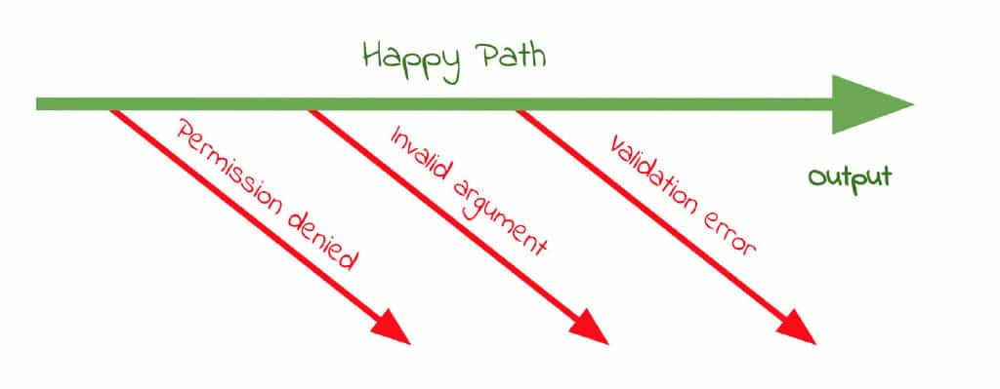

# Best Gain Everyday

记录每天最大的收获

---

Started to record my best gain everyday from 2022/02/16.

（标题带 `*` 表示收获一般，斜体内容表示不太重要。）

# 2022 Feb

## 9. Window sessionStorage & localStorage

_MDN Web Docs:_

- [Web Storage API](https://developer.mozilla.org/en-US/docs/Web/API/Web_Storage_API)
- [Using the Web Storage API](https://developer.mozilla.org/en-US/docs/Web/API/Web_Storage_API/Using_the_Web_Storage_API)
- [Window.sessionStorage](https://developer.mozilla.org/en-US/docs/Web/API/Window/sessionStorage)
- [Window.localStorage](https://developer.mozilla.org/en-US/docs/Web/API/Window/localStorage)

## *_11. 精致的桌游《现代艺术》_

_跟朋友玩这个桌游，虽然自己没有成为大赢家，_
_但发现它的卡牌设计得非常精致、很有艺术气息。_

## *_12. 烂游戏《马里奥派对：全明星》_

_跟朋友一起玩 Switch 游戏《马里奥派对：全明星》，游戏体验极差，让我们玩得非常“生气”，都被它气笑了。_
_发现就算玩的是烂游戏，但是跟朋友一起玩、一起吐槽，也能体验到别样的欢乐。_

## 13. 刷题的意义？

> [@刘未鹏pongba](https://weibo.com/pongba): [2021-4-1 10:19](https://weibo.com/1882579600/K8RlzAj5R)
>
> 很多人之所以喜欢大量的刷题，就是因为有一个“基础牢靠很重要”的思维。
> 这说法好像是挺流行的。我当年上学的时候老师就这么讲了。
> 但问题在于，其实绝大多数人对于什么构成数学的基础，是有误解的。
> 首先，加减乘除等具体运算并不构成解方程的基础，
> 解方程也不构成平面几何的基础，平面几何也不是组合数学的基础，
> 随着数学越往上学，你会发现，你面对的对象越是富含抽象和逻辑，因此抽象和逻辑才是基础。
>
> 如果不明白这个道理，而*仅仅*只注重刷题和刷解题技巧，
> 就会出现一个阶段刷爆了然而数学的画风一边，突然孩子就掉队了，
> 比如从小学低年级到小学高年级，会有一个从具体的数字进入初级的抽象（未知数）的阶段。
> 于是继续刷新的领域的题，然后到了下一个阶段，又掉队了，
> 比如到了初中开始要几何证明，就很强调严密的逻辑推理，归纳，类推等思维。
> 于是继续用老招数，刷刷刷。然后到了高中，又是一道坎。每一道坎都有刷不动的孩子掉队。
>
> 根本原因是，数学的“知识点”并不是数学的基础，解题技巧（方法）也不是数学的基础，
> 数学的基础蕴含在数学思维，即如何证明数学中的法则和定理的过程中。
>
> 更进一步，还有比这更基础的，就是为什么数学家能够想出那么或优雅，或绝妙的证明，
> 这个则超出了数学本身，而是元认知层面的
> （见《How to Solve It》和《Psychology of Problem Solving》），
> 举个例子有一次我给娃做一道对她的年级来说算是思考题的一个几何题，
> 这个题需要对问题的条件进行仔细观察体会并找到一个关键的突破点，
> 一旦得出了那个关键的观察，那问题就会迎刃而解，
> 这类问题最是磨人的小妖精，因为你找不到那个洞察，那你可以说是绝望，一点进展都打不开，
> 人类在这种情况下最容易放弃，因为完全无法预估进度和时间消耗。
> 娃不出所料的迅速陷入了沮丧和放弃，给躺地上去了。
> 我想了想算了，这次先不硬杠意志吧，于是我给列了一张纸的启发式思考策略，和数学没啥特定的关系，
> 就是一些帮助从卡住的状态中脱出来的策略（大多在《How to Solve It》里有），例如：
>
> - 问题的条件有哪些，从条件可以得到哪些结论
> - 需要求解的是什么，想要到达解，需要什么成立
> - 能否通过增加、减少、改变问题的条件求解一个类似的问题从而获得某种启发
> - 能否通过把问题中抽象的部分变成具体的来求解一个具体的问题
> - 能否通过把具体的问题抽象成一个一般性的问题来求解
> - 等等等等
>
> 这些策略和她的特定问题，甚至和数学都不一定相关，
> 但是有了这些策略作为拐杖，她最终把那个问题想出来了。
> 这些元认知策略的作用是帮助人在思维绝境当中逃出生天。
> 也是比证明（为什么）还要更基础层面的内容。
>
> 还有比这更基础的——态度。
> 记忆->练习/熟练->提取->运用型的学科和教学，
> 带来的一个潜台词就是，你的时间/努力和你的成果/奖励是线性的，你可以基本预期到你投入多少会带来多少产出，
> 这本身不是什么坏事，所谓一分耕耘一分收获，但问题是，不是所有的学科都是种田式的，
> 尤其是，当我们以后进入职场和社会去解决问题，创造性工作需要开放式问题的解决能力，
> 所谓开放式问题就是你的时间/努力和成果/奖励是非线性的，
> 例如可能方向对了四两拨千斤，少量投入带来巨大的成果；
> 反过来，也可能是一开始时间投入带来的进展不错，但越到后来进展越困难缓慢；
> 还有可能是相当长一段时间卡死在一个看似毫无进展的情况中，
> 在苦苦求索之后的某一点灵光乍现，柳暗花明，于是奖励曲线直接90度向上；
> 还有可能是有时候觉得有所突破，而后又发现是假突破，反反复复螺旋上升。
> 如果根据每种情况画出对应的曲线，大概如附图所示：
>
> 数学提供的就是面对后面4种类型的收益曲线锻炼你心态会不会崩。
> 尤其是最后两种，在某一类问题中很典型。
> 如果心态慢慢适应这些变化多端的收益曲线，
> 就意味着你面对各种多变的问题和任务自然就具备了不容易放弃的心态和适应能力，
> 这是其他学科很难提供的越野战机会，也是数学的独特魅力所在。
>
> 所以说，从“知识点”，到“技巧”，到“原理”，再到“思维”，最后到“态度”，才是一路深入的基础中的基础。
> 多数人反复刷的“基础”其实只在前两条，知识点和技巧，
> 这两种“基础”是容易随着学习的深入和难度的加大反复出现崩塌的局面的。
> 例如初中二元一次方程的根公式是一个知识点，而因式分解是一个技巧，配方则是一个原理，
> 如何推理出配方这种方法的过程则是思维，
> 至于态度，这个可以读读数学家们是怎么和问题同吃同睡几个月冥思苦想的故事的[doge]
>
> 如果真正的基础打牢，其实学习是事半功倍的，
> 因为底层相通，你就算忘了上层的知识点，技巧，甚至原理，你是仍然可以自己重新推导出来的。
> 说到这里，最后附赠数学家轶事一则：
>
> 一次在希尔伯特的讨论班上，一个年轻人在报告中用了一个很漂亮的定理，
> 希尔伯特说：“这可真是一个妙不可言（wunderbaschon）的定理呀 , 是谁发现的？”
> 那个年轻人茫然地站了很久，对希尔伯特说：“是您……”。
> （引用自：https://www.global-sci.org/v1/mc/issues/1/no2/pdf/86.pdf?1597110101


仅仅靠蛮力去做事是不行的，无论是工作、学习、游戏，还是日常生活。
之前做了太多无关紧要的知识点积累，只不过因为那样做有“一分耕耘，一份收获”的持续获得感罢了……

## 14. JS property getter/setter

[feat(browser): signIn by IceHe · Pull Request #170 · logto-io/js](https://github.com/logto-io/js/pull/170)

- How to write the property getter/setter in JavaScript/TypeScript

- How to mock crypto in jest?

    ```ts
    // jest.setup.js
    const crypto = require('crypto');

    global.crypto = {
        getRandomValues: (buffer) => crypto.randomFillSync(buffer),
        subtle: crypto.webcrypto.subtle,
    };
    ```

- Use `URLSearchParams` to

    - parse parameters from query string

        ```ts
        const [, queryString = ''] = uri.split('?');
        const urlSearchParams = new URLSearchParams(queryString);
        ```

    - construct query string

        ```ts
        const urlSearchParameters = new URLSearchParams({
          foo: 'bar',
          ice: 'he',
        });

        for (const item of items ?? []) {
          urlSearchParameters.append('item', item);
        }

        const urlWithQueryString = `${url}?${urlSearchParameters.toString()}`;
        ```

- Use `URL` to join URL safely with `baseUrl` and `path`

    ```ts
    // e.g.
    const baseUrl = 'https://icehe.xyz/';
    const path = '/foo/bar';
    const url = new URL(path, baseUrl);
    // url.toString() === 'https://icehe.xyz/foo/bar'
    ```

## 15. Differ `aseert` from `create` in `superstruct`

[feat(browser): sign-in session storage by IceHe · Pull Request #175 · logto-io/js](https://github.com/logto-io/js/pull/175)

-   Differences between `assert` and `create` from `superstruct` package

    - [assert](https://docs.superstructjs.org/api-reference/core#assert): just validate
    - [create](https://docs.superstructjs.org/api-reference/core#create): validate, fill with default values and etc.
        - with [coercions](https://docs.superstructjs.org/api-reference/coercions): defaulted and trimmed

-   When to retrieve properties from `window.sessionStorage` or `window.localStorage` in the browser

    - Consistent data in `LocalStorage` should be retrieved and store in the object when constructing (in `constructor`).
    - Temporary data in `SessionStorage` are recommended to be retrieved when needed.

-   Browser session life cycle?

    -   [Window.sessionStorage - MDN Web Docs](https://developer.mozilla.org/en-US/docs/Web/API/Window/sessionStorage)

        > A page session lasts as long as the tab or the browser is open, and survives over page reloads and restores.

    -   How to test sessionStorage life cycle?

        1.  Chrome → ( View → ) Developer → JavaScript Console
        2.  Store session item: Under a.com site, run `window.sessionStorage.setItem('foo', 'bar');`
            - _Check session item: Developer Tools → Application → View the session storage of a.com_
        3.  Redirect to another site: Under a.com site, run `window.location = 'b.com';`
            - _Check session item: as above_
        4. A. Come back to original site: Under b.com site, run `window.location = 'a.com';`
            - B. close the tab, and then restore it
            - C. close the tab, and then open another tab with a.com
        5. Check session item, and find `foo: bar` exists

-   How to access and test the protected properties and methods of a class?

    -   Extends the class, and re-encapsulate the protected properties and methods in the public methods

## 18. Declaration files `*.d.ts`

- [*.d.ts](/js/code-snippet/d.ts.md): declaration files that functions as an interface to the components compiled in JavaScript
- [debugger](/js/code-snippet/debugger.md) statement invokes any available debugging functionality, such as setting a breakpoint

## 19. Pause code with breakpoints - Chrome DevTools

Chrome DevTools - [Pause code with breakpoints](/js/code-snippet/debugger.md#Pause-code-with-breakpoints)

- DOM change, **XHR/Fetch**, event listener, **exception** and function `debug(functionName)`

## *_20. 读《贪婪的多巴胺》_

_《[贪婪的多巴胺](https://book.douban.com/subject/35545272/)》_

- _[我的微博书摘 2022-02-21 13:00](https://weibo.com/2181657940/LgkPF3HJI)_
- _[我的微博书摘 2022-02-21 18:32](https://weibo.com/2181657940/Lgn0t5tag)_
- _[我的微博书摘 2022-02-21 21:45](https://weibo.com/2181657940/LgogZyFqL)_

## 21. Should `return` early

**[Why should you return early?](https://szymonkrajewski.pl/why-should-you-return-early/)**

- [我的微博笔记分享 2022-02-21 14:49](https://weibo.com/2181657940/LguYrEtdF)

> \# Follow the "happy path"
>
> ……
> Happy, because this is the expected positive result and this is the reason why we call this function.
>
> 
>
> Return early is the way of writing functions or methods so that the **expected positive result is returned at the end of the function** and **the rest of the code terminates the execution when conditions are not met**.
>
> \# Get rid of bad cases early
>
> We **should terminate the execution or simply return from function earlier**.
> ……
>
> \# The Bouncer Pattern
>
> **It’s also known as “Assertions” or even  “Guard clauses”.**
> All mean the same and they prevent code execution in case of the invalid state.
> ……

## *_22. 通关《AI梦境档案》_

- _通关《[AI梦境档案](https://www.douban.com/game/30265812/)》_
- _读完《[贪婪的多巴胺](https://book.douban.com/subject/35545272/)》_
    - _[我的微博书摘 2022-02-22 20:12](https://weibo.com/2181657940/LgGwfl3YT)_
- Upgrade @silverhand/eslint-config
    - github.com/silverhand-io/configs
        - [fix(eslint-config): fix rule member-ordering via updating dependencies #18](https://github.com/silverhand-io/configs/pull/18)
        - [fix: bump typescript eslint plugins and disable unnecessary rules #19](https://github.com/silverhand-io/configs/pull/19)
        - [fix(eslint-config): update pnpm-lock.yaml #20](https://github.com/silverhand-io/configs/pull/20)
    - github.com/logto-io/js
        - [chore: bump eslint-config to 0.9.1 #196](https://github.com/logto-io/js/pull/196)

## *_23. 不要熬夜_

_其实现在的情况跟之前差不多，当下该做什么其实还是挺明确的，没什么需要迷惘。_
_但是熬夜玩游戏搅乱身心状态之后，感觉不太好，干啥都不得劲。_
从来都知道熬夜不对，会极大地影响第二天（甚至接下来几天）的身心状态。
但是还是经常被多巴胺诱惑，不断地想要感受、享受 “更多”，直到实在不能再继续才会停下来……
_（虽说理性的策略是“既往不咎，纵情向前”，接下来重新做好就行，但是做错的时候还是会对自己感到失望。）_

学生时代总觉得自己执行力很差，没有毅力，不够聪明……
别说以上这些问题了，其实还有更根本的问题，就是平时自己连最基本的充分休息都做不到！

从理性的角度分析，觉得自己熬夜去做各种事就像是“还没学会走，就迫不及待想要跑起来”。
**还没有养成保证自己充分休息（睡眠）的习惯，就开始贪心、急迫地想要做到更多别的事情，真是愚蠢……**
不能保证头脑尽可能处于最佳状态，枉论做别的事能做得更多更好。
（所以觉得自己学生时代的脑袋真是一桶浆糊，即使到了现在自己已经工作6年多了，还是在低效率地生活，无论做的是正事还是娱乐。）

## *_24. 了解自己 & 通过解决实际问题来快速进步_

_有些地方活得太马虎了，一点都不了解自己……_

_有阅读障碍，打剧本杀最初的读本读得慢，而且要带着耳机，不然别人一说话注意力和思路就被别人带走了。_
_过程中分析的时候也是，很难一边听着别人分析，然后一边自己看着别的线索同时进行别的分析探索。_

_明明自己是个不聪明还容易分神的人，需要专注做事，很后来才了解自己。_
_然而学生时代还是很喜欢一边听歌、唱歌一边做作业……_
_现在干点什么正事，不但很少开音乐，还戴上降噪耳机。_

_还有学生时代上体育课，靠风干、焐干自己的衣服，容易感冒，_
_明明已经感冒很多次了，鼻炎难受极了，上体育课的日子还是不懂得带备用衣服，不会注意身体。_

---

_自己不爱去主动（或被动）地解决现实中的（正常或不得不面对的工作、学业或生活上的）问题，_
_进步就非常慢……（记得这种趋势从学生时代的初一下学期就开始暴露了……）_

其实自己明白“抄书式”学习的效率很低，
不如直接找一个问题去解决，找一个要做的事然后去实现，
通过实践来学习（特别是新手期）效率很高。

为什么自己那么蠢要做“抄书式”的学习呢？
因为偶尔学点新知识主要是为了“缓解焦虑”。
“知识点”上的积累，效率和质量都不高，但是有积累感 ——
随时随地花一点时间就能够明确感受到自己又多知道了一点点新东西。

_自己是个俗人，没有多高的追求，然后采用“抄书式”学习的方式来缓解焦虑的做法就好像挺自然的？_

## 25. Build `*.ts` excluding test files

[refactor(js): convert jest.config.js to jest.config.ts by IceHe · Pull Request #203 · logto-io/js](https://github.com/logto-io/js/pull/203)

-   **`tsc` compiles `*.ts` excluding the test files**. e.g.
    ```json
    // package.json
    {
        "scripts": {
            "build": "tsc -p tsconfig.build.json",
            ……
        },
        ……
    }
    ```
    ```json
    {
        "extends": "./tsconfig",
        "include": [
            "src"
        ],
        "exclude": [
            "**/*.test.ts",
        ]
    }
    ```
-   Use `jest.config.ts` instead of `jest.config.js`.

## *_26. 有趣的桌游《截码站》& 感受音乐酒吧 Tokyo Lounge_

有趣的桌游《截码站》

- 后记：可惜第二天（27号）就玩腻了。

去 Tokyo Lounge 东京酒廊，体验一下音乐酒吧。

- 虽然氛围感觉还不错，但人均消费对我来说还是偏贵了，自己一个人是不会考虑去那消磨时光的。
- [我的微博视频 2022-02-26 23:44](https://weibo.com/2181657940/LhjC5nvX1)

## *_27. 重玩《UNO》感觉还不错_

## 28. package.json peerDependencies & simplify webpack.config.js

[refactor(react): init react package by IceHe · Pull Request #201 · logto-io/js](https://github.com/logto-io/js/pull/201)

- `peerDependencies` in `package.json`
    - References:
        - [Peer Dependencies - nodejs.org/noticias](https://nodejs.org/es/blog/npm/peer-dependencies/)
        - [探讨npm依赖管理之peerDependencies - wonyun - 博客园](https://www.cnblogs.com/wonyun/p/9692476.html)
            - [package.json文件 # peerDependencies - JavaScript 标准参考教程（alpha）- 阮一峰](http://javascript.ruanyifeng.com/nodejs/packagejson.html#toc3)

    > 一个 package 的 `peerDependencies` 用于提示引入该 package 的项目也需要安装哪些（指定版本范围的）其它 package。

[chore(js,browser): simplify wepack config & code coverage excludes src/index.ts by IceHe · Pull Request #205 · logto-io/js](https://github.com/logto-io/js/pull/205)

- Simplify `webpack.config.js` in TypeScript projects
    - How to use Webpack in [TypeScript](https://webpack.js.org/guides/typescript/#loader) projects
        > Webpack documentation recommends to use `ts-loader` to transpile the code, e.g. TypeScript.
        >
        > Actually _"ts-loader uses tsc, the TypeScript compiler…"_,
        > so if have already used `tsc` to transpile TypeScript files `*.ts` into JavaScript files `*.js`,
        > we'd better package `*.js` directly instead of importing another devDependency `ts-loader` to deal with `*.ts` at first.

# 2022 Mar

## 1. PostgreSQL `jsonb` & `timestamptz`

`jsonb`

- [8.14. JSON Types - PostgreSQL 14 Documentation](https://www.postgresql.org/docs/14/datatype-json.html)

    > PostgreSQL offers two types for storing JSON data: `json` and `jsonb`. ……
    >
    > The `json` and `jsonb` data types accept almost identical sets of values as input.
    > The major practical difference is one of efficiency.
    > **The `json` data type stores an exact copy of the input text, which processing functions must reparse on each execution;**
    > **while `jsonb` data is stored in a decomposed binary format that makes it slightly slower to input due to added conversion overhead,**
    > **but significantly faster to process, since no reparsing is needed.**
    > **`jsonb` also supports indexing, which can be a significant advantage.**
    >
    > Because the `json` type stores an exact copy of the input text,
    > it will preserve semantically-insignificant white space between tokens, as well as the order of keys within JSON objects.
    > Also, if a JSON object within the value contains the same key more than once, all the key/value pairs are kept.
    > (The processing functions consider the last value as the operative one.)
    > By contrast, `jsonb` does not preserve white space, does not preserve the order of object keys, and does not keep duplicate object keys.
    > If duplicate keys are specified in the input, only the last value is kept.
    >
    > In general, most applications should prefer to store JSON data as `jsonb`,
    > unless there are quite specialized needs, such as legacy assumptions about ordering of object keys.
    >
    > ……

`timestamptz`

- [8.5 Date/Time Types - PostgreSQL 14 Documentation](https://www.postgresql.org/docs/14/datatype-datetime.html)

    > Note:
    > The SQL standard requires that writing just `timestamp` be equivalent to **timestamp without time zone**, and PostgreSQL honors that behavior.
    > `timestamptz` is accepted as an abbreviation for **timestamp with time zone**; this is a PostgreSQL extension.

## 2. Get started with `koa`

koa: next generation web framework for node.js - [koajs.com](https://koajs.com/)

_（生活片段：用挑染假发片模拟了一下挑染的效果，感觉耳目一新）_

## *_3. 剧情还不错的番剧《天才王子的赤字国家振兴术》_

## *_4. 制作精良的异世界番剧《世界顶尖的暗杀者，转生为异世界贵族》_

## 7. Change the type definition in PostgreSQL & Sign-in with Facebook

Change the type definition in PostgreSQL

- References

    - [ALTER TYPE - SQL Commands - PostgreSQL Docs](https://www.postgresql.org/docs/current/sql-altertype.html)
    - [Updating Enum Values in PostgreSQL - The Safe and Easy Way](https://blog.yo1.dog/updating-enum-values-in-postgresql-the-safe-and-easy-way/)
        - Easy way: [tl;dr](https://blog.yo1.dog/updating-enum-values-in-postgresql-the-safe-and-easy-way/#tldr)
        - Safe way: [Updating/Renaming a Value](https://blog.yo1.dog/updating-enum-values-in-postgresql-the-safe-and-easy-way/#updatingrenamingavalue)
    - Debug
        - [Setting up a PostgreSQL Database on Mac](https://www.sqlshack.com/setting-up-a-postgresql-database-on-mac/)
        - [PostgreSQL - Psql commands - GeeksforGeeks](https://www.geeksforgeeks.org/postgresql-psql-commands/)
        - [Display user-defined types and their details](https://dba.stackexchange.com/a/301746)
            > With `psql`:
            >
            > - `\dT` show list of user-defined types.
            > - `\dT+ <type_name>` show given user-defined type, with details.
            > - `\dT <type_name>` show given user-defined type, without details.

- TODO: note-taking?

    - Setup PosgreSQL on Mac
    - `psql` Usage
    - Change the type definition in PostgreSQL

[feat(core): facebook connector by IceHe · Pull Request #321 · logto-io/logto](https://github.com/logto-io/logto/pull/321)

## 8. Custom ORM supports `order by`

[feat(core): findAllApplications order by createdAt desc by IceHe · Pull Request #344 · logto-io/logto](https://github.com/logto-io/logto/pull/344)

- Implement the `ORDER BY` feature in the custom ORM using `Slonik`
    - Wrong: It doesn't work!
        ```ts
        type OrderDirection = 'ASC' | 'DESC';

        const orderDirection: OrderDirection = 'ASC';
        const orderToken = sql`
            ORDER BY created_at ${orderDirection}'
        `;
        ```
        - Because (e.g.) any string injected into <code>sql\`xxx ${str} ooo\`</code> will be converted to `'xxx "str" ooo'` finally.
    - Correct:
        ```ts
        const orderDirection = order === 'ASC' ? sql`ASC` : sql`DESC`;
        const orderToken = sql`
            ORDER BY created_at ${orderDirection}
        `;
        ```
    - References
        - [gajus/slonik: A PostgreSQL client with strict types, detailed logging and assertions.](https://github.com/gajus/slonik)
            - Principles
                - Promotes writing raw SQL.
                - Discourages ad-hoc dynamic generation of SQL.
            - To sum up, Slonik is designed to **prevent accidental creation of queries vulnerable to SQL injections**.
        - [Discussion of Dynamically generating SQL queries using Node.js](https://dev.to/gajus/dynamically-generating-sql-queries-using-node-js-2c1g/comments)
- Note: `ORDER BY` is after `WHERE` and before `LIMIT` `OFFSET`
- See PR for more details

## 9. Slonik & `type is` 的 ts 语法？

TODO

## 10. TODO?

Should declare the database table fields with default values?

- Should not. Better initialize by code. (It's enough to just declare them `not null`.)

Debug with GitHub Action/Workflow?

- Inputs?

## 12. 迷茫

TODO

## *_13. 玩过套娃最猛的剧本杀《持斧奥夫》 & 初识三国杀的国战模式_

TODO

## 14. JSONB vs Separate columns

TODO

## 15. PR | CORS?

TODO

[feat(schemas): sign-in-experiences by IceHe · Pull Request #361 · logto-io/logto](https://github.com/logto-io/logto/pull/361)

## 16. 理解 PR

[refactor(browser): cache get access token promises by resource by gao-sun · Pull Request #229 · logto-io/js](https://github.com/logto-io/js/pull/229)

- References:
    - 理解 Loop Event: [JS Visualizer 9000](https://www.jsv9000.app/)

TODO

## 17. 理解 PR

[refactor(core): getConnectorInstances by IceHe · Pull Request #405 · logto-io/logto](https://github.com/logto-io/logto/pull/405)

TODO

## 18. lodash.once

- 并发：event loop
- 数据存储设计：design of connectors DB & code
- 协作：PR based on another PR

[feat(core): resuse remote jwk set by IceHe · Pull Request #231 · logto-io/js](https://github.com/logto-io/js/pull/231)

- References:
    - lodash.once

TODO

## *_19. 第一次开卡丁车 & 羊大爷涮肉_

TODO

## *_20. 剧本杀《人偶之匣》_

TODO

## 21. Sign-in-exp PRs

TODO: 豁然开朗，把上周 blocked 的变更，拆成一个个 PR 来提交；也用了 一个 open PR based on another open PR 的技巧来让同事可以并行 review 我的代码变更。

- [refactor(core): make getConnectorInstances access DB only once by IceHe · Pull Request #429 · logto-io/logto](https://github.com/logto-io/logto/pull/429)
- [refactor(core): get sign-in experience by IceHe · Pull Request #426 · logto-io/logto](https://github.com/logto-io/logto/pull/426)
- *_[refactor(core): implement findAllConnectors by findMany and order by enabled desc, id asc by IceHe · Pull Request #430 · logto-io/logto](https://github.com/logto-io/logto/pull/430)_
- *_[refactor(core): getEnabledPasswordlessConnectorInstanceByType  by IceHe · Pull Request #431 · logto-io/logto](https://github.com/logto-io/logto/pull/431)_
- *_[refactor(core): change PATCH /sign-in-exp/:id to PATCH /sign-in-exp by IceHe · Pull Request #427 · logto-io/logto](https://github.com/logto-io/logto/pull/427)_

## *_22. 急性胰腺炎 or 急性肠胃炎？_

TODO

## 23. Get sign-in experience

[refactor(core): get sign-in experience by IceHe · Pull Request #426 · logto-io/logto](https://github.com/logto-io/logto/pull/426)

- Do things asynchronously as possible `Promise.all([…])`.

## 24. GitHub Actions & _复诊确诊_

TODO

## 25. 先设计再写代码……

TODO

详见微博 26 转发的某条英文微博

## *_26. 露营烤烧 & 提督烤鸭_

TODO

## *_27. 剧本杀《一座城》& 暖房玩《达芬奇密码》& 惟炉潮厨的潮汕菜不错_

TODO

## *_28. 厚鲤甲赫的福建菜不错_

TODO

## 29. Zod guard refine

TODO

## *_30. 京A喝酒_

TODO

# 2022 April

## 1. typescript 的 asserts

## 2. 终于合进去了多个 PRs

## *_2. 牛麟荟的潮汕牛肉火锅_

## *_3. 剧本杀《TODO》& 电影《超体》_

TODO：名字待补充

## *_4._

- 恐怖游戏Demo实况《三伏》最后一幕非常精彩

## *_5._

- 又去大喜家和同事一起玩玩《马里奥派对》
- 又去新京熹吃饭

## 6.

终于想通了……

how-to-live.md

<!--

## ?. PostgreSQL & JSONB?

## ?. Lerna?

Lerna

- References:
    - [lerna/lerna: A tool for managing JavaScript projects with multiple packages.](https://github.com/lerna/lerna)
    - [Lerna · A tool for managing JavaScript projects with multiple packages.](https://lerna.js.org/)
    - [learna - npm](https://www.npmjs.com/package/lerna)
