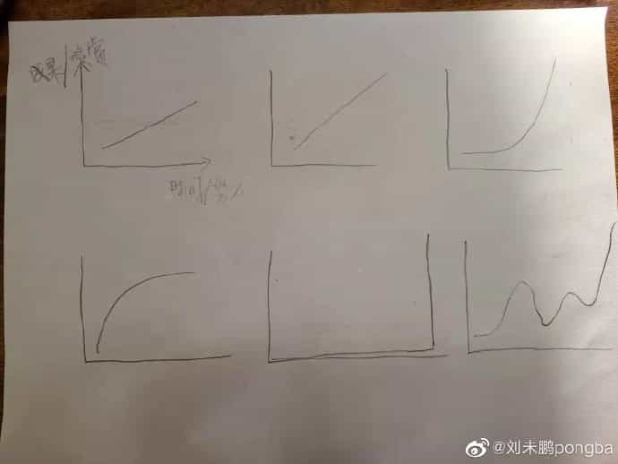

# Best Gain Everyday

---

# 2022 Feb

## 9. Browser sessionStorage & localStorage

- [Web Storage API - MDN](https://developer.mozilla.org/en-US/docs/Web/API/Web_Storage_API)
- [Using the Web Storage API - MDN](https://developer.mozilla.org/en-US/docs/Web/API/Web_Storage_API/Using_the_Web_Storage_API)
- [Window.sessionStorage - MDN](https://developer.mozilla.org/en-US/docs/Web/API/Window/sessionStorage)
- [Window.localStorage - MDN](https://developer.mozilla.org/en-US/docs/Web/API/Window/localStorage)

## 13. 刷题的意义？

> [@刘未鹏pongba](https://weibo.com/pongba): [2021-4-1 10:19](https://weibo.com/1882579600/K8RlzAj5R)
>
> 很多人之所以喜欢大量的刷题，就是因为有一个“基础牢靠很重要”的思维。
> 这说法好像是挺流行的。我当年上学的时候老师就这么讲了。
> 但问题在于，其实绝大多数人对于什么构成数学的基础，是有误解的。
> 首先，加减乘除等具体运算并不构成解方程的基础，
> 解方程也不构成平面几何的基础，平面几何也不是组合数学的基础，
> 随着数学越往上学，你会发现，你面对的对象越是富含抽象和逻辑，因此抽象和逻辑才是基础。
>
> 如果不明白这个道理，而*仅仅*只注重刷题和刷解题技巧，
> 就会出现一个阶段刷爆了然而数学的画风一边，突然孩子就掉队了，
> 比如从小学低年级到小学高年级，会有一个从具体的数字进入初级的抽象（未知数）的阶段。
> 于是继续刷新的领域的题，然后到了下一个阶段，又掉队了，
> 比如到了初中开始要几何证明，就很强调严密的逻辑推理，归纳，类推等思维。
> 于是继续用老招数，刷刷刷。然后到了高中，又是一道坎。每一道坎都有刷不动的孩子掉队。
>
> 根本原因是，数学的“知识点”并不是数学的基础，解题技巧（方法）也不是数学的基础，
> 数学的基础蕴含在数学思维，即如何证明数学中的法则和定理的过程中。
>
> 更进一步，还有比这更基础的，就是为什么数学家能够想出那么或优雅，或绝妙的证明，
> 这个则超出了数学本身，而是元认知层面的
> （见《How to Solve It》和《Psychology of Problem Solving》），
> 举个例子有一次我给娃做一道对她的年级来说算是思考题的一个几何题，
> 这个题需要对问题的条件进行仔细观察体会并找到一个关键的突破点，
> 一旦得出了那个关键的观察，那问题就会迎刃而解，
> 这类问题最是磨人的小妖精，因为你找不到那个洞察，那你可以说是绝望，一点进展都打不开，
> 人类在这种情况下最容易放弃，因为完全无法预估进度和时间消耗。
> 娃不出所料的迅速陷入了沮丧和放弃，给躺地上去了。
> 我想了想算了，这次先不硬杠意志吧，于是我给列了一张纸的启发式思考策略，和数学没啥特定的关系，
> 就是一些帮助从卡住的状态中脱出来的策略（大多在《How to Solve It》里有），例如：
>
> - 问题的条件有哪些，从条件可以得到哪些结论
> - 需要求解的是什么，想要到达解，需要什么成立
> - 能否通过增加、减少、改变问题的条件求解一个类似的问题从而获得某种启发
> - 能否通过把问题中抽象的部分变成具体的来求解一个具体的问题
> - 能否通过把具体的问题抽象成一个一般性的问题来求解
> - 等等等等
>
> 这些策略和她的特定问题，甚至和数学都不一定相关，
> 但是有了这些策略作为拐杖，她最终把那个问题想出来了。
> 这些元认知策略的作用是帮助人在思维绝境当中逃出生天。
> 也是比证明（为什么）还要更基础层面的内容。
>
> 还有比这更基础的——态度。
> 记忆->练习/熟练->提取->运用型的学科和教学，
> 带来的一个潜台词就是，你的时间/努力和你的成果/奖励是线性的，你可以基本预期到你投入多少会带来多少产出，
> 这本身不是什么坏事，所谓一分耕耘一分收获，但问题是，不是所有的学科都是种田式的，
> 尤其是，当我们以后进入职场和社会去解决问题，创造性工作需要开放式问题的解决能力，
> 所谓开放式问题就是你的时间/努力和成果/奖励是非线性的，
> 例如可能方向对了四两拨千斤，少量投入带来巨大的成果；
> 反过来，也可能是一开始时间投入带来的进展不错，但越到后来进展越困难缓慢；
> 还有可能是相当长一段时间卡死在一个看似毫无进展的情况中，
> 在苦苦求索之后的某一点灵光乍现，柳暗花明，于是奖励曲线直接90度向上；
> 还有可能是有时候觉得有所突破，而后又发现是假突破，反反复复螺旋上升。
> 如果根据每种情况画出对应的曲线，大概如附图所示：
>
> 数学提供的就是面对后面4种类型的收益曲线锻炼你心态会不会崩。
> 尤其是最后两种，在某一类问题中很典型。
> 如果心态慢慢适应这些变化多端的收益曲线，
> 就意味着你面对各种多变的问题和任务自然就具备了不容易放弃的心态和适应能力，
> 这是其他学科很难提供的越野战机会，也是数学的独特魅力所在。
>
> 所以说，从“知识点”，到“技巧”，到“原理”，再到“思维”，最后到“态度”，才是一路深入的基础中的基础。
> 多数人反复刷的“基础”其实只在前两条，知识点和技巧，
> 这两种“基础”是容易随着学习的深入和难度的加大反复出现崩塌的局面的。
> 例如初中二元一次方程的根公式是一个知识点，而因式分解是一个技巧，配方则是一个原理，
> 如何推理出配方这种方法的过程则是思维，
> 至于态度，这个可以读读数学家们是怎么和问题同吃同睡几个月冥思苦想的故事的[doge]
>
> 如果真正的基础打牢，其实学习是事半功倍的，
> 因为底层相通，你就算忘了上层的知识点，技巧，甚至原理，你是仍然可以自己重新推导出来的。
> 说到这里，最后附赠数学家轶事一则：
>
> 一次在希尔伯特的讨论班上，一个年轻人在报告中用了一个很漂亮的定理，
> 希尔伯特说：“这可真是一个妙不可言（wunderbaschon）的定理呀 , 是谁发现的？”
> 那个年轻人茫然地站了很久，对希尔伯特说：“是您……”。
> （引用自：https://www.global-sci.org/v1/mc/issues/1/no2/pdf/86.pdf?1597110101



仅仅靠蛮力去做事是不行的，无论是工作、学习、游戏，还是日常生活。
之前做了太多无关紧要的知识点积累，只是因为那样做有“一分耕耘，一份收获”的持续获得感。

如果之前自己做得都不对，以后自己该怎么做呢？感觉又开始陷入迷茫。
其实还好，对于现在的自己来说，实在没必要想太多……
因为自己现在实在太弱鸡了 —— 无论能力（软技能、硬技能）还是意愿（身心习惯）都不行，
所以想太多也没用，先把最基础的事情做好吧。

## 14. JS property getter/setter

[logto-io/js PR - feat(browser): signIn #170](https://github.com/logto-io/js/pull/170)

- How to write the property getter/setter in JavaScript/TypeScript
- How to mock crypto in jest?
    ```ts
    // jest.setup.js
    const crypto = require('crypto');

    global.crypto = {
        getRandomValues: (buffer) => crypto.randomFillSync(buffer),
        subtle: crypto.webcrypto.subtle,
    };
    ```
- Use `URLSearchParams` to
    - parse parameters from query string
        ```ts
        const [, queryString = ''] = uri.split('?');
        const urlSearchParams = new URLSearchParams(queryString);
        ```
    - construct query string
        ```ts
        const urlSearchParameters = new URLSearchParams({
          foo: 'bar',
          ice: 'he',
        });

        for (const item of items ?? []) {
          urlSearchParameters.append('item', item);
        }

        const urlWithQueryString = `${url}?${urlSearchParameters.toString()}`;
        ```
- Use `URL` to join URL safely with `baseUrl` and `path`
    ```ts
    // e.g.
    const baseUrl = 'https://icehe.xyz/';
    const path = '/foo/bar';
    const url = new URL(path, baseUrl);
    // url.toString() === 'https://icehe.xyz/foo/bar'
    ```

## 15. Differ aseert from create in superstruct

[logto-io/js PR - feat(browser): sign-in session storage  #175](https://github.com/logto-io/js/pull/175)

- Differences between `assert` and `create` from `superstruct` package
    - [assert](https://docs.superstructjs.org/api-reference/core#assert): just validate
    - [create](https://docs.superstructjs.org/api-reference/core#create): validate, fill with default values and etc.
    - [Coercions](https://docs.superstructjs.org/api-reference/coercions): defaulted and trimmed
- How to access and test the protected properties and methods of a class
    - Extends the class, and re-encapsulate the protected properties and methods in the public methods
- When to retrieve properties from `window.sessionStorage` or `window.localStorage` in the browser
    - Consistent data in `LocalStorage` should be retrieved and store in the object when constructing (in `constructor`).
    - Temporary data in `SessionStorage` are recommended to be retrieved when needed.
- Browser session life cycle?
    - [Window.sessionStorage - MDN](https://developer.mozilla.org/en-US/docs/Web/API/Window/sessionStorage)
        - **A page session lasts as long as the tab or the browser is open, and survives over page reloads and restores.**
    - How to test sessionStorage life cycle?
        - 1. Chrome → ( View → ) Developer → JavaScript Console
        - 2. Store session item: Under a.com site, run `window.sessionStorage.setItem('foo', 'bar');`
            - Check session item: Developer Tools → Application → View the session storage of a.com
        - 3. Redirect to another site: Under a.com site, run `window.location = 'b.com';`
            - Check session item: as above
        - 4. A. Come back to original site: Under b.com site, run `window.location = 'a.com';`
            - B. close the tab, and then restore it
            - C. close the tab, and then open another tab with a.com
        - 5. Check session item, and find `foo: bar` exists
