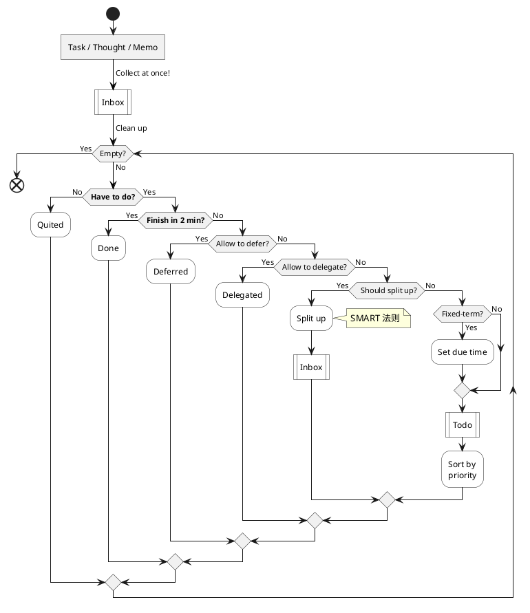
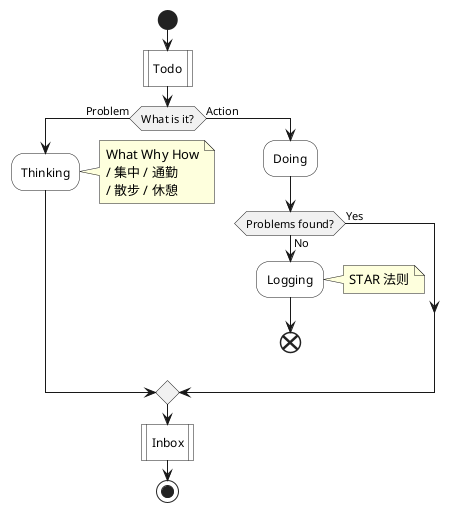

# Todo List ( TBC )

## 小事将就

不重要的事情, 将就一下就好, 不要重复投入精力, 浪费时间

- 丢了东西, 重复检查
    - 强迫症：找不到就算了, 还有别的更重要的事该先做
- 记不住事, 反复记忆
    - 没有必要, 应该隔段时间, 之后再重复。

## 雷厉风行

通过果断的身体行动, 带动精神状态的活跃.

## 专时专用

暂停无止境的工作

- 工作时永远做不完, 多关心其它东西

## 先紧后松

工作 (节奏) 安排 先紧后松, 在后续再挤出空闲做自己想做的事情.
( 看看实际效果来调整 )

## 三思后行

稍微重要 (定义?) 的事, 都要走完整个 GTD Flow 流程.

- 考虑清楚该不该做? ( 取舍 / Why )
- 是否立即去做?
- 是否该拆分?
- 设置截止时间.
- 区分优先级.

所有非短时间能够完成的事, 都必须用 SMART 法则定义清楚任务.

- Specific
- Measurable
- Achievable
- Relevant
- Time-Based

## 延迟满足

- 一周只喝 X 瓶可乐 ?
- 先完成 工作/学习, 再去 玩游戏/享受美食 !
- ……

## 规律生活

**严格遵照既定时间表行动**, 不可抗的情况除外.

- 遵照 "时间表" 行动
    - **即使事情做到一半, 也必须立刻中止, 着手去做下一件事.**
    - 例如, 安排在今天的工作还没完成, 只要还没截止, 明天再做.
        - 没必要恋战, 其实经常被打断, 所以这没什么大不了, 生活还得继续.
        - 遵照 "时间表" 完成不了, 是因为一开始计划得不好, 不断改进就好.
- "不可抗" 的情况除外
    - **除非 工作任务死线 / Boss 命令 / 紧急事故** 等.
- 必须留足 "缓冲时间"
    - **缓冲时间 以供灵活安排** 娱乐 (愉悦) / 放松 (精神) / 休息 (身体) 等.

## 取消许可，牢记理由

- 问：“觉得自己做事做得还行或者已经没有动力了，想要放松、放弃、放纵，怎么办？”
    - 想要放弃的时候，不要总是想着过去曾经做出的努力，以致过分放松，随意 “犒劳” 自己。
        - 例如，吃顿好的，庆祝减肥成功！
    - 而是去回想让你坚持做出那么多努力的理由，这样可以让你能够坚持得更久。

## 颓废也要坚持做事

- 问：“很颓废，什么都不想做，只想（过度）休息、放松、玩乐，怎么办？”
- 更要坚持做事！只有这样才能改变现状。
    - 颓废不会因为过度的休息放松而消失；
    - 积极向上反而更有可能改善状态，至少还能获得有一些做事的成果。

# GTD Flow ( TBD )

## Plan

Have to do _& Must DO !_

- **增加自身能力, 提升未来收入**
    - Sort by priority !
        - 收益 : <u>乘数效应 > 线性收益</u>
        - 性质 : <u>操练脑力 / 通用知识</u> (原理) > 积累普通知识点
        - 没有定论的任务, 先放在一边, 慢慢考察
        - 时效 : 紧急 > 长期 ( 没办法 )
- **保持/改善 身体健康**
- 保持/改善 精神状态 ( 乐观向上, 当然有时也需要 "悲观" 来更清醒地自省 )

Finish in 2 min

- 并非严格 2 分钟, 而是 <u>很快就能完成的任务</u>

Allow to defer

- 允许推迟的, 通常都是因为 "阻塞" ( <u>即是依赖于别人任务的结果</u> )
    - 否则就属于 do not "Have to do" 范畴的任务, 第一步就该被移除了
- **学习不能推迟** ! 现在就是学习最好的时间 !
    - **不要小瞧 10 分钟 / 15 分钟, 这点微小的碎片时间 !**
    - **除此之外, 你可能别无所有…**

Allow to delegate

- <u>可不可以让 同事/朋友/舍友 帮忙完成 ?</u>
    - 因为自己通常没有 "权力" 指使他人做某事
    - 所以没有 "利益" 诱导的话, 就不要指望能够委派自己的任务给他人了

Should split up

- 大而无当的任务
- 预估花费时间过长

Fixed-term

- 拥有 "截止期限" 的任务
- 特定时间点发生的 "事件" ( 通常放 "日历" )

Sorted by priority

- 做正确的事, 做最正确 (重要) 的事 !!!

## Action

