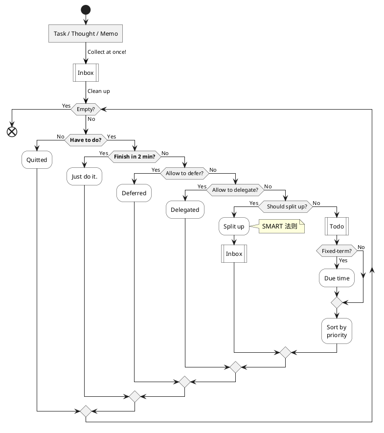

# 更生

<!-- Rehabilitation -->

## 纲领

<!-- Guidelines _( 指导方针 )_ -->

To be a better man.

### 方式

<!-- Policy _( 政策, 方针; 策略, 手段 )_ -->

- 做事要领 : **将 "经验教训" 一个个地沉淀成习惯**
    - _想要 "毫不费力" , 就要 "习惯成自然"_
- 做正确的事 : **抓住重点**
    - _GTD 取舍 → 排优先级_
- 正确地做事 : **遵循 SMART 法则和 PDCA 循环**
    - _限时完成, 特别是不重要的事_
    - _忍耐这时 "完美主义和强迫症" 带来的不适, 直到形成新的舒适区_
- 坚决迅速地执行 : **做好一件小事, 然后再做好下一件小事, 然后不断循环**
    - _立即去做, 5分钟快速启动; 不三心二意, 雷厉风行_

### 优先级

<!-- Priority -->

**1\. 健康** : _身体是革命的本钱_

- **i. 睡眠**
    - _早睡早起, 充足睡眠_
- **ii. 饮食**
    - _清淡 : 尽量 回避 高糖、高盐、高油、辛辣_
    - _节制 : 只吃 七八分饱_
- **iii. 运动**
    - _坚持每天运动_

**2\. 工作** : _保证温饱, 改善生活_

- _尽量 按时、保质、保量 完成任务; 不拖后腿, 不给别人添麻烦_

<!--    - _Done is better than perfect._ -->

**3\. 学习** : _长久地改善生活_

- _坚持每天学习_

4\. 杂务 _( 不得不做 )_

- _不得不做, 就尽快完成_

5\. 娱乐 _( 生活乐趣 )_

- _如果能从 "睡眠、饮食、运动、工作、学习、杂务" 中获得乐趣, 就没必要娱乐_
- _如果去娱乐, 没必要强迫自己把订阅的全部娱乐节目都消费完, 享受不完就算了_

<!--    - _苦海无涯回头是岸_ -->

## 目标

<!-- Targets -->

年度

<!-- Yearly -->

- 健康
    - [ ] ~ 2020 : **养成 健康生活 的习惯**
        - _达成标准 : 连续 7 天完成所有 健康习惯打卡_

<!-- - 工作 -->
<!--     - [ ] ~ 2021 上 : **养成 遇事果断 & 做事坚决 的习惯** _( 工作 )_ -->
<!--         - _达成标准 : 连续 7 天完成所有 果断坚决 的习惯打卡_ -->
<!-- - 学习 -->
<!--     - [ ] ~ 2021 下 : **养成 读书学习 的习惯** _( 学习 )_ -->
<!--         - _达成标准 : 连续 7 天完成所有 学习日程 ( 每个工作日 4h , 每个周末 11h )_ -->

季度

<!-- Seasonly -->

- 工作
    - [ ] ~ 2021.01.15 : **YFD Interview**

<!-- - [ ] ~ 2021.03.15 : 详细复习 算法 & 数据结构, 刷题 _( 学习 )_ -->

月度

<!-- Monthly -->

- 学习
    - 时刻准备好 Interview
        - [ ] ~ 2020.12 : **详细复习 Redis、MySQL、MQ**

<!--     - [ ] ~ 2021.01 : **粗略复习 算法 & 数据结构, 刷题** -->
<!--     - [ ] ~ 2021.02 : **Interviews & Got an offer** -->
<!-- - [ ] 每月 读完一本专业技术书 -->
<!--     - [ ] ~ 2021.03 : 读完 深入理解 JVM -->
<!--     - [ ] ~ 2021.04 : 读完 JZ Offer -->
<!--     - [ ] ~ ????.?? : 网络分析就那么简单 -->
<!--     - [ ] ~ ????.?? : _Java 并发编程实践_ -->
<!--     - [ ] ~ ????.?? : _Linux Development_ _( 重读、补笔记 )_ -->

每周

<!-- Weekly -->

- 健康
    - 运动
        - [ ] 尽量 打一次羽毛球 2h
- 工作
    - [ ] ~ 2020.12.18 Fri : **开发 联调工具 & 配合 堡主测试**

每日

<!-- Daily -->

- 健康
    - 睡眠
        - [ ] 23:30 ~ 23:45 躺床
        - [ ] 07:15 ~ 07:30 起床
    - 饮食
        - [ ] 尽量 有一顿饭满足 "清淡 + 节制" 的要求
    - 运动
        - [ ] 起床后 ~ 上班前 玩健身环 30min
- 工作
    - [ ] 工作日尽量 按时、保质、保量 完成任务
- 学习
    - [ ] 起床后 ~ 上班前 学习并做笔记 1h
- 杂务
    - [ ] 果断 _( 立即去做 )_ 、坚决 _( 不三心二意 )_ 、迅速地完成杂务
- 娱乐
    - [ ] 就不看完所有订阅内容
        - _WX、票圈、WB、B站、B漫、DMZJ…_

<!--     - [ ] 每天只看四次 微信、朋友圈、微博、B站、B漫、DMZJ、…
<!--         - 推荐时间: 起床、午餐、晚餐、临睡 -->

<!-- - 健康 - 饮食 - _参考食谱 : 暖 | 冷沙拉 + 粗粮面包 | 鸡蛋 | 水果 | … + 豆浆 | 酸奶 |牛奶 | … ?_ -->

## 工具

<!-- Tools -->

- **Library - 正向循环**
    - 反省 → 改进 → 计划 → 取舍 → 排优先级 → 行动 _( e.g., PDCA )_
- **Alarm - 专时专用**
    - 什么时间就该干什么事, 只提醒最重要的事务
- **BlockyTime - 减少浪费**
    - 记录时间使用情况
    - _提高效率、时间杠杆率, 得靠 Library_
- **Forest - 保持专注**
    - 减少玩手机分神的机会, 缩短玩手机的时长
- **TickTick - 减轻负担**
    - 暂存事项, 清空大脑, 减轻心理负担; 从中选择一件事来做就行
    - _没必要因为待办事项多而焦虑_
- **Timer - 限制时长**
    - _特别是不重要的事_

<!-- - **Library - 正向循环** : PDCA - Plan 计划 → Do 行动 → Check 反省 → Act 改进 -->
<!--     - _所思所想、待办杂项、工作任务、学习计划、日期事件、重复事件_ -->
<!--     - _( 暂存焦虑 : 在我心目中, "暂存区" 的说法比 "备忘录" 更切中要害 )_ -->
<!-- - **Notification - 保持专注** : 默认关闭所有 Apps 的通知权限 -->
<!--     - _除了 钉钉、日历、电话、短信、微信、邮件、时间块_ -->
<!-- - **Notification - 保持专注** : 默认关闭所有 Apps 的通知权限 -->
<!--     - _除了 钉钉、日历、电话、短信、微信、邮件、时间块_ -->

注意 : 他们只不过是 "器" —— 即手段和工具

- **重要的是达成目标, "马上开始行动" 比 "先纠结一番该用啥工具" 明智得多**
    - _对我来说尤其如此_

<!-- 经常需要使用手机做一些正事, 例如记录时间使用情况、查看工作消息, 不然可以用 OffScreen & ScreenTime 强力控制使用手机的时长 ! -->

## 细则

<!-- Regulations -->

### 取舍

<!-- What to Do -->

**GTD**

### 做法

<!-- How to Do -->

**SMART 法则**

<!-- SMART Principle -->

Specific : _( 目标 )_ 具体 _( 明确, 可以分解出具体的行动步骤 )_

- _~~成为勤奋学习的人~~_
- _今天读 Java Basic_

Measurable : 可度量 _( 可量化 )_

- _~~今天读 Java Basic~~_
- _今天读 10 页 Java Basic_

Achievable : 可实现 _( 目标不宜过高 ( 或过低 ) )_

- _~~今天读 100 页 Java Basic~~_
- _今天读 10 页 Java Basic_

Relevant : _( 与其他目标 )_ 相关 _( 例如终极目标, 否则意义不大 )_

- _~~今天读 10 页经济学导论~~_
- _今天读 10 页 Java Basic_

Time-based : 有时间期限 _( 区分 可接受的 / 合理的 / 实际的时长 )_

- _~~今天读 10 页 Java Basic~~_
- _今天计划花 2h 读 10 页 Java Basic_

_( 事务的轻重缓急, 不是 SMART 法则的关注点 )_

**PDCA 循环**

<!-- PDCA Cycle -->

Plan 规划 ( 计划 )

- 制定具体目标 & 计划 (过程), 以获得想要的成果

Do 执行 ( 行动 )

- 执行计划 : 展开任务, 组织实施
    - 尝试做一些小的改变
    - 并收集信息以便评价这些改变是否有效

Check 检查 ( 反省 )

- 检查完成度 : 对关键点 & 结果进行检查, 看有无遗漏
    - 对比期望的成果, 看有哪里合意, 哪里不合意
    - 看执行过程, 跟最初的计划有何不同 (过程偏差)

Act 行动 / Adjust 调整 ( 改进 )

- "Also called 'Adjust', this act phase is where a process is improved."
- 改善/调整 : 纠正偏差, 确定新目标, 制定下一轮的计划
- 上两步中分析得出
    - 问题 Problems
    - 过程偏差 Non-conformities
    - 可以改进的地方 Opportunities for improvement
    - 低效率 Inefficiencies
    - ……
- 研究以上问题 ( Issues ), 找到根本原因 ( Root causes )
    - 通过修改计划, 去消除这些原因
    - 然后下一个循环就有了更好的基线 ( Base-line )
        - 更好的指引 ( Instructions )
        - 标准 ( Standards )
        - 目标 ( Goals )
- 以期下一个循环, 不再重复发生相同的问题 ( Recurrence of identified issues )

### 行动

<!-- Just Do It / Action -->

**经验**

<!-- Exprience -->

<!-- _( 踟蹰不前的时候, 劝诱自己行动起来 )_ -->

**从小事做起** <!-- _( 切合实际的 )_ 行动方针 -->

- 做好最基础的小事, 要循序渐进, 不要妄想 "一口吃成胖子" !
    - 做好一件小事, 然后再做好下一件小事, 然后不断循环.
- 将经验教训, 一个一个地 "沉淀" 成习惯, 稳扎稳打, 打好地基.

**能努力就努力**

- 反正迟早都有忍不住去颓废享乐的时候, 那么能够坚持努力的时候, 为什么不更努力进取一点呢?

**不想工作就读书**

- 就算要拖延做正事 _( 例如工作 )_ , 也该做点有价值的事来拖延! _( 例如读书 )_

**哪怕只读一页**

- 我就是一滩烂泥、一坨屎, 再微小的努力也是向上! _( 例如读一页书 )_

**不要急**

- 碰到一时想不通的问题, 就好好思考, 好好反省, 找到答案之后, 再继续行动, 不用着急焦虑. _( 例如反省、重温本文 )_

**不要等**

- 确定该做什么事之后, 就去做, 不要等.

## 日程

<!-- Daily Schedule -->

<!--

- 正常内容 : 必须做的杂务
    - 还包括 日常娱乐、心理休息 等
- _斜体内容 : 身体休息_
- **粗体内容 : 运动**
- **粗体内容 : 学习**
- <u>下划线内容 : 工作</u>

-->

### 工作日

<!-- Weekdays -->

- 23:30-00:00 躺床, 娱乐
- _00:00-07:15 睡眠 7h15m_
- _07:15-07:30 醒来, 赖床 15m_
- 07:30-07:45 起床, 收拾, 内务, 称重, 烧水, 瑜伽垫 15m
- **07:45-08:15 健身环 & 音视频**
- 08:15-08:30 洗漱, 保养, 拾掇 15m
- **08:30-10:00 早上学习 1.5h**
- 10:00-10:30 **上班**, 杂务
- <u>10:30-12:00 工作 1.5h</u>
- 12:00-13:00 午餐, **遛弯** 1h
- _13:00-13:30 午休_
- <u>13:30-17:00 工作 3.5h</u>
- **17:00-18:00 傍晚学习 1h**
- 18:00-19:00 晚餐, **遛弯** 1h
- <u>19:00-20:00 工作 1h</u>
- 20:00-20:45 **下班**, 杂务 45m
- 20:45-21:30 洗澡, 保养 45m
- 21:30-22:00 干发, 音视频
- **22:00-23:30 睡前学习 1.5h**

<!--

统计 Stats

- 必须做的杂务 4.5h
- _身体休息 8h_
- **运动 1.5h**
- **学习 4h**
- <u>工作 6h</u>
- 4.5h + 8h + 1.5h + 4h + 6h = 24h

-->

### 周末

<!-- Weekends -->

- 23:30-00:00 躺床, 娱乐
- _00:00-07:15 睡眠 7h15min_
- _07:15-07:30 醒来, 赖床 15m_
- 07:30-07:45 起床, 收拾, 内务, 称重, 烧水, 瑜伽垫 15m
- **07:45-08:15 健身环 & 音视频**
- 08:15-08:30 洗漱, 保养, 拾掇 15m
- **08:30-12:00 上午学习 3.5h**
- 12:00-13:00 午餐, 娱乐 1h
- _13:00-13:30 午休_
- **13:30-18:00 下午学习 4.5h**
- 18:00-19:00 晚餐, 娱乐 1h
- **19:00-20:45 晚上学习 1.75h**
- 20:45-21:30 洗澡, 保养 45m
- 21:30-22:00 干发, B站
- **22:00-23:30 睡前学习 1.5h**

<!--

统计 Stats

- 必须做的杂务 4h+
- _身体休息 8h_
- **运动 30m**
- **学习 11h+**
- <u>工作 0h</u>
- 4.25h + 8h + 0.5h + 11.25h + 0h = 24h

 -->

## 参阅

- [GTD](/snips/principles/gtd.md)
- [PDCA 循环](/snips/principles/pdca.md)
- [SMART 法则](/snips/principles/smart.md)
- [日程 ( Routine )](/lifelogs/archived/routine.md) & [TBC](/lifelogs/archived/tbc.md)
- [生活指南 ( Life Manual )](/lifelogs/archived/life-manual.md)
- …

> 真正的简约不是删繁就简，而是纷繁中建立秩序。
> —— Jony Ivy
