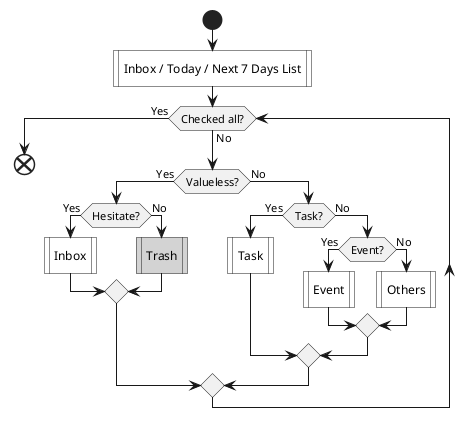
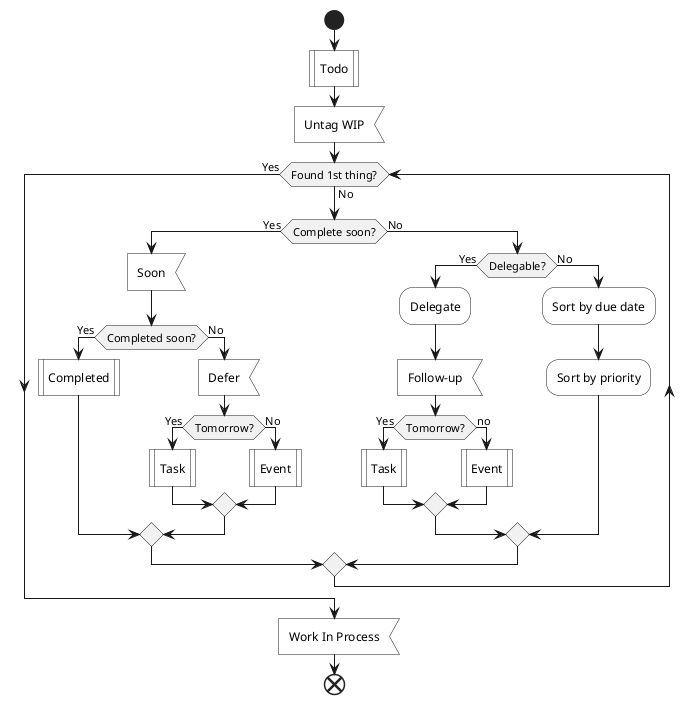
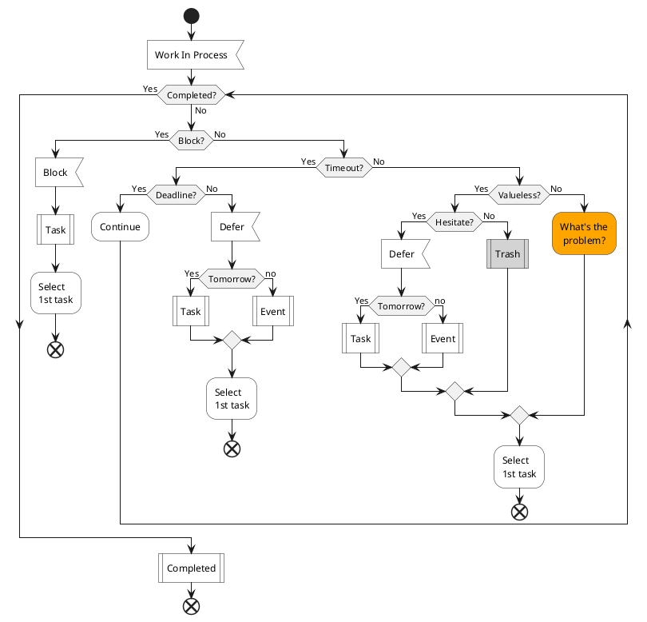
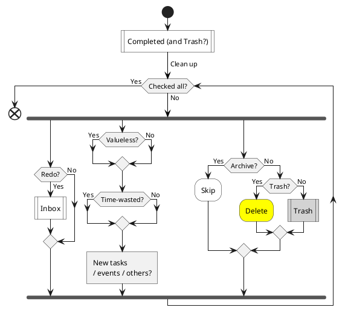

# 更生

Rehabilitation

---

2021-01-13

_暂时以 simple-rehabilitation.md 为准, 归档本文档 ( 不更新 ) ._

## 纲领 ( 道 )

Guidelines _( 指导方针 )_

To be a better man. _( To be a better ME. )_

### 方式

Policy _( 政策, 方针; 策略, 手段 )_

-   做事要领: **将 "经验教训" 一个个地沉淀成习惯**

    _想要 "毫不费力" , 就要 "习惯成自然"_

-   做正确的事: **抓住重点**

-   正确地做事: **限时完成**, _特别是不重要的事_

    GTD 流程 + PDCA 循环 + SMART 法则

    _忍耐这时 "完美主义和强迫症" 带来的不适, 直到形成新的舒适区_

-   果断坚决迅速地行动: **做好一件小事, 然后再做好下一件小事, 然后不断循环**

    _立即去做, 5分钟快速启动; 不三心二意; 雷厉风行_

### 优先级

Priority

1.  **健康**: _身体是革命的本钱_

    -   **i. 睡眠**

        _早睡早起, 充足睡眠_

    -   **ii. 饮食**

        _清淡: 尽量 回避 高糖、高盐、高油、辛辣_

        _节制: 只吃 七八分饱_

    -   **iii. 运动**

        _坚持每天运动_

1.  **工作**: _保证温饱, 改善生活_

    _尽量 按时、保质、保量 完成工作任务; 不拖后腿, 不给别人添麻烦._

    _Done is better than perfect._

1. **学习**: _长久地改善生活_

    _坚持每天学习_

1. 杂务: _不得不做_

    _不得不做, 就尽快完成_

1. 娱乐: _生活乐趣_

    _如果能从 "睡眠、饮食、运动、工作、学习、杂务" 中获得乐趣, 就没必要娱乐_

    _如果去娱乐, 没必要强迫自己把订阅的全部娱乐节目都消费完, 享受不完就算了_

<!--     _苦海无涯回头是岸_ -->

## 细则 ( 术 )

Regulations

### 行动经验

Action Exprience

_踟蹰不前的时候, 劝诱自己行动起来_

-   **从小事做起**

    _( 切合实际的行动方针 )_

    -   做好最基础的小事, 要循序渐进, 不要妄想 "一口吃成胖子" !

        做好一件小事, 然后再做好下一件小事, 然后不断循环.

    -   将经验教训, 一个一个地 "沉淀" 成习惯, 稳扎稳打, 打好地基.

-   **能努力就努力**

    反正迟早都有忍不住去颓废享乐的时候, 那么能够坚持努力的时候, 为什么不更努力进取一点呢?

-   **不想工作就读书**

    就算要拖延做正事 _( 例如工作 )_ , 也该做点有价值的事来拖延! _( 例如读书 )_

-   **哪怕只读一页**

    我就是一滩烂泥、一坨屎, 再微小的努力也是向上! _( 例如读一页书 )_

-   **不要急**

    碰到一时想不通的问题, 就好好思考, 好好反省, 找到答案之后再继续行动, 不用着急焦虑 _( 例如反省、重温本文 )_

-   **不要等**

    确定该做什么事之后, 就去做, 不要等.

### 每日流程

**Daily Flow**

GTD Flow + PDCA Cycle + SMART Principle

<!--

要想清楚需要流程图达到什么效果?

- ~~简洁好看? 仅显示动作或目标, 通用性可参考性强, 但可行性不强.~~
    - 这么做没必要, 我就是参考别人画的图来改进的, 别人也参考那个图就完事了.
    - 根据自己简化完的流程图, 自己看也别扭? 简化一版, 看看效果.
    - 看完简化版的效果, 暂时觉得要保留就保留内容最全的版本, 以后再删减. (2020-12-20)
- ~~表意清晰? 动作 + 具体操作, 但是繁复.~~
- 实操步骤明确? 操作步骤更详细繁复, 更个人化, 通用性和可参考性更差了.

实际做法?

- A. 三个版本都画? 比较花时间维护
- B. 画两个版本? Emmm… 找平衡
- C. 只画一个版本? 最省事, 但不甘心, 想要以后再推广…

-->

#### Collect

0\. Collect tasks and anything else

_( anytime )_

- Arriving Events? Due events.

#### Filter

1.1\. Plan - Filter tasks

_( night or morning )_

-   Why include Today and Next 7 Days List?

    Check arriving events ( which are not in Task & Todo List ).

-   Checked all? Or too many tasks.

    Too many tasks: Total duration over available time today.

-   Event: Events, future tasks ( without tomorrow ) .

-   Others: Thoughts, questions and something else.

#### Prepare

1.2\. Plan - Prepare tasks

_( night or morning )_

-   Categorize:

    Work / Learn / Think / Read / Zheteng / Fun / Rest / Sport / Have-to / Waste / …

-   Priority

    - High: Important & urgent - _1st Thing 1st_
    - Medium: Important & not urgent - _Important_
    - Low: Not important & urgent - _Concerned_
    - No: Not important & not urgent - _Trash_

-   Deferrable? Not important.

-   Splittable? Not specific or duration > 2h.

    Ideal duration <= 2 hours

-   Split: Split into subtasks

#### Select

2.1\. Do - Select 1st task

_( morning, noon, afternoon, evening )_

-   Checked all? Or too many todos.

    Too many todos: Total duration over available time today.

-   Complete soon? Estimated duration <= 5min.

-   Delegable? Able to assign to another person.

#### Doing

2.2\. Do - Doing 1st task

_( morning, noon, afternoon, evening )_

- Block? Encounter a problem.
- Timeout? Over expected duration or till end of day.
- Finish soon? Extra duration < 1h or till end of day.

#### Reflect

3\. Check - Reflect done tasks

_( night or morning )_

- Checked all? Or till end of day.
- Redo? Need to redo. _( Poor quality? )_
- Reflect?
    - _A. Add to Inbox, Thought & Question_
    - _B. Update its description or insert a new comment?_
    - _C. Write in reflect.md of IceHe's Library_
    - …

#### Improve

4\. Act / Adjust - Improve daily flow

- Update regulations in rehabilitation.md

### 参考资料

References

- [GTD](/snips/principles/gtd.md)
- [PDCA 循环](/snips/principles/pdca.md)
- [SMART 法则](/snips/principles/smart.md)
- [生活指南 ( Life Manual )](/lifelogs/archived/life-manual.md)
- …

<!-- - [日程 ( Routine )](/lifelogs/archived/routine.md) & [TBC](/lifelogs/archived/tbc.md) -->

#### GTD 流程

**GTD Flow**

Reference

#### PDCA 循环

**PDCA Cycle**

Plan 规划 ( 计划 )

- _制定具体目标 & 计划 ( 过程 ) , 以获得想要的成果_

Do 执行 ( 行动 )

-   _执行计划: 展开任务, 组织实施_

    _尝试做一些小的改变_

    _并收集信息以便评价这些改变是否有效_

Check 检查 ( Reflect 反省 )

-   _检查完成度: 对关键点 & 结果进行检查, 看有无遗漏_

    _对比期望的成果, 看有哪里合意, 哪里不合意_

    _看执行过程, 跟最初的计划有何不同 ( 过程偏差 )_

Act 行动 / Adjust 调整 ( Improve 改进 )

-   _"Also called 'Adjust', this act phase is where a process is improved."_

-   _调整 / 改善: 纠正偏差, 确定新目标, 制定下一轮的计划_

-   _上两步中分析得出_

    - _遭遇问题 Problems_
    - _过程偏差 Non-conformities_
    - _可以改进的地方 Opportunities for improvement_
    - _低效率 Inefficiencies_
    - _……_

-   _研究以上问题 ( Issues ) , 找到根本原因 ( Root causes )_

    _通过修改计划, 去消除这些原因_

    _然后下一个循环就有了更好的基线 ( Base-line )_

    - _更好的指引 ( Instructions )_
    - _标准 ( Standards )_
    - _目标 ( Goals )_

-   _以期下一个循环, 不再重复发生相同的问题 ( Recurrence of identified issues )_

#### SMART 法则

**SMART Principle**

Specific: _( 目标 )_ 具体 _( 明确, 可以分解出具体的行动步骤 )_

- _~~要努力学习~~_
- _今天读 Java Basic_

Measurable: 可度量 _( 可量化 )_

- _~~今天读 Java Basic~~_
- _今天读 10 页 Java Basic_

Achievable: 可实现 _( 目标不宜过高 ( 或过低 ) )_

- _~~今天读 100 页 Java Basic~~_
- _今天读 10 页 Java Basic_

Relevant: _( 与其他目标 )_ 相关 _( 例如终极目标, 否则意义不大 )_

- _~~今天读 10 页经济学导论~~_
- _今天读 10 页 Java Basic_

Time-based: 有时间期限 _( 区分 可接受的 / 合理的 / 实际的 时长 )_

- _~~今天读 10 页 Java Basic~~_
- _计划花 2h 读 10 页 Java Basic_

_( 事务的轻重缓急, 不是 SMART 法则的关注点 )_

> 真正的简约不是删繁就简，而是纷繁中建立秩序。 —— Jony Ivy

## 工具 ( 器 )

Tools

-   **Library - 正向循环**

    反省 → 改进 → 计划 → 取舍 → 排序 → 行动 _( e.g., PDCA )_

-   **Alarm - 专时专用**

    什么时间就该干什么事, 只提醒最重要的事务

-   **BlockyTime - 减少浪费**

    记录时间使用情况, 尽量避免不重要的事务占用时间

    _如果要提高效率和时间杠杆率, 还得靠 Library_

-   **Forest - 保持专注**

    减少玩手机分神的机会, 缩短玩手机的时长

-   **TickTick - 减轻负担**

    暂存事项, 清空大脑, 减轻心理负担; 选择一件事务来做就行

    _没必要因为待办事项多而焦虑_

-   **Timer - 限制时长**

    _特别是不重要的事_

<!-- - **Notification - 保持专注** -->
<!--     - 默认关闭所有 Apps 的通知权限 -->
<!--     - _除了 电话、工作IM、微信、短信、邮件、日历、时间块等_ -->

注意: 它们只不过是 "器" —— 即手段和工具

-   **重要的是达成目标, "马上开始行动" 比 "先纠结一番该用啥工具" 明智得多**

    _对我来说尤其如此_

<!-- 经常需要使用手机做一些正事, 例如记录时间使用情况、查看工作消息; 不然可以用 OffScreen & ScreenTime 强力管控玩手机的时长 ! -->

## 目标 ( 标 )

Targets

### 年度

Yearly

- 健康

    -   [ ] ~ 2020: **养成 健康生活 的习惯**

        _达成标准: 连续 7 天完成所有 健康习惯打卡_

-   工作

    - [ ] ~ 2021 上: **养成 遇事果断 & 做事坚决 & 迅速行动 的习惯** _( 工作 )_

        _达成标准: 连续 7 天完成所有 果断坚决迅速 的习惯打卡_

<!-- -   学习 -->
<!--     - [ ] ~ 2021 下: **养成 读书学习 的习惯** _( 学习 )_ -->
<!--  -->
<!--         _达成标准: 连续 7 天完成所有 学习日程 ( 每个工作日 3h , 每个周末 10h )_ -->

### 季度

Seasonly

- 工作
    - [ ] ~ 2021.01.15: **YFD Interview**

<!-- - [ ] ~ 2021.03.15: 详细复习 算法 & 数据结构, 刷题 _( 学习 )_ -->

### 月度

Monthly

- 学习
    - 时刻准备好 Interview
        - [ ] ~ 2020.01: **详细复习 Redis、MySQL、MQ**

<!-- - [ ] 每月 读完一本专业技术书 -->
<!--     - [ ] ~ 2021.02: **粗略复习 算法 & 数据结构, 刷题** -->
<!--     - [ ] ~ 2021.03: **Interviews & Got an offer** -->
<!--     - [ ] ~ ????.??: 详细复习 算法 & 数据结构, 刷题
<!--     - [ ] ~ ????.??: 读完 JZ Offer -->
<!--     - [ ] ~ ????.??: 读完 深入理解 JVM -->
<!--     - [ ] ~ ????.??: 网络分析就那么简单 -->
<!--     - [ ] ~ ????.??: _Java 并发编程实践_ -->
<!--     - [ ] ~ ????.??: _Linux Development_ _( 重读、补笔记 )_ -->

### 每周

Weekly

- 健康
    - 运动
        - [ ] 尽量 打一次羽毛球 2h
- 工作
    - [ ] ~ 2021.XX.XX Fri:
- 学习
    - [ ] ~ 2021.01: **详细复习 Redis、MySQL**

### 每日

Daily

- 健康
    - 睡眠
        - [ ] 22:30 ~ 22:45 躺床
        - [ ] 07:00 ~ 07:15 起床
    - 饮食
        - [ ] 尽量 有一顿饭满足 "清淡 + 节制" 的要求
    - 运动
        - [ ] 起床后 ~ 上班前 玩健身环 30min
- 工作
    - [ ] 尽量 按时、保质、保量 完成工作任务
- 学习
    - [ ] 起床后 ~ 上班前 学习并做笔记 1h
- 杂务
    - [ ] 果断、坚决、迅速地完成杂务
- 娱乐
    - [ ] 就不看完所有订阅内容
        - _WX、票圈、WB、B站、B漫、DMZJ、脉脉等_

<!--     - [ ] 每天只看四次 WX、票圈、WB、B站、B漫、DMZJ、脉脉等
<!--         - 推荐时间: 起床、午餐、晚餐、临睡 -->

<!-- - 健康 - 饮食 - _参考食谱: 暖 | 冷沙拉 + 粗粮面包 | 鸡蛋 | 水果 | … + 豆浆 | 酸奶 |牛奶 | … ?_ -->

### 日程

Daily Schedule

<!--

- 正常内容: 必须做的杂务
    - 还包括 日常娱乐、心理休息 等
- _斜体内容: 身体休息_
- **粗体内容: 运动**
- **粗体内容: 学习**
- <u>下划线内容: 工作</u>

-->

#### 工作日

Weekdays

- 22:30-23:00 躺床, 娱乐
- _23:00-07:00 睡眠 8h_
- _07:00-07:15 醒来, 赖床 15m_
- 07:15-07:25 起床, 收拾, 内务, 称重, 烧水, 瑜伽垫 10m
- **07:25-08:00 健身环** & 音视频 **35m**
- 08:00-08:30 早餐, 内务, 洗漱, 保养, 拾掇
- **08:30-09:00 反省, 计划**
- **09:00-10:00 早上学习 1h**
- 10:00-10:30 **上班**, 杂务
- <u>10:30-12:00 工作 1.5h</u>
- 12:00-13:00 午餐, **遛弯** 1h
- _13:00-13:30 午休_
- <u>13:30-17:00 工作 3.5h</u>
- **17:00-18:00 傍晚学习 1h**
- 18:00-19:00 晚餐, **遛弯** 1h
- <u>19:00-20:00 工作 1h</u>
- 20:00-20:45 **下班**, 杂务 45m
- 20:45-21:30 洗澡, 保养 45m
- 21:30-22:00 干发 & 音视频
- **22:00-22:30 反省, 计划**

#### 周末

Weekends

- 22:30-23:00 躺床, 娱乐
- _23:00-07:00 睡眠 8h_
- _07:00-07:15 醒来, 赖床 15m_
- 07:15-07:25 起床, 收拾, 内务, 称重, 烧水, 瑜伽垫 10m
- **07:25-08:00 健身环 & 音视频 35m**
- 08:00-08:30 早餐, 内务, 洗漱, 保养, 拾掇
- **08:30-09:00 反省, 计划**
- **09:00-12:00 上午学习 3h**
- 12:00-13:00 午餐, 娱乐 1h
- _13:00-13:30 午休_
- **13:30-18:00 下午学习 4.5h**
- 18:00-19:00 晚餐, 娱乐 1h
- **19:00-20:45 晚上学习 1.75h**
- 20:45-21:30 洗澡, 保养 45m
- 21:30-22:00 干发, B站
- **22:00-22:30 反省, 计划**
