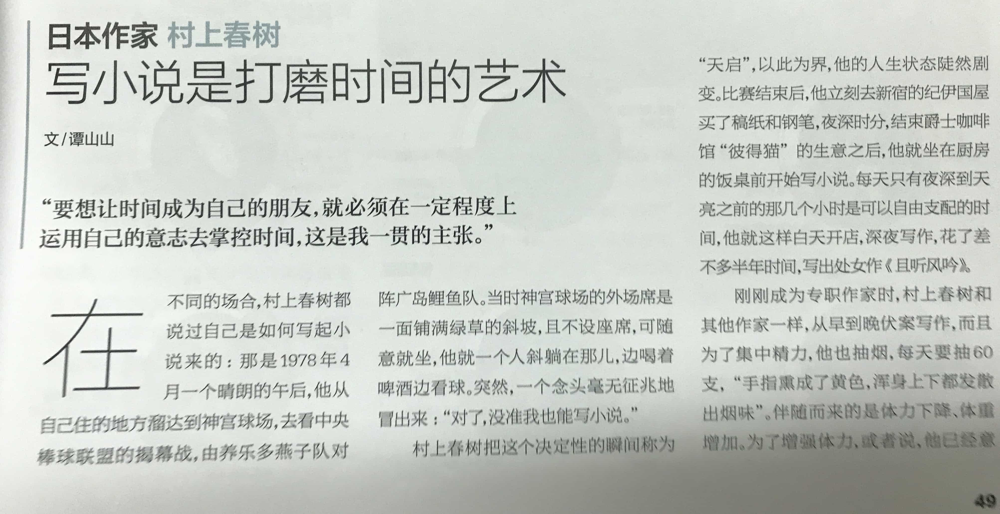
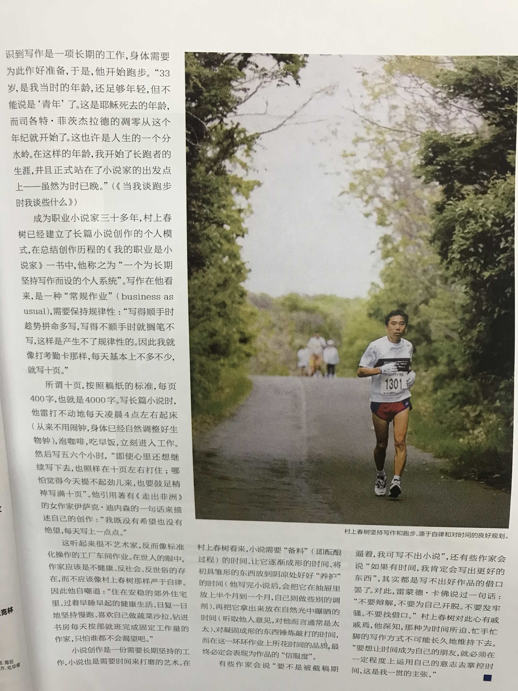

# Health Report

- 记录的必要性：了解、关心自己的健康状况

## 村上春树

掌控时间和健康

## 2018

四月/五月 : 病毒性感冒

- 病毒性感冒
    - 教训：一般感冒可以不吃药扛着等自愈，但是病毒性感冒需要尽早吃药（就医）

七月

- 2018-07-27 喉咙疼
    - 喉结右方偏下处得喉咙，喝水时感觉到疼尤其明显
    - 可能的问题（根据推测可能性排列）：同事感冒，这周和上一周吃辣较多，天气闷热，经常熬夜，喝冷饮（例如可乐）

八月 : “风寒”感冒?

- 2018-08-03 喉干
    - 喉咙慢慢不怎么疼了，但今天起床时，明显喉咙干
    - 喉咙分泌黄绿痰液（不多），怕是喉咙会发炎了？（后续可能会变严重）
    - 考虑下周挂号看病，还是等周末再观察一下症状
- 2018-08-07 痊愈
    - 存疑：忘了是不是 14 号才痊愈的
- 2018-08-20 鼻梁爆痘
    - 工作（心理）压力大，老是熬夜，心情不好……

九月

- 2018-09-?? 痘痘痊愈（忘了时间）

十月 : “风热”感冒

- 2018-10-08 Mon 熬夜
    - 熬夜看舍友打游戏（2:00 点睡？）
- 2018-10-09 Tue 发烧
    - 起床，发现喉咙有点疼，有一点点黄痰
    - 中午，去药店买药了，店员推荐治上火的药；开始戴口罩
    - 下午，越发喉咙痛、头疼、肌肉酸痛、怕冷，是发烧的征兆
    - 晚上，回去的路上很怕冷，早早就睡了（23:30 睡着）
- 2018-10-10 Wed 退烧
    - 起床，退烧了，以为自己好了不少（实际上病情要发散了）
    - 早上，到单位立即去医务室，拿到了感冒冲剂，也有继续吃药店买的药
    - 晚上，还是熬夜晚睡了……作死（水温不够容易着凉）
- 2018-10-11 Thu 发炎
    - 虽然不发烧了，时有喷嚏，鼻涕和痰都比较浓
    - 症状继续：头疼、鼻塞、口感、喉咙疼、肌肉酸痛、畏寒、肢冷
- 2018-10-12 Fri 症状继续
    - 早上，到单位立即去医务室，拿到了「新康泰克」的药片 4 粒，早晚各一颗
        - 医生说：「不熬夜，多喝热水，感冒就好 80% 。」有道理……
    - 症状继续，轻重不同
    - 吃了西药「新康泰克」的药片，易倦想睡
- 2018-10-13 Sat 难以说话
    - 起床，出门打车，发现难以说话
- 2018-10-14 Sun 继续发炎
    - 看看周一的情况再决定是不是挂号看病
- 2018-10-18 Thu 继续发炎，看病未果
    - 虽然感冒症状基本好了，但是仍然发炎，所以挂号
        - 浓黄涕，喉咙有痰；起床口干（晚上用嘴呼吸）
    - 迟到过号 & 忘带银行卡：无法取号，或者重新挂号
    - 精神状态差，影响了日常行动
- 2018-10-26~31 基本痊愈
    - 第一周：比较重的病情持续了一周
    - 第二周：持续发炎，仍然浓涕、有痰
    - 第三周：逐渐自愈
    - 第四周：基本完全痊愈（没有症状）
    - 这次生病概持续了 3 周半

十一月

- TBC
