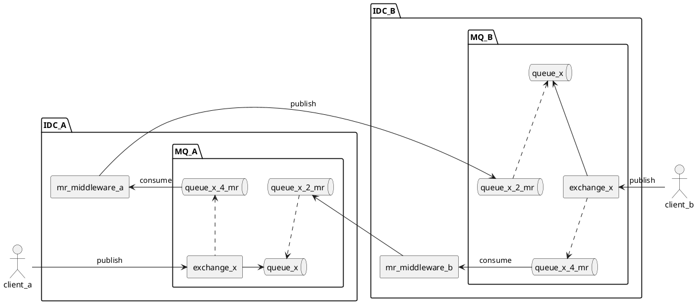

# Message Queues

Todo List

- Comparison
    - https://www.educba.com/rabbitmq-vs-kafka/?source=leftnav
    - https://www.educba.com/activemq-vs-kafka/?source=leftnav
    - https://www.educba.com/zeromq-vs-kafka/?source=leftnav
    - https://www.educba.com/mysql-vs-mongodb/?source=leftnav
    - https://www.educba.com/mysql-vs-nosql/?source=leftnav
    - https://www.educba.com/mysql-vs-sqlite/?source=leftnav
    - https://www.educba.com/redis-vs-kafka/?source=leftnav
    - https://www.educba.com/redis-vs-memcached/?source=leftnav
    - https://www.educba.com/postgresql-vs-sqlite/?source=leftnav
    - https://www.educba.com/mongodb-vs-postgresql/?source=leftnav
    - https://www.educba.com/hive-vs-hbase/?source=leftnav
    - https://www.educba.com/apache-hive-vs-apache-spark-sql/?source=leftnav
    - https://www.educba.com/hadoop-vs-hive/?source=leftnav

References

- https://segmentfault.com/a/1190000019554025
- 为什么要用消息系统_想法驱动实践！-CSDN博客_为什么需要消息系统 : https://blog.csdn.net/Hadas_Wang/article/details/50053803
- AMQP 0.9.1 模型解析 · RabbitMQ in Chinese : http://rabbitmq.mr-ping.com/AMQP/AMQP_0-9-1_Model_Explained.html
- 注意了！Kafka与RabbitMQ千万不要乱用… - 环信 : https://www.easemob.com/news/4248

Other Reading

- https://gitlab.com/IceHe/tmp/-/tree/master
- 微博应对突发热点事件的弹性调度实践 | MySlide - 专注PPT分享，追随SlideShare和SpeakerDeck的脚步 : https://myslide.cn/slides/6177
- Fast compression library for C, C# and Java : http://www.quicklz.com/
- Apache Kafka : https://kafka.apache.org/

Others

- http://activemq.apache.org/
- http://samza.apache.org/
- https://storm.apache.org/
- https://www.rabbitmq.com/
- https://www.google.com/search?q=%E9%95%BF%E8%BF%9E%E6%8E%A5+%E7%9F%AD%E8%BF%9E%E6%8E%A5&oq=%E9%95%BF%E8%BF%9E%E6%8E%A5+%E7%9F%AD%E8%BF%9E%E6%8E%A5&aqs=chrome..69i57.6181j0j7&sourceid=chrome&ie=UTF-8
    - TCP的长连接和短连接 : https://www.cnblogs.com/0201zcr/p/4694945.html
    - http的长连接和短连接（史上最通俗！）: https://www.jianshu.com/p/3fc3646fad80
    - https://juejin.im/post/6844903609138692110
- Network
    - why broken pipe : https://www.google.com/search?q=why+broken+pipe&oq=why+boken+pipe&aqs=chrome.1.69i57j0i22i30i457j0i22i30.7640j0j7&sourceid=chrome&ie=UTF-8
    - why connection reset : https://www.google.com/search?q=why+connection+reset&oq=why+connection+reset&aqs=chrome..69i57.5345j0j7&sourceid=chrome&ie=UTF-8

## 多活同步架构

Message Replication _( 以下简称 MR )_

<!--

-->

TODO
