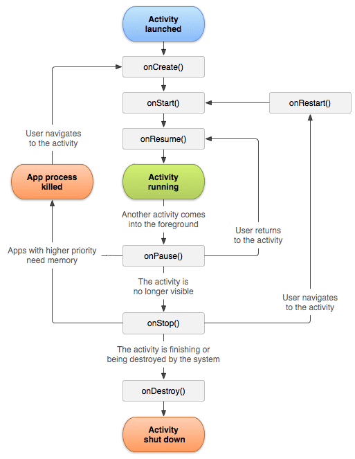

# Activity Lifecycle

---

References

- [The Activity Lifecycle](https://developer.android.com/guide/components/activities/activity-lifecycle#saras)

## Intro

As a user navigates through, out of, and back to your app, the `Activity` instances in your app transition through different states in their lifecycle.
**The `Activity` class provides a number of callbacks that allow the activity to know that a state has changed: that the system is creating, stopping, or resuming an activity, or destroying the process in which the activity resides.**

Within the lifecycle callback methods, you can declare how your activity behaves when the user leaves and re-enters the activity.
_For example, if you're building a streaming video player, you might pause the video and terminate the network connection when the user switches to another app._
_When the user returns, you can reconnect to the network and allow the user to resume the video from the same spot._

In other words, each callback allows you to perform specific work that's appropriate to a given change of state.
Doing the right work at the right time and handling transitions properly make your app more robust and performant.
_For example, good implementation of the lifecycle callbacks can help ensure that your app avoids:_

- _Crashing if the user receives a phone call or switches to another app while using your app._
- _Consuming valuable system resources when the user is not actively using it._
- _Losing the user's progress if they leave your app and return to it at a later time._
- _Crashing or losing the user's progress when the screen rotates between landscape and portrait orientation._

_This document explains the activity lifecycle in detail._
_The document begins by describing the lifecycle paradigm._
_Next, it explains each of the callbacks: what happens internally while they execute, and what you should implement during them._
_It then briefly introduces the relationship between activity state and a process’s vulnerability to being killed by the system._
_Last, it discusses several topics related to transitions between activity states._

For information about handling lifecycles, including guidance about best practices, see [Handling Lifecycles with Lifecycle-Aware Components](https://developer.android.com/topic/libraries/architecture/lifecycle) and [Saving UI States](https://developer.android.com/topic/libraries/architecture/saving-states).
To learn how to architect a robust, production-quality app using activities in combination with architecture components, see Guide to [App Architecture](https://developer.android.com/topic/libraries/architecture/guide).

## Activity-lifecycle concepts

To navigate **transitions between stages of the activity lifecycle**, the **Activity class provides a core set of six callbacks**:

- `onCreate()`
- `onStart()`
- `onResume()`
- `onPause()`
- `onStop()`
- `onDestroy()`

**The system invokes each of these callbacks as an activity enters a new state.**

_A simplified illustration of the activity lifecycle :_



As the user begins to leave the activity, the system calls methods to dismantle<!-- 拆除, 拆开 --> the activity.
In some cases, this dismantlement is only partial; the activity still resides in memory (such as when the user switches to another app), and can still come back to the foreground.
If the user returns to that activity, the activity resumes from where the user left off.
With a few exceptions, apps are [restricted from starting activities when running in the background](https://developer.android.com/guide/components/activities/background-starts).

The system's likelihood<!-- 可能性 --> of killing a given process —— along with the activities in it —— depends on the state of the activity at the time.
Activity state and ejection from memory provides more information on the relationship between state and vulnerability to ejection.

Depending on the complexity of your activity, you probably don't need to implement all the lifecycle methods.
_However, it's important that you understand each one and implement those that ensure your app behaves the way users expect._

_The next section of this document provides detail on the callbacks that you use to handle transitions between states._

## Lifecycle callbacks

_This section provides conceptual and implementation information about the callback methods used during the activity lifecycle._

Some actions, such as calling `setContentView()`, belong in the activity lifecycle methods themselves.
However, the code implementing the actions of a dependent component should be placed in the component itself.
To achieve this, you must make the dependent component lifecycle-aware.
_See [Handling Lifecycles with Lifecycle-Aware Components](https://developer.android.com/topic/libraries/architecture/lifecycle) to learn how to make your dependent components lifecycle-aware._

### onCreate()

You must implement `onCreate()` callback, which fires when the system first creates the activity.
On activity creation, the activity enters the _Created_ state.
In the `onCreate()` method, you perform basic application startup logic that should happen only once for the entire life of the activity.

_For example, your implementation of `onCreate()` might bind data to lists, associate the activity with a [`ViewModel`](https://developer.android.com/reference/androidx/lifecycle/ViewModel), and instantiate some class-scope variables._
_This method receives the parameter `savedInstanceState`, which is a [Bundle](https://developer.android.com/reference/android/os/Bundle) object containing the activity's previously saved state._
_If the activity has never existed before, the value of the `Bundle` object is null._

_Omitted_

### onStart()

_Omitted_

### onResume()

_Omitted_

### onPause()

_Omitted_

### onStop()

_Omitted_

### onDestroy()

_Omitted_

## Activity state and ejection from memory

The system kills processes when it needs to free up RAM; **the likelihood of the system killing a given process depends on the state of the process at the time**.
**Process state, in turn, depends on the state of the activity running in the process.**

_The table below shows the correlation among process state, activity state, and likelihood of the system’s killing the process._

Relationship between process lifecycle and activity state :

|Likelihood of being killed|Process state|Activity state|
|-|-|-|
|Least|Foreground (having or about to get focus)|Created<br/>Started<br/>Resumed|
|More|Background (lost focus)|Paused|
|Most|Background (not visible)|Stopped|
|Most|Empty|Destroyed|

**The system never kills an activity directly to free up memory.**
**Instead, it kills the process in which the activity runs, destroying not only the activity but everything else running in the process, as well.**
_To learn how to preserve and restore your activity's UI state when system-initiated process death occurs, see [Saving and restoring activity state](https://developer.android.com/guide/components/activities/activity-lifecycle#saras)._

A user can also kill a process by using the Application Manager under Settings to kill the corresponding app.

For more information about processes in general, see [Processes and Threads](https://developer.android.com/guide/components/processes-and-threads#Lifecycle). …

_Omitted_

## Saving and restoring transient UI state

- Instance state
- Save simple, lightweight UI state using onSaveInstanceState()
- Restore activity UI state using saved instance state

_Omitted_

## Navigating between activities

An app is likely to enter and exit an activity, perhaps many times, during the app’s lifetime.
_For example, the user may tap the device's Back button, or the activity may need to launch a different activity._
_This section covers topics you need to know to implement successful activity transitions._
These topics include starting an activity from another activity, saving activity state, and restoring activity state.

### Starting one activity from another

An activity often needs to start another activity at some point.
_This need arises, for instance, when an app needs to move from the current screen to a new one._

**Depending on whether your activity wants a result back from the new activity it's about to start, you start the new activity using either the [`startActivity()`](https://developer.android.com/reference/android/app/Activity#startActivity(android.content.Intent,%20android.os.Bundle)) or the [`startActivityForResult()`](https://developer.android.com/reference/android/app/Activity#startActivityForResult(android.content.Intent,%20int)) method.**
**In either case, you pass in an [`Intent`](https://developer.android.com/reference/android/content/Intent) object.**

**The `Intent` object specifies either the exact activity you want to start or describes the type of action you want to perform ( and the system selects the appropriate activity for you, which can even be from a different application ) .**
An Intent object can also carry small amounts of data to be used by the activity that is started.
_For more information about the Intent class, see [Intents and Intent Filters](https://developer.android.com/guide/components/intents-filters)._

#### startActivity()

If the newly started activity does not need to return a result, the current activity can start it by calling the `startActivity()` method.

When working within your own application, you often need to simply launch a known activity.
_For example, the following code snippet shows how to launch an activity called `SignInActivity`._

```kt
val intent = Intent(this, SignInActivity::class.java)
startActivity(intent)
```

_Your application might also want to perform some action, such as send an email, text message, or status update, using data from your activity._
_In this case, your application might not have its own activities to perform such actions, so you can instead leverage the activities provided by other applications on the device, which can perform the actions for you._

This is where intents are really valuable:
**You can create an intent that describes an action you want to perform and the system launches the appropriate activity from another application.**
If there are multiple activities that can handle the intent, then the user can select which one to use.
_For example, if you want to allow the user to send an email message, you can create the following intent:_

```kt
val intent = Intent(Intent.ACTION_SEND).apply {
    putExtra(Intent.EXTRA_EMAIL, recipientArray)
}
startActivity(intent)
```

_The `EXTRA_EMAIL` extra added to the intent is a string array of email addresses to which the email should be sent._
_When an email application responds to this intent, it reads the string array provided in the extra and places them in the "to" field of the email composition form._
_In this situation, the email application's activity starts and when the user is done, your activity resumes._

#### startActivityForResult()

Sometimes you want to get a result back from an activity when it ends.
_For example, you may start an activity that lets the user pick a person in a list of contacts; when it ends, it returns the person that was selected._
To do this, you **call the [`startActivityForResult(Intent, int)`](https://developer.android.com/reference/android/app/Activity#startActivityForResult(android.content.Intent,%20int)) method, where the integer parameter identifies the call.**
This identifier is meant to disambiguate between multiple calls to `startActivityForResult(Intent, int)` from the same activity.
**It's not global identifier and is not at risk of conflicting with other apps or activities.**
**The result comes back through your [`onActivityResult(int, int, Intent)`](https://developer.android.com/reference/android/app/Activity#onActivityResult(int,%20int,%20android.content.Intent)) method.**

**When a child activity exits, it can call `setResult(int)` to return data to its parent.**
**The child activity must always supply a result code, which can be the standard results `RESULT_CANCELED`, `RESULT_OK`, or any custom values starting at `RESULT_FIRST_USER`.**
In addition, the child activity can optionally return an `Intent` object containing any additional data it wants.
**The parent activity uses the `onActivityResult(int, int, Intent)` method, along with the integer identifier the parent activity originally supplied, to receive the information.**

If a child activity fails for any reason, such as crashing, the parent activity receives a result with the code `RESULT_CANCELED`.

```kt
class MyActivity : Activity() {
    // ...

    override fun onKeyDown(keyCode: Int, event: KeyEvent?): Boolean {
        if (keyCode == KeyEvent.KEYCODE_DPAD_CENTER) {
            // When the user center presses, let them pick a contact.
            startActivityForResult(
                    Intent(Intent.ACTION_PICK,Uri.parse("content://contacts")),
                    PICK_CONTACT_REQUEST)
            return true
        }
        return false
    }

    override fun onActivityResult(requestCode: Int, resultCode: Int, intent: Intent?) {
        when (requestCode) {
            PICK_CONTACT_REQUEST ->
                if (resultCode == RESULT_OK) {
                    startActivity(Intent(Intent.ACTION_VIEW, intent?.data))
                }
        }
    }

    companion object {
        internal val PICK_CONTACT_REQUEST = 0
    }
}
```

#### Coordinating activities

_Omitted_
