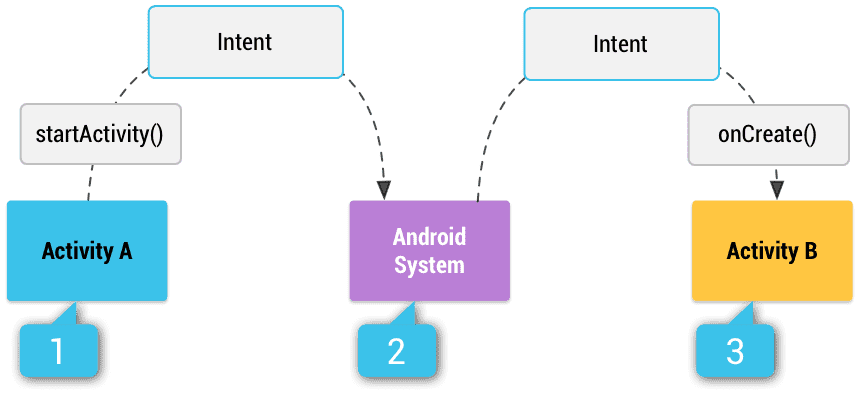

# Intents and Intent Filters

An Intent is a messaging object you can use to request an action from another app component.

---

References

- [Intents and Intent Filters](https://developer.android.com/guide/components/intents-filters)

## Intro

**An [`Intent`](https://developer.android.com/reference/android/content/Intent) is a messaging object you can use to request an action from another [app component](https://developer.android.com/guide/components/fundamentals#Components).**

Although intents facilitate communication between components in several ways, there are three **fundamental use cases** :

-   **Starting an activity**

    **An [`Activity`](https://developer.android.com/reference/android/app/Activity) represents a single screen in an app**.
    You can **start a new instance of an `Activity` by passing an `Intent` to [`startActivity()`](https://developer.android.com/reference/android/content/Context#startActivity(android.content.Intent))**.
    **The `Intent` describes the activity to start and carries any necessary data**.

    **If you want to receive a result from the activity when it finishes, call [`startActivityForResult()`](https://developer.android.com/reference/android/app/Activity#startActivityForResult(android.content.Intent,%20int)).**
    Your **activity receives the result as a separate `Intent` object in your activity's [`onActivityResult()`](https://developer.android.com/reference/android/app/Activity#onActivityResult(int,%20int,%20android.content.Intent)) callback**.
    _For more information, see the [Activities](https://developer.android.com/guide/components/activities) guide._

-   **Starting a service**

    **A [`Service`](https://developer.android.com/reference/android/app/Service) is a component that performs operations in the background without a user interface.**
    With Android 5.0 (API level 21) and later, you **can start a service with [`JobScheduler`](https://developer.android.com/reference/android/app/job/JobScheduler)**.
    _For more information about `JobScheduler`, see its [`API-reference documentation`](https://developer.android.com/reference/android/app/job/JobScheduler)._

    _For versions earlier than Android 5.0 (API level 21), you can start a service by using methods of the `Service` class._
    You **can start a service to perform a one-time operation (such as downloading a file) by passing an `Intent` to [`startService()`](https://developer.android.com/reference/android/content/Context#startService(android.content.Intent))**.
    **The `Intent` describes the service to start and carries any necessary data.**

    If the service is designed with a client-server interface, you can bind to the service from another component by passing an `Intent` to [`bindService()`](https://developer.android.com/reference/android/content/Context#bindService(android.content.Intent,%20android.content.ServiceConnection,%20int)).
    _For more information, see the [Services](https://developer.android.com/guide/components/services) guide._

-   **Delivering a broadcast**

    **A broadcast is a message that any app can receive.**
    **The system delivers various broadcasts for system events, such as when the system boots up or the device starts charging.**
    You **can deliver a broadcast to other apps by passing an `Intent` to [`sendBroadcast()`](https://developer.android.com/reference/android/content/Context#sendBroadcast(android.content.Intent)) or [`sendOrderedBroadcast()`](https://developer.android.com/reference/android/content/Context#sendOrderedBroadcast(android.content.Intent,%20java.lang.String))**.

_The rest of this page explains **how intents work** and **how to use** them._
_For related information, see [Interacting with Other Apps](https://developer.android.com/training/basics/intents) and [Sharing Content](https://developer.android.com/training/sharing)._

## Intent types

There are two types of intents:

-   **Explicit intents**

    **specify which application will satisfy the intent, by supplying either the target app's package name or a fully-qualified component class name.**

    _You'll typically use an explicit intent to start a component in your own app, because you know the class name of the activity or service you want to start._

    _For example, you might start a new activity within your app in response to a user action, or start a service to download a file in the background._

-   **Implicit intents**

    **do not name a specific component, but instead declare a general action to perform, which allows a component from another app to handle it.**

    _For example, if you want to show the user a location on a map, you can use an implicit_

The figure below shows how an intent is used when starting an activity.
**When the `Intent` object names a specific activity component explicitly, the system immediately starts that component.**

How an implicit intent is delivered through the system to start another activity :

1. `Activity` A creates an `Intent` with an action description and passes it to `startActivity()`.
2. The Android System searches all apps for an intent filter that matches the intent.
3. When a match is found, the system starts the matching activity (Activity B) by invoking its `onCreate()` method and passing it the Intent.

**When you use an implicit intent, the Android system finds the appropriate component to start by comparing the contents of the intent to the intent filters declared in the manifest file of other apps on the device.**
**If the intent matches an intent filter, the system starts that component and delivers it the Intent object.**
**If multiple intent filters are compatible, the system displays a dialog so the user can pick which app to use.**

An intent filter is an expression in an app's manifest file that specifies the type of intents that the component would like to receive.
For instance, by declaring an intent filter for an activity, you make it possible for other apps to directly start your activity with a certain kind of intent.
_Likewise, if you do not declare any intent filters for an activity, then it can be started only with an explicit intent._

> **Caution** :
> To ensure that your app is secure, always use an explicit intent when starting a `Service` and do not declare intent filters for your services.
> Using an implicit intent to start a service is a security hazard because you can't be certain what service will respond to the intent, and the user can't see which service starts.
> Beginning with Android 5.0 (API level 21), the system throws an exception if you call `bindService()` with an implicit intent.

## Building an intent

TODO

## Receiving an implicit intent

TODO

## Others

_Omitted_

Using a pending intent

- Specify mutability
- Use explicit intents within pending intents

Intent resolution

- Action test
- Category test
- Data test
- Intent matching
