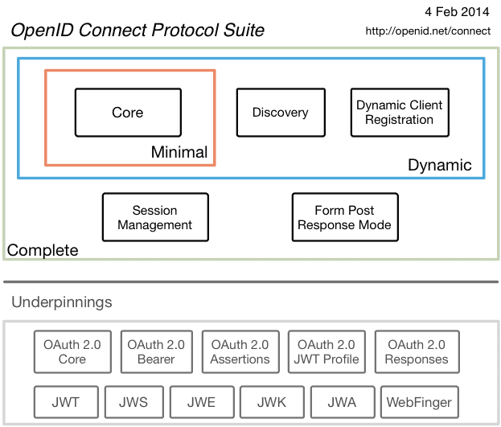

# OpenID Connect

an interoperable authentication protocol based on the OAuth 2.0 family of specifications

---

References

- [OpenID - Wikipedia](https://en.wikipedia.org/wiki/OpenID)
- [openid.net](https://openid.net)
    - [OpenID Connect](https://openid.net/connect/)
        - [FAQ and Q&As](https://openid.net/connect/faq/)

## FAQ

-   **What is OpenID Connect? How does it work?**

    [OpenID Connect](https://openid.net/connect/) is an interoperable authentication protocol based on the OAuth 2.0 family of specifications.
    It uses straightforward REST/JSON message flows with a design goal of "making simple things simple and complicated things possible".
    _It's uniquely easy for developers to integrate, compared to any preceding Identity protocol._

    **OpenID Connect lets developers authenticate their users across websites and apps without having to own and manage password files.**
    For the app builder, it provides a secure verifiable, answer to the question: "What is the identity of the person currently using the browser or native app that is connected to me?"

    _OpenID Connect allows for clients of all types, including browser-based JavaScript and native mobile apps, to launch sign-in flows and receive verifiable assertions about the identity of signed-in users._

    ```text
    (Identity, Authentication) + OAuth 2.0 = OpenID Connect
    ```

-   **What problem does OpenID Connect solve?**

    It lets **app and site developers authenticate users without taking on the responsibility of storing and managing passwords** in the face of an Internet that is well-populated with people trying to compromise your users' accounts for their own gain.

-   What does authentication mean?

    The process of establishing and communicating that the person operating a browser or native app is who they claim to be.

-   **What is OAuth 2.0 and how does it related to OpenID Connect?**

    **OAuth 2.0, is a framework**, _specified by the IETF in RFCs 6749 and 6750 (published in 2012) designed to support the development of authentication and authorization protocols._
    **It provides a variety of standardized message flows based on JSON and HTTP; OpenID Connect uses these to provide Identity services.**

-   What is the status of OpenID Connect?

    ……

-   Are there live production deployments of OpenID Connect?

    ……

-   Where can I find code implementing OpenID Connect?

    https://openid.net/developers/libraries

-   What is the history of OpenID?

    **OpenID Connect is the third generation of OpenID technology.**
    The first was the original OpenID, a visionary's tool that never got much commercial adoption, but got industry leaders thinking about what was possible.
    OpenID 2.0 was much more fully thought through, offered excellent security, and worked well when implemented properly.
    However, it suffered from several design limitations – foremost among them that Relying Parties could be Web pages but not native applications; it also relied upon XML, leading to some adoption problems.

    **OpenID Connect's goal is to be much more developer-friendly, while expanding the set of use cases where it can be used.**
    It has already been successful in this; there are production deployments operating at huge scale.
    Any programmer with sufficient experience to send and receive JSON messages over HTTP (which is most of them these days) should be able to implement OpenID Connect from scratch using standard crypto signature-verification libraries.
    Fortunately, most won't even have to go that far, as there are good commercial and open-source libraries that take care of the authentication mechanics.

-   **How is OpenID Connect different from OpenID 2.0 and how does it overcome the problems experienced with OpenID 2.0?**

    _OpenID Connect has many architectural similarities to OpenID 2.0, and in fact the protocols solve a very similar set of problems._
    However, OpenID 2.0 used XML and a custom message signature scheme that in practice sometimes proved difficult for developers to get right, with the effect that OpenID 2.0 implementations would sometimes mysteriously refuse to interoperate.
    **OAuth 2.0, the substrate<!-- 基底 --> for OpenID Connect, outsources the necessary encryption to the Web's built-in TLS (also called HTTPS or SSL) infrastructure, which is universally implemented on both client and server platforms.**
    **OpenID Connect uses standard JSON Web Token (JWT) data structures when signatures are required.**
    This makes OpenID Connect dramatically easier for developers to implement, and in practice has resulted in much better interoperability.

    The OpenID Connect interoperability story has been proven in practice during an extended series of interoperability trials conducted by members of the OpenID Connect Working Group and the developers behind numerous OpenID Connect implementations.

-   **What do "IDP" and "RP" stand for?**

    These terms are commonly used when describing digital identity systems.

    - IDP stands for Identity Provider, a party that offers user authentication as a service.
    - RP stands for Relying Party, an app that outsources its user authentication function to an IDP.

-   Who can be an IDP?

    The OpenID Connect protocol's design is wide-open and deliberately aimed at encouraging an open ecosystem of IDPs.
    While the leading IDPs are currently large Internet services such as Google and Microsoft, OpenID Connect opens the doors for many kinds of IDPs, including people running their own IDPs on Web sites and on personal devices, such as mobile phones and tablets.

-   How was OpenID Connect developed?

    ……

-   How were the OpenID Connect specs tested while they were being developed?

    ……

-   How does it improve security?

    Public-key-encryption-based authentication frameworks like OpenID Connect (and its predecessors) globally increase the security of the whole Internet by putting the responsibility for user identity verification in the hands of the most expert service providers.
    Compared to its predecessors, OpenID Connect is dramatically easier to implement and integrate and can expect to receive much wider adoption.

-   **Does it protect peoples' privacy or provide them more control over their personal information and what is shared?**

    **OpenID Connect identifies a set of personal attributes that can be exchanged between Identity Providers and the apps that use them, and includes an approval step so that users can consent (or deny) the sharing of this information.**

-   What about new authentication technologies like biometrics and devices?

    ……

-   How does OpenID Connect relate to the FIDO Alliance?

    ……

-   **How does OpenID Connect relate to SAML?**

    **The Security Assertion Markup Language (SAML) is an XML-based federation technology used in some enterprise and academic use cases.**
    **OpenID Connect can satisfy these same use cases but with a simpler, JSON/REST based protocol.**
    **OpenID Connect was designed to also support native apps and mobile applications, whereas SAML was designed only for Web-based applications.**
    SAML and OpenID Connect will likely coexist for quite some time, with each being deployed in situations where they make sense.

-   How does OpenID Connect enable creating an Internet identity ecosystem?

    - Interoperability
    - Security
    - Ease of deployment
    - Flexibility
    - Wide support of devices
    - Enabling Claims Providers to be distinct from Identity Providers

## Intro

-   **What is OpenID Connect?**

    OpenID Connect 1.0 is a simple identity layer on top of the OAuth 2.0 protocol.
    It allows Clients to verify the identity of the End-User based on the authentication performed by an Authorization Server, as well as to obtain basic profile information about the End-User in an interoperable and REST-like manner.

    OpenID Connect allows clients of all types, including Web-based, mobile, and JavaScript clients, to request and receive information about authenticated sessions and end-users.
    The specification suite is extensible, allowing participants to use optional features such as encryption of identity data, discovery of OpenID Providers, and session management, when it makes sense for them.

-   **How is OpenID Connect different than OpenID 2.0?**

    OpenID Connect performs many of the same tasks as OpenID 2.0, but does so **in a way that is API-friendly, and usable by native and mobile applications.**
    OpenID Connect **defines optional mechanisms for robust signing and encryption.**
    Whereas integration of OAuth 1.0a and OpenID 2.0 required an extension, in OpenID Connect, OAuth 2.0 capabilities are integrated with the protocol itself.

**Specification Organization**

_The OpenID Connect 1.0 specification consists of these documents:_

-   **[Core](https://openid.net/specs/openid-connect-core-1_0.html)**

    Defines the core OpenID Connect functionality:
    **authentication built on top of OAuth 2.0 and the use of Claims to communicate information about the End-User**

-   [Discovery](https://openid.net/specs/openid-connect-discovery-1_0.html) _( optional )_

    Defines how Clients **dynamically discover information about OpenID Providers**

-   [Dynamic Registration](https://openid.net/specs/openid-connect-registration-1_0.html) _( optional )_

    Defines how clients **dynamically register with OpenID Providers**

-   **[OAuth 2.0 Multiple Response Types](https://openid.net/specs/oauth-v2-multiple-response-types-1_0.html)**

    Defines several **specific new OAuth 2.0 response types**

-   [OAuth 2.0 Form Post Response Mode](https://openid.net/specs/oauth-v2-form-post-response-mode-1_0.html) _( optional )_

    Defines **how to return OAuth 2.0 Authorization Response parameters** (including OpenID Connect Authentication Response parameters) using HTML form values that are auto-submitted by the User Agent using HTTP POST

-   [RP-Initiated Logout](https://openid.net/specs/openid-connect-rpinitiated-1_0.html) _( optional )_

    Defines **how a Relying Party requests that an OpenID Provider log out the End-User**

-   [Session Management](https://openid.net/specs/openid-connect-session-1_0.html) _( optional )_

    Defines **how to manage OpenID Connect sessions, including postMessage-based logout and RP-initiated logout functionality**

-   [Front-Channel Logout](https://openid.net/specs/openid-connect-frontchannel-1_0.html) _( optional )_

    Defines **a front-channel logout mechanism that does not use an OP iframe on RP pages**

-   [Back-Channel Logout](https://openid.net/specs/openid-connect-backchannel-1_0.html) _( optional )_

    Defines **a logout mechanism that uses direct back-channel communication between the OP and RPs being logged out**

-   [OpenID Connect Federation](https://openid.net/specs/openid-connect-federation-1_0.html) _( optional )_

    Defines **how sets of OPs and RPs can establish trust by utilizing a Federation Operator**

Two implementer's guides are also available to serve as self-contained references for implementers of basic Web-based Relying Parties:

-   [Basic Client Implementer's Guide](https://openid.net/specs/openid-connect-basic-1_0.html)

    Simple subset of the Core functionality for a web-based Relying Party using the OAuth code flow

-   [Implicit Client Implementer's Guide](https://openid.net/specs/openid-connect-implicit-1_0.html)

    Simple subset of the Core functionality for a web-based Relying Party using the OAuth implicit flow

……



## Core

The **core** OpenID Connect **functionality**:
authentication built on top of OAuth 2.0 and the use of Claims to communicate information about the End-User.
_It also describes the security and privacy considerations for using OpenID Connect._

Table of Contents

- 1.  Introduction
    - 1.1.  Requirements Notation and Conventions
    - 1.2.  Terminology
    - 1.3.  Overview
- 2.  ID Token
- 3.  Authentication
    - 3.1.  Authentication using the Authorization Code Flow
        - 3.1.1.  Authorization Code Flow Steps
        - 3.1.2.  Authorization Endpoint
            - 3.1.2.1.  Authentication Request
            - 3.1.2.2.  Authentication Request Validation
            - 3.1.2.3.  Authorization Server Authenticates End-User
            - 3.1.2.4.  Authorization Server Obtains End-User Consent/Authorization
            - 3.1.2.5.  Successful Authentication Response
            - 3.1.2.6.  Authentication Error Response
            - 3.1.2.7.  Authentication Response Validation
        - 3.1.3.  Token Endpoint
            - 3.1.3.1.  Token Request
            - 3.1.3.2.  Token Request Validation
            - 3.1.3.3.  Successful Token Response
            - 3.1.3.4.  Token Error Response
            - 3.1.3.5.  Token Response Validation
            - 3.1.3.6.  ID Token
            - 3.1.3.7.  ID Token Validation
            - 3.1.3.8.  Access Token Validation
    - 3.2.  Authentication using the Implicit Flow
        - 3.2.1.  Implicit Flow Steps
        - 3.2.2.  Authorization Endpoint
            - 3.2.2.1.  Authentication Request
            - 3.2.2.2.  Authentication Request Validation
            - 3.2.2.3.  Authorization Server Authenticates End-User
            - 3.2.2.4.  Authorization Server Obtains End-User Consent/Authorization
            - 3.2.2.5.  Successful Authentication Response
            - 3.2.2.6.  Authentication Error Response
            - 3.2.2.7.  Redirect URI Fragment Handling
            - 3.2.2.8.  Authentication Response Validation
            - 3.2.2.9.  Access Token Validation
            - 3.2.2.10.  ID Token
            - 3.2.2.11.  ID Token Validation
    - 3.3.  Authentication using the Hybrid Flow
        - 3.3.1.  Hybrid Flow Steps
        - 3.3.2.  Authorization Endpoint
            - 3.3.2.1.  Authentication Request
            - 3.3.2.2.  Authentication Request Validation
            - 3.3.2.3.  Authorization Server Authenticates End-User
            - 3.3.2.4.  Authorization Server Obtains End-User Consent/Authorization
            - 3.3.2.5.  Successful Authentication Response
            - 3.3.2.6.  Authentication Error Response
            - 3.3.2.7.  Redirect URI Fragment Handling
            - 3.3.2.8.  Authentication Response Validation
            - 3.3.2.9.  Access Token Validation
            - 3.3.2.10.  Authorization Code Validation
            - 3.3.2.11.  ID Token
            - 3.3.2.12.  ID Token Validation
        - 3.3.3.  Token Endpoint
            - 3.3.3.1.  Token Request
            - 3.3.3.2.  Token Request Validation
            - 3.3.3.3.  Successful Token Response
            - 3.3.3.4.  Token Error Response
            - 3.3.3.5.  Token Response Validation
            - 3.3.3.6.  ID Token
            - 3.3.3.7.  ID Token Validation
            - 3.3.3.8.  Access Token
            - 3.3.3.9.  Access Token Validation
- 4.  Initiating Login from a Third Party
- 5.  Claims
    - 5.1.  Standard Claims
        - 5.1.1.  Address Claim
        - 5.1.2.  Additional Claims
    - 5.2.  Claims Languages and Scripts
    - 5.3.  UserInfo Endpoint
        - 5.3.1.  UserInfo Request
        - 5.3.2.  Successful UserInfo Response
        - 5.3.3.  UserInfo Error Response
        - 5.3.4.  UserInfo Response Validation
    - 5.4.  Requesting Claims using Scope Values
    - 5.5.  Requesting Claims using the "claims" Request Parameter
        - 5.5.1.  Individual Claims Requests
            - 5.5.1.1.  Requesting the "acr" Claim
        - 5.5.2.  Languages and Scripts for Individual Claims
    - 5.6.  Claim Types
        - 5.6.1.  Normal Claims
        - 5.6.2.  Aggregated and Distributed Claims
            - 5.6.2.1.  Example of Aggregated Claims
            - 5.6.2.2.  Example of Distributed Claims
    - 5.7.  Claim Stability and Uniqueness
- 6.  Passing Request Parameters as JWTs
    - 6.1.  Passing a Request Object by Value
        - 6.1.1.  Request using the "request" Request Parameter
    - 6.2.  Passing a Request Object by Reference
        - 6.2.1.  URL Referencing the Request Object
        - 6.2.2.  Request using the "request_uri" Request Parameter
        - 6.2.3.  Authorization Server Fetches Request Object
        - 6.2.4.  "request_uri" Rationale
    - 6.3.  Validating JWT-Based Requests
        - 6.3.1.  Encrypted Request Object
        - 6.3.2.  Signed Request Object
        - 6.3.3.  Request Parameter Assembly and Validation
- 7.  Self-Issued OpenID Provider
    - 7.1.  Self-Issued OpenID Provider Discovery
    - 7.2.  Self-Issued OpenID Provider Registration
        - 7.2.1.  Providing Information with the "registration" Request Parameter
    - 7.3.  Self-Issued OpenID Provider Request
    - 7.4.  Self-Issued OpenID Provider Response
    - 7.5.  Self-Issued ID Token Validation
- 8.  Subject Identifier Types
    - 8.1.  Pairwise Identifier Algorithm
- 9.  Client Authentication
- 10.  Signatures and Encryption
    - 10.1.  Signing
        - 10.1.1.  Rotation of Asymmetric Signing Keys
    - 10.2.  Encryption
        - 10.2.1.  Rotation of Asymmetric Encryption Keys
- 11.  Offline Access
- 12.  Using Refresh Tokens
    - 12.1.  Refresh Request
    - 12.2.  Successful Refresh Response
    - 12.3.  Refresh Error Response
- 13.  Serializations
    - 13.1.  Query String Serialization
    - 13.2.  Form Serialization
    - 13.3.  JSON Serialization
- 14.  String Operations
- 15.  Implementation Considerations
    - 15.1.  Mandatory to Implement Features for All OpenID Providers
    - 15.2.  Mandatory to Implement Features for Dynamic OpenID Providers
    - 15.3.  Discovery and Registration
    - 15.4.  Mandatory to Implement Features for Relying Parties
    - 15.5.  Implementation Notes
        - 15.5.1.  Authorization Code Implementation Notes
        - 15.5.2.  Nonce Implementation Notes
        - 15.5.3.  Redirect URI Fragment Handling Implementation Notes
    - 15.6.  Compatibility Notes
        - 15.6.1.  Pre-Final IETF Specifications
        - 15.6.2.  Google "iss" Value
    - 15.7.  Related Specifications and Implementer's Guides
- 16.  Security Considerations
    - 16.1.  Request Disclosure
    - 16.2.  Server Masquerading
    - 16.3.  Token Manufacture/Modification
    - 16.4.  Access Token Disclosure
    - 16.5.  Server Response Disclosure
    - 16.6.  Server Response Repudiation
    - 16.7.  Request Repudiation
    - 16.8.  Access Token Redirect
    - 16.9.  Token Reuse
    - 16.10.  Eavesdropping or Leaking Authorization Codes (Secondary Authenticator Capture)
    - 16.11.  Token Substitution
    - 16.12.  Timing Attack
    - 16.13.  Other Crypto Related Attacks
    - 16.14.  Signing and Encryption Order
    - 16.15.  Issuer Identifier
    - 16.16.  Implicit Flow Threats
    - 16.17.  TLS Requirements
    - 16.18.  Lifetimes of Access Tokens and Refresh Tokens
    - 16.19.  Symmetric Key Entropy
    - 16.20.  Need for Signed Requests
    - 16.21.  Need for Encrypted Requests
- 17.  Privacy Considerations
    - 17.1.  Personally Identifiable Information
    - 17.2.  Data Access Monitoring
    - 17.3.  Correlation
    - 17.4.  Offline Access
- 18.  IANA Considerations
    - 18.1.  JSON Web Token Claims Registration
        - 18.1.1.  Registry Contents
    - 18.2.  OAuth Parameters Registration
        - 18.2.1.  Registry Contents
    - 18.3.  OAuth Extensions Error Registration
        - 18.3.1.  Registry Contents
- 19.  References
    - 19.1.  Normative References
    - 19.2.  Informative References
- Appendix A.  Authorization Examples
    - A.1.  Example using response_type=code
    - A.2.  Example using response_type=id_token
    - A.3.  Example using response_type=id_token token
    - A.4.  Example using response_type=code id_token
    - A.5.  Example using response_type=code token
    - A.6.  Example using response_type=code id_token token
    - A.7.  RSA Key Used in Examples
- Appendix B.  Acknowledgements
- Appendix C.  Notices
- ……
