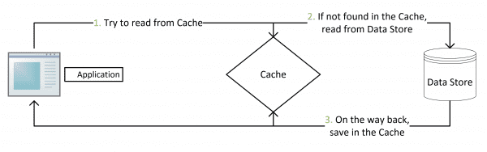
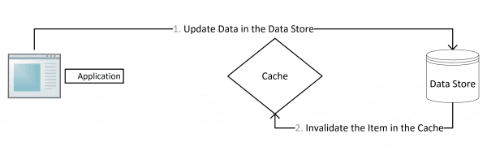
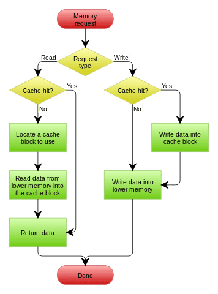
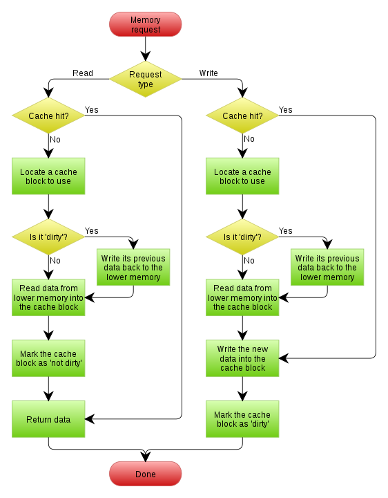

# Cache Patterns

缓存模式

---

References:

- [缓存更新套路](https://coolshell.cn/articles/17416.html)

## Intro

> ~~先删除 cache，然后再更新 db ，而后续的操作会把数据再装载的 cache 中。~~

这个是逻辑是错误的。因为两个并发操作，一个是更新操作，另一个是查询操作：

1. 更新操作删除缓存后
2. 查询操作没有命中缓存
3. 先把老数据读出来后放到缓存中
4. 然后更新操作更新了 db

于是，在缓存中的数据还是老的，导致 cache 中的数据是脏的，而且在 expire 或 evict 之前该数据将一直脏下去。

先不讨论更新 cache 和更新数据这两个操作应该是一个 transaction 的事，或是 transaction 失败的可能性，
先假设更新 db 和更新 cache 都可以成功的情况（先保证成功情况的代码逻辑的正确性）。

更新 cache 的的 design pattern 有 4 种：

- **cache aside**
- **read through**
- **write through**
- **write behind caching**

## Cache Aside

### How

- 失效：应用程序先从 cache 取数据，没有得到，则从 db 中取数据，成功后，放到 cache 中。
- 命中：应用程序从 cache 中取数据，取到后返回。
- 更新：先把数据存到 db 中，成功后，再让缓存失效。

### Debug

注意：**先更新 db ，成功后，让 cache 失效。**
那么，这样是否可以避免前文提到的那个问题呢？可以推演一下。

一个是查询操作，一个是更新操作的并发；
首先，没有了删除 cache 数据的操作了，而是先更新了 db 中的数据；
此时，cache 依然有效，所以，并发的查询操作拿的是没有更新的数据；
但是，更新操作马上让缓存的失效了，后续的查询操作再把数据从 db 中拉出来。
而不会像前文提到的那个逻辑产生的问题（导致后续的查询操作一直都在取老的数据）。

这是标准的 design pattern ，包括 Facebook 的论文
《[Scaling Memcache at Facebook](https://www.usenix.org/system/files/conference/nsdi13/nsdi13-final170_update.pdf)》
也使用了这个策略。

为什么不是写完 db 后更新缓存？
你可以看一下 Quora 上的这个问答
《[Why does Facebook use delete to remove the key-value pair in Memcached instead of updating the Memcached during write request to the backend?](https://www.quora.com/Why-does-Facebook-use-delete-to-remove-the-key-value-pair-in-Memcached-instead-of-updating-the-Memcached-during-write-request-to-the-backend)》，
主要是怕两个并发的写操作导致脏数据。

### Trade-off

是不是 cache aside 这个就不会有并发问题了？不是的。
**比如，一个是读操作，但是没有命中 cache ，然后就到 db 中取数据；**
**此时来了一个写操作，写完 db 后，让缓存失效；**
**然后，之前的那个读操作再把老的数据放进去，所以这时会造成脏数据。**

**但是，这个 case 理论上会出现，**
**不过，实际上出现的概率可能非常低。**
**因为这个条件需要在读 cache 时 miss，而且有一个并发的写操作。**
**而实际上 db 的写操作会比读操作慢得多，而且还要锁表，**
**而读操作必需在写操作前进入 db 操作，而又要晚于写操作更新 cache ，**
**所有的这些条件都具备的概率基本并不大。**

所以，正如 Quora 上的那个答案所说的，
**要么通过 2PC 或是 Paxos 协议保证一致性，**
**要么就是拼命的降低并发时脏数据的概率，**
**而 Facebook 使用了这个降低概率的玩法。**
**因为 2PC 太慢，而 Paxos 太复杂。**

当然，**最好还是为 cache 设置上合适的过期时间。**

## Read / Write Through

cache aside 模式中，应用代码需要维护两个 storage：

- cache（缓存）
- repository（数据仓库/持久存储，继续用 db 代称虽然不够准确，但是这样比较简便）

所以，调用方代码会复杂一些。

而 read / write through 模式是把更新 db 的操作交给 cache 层来做了，这时调用方的代码实现就简单多了。

可以理解为，调用方认为被调用方就是一个单一的 storage（存储），而 **storage 自己维护自己的 cache。**

### Read Through

read through 模式就是在查询操作中更新 cache，
也就是说，**当 cache 失效的时候（过期或 LRU 换出）；**
**cache aside 是由调用方负责把数据加载入 cache，**
**而 read through 则用 cache 服务自己来加载，从而对应用方是透明的。**

_icehe：对于新手来说，可能需要细细体会其中的差异 —— 即加载缓存的代码放在哪一层（layer）。_

### Write Through

write through 模式和 read through 相仿，不过是在更新数据时发生。
**当有数据更新的时候，如果没有命中 cache，直接更新 db，然后返回。**
**如果命中了 cache，则更新 cache，然后再由 cache 自己更新 db （这是一个同步操作）**

下图来自 [Cache - Wikipedia](https://en.wikipedia.org/wiki/Cache_(computing)) _其中的 memory 可理解为就是上文中的 repository（or db）。_

---

_icehe: 时间久了，发现自己对 write / read through 的套路记得不够牢…… 重新总结一下：_

- read / write through: cache 和 db 被视为一个统一的 storage，维护 cache 操作由 storage 自己接管。
    - read through: 类似 cache aside 的做法，如上文所述 storage 自己维护 cache，不需要调用方操心。
    - write through: cache miss 写到 db，同步（synchronously）写到 cache；cache hit 则写到 cache，storage 会自己将 cache 值回写到 db，不需要调用方操心。

## Write Behind Caching

**Write Behind** i.e. **Write Back**

跟 Linux 文件系统的 Page Cache 的算法思路一致：

**在更新数据的时候，只更新 cache，不更新 db，而 cache 会异步地批量更新 db。**

### Strength

这个设计的好处就是 **让数据的 I/O 操作飞快无比（因为直接操作内存 cache）**；
**因为异步，write back 还可以合并对同一个数据的多次操作**，所以性能的提高相当可观。

### Weakness

但是，其带来的问题是，**数据不是强一致性的，而且可能会丢失**
**（Unix / Linux 非正常关机会导致数据丢失，就是因为这个原因）。**

在软件设计上，基本上不可能做出一个没有缺陷的设计，
就像算法设计中的时间换空间，空间换时间一个道理，
有时候，强一致性和高性能，高可用和高性性是有冲突的。

软件设计从来都是 trade-off（取舍）。

另外，write back 实现逻辑比较复杂，
因为 **需要 track 有哪些数据是被更新了的，需要刷到持久层上。**
**例如，操作系统的 write back 会在仅当这个 cache 需要失效的时候，才会被真正持久起来；**
**比如，内存不够了，或是进程退出了等情况，这被称为 lazy write**。

### How

下图还是来自 [Cache - Wikipedia](https://en.wikipedia.org/wiki/Cache_(computing))，关于 write back 的基本逻辑流程：

## Further Discussion

_from 微博视频平台的前同事伍凯_

### Intro

缓存模式主要分为两种：

1. **cache-aside**
2. **cache-as-SoR**

**SoR 是 System of Record 的简称**，简单来说就是数据存储，常见的就是 DB 了。

在 Cache-as-SoR 模式中，包含两种模式：

1. read-through
2. write-through or write-behind ( aka. write-back )

### Cache-aside

简单来说就是 cache 可以看作是个独立的模块，
可以认为 cache 的操作是业务流程的一部分。

- **读流程：从 cahce 读，如果 cache miss，从 SoR 中读，然后写入 cache，最后返回。**
- **更新流程：写入 SoR，将 cache 失效。**

### Cache-as-SoR

简单来说是把 cache 看作 storage，业务流程中不会关心 cache 的处理，cache 由 storage 逻辑来处理。

1.  **read-through**:

    **与 cache-aside 的读流程一样，只不过实现逻辑放在 storage 做。**

2.  **write-through**:

    **写入 cache 的时候，同时去更新底层的 storage，成功后才返回。**

3.  **write-behind**: i.e. **write-back**

    **写入缓存之后即可返回，之后 cache 去异步更新底层的 storage。** _优势是写入很快。_

一般来说，

- 使用以上几种模式
- **缓存加上过期时间（为了保证最终一致性）**
- **一些需要强一致的业务操作绕过缓存直接访问存储**

就不会有太大问题。

### Trade-Off

但是，系统设计里充满了 trade-off，需要清晰地知道 —— 我们在什么东西上做了怎样的权衡。

说一说以上这些模式在分布式系统中的一些场景中存在的问题。

#### Cache-Aside

-   **cache-aside 模式要求 SoR 是强一致的，**
    **否则，写流程将 cache 失效后，读流程可能从 SoR 中读到旧数据写入到 cache 中。**
-   **如果要求 SoR 是强一致的，根据分布式系统的 CAP 理论，SoR 只能是 CP 的。**
    **那么这时候问题就落到了数据存储层（data storage），存储层的 CP 怎么做呢？**

#### Cache-as-SoR

-   **read-through：这个模式与 Cache-aside 面临相同的问题。**
-   **write-through：写 cache，写真实的 storage，这是两步操作，这意味什么？分布式事务的问题！**
-   **write-behind ( aka. write-back )：这个模式就更复杂一些了。例如，如何保证数据不丢？如何保证 CP？等等**

write-through 和 write-behind 还涉及到一个问题：
如果修改的是 cache 中的一小部分数据，这个时候 cache miss 的话采用什么策略，这里还有两个模式：

1.  **write allocate** ( i.e. **fetch on write** )

    先从存储里把数据读到 cache 中，然后修改 cache，通常在 write-behind 模式下使用。

2.  **no-write allocate** ( i.e. **write-no-allocate** or **write around** )

    不管缓存，直接写存储，通常在 write-through 模式下使用。
