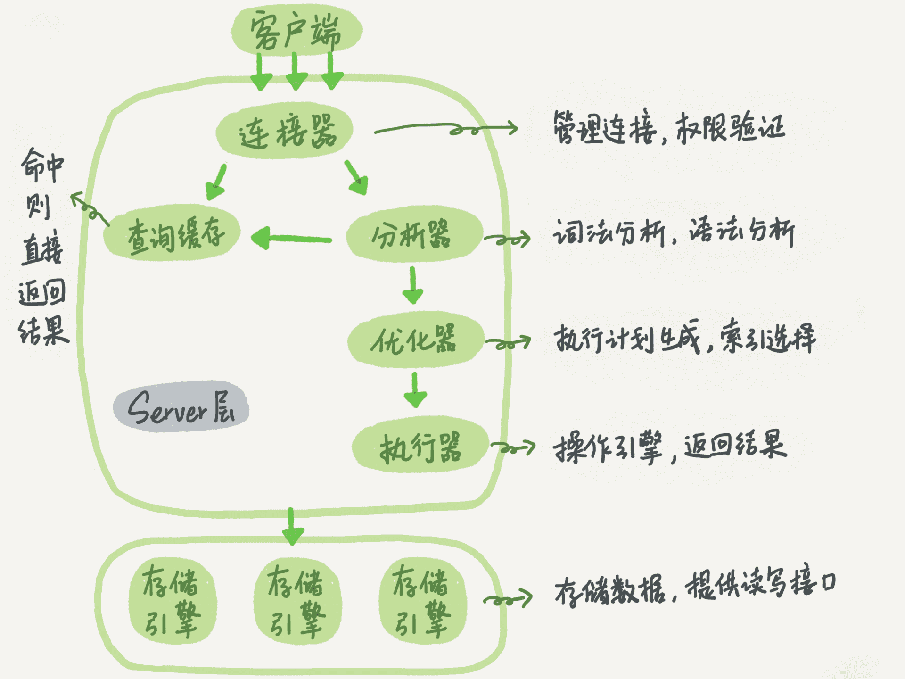
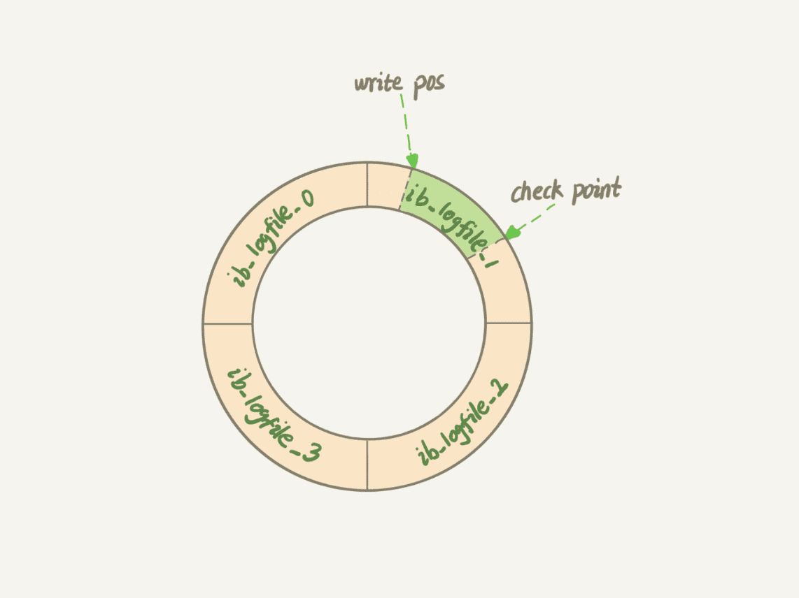
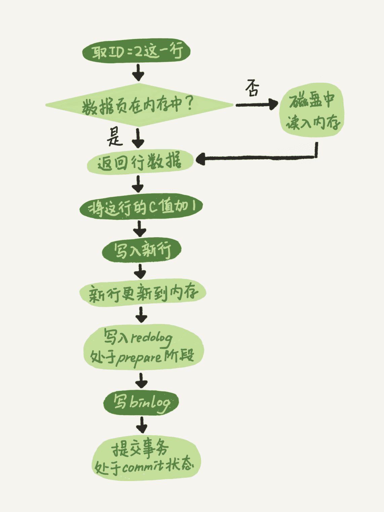
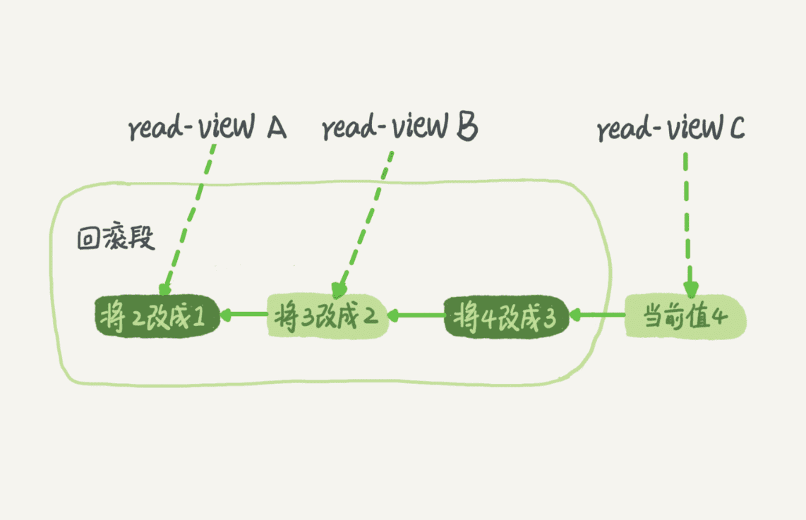
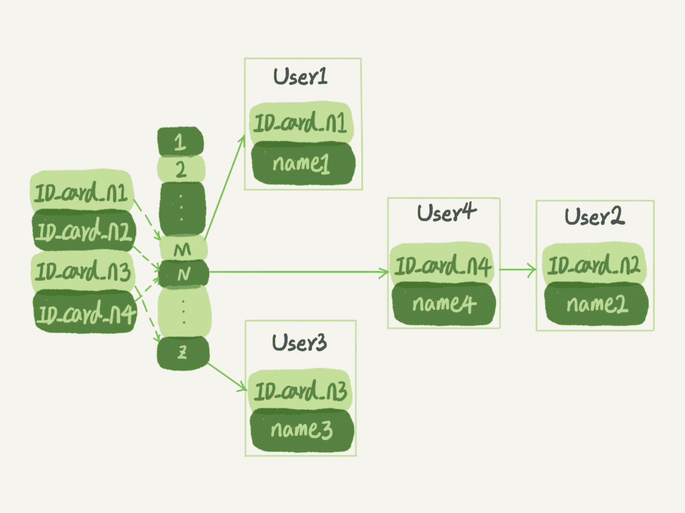
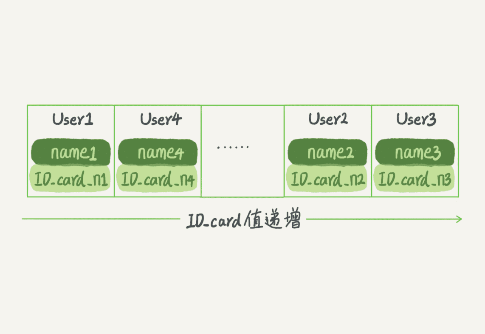
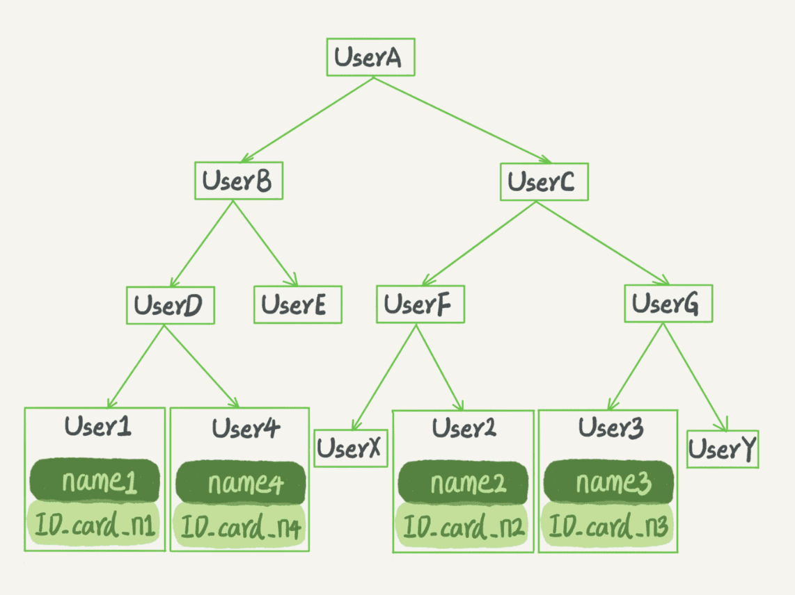
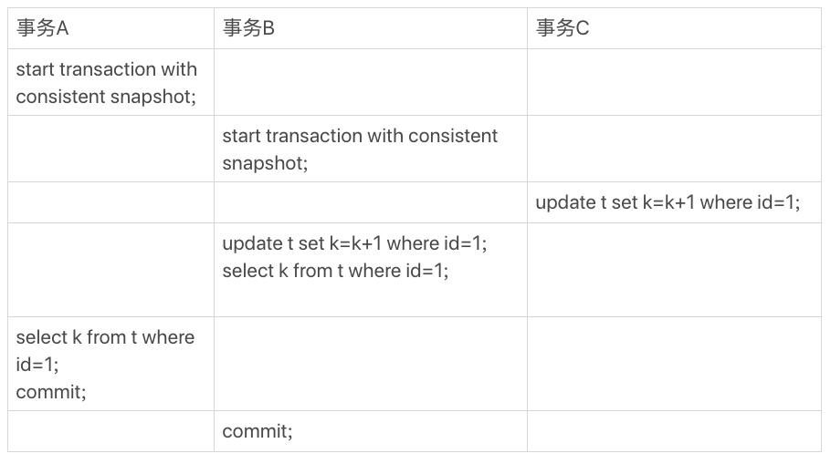
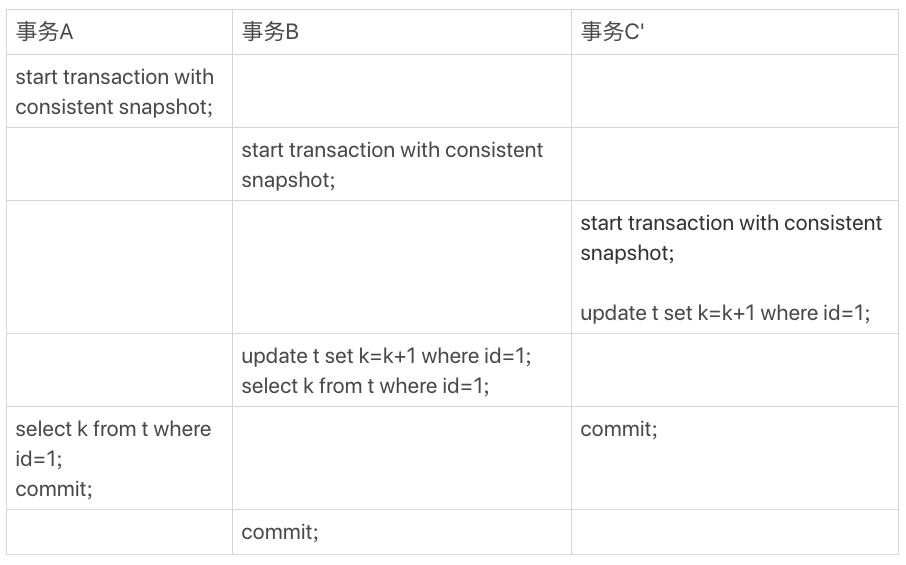

# MySQL 实战 45 讲 - Part 1

Lesson 1~8

---

Reference: [MySQL 实战 45 讲 - 极客时间](https://time.geekbang.org/column/article/68319)

# 01. 基础架构：SQL 查询语句如何执行



MySQL 可分为两部分

-   Server 层

    所有跨存储引擎的功能都在 Server 层实现。

    -   **连接器**
    -   ~~查询缓存~~_（Removed in MySQL 8.0）_
    -   **分析器**
        1.  词法分析
        2.  语法分析
    -   **优化器**
        -   **在表有多个索引时，决定使用哪个索引**
        -   **有多表关联（join）的时候，决定各个表的连接顺序**
    -   **执行器**
    -   所有 **内置函数**：如日期、时间、数学和加密函数等
    -   _还有存储过程、触发器、视图等（icehe：工作没碰到过）_

-   存储引擎层

    负责 **数据的存储和提取**。

    其架构模式是插件式的，支持多个存储引擎；
    _不同存储引擎的表数据存取方式不同，支持的功能也不同。_

    -   **InnoDB**：建表时，如果不指定引擎类型，默认使用 InnoDB。
    -   **Memory**：可以在 `create table` 语句中添加 `engine=memory` 来指定使用内存引擎建表。
    -   MyISAM：略

## 连接器

客户端需要先连接到 DB 上再使用 DB。
MySQL 的连接器负责：

- 跟客户端建立连接
- 获取权限
- 维持和管理连接

```bash
# e.g. 连接 MySQL 的命令
mysql -h$ip -P$port -u$user -p
```

一个用户成功建立连接后，即使用管理员账号对这个用户的权限做了修改，也不会影响已经存在连接的权限。
修改完成后，只有再新建的连接才会使用新的权限设置。

_icehe：所以感觉想保证绝对不越权，就得在修改权限设置后，强制关闭相关用户现存的 DB 连接。_

连接完成后，如果没后续的动作，这个连接就处于空闲状态，可以在 `show processlist` 命令中看到它。

### show processlist

看 `show processlist` 的结果，一个连接的 Command 列显示为 "Sleep" 时表示处于空闲状态。

```bash
$ mysql -h127.0.0.1 -P3306 -uroot -p
Enter password:
Welcome to the MySQL monitor.  Commands end with ; or \g.
Your MySQL connection id is 4
Server version: 5.7.32-log Homebrew

Copyright (c) 2000, 2020, Oracle and/or its affiliates. All rights reserved.

Oracle is a registered trademark of Oracle Corporation and/or its
affiliates. Other names may be trademarks of their respective
owners.

Type 'help;' or '\h' for help. Type '\c' to clear the current input statement.

mysql> show processlist;
+----+------+-----------------+------+---------+------+----------+------------------+
| Id | User | Host            | db   | Command | Time | State    | Info             |
+----+------+-----------------+------+---------+------+----------+------------------+
|  3 | root | localhost:51349 | NULL | Sleep   |  129 |          | NULL             |
|  4 | root | localhost:51364 | NULL | Query   |    0 | starting | show processlist |
+----+------+-----------------+------+---------+------+----------+------------------+
2 rows in set (0.00 sec)
```

### 长连接、短连接

**客户端如果太长时间没动静，连接器就会自动将它断开。**

客户端连接超时的时长由参数 **`wait_timeout`** 控制，**默认值 8 小时**，
即 8h x 60min/h x 60sec/min = 28800 secs

```bash
mysql> show variables like 'wait_timeout';
# or
mysql> show variables where Variable_name = "wait_timeout";
+---------------+-------+
| Variable_name | Value |
+---------------+-------+
| wait_timeout  | 28800 |
+---------------+-------+
1 row in set (0.00 sec)
```

- **长连接**：连接成功后，如果客户端持续有请求，则一直使用同一个连接。
- **短连接**：每次执行完很少的几次查询就断开连接，下次查询再重新建立一个。

建立连接的过程通常比较复杂，所以在使用中要尽量减少建立连接的操作，也就是 **尽量使用长连接**。

### 定期重建长连接

Problem：但是全部使用长连接后，可能会发现有些时候 MySQL 占用内存涨得特别快。

Root cause：因为 MySQL 在执行过程中临时使用的内存是管理在连接对象里面的，这些资源会在连接断开的时候才释放。
所以如果长连接累积下来，可能导致内存占用太大，被系统强行杀掉 ( OOM ) ，从现象看就是 MySQL 异常重启了。

Solution：可以考虑以下两种解决方案：

-   定期断开长连接

    使用一段时间，或者程序里面判断执行过一个占用内存的大查询后，断开连接，之后要查询再重连。

-   MySQL 5.7 及以上版本，可以在每次执行一个比较大的操作后，
    **通过执行 `mysql_reset_connection` 来重新初始化连接资源。**

    这个过程不需要重连和重新做权限验证，但是可以直接将连接恢复到刚刚创建完时的状态。

## 执行器

MySQL 通过分析器知道了你要做什么，通过优化器知道了该怎么做，于是就进入了执行器阶段，开始执行语句。

开始执行的时候，要先判断一下你对这个表 T 有没有执行查询的权限。如果没有，就会返回没有权限的错误。

可以在数据库的慢查询日志中看到 `rows_examined` 字段，
它 **表示这个语句执行过程中扫描了多少行**，
它是 **在执行器每次调用引擎获取数据行的时候累加。**

注意：执行器调用一次，实际在引擎内部可能扫描了多行，因此引擎扫描行数跟 `rows_examined` 并不是完全相同的（可能是估算值）。

# 02. 日志系统：SQL 更新语句如何执行

更新流程涉及两个重要的日志模块：

- redo log 重做日志（InnoDB 存储引擎）
- binlog 归档日志（Server 层）

## Redo Log

如果每一次的更新操作都需要写进磁盘，
然后磁盘也要找到对应的那条记录，然后再更新，
整个过程 IO 成本、查找成本都很高。

可以用 **WAL（Write-Ahead Logging）技术** 提升效率，
它的关键点就是 **先写日志，再写磁盘**。

具体来说，当有一条记录需要更新的时候，
InnoDB 引擎就会先把记录写到 redo log 里面，并更新内存，这个时候更新就算完成了。

同时，InnoDB 引擎会在适当的时候，将这个操作记录更新到磁盘里面，
而这个更新往往是在系统比较空闲的时候做。

**InnoDB 的 redo log 是固定大小的，比如可以配置为一组 4 个文件，每个文件的大小是 1GB，那么这块 "粉板" 总共就可以记录 4GB 的操作。**

从头开始写，写到末尾就又回到开头循环写，如下图所示：



- **write pos** 是当前记录的位置，一边写一边后移，写到第 3 号文件末尾后就回到 0 号文件开头。
- **checkpoint** 是当前要擦除的位置，也是往后推移并且循环的，擦除记录前要把记录更新到数据文件。
- write pos 和 checkpoint 之间的是 "粉板" 上还空着的部分，可以用来记录新的操作。
    - 如果 write pos 追上 checkpoint，表示 "粉板" 满了，这时候不能再执行新的更新，得停下来先擦掉一些记录，把 checkpoint 推进一下。

有了 redo log，**InnoDB 可以保证即使数据库发生异常重启，之前提交的记录都不会丢失**，这个能力称为 **crash-safe**。

## Binlog

粉板 redo log 是 InnoDB 引擎特有的日志，
而 Server 层也有自己的日志，称为 **binlog（归档日志）**。

redo log 和 binlog 之间有以下三点不同：

1.  redo log 是 InnoDB 存储引擎特有的；
    binlog 是 MySQL 的 Server 层实现的，所有引擎都可以使用。

2. **redo log 是物理日志，记录的是 "在某个数据页上做了什么修改"**；
    **binlog 是逻辑日志，记录的是某个更新语句的原始逻辑**，比如 "给 ID=2 这一行的 c 字段加 1"。

3.  **redo log 是循环写的，空间固定会用完**；**binlog 是可以追加写入的**。
    "追加写" 是指 binlog 文件写到一定大小后会切换到下一个，并不会覆盖以前的日志。

## 更新语句的执行

执行器和 InnoDB 引擎在执行之前那个简单的 update 语句时的内部流程：

1.  执行器先找引擎取 ID=2 这一行。
    ID 是主键，引擎直接用树搜索找到这一行。
    如果 ID=2 这一行所在的数据页本来就在内存中，就直接返回给执行器；
    否则，需要先从磁盘读入内存，然后再返回。

2.  执行器拿到引擎给的行数据，把这个值加上 1。
    _比如原来是 N，现在就是 N+1，_
    得到新的一行数据，再调用引擎接口写入这行新数据。

3.  **存储引擎** 将这行新数据更新到内存中，
    同时 **将这个更新操作记录到 redo log 里面，此时 redo log 处于 prepare 状态。**
    然后告知执行器执行完成了，随时可以提交事务。

4.  **执行器生成这个操作的 binlog，并把 binlog 写入磁盘。**

5.  **执行器调用存储引擎的提交事务接口，存储引擎把刚刚写入的 redo log 改成提交 ( commit ) 状态**，更新完成。

这个 update 语句的执行流程如下图：

- 图中浅色框表示是在 InnoDB 内部执行的
- 深色框表示是在执行器中执行的



其中第 3 到 5 步将 redo log 的写入拆成了两个步骤：**prepare 和 commit —— "两阶段提交"**。

## 两阶段提交

为什么必须有“两阶段提交”呢？这是为了让两份日志之间的逻辑一致。

……

为什么日志需要“两阶段提交”？不妨用反证法来进行解释。

由于 redo log 和 binlog 是两个独立的逻辑，如果不用两阶段提交，
要么就是先写完 redo log 再写 binlog，或者采用反过来的顺序。
我们看看这两种方式会有什么问题。

仍然用前面的 update 语句来做例子。
假设当前 ID=2 的行，字段 c 的值是 0，
再假设执行 update 语句过程中在写完第一个日志后，
第二个日志还没有写完期间发生了 crash，会出现什么情况呢?

1.  先写 redo log 后写 binlog。

    假设在 redo log 写完，binlog 还没有写完的时候，MySQL 进程异常重启。
    由于我们前面说过的，redo log 写完之后，系统即使崩溃，
    仍然能够把数据恢复回来，所以恢复后这一行 c 的值是 1。
    但是由于 binlog 没写完就 crash 了，这时候 binlog 里面就没有记录这个语句。

    因此，之后备份日志的时候，存起来的 binlog 里面就没有这条语句。
    然后你会发现，如果需要用这个 binlog 来恢复临时库的话，
    由于这个语句的 binlog 丢失，这个临时库就会少了这一次更新，
    恢复出来的这一行 c 的值就是 0，与原库的值不同。

2.  先写 binlog 后写 redo log。

    如果在 binlog 写完之后 crash，由于 redo log 还没写，
    崩溃恢复以后这个事务无效，所以这一行 c 的值是 0。
    但是 binlog 里面已经记录了 "把 c 从 0 改成 1" 这个日志。

    所以，在之后用 binlog 来恢复的时候就多了一个事务出来，
    恢复出来的这一行 c 的值就是 1，与原库的值不同。

如果不使用 "两阶段提交"，那么数据库的状态就有可能和用它的日志恢复出来的库的状态不一致。

不只是误操作后需要用这个过程来 **恢复数据**；
当需要 **扩容** 的时候，也就是需要再多搭建一些备库来增加系统的读能力的时候。

现在常见的做法也是 **用全量备份加上应用 binlog 来实现的，这个 "不一致" 就会导致线上出现主从数据库不一致的情况。**

简单说，redo log 和 binlog 都可以用于表示事务的提交状态，而两阶段提交就是让这两个状态保持逻辑上的一致。

## 调整持久化参数保证数据不丢

redo log 用于保证 crash-safe 能力。

-   **`innodb_flush_log_at_trx_commit` 参数设置成 1 时，表示 每次事务的 redo log 都直接持久化到磁盘。**
    -   建议设置成 1 以 **保证 MySQL 异常重启之后数据不丢失。**

binlog 用于保证备份恢复、主备同步等。

-   **`sync_binlog` 参数设置成 1 时，表示每次事务的 binlog 都持久化到磁盘**
    -   也建议设置成 1 以 **保证 MySQL 异常重启之后 binlog 不丢失。**

# 03. 事务隔离

简单来说，**事务就是要保证一组数据库操作，要么全部成功，要么全部失败**。

---

事务的 **ACID**：

-   Atomicity 原子性

    事务的一组操作，要么全部成功，要么全部失败。

-   Consistency 一致性

    保证事务开始之前和结束之后，数据库的“完整性”都不会被破坏。

-   Isolation 隔离性

    并发事务能够同时正确地对其数据进行查询和修改。

-   Duration 持久性

    事务处理结束后，对数据的修改是持久的，即使系统崩溃也不会丢失。

## 隔离性与隔离级别

Isolation —— 隔离性。

当数据库上有多个事务同时执行时，可能会出现以下问题：

-   dirty read 脏读

    读到其它事务未提交的数据。

-   non-repeatable read 不可重复读

    一个事务中，前后读取的记录内容不一致。

-   phantom read 幻读

    前后读取的记录数量不一致。

    _例如要确定某项数据不存在之后才能 insert 它的操作，会由于幻读导致出错。_

为了解决这些问题，就有了 **隔离级别**。

_隔离得越严实，效率就会越低；因此很多时候，要在二者之间寻找一个平衡点。_

---

SQL 标准的事务隔离级别：

-   **Read Uncommitted 读未提交**

    一个事务还没提交时，它做的变更就能被别的事务看到。

-   **Read Committed 读提交**

    一个事务提交之后，它做的变更才会被其他事务看到。

-   **Repeatable Read 可重复读**

    一个事务执行过程中看到的数据，总是跟这个事务在启动时看到的数据是一致的。
    （注意：当前读 current read 时，仍可读到最新值。）

    _当然在可重复读隔离级别下，未提交变更对其他事务也是不可见的。_

-   **Serializable 串行化**

    顾名思义，对于同一行记录，"写" 会加 "写锁"，"读" 会加 "读锁"。
    当出现读写锁冲突的时候，后访问的事务必须等前一个事务执行完成，才能继续执行。

### 不同隔离级别下的数据可见性


假设数据表 T 中只有一列，其中一行的值为 1，上面是按照时间顺序执行两个事务的行为。

在不同的隔离级别下，事务 A 有不同的返回结果，即图中 V1、V2、V3 的返回值分别是什么：

-   若隔离级别是“读未提交”，则 V1 就是 2。

    这时候事务 B 虽然还没有提交，但是结果已经被 A 看到了，因此 V2、V3 也都是 2。

-   若隔离级别是“读提交”，则 V1 是 1，V2 是 2。

    事务 B 的更新在提交后才能被 A 看到，所以 V3 也是 2。

-   若隔离级别是“可重复读”，则 V1、V2 是 1，V3 是 2。

    之所以 V2 还是 1，遵循的就是这个要求：事务在执行期间看到的数据前后必须是一致的。

-   若隔离级别是“串行化” ，则在事务 B 执行“将 1 改成 2”时，会被锁住。

    直到事务 A 提交后，事务 B 才可以继续执行。所以从 A 的角度看，V1、V2 是 1，V3 是 2。

### 从视图看隔离级别

在实现上，数据库里面会创建一个 **视图**（view），访问的时候以视图的逻辑结果为准。

- 在“可重复读”隔离级别下，这个视图是在事务启动时创建的，整个事务存在期间都用这个视图。
- 在“读提交”隔离级别下，这个视图是在每个 SQL 语句开始执行的时候创建的。
- 在“读未提交”隔离级别下直接返回记录上的最新值，没有视图概念。
- 而“串行化”隔离级别下直接用加锁的方式来避免并行访问。

可以看到在不同的隔离级别下，数据库行为是不同的。

_Oracle 数据库的默认隔离级别其实就是“读提交”（icehe：所以 Oracle 的“串行化”是“虚假”的），_
_因此对于一些从 Oracle 迁移到 MySQL 的应用，为保证数据库隔离级别的一致，一定要记得将 MySQL 的隔离级别设置为“读提交”。_

### 查看和配置隔离级别

**隔离级别的配置方式：修改启动参数 `transaction_isolation`。**

**生产环境上，通常使用 READ-COMMITTED 读提交隔离级别。**

查看当前的隔离级别：

```bash
mysql> show variables like "transaction_isolation";
+-----------------------+-----------------+
| Variable_name         | Value           |
+-----------------------+-----------------+
| transaction_isolation | REPEATABLE-READ |
+-----------------------+-----------------+
1 row in set (0.00 sec)
```

---

“可重复读”的场景：

总的来说，存在即合理，每种隔离级别都有自己的使用场景，要根据自己的业务情况来定。

什么时候需要 "可重复读" 的场景呢? 例如数据校对逻辑的案例。

假设你在管理一个个人银行的账户表。一个表存了账户余额，一个表存了账单明细。
到了月底你要做数据校对，也就是判断上个月的余额和当前余额的差额，是否与本月的账单明细一致。
一定会希望在 **校对过程中，即使有用户发生了一笔新的交易，也不影响你的校对结果。**

## 事务隔离的实现：回滚日志

**每条记录在更新的时候都会同时记录一条回滚操作；**
**记录上的最新值，通过回滚操作，都可以得到前一个状态的值。**

_（icehe：很像 Git 进行版本控制的机制。）_

假设一个值从 1 被按顺序改成了 2、3、4，在 **回滚日志** 里面就会有类似下面的记录：



-   当前值是 4，但是在查询这条记录的时候，不同时刻启动的事务会有不同的 read-view。
-   如图中看到的，在视图 A、B、C 里面，这一个记录的值分别是 1、2、4，
    **同一条记录在系统中可以存在多个版本，就是数据库的多版本并发控制 ( MVCC )**。
-   对于 read-view A，要得到 1，就必须将当前值依次执行图中所有的回滚操作得到。
-   同时你会发现，即使现在有另外一个事务正在将 4 改成 5，这个事务跟 read-view A、B、C 对应的事务是不会冲突的。

**MVCC - multiversion concurrency control**

当没有事务再需要用到某些回滚日志时，它们就会被删除。

即当事务结束时，对应的 read-view 也结束了；
当系统里的某些回滚日志没有被任何 read-view 所需要时，就可以被删除了。

### 尽量不要使用长事务

长事务意味着系统里面会存在很老的事务视图。
由于这些事务随时可能访问数据库里面的任何数据，
所以这个 **事务提交之前，数据库里面它可能用到的回滚记录都必须保留，这就会导致大量占用存储空间。**

_在 MySQL 5.5 及以前的版本，回滚日志是跟数据字典一起放在 ibdata 文件里的，即使长事务最终提交，回滚段被清理，文件也不会变小。_
_见过数据只有 20GB，而回滚段有 200GB 的库。最终只好为了清理回滚段，重建整个库。_

除了对回滚段的影响，**长事务还占用锁资源，也可能拖垮整个库**（后续讲锁时会展开，此处不赘述）。

## 事务的启动方式

MySQL 的事务启动方式有以下几种：

1.  显式启动事务语句 `begin` 或 `start transaction`；

    配套的提交语句是 `commit` ，回滚语句是 `rollback`。

2.  `set autocommit=0` 命令会关掉这个线程的“自动提交”。

    意味着如果你只执行一个 `select` 语句，这个事务就启动了，而且并不会自动提交。
    这个事务持续存在直到你主动执行 `commit` 或 `rollback` 语句，或者断开连接。

_有些客户端连接框架会默认连接成功后先执行一个 `set autocommit=0` 的命令，就导致接下来的查询都在事务中，如果是长连接，就导致了意外的长事务。_

**建议总是使用 `set autocommit=1`，通过显式语句的方式来启动事务。**

_但是有的开发人员会纠结“多一次交互”的问题。_
_对于一个需要频繁使用事务的业务，第二种方式每个事务在开始时都不需要主动执行一次 begin，减少了语句的交互次数。_
_如果你也有这个顾虑，建议使用 `commit work and chain` 语法。_

_在 autocommit 为 1 的情况下，用 `begin` 显式启动的事务，如果执行 `commit` 则提交事务。_
_如果执行 `commit work and chain`，则是提交事务并自动启动下一个事务，这样也省去了再次执行 begin 语句的开销。_
_同时带来的好处是从程序开发的角度明确地知道每个语句是否处于事务中。_

**可以在 `information_schema` 库的 `INNODB_TRX` 表中查询长事务，例如查找持续时间超过 60s 的事务**：

```sql
select *
from information_schema.INNODB_TRX
where TIME_TO_SEC(timediff(now()，trx_started)) > 60
```

## 避免长事务对业务的影响

首先，从应用开发端来看

1.  确认是否使用了 `set autocommit=0`，**应该改为 `set autocommit=1`。**

    可以在测试环境中进行确认：启用 MySQL 的 general_log，然后随便跑一个业务逻辑，通过 general_log 的日志来确认。

    _一般框架如果会设置这个值，也就会提供参数来控制行为，你的目标就是把它改成 1。_

2.  确认是否有不必要的只读事务。**去掉不必要的只读事务，自动提交只读事务即可。**

    _有些框架会习惯不管什么语句先用 `begin` / `commit` 框起来。_
    _见过有些是业务并没有这个需要，但是也把好几个 select 语句放到了事务中。_
    _这种只读事务可以去掉。_

3.  业务连接数据库的时候，根据业务本身的预估，**通过 `SET MAX_EXECUTION_TIME` 命令，来控制每个语句执行的最长时间，避免单个语句意外执行太长时间。**

其次，从数据库端来看

1.  **监控 `information_schema.INNODB_TRX` 表，设置长事务阈值，超过就报警 / 或者 kill。**
2.  推荐使用 **Percona 的 `pt-kill` 工具**
3.  在业务功能 **测试阶段要求输出所有的 general_log**，分析日志行为提前发现问题

    **开启 general_log，会将所有到达 MySQL Server 的 SQL 语句记录。**
    **一般不会开启该功能，因为 log 的量会非常庞大。**
    **但在特别情况下可能临时打开 general log 以供排障使用。**

    _例如，不清楚程序执行了哪些 SQL 语句，但是又要排除错误，找不到原因，就可以短暂开启。_

4.  如果使用的是 MySQL 5.6 或者更新版本，**把 `innodb_undo_tablespaces` 设置成 2（或更大的值）。**

    **如果真的出现大事务导致回滚段过大，这样设置后清理起来更方便。**

    **innodb_undo_tablespaces 用于设定创建的 undo 表空间的个数。**
    默认值为 0，表示不独立设置 undo 的 tablespace，默认记录到 ibdata 中；
    否则 **在 undo 目录下创建指定个数的 undo 文件 ( 每个文件的默认大小为 10M )。**
    最多可以设置到 126。不支持后期修改。

    _例如，假定设置该值为 4，那么就会在 MySQL 的 data 目录下创建命名为undo001 ~ undo004 的 undo tablespace 文件。_
    _在 `mysql_install_db` 时初始化后，就再也不能被改动了，修改该值会导致 MySQL 无法启动。_

# 04. 索引模型

_索引的出现其实就是为了提高数据查询的效率，就像书的目录一样。_

## 索引的常见模型

可以用于提高读写效率的数据结构很多，先介绍三种常见、也比较简单的数据结构：

- **哈希表 hash table**
- **有序数组 sorted array**
- **搜索树 search tree**

### 哈希表

_以键-值（key-value）存储数据的结构，只要输入待查找的键即 key，就可以找到其对应的值即 value。_
_哈希的思路很简单，把值放在数组里，用一个哈希函数把 key 换算成一个确定的位置，然后把 value 放在数组的这个位置。_
_多个 key 值经过哈希函数的换算，会出现同一个值的情况。处理这种情况的一种方法是，拉出一个链表。_

优点：

- 等值查询很快 _O(1)_

缺点：

- 区间查询很慢 _O(n)_
- _icehe：因为它是无序的，范围查询恐怕需要全表扫描_

适用场景：

- 只有等值查询的场景
- _例如，Memcached 及其它一些 NoSQL 引擎。_



### 有序数组

优点：

- 等值查询快 _O(log(n))_ _（二分查找）_
- 范围查询快 _O(2 \* log(n) + c)_ _（先进行二分查找确定起点和终点，再遍历他们之间的数据）_

缺点：

- 插入数据很慢 _O(n \* log(n) + c)_ _（插入 + 排序）_

适用场景：

- 静态存储引擎
- _例如，某年某城市的归档（不再修改）的人口信息_



### 搜索树

二叉搜索树

优点：

-   查询快 _O(log(n))_ _（二分查找）_

    为了保证 O(log(n)) 的查询复杂度，**需要维持平衡二叉树**，其更新的时间复杂度也是 O(log(n))

-   范围查询快 _O(2 \* log(n) + c)_ _（先进行二分查找确定起点和终点，再遍历之间的数据）_

缺点：

-   每个节点保存的数据少，树高，访问磁盘数据块的次数多

适用场景：略



树可以有二叉，也可以有多叉。

- 多叉树就是每个节点有多个儿子，儿子之间的大小保证从左到右递增。
- **二叉树是搜索效率最高的，但是实际上大多数的数据库存储却并不使用二叉树。**
- **因为索引不止存在内存中，还要写到磁盘上**。

例如，一棵 100 万节点的平衡二叉树，树高 20，一次查询可能需要访问 20 个数据块。

-   _**100w = 1 million =** 10^6 = 10^3 x 10^3 = 2^10 x 2^10 **= 2^20**_
-   在机械硬盘时代，从磁盘随机读一个数据块需要 10 ms 左右的寻址时间。
    -   也就是说，对于一个 100 万行的表，如果使用二叉树来存储，单独访问一个行可能需要 20 个 10 ms 的时间，这个查询可真够慢的。

**为了让一个查询尽量少地读磁盘，就必须让查询过程访问尽量少的数据块。**

那么，就不应该使用二叉树，而是要使用 "N 叉" 树。
这里，"N 叉" 树中的 "N" 取决于数据块的大小。

**以 InnoDB 的一个整数字段索引为例，这个 N 差不多是 1200**（更具体的数据可能是1170）。

-   16KB 的页大小：pg_sz = 16 * 1024 = 16,384
-   每行数据的索引：8 byte 的 ID，6 byte 的指针（指向子节点）: pg_sz / (8 + 6) ≈ 1170

**这棵树高是 4 的时候，就可以存 1200 的 3 次方个值，这已经 17 亿了。**

-   _一层可以索引 1200 行；两层 1200 ^ 2 = 1,440,000；三层 1,728,000,000_
-   _一层可以索引 1170 行；两层 1170 ^ 2 = 1,368,900；三层 1,601,613,000_
-   _icehe：因为第四层只保存一行行的整行数据，所以上文说树高位 4 时能存 1200 ^ 3 个值。_

考虑到树根的数据块总是在内存中的，一个 10 亿行的表上一个整数字段的索引，查找一个值最多只需要访问 3 次磁盘。
其实，树的第二层也有很大概率在内存中，那么访问磁盘的平均次数就更少了。

N 叉树由于在读写上的性能优点，以及适配磁盘的访问模式，已经被广泛应用在数据库引擎中了。

_不管是哈希还是有序数组，或者 N 叉树，它们都是不断迭代、不断优化的产物或者解决方案。_
数据库技术发展到今天，**跳表**、**LSM** 树等数据结构也被用于引擎设计中，在此不赘述。

在 MySQL 中，索引是在存储引擎层实现的，所以并没有统一的索引标准，即不同存储引擎的索引的工作方式并不一样。
_而即使多个存储引擎支持同一种类型的索引，其底层的实现也可能不同。_

References:

-   [B+树 - 维基百科](https://zh.wikipedia.org/wiki/B%2B%E6%A0%91)
-   [B+树详解](https://ivanzz1001.github.io/records/post/data-structure/2018/06/16/ds-bplustree)

## InnoDB 的索引模型

在 InnoDB 中，**表都是根据主键顺序以索引的形式存放的**，这种存储方式的表称为 **索引组织表**。
InnoDB 使用了 **B+ 树索引模型**，所以 **数据都是存储在 B+ 树中的。**
**每一个索引在 InnoDB 里面对应一棵 B+ 树。**

Reference: [What are the differences between B trees and B+ trees?](https://stackoverflow.com/questions/870218/what-are-the-differences-between-b-trees-and-b-trees)

假设，我们有一个主键列为 ID 的表，表中有字段 k, 并且在 k 上有索引。这个表的建表语句是：

```sql
create table T (
    id int primary key,
    k int not null,
    name varchar(16),
    index (k)
) engine=InnoDB;
```

表中 R1~R5 的 (ID, k) 值分别为 (100, 1), (200, 2), (300, 3), (500, 5) 和 (600, 6)，两棵树的示例示意图如下：


根据叶子节点的内容，索引类型分为：

-   **主键索引**

    **主键索引的叶子节点存的是整行数据。**
    在 InnoDB 里，**主键索引也被称为聚簇索引（clustered index）** 。

-   **非主键索引**

    **非主键索引的叶子节点内容是主键的值。**
    在 InnoDB 里，**非主键索引也被称为二级索引（secondary index）** 。

基于主键索引和普通索引的查询有什么区别?

-   如果语句是 `select * from T where ID=500`，

    即主键查询方式，则只需要搜索 ID 索引树这棵 B+ 树；

-   如果语句是 `select * from T where k=5`，

    即普通索引查询方式，则需要先搜索 k 索引树，得到 ID 的值为 500，再到 ID 索引树搜索一次。
    这个过程称为 **回表**。

即 **基于非主键索引的查询需要多扫描一棵索引树**。因此，在应用中应该尽量使用主键查询。

## 索引维护

B+ 树 **为了维护索引有序性**，

-   在插入新值的时候需要做必要的维护。

    例如 **页分裂**，它还影响数据页的利用率。
    原本放在一个页的数据，现在分到两个页中，整体空间利用率降低大约 50%。

-   当相邻两个页由于删除了数据，利用率很低之后，会将数据页做 **合并**。

    合并的过程，可以认为是分裂过程的逆过程。

### 自增主键

可能在一些建表规范里面见到过类似的描述，**要求建表语句里一定要有自增主键**。
当然事无绝对，分析哪些场景下应该使用自增主键，而哪些场景下不应该。

自增主键是指自增列上定义的主键，在建表语句中一般是这么定义的：

```sql
NOT NULL PRIMARY KEY AUTO_INCREMENT
```

插入新记录的时候可以不指定 ID 的值，系统会获取当前 ID 最大值加 1 作为下一条记录的 ID 值。
即 **自增主键的插入数据模式，正符合了递增插入的场景**。

-   A. 每次插入一条新记录，都是追加操作，都不涉及到挪动其他记录，也不会触发叶子节点的分裂。
-   B. 而有 **业务逻辑的字段做主键，则往往不容易保证有序插入，这样写数据成本相对较高**。

除了考虑性能外，还可以从存储空间的角度来看。
_假设表中确实有一个唯一字段，比如字符串类型的身份证号，那应该用身份证号做主键，还是用自增字段做主键呢?_
由于每个非主键索引的叶子节点上都是主键的值。

-   如果用身份证号做主键，那么每个二级索引的叶子节点占用约 20 个字节，
-   而如果用整型做主键，则只要 4 个字节，如果是长整型 (bigint) 则是 8 个字节。

显然，**主键长度越小，普通索引的叶子节点就越小，普通索引占用的空间也就越小**。
所以，从性能和存储空间方面考量，**自增主键往往是更合理的选择**！

---

有没有什么场景适合用业务字段直接做主键的呢?

-   就是典型的 KV 场景
    1.  只有一个索引
    2.  该索引必须是唯一索引
-   由于没有其他索引，所以也就不用考虑其他索引的叶子节点大小的问题。
    -   这时就要优先考虑 "尽量使用主键查询" 原则，直接将这个索引设置为主键，
    -   可以避免每次查询需要搜索两棵树。

# 05. 覆盖索引 & 索引下推

```sql

create table T (
    ID int primary key,
    k int NOT NULL DEFAULT 0,
    s varchar(16) NOT NULL DEFAULT '',
    index k(k)
) engine=InnoDB;

insert into T values
    (100, 1, 'aa'),
    (200, 2, 'bb'),
    (300, 3, 'cc'),
    (500, 5, 'ee'),
    (600, 6, 'ff'),
    (700, 7, 'gg');
```


```sql
select * from T where k between 3 and 5
```

现在，我们一起来看看这条 SQL 查询语句的执行流程：

- 1\. 在 k 索引树上找到 k=3 的记录，取得 ID = 300；
- 2\. 再到 ID 索引树查到 ID=300 对应的 R3；
- 3\. 在 k 索引树取下一个值 k=5，取得 ID=500；
- 4\. 再回到 ID 索引树查到 ID=500 对应的 R4；
- 5\. 在 k 索引树取下一个值 k=6，不满足条件，循环结束。

在这个过程中，**回到主键索引树搜索的过程**，称为 **回表**。可以看到，这个查询过程 :

- 读了 k 索引树的 3 条记录（步骤 1、3 和 5）
- 回表了 2 次（步骤 2 和 4）

_在这个例子中，由于查询结果所需要的数据只在主键索引上有，所以不得不回表。_
_那么如何通过索引优化，避免回表过程呢。_

## 覆盖索引

- 做法：多个字段联合索引。
- 优先：如果查询的字段在覆盖索引里，就没必要回表了。

## 最左前缀原则

- 覆盖索引匹配时严格按从左向右的顺序。

## 索引下推

- 目的：优化最左前缀的原则造成的问题，减少回表。
- 做法：如果覆盖索引中包含需要判断的字段，就先判断完再决定是否回表。

# 06. 全局锁和表锁

## 全局锁

-   典型场景：全库逻辑备份
-   当 mysqldump 使用参数 `–single-transaction` 的时候，导数据之前就会启动一个事务，来确保拿到一致性视图。
    而由于 MVCC 的支持，这个过程中数据是可以正常更新的。（可重复读的隔离级别）

## 表级锁

有两种：表锁、元数据锁（MDL - Meta Data Lock）

当对一个表做增删改查操作的时候，加 MDL 读锁；
当要对表做结构变更操作的时候，加 MDL 写锁。

-   读锁之间不互斥，因此你可以有多个线程同时对一张表增删改查。
-   读写锁之间、写锁之间是互斥的，用来保证变更表结构操作的安全性。
    因此，如果有两个线程要同时给一个表加字段，其中一个要等另一个执行完才能开始执行。

# 07. 行锁

两阶段锁协议：

- 在 InnoDB 事务中，行锁是在需要的时候才加上的，
- 但并不是不需要了就立刻释放，而是要等到事务结束时才释放。

当出现死锁以后，有两种策略：

-   A. **直接进入等待，直到超时。**

    这个超时时间可以通过参数 innodb_lock_wait_timeout 来设置，在 InnoDB 中其 **默认值是 50s**。

    这意味着当出现死锁以后，第一个被锁住的线程要过 50s 才会超时退出，然后其他线程才有可能继续执行。
    对于在线服务来说，这个等待时间往往是无法接受的。

-   B. **发起死锁检测，发现死锁后，主动回滚死锁链条中的某一个事务**，让其他事务得以继续执行。

    _将参数 innodb_deadlock_detect 设置为 on，表示开启这个逻辑。_

解决策略：

-   思路 A. 如果能确保这个业务一定不会出现死锁，可以临时把死锁检测关掉。

    但是这个做法不保险（谁能保证一定不会发生死锁）。

-   思路 B. 控制并发度：对 DB 的读写连接数作出限制。

# 08. 事务隔离

## 一致性读 & 当前读

示例：表结构、数据、执行事务如下，隔离级别为可重复读。

```sql
CREATE TABLE `t` (
    `id` int(11) NOT NULL,
    `k` int(11) DEFAULT NULL,
    PRIMARY KEY (`id`)
) ENGINE=InnoDB;
insert into t(id, k) values (1, 1);
```



问题：事务 A 和 B 的 select 语句的返回值是？

<details>

<summary>答案</summary>

事务A：1。<br/>
事务B：3。

</details>

原因：简而言之

-   事务 A：**一致性读**（consistent read）

    -   它是最先开始的；
    -   事务 A 中看到的数据是事务 B 和 C 执行开始前的版本，
        无论事务 B 或 C 此时是否已提交了更新；
    -   而且它没有包含写操作，即没有写锁（这点下文详述）。

-   事务 C

    -   它在事务 B 之后才开始；
    -   但是它比事务 B 更早地提交了对数据的更新。

-   事务 B：**当前读**（current read）

    -   在更后开始但更早提交数据更新的事务 B 之后才更新数据；
    -   更新某项数据前，需要读该项数据（已提交）的最新值；
    -   所以基于已提交的事务 C 更新后的数据进行更新，结果是 k = 3。

详解 [见原文](https://time.geekbang.org/column/article/70562)，下文仅摘要。

## view, trx id, undo log

视图：MySQL 中，有两个“视图”的概念：

1.  **View**：它是一个用查询语句定义的虚拟表，在调用的时候执行查询语句并生成结果。
    创建视图的语法是 create view … ，而它的查询方法与表一样。
2.  **Consistent read view**：InnoDB 在实现 MVCC 时用到的一致性读视图，
    用于支持读提交（RC - Read Committed）和可重复读（RR - Repeatable Read）隔离级别的实现。

数据版本：

-   InnoDB 里面每个事务有一个唯一的 **事务 ID**，叫作 **transaction id**。
    它是在事务开始的时候向 InnoDB 的事务系统申请的，是 **按申请顺序严格递增** 的。

-   而每行数据也都是有多个版本的。

    每次事务更新数据的时候，都会生成一个新的数据版本，并且把 transaction id 赋值给这个数据版本的事务 ID，记为 **row trx_id**。

    也就是说，数据表中的一行记录，其实可能有多个版本 (row)，每个版本有自己的 row trx_id。

-   一行记录有多个版本，一个事务可以根据自身 transaction id 以及该行记录 undo log 计算得出可见的版本。

    _一个事务只需要在启动的时候声明说，_
    _“以我启动的时刻为准，如果一个数据版本是在我启动之前生成的，就认；_
    _如果是我启动以后才生成的，我就不认，我必须要找到它的上一个版本”。_

    这就是一致性视图（read-view）的原理简述。

## 写锁

-   更新数据都是先读后写的，而这个读，只能读当前的值，称为“当前读”。

-   除了 update 语句外，select 语句如果加锁，也是当前读。

    ```sql
    select * from t where id = 1 for update;
    -- or
    select * from t where id = 1 lock in share mode;
    ```

其它新概念：

-   读锁：S 锁，即共享锁
-   写锁：X 锁，即排他锁

示例：上一个示例的变体如下，让事务 C 在事务 B 执行 update 语句后才提交。



问题：现在事务 B 中 select 语句的结果是？事务 B 和 C 的执行过程有何影响？

<details>
<summary>答案</summary>

事务 B 的 select 语句结果依然是 3。

事务 C 执行 update 语句后，会对该行记录加上写锁；
这时事务 B 再执行 update 语句时，由于拿不到该行数据的写锁，就会被阻塞；
等到事务 C 提交之后释放了该行数据的写锁，事务 B 的 update 语句才能继续执行。
</details>
