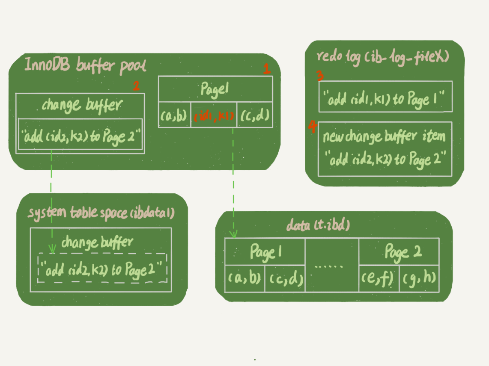
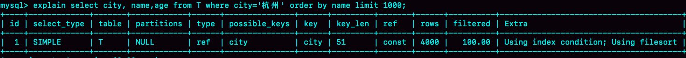

# MySQL 实战 45 讲 - Part 2

Lesson 9~16

---

Reference: [MySQL 实战 45 讲 - 极客时间](https://time.geekbang.org/column/article/68319)

# 09. 普通索引 vs 唯一索引

## Change Buffer

### 用途

当需要更新一个数据页时，如果数据页在内存中就直接更新；

而如果这个数据页还没有在内存中的话，在不影响数据一致性的前提下，
InnoDB 会将这些更新操作缓存在 change buffer 中，
这样就不需要从磁盘中读入这个数据页了。

在下次查询需要访问这个数据页的时候，将数据页读入内存，
然后执行 change buffer 中与这个页有关的操作。

_虽然名字叫作 change buffer，实际上它是可以持久化的数据。_
_也就是说，change buffer 在内存中有拷贝，也会被写入到磁盘上。_

_change buffer 用的是 buffer pool 里的内存，因此不能无限增大。_
_change buffer 的大小，可以通过参数 innodb_change_buffer_max_size 来动态设置。_
_这个参数设置为 50 的时候，表示 change buffer 的大小最多只能占用 buffer pool 的 50%。_

### 适用场景

因为 merge 的时候是真正进行数据更新的时刻，
而 change buffer 的主要目的就是将记录的变更动作缓存下来，
所以在一个数据页做 merge 之前，
其 change buffer 记录的变更越多（也就是这个页面上要更新的次数越多），收益就越大。

-   面对“写多读少”的场景时，change buffer 通过缓存更新操作，大大加速了更新过程。
-   但是面对“读多写少”的场景时，由于要写入的数据页大概率很快就会被查询到，
    这时该数据页被加载到内存，然后触发 change buffer 的 merge 的操作；
    如此一来，写入 change buffer 行为就显得多余，还不如直接通过从磁盘加载对应数据页
    （此时还不如没有 change buffer）。

## 普通索引 vs 唯一索引

普通索引的更新不能使用 change buffer，而唯一索引不可以。

因为对于普通索引来说，插入记录的操作直接使用 change buffer 就可以了；
但是唯一索引需要检查 key 是否冲突，如果目标页不在内存中，还需要先从磁盘加载。

使用普通索引还是唯一索引？

-   查询性能上基本没区别。
-   更新性能上使用普通索引更好（因为少了判断冲突的成本）。

如果更新之后立刻就要查询该记录，则应该关闭 change buffer。

## Redo Log vs Change Buffer?

如果要简单地对比这两个机制在提升更新性能上的收益的话，

- **redo log 主要节省的是随机写磁盘的 IO 消耗（转成顺序写），**
- **而 change buffer 主要节省的则是随机读磁盘的 IO 消耗。**

注意：对 change buffer 的操作，也会记录到 redo log 中。



所以崩溃恢复时，change buffer 中的数据更新也不会丢。

# 10. MySQL 为什么有时候会选错索引？

将慢查询日志的阈值设置为 0：

```sql
set long_query_time=0;
```

表示这个线程接下来的语句都会被记录入慢查询日志中。

## 索引的区分度

索引的 **区分度**：一个索引上不同的值越多，这个索引的区分度就越好。
而一个索引上不同的值的个数，我们称之为 **基数**（cardinality）。
也就是说，这个基数越大，索引的区分度越好。

## 计算索引的基数

MySQL 是怎样得到索引的基数的呢？

简单介绍 MySQL 采样统计的方法。为什么要采样统计呢？
因为把整张表取出来一行行统计，虽然可以得到精确的结果，但是代价太高了，所以只能选择“采样统计”。

采样统计的时候，InnoDB 默认会选择 N 个数据页，
统计这些页面上的不同值，得到一个平均值，
然后乘以这个索引的页面数，就得到了这个索引的基数。

而数据表是会持续更新的，索引统计信息也不会固定不变。
所以，当变更的数据行数超过（总数据行数的）1/M的时候，会自动触发重新做一次索引统计。

在 MySQL 中，有两种存储索引统计的方式，可以通过设置参数 innodb_stats_persistent 的值来选择：

-   设置为 on 的时候，表示统计信息会持久化存储。这时，默认的 N 是 20，M 是 10。
-   设置为 off 的时候，表示统计信息只存储在内存中。这时，默认的 N 是 8，M 是 16。

## 选错索引的因素

详解 [见原文](https://time.geekbang.org/column/article/71173)。

```sql
CREATE TABLE `t` (
    `id` int(11) NOT NULL AUTO_INCREMENT,
    `a` int(11) DEFAULT NULL,
    `b` int(11) DEFAULT NULL,
    PRIMARY KEY (`id`),
    KEY `a` (`a`),
    KEY `b` (`b`)
) ENGINE=InnoDB;
```

该表有 100,000 行数据。

```sql
-- 1. 通常的查询语句
explain select * from t where a between 10000 and 20000;
-- 2. 强制使用 a 索引
explain select * force index (a) from t where a between 10000 and 20000;
```

-   首先优化器预估查询语句的扫描扫描不够准确（这很正常）。例如

    -   上文通常的查询语句的预估扫描行数为 100,000，可以推断其走了全表扫描而非 a 索引；
    -   上文强制使用 a 索引的查询语句的预估扫描行数可能为 30,000。

-   那么根据根据优化器的预估，使用 a 索引将扫描 30,000 行，不是比全表扫描 100,000 好多了？

    -   实际上 **优化器还考虑了回表的扫描成本！** 例如在 a 索引上扫描完之后，还得回到主键索引获取整行数据。
    -   这样可能还不如直接在主键索引上进行全表扫描。

所以，MySQL 优化器选错了索引，可能是扫描行数错估导致的。

## 重新统计索引信息

我们可以 **重新统计 t 表的索引信息**：

```sql
analyze table t;
```

然后再重新分析/执行之前的查询语句，基于更准确的索引统计信息，选择索引便能更准确。

# 11. 给字符串字段加索引

前缀索引

-   优点：消耗存储空间较小。

    定义好长度，就可以做到既节省空间，又不用额外增加太多的查询成本。
    需要确定合适的长度，以保证足够索引字段的区分度。

-   缺点：由于“前缀索引”可能包含不了完整的字符串字段，
    所以没办法充分利用“覆盖索引”在某些情况下不用回表的优势。

---

场景：如果字符串的前缀重复度很高，如何优化？

技巧：

-   A. 索引倒序的字符串
-   B. 索引字符串的 hash 值

缺点：

-   不支持范围查询。

# 12. 刷脏页导致 DB 服务抖动

SQL 语句为什么变“慢”了？

## 刷脏页

当内存数据页跟磁盘数据页内容不一致的时候，称这个内存页为“脏页”。
内存数据写入到磁盘后，内存和磁盘上的数据页的内容就一致了，称为“干净页”。

平时执行很快的更新操作，其实就是在写内存和日志，
而 MySQL 偶尔“抖”一下的那个瞬间，可能就是在 **刷脏页（flush）**。

什么时候会 flush？例如：

-   InnoDB 的 redo log 写满了。

    这时候系统会停止所有更新操作，把 checkpoint 往前推进，
    那么 redo log 留出空间才可以继续写。

-   系统内存不足。

    当需要新的内存页，而内存不够用的时候，
    就要淘汰一些数据页，空出内存给别的数据页使用。
    如果淘汰的是“脏页”，就要先将脏页写到磁盘。

-   MySQL 认为系统“空闲”的时候。

    只要有机会就刷一点“脏页”。

-   MySQL 正常关闭的情况。

    MySQL 会把内存的脏页都 flush 到磁盘上。
    下次 MySQL 启动的时候，就可以直接从磁盘上读数据，启动速度会很快。

## 为什么要控制脏页比例

背景：

InnoDB 用缓冲池（buffer pool）管理内存，缓冲池中的内存页有三种状态：

-   未被使用的；
-   使用了的干净页；
-   使用了的脏页。

InnoDB 的策略是尽量使用内存，因此对于一个长时间运行的库来说，未被使用的页面很少。

而当要读入的数据页没有在内存的时候，就必须到缓冲池中申请一个数据页。
这时候只能把最久不使用的数据页从内存中淘汰掉：

-   如果要淘汰的是一个干净页，就直接释放出来复用；
-   但如果是脏页呢，就必须将脏页先刷到磁盘，变成干净页后才能复用。

所以，刷脏页虽然是常态，但是出现以下这两种情况，都是会明显影响性能的：

1.  一个查询要淘汰的脏页个数太多，会导致查询的响应时间明显变长；

2.  日志写满，更新全部堵住，写性能跌为 0，_这种情况对敏感业务来说，是不能接受的。_

所以，InnoDB 需要有控制脏页比例的机制，来尽量避免上面的这两种情况。

## 脏页比例的控制策略

要用 **innodb_io_capacity** 参数告诉 InnoDB 所在主机的 IO 能力，
这样 InnoDB 才能知道需要全力刷脏页的时候，可以刷多快。

这个值 **建议设置成磁盘的 IOPS**。
磁盘的 IOPS 可以通过 fio 这个工具来测试，
下面的语句是用来测试磁盘随机读写的命令：

```bash
fio -filename=$filename -direct=1 -iodepth 1 \
    -thread -rw=randrw -ioengine=psync -bs=16k \
    -size=500M -numjobs=10 -runtime=10 \
    -group_reporting -name=mytest
```

InnoDB 的刷盘速度要参考两个因素：

1. **脏页比例**
2. **redo log 写盘速度**

详解 [见原文](https://time.geekbang.org/column/article/71806)。

InnoDB 会根据这两个因素先单独算出两个数字。
参数 innodb_max_dirty_pages_pct 是脏页比例上限，
默认值是 90%（MySQL 8.0+）。
（5.7）


获取脏页比例：

```sql
select VARIABLE_VALUE into @a from global_status
where VARIABLE_NAME = 'Innodb_buffer_pool_pages_dirty';

select VARIABLE_VALUE into @b from global_status
where VARIABLE_NAME = 'Innodb_buffer_pool_pages_total';

select @a/@b;
```

## 顺便刷旁边的脏页？

一旦一个查询请求需要在执行过程中先 flush 掉一个脏页时，这个查询就可能要比平时慢了。

**在准备刷一个脏页的时候，如果这个数据页旁边的数据页刚好是脏页，就会把这个“邻居”也带着一起刷掉；**
**而且这个把“邻居”拖下水的逻辑还可以继续蔓延，也就是对于每个邻居数据页，**
**如果跟它相邻的数据页也还是脏页的话，也会被放到一起刷。**

在 InnoDB 中，innodb_flush_neighbors 参数就是用来控制这个行为的，
值为 1 的时候会有上述的“连坐”机制，值为 0 时表示不找邻居，自己刷自己的。

找“邻居”这个优化在机械硬盘时代是很有意义的，可以减少很多随机 IO。
机械硬盘的随机 IOPS 一般只有几百，相同的逻辑操作减少随机 IO 就意味着系统性能的大幅度提升。

而如果使用的是 SSD 这类 IOPS 比较高的设备的话，建议把 innodb_flush_neighbors 的值设置成 0。
因为这时候 IOPS 往往不是瓶颈，而“只刷自己”，能更快地执行完必要的刷脏页操作，减少 SQL 语句响应时间。

**在 MySQL 8.0 中，innodb_flush_neighbors 参数的默认值已经是 0 了。**
即只刷当前的脏页，不顺便刷旁边的脏页。

# 13. 表数据空间的懒回收导致表文件大小不变

_一个 InnoDB 表包含两部分，即：表结构定义和数据。_

_在 MySQL 8.0 版本以前，表结构是存在以.frm 为后缀的文件里。_
_而 MySQL 8.0 版本，则已经允许把表结构定义放在系统数据表中了。_
_因为表结构定义占用的空间很小，所以下文主要讨论的是表数据。_

## 参数 innodb_file_per_table

表数据既可以存在共享表空间里，也可以是单独的文件。

这个行为是由参数 **innodb_file_per_table** 控制的：

-   这个参数设置为 OFF 表示的是，表的数据放在系统共享表空间，也就是跟数据字典放在一起；
-   这个参数设置为 **ON 表示的是，每个 InnoDB 表数据存储在一个以 .ibd 为后缀的文件中**。

从 MySQL 5.6.6 版本开始，它的默认值就是 ON 了。

_建议不论使用 MySQL 的哪个版本，都将这个值设置为 ON。_
_因为，一个表单独存储为一个文件更容易管理，而且在你不需要这个表的时候，_
_通过 drop table 命令，系统就会直接删除这个文件。_

而如果是放在共享表空间中，即使表删掉了，空间也是不会回收的。
所以将 innodb_file_per_table 设置为 ON 是推荐做法。

在删除整个表的时候，可以使用 drop table 命令回收表空间。
但是，遇到的更多的删除数据的场景是删除某些行，
这时表中的数据被删除了，但是表空间却没有被回收。

## 数据删除流程

**数据页的复用跟记录的复用是不同的。**

-   如果删掉了一个数据页上的所有记录，那么整个数据页就可以被复用了。

-   如果只删除了一个数据页上的部分记录，这些记录会被标识为“删除”。

-   如果新插入的数据可以复用已删除的记录的空间，那么直接复用。

-   如果相邻的两个数据页利用率很小，系统就会把这两个页上的数据合到其中一个页上，
    另外一个数据页就被标记为可复用。

-   用 delete 命令把整个表的数据删除，所有的数据页都会被标记为可复用。
    但是磁盘上，文件不会变小。

-   ……

## 重建表

重建表，可以清除表数据空间中的“空洞”，以缩小表数据空间。

```sql
alter table A engine=InnoDB;
```

可以使用以上命令来重建表。

_在 MySQL 5.5 版本之前，这个命令的执行流程跟下图描述的差不多，_
_区别只是这个临时表 B 不需要你自己创建，_
_MySQL 会自动完成转存数据、交换表名、删除旧表的操作。_


而在 MySQL 5.6 版本开始引入的 **Online DDL**，对这个操作流程做了优化，如下：

1.  建立一个临时文件，扫描表 A 主键的所有数据页；
2.  用数据页中表 A 的记录生成 B+ 树，存储到临时文件中；
3.  生成临时文件的过程中，将所有对 A 的操作记录在一个日志文件（row log）中，
    _对应下图的 state2 状态_；
4.  临时文件生成后，将日志文件中的操作应用到临时文件，得到一个逻辑数据上与表 A 相同的数据文件，
    _对应下图的 state3 状态_；
5.  用临时文件替换表 A 的数据文件。


之所以称为 Online DDL，是因为这样 **在重建表的过程中，可以允许对其进行增删改操作**。

alter 语句在启动的时候需要获取 MDL 写锁，但是这个写锁在真正拷贝数据之前就退化成读锁了；
因为加 MDL 读锁时不会阻塞增删改操作，提高性能。

## Onlin vs inplace

详情 [见原文](https://time.geekbang.org/column/article/72388)

# 14. count(*) 查询为什么慢

## 事务隔离影响 count 查询结果

InnoDB 引擎执行 count(*) 的时候，需要把数据一行一行地从引擎里面读出来，然后累积计数。

InnoDB 引擎使用多版本并发控制（MVCC）支持事务，
即使是同一时刻的查询，查询出的行数都是不确定的，要视具体情况而定的。

_例如，隔离级别、查询所属的事务的具体情况（可能查询前有插入、删除、修改数据）等。_

用一个算 count(*) 的例子解释：


详情 [见原文](https://time.geekbang.org/column/article/72775)。

---

InnoDB 是索引组织表，主键索引树的叶子节点是数据，而普通索引树的叶子节点是主键值。所以，普通索引树比主键索引树小很多。对于 count(*) 这样的操作，遍历哪个索引树得到的结果逻辑上都是一样的。因此，MySQL 优化器会找到最小的那棵树来遍历。在保证逻辑正确的前提下，尽量减少扫描的数据量，是数据库系统设计的通用法则之一。

## count 查询速度的优化

InnoDB 是索引组织表，主键索引树的叶子节点是数据，而普通索引树的叶子节点是主键值。
所以，**普通索引树比主键索引树小很多。**

对于 count(*) 这样的操作，遍历哪个索引树得到的结果逻辑上都是一样的。
因此，**MySQL 优化器会找到最小的那棵树来遍历。**

在保证逻辑正确的前提下，尽量减少扫描的数据量，是数据库系统设计的通用法则之一。

---

```sql
show table status
```

如果用过以上命令的话，就会发现这个命令的输出结果里面也有一个
TABLE_ROWS 用于显示这个表当前有多少行，这个命令执行挺快的。

但是它 **TABLE_ROWS 不能代替 `count(*)`，因为它只是估算结果**，跟 explain 语句的估算方法差不多。

---

用缓存系统保存计数

-   缺点：没有 MVCC 的事务隔离，不能保证计数的准确性。

用 DB 保存计数

-   优点：可以通过事务进行支持
-   缺点：数据库读写压力大

---

count 语句写法

-   **`count(*)`: 并不会把全部字段取出来，而是专门做了优化，不取值。**

    _count(*) 肯定不是 null，按行累加。_

-   `count(主键 id)`：遍历整张表，把每一行的 id 值都取出来，返回给 server 层。

    _server 层拿到 id 后，判断是不可能为空的，就按行累加。_

-   `count(1)`：遍历整张表，但不取值。

    _server 层对于返回的每一行，放一个数字“1”进去，判断是不可能为空的，按行累加。_

-   `count(field)`：字段定义是否可以为 null？

    -   NOT NULL：一行行地从记录里面读出这个字段，判断不可能为 null，按行累加。

    -   ALLOW NULL：一行行地从记录里面读出这个字段，
        判断到有可能是 null，还要把值取出来再判断一下，不是 null 才累加。

按照效率排序的话，count(字段) < count(主键 id) < count(1) ≈ count(*)，
所以 **尽量使用 `count(*)`**。

# 15. 日志和索引相关问题

## 两阶段提交的崩溃恢复


在两阶段提交的不同时刻，MySQL 异常重启会出现什么现象。

如果在图中时刻 A 的地方，
也就是写入 redo log 处于 prepare 阶段之后、写 binlog 之前，发生了崩溃（crash），
由于此时 binlog 还没写，redo log 也还没提交，所以崩溃恢复的时候，这个事务会回滚。
这时候，binlog 还没写，所以也不会传到备库。

崩溃恢复时的判断规则：

1.  **如果 redo log 里面的事务是完整的，也就是已经有了 commit 标识，则直接提交；**
2.  **如果 redo log 里面的事务只有完整的 prepare，则判断对应的事务 binlog 是否存在并完整：**
    -   **a. 如果是，则提交事务；**
    -   **b. 否则，回滚事务。**

所以在途中时刻 B 的地方，会提交事务。

## 如何确定 binlog 是否完整？

一个事务的 binlog 是有完整格式的：

-   statement 格式的 binlog，最后会有 COMMIT；
-   row 格式的 binlog，最后会有一个 XID event。

_另外，在 MySQL 5.6.2 版本以后，_
_还引入了 binlog-checksum 参数，用来验证 binlog 内容的正确性。_
_对于 binlog 日志由于磁盘原因，可能会在日志中间出错的情况，_
_MySQL 可以通过校验 checksum 的结果来发现。_
_所以，MySQL 还是有办法验证事务 binlog 的完整性的。_

## redo log 如何关联 binlog？

它们有一个共同的数据字段，叫 **XID**。
崩溃恢复的时候，会按顺序扫描 redo log：

-   如果碰到既有 prepare、又有 commit 的 redo log，就直接提交；
-   **如果碰到只有 parepare、而没有 commit 的 redo log，就拿着 XID 去 binlog 找对应的事务。**

## 为什么需要两阶段提交？

如果这样的话，为什么还要两阶段提交呢？
干脆先 redo log 写完，再写 binlog。
崩溃恢复的时候，必须得两个日志都完整才可以。
是不是一样的逻辑？

其实，两阶段提交是经典的分布式系统问题，并不是 MySQL 独有的。

如果必须要举一个场景，来说明这么做的必要性的话，那就是事务的持久性问题。

对于 InnoDB 引擎来说，**如果 redo log 提交完成了，事务就不能回滚**
（如果这还允许回滚，就可能覆盖掉别的事务的更新）。
**而如果 redo log 直接提交，然后 binlog 写入的时候失败，InnoDB 又回滚不了，数据和 binlog 日志又不一致了。**

两阶段提交就是为了给所有人一个机会，当每个人都说“我 ok”的时候，再一起提交。

## 为什么不能只留 binlog？

不引入两个日志，也就没有两阶段提交的必要了。
只用 binlog 来支持崩溃恢复，又能支持归档，不就可以了？

其中一个原因：binlog 没有能力恢复“数据页”。

可能存在的情况：（这里的例子不确定对不对）
有两个更新语句 `update c=c+1` 写入了 binlog，
其中一个 commit 了，另一个还没有，此时 DB 服务崩溃了。
对应数据所在的内存脏页没有回写到磁盘中
（已经两次 c=c+1 都已经更新到内存的数据上了）；

那么崩溃恢复之后，
不会重新执行已经 commit 的那个更新语句，
会重新执行没有 commit 的那个更新语句；
理论上基于磁盘上的数据 c 应该执行两次更新语句，
实际上结果只更新数据 c 一次（因为内存上的更新过一次的脏页数据丢了）。

而使用 WAL 技术的 redo log 把还没落到磁盘的脏页数据都记着，所以不会丢失！

## 为什么不能只留 redo log？

那能不能反过来，只用 redo log，不要 binlog？

binlog 已经被广泛地被使用和依赖。例如：

-   redo log 是循环写，写到末尾是要回到开头继续写的。
    这样历史日志没法保留，redo log 也就起不到归档的作用。

-   MySQL 系统高可用的基础，就是 binlog 复制。

-   还有很多公司有异构系统（比如一些数据分析系统），
    这些系统就靠消费 MySQL 的 binlog 来更新自己的数据。
    关掉 binlog 的话，这些下游系统就没有输入了。

## 数据最终落盘时？依据 buffer pool 还是 redo log？

实际上，redo log 并没有记录数据页的完整数据，
所以它并没有能力自己去更新磁盘数据页。

1.  **如果是正常运行的实例的话，**
    数据页被修改以后，跟磁盘的数据页不一致，称为脏页。
    **最终数据落盘，就是把内存中的数据页写盘。**
    这个过程，甚至与 redo log 毫无关系。

2.  **在崩溃恢复场景中，**
    **InnoDB 如果判断到一个数据页可能在崩溃恢复的时候丢失了更新，**
    **就会将它读到内存，然后让 redo log 更新内存内容。**
    更新完成后，内存页变成脏页，就回到了第一种情况的状态。

## 其它

redo log buffer 是什么？
是先修改内存，还是先写 redo log 文件？

redo log buffer 就是一块内存，用来先存 redo 日志的。

但是，真正把日志写到 redo log 文件（文件名是 ib_logfile+ 数字），
是在执行 commit 语句的时候做的。

---

redo log 一般设置多大？

例如，现在用几个 TB 的磁盘，可以直接将 redo log 设置为 4 个文件、每个文件 1GB。

# 16. order by 如何工作？

## 全字段排序

```sql
CREATE TABLE `t` (
    `id` int(11) NOT NULL,
    `city` varchar(16) NOT NULL,
    `name` varchar(16) NOT NULL,
    `age` int(11) NOT NULL,
    `addr` varchar(128) DEFAULT NULL,
    PRIMARY KEY (`id`),
    KEY `city` (`city`)
) ENGINE=InnoDB;
```

```sql
select city,name,age from t where city='杭州' order by name limit 1000;
```



explain SQL 语句的结果中，
Extra 这个字段中的 “**Using filesort**” 表示的就是需要排序，
MySQL 会 **给每个线程分配一块内存用于排序，称为 sort_buffer**（在 server 层。）。

例如，“全字段排序”执行流程如下：

1.  初始化 sort_buffer，确定放入 name、city、age 这三个字段；
2.  从索引 city 找到第一个满足 city='杭州’条件的主键 id；
3.  到主键 id 索引取出整行，
    **取 name、city、age 三个字段的值，存入 sort_buffer 中；**
4.  从索引 city 取下一个记录的主键 id；
5.  重复步骤 3、4 直到 city 的值不满足查询条件为止；
6.  **对 sort_buffer 中的数据按照字段 name 做快速排序；**
7.  按照排序结果取前 1000 行返回给客户端。


sort_buffer_size 是 MySQL 为排序开辟的内存（sort_buffer）的大小。

如果要排序的数据量小于 sort_buffer_size，排序就在内存中完成（内排序）。
但如果排序数据量太大，内存放不下，则不得不利用磁盘临时文件辅助排序（外排序）。

如何确定一个排序语句是否使用了临时文件？
详情 [见原文](https://time.geekbang.org/column/article/73479)

## rowid 排序

如果单行数据太长，全字段排序的效率下降。

**rowid 排序只将主键 id 和需要排序的字段放到 sort_buffer。**


1.  初始化 sort_buffer，确定放入两个字段，即 name 和 id；
2.  从索引 city 找到第一个满足 city='杭州’条件的主键 id；
3.  **到主键 id 索引取出整行，取 name、id 这两个字段，存入 sort_buffer 中；**
4.  从索引 city 取下一个记录的主键 id；
5.  重复步骤 3、4 直到不满足 city='杭州’条件为止；
6.  对 sort_buffer 中的数据按照字段 name 进行排序；
7.  遍历排序结果，取前 1000 行，**并按照 id 的值回到原表中取出 city、name 和 age 三个字段返回给客户端。**

## 全字段排序 vs rowid 排序

**如果内存够，就要多利用内存，尽量减少磁盘访问。**

如果 MySQL 实在是担心排序内存太小，会影响排序效率，才会采用 rowid 排序算法，
这样排序过程中一次可以排序更多行，但是需要再回到原表去取数据。

如果 MySQL 认为内存足够大，会优先选择全字段排序，把需要的字段都放到 sort_buffer 中，
这样排序后就会直接从内存里面返回查询结果了，不用再回到原表去取数据。

## 利用索引 order by

接上文的例子，如果有 city 和 name 的联合索引，就可以不用 sort_buffer 来排序了。

```sql
alter table t add index city_user(city, name);
```


即，**有覆盖所需字段的索引，其中字段的顺序也跟 order by 语句一致，**就不需要临时表和排序了。


这时查看对应的 explain 语句结果，
Extra 字段中没有 Using filesort 了，可以确定 MySQL 执行语句时不需要排序了。


---

还可以利用 **覆盖索引** 进一步优化：
如果覆盖索引包含 select 需要的所有字段，甚至不需要回表（查询主键索引获取所需字段）。

接上文例子

```sql
alter table t add index city_user_age(city, name, age);
```


这时查看对应的 explain 语句结果，
Extra 字段里面多了“Using index”，表示的就是使用了覆盖索引。
