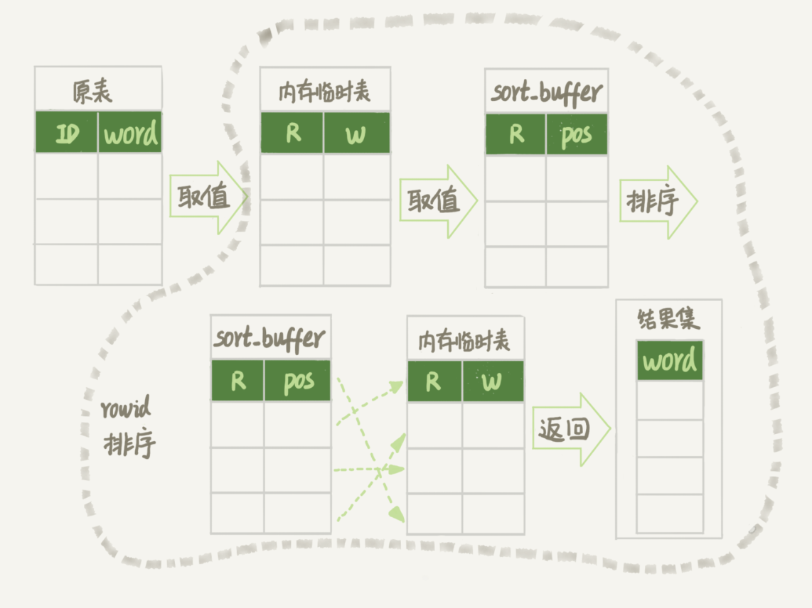
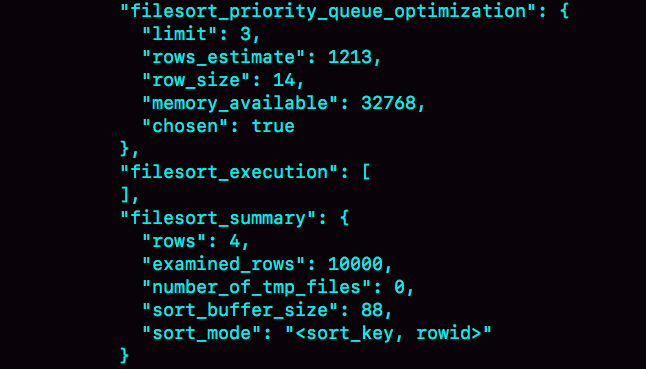

# MySQL 实战 45 讲 - Part 3

Lesson 17~?

---

Reference: [MySQL 实战 45 讲 - 极客时间](https://time.geekbang.org/column/article/68319)

# 17. 在 MySQL 执行随机排序的查询会发生什么？

场景实例：英语学习 App 首页有一个随机显示单词的功能。
每个用户有一个单词表，然后当一个用户每次访问首页的时候，都会随机滚动显示三个单词。

```sql
-- 建表语句
CREATE TABLE `words` (
  `id` int(11) NOT NULL AUTO_INCREMENT,
  `word` varchar(64) DEFAULT NULL,
  PRIMARY KEY (`id`)
) ENGINE=InnoDB;

-- 生成随机数据用于实验
delimiter ;;
create procedure idata()
begin
  declare i int;
  set i=0;
  while i<10000 do
    insert into words(word) values(concat(char(97+(i div 1000)), char(97+(i % 1000 div 100)), char(97+(i % 100 div 10)), char(97+(i % 10))));
    set i=i+1;
  end while;
end;;
delimiter ;

call idata();
```

## 内存临时表

继续上文的实例，使用 order by rand() 来实现随机选取单词的逻辑。

```sql
select word from words order by rand() limit 3;
```

通过 explain 命令，查看 SQL 的执行情况：

```bash
mysql> explain select word from words order by rand() limit 3 \G
*************************** 1. row ***************************
           id: 1
  select_type: SIMPLE
        table: words
   partitions: NULL
         type: ALL
possible_keys: NULL
          key: NULL
      key_len: NULL
          ref: NULL
         rows: 9980
     filtered: 100.00
        Extra: Using temporary; Using filesort
1 row in set, 1 warning (0.00 sec)
```

**Extra 字段显示 Using temporary，表示的是需要使用临时表；Using filesort，表示的是需要执行排序操作。**

意思就是：需要使用临时表，并且在它上面进行排序。

## 在内存临时表上排序

**对于 InnoDB 表来说，执行全字段排序会减少磁盘访问**，因此会被优先选择。

**对于内存表，回表过程只是简单地根据数据行的位置，直接访问内存得到数据，根本不会导致多访问磁盘。**

优化器没有了这层顾虑，那么它会优先考虑的，就是用于排序的行越少越好了。
所以，MySQL 这时就会选择 rowid 排序。

语句具体执行流程：

1.  创建一个临时表。

    这个临时表使用的是 memory 引擎，表里有两个字段，并且这个表没有建索引。

    -   第一个字段是 double 类型，记为字段 R（保存 rand() 产生的随机数）；
    -   第二个字段是 varchar(64) 类型，记为字段 W（保存单词 word）。

2.  从 words 表中，按主键顺序取出所有的 word 值。

    对于每一个 word 值，调用 rand() 函数生成一个大于 0 小于 1 的随机小数，
    并把这个随机小数和 word 分别存入临时表的 R 和 W 字段中。

    到此，扫描行数是 10000。

3.  临时表此时有 10000 行数据了，要在这个没有索引的内存临时表上，根据字段 R 排序。

4.  初始化 sort_buffer。sort_buffer 中有两个字段

    -   double 类型的字段 R
    -   6字节整型的字段 W

5.  从内存临时表中一行一行地取出 R 值和 rowid（表没主键的话会自动创建出 rowid），
    分别存入 sort_buffer 中的两个字段里。

    这个过程要对内存临时表做全表扫描，此时扫描行数增加 10000，变成了 20000。

6.  在 sort_buffer 中根据字段 R 的值进行排序。

    注意，这个过程没有涉及到表操作，所以不会增加扫描行数。

7.  排序完成后，取出前三个结果的 rowid，依次到内存临时表中取出 word 值，返回给客户端。

    此时，又访问了表的三行数据，总扫描行数变成了 20003。

可以通过慢查询日志（slow log）来验证一下我们分析得到的扫描行数是否正确。

```bash
mysql> set global slow_query_log=1;
mysql> show variables like '%slow%';
+-----------------------------+--------------------------------------------------+
| Variable_name               | Value                                            |
+-----------------------------+--------------------------------------------------+
| log_slow_admin_statements   | OFF                                              |
| log_slow_extra              | OFF                                              |
| log_slow_replica_statements | OFF                                              |
| log_slow_slave_statements   | OFF                                              |
| slow_launch_time            | 2                                                |
| slow_query_log              | ON                                               |
| slow_query_log_file         | /opt/homebrew/var/mysql/macbook-air-ice-slow.log |
+-----------------------------+--------------------------------------------------+
7 rows in set (0.01 sec)

$ less /opt/homebrew/var/mysql/macbook-air-ice-slow.log
...
# Query_time: 0.900376 Lock_time: 0.000347 Rows_sent: 3 Rows_examined: 20003SET timestamp=1541402277;select word from words order by rand() limit 3;
```

其中，Rows_examined：20003 就表示这个语句执行过程中扫描了 20003 行，也就验证了我们分析得出的结论。

_icehe: 复现失败，slow log 文件里看不到记录……_

看课程读者后来的反馈，MySQL 8.0+ 版本的扫描行数是 10003。
估计具体的优化是：直接在内存表上排序，或者直接使用 sort_buffer ？
暂未自行验证（2022-11-25）。



## rowid

**如果创建的表没有主键，或者把一个表的主键删掉了，那么 InnoDB 会自己生成一个长度为 6 字节的 rowid 来作为主键。**

为什么 rowid 的大小是 6 字节？
因为 Linux 的虚拟内存空间的地址长度也就 6 字节（48 bits）。

## 磁盘临时表

tmp_table_size 这个配置限制了内存临时表的大小，默认值是 16M。
**如果临时表大小超过了 tmp_table_size，那么内存临时表就会转成磁盘临时表。**

磁盘临时表使用的引擎默认是 InnoDB，是由参数 internal_tmp_disk_storage_engine 控制的。
icehe：现在可能是参数 default_tmp_storage_engine（未验证 2022-11-25）。

当使用磁盘临时表的时候，对应的就是一个没有显式索引的 InnoDB 表的排序过程。

---

复现 MySQL 使用磁盘临时表的过程，详见 [原文](https://time.geekbang.org/column/article/73795)

简单来说，方法包括：

-   把临时表的大小调小：
    例如 tmp_table_size → 1024
-   把 sort_buffer 的大小调小：
    例如 sort_buffer_size → 32768
-   把 sort_buffer 允许的每行数据最大长度调小：
    例如 max_length_for_sort_data → 16

```sql
/* 执行语句 */
select word from words order by rand() limit 3;
/* 查看执行后的 OPTIMIZER_TRACE 输出 */
select * from `information_schema`.`OPTIMIZER_TRACE`\G
```



发现 number_of_tmp_files 为 0，即 SQL 没有使用临时文件；
因为 MySQL 5.6 后引入了 **有限队列排序算法**（即堆排序）。
可以精确地得到前三个值，不需要对其余的元素进行多余的排序操作。

OPTIMIZER_TRACE 结果中，filesort_priority_queue_optimization 这个部分的 chosen=true，就表示使用了优先队列排序算法，这个过程不需要临时文件。

---

如果这时执行的语句是：

```sql
select city,name,age from t where city='杭州' order by name limit 1000  ;
```

则不会使用优先队列排序算法，因为此时堆要维持 1000 行数据，所需的内存大于 sort_buffer_size，所以改用归并排序算法（需要临时文件）。

---

_关于如何正确地选取随机几个表中的行，就不展开了，详见原文。_

# 18. 尽量对具体的值而非字段使用函数

详见 [原文](https://time.geekbang.org/column/article/74059)

Problem：**对字段使用函数，会导致查询时无法利用索引**（只能走全表扫描）。

Solution：**查询时，不要对字段使用函数，而是对具体的值使用。**

```sql
-- e.g. 查询 logs 表自 2016 年创建以来每年 7 月份的日志数量

-- before：对字段使用函数
select count(*) from log where month(updated)=7;
-- after：避免对字段使用函数
select count(*) from log where
    (updated >= '2016-7-1' and updated<'2016-8-1') or
    (updated >= '2017-7-1' and updated<'2017-8-1') or
    (updated >= '2018-7-1' and updated<'2018-8-1');
```

## 隐式使用函数

-   查询字段的隐式类型转换

    数字跟字符串做比较时，字符串会先转换为数字再比较。
    _例如 `… id = "123"` 或 `select "10" > 9;`（结果为 1）。_

    如果字符串无法转换为数字时，则转换为 0。
    _例如 `select 0 = "";` 的结果是 1。_

    ```sql
    -- e.g. 根据 id 查询 log 表的某条数据，
    -- log 表的 id 是 varchar(32) 类型的。

    -- before：
    select * from log where id=123456;
    -- same as
    select * from log where CAST(id as signed int)=123456;

    -- after：避免对字段的隐式类型转换（隐式地使用了函数）
    select * from log where id="123456";
    ```

-   表的字符集不同

    在 utf8 字符集的值和 utf8mb4 字符集的值做比较的时候，
    因为 utf8mb4 是 utf8 的超集，
    所以 utf8 的值会被转换为 utf8mb4 类型然后才比较。

    ```sql
    -- e.g. 根据 trade_log id 查询对应 trade_detail。
    -- trade_log charset=utf8bm4
    -- trade_detail charset=utf8
    select d.* from tradelog l, trade_detail d
    where d.tradeid=l.tradeid and l.id=2;
    -- same as
    select d.* from tradelog l, trade_detail d
    where CONVERT(d.tradeid USING utf8mb4)=l.tradeid and l.id=2;
    -- 连接过程中要求在被驱动表的索引字段上使用函数，
    -- 导致需要全表扫描 trade_detail。
    ```

    此联表查询时，tradelog 是 _驱动表_ ，trade_detai 是 _被驱动表_ 。

# 19. TODO
