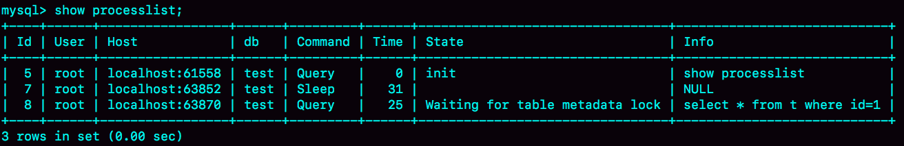

# MySQL 实战 45 讲 - Part 3

Lesson 17~24?

---

Reference: [MySQL 实战 45 讲 - 极客时间](https://time.geekbang.org/column/article/68319)

# 17. 在 MySQL 执行随机排序的问题？

场景实例：英语学习 App 首页有一个随机显示单词的功能。
每个用户有一个单词表，然后当一个用户每次访问首页的时候，都会随机滚动显示三个单词。

```sql
-- 建表语句
CREATE TABLE `words` (
  `id` int(11) NOT NULL AUTO_INCREMENT,
  `word` varchar(64) DEFAULT NULL,
  PRIMARY KEY (`id`)
) ENGINE=InnoDB;

-- 生成随机数据用于实验
delimiter ;;
create procedure idata()
begin
  declare i int;
  set i=0;
  while i<10000 do
    insert into words(word) values(concat(char(97+(i div 1000)), char(97+(i % 1000 div 100)), char(97+(i % 100 div 10)), char(97+(i % 10))));
    set i=i+1;
  end while;
end;;
delimiter ;

call idata();
```

## 内存临时表

继续上文的实例，使用 order by rand() 来实现随机选取单词的逻辑。

```sql
select word from words order by rand() limit 3;
```

通过 explain 命令，查看 SQL 的执行情况：

```bash
mysql> explain select word from words order by rand() limit 3 \G
*************************** 1. row ***************************
           id: 1
  select_type: SIMPLE
        table: words
   partitions: NULL
         type: ALL
possible_keys: NULL
          key: NULL
      key_len: NULL
          ref: NULL
         rows: 9980
     filtered: 100.00
        Extra: Using temporary; Using filesort
1 row in set, 1 warning (0.00 sec)
```

**Extra 字段显示 Using temporary，表示的是需要使用临时表；Using filesort，表示的是需要执行排序操作。**

意思就是：需要使用临时表，并且在它上面进行排序。

## 在内存临时表上排序

**对于 InnoDB 表来说，执行全字段排序会减少磁盘访问**，因此会被优先选择。

**对于内存表，回表过程只是简单地根据数据行的位置，直接访问内存得到数据，根本不会导致多访问磁盘。**

优化器没有了这层顾虑，那么它会优先考虑的，就是用于排序的行越少越好了。
所以，MySQL 这时就会选择 rowid 排序。

语句具体执行流程：

1.  创建一个临时表。

    这个临时表使用的是 memory 引擎，表里有两个字段，并且这个表没有建索引。

    -   第一个字段是 double 类型，记为字段 R（保存 rand() 产生的随机数）；
    -   第二个字段是 varchar(64) 类型，记为字段 W（保存单词 word）。

2.  从 words 表中，按主键顺序取出所有的 word 值。

    对于每一个 word 值，调用 rand() 函数生成一个大于 0 小于 1 的随机小数，
    并把这个随机小数和 word 分别存入临时表的 R 和 W 字段中。

    到此，扫描行数是 10000。

3.  临时表此时有 10000 行数据了，要在这个没有索引的内存临时表上，根据字段 R 排序。

4.  初始化 sort_buffer。sort_buffer 中有两个字段

    -   double 类型的字段 R
    -   6字节整型的字段 W

5.  从内存临时表中一行一行地取出 R 值和 rowid（表没主键的话会自动创建出 rowid），
    分别存入 sort_buffer 中的两个字段里。

    这个过程要对内存临时表做全表扫描，此时扫描行数增加 10000，变成了 20000。

6.  在 sort_buffer 中根据字段 R 的值进行排序。

    注意，这个过程没有涉及到表操作，所以不会增加扫描行数。

7.  排序完成后，取出前三个结果的 rowid，依次到内存临时表中取出 word 值，返回给客户端。

    此时，又访问了表的三行数据，总扫描行数变成了 20003。

可以通过慢查询日志（slow log）来验证一下我们分析得到的扫描行数是否正确。

```bash
mysql> set global slow_query_log=1;
mysql> show variables like '%slow%';
+-----------------------------+--------------------------------------------------+
| Variable_name               | Value                                            |
+-----------------------------+--------------------------------------------------+
| log_slow_admin_statements   | OFF                                              |
| log_slow_extra              | OFF                                              |
| log_slow_replica_statements | OFF                                              |
| log_slow_slave_statements   | OFF                                              |
| slow_launch_time            | 2                                                |
| slow_query_log              | ON                                               |
| slow_query_log_file         | /opt/homebrew/var/mysql/macbook-air-ice-slow.log |
+-----------------------------+--------------------------------------------------+
7 rows in set (0.01 sec)

$ less /opt/homebrew/var/mysql/macbook-air-ice-slow.log
...
# Query_time: 0.900376 Lock_time: 0.000347 Rows_sent: 3 Rows_examined: 20003SET timestamp=1541402277;select word from words order by rand() limit 3;
```

其中，Rows_examined：20003 就表示这个语句执行过程中扫描了 20003 行，也就验证了我们分析得出的结论。

_icehe: 复现失败，slow log 文件里看不到记录……_

看课程读者后来的反馈，MySQL 8.0+ 版本的扫描行数是 10003。
估计具体的优化是：直接在内存表上排序，或者直接使用 sort_buffer ？
暂未自行验证（2022-11-25）。


## rowid

**如果创建的表没有主键，或者把一个表的主键删掉了，那么 InnoDB 会自己生成一个长度为 6 字节的 rowid 来作为主键。**

为什么 rowid 的大小是 6 字节？
因为 Linux 的虚拟内存空间的地址长度也就 6 字节（48 bits）。

## 磁盘临时表

tmp_table_size 这个配置限制了内存临时表的大小，默认值是 16M。
**如果临时表大小超过了 tmp_table_size，那么内存临时表就会转成磁盘临时表。**

磁盘临时表使用的引擎默认是 InnoDB，是由参数 internal_tmp_disk_storage_engine 控制的。
icehe：现在可能是参数 default_tmp_storage_engine（未验证 2022-11-25）。

当使用磁盘临时表的时候，对应的就是一个没有显式索引的 InnoDB 表的排序过程。

---

复现 MySQL 使用磁盘临时表的过程，详见 [原文](https://time.geekbang.org/column/article/73795)

简单来说，方法包括：

-   把临时表的大小调小：
    例如 tmp_table_size → 1024
-   把 sort_buffer 的大小调小：
    例如 sort_buffer_size → 32768
-   把 sort_buffer 允许的每行数据最大长度调小：
    例如 max_length_for_sort_data → 16

```sql
/* 执行语句 */
select word from words order by rand() limit 3;
/* 查看执行后的 OPTIMIZER_TRACE 输出 */
select * from `information_schema`.`OPTIMIZER_TRACE`\G
```


发现 number_of_tmp_files 为 0，即 SQL 没有使用临时文件；
因为 MySQL 5.6 后引入了 **有限队列排序算法**（即堆排序）。
可以精确地得到前三个值，不需要对其余的元素进行多余的排序操作。

OPTIMIZER_TRACE 结果中，filesort_priority_queue_optimization 这个部分的 chosen=true，就表示使用了优先队列排序算法，这个过程不需要临时文件。

---

如果这时执行的语句是：

```sql
select city,name,age from t where city='杭州' order by name limit 1000  ;
```

则不会使用优先队列排序算法，因为此时堆要维持 1000 行数据，所需的内存大于 sort_buffer_size，所以改用归并排序算法（需要临时文件）。

---

_关于如何正确地选取随机几个表中的行，就不展开了，详见原文。_

# 18. 尽量对具体的值而非字段使用函数

详见 [原文](https://time.geekbang.org/column/article/74059)。

Problem：**对字段使用函数，会导致查询时无法利用索引**（只能走全表扫描）。

Solution：**查询时，不要对字段使用函数，而是对具体的值使用。**

```sql
-- e.g. 查询 logs 表自 2016 年创建以来每年 7 月份的日志数量

-- before：对字段使用函数
select count(*) from log where month(updated)=7;
-- after：避免对字段使用函数
select count(*) from log where
    (updated >= '2016-7-1' and updated<'2016-8-1') or
    (updated >= '2017-7-1' and updated<'2017-8-1') or
    (updated >= '2018-7-1' and updated<'2018-8-1');
```

## 隐式使用函数

-   查询字段的隐式类型转换

    数字跟字符串做比较时，字符串会先转换为数字再比较。
    _例如 `… id = "123"` 或 `select "10" > 9;`（结果为 1）。_

    如果字符串无法转换为数字时，则转换为 0。
    _例如 `select 0 = "";` 的结果是 1。_

    ```sql
    -- e.g. 根据 id 查询 log 表的某条数据，
    -- log 表的 id 是 varchar(32) 类型的。

    -- before：
    select * from log where id=123456;
    -- same as
    select * from log where CAST(id as signed int)=123456;

    -- after：避免对字段的隐式类型转换（隐式地使用了函数）
    select * from log where id="123456";
    ```

-   表的字符集不同

    在 utf8 字符集的值和 utf8mb4 字符集的值做比较的时候，
    因为 utf8mb4 是 utf8 的超集，
    所以 utf8 的值会被转换为 utf8mb4 类型然后才比较。

    ```sql
    -- e.g. 根据 trade_log id 查询对应 trade_detail。
    -- trade_log charset=utf8bm4
    -- trade_detail charset=utf8
    select d.* from tradelog l, trade_detail d
    where d.tradeid=l.tradeid and l.id=2;
    -- same as
    select d.* from tradelog l, trade_detail d
    where CONVERT(d.tradeid USING utf8mb4)=l.tradeid and l.id=2;
    -- 连接过程中要求在被驱动表的索引字段上使用函数，
    -- 导致需要全表扫描 trade_detail。
    ```

    此联表查询时，tradelog 是 _驱动表_ ，trade_detai 是 _被驱动表_ 。

# 19. SQL 执行慢的原因

详见 [原文](https://time.geekbang.org/column/article/74687)。

Problem: SQL 执行慢。

现象及其可能的原因：

1.  查询长时间不返回

    -   等 MDL 锁（表锁）
    -   等 flush：_例如全库备份_
    -   等行锁

2.  查询慢

    例如，在 RR 隔离界别下，一个长事务要读某行数据，
    但是在长事务执行期间、读该行数据前，它被频繁修改，产生了很多它相关的 undo log；
    这时需要根据该行的当前值以及 undo log 倒推出长事务开始时它的值，所以花费的时间会比较长。

下文为复现与解决过程。

## 等 MDL 锁

```sql
select * from t where id=1;
```

一个简单的查询语句慢，一般是因为表被锁住，
这时应该查看语句处于什么状态，以确认根本原因：

```sql
show processlist;
```



Waiting for table metadata lock 表示有一个线程正在请求或者持有表 t 的 MDL 写锁。

复现现象：MDL 写锁如何阻塞后续查询

```sql
-- Time 1 Session A
lock tables t write;

-- Time 2 Session B
select * from t where id = 1;
-- It will be blocked by session A.

-- Time 3 Session A
unlock tables;

-- Time 4 Session B
-- Previous blocked query will finish.
```

解决方法：

1.  确定哪个线程持有 MDL 写锁

    通过查询 `sys.schema_table_lock_waits` 这张表，就可以直接找出造成阻塞的 process id。

    ```bash
    mysql> select * from sys.schema_table_lock_waits \G
    *************************** 1. row ***************************
                object_schema: test
                    object_name: t
            waiting_thread_id: 97
                    waiting_pid: 55
                waiting_account: root@localhost
            waiting_lock_type: SHARED_READ
        waiting_lock_duration: TRANSACTION
                waiting_query: /* ApplicationName=DataGrip 20 ... / select * from t where id = 1
            waiting_query_secs: 247
    waiting_query_rows_affected: 0
    waiting_query_rows_examined: 0
            blocking_thread_id: 90
                    blocking_pid: 48
                blocking_account: root@localhost
            blocking_lock_type: SHARED_NO_READ_WRITE
        blocking_lock_duration: TRANSACTION
        sql_kill_blocking_query: KILL QUERY 48
    sql_kill_blocking_connection: KILL 48
    1 row in set (0.00 sec)
    ```

    确定 blocking_pid 为 48。

    _注意：需要 MySQL 启动时设置 `performance_schema=on`，相比于设置为 off 会有 10% 左右的性能损失。_

2.  [kill](https://dev.mysql.com/doc/refman/8.0/en/kill.html) 掉该线程

    ```sql
    -- KILL [CONNECTION | QUERY] processlist_id
    kill 48;
    ```

## 等 flush

查看 show processlist 执行结果中的 STATE 值，
其中值为 Waiting for table flush 表示等待 MySQL 对该表完成 flush 操作。

可能的原因例如：不支持事务的存储引擎进行数据库备份时，锁住整个数据库。

复现现象：flush 如何阻塞后续查询

```sql
-- Time 1 Session A
select sleep(30) from t;
-- It will selep for 30 seconds.

-- Time 2 Session B
flush tables t;
-- It will be blocked by session A.

-- Time 3 Session C
select * from t where id = 1;
-- It will be blocked by session B.
```

解决方法：类同上一小节，此处略。

## 等行锁

复现现象：行锁如何阻塞后续写操作

```sql
-- Time 1 Session A
begin; -- It starts a transction.
update t set c=c+1 where id=1;
-- The transaction has not been committed.

-- Time 2 Session B
select * from t where id=1 lock in share mode;
-- It will be blocked by session A.
```

解决方法：类同上一小节，此处略。

通过 `sys.innodb_lock_waits` 表查到 blocking_pid 为 4：

```bash
mysql> select * from sys.innodb_lock_waits
       where locked_table = '`test`.`t`' \G
*************************** 1. row ***************************
                wait_started: 2022-12-01 16:48:27
                    wait_age: 00:00:39
               wait_age_secs: 39
                locked_table: `test`.`t`
         locked_table_schema: test
           locked_table_name: t
      locked_table_partition: NULL
   locked_table_subpartition: NULL
                locked_index: PRIMARY
                 locked_type: RECORD
              waiting_trx_id: 281480366626248
         waiting_trx_started: 2022-12-01 16:48:27
             waiting_trx_age: 00:00:39
     waiting_trx_rows_locked: 1
   waiting_trx_rows_modified: 0
                 waiting_pid: 56
               waiting_query: /* ApplicationName=DataGrip 20 ... here id = 1 lock in share mode
             waiting_lock_id: 5389915592:46:5:2:4420887064
           waiting_lock_mode: S,REC_NOT_GAP
             blocking_trx_id: 118121
                blocking_pid: 61
              blocking_query: NULL
            blocking_lock_id: 5389913216:46:5:2:4420873240
          blocking_lock_mode: X,REC_NOT_GAP
        blocking_trx_started: 2022-12-01 16:46:16
            blocking_trx_age: 00:02:50
    blocking_trx_rows_locked: 1
  blocking_trx_rows_modified: 1
     sql_kill_blocking_query: KILL QUERY 61
sql_kill_blocking_connection: KILL 61
1 row in set (0.00 sec)
```

kill 掉该线程后，其中的事务会被回滚，该行的写锁就会被释放。

# 20. 可重复读的隔离级别如何解决幻读

详见 [原文](https://time.geekbang.org/column/article/75173)。

## 幻读的定义

1.  隔离级别为可重复读时

    _（因为读未提交、读提交的隔离级别下，这个现象是正常的。）_

2.  进行“当前读”时

    _（一般查询为“快照读”，查询时 for update 或执行更新才会进行“当前读”。）_

3.  读不到新插入的行

    _（因为更新的行之前已经存在了，相关问题可以通过加行锁解决。）_

可能造成的问题：

-   破坏“加锁”的声明（语义），导致事务的结果与预期不一致。

    _（例如原文中查询未添加索引的字段对相关行加锁的例子。）_

-   破坏数据的一致性，数据跟日志在逻辑上不一致。

    _（详见原文假设的例子（实际上已解决，不会发生）。）_

## 间隙锁解决幻读

间隙锁 gap lock

-   语义：间隙之间不能插入新的行。

    -   如果一间隙锁和下一个行锁相邻，将合称 next-key lock。

-   范围：

    -   两个（索引）值之间的空隙：左右皆开区间。
    -   next-key lock：左开右闭。

-   效果：

    -   同一区间的间隙锁跟间隙锁之间不冲读！
    -   跟“往这个区间内插入新的行”的操作冲突！

        _最容易造的锁冲突场景：_

        1.  _两个事务均添加同一区间的间隙锁_
        2.  _两个事务接下来均向该区间内插入记录_

## 生产环境实践

-   InnoDB 的默认隔离级别为可重复读。

-   **现实生产环境通常使用读提交的隔离级别，以及 row 格式的 binlog。**

    可重复读的隔离级别，会让同样的语句锁住更大的范围，影响写操作的并发度。

-   MySQL 备份时，会将隔离级别修改为可重复读。

    因为需要一致性视图，以保证备份过程中，
    备份的数据版本跟在开始备份的那一刻是一样的，
    （即使过程中产生了一些新数据或者其中一些数据产生了新的版本）。

# 21. 加锁规则

详见 [原文](https://time.geekbang.org/column/article/75659)。

前提：

-   隔离级别：可重复读
-   MySQL 版本：8.0.31

加锁规则：

1.  **原则 1：加锁的基本单位是 next-key lock。**

    _next-key lock 是前开后闭区间。_

2.  **原则 2：查找过程中访问到的对象才会加锁。**

    _例如：_

    -   _查询条件涉及的字段只是普通索引（非唯一索引），不是主键索引（唯一索引）；_
        _而且查询的字段能够被覆盖索引覆盖，就不用回表访问主键索引。_
    -   _语句中有 limit 2 只查询两个对象。_
    -   _……_

3.  **优化 1：索引上的等值查询，给唯一索引加锁时，**
    **next-key lock 退化为行锁。**

4.  **优化 2：索引上的等值查询，向右遍历到第一个不满足条件的行时，**
    **next-key lock 退化为间隙锁。**

_icehe：原文还有第 5 条规则，该规则在 MySQL 的新版本下已失效，无需考虑。_

---

实验准备

```sql
CREATE TABLE `t2`
(
    `id` int(11) NOT NULL,
    `c`  int(11) DEFAULT NULL,
    `d`  int(11) DEFAULT NULL,
    PRIMARY KEY (`id`),
    KEY `c` (`c`)
) ENGINE = InnoDB;

insert into t values
(0,0,0),(5,5,5),(10,10,10),
(15,15,15),(20,20,20),(25,25,25);

-- 查询隔离级别
show variables like 'transaction_isolation';
-- 查询 MySQL 的版本
show variables like 'version';
```

## 实验 1：唯一索引的等值查询

```sql
-- session A
-- time 1
begin;
update t set d=d+1 where id=7;
-- id 为主键索引（唯一索引），根据规则 3，
-- 等值查询时 next-key lock 应该退化为行锁；
-- 但是并不存在 id=7 的行，又根据规则 4，
-- 等值查询时，向右遍历到第一个不满足条件的行时
-- （即遍历到 (10,10,10) 行时），
-- next-key lock 应退化为间隙锁，
-- 所以加锁范围为 id 主键索引的 (5, 10) 。

-- session B
-- time 2
insert into t values (8,8,8);
-- blocked

-- session C
-- time 3
update t set d=d+1 where id=10;
-- succeeded
```

## 实验 2：非唯一索引的等值查询

```sql
-- session A
-- time 1
begin;
select id from t where c=5 lock in share mode;
-- c 为非唯一索引，根据规则 1 和 3，
-- 左侧的区间应加 next-key lock；
-- 然后右侧区间，根据规则 4，
-- 等值查询时，向右遍历到第一个不满足条件的行时
-- （即遍历到 (10,10,10) 行时），
-- next-key lock 退化为间隙锁，
-- 所以完整加锁范围为 c 普通索引的 (0, 5], (5, 10) 。

-- session B
-- time 2
update t set d=d+1 where id=5;
-- succeeded
-- 因为 session A 的语句只 select id 并条件查询 c 字段，
-- c 普通索引就能够覆盖这些字段，
-- 所以不用需要回表，即不需要访问 id 主键索引。
-- 然后根据规则 2，没有访问到对象不会被加锁，
-- 所以 id 主键索引在 session A 事务执行时没被加锁。
-- 因此该语句不会被阻塞，能够正常执行。

-- session C
-- time 3
insert into t values (7,7,7);
-- blocked
```

## 实验 3：主键索引的范围查询

```sql
-- session A
-- time 1
begin;
select * from t where id>=10 and id<11 for update;
-- id 为主键索引，根据规则 3，
-- 等值查询时，next-key lock 退化为行锁，
-- 所以左侧的加锁范围为 id 索引上的 10 这一行；
-- 然后右侧的范围不涉及等值查询，
-- 所以不适用规则 4，不过仍适用规则 1。
-- 因此完整加锁范围为 id 主键索引的 [10], (10, 15] 。

-- session B
-- time 2
insert into t values (8,8,8);
-- succeeded
-- time 3
insert into t values (13,13,13);
-- blocked

-- session C
-- time 4
update t set d=d+1 where id=15;
-- blocked
```

## 实验 4：非唯一索引的范围查询

```sql
-- session A
-- time 1
begin;
select * from t where c>=10 and c<11 for update;
-- 即使左侧的范围涉及等值查询，但是 c 为非唯一索引，
-- 所以不适用规则 3，不过仍适用规则 1；
-- 然后由于右侧的范围不涉及等值查询，所以不适用规则 4。
-- 因此完整的加锁范围为 c 普通索引的 (5, 10], (10, 15]
-- （应该还有 id 主键索引的 id=10 这一行）。

-- session B
-- time 2
insert into t values (8,8,8);
-- blocked

-- session C
-- time 3
update t set d=d+1 where c=15;
-- blocked
```

## 实验 5：唯一索引的范围查询 2

```sql
-- session A
-- time 1
begin;
select * from t where id>10 and id<=15 for update;
-- 根据规则 1，左侧的加锁范围应为 (10, 15]；
-- id 为主键索引，根据规则 4，
-- 等值查询时，向右遍历到第一个不满足条件的行时
-- （即遍历到 (20,20,20) 行时），
-- next-key lock 应退化为间隙锁，
-- 所以完整的加锁范围为 id 主键索引的 (10, 15], (15, 20) 。

-- session B
-- time 2
update t set d=d+1 where id=10;
-- succeeded
-- time 3
update t set d=d+1 where id=20;
-- succeeded

-- session C
-- time 4
insert into t values (11,11,11);
-- blocked
-- time 5
insert into t values (16,16,16);
-- blocked
```

## 实验 6：非唯一索引的等值查询 2

```sql
-- session A
-- time 1
begin;
delete from t where c=10;
-- c 为非唯一索引，等值查询时，也不适用规则 3；
-- 根据规则 4，next-key lock 应退化为间隙锁；
-- 所以完整的加锁范围为 c 普通索引的 (5, 10], (10, 15)，

-- session B
-- time 2
insert into t values (12,12,12);
-- blocked

-- session C
-- time 3
update t set d=d+1 where c=15;
-- succeeded
```

## 实验 7：limit 语句加锁

```sql
-- 额外的数据准备工作
insert into t values (30, 10, 30);

-- session A
-- time 1
begin;
delete from t where c=10 limit 2;
-- 添不添加 limit 2 的删除效果都一样，但是加锁范围不一样！
-- 向右遍历到 (10,10,10) 和 (30,10,30) 两行数据后，
-- 满足条件的数据行数满足 limit 2 的条件了，循环就结束了；
-- 根据规则 2，最后的加锁范围为 c 普通索引的 (5, 10] 。

-- session B
-- time 2
insert into t values (12,12,12);
-- succeeded
```

经验：**删除数据时，尽量加 limit！**

1.  **删除数据条数受限，操作更安全。**
2.  **缩小加锁的范围，降低锁冲突的可能性，提升 MySQL 性能。**

## 实验 8：死锁

```sql
-- session A
-- time 1
begin;
select id from t where c=10 lock in share mode;
-- c 为非唯一索引，等值查询时，也不适用规则 3；
-- 然后右侧区间，根据规则 4，
-- 等值查询时，向右遍历到第一个不符合条件的行时
-- （即遍历到 (10,10,10) 行时），
-- next-key lock 应退化为间隙锁，
-- 所以完整的加锁范围为 c 普通索引的 (5, 10], (10, 15) 。

-- session B
-- time 2
update t set d=d+1 where c=10;
-- blocked

-- session A
-- time 3
insert into t values (8,8,8);
-- error found:
-- [40001][1213] Deadlock found when trying to get lock; try restarting transaction
```

## 实验9：order by 的加锁范围

```sql
-- session A
-- time 1
begin;
select * from t where c>=15 and c<=20 order by c desc lock in share mode;
-- c 为非唯一索引，等值查询时，根据规则 4，
-- 向右遍历到第一个不满足条件的行时
-- （即遍历到 (25,25,25) 行时），
-- next-key lock 应退化为间隙锁，
-- 所以右侧的加锁范围为 c 普通索引的 (15, 20], (20, 25) ；
-- 在索引 c 向左遍历，要扫描到 c=10 时才停下来，
-- 根据规则 1 和 2，要加 next-key lock，
-- 查找过程中访问到的对象才会加锁，
-- 所以左侧的加锁范围为 c 普通索引的 (5, 10], (10, 15] ；
-- 因此完整的加锁范围为 c 普通索引的 (5, 10], (10, 15], (15, 20], (20, 25)
-- （还有 id 主键索引上的 id=15,20 这两行，其中 id=10 行锁是被优化掉了）。

-- session B
-- time 2
insert into t values (6,6,6);
-- blocked
-- time 3
insert into t values (12,12,12);
-- blocked
-- time 4
insert into t values (19,19,19);
-- blocked
-- time 5
insert into t values (24,24,24);
-- blocked
```

# 22. “饮鸩止渴”的性能提升方法

详见 [原文](https://time.geekbang.org/column/article/75746)。

## 短连接过多

正常的短连接模式就是连接到数据库后，
执行很少的 SQL 语句就断开，下次需要的时候再重连。

如果使用的是短连接，在业务高峰期的时候，
就可能出现连接数突然暴涨的情况。

建立连接的成本比较高：
除了正常的网络连接三次握手外，
还需要做登陆权限判断，
以及获得该连接的数据读写权限。

---

处理方法：

-   将 max_connections 参数调大，
    可能导致情况进一步恶化。

    _MySQL 系统拒绝连接，会提示“Too many connections”。_

-   **在 MySQL 主动关闭 sleep 状态的空闲连接**
    （它们占着连接但是暂时不工作）。

    **尽量避免关闭正在处于事务中的连接**
    （哪怕被直接关闭的连接的事务能够被自动回滚）。

    **通过 `show processlist;` 列出当前连接，**
    **然后可以通过 `select * from information_schema.INNODB_TRX;`**
    **过滤掉正在处于事务中的连接，**
    **最后通过 `kill connection ID;` 直接断开连接**
    （还有 `kill query ID` 语句）。

    需要连接客户端可以自行重连，
    要求客户端能正确处理 MySQL 主动断连的异常，
    即“ERROR 2013 (HY000): Lost connection to MySQL server during query”。

-   降低连接过程的消耗。

    **关闭掉连接的权限验证。**

    注意：在 MySQL 8.0 版本里，
    如果启用 `-skip-grant-tables` 参数，
    `--skip-networking` 参数也会被默认打开，
    表示这时数据库只能被本地的客户端连接。

## 慢查询性能问题

慢查询可能的原因：

1.  索引没设计好：

    可以在备库添加所需索引，然后主备切换
    （以下 DDL 方案比较粗暴，最好采用更稳健和现代的方案如 gh-ost）：

    1.  备库上停写 binlog `set sql_log_bin=off`
    2.  备库上添加索引 `alter table add index …`
    3.  主碑切换
    4.  在原主库（现备库）上停写 binlog `set sql_log_bin=off`
    5.  在原主库（现备库）添加索引 `alter table add index …`

2.  SQL 语句没写好：

    在 MySQL 添加语句改写规则，即 **query_rewrite** 功能，改写查询语句。

    _例如将 where id + 1 = 100 改写为 where id = 100 - 1。_

3.  MySQL 选错了索引:

    在 MySQL 添加语句改写规则，改写查询语句。

    _例如添加 **force index** 到语句上。_

最好提前预防，在测试库上模拟查询：

1.  打开慢查询日志：

    将 long_query_time 参数设置成 0，确保每个语句都会被记录入慢查询日志。

2.  插入模拟线上的数据，做回归测试：执行语句，查看执行效果。

    例如查看 row_examined 扫描的行数是否与预期一致，
    有没使用到设计好的索引。

    SQL 语句的回归测试，可以考虑开源工具
    [pt-query-digest](https://docs.percona.com/percona-toolkit/pt-query-digest.html)。

## QPS 突增

可能由于业务高峰或者程序 bug，
可以下线掉对应业务（可能是新功能）的流量。

1.  例如从白名单下掉对应业务的服务器 IP。

2.  如果新业务使用独立的 MySQL 用户访问，
    可以禁用相关用户，并关闭掉相关用户的连接。

3.  通过查询重写功能，
    将相关语句直接重写为 `select 1;`。

以上操作可能比较粗暴，小心操作，应仅供业务止血之用。
