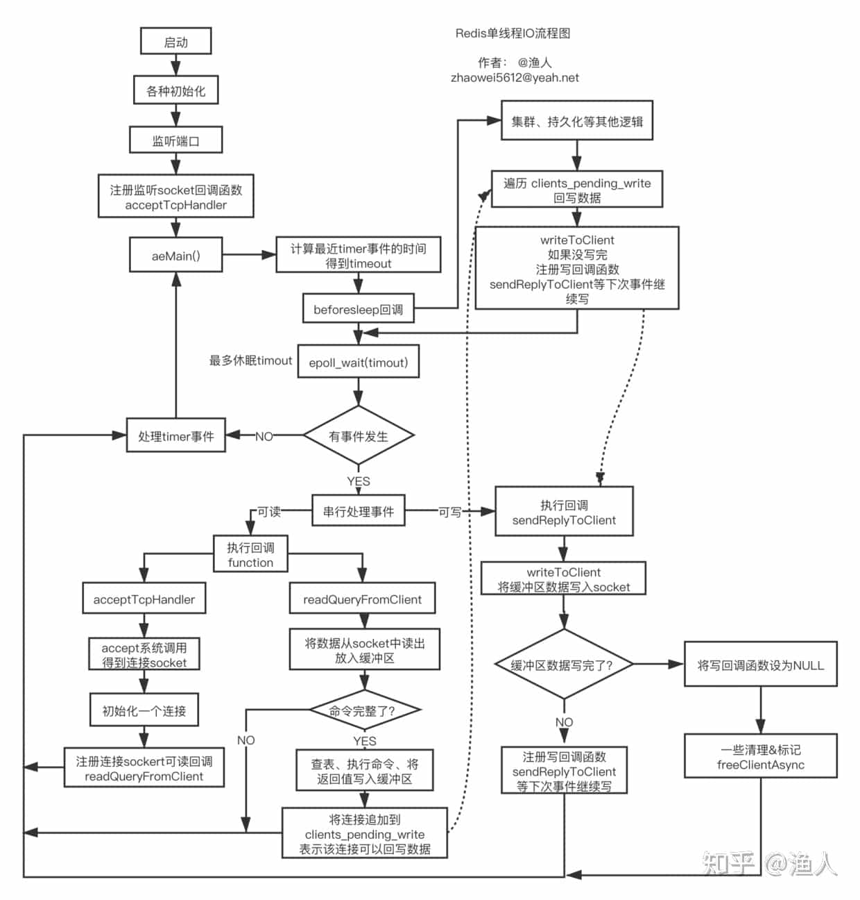
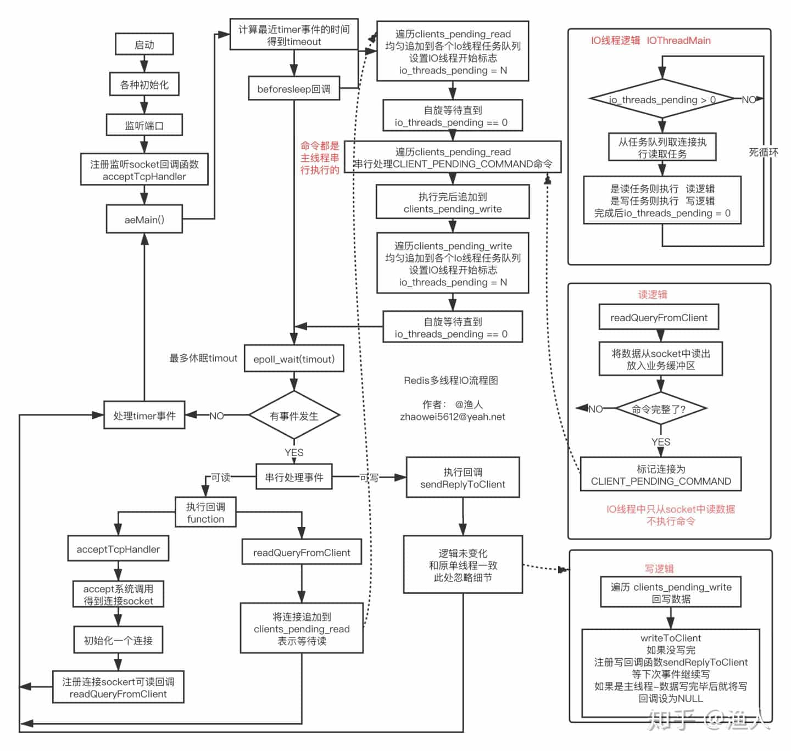

# Redis Basics

**RE**mote **DI**ctionary **S**erver 远程字典服务

---

References

-   Home Page : https://redis.io
    -   Introduce : https://redis.io/topics/introduction
    -   Commands : https://redis.io/commands
    -   Documentation : https://redis.io/documentation
-   Others
    -   容量评估
        -   **Redis 容量预估** - 极数云舟 : http://www.redis.cn/redis_memory/
        -   Redis 容量评估模型 - 腾讯游戏学院 : https://gameinstitute.qq.com/community/detail/114987
    -   Redis 6.0 多线程 IO 处理过程详解 - 知乎专栏 : https://zhuanlan.zhihu.com/p/144805500

## Intro

Redis is an **in-memory data structure store**, **used as a database, cache and message broker**.

-   It supports data structures such as [strings](https://redis.io/topics/data-types-intro#strings), [hashes](https://redis.io/topics/data-types-intro#hashes), [lists](https://redis.io/topics/data-types-intro#lists), [sets](https://redis.io/topics/data-types-intro#sets), [sorted sets](https://redis.io/topics/data-types-intro#sorted-sets) with range queries, [bitmaps](https://redis.io/topics/data-types-intro#bitmaps), [hyperloglogs](https://redis.io/topics/data-types-intro#hyperloglogs), [geospatial indexes](https://redis.io/commands/geoadd) with radius queries and [streams](https://redis.io/topics/streams-intro).
-   Redis has built-in [replication](https://redis.io/topics/replication), [Lua scripting](https://redis.io/commands/eval), [LRU eviction](https://redis.io/topics/lru-cache), [transactions](https://redis.io/topics/transactions) and different levels of [on-disk persistence](https://redis.io/topics/persistence), and provides high availability via [Redis Sentinel](https://redis.io/topics/sentinel) and automatic partitioning with [Redis Cluster](https://redis.io/topics/cluster-tutorial).

You can run **atomic operations** on these types. …

<!--

E.g.:
[appending to a string](https://redis.io/commands/append);
[incrementing the value in a hash](https://redis.io/commands/hincrby);
[pushing an element to a list](https://redis.io/commands/lpush);
[computing set intersection](https://redis.io/commands/sinter), [union](https://redis.io/commands/sunion) and [difference](https://redis.io/commands/sdiff);
or [getting the member with highest ranking in a sorted set](https://redis.io/commands/zrangebyscore).

-->

… Depending on your use case, you can **persist it either by** [dumping the dataset to disk](https://redis.io/topics/persistence#snapshotting) every once in a while, or by [appending each command](https://redis.io/topics/persistence#append-only-file) to a log.

<!--

Redis also supports trivial-to-setup ( 琐碎的设置 ) [master-slave asynchronous replication](https://redis.io/topics/replication), with very fast non-blocking first synchronization, auto-reconnection with partial resynchronization on net split.

Other features include:

-   [Transactions](https://redis.io/topics/transactions)
-   [Pub/Sub](https://redis.io/topics/pubsub)
-   [Lua scripting](https://redis.io/commands/eval)
-   [Keys with a limited time-to-live](https://redis.io/commands/expire)
-   [LRU eviction of keys](https://redis.io/topics/lru-cache)
-   [Automatic failover](https://redis.io/topics/sentinel)

-->

## FAQ

[Ref](https://redis.io/docs/getting-started/faq/)

How is Redis different from other key-value stores?

-   Redis data types are **closely related to fundamental data structures** and are exposed to the programmer as such, without additional abstraction layers.

    简而言之，很接近基础的数据结构，方便程序员使用。

What's the Redis memory footprint? ……

What happens if Redis runs out of memory?

-   If this limit is reached,
    Redis will start to **reply with an error to write commands (but will continue to accept read-only commands).**

## Data Types

-   String

    Limits: By default, **a single Redis string can be a maximum of 512 MB**.

-   **JSON**

    _The JSON capability of Redis Stack provides JavaScript Object Notation (JSON) support for Redis._
    It lets you store, update, and retrieve JSON values in a Redis database, similar to any other Redis data type.

-   List

    Redis Lists are implemented with linked lists because for a database system it is crucial to be able to add elements to a very long list in a very fast way.
    Another strong advantage, as you'll see in a moment, is that Redis Lists can be taken at constant length in constant time.

-   Set

    A Redis set is an unordered collection of unique strings (members).

-   Hash

-   Sorted Set

-   **Stream**

    -   Entry ID: `<millisecondsTime>-<sequenceNumber>`

        The milliseconds time part is actually the local time in the local Redis node generating the stream ID,
        however **if the current milliseconds time happens to be smaller than the previous entry time, then the previous entry time is used instead,**
        **so if a clock jumps backward the monotonically incrementing ID property still holds.**

        ……

        If for some reason the user needs incremental IDs that are not related to time but are actually associated to another external system ID, as previously mentioned,
        **the `XADD` command can take an explicit ID instead of the `*` wildcard ID that triggers auto-generation**, …

-   **Geospatial**

-   **Bitmaps**

    Bitmaps are not an actual data type,
    but a set of bit-oriented operations defined on the String type which is treated like a bit vector.

-   **Bitfields**

    … let you set, increment, and get integer values of arbitrary bit length.
    For example, you can operate on anything from unsigned 1-bit integers to signed 63-bit integers.

    These values are stored using binary-encoded Redis strings.
    Bitfields support atomic read, write and increment operations, making them a good choice for managing counters and similar numerical values.

-   **Probabilistic**

    -   HyperLogLog:
        estimates the cardinality of a set.
    -   Bloom filter:
        checks for presence of an element in a set.
    -   Cuckoo filer:
        checks for presence of an element in a set.
    -   t-digest:
        estimate the percentile of a data stream.
        (例如统计 99% DB操作平均延迟是多少)
    -   Top-K
    -   Count-min sketch:
        estimates the frequency of an element in a data stream.

-   **Time series**

    ……

-   Indexing, Query, Search, …

    -   Stop-words (停用词，高频但无意义的词),
        Tokenization (标记器，分割词，去掉标点符号，小写化),
        Sorting,
        Scoring,
        Stemming (词干提取),
        Synonym (同义词),
        Spellchecking,
        Phonetic (语音匹配, 发音搜索),
        Chinese (中文分词，标记化)

## Others

-   [Redis Cheat Sheet](https://cheatography.com/tasjaevan/cheat-sheets/redis/)
-   [Redis on Flash](https://redislabs.com/redis-enterprise/technology/redis-on-flash/) by Redis Labs extends DRAM capacity with SSD and persistent memory.

Specifications

-   [Redis Design Drafts](https://redis.io/topics/rdd)
    -   Design drafts of new proposals.
-   [Redis Protocol specification](https://redis.io/topics/protocol)
    -   if you're implementing a client, or out of curiosity, learn how to communicate with Redis at a low level.
-   [Redis RDB format](https://github.com/sripathikrishnan/redis-rdb-tools/wiki/Redis-RDB-Dump-File-Format) specification, and [RDB version history](https://github.com/sripathikrishnan/redis-rdb-tools/blob/master/docs/RDB_Version_History.textile).
-   [Internals](https://redis.io/topics/internals) : Learn details about how Redis is implemented under the hood.

# Redis 6.0 多线程 IO 处理

Reference

-   Redis 6.0 多线程 IO 处理过程详解 - 知乎专栏 : https://zhuanlan.zhihu.com/p/144805500

解释暂略, 详见原文

## 单线程 IO 处理过程

## 多线程 IO 处理过程

todo oneday
