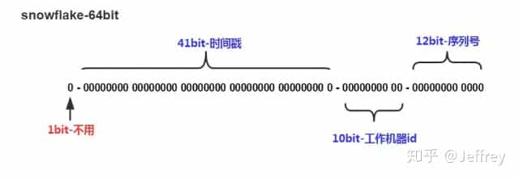

# ID 生成器

发号器

---

References

- IM消息ID技术专题(六) : 深度解密滴滴的高性能ID生成器(Tinyid) : https://zhuanlan.zhihu.com/p/226216776
- 分布式ID神器之雪花算法简介 : https://zhuanlan.zhihu.com/p/85837641

## Intro

### 分布式 ID 特点

- 全局唯一性
    - 不能出现有重复的 ID 标识, 这是基本要求.
- 递增性
    - 确保生成 ID 对于用户或业务是递增的.
- 高可用性
    - 确保任何时候都能生成正确的 ID.
- 高性能性
    - 在高并发的环境下依然表现良好.

### 常见解决方案

UUID

- Java 自带的生成一串唯一随机 36 位字符串 ( 32个字符串+4个 "-" ) 的算法.
    - 它可以保证唯一性, 且据说够用 N 亿年, 但是其 **业务可读性差, 无法有序递增.**

SnowFlake

- 雪花算法, 它是 Twitter 开源的由 64 位整数组成分布式ID, 性能较高, 并且在单机上递增.
- Reference : https://github.com/twitter-archive/snowflake

UidGenerator

- UidGenerator 是百度开源的分布式 ID 生成器, 其基于雪花算法实现.
- Reference : https://github.com/baidu/uid-generator/blob/master/README.zh_cn.md

Leaf

- Leaf是美团开源的分布式ID生成器, 能保证全局唯一, 趋势递增,
    - 但 **需要依赖关系数据库、Zookeeper 等中间件**.
- Reference : https://tech.meituan.com/MT_Leaf.html

### SnowFlake

_SnowFlake 是 Twitter 公司采用的一种算法,_ 目的是 **在分布式系统中产生全局唯一且趋势递增的ID.**



组成部分 ( 64bit )

- 1\. 第一位 占用 1 bit,
    - 其值始终是0, 没有实际作用.
- 2\. **时间戳** 占用 41 bit,
    - **精确到毫秒**, 总共可以容纳约 69 年的时间.
- 3\. **工作机器 id** 占用 10 bit,
    - 其中高位 5 bit 是 **数据中心 ID**,
    - 低位 5 bit 是 **工作节点 ID**,
    - 最多可以容纳 1024 个节点.
- 4\. **序列号** 占用 12 bit,
    - 每个节点每毫秒 0 开始不断累加,
    - 最多可以累加到 4095,
    - 一共可以产生 4096 个 ID.

SnowFlake 算法在同一毫秒内, 最多可以生成的全局唯一 ID 个数 :

```bash
1024 * 4096 = 4,194,304
```

### Implementation

#### Java

```java
public class SnowflakeIdWorker {
    /**
     * 开始时间截 (2015-01-01)
     */
    private final long twepoch = 1420041600000L;

    /**
     * 机器ID所占的位数
     */
    private final long workerIdBits = 5L;

    /**
     * 数据标识ID所占的位数
     */
    private final long datacenterIdBits = 5L;

    /**
     * 支持的最大机器ID, 结果是31 (这个移位算法可以很快的计算出几位二进制数所能表示的最大十进制数)
     */
    private final long maxWorkerId = -1L ^ (-1L << workerIdBits);

    /**
     * 支持的最大数据标识ID, 结果是31
     */
    private final long maxDatacenterId = -1L ^ (-1L << datacenterIdBits);

    /**
     * 序列在ID中占的位数
     */
    private final long sequenceBits = 12L;

    /**
     * 机器ID向左移12位
     */
    private final long workerIdShift = sequenceBits;

    /**
     * 数据标识ID向左移17位(12+5)
     */
    private final long datacenterIdShift = sequenceBits + workerIdBits;

    /**
     * 时间截向左移22位(5+5+12)
     */
    private final long timestampLeftShift = sequenceBits + workerIdBits + datacenterIdBits;

    /**
     * 生成序列的掩码, 这里为4095 (0b111111111111=0xfff=4095)
     */
    private final long sequenceMask = -1L ^ (-1L << sequenceBits);

    /**
     * 工作机器ID(0~31)
     */
    private long workerId;

    /**
     * 数据中心ID(0~31)
     */
    private long datacenterId;

    /**
     * 毫秒内序列(0~4095)
     */
    private long sequence = 0L;

    /**
     * 上次生成ID的时间截
     */
    private long lastTimestamp = -1L;

    /**
     * 构造函数
     * @param workerId     工作ID (0~31)
     * @param datacenterId 数据中心ID (0~31)
     */
    public SnowflakeIdWorker(long workerId, long datacenterId) {
        if (workerId > maxWorkerId || workerId < 0) {
            throw new IllegalArgumentException(String.format("worker Id can't be greater than %d or less than 0", maxWorkerId));
        }
        if (datacenterId > maxDatacenterId || datacenterId < 0) {
            throw new IllegalArgumentException(String.format("datacenter Id can't be greater than %d or less than 0", maxDatacenterId));
        }
        this.workerId = workerId;
        this.datacenterId = datacenterId;
    }

    /**
     * 获得下一个ID (该方法是线程安全的)
     * @return SnowflakeId
     */
    public synchronized long nextId() {
        long timestamp = timeGen();
        // 如果当前时间小于上一次ID生成的时间戳, 说明系统时钟回退过这个时候应当抛出异常
        if (timestamp < lastTimestamp) {
            throw new RuntimeException(
                    String.format("Clock moved backwards.  Refusing to generate id for %d milliseconds", lastTimestamp - timestamp));
        }
        // 如果是同一时间生成的, 则进行毫秒内序列
        if (lastTimestamp == timestamp) {
            sequence = (sequence + 1) & sequenceMask;
            // 毫秒内序列溢出
            if (sequence == 0) {
                //阻塞到下一个毫秒,获得新的时间戳
                timestamp = tilNextMillis(lastTimestamp);
            }
        }
        // 时间戳改变, 毫秒内序列重置
        else {
            sequence = 0L;
        }
        // 上次生成ID的时间截
        lastTimestamp = timestamp;
        // 移位并通过或运算拼到一起组成64位的ID
        return ((timestamp - twepoch) << timestampLeftShift) //
                | (datacenterId << datacenterIdShift) //
                | (workerId << workerIdShift) //
                | sequence;
    }

    /**
     * 阻塞到下一个毫秒, 直到获得新的时间戳
     * @param lastTimestamp 上次生成ID的时间截
     * @return 当前时间戳
     */
    protected long tilNextMillis(long lastTimestamp) {
        long timestamp = timeGen();
        while (timestamp <= lastTimestamp) {
            timestamp = timeGen();
        }
        return timestamp;
    }
    /**
     * 返回以毫秒为单位的当前时间
     * @return 当前时间(毫秒)
     */
    protected long timeGen() {
        return System.currentTimeMillis();
    }

    public static void main(String[] args) throws InterruptedException {
        SnowflakeIdWorker idWorker = new SnowflakeIdWorker(0, 0);
        for (int i = 0; i < 10; i++) {
            long id = idWorker.nextId();
            Thread.sleep(1);
            System.out.println(id);
        }
    }
}
```

TODO
