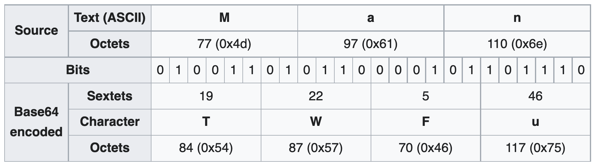
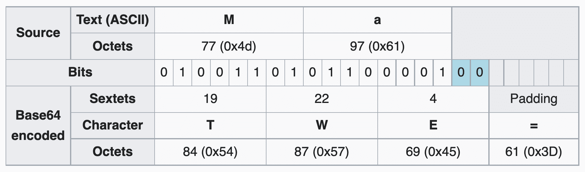
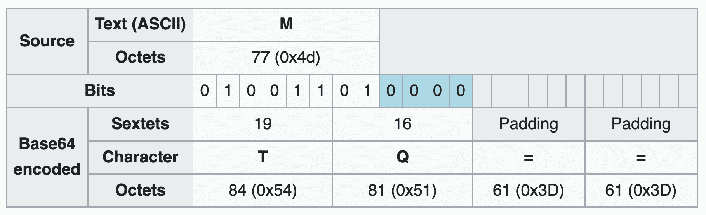
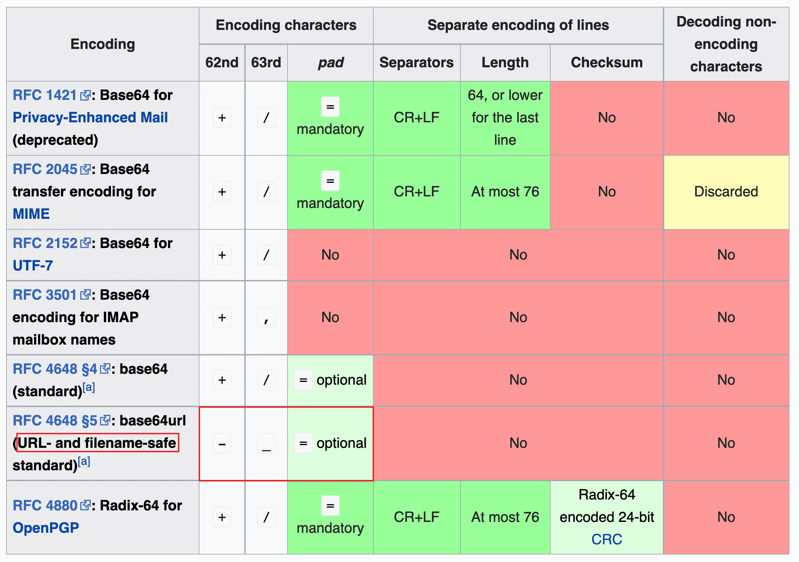

# Base64 Encoding

a group of binary-to-text encoding schemes that represent binary data in an ASCII string format

---

References

- [Base64 - Wikipedia](https://en.wikipedia.org/wiki/Base64)

## Intro

**In programming, Base64 is a group of binary-to-text encoding schemes that represent binary data**
**(more specifically, a sequence of 8-bit bytes)**
**in an ASCII string format by translating the data into a radix-64 representation.**

The term Base64 originates from a specific MIME content transfer encoding.
**Each non-final Base64 digit represents exactly 6 bits of data.**
**Three bytes (i.e., a total of 24 bits) can therefore be represented by four 6-bit Base64 digits.**

```bash
2 ^ 6 = 64
```

**Common to all binary-to-text encoding schemes, Base64 is designed to carry data stored in binary formats across channels that only reliably support text content.**
Base64 is particularly prevalent<!-- 普遍的, 盛行的, 流行的 --> on the World Wide Web where its uses include the **ability to embed image files or other binary assets inside textual assets such as HTML and CSS files**.

_Base64 is also widely used for sending e-mail attachments._
_This is required because SMTP — in its original form — was designed to transport 7-bit ASCII characters only._
This encoding causes an **overhead of 33–36% (33% by the encoding itself; up to 3% more by the inserted line breaks)**.

## Design

……

## Base64 Table

|Index|Binary|Char|
|-|-|-|
|0|000000|A|
|1|000001|B|
|2|000010|C|
|3|000011|D|
|4|000100|E|
|5|000101|F|
|6|000110|G|
|7|000111|H|
|8|001000|I|
|9|001001|J|
|10|001010|K|
|11|001011|L|
|12|001100|M|
|13|001101|N|
|14|001110|O|
|15|001111|P|
|16|010000|Q|
|17|010001|R|
|18|010010|S|
|19|010011|T|
|20|010100|U|
|21|010101|V|
|22|010110|W|
|23|010111|X|
|24|011000|Y|
|25|011001|Z|
|26|011010|a|
|27|011011|b|
|28|011100|C|
|29|011101|d|
|30|011110|е|
|31|011111|f|
|32|100000|g|
|33|100001|h|
|34|100010|i|
|35|100011|j|
|36|100100|k|
|37|100101|l|
|38|100110|m|
|39|100111|n|
|40|101000|o|
|41|101001|p|
|42|101010|q|
|43|101011|r|
|44|101100|S|
|45|101101|t|
|46|101110|u|
|47|101111|v|
|48|110000|w|
|49|110001|x|
|50|110010|y|
|51|110011|z|
|52|110100|0|
|53|110101|1|
|54|110110|2|
|55|110111|3|
|56|111000|4|
|57|111001|5|
|58|111010|6|
|59|111011|7|
|60|111100|8|
|61|111101|9|
|62|111110|+|
|63|111111|/|
|-|Paddind|=|

## Examples







_`=` padding characters might be added to make the last encoded block contain four Base64 characters._

## Implementations and history

Variants summary table


