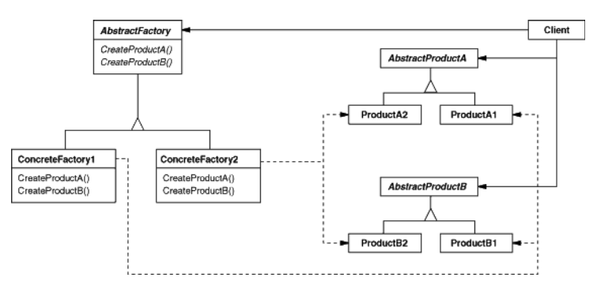
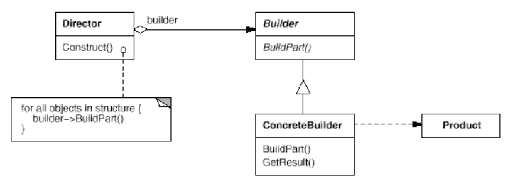
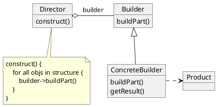
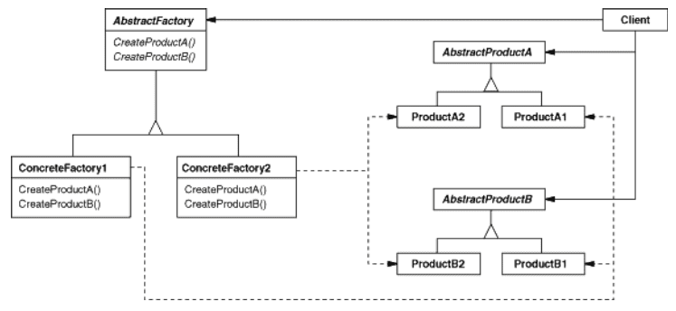
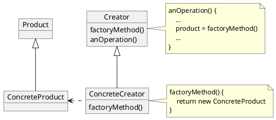

# Design Patterns

References

- Book "Design Patterns : Elements of Reusable Object-Oriented Software"
    - ZH Ver. :《 设计模式 : 可复用面向对象软件的基础 》

## Index

Creational Patterns 创建型

- Abstract Factory 抽象工厂
    - _提供一个创建一系列相关或相互依赖对象的接口, 而无需指定它们具体的类_
- Builder 生成器
    - _将一个复杂对象的构建与它的表示分离, 使得同样的构建过程可以创建不同的表示_
- Factory Method 工厂方法
    - _定义一个用于创建对象的接口, 让子类决定将哪一个类实例化_
    - _Factory Method 是一个类的实例化延迟到其子类_
- Prototype 原型
    - _用原型实例指定创建对象的种类, 并且通过拷贝这个原型来创建新的对象_
- Singleton 单例
    - _保证一个类近仅有一个实例, 并提供一个访问它的全局访问点_

Structural Patterns 结构型

- Adaptor 适配器
    - _将一个类的接口转换为客户希望的另一个接口_
    - _使得原本由于接口不兼容而不能一起工作的哪些类可以一起工作_
- Bridge 桥接
    - _将抽象部分与它的实现部分分离, 使它们都可以独立地变化_
- Composite 组合
    - _将对象组合成树形结构以表示 "部分 - 整体" 的层次结构_
    - _Composite 使得客户对单个对象和组合对象的使用具有一致性_
- Decorator 装饰
    - _动态地给一个对象添加一些额外的职责_
    - _就拓展功能而言, Decorator 模式比生成子类方式更为灵活_
- Facade 外观
    - _为子系统的一组接口提供一个一致的界面_
    - _Facade 模式定义了一个高层接口, 这个接口使得这一子系统更加容易使用_
- Flyweight 享元
    - _运用共享技术有效地支持大量细粒度的对象_
- Proxy 代理
    - _为其它对象提供一个代理, 以控制对这个对象的访问_

Behavioral Patterns 行为型

- Chain of Responsibility 职责链
    - _解除请求的发送者和接收者之间的耦合, 使多个对象都有机会处理这个请求_
    - _将这些对象连成一条链, 并沿着这条链传递该请求, 直到有一个对象处理它_
- Command 命令
    - _将一个请求封装成一个对象, 从而使你可用不同的请求对客户进行参数化; 对请求排队或记录请求日志, 以及支持可取消的操作_
- Interpreter 解释器
    - _给定一个语言, 定义它的文法的一种表示, 并定义一个解释器, 该解释器使用该表示来解释语言中的句子_
- Iterator 迭代器
    - _提供一种方法顺序访问一个聚合对象中的各个元素, 而又不需要暴露该对象的内部表示_
- Mediator 中介者
    - _用一个中介对象来封装一系列的对象交互_
    - _中介者使个对象不需要显式地相互引用, 从而使其耦合松散, 而且可以独立地改变它们之间的交互_
- Memento 备忘录
    - _在不破坏封装性的前提下, 捕获一个对象的内部状态, 并在该对象之外保存这个状态_
    - _这样以后就可以将该对象恢复到保存的状态_
- Observer 观察者
    - _定义对象间的一种一对多的依赖关系, 以便当一个对象的状态改变时, 所有依赖于它的对象都可以得到通知并自动刷新_
- State 状态
    - _允许一个对象在其内部状态改变时改变它的行为_
    - _对象看起来似乎修改了它所属的类_
- Strategy 策略
    - _定义一系列的算法, 把它们一个个封装起来, 并且使它们可以相互替换_
    - _本模式使得算法的变化可独立于使用它的客户_
- Template Method 模板方法
    - _定义一个操作中的算法的骨架, 而将一些步骤延迟到子类中_
    - _Template Method 使得子类不改变一个算法的结构即可重定义该算法的某些特定步骤_
- Visitor 访问者
    - _表示一个作用于某随想结构中的各个元素的操作_
    - _它使你可以再不改变个元素的类的前提下定义作用域这些元素的新操作_

分类

- 目的准则 -- 模式是用来完成什么工作的 ( 详见上文 )
    - 创建型
    - 结构型
    - 行为型
- 范围准则 -- 模式用于类还是对象
    - 类 : _处理类与子类之间的关系_
        - _类是静态的, 在编译时便确定下来了_
    - 对象 : _处理对象间的关系_
        - _这些关系在运行时是可以变化的, 具有动态性_

基于 "作用范围" 的模式分类

- 用于类
    - Factory Method
    - Adapter
    - Interpreter
    - Template Method
- 用于对象
    - 其它

## Introduce

Design Pattern 设计模式

- 对用来在特定场景下， 解决一般设计问题的类和相互通信的对象的描述

本书的目的 : 将面向对象软件的设计经验作为 "设计模式" 记录下来

- 每一个设计模式 系统地命名、解释和评价了面向对象系统中一个重要的和重复出现的设计
- 将设计经验以人们能够有效利用的形式记录下来

模式的四个要素

- Pattern Name 模式名
    - _命名一个新的模式增加了我们的设计词汇_
        - _帮助我们思考, 允许我们在较高的抽象层次上进行设计_
        - _便于我们与其他人交流设计思想以及设计结果_
        - _并在编写文档时使用它们_
- Problem 问题
    - _何时使用模式 : 解释了设计问题和问题存在的前因后果_
        - _特定的设计问题 ( 例如怎样用对象表示算法 )_
        - _导致不灵活设计的类或对象结构_
        - _必须满足的一系列先决条件_
- Solution 解决方案
    - _设计的组成部分、它们之间的相互关系以及各自的职责和协作方式_
    - _提供设计问题的抽象描述和怎样用一个具有一般意义的元素组合 ( 类或对象组合 ) 来解决这个问题_
- Consequence 效果
    - _描述模式应用的效果及使用模式应权衡的问题_
    - _理解使用模式的代价及好处 : 灵活性、扩充性或可移植性…_

**Signature 型构**

- 对象声明的每一个操作指定操作名 (方法名)、作为参数的对象和返回值, 这就是所谓的操作的 型构
- _Every operation declared by an object specifies the operation's name, the objects it takes as parameters, and the operation's return value. This is known as the operation's signature._

Interface 接口

- _对象操作所定义的所有操作型构的集合被称为该对象的 interface 接口_

Type 类型

- 用来表示特定接口的名字
- _对象接口的某部分可以用某个类型来刻画, 而其它部分则可用其它类型刻画_
- _type 类型 / subtype 子类型 / supertype 超类型 : …_

**Dynamic Binding 动态绑定**

- _Different objects that support identical requests may have different implementations of the operations that fulfill these requests._
- The run-time association of a request to an object and one of its operations is known as dynamic binding.
- _Dynamic binding means that issuing a request doesn't commit you to a particular implementation until run-time._

**Polymorphism 多态**

- Dynamic binding lets you substitute objects that have identical interfaces for each other at run-time.
- _This substitutability is known as polymorphism, and it's a key concept in object-oriented systems._

**mixin class 混入类**

- **它给其它类提供可选择的接口或功能的类**, 与抽象类一样不能实例化 _( 例如 PHP 的 trait 吧? )_
- _它跟抽象类一样不能实例化_
- _它需要 multple inheritance 多继承的特性支持_

class 类

- inintiating 实例化 / instance 实例 _/ instance variables 实例变量_
- class inheritance 类继承 _/ subclass 子类 / parent class 父类_
- abstract class 抽象类 / concrete class 具体类 / override 重定义、重写 、覆盖… _( 方法 )_

class 跟 type 的区别 _( Difference between an object's class and its type )_

- _对象的类定义了对象是怎样实现的, 同事也定义了对象的内部状态和操作的实现_
- _An object's class defines how the object is implemented. The class defines the object's internal state and the implementation of its operations._
- _但是对象的类型只与它的接口有关 -- 接口即对象能响应的请求的集合_
- _In contrast, an object's type only refers to its interface -- the set of requests to which it can respond._
- _一个对象可以有多个类型, 不同类的对象可以有相同的类型_
- _An object can have many types, and objects of different classes can have the same type._

**Program to an interface, not an implementation. 针对接口编程, 而不是针对实现编程**

- _There are two benefits to manipulating objects solely in terms of the interface defined by abstract classes:_
    - _1\. Clients remain unaware of the specific types of objects they use, as long as the objects adhere to the interface that clients expect._
    - _2\. Clients remain unaware of the classes that implement these objects. Clients only know about the abstract class(es) defining the interface._
- _This so greatly reduces implementation dependencies between subsystems that it leads to the following principle of reusable object-oriented design:_
    - _"Program to an interface, not an implementation."_
- 通过抽象对象的创建过程, 这些模式提供不同的方式以在实例化时建立接口和实现的透明连接
    - 创建型模式确保你的系统是采用针对接口的方式, 而不是针对实现的方式而书写 _( 说得好 )_
- _By abstracting the process of object creation, these patterns give you different ways to associate an interface with its implementation transparently at instantiation._
    - _Creational patterns **ensure that your system is written in terms of interfaces, not implementations**._

Inheritance versus Composition 继承和组合的比较

- _**Class inheritance** lets you define the implementation of one class in terms of another's._
    - _Reuse by subclassing is often referred to as **white-box reuse**._
    - _The term "white-box" refers to visibility: With inheritance, **the internals of parent classes are often visible to subclasses**._
- _**Object composition** is an alternative to class inheritance._
    - _This style of reuse is called **black-box reuse**._
    - _Because **no internal details of objects are visible**. Objects appear only as "black boxes."_
- _Inheritance exposes a subclass to details of its parent's implementation, it's often said that "**inheritance breaks encapsulation**"._
    - _The implementation of a subclass becomes so bound up with the implementation of its parent class that **any change in the parent's implementation will force the subclass to change**._
    - _Should any aspect of the inherited implementation not be appropriate for new problem domains, the parent class must be rewritten or replaced by something more appropriate._
    - _This **dependency limits flexibility and ultimately reusability**._
- _Object composition is defined dynamically at run-time through objects acquiring references to other objects._
    - _Composition requires objects to respect each others' interfaces, which **in turn requires carefully designed interfaces** that don't stop you from using one object with many others._
    - _Because objects are **accessed solely through their interfaces, we don't break encapsulation**._
    - _Any object can be replaced at run-time by another as long as it has the same type._
- **Favor object composition over class inheritance**.
    - _Favoring object composition over class inheritance helps you keep each class encapsulated and focused on one task._
    - _Nevertheless, our experience is that designers overuse inheritance as a reuse technique, and designs are often made more reusable (and simpler) by depending more on object composition._

**Delegation 委托**

- _Delegation is a way of making composition as powerful for reuse as inheritance._
- _Delegation has a disadvantage it shares with other techniques that make software **more flexible through object composition**: Dynamic, highly parameterized software is harder to understand than more static software._
    - _There are also run-time inefficiencies, **but the human inefficiencies are more important in the long run**._

Inheritance versus Parameterized Types 继承和参数化类型 (泛型) 的比较

- _Another (not strictly object-oriented) technique for reusing functionality is through parameterized types, also known as **generics** (Ada, Eiffel) and templates (C++)._

Designing for Change 设计应支持变化

- _每一个设计模式允许系统结构的某个方面的变化独立于其他方面, 这样产生的系统对于某种特殊变化将更健壮_
- _Each design pattern lets some aspect of system structure vary independently of other aspects, thereby making a system more robust to a particular kind of change._

**Framework 框架**

- _它是构成一类特定软件的可复用设计的一组相互协作的类_
    - _规定了应用的体系结构 -- 定义了整体结构, 类和对象的划分, 各部分的主要责任, 类和对象怎么协作, 以及控制流程_
    - _框架记录了其应用领域的共同的设计决策. 因而框架更强调 **设计复用**_
- _好处_
    - _不仅可以更快地建立应用, 而且应用还具有相似的结构_
    - _它们容易维护, 而且用户看来也一致_
- _限制_
    - _你失去了一些表现创造性的自由, 因为许多设计决策无需你来做出_

**Design aspects that design patterns let you vary 设计模式所支持的可变性**

|Purpose|Design Pattern|Aspect(s) That Can Vary 可变的方面|
|-|-|-|
|Creational|Abstract Factory|families of product objects 产品对象家族|
||Builder|how a composite object gets created 如何创建一个组合对象|
||Factory Method|subclass of object that is instantiated 被实例化的子类|
||Prototype|class of object that is instantiated 被实例化的类|
||Singleton|the sole instance of a class 类的唯一实例|
|Structual|Adapter|interface to an object 对象的接口|
||Bridge|implementation of an object 对象的实现|
||Composite|structure and composition of an object 对象的结构和组成|
||Decorator|responsibilities of an object without subclassing 对象的职责, 不生成子类 ( 不使用继承来拓展功能 )|
||Facade|interface to a subsystem 子系统的接口|
||Flyweight|storage costs of objects 对象的存储开销|
||Proxy|how an object is accessed; its location 如何访问一个对象; 改对象的位置|
|Behavioral|Chain of Responsibility|object that can fulfill a request 满足一个请求的对象 ( 谁来处理某个请求 )|
||Command|when and how a request is fulfilled 何时、如何满足一个请求|
||Interpreter|grammar and interpretation of a language 一个语言的文法和解释|
||Iterator|how an aggregate's elements are accessed, traversed 如何遍历、访问一个聚合的各元素|
||Mediator|how and which objects interact with each other 对象间怎样交互、和谁交互|
||Memento|what private information is stored outside an object, and when 一个对象中哪些私有信息存放在该对象之外, 以及在什么时候进行存储|
||Observer|number of objects that depend on another object; how the dependent objects stay up to date 多个对象依赖于另一个对象, 而这些对象又如何保持一致|
||State|states of an object 对象的状态|
||Strategy|An algorithm 算法|
||Template Method|steps of an algorithm 算法中的某些步骤|
||Visitor|operations that can be applied to object(s)  without changing their class(es) 某些可作用于一个(组)对象上的操作, 但不修改这些对象的类|

Trade-off 取舍

- _通常通过引入额外的间接层次获得灵活性和可变性的同时, 也是设计变得更复杂和/或牺牲了一定的性能_
- _一个设计模式只有当它的灵活性是真正需要的时候, 才有必要使用_

## Creational

解释和示例详见原书

- 实际用法, 并没有想象中那么直观
    - 由于受到 Lombok 中的 @Builder 注解用法的影响, 误解了 Builder 的实际场景和用法…
        - Builder 的用法实际和 Abstract Factory 类似, 只是侧重点不同
    - Factory Method 的情况也类似

### Abstract Factory

Intent

- Provide an interface for creating families of related or dependent objects without specifying their concrete classes.

<!--

_Applicability_

- _A system should be independent of how its products are created, composed, and represented._
- _A system should be configured with one of multiple families of products._
- _A family of related product objects is designed to be used together, and you need to enforce this constraint._
- _You want to provide a class library of products, and you want to reveal just their interfaces, not their implementations._

-->

### Builder

Intent

- Separate the construction of a complex object from its representation so that the same construction process can create different representations.

<!--

_Applicability_

- _The algorithm for creating a complex object should be independent of the parts that make up the object and how they're assembled._
- _The construction process must allow different representations for the object that's constructed._

-->

<!--  -->

- Director 控制 (复杂对象的) 构建过程
- Builder 决定 (复杂对象的) 组成对象的实际类型
    - 它的用途甚至并不限于此! _( 详见原书例 )_

### Factory Method

Intent

- Define an interface for creating an object, but let subclasses decide which class to instantiate.
- Factory Method lets a class defer instantiation to subclasses.

_Applicability_

<!--  -->

## Prototype

Intent

- Specify the kinds of objects to create using a prototypical instance, and create new objects by copying this prototype.
