# Design Patterns

References

- Book "Design Patterns : Elements of Reusable Object-Oriented Software"
    - ZH Ver. :《 设计模式 : 可复用面向对象软件的基础 》
- _( UML类图的6种连线示意 : https://www.jianshu.com/p/48de81a8f0ab )_

## Index

Creational Patterns 创建型

- Abstract Factory 抽象工厂
    - _提供一个创建一系列相关或相互依赖对象的接口, 而无需指定它们具体的类_
- Builder 生成器
    - _将一个复杂对象的构建与它的表示分离, 使得同样的构建过程可以创建不同的表示_
- Factory Method 工厂方法
    - _定义一个用于创建对象的接口, 让子类决定将哪一个类实例化_
    - _Factory Method 是一个类的实例化延迟到其子类_
- Prototype 原型
    - _用原型实例指定创建对象的种类, 并且通过拷贝这个原型来创建新的对象_
- Singleton 单例
    - _保证一个类近仅有一个实例, 并提供一个访问它的全局访问点_

Structural Patterns 结构型

- Adaptor 适配器
    - _将一个类的接口转换为客户希望的另一个接口_
    - _使得原本由于接口不兼容而不能一起工作的哪些类可以一起工作_
- Bridge 桥接
    - _将抽象部分与它的实现部分分离, 使它们都可以独立地变化_
- Composite 组合
    - _将对象组合成树形结构以表示 "部分 - 整体" 的层次结构_
    - _Composite 使得客户对单个对象和组合对象的使用具有一致性_
- Decorator 装饰
    - _动态地给一个对象添加一些额外的职责_
    - _就拓展功能而言, Decorator 模式比生成子类方式更为灵活_
- Facade 外观
    - _为子系统的一组接口提供一个一致的界面_
    - _Facade 模式定义了一个高层接口, 这个接口使得这一子系统更加容易使用_
- Flyweight 享元
    - _运用共享技术有效地支持大量细粒度的对象_
- Proxy 代理
    - _为其它对象提供一个代理, 以控制对这个对象的访问_

Behavioral Patterns 行为型

- Chain of Responsibility 职责链
    - _解除请求的发送者和接收者之间的耦合, 使多个对象都有机会处理这个请求_
    - _将这些对象连成一条链, 并沿着这条链传递该请求, 直到有一个对象处理它_
- Command 命令
    - _将一个请求封装成一个对象, 从而使你可用不同的请求对客户进行参数化; 对请求排队或记录请求日志, 以及支持可取消的操作_
- Interpreter 解释器
    - _给定一个语言, 定义它的文法的一种表示, 并定义一个解释器, 该解释器使用该表示来解释语言中的句子_
- Iterator 迭代器
    - _提供一种方法顺序访问一个聚合对象中的各个元素, 而又不需要暴露该对象的内部表示_
- Mediator 中介者
    - _用一个中介对象来封装一系列的对象交互_
    - _中介者使个对象不需要显式地相互引用, 从而使其耦合松散, 而且可以独立地改变它们之间的交互_
- Memento 备忘录
    - _在不破坏封装性的前提下, 捕获一个对象的内部状态, 并在该对象之外保存这个状态_
    - _这样以后就可以将该对象恢复到保存的状态_
- Observer 观察者
    - _定义对象间的一种一对多的依赖关系, 以便当一个对象的状态改变时, 所有依赖于它的对象都可以得到通知并自动刷新_
- State 状态
    - _允许一个对象在其内部状态改变时改变它的行为_
    - _对象看起来似乎修改了它所属的类_
- Strategy 策略
    - _定义一系列的算法, 把它们一个个封装起来, 并且使它们可以相互替换_
    - _本模式使得算法的变化可独立于使用它的客户_
- Template Method 模板方法
    - _定义一个操作中的算法的骨架, 而将一些步骤延迟到子类中_
    - _Template Method 使得子类不改变一个算法的结构即可重定义该算法的某些特定步骤_
- Visitor 访问者
    - _表示一个作用于某随想结构中的各个元素的操作_
    - _它使你可以再不改变个元素的类的前提下定义作用域这些元素的新操作_

分类

- 目的准则 -- 模式是用来完成什么工作的 ( 详见上文 )
    - 创建型 creational
    - 结构型 structural
    - 行为型 behavioral
- 范围准则 -- 模式用于类还是对象
    - 类 : _处理类与子类之间的关系_
        - _类是静态的, 在编译时便确定下来了_
    - 对象 : _处理对象间的关系_
        - _这些关系在运行时是可以变化的, 具有动态性_

基于 "作用范围" 的模式分类

- 用于类
    - Factory Method
    - Adapter
    - Interpreter
    - Template Method
- 用于对象
    - 其它…

## Introduce

Design Pattern 设计模式

- 对用来在特定场景下， 解决一般设计问题的类和相互通信的对象的描述

本书的目的 : 将面向对象软件的设计经验作为 "设计模式" 记录下来

- 每一个设计模式 系统地命名、解释和评价了面向对象系统中一个重要的和重复出现的设计
- 将设计经验以人们能够有效利用的形式记录下来

模式的四个要素

- Pattern Name 模式名
    - _命名一个新的模式增加了我们的设计词汇_
        - _帮助我们思考, 允许我们在较高的抽象层次上进行设计_
        - _便于我们与其他人交流设计思想以及设计结果_
        - _并在编写文档时使用它们_
- Problem 问题
    - _何时使用模式 : 解释了设计问题和问题存在的前因后果_
        - _特定的设计问题 ( 例如怎样用对象表示算法 )_
        - _导致不灵活设计的类或对象结构_
        - _必须满足的一系列先决条件_
- Solution 解决方案
    - _设计的组成部分、它们之间的相互关系以及各自的职责和协作方式_
    - _提供设计问题的抽象描述和怎样用一个具有一般意义的元素组合 ( 类或对象组合 ) 来解决这个问题_
- Consequence 效果
    - _描述模式应用的效果及使用模式应权衡的问题_
    - _理解使用模式的代价及好处 : 灵活性、扩充性或可移植性…_

**Signature 型构**

- 对象声明的每一个操作指定操作名 (方法名)、作为参数的对象和返回值, 这就是所谓的操作的 型构
- _Every operation declared by an object specifies the operation's name, the objects it takes as parameters, and the operation's return value. This is known as the operation's signature._

Interface 接口

- _对象操作所定义的所有操作型构的集合被称为该对象的 interface 接口_

Type 类型

- 用来表示特定接口的名字
- _对象接口的某部分可以用某个类型来刻画, 而其它部分则可用其它类型刻画_
- _type 类型 / subtype 子类型 / supertype 超类型 : …_

**Dynamic Binding 动态绑定**

- _Different objects that support identical requests may have different implementations of the operations that fulfill these requests._
- The run-time association of a request to an object and one of its operations is known as dynamic binding.
- _Dynamic binding means that issuing a request doesn't commit you to a particular implementation until run-time._

**Polymorphism 多态**

- Dynamic binding lets you substitute objects that have identical interfaces for each other at run-time.
- _This substitutability is known as polymorphism, and it's a key concept in object-oriented systems._

**mixin class 混入类**

- **它给其它类提供可选择的接口或功能的类**, 与抽象类一样不能实例化 _( 例如 PHP 的 trait 吧? )_
- _它跟抽象类一样不能实例化_
- _它需要 multple inheritance 多继承的特性支持_

class 类

- inintiating 实例化 / instance 实例 _/ instance variables 实例变量_
- class inheritance 类继承 _/ subclass 子类 / parent class 父类_
- abstract class 抽象类 / concrete class 具体类 / override 重定义、重写 、覆盖… _( 方法 )_

class 跟 type 的区别 _( Difference between an object's class and its type )_

- _An object's class defines how the object is implemented. The class defines the object's internal state and the implementation of its operations._
    - _对象的类定义了对象是怎样实现的, 同时也定义了对象的内部状态和操事作的实现_
- _In contrast, an object's type only refers to its interface -- the set of requests to which it can respond._
    - _但是对象的类型只与它的接口有关 -- 接口即对象能响应的请求的集合_
- _An object can have many types, and objects of different classes can have the same type._
    - _一个对象可以有多个类型, 不同类的对象可以有相同的类型_

**Program to an interface, not an implementation. 针对接口编程, 而不是针对实现编程**

- _There are two benefits to manipulating objects solely in terms of the interface defined by abstract classes:_
    - _1\. Clients remain unaware of the specific types of objects they use, as long as the objects adhere to the interface that clients expect._
    - _2\. Clients remain unaware of the classes that implement these objects. Clients only know about the abstract class(es) defining the interface._
- _This so greatly reduces implementation dependencies between subsystems that it leads to the following principle of reusable object-oriented design:_
    - _"Program to an interface, not an implementation."_
- _By abstracting the process of object creation, these patterns give you different ways to associate an interface with its implementation transparently at instantiation._
    - _Creational patterns **ensure that your system is written in terms of interfaces, not implementations**._
- 通过抽象对象的创建过程, 这些模式提供不同的方式以在实例化时建立接口和实现的透明连接
    - 创建型模式确保你的系统是采用针对接口的方式, 而不是针对实现的方式而书写 _( 说得好 )_

Inheritance versus Composition 继承和组合的比较

- _**Class inheritance** lets you define the implementation of one class in terms of another's._
    - _Reuse by subclassing is often referred to as **white-box reuse**._
    - _The term "white-box" refers to visibility: With inheritance, **the internals of parent classes are often visible to subclasses**._
- _**Object composition** is an alternative to class inheritance._
    - _This style of reuse is called **black-box reuse**._
    - _Because **no internal details of objects are visible**. Objects appear only as "black boxes."_
- _Inheritance exposes a subclass to details of its parent's implementation, it's often said that "**inheritance breaks encapsulation**"._
    - _The implementation of a subclass becomes so bound up with the implementation of its parent class that **any change in the parent's implementation will force the subclass to change**._
    - _Should any aspect of the inherited implementation not be appropriate for new problem domains, the parent class must be rewritten or replaced by something more appropriate._
    - _This **dependency limits flexibility and ultimately reusability**._
- _Object composition is defined dynamically at run-time through objects acquiring references to other objects._
    - _Composition requires objects to respect each others' interfaces, which **in turn requires carefully designed interfaces** that don't stop you from using one object with many others._
    - _Because objects are **accessed solely through their interfaces, we don't break encapsulation**._
    - _Any object can be replaced at run-time by another as long as it has the same type._
- **Favor object composition over class inheritance**.
    - _Favoring object composition over class inheritance helps you keep each class encapsulated and focused on one task._
    - _Nevertheless, our experience is that designers overuse inheritance as a reuse technique, and designs are often made more reusable (and simpler) by depending more on object composition._

**Delegation 委托**

- _Delegation is a way of making composition as powerful for reuse as inheritance._
- _Delegation has a disadvantage it shares with other techniques that make software **more flexible through object composition**: Dynamic, highly parameterized software is harder to understand than more static software._
    - _There are also run-time inefficiencies, **but the human inefficiencies are more important in the long run**._

Inheritance versus Parameterized Types 继承和参数化类型 (泛型) 的比较

- _Another (not strictly object-oriented) technique for reusing functionality is through parameterized types, also known as **generics** (Ada, Eiffel) and templates (C++)._

Designing for Change 设计应支持变化

- _每一个设计模式允许系统结构的某个方面的变化独立于其他方面, 这样产生的系统对于某种特殊变化将更健壮_
- _Each design pattern lets some aspect of system structure vary independently of other aspects, thereby making a system more robust to a particular kind of change._

**Framework 框架**

- _它是构成一类特定软件的可复用设计的一组相互协作的类_
    - _规定了应用的体系结构 -- 定义了整体结构, 类和对象的划分, 各部分的主要责任, 类和对象怎么协作, 以及控制流程_
    - _框架记录了其应用领域的共同的设计决策. 因而框架更强调 **设计复用**_
- _好处_
    - _不仅可以更快地建立应用, 而且应用还具有相似的结构_
    - _它们容易维护, 而且用户看来也一致_
- _限制_
    - _你失去了一些表现创造性的自由, 因为许多设计决策无需你来做出_

**Design aspects that design patterns let you vary 设计模式所支持的可变性**

|Purpose|Design Pattern|Aspect(s) That Can Vary 可变的方面|
|-|-|-|
|Creational|Abstract Factory|families of product objects<br/>产品对象家族|
||Builder|how a composite object gets created<br/>如何创建一个组合对象|
||Factory Method|subclass of object that is instantiated<br/>被实例化的子类|
||Prototype|class of object that is instantiated<br/>被实例化的类|
||Singleton|the sole instance of a class<br/>类的唯一实例|
|Structual|Adapter|interface to an object<br/>对象的接口|
||Bridge|implementation of an object<br/>对象的实现|
||Composite|structure and composition of an object<br/>对象的结构和组成|
||Decorator|responsibilities of an object without subclassing<br/>对象的职责, 不生成子类 ( 不使用继承来拓展功能 )|
||Facade|interface to a subsystem<br/>子系统的接口|
||Flyweight|storage costs of objects<br/>对象的存储开销|
||Proxy|how an object is accessed; its location<br/>如何访问一个对象; 改对象的位置|
|Behavioral|Chain of Responsibility|object that can fulfill a request<br/>满足一个请求的对象 ( 谁来处理某个请求 )|
||Command|when and how a request is fulfilled<br/>何时、如何满足一个请求|
||Interpreter|grammar and interpretation of a language<br/>一个语言的文法和解释|
||Iterator|how an aggregate's elements are accessed, traversed<br/>如何遍历、访问一个聚合的各元素|
||Mediator|how and which objects interact with each other<br/>对象间怎样交互、和谁交互|
||Memento|what private information is stored outside an object, and when<br/>一个对象中哪些私有信息存放在该对象之外,<br/>以及在什么时候进行存储|
||Observer|number of objects that depend on another object;<br/>how the dependent objects stay up to date<br/>多个对象依赖于另一个对象, 而这些对象又如何保持一致|
||State|states of an object<br/>对象的状态|
||Strategy|An algorithm<br/>算法|
||Template Method|steps of an algorithm<br/>算法中的某些步骤|
||Visitor|operations that can be applied to object(s) <br/>without changing their class(es)<br/>某些可作用于一个(组)对象上的操作, 但不修改这些对象的类|

Trade-off 取舍

- _通常通过引入额外的间接层次获得灵活性和可变性的同时, 也是设计变得更复杂和/或牺牲了一定的性能_
- _一个设计模式只有当它的灵活性是真正需要的时候, 才有必要使用_

## Creational

解释和示例详见原书

- 实际用法, 并没有想象中那么直观
    - 由于受到 Lombok 中的 @Builder 注解用法的影响, 误解了 Builder 的实际场景和用法…
        - Builder 的用法实际和 Abstract Factory 类似, 只是侧重点不同
    - Factory Method 的情况也类似

### Abstract Factory

Intent

- Provide an interface for creating families of related or dependent objects without specifying their concrete classes.

<!--

_Applicability_

- _A system should be independent of how its products are created, composed, and represented._
- _A system should be configured with one of multiple families of products._
- _A family of related product objects is designed to be used together, and you need to enforce this constraint._
- _You want to provide a class library of products, and you want to reveal just their interfaces, not their implementations._

_Also Known As_

- _Kit_

-->

Structure

<!--  -->

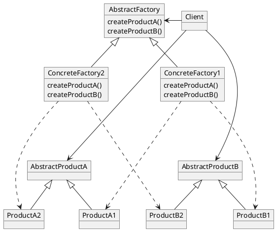

### Builder

Intent

- Separate the construction of a complex object from its representation so that the same construction process can create different representations.

<!--

_Applicability_

- _The algorithm for creating a complex object should be independent of the parts that make up the object and how they're assembled._
- _The construction process must allow different representations for the object that's constructed._

-->

Structure


- Director 控制 (复杂对象的) 构建过程
- Builder 决定 (复杂对象的) 组成对象的实际类型
    - 它的用途甚至并不限于此! _( 详见原书例 )_

### Factory Method

Intent

- Define an interface for creating an object, but let subclasses decide which class to instantiate.
- Factory Method lets a class defer instantiation to subclasses.

_Also Known As_

- _Virtual Constructor_

Structure


### Prototype

Intent

- Specify the kinds of objects to create using a prototypical instance, and create new objects by copying this prototype.

_Applicability_

- _When a system should be independent of how its products are created, composed, and represented. and_
    - _( 当一个系统应该独立于它的产品创建、构成和表示时 )_
- _when the classes to instantiate are specified at run-time, for example, by dynamic loading; or_
    - _( 当要实例化的类实在运行时指定时, 例如, 通过动态装载 )_
- _to avoid building a class hierarchy of factories that parallels the class hierarchy of products; or_
    - _( 为了避免创建一个与产品类层次平行的工厂类层次 )_
- _when instances of a class can have one of only a few different combinations of state. It may be more convenient to install a corresponding number of prototypes and clone them rather than instantiating the class manually, each time with the appropriate state._
    - _( 当一个类的实例只能有几个不同状态组合中的一种时, 建立相应数目的原型并克隆它们, 可能比每次用合适的状态手工实例化该类更方便一些 )_

Structure


### Singleton

Intent

- Ensure a class only has one instance, and provide a global point of access to it.

<!--

_Applicability_

- _There must be exactly one instance of a class, and it must be accessible to clients from a well-known access point._
- _When the sole instance should be extensible by subclassing, and clients should be able to use an extended instance without modifying their code._ _( 这点的好处不是很明了 )_

-->

Structure


_Others_

- _Registry of singleton 单件注册表 : 运行时才决定要使用的具体单件 ( 灵活的方法, 实现详见原书例 )_

## Structural

### Adapter

Intent

- Convert the interface of a class into another interface clients expect.
    - Adapter lets classes work together that couldn't otherwise because of incompatible interfaces.

_Also Known As_

- _Wrapper_

Structure

- Multiple Inheritance


- Composition


_Others_

- _Two-way adapters : provide transparency_
    - _( 双向适配器 : 提供透明操作 )_

### Bridge

Intent

- Decouple an abstraction from its implementation so that the two can vary independently.

_Also known as_

- _Handle / Body_

Structure


### Composite

Intent

- Compose objects into tree structures to represent part-whole hierarchies.
- Composite lets clients treat individual objects and compositions of objects uniformly.

_Applicability_

- You want to represent part-whole hierarchies of objects.
- You want clients to be able to ignore the difference between compositions of objects and individual objects.
    - Clients will treat all objects in the composite structure uniformly.

Structure

<!--  -->

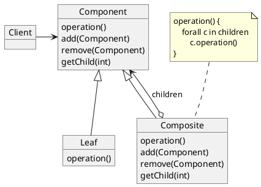

### Decorator

Intent

- Attach additional responsibilities to an object dynamically.
- Decorators provide a flexible alternative to subclassing for extending functionality.

_Also Known As_

- _Wrapper_

_Applicability_

- To add responsibilities to individual objects dynamically and transparently, that is, without affecting other objects.
- For responsibilities that can be withdrawn.
- When extension by subclassing is impractical.
    - Sometimes a large number of independent extensions are possible and would produce an explosion of subclasses to support every combination.
    - Or a class definition may be hidden or otherwise unavailable for subclassing.

Structure

<!--  -->

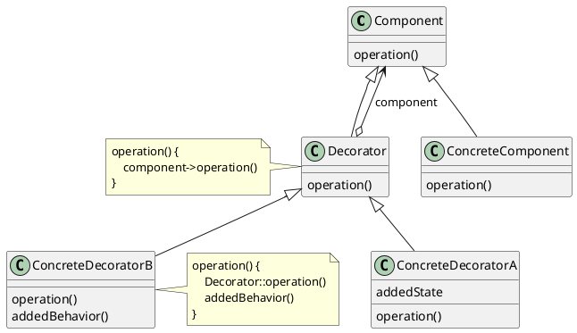

### Facade

Intent

- Provide a unified interface to a set of interfaces in a subsystem.
- Facade defines a higher-level interface that makes the subsystem easier to use.

_Applicability_

- You want to provide a simple interface to a complex subsystem.
    - Subsystems often get more complex as they evolve.
    - Most patterns, when applied, result in more and smaller classes.
    - This makes the subsystem more reusable and easier to customize, but it also becomes harder to use for clients that don't need to customize it.
    - A facade can provide a simple default view of the subsystem that is good enough for most clients.
    - Only clients needing more customizability will need to look beyond the facade.
- There are many dependencies between clients and the implementation classes of an abstraction.
    - Introduce a facade to decouple the subsystem from clients and other subsystems, thereby promoting subsystem independence and portability _( 可移植性 )_ .
- You want to layer your subsystems.
    - Use a facade to define an entry point to each subsystem level.
    - If subsystems are dependent, then you can simplify the dependencies between them by making them communicate with each other solely through their facades.

Structure

<!-- 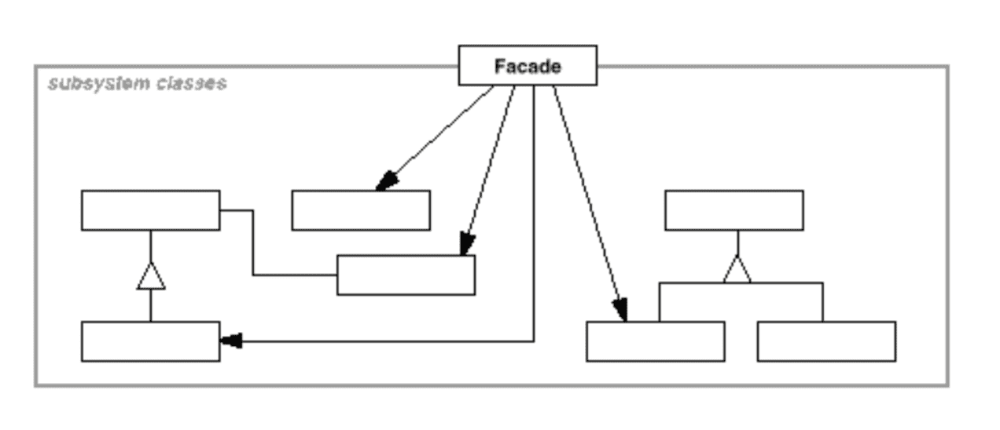 -->

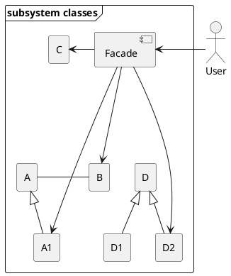

### Flyweight

Intent

- Use sharing to support large numbers of fine-grained _( 细粒度的 )_ objects efficiently.

_Applicability_

- The Flyweight pattern's effectiveness depends heavily on how and where it's used.
- Apply the Flyweight pattern when all of the following are true:
    - An application uses a large number of objects.
    - Storage costs are high because of the sheer quantity of objects.
    - Most object state can be made extrinsic _( 非固有的/外在的 )_.
    - Many groups of objects may be replaced by relatively few shared objects once extrinsic state is removed.
    - The application doesn't depend on object identity.
        - Since flyweight objects may be shared, identity tests will return true for conceptually distinct objects.

Structure

<!--  -->

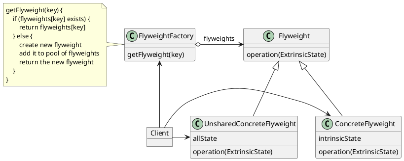

### Proxy

Intent

- Provide a surrogate or placeholder for another object to control access to it.

_Also Known As_

- _Surrogate 代理人_

_Applicability_

- Proxy is applicable whenever there is a need for a more versatile or sophisticated reference to an object than a simple pointer.
- _Here are several common situations in which the Proxy pattern is applicable:_
    - 1\. A **remote proxy** provides a local representative for an object in a different address space.
    - 2\. A **virtual proxy** creates expensive objects on demand.
    - 3\. A **protection proxy** controls access to the original object.
        - Protection proxies are useful when objects should have different access rights.
    - 4\. A **smart reference** is a replacement for a bare pointer that performs additional actions when an object is accessed. Typical uses include :
        - counting the number of references to the real objects  that it can be freed automatically when there are no more references ( also called smart pointers ).
        - loading a persistent object into memory when it's first referenced.
        - checking that the real object is locked before it'saccessed to ensure that no other object can change it.

Structure

<!--  -->

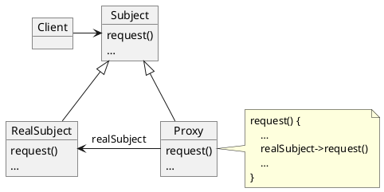

_A possible object diagram of a proxy structure at run-time_

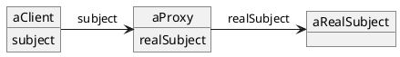

### _Discussion_

Adapter versus Bridge

- Adapter focuses on **resolving incompatibilities between two existing interfaces**.
    - _It doesn't focus on how those interfaces are implemented,nor does it consider how they might evolve independently._
- Bridge, on the other hand, **bridges an abstraction and its ( potentially numerous ) implementations**.
    - _Itprovides a stable interface to clients even as it lets you vary the classes that implement it._
    - _It also accommodates new implementations as the system evolves._
- _The Adapter pattern makes things work after they're designed; Bridge makes them work before they are._
- A **facade defines a new interface**, whereas an adapterreuses an old interface.
    - _Remember that an adapter makes two existing interfaces work together as opposed to defining an entirelynew one._

Composite versus Decorator versus Proxy

- Decorator is designed to let you **add responsibilities to objectswithout subclassing**.
    - _It avoids the explosion of subclasses that can arise from trying to cover every combination of responsibilities statically._
- Composite has a different intent.
    - It focuses on structuring classes **so that many related objects can be treateduniformly, and multiple objects can be treated as one**.
    - Its focus is not on embellishment but on representation.
- Unlike Decorator, the Proxy pattern is not concerned with **attaching or detaching properties dynamically**, _and it's not designed for recursive composition._
    - In the Proxy pattern, the subject **defines the key functionality, and the proxy provides ( or refuses ) access to it**.
    - In Decorator, the component **provides only part of the functionality**, and one or more decorators furnish the rest.

## Behavioral

### Chain of Responsibility

Intent

- Avoid coupling the sender of a request to its receiver by giving more than one object a chance to handle the request.
    - Chain the receiving objects and pass the request along the chain until an object handles it.

Structure


_A typical object structure might look like this:_

<!--  -->

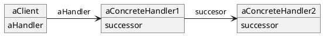

### Command

Intent

- Encapsulate a request as an object, thereby letting you parameterize clients with different requests, queue or log requests, and support undoable operations.

_Also Known As_

- _Action 动作_
- _Transaction 事务_

_Applicability_

- **Parameterize** objects by an action to perform.
    - You can express such parameterization in a procedural language with a callback function, that is, a function that's registered somewhere to be called at a later point.
    - _Commands are an object-oriented replacement for callbacks._
- Specify, queue, and **execute requests at different times**.
    - _A Command object can have a lifetime independent of the original request._
    - If the receiver of a request can be represented in an address space-independent way, then you can transfer a command object for the request to a different process and fulfill the request there.
- Support **undo**.
    - The Command's Execute operation can store state for reversing its effects in the command itself.
    - The Command interface must have an added Unexecute operation that reverses the effects of a previous call to Execute.
    - _Executed commands are stored in a history list._
    - _Unlimited-level undo and redo is achieved by traversing this list backwards and forwards calling Unexecute and Execute, respectively._
- Support **logging changes** so that they can be reapplied in case of a system crash.
    - By augmenting the Command interface with load and store operations, you can keep a persistent log of changes.
    - Recovering from a crash involves reloading logged commands from disk and reexecuting them with the Execute operation.
- Structure a system around high-level operations built on primitives operations.
    - Such a structure is common in information systems that support **transactions**.
    - A transaction encapsulates a set of changes to data.
    - _The Command pattern offers a way to model transactions._
    - _Commands have a common interface, letting you invoke all transactions the same way._
    - _The pattern also makes it easy to extend the system with new transactions._

Structure


Collabrations


### Interpreter

Intent

- Given a language, define a represention for its grammar along with an interpreter that uses the representation to interpret sentences in the language.
    - _( 给定一个语言, 定义它的文法的一种表示, 并定义一个解释器. 这个解释器使用该表示来解释语言中的句子 )_

_Motivation_

- If a particular kind of problem occurs often enough, then it might be worthwhile to express instances of the problem as sentences in a simple language.
    - Then you can build an interpreter that solves the problem by interpreting these sentences.
- For example, searching for strings that match a pattern is a common problem.
    - **Regular expressions** are a standard language for specifying patterns of strings.
    - Rather than building custom algorithms to match each pattern against strings, search algorithms could interpret aregular expression that specifies a set of strings to match.
- The Interpreter pattern describes how to define a grammar for simple languages, represent sentences in the language, and interpret the sesentences.

_Applicability_

- Use the Interpreter pattern when there is a language to interpret, and you can represent statements in the language as **abstract syntax trees**.
- The Interpreter pattern works best when
    - the grammar is simple.
        - For complex grammars, the class hierarchy for the grammar becomes large and unmanageable.
        - _Tools such as parser generators are a better alternative in such cases._
        - _They can interpret expressions without building abstract syntax trees, which can save space and possibly time._
    - efficiency is not a critical concern.
        - The most efficient interpretersare usually not implemented by interpreting parse trees directly but by first translating them into another form.
        - _For example, regular expressions are often transformed into state machines._
        - _But even then, the translator can be implemented by the Interpreter pattern, so the pattern is still applicable._

Structure

<!-- 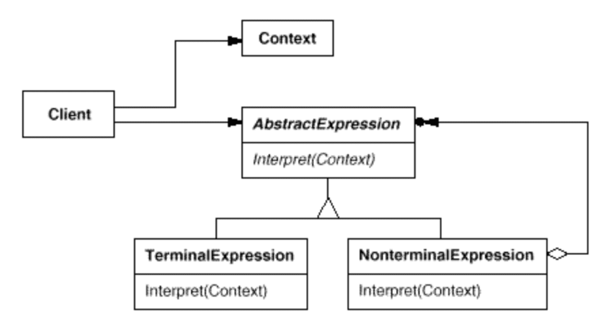 -->

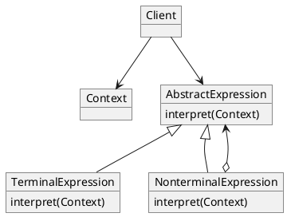

_( 内容比较费解, 详见原书内容 )_

### Iterator

Intent

- Provide a way to access the elements of an aggregate object sequentially without exposing its underlying representation.
    - _( 提供一种方法顺序访问一个聚合对象中的各个元素, 而又不需要暴露该对象的内部表示 )_

_Also Known As_

- _Cursor 游标_

_Applicability_

- to access an aggregate object's contents without exposing its internal representation.
- to support multiple traversals of aggregate objects.
- to provide a uniform interface for traversing different aggregatestructures ( that is, to support polymorphic iteration ).

Structure

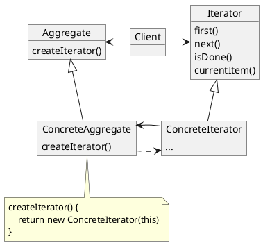

### Mediator

Intent

- Define an object that encapsulates how a set of objects interact.
    - _( 用一个中介对象封装一系列的对象交互 )_
- Mediator promotes loose coupling by keeping objects from referring to each other explicitly, and it lets you vary their interaction independently.
    - _( 中介者使各对象不需要显式地相互引用, 从而使其耦合松散, 而且可以独立地改变它们之间的交互 )_

_Motivation_

- Object-oriented design encourages the distribution of behavior among objects.
    - Such distribution can result in an object structure with many connections between objects;
    - in the worst case, every object ends up knowing about every other.
- Though partitioning a system into many objects generally enhances reusability,
    - proliferating interconnections tend to reduce it again.
    - Lots of interconnections make it less likely that an object can work without the support of others -- the system acts as though _( 仿佛 )_ it were monolithic.

_Applicability_

- A set of objects communicate in well-defined but complex ways.
    - The resulting interdependencies _( 相关性 )_ are unstructured and difficult to understand.
- Reusing an object is difficult because it refers to and communicates with many other objects.
- A behavior that's distributed between several classes should be customizable without a lot of subclassing.

Structure

```plantuml
@startuml
object Mediator
object ConcreteMediator
object Colleague
object ConcreteColleague1
object ConcreteColleague2

Mediator <|-- ConcreteMediator
Mediator <- Colleague : mediator
Colleague <|-- ConcreteColleague1
Colleague <|-- ConcreteColleague2
@enduml
```

_A typical object structure might look like this:_

<!-- 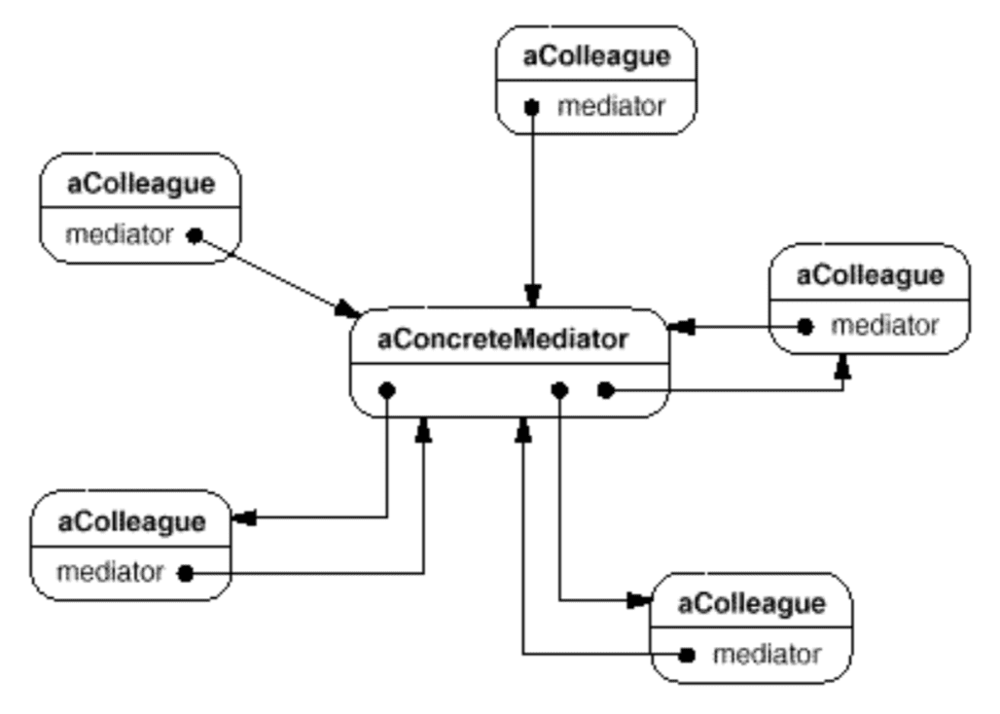 -->

```plantuml
@startuml
object aConcreteMediator

object aColleague1
aColleague1 : mediator
object aColleague2
aColleague2 : mediator
object aColleague3
aColleague3 : mediator
object aColleague4
aColleague4 : mediator
object aColleague5
aColleague5 : mediator

aColleague1 <--* aConcreteMediator
aConcreteMediator *-> aColleague2
aConcreteMediator *--> aColleague3
aConcreteMediator *--> aColleague4
aColleague5 <-* aConcreteMediator

aColleague1 ---> aConcreteMediator
aConcreteMediator <-- aColleague2
aConcreteMediator <--- aColleague3
aConcreteMediator <--- aColleague4
aColleague5 --> aConcreteMediator
@enduml
```


### Memento

- _Memento 备忘录_
- _Originator 原发器_
- _Caretaker 看管者 / 看门人_

Intent

- Without violating encapsulation, capture and externalize an object's internal state so that the object can be restored to this state later.

_Also Known As_

- Token

_Applicability_

- A snapshot of ( some portion of ) an object's state must be saved so that it can be restored to that state later, and
- A direct interface to obtaining the state would expose implementation details and break the object's encapsulation.

Structure

```plantuml
@startuml
class Originator {
    state
    createMemento()
    setMemento(Memento m)
}
class Memento {
    state
    getState()
    setState(aState)
}
object Caretaker

note as N0
createMemento() {
    return new Memento(state)
}
end note

note as N1
setMemento(Memento m) {
    state = m->getState()
}
end note

Originator .> Memento
Memento <-o Caretaker : memento
Originator .. N0
Originator .. N1

@enduml
```

Collaborations

```plantuml
@startuml
participant aCaretaker
participant anOriginator
participant aMemento

activate aCaretaker
aCaretaker -> anOriginator : createMemento()

activate anOriginator
anOriginator --> aMemento : new Memento
activate aMemento
deactivate aMemento

anOriginator -> aMemento : setState(aState)
activate aMemento
deactivate aMemento

deactivate anOriginator
deactivate aCaretaker
...

aCaretaker -> anOriginator : setMemento(aMemento)
activate aCaretaker
activate anOriginator

anOriginator -> aMemento : getState()
activate aMemento
deactivate aMemento

deactivate anOriginator
deactivate aCaretaker

@enduml
```

### Observer

Intent

- Define a one-to-many dependency between objects so that when one object changes state, all its dependents are notified and updatedautomatically.

_Also Known As_

- _Dependents 依赖_
- Publish-Subscribe 发布-订阅

_Applicability_

- When an abstraction has two aspects, one dependent on the other.
    - Encapsulating these aspects in separate objects lets you vary and reuse them independently.
- When a change to one object requires changing others, and you don't know how many objects need to be changed.
- When an object should be able to notify other objects without making assumptions about who these objects are.
    - In other words, you don't want these objects tightly coupled.

Structure

```plantuml
@startuml
class Subject {
    attach(Observer)
    detach(Observer)
    notify()
}

class ConcreteSubject {
    subjectState
    getState()
    setState(aState)
}

class Observer {
    update()
}

class ConcreteObserver {
    observerState
    update()
}

note as N0
    notify() {
        for all o in observers {
            o->update()
        }
    }
end note

note as N1
getState() {
    return subjectState
}
end note

note as N2
update() {
    observerState = subject->getState()
}
end note

Subject <|-- ConcreteSubject
Subject -> Observer : observer
Observer <|-- ConcreteObserver
ConcreteSubject <- ConcreteObserver : subject

N0 . Subject
N1 . ConcreteSubject
ConcreteObserver . N2
@enduml
```

Collaboration

```plantuml
@startuml
participant aConcreteSubject
participant aConcreteObserver
participant anotherConcreteObserver

aConcreteSubject <- aConcreteObserver : setState()
activate aConcreteObserver
deactivate aConcreteObserver

activate aConcreteSubject
aConcreteSubject -> aConcreteSubject : notify()

aConcreteSubject -> aConcreteObserver : update()
activate aConcreteObserver
aConcreteSubject <- aConcreteObserver : getState()
deactivate aConcreteObserver

aConcreteSubject -> anotherConcreteObserver : update()
activate anotherConcreteObserver
aConcreteSubject <- anotherConcreteObserver : getState()
deactivate anotherConcreteObserver
@enduml
```

- _注意 : notify() 也可以由 observer 或其它对象调用_

Consequences _效果/结果/后果_

- **Abstract coupling** between Subject and Observer
    - _将 subject ( publisher ) 跟 observer ( subscriber ) 解耦_
- Support for **broadcast communication**
    - _…_
- Unexpected updates _( 缺点 )_
    - _Because observers have no knowledge of each other's presence, they can be blind to the ultimate cost of changing the subject._
    - _( icehe : 频繁的通知, 过多的观察者, 过重的更新操作… 想想 "惊群现象" )_

Implementation

- Mapping subjects to their observers
    - _subjects 持有大量 observers 引用的存储开销_
- Observing more than one subject
    - _一个 observer 可能观察多个 subject, 所以 subject 在 notify 时, 可能需要把自身作为参数传递给 observer, 以便 observer 根据通知源来区别处理_
- Who triggers the update?
    - Subject : 由 subject 的 state setter 自动调用 notify()
        - _优点 : 不需要 observer ( 客户 ) 在修改 subject 后还有调用 notify(), 比较省心_
        - _缺点 : 一系列连续的操作, 会触发不必要的频繁 notify(), 效率较低_
    - Observer : 有 observer ( 客户 ) 在适当的时机调用 notify()
        - _优点 : 客户可以在一系列的状态改变完成后, 一次性地触发更新, 效率较高_
        - _缺点 : 给客户增加了触发 notify() 的责任, 客户可能会忘记调用, 容易出错_
- _Dangling references to deleted subjects_
    - _subject 持有 observer 的引用, 注意不能随便 delete 它 ( C++ 有相关问题, Java 则不用担心 )_
        - _因为恐怕还有其它 subject 还在引用同一个 observer …_
- Making sure Subject state is self-consistent before notification
    - _例如, 不要在还没修改好 subject 之前, 就调用 notify(), observer 会得到错误的数据_
- Avoiding observer-specific update protocols : the **push and pull models**.
    - _subject 需要广播关于其改变的一些信息, 这些信息可能很小, 但也可能很大 ( 传递开销大 ) . 如何传递改变的信息?_
        - Push Model : _subject 向 observer 传递详细信息, 巨细无靡, 即使 observer 不关心其中的部分信息_
            - _observer 被迫知道 subject 的更多它不关心的细节 ( 耦合 ) , 使其更难以实现和复用_
        - Pull Model : subject 只向 observer 传递最小的通知信息, 之后需要 observer 自行显式查询具体细节, 效率较低
- Specifying modifications of interest explicitly
    - _subject 仅通知 observer 所关注特定方面 ( aspect ) 的变更, 但是 ( 注册观察者/广播通知的 ) 具体实现更加复杂_
- Encapsulating complex update semantics
    - _利用 Mediator 模式, 创建一个 ChangeManager 来间接维护 subject 跟 observer 的关联关系, 以及其更新策略与更新操作_
- _Combining the Subject and Observer classes_
    - _结合 subject 和 observer 的接口定义, 允许一个既是 subject 又是 observer 的 object_
    - _甚至将其定义于根类 Object 中, 使得该特性对所有类都可用_

_Combine Observer with Mediator_

```plantuml
@startuml

class Subject {
    attach(Observer)
    detach(Observer)
    notify()
}

class Observer {
    update(Subject)
}

class ChangeManager {
    Subject-Observer Mapping
    register(Subject, Observer)
    unregister(Subject, Observer)
    notify()
}

class SimpleChangeManager {
    register(Subject, Observer)
    unregister(Subject, Observer)
    notify()
}

class DAGChangeManager {
    register(Subject, Observer)
    unregister(Subject, Observer)
    notify()
}

note as N0
    notify() {
        chman->notify()
    }
end note

note as N1
    attach(Observer o) {
        chman->register(this, o)
    }
end note

note as N2
    notify() {
        forall s in subjects
            forall o in s.observers
                o->update(s)
    }
end note

note as N3
    notify() {
        mark all observers to update
        update all marked observers
    }
end note

Subject <-o ChangeManager : subjects
Subject -> ChangeManager : chman

ChangeManager o-> Observer : observers
ChangeManager <|-- SimpleChangeManager
ChangeManager <|-- DAGChangeManager

N0 . Subject
Subject .. N1

SimpleChangeManager .. N2
DAGChangeManager .. N3

@enduml
```

### State

Intent

- Allow an object to alter its behavior when its internal state changes. The object will appear to change its class.
    - _( 允许一个对象在其内部状态改变时改变它的行为. 对象看起来似乎修改了它的类. )_

_Also Known As_

- Objects for states 状态对象 _( 例如 Enum )_

_Applicability_

- An object's behavior depends on its state, and it must change its behavior at run-time depending on that state.
- Operations have large, multipart conditional statements that depend on the object's state.
    - This state is usually represented by one or more enumerated constants.
    - _Often, several operations will contain this same conditional structure._
    - The State pattern puts each branch of the conditional in a separate class.
    - This lets you treat the object's state as an object in its own right that can vary independently from other objects.

Structure

```plantuml
@startuml
object Context
object State
object ConcreteStateA
object ConcreteStateB

note as N0
request() {
    state->handle()
}
end note

Context o-> State : state
Context .. N0
State <|-- ConcreteStateA
State <|-- ConcreteStateB

Context : request()
State : handle()
ConcreteStateA : handle()
ConcreteStateB : handle()

@enduml
```

### Strategy

Intent

- Define a family of algorithms, encapsulate each one, and make them interchangeable _( 可交换的 )_ .
    - Strategy lets the algorithm vary independently from clients that use it.

_Also Known As_

- Policy 政策

_Applicability_

- Many related classes differ only in their behavior.
    - Strategies provide a way to configure a class with one of many behaviors.
- You need different variants of an algorithm.
    - For example, you might define algorithms reflecting different space/time trade-offs.
    - Strategies can be used when these variants are implemented as a class hierarchy of algorithms.
- An algorithm uses data that clients shouldn't know about.
    - Use the Strategy pattern to avoid exposing complex, algorithm-specific data structures.
- A class defines many behaviors, and these appear as multiple conditional statements in its operations.
    - Instead of many conditionals, move related conditional branches into their own Strategy class.

Structure

```plantuml
@startuml
object Context
object Strategy
object ConcreteStrategyA
object ConcreteStrategyB
object ConcreteStrategyC

Context : contextInterface()
Strategy : algorithmInterface()
ConcreteStrategyA : algorithmInterface()
ConcreteStrategyB : algorithmInterface()
ConcreteStrategyC : algorithmInterface()

Context o-> Strategy : strategy
Strategy <|-- ConcreteStrategyA
Strategy <|-- ConcreteStrategyB
Strategy <|-- ConcreteStrategyC

@enduml
```

### Template Method

Intent

- Define the skeleton of an algorithm in an operation, deferring some steps to subclasses.
    - Template Method lets subclasses redefine certain steps of an algorithm without changing the algorithm's structure.

_Applicability_

- To implement the invariant parts of an algorithm once and leave it up to subclasses to implement the behavior that can vary.
- When common behavior among subclasses should be factored and localizedin a common class to avoid code duplication.
    - _This is a good example of "refactoring to generalize" as described by Opdyke andJohnson._
    - You first identify the differences in the existing code and then separate the differences into new operations.
    - Finally, you replace the differing code with a template method that calls one of these new operations.
- To control subclasses extensions.
    - You can define a template method that calls "hook" operations at specific points,thereby permitting extensions only at those points.

Structure

```plantuml
@startuml
object AbstractClass
object ConcreteClass

note as N0
templateMethod() {
    …
    primitiveOperation1()
    …
    primitiveOperation2()
    …
}
end note

AbstractClass <|-- ConcreteClass
AbstractClass . N0

AbstractClass : templateMthod()
AbstractClass : primitiveOperation1()
AbstractClass : primitiveOperation2()

ConcreteClass : primitiveOperation1()
ConcreteClass : primitiveOperation2()

@enduml
```

- _primitive operation 原语操作 ( icehe : 类似于 原子操作 / 事务操作 )_

### Visitor

- _访问者_

Intent

- Represent an operation to be performed on the elements of an object structure.
    - _( 表示一个作用于某对象结构的各元素的操作 )_
    - Visitor lets you define a new operation without changing the classes of the elements on which it operates.
        - _( 它使你可以在不改变各元素的类的前提下定义作用于这些元素的操作 )_

_Applicability_

- An object structure contains many classes of objects with differing interfaces, and you want to perform operations on these objects that depend on their concrete classes. _( icehe : 这句不太理解 )_
- Many distinct and unrelated operations need to be performed on objects in an object structure, and you want to avoid "polluting" their classes with these operations.
    - _( 例如, 每当需要添加新操作, 都要给对象类添加新的操作方法, 方法就越来越多了 )_
    - Visitor lets you keep related operations together by defining them in one class.
    - When the object structure is shared by many applications, use Visitor to put operations in just those applications that need them.
- The classes defining the object structure rarely change, but you often want to define new operations over the structure.
    - Changing the object structure classes requires redefining the interface to all visitors, which is potentially costly.
    - _If the object structure classes change often, then it's probably better to define the operations in those classes._

Structutre

```plantuml
@startuml
object Client

object Visitor
Visitor : visitConcreteELementA(ConcreteElementA)
Visitor : visitConcreteELementB(ConcreteElementB)

object ConcreteVisitor1
ConcreteVisitor1 : visitConcreteELementA(ConcreteElementA)
ConcreteVisitor1 : visitConcreteELementB(ConcreteElementB)

object ConcreteVisitor2
ConcreteVisitor2 : visitConcreteELementA(ConcreteElementA)
ConcreteVisitor2 : visitConcreteELementB(ConcreteElementB)

object ObjectStructure

object Element
Element : accept(Visitor)

object ConcreteElementA
ConcreteElementA : accept(Visitor)
ConcreteElementA : operationA()

object ConcreteElementB
ConcreteElementB : accept(Visitor)
ConcreteElementB : operationB()

note as N0
    accept(Visitor v) {
        v->visitConcreteElementA(this)
    }
end note

note as N1
    accept(Visitor v) {
        v->visitConcreteElementB(this)
    }
end note

Client -> Visitor
Visitor <|-- ConcreteVisitor1
Visitor <|-- ConcreteVisitor2

Client ---> ObjectStructure
ObjectStructure -> Element
Element <|-- ConcreteElementA
Element <|-- ConcreteElementB

ConcreteElementA .. N0
ConcreteElementB .. N1

@enduml
```

Collaborations

```plantuml
@startuml
participant anObjectStructure
participant aConcreteElementA
participant aConcreteElementB
participant aConcreteVisitor

activate anObjectStructure
anObjectStructure -> aConcreteElementA : aConcreteElementA->accept(aVisitor)
activate aConcreteElementA

aConcreteElementA -> aConcreteVisitor : aVisitor->visitElementA(this)
activate aConcreteVisitor
deactivate aConcreteElementA
deactivate aConcreteElementA

aConcreteElementA <- aConcreteVisitor : aConcreteElementA->operationA()
activate aConcreteElementA
deactivate aConcreteVisitor
deactivate aConcreteElementA

deactivate anObjectStructure

anObjectStructure -> aConcreteElementB : aConcreteElementB->accept(aVisitor)
activate anObjectStructure
activate aConcreteElementB

aConcreteElementB -> aConcreteVisitor : aVisitor->visitElementB(this)
activate aConcreteVisitor
deactivate aConcreteElementB

aConcreteElementB <- aConcreteVisitor : aConcreteElementB->operationB()
activate aConcreteElementB
deactivate aConcreteElementB
deactivate aConcreteVisitor

@enduml
```

Consequences

- Visitor makes adding new operations easy.
    - Visitors make it easy to add operations that depend on the components of complex objects.
    - You can define a new operation over an object structure simply by adding a new visitor.
    - _In contrast, if you spread functionality over many classes, then you must change each class to define a new operation. ( Shotgun Surgery 霰弹式修改 )_
- A visitor gathers related operations and separates unrelated ones.
    - Related behavior isn't spread over the classes defining the object structure; it's localized in a visitor.
    - Unrelated sets of behavior are partitioned in their own visitor subclasses.
    - That simplifies both the classes defining the elements and the algorithms defined in the visitors.
    - _Any algorithm-specific data structures can be hidden in the visitor._
- Adding new ConcreteElement classes is hard.
    - The Visitor pattern makes it hard to add new subclasses of Element.
        - Each new ConcreteElement gives rise to a new abstract operation on Visitor and a corresponding implementation in every ConcreteVisitor class.
        - _Sometimes a default implementation can be provided in Visitor that can be inheritedby most of the ConcreteVisitors, but this is the exception rather than the rule._
    - So the key consideration in applying the Visitor pattern is whether you are mostly likely to change the algorithm applied over an object structure or the classes of objects that make up the structure.
        - The Visitor class hierarchy can be difficult to maintain when new ConcreteElement classes are added frequently.
            - In such cases, it's probably easier just to define operations on the classes that make upthe structure.
        - If the Element class hierarchy is stable, but you are continually adding operations or changing algorithms, then the Visitor pattern will help you manage the changes.
- _Visiting across class hierarchies._
    - _omitted…_
- Accumulating state.
    - Visitors can accumulate state as they visit each element in the object structure.
    - _Without a visitor, this state would be passed as extra arguments to the operations that perform the traversal, or they might appear as global variables._
- Breaking encapsulation.
    - Visitor's approach assumes that the ConcreteElement interface is powerful enough to let visitors do their job.
    - As a result, the pattern often forces you to provide public operations that access an element's internal state, which may compromise its encapsulation.
