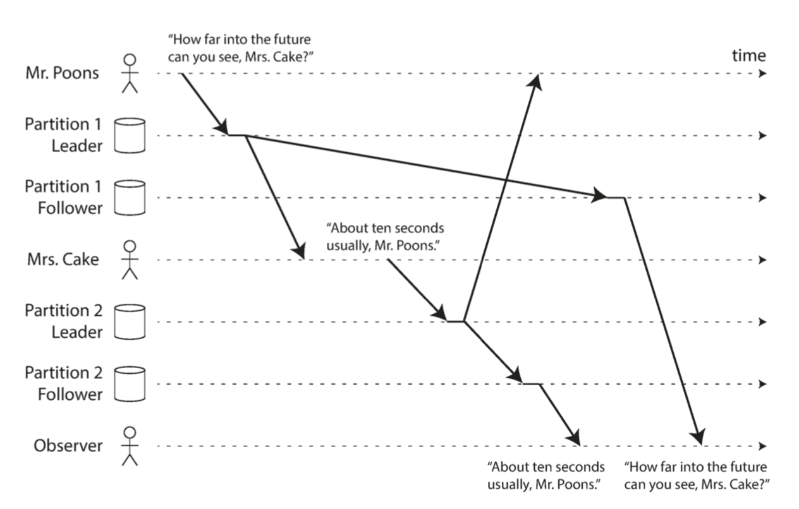

# Designing Data-Intensive Applications

References

- Book "Designing Data-Intensive Applications"
    - ZH Ver. :《 数据密集型应用系统设计 》

## Table of Contents

Part I. Foundations of Data Systems

- 1\. Reliable, Scalable, and Maintainable Applications
    - _Thinking About Data Systems_
    - Reliability _( 可靠性 )_
        - Hardware Faults
        - Software Errors
        - Human Errors
        - _How Important Is Reliability?_
    - **Scalability** _( 可伸缩性 )_
        - **Describing Load**
        - **Describing Performance**
        - **Approaches for Coping with Load**
    - Maintainability _( 可维护性 )_
        - Operability: Making Life Easy for Operations _( 可运维性 )_
        - Simplicity: Managing Complexity _( 简单性 )_
        - Evolvability: Making Change Easy _( 可演化性 )_
- 2\. Data Models and Query Languages
    - **Relational Model Versus Document Model** _( 关系模型 / 文档模型 )_
        - **The Birth of NoSQL**
        - **The Object-Relational Mismatch**
        - **Many-to-One and Many-to-Many Relationships**
        - Are Document Databases Repeating History?
        - Relational Versus Document Databases Today
    - Query Languages for Data
        - Declarative Queries on the Web _( 声明式查询 )_
        - MapReduce Querying
    - **Graph-Like Data Models** _( 图模型 )_
        - **Property Graphs**
        - The Cypher Query Language
        - Graph Queries in SQL
        - Triple-Stores and SPARQL
        - The Foundation: Datalog
- 3\. Storage and Retrieval
    - **Data Structures That Power Your Database**
        - Hash Indexes
        - **SSTables and LSM-Trees** _( 日志结构合并树 )_
        - **B-Trees**
        - Comparing B-Trees and LSM-Trees
        - Other Indexing Structures
    - **Transaction Processing or Analytics?**
        - Data Warehousing _( 数据仓库 )_
        - **Stars and Snowflakes: Schemas for Analytics Column-Oriented Storage**
    - **Column-Oriented Storage** _( 列式存储 )_
        - **Column Compression**
        - **Sort Order in Column Storage**
        - Writing to Column-Oriented Storage
        - Aggregation: Data Cubes and Materialized Views
- 4\. Encoding and Evolution
    - **Formats for Encoding Data**
        - Language-Specific Formats
        - JSON, XML, and Binary Variants
        - **Thrift and Protocol Buffers**
        - _Avro_
        - The Merits of Schemas
    - **Modes of Dataflow**
        - Dataflow Through Databases
        - Dataflow Through Services: REST and RPC
        - Message-Passing Dataflow

Part II. Distributed Data

- 5\. Replication
    - Leaders and Followers
        - Synchronous Versus Asynchronous Replication
        - Setting Up New Followers
        - Handling Node Outages
        - Implementation of Replication Logs
    - Problems with Replication Lag
        - Reading Your Own Writes
        - Monotonic Reads
        - Consistent Prefix Reads
    - Solutions for Replication Lag
        - Multi-Leader Replication
        - Use Cases for Multi-Leader Replication
        - Handling Write Conflicts
    - Multi-Leader Replication Topologies
        - Leaderless Replication
        - Writing to the Database When a Node Is Down
        - Limitations of Quorum Consistency
        - Sloppy Quorums and Hinted Handoff
        - Detecting Concurrent Writes
- 6\. Partitioning
    - Partitioning and Replication
    - Partitioning of Key-Value Data
        - Partitioning by Key Range
        - Partitioning by Hash of Key
        - Skewed Workloads and Relieving Hot Spots
    - Partitioning and Secondary Indexes
        - Partitioning Secondary Indexes by Document
        - Partitioning Secondary Indexes by Term
    - Rebalancing Partitions
        - Strategies for Rebalancing
        - Operations: Automatic or Manual Rebalancing
    - Request Routing
        - Parallel Query Execution
- 7\. Transactions
    - The Slippery Concept of a Transaction
        - The Meaning of ACID
        - Single-Object and Multi-Object Operations
    - Weak Isolation Levels
        - Read Committed
        - Snapshot Isolation and Repeatable Read
        - Preventing Lost Updates
        - Write Skew and Phantoms
    - Serializability
        - Actual Serial Execution
        - Two-Phase Locking (2PL)
        - Serializable Snapshot Isolation (SSI)
- 8\. The Trouble with Distributed Systems
    - Faults and Partial Failures
        - Cloud Computing and Supercomputing
    - Unreliable Networks
        - Network Faults in Practice
        - Detecting Faults
        - Timeouts and Unbounded Delays
        - Synchronous Versus Asynchronous Networks
    - Unreliable Clocks
        - Monotonic Versus Time-of-Day Clocks
        - Clock Synchronization and Accuracy
        - Relying on Synchronized Clocks
        - Process Pauses
    - Knowledge, Truth, and Lies
        - The Truth Is Defined by the Majority
        - Byzantine Faults
        - System Model and Reality
- 9\. Consistency and Consensus
    - Consistency Guarantees
    - Linearizability
        - What Makes a System Linearizable?
        - Relying on Linearizability
        - Implementing Linearizable Systems
        - The Cost of Linearizability
    - Ordering Guarantees
        - Ordering and Causality
        - Sequence Number Ordering
        - Total Order Broadcast
    - Distributed Transactions and Consensus
        - Atomic Commit and Two-Phase Commit (2PC)
        - Distributed Transactions in Practice
        - Fault-Tolerant Consensus
        - Membership and Coordination Services

Part III. Derived Data

- 10\. Batch Processing
    - Batch Processing with Unix Tools
        - Simple Log Analysis
        - The Unix Philosophy
    - MapReduce and Distributed Filesystems
        - MapReduce Job Execution
        - Reduce-Side Joins and Grouping
        - Map-Side Joins
        - The Output of Batch Workflows
        - Comparing Hadoop to Distributed Databases
    - Beyond MapReduce
        - Materialization of Intermediate State
        - Graphs and Iterative Processing
        - High-Level APIs and Languages
- 11\. Stream Processing
    - Transmitting Event Streams
        - Messaging Systems
        - Partitioned Logs
    - Databases and Streams
        - Keeping Systems in Sync
        - Change Data Capture
        - Event Sourcing
        - State, Streams, and Immutability
    - Processing Streams
        - Uses of Stream Processing
        - Reasoning About Time
        - Stream Joins
        - Fault Tolerance
- 12\. The Future of Data Systems
    - Data Integration
        - Combining Specialized Tools by Deriving Data
        - Batch and Stream Processing
    - Unbundling Databases
        - Composing Data Storage Technologies
        - Designing Applications Around Dataflow
        - Observing Derived State
    - Aiming for Correctness
        - The End-to-End Argument for Databases
        - Enforcing Constraints
        - Timeliness and Integrity
        - Trust, but Verify
    - Doing the Right Thing
        - Predictive Analytics
        - Privacy and Tracking 536 Summary

## Reliable, Scalable & Maintainable Systems

**Reliability** _( 可靠性 )_

- _Tolerating hardware & software faults, human errors_
    - The system should continue to work correctly (performing the correct function at the desired level of performance) even in the face of adversity
    - _( 当出现意外情况如硬件、软件故障、人为失误等, 系统应可以继续正常运转 : 虽然性能可能有所降低, 但确保功能正常 )_

**Scalability** _( 可拓展性 / 可伸缩性 )_

- _Measuring load & performance : Latency percentiles, throughput_
    - As the system grows (in data volume, traffic volume, or complexity), there should be reasonable ways of dealing with that growth.
    - _( 随着规模的增长, 例如数据量、流量或复杂性, 系统应以合理的方式来匹配这种增长 )_

**Maintainability** _( 可维护性 )_

- _Operability, simplicity & evolvability_ _( 可演化性 )_
    - Over time, many different people will work on the system (engineering and operations, both maintaining current behavior and adapting the system to new use cases), and they should all be able to work on it productively.
    - _( 随着时间的推移, 许多新的人员参与到系统开发和运维, 以维护现有功能或适配新场景, 系统都应高效运转 )_

---

Application Types

- Data-intensive _数据密集型_
- Compute-intensive _计算密集型_

Data Systems

- Database
    - _Store data so that they, or another application, can find it again later_
        - _( 数据库 : 存储数据, 之后应用可再次访问 )_
- Cache
    - _Remember the result of an expensive operation, to speed up reads_
        - _( 高速缓存 : 缓存那些复杂或操作代价昂贵的结果, 以加快下一次访问 )_
- Search Index
    - _Allow users to search data by keyword or filter it in various ways_
        - _( 索引 : 按照关键字搜索数据, 并支持各种过滤 )_
- Stream processing
    - _Send a message to another process, to be handled asynchronously_
        - _( 流式处理 : 持续发送消息至另一个进程, 处理采用异步方式 )_
- Batch processing
    - _Periodically crunch a large amount of accumulated data_
        - _( 批处理 : 定期处理大量的累积数据 )_

_Others_

- _Full-text search server ( 全文索引服务 )_
    - _e.g.: Elasticsearch / Solr_ _( both from Lucene )_
- _Rolling upgrade ( 滚动升级 )_

### Reliability

_Expectations_

- _Continuing to work correctly, even when things go wrong._
    - _( 即使发生了某些错误, 系统仍可以继续正常工作 )_

<!--

    - _The application performs the function that the user expected._
        - _( 应用程序执行用户所期望的功能 )_
    - _It can tolerate the user making mistakes or using the software in unexpected ways._
        - _( 可以容忍用户出现错误或者不正确的软件使用方法 )_
    - _Its performance is good enough for the required use case, under the expected load and data volume._
        - _( 性能可以应对典型场景、合理负载压力和数据量 )_
    - _The system prevents any unauthorized access and abuse._
        - _( 系统可防止任何未经授权的访问和滥用 )_

-->

_Concepts_

- **Faults**
    - The things that can go wrong
    - _( 错误/故障 : 可能出错的事情 )_
- **Fault-tolerant** or **Resilient**
    - Systems that anticipate faults and can cope with them
    - _( 容错/弹性 : 系统可应对错误 )_

_Fault 故障 / Failure 失效_

- _Differences_
    - Fault : One component of the system deviating from its spec
        - _( 故障 : 组件偏离其正常规格 )_
    - Failure : A failure is when the system as a whole stops providing the required service to the user
        - _( 失效 : 系统作为一个整体停止, 无法向用户提供所需的服务 )_
- _Targets_
    - _It is impossible to reduce the probability of a fault to zero;_
    - _therefore it is usually best to design fault-tolerance mechanisms that prevent faults from causing failures._
- Build reliable systems from unreliable parts
    - _( 在不可靠组件基础上, 构建可靠性系统 )_

<!--

_Faults_

- _Harware Faults_
    - _…_
- _Software Errors_
    - _A software bug that causes every instance of an application server to crash when given a particular bad input._
        - _For example, consider the leap second on June 30, 2012, that caused many applications to hang simultaneously due to a bug in the Linux kernel_
    - _A runaway process that uses up some shared resource -- CPU time, memory, disk space, or network bandwidth._
    - _A service that the system depends on that slows down, becomes unresponsive, or starts returning corrupted responses._
    - _Cascading failures, where a small fault in one component triggers a fault in another component, which in turn triggers further faults._
- _Human Errors_
    - _Design systems in a way that minimizes opportunities for error. For example, well-designed abstractions, APIs, and admin interfaces make it easy to do "the right thing" and discourage "the wrong thing."_
        - _However, if the interfaces are too restrictive people will work around them, negating their benefit, so this is a tricky balance to get right._
    - _Decouple the places where people make the most mistakes from the places where they can cause failures._
        - _In particular, provide fully featured non-production sandbox environments where people can explore and experiment safely, using real data, without affecting real users._
    - _Test thoroughly at all levels, from unit tests to whole-system integration tests and manual tests._
        - _Automated testing is widely used, well understood, and espe‐ cially valuable for covering corner cases that rarely arise in normal operation._
    - _Allow quick and easy recovery from human errors, to minimize the impact in the case of a failure._
        - _For example, make it fast to roll back configuration changes, roll out new code gradually (so that any unexpected bugs affect only a small subset of users), and provide tools to recompute data (in case it turns out that the old com‐ putation was incorrect)._
    - _Set up detailed and clear monitoring, such as performance metrics and error rates._
        - _In other engineering disciplines this is referred to as telemetry. (Once a rocket has left the ground, telemetry is essential for tracking what is happening, and for understanding failures.)_
        - _Monitoring can show us early warning signals and allow us to check whether any assumptions or constraints are being violated. When a problem occurs, metrics can be invaluable in diagnosing the issue._
    - _Implement good management practices and training—a complex and important aspect, and beyond the scope of this book._

-->

### Scalability

#### Describing Load

- Load Parameters _( 负载参数 )_
    - Web server : Requests Per Second ( RPS ) _/ Queries Per Second ( QPS )_
    - Database : Ratio of reads to writes _( 写入比例 )_
    - Chat room : Number of simultaneously active users _( 在线人数 )_
    - Cache : Hit rate _( 命中率 )_
- Example : Twitter
    - Main operations
        - Post tweet : avg rps 4.6k , peak rps 12k _( Nov 2012 )_
        - Home timeline : avg rps 300k
    - Challenge : Fan-out _( 扇出 )_
        - Implementation
            - Pull _( 拉模型 )_
            - Push _( 推模型 )_
            - Push & Pull _( 推拉结合 )_
    - ommitted here … ( **重要! 详见原书例** )

#### Describing Performance

_Look at it in two ways:_

- When you increase a load parameter and keep the system resources (CPU, mem‐ ory, network bandwidth, etc.) unchanged, how is the performance of your system affected?
- When you increase a load parameter, how much do you need to increase the resources if you want to keep performance unchanged?

_Performance Numbers ( 性能指标 )_

- Throughput _( 吞吐量 )_ : _The number of records we can process per second, or the total time it takes to run a job on a dataset of a certain size_
- Response Time _( 响应时间 )_ : _The time between a client sending a request and receiving a response_

Differ latency from response time

- **Response Time = Service Time + Network Delays + Queueing Delays**
    - Service Time ( 服务时间 ) : the actual time to process the request
- **Latency : The duration that a request is waiting to be handled**
    - during which it is latent, awaiting service

_Random Additional Latency ( 每次请求的响应时间, 由于许多因素的影响而不同 )_

- _a context switch to a background process ( 上下文切换 进程调度  )_
- _the loss of a network packet and TCP retransmission ( 网络数据包丢失和 TCP 重传 )_
- _a garbage collection pause ( 垃圾回收暂停 )_
- _a page fault forcing a read from disk ( 缺页中断 磁盘IO )_
- _mechanical vibrations in the server rack ( 甚至是服务器支架的机械振动 )_
- …

##### Percentiles

Response Time

- _The mean is not a very good metric if you want to know your "typical" response time,_
    - _because it doesn't tell you how many users actually experienced that delay._
    - _Usually it is better to use **percentiles** ( 百分位数 ) ._
- _And **median** response time : half your requests return in less than the median, and half your requests take longer than that._
    - _This makes the median a good metric if you want to know how long users typically have to wait…_
    - _The median is also known as the **50th percentile**, and sometimes abbreviated as **p50**._
- _\* Strictly speaking, the term "**average**" doesn't refer to any particular formula,_
    - _but in practice it is usually understood as the arithmetic mean: given n values, add up all the values, and divide by n._

Percentiles _( 百分位数 )_

- _Response time thresholds ( 响应时间阈值 )_
    - p95 : _e.g., **if the 95th percentile response time is 1.5 seconds, that means 95 out of 100 requests take less than 1.5 seconds, and 5 out of 100 requests take 1.5 seconds or more.**_
    - p99 / p999 / etc.
    - mean = p50
- _High percentiles of response times, also known as **tail latencies** ( 尾部延迟 / 长尾效应 ), are important because they directly affect users' experience of the service._

Service Level Objectives ( SLOs ) _( 服务质量目标 )_ and
Service Level Agreements ( SLAs ) _( 服务质量协议 )_

- _Percentiles are often used in **service level objectives (SLOs)** and **service level agreements (SLAs)**, contracts that define the expected performance and availability of a service._
    - _e.g.: An SLA may state that the service is considered to be up if it has a median response time of less than 200 ms and a 99th percentile under 1 s ( if the response time is longer, it might as well be down ), and the service may be required to be up at least 99.9% of the time._

Queueing delays _( 排队延迟 )_

- Queueing delays often account for a large part of the response time at high percentiles.
- As a server can only process a small number of things in parallel ( limited, for example, by its number of CPU cores ),
    - it only takes a small number of slow requests to hold up the processing of subsequent requests -- an effect sometimes known as **head-of-line blocking**.
    - _Even if those subsequent requests are fast to process on the server, the client will see a slow overall response time due to the time waiting for the prior request to complete._
- _Due to this effect, it is important to measure response times on the client side._

_Percentiles in Practice_

- _Even if you make the calls in parallel, the end-user request still needs to wait for the slowest of the parallel calls to complete._
- _Even if only a small percentage of backend calls are slow, the chance of getting a slow call increases if an end-user request requires multiple backend calls, and so a higher proportion of end-user requests end up being slow ( an effect known as **tail latency amplification** ( 长尾效应 ) )._
    - _( 即使只有很小百分比的请求缓慢, 如果某用户总是频繁产生这种调用, 最终总体变慢的概率就会增加, 即长尾效应 )_

##### Cope with Load

- _Approaches for Coping with Load ( 应对负载增加的方法 )_

Scale Up & Scale Out

- _An architecture that is appropriate for one level of load is unlikely to cope with 10 times that load._
- _People often talk of a dichotomy between ( 做取舍 )_
    - **scaling up ( vertical scaling, moving to a more powerful machine )** and
        - _垂直拓展 ( 即升级到更强大的机器 )_
    - **scaling out ( horizontal scaling, distributing the load across multiple smaller machines )**.
        - _水平拓展 ( 即将负载分布到多个更小的机器 )_
- _Distributing load across multiple machines is also known as a **shared-nothing** architecture._
    - _在多台机器上分配负载也被称为无共享体系结构_
- _A system that can run on a single machine is often simpler, but high-end machines can become very expensive, so very intensive workloads often can't avoid scaling out._
    - _在单台机器上运行系统通常更简单, 然而高端机器可能非常昂贵, 且拓展水平有限, 最终往往还是无法避免需要水平拓展_
- _In reality, good architectures usually involve a pragmatic mixture of approaches: for example, using several fairly powerful machines can still be simpler and cheaper than a large number of small virtual machines._
    - _实际上, 好的架构通常要做些实际取舍. 例如, 使用几个强悍的服务器仍可以比大量的小型虚拟机来得更简单便宜_

Elastic _( 弹性 )_

- Some systems are **elastic**, meaning that they can automatically add computing resources when they detect a load increase,
    - _whereas other systems are scaled manually (a human analyzes the capacity and decides to add more machines to the system)._
- _An elastic system can be useful if load is highly unpredictable, but manually scaled systems are simpler and may have fewer operational surprises._

_Others_

- Easy of use 易用性
- _In an early-stage startup or an unproven product it's usually more important to be able to iterate quickly on product features than it is to scale to some hypothetical future load._
    - _( 对于初创公司或尚未定型的产品, 快速迭代推出产品功能, 往往比应对不可知的拓展性更为重要 )_

### Mantainability

- _It is well known that the majority of the cost of software is not in its initial development, but in its ongoing maintenance :_
    - _fixing bugs,_
    - _keeping its systems operational,_
    - _investigating failures ( 故障排查 ) ,_
    - _adapting it to new platforms,_
    - _modifying it for new use cases,_
    - _repaying technical debt ( 偿还技术债 ) ,_
    - _and adding new features._
- _We can and should design software in such a way that it will hopefully minimize pain during maintenance, and thus avoid creating legacy software ( 过时的系统 ) ourselves._
    - _To this end, we will pay particular attention to **three design principles for software systems**…_

**Operability** _可运维性 : Making Life Easy for Operations_

- Make it easy for operations _( 运维 )_ teams to keep the system running smoothly _( 平稳运行 )_ .

**Simplicity** _简单性 : Managing Complexity_

- Make it easy for new engineers to understand the system, by removing as much complexity as possible from the system.
    - _( Note this is not the same as simplicity of the user interface. 跟用户界面的简单性不一样 )_

**Evolvability** _可演化性 : Making Change Easy_

- Make it easy for engineers to make changes to the system in the future, adapting it for unanticipated use cases as requirements change.
    - aka. **extensibility, modifiability, or plasticity**.
    - _( 可延伸性, 易修改性, 可塑性 )_

<!--

#### Operability : Making Life Easy for Operations

Making Life Easy for Operations _( 运维 )_

- _While some aspects of operations can and should be automated, it is still up to humans to set up that automation in the first place and to make sure it's working correctly._
- _A good operations team typically is responsible for the following, and more:_

_Responsibility_

- Monitoring the health of the system and quickly restoring service if it goes into a bad state
- Tracking down _( 追踪 )_ the cause of problems, such as system failures or degraded performance _( 性能下降 )_
- Keeping software and platforms up to date, including security patches
- Keeping tabs on _( 密切注意 )_ how different systems affect each other, so that a problematic change can be avoided before it causes damage
- Anticipating future problems and solving them before they occur (e.g., capacity planning)
- Establishing good practices and tools for deployment, configuration management, and more
- Performing complex maintenance tasks, such as moving an application from one platform to another
- Maintaining the security of the system as configuration changes are made
- Defining processes that make operations predictable and help keep the production environment stable
- Preserving the organization's knowledge about the system, even as individual people come and go

Good operability means making routine tasks easy, allowing the operations team to focus their efforts on high-value activities.

_Data systems can do various things to make routine tasks easy, including:_

- Providing visibility into the runtime behavior and internals of the system, with good monitoring
- Providing good support for automation and integration with standard tools
- Avoiding dependency on individual machines (allowing machines to be taken down for maintenance while the system as a whole continues running uninter‐ rupted)
- Providing good documentation and an easy-to-understand operational model ( "If I do X, Y will happen" )
- Providing good default behavior, but also giving administrators the freedom to override defaults when needed
- Self-healing where appropriate, but also giving administrators manual control over the system state when needed
- Exhibiting predictable behavior, minimizing surprises

#### Simplicity : Making Change Easy

- reason about 推出原因

#### Evolvability : Making Change Easy

- Agile 敏捷
- TDD : Test-Driven Development
- Refactoring 重构

-->

_Nonfunctional Requirements_

- security 安全性
- _reliability_
- compliance 合规性
- _scalability_
- compatibility 兼容性
- _mantainability 可运维性_

## Data Models and Query Languages

- Relational Model 关系模型
- Document Model 文档模型
- NoSQL : Not Only SQL
- polyglot persistence _( 混合持久化 )_
    - _use both relational and nonrelational datastores_

_Driving forces behind the adoption of NoSQL databases_

- A need for greater scalability than relational databases can easily achieve, including very large datasets or very high write throughput
- _A widespread preference for free and open source software over commercial database products_
- Specialized query operations that are not well supported by the relational model
- Frustration with the restrictiveness of relational schemas, and a desire for a more dynamic and expressive data model

_The Object-Relational Mismatch_ _( 对象-关系 不匹配 )_

- ORM - Object-Relational Mapping

_Schema flexibility in the document model_

- _Most document databases, and the JSON support in relational databases, do not enforce any schema on the data in documents._
- _XML support in relational databases usually comes with optional schema validation._
- No schema _( 无模式 )_ means that arbitrary keys and values can be added to a document,
    - and when reading, clients have no guarantees as to what fields the documents may contain.

_Many-to-One and Many-to-Many Relationships_

- _If your application has mostly one-to-many rela‐ tionships (tree-structured data) or no relationships between records, the document model is appropriate._
- _The relational model can handle simple cases of many-to-many relationships, …_

_Schema flexibility ( 模式灵活性 ) in the document model_

- _Most document databases, and the JSON support in relational databases, do not enforce any schema on the data in documents._
    - _XML support in relational databases usually comes with optional schema validation._
- **No schema** means that arbitrary keys and values can be added to a document,
    - and when reading, clients have no guarantees as to what fields the documents may contain.

_Data locality for queries ( 查询的数据局部性 )_

- _A document is usually stored as a single continuous string, encoded as JSON, XML, or a binary variant thereof (such as MongoDB's BSON)._
- If your application often needs to access the entire document (for example, to render it on a web page), there is a performance advantage to this **storage locality**.
- _If data is split across multiple tables, multiple index lookups are required to retrieve it all, which may require more disk seeks and take more time._

_Query Languages for Data_

- **Imperative** _( 命令式 )_ : _IMS, CODASYL ( Conference on Data System Languages )_
    - _Tells the computer to perform certain operations in a certain order._
        - _You can imagine stepping through the code line by line, evaluating conditions, updating variables, and deciding whether to go around the loop one more time._
- **Declarative** _( 声明式 )_ : SQL, CSS, XSL _( XPath expression )_
    - _Just specify the pattern of the data you want -- what conditions the results must meet, and how you want the data to be transformed (e.g., sorted, grouped, and aggregated) -- but not how to achieve that goal._
        - _It is up to the database system's query optimizer to decide which indexes and which join methods to use, and in which order to execute various parts of the query._
    - _It is attractive because it is typically more concise and easier to work with than an imperative API._
        - _But more importantly, it also hides implementation details of the database engine, which makes it possible for the database system to introduce performance improvements without requiring any changes to queries._

MapReduce Querying

- **MapReduce** is a programming model for processing large amounts of data in bulk across many machines, popularized by Google
- _MapReduce is neither a declarative query language nor a fully imperative query API, but somewhere in between:_
    - _the logic of the query is expressed with snippets of code, which are called repeatedly by the processing framework._
- It is based on the **map** ( aka. collect ) and **reduce** ( aka. fold or inject ) functions that exist in many functional programming languages.
- _MapReduce is a fairly low-level programming model for distributed execution on a cluster of machines._
    - _Higher-level query languages like SQL can be implemented as a pipeline of MapReduce operations, but there are also many distributed implementations of SQL that don't use MapReduce._

Graph-Like Data Models _( 图状数据模型 )_

- _The relational model can handle simple cases of many-to-many relationships,_
    - but as the connections within your data become more complex, it becomes more natural to start modeling your data as a **graph**.
- A graph consists of two kinds of objects: **vertices** ( aka. nodes or entities ) and **edges** ( aka. relationships or arcs ).

Property Graphs _( 属性图 )_

- _In the property graph model, each vertex consists of:_
    - _A unique identifier_
    - _A set of outgoing edges_
    - _A set of incoming edges_
    - _A collection of properties (key-value pairs)_
- _Each edge consists of:_
    - _A unique identifier_
    - _The vertex at which the edge starts (the tail vertex)_
    - _The vertex at which the edge ends (the head vertex)_
    - _A label to describe the kind of relationship between the two vertices_
    - _A collection of properties (key-value pairs)_
- _Some important aspects of this model are:_
    - _1\. Any vertex can have an edge connecting it with any other vertex. There is no schema that restricts which kinds of things can or cannot be associated._
    - <i>2\. Given any vertex, you can efficiently find both its incoming and its outgoing edges, and thus traverse the graph -- i.e., follow a path through a chain of vertices -- both forward and backward. (That's why Example 2-2 has indexes on both the tail_vertex and head_vertex columns.)</i>
    - _3\. By using different labels for different kinds of relationships, you can store several different kinds of information in a single graph, while still maintaining a clean data model._
- _The Cypher Query Language_
    - _Cypher is a declarative query language for property graphs, created for the Neo4j graph database._
- _Graph Queries in SQL_
    - _可以用关系型数据库实现图查询; 但是查询语句较长, 也更难理解; 说明用关系型模型来实现图模型, 还是不太适合_

_Triple-Stores and SPARQL ( 三元存储 … )_

- The triple-store model is mostly equivalent to the property graph model, using different words to describe the same ideas.
    - _It is nevertheless worth discussing, because there are various tools and languages for triple-stores that can be valuable additions to your toolbox for building applications._
- _Semantic web ( 语义网 )_
    - _The semantic web is fundamentally a simple and reasonable idea_
        - _websites already publish information as text and pictures for humans to read, so why don't they also publish information as machine-readable data for computers to read?_
- _RDF data model_
    - _RDF - Resource Description Framework 资源描述框架_
- _SPARQL query language_
    - _SPARQL is a query language for triple-stores using the RDF data model._
    - _( It is an acronym for SPARQL Protocol and RDF Query Language, pronounced "sparkle." )_
    - _It predates Cypher, and since Cypher's pattern matching is borrowed from SPARQL, they look quite similar._

_The Foundation: Datalog_

- _Omitted …_

## Storage and Retrival

- _数据存储与检索_

OLTP - Two families of storage engines :

- **log-structured** storage engines
- **page-oriented** storage engines ( such as **B-trees** )

### Data Structures That Power Your Database

Log

- _The word log is often used to refer to application logs, where an application outputs text that describes what's happening._
- _In this book, log is used in the more general sense:_ an append-only sequence of records.
    - _It doesn't have to be human-readable; it might be binary and intended only for other programs to read._

#### Hash Indexes

Possible Indexing Strategy

- _Let's say our data storage consists only of appending to a file._
- Then the simplest possible indexing strategy is this: keep an in-memory hash map where every key is mapped to a byte offset in the data file -- the location at which the value can be found.
- Whenever you append a new key-value pair to the file, you also update the hash map to reflect the offset of the data you just wrote (this works both for inserting new keys and for updating existing keys).
- When you want to look up a value, use the hash map to find the offset in the data file, seek to that location, and read the value.

Disk Space

- … we only ever append to a file -- _so how do we avoid eventually running out of disk space?_
- A good solution is to break the log into segments of a certain size by closing a segment file when it reaches a certain size, and making subsequent writes to a new segment file.

Compaction

- _… since compaction often makes segments much smaller (assuming that a key is overwritten several times on average within one segment), we can also merge several segments together at the same time as performing the compaction._
- Segments are never modified after they have been written, so the merged segment is written to a new file.
- The merging and compaction of frozen segments can be done in a background thread, and while it is going on, we can still continue to serve read and write requests as normal, using the old segment files.
- After the merging process is complete, we switch read requests to using the new merged segment instead of the old segments -- and then the old segment files can simply be deleted.

Each segment has its own in-memory hash table, _mapping keys to file offsets._

- _In order to find the value for a key, we first check the most recent segment's hash map; if the key is not present we check the second-most-recent segment, and so on._
- _The merging process keeps the number of segments small, so lookups don't need to check many hash maps._

_Some of the_ issues that are important in a real implementation _are :_

- File format
    CSV is not the best format for a log. It's faster and simpler to use a binary format that first encodes the length of a string in bytes, followed by the raw string (without need for escaping).
- Deleting records
    If you want to delete a key and its associated value, you have to append a special deletion record to the data file (sometimes called a tombstone). When log seg‐ ments are merged, the tombstone tells the merging process to discard any previ‐ ous values for the deleted key.
- Crash recovery
    If the database is restarted, the in-memory hash maps are lost. In principle, you can restore each segment's hash map by reading the entire segment file from beginning to end and noting the offset of the most recent value for every key as you go along. However, that might take a long time if the segment files are large, which would make server restarts painful. Bitcask speeds up recovery by storing a snapshot of each segment's hash map on disk, which can be loaded into mem‐ ory more quickly.
- Partially written records
    The database may crash at any time, including halfway through appending a record to the log. Bitcask files include checksums, allowing such corrupted parts of the log to be detected and ignored.
- Concurrency control
    As writes are appended to the log in a strictly sequential order, a common imple‐ mentation choice is to have only one writer thread. Data file segments are append-only and otherwise immutable, so they can be read concurrently by multiple threads.

_Why don't you update the file in place, overwriting the old value with the new value? But_ an **append-only design** turns out to be good for several reasons:

- Appending and segment merging are sequential write operations, which are generally much faster than random writes, especially on magnetic spinning-disk hard drives.
- _Concurrency and crash recovery are much simpler if segment files are append-only or immutable._
    - For example, you don't have to worry about the case where a crash happened while a value was being overwritten, leaving you with a file containing part of the old and part of the new value spliced together. _( 不用担心旧值和新值混杂在一起的文件 )_
- Merging old segments avoids the problem of data files getting fragmented over time.

Limitations of Hash Table Index

- The hash table must fit in memory, so if you have a very large number of keys, you're out of luck.
    - In principle, you could maintain a hash map on disk, but unfortunately it is difficult to make an on-disk hash map perform well.
    - It requires a lot of random access I/O, it is expensive to grow when it becomes full, and hash collisions require fiddly _( 要求高精度的/复杂的 )_ logic.
- Range queries _( 范围查询 )_ are not efficient.

#### SSTables and LSM-Trees

SSTable : Sorted String Table

- We also require that each key only appears once within each merged segment file ( the compaction process already ensures that ).

SSTables have several big advantages over log segments with hash indexes:

- Merging segments is simple and efficient, even if the files are bigger than the available memory.
    - _( 方便使用归并算法, 将多个输入段并发合并 ( 成一个输出段 ) )_
- In order to find a particular key in the file, you no longer need to keep an index of all the keys in memory.
    - _( 有序的数据, 可以进行范围查询 )_
- _Since read requests need to scan over several key-value pairs in the requested range anyway, it is possible to group those records into a block and compress it before writing it to disk._
    - Each entry of the sparse _( 稀疏的 )_ in-memory index then points at the start of a compressed block.
    - _Besides saving disk space, compression also reduces the I/O bandwidth use._

Making an LSM-tree out of SSTables

- Lucene, an indexing engine for full-text search used by Elasticsearch and Solr, uses a similar method for storing its term dictionary.
    - _A full-text index is much more complex than a key-value index but is based on a similar idea : given a word in a search query, find all the documents (web pages, product descriptions, etc.) that mention the word._
    - _This is implemented with a key-value structure where the key is a word (a term) and the value is the list of IDs of all the documents that contain the word (the postings list)._
    - In Lucene, this mapping from term to postings list is kept in SSTable-like sorted files, which are merged in the background as needed.

Performance optimizations

- The LSM-tree algorithm can be slow when looking up keys that do not exist in the database : you have to check the memtable, then the segments all the way back to the oldest ( possibly having to read from disk for each one ) before you can be sure that the key does not exist.
    - _In order to optimize this kind of access, storage engines often use additional_ **Bloom filters**.
    - _( A Bloom filter is a memory-efficient data structure for approximating the contents of a set. It can tell you if a key does not appear in the database, and thus saves many unnecessary disk reads for nonexistent keys. )_
- _There are also different strategies to determine the order and timing of how SSTables are compacted and merged._
    - _The most common options are size-tiered and leveled compaction._
    - _LevelDB and RocksDB use leveled compaction ( hence the name of LevelDB ), HBase uses size-tiered, and Cassandra supports both._
    - In **size-tiered compaction**, newer and smaller SSTables are successively merged into older and larger SSTables.
    - In **leveled compaction**, the key range is split up into smaller SSTables and older data is moved into separate "levels", which allows the compaction to proceed more incrementally and use less disk space.

#### B-Tree

- B-trees break the database down into fixed-size blocks or pages, traditionally 4 KB in size ( sometimes bigger ), and read or write one page at a time.
    - _This design corresponds more closely to the underlying hardware, as disks are also arranged in fixed-size blocks._
- _Each page can be identified using an address or location, which allows one page to refer to another -- similar to a pointer, but on disk instead of in memory._
    - _We can use these page references to construct a tree of pages_
- The number of references to child pages in one page of the B-tree is called the **branching factor**.
    - _In practice, the branching factor depends on the amount of space required to store the page references and the range boundaries, but typically it is several hundred._

#### Comparing B-Trees and LSM-Trees

Advantages of LSM-trees

- Log-structured indexes also rewrite data multiple times due to repeated compaction and merging of SSTables.
    - This effect -- one write to the database resulting in multiple writes to the disk over the course of the database's lifetime -- is known as **write amplification**.
    - _It is of particular concern on SSDs, which can only overwrite blocks a limited number of times before wearing out._
- _In write-heavy applications, the performance bottleneck might be the rate at which the database can write to disk._
    - LSM-trees are typically able to sustain higher write throughput than B-trees, partly because they sometimes have lower write amplification ( although this depends on the storage engine configuration and workload ), and partly because they sequentially write compact SSTable files rather than having to overwrite several pages in the tree.
    - _( 写入性能, 部分受制于 "写入放大" 的问题 )_

Downsides of LSM-trees

- The compaction process can sometimes interfere with the performance of ongoing reads and writes.
    - _Even though storage engines try to perform compaction incrementally and without affecting concurrent access, disks have limited resources, so it can easily happen that_ a request needs to wait while the disk finishes an expensive compaction operation.
    - The impact on throughput and average response time is usually small, but at higher percentiles the response time of queries to log-structured storage engines can sometimes be quite high, and B-trees can be more predictable.
    - _( 压缩过程有时会干扰读写; LSM-Tree 写入速度通常很快, 但偶尔会很慢, 而 B-tree 速度更稳定可预测 )_
- _The disk's finite write bandwidth needs to be shared between the initial write ( logging and flushing a memtable to disk ) and the compaction threads running in the background._
    - _When writing to an empty database, the full disk bandwidth can be used for the initial write,_ but the bigger the database gets, the more disk bandwidth is required for compaction.
    - _( 存储的数据越多, 压缩过程需要更多的磁盘I/O带宽, 会导致写入性能下降 )_
- If write throughput is high and compaction is not configured carefully, it can happen that compaction cannot keep up with the rate of incoming writes.
    - _( 压缩速度跟不上写速度 )_
- _An advantage of B-trees is that each key exists in exactly one place in the index, whereas a log-structured storage engine may have multiple copies of the same key in different segments._
    - This aspect makes B-trees attractive in databases that want to offer strong transactional semantics : in many relational databases, **transaction isolation is implemented using locks on ranges of keys**, and in a B-tree index, those locks can be directly attached to the tree.
    - _( B-Tree 比 LSM-Tree 加锁更容易, 便于实现事务 )_

#### Other Indexing Structures

Storing values within the index

- _The key in an index is the thing that queries search for, but the value can be one of two things :_ it could be the actual row (document, vertex) in question, or it could be **a reference to the row stored elsewhere**.
    - In the latter case, the place where rows are stored is known as a **heap file**, and it stores data in no particular order _( it may be append-only, or it may keep track of deleted rows in order to overwrite them with new data later )._
    - _The heap file approach is common because it_ avoids duplicating data when multiple secondary indexes are present : each index just references a location in the heap file, and the actual data is kept in one place.
- _When updating a value without changing the key, the heap file approach can be quite efficient: the record can be overwritten in place, provided that the new value is not larger than the old value._
    - _The situation is more complicated if the new value is larger, as it probably needs to be moved to a new location in the heap where there is enough space._
    - In that case, either all indexes need to be updated to point at the new heap location of the record, or a forwarding pointer _( 间接指针 )_ is left behind in the old heap location.

**Clustered Index** _( 聚集索引 )_

- In some situations, the extra hop _( 跳转 )_ from the index to the heap file is too much of a performance penalty for reads, so it can be desirable to **store the indexed row directly within an index**.
- For example, **in MySQL's InnoDB storage engine, the primary key of a table is always a clustered index, and secondary indexes refer to the primary key ( rather than _( 而不是 )_ a heap file location )

**Covering Index** _( 覆盖索引 )_

- A compromise between a clustered index ( storing all row data within the index ) and a **nonclustered index** ( storing only references to the data within the index ) is known as a **covering index** or index with included columns, which **stores some of a table's columns within the index**.
    - This allows some queries to be answered by using the index alone ( in which case, **the index is said to cover the query** ) .

Multi-column indexes _( 多列索引 )_

- _omitted…_

Keeping everything in memory

- _Products such as VoltDB, MemSQL, and Oracle TimesTen are in-memory databases with a relational model, and the vendors claim that they can offer big performance improvements by removing all the overheads associated with managing on-disk data structures._
    - _RAMCloud is an open source, in-memory key-value store with durability ( using a log-structured approach for the data in memory as well as the data on disk ) ._
    - Redis and Couchbase provide weak durability by writing to disk asynchronously.
- Counterintuitively, the performance advantage of in-memory databases is not due to the fact that they don't need to read from disk.
    - Rather, they can be faster because they can **avoid the overheads of encoding in-memory data structures in a form that can be written to disk**.

### Transaction Processing or Analytics?

**Transaction** : referring to a group of reads and writes that form a logical unit.

- _A transaction needn't necessarily have ACID (atomicity, consis‐ tency, isolation, and durability) properties._
- _Transaction processing just means allowing clients to make low-latency reads and writes -- as opposed to batch processing jobs, which only run periodically (for example, once per day)._

OLTP

- _An application typically looks up a small number of records by some key, using an index. Records are inserted or updated based on the user's input._
    - Because these applications are interactive, the access pattern became known as **online transaction processing ( OLTP )** .

OLAP

- _Queries for data analytics are often written by business analysts, and feed into reports that help the management of a company make better decisions (business intelligence)._
    - In order to differentiate this pattern of using databases from transaction processing, it has been called **online analytic processing ( OLAP )** .

|Property|Transaction processing systems (OLTP)|Analytic systems (OLAP)|
|-|-|-|
|Main read pattern|Small number of records per query, fetched by key|Aggregate over large number of records |
|Main write pattern|Random-access, low-latency writes from user input|Bulk import (ETL) or event stream|
|Primarily used by|End user/customer, via web application|Internal analyst, for decision support |
|What data represents|Latest state of data (current point in time)|History of events that happened over time|
|Dataset size|Gigabytes to terabytes (GB~TB)|Terabytes to petabytes (TB~PB)|

#### Data Warehousing

- These OLTP systems are usually expected to be highly available and to process transactions with low latency, since they are often critical to the operation of the business.
    - They are usually reluctant _( 不情愿的 )_ to let business analysts run ad hoc analytic queries on an OLTP database, since those queries are often expensive, scanning large parts of the dataset, which can harm the performance of concurrently executing transactions.
- A **data warehouse**, by contrast, is a separate database that analysts can query to their hearts' content, without affecting OLTP operations.
    - The data warehouse contains a read-only copy of the data in all the various OLTP systems in the company.
    - Data is extracted from OLTP databases (using either a periodic data dump or a continuous stream of updates), transformed into an analysis-friendly schema, cleaned up, and then loaded into the data warehouse.
    - This process of getting data into the warehouse is known as **Extract–Transform–Load (ETL)**.

The divergence between OLTP databases and data warehouses

- The data model of a data warehouse is most commonly relational, because SQL is generally a good fit for analytic queries.
    - _There are many graphical data analysis tools that generate SQL queries, visualize the results, and allow analysts to explore the data_ ( _through operations such as_ drill-down and slicing and dicing _( 向下钻取 / 切片 / 切丁 )_ ).
- _On the surface, a data warehouse and a relational OLTP database look similar, because they both have a SQL query interface._
    - _However, the internals of the systems can look quite different, because they are optimized for very different query patterns._
    - Many database vendors now focus on supporting either transaction processing or analytics workloads, but not both.

Stars and Snowflakes: Schemas for Analytics

- Many data warehouses are used in a fairly formulaic _( 公式化的 )_ style, known as a **star schema** _( 星型模式 )_ ( also known as dimensional modeling _( 维度建模 )_ ).
    - At the center of the schema is a so-called **fact table** _( 事实表 )_ .
        - _Each row of the fact table represents_ an event that occurred at a particular time.
        - _Usually, facts are captured as individual events, because this allows maximum flexibility of analysis later._
        - _However, this means that the fact table can become extremely large._
        - Some of the columns in the fact table are **attributes**.
    - Other columns in the fact table are foreign key references to other tables, called **dimension tables** _( 维度表 )_.
        - _As each row in the fact table represents an event,_ the dimensions represent the who, what, where, when, how, and why of the event.
- A variation of this template is known as the **snowflake schema** _( 雪花模型 )_, where dimensions are further broken down into subdimensions.
    - Snowflake schemas are more normalized _( 规范化的 )_ than star schemas, but star schemas are often preferred because they are simpler for analysts to work with.
- In a typical data warehouse, tables are often very wide : fact tables often have over 100 columns, sometimes several hundred.
    - Dimension tables can also be very wide, as they include all the metadata that may be relevant for analysis.

### Column-Oriented Storage

_( 列式存储 )_

- If you have trillions of rows and petabytes of data in your fact tables, storing and querying them efficiently becomes a challenging problem.
    - Dimension tables are usually much smaller ( millions of rows ), so in this section we will concentrate primarily on storage of facts.
- Although fact tables are often over 100 columns wide, a typical data warehouse query only accesses 4 or 5 of them at one time ("SELECT *" queries are rarely needed for analytics).
    - _( icehe : 例如 "外卖骑手群组" 的计算就可能需要超过 4~5 个维度 )_

How can we execute the query efficiently?

- In most OLTP databases, storage is laid out in a row-oriented fashion:
    - all the values from one row of a table are stored next to each other.
- Document databases are similar:
    - an entire document is typically stored as one contiguous sequence of bytes.
- The idea behind column-oriented storage is simple:
    - don't store all the values from one row together, but **store all the values from each column together instead**.
- If each column is stored in a separate file, **a query only needs to read and parse those columns that are used in that query**, which can save a lot of work.
- The column-oriented storage layout relies on **each column file containing the rows in the same order**.

Column Compression

- Besides only loading those columns from disk that are required for a query, we can further reduce the demands on disk throughput by compressing data.
    - _Fortunately, column-oriented storage often lends itself very well to compression._
    - _One technique that is particularly effective in data warehouses is_ **bitmap encoding** _( 位图编码 )_ .
- Often, the number of distinct values in a column is small compared to the number of rows.
    - _( For example, a retailer may have billions of sales transactions, but only 100,000 distinct products )_.
    - We can now take a column with n distinct values and turn it into n separate bitmaps :
        - one bitmap for each distinct value, with one bit for each row.
        - The bit is 1 if the row has that value, and 0 if not.
- If n is very small _( for example, a country column may have approximately 200 distinct values )_, those bitmaps can be stored with one bit per row.
    - But if n is bigger, there will be a lot of zeros in most of the bitmaps ( we say that they are sparse _( 稀疏的 )_ ). In that case, the bitmaps can additionally be **run-length encoded** _( 游程编码 )_.
    - _This can make the encoding of a column remarkably compact._

Column-oriented storage and column families _( 面向列的存储和列族 )_

- Cassandra and HBase have a concept of **column families**, which they inherited from Bigtable.
- _However, it is very misleading to call them column-oriented :_
    - within each column family, they store all columns from a row together, along with a row key, and they do not use column compression.
- Thus, the **Bigtable model is still mostly row-oriented**.

<!--

_Memory bandwidth and vectorized processing_ _( 矢量化处理 )_

- _For data warehouse queries that need to scan over millions of rows,_ a big bottleneck is the bandwidth for getting data from disk into memory.
- _Developers of analytical databases also worry about_ efficiently using the bandwidth from main memory into the CPU cache,
    - avoiding branch mispredictions _( 分支错误预测 )_ and bubbles in the CPU instruction processing pipeline, and making use of **single-instruction-multi-data** ( SIMD ) _( 单指令多数据 )_ instructions in modern CPUs.
- …

-->

_Sort Order in Column Storage_

- _Note that it wouldn't make sense to sort each column independently, because then we would no longer know which items in the columns belong to the same row._
    - _We can only reconstruct a row because we know that_ the kth item in one column belongs to the same row as the kth item in another column.
- …

_Writing to Column-Oriented Storage_

- Most of the load consists of large read-only queries run by analysts.
    - Column-oriented storage, compression, and sorting all help to make those read queries faster.
    - _However, they have the downside of_ making writes more difficult.
- An update-in-place approach, like B-trees use, is not possible with compressed columns.
    - If you wanted to insert a row in the middle of a sorted table, you would most likely have to rewrite all the column files.
    - As rows are identified by their position within a column, the insertion has to update all columns consistently.

## Encoding and Evolution

- _数据编码与演化_
    - _REST - Representational State Transfer ( 具象状态传输 )_
    - _RPC - Remote Procedure Calls ( 远程过程调用 )_

_Old and new versions of the code, and old and new data formats, may potentially all coexist in the system at the same time._ In order for the system to continue running smoothly, we need to **maintain compatibility in both directions**:

- **Backward compatibility** _( 向后兼容 / 向过去兼容 )_
    - Newer code can read data that was written by older code.
- **Forward compatibility** _( 向前兼容 / 向未来兼容 )_
    - Older code can read data that was written by newer code.

### Formats for Encoding Data

_Programs usually work with data in (at least) two different representations:_

- 1\. **In memory**, _data is kept in objects, structs, lists, arrays, hash tables, trees, and so on._
    - _These data structures are optimized for efficient access and manipulation by the CPU ( typically using pointers )._
- 2\. _When you want to write data to a file or send it over the network, you have to encode it as some kind of_ self-contained **sequence of bytes** _( for example, a JSON document )._

_Representation Translation_

- The translation from the in-memory representation to a byte sequence is called **encoding**
    - ( aka. **serialization or marshalling** ),
- and the reverse is called **decoding**
    - ( aka. **parsing, deserialization, unmarshalling** ).

_Terminology Clash_

- **Serialization** _is unfortunately also used in the context of transactions, with a completely different meaning._
- _To avoid overloading the word we'll stick with **encoding** ( in this book ) , even though serialization is perhaps a more common term._

### Language-Specific Formats

_Many programming languages come with_ built-in support for encoding in-memory objects into byte sequences. _For example :_

- Java : java.io.Serializable
    - _Third-party : Kryo_
- Ruby : Marshal
- Python : pickle
- …

_Some deep problems of using programming language built-in encoding libraries : ( 详见原书, 以下简述 )_

- _数据编码跟编程语言绑定 : 一个编程语言难以解析另一个编程语言编码的数据_
- _为了能够成功解码, 允许实例化任何类; 这可能导致允许执行任意代码, 破坏程序_
    - _In order to restore data in the same object types, the decoding process needs to_ be able to instantiate arbitrary classes.
    - _This is frequently a source of security problems : if an attacker can get your application to decode an arbitrary byte sequence, they can instantiate arbitrary classes, which in turn often allows them to do terrible things such as remotely executing arbitrary code._
- _比起编码结构的兼容性, 更优先考虑编码过程的快速和简便_
    - Versioning data is often an afterthought _in these libraries :_
        - _as they are intended for quick and easy encoding of data,_
        - _they often neglect the inconvenient problems of forward and backward compatibility._
- Efficiency ( CPU time taken to encode or decode, and the size of the encoded structure ) is also often an afterthought.
    - _For example, Java's built-in serialization is notorious for its bad performance and bloated encoding._

### JSON, XML, and Binary Variants

_JSON, XML, and CSV are textual formats, and thus somewhat human-readable (although the syntax is a popular topic of debate). Besides the superficial syntactic issues, they also have some subtle problems : ( 详见原书, 以下简述 )_

- _浮点数精度丢失问题 : JavaScript 的 Number 只支持 2^53 的精度_
- _支持 Unicode, 但二进制编码只能转换为 Base64 的 ASCII 文本存储, 数据大小膨胀 33%_
- _模式 ( schema ) 支持不够便捷, 需要硬编码适当的编码/解码逻辑_
- _CSV 没有任何 schema, 语法较弱, 不是所有解析器都能正确处理转义符以及逗号的转义_

_Binary encoding ( 二进制编码 )_

- _JSON is less verbose than XML, but both still use a lot of space compared to binary formats._
- _This observation led to the development of a profusion of binary encodings for JSON and for XML._
    - JSON : MessagePack, BSON, BJSON, UBJSON, BISON, Smile / …
    - XML : WBXML / Fast Infoset / …
- _MessagePack format example ( 详见原书例 )_

Thrift and Protocol Buffers

- **Apache Thrift** and **Protocol Buffers (protobuf)** are binary encoding libraries that are based on the same principle.
    - _Protocol Buffers from Google_
    - _Thrift from Facebook_
- Both Thrift and Protocol Buffers require a **schema** for any data that is encoded.
    - Thrift : You would describe the schema in the **Thrift interface definition language ( IDL )**

```cpp
# Thrift interface definition language
struct Person {
    1: required string userName,
    2: optional i64 favoriteNumber,
    3: optional list<string> interests
}

# Protocol Buffers
message Person {
    required string user_name       = 1;
    optional int64  favorite_number = 2;
    repeated string interests       = 3;
}
```

_Confusingly, Thrift has 2 different binary encoding formats :_

- _BinaryProtocol_
- _CompactProtocol_
- _( DenseProtocol 只支持 C++ 实现, 没有跨语言实现 )_ …

_Avro_

- _Apache Avro is another binary encoding format that is interestingly different from Protocol Buffers and Thrift._
- _It was started in 2009 as a subproject of Hadoop, as a result of Thrift not being a good fit for Hadoop's use cases._
- _Avro also uses a schema to specify the structure of the data being encoded._
    - _It has two schema languages : one (Avro IDL) intended for human editing, and one (based on JSON) that is more easily machine-readable._
- _The writer's schema and the reader's schema_
    - The key idea with Avro is that the writer's schema and the reader's schema don't have to be the same -- they only need to be compatible.
    - _When data is decoded (read), the Avro library resolves the differences by looking at the writer's schema and the reader's schema side by side and translating the data from the writer's schema into the reader's schema._
        - _If the writer's schema and the reader's schema have their fields in a different order, because the schema resolution matches up the fields by field name._
        - _If the code reading the data encounters a field that appears in the writer's schema but not in the reader's schema, it is ignored._
        - _If the code reading the data expects some field, but the writer's schema does not contain a field of that name, it is filled in with a default value declared in the reader's schema._
- _( 其它详见原书 )_

### Modes of Dataflow

_The most common ways how data flows between processes:_

- Via databases
- Via service calls _( REST and RPC )_
- Via asynchronous message passing

#### Dataflow Through Services: REST and RPC

- _This approach is often used to decompose a large application into smaller services by area of functionality, such that one service makes a request to another when it requires some functionality or data from that other service._
    - _This way of building applications has traditionally been called a_ **service-oriented architecture (SOA)**, _more recently refined and rebranded as_ **microservices architecture**.
- A key design goal of a service-oriented/microservices architecture is
    - to make the application easier to change and maintain by making services independently deployable and evolvable.
- _For example, each service should be owned by one team, and that team should be able to release new versions of the service frequently, without having to coordinate with other teams._
- _In other words, we should expect old and new versions of servers and clients to be running at the same time, and so the data encoding used by servers and clients must be compatible across versions of the service API— precisely what we've been talking about in this chapter. ( icehe : 注意不要破坏兼容性 )_

_The problems with remote procedure calls (RPCs)_

- The RPC model tries to **make a request to a remote network service look the same as calling a function or method in your programming language, within the same process** ( this abstraction is called **flocation transparency** ).
- _Although RPC seems convenient at first, the approach is fundamentally flawed._

_A network request is very different from a local function call:_

- A local function call is predictable and either succeeds or fails, depending only on parameters that are under your control. _( 不可预测 )_
    - A network request is unpredictable: the request or response may be lost due to a network problem, or the remote machine may be slow or unavailable, and such problems are entirely outside of your control.
    - _Network problems are common, so you have to anticipate them, for example by retrying a failed request._
- _A local function call either returns a result, or throws an exception, or never returns (because it goes into an infinite loop or the process crashes). ( icehe : 意外情况导致更多的返回结果类型, 例如超时失败 )_
    - _A network request has another possible outcome: it may return without a result, due to a timeout._
    - _In that case, you simply don't know what happened: if you don't get a response from the remote service, you have no way of knowing whether the request got through or not._
- If you retry a failed network request, it could happen that the requests are actually getting through, and only the responses are getting lost. _( 幂等性问题 )_
    - In that case, retrying will cause the action to be performed multiple times, unless you build a mechanism for deduplication ( **idempotence** 幂等 ) into the protocol.
    - _Local function calls don't have this problem._
- _Every time you call a local function, it normally takes about the same time to execute. ( 不可控的响应时长 )_
    - _A network request is much slower than a function call, and its latency is also wildly variable: at good times it may complete in less than a millisecond, but when the network is congested or the remote service is overloaded it may take many seconds to do exactly the same thing._
- When you call a local function, you can efficiently pass it references (pointers) to objects in local memory. _( 无法传指针; 可能要传递的参数是很大的对象 )_
    - _When you make a network request, all those parameters need to be encoded into a sequence of bytes that can be sent over the network._
    - _That's okay if the parameters are primitives like numbers or strings, but quickly becomes problematic with larger objects._
- _The client and the service may be implemented in different programming languages, so the RPC framework must translate datatypes from one language into another._
    - _This can end up ugly, since not all languages have the same types -- recall JavaScript's problems with numbers greater than 2^53, for example._
        - _This problem doesn't exist in a single process written in a single language._

#### Message-Passing Dataflow

**Asynchronous message-passing systems** _are somewhere between RPC and databases_

- _They are similar to RPC in that_ a client's request ( usually called a **message** ) is delivered to another process with low latency.
- _They are similar to databases in that_ the message is not sent via a direct network connection, but goes via an intermediary called a **message broker** ( also called a **message queue** or **message-oriented middleware** ), which stores the message temporarily.

_Using a message broker has several advantages compared to direct RPC :_

- It can **act as a buffer** if the recipient is unavailable or overloaded,
    - _and thus improve system reliability._
- It can **automatically redeliver** messages to a process that has crashed,
    - _and thus prevent messages from being lost._
- _It avoids the sender needing to know the IP address and port number of the recipient_
    - _( which is particularly useful in a cloud deployment where virtual machines often come and go )_.
- It allows one message to be **sent to several recipients**.
- It logically **decouples the sender from the recipient**
    - _( the sender just publishes messages and doesn't care who consumes them )._

_Message brokers_

- _omitted…_

_Distributed **actor** frameworks_

- The actor model is a programming model for concurrency in a single process.
    - _Each actor typically represents one client or entity, it may have some local state ( which is not shared with any other actor ), and it communicates with other actors by sending and receiving asynchronous messages._
    - _Message delivery is not guaranteed : in certain error scenarios, messages will be lost._
    - _Since each actor processes only one message at a time, it doesn't need to worry about threads, and each actor can be scheduled independently by the framework._
- **Location transparency** _( 位置透明性 ) works better in the actor model than in RPC, because the actor model already assumes that_ messages may be lost, even within a single process.
- _omitted…_

---

> Part II. Distributed Data

_There are various reasons why you might want to distribute a database across multiple machines:_

- Scalability _( 可伸缩性 / 拓展性 )_
    - If your data volume, read load, or write load grows bigger than a single machine can handle, you can potentially spread the load across multiple machines.
- Fault tolerance / high availability _( 容错性 / 高可用性 )_
    - If your application needs to continue working even if one machine (or several machines, or the network, or an entire datacenter) goes down, you can use multiple machines to give you redundancy.
    - When one fails, another one can take over _( 接管 )_.
- Latency _( 延迟 )_
    - If you have users around the world, you might want to have servers at various locations worldwide so that each user can be served from a datacenter that is geographically close to them.
    - That avoids the users having to wait for network packets to travel halfway around the world.

Scaling to Higher Load

- **Shared-memory** Architecture _( 共享内存架构 )_
    - If all you need is to scale to higher load, the simplest approach is to buy a more powerful machine ( sometimes called **vertical scaling or scaling up** ). _( 垂直拓展 )_
        - _Many CPUs, many RAM chips, and many disks can be joined together under one operating system, and a fast interconnect allows any CPU to access any part of the memory or disk._
        - In this kind of shared-memory architecture, all the components can be treated as a single machine.
    - _The problem with a shared-memory approach is that_ **the cost grows faster than linearly**.
        - _( 设备的性能提升, 不能一定能带来同样比例的负载提升 )_
    - _A shared-memory architecture may offer_ limited fault tolerance.
        - _It is definitely_ limited to a single geographic location.
        - _( 局限于地理位置, 无法提供异地容错能力 )_
- **Shared-disk** Architecture _( 共享存储架构 )_
    - It uses several machines with independent CPUs and RAM,
        - but stores data on an array of disks that is shared between the machines, which are connected via a fast network.
    - This architecture is used for some **data warehousing workloads**,
        - but contention and the overhead of locking limit the scalability of the shared-disk approach.
        - _( 资源竞争以及锁的开销限制了进一步的伸缩性/拓展性 )_
- **Shared-Nothing** Architectures _( 无共享架构 )_
    - It's sometimes called **horizontal scaling or scaling out**. _( 水平拓展 )_
    - _In this approach, each machine or virtual machine running the database software is called a **node**._
        - _Each node uses its CPUs, RAM, and disks independently._
        - Any coordination between nodes is done at the software level, using a conventional network.
    - _No special hardware is required by a shared-nothing system, so you can use whatever machines have the best price/performance ratio._
        - You can potentially distribute data across multiple geographic regions, and thus reduce latency for users and potentially be able to survive the loss of an entire datacenter.
        - _( icehe : 但实际上为了方便运维, 通常只提供少数几种标准配置类型的服务节点实例 : 存储型 / 计算型 / 内存型 / … )_
    - _While a distributed shared-nothing architecture has many advantages,_
        - _it usually also **incurs additional complexity** for applications and sometimes limits the expressiveness of the data models you can use._

Replication Versus Partitioning

- **Replication** _( 复制 )_
    - **Keeping a copy of the same data on several different nodes**, _potentially in different locations._
    - _Replication_ provides redundancy :
        - if some nodes are unavailable, the data can still be served from the remaining nodes.
    - _Replication can also help_ improve performance.
- **Partitioning** _( 分区 )_
    - Splitting a big database into smaller subsets called partitions
        - so that different partitions can be assigned to different nodes ( also known as **sharding** ) _( 分片 )_ .

## Replication

Replication means

- **keeping a copy of the same data on multiple machines that are connected via a network**.

_There are several reasons why you might want to replicate data :_

- To keep data geographically close to your users ( and thus **reduce latency** )
- To allow the system to continue working even if some of its parts have failed ( and thus **increase availability** )
- To scale out the number of machines that can serve read queries ( and thus increase **read throughput** )

_Three popular algorithms for replicating changes between nodes :_

- **Single-leader** replication _( 单主节点复制 -- 主从复制 )_
- **Multi-leader** replication _( 多主节点复制 )_
- **Leaderless** replication _( 无主节点复制 )_

### Leaders and Followers

_( 主节点与从节点 )_

- Each node that stores a copy of the database is called a **replica**.

_How do we ensure that all the data ends up on all the replicas?_

- _Every write to the database needs to be processed by every replica._

The most common solution for this is called **leader-based replication ( aka. active/passive or master–slave replication )** . It works as follows:

- 1\. One of the replicas is designated the **leader ( aka. master or primary )** .
    - When clients want to write to the database, they **must send their requests to the leader**, which first writes the new data to its local storage.
- 2\. The other replicas are known as **followers ( read replicas, slaves, secondaries, or hot standbys )** .
    - Whenever the leader writes new data to its local storage, it also sends the data change to all of its followers as part of a replication log or change stream.
    - Each follower takes the log from the leader and updates its local copy of the database accordingly, by applying all **writes in the same order as they were processed on the leader**.
- 3\. When a client wants to read from the database, it can query either the leader or any of the followers.
    - However, writes are only accepted on the leader ( the followers are read-only from the client's point of view ).

_This mode of replication is a built-in feature of many relational databases_

#### Synchronous Versus Asynchronous Replication

_( 同步复制与异步复制 )_

_In the example of the following image :_

- The replication to follower 1 is **synchronous**.
    - The leader waits until follower 1 has confirmed that it received the write before reporting success to the user, and before making the write visible to other clients.
- The replication to follower 2 is **asynchronous**.
    - The leader sends the message, but doesn't wait for a response from the follower.


_For that reason, it is impractical for all followers to be synchronous :_

- _any one node outage would cause the whole system to grind to a halt._
- In practice, if you enable synchronous replication on a database, it usually means that one of the followers is synchronous, and the others are asynchronous.
    - If the synchronous follower becomes unavailable or slow, one of the asynchronous followers is made synchronous.
    - This guarantees that you have an up-to-date copy of the data on at least two nodes : the leader and one synchronous follower.
    - This configuration is sometimes also called **semi-synchronous**. _( 半同步 )_
    - _( 保证主节点和其中一个从节点拥有最新的数据副本 )_

Often, leader-based replication is configured to be completely asynchronous.

- In this case, if the leader fails and is not recoverable, any writes that have not yet been replicated to followers are lost.
    - This means that a write is not guaranteed to be durable, even if it has been confirmed to the client.
    - However, a fully asynchronous configuration has the advantage that the leader can continue processing writes, even if all of its followers have fallen behind.
    - _( 虽然无法保证数据的持久化, 但是写吞吐量更好 )_
- _Weakening durability may sound like a bad trade-off,_
    - _but asynchronous replication is nevertheless widely used, especially if there are many followers or if they are geo‐ graphically distributed._

_Setting Up New Followers_

- _omitted…_

#### Handling Node Outages

- _Any node in the system can go down, perhaps unexpectedly due to a fault, but just as likely due to planned maintenance._
- _Our goal is to keep the system as a whole running despite individual node failures, and to keep the impact of a node outage as small as possible._

_How do you achieve high availability with leader-based replication?_

**Follower failure : Catch-up recovery** _( 从节点失效 : 追赶式恢复 )_

- On its local disk, each follower keeps a log of the data changes it has received from the leader.
- _If a follower crashes and is restarted, or if the network between the leader and the follower is temporarily interrupted, the follower can recover quite easily :_
    - from its log, it knows the last transaction that was processed before the fault occurred.
- Thus, the follower can connect to the leader and request all the data changes that occurred during the time when the follower was disconnected.
    - _When it has applied these changes, it has caught up to the leader and can continue receiving a stream of data changes as before._

**Leader failure : Failover** _( 主节点失效 : 节点切换 )_

- **failover** : _Handling a failure of the leader is trickier ( 棘手的 ) :_
    - one of the followers needs to be promoted to be the new leader,
    - clients need to be reconfigured to send their writes to the new leader,
    - and the other followers need to start consuming data changes from the new leader.
- _Failover can happen manually or automatically. An automatic failover process usually consists of the following steps :_
    - 1\. Determining that the leader has failed.
        - There is no foolproof _( 万无一失的 )_ way of detecting what has gone wrong, so most systems simply use a timeout :
            - nodes frequently bounce messages back and forth between each other,
            - and if a node doesn't respond for some period of time -- say, 30 seconds -- it is assumed to be dead.
            - _( If the leader is deliberately taken down for planned maintenance, this doesn't apply. )_
    - 2\. Choosing a new leader.
        - This could be done through an election process ( where the leader is chosen by a majority of the remaining replicas ), or a new leader could be appointed by a previously elected controller node.
        - The best candidate for leadership is usually the replica with the most up-to-date data changes from the old leader ( to minimize any data loss ).
        - Getting all the nodes to agree on a new leader is a consensus problem.
    - 3\. Reconfiguring the system to use the new leader.
        - Clients now need to send their write requests to the new leader.
        - If the old leader comes back, it might still believe that it is the leader, not realizing that the other replicas have forced it to step down.
        - The system needs to ensure that the old leader becomes a follower and recognizes the new leader.
- _Failover is fraught ( 忧虑的 ) with things that can go wrong: ( 充满很多变数 )_
    - If asynchronous replication is used, the new leader may not have received all the writes from the old leader before it failed.
        - If the former leader rejoins the cluster after a new leader has been chosen, what should happen to those writes?
            - The new leader may have received conflicting writes in the meantime.
        - The most common solution is for the old leader's unreplicated writes to simply be discarded, _which may violate clients' durability expectations._
    - Discarding writes is especially dangerous if other storage systems outside of the database need to be coordinated with the database contents.
        - _omitted…_
    - In certain fault scenarios _( 情景 )_, it could happen that two nodes both believe that they are the leader.
        - This situation is called **split brain** _( 脑裂 )_, and it is dangerous :
            - if both leaders accept writes, and there is no process for resolving conflicts, data is likely to be lost or corrupted.
        - As a safety catch, some systems have a mechanism to shut down one node if two leaders are detected.
        - However, if this mechanism is not carefully designed, you can end up with both nodes being shut down.
    - What is the right timeout before the leader is declared dead?
        - A longer timeout means a longer time to recovery in the case where the leader fails.
        - However, if the timeout is too short, there could be unnecessary failovers.
            - _For example, a temporary load spike could cause a node's response time to increase above the timeout, or a network glitch could cause delayed packets._
        - If the system is already struggling with high load or network problems, an unnecessary failover is likely to make the situation worse, not better.

#### Implementation of Replication Logs

**Statement-based replication** _( 基于语句的复制 )_

- In the simplest case, the leader logs every write request ( statement ) that it executes and sends that statement log to its followers.
    - _For a relational database, this means that every INSERT, UPDATE, or DELETE statement is forwarded to followers, and each follower parses and executes that SQL statement as if it had been received from a client._
- _Although this may sound reasonable, there are various ways in which_ this approach to replication can break down :
    - _Any statement that calls a nondeterministic function, such as NOW() to get the current date and time or RAND() to get a random number, is likely to generate a different value on each replica._
    - _If statements use an autoincrementing column, or if they depend on the existing data in the database ( e.g., UPDATE ... WHERE <some condition> ), they must be executed in exactly the same order on each replica, or else they may have a differ‐ ent effect._
        - _This can be limiting when there are multiple concurrently executing transactions._
    - _Statements that have side effects ( e.g., triggers, stored procedures, user-defined functions ) may result in different side effects occurring on each replica, unless the side effects are absolutely deterministic._
- _It is possible to work around those issues._
    - _For example,_ the leader can replace any nondeterministic function calls with a fixed return value when the statement is logged so that the followers all get the same value.
    - _However, because there are so many edge cases, other replication methods are now generally preferred._
- Statement-based replication was used in MySQL before version 5.1.
    - It is still sometimes used today, as it is quite compact, but **by default MySQL now switches to row-based replication** if there is any nondeterminism in a statement.

**Write-ahead log (WAL) shipping** _( 基于预写日志的传输 )_

- _We found that_ **usually every write is appended to a log** :
    - In the case of a log-structured storage engine, this log is the **main place for storage**.
        - Log segments are compacted and garbage-collected in the background.
    - In the case of a B-tree, which overwrites individual disk blocks, **every modification is first written to a write-ahead log so that the index can be restored to a consistent state after a crash**.
- _The main disadvantage is that the log describes the data on a very low level : a WAL contains details of which bytes were changed in which disk blocks._
    - _This makes replication closely coupled to the storage engine._
    - If the database changes its storage format from one version to another, it is typically not possible to run different versions of the database software on the leader and the followers.

**Logical (row-based) log replication** _( 基于行的逻辑日志复制 )_

- _An alternative is to use different log formats for replication and for the storage engine, which_ allows the replication log to be decoupled from the storage engine internals.
    - This kind of replication log is called a **logical log**, to distinguish it from the storage engine's ( physical ) data representation.
- A logical log for a relational database is usually **a sequence of records describing writes to database tables at the granularity of a row** : _( 一系列记录来描述数据表行级别的请求 )_
    - For an inserted row, the log contains the new values of all columns.
    - For a deleted row, the log contains enough information to uniquely identify the row that was deleted.
        - _Typically this would be the primary key, but if there is no primary key on the table, the old values of all columns need to be logged._
    - For an updated row, the log contains enough information to uniquely identify the updated row, and the new values of all columns ( or at least the new values of all columns that changed ).
- A transaction that modifies several rows generates several such log records, followed by a record indicating that the transaction was committed.
    - _MySQL's **binlog** ( when configured to use row-based replication ) uses this approach._
- _A logical log format is also easier for external applications to parse._
    - _This aspect is useful if you want to send the contents of a database to an external system, such as a data warehouse for offline analysis, or for building custom indexes and caches._
    - This technique is called **change data capture** _( 变更数据捕获 )_ .

Trigger-based replication _( 基于触发器的复制 )_

- _omitted…_

### Problems with Replication Lag

_( 复制滞后问题 )_

The followers will eventually catch up and become consistent with the leader. For that reason, this effect is known as **eventual consistency** _( 最终一致性 )_ .

- _When the lag is so large, the inconsistencies it introduces are not just a theoretical issue but a real problem for applications._

#### Reading Your Own Writes

_( 读自己的写 )_

_( icehe : 很常见的解决思路/套路, 必须记住的常识 )_

_If the user views the data shortly after making a write, the new data may not yet have reached the replica._

- _To the user, it looks as though the data they submitted was lost, so they will be understandably unhappy._


In this situation, we need **read-after-write consistency**, also known as **read-your-writes consistency**.

- This is a guarantee that if the user reloads the page, they will always see any updates they submitted themselves.
- It makes no promises about other users : other users' updates may not be visible until some later time.
    - _However, it reassures the user that their own input has been saved correctly._

_How can we implement read-after-write consistency in a system with leader-based replication?_

- When reading something that the user may have modified, read it from the leader; otherwise, read it from a follower.
    - _This requires that you have some way of knowing whether something might have been modified, without actually querying it._
    - For example, user profile information on a social network is normally only editable by the owner of the profile, not by anybody else.
        - Thus, a simple rule is : always read the user's own profile from the leader, and any other users' profiles from a follower.
- If most things in the application are potentially editable by the user, that approach won't be effective, as most things would have to be read from the leader ( negating the benefit of read scaling ).
    - _( 如果应用的大多数内容都可能被所有用户修改, 那么以上方法不太有效, 因为它将导致大部分内容都必须经由主节点. 这就丧失了读操作的伸缩性/拓展性 )_
    - _In that case, other criteria may be used to decide whether to read from the leader._
    - _For example, you could track the time of the last update and, for one minute after the last update, make all reads from the leader._
        - _You could also monitor the replication lag on followers and prevent queries on any follower that is more than one minute behind the leader._
- The client can remember the timestamp of its most recent write -- then the system can ensure that the replica serving any reads for that user reflects updates at least until that timestamp.
    - _( 客户端可以记住最新更新时的时间戳, 并附在读请求中, 根据此信息, 系统可以确保对该用户提供都服务时, 都至少包含了该时间戳的更新 )_
    - _If a replica is not sufficiently up to date, either the read can be handled by another replica or the query can wait until the replica has caught up._
    - _The timestamp could be a logical timestamp ( something that indicates ordering of writes, such as the log sequence number ) or the actual system clock ( in which case clock synchronization becomes critical ) ._
- _If your replicas are distributed across multiple datacenters ( for geographical proximity to users or for availability ), there is additional complexity._
    - Any request that needs to be served by the leader must be routed to the datacenter that contains the leader.

_Another complication arises_ when the same user is accessing your service from multiple devices, _for example a desktop web browser and a mobile app._

In this case you may want to provide **cross-device read-after-write consistency** _( 跨越设备的 写后读 一致性 )_ :

- if the user enters some information on one device and then views it on another device, they should see the information they just entered.

_In this case, there are some additional issues to consider:_

- _Approaches that require remembering the timestamp of the user's last update become more difficult, because the code running on one device doesn't know what updates have happened on the other device._
    - _This metadata will need to be centralized._
- _If your replicas are distributed across different datacenters, there is no guarantee that connections from different devices will be routed to the same datacenter._
    - _( For example, if the user's desktop computer uses the home broadband connection and their mobile device uses the cellular data network, the devices' network routes may be completely different. )_
    - If your approach requires reading from the leader, you may first need to route requests from all of a user's devices to the same datacenter.
        - _( icehe : 使用用户 ID 来作为路由的依据, 以便路由到同一 数据中心/分片 )_

#### Monotonic Reads

_( 单调读 )_

_( icehe : 保证连续读的情况下, 数据不会来回变化; 展示层常见的缺陷/bug )_

A user first reads from a fresh replica, then from a stale _( 不新鲜的 )_ replica. Time appears to go backward.

- To prevent this anomaly _( 异常/反常 )_ , we need **monotonic reads**.


Monotonic reads is a guarantee that this kind of anomaly does not happen.

- _It's a lesser guarantee than strong consistency, but a stronger guarantee than eventual consistency._
- When you read data, you may see an old value; monotonic reads only means that if one user makes several reads in sequence, they will not see time go backward .
    - _i.e., they will not read older data after having previously read newer data._

#### Consistent Prefix Reads

_( 前缀一致读 )_

_( icehe : 即时通讯软件必须解决的问题! )_

The example of replication lag anomalies concerns violation of causality. _Imagine the following short dialog between Mr. Poons and Mrs. Cake :_

```text
- Mr. Poons : How far into the future can you see, Mrs. Cake?
- Mrs. Cake : About ten seconds usually, Mr. Poons.
```

- _There is a causal dependency between those two sentences : Mrs. Cake heard Mr. Poons's question and answered it._

_Now, imagine a third person is listening to this conversation through followers._

- _The things said by Mrs. Cake go through a follower with little lag, but the things said by Mr. Poons have a longer replication lag. This observer would hear the following :_

```text
- Mrs. Cake : About ten seconds usually, Mr. Poons.
- Mr. Poons : How far into the future can you see, Mrs. Cake?
```

- _To the observer it looks as though Mrs. Cake is answering the question before Mr. Poons has even asked it. Such psychic powers are impressive, but very confusing._



Preventing this kind of anomaly requires another type of guarantee : **consistent prefix reads**.

- This guarantee says that **if a sequence of writes happens in a certain order, then anyone reading those writes will see them appear in the same order**.

_This is a particular problem in partitioned ( sharded ) databases._

- If the database always applies writes in the same order, reads always see a consistent prefix, so this anomaly cannot happen.
- However, in many distributed databases, different partitions operate independently, so there is no global ordering of writes :
    - _when a user reads from the database, they may see some parts of the database in an older state and some in a newer state._

One solution is to make sure that **any writes that are causally related to each other are written to the same partition**  -- but in some applications that cannot be done efficiently.

- _There are also algorithms that explicitly keep track of causal dependencies._

Solutions for Replication Lag

- _omitted…_

### Multi-Leader Replication

Leader-based replication has one major downside : there is only one leader, and all writes must go through it.

- If you can't connect to the leader for any reason, for example due to a network interruption between you and the leader, you can't write to the database.

A natural extension of the leader-based replication model is to allow more than one node to accept writes.

- _Replication still happens in the same way : each node that processes a write must forward that data change to all the other nodes._
- We call this a **multi-leader** configuration ( aka. **master–master** or **active/active** replication ).
    - _In this setup, each leader simultaneously acts as a follower to the other leaders._

#### Use Cases for Multi-Leader Replication

- It rarely makes sense to use a multi-leader setup within a single datacenter, because the benefits rarely outweigh the added complexity.
    - _( 单机房内使用 "多主节点" 没有意义 )_
- _However, there are some situations in which this configuration is reasonable._

**Multi-datacenter operation** _( 多数据中心 )_

- _Imagine you have a database with replicas in several different datacenters_ ( perhaps so that you can tolerate failure of an entire datacenter, or perhaps in order to be closer to your users ) .
    - In a multi-leader configuration, you can have a leader in each datacenter.
- _Compare how the single-leader and multi-leader configurations fare in a multi-datacenter deployment :_
    - Performance
        - In a single-leader configuration, every write must go over the internet to the datacenter with the leader.
        - This can add significant latency to writes and might contravene the purpose of having multiple datacenters in the first place.
        - In a multi-leader configuration, every write can be processed in the local datacenter and is replicated asynchronously to the other datacenters.
        - _Thus, the inter-datacenter network delay is hidden from users, which means the perceived performance may be better._
    - Tolerance of datacenter outages
        - In a single-leader configuration, if the datacenter with the leader fails, failover can promote a follower in another datacenter to be leader.
        - In a multi-leader configuration, each datacenter can continue operating independently of the others, and replication catches up when the failed datacenter comes back online.
    - Tolerance of network problems
        - Traffic between datacenters usually goes over the public internet, which may be less reliable than the local network within a datacenter.
        - A single-leader configuration is very sensitive to problems in this inter-datacenter link, because writes are made synchronously over this link.
        - A multi-leader configuration with asynchronous replication can usually tolerate network problems better : a temporary network interruption does not prevent writes being processed.
- _Although multi-leader replication has advantages, it also has a big downside :_ the same data may be concurrently modified in two different datacenters, and those write conflicts must be resolved.

**Clients with offline operation** _( 离线客户端操作 )_

- _Another situation in which multi-leader replication is appropriate is_ if you have an application that needs to continue to work while it is disconnected from the internet.
    - Every device has a local database that acts as a leader ( it accepts write requests ), and there is an asynchronous multi-leader replication process ( sync ) between the replicas of your data on all of your devices.
    - _The replication lag may be hours or even days, depending on when you have internet access available._
- _From an architectural point of view, this setup is essentially the same as multi-leader replication between datacenters, taken to the extreme :_ each device is a "datacenter", and the network connection between them is extremely unreliable.
    - _The multi-leader replication is a tricky thing to get right._

**Collaborative editing** _( 协作编辑 )_

- Real-time collaborative editing applications allow several people to edit a document simultaneously.
    - _We don't usually think of collaborative editing as a database replication problem, but it has a lot in common with the previously mentioned offline editing use case._
- When one user edits a document, the changes are instantly applied to their local replica _( the state of the document in their web browser or client application )_ and asynchronously replicated to the server and any other users who are editing the same document.
    - If you want to guarantee that there will be no editing conflicts, the application must obtain a lock on the document before a user can edit it.
    - _If another user wants to edit the same document, they first have to wait until the first user has committed their changes and released the lock._
    - This collaboration model is equivalent to single-leader replication with transactions on the leader.
- However, for faster collaboration, you may want to **make the unit of change very small and avoid locking**.

#### Handling Write Conflicts

Synchronous versus asynchronous conflict detection

- _omitted…_

**Conflict avoidance**

- _The simplest strategy for dealing with conflicts is to avoid them :_ if the application can ensure that all writes for a particular record go through the same leader, then conflicts cannot occur.
    - _Since many implementations of multi-leader replication handle conflicts quite poorly,_ avoiding conflicts is a frequently recommended approach.
- _For example,_ in an application where a user can edit their own data, you can ensure that requests from a particular user are always routed to the same datacenter and use the leader in that datacenter for reading and writing.
    - _Different users may have different "home" datacenters ( perhaps picked based on geographic proximity to the user ) ,_ but from any one user's point of view the configuration is essentially single-leader.
- However, sometimes you might want to change the designated leader for a record --
    - perhaps because one datacenter has failed and you need to reroute traffic to another datacenter, or
    - perhaps because a user has moved to a different location and is now closer to a different datacenter.
- In this situation, conflict avoidance breaks down, and you have to deal with the possibility of concurrent writes on different leaders.

**Converging toward a consistent state** _( 收敛于一致状态 )_

- A single-leader database applies writes in a sequential order : if there are several updates to the same field, the last write determines the final value of the field.
- In a multi-leader configuration, there is no defined ordering of writes, so it's not clear what the final value should be.
- _There are various ways of_ achieving convergent conflict resolution :
    - Give each write a unique ID ( e.g., a timestamp, a long random number, a UUID, or a hash of the key and value ), pick the write with the highest ID as the winner, and throw away the other writes.
        - If a timestamp is used, this technique is known as **last write wins (LWW)**.
        - Although this approach is popular, it is dangerously prone to data loss.
    - Give each replica a unique ID, and let writes that originated at a higher-numbered replica always take precedence over writes that originated at a lower-numbered replica.
        - _This approach also implies data loss._
    - Somehow **merge the values together**
        - e.g., order them alphabetically and then concatenate them.
    - **Record the conflict** in an explicit data structure that preserves all information, and write application code that **resolves the conflict** at some later time ( perhaps by prompting the user ).

**Custom conflict resolution logic** _( 自定义冲突解决逻辑 )_

- _As the most appropriate way of resolving a conflict may_ depend on the application, most multi-leader replication tools let you write conflict resolution logic using appli‐ cation code.
- _That code may be executed on write or on read:_
    - On write
        - As soon as the database system detects a conflict in the log of replicated changes, it calls the conflict handler.
    - On read
        - When a conflict is detected, all the conflicting writes are stored.
        - The next time the data is read, these multiple versions of the data are returned to the applica‐ tion.
        - The application may prompt the user or automatically resolve the conflict, and write the result back to the database.

#### Multi-Leader Replication Topologies

- _omitted…_
    - Circular topology 环形拓扑
    - Star topology 星型拓扑
    - All-to-all topology 全部至全部型拓扑

### Leaderless Replication

_( 无主节点复制 )_

Single-leader and multi-leader replication -- are based on the idea that **a client sends a write request to one node (the leader)**, and the **database system takes care of copying that write to the other replicas**.

- A leader determines the order in which writes should be processed, and followers apply the leader's writes in the same order.

_Some data storage systems take a different approach, abandoning the concept of a leader and_ **allowing any replica to directly accept writes from clients**.

In some leaderless implementations, the client directly sends its writes to several replicas,

- while in others, a **coordinator** node does this on behalf of the client _( 协调者代表客户端进行写入 )_ .
    - However, unlike a leader database, that **coordinator does not enforce a particular ordering of writes**.

#### Writing to the Database When a Node Is Down

_( 节点失效时写入数据库 )_

- Write
    - It's sufficient for 2 out of 3 replicas to acknowledge the write :
        - after client has received 2 ok responses, we consider its write to be successful.
- Read
    - When a client reads from the database, it doesn't just send its request to one replica :
        - **read requests are also sent to several nodes in parallel**.
    - The client may get different responses from different nodes;
        - i.e., the up-to-date value from one node and a stale value from another.
    - **Version numbers** are used to determine which value is newer.

**Read repair and anti-entropy** _( 读修复与反熵 )_

- Goal : _The replication scheme should_ ensure that eventually all the data is copied to every replica.
- _Two mechanisms are often used in **Dynamo-style datastores** :_
    - **Read repair**
        - When a client makes a read from several nodes in parallel, it can detect any stale responses.
        - The client sees a stale value and writes the newer value back to that replica.
        - This approach works well for values that are frequently read.
    - **Anti-entropy process**
        - In addition, some datastores have a background process that constantly looks for differences in the data between replicas and copies any missing data from one replica to another.
        - _Unlike the replication log in leader-based replication, this anti-entropy process does not copy writes in any particular order, and there may be a significant delay before data is copied._


**Quorums** for reading and writing _( 法定人数 / 法定票数 / 仲裁 )_

- If there are **n replicas**, **every write must be confirmed by w nodes** to be considered successful, and we must **query at least r nodes for each read**.
    - _( In our example, n = 3, w = 2, r = 2. )_ As long as **w + r > n**, _we expect to get an up-to-date value when reading, because_ at least one of the r nodes we're reading from must be up to date.
    - Reads and writes that obey these r and w values are called **quorum reads and writes** _( 法定票数读/仲裁读 , 法定票数写/仲裁写 )_ .
    - _You can think of r and w as the minimum number of votes required for the read or write to be valid._
- _In Dynamo-style databases, the parameters n, w, and r are typically configurable._
    - A common choice is to make n an odd number ( typically 3 or 5 ) and to set w = r = (n + 1) / 2 ( rounded up ) _( 向上取整 )_ .
    - _However, you can vary the numbers as you see fit._
        - For example, a workload with few writes and many reads may benefit from setting w = n and r = 1.
        - This makes reads faster, but has the disadvantage that just one failed node causes all database writes to fail.
- The quorum condition, w + r > n, allows the system to tolerate unavailable nodes as follows:
    - _( icehe : 尽可能同时保证 (折衷) 一致性和可用性, 但是系统实现更复杂 )_
    - _If w < n, we can still process writes if a node is unavailable._
    - _If r < n, we can still process reads if a node is unavailable._
    - _With n = 3, w = 2, r = 2 we can tolerate one unavailable node._
    - _With n = 5, w = 3, r = 3 we can tolerate two unavailable nodes._
    - _Normally, reads and writes are always sent to all n replicas in parallel._
        - _The parameters w and r determine how many nodes we wait for -- i.e., how many of the n nodes need to report success before we consider the read or write to be successful._


#### Limitations of Quorum Consistency

_If you have n replicas, and you choose w and r such that w + r > n, you can generally expect every read to return the most recent value written for a key._

- This is the case because **the set of nodes to which you've written and the set of nodes from which you've read must overlap**.
- That is, among the nodes you read there must be **at least one node with the latest value**.

_Often, r and w are chosen to be a majority ( more than n/2 ) of nodes, because that ensures w + r > n while still tolerating up to n/2 node failures._

- But quorums are not necessarily majorities -- **it only matters that the sets of nodes used by the read and write operations overlap in at least one node**.
- _Other quorum assignments are possible, which allows some flexibility in the design of distributed algorithms._

You may also set w and r to smaller numbers, so that w + r ≤ n. _( i.e., the quorum condition is not satisfied. )_

- _In this case, reads and writes will still be sent to n nodes, but a smaller number of successful responses is required for the operation to succeed._
- With a smaller w and r you are more likely to read stale values, because it's more likely that your read didn't include the node with the latest value.
- On the upside, this configuration allows lower latency and higher availability:
    - _if there is a network interruption and many replicas become unreachable, there's a higher chance that you can continue processing reads and writes._
- _Only after the number of reachable replicas falls below w or r does the database become unavailable for writing or reading, respectively._

_However, even with w + r > n, there are likely to be edge cases where stale values are returned. These depend on the implementation, but possible scenarios include :_

- If a **sloppy quorum** is used, the w writes may end up on different nodes than the r reads, so there is no longer a guaranteed overlap between the r nodes and the w nodes.
- If two writes occur concurrently, it is not clear which one happened first.
    - In this case, the only safe solution is to merge the concurrent writes.
    - If a winner is picked based on a timestamp ( last write wins ), writes can be lost due to **clock skew** _( 时钟偏差 )_ .
- If a write happens concurrently with a read, the write may be reflected on only some of the replicas.
    - In this case, it's undetermined whether the read returns the old or the new value.
- If a write succeeded on some replicas but failed on others ( for example because the disks on some nodes are full ), and overall succeeded on fewer than w replicas, it is not rolled back on the replicas where it succeeded.
    - This means that if a write was reported as failed, subsequent reads may or may not return the value from that write.
- If a node carrying a new value fails, and its data is restored from a replica carrying an old value, the number of replicas storing the new value may fall below w, breaking the quorum condition.
- _Even if everything is working correctly, there are edge cases in which you can get unlucky with the timing._

**Monitoring staleness** _( 监控旧值 )_

From an operational perspective, it's important to monitor whether your databases are returning up-to-date results.

- _Even if your application can tolerate stale reads, you need to be aware of the health of your replication._
- If it falls behind significantly, it should alert you so that you can investigate the cause
    - ( for example, a problem in the network or an overloaded node ).

_For leader-based replication, the database typically exposes metrics for the replication lag, which you can feed into a monitoring system._

- This is possible because writes are applied to the leader and to followers in the same order, and each node has a position in the replication log ( the number of writes it has applied locally ).
- By subtracting a follower's current position from the leader's current position, you can measure the amount of replication lag.

_In systems with leaderless replication, there is no fixed order in which writes are applied, which makes monitoring more difficult._

- _If the database only uses read repair ( no anti-entropy ), there is no limit to how old a value might be -- if a value is only infrequently read, the value returned by a stale replica may be ancient._

**Sloppy Quorums and Hinted Handoff** _( 宽松的法定票数 与 数据回传 )_

- _However, quorums ( as described so far ) are not as fault-tolerant as they could be._
    - A network interruption can easily cut off a client from a large number of database nodes.
    - Although those nodes are alive, and other clients may be able to connect to them, to a client that is cut off from the database nodes, they might as well be dead.
    - In this situation, it's likely that fewer than w or r reachable nodes remain, so the client can no longer reach a quorum.
- _In a large cluster ( with significantly more than n nodes ) it's likely that_ the client can connect to some database nodes during the network interruption, just not to the nodes that it needs to assemble a quorum for a particular value.
    - _In that case, database designers face a trade-off :_
        - A. _Is it better to return errors to all requests for which we cannot reach a quorum of w or r nodes?_
        - B. Or should we accept writes anyway, and **write them to some nodes that are reachable but aren't among the n nodes** on which the value usually lives?
    - The latter is known as a **sloppy quorum** _( 宽松的仲裁 )_ :
        - writes and reads still require w and r successful responses,
        - but those may include nodes that are not among the designated n "home" nodes for a value. _( icehe : 我的理解 -- 这些读写可能暂存在原定 n 个节点之外的节点中 )_
    - **Hinted handoff** _( 数据回传 )_
        - Once the network interruption is fixed, any writes that one node temporarily accepted on behalf of another node are sent to the appropriate "home" nodes.
- Sloppy quorums are particularly useful for increasing write availability : _as long as any w nodes are available, the database can accept writes._
    - _However, this means that even when w + r > n, you cannot be sure to read the latest value for a key, because the latest value may have been temporarily written to some nodes outside of n._
    - It's only an assurance of durability _( 保证持久性的措施 )_ , namely that the data is stored on w nodes somewhere.
        - There is no guarantee that a read of r nodes will see it until the hinted handoff has completed.
    - _Sloppy quorums are optional in all common Dynamo implementations._

**Multi-datacenter operation** _( 多数据中心的操作 )_

- _Cassandra and Voldemort implement their multi-datacenter support within the normal leaderless model :_
    - the number of replicas n includes nodes in all datacenters, _and in the configuration you can specify how many of the n replicas you want to have in each datacenter_.
- Each write from a client is sent to all replicas, regardless of datacenter,
    - but **the client usually only waits for acknowledgment from a quorum of nodes within its local datacenter** so that it is unaffected by delays and interruptions on the cross-datacenter link.
- The higher-latency writes to other datacenters are often configured to happen asynchronously, _although there is some flexibility in the configuration._

#### Detecting Concurrent Writes

_( 检测并发写 )_

Dynamo-style databases allow several clients to **concurrently write to the same key**, which means that conflicts will occur even if strict quorums are used.

- _The situation is similar to multi-leader replication, although in Dynamo-style databases conflicts can also arise during read repair or hinted handoff._

The problem is that **events may arrive in a different order at different nodes**, due to variable network delays and partial failures.


_If each node simply overwrote the value for a key whenever it received a write request from a client, the nodes would become permanently inconsistent._

**Last write wins ( discarding concurrent writes )** _( 最后写入者胜利 ( 丢弃并发写入 ) )_

- One approach for achieving eventual convergence is to declare that **each replica need only store the most "recent" value and allow "older" values to be overwritten and discarded**.
    - _Then, as long as we have some way of unambiguously determining which write is more "recent", and every write is eventually copied to every replica, the replicas will eventually converge to the same value._
- As indicated by the quotes around "recent," this idea is actually quite misleading.
    - We say the writes are concurrent, so their order is undefined.
    - We can **attach a timestamp to each write**, pick the biggest timestamp as the most "recent," and discard any writes with an earlier timestamp.
    - This conflict resolution algorithm, called **last write wins (LWW)**.
- _LWW achieves the goal of eventual convergence, but at the cost of durability._
    - _There are some situations, such as caching, in which lost writes are perhaps acceptable._
    - _If losing data is not acceptable, LWW is a poor choice for conflict resolution._
- _The only safe way of using a database with LWW is to ensure that_ a key is only written once and thereafter treated as immutable, thus avoiding any concurrent updates to the same key.

**The "happens-before" relationship and concurrency**

- _omitted…_

**Capturing the happens-before relationship**

- _( 比较复杂, 详情看原书, 而且有必要搞明白! )_
    - _( icehe : 如何巧妙地靠同时保存一个 key 的多个版本 value, 以及版本号来处理多设备同步 value 并解决冲突的问题! ( 不过只是对一个数据集追加元素的操作场景 ) )_


**Merging concurrently written values**

- _( 比较复杂, 详情看原书, 而且有必要搞明白! )_
    - _( icehe :不只是对一个数据集追加元素, 还得移除元素, 这时还需要 "A deletion marker is known as a **tombstone** ( 墓碑 ) ." )_

**Version vectors** _( 版本矢量 )_

- The collection of version numbers from all the replicas is called a version vector.
    - Version vectors are sent from the database replicas to clients when values are read, and need to be sent back to the database when a value is subsequently written.
- _( 详情看原书 )_

## Partitioning

_( 数据分区 )_

- _Replication -- that is, having multiple copies of the same data on different nodes._
- For very large datasets, or very high query throughput, that is not sufficient :
    - we need to break the data up into **partitions**, aka. **sharding**.
- _Normally, partitions are defined in such a way that_ **each piece of data ( each record, row, or document ) belongs to exactly one partition**.
- The main reason for wanting to partition data is **scalability**.
    - _Different partitions can be placed on different nodes in a shared-nothing cluster._
    - _Thus, a large dataset can be distributed across many disks, and the query load can be distributed across many processors._

_Terminological confusion_

- _What we call a partition here is called_
    - a **shard** in MongoDB, Elasticsearch, and SolrCloud _; it's known as_
    - a **region** in HBase,
    - a **tablet** in Bigtable,
    - a **vnode** in Cassandra and Riak _, and_
    - a **vBucket** in Couchbase.
- _However, **partitioning** is the most established term, so we'll stick with that._

**Partitioning and Replication**

- Partitioning is usually combined with replication so that copies of each partition are stored on multiple nodes.
    - _This means that, even though each record belongs to exactly one partition, it may still be stored on several different nodes for fault tolerance._
- A node may store more than one partition.
    - _Each partition's leader is assigned to one node, and its followers are assigned to other nodes._
    - **Each node may be the leader for some partitions and a follower for other partitions.**

### Partitioning of Key-Value Data

_( 键-值数据的分区 )_

Our goal with partitioning is to **spread the data and the query load evenly across nodes**.

If the partitioning is unfair, so that some partitions have more data or queries than others, we call it **skewed** _( 倾斜 )_ .

- The presence of skew makes partitioning much less effective.
    - In an extreme case, all the load could end up on one partition, so 9 out of 10 nodes are idle and your bottleneck is the single busy node.
    - A partition with disproportionately _( 严重不成比例的 )_ high load is called a **hot spot** _( 热点 )_ .

#### Partitioning by Key Range

_( 基于键区间的分区 )_

One way of partitioning is to **assign a continuous range of keys ( from some minimum to some maximum ) to each partition.**

- _The ranges of keys are not necessarily evenly spaced ( 分布均匀 ) , because your data may not be evenly distributed._

_omitted…_

#### Partitioning by Hash of Key

_( 基于关键字哈希的分区 )_

Because of this risk of skew and hot spots, many distributed datastores **use a hash function to determine the partition for a given key**.

- This technique is good at distributing keys fairly among the partitions.
- _The partition boundaries can be evenly spaced, or they can be_ chosen pseudorandomly _( 伪随机地选择 )_
    - in which case the technique is sometimes known as **consistent hashing** _( 一致性哈希 )_ .
- _Unfortunately however, by using the hash of the key for partitioning we_ lose a nice property of **key-range partitioning** : the ability to do efficient range queries.
    - _Keys that were once adjacent are now scattered across all the partitions, so their sort order is lost._

_Consistent Hashing_

- Consistent hashing is a way of evenly distributing load across an internet-wide system of caches such as a content delivery network (CDN).
    - It uses randomly chosen partition boundaries to avoid the need for central control or distributed consensus.
    - Note that consistent here has nothing to do with _( 与…无关 )_ replica consistency or ACID consistency, but rather describes a particular approach to **rebalancing** _( 动态平衡 )_ .
    - This particular approach actually doesn't work very well for databases, so **it is rarely used in practice** _( the documentation of some databases still refers to consistent hashing, but it is often inaccurate )_ .
    - _Because this is so confusing, it's best to_ avoid the term consistent hashing and just call it hash partitioning instead.

A table in Cassandra can be declared with **a compound primary key ( 复合主键 ) consisting of several columns**.

- Only the first part of that key is hashed to determine the partition, but the other columns are used as a concatenated index for sorting the data in Cassandra's SSTables.

The **concatenated index** ( 组合索引 ) _approach enables an elegant data model for one-to-many relationships._

- _For example, on a social media site, one user may post many updates._
    - _If the primary key for updates is chosen to be `( user_id, update_timestamp )`, then you can efficiently retrieve all updates made by a particular user within some time interval, sorted by timestamp._
    - _Different users may be stored on different partitions, but within each user, the updates are stored ordered by timestamp on a single partition._

#### Skewed Workloads and Relieving Hot Spots

_omitted…_

### Partitioning and Secondary Indexes

_( 分区与二级索引 )_

- The problem with secondary indexes is that they don't map neatly to partitions.
- There are two main approaches to partitioning a database with secondary indexes: **document-based partitioning** and **term-based partitioning**. _( 基于文档 / 基于词条 )_
    - _document-partition index - local index_
    - _term-partition index - global index_

#### Partitioning Secondary Indexes by Document

_( 基于文档分区的二级索引 )_

Each partition is completely separate : each partition maintains its own secondary indexes, covering only the documents in that partition.

- _It doesn't care what data is stored in other partitions._
- Whenever you need to write to the database _-- to add, remove, or update a document --_ you only need to deal with the partition that contains the document ID that you are writing.
- For that reason, a **document-partitioned index** is also known as a **local index** ( as opposed to a **global index** ) .

_Thus, if you want to search for something referring to secondary index,_ you **need to send the query to all partitions, and combine all the results you get back**.

- _This approach to querying a partitioned database is sometimes known as_ **scatter / gather** _( 分散 / 聚集 )_ , _and it can make read queries on secondary indexes quite expensive._
- _Even if you query the partitions in parallel, scatter/gather is prone to tail latency amplification ( 长尾延迟放大 ) ._
- Nevertheless, it is widely used : MongoDB, Riak, Cassandra, Elasticsearch, SolrCloud, and VoltDB all use document-partitioned secondary indexes.
    - _( icehe : 大多数产品使用基于文档的二级索引 ( 本地索引 ) , 毕竟瓶颈通常在写入/更新, 而非查询 )_

#### Partitioning Secondary Indexes by Term

 _( 基于词条的二级索引分区 )_

Rather than each partition having its own secondary index ( a local index ), we can construct a **global index** that covers data in all partitions.

- However, we can't just store that index on one node, since it would likely become a bottleneck and defeat the purpose of partitioning.
- A global index **must also be partitioned**, but it can be partitioned differently from the primary key index.

We call this kind of index **term-partitioned** _( 词条分区 )_ , because the term we're looking for determines the partition of the index.

- The name term comes from **full-text indexes** _( 全文索引 )_ ( a particular kind of secondary index ), where the **terms are all the words that occur in a document**.

The advantage of a global ( term-partitioned ) index over a document-partitioned index is that it can make reads more efficient :

- rather than doing scatter/gather over all partitions, a client only needs to make a request to the partition containing the term that it wants.

However, the downside of a global index is that **writes are slower and more complicated**,

- because a write to a single document may now affect multiple partitions of the index ( every term in the document might be on a different partition, on a different node ).

In practice, updates to global secondary indexes are often asynchronous _( that is, if you read the index shortly after a write, the change you just made may not yet be reflected in the index )_ .

### Rebalancing Partitions

_( 分区再平衡 )_

_Over time, things change in a database:_

- _The query throughput increases, so you want to add more CPUs to handle the load._
- _The dataset size increases, so you want to add more disks and RAM to store it._
- _A machine fails, and other machines need to take over the failed machine's responsibilities._

_All of these changes call for data and requests to be moved from one node to another._

- The process of moving load from one node in the cluster to another is called **rebalancing** _( 再平衡 / 动态平衡 )_ .

_No matter which partitioning scheme is used, rebalancing is usually expected to meet some minimum requirements:_

- _After rebalancing, the load ( data storage, read and write requests ) should be shared fairly between the nodes in the cluster._
- _While rebalancing is happening, the database should continue accepting reads and writes._
- _No more data than necessary should be moved between nodes, to make rebalancing fast and to minimize the network and disk I/O load._

#### Strategies for Rebalancing

**How not to do it: hash mod N** _( 取模 )_

- _( icehe : 书中说该策略不合适的理由是, 频繁地增加新的节点时, 数据迁移成本很高 )_
    - _( 实际实践中, "取模" 才是最常见的再平衡策略 )_
    - _( 扩容 : 节点个数设置为 2 的幂次方, 然后每次扩容时翻倍 )_
    - _( 故障转移 : 每个节点都至少有一个从节点作为备用, 故障时直接切换到备用节点即可 )_

**Fixed number of partitions** _( 固定数量的分区 )_

- Fortunately, there is a fairly simple solution :
    - **create many more partitions than there are nodes, and assign several partitions to each node**.
- For example, a database running on a cluster of 10 nodes may be split into 1,000 partitions from the outset so that approximately 100 partitions are assigned to each node.
    - If a node is added to the cluster, the new node can steal a few partitions from every existing node until partitions are fairly distributed once again.
    - _If a node is removed from the cluster, the same happens in reverse._


- _In this configuration,_ **the number of partitions is usually fixed when the database is first set up and not changed afterward**.
    - _Although in principle it's possible to split and merge partitions,_ a fixed number of partitions is operationally simpler, and **so many fixed-partition databases choose not to implement partition splitting**.
    - _Thus, the number of partitions configured at the outset is the maximum number of nodes you can have,_ so you **need to choose it high enough to accommodate future growth**.
    - _However, each partition also has management overhead, so it's counterproductive to choose too high a number._
- Choosing the right number of partitions is difficult if the total size of the dataset is highly variable ( for example, if it starts small but may grow much larger over time ).
    - _Since each partition contains a fixed fraction of the total data, the size of each partition grows proportionally to the total amount of data in the cluster._
    - If partitions are very large, rebalancing and recovery from node failures become expensive.
    - But if partitions are too small, they incur too much overhead.
    - _The best performance is achieved when the size of partitions is "just right," neither too big nor too small, which can be hard to achieve if the number of partitions is fixed but the dataset size varies._
    - _( icehe : 因为超出预期的数据量级增长, 并不常见; 所以对于一般的场景, 这是一个非常好的再平衡策略! )_

**Dynamic partitioning**

- _For databases that use key range partitioning, a fixed number of partitions with fixed boundaries would be very inconvenient : if you got the boundaries wrong, you could end up with all of the data in one partition and all of the other partitions empty._
    - _Reconfiguring the partition boundaries manually would be very tedious._
- _For that reason, key range–partitioned databases such as_ HBase and RethinkDB create partitions dynamically.
    - **When a partition grows to exceed a configured size** _( on HBase, the default is 10 GB )_, **it is split into two partitions** _so that approximately half of the data ends up on each side of the split_.
    - Conversely, **if lots of data is deleted and a partition shrinks below some threshold, it can be merged with an adjacent partition**.
    - This process is similar to what happens at the top level of a B-tree.
- _Each partition is assigned to one node, and each node can handle multiple partitions, like in the case of a fixed number of partitions._
    - In the case of HBase, **the transfer of partition files happens through HDFS**, the underlying distributed filesystem.
- _An advantage of dynamic partitioning is that_ the number of partitions adapts to the total data volume.
    - _If there is only a small amount of data, a small number of partitions is sufficient, so overheads are small;_
    - _if there is a huge amount of data, the size of each individual partition is limited to a configurable maximum._
- While the dataset is small -- until it hits the point at which the first partition is split -- all writes have to be processed by a single node while the other nodes sit idle.
    - _To mitigate ( 试缓和 ) this issue, HBase and MongoDB_ allow an initial set of partitions to be configured on an empty database ( this is called **pre-splitting** _( 预分裂 )_ ).
    - _In the case of key-range partitioning, pre-splitting requires that you already know what the key distribution is going to look like._
- _Dynamic partitioning is not only suitable for key range–partitioned data, but can equally well be used with hash-partitioned data._

**Partitioning proportionally to nodes** _( 按节点比例分区 )_

- **With dynamic partitioning, the number of partitions is proportional to the size of the dataset**, since the splitting and merging processes **keep the size of each partition between some fixed minimum and maximum**.
    - _On the other hand,_ **with a fixed number of partitions, the size of each partition is proportional to the size of the dataset**.
    - _In both of these cases, the number of partitions is independent of the number of nodes._
    - _( icehe : 这里只是为了说明之前的分区方式跟接下一个分区方式的异同; 接下来才介绍 "按节点比例分区" )_
- _A third option,_ used by Cassandra and Ketama, is to **make the number of partitions proportional to the number of nodes** -- in other words, to **have a fixed number of partitions per node**.
    - _In this case,_ the size of each partition grows proportionally to the dataset size while the number of nodes remains unchanged, but when you increase the number of nodes, the partitions become smaller again.
    - _Since a larger data volume generally requires a larger number of nodes to store,_ this approach also **keeps the size of each partition fairly stable**.
- When a new node joins the cluster, it randomly chooses a fixed number of existing partitions to split, and then takes ownership of one half of each of those split partitions while leaving the other half of each partition in place.
    - The **randomization can produce unfair splits**, _but when averaged over a larger number of partitions ( in Cassandra, 256 partitions per node by default ) , the new node ends up taking a fair share of the load from the existing nodes._
    - _Cassandra 3.0 introduced an alternative rebalancing algorithm that avoids unfair splits._
- Picking partition boundaries randomly requires that hash-based partitioning is used _( so the boundaries can be picked from the range of numbers produced by the hash function )._
    - _Indeed, this approach corresponds most closely to the original definition of consistent hashing._

#### Operations: Automatic or Manual Rebalancing

 _( 自动与手动再平衡操作 )_

_Does the rebalancing happen automatically or manually?_

- There is a gradient between
    - **fully automatic rebalancing** ( the system decides automat‐ ically when to move partitions from one node to another, without any administrator interaction ) and
    - **fully manual** ( the assignment of partitions to nodes is explicitly configured by an administrator, and only changes when the administrator explicitly reconfigures it ) .
- _For example, Couchbase, Riak, and Voldemort generate a suggested partition assignment automatically, but require an administrator to commit it before it takes effect._

Fully automated rebalancing can be convenient, _because there is less operational work to do for normal maintenance._

- However, it can be **unpredictable**.
- _Rebalancing is an expensive operation, because it requires rerouting requests and moving a large amount of data from one node to another._
- _If it is not done carefully, this process can overload the network or the nodes and harm the performance of other requests while the rebalancing is in progress._

_Such automation can be dangerous in combination with automatic failure detection._

- _For example, say one node is overloaded and is temporarily slow to respond to requests._
- _The other nodes conclude that the overloaded node is dead, and automatically rebalance the cluster to move load away from it._
- _This puts additional load on the overloaded node, other nodes, and the network -- making the situation worse and potentially causing a cascading failure._

For that reason, it can be a good thing to **have a human in the loop for rebalancing**.

- It's slower than a fully automatic process, but it can help **prevent operational surprises**.
- _( icehe : 实践中的取舍, 再平衡分区的操作频率不高, 即使要自动化, 也缺少实践演练, 还是人工操作更靠谱 )_

### Request Routing

_( 请求路由 )_

When a client wants to make a request, how does it know which node to connect to?

- As partitions are rebalanced, the assignment of partitions to nodes changes.
- Somebody needs to stay on top of those changes in order to answer the question.

This is an instance of a more general problem called **service discovery** _( 服务发现 )_ , _which isn't limited to just databases._

- Any piece of software that is accessible over a network has this problem, especially if it is aiming for high availability ( running in a redundant configuration on multiple machines ).

_On a high level, there are a few different approaches to this problem :_

- 1\. Allow clients to contact any node ( e.g., via a round-robin load balancer ).
    - If that node coincidentally owns the partition to which the request applies, it can handle the request directly;
    - otherwise, it forwards the request to the appropriate node, receives the reply, and passes the reply along to the client.
- 2\. Send all requests from clients to a **routing tier** _( 路由层 )_ first, which determines the node that should handle each request and forwards it accordingly.
    - This routing tier does not itself handle any requests; it only acts as a partition-aware load balancer.
- 3\. Require that clients be aware of the partitioning and the assignment of partitions to nodes.
    - In this case, a client can connect directly to the appropriate node, without any intermediary.


How does the component making the routing decision _( which may be one of the nodes, or the routing tier, or the client )_ learn about changes in the assignment of partitions to nodes?

- Many distributed data systems rely on a separate coordination service such as **ZooKeeper** to keep track of this cluster metadata.
    - Each node registers itself in ZooKeeper, and ZooKeeper maintains the authoritative mapping of partitions to nodes.
    - Other actors, such as the routing tier or the partitioning-aware client, can subscribe to this information in ZooKeeper.
    - Whenever a partition changes ownership, or a node is added or removed, ZooKeeper notifies the routing tier so that it can keep its routing information up to date.


_When using a routing tier or when sending requests to a random node,_ clients still need to find the IP addresses to connect to.

- _These are not as fast-changing as the assignment of partitions to nodes, so it is often sufficient to_ use DNS for this purpose.

#### Parallel Query Execution

_So far we have focused on very simple queries that read or write a single key ( plus scatter/gather queries in the case of document-partitioned secondary indexes ) ._

- _This is about the level of access supported by most NoSQL distributed datastores._

However, **massively parallel processing (MPP)** relational database products, often used for analytics, are much more sophisticated in the types of queries they support.

- _A typical data warehouse query contains several join, filtering, grouping, and aggregation operations._
- _The MPP query optimizer breaks this complex query into a number of execution stages and partitions, many of which can be executed in parallel on different nodes of the database cluster._
- _Queries that involve scanning over large parts of the dataset particularly benefit from such parallel execution._

_omitted…_

## Transactions

> Some authors have claimed that general two-phase commit is too expensive to support, because of the performance or availability problems that it brings.
> We believe it is better to have application programmers deal with performance problems due to overuse of transactions as bottlenecks arise, rather than always coding around the lack of transactions.
>
> -- James Corbett et al., Spanner: Google's Globally-Distributed Database (2012)

_In the harsh reality of data systems, many things can go wrong:_

- _The database software or hardware may fail at any time ( including in the middle of a write operation ) ._
- _The application may crash at any time ( including halfway through a series of operations ) ._
- _Interruptions in the network can unexpectedly cut off the application from the database, or one database node from another._
- _Several clients may write to the database at the same time, overwriting each other's changes._
- _A client may read data that doesn't make sense because it has only partially been updated._
- _Race conditions between clients can cause surprising bugs._

Ransactions have been the mechanism of choice for simplifying these issues.

- A transaction is a way for an application to **group several reads and writes together into a logical unit.**
    - Conceptually, all the reads and writes in a transaction are executed as one operation : **either the entire transaction succeeds (commit) or it fails ( abort, rollback )**.
    - If it fails, the application can safely retry.
- With transactions, error handling becomes much simpler for an application, because it doesn't need to worry about partial failure
    - _i.e., the case where some operations succeed and some fail ( for whatever reason ) ._

Transactions are not a law of nature; they were created with **a purpose, namely to simplify the programming model for applications accessing a database**.

- _By using transactions, the application is free to ignore certain potential error scenarios and concurrency issues, because the database takes care of them instead ( we call these **safety guarantees** ( 安全性保证 ) )._

_Not every application needs transactions, and sometimes there are advantages to weakening transactional guarantees or abandoning them entirely ( for example, to achieve higher performance or higher availability ) . Some safety properties can be achieved without transactions._

### The Slippery Concept of a Transaction

_( 深入理解事务 )_

_( slippery : 狡猾的 / 不稳定的 / 不可靠的 / 难以捉摸的 )_

#### The Meaning of ACID

The **safety guarantees** provided by transactions are often described by the well-known acronym **ACID**, which stands for **Atomicity, Consistency, Isolation, and Durability**.

- _It was coined ( 创造 (新词) ) in 1983 by Theo Härder and Andreas Reuter in an effort to_ establish precise terminology for **fault-tolerance mechanisms in databases**.
- _As we shall see, there is a lot of ambiguity around the meaning of isolation._

Systems that do not meet the ACID criteria are sometimes called **BASE**, which stands for **Basically Available, Soft state, and Eventual consistency**.

- _This is even more vague than the definition of ACID._
- It seems that the only sensible definition of BASE is "not ACID"; _i.e., it can mean almost anything you want ( 它没有承诺任何东西 ) ._

**Atomicity** _( 原子性 )_

- In general, atomic refers to something that cannot be broken down into smaller parts.
    - The word means similar but subtly different things in different branches of computing.
    - For example, in **multi-threaded programming** _( 多线程编程 )_ :
        - If one thread executes an **atomic operation**, that means **there is no way that another thread could see the half-finished result of the operation**.
        - The system can only be in the state it was before the operation or after the operation, not something in between.
    - _By contrast,_ in the context of ACID, atomicity is not about concurrency.
        - _It does not describe what happens if several processes try to access the same data at the same time,_ because that is covered under the letter I, for isolation.
- _Rather, ACID atomicity describes what happens if a client wants to make several writes, but a fault occurs after some of the writes have been processed -- for example, a process crashes, a network connection is interrupted, a disk becomes full, or some integrity constraint is violated_.
    - If the writes are grouped together into an atomic transaction, and the transaction cannot be completed (committed) due to a fault, then the transaction is aborted and the database must discard or undo any writes it has made so far in that transaction.
- _Without atomicity, if an error occurs partway through making multiple changes, it's difficult to know which changes have taken effect and which haven't._
    - _The application could try again, but that risks making the same change twice, leading to duplicate or incorrect data._
    - Atomicity simplifies this problem : if a transaction was aborted, the application can be sure that it didn't change anything, so it can safely be retried.
- The ability **to abort a transaction on error and have all writes from that transaction discarded** is the defining feature of **ACID atomicity**.
    - _Perhaps abortability would have been a better term than atomicity, but we will stick with atomicity since that's the usual word._

**Consistency** _( 一致性 )_

- The word **consistency** is terribly overloaded:
    - In Chapter 5 we discussed replica consistency and the issue of **eventual consistency** that arises in asynchronously replicated systems.
    - **Consistent hashing** is an approach to partitioning that some systems use for rebalancing.
    - In the CAP theorem, the word consistency is used to mean **linearizability**.
    - In the context of ACID, consistency refers to an application-specific notion of the database being in a "**good state**."
    - _( It's unfortunate that the same word is used with at least four different meanings. )_
- _The idea of ACID consistency is that you have certain statements about your data (invariants) that must always be true._
- However, this **idea of consistency depends on the application's notion of invariants, and it's the application's responsibility to define its transactions correctly so that they preserve consistency**.
    - _This is not something that the database can guarantee : if you write bad data that violates your invariants, the database can't stop you._
    - _( However, in general, the application defines what data is valid or invalid -- the database only stores it. )_
- Atomicity, isolation, and durability are properties of the database, whereas **consistency ( in the ACID sense ) is a property of the application**.
    - **The application may rely on the database's atomicity and isolation properties in order to achieve consistency**, but it's not up to the database alone.
    - Thus, the letter C doesn't really belong in ACID.
        - Joe Hellerstein has remarked that **the C in ACID was "tossed in to make the acronym work"** in Härder and Reuter's paper, and that it wasn't considered important at the time.

**Isolation** _( 隔离性 )_

- _Most databases are accessed by several clients at the same time._
    - That is no problem if they are reading and writing different parts of the database, but if they are accessing the same database records, you can run into concurrency problems ( **race conditions** _( 竞态条件 )_ ).
    - _( 竞态条件 : 不恰当的执行时序, 可能导致不正确的结果出现 )_
- Isolation in the sense of ACID means that **concurrently executing transactions are isolated from each other** : they cannot step on each other's toes.
    - The classic database textbooks formalize isolation as **serializability**  _( 可线性化 )_ , which means that each transaction can pretend that it is the only transaction running on the entire database.
    - The database ensures that **when the transactions have committed, the result is the same as if they had run serially ( one after another ) , even though in reality they may have run concurrently**.
- _However, in practice, serializable isolation is rarely used, because it carries a performance penalty._
    - _Some popular databases, such as Oracle 11g, don't even implement it._
    - _In Oracle there is an isolation level called "serializable," but it actually implements something called **snapshot isolation**, which is a weaker guarantee than serializability._


**Durability** _( 持久性 )_

- The purpose of a database system is to **provide a safe place where data can be stored without fear of losing it**.
    - Durability is the promise that **once a transaction has committed successfully, any data it has written will not be forgotten, even if there is a hardware fault or the database crashes**.
- In a single-node database, durability typically means that **the data has been written to nonvolatile storage** such as a hard drive or SSD.
    - It usually also involves a **write-ahead log** or similar, which allows recovery in the event that the data structures on disk are corrupted.
    - In a replicated database, durability may mean that the data has been successfully copied to some number of nodes.
        - _In order to provide a durability guarantee,_ a database must **wait until these writes or replications are complete before reporting a transaction as successfully committed**.

#### Single-Object and Multi-Object Operations

_( 单对象与多对象事务操作 )_

_To recap, in ACID, atomicity and isolation describe what the database should do_ if a client makes several writes within the same transaction :

- Atomicity
    - If an error occurs halfway through a sequence of writes, the transaction should be aborted, and the writes made up to that point should be discarded.
    - _In other words, the database saves you from having to worry about partial failure, by giving an all-or-nothing guarantee._
- Isolation
    - Concurrently running transactions shouldn't interfere with each other.
    - _For example, if one transaction makes several writes, then another transaction should see either all or none of those writes, but not some subset._

**Single-object write**

- Storage engines almost universally aim to provide atomicity and isolation on the level of a single object ( such as a key-value pair ) on one node.
    - Atomicity can be implemented using a log for crash recovery, and
    - isolation can be implemented using a lock on each object ( allowing only one thread to access an object at any one time ) .
- _Some databases also provide more complex atomic operations,_
    - _such as an increment operation, which removes the need for a **read-modify-write** cycle._
    - _Similarly popular is a **compare-and-set ( CAS )** operation, which allows a write to happen only if the value has not been concurrently changed by someone else._
- _These single-object operations are useful, as they can prevent lost updates when several clients try to write to the same object concurrently._
    - _However, they are not transactions in the usual sense of the word._
    - Compare-and-set and other single-object operations have been dubbed _( 号称 )_ "lightweight transactions" or even "ACID" for marketing purposes, but that terminology is misleading.
    - A transaction is usually understood as a mechanism for grouping multiple operations on multiple objects into one unit of execution.

**The need for multi-object transactions**

- Many distributed datastores have abandoned multi-object transactions because they are difficult to implement across partitions, and they can get in the way in some scenarios where very high availability or performance is required.
- _In many other cases writes to several different objects need to be coordinated :_
    - _In a relational data model, a row in one table often has a foreign key reference to a row in another table._
        - _( Similarly, in a graph-like data model, a vertex has edges to other vertices. )_
        - _Multi-object transactions allow you to ensure that these references remain valid : when inserting several records that refer to one another, the foreign keys have to be correct and up to date, or the data becomes nonsensical._
    - In a document data model, the fields that need to be updated together are often within the same document, which is treated as a single object -- no multi-object transactions are needed when updating a single document.
        - However, document databases lacking join functionality also encourage **denormalization**.
        - When denormalized information needs to be updated, you need to update several documents in one go.
        - _Transactions are very useful in this situation to prevent denormalized data from going out of sync._
    - In databases with secondary indexes ( almost everything except pure key-value stores ), the indexes also need to be updated every time you change a value.
        - _These indexes are different database objects from a transaction point of view :_
            - _for example, without transaction isolation, it's possible for a record to appear in one index but not another, because the update to the second index hasn't happened yet._

**Handling errors and aborts**

- _A key feature of a transaction is that_ it can be aborted and safely retried if an error occurred.
    - _ACID databases are based on this philosophy :_ if the database is in danger of violating its guarantee of atomicity, isolation, or durability, it would rather abandon the transaction entirely than allow it to remain half-finished.
- _Not all systems follow that philosophy, though._
    - In particular, **datastores with leader‐less replication work much more on a "best effort" basis**,
    - which could be summarized as "the database will do as much as it can, and if it runs into an error, it won't undo something it has already done" -- so it's the application's responsibility to recover from errors.
- **The whole point of aborts is to enable safe retries.** _( 支持重试是中止流程的重点 )_
- _Although retrying an aborted transaction is a simple and effective error handling mechanism, it isn't perfect :_
    - _If the transaction actually succeeded, but the network failed while the server tried to acknowledge the successful commit to the client ( so the client thinks it failed ),_
        - then retrying the transaction causes it to be performed twice -- unless you have an additional application-level deduplication mechanism in place.
        - _( icehe : 重复执行, 可能导致冗余数据的问题 )_
    - _If the error is due to overload, retrying the transaction will make the problem worse, not better._
        - To avoid such feedback cycles, you can limit the number of retries, use **exponential backoff** _( 指数退避 )_ , and handle overload-related errors differently from other errors ( if possible ).
        - _( icehe : 无脑重试, 可能导致服务雪崩的问题 )_
    - _It is only worth retrying after transient errors ( for example due to deadlock, isolation violation, temporary network interruptions, and failover ) ;_
        - after a permanent error ( e.g., constraint violation ) a retry would be pointless.
        - _( icehe : 永久性故障, 不应该重试; 实践中图省事, 经常不区分失败的情况就进行重试 )_
    - _If the transaction also has side effects outside of the database, those side effects may happen even if the transaction is aborted._
        - _For example, if you're sending an email, you wouldn't want to send the email again every time you retry the transaction._
        - If you want to make sure that several different systems either commit or abort together, **two-phase commit** _( 两阶段提交 )_ can help.
        - _( icehe : 注意事务相关操作的副作用 -- 可能在事务前后进行一些其它操作, 例如发短信/邮件 )_
    - _If the client process fails while retrying, any data it was trying to write to the database is lost._

### Weak Isolation Levels

 _( 弱隔离级别 )_

Databases have long tried to **hide concurrency issues from application developers by providing transaction isolation**.

- In theory, isolation should make your life easier by letting you **pretend that no concurrency is happening** :
    - **serializable isolation**  _( 串行化隔离 )_ means that the database **guarantees that transactions have the same effect as if they ran serially** _( i.e., one at a time, without any concurrency )_ .
- Serializable isolation has a performance cost, and many databases don't want to pay that price.
    - It's therefore common for systems to use **weaker levels of isolation**, which protect against some concurrency issues, but not all.
    - _Those levels of isolation are much harder to understand, and they can lead to subtle bugs, but they are nevertheless used in practice._

#### Read Committed

 _( 读提交 )_

The most basic level of transaction isolation is **read committed**. _It makes two guarantees:_

1. When reading from the database, you will **only see data that has been committed** ( no **dirty reads** ) .
2. When writing to the database, you will **only overwrite data that has been committed** ( no **dirty writes** ) .

**No dirty reads**

- _Imagine a transaction has written some data to the database, but the transaction has not yet committed or aborted._
    - Can another transaction see that uncommitted data? If yes, that is called a dirty read.
- _omitted…_

**No dirty writes**

- _What happens if two transactions concurrently try to update the same object in a database?_
    - _We don't know in which order the writes will happen, but we normally assume that the later write overwrites the earlier write._
    - _However, what happens if the earlier write is part of a transaction that has not yet committed,_ so the later write overwrites an uncommitted value? This is called a dirty write.
- Transactions running at the read committed isolation level must prevent dirty writes, usually by **delaying the second write until the first write's transaction has committed or aborted**.

**Implementing read committed**

- Read committed is **the default setting** _in Oracle 11g, PostgreSQL, SQL Server 2012, MemSQL, and many other databases._
- _Prevent dirty writes_
    - Most commonly, databases prevent dirty writes by using **row-level locks** _( 行级锁 )_ :
    - when a transaction wants to modify a particular object ( row or document ) , it must first acquire a lock on that object.
    - It must then hold that lock until the transaction is committed or aborted.
    - _Only one transaction can hold the lock for any given object;_
        - _if another transaction wants to write to the same object, it must wait until the first transaction is committed or aborted before it can acquire the lock and continue._
    - _This locking is done automatically by databases in read committed mode ( or stronger iso‐ lation levels ) ._
- _Prevent dirty reads_
    - _How do we prevent dirty reads? One option would be to_ use the same lock, and to require any transaction that wants to read an object to briefly acquire the lock and then release it again immediately after reading.
        - _This would ensure that a read couldn't happen while an object has a dirty, uncommitted value ( because during that time the lock would be held by the transaction that has made the write ) ._
        - _( icehe : 性能太差 -- 加大延迟, 降低吞吐 )_
    - _For that reason, most databasesvi prevent dirty reads_ using the approach illustrated below  :
        - for every object that is written, the database **remembers both the old committed value and the new value set by the transaction that currently holds the write lock**.
        - While the transaction is ongoing, any other transactions that read the object are simply given the old value.
        - Only when the new value is committed do transactions switch over to reading the new value.

#### Snapshot Isolation and Repeatable Read

_( 快照级别隔离与可重复读 )_

- _( 是重要的章节, 但简要复述比较麻烦, 所以详见原文 )_

_Snapshot isolation is the most common solution to this problem._

- The idea is that each transaction reads from a consistent snapshot of the database --
    - that is, the transaction sees all the data that was committed in the database at the start of the transaction.
- Even if the data is subsequently changed by another transaction,
    - each transaction sees only the old data from that particular point in time.

_Snapshot isolation is a boon ( 愉快/慷慨的 ) for long-running, read-only queries such as backups and analytics._

- _It is very hard to reason about the meaning of a query if the data on which it operates is changing at the same time as the query is executing._
- When a transaction can see a consistent snapshot of the database, frozen at a particular point in time, it is much easier to understand.

_Snapshot isolation is a popular feature : it is supported by PostgreSQL, MySQL with the InnoDB storage engine, Oracle, SQL Server, and others._

**Implementing snapshot isolation**

- The database must potentially **keep several different committed versions of an object**,
    - _because various in-progress transactions may need to see the state of the database at different points in time._
- _Because it maintains several versions of an object side by side, this technique is known as_ **multi-version concurrency control ( MVCC )** _( 多版本并发控制 )_ .
    - _A typical approach is that_ read committed uses a separate snapshot for each query,
    - while snapshot isolation uses the same snapshot for an entire transaction.
- _When a transaction is started, it is given a unique, always-increasing_ **transaction ID ( txid )** .
    - _Whenever a transaction writes anything to the database,_ **the data it writes is tagged with the transaction ID of the writer**.


- Each row in a table has a **created_by** field, containing the ID of the transaction that inserted this row into the table.
- Moreover, each row has a **deleted_by** field, which is initially empty.
    - If a transaction deletes a row, the row isn't actually deleted from the database, but it is marked for deletion by setting the deleted_by field to the ID of the transaction that requested the deletion.
    - _At some later time, when it is certain that no transaction can any longer access the deleted data, a garbage collection process in the database removes any rows marked for deletion and frees their space._
- An update is internally translated into a delete and a create.

**Visibility rules for observing a consistent snapshot** _( 一致性快照的可见性规则 )_

- _When a transaction reads from the database,_ transaction IDs are used to decide which objects it can see and which are invisible.
- _By carefully defining visibility rules, the database can present a consistent snapshot of the database to the application._ This works as follows:
    - 1\. At the start of each transaction, the database makes a list of all the other transactions that are in progress ( not yet committed or aborted ) at that time.
        - Any writes that those transactions have made are ignored, even if the transactions subsequently commit.
    - 2\. Any writes made by aborted transactions are ignored.
    - 3\. Any writes made by transactions with a later transaction ID ( i.e., which started after the current transaction started ) are ignored, regardless of whether those transactions have committed.
    - 4\. All other writes are visible to the application's queries.
- _Put another way, an object is visible if both of the following conditions are true :_
    - At the time when the reader's transaction started, the transaction that created the object had already committed.
    - The object is not marked for deletion, or if it is, the transaction that requested deletion had not yet committed at the time when the reader's transaction started.

**Indexes and snapshot isolation**

- _How do indexes work in a multi-version database?_
- A. One option is to have **the index simply point to all versions of an object and require an index query to filter out any object versions that are not visible to the current transaction**.
    - _When garbage collection removes old object versions that are no longer visible to any transaction, the corresponding index entries can also be removed._
- B. _Another approach is used in CouchDB, Datomic, and LMDB._
    - Although they also use B-trees, they use an **append-only/copy-on-write** _( 追加/写时复制 )_ variant that does **not overwrite pages of the tree when they are updated, but instead creates a new copy of each modified page**.
    - _Parent pages, up to the root of the tree, are copied and updated to point to the new versions of their child pages._
    - _Any pages that are not affected by a write do not need to be copied, and remain immutable._
- C. With append-only B-trees, every write transaction ( or batch of transactions ) **creates a new B-tree root, and a particular root is a consistent snapshot of the database at the point in time when it was created**.
    - There is no need to filter out objects based on transaction IDs because subsequent writes cannot modify an existing B-tree; they can only create new tree roots.
    - _However, this approach also requires a background process for compaction and garbage collection._
- _( icehe : 看的还不是很明白 2020-06-28 )_

**Repeatable read and naming confusion** _( 可重复读与命名混淆 )_

- _Snapshot isolation is a useful isolation level, especially for read-only transactions._
    - _However, many databases that implement it call it by different names._
    - In Oracle it is called **serializable** _( 可串行化 )_ , and in PostgreSQL and MySQL it is called **repeatable read**.
- _The reason for this naming confusion is that the_ SQL standard doesn't have the concept of snapshot isolation,
    - _because the standard is based on System R's 1975 definition of isolation levels and snapshot isolation hadn't yet been invented then._
    - Instead, it defines repeatable read, which looks superficially similar to snapshot isolation.
    - PostgreSQL and MySQL call their snapshot isolation level repeatable read because it meets the requirements of the standard, and so they can claim standards compliance.

#### Preventing Lost Updates

**Atomic write operations** _( 原子写操作 )_

- Many databases provide **atomic update operations**, which remove the need to implement **read-modify-write cycles** in application code.
    - They are usually the **best solution if your code can be expressed in terms of those atomic operations**.
- Atomic operations are usually implemented by taking an **exclusive lock** _( 排它锁 )_ on the object _when it is read so that no other transaction can read it until the update has been applied._
    - This technique is sometimes known as **cursor stability** _( 游标稳定性 )_ .
    - Another option is to simply **force all atomic operations to be executed on a single thread**.

**Explicit locking** _( 显式加锁 )_

- _Another option for preventing lost updates, if the database's built-in atomic operations don't provide the necessary functionality,_ is for the application to **explicitly lock objects that are going to be updated**.

**Automatically detecting lost updates** _( 自动检测更新消失 )_

- _An alternative is to_ allow them to execute in parallel and, if the transaction manager detects a lost update, abort the transaction and force it to retry its read-modify-write cycle.
- _An advantage of this approach is that databases can perform this check efficiently in conjunction with snapshot isolation._
    - Indeed, PostgreSQL's repeatable read, Oracle's serializable, and SQL Server's snapshot isolation levels automatically detect when a lost update has occurred and abort the offending transaction.
    - However, **MySQL/ InnoDB's repeatable read does not detect lost updates**.
    - _Some authors argue that a database must prevent lost updates in order to qualify as providing snapshot isolation, so MySQL does not provide snapshot isolation under this definition._

**Compare-and-set** _( 原子比较与设置 )_

- _In databases that don't provide transactions, you sometimes find an atomic compare-and-set operation._
    - The purpose of this operation is to **avoid lost updates by allowing an update to happen only if the value has not changed since you last read it**.
    - _If the current value does not match what you previously read, the update has no effect, and the read-modify-write cycle must be retried._

**Conflict resolution and replication** _( 冲突解决复制 )_

- Locks and compare-and-set operations assume that there is a single up-to-date copy of the data.
    - However, databases with multi-leader or leaderless replication usually allow several writes to happen concurrently and replicate them asynchronously, so they cannot guarantee that there is a single up-to-date copy of the data.
    - _Thus, techniques based on locks or compare-and-set do not apply in this context._
- _A common approach in such replicated databases is to_ **allow concurrent writes to create several conflicting versions of a value ( also known as siblings ) , and to use application code or special data structures to resolve and merge these versions after the fact**.
- Atomic operations can work well in a replicated context, especially if they are **commutative** _( 可交换的 )_ ( i.e., you can **apply them in a different order on different replicas, and still get the same result** ) .
    - _For example, incrementing a counter or adding an element to a set are commutative operations._
- _On the other hand, the last write wins (LWW) conflict resolution method is prone to lost updates._
    - _Unfortunately, LWW is the default in many replicated databases._

#### Write Skew and Phantoms

 _( 写倾斜和幻读 )_

**Characterizing write skew**

- _( icehe : "写倾斜" 跟 "脏写" 和 "更新丢失" 相比, 是更为微妙的写冲突现象, , 详见原书 )_


- _Explain the example above :_
    - _In each transaction, your application first checks that two or more doctors are currently on call; if yes, it assumes it's safe for one doctor to go off call._
    - _Since the database is using snapshot isolation, both checks return 2, so both transactions proceed to the next stage._
    - _Alice updates her own record to take herself off call, and Bob updates his own record likewise._
    - _Both transactions commit, and now no doctor is on call._
    - _Your requirement of having at least one doctor on call has been violated._
- _With write skew, our optional ways of preventing lost updates are more restricted:_
    - _Atomic single-object operations don't help, as multiple objects are involved._
    - The automatic detection of lost updates that you find in some implementations of snapshot isolation unfortunately doesn't help either :
        - _write skew is not automatically detected in PostgreSQL's repeatable read, MySQL/InnoDB's repeatable read, Oracle's serializable, or SQL Server's snapshot isolation level._
        - **Automatically preventing write skew requires true serializable isolation**.
    - _Some databases allow you to configure constraints, which are then enforced by the database ( e.g., uniqueness, foreign key constraints, or restrictions on a particular value )._
        - However, in order to specify that at least one doctor must be on call, you would need a constraint that involves multiple objects.
        - Most databases do not have built-in support for such constraints, but you may be able to implement them with triggers or materialized views, depending on the database.
    - If you can't use a serializable isolation level, the second-best option in this case is probably to **explicitly lock the rows that the transaction depends on**.
        - _In the doctors example, you could write something like the following:_

```sql
BEGIN TRANSACTION;

SELECT * FROM doctors
    WHERE on_call = true
    AND shift_id = 1234 FOR UPDATE;

UPDATE doctors
    SET on_call = false WHERE name = 'Alice' AND shift_id = 1234;

COMMIT;
```

- As before, `FOR UPDATE` tells the database to lock all rows returned by this query.

**More examples of write skew**

- _( 详见原书 )_

**Phantoms causing write skew** _( 幻读导致写倾斜 )_

- This effect, where a write in one transaction changes the result of a search query in another transaction, is called a **phantom** _( 幻读 )_ .
    - Snapshot isolation avoids phantoms in read-only queries, but in read-write transactions, phantoms can lead to particularly tricky cases of write skew.

**Materializing conflicts** _( 实例化冲突 )_

- _If the problem of phantoms is that there is no object to which we can attach the locks, perhaps we can artificially introduce a lock object into the database._
- This approach is called **materializing conflicts**, because it takes a phantom and turns it into a lock conflict on a concrete set of rows that exist in the database.
    - _Unfortunately, it can be hard and error-prone ( 容易出错 ) to figure out how to materialize conflicts, and it's ugly to let a concurrency control mechanism leak into the application data model._
    - _For those reasons, materializing conflicts should be considered a last resort if no alternative is possible._
    - **A serializable isolation level is much preferable in most cases**.

### Serializability

_( 串行化 )_

Serializable isolation is usually regarded as the strongest isolation level.

- It guarantees that **even though transactions may execute in parallel, the end result is the same as if they had executed one at a time, serially, without any concurrency**.
- _Thus, the database guarantees that if the transactions behave correctly when run individually, they continue to be correct when run concurrently -- in other words, the database prevents all possible race conditions._

_Most databases that provide serializability today use one of three techniques :_

- Literally **executing transactions in a serial order** _( 严格按照串行顺序执行 )_ .
- **Two-phase locking**, which for several decades was the only viable option.
- **Optimistic concurrency control** techniques such as serializable snapshot isolation.

#### Actual Serial Execution

_( 实际串行执行 )_

The simplest way of avoiding concurrency problems is to **remove the concurrency entirely** : to **execute only one transaction at a time, in serial order, on a single thread**.

- _The approach of executing transactions serially is_ implemented in VoltDB/H-Store, Redis, and Datomic.
- _A system designed for single-threaded execution can sometimes perform better than a system that supports concurrency,_ because it can avoid the coordination overhead of locking.
- However, its throughput is limited to that of a single CPU core.

**Encapsulating transactions in stored procedures** _( 采取存储过程封装事务 )_

- _omitted…_
- Systems with single-threaded serial transaction processing don't allow interactive multi-statement transactions.
    - Instead, the application must submit the entire transaction code to the database ahead of time, as a stored procedure.
    - Provided that all data required by a transaction is in memory, the stored procedure can execute very fast, without waiting for any network or disk I/O.

**Pros and cons of stored procedures** _( 存储过程的优缺点 )_

- _omitted…_
- _Disadvantages :_
    - Code running in a database is difficult to manage : compared to an application server, it's harder to debug, more awkward to keep in version control and deploy, trickier to test, and difficult to integrate with a metrics collection system for monitoring.
    - A database is often much more performance-sensitive than an application server, because a single database instance is often shared by many application servers.
        - A badly written stored procedure ( e.g., using a lot of memory or CPU time ) in a database can cause much more trouble than equivalent badly written code in an application server.
- _Modern implementations of stored procedures have abandoned PL/SQL and use existing general-purpose programming languages instead :_
    - _VoltDB uses Java or Groovy, Datomic uses Java or Clojure, and Redis uses Lua._

**Partitioning**

- Executing all transactions serially makes concurrency control much simpler, but limits the transaction throughput of the database to the speed of a single CPU core on a single machine.
    - _Read-only transactions may execute elsewhere, using snapshot isolation, but for applications with high write throughput, the single-threaded transaction processor can become a serious bottleneck._
- _In order to scale to multiple CPU cores, and multiple nodes, you can potentially partition your data._
    - _If you can find a way of partitioning your dataset so that each transaction only needs to read and write data within a single partition, then each partition can have its own transaction processing thread running independently from the others._
    - _In this case,_ you can give each CPU core its own partition, which allows your transaction throughput to scale linearly with the number of CPU cores.
- _For any transaction that needs to access multiple partitions, the database must coordinate the transaction across all the partitions that it touches._
    - The stored procedure needs to be performed in lock-step across all partitions to ensure serializability across the whole system.

**Summary of serial execution**

- _Serial execution of transactions has become a viable way of achieving serializable isolation within certain constraints :_
    - Every transaction must be small and fast, because it takes only one slow transaction to stall all transaction processing.
    - It is limited to use cases where the active dataset can fit in memory.
        - Rarely accessed data could potentially be moved to disk, but if it needed to be accessed in a single-threaded transaction, the system would get very slow.
        - **If a transaction needs to access data that's not in memory, the best solution may be to abort the transaction, asynchronously fetch the data into memory while continuing to process other transactions, and then restart the transaction when the data has been loaded**. This approach is known as **anti-caching** _( 反高速缓存 )_ .
    - Write throughput must be low enough to be handled on a single CPU core, or else transactions need to be partitioned without requiring cross-partition coordination.
    - Cross-partition transactions are possible, but there is a hard limit to the extent to which they can be used.

#### Two-Phase Locking (2PL)

 _( 两阶段加锁 )_

_For around 30 years,_ there was **only one widely used algorithm for serializability in databases** : **two-phase locking (2PL)**.

- **2PL is not 2PC**
    - _Note that while two-phase locking (2PL) sounds very similar to **two-phase commit (2PC)**, they are completely different things._
- Sometimes called **strong strict two-phase locking ( SS2PL )** to distinguish it from other variants of 2PL.

As soon as anyone wants to write ( modify or delete ) an object, exclusive access is required :

- If transaction A has read an object and transaction B wants to write to that object, B must wait until A commits or aborts before it can continue.
    - _( This ensures that B can't change the object unexpectedly behind A's back. )_
- If transaction A has written an object and transaction B wants to read that object, B must wait until A commits or aborts before it can continue.
    - _( Reading an old version of the object, is not acceptable under 2PL. )_

_In 2PL, writers don't just block other writers; they also block readers and vice versa._

**Implementation of two-phase locking** _( 实现两阶段加锁 )_

- _The blocking of readers and writers is implemented by a having a lock on each object in the database._
- The lock can either be in **shared mode** or in **exclusive mode**. _The lock is used as follows :_
    - If a transaction wants to **read an object, it must first acquire the lock in shared mode**.
        - Several transactions are allowed to hold the lock in shared mode simultaneously, but if another transaction already has an exclusive lock on the object, these transactions must wait.
    - If a transaction wants to **write to an object, it must first acquire the lock in exclusive mode**.
        - No other transaction may hold the lock at the same time ( either in shared or in exclusive mode ), so if there is any existing lock on the object, the transaction must wait.
    - If a transaction **first reads and then writes an object, it may upgrade its shared lock to an exclusive lock**.
        - _The upgrade works the same as getting an exclusive lock directly._
    - After a transaction has acquired the lock, it **must continue to hold the lock until the end of the transaction ( commit or abort )** .
        - This is where the name "two-phase" comes from :
            - **the first phase ( while the transaction is executing ) is when the locks are acquired**, and
            - **the second phase ( at the end of the transaction ) is when all the locks are released**.
- _Since so many locks are in use, it can happen quite easily that transaction A is stuck waiting for transaction B to release its lock, and vice versa._
    - This situation is called **deadlock**.
    - _The database automatically detects deadlocks between transactions and aborts one of them so that the others can make progress._
    - _The aborted transaction needs to be retried by the application._

**Performance of two-phase locking**

- _( icehe : 反正就是容易导致 死锁产生 / 长时间等待 / 低吞吐量 / 长耗时 / 请求失败 / 服务停顿 … )_
- _omitted…_

**Predicate locks** _( 谓词锁 )_

- _It works similarly to the shared/exclusive lock described earlier,_ but rather than belonging to a particular object ( e.g., one row in a table ), it belongs to all objects that match some search condition, _such as :_

```sql
SELECT * FROM bookings
    WHERE room_id = 123 AND
        end_time > '2018-01-01 12:00' AND
        start_time < '2018-01-01 13:00';
```

- _The key idea here is that_ a predicate lock applies even to objects that do not yet exist in the database, but which might be added in the future ( phantoms ) .
    - _If two-phase locking includes predicate locks, the database prevents all forms of write skew and other race conditions, and so its isolation becomes serializable._

**Index-range locks** _( 索引区间锁 )_

- _Unfortunately, predicate locks do not perform well : if there are many locks by active transactions, checking for matching locks becomes time-consuming._
    - For that reason, **most databases with 2PL actually implement index-range locking** _( 索引区间锁 )_ ( aka. **next-key locking** _( 间隙锁 )_ ) , _which is a simplified approximation of predicate locking._
- It's safe to **simplify a predicate by making it match a greater set of objects**.
    - Either way, **an approximation of the search condition is attached to one of the indexes**.
    - _Now, if another transaction wants to insert, update, or delete a booking for the same room and/or an overlapping time period, it will have to update the same part of the index._
    - _In the process of doing so, it will encounter the shared lock, and it will be forced to wait until the lock is released._
- _Index-range locks are not as precise as predicate locks would be_
    - ( they **may lock a bigger range of objects than is strictly necessary to maintain serializability** ) ,
    - but since **they have much lower overheads**, they are a good compromise.

#### Serializable Snapshot Isolation (SSI)

_( 可串行的快照隔离 )_

Are serializable isolation and good performance fundamentally at odds with each other?

- Perhaps not : an algorithm called **serializable snapshot isolation (SSI)** is very promising.
    - _It provides full serializability, but has only a small performance penalty compared to snapshot isolation._
    - _SSI is fairly new: it was first described in 2008._

**Pessimistic versus optimistic concurrency control** _( 悲观与乐观并发控制 )_

- **Two-phase locking is a so-called pessimistic concurrency control mechanism** :
    - it is based on the principle that if anything might possibly go wrong ( as indicated by a lock held by another transaction ), it's better to wait until the situation is safe again before doing anything.
    - _It is like mutual exclusion, which is used to protect data structures in multi-threaded programming._
- **Serial execution is, in a sense, pessimistic to the extreme** :
    - _it is essentially equivalent to each transaction having an exclusive lock on the entire database ( or one partition of the database ) for the duration of the transaction._
    - _We compensate for the pessimism by making each transaction very fast to execute, so it only needs to hold the "lock" for a short time._
- By contrast, **serializable snapshot isolation is an optimistic concurrency control technique**.
    - _Optimistic in this context means that_ instead of blocking if something potentially dangerous happens, transactions continue anyway, in the hope that everything will turn out all right.
    - When a transaction wants to commit, the database checks whether anything bad happened ( i.e., whether isolation was violated );
        - if so, the transaction is aborted and has to be retried.
    - _Only transactions that executed serializably are allowed to commit._
- On top of snapshot isolation, **SSI adds an algorithm for detecting serialization conflicts among writes and determining which transactions to abort**.

**Decisions based on an outdated premise** _( 基于过期的条件做决定 )_

- _We observed a recurring pattern : a transaction reads some data from the database, examines the result of the query, and decides to take some action ( write to the database ) based on the result that it saw._
- _To be safe,_ the database needs to assume that any change in the query result ( the premise ) means that writes in that transaction may be invalid.
    - In order to provide serializable isolation, the database must **detect situations in which a transaction may have acted on an outdated premise _( 前提 )_ and abort the transaction in that case**.
- _How does the database know if a query result might have changed? There are two cases to consider:_
    - **Detecting reads of a stale MVCC object version ( uncommitted write occurred before the read )**
    - **Detecting writes that affect prior reads ( the write occurs after the read )**

**Detecting stale MVCC reads** _( 检测是否读取了过期的 MVCC 对象 )_

- _Recall that_ snapshot isolation is usually implemented by **multi-version concurrency control (MVCC)** .
- The database **needs to track when a transaction ignores another transaction's writes due to MVCC visibility rules**.
    - **When the transaction wants to commit, the database checks whether any of the ignored writes have now been committed.**
    - **If so, the transaction must be aborted.**
- _omitted…_
- By **avoiding unnecessary aborts**, SSI preserves snapshot isolation's support for long-running reads from a consistent snapshot.

**Detecting writes that affect prior reads** _( 检测写是否影响了之前的读 )_

- _( 详情见原书, 不赘述例子, 但它值得温习 )_
- When a transaction writes to the database, it must look in the indexes for any other transactions that have recently read the affected data.
    - This process is similar to acquiring a write lock on the affected key range, but rather than blocking until the readers have committed, the lock acts as a tripwire _( 绊网 / 单绊线入侵检测? )_ :
        - it simply notifies the transactions that the data they read may no longer be up to date.
- _( icehe : 数据库检测到多个事务间可能存在的冲突时, (可能受影响的) 后提交的事务会被中止 )_

**Performance of serializable snapshot isolation**_( 可串行化隔离的性能 )_

- Compared to two-phase locking, the big advantage of serializable snapshot isolation is that **one transaction doesn't need to block waiting for locks held by another transaction**.
    - _Like under snapshot isolation, writers don't block readers, and vice versa._
    - This design principle makes query latency much more predictable and less variable.
    - In particular, read-only queries can run on a consistent snapshot without requiring any locks, which is very appealing for read-heavy workloads.
- _Compared to serial execution, serializable snapshot isolation is not limited to the throughput of a single CPU core :_
    - _FoundationDB distributes the detection of serialization conflicts across multiple machines, allowing it to scale to very high throughput._
    - _Even though data may be partitioned across multiple machines, transactions can read and write data in multiple partitions while ensuring serializable isolation._
- The rate of aborts significantly affects the overall performance of SSI. _( 事务中止的比例显著影响 SSI 的性能表现 )_
    - For example, a transaction that reads and writes data over a long period of time is likely to run into conflicts and abort,
        - so SSI requires that read-write transactions be fairly short ( long-running read-only transactions may be okay ).
    - _However, SSI is probably less sensitive to slow transactions than two-phase locking or serial execution._

### Summary

We characterized those isolation levels by discussing various examples of **race conditions** :

- **Dirty reads**
    - One client reads another client's writes before they have been committed.
    - The read committed isolation level and stronger levels prevent dirty reads.
- **Dirty writes**
    - One client overwrites data that another client has written, but not yet committed.
    - Almost all transaction implementations prevent dirty writes.
- **Read skew ( nonrepeatable reads )**
    - _( 在同一个事务内 )_ A client sees different parts of the database at different points in time.
    - This issue is most commonly prevented with **snapshot isolation**, which allows a transaction to read from a consistent snapshot at one point in time.
    - It is usually implemented with **multi-version concurrency control (MVCC)**.
- **Lost updates**
    - Two clients concurrently perform a read-modify-write cycle.
    - One overwrites the other's write without incorporating its changes, so data is lost.
    - Some implementations of snapshot isolation prevent this anomaly automatically, while others require a **manual lock ( SELECT FOR UPDATE )**.
- **Write skew**
    - A transaction reads something, makes a decision based on the value it saw, and writes the decision to the database.
    - However, by the time the write is made, the premise of the decision is no longer true.
    - Only **serializable isolation** prevents this anomaly.
- **Phantom reads**
    - A transaction reads objects that match some search condition.
    - Another client makes a write that affects the results of that search.
    - **Snapshot isolation** prevents straightforward phantom reads, but phantoms in the context of write skew require special treatment, such as **index-range locks**.

We discussed three different approaches to implementing serializable transactions :

- **Literally executing transactions in a serial order**
    - If you can make each transaction very fast to execute, and the transaction throughput is low enough to process on a single CPU core, this is a simple and effective option.
- **Two-phase locking**
    - For decades this has been **the standard way of implementing serializability**, but many applications **avoid using it because of its performance characteristics**.
- **Serializable snapshot isolation ( SSI )**
    - _A fairly new algorithm that avoids most of the downsides of the previous approaches._
    - It uses an optimistic approach, allowing transactions to proceed without blocking.
    - When a transaction wants to commit, it is checked, and it is aborted if the execution was not serializable. _( icehe : 这里的总结太模糊, 详见上文/原书的例子 )_

Note that

- _The examples in this chapter_ used a relational data model.
- _In this chapter, we explored ideas and algorithms mostly_ in the context of a database running on a single machine.
    - _Transactions in distributed databases open a new set of difficult challenges._

## The Trouble with Distributed Systems

- We will now turn our pessimism to the maximum and assume that **anything that can go wrong will go wrong**.
    - _Experienced systems operators will tell you **that is a reasonable assumption**._
- We will look into problems with **networks**; **clocks and timing** issues; and we'll discuss to **what degree they are avoidable** _( 问题的可控程度 )_ .

### Faults and Partial Failures

_( 故障与部分失效 )_

- _omitted…_

#### Cloud Computing and Supercomputing

_( 云计算和超算 )_

- High-Performance Computing (HPC) _( 例如, 超级计算机 )_
- _omitted…_

If we want to make distributed systems work, we must accept the possibility of partial failure and build fault-tolerance mechanisms into the software.

- In other words, we need to **build a reliable system from unreliable components**.
- **There is no such thing as perfect reliability, so we'll need to understand the limits of what we can realistically promise**.
- _( 世界上没有完美的可靠性, 我们需要的是现实可行的保证 )_

### Unreliable Networks

- _omitted…_
- The usual way of handling this issue is a **timeout** :
    - after some time you give up waiting and assume that the response is not going to arrive.

#### Network Faults in Practice

_( 现实中的网络故障 )_

- _omitted…_

#### Detecting Faults

_( 检测故障 )_

- _omitted…_

#### Timeouts and Unbounded Delays

_( 超时与无限期的延迟 )_

- _omitted…_

**Network congestion and queueing** _( 网络拥堵与排队 )_

- _omitted…_

#### Synchronous Versus Asynchronous Networks

_( 同步与异步网络 )_

**Can we not simply make network delays predictable?** _( 我们是否可以简单地保证延迟可控 )_

- _omitted…_

### Unreliable Clocks

_( 不可靠的时钟 )_

_Clocks and time are important._ Applications depend on clocks in various ways to answer questions like the following :

1. Has this request timed out yet?
2. What's the 99th percentile response time of this service?
3. How many queries per second did this service handle on average in the last five minutes?
4. How long did the user spend on our site?
5. When was this article published?
6. At what date and time should the reminder email be sent?
7. When does this cache entry expire?
8. What is the timestamp on this error message in the log file?

#### Monotonic Versus Time-of-Day Clocks

_( "单调时钟" 与 "墙上时钟" )_

_Modern computers have at least two different kinds of clocks :_

- a time-of-day clock _( 墙上时钟 / 钟表时间 )_ _and_
- a monotonic clock _( 单调时钟 )_ .

_Although they both measure time, it is important to distinguish the two, since they serve different purposes._

**Time-of-day clocks** _( 墙上时钟 )_

- A time-of-day clock does what you intuitively expect of a clock :
    - it **returns the current date and time according to some calendar** ( aka. **wall-clock time** ).
    - _For example, `clock_gettime(CLOCK_REALTIME)` on Linux and `System.currentTimeMillis()` in Java return the number of seconds (or milliseconds) since the epoch : midnight UTC on January 1, 1970, according to the Gregorian calendar, not counting leap seconds._
- Time-of-day clocks are usually synchronized with **NTP**, which means that a timestamp from one machine (ideally) means the same as a timestamp on another machine.
    - In particular, **if the local clock is too far ahead of the NTP server, it may be forcibly reset and appear to jump back to a previous point in time**.
    - These jumps, as well as the fact that **they often ignore leap seconds _( 闰秒 )_ , make time-of-day clocks unsuitable for measuring elapsed time**.
    - _( icehe : ( 可能因为出错或闰秒而 ) 时钟对齐时, 时间点会回跳或前跳, 那么用它来计算时间间隔就不靠谱了 )_

**Monotonic clocks** _( 单调时钟 )_

- A monotonic clock is **suitable for measuring a duration (time interval)**, _such as a timeout or a service's response time :_
    - `clock_gettime(CLOCK_MONOTONIC)` on Linux and `System.nanoTime()` in Java are monotonic clocks, for example.
    - The name comes from the fact that they are guaranteed to always move forward ( whereas a time-of-day clock may **jump back** _( 回拨 )_ in time ).
- _You can check the value of the monotonic clock at one point in time, do something, and then check the clock again at a later time._
    - _The difference between the two values tells you how much time elapsed between the two checks._
    - _However, the absolute value of the clock is meaningless : it might be the number of nanoseconds since the computer was started, or something similarly arbitrary._

#### Clock Synchronization and Accuracy

_( 时钟同步与准确性 )_

Monotonic clocks don't need synchronization, but time-of-day clocks need to be set according to an NTP server or other external time source in order to be useful.

- _omitted…_

#### Relying on Synchronized Clocks

_( 依赖同步的时钟 )_

**Timestamps for ordering events** _( 时间戳与事件顺序 )_

- _Let's consider one particular situation in which it is tempting, but dangerous, to rely on clocks :_ ordering of events across multiple nodes.
    - _For example,_ if two clients write to a distributed database, who got there first? Which write is the more recent one?
- _omitted…_

**Clock readings have a confidence interval** _( 时钟的置信区间 )_

- _omitted…_
- _An interesting exception is_ **Google's TrueTime API in Spanner**, which explicitly reports the confidence interval on the local clock.
    - When you ask it for the current time, you get back two values : `[earliest, latest]` , which are the earliest possible and the latest possible timestamp.
    - _Based on its uncertainty calculations, the clock knows that the actual current time is somewhere within that interval._
    - _The width of the interval depends, among other things, on how long it has been since the local quartz clock ( 本地石英钟 ) was last synchronized with a more accurate clock source._

**Synchronized clocks for global snapshots** _( 全局快照的同步时钟 )_

- _However, when a database is distributed across many machines, potentially in multiple datacenters, a global, monotonically increasing transaction ID ( across all partitions ) is difficult to generate, because it requires coordination._
    - **The transaction ID must reflect causality** _( 因果关系 )_ :
        - _if transaction B reads a value that was written by transaction A, then B must have a higher transaction ID than A -- otherwise, the snapshot would not be consistent._
- Can we **use the timestamps from synchronized time-of-day clocks as transaction IDs**?
    - If we could get the synchronization good enough, they would have the right properties : later transactions have a higher timestamp.
    - The problem, of course, is the **uncertainty about clock accuracy**.

#### Process Pauses

_( 进程暂停 )_

- _omitted…_
- A thread might be paused for long because of various reasons :
    - Many programming language runtimes ( such as the Java Virtual Machine ) have a **garbage collector (GC)** that occasionally needs to stop all running threads.
    - In **virtualized environments**, a virtual machine can be suspended ( pausing the execution of all processes and saving the contents of memory to disk ) and resumed ( restoring the contents of memory and continuing execution ) .
    - On end-user devices such as laptops, execution may also be suspended and resumed arbitrarily,
        - e.g., when the user closes the lid of their laptop _( 休眠 )_ .
    - When the **operating system context-switches** to another thread, or when the **hypervisor switches to a different virtual machine** ( when running in a virtual machine ) , the currently running thread can be paused at any arbitrary point in the code.
    - If the application performs synchronous disk access, a thread may be paused **waiting for a slow disk I/O operation to complete**.
    - If the operating system is configured to allow swapping to disk (paging), a simple memory access may result in a **page fault** that requires a page from disk to be loaded into memory.
    - A Unix process can be paused by sending it the **SIGSTOP signal**, for example by pressing Ctrl-Z in a shell.
- _( 详情看原书 )_

**Response time guarantees** _( 响应时间保证 )_

- _omitted…_

**Limiting the impact of garbage collection** _( 调整垃圾回收的影响 )_

- _omitted…_

### Knowledge, Truth, and Lies

- _omitted…_

#### The Truth Is Defined by the Majority

 _( 真相由多数决定 )_

- _omitted…_
- **A node cannot necessarily trust its own judgment of a situation**.
    - _A distributed system cannot exclusively rely on a single node, because a node may fail at any time, potentially leaving the system stuck and unable to recover._
    - Instead, **many distributed algorithms rely on a quorum**, that is, voting among the nodes :
        - _decisions require some minimum number of votes from several nodes in order to reduce the dependence on any one particular node._
- That includes decisions about declaring nodes dead.
    - If a quorum of nodes declares another node dead, then it must be considered dead, even if that node still very much feels alive.
    - **The individual node must abide by the quorum decision and step down**.

**The leader and the lock** _( 主节点与锁 )_

- _omitted…_
- If a node continues acting as the chosen one, even though the majority of nodes have declared it dead, _it could cause problems in a system that is not carefully designed._
    - Such a node could send messages to other nodes in its self-appointed capacity _( 自以为正确 )_, and **if other nodes believe it, the system as a whole may do something incorrect**.

**Fencing tokens** _( Fencing 令牌 )_

- Let's assume that every time the lock server grants a lock or lease, it also returns a **fencing token, which is a number that increases every time a lock is granted** ( e.g., incremented by the lock service ) .
    - We can then **require that every time a client sends a write request to the storage service, it must include its current fencing token**.
- Checking a token on the server side may seem like a downside, but it is arguably a good thing : _it is unwise for a service to assume that its clients will always be well behaved._

#### Byzantine Faults

_( 拜占庭故障 )_

- In this book we assume that **nodes are unreliable but honest** :
    - they may be slow or never respond ( due to a fault ), and their state may be outdated ( due to a GC pause or network delays ) ,
    - but we assume that **if a node does respond, it is telling the "truth"** :
        - _to the best of its knowledge, it is playing by the rules of the protocol._
- Distributed systems problems become much harder **if there is a risk that nodes may "lie"** ( send arbitrary faulty or corrupted responses ) --
    - _for example, if a node may claim to have received a particular message when in fact it didn't._
    - Such behavior is known as a **Byzantine fault**, and the problem of reaching consensus _( 共识 )_ in this untrusting _( 不可信的 )_ environment is known as the **Byzantine Generals Problem** _( 拜占庭将军问题 )_.
- A system is **Byzantine fault-tolerant** _( 拜占庭容错 )_ if it continues to operate correctly even if some of the nodes are malfunctioning and not obeying the protocol, or if malicious attackers are interfering with the network.

**Weak forms of lying** _( 弱的谎言形式 )_

- _Although we assume that nodes are generally honest, it can be worth adding mechanisms to software that guard against weak forms of "lying" -- for example, invalid messages due to hardware issues, software bugs, and misconfiguration._
    - _Such protection mechanisms are not full-blown ( 成熟的 ) Byzantine fault tolerance, as they would not withstand ( 承受 ) a determined adversary, but they are nevertheless simple and pragmatic steps toward better reliability._

#### System Model and Reality

_( 系统模型和现实 )_

With regard to **timing assumptions** _( 计时方面的假设 )_ , three system models are in common use:

- **Synchronous model**
    - The synchronous model assumes bounded network delay, bounded process pauses, and bounded clock error.
    - _This does not imply exactly synchronized clocks or zero network delay; it just means you know that network delay, pauses, and clock drift will never exceed some fixed upper bound._
    - The synchronous model is not a realistic model of most practical systems, because unbounded delays and pauses do occur.
- **Partially synchronous model**
    - Partial synchrony means that a system behaves like a synchronous system most of the time, but it sometimes exceeds the bounds for network delay, process pauses, and clock drift.
    - This is a realistic model of many systems : most of the time, networks and processes are quite well behaved -- otherwise we would never be able to get anything done -- but we have to reckon with _( 处理/对付 )_ the fact that any timing assumptions may be shattered _( 损坏 )_ occasionally.
    - _When this happens, network delay, pauses, and clock error may become arbitrarily large._
- **Asynchronous model**
    - In this model, an algorithm is not allowed to make any timing assumptions -- in fact, it does not even have a clock ( so it cannot use timeouts ) .
    - Some algorithms can be designed for the asynchronous model, but it is very restrictive.

Moreover, besides timing issues, we have to **consider node failures** _( 考虑节点失效 )_ . The three most common system models for nodes are:

- **Crash-stop faults**
    - _In the crash-stop model, an algorithm may assume that a node can fail in only one way, namely by crashing._
    - This means that the node may suddenly stop responding at any moment, and thereafter that node is gone forever -- **it never comes back**.
- **Crash-recovery faults**
    - We assume that nodes may crash at any moment, and **perhaps start responding again after some unknown time**.
    - _In the crash-recovery model, nodes are assumed to have stable storage ( i.e., nonvolatile disk storage ) that is preserved across crashes, while the in-memory state is assumed to be lost._
- **Byzantine (arbitrary) faults**
    - Nodes may do absolutely anything, including **trying to trick and deceive other nodes**.

**Correctness of an algorithm**

- _omitted…_

**Safety and liveness** _( 安全性与活跃性 (活性) )_

- _omitted…_
    - Safety : Nothing bad ever happens.
    - Liveness : Something good eventually happens.

**Mapping system models to the real world** _( 将系统模型映射到现实世界 )_

- _Safety and liveness properties and system models are very useful for reasoning about the correctness of a distributed algorithm._
    - _However, when implementing an algorithm in practice, the messy facts of reality come back to bite you again, and it becomes clear that the system model is a simplified abstraction of reality._
    - _For example,_ algorithms in the crash-recovery model generally assume that data in stable storage survives crashes.
        - However, what happens if the data on disk is corrupted, or the data is wiped out due to hardware error or misconfiguration?
        - What happens if a server has a firmware bug and fails to recognize its hard drives on reboot, even though the drives are correctly attached to the server?
- However, **a real implementation may still have to include code to handle the case where something happens that was assumed to be impossible**,
    - even if that handling boils down to `printf("Sucks to be you")` and `exit(666)` --
    - i.e., letting a human operator clean up the mess. _( 让操作人员清理最后的烂摊子 )_
    - _( This is arguably the difference between computer science and software engineering. )_
        - _( 这些错误处理很好地体现了计算机科学和软件工程质检的差异 )_

## Consistency and Consensus

_( 一致性与共识 )_

The best way of building fault-tolerant systems is to **find some general-purpose abstractions with useful guarantees, implement them once, and then let applications rely on those guarantees**.

- _This is the same approach as we used with transactions :_ by using a transaction,
    - the application can pretend that there are no crashes (atomicity),
    - that nobody else is concurrently accessing the database (isolation),
    - and that storage devices are perfectly reliable (durability).
- Even though crashes, race conditions, and disk failures do occur, the transaction abstraction hides those problems so that the application doesn't need to worry about them.

We need to **understand the scope of what can and cannot be done** :

- _in some situations, it's possible for the system to tolerate faults and continue working;_
- _in other situations, that is not possible._

### Consistency Guarantees

_( 一致性保证 )_

- _If you look at two database nodes at the same moment in time, you're likely to see different data on the two nodes, because write requests arrive on different nodes at different times._
    - These **inconsistencies occur no matter what replication method the database uses ( single-leader, multi-leader, or leaderless replication )** .
- Most replicated databases provide at least **eventual consistency** _( 最终一致性 )_ ,
    - which means that if you stop writing to the database and wait for some unspecified length of time, then eventually all read requests will return the same value.
    - _In other words, the inconsistency is temporary, and it eventually resolves itself ( assuming that any faults in the network are also eventually repaired ) ._
    - A better name for eventual consistency may be **convergence** _( 收敛 )_ , as we expect all replicas to eventually converge to the same value.
- However, this is a very weak guarantee -- _it doesn't say anything about when the replicas will converge._
    - _Until the time of convergence, reads could return anything or nothing._
- **Transaction isolation** is primarily about **avoiding race conditions due to concurrently executing transactions**,
    - whereas **distributed consistency** _( 分布式一致性 )_ is mostly about **coordinating the state of replicas in the face of delays and faults**.
- _This chapter covers a broad range of topics, but as we shall see, these areas are in fact deeply linked :_
    - **linearizability** _( 可线性化 )_ : the strongest consistency models in common use.
    - **Ordering events** _( 事件顺序 )_ in a distributed system : particularly around causality _( 因果性的 )_ and total _( 总体的 )_ ordering.
    - Atomically commit a **distributed transaction**, which will finally lead us toward solutions for the consensus problem.

### Linearizability

_( 可线性化 )_

- **Linearizability** is also known as **atomic consistency** _( 原子一致性 )_ , **strong consistency** _( 强一致性 )_ , **immediate consistency**, or **external consistency** _( 外部一致性 )_ .
- But the basic idea is to **make a system appear as if there were only one copy of the data, and all operations on it are atomic**.
    - _With this guarantee, even though there may be multiple replicas in reality, the application does not need to worry about them._

#### What Makes a System Linearizable?

_( 如何达到线性化 )_

- _( 例子比较复杂微妙, 但很有必要理解清楚, 详情看原书 )_

**Linearizability Versus Serializability**

- Linearizability is easily confused with serializability, as both words seem to mean something like "can be arranged in a sequential order."
- _However, they are two quite different guarantees, and it is important to distinguish between them :_
    - **Serializability**
        - Serializability is **an isolation property of transactions**, where every transaction may read and write multiple objects ( rows, documents, records ) .
        - It guarantees that transactions behave the same as if they had executed in some serial order ( each transaction running to completion before the next transaction starts ) .
        - _It is okay for that serial order to be different from the order in which transactions were actually run._
    - **Linearizability**
        - Linearizability is **a recency guarantee _( 最新值保证 )_ on reads and writes of a register ( an individual object )** .
        - _It doesn't group operations together into transactions, so it does not prevent problems such as write skew, unless you take additional measures such as materializing conflicts._
- A database may provide both serializability and linearizability, and this combination is known as **strict serializability** _( 严格的可串行化 )_ or **strong one-copy serializability (strong-1SR)** _( 强的单副本可串行化 )_ .
    - Implementations of serializability based on two-phase locking  or actual serial execution are typically linearizable.
- However, **serializable snapshot isolation is not linearizable** :
    - by design, it makes reads from a consistent snapshot, to avoid lock contention between readers and writers.
    - _The whole point of a consistent snapshot is that it does not include writes that are more recent than the snapshot, and thus reads from the snapshot are not linearizable._

#### Relying on Linearizability

_( 可线性化的依赖条件 )_

**Locking and leader election** _( 加锁与主节点选举 )_

- A system that uses **single-leader replication** needs to **ensure that there is indeed only one leader**, not several ( **split brain** ) .
    - One way of electing a leader is to use a lock :
        - every node that starts up tries to acquire the lock, and the one that succeeds becomes the leader.
    - _No matter how this lock is implemented, it must be linearizable :_ all nodes must agree which node owns the lock; _otherwise it is useless._
- _Coordination services like **Apache ZooKeeper** and **etcd** are often used to implement distributed locks and leader election_.

**Constraints and uniqueness guarantees** _( 约束与唯一性保证 )_

- _omitted…_
- A hard uniqueness constraint, such as the primary key you typically find in relational databases, requires linearizability.
    - _Other kinds of constraints, such as foreign key or attribute constraints, can be implemented without requiring linearizability_

**Cross-channel timing dependencies** _( 跨通道时序依赖 )_

- _omitted…_

#### Implementing Linearizable Systems

_( 实现线性化系统 )_

Since linearizability essentially means

- "**behave as though there is only a single copy of the data, and all operations on it are atomic**", the simplest answer would be to really only use a single copy of the data.
- _However, that approach would not be able to tolerate faults : if the node holding that one copy failed, the data would be lost, or at least inaccessible until the node was brought up again._
- The most common approach to making a system fault-tolerant is to use replication.

_Revisit the replication methods, and compare whether they can be made linearizable :_

- **Single-leader replication ( potentially linearizable )**
    - In a system with single-leader replication, the leader has the primary copy of the data that is used for writes, and the followers maintain backup copies of the data on other nodes.
        - If you make reads from the leader, or from synchronously updated followers, they have the potential to be linearizable.
        - However, not every single-leader database is actually linearizable, either by design ( e.g., because it uses snapshot isolation ) or due to concurrency bugs.
    - _Using the leader for reads relies on the assumption that you know for sure who the leader is._
        - It is quite possible for a node to think that it is the leader, when in fact it is not -- and if the delusional _( 妄想的 )_ leader continues to serve requests, it is likely to violate linearizability.
        - _With asynchronous replication, failover may even lose committed writes, which violates both durability and linearizability._
- **Consensus algorithms ( linearizable )**
    - Some consensus algorithms, bear a resemblance _( 相似/形似 )_ to single-leader replication.
    - However, consensus protocols contain measures to prevent split brain and stale replicas.
    - _Thanks to these details, consensus algorithms can implement linearizable storage safely._
        - _This is how ZooKeeper and etcd work, for example._
- **Multi-leader replication ( not linearizable )**
    - _Systems with multi-leader replication are generally not linearizable,_ because they concurrently process writes on multiple nodes and asynchronously replicate them to other nodes.
- **Leaderless replication ( probably not linearizable )**
    - For systems with leaderless replication ( Dynamo-style ) , people sometimes claim that you can obtain "strong consistency" by requiring quorum reads and writes ( w + r > n ) .
        - _Depending on the exact configuration of the quorums, and depending on how you define strong consistency, this is not quite true._
    - "Last write wins" conflict resolution methods based on time-of-day clocks are almost certainly nonlinearizable, because clock timestamps cannot be guaranteed to be consistent with actual event ordering due to clock skew.
        - Sloppy quorums also ruin any chance of linearizability.
        - Even with strict quorums, nonlinearizable behavior is possible.

**Linearizability and quorums** _( 线性化与法定票数 )_

- _( 详见原书例 )_
- It is possible to **make Dynamo-style quorums linearizable at the cost of reduced performance** :
    - a reader must **perform read repair synchronously**, before returning results to the application, and
    - a writer must **read the latest state of a quorum of nodes** before sending its writes.
- _However, Riak does not perform synchronous read repair due to the performance penalty._
    - _Cassandra does wait for read repair to complete on quorum reads,_ but it loses linearizability _if there are multiple concurrent writes to the same key_, due to its use of last-write-wins conflict resolution.
- _In summary,_ it is safest to assume that **a leaderless system with Dynamo-style replication does not provide linearizability**.

#### The Cost of Linearizability

_( 线性化的代价 )_

- _( 详见原书例 )_
- If clients can **connect directly to the leader datacenter**, _this is not a problem,_ since the application continues to work normally there.
    - _But clients that can only reach a follower datacenter will experience an outage ( 断供 ) until the network link is repaired._

**The CAP theorem**

- The applications that don't require linearizability can be more tolerant of network problems.
    - _This insight is popularly known as the_ **CAP theorem**, _named by Eric Brewer in 2000._
    - CAP was originally proposed as a rule of thumb _( 概测法 / 经验法则 )_ , without precise definitions, with the goal of starting a discussion about trade-offs in databases.
- The Unhelpful CAP Theorem
    - CAP is sometimes presented as **Consistency, Availability, Partition tolerance : pick 2 out of 3**.
        - Unfortunately, putting it this way is misleading because **network partitions are a kind of fault**, _so they aren't something about which you have a choice :_ **they will happen whether you like it or not**.
    - **When a network fault occurs, you have to choose between either linearizability or total availability**.
        - Thus, a better way of phrasing CAP would be **either Consistent or Available when Partitioned**.
        - _A more reliable network needs to make this choice less often, but at some point the choice is inevitable._
    - _In discussions of CAP there are several contradictory definitions of the term availability, and the formalization as a theorem does not match its usual meaning._
        - _Many so-called "highly available" ( fault-tolerant ) systems actually do not meet CAP's idiosyncratic ( 特殊的 ) definition of availability._
        - _All in all, there is a lot of misunderstanding and confusion around CAP, and it does not help us understand systems better, so CAP is best avoided._

**Linearizability and network delays** _( 线性化与网络延迟 )_

- Although linearizability is a useful guarantee, surprisingly few systems are actually linearizable in practice.
    - For example, even **RAM on a modern multi-core CPU is not linearizable** : if a thread running on one CPU core writes to a memory address, and a thread on another CPU core reads the same address shortly afterward, it is not guaranteed to read the value written by the first thread ( unless a **memory barrier** or **fence** _( 内存屏障或 fence 指令 )_ is used ) .
- **It makes no sense to use the CAP theorem to justify the multi-core memory consistency model** :
    - _within one computer we usually assume reliable communication, and we don't expect one CPU core to be able to continue operating normally if it is disconnected from the rest of the computer._
    - **The reason for dropping linearizability is performance, not fault tolerance.**
- The same is true of many distributed databases that choose not to provide linearizable guarantees : they do so primarily to **increase performance, not so much for fault tolerance**.
    - _Can't we maybe find a more efficient implementation of linearizable storage? It seems the answer is no_ _( icehe : 目前是这样的 )_ .

### Ordering Guarantees

_( 顺序保证 )_

#### Ordering and Causality

_( 顺序保证与因果关系 )_

- _omitted…_
- If a system obeys the ordering imposed by causality, we say that it is **causally consistent** _( 因果一致性 )_ .
    - For example, **snapshot isolation provides causal consistency** :
        - _when you read from the database, and you see some piece of data, then you must also be able to see any data that causally precedes it ( assuming it has not been deleted in the meantime ) ._

**The causal order is not a total order** _( 因果顺序并非全序 )_

- _omitted…_

**Linearizability is stronger than causal consistency**_( 可线性化强于因果一致性 )_

- **Linearizability implies causality** : any system that is linearizable will preserve causality correctly.
- Making a system linearizable can **harm its performance and availability**, especially if the system has significant network delays _( for example, if it's geographically distributed )_ .
    - _For this reason, some distributed data systems have abandoned linearizability, which allows them to achieve better performance but can make them difficult to work with._
- In fact, **causal consistency is the strongest possible consistency model that does not slow down due to network delays, and remains available in the face of network failures**.

**Capturing causal dependencies** _( 捕获因果依赖关系 )_

- _omitted…_

#### Sequence Number Ordering

_( 序列号排序 )_

- _omitted…_
- In a database with single-leader replication, the **replication log defines a total order of write operations** that is consistent with causality.
    - The leader can simply **increment a counter for each operation, and thus assign a monotonically increasing sequence number to each operation in the replication log**.

**Noncausal sequence number generators** _( 非因果序列发生器 )_

- _If there is not a single leader ( perhaps because you are using a multi-leader or leader‐ less database, or because the database is partitioned ) , it is less clear how to generate sequence numbers for operations._
- _Various methods are used in practice :_
    - Each node can generate its own independent set of sequence numbers.
        - _For example, if you have two nodes, one node can generate only odd numbers and the other only even numbers._
        - In general, you could **reserve some bits in the binary representation of the sequence number to contain a unique node identifier**, _and this would ensure that two different nodes can never generate the same sequence number._
    - You can **attach a timestamp from a time-of-day clock ( physical clock ) to each operation**.
        - _Such timestamps are not sequential, but if they have sufficiently high resolution, they might be sufficient to totally order operations._
        - _This fact is used in the last write wins conflict resolution method._
    - You can **preallocate blocks of sequence numbers** _( 预先分配序列号的区间范围 )_ .
        - _For example, node A might claim the block of sequence numbers from 1 to 1,000, and node B might claim the block from 1,001 to 2,000._
        - _Then each node can independently assign sequence numbers from its block, and allocate a new block when its supply of sequence numbers begins to run low._
- The causality problems occur because these **sequence number generators do not correctly capture the ordering of operations across different nodes**.

**Lamport timestamps**

- **Each node has a unique identifier, and each node keeps a counter of the number of operations it has processed**.
    - The Lamport timestamp is then simply a pair of `(counter, node ID)` .
    - Two nodes may sometimes have the same counter value, but by including the node ID in the timestamp, each timestamp is made unique.
- _A Lamport timestamp bears no relationship to a physical time-of-day clock, but it provides total ordering :_
    - _if you have two timestamps, the one with a greater counter value is the greater timestamp;_
    - _if the counter values are the same, the one with the greater node ID is the greater timestamp._
- _When a node receives a request or response with a maximum counter value greater than its own counter value, it immediately increases its own counter to that maximum._
- Lamport timestamps are sometimes confused with **version vectors**.
    - _Although there are some similarities, they have a different purpose :_
        - version vectors can distinguish whether two operations are concurrent or whether one is causally dependent on the other,
        - whereas Lamport timestamps always enforce a total ordering.
    - From the total ordering of Lamport timestamps, you cannot tell whether two operations are concurrent or whether they are causally dependent.
    - _The advantage of Lamport timestamps over version vectors is that they are more compact._

**Timestamp ordering is not sufficient** _( 时间戳排序依然不够 )_

- _omitted…_

#### Total Order Broadcast

_( 全序关系广播 )_

_( icehe : 从这里开始懵逼了, 看不懂了, 迷失方向了… TODO 需要重读以便理解 )_

- _omitted…_

**Using total order broadcast**

- _omitted…_

**Implementing linearizable storage using total order broadcast**

- _omitted…_

**Implementing total order broadcast using linearizable storage**

- _omitted…_

### Distributed Transactions and Consensus

_( 分布式事务与共识 )_

- _omitted…_

#### Atomic Commit and Two-Phase Commit (2PC)

_( 原子提交与两阶段提交 )_

- _omitted…_

**From single-node to distributed atomic commit**

- _omitted…_

**Introduction to two-phase commit**

- _omitted…_

**A system of promises** _( 系统的承诺 )_

- _omitted…_

**Coordinator failure** _( 协调者发生故障 )_

- _omitted…_

**Three-phase commit** _( 三阶段提交 )_

- _omitted…_

#### Distributed Transactions in Practice

_( 实践中的分布式事务 )_

**Exactly-once message processing**

- _omitted…_

**XA transactions** _( XA 交易 )_

- _omitted…_

**Holding locks while in doubt** _( 停顿时仍持有锁 )_

- _omitted…_

**Recovering from coordinator failure**_( 从协调者故障中恢复 )_

- _omitted…_

**Limitations of distributed transactions** _( 分布式事务的限制 )_

- _omitted…_

#### Fault-Tolerant Consensus

_( 支持容错的共识 )_

- _omitted…_

**Consensus algorithms and total order broadcast** _( 共识算法与全序广播 )_

- _omitted…_

**Single-leader replication and consensus**_( (单主节点) 主从复制与共识 )_

- _omitted…_

**Epoch numbering and quorums**

- _omitted…_

**Limitations of consensus** _( 共识的局限性 )_

- _omitted…_

#### Membership and Coordination Services

_( 成员与协调服务 )_

**Allocating work to nodes** _( 节点任务分配 )_

- _omitted…_

**Service discovery** _( 服务发现 )_

- _omitted…_

**Membership services** _( 成员服务 )_

- _omitted…_

## Batch Processing

_( 批处理系统 )_

_Let's distinguish three different types of systems :_

- **Services ( online systems )**
    - A service waits for a request or instruction from a client to arrive.
    - When one is received, the service tries to handle it as quickly as possible and sends a response back.
    - Response time is usually the primary measure of performance of a service, and availability is often very important _( if the client can't reach the service, the user will probably get an error message )_ .
- **Batch processing systems ( offline systems )**
    - A batch processing system takes a large amount of input data, runs a job to process it, and produces some output data.
    - _Jobs often take a while ( from a few minutes to several days ) , so there normally isn't a user waiting for the job to finish._
    - _Instead, batch jobs are often scheduled to run periodically ( for example, once a day ) ._
    - The primary performance measure of a batch job is usually throughput ( the time it takes to crunch through an input dataset of a certain size ) .
- **Stream processing systems ( near-real-time systems )**
    - Stream processing is somewhere between online and offline/batch processing ( so it is sometimes called near-real-time or nearline processing ) .
    - Like a batch processing system, a stream processor consumes inputs and produces outputs _( rather than responding to requests )_ .
    - _However, a stream job operates on events shortly after they happen, whereas a batch job operates on a fixed set of input data._
    - _This difference allows stream processing systems to have lower latency than the equivalent batch systems._
    - As stream processing builds upon batch processing.

### Batch Processing with Unix Tools

_( 使用 UNIX 工具进行批处理 )_

#### Simple Log Analysis

_( 简单日志分析 )_

_For example, say you want to_ find the five most popular pages on your website.

```bash
cat /var/log/nginx/access.log |
    awk '{print $7}' |
    sort             |
    uniq -c          |
    sort -r -n       |
    head -n 5
```

1. `cat` Read the log file.
2. `awk` Split each line into fields by whitespace, and output only the seventh such field from each line, which happens to be the requested URL.
3. `sort` Alphabetically sort the list of requested URLs.
    - _If some URL has been requested n times, then after sorting, the file contains the same URL repeated n times in a row._
4. `uniq -c` The uniq command filters out repeated lines in its input by checking whether two adjacent lines are the same.
    - _The -c option tells it to also output a counter : for every distinct URL, it reports how many times that URL appeared in the input._
5. `sort -r -n` The second sort sorts by the number (-n) at the start of each line, which is the number of times the URL was requested.
    - _It then returns the results in reverse (-r) order, i.e. with the largest number first._
6. `head -5` Finally, head outputs just the first five lines (-n 5) of input, and discards the rest.

**Chain of commands versus custom program** _( 命名链与自定义程序 )_

- _omitted…_

**Sorting versus in-memory aggregation** _( (使用磁盘) 排序与内存中的聚合 )_

- If the job's working set is larger than the available memory, **the sorting approach has the advantage that it can make efficient use of disks**.
    - Chunks of data can be sorted in memory and written out to disk as segment files, and then multiple sorted segments can be merged into a larger sorted file.
    - **Mergesort has sequential access patterns that perform well on disks.**
- _The `sort` utility in GNU Coreutils (Linux) automatically handles larger-than-memory datasets by spilling to disk, and automatically parallelizes sorting across multiple CPU cores._

#### The Unix Philosophy

_( UNIX 设计哲学 )_

The idea of **connecting programs with pipes** became part of what is now known as the **Unix philosophy**.

_The philosophy was described in 1978 as follows :_

1. Make each program do one thing well.
    - To do a new job, build afresh _( adv. 重新 )_ rather than complicate old programs by adding new "features".
2. Expect the output of every program to become the input to another, as yet unknown, program.
    - Don't clutter output with extraneous _( 无关的 )_ information.
    - Avoid stringently columnar _( 严格的表格 )_ or binary input formats.
    - Don't insist on interactive input.
3. Design and build software, even operating systems, to be tried early, ideally within weeks.
    - Don't hesitate to throw away the clumsy ( 笨拙的 ) parts and rebuild them.
4. Use tools in preference to _( 优先于… )_ unskilled _( 不熟练的 )_ help to lighten a programming task,
    - even if you have to detour _( 绕道 )_ to build the tools and expect to throw some of them out after you've finished using them.

**A uniform interface** _( 统一接口 )_

- _If you expect the output of one program to become the input to another program, that means those programs must use the same data format -- in other words, a compatible interface._
    - _If you want to be able to connect any program's output to any program's input, that means that all programs must use the same input/output interface._
- **In Unix, that interface is a file ( or, more precisely, a file descriptor ) .**
    - _A file is just an ordered sequence of bytes._

**Separation of logic and wiring** _( 逻辑和布线的分离 )_

- _Another characteristic feature of Unix tools is their_ use of standard input (stdin) and standard output (stdout).
    - _If you run a program and don't specify anything else, stdin comes from the keyboard and stdout goes to the screen._
- _There are limits to what you can do with stdin and stdout._
    - Programs that need multiple inputs or outputs are possible but tricky.
- You can't pipe a program's output into a network connection.
    - _Except by using a separate tool, such as `netcat` or `curl`._
    - Unix started out trying to represent everything as files, but the **BSD sockets API deviated from that convention**.
    - _The research operating systems Plan 9 and Inferno are more consistent in their use of files : they represent a TCP connection as a file in /net/tcp._

**Transparency and experimentation** _( 透明与测试 )_

- _omitted…_
- The biggest limitation of Unix tools is that they run only on a single machine --
    - _and that's where tools like Hadoop come in._

### MapReduce and Distributed Filesystems

- **MapReduce jobs read and write files on a distributed filesystem**.
    - _In Hadoop's implementation of MapReduce,_ that filesystem is called **HDFS (Hadoop Distributed File System)**, an open source reimplementation of the Google File System (GFS).
- HDFS is based on the **shared-nothing principle**, _in contrast to the **shared-disk** approach of Network Attached Storage (NAS) and Storage Area Network (SAN) architectures_.
    - Shared-disk storage is implemented by a centralized storage appliance, _often using custom hardware and special network infrastructure such as Fibre Channel ( 光纤通信 ) ._
    - _On the other hand,_ the shared-nothing approach requires no special hardware, _only computers connected by a conventional datacenter network._
- _omitted…_

#### MapReduce Job Execution

_( MapReduce 作业执行 )_

**MapReduce** is a programming framework with which you can write code to process large datasets in a distributed filesystem like HDFS.

- The output from the **mapper** is always sorted before it is given to the **reducer**.

_To create a MapReduce job, you need to_ implement two callback functions, the mapper and reducer, _which behave as follows :_

- **Mapper**
    - The mapper is **called once for every input record**, and its job is to extract the key and value from the input record.
    - For each input, it may generate any number of key-value pairs (including none).
    - _It does not keep any state from one input record to the next, so each record is handled independently._
- **Reducer**
    - The MapReduce framework takes the key-value pairs produced by the mappers, collects all the values belonging to the same key, and calls the reducer with an iterator over that collection of values.
    - The reducer can produce output records ( such as the number of occurrences of the same URL ) .

**Distributed execution of MapReduce** _( MapReduce 的分布式执行 )_

- Parallelization of Hadoop MapReduce jobs is based on **partitioning** :
    - the input to a job is typically a directory in HDFS,
    - and each file or file block within the input directory is considered to be a separate partition that can be processed by a separate map task.
- The **MapReduce scheduler** tries to run each mapper on one of the machines that stores a replica of the input file, provided that _( 假如/如果 )_ machine has enough spare RAM and CPU resources to run the map task.
    - This principle is known as **putting the computation near the data** :
        - _it saves copying the input file over the network, reducing network load and increasing locality ( 访问的局部性 ) ._
- The `reduce` side of the computation is also partitioned.
    - _While the number of map tasks is determined by the number of input file blocks, the number of reduce tasks is configured by the job author ( it can be different from the number of map tasks ) ._
    - To ensure that **all key-value pairs with the same key end up at the same reducer**, the framework uses a hash of the key to determine which reduce task should receive a particular key-value pair.
- _omitted…_

**MapReduce workflows**

- _omitted…_

#### Reduce-Side Joins and Grouping

_( Reduce 端的 join 和 group by 操作 )_

**Example: analysis of user activity events**

- _omitted…_

**Sort-merge joins** _( 排序-合并 join )_

- _omitted…_

**Bringing related data together in the same place** _( 将相关数据放到一起 )_

- _omitted…_

**GROUP BY** _( 分组 )_

- _omitted…_

**Handling skew** _( 处理数据倾斜 )_

- _omitted…_

#### Map-Side Joins

_( Map 端的 join 操作 )_

_( icehe : 又开始看不太懂了 )_

**Broadcast hash joins** _( 广播哈希 join )_

- The simplest way of performing a map-side join applies in the case where **a large dataset is joined with a small dataset**.
- _omitted…_

**Partitioned hash joins** _( 分区哈希 join )_

- _omitted…_
- This approach only works if **both of the join's inputs have the same number of partitions**, with records assigned to partitions based on the same key and the same hash function.

**Map-side merge joins**_( map 端的合并 join )_

- Another variant of a map-side join applies if the input datasets are not only partitioned in the same way, but also **sorted based on the same key**.
- _omitted…_

**MapReduce workflows with map-side joins** _( 具有 map 端 join 的工作流 )_

- _omitted…_

#### The Output of Batch Workflows

_( 批处理工作流的输出 )_

- _omitted…_

**Building search indexes** _( 生成搜索索引 )_

- Google's original use of **MapReduce was to build indexes for its search engine**,
    - which was implemented as a workflow of 5 to 10 MapReduce jobs.
- _Although Google later moved away from using MapReduce for this purpose, it helps to understand MapReduce if you look at it through the lens of building a search index._
    - _( Even today, Hadoop MapReduce remains a good way of building indexes for Lucene/Solr. )_
- _If you need to perform a full-text search over a fixed set of documents,_
    - _then a batch process is a very effective way of building the indexes :_
        - the mappers partition the set of documents as needed,
        - each reducer builds the index for its partition, and the index files are written to the distributed filesystem.
    - _Building such document-partitioned indexes parallelizes very well._
- Alternatively, it is possible to **build indexes incrementally**. If you want to add, remove, or update documents in an index,
    - **Lucene** writes out new segment files and **asynchronously merges and compacts segment files in the background**.
- _omitted…_

**Key-value stores as batch process output**_( 批处理输出键值 )_

- _omitted…_

**Philosophy of batch process outputs** _( 批处理输出的哲学 )_

- _omitted…_

#### Comparing Hadoop to Distributed Databases

_( 对比 Hadoop 与分布式数据库 )_

**Diversity of storage** _( 存储多样性 )_

- Databases require you to structure data according to a particular model ( e.g., relational or documents ),
    - whereas files in a distributed filesystem are just byte sequences, which can be written using any data model and encoding.
    - _They might be collections of database records, but they can equally well be text, images, videos, sensor readings, sparse matrices, feature vectors, genome sequences, or any other kind of data._
- _omitted…_

**Diversity of processing models** _( 处理模型的多样性 )_

- _omitted…_
- The Hadoop ecosystem includes both random-access OLTP databases _such as HBase_ and MPP-style analytic databases _such as Impala_.
    - Neither HBase nor Impala uses MapReduce, but both use HDFS for storage.
    - _They are very different approaches to accessing and processing data, but they can nevertheless coexist and be integrated in the same system._

**Designing for frequent faults** _( 针对频繁故障的设计 )_

- _omitted…_

### Beyond MapReduce

_( 超越 MapReduce )_

- _omitted…_

#### Materialization of Intermediate State

_( 中间状态实体化 )_

- _omitted…_

**Dataflow engines** _( 数据流引擎 )_

- _In order to fix these problems with MapReduce, several new execution engines for distributed batch computations were developed,_
    - the most well known of which are **Spark**, **Tez**, and **Flink**.
- _There are various differences in the way they are designed, but they have one thing in common :_
    - they **handle an entire workflow as one job, rather than breaking it up into independent subjobs**.
- _omitted…_

**Fault tolerance** _( 容错 )_

- _omitted…_

**Discussion of materialization** _( 关于实体化的讨论 )_

- _Returning to the Unix analogy,_
    - we saw that **MapReduce** is like writing the output of each command to a temporary file, whereas **dataflow engines look much more like Unix pipes**.
- **Flink** especially is built around the idea of pipelined execution :
    - that is, **incrementally passing the output of an operator to other operators**, and **not waiting for the input to be complete before starting to process it**.
- _omitted…_

#### Graphs and Iterative Processing

_( 图与迭代处理 )_

- _omitted…_

**The Pregel processing model**

- As an optimization for batch processing graphs, the **bulk synchronous parallel (BSP)** _( 批量同步并行 )_ model of computation has become popular.
    - _Among others, it is implemented by Apache Giraph, Spark's GraphX API, and Flink's Gelly API._
    - It is also known as the **Pregel model**, _as Google's Pregel paper popularized this approach for processing graphs._
- _omitted…_

**Fault tolerance** _( 容错 )_

- _omitted…_

**Parallel execution**

- _omitted…_

#### High-Level APIs and Languages

- The higher-level languages and APIs such as Hive, Pig, Cascad‐ ing, and Crunch became popular because **programming MapReduce jobs by hand is quite laborious** _( 费力的 )_ .
    - _As Tez emerged, these high-level languages had the additional benefit of being able to move to the new dataflow execution engine without the need to rewrite job code._
    - _Spark and Flink also include their own high-level dataflow APIs, often taking inspiration from FlumeJava._
- _omitted…_

**The move toward declarative query languages** _( 转向声明式查询语言 )_

- _omitted…_

**Specialization for different domains** _( 不同领域的专业化 )_

- _omitted…_

### Summary

_The two main problems that distributed batch processing frameworks need to solve are :_

- **Partitioning**
    - In MapReduce, mappers are partitioned according to input file blocks.
    - The output of mappers is repartitioned, sorted, and merged into a configurable number of reducer partitions.
    - The purpose of this process is to bring all the related data --  _e.g., all the records with the same key_  -- together in the same place.
    - _Post-MapReduce dataflow engines try to avoid sorting unless it is required, but they otherwise take a broadly similar approach to partitioning._
- **Fault tolerance**
    - MapReduce frequently writes to disk, which makes it easy to recover from an individual failed task without restarting the entire job but slows down execution in the failure-free case.
    - Dataflow engines perform less materialization of intermediate state and keep more in memory, which means that they need to recompute more data if a node fails.
    - _Deterministic operators reduce the amount of data that needs to be recomputed. ( icehe : 不太懂这句的意思 )_

_We discussed several join algorithms for MapReduce, most of which are also internally used in MPP databases and dataflow engines._

They also provide a good illustration of **how partitioned algorithms work** :

- **Sort-merge joins**
    - Each of the inputs being joined goes through a mapper that extracts the join key.
    - By partitioning, sorting, and merging, all the records with the same key end up going to the same call of the reducer.
    - _This function can then output the joined records._
- **Broadcast hash joins**
    - One of the two join inputs is small, so it is not partitioned and it can be entirely loaded into a hash table.
    - Thus, you can start a mapper for each partition of the large join input, load the hash table for the small input into each mapper, and then scan over the large input one record at a time, querying the hash table for each record.
- **Partitioned hash joins**
    - If the two join inputs are partitioned in the same way ( using the same key, same hash function, and same number of partitions ) , then the hash table approach can be used independently for each partition.

## Stream Processing

_( 流处理系统 )_

_One big assumption remained throughout Chapter 10 :_

- namely, that the input is bounded -- _i.e., of a known and finite size_ -- so the batch process knows when it has finished reading its input.
    - _For example, the **sorting operation** that is central to MapReduce must read its entire input before it can start producing output :_
        - _it could happen that the very last input record is the one with the lowest key, and thus needs to be the very first output record, so starting the output early is not an option._

In general, a "**stream**" refers to **data that is incrementally made available over time**.

- _The concept appears in many places :_
    - in the stdin and stdout of Unix,
    - programming languages ( lazy lists ) ,
    - filesystem APIs ( such as Java's FileInputStream ) ,
    - TCP connections,
    - delivering audio and video over the internet, and so on.

### Transmitting Event Streams

_( 发送事件流 )_

In a stream processing context, a record is more commonly known as an **event**, _but it is essentially the same thing :_

- _a small, self-contained, immutable object containing the details of something that happened at some point in time._
- _An event usually contains a timestamp indicating when it happened according to a time-of-day clock._

_In batch processing, a file is written once and then potentially read by multiple jobs._

- _Analogously ( 类似地 )_ , in streaming terminology,
    - an event is generated once by a **producer** ( aka. a **publisher** or **sender** ) ,
    - and then potentially processed by multiple **consumers** ( **subscribers** or **recipients** ) .
- _In a filesystem, a filename identifies a set of related records;_
    - in a streaming system, related events are usually grouped together into a **topic** or **stream** _( 主题 / 流 )_.

#### Messaging Systems

_( 消息系统 )_

_Within this **publish/subscribe** model, different systems take a wide range of approaches, and_ there is no one right answer for all purposes.

_To differentiate the systems, it is particularly helpful to ask the following two questions :_

1. What happens if **the producers send messages faster than the consumers can process** them?
    - _Broadly speaking, there are three options :_
        - the system can **drop messages**,
        - **buffer messages** in a queue, or
        - **apply backpressure** _( 背压 )_ ( also known as **flow control** ; i.e., blocking the producer from sending more messages).
            - _For example, Unix pipes and TCP use backpressure : they have a small fixed-size buffer, and if it fills up, the sender is blocked until the recipient takes data out of the buffer._
    - _If messages are buffered in a queue, it is important to understand what happens as that queue grows._
        - _Does the system crash if the queue no longer fits in memory, or does it **write messages to disk?**_
        - _If so, how does the disk access affect the performance of the messaging system?_
2. What happens if nodes **crash or temporarily go offline** -- are any messages lost?
    - As with databases, durability may require some combination of **writing to disk and/or replication**, which has a cost.
    - _If you can afford to **sometimes lose messages**, you can probably **get higher throughput and lower latency** on the same hardware._

**Direct messaging from producers to consumers** _( 生产者与消费者之间的直接消息传递 )_

- _A number of messaging systems use direct network communication between producers and consumers without going via intermediary nodes:_
    - **UDP multicast** _is widely used in the financial industry for streams such as stock market feeds,_ where low latency is important.
        - Although UDP itself is unreliable, application-level protocols can recover lost packets _( the producer must remember packets it has sent so that it can retransmit them on demand )_ .
    - **Brokerless messaging libraries** such as **ZeroMQ** and **nanomsg** _take a similar approach, implementing publish/subscribe messaging_ over TCP or IP multicast.
    - **StatsD** and **Brubeck** use unreliable UDP messaging for collecting metrics from all machines on the network and monitoring them.
        - _( In the StatsD protocol, counter metrics are only correct if all messages are received; using UDP makes the metrics at best approximate. )_
    - If the **consumer exposes a service on the network**, producers can make a direct HTTP or RPC request to push messages to the consumer.
        - This is the idea behind **webhooks**, a pattern in which a **callback URL of one service is registered with another service**, _and it makes a request to that URL whenever an event occurs._
        - _( icehe : 消费者提供接口, 由生产者来调用 )_
- _Although these direct messaging systems work well in the situations for which they are designed,_ they generally **require the application code to be aware of the possibility of message loss**.
    - _The faults they can tolerate are quite limited :_ even if the protocols detect and retransmit packets that are lost in the network, they generally **assume that producers and consumers are constantly online**.
- If a consumer is offline, it may miss messages that were sent while it is unreachable.
    - Some protocols allow the producer to retry failed message deliveries, but this approach may break down if the producer crashes, losing the buffer of messages that it was supposed to retry.

**Message brokers** _( 消息代理 )_

- A widely used alternative is to send messages via a **message broker** ( aka. a **message queue** ) , which is essentially **a kind of database that is optimized for handling message streams**.
    - _It runs as a server, with producers and consumers connecting to it as clients._
    - _Producers write messages to the broker, and consumers receive them by reading them from the broker._
- _By centralizing the data in the broker, these systems can more easily tolerate clients that come and go (connect, disconnect, and crash), and_ the question of durability is moved to the broker instead.
    - _Some message brokers only keep messages in memory, while others ( depending on configuration ) write them to disk so that they are not lost in case of a broker crash._
    - Faced with slow consumers, they generally **allow unbounded queueing ( as opposed to dropping messages or backpressure )**, _although this choice may also depend on the configuration._
- _A consequence of queueing is also that consumers are generally asynchronous :_
    - when a producer sends a message, it normally only waits for the broker to confirm that it has buffered the message _and does not wait for the message to be processed by consumers._
    - The delivery to consumers will happen at some undetermined future point in time -- _often within a fraction of a second, but sometimes significantly later if there is a queue backlog._

**Message brokers compared to databases**_( 消息代理与数据库的对比 )_

- _Some message brokers can_ even participate in two-phase commit protocols using XA or JTA.
- _This feature makes them quite similar in nature ( 实质上 ) to databases, although there are still important practical differences between message brokers and databases :_
    - Databases **usually keep data until it is explicitly deleted**, _whereas most message brokers automatically delete a message when it has been successfully delivered to its consumers._
        - _Such message brokers are not suitable for long-term data storage._
    - _Since they quickly delete messages,_ most message brokers **assume that their working set is fairly small** -- _i.e., the queues are short._
        - _If the broker needs to buffer a lot of messages because the consumers are slow ( perhaps spilling messages to disk if they no longer fit in memory ) , each individual message takes longer to process, and the overall throughput may degrade._
    - _Databases often support secondary indexes and various ways of searching for data, while_ message brokers often support some way of **subscribing to a subset of topics matching some pattern**.
        - _The mechanisms are different, but both are essentially ways for a client to select the portion of the data that it wants to know about._
    - _When querying a database, the result is typically based on a point-in-time snapshot of the data;_
        - _if another client subsequently writes something to the database that changes the query result, the first client does not find out that its prior result is now outdated ( unless it repeats the query, or polls for changes ) ._
        - By contrast, message brokers **do not support arbitrary queries**, but they **do notify clients when data changes** _( i.e., when new messages become available )_.

**Multiple consumers** _( 多个消费者 )_

- When multiple consumers read messages in the same topic, _two main patterns of messaging are used :_
    - **Load balancing** _( 负载均衡 )_
        - **Each message is delivered to one of the consumers**, _so the consumers can share the work of processing the messages in the topic._
        - _The broker may assign messages to consumers arbitrarily._
        - _This pattern is useful when the messages are expensive to process, and so you want to be able to add consumers to parallelize the processing._
            - _( In AMQP, you can implement load balancing by having multiple clients consuming from the same queue, and in JMS it is called a shared subscription (共享订阅) . )_
    - **Fan-out** _( 扇出式 )_
        - **Each message is delivered to all of the consumers**.
        - Fan-out allows several independent consumers to each "tune in" _( 收听/收看 )_ to the same broadcast of messages, without affecting each other -- _the streaming equivalent of having several different batch jobs that read the same input file._
        - _( This feature is provided by topic subscriptions in JMS, and exchange bindings in AMQP. )_


- The two patterns can be combined : _for example,_
    - two separate groups of consumers may each subscribe to a topic,
        - _such that each group collectively receives all messages,_
    - but within each group only one of the nodes receives each message.

**Acknowledgments and redelivery** _( 确认与重新投递 )_

- Consumers may crash at any time, so it could happen that a broker delivers a message to a consumer but the consumer never processes it, or only partially processes it before crashing.
    - _In order to ensure that the message is not lost,_ message brokers use **acknowledgments** : a client must explicitly tell the broker when it has finished processing a message so that the broker can remove it from the queue.
- If the connection to a client is closed or times out without the broker receiving an acknowledgment, _it assumes that the message was not processed, and therefore it delivers the message again to another consumer._
    - ( Note that it could happen that the message actually was fully processed, but the acknowledgment was lost in the network. _Handling this case requires an atomic commit protocol._ )
- When combined with load balancing, this redelivery behavior has an interesting effect on the **ordering of messages**.
    - _The consumers generally process messages in the order they were sent by producers._
    - _However, consumer 2 crashes while processing message m3, at the same time as consumer 1 is processing message m4._
    - _The unacknowledged message m3 is subsequently redelivered to consumer 1, with the result that consumer 1 processes messages in the order m4, m3, m5._
    - _Thus, m3 and m4 are not delivered in the same order as they were sent by producer 1._
    - _( icehe : 如果应用层逻辑对收到的消息由因果/顺序方面的要求, 就很容易出问题 )_


- _Even if the message broker otherwise tries to_ preserve the order of messages _( as required by both the JMS and AMQP standards )_ , the combination of load balancing with redelivery inevitably leads to messages being reordered.
    - _To avoid this issue, you can use a separate queue per consumer ( i.e., not use the load balancing feature ) ._

#### Partitioned Logs

_( 分区日志 )_

- _Even message brokers that_ durably write messages to disk quickly delete them again after they have been delivered to consumers, because they are built around a transient messaging mindset _( 瞬间的消息传递思维 )_ .
- _Databases and filesystems take the opposite approach :_ everything that is written to a database or file is normally expected to be permanently recorded, at least until someone explicitly chooses to delete it again.
- _Why can we not have a hybrid ( 混合使用 )_ , combining the durable storage approach of databases with the low-latency notification facilities of messaging? This is the idea behind **log-based message brokers**.

**Using logs for message storage** _( 基于日志的消息存储 )_

- _A log is simply an append-only sequence of records on disk._
- _The same structure can be used to implement a message broker :_
    - a producer sends a message by appending it to the end of the log, and a consumer receives messages by reading the log sequentially.
    - If a consumer reaches the end of the log, it waits for a notification that a new message has been appended.
    - _The Unix tool `tail -f`, which watches a file for data being appended, essentially works like this._
- In order to scale to higher throughput _than a single disk can offer,_ **the log can be partitioned**.
    - Within each partition, the broker assigns a **monotonically increasing sequence number, or offset**, _to every message._
    - _Such a sequence number makes sense because a partition is append-only, so the messages within a partition are totally ordered._
    - _There is no ordering guarantee across different partitions._
- **Apache Kafka**, Amazon Kinesis Streams, and Twitter's DistributedLog are **log-based message brokers**.
    - _Even though these message brokers write all messages to disk,_ they are able to achieve throughput of millions of messages per second **by partitioning across multiple machines**, and **fault tolerance by replicating messages**.

**Logs compared to traditional messaging** _( 对比日志与传统消息系统 )_

- The **log-based approach trivially supports fan-out messaging**, because several consumers can independently read the log without affecting each other -- reading a message does not delete it from the log.
    - _To achieve load balancing across a group of consumers, instead of assigning individual messages to consumer clients,_ the broker can **assign entire partitions to nodes in the consumer group**.
- Each client then consumes all the messages in the partitions it has been assigned.
    - Typically, when a consumer has been assigned a log partition, it reads the messages in the partition sequentially, in a straightforward single-threaded manner.
    - _This coarsegrained ( 粗粒度的 ) load balancing approach has some downsides :_
        - The number of nodes sharing the work of consuming a topic can be at most the number of log partitions in that topic, _because messages within the same partition are delivered to the same node._
        - If a single message is slow to process, it holds up _( 阻挡 )_ the processing of subsequent messages in that partition ( a form of **head-of-line blocking** ).
- _Thus, in situations where_ messages may be expensive to process and you want to parallelize processing on a message-by-message basis, and where message ordering is not so important, the **JMS/AMQP** style of message broker is preferable.
    - _On the other hand, in situations with_ high message throughput, where each message is fast to process and where message ordering is important, the **log-based** approach works very well.

**Consumer offsets** _( 消费者偏移量 )_

- _Consuming a partition sequentially makes it easy to tell which messages have been processed : all messages with an offset less than a consumer's current offset have already been processed, and all messages with a greater offset have not yet been seen._
    - _Thus,_ the broker does not need to track acknowledgments for every single message -- it only needs to **periodically record the consumer offsets**.
- _If a consumer node fails, another node in the consumer group is assigned the failed consumer's partitions, and it starts consuming messages at the last recorded offset._
    - _If the consumer had processed subsequent messages but not yet recorded their offset, those messages will be processed a second time upon restart._
    - _( icehe : 这个特性会导致没办法保证一个消息有且仅被消费一次? )_

**Disk space usage** _( 磁盘空间使用 )_

- _If a slow consumer cannot keep up with the rate of messages, and it falls so far behind that its consumer offset points to a deleted segment, it will miss some of the messages._
    - Effectively, the log implements a **bounded-size buffer that discards old messages when it gets full** ( aka. **a circular buffer** or **ring buffer** ) _( 循环/环形缓冲区 )_ .
    - _However, since that buffer is on disk, it can be quite large._

**When consumers cannot keep up with producers** _( 当消费者跟不上生产者时 )_

- _Three choices of what to do_ if a consumer cannot keep up with the rate at which producers are sending messages :
    - dropping messages,
    - buffering, or
    - applying backpressure.
- _In this taxonomy ( 分类系统 ) ,_ the log-based approach is a form of **buffering with a large but fixed-size buffer** _( limited by the available disk space )_ .
- _You can_ **monitor how far a consumer is behind the head of the log**, and raise an alert if it falls behind significantly.
    - _As the buffer is large, there is enough time for a human operator to fix the slow consumer and allow it to catch up before it starts missing messages._

**Replaying old messages** _( 重新处理消息 )_

- _We noted previously that_ with AMQP- and JMS-style message brokers, processing and acknowledging messages is a destructive operation, since it causes the messages to be deleted on the broker.
    - _On the other hand,_ in a log-based message broker, consuming messages is more like reading from a file : _it is a read-only operation that does not change the log._

### Databases and Streams

_( 数据库与流 )_

- In fact, **a replication log is a stream of database write events**, produced by the leader as it processes transactions.
    - The followers apply that stream of writes to their own copy of the database and thus end up with an accurate copy of the same data.
    - _The events in the replication log describe the data changes that occurred._
- _We also came across_ the state machine replication principle in "Total Order Broadcast", which states :
    - if every event represents a write to the database, and every replica processes the same events **in the same order**, then the replicas will all end up in the same final state.
    - _( Processing an event is assumed to be a deterministic ( 确定性的 ) operation. )_

#### Keeping Systems in Sync

_( 保持系统同步 )_

- As the same or related data appears in several different places, they need to be **kept in sync** with one another :
    - _if an item is updated in the database, it also needs to be updated in the cache, search indexes, and data warehouse._
    - _With data warehouses this synchronization is usually performed by ETL processes, often by taking a full copy of a database, transforming it, and bulk-loading it into the data warehouse -- in other words, a batch process._
- If periodic full database dumps are too slow, an alternative that is sometimes used is **dual writes** _( 双重写入 )_ , in which the application code explicitly writes to each of the systems when data changes :
    - _for example, first writing to the database, then updating the search index, then invalidating the cache entries ( or even performing those writes concurrently ) ._
    - However, dual writes have some serious problems, one of which is a **race condition**.
    - _( icehe : 此处不赘述, 其实就是并发写入导致竞态条件的问题 ( 多个不同的数据存储系统中的相关值被写成了不一致的值, 例如 DB 跟 Cache ) )_

#### Change Data Capture

_( 变更数据捕获 )_

- _More recently, there has been growing interest in_ **change data capture (CDC)**, which is the process of **observing all data changes written to a database and extracting them in a form in which they can be replicated to other systems**.
    - _CDC is especially interesting if **changes are made available as a stream**, immediately as they are written._
- _For example, you can capture the changes in a database and continually apply the same changes to a search index._
    - _If the log of changes is applied in the same order, you can expect the data in the search index to match the data in the database._
    - _The search index and_ **any other derived data systems are just consumers of the change stream**.

**Implementing change data capture** _( 实现数据捕获 )_

- _Change data capture is a mechanism for_ ensuring that all changes made to the system of record are also reflected in the derived data systems so that the derived systems have an accurate copy of the data.
- _Essentially, change data capture makes one database the leader ( the one from which the changes are captured ) , and turns the others into followers._
    - _A log-based message broker is well suited for transporting the change events from the source database, since it preserves the ordering of messages._
- **Database triggers** _can be used to implement change data capture by_ registering triggers that observe all changes to data tables and add corresponding entries to a changelog table.
    - _However, they tend to be fragile and have_ significant performance overheads.
    - **Parsing the replication log** can be a more robust approach, _although it also comes with challenges,_ such as handling schema changes.
- _LinkedIn's Databus, Facebook's Wormhole, and Yahoo!'s Sherpa use this idea at large scale._
    - _Bottled Water implements CDC for PostgreSQL using an API that **decodes the write-ahead** log,_
    - _Maxwell and Debezium do something similar **for MySQL by parsing the binlog**,_
    - _Mongoriver **reads the MongoDB oplog**, and_
    - _GoldenGate provides similar facilities for Oracle._

**Initial snapshot** _( 原始快照 )_

- _If you have the log of all changes that were ever made to a database, you can reconstruct the entire state of the database by replaying the log._
    - _However, in many cases, keeping all changes forever would require too much disk space, and replaying it would take too long, so the log needs to be truncated._
- _Building a new full-text index, for example, requires a full copy of the entire database -- it is not sufficient to only apply a log of recent changes, since it would be missing items that were not recently updated._
    - _Thus, if you don't have the entire log history, you need to start with a **consistent snapshot** ( 一致性快照 ) ._
- _The snapshot of the database must correspond to a known position or offset in the change log, so that you know at which point to start applying changes after the snapshot has been processed._
    - _Some CDC tools integrate this snapshot facility, while others leave it as a manual operation._

**Log compaction** _( 日志压缩 )_

- _If you can only keep a limited amount of log history, you need to go through the snapshot process every time you want to add a new derived data system._
    - However, **log compaction** provides a good alternative.
- _omitted…_
- _This log compaction feature is supported by Apache Kafka._

**API support for change streams** _( 对变更流的 API 支持 )_

- Increasingly, databases are beginning to **support change streams as a first-class interface**, _rather than the typical retrofitted ( 花样翻新 ) and reverse-engineered ( 逆向工程的 ) CDC efforts._ _For example,_
    - _RethinkDB allows queries to subscribe to notifications when the results of a query change,_
    - _Firebase and CouchDB provide data synchronization based on a change feed that is also made available to applications, and_
    - _Meteor uses the MongoDB oplog to subscribe to data changes and update the user interface._
- _VoltDB allows transactions to continuously export data from a database in the form of a stream._
    - _The database represents an output stream in the relational data model as a table into which transactions can insert tuples, but which cannot be queried._
    - _The stream then consists of the log of tuples that committed transactions have written to this special table, in the order they were committed._
    - _External consumers can asynchronously consume this log and use it to update derived data systems._
- _Kafka Connect is an effort to integrate change data capture tools for a wide range of database systems with Kafka._
    - _Once the stream of change events is in Kafka, it can be used to update derived data systems such as search indexes, and also feed into stream processing systems._

#### Event Sourcing

_( 事件溯源 )_

- Similarly to change data capture, **event sourcing** involves **storing all changes to the application state as a log of change events**.
- _The biggest difference is that event sourcing applies_ the idea at a different level of abstraction :
    - In change data capture, the application uses the database in a mutable way, updating and deleting records at will.
        - The log of changes is extracted from the database at a low level _( e.g., by parsing the replication log )_ , _which ensures that the order of writes extracted from the database matches the order in which they were actually written, avoiding the race condition._
        - _The application writing to the database does not need to be aware that CDC is occurring._
    - In event sourcing, the application logic is explicitly built on the basis of immutable events that are written to an event log.
        - In this case, the event store is appendonly, _and updates or deletes are discouraged or prohibited._
        - **Events are designed to reflect things that happened at the application level, rather than low-level state changes.**
- _Event sourcing is a powerful technique for data modeling :_
    - from an application point of view it is more meaningful to record the user's actions as immutable events, rather than recording the effect of those actions on a mutable database.
    - _Event sourcing makes it easier to evolve applications over time,_ helps with debugging by **making it easier to understand after the fact why something happened**, _and guards against application bugs._
- _Event sourcing is similar to the **chronicle data model** ( 编年史数据模型 ) , and there are also similarities between an event log and the fact table that you find in a star schema._

**Deriving current state from the event log**_( 通过事件日志导出当前状态 )_

- _omitted…_

**Commands and events** _( 命令和事件 )_

- The event sourcing philosophy is careful to distinguish between **events** and **commands**.
    - _When a request from a user first arrives, it is initially a command :_
        - _at this point it may still fail, for example because some integrity condition is violated._
    - The application must first validate that it can execute the command.
        - **If the validation is successful and the command is accepted, it becomes an event**, which is durable and immutable.
- A consumer of the event stream is not allowed to reject an event :
    - _by the time the consumer sees the event, it is already an immutable part of the log, and it may have already been seen by other consumers._
    - Thus, any validation of a command needs to happen synchronously, before it becomes an event.

#### State, Streams, and Immutability

_( 状态、流与不可变性 )_

- No matter how the **state changes**, there was always **a sequence of events that caused those changes**.
    - _Even as things are done and undone, the fact remains true that those events occurred._
    - The key idea is that mutable state and an append-only log of immutable events do not contradict each other: they are two sides of the same coin.
    - The log of all changes, the changelog, represents the evolution of state over time.

**Advantages of immutable events** _( 不变事件的优势 )_

- _omitted…_

**Deriving several views from the same event log** _( 相同的事件日志派生多个视图 )_

- Having an explicit translation step from an event log to a database makes it easier to evolve your application over time :
    - if you want to introduce a new feature that presents your existing data in some new way, you can **use the event log to build a separate read-optimized view** for the new feature, and **run it alongside the existing systems without having to modify them**.
    - _Running old and new systems side by side is often easier than performing a complicated schema migration in an existing system._
        - _Once the old system is no longer needed, you can simply shut it down and reclaim its resources._
- _Storing data is normally quite straightforward if you don't have to worry about how it is going to be queried and accessed; many of the complexities of schema design, indexing, and storage engines are the result of wanting to support certain query and access patterns._
    - _For this reason,_ you gain a lot of flexibility by separating the form in which data is written from the form it is read, and by allowing several different read views.
    - _This idea is sometimes known as_ **command query responsibility segregation (CQRS)** _( 命令查询职责分离 )_ .
- _The traditional approach to database and schema design is based on the fallacy ( 谬论 ) that data must be written in the same form as it will be queried._
    - _Debates about normalization and denormalization become largely irrelevant_ if you can translate data from a write-optimized event log to read-optimized application state :
        - it is entirely reasonable to **denormalize data in the read-optimized views, as the translation process gives you a mechanism for keeping it consistent with the event log**.

**Concurrency control** _( 并发控制 )_

- _The biggest downside of event sourcing and change data capture is that the consumers of the event log are usually asynchronous,_
    - so there is a possibility that a user may make a write to the log, then read from a log-derived view and find that their write has not yet been reflected in the read view.
- _One solution would be to perform the **updates of the read view synchronously** with appending the event to the log._
    - _This requires a transaction to combine the writes into an atomic unit, so either you need to keep the event log and the read view in the same storage system, or you need a distributed transaction across the different systems._
- _omitted…_

**Limitations of immutability** _( 不变性的限制 )_

- _omitted…_

### Processing Streams

_( 流处理 )_

_You can process one or more input streams to produce one or more output streams._

- _Streams may go through a **pipeline** ( 流水线 ) consisting of several such processing stages before they eventually end up at an output._
- _A piece of code that processes streams like this is known as an **operator** or a **job**._

The one crucial difference to batch jobs is that **a stream never ends**.

#### Uses of Stream Processing

_( 流处理的适用场景 )_

**Complex event processing** _( 复杂事件处理 )_

- **Complex event processing (CEP)** is _an approach developed in the 1990s_ for analyzing event streams, _especially geared toward the kind of application that_ requires **searching for certain event patterns**.
    - Similarly to the way that a **regular expression** allows you to search for certain patterns of characters in a string, **CEP** allows you to **specify rules to search for certain patterns of events in a stream**.
- _omitted…_

**Stream analytics** _( 流分析 )_
