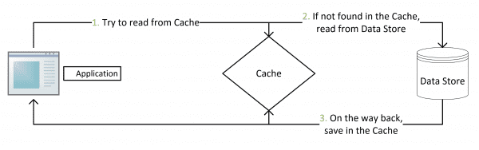
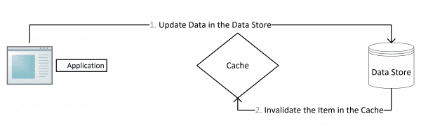

# Cache Patterns

缓存模式

---

References

- [缓存更新套路](https://coolshell.cn/articles/17416.html)
- [AxiaEpoch 2021-08-27 21:23 的微博](https://weibo.com/1671040287/KvqWpmgqd)

## Intro

> ~~先删除缓存, 然后再更新数据库, 而后续的操作会把数据再装载的缓存中.~~

这个是逻辑是错误的. 因为两个并发操作, 一个是更新操作, 另一个是查询操作:

1. 更新操作删除缓存后
1. 查询操作没有命中缓存
1. 先把老数据读出来后放到缓存中
1. 然后更新操作更新了数据库

于是, 在缓存中的数据还是老的, 导致缓存中的数据是脏的, 而且在 expire 或 evict 之前该数据将一直脏下去.

先不讨论更新缓存和更新数据这两个操作应该是一个事务的事, 或是事务失败的可能性，
我们先假设更新数据库和更新缓存都可以成功的情况( 先保证成功情况的代码逻辑的正确性 ) .

更新缓存的的 Design Pattern 有 4 种:

- Cache Aside
- Read Through
- Write Through
- Write behind caching

## Cache Aside

- 失效: 应用程序先从cache取数据，没有得到，则从数据库中取数据，成功后，放到缓存中。
- 命中: 应用程序从cache中取数据，取到后返回。
- 更新: 先把数据存到数据库中，成功后，再让缓存失效。

注意，**先更新数据库，成功后，让缓存失效。**
那么，这样是否可以避免前文提到的那个问题呢？可以推演一下。

一个是查询操作，一个是更新操作的并发；
首先，没有了删除 cache 数据的操作了，而是先更新了数据库中的数据；
此时，缓存依然有效，所以，并发的查询操作拿的是没有更新的数据；
但是，更新操作马上让缓存的失效了，后续的查询操作再把数据从数据库中拉出来。
而不会像前文提到的那个逻辑产生的问题（导致后续的查询操作一直都在取老的数据）。

这是标准的 design pattern，包括 Facebook 的论文《
[Scaling Memcache at Facebook](https://www.usenix.org/system/files/conference/nsdi13/nsdi13-final170_update.pdf)
》也使用了这个策略。

为什么不是写完数据库后更新缓存？
你可以看一下 Quora 上的这个问答《
[Why does Facebook use delete to remove the key-value pair in Memcached instead of updating the Memcached during write request to the backend?](https://www.quora.com/Why-does-Facebook-use-delete-to-remove-the-key-value-pair-in-Memcached-instead-of-updating-the-Memcached-during-write-request-to-the-backend)
》，主要是怕两个并发的写操作导致脏数据。

是不是 Cache Aside 这个就不会有并发问题了？不是的。
**比如，一个是读操作，但是没有命中缓存，然后就到数据库中取数据；**
**此时来了一个写操作，写完数据库后，让缓存失效；**
**然后，之前的那个读操作再把老的数据放进去，所以这时会造成脏数据。**

**但是，这个 case 理论上会出现；**
**不过，实际上出现的概率可能非常低。**
**因为这个条件需要发生在读缓存时缓存失效，而且并发着有一个写操作。**
**而实际上数据库的写操作会比读操作慢得多，而且还要锁表，**
**而读操作必需在写操作前进入数据库操作，而又要晚于写操作更新缓存，**
**所有的这些条件都具备的概率基本并不大。**

所以，正如 Quora 上的那个答案所说的，
**要么通过 2PC 或是 Paxos 协议保证一致性，**
**要么就是拼命的降低并发时脏数据的概率，**
**而 Facebook 使用了这个降低概率的玩法。**
**因为 2PC 太慢，而 Paxos 太复杂。**

当然，**最好还是为缓存设置上过期时间。**

## Read / Write Through

Cache Aside 套路中，应用代码需要维护两个数据存储：

- 缓存 Cache
- 数据库 Repository

所以，应用程序比较啰嗦。

而 Read/Write Through 套路是把更新数据库（Repository）的操作由缓存自己代理了，
所以，对于应用层来说，就简单很多了。

可以理解为，应用认为后端就是一个单一的存储，而 **存储自己维护自己的 Cache。**

### Read Through

### Write Through

## Write Behind Caching

## from 伍凯

概述:

缓存模式主要分为两种，一是Cache-aside，二是Cache-as-Sor，Sor是system of record的简称，简单来说就是数据存储，常见的就是数据库了。在Cache-as-Sor模式中，包含两种模式，一是Read-through，二是Write-through或Write-behind（也可以叫做Write-back），下面介绍下这几种模式。

一: Cache-aside

简单来说就是缓存可以看作是个独立的模块，可以认为缓存的操作是业务流程的一部分。
读流程:
从cahce读，如果cache miss，从Sor中读，然后写入cache，然后返回。
更新流程:
写入Sor，将cache失效。

二: Cache-as-SoR

简单来说是把缓存看作数据存储，业务流程中不会关心缓存的处理，缓存由数据存储逻辑来处理。

1. Read-through
    这个和Cache-aside的读流程一样，只不过这个逻辑放在数据存储层做。

2. Write-through
    写入缓存的时候，同时去更新后面真实的存储，成功后才返回。

3. Write-behind（也可以叫做Write-back）
    写入缓存之后即可返回，之后去异步更新后面真实的存储。这个模式的优势就是写入很快。

一般来说，使用上面几种模式，缓存加上过期时间（为了保证最终一致性），一些需要强一致的业务操作绕过缓存直接访问存储，就不会有太大问题。

但是，系统设计里充满了Trade-off，我们需要清晰的知道，我们是在什么东西上做了什么样的权衡。

下面说下这些模式在分布式系统中的一些场景中存在的问题:

一: Cache-aside模式

1. 这个模式要求Sor是强一致的，否则，写流程 将cache失效后，读流程 可能从Sor中读到旧数据写入到cache中。
2. 如果要求Sor是强一致的，根据分布式系统的CAP理论，Sor只能是CP的。那么这个时候问题就落到了数据存储层，存储层的CP怎么做。

二: Cache-as-SoR

1. Read-through
    这个和Cache-aside所面临的问题一样。

2. Write-through
    写缓存，写真实的存储，这是两步操作，这意味什么，分布式事务。

3. Write-behind（也可以叫做Write-back）
    这个就更复杂一些了，比如如何保证数据不丢，如何保证CP等等

Write-through和Write-behind还涉及到一个问题是，如果修改的是cache中的一小部分数据，这个时候cache miss的话采用什么策略，这里还有两个模式:

1. Write allocate (又叫fetch on write)
    先从存储里把数据读到缓存中，然后修改缓存，通常在Write-behind模式下使用。

2. No-write allocate (又叫write-no-allocate or write around)
    不管缓存，直接写存储，通常在Write-through模式下使用。
