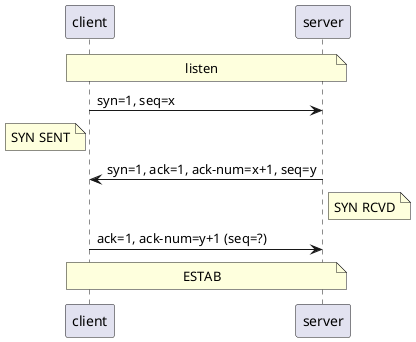

# TCP

## Features

- **面向连接、可靠** 的字节流服务
    - 可靠：使用校验和、确认和重传机制保证
- 按字节排序，确保数据顺序不变和非重复
- **滑动窗口** 机制进行 **流量控制**
- 动态改变 **窗口大小** 进行 **拥塞控制**

Notice

- 可靠：不保证对方一定接收到，只是保证尽可能传递给对方
    - 否则放弃重传，并中断连接

## Three-way Handshake

