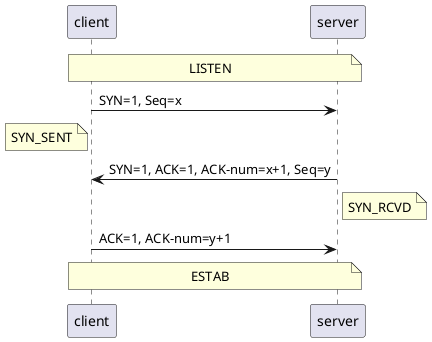
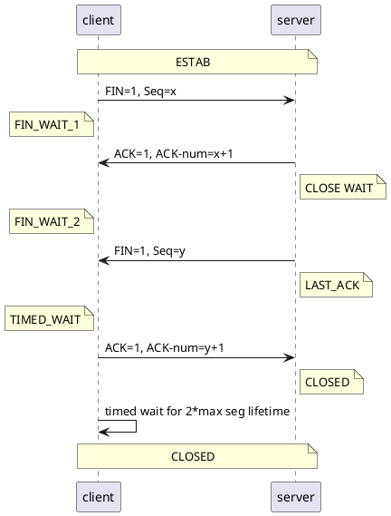

# TCP

References

- https://hit-alibaba.github.io/interview/basic/network/TCP.html

## Features

- **面向连接、可靠** 的字节流服务
    - 可靠：使用校验和、确认和重传机制保证
- 按字节排序，确保数据顺序不变和非重复
- **滑动窗口** 机制进行 **流量控制**
- 动态改变 **窗口大小** 进行 **拥塞控制**
    - 慢启动
    - 快速失败

Notice

- 可靠：不保证对方一定接收到，只是保证尽可能传递给对方
    - 否则放弃重传，并中断连接

## Three-way Handshake

Q & A

- 最后 client 返回给 server 的包就没有 seq 了么？感觉不是，得实验一下。

## Four-way Handshake

Notice

- max segment lifetime (MSL) : https://en.wikipedia.org/wiki/Maximum_segment_lifetime
    - 通常定位为 2min

## SYN 攻击

场景（典型 DoS/DDoS 攻击）

- 三次握手时，恶意客户端大量伪造不存在的 IP 只发送 SYN 请求
- 服务端不断尝试给客户端发 SYN-ACK 得不到返回，直到超时，都会占用未连接队列

防御方法

- 缩短 SYN Timeout
- 设置最大半连接数
- 过滤网关防护（未了解？）
- SYN Cookie（未了解？）

## TCP KeepAlive

场景

- 连接某一方可能宕机不存在了，但是另一方依然维护着连接（还没正常释放）
- 长时间保持连接浪费资源（大量半连接会影响服务）
- 所以发明 KeepAlive 机制
    - 定期向另一方发送探测包（收到 ACK 回复，认为连接还活着）
    - 如果多次没有收到 ACK 返回，则认为连接失效，可以释放相关资源

缺点

- 消耗额外的网络资源（用来发探测包和 ACK 回复）

特性

- 主流操作系统内核层面对此有支持
- 但是 KeepAlive 不保证连接真的还有效
    - CPU 忙死，导致用户进程已经无法处理连接了
    - 但是内核线程 KeepAlive 机制可能还认为连接有效
        - 例如 QQ 在应用层也额外实现了心跳机制

## Head-of-line blocking

> 队头阻塞

References

- http://www.blogjava.net/yongboy/archive/2015/05/07/424917.html

前提

- TCP 是保证数据按序到达

场景

- 接收缓冲区，假设只有 4 个包的空间，收到了 2、3、4 号包，但是就是没有收到 1 号包
    - 可能因为：乱序到达、丢失、超时……
- 这时，无法按序往上层交付，就阻塞在这了
    - 直到收到了 1 号包，再向上层交付，缓冲区才有空间接收新的数据

---

其它：交换机（switch）的队头阻塞

- 如果在输入输出处使用 FIFO 队列
- 一旦队头的包的目标端口正忙，没法接收，就会导致后续的包也无法被分发，导致阻塞

解决方法

- 只有输入使用缓存时，才会出现。
    - 如果 switch 带宽足够，就没必要，使用输入缓存
    - 那么所有缓存都在输出处被处理，避免了队头阻塞
    - 这种设计在中小型规模的以太网交换机中很常见

### Selective Retransmission

选择重传

- 较弱的策略为 Go Back N（详见《计算机网络》自顶向下的方法）

## Others

### TCP Fast Open

场景

- client 发送 SYN + Cookie
- server 校验成功，就返回 SYN-ACK + Cookie
- 关键点：server 不等待 client 的 ACK 就开始传输数据了！

条件

- c/s 两端的内核都能支持该 TCP 特性
