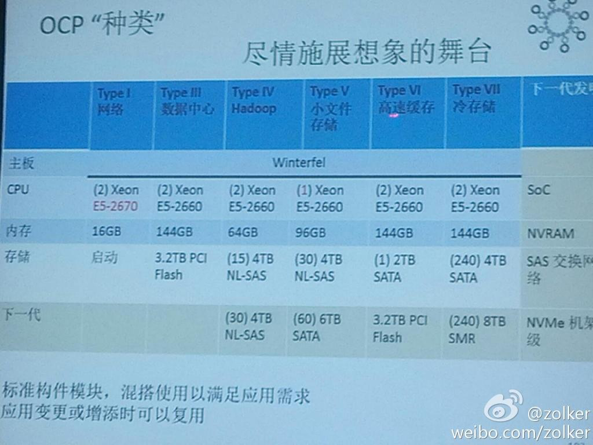

# Tech Details (draft)

替换 Redis 实例

用域名调用 Redis 实例，
在 DNS 上修改域名对应的 IP 即可。

---

阅读数的实现

阅读数完全存在 Redis 里，
用线性拟合的策略来寸

用 Redis 自带内含的功能去实现

1~100  每次写 +1
100~1,000 每 5 次要写读数，随机丢弃其中 4 次，然后命中的那一次 + 5
1,000~10,000 … 依次类推，类似的算法，避免过多的写法。

现在希望变成可以完全每次 +1 的模式。
例如从 8 台机器，散点哈希到 128 台实例上，以分担写压力，看能不能行

---

发微博 用队列

- MPS 发推送 用队列
- mid 用统一的发号器，避免 mid 重复。
- 微博 用多层的 缓存来顶住压力！
- 找文章来看！(微博技术新兵训练营)

发号器：生成唯一的 ID 号

- Twitter 的 雪花算法 (snowflake)

服务机型要标准化

* Facebook 只有六种标准机型
* Google 只有十种标准机型

机型：（自己的猜想）

* 计算密集型（CPU型）
* 内存型（缓存性）
* IO型（存储型？硬盘型？）
* GPU型（显卡型）

FB 机型：OCP 六种
（OCP: Open Compute Project）

* 网络
* 数据中心
* Hadoop
* 小文件存储
* 高速缓存
* 冷存储

https://en.wikipedia.org/wiki/Open_Compute_Project

（肖鹏截图提供）

---
技术细节速记

头部用户分级 C1、C2、C3

统计 30 天内发的微博的总阅读数
C1 是 1000W 阅读数
C2 是 100W
C3 是 10W

每天发博数

按照经验来看的话，大概是 10 ~ 50 条

---

cache value

protocol buffer 序列化/反序列化
quicklz 解压

加起来不到1ms

Redis 内存碎片，重启
Memcached 钙化

---

feed cache

3 days max 50 条
30 days 1 month max 200 条

---

MAPI QPS 峰值

12:30 午高峰 40w
22:30 晚高峰 55w

（中午）鹿晗公开女友事件峰值 118w

---

微博 feed QPS

日常 1w+
春节 2.4~2.5w (?)

---

微博 评论 QPS

日常 2w+（忘了）
春节 ????

---

替换 Redis 实例

用域名调用 Redis 实例，
在 DNS 上修改域名对应的 IP 即可。

## Tech Talk

缓存问题

微博是把几乎所有用户的用户列表都存到缓存的吗？大概缓存存了多少用户（大概占比）？
毕竟要保持db穿透小于2%那样子？（db最好能扛多少百分比的穿透，其实还是看实际性能和数据表的吧，估计还是得压测…）

答：99%
“db最好能扛多少百分比的穿透，其实还是看实际性能和数据表的吧，估计还是得压测…”，
跟百分比没关系，跟绝对量有关系，假设总请求量是A，DB能扛B，命中率就是1-B/A。
不过也得考虑成本，端口内存大小，端口数量等其他因素。

---

刚才是说，缓存命中率99%，穿透率1%。还是说，缓存了几乎99%用户的关注数据（感觉因该都要，最好都存上？）

答：“最好都能存”，没有最好的事 [笑哭]
访问有冷热区分，都放内存，性能没问题，成本有问题。

---

不存长尾数据的话，也得要数据支撑[表情] 不然自己人爬一下数据就穿透了[表情]

答：这个得了解业务了，每个业务访问模型不一定一样。
不过可以用代数啊 [笑哭]

---

感觉得找一个excel之外，也能公式联动的软件来算这些数了

答：类似这种搞一个

---

我用的 Numi https://numi.io/

答：嗯，用代数就好了，别用算数 [笑哭]
完了往里面代数就好了，
毕竟不同的业务，具体数值不太一样
有的业务，40%命中率就已经很不错了[笑哭]

---

感觉是因为量太大，缓存结构复杂了？

答：最好设计出来的，越简单越好

---

网上会看 redis-benchmark 和 mc 的 benchmark，
实际问 feed 组的舍友，说是监控的 get/set 操作大概要 2~3ms，
不知道是监控的精确度问题，还是实际上是这样。

毕竟跟官方 benchmark 的对比应该差距蛮大的，
benchmark 1ms redis 都能有 70+ ，
mc 1ms 也能处理个 50 的样子，
实际上一旦分布式，加上网络，确实就要 2~3ms 了

答：“监控get/set是2～3ms” — 是这个数，包含网络开销，分布式。只是平均数。
这个是client端采样，redis 只从 server 端看，确实能到每秒6w多qps，
这个值一般用来评估资源容量，性能不看这个。

---