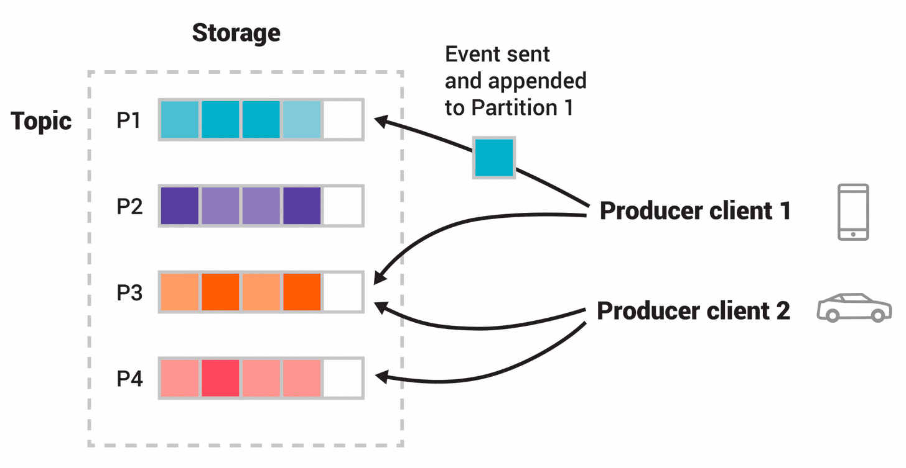

# kafka

> **Apache Kafka is an open-source distributed event streaming platform** used by thousands of companies for high-performance data pipelines, streaming analytics, data integration, and mission-critical applications.

References

- APACHE KAFKA : https://kafka.apache.org/
    - Intro : https://kafka.apache.org/intro
    - Quickstart : https://kafka.apache.org/quickstart

## Intro

Core Capabilities

- **High Throughput**
- **Scalable**
- **Permanent Storage**
- **High Available**

Ecosystem

- **Built-in Strem Processing**
    - Process streams of events with joins, aggregations, filters, transformations, and more, using event-time and **exactly-once processing**.
- Connect to almost anything
- Client Libraries
- Large Ecosystem Open Source Tools

Reference

- Intro - Apache kafka : https://kafka.apache.org/intro

### Description

Apache Kafka is an **event streaming platform**. What does that mean?

Kafka combines three key capabilities so you can implement your use cases for event streaming end-to-end with a single battle-tested solution:

- To **publish (write)** and **subscribe to (read)** streams of events, including continuous import/export of your data from other systems.
- To **store** streams of events durably and reliably for as long as you want.
- To **process** streams of events as they occur or retrospectively _( 回顾地  )_ .

### Main Concepts

#### Event

Main Concepts and Terminology

- An event records the fact that "something happened" in the world or in your business.
- It is also called record or message in the documentation.
- When you read or write data to Kafka, you do this in the form of events.
- Conceptually, **an event has a key, value, timestamp, and optional metadata headers.**

_Here's an example event:_

- _Event **key** : "Alice"_
- _Event **value** : "Made a payment of $200 to Bob"_
- _Event **timestamp** : "Jun. 25, 2020 at 2:06 p.m."_

#### Producers

<u>**Producers**</u> are those client applications that publish (write) events to Kafka, and <u>**consumers**</u> are those that subscribe to (read and process) these events.

- _In Kafka, producers and consumers are fully decoupled and agnostic of each other, which is a key design element to achieve the high scalability that Kafka is known for._
- For example, **producers never need to wait for consumers.**
- Kafka provides various guarantees such as the ability to **process events exactly-once.**
    - _( icehe : 对消息 "有且只消费一次" 的特性存疑, 需要了解具体实现方式 )_

#### Topics

Events are organized and durably stored in <u>**topics**</u>.

- Very simplified, a topic is similar to a folder in a filesystem, and the events are the files in that folder.
- An example topic name could be "payments".
- **Topics in Kafka are always multi-producer and multi-subscriber :**
    - a topic can have zero, one, or many producers that write events to it, as well as zero, one, or many consumers that subscribe to these events.
- **Events in a topic can be read as often as needed** -- unlike traditional messaging systems, **events are not deleted after consumption.**
    - Instead, you **define for how long Kafka should retain your events through a per-topic configuration setting, after which old events will be discarded.**
    - Kafka's performance is effectively constant with respect to data size, so storing data for a long time is perfectly fine.

#### Partitioned

Topics are <u>**partitioned**</u>, meaning **a topic is spread over a number of "buckets" located on different Kafka brokers.**

- This distributed placement of your data is very important for scalability because it allows client applications to both read and write the data from/to many brokers at the same time.
- When a new event is published to a topic, it is actually appended to one of the topic's partitions.
- Events with the same event key ( e.g., a customer or vehicle ID ) are written to the same partition, and Kafka guarantees that any consumer of a given topic-partition will always read that partition's events in exactly the same order as they were written.

- The Figure above : This example topic has four partitions P1 ~ P4.
    - Two different producer clients are publishing, independently from each other, new events to the topic by writing events over the network to the topic's partitions.
    - Events with the same key ( denoted by their color in the figure ) are written to the same partition.
    - Note that **both producers can write to the same partition if appropriate.**

#### Replicated

To make your data fault-tolerant and highly-available, every topic can be <u>**replicated**</u>, even across geo-regions or datacenters,

- so that there are always multiple brokers that have a copy of the data just in case things go wrong, you want to do maintenance on the brokers, and so on.
- A **common production setting is a replication factor of 3**,
    - i.e., there will always be three copies of your data.
- This **replication is performed at the level of topic-partitions.**

### Design

This primer should be sufficient for an introduction.

- The [Design](https://kafka.apache.org/documentation/#design) section of the documentation explains Kafka's various concepts in full detail, if you are interested.

## Use Cases

Reference

- Use Cases - Apache kafka : https://kafka.apache.org/uses

### Messaging

消息队列

- Kafka works well as a replacement for a more traditional message broker.
    - Message brokers are used for a variety of reasons (to decouple processing from data producers, to buffer unprocessed messages, etc).
    - In comparison to most messaging systems **Kafka has better throughput**, **built-in partitioning**, **replication**, and **fault-tolerance** which makes it a good solution for large scale message processing applications.
- In our experience **messaging uses are often comparatively low-throughput, but may require low end-to-end latency and often depend on the strong durability guarantees** Kafka provides.
- _In this domain Kafka is comparable to traditional messaging systems such as [ActiveMQ](http://activemq.apache.org/) or [RabbitMQ](https://www.rabbitmq.com/)._

### Website Activity Tracking

网页(用户)活动跟踪

- The original use case for Kafka was to be able to **rebuild a user activity tracking pipeline as a set of real-time publish-subscribe feeds.**
    - This means site activity ( page views, searches, or other actions users may take ) is published to central topics with one topic per activity type.
    - These feeds are available for subscription for a range of use cases including real-time processing, real-time monitoring, and loading into Hadoop or offline data warehousing systems for offline processing and reporting.
- **Activity tracking is often very high volume** as many activity messages are generated for each user page view.

### Metrics

软件度量

- Kafka is often used for **operational monitoring data** _( 运维监控数据 )_ .
    - This involves aggregating statistics from distributed applications to produce centralized feeds of operational data.

### Log Aggregation

- Many people use Kafka as a **replacement for a log aggregation solution**.
    - Log aggregation typically collects physical log files off servers and puts them in a central place ( a file server or HDFS perhaps ) for processing.
    - Kafka abstracts away the details of files and gives a cleaner abstraction of log or event data as a stream of messages.
    - This allows for lower-latency processing and easier support for multiple data sources and distributed data consumption.
    - **In comparison to log-centric systems like Scribe or Flume, Kafka offers equally good performance, stronger durability guarantees due to replication, and much lower end-to-end latency.**

### Stream Processing

- Many users of Kafka process data in processing pipelines consisting of multiple stages, where raw input data is consumed from Kafka topics and then aggregated, enriched, or otherwise transformed into new topics for further consumption or follow-up processing.
    - For example, a processing pipeline for recommending news articles might crawl article content from RSS feeds and publish it to an "articles" topic;
        - further processing might normalize or deduplicate this content and publish the cleansed article content to a new topic;
        - a final processing stage might attempt to recommend this content to users.
    - Such processing pipelines create graphs of real-time data flows based on the individual topics.
    - Starting in 0.10.0.0, a light-weight but powerful stream processing library called [**Kafka Streams**](https://kafka.apache.org/documentation/streams/) is available in Apache Kafka to perform such data processing as described above.
    - Apart from Kafka Streams, alternative open source stream processing tools include [Apache Storm](https://storm.apache.org/) and [Apache Samza](http://samza.apache.org/).

### Event Sourcing

- Event sourcing is **a style of application design where state changes are logged as a time-ordered sequence of records.**
    - Kafka's support for very large stored log data makes it an excellent backend for an application built in this style.

### Commit Log

- Kafka can serve as a kind of **external commit-log for a distributed system**.
    - **The log helps replicate data between nodes and acts as a re-syncing mechanism for failed nodes to restore their data.**
    - The [log compaction](https://kafka.apache.org/documentation.html#compaction) feature in Kafka helps support this usage.
    - In this usage Kafka is similar to [Apache BookKeeper](https://bookkeeper.apache.org/) project.

## Design

### Motivation

- We designed Kafka to **be able to act as a unified platform for handling all the real-time data** feeds a large company might have.
    - To do this we had to think through a fairly broad set of use cases.
- It would have to have **high-throughput to support high volume event streams** such as real-time log aggregation.
- It would need to deal gracefully with large data backlogs to be able to support periodic data loads from offline systems.
- It also meant the system would have to handle low-latency delivery to handle more traditional messaging use-cases.
- We wanted to support partitioned, distributed, real-time processing of these feeds to create new, derived feeds.
    - This motivated our partitioning and consumer model.
- Finally in cases where the stream is fed into other data systems for serving, we knew the system would have to be able to guarantee fault-tolerance in the presence of machine failures.
- Supporting these uses led us to a design with a number of unique elements, **more akin to a database log than a traditional messaging system**.
    - We will outline some elements of the design in the following sections.

### Persistence

#### Don't Fear the Filesystem

- **Kafka relies heavily on the filesystem for storing and caching messages.**
    - There is a general perception that "disks are slow" which makes people skeptical that a persistent structure can offer competitive performance.
    - In fact disks are both much slower and much faster than people expect depending on how they are used;
        - and **a properly _( 正确地 )_ designed disk structure can often be as fast as the network**.
- **The key fact about disk performance is that the <u>throughput of hard drives has been diverging _( 相异 )_ from the latency of a disk seek</u> for the last decade.**
    - As a result the performance of linear writes on a JBOD configuration with six 7200rpm SATA RAID-5 array is about 600MB/sec but the performance of random writes is only about 100k/sec -- a difference of over 6000X.
    - These linear reads and writes are the most predictable of all usage patterns, and are heavily optimized by the operating system.
    - A modern operating system provides read-ahead and write-behind techniques that prefetch data in large block multiples and group smaller logical writes into large physical writes.
    - A further discussion of this issue can be found in this ACM Queue article;
        - they **actually find that sequential disk access can in some cases be faster than random memory access!**
- To compensate for this performance divergence, **modern operating systems have become increasingly aggressive in their use of main memory for disk caching.**
    - A modern OS will happily divert all free memory to disk caching with little performance penalty when the memory is reclaimed _( 回收利用 )_ .
    - All disk reads and writes will go through this unified cache.
    - This feature cannot easily be turned off without using direct I/O, so even if a process maintains an in-process cache of the data, this data will likely be duplicated in OS pagecache, effectively storing everything twice.
- Furthermore, we are building on top of the JVM, and anyone who has spent any time with Java memory usage knows two things:
    - 1\. The memory overhead of objects is very high, often doubling the size of the data stored (or worse).
    - 2\. Java garbage collection becomes increasingly fiddly and slow as the in-heap data increases.
- As a result of these factors **using the filesystem and relying on pagecache is superior to maintaining an in-memory cache or other structure** -- we at least double the available cache by having automatic access to all free memory, and likely double again by storing a compact byte structure rather than individual objects.
    - Doing so will result in a cache of up to 28~30GB on a 32GB machine without GC penalties.
    - Furthermore, this cache will stay warm even if the service is restarted, whereas the in-process cache will need to be rebuilt in memory (which for a 10GB cache may take 10 minutes) or else it will need to start with a completely cold cache (which likely means terrible initial performance).
    - This also greatly simplifies the code as all logic for maintaining coherency between the cache and filesystem is now in the OS, which tends to do so more efficiently and more correctly than one-off _( 一次性的 )_ in-process attempts.
    - If your disk usage favors linear reads then read-ahead is effectively pre-populating this cache with useful data on each disk read.
- This suggests a design which is very simple :
    - **rather than maintain as much as possible in-memory and flush it all out to the filesystem in a panic when we run out of space, we invert that.**
    - **All data is immediately written to a persistent log on the filesystem without necessarily flushing to disk.**
    - In effect this just means that it is transferred into the kernel's pagecache.
- This style of **pagecache-centric design** is described in an [article](http://varnish-cache.org/docs/trunk/phk/notes.html) on the design of Varnish here (along with a healthy dose of arrogance).

#### Constant Time Suffices

- The persistent data structure used in messaging systems are often a per-consumer queue with an associated BTree or other general-purpose random access data structures to maintain metadata about messages.
    - BTrees are the most versatile _( 多用途的, 多功能的 )_ data structure available, and make it possible to support a wide variety of transactional and non-transactional semantics in the messaging system.
    - They do come with a fairly high cost, though : Btree operations are O(log N).
    - Normally O(log N) is considered essentially equivalent to constant time, but this is not true for disk operations.
    - Disk seeks come at 10 ms a pop, and each disk can do only one seek at a time so parallelism is limited.
    - Hence even a handful of disk seeks leads to very high overhead.
    - Since storage systems mix very fast cached operations with very slow physical disk operations, the observed performance of tree structures is often superlinear as data increases with fixed cache -- i.e. doubling your data makes things much worse than twice as slow.
- Intuitively _( 凭直觉地 )_ a persistent queue could be built on simple reads and appends to files as is commonly the case with logging solutions.
    - This structure has the advantage that all operations are O(1) and reads do not block writes or each other.
    - **This has obvious performance advantages since the performance is completely decoupled from the data size -- one server can now take full advantage of a number of cheap, low-rotational speed 1+TB SATA drives.**
    - Though they have poor seek performance, these drives have acceptable performance for large reads and writes and come at 1/3 the price and 3x the capacity.
- Having access to virtually unlimited disk space without any performance penalty means that we can provide some features not usually found in a messaging system.
    - For example, in Kafka, instead of attempting to delete messages as soon as they are consumed, we can retain messages for a relatively long period (say a week).
    - This leads to a great deal of flexibility for consumers, as we will describe.

_suffice : vi. 足够, 有能力_

### Efficiency

- We have put significant effort into efficiency.
    - One of our primary use cases is handling web activity data, which is very high volume : each page view may generate dozens of writes.
    - Furthermore, we assume each message published is read by at least one consumer (often many), hence we strive to make consumption as cheap as possible.
- We have also found, from experience building and running a number of similar systems, that efficiency is a key to effective multi-tenant _( 多租户 )_ operations.
    - If the downstream infrastructure service can easily become a bottleneck due to a small bump in usage by the application, such small changes will often create problems.
    - By being very fast we help ensure that the application will tip-over _( 翻倒 )_ under load before the infrastructure.
    - This is particularly important when trying to run a centralized service that supports dozens or hundreds of applications on a centralized cluster as changes in usage patterns are a near-daily occurrence.
- We discussed disk efficiency in the previous section.
    - Once poor disk access patterns have been eliminated, there are two common causes of inefficiency in this type of system :
        - too many small I/O operations, and
        - excessive **byte copying**.
- The small I/O problem happens both between the client and the server and in the server's own persistent operations.
- To avoid this, our **protocol is built around a "message set" abstraction that naturally groups messages together.**
    - This **allows network requests to group messages together and amortize _( 分期偿还 )_ the overhead of the network roundtrip rather than sending a single message at a time.**
    - The server in turn appends chunks of messages to its log in one go, and the consumer fetches large linear chunks at a time.
- This simple optimization produces orders of magnitude _( 数个数量级的 )_ speed up.
    - **Batching leads to larger network packets, larger sequential disk operations, contiguous memory blocks, and so on, all of which allows Kafka to turn a bursty stream of random message writes into linear writes that flow to the consumers.**
- The other inefficiency is in byte copying.
    - At low message rates this is not an issue, but under load the impact is significant.
    - To avoid this we **employ a standardized binary message format that is shared by the producer, the broker, and the consumer (so data chunks can be transferred without modification between them).**
- The message log maintained by the broker is itself just a directory of files, each populated by a sequence of message sets that have been written to disk in the same format used by the producer and consumer.
    - Maintaining this common format allows optimization of the most important operation: network transfer of persistent log chunks.
    - **Modern unix operating systems offer a highly optimized code path for transferring data out of pagecache to a socket;**
        - in Linux this is done with the [sendfile system call](https://man7.org/linux/man-pages/man2/sendfile.2.html).
- To understand the impact of sendfile, it is important to understand the **common data path for transfer of data from file to socket** :
    - 1\. The **operating system reads data from the disk into pagecache in kernel space**
    - 2\. The **application reads the data from kernel space into a user-space buffer**
    - 3\. The **application writes the data back into kernel space into a socket buffer**
    - 4\. The **operating system copies the data from the socket buffer to the NIC buffer** where it is sent over the network
        - _NIC : Network Information Center 网络信息中心_
- This is clearly inefficient, there are four copies and two system calls.
    - **Using `sendfile`, this re-copying is avoided by allowing the OS to send the data from pagecache to the network directly.**
    - So in this optimized path, only the final copy to the NIC buffer is needed.
- We expect a common use case to be multiple consumers on a topic.
    - **Using the zero-copy optimization above, data is copied into pagecache exactly once and reused on each consumption instead of being stored in memory and copied out to user-space every time it is read.**
    - This **allows messages to be consumed at a rate that approaches the limit of the network connection.**
- This combination of pagecache and `sendfile` means that on a Kafka cluster where the consumers are mostly caught up you will see no read activity on the disks whatsoever _( 无论什么 )_ as they will be serving data entirely from cache.
- For more background on the `sendfile` and zero-copy support in Java, see this [article](https://developer.ibm.com/articles/j-zerocopy/).
    - _( icehe : 是一篇很棒的文章 )_

#### End-to-end Batch Compression

- In some cases the bottleneck is actually not CPU or disk but network bandwidth.
    - This is particularly true for a data pipeline that needs to send messages between data centers over a wide-area network.
    - Of course, the user can always compress its messages one at a time without any support needed from Kafka, but this can lead to very poor compression ratios as much of the redundancy is due to repetition between messages of the same type
        - (e.g. field names in JSON or user agents in web logs or common string values).
    - Efficient compression requires compressing multiple messages together rather than compressing each message individually.
- Kafka supports this with an efficient batching format.
    - **A batch of messages can be clumped together compressed and sent to the server in this form.**
    - This batch of messages will be written in compressed form and will remain compressed in the log and will only be decompressed by the consumer.
- Kafka supports GZIP, Snappy, LZ4 and ZStandard compression protocols.
    - More details on compression can be found [here](https://cwiki.apache.org/confluence/display/KAFKA/Compression).

### The Producer

#### Load Balance

- The **producer sends data directly to the broker that is the leader for the partition without any intervening routing tier.**
    - To help the producer do this **all Kafka nodes can answer a request for metadata about which servers are alive and where the leaders for the partitions of a topic are at any given time to allow the producer to appropriately direct its requests.**
- The client controls which partition it publishes messages to.
    - This can be done at random, implementing a kind of random load balancing, or it can be done by some semantic partitioning function.
    - We expose the interface for semantic partitioning by allowing the user to specify a key to partition by and using this to hash to a partition (there is also an option to override the partition function if need be).
    - For example if the key chosen was a user id then all data for a given user would be sent to the same partition.
    - This in turn will allow consumers to make locality assumptions about their consumption.
    - This style of partitioning is explicitly designed to allow locality-sensitive processing in consumers.

#### Asynchronous send

- Batching is one of the big drivers of efficiency, and to **enable batching the Kafka producer will attempt to accumulate data in memory and to send out larger batches in a single request.**
    - The **batching can be configured to accumulate no more than a fixed number of messages and to wait no longer than some fixed latency bound (say <u>64k or 10 ms</u>).**
    - This allows the accumulation of more bytes to send, and few larger I/O operations on the servers.
    - This buffering is configurable and gives a mechanism to trade off a small amount of additional latency for better throughput.
- Details on [configuration](https://kafka.apache.org/documentation/#producerconfigs) and the [api](http://kafka.apache.org/082/javadoc/index.html?org/apache/kafka/clients/producer/KafkaProducer.html) for the producer can be found elsewhere in the documentation.

### Consumer

- The Kafka consumer works by issuing "fetch" requests to the brokers leading the partitions it wants to consume.
    - The consumer specifies its offset in the log with each request and receives back a chunk of log beginning from that position.
    - The consumer thus has significant control over this position and can rewind it to re-consume data if need be.

#### Push vs. Pull

An initial question we considered is whether consumers should pull data from brokers or brokers should push data to the consumer. In this respect Kafka follows a more traditional design, shared by most messaging systems, where data is pushed to the broker from the producer and pulled from the broker by the consumer. Some logging-centric systems, such as Scribe and Apache Flume, follow a very different push-based path where data is pushed downstream. There are pros and cons to both approaches. However, a push-based system has difficulty dealing with diverse consumers as the broker controls the rate at which data is transferred. The goal is generally for the consumer to be able to consume at the maximum possible rate; unfortunately, in a push system this means the consumer tends to be overwhelmed when its rate of consumption falls below the rate of production (a denial of service attack, in essence). A pull-based system has the nicer property that the consumer simply falls behind and catches up when it can. This can be mitigated with some kind of backoff protocol by which the consumer can indicate it is overwhelmed, but getting the rate of transfer to fully utilize (but never over-utilize) the consumer is trickier than it seems. Previous attempts at building systems in this fashion led us to go with a more traditional pull model.

Another advantage of a pull-based system is that it lends itself to aggressive batching of data sent to the consumer. A push-based system must choose to either send a request immediately or accumulate more data and then send it later without knowledge of whether the downstream consumer will be able to immediately process it. If tuned for low latency, this will result in sending a single message at a time only for the transfer to end up being buffered anyway, which is wasteful. A pull-based design fixes this as the consumer always pulls all available messages after its current position in the log (or up to some configurable max size). So one gets optimal batching without introducing unnecessary latency.

The deficiency of a naive pull-based system is that if the broker has no data the consumer may end up polling in a tight loop, effectively busy-waiting for data to arrive. To avoid this we have parameters in our pull request that allow the consumer request to block in a "long poll" waiting until data arrives (and optionally waiting until a given number of bytes is available to ensure large transfer sizes).

You could imagine other possible designs which would be only pull, end-to-end. The producer would locally write to a local log, and brokers would pull from that with consumers pulling from them. A similar type of "store-and-forward" producer is often proposed. This is intriguing but we felt not very suitable for our target use cases which have thousands of producers. Our experience running persistent data systems at scale led us to feel that involving thousands of disks in the system across many applications would not actually make things more reliable and would be a nightmare to operate. And in practice we have found that we can run a pipeline with strong SLAs at large scale without a need for producer persistence.

#### Consumer Position

Keeping track of what has been consumed is, surprisingly, one of the key performance points of a messaging system.
Most messaging systems keep metadata about what messages have been consumed on the broker. That is, as a message is handed out to a consumer, the broker either records that fact locally immediately or it may wait for acknowledgement from the consumer. This is a fairly intuitive choice, and indeed for a single machine server it is not clear where else this state could go. Since the data structures used for storage in many messaging systems scale poorly, this is also a pragmatic choice--since the broker knows what is consumed it can immediately delete it, keeping the data size small.

What is perhaps not obvious is that getting the broker and consumer to come into agreement about what has been consumed is not a trivial problem. If the broker records a message as consumed immediately every time it is handed out over the network, then if the consumer fails to process the message (say because it crashes or the request times out or whatever) that message will be lost. To solve this problem, many messaging systems add an acknowledgement feature which means that messages are only marked as sent not consumed when they are sent; the broker waits for a specific acknowledgement from the consumer to record the message as consumed. This strategy fixes the problem of losing messages, but creates new problems. First of all, if the consumer processes the message but fails before it can send an acknowledgement then the message will be consumed twice. The second problem is around performance, now the broker must keep multiple states about every single message (first to lock it so it is not given out a second time, and then to mark it as permanently consumed so that it can be removed). Tricky problems must be dealt with, like what to do with messages that are sent but never acknowledged.

Kafka handles this differently. Our topic is divided into a set of totally ordered partitions, each of which is consumed by exactly one consumer within each subscribing consumer group at any given time. This means that the position of a consumer in each partition is just a single integer, the offset of the next message to consume. This makes the state about what has been consumed very small, just one number for each partition. This state can be periodically checkpointed. This makes the equivalent of message acknowledgements very cheap.

There is a side benefit of this decision. A consumer can deliberately rewind back to an old offset and re-consume data. This violates the common contract of a queue, but turns out to be an essential feature for many consumers. For example, if the consumer code has a bug and is discovered after some messages are consumed, the consumer can re-consume those messages once the bug is fixed.

#### Offline Data Load

- Scalable persistence allows for the possibility of consumers that only periodically consume such as batch data loads that periodically bulk-load data into an offline system such as Hadoop or a relational data warehouse.
    - In the case of Hadoop we parallelize the data load by splitting the load over individual map tasks, one for each node/topic/partition combination, allowing full parallelism in the loading.
    - Hadoop provides the task management, and tasks which fail can restart without danger of duplicate data—they simply restart from their original position.

#### Static Membership

Static membership aims to improve the availability of stream applications, consumer groups and other applications built on top of the group rebalance protocol. The rebalance protocol relies on the group coordinator to allocate entity ids to group members. These generated ids are ephemeral and will change when members restart and rejoin. For consumer based apps, this "dynamic membership" can cause a large percentage of tasks re-assigned to different instances during administrative operations such as code deploys, configuration updates and periodic restarts. For large state applications, shuffled tasks need a long time to recover their local states before processing and cause applications to be partially or entirely unavailable. Motivated by this observation, Kafka’s group management protocol allows group members to provide persistent entity ids. Group membership remains unchanged based on those ids, thus no rebalance will be triggered.
If you want to use static membership,

Upgrade both broker cluster and client apps to 2.3 or beyond, and also make sure the upgraded brokers are using inter.broker.protocol.version of 2.3 or beyond as well.
Set the config ConsumerConfig#GROUP_INSTANCE_ID_CONFIG to a unique value for each consumer instance under one group.
For Kafka Streams applications, it is sufficient to set a unique ConsumerConfig#GROUP_INSTANCE_ID_CONFIG per KafkaStreams instance, independent of the number of used threads for an instance.
If your broker is on an older version than 2.3, but you choose to set ConsumerConfig#GROUP_INSTANCE_ID_CONFIG on the client side, the application will detect the broker version and then throws an UnsupportedException. If you accidentally configure duplicate ids for different instances, a fencing mechanism on broker side will inform your duplicate client to shutdown immediately by triggering a org.apache.kafka.common.errors.FencedInstanceIdException. For more details, see [KIP-345](https://cwiki.apache.org/confluence/display/KAFKA/KIP-345%3A+Introduce+static+membership+protocol+to+reduce+consumer+rebalances)

### Message Delivery Semantics

Now that we understand a little about how producers and consumers work, let's discuss the semantic guarantees Kafka provides between producer and consumer. Clearly there are multiple possible message delivery guarantees that could be provided:

At most once—Messages may be lost but are never redelivered.
At least once—Messages are never lost but may be redelivered.
Exactly once—this is what people actually want, each message is delivered once and only once.
It's worth noting that this breaks down into two problems: the durability guarantees for publishing a message and the guarantees when consuming a message.
Many systems claim to provide "exactly once" delivery semantics, but it is important to read the fine print, most of these claims are misleading (i.e. they don't translate to the case where consumers or producers can fail, cases where there are multiple consumer processes, or cases where data written to disk can be lost).

Kafka's semantics are straight-forward. When publishing a message we have a notion of the message being "committed" to the log. Once a published message is committed it will not be lost as long as one broker that replicates the partition to which this message was written remains "alive". The definition of committed message, alive partition as well as a description of which types of failures we attempt to handle will be described in more detail in the next section. For now let's assume a perfect, lossless broker and try to understand the guarantees to the producer and consumer. If a producer attempts to publish a message and experiences a network error it cannot be sure if this error happened before or after the message was committed. This is similar to the semantics of inserting into a database table with an autogenerated key.

Prior to 0.11.0.0, if a producer failed to receive a response indicating that a message was committed, it had little choice but to resend the message. This provides at-least-once delivery semantics since the message may be written to the log again during resending if the original request had in fact succeeded. Since 0.11.0.0, the Kafka producer also supports an idempotent delivery option which guarantees that resending will not result in duplicate entries in the log. To achieve this, the broker assigns each producer an ID and deduplicates messages using a sequence number that is sent by the producer along with every message. Also beginning with 0.11.0.0, the producer supports the ability to send messages to multiple topic partitions using transaction-like semantics: i.e. either all messages are successfully written or none of them are. The main use case for this is exactly-once processing between Kafka topics (described below).

Not all use cases require such strong guarantees. For uses which are latency sensitive we allow the producer to specify the durability level it desires. If the producer specifies that it wants to wait on the message being committed this can take on the order of 10 ms. However the producer can also specify that it wants to perform the send completely asynchronously or that it wants to wait only until the leader (but not necessarily the followers) have the message.

Now let's describe the semantics from the point-of-view of the consumer. All replicas have the exact same log with the same offsets. The consumer controls its position in this log. If the consumer never crashed it could just store this position in memory, but if the consumer fails and we want this topic partition to be taken over by another process the new process will need to choose an appropriate position from which to start processing. Let's say the consumer reads some messages -- it has several options for processing the messages and updating its position.

It can read the messages, then save its position in the log, and finally process the messages. In this case there is a possibility that the consumer process crashes after saving its position but before saving the output of its message processing. In this case the process that took over processing would start at the saved position even though a few messages prior to that position had not been processed. This corresponds to "at-most-once" semantics as in the case of a consumer failure messages may not be processed.
It can read the messages, process the messages, and finally save its position. In this case there is a possibility that the consumer process crashes after processing messages but before saving its position. In this case when the new process takes over the first few messages it receives will already have been processed. This corresponds to the "at-least-once" semantics in the case of consumer failure. In many cases messages have a primary key and so the updates are idempotent (receiving the same message twice just overwrites a record with another copy of itself).
So what about exactly once semantics (i.e. the thing you actually want)? When consuming from a Kafka topic and producing to another topic (as in a Kafka Streams application), we can leverage the new transactional producer capabilities in 0.11.0.0 that were mentioned above. The consumer's position is stored as a message in a topic, so we can write the offset to Kafka in the same transaction as the output topics receiving the processed data. If the transaction is aborted, the consumer's position will revert to its old value and the produced data on the output topics will not be visible to other consumers, depending on their "isolation level." In the default "read_uncommitted" isolation level, all messages are visible to consumers even if they were part of an aborted transaction, but in "read_committed," the consumer will only return messages from transactions which were committed (and any messages which were not part of a transaction).

When writing to an external system, the limitation is in the need to coordinate the consumer's position with what is actually stored as output. The classic way of achieving this would be to introduce a two-phase commit between the storage of the consumer position and the storage of the consumers output. But this can be handled more simply and generally by letting the consumer store its offset in the same place as its output. This is better because many of the output systems a consumer might want to write to will not support a two-phase commit. As an example of this, consider a Kafka Connect connector which populates data in HDFS along with the offsets of the data it reads so that it is guaranteed that either data and offsets are both updated or neither is. We follow similar patterns for many other data systems which require these stronger semantics and for which the messages do not have a primary key to allow for deduplication.

So effectively Kafka supports exactly-once delivery in Kafka Streams, and the transactional producer/consumer can be used generally to provide exactly-once delivery when transferring and processing data between Kafka topics. Exactly-once delivery for other destination systems generally requires cooperation with such systems, but Kafka provides the offset which makes implementing this feasible (see also Kafka Connect). Otherwise, Kafka guarantees at-least-once delivery by default, and allows the user to implement at-most-once delivery by disabling retries on the producer and committing offsets in the consumer prior to processing a batch of messages.

### Replication

Kafka replicates the log for each topic's partitions across a configurable number of servers (you can set this replication factor on a topic-by-topic basis). This allows automatic failover to these replicas when a server in the cluster fails so messages remain available in the presence of failures.

Other messaging systems provide some replication-related features, but, in our (totally biased) opinion, this appears to be a tacked-on thing, not heavily used, and with large downsides: replicas are inactive, throughput is heavily impacted, it requires fiddly manual configuration, etc. Kafka is meant to be used with replication by default—in fact we implement un-replicated topics as replicated topics where the replication factor is one.

The unit of replication is the topic partition. Under non-failure conditions, each partition in Kafka has a single leader and zero or more followers. The total number of replicas including the leader constitute the replication factor. All reads and writes go to the leader of the partition. Typically, there are many more partitions than brokers and the leaders are evenly distributed among brokers. The logs on the followers are identical to the leader's log—all have the same offsets and messages in the same order (though, of course, at any given time the leader may have a few as-yet unreplicated messages at the end of its log).

Followers consume messages from the leader just as a normal Kafka consumer would and apply them to their own log. Having the followers pull from the leader has the nice property of allowing the follower to naturally batch together log entries they are applying to their log.

As with most distributed systems automatically handling failures requires having a precise definition of what it means for a node to be "alive". For Kafka node liveness has two conditions

A node must be able to maintain its session with ZooKeeper (via ZooKeeper's heartbeat mechanism)
If it is a follower it must replicate the writes happening on the leader and not fall "too far" behind
We refer to nodes satisfying these two conditions as being "in sync" to avoid the vagueness of "alive" or "failed". The leader keeps track of the set of "in sync" nodes. If a follower dies, gets stuck, or falls behind, the leader will remove it from the list of in sync replicas. The determination of stuck and lagging replicas is controlled by the replica.lag.time.max.ms configuration.
In distributed systems terminology we only attempt to handle a "fail/recover" model of failures where nodes suddenly cease working and then later recover (perhaps without knowing that they have died). Kafka does not handle so-called "Byzantine" failures in which nodes produce arbitrary or malicious responses (perhaps due to bugs or foul play).

We can now more precisely define that a message is considered committed when all in sync replicas for that partition have applied it to their log. Only committed messages are ever given out to the consumer. This means that the consumer need not worry about potentially seeing a message that could be lost if the leader fails. Producers, on the other hand, have the option of either waiting for the message to be committed or not, depending on their preference for tradeoff between latency and durability. This preference is controlled by the acks setting that the producer uses. Note that topics have a setting for the "minimum number" of in-sync replicas that is checked when the producer requests acknowledgment that a message has been written to the full set of in-sync replicas. If a less stringent acknowledgement is requested by the producer, then the message can be committed, and consumed, even if the number of in-sync replicas is lower than the minimum (e.g. it can be as low as just the leader).

The guarantee that Kafka offers is that a committed message will not be lost, as long as there is at least one in sync replica alive, at all times.

Kafka will remain available in the presence of node failures after a short fail-over period, but may not remain available in the presence of network partitions.

#### Replicated Logs: Quorums, ISRs, and State Machines (Oh my!)

#### Unclean leader election: What if they all die?

#### Availability and Durability Guarantees

#### Replica Management

### Log Compaction

#### Log Compaction Basics

#### What guarantees does log compaction provide?

#### Log Compaction Details

#### Configuring The Log Cleaner

### Quotas

#### Why are quotas necessary?

#### Client groups

#### Quota Configuration

#### Network Bandwidth Quotas

#### Request Rate Quotas

#### Enforcement

## Implementation

### Network Layer

### Messages

### Message Format

#### Record Batch

Control Batches

#### Record

Record Header

#### Old Message Format

### Log

#### Writes

#### Reads

#### Deletes

#### Guarantees

### Distribution

#### Consumer Offset Tracking

#### ZooKeeper Directories

#### Notation

#### Broker Node Registry

#### Broker Topic Registry

#### Cluster Id

#### Broker node registration

## Notes

TODOs

- https://kafka.apache.org/documentation/#persistence
- https://www.confluent.io/learn/kafka-tutorial/
- Kafka 设计与原理详解 : https://blog.csdn.net/suifeng3051/article/details/48053965
- https://github.com/apache/kafka
- Kafka 总结 : https://www.google.com/search?q=kafka+%E6%80%BB%E7%BB%93&oq=kafka+%E6%80%BB%E7%BB%93&aqs=chrome..69i57j0i457j0j0i20i263j0l4.4931j0j7&sourceid=chrome&ie=UTF-8
    - https://zhuanlan.zhihu.com/p/72328153
    - https://juejin.im/post/6844903850596548615
    - https://cloud.tencent.com/developer/article/1494728
    - https://www.jianshu.com/p/c2c845e86cb1

Others

- http://activemq.apache.org/
- http://samza.apache.org/
- https://storm.apache.org/
- https://www.rabbitmq.com/
- https://www.google.com/search?q=%E9%95%BF%E8%BF%9E%E6%8E%A5+%E7%9F%AD%E8%BF%9E%E6%8E%A5&oq=%E9%95%BF%E8%BF%9E%E6%8E%A5+%E7%9F%AD%E8%BF%9E%E6%8E%A5&aqs=chrome..69i57.6181j0j7&sourceid=chrome&ie=UTF-8
    - TCP的长连接和短连接 : https://www.cnblogs.com/0201zcr/p/4694945.html
    - http的长连接和短连接（史上最通俗！）: https://www.jianshu.com/p/3fc3646fad80
    - https://juejin.im/post/6844903609138692110
- Network
    - why broken pipe : https://www.google.com/search?q=why+broken+pipe&oq=why+boken+pipe&aqs=chrome.1.69i57j0i22i30i457j0i22i30.7640j0j7&sourceid=chrome&ie=UTF-8
    - why connection reset : https://www.google.com/search?q=why+connection+reset&oq=why+connection+reset&aqs=chrome..69i57.5345j0j7&sourceid=chrome&ie=UTF-8
- 零复制
    - https://www.zhihu.com/question/21705041
    - https://www.cnblogs.com/f-ck-need-u/p/7615914.html
