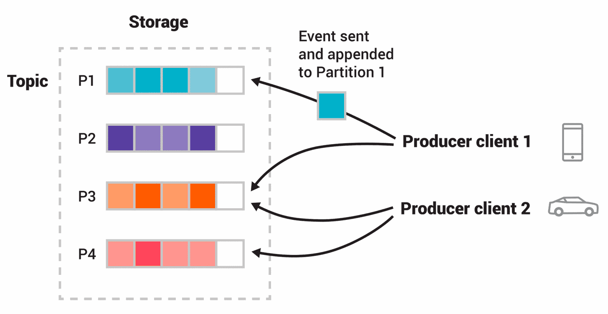

# kafka

> **Apache Kafka is an open-source distributed event streaming platform** used by thousands of companies for high-performance data pipelines, streaming analytics, data integration, and mission-critical applications.

References

- Home Page : https://kafka.apache.org/
    - Intro : https://kafka.apache.org/intro
    - Quickstart : https://kafka.apache.org/quickstart
    - **Documentation** : https://kafka.apache.org/documentation
        - Kafka 设计与原理详解 : https://blog.csdn.net/suifeng3051/article/details/48053965 _( 上文的部分翻译 )_
- GitHub : https://github.com/apache/kafka

## Intro

Reference

- Intro : https://kafka.apache.org/intro

Core Capabilities

- **High Throughput** 高吞吐
- **Scalable** 可伸缩
- **Permanent Storage** 持久存储
- **High Available** 高可用

Ecosystem

- **Built-in Strem Processing**
    - Process streams of events with joins, aggregations, filters, transformations, and more, using event-time and **exactly-once processing**.
- Connect to almost anything
- Client Libraries
- Large Ecosystem Open Source Tools

### Description

Apache Kafka is an **event streaming platform**. What does that mean?

Kafka combines three key capabilities so you can implement your use cases for event streaming end-to-end with a single battle-tested solution :

- To **publish (write)** and **subscribe to (read)** streams of events, including continuous import/export of your data from other systems.
- To **store** streams of events durably and reliably for as long as you want.
- To **process** streams of events as they occur or retrospectively _( 回顾地  )_ .

### Main Concepts

#### Event

Main Concepts and Terminology

- An event records the fact that "something happened" in the world or in your business.
- It is also called record or message in the documentation.
- When you read or write data to Kafka, you do this in the form of events.
- Conceptually, **an event has a key, value, timestamp, and optional metadata headers.**

_Here's an example event:_

- _Event **key** : "Alice"_
- _Event **value** : "Made a payment of $200 to Bob"_
- _Event **timestamp** : "Jun. 25, 2020 at 2:06 p.m."_

#### Producers

**<u>Producers</u>** are those client applications that publish (write) events to Kafka, and **<u>consumers</u>** are those that subscribe to (read and process) these events.

- In Kafka, **producers and consumers are fully decoupled and agnostic _( 不可知论的; 怀疑的 )_ of each other**, which is a **key design element to achieve the high scalability** that Kafka is known for.
- For example, **producers never need to wait for consumers.**
- Kafka provides various guarantees such as the ability to **process events exactly-once.**
    - _( icehe : 对消息 "有且只消费一次" 的特性存疑, 需要了解具体实现方式 )_

#### Topics

**Events are organized and durably stored in <u>topics</u>.**

- Very simplified, a topic is similar to a folder in a filesystem, and the events are the files in that folder.
- An example topic name could be "payments".
- **Topics in Kafka are always multi-producer and multi-subscriber :**
    - a topic can have zero, one, or many producers that write events to it, as well as zero, one, or many consumers that subscribe to these events.
- **Events in a topic can be read as often as needed** -- unlike traditional messaging systems, **events are not deleted after consumption.**
    - Instead, you **define for how long Kafka should retain your events through a per-topic configuration setting, after which old events will be discarded.**
    - Kafka's performance is effectively constant with respect to data size, so storing data for a long time is perfectly fine.

#### Partitioned

Topics are <u>**partitioned**</u>, meaning **a topic is spread over a number of "buckets" located on different Kafka brokers.**

- This **distributed placement of your data is very important for scalability** because it allows client applications to both read and write the data from/to many brokers at the same time.
- When **a new event is published to a topic**, it is actually **appended to one of the topic's partitions**.
- Events with the same event key ( e.g., a customer or vehicle ID ) are written to the same partition, and Kafka guarantees that any consumer of a given topic-partition will always read that partition's events in exactly the same order as they were written.



- The Figure above : This example topic has four partitions P1 ~ P4.
    - Two different producer clients are publishing, independently from each other, new events to the topic by writing events over the network to the topic's partitions.
    - **Events with the same key _( denoted by their color in the figure )_ are written to the same partition.**
    - Note that **both producers can write to the same partition if appropriate.**

#### Replicated

- To make your data **fault-tolerant and highly-available**, **every topic can be <u>replicated</u>**, even across geo-regions or datacenters,
    - so that there are always multiple brokers that have a copy of the data just in case things go wrong, you want to do maintenance on the brokers, and so on.
- A **common production setting is a replication factor of 3**,
    - i.e., there will always be three copies of your data.
- This **replication is performed at the level of topic-partitions.**

## Use Cases

Reference

- Use Cases : https://kafka.apache.org/uses

### Messaging

_( 消息队列 )_

- Kafka works well **as a replacement for a more traditional message broker.**
    - Message brokers are used for a variety of reasons (to **decouple processing from data producers**, to **buffer unprocessed messages**, etc).
    - In comparison to most messaging systems **Kafka has better throughput**, **built-in partitioning**, **replication**, and **fault-tolerance** which makes it a good solution for large scale message processing applications.
- In our experience **messaging uses are often comparatively low-throughput, but may require low end-to-end latency and often depend on the strong durability guarantees** Kafka provides.
- _In this domain Kafka is comparable to traditional messaging systems such as [ActiveMQ](http://activemq.apache.org/) or [RabbitMQ](https://www.rabbitmq.com/)._

### Website Activity Tracking

网页(用户)活动跟踪

- The original use case for Kafka was to be able to **rebuild a user activity tracking pipeline as a set of real-time publish-subscribe feeds.**
    - This means site activity ( page views, searches, or other actions users may take ) is published to central topics with one topic per activity type.
    - These feeds are available for subscription for a range of use cases including real-time processing, real-time monitoring, and loading into Hadoop or offline data warehousing systems for offline processing and reporting.
- **Activity tracking is often very high volume** as many activity messages are generated for each user page view.

### Metrics

软件度量

- Kafka is often used for **operational monitoring data** _( 运维监控数据 )_ .
    - This involves aggregating statistics from distributed applications to produce centralized feeds of operational data.

### Log Aggregation

- Many people use Kafka as a **replacement for a log aggregation solution**.
    - Log aggregation typically collects physical log files off servers and puts them in a central place ( a file server or HDFS perhaps ) for processing.
        - _( icehe : 例如 ELK )_
    - Kafka abstracts away the details of files and gives a cleaner abstraction of log or event data as a stream of messages.
    - This allows for lower-latency processing and easier support for multiple data sources and distributed data consumption.
    - **In comparison to log-centric systems like Scribe or Flume, Kafka offers equally good performance, stronger durability guarantees due to replication, and much lower end-to-end latency.**

### Stream Processing

- Many users of Kafka process data in processing pipelines consisting of multiple stages, where raw input data is consumed from Kafka topics and then aggregated, enriched, or otherwise transformed into new topics for further consumption or follow-up processing.
    - For example, a processing pipeline for recommending news articles might crawl article content from RSS feeds and publish it to an "articles" topic;
        - further processing might normalize or deduplicate this content and publish the cleansed article content to a new topic;
        - a final processing stage might attempt to recommend this content to users.
    - Such processing pipelines create graphs of real-time data flows based on the individual topics.
    - Starting in 0.10.0.0, a light-weight but powerful stream processing library called [**Kafka Streams**](https://kafka.apache.org/documentation/streams/) is available in Apache Kafka to perform such data processing as described above.
    - Apart from Kafka Streams, alternative open source stream processing tools include [Apache Storm](https://storm.apache.org/) and [Apache Samza](http://samza.apache.org/).

### Event Sourcing

- Event sourcing is **a style of application design where state changes are logged as a time-ordered sequence of records.**
    - Kafka's support for very large stored log data makes it an excellent backend for an application built in this style.

### Commit Log

- Kafka can serve as a kind of **external commit-log for a distributed system**.
    - **The log helps replicate data between nodes and acts as a re-syncing mechanism for failed nodes to restore their data.**
    - The [log compaction](https://kafka.apache.org/documentation.html#compaction) feature in Kafka helps support this usage.
    - In this usage Kafka is similar to [Apache BookKeeper](https://bookkeeper.apache.org/) project.

## Design

### Motivation

- We designed Kafka to **be able to act as a unified platform for handling all the real-time data** feeds a large company might have.
    - To do this we had to think through a fairly broad set of use cases.
- It would have to have **high-throughput to support high volume event streams** such as real-time log aggregation.
- It would need to deal gracefully with large data backlogs to be able to support periodic data loads from offline systems.
- It also meant the system would have to handle low-latency delivery to handle more traditional messaging use-cases.
- We wanted to support partitioned, distributed, real-time processing of these feeds to create new, derived feeds.
    - This motivated our partitioning and consumer model.
- Finally in cases where the stream is fed into other data systems for serving, we knew the system would have to be able to guarantee fault-tolerance in the presence of machine failures.
- Supporting these uses led us to a design with a number of unique elements, **more akin to a database log than a traditional messaging system**.
    - We will outline some elements of the design in the following sections.

### Persistence

#### Don't Fear the Filesystem

- **Kafka relies heavily on the filesystem for storing and caching messages.**
    - There is a general perception that "disks are slow" which makes people skeptical that a persistent structure can offer competitive performance.
    - In fact disks are both much slower and much faster than people expect depending on how they are used;
        - and **a properly _( 正确地 )_ designed disk structure can often be as fast as the network**.
- **The key fact about disk performance is that the <u>throughput of hard drives has been diverging _( 相异 )_ from the latency of a disk seek</u> for the last decade.**
    - As a result the performance of linear writes on a JBOD configuration with six 7200rpm SATA RAID-5 array is about 600MB/sec but the performance of random writes is only about 100k/sec -- a difference of over 6000X.
    - These linear reads and writes are the most predictable of all usage patterns, and are heavily optimized by the operating system.
    - A modern operating system provides **read-ahead** and **write-behind** techniques that **prefetch data in large block multiples** and **group smaller logical writes into large physical writes**.
    - _A further discussion of this issue can be found in this ACM Queue article;_
        - they **actually find that sequential disk access can in some cases be faster than random memory access!**
- To compensate for this performance divergence, **modern operating systems have become increasingly aggressive in their use of main memory for disk caching.**
    - A modern OS will happily divert all free memory to disk caching with little performance penalty when the memory is reclaimed _( 回收利用 )_ .
    - All disk reads and writes will go through this unified cache.
    - This feature cannot easily be turned off without using direct I/O, so even if a process maintains an in-process cache of the data, this data will likely be duplicated in OS pagecache, effectively storing everything twice.
- Furthermore, we are building on top of the JVM, and anyone who has spent any time with Java memory usage knows two things:
    - 1\. The memory overhead of objects is very high, often doubling the size of the data stored (or worse).
    - 2\. Java garbage collection becomes increasingly fiddly and slow as the in-heap data increases.
- As a result of these factors **using the filesystem and relying on pagecache is superior to maintaining an in-memory cache or other structure** -- we at least double the available cache by having automatic access to all free memory, and likely double again by storing a compact byte structure rather than individual objects.
    - Doing so will result in a cache of up to 28~30GB on a 32GB machine without GC penalties.
    - Furthermore, this cache will stay warm even if the service is restarted, whereas the in-process cache will need to be rebuilt in memory (which for a 10GB cache may take 10 minutes) or else it will need to start with a completely cold cache (which likely means terrible initial performance).
    - This also greatly simplifies the code as all logic for maintaining coherency between the cache and filesystem is now in the OS, which tends to do so more efficiently and more correctly than one-off _( 一次性的 )_ in-process attempts.
    - If your disk usage favors linear reads then read-ahead is effectively pre-populating this cache with useful data on each disk read.
- This suggests a design which is very simple :
    - **rather than maintain as much as possible in-memory and flush it all out to the filesystem in a panic when we run out of space, we invert that.**
    - **All data is immediately written to a persistent log on the filesystem without necessarily flushing to disk.**
    - In effect this just means that it is transferred into the kernel's pagecache.
- This style of **pagecache-centric design** is described in an [article](http://varnish-cache.org/docs/trunk/phk/notes.html) on the design of Varnish here (along with a healthy dose of arrogance).

#### Constant Time Suffices

- The persistent data structure used in messaging systems are often a per-consumer queue with an associated BTree or other general-purpose random access data structures to maintain metadata about messages.
    - BTrees are the most versatile _( 多用途的, 多功能的 )_ data structure available, and make it possible to support a wide variety of transactional and non-transactional semantics in the messaging system.
    - They do come with a fairly high cost, though : Btree operations are O(log N).
    - Normally O(log N) is considered essentially equivalent to constant time, but this is not true for disk operations.
    - Disk seeks come at 10 ms a pop, and each disk can do only one seek at a time so parallelism is limited.
    - Hence even a handful of disk seeks leads to very high overhead.
    - Since storage systems mix very fast cached operations with very slow physical disk operations, the observed performance of tree structures is often superlinear as data increases with fixed cache -- i.e. doubling your data makes things much worse than twice as slow.
- Intuitively _( 凭直觉地 )_ a persistent queue could be built on simple reads and appends to files as is commonly the case with logging solutions.
    - This structure has the advantage that all operations are O(1) and reads do not block writes or each other.
    - **This has obvious performance advantages since the performance is completely decoupled from the data size -- one server can now take full advantage of a number of cheap, low-rotational speed 1+TB SATA drives.**
    - Though they have poor seek performance, these drives have acceptable performance for large reads and writes and come at 1/3 the price and 3x the capacity.
- Having access to virtually unlimited disk space without any performance penalty means that we can provide some features not usually found in a messaging system.
    - For example, in Kafka, instead of attempting to delete messages as soon as they are consumed, we can retain messages for a relatively long period (say a week).
    - This leads to a great deal of flexibility for consumers, as we will describe.

_suffice : vi. 足够, 有能力_

### Efficiency

- We have put significant effort into efficiency.
    - One of our primary use cases is handling web activity data, which is very high volume : each page view may generate dozens of writes.
    - Furthermore, we assume each message published is read by at least one consumer (often many), hence we strive to make consumption as cheap as possible.
- We have also found, from experience building and running a number of similar systems, that efficiency is a key to effective multi-tenant _( 多租户 )_ operations.
    - If the downstream infrastructure service can easily become a bottleneck due to a small bump in usage by the application, such small changes will often create problems.
    - By being very fast we help ensure that the application will tip-over _( 翻倒 )_ under load before the infrastructure.
    - This is particularly important when trying to run a centralized service that supports dozens or hundreds of applications on a centralized cluster as changes in usage patterns are a near-daily occurrence.
- We discussed disk efficiency in the previous section.
    - Once poor disk access patterns have been eliminated, there are two common causes of inefficiency in this type of system :
        - too many small I/O operations, and
        - excessive **byte copying**.
- The small I/O problem happens both between the client and the server and in the server's own persistent operations.
- To avoid this, our **protocol is built around a "message set" abstraction that naturally groups messages together.**
    - This **allows network requests to group messages together and amortize _( 分期偿还 )_ the overhead of the network roundtrip rather than sending a single message at a time.**
    - The server in turn appends chunks of messages to its log in one go, and the consumer fetches large linear chunks at a time.
- This simple optimization produces orders of magnitude _( 数个数量级的 )_ speed up.
    - **Batching leads to larger network packets, larger sequential disk operations, contiguous memory blocks, and so on, all of which allows Kafka to turn a bursty stream of random message writes into linear writes that flow to the consumers.**
- The other inefficiency is in byte copying.
    - At low message rates this is not an issue, but under load the impact is significant.
    - To avoid this we **employ a standardized binary message format that is shared by the producer, the broker, and the consumer (so data chunks can be transferred without modification between them).**
- The message log maintained by the broker is itself just a directory of files, each populated by a sequence of message sets that have been written to disk in the same format used by the producer and consumer.
    - Maintaining this common format allows optimization of the most important operation: network transfer of persistent log chunks.
    - **Modern unix operating systems offer a highly optimized code path for transferring data out of pagecache to a socket;**
        - in Linux this is done with the [sendfile system call](https://man7.org/linux/man-pages/man2/sendfile.2.html).
- To understand the impact of sendfile, it is important to understand the **common data path for transfer of data from file to socket** :
    - 1\. The **operating system reads data from the disk into pagecache in kernel space**
    - 2\. The **application reads the data from kernel space into a user-space buffer**
    - 3\. The **application writes the data back into kernel space into a socket buffer**
    - 4\. The **operating system copies the data from the socket buffer to the NIC buffer** where it is sent over the network
        - _NIC : Network Information Center 网络信息中心_
- This is clearly inefficient, there are four copies and two system calls.
    - **Using `sendfile`, this re-copying is avoided by allowing the OS to send the data from pagecache to the network directly.**
    - So in this optimized path, only the final copy to the NIC buffer is needed.
- We expect a common use case to be multiple consumers on a topic.
    - **Using the zero-copy optimization above, data is copied into pagecache exactly once and reused on each consumption instead of being stored in memory and copied out to user-space every time it is read.**
    - This **allows messages to be consumed at a rate that approaches the limit of the network connection.**
- This combination of pagecache and `sendfile` means that on a Kafka cluster where the consumers are mostly caught up you will see no read activity on the disks whatsoever _( 无论什么 )_ as they will be serving data entirely from cache.
- For more background on the `sendfile` and zero-copy support in Java, see this [article](https://developer.ibm.com/articles/j-zerocopy/).
    - _( icehe : 是一篇很棒的文章 )_

#### End-to-end Batch Compression

- In some cases the bottleneck is actually not CPU or disk but network bandwidth.
    - This is particularly true for a data pipeline that needs to send messages between data centers over a wide-area network.
    - Of course, the user can always compress its messages one at a time without any support needed from Kafka, but this can lead to very poor compression ratios as much of the redundancy is due to repetition between messages of the same type
        - (e.g. field names in JSON or user agents in web logs or common string values).
    - Efficient compression requires compressing multiple messages together rather than compressing each message individually.
- Kafka supports this with an efficient batching format.
    - **A batch of messages can be clumped together compressed and sent to the server in this form.**
    - This batch of messages will be written in compressed form and will remain compressed in the log and will only be decompressed by the consumer.
- Kafka supports GZIP, Snappy, LZ4 and ZStandard compression protocols.
    - More details on compression can be found [here](https://cwiki.apache.org/confluence/display/KAFKA/Compression).

### The Producer

#### Load Balance

- The **producer sends data directly to the broker that is the leader for the partition without any intervening routing tier.**
    - To help the producer do this **all Kafka nodes can answer a request for metadata about which servers are alive and where the leaders for the partitions of a topic are at any given time to allow the producer to appropriately direct its requests.**
- The client controls which partition it publishes messages to.
    - This can be done at random, implementing a kind of random load balancing, or it can be done by some semantic partitioning function.
    - We expose the interface for semantic partitioning by allowing the user to specify a key to partition by and using this to hash to a partition (there is also an option to override the partition function if need be).
    - For example if the key chosen was a user id then all data for a given user would be sent to the same partition.
    - This in turn will allow consumers to make locality assumptions about their consumption.
    - This style of partitioning is explicitly designed to allow locality-sensitive processing in consumers.

#### Asynchronous send

- Batching is one of the big drivers of efficiency, and to **enable batching the Kafka producer will attempt to accumulate data in memory and to send out larger batches in a single request.**
    - The **batching can be configured to accumulate no more than a fixed number of messages and to wait no longer than some fixed latency bound (say <u>64k or 10 ms</u>).**
    - This allows the accumulation of more bytes to send, and few larger I/O operations on the servers.
    - This buffering is configurable and gives a mechanism to trade off a small amount of additional latency for better throughput.
- Details on [configuration](https://kafka.apache.org/documentation/#producerconfigs) and the [api](http://kafka.apache.org/082/javadoc/index.html?org/apache/kafka/clients/producer/KafkaProducer.html) for the producer can be found elsewhere in the documentation.

### Consumer

- The Kafka consumer works by issuing "fetch" requests to the brokers leading the partitions it wants to consume.
    - The consumer specifies its offset in the log with each request and receives back a chunk of log beginning from that position.
    - The consumer thus has significant control over this position and can rewind it to re-consume data if need be.

#### Push vs. Pull

- An initial question we considered is whether consumers should pull data from brokers or brokers should push data to the consumer.
    - In this respect _( 方面 )_ **Kafka follows a more traditional design, shared by most messaging systems, where data is pushed to the broker from the producer and pulled from the broker by the consumer.**
    - Some logging-centric systems, such as **[Scribe](http://github.com/facebook/scribe) and [Apache Flume](http://flume.apache.org/), follow a very different push-based path where data is pushed downstream.**
    - There are pros and cons to both approaches.
    - However, a push-based system has difficulty dealing with diverse consumers as the broker controls the rate at which data is transferred.
    - The goal is generally for the consumer to be able to consume at the maximum possible rate; unfortunately, in a push system this means the consumer tends to be overwhelmed when its rate of consumption falls below the rate of production (a denial of service attack, in essence).
    - A pull-based system has the nicer property that the consumer simply falls behind and catches up when it can.
    - This can be mitigated _( 使缓和, 使减轻 )_ with some kind of backoff protocol by which the consumer can indicate it is overwhelmed, but getting the rate of transfer to fully utilize (but never over-utilize) the consumer is trickier than it seems.
    - Previous attempts at building systems in this fashion led us to go with a more traditional pull model.
- Another advantage of a pull-based system is that it lends itself to aggressive batching of data sent to the consumer.
    - A push-based system must choose to either send a request immediately or accumulate more data and then send it later without knowledge of whether the downstream consumer will be able to immediately process it.
    - If tuned for low latency, this will result in sending a single message at a time only for the transfer to end up being buffered anyway, which is wasteful.
    - A pull-based design fixes this as the consumer always pulls all available messages after its current position in the log (or up to some configurable max size).
    - So one gets optimal batching without introducing unnecessary latency.
- The **deficiency of a naive _( 单纯的 )_ pull-based system is that if the broker has no data the consumer may end up polling in a tight loop, effectively busy-waiting for data to arrive.**
    - To avoid this we have parameters in our pull request that allow the consumer request to block in a "long poll" waiting until data arrives (and optionally waiting until a given number of bytes is available to ensure large transfer sizes).
- You could imagine other possible designs which would be only pull, end-to-end.
    - The producer would locally write to a local log, and brokers would pull from that with consumers pulling from them.
    - A similar type of **"store-and-forward" producer is often proposed.**
    - This is intriguing **but we felt not very suitable for our target use cases which have thousands of producers.**
    - Our experience running persistent data systems at scale led us to feel that involving thousands of disks in the system across many applications would not actually make things more reliable and would be a nightmare to operate.
    - _( icehe : kafka 社区认为 "生产者先把消息持久化再发送给 MQ" 的做法, 实际上并不能让这个系统变得更可靠, 而且非常难维护 )_
    - And in practice we have found that we can run a pipeline with strong SLAs at large scale without a need for producer persistence.

#### Consumer Position

- Keeping track of what has been consumed is, surprisingly, one of the key performance points of a messaging system.
- **Most messaging systems keep metadata about what messages have been consumed on the broker.**
    - That is, **as a message is handed out _( 分发 )_ to a consumer, the broker either records that fact locally immediately or it may wait for acknowledgement from the consumer.**
    - This is a fairly intuitive choice, and indeed for a single machine server it is not clear where else this state could go.
    - **Since the data structures used for storage in many messaging systems scale poorly, this is also a pragmatic choice -- since the broker knows what is consumed it can immediately delete it, keeping the data size small.**
- What is perhaps not obvious is that getting the broker and consumer to come into agreement about what has been consumed is not a trivial problem.
    - If the broker records a message as consumed immediately every time it is handed out over the network, then if the consumer fails to process the message (say because it crashes or the request times out or whatever) that message will be lost.
    - To solve this problem, **many messaging systems add an acknowledgement feature which means that messages are only marked as sent not consumed when they are sent; the broker waits for a specific acknowledgement from the consumer to record the message as consumed.**
    - This strategy fixes the problem of losing messages, but creates new problems.
        - First of all, if the consumer processes the message but fails before it can send an acknowledgement then the message will be consumed twice.
        - The second problem is around performance, now the broker must keep multiple states about every single message (first to lock it so it is not given out a second time, and then to mark it as permanently consumed so that it can be removed).
    - Tricky problems must be dealt with, like what to do with messages that are sent but never acknowledged.
- Kafka handles this differently.
    - Our **topic is divided into a set of totally ordered partitions, each of which is consumed by exactly one consumer within each subscribing consumer group at any given time.**
    - This means that the **position of a consumer in each partition is just a single integer, the offset of the next message to consume.**
    - This **makes the state about what has been consumed very small, just one number for each partition.**
    - This state can be periodically checkpointed.
    - This makes the equivalent of message acknowledgements very cheap.
- There is a side benefit of this decision.
    - **A consumer can deliberately rewind back to an old offset and re-consume data.**
    - This violates the common contract of a queue, but turns out to be an essential feature for many consumers.
    - For example, if the consumer code has a bug and is discovered after some messages are consumed, the consumer can re-consume those messages once the bug is fixed.

#### _Offline Data Load_

- Scalable persistence allows for the possibility of consumers that only periodically consume such as batch data loads that periodically bulk-load data into an offline system such as Hadoop or a relational data warehouse.
    - In the case of Hadoop we parallelize the data load by splitting the load over individual map tasks, one for each node/topic/partition combination, allowing full parallelism in the loading.
    - Hadoop provides the task management, and tasks which fail can restart without danger of duplicate data—they simply restart from their original position.

#### Static Membership

- Static membership aims to improve the availability of stream applications, consumer groups and other applications built on top of the group rebalance protocol.
    - The rebalance protocol relies on the group coordinator to allocate entity ids to group members.
    - These generated ids are ephemeral _( 短暂的 )_ and will change when members restart and rejoin.
    - For consumer based apps, this "dynamic membership" can cause a large percentage of tasks re-assigned to different instances during administrative operations such as code deploys, configuration updates and periodic restarts.
    - For large state applications, shuffled tasks need a long time to recover their local states before processing and cause applications to be partially or entirely unavailable.
    - Motivated by this observation, Kafka's group management protocol allows group members to provide persistent entity ids.
    - Group membership remains unchanged based on those ids, thus no rebalance will be triggered.
- If you want to use static membership,
    - 1\. Upgrade both broker cluster and client apps to 2.3 or beyond, and also make sure the upgraded brokers are using inter.broker.protocol.version of 2.3 or beyond as well.
    - 2\. Set the config ConsumerConfig#GROUP_INSTANCE_ID_CONFIG to a unique value for each consumer instance under one group.
    - 3\. For Kafka Streams applications, it is sufficient to set a unique ConsumerConfig#GROUP_INSTANCE_ID_CONFIG per KafkaStreams instance, independent of the number of used threads for an instance.
- If your broker is on an older version than 2.3, but you choose to set ConsumerConfig#GROUP_INSTANCE_ID_CONFIG on the client side, the application will detect the broker version and then throws an UnsupportedException.
    - If you accidentally configure duplicate ids for different instances, a fencing mechanism on broker side will inform your duplicate client to shutdown immediately by triggering a org.apache.kafka.common.errors.FencedInstanceIdException.
    - For more details, see [KIP-345](https://cwiki.apache.org/confluence/display/KAFKA/KIP-345%3A+Introduce+static+membership+protocol+to+reduce+consumer+rebalances)

### Message Delivery Semantics

- Now that we understand a little about how producers and consumers work, let's discuss the semantic guarantees Kafka provides between producer and consumer.
- Clearly there are **multiple possible message delivery guarantees** that could be provided :
    - 1\. **At most once -- Messages may be lost but are never redelivered.**
    - 2\. **At least once -- Messages are never lost but may be redelivered.**
    - 3\. **Exactly once -- this is what people actually want, each message is delivered once and only once.**
- It's worth noting that this breaks down into two problems :
    - the **durability guarantees for publishing a message** and
    - the **guarantees when consuming a message**.
- **Many systems claim to provide "exactly once" delivery semantics**, but it is important to read the fine print, **most of these claims are misleading**
    - (i.e. they don't translate to the case where **consumers or producers can fail**, cases where **there are multiple consumer processes**, or cases where **data written to disk can be lost**).
- Kafka's semantics are straight-forward.
    - **When publishing a message we have a notion of the message being "committed" to the log.**
    - **Once a published message is committed it will not be lost as long as one broker that replicates the partition to which this message was written remains "alive".**
    - The definition of committed message, alive partition as well as a description of which types of failures we attempt to handle will be described in more detail in the next section.
    - For now let's assume a perfect, lossless broker and try to understand the guarantees to the producer and consumer.
    - If a producer attempts to publish a message and experiences a network error it cannot be sure if this error happened before or after the message was committed.
    - This is similar to the semantics of inserting into a database table with an autogenerated key.
- Prior to 0.11.0.0, **if a producer failed to receive a response indicating that a message was committed, it had little choice but to resend the message.**
    - This **provides at-least-once delivery semantics since the message may be written to the log again during resending if the original request had in fact succeeded.**
    - Since 0.11.0.0, the Kafka producer **also supports an idempotent delivery option which <u>guarantees that resending will not result in duplicate entries</u> in the log.**
    - To achieve this, the **broker assigns each producer an ID and deduplicates messages using a sequence number that is sent by the producer along with every message.**
    - Also beginning with 0.11.0.0, the producer **supports the ability to send messages to multiple topic partitions using transaction-like semantics:**
        - i.e. **either all messages are successfully written or none of them are.**
    - The main use case for this is exactly-once processing between Kafka topics (described below).
- Not all use cases require such strong guarantees.
    - For uses which are latency sensitive we allow the producer to specify the durability level it desires.
    - If the producer specifies that it wants to wait on the message being committed this can take on the order of 10 ms.
    - However the producer can also specify that it wants to perform the send completely asynchronously or that it wants to wait only until the leader (but not necessarily the followers) have the message.
- Now let's describe the semantics from the point-of-view of the consumer.
    - All replicas have the exact same log with the same offsets.
    - The consumer controls its position in this log.
    - If the consumer never crashed it could just store this position in memory, but if the consumer fails and we want this topic partition to be taken over by another process the new process will need to choose an appropriate position from which to start processing.
    - Let's say the consumer reads some messages -- it has several options for processing the messages and updating its position.
- A. It can **read the messages, then save its position in the log, and finally process the messages.**
    - In this case there is **a possibility that the consumer process crashes after saving its position but before saving the output of its message processing.**
    - In this case **the process that took over processing would start at the saved position even though a few messages prior to that position had not been processed.**
    - This corresponds to "**at-most-once**" semantics as in the case of a consumer failure messages may not be processed.
- B. It can **read the messages, process the messages, and finally save its position.**
    - In this case there is **a possibility that the consumer process crashes after processing messages but before saving its position.**
    - In this case when the **new process takes over the first few messages it receives will already have been processed.**
    - This corresponds to the "**at-least-once**" semantics in the case of consumer failure.
    - In many cases messages have a primary key and so the updates are idempotent (receiving the same message twice just overwrites a record with another copy of itself).
- C. So what about **exactly once** semantics (i.e. the thing you actually want)?
    - When consuming from a Kafka topic and producing to another topic (as in a [Kafka Streams](https://kafka.apache.org/documentation/streams/) application), we can leverage the new transactional producer capabilities in 0.11.0.0 that were mentioned above.
    - The consumer's position is stored as a message in a topic, so we can write the offset to Kafka in the same transaction as the output topics receiving the processed data.
    - If the transaction is aborted, the consumer's position will revert to its old value and the produced data on the output topics will not be visible to other consumers, depending on their "isolation level."
    - In the default "read_uncommitted" isolation level, all messages are visible to consumers even if they were part of an aborted transaction,
        - but in "read_committed," the consumer will only return messages from transactions which were committed (and any messages which were not part of a transaction).
- When writing to an external system, the limitation is in the need to coordinate the consumer's position with what is actually stored as output.
    - The **classic way of achieving this would be to introduce a two-phase commit between the storage of the consumer position and the storage of the consumers output.**
    - But this can be handled more simply and generally by letting the consumer store its offset in the same place as its output.
    - This is better because many of the output systems a consumer might want to write to will not support a two-phase commit.
    - As an example of this, consider a [Kafka Connect](https://kafka.apache.org/documentation/#connect) connector which populates data in HDFS along with the offsets of the data it reads so that it is guaranteed that either data and offsets are both updated or neither is.
    - We follow similar patterns for many other data systems which require these stronger semantics and for which the messages do not have a primary key to allow for deduplication.
- So effectively **Kafka supports exactly-once delivery in Kafka Streams, and the transactional producer/consumer can be used generally to provide exactly-once delivery when transferring and processing data between Kafka topics.**
    - Exactly-once delivery for other destination systems generally requires cooperation with such systems, but Kafka provides the offset which makes implementing this feasible (see also Kafka Connect).
    - Otherwise, <u>**Kafka guarantees at-least-once delivery by default**</u>, and <u>**allows the user to implement at-most-once delivery by disabling retries on the producer and committing offsets in the consumer prior to processing a batch of messages.**</u>

### Replication

- Kafka replicates the log for each topic's partitions across a configurable number of servers (you can set this replication factor on a topic-by-topic basis).
    - This allows automatic failover to these replicas when a server in the cluster fails so messages remain available in the presence of failures.
- Other messaging systems provide some replication-related features, but, in our (totally biased) opinion, this appears to be a tacked-on _( 附添的 )_ thing, not heavily used, and with large downsides: replicas are inactive, throughput is heavily impacted, it requires fiddly manual configuration, etc.
    - **Kafka is meant to be used with replication by default** -- in fact we implement un-replicated topics as replicated topics where the replication factor is one.
- The **unit of replication is the topic partition.**
    - Under non-failure conditions, each partition in Kafka has a single leader and zero or more followers.
    - The total number of replicas including the leader constitute the replication factor.
    - **All reads and writes go to the leader of the partition.**
    - Typically, there are many more partitions than brokers and the leaders are evenly distributed among brokers.
    - The logs on the followers are identical to the leader's log -- all have the same offsets and messages in the same order ( though, of course, at any given time the leader may have a few as-yet unreplicated messages at the end of its log ) .
- Followers consume messages from the leader just as a normal Kafka consumer would and apply them to their own log.
    - Having the followers pull from the leader has the nice property of allowing the follower to naturally batch together log entries they are applying to their log.
- As with most distributed systems automatically handling failures requires having a precise definition of what it means for a node to be "alive". **For Kafka node liveness has two conditions :**
    - 1\. **A node must be able to maintain its session with ZooKeeper** ( via ZooKeeper's heartbeat mechanism )
    - 2\. **If it is a follower it must replicate the writes happening on the leader and not fall "too far" behind**
- We refer to nodes satisfying these two conditions as being **"in sync"** to avoid the vagueness _( 暧昧, 含糊 )_ of "alive" or "failed".
    - **The leader keeps track of the set of "in sync" nodes.**
    - **If a follower dies, gets stuck, or falls behind, the leader will remove it from the list of in sync replicas.**
    - _The determination of stuck and lagging replicas is controlled by the `replica.lag.time.max.ms` configuration._
- In distributed systems terminology we only attempt to handle a "fail/recover" model of failures where nodes suddenly cease working and then later recover ( perhaps without knowing that they have died ) .
    - Kafka does not handle so-called "Byzantine" failures in which nodes produce arbitrary or malicious _( 恶意的 )_ responses ( perhaps due to bugs or foul play _( 严重犯规, 不正当行为 )_ ).
- We can now more precisely define that a message is considered committed when all in sync replicas for that partition have applied it to their log.
    - Only committed messages are ever given out to the consumer.
    - This means that the consumer need not worry about potentially seeing a message that could be lost if the leader fails.
    - Producers, on the other hand, have the option of either waiting for the message to be committed or not, depending on their preference _( 偏爱 )_ for tradeoff between latency and durability.
    - This preference is controlled by the acks setting that the producer uses.
    - Note that topics have a setting for the "minimum number" of in-sync replicas that is checked when the producer requests acknowledgment that a message has been written to the full set of in-sync replicas.
    - If a less stringent acknowledgement is requested by the producer, then the message can be committed, and consumed, even if the number of in-sync replicas is lower than the minimum (e.g. it can be as low as just the leader).
- The guarantee that Kafka offers is that a committed message will not be lost, as long as there is at least one in sync replica alive, at all times.
- Kafka will remain available in the presence of node failures after a short fail-over period, but may not remain available in the presence of network partitions.

#### Replicated Logs: Quorums, ISRs, and State Machines (Oh my!)

- At its heart a Kafka partition is a replicated log.
    - The replicated log is one of the most basic primitives in distributed data systems, and there are many approaches for implementing one.
    - A replicated log can be used by other systems as a primitive for implementing other distributed systems in the [state-machine style](https://en.wikipedia.org/wiki/State_machine_replication).
- A replicated log models the process of coming into consensus on the order of a series of values (generally numbering the log entries 0, 1, 2, …).
    - There are many ways to implement this, but the simplest and fastest is with a leader who chooses the ordering of values provided to it.
    - As long as the leader remains alive, all followers need to only copy the values and ordering the leader chooses.
- Of course if leaders didn't fail we wouldn't need followers! When the leader does die we need to choose a new leader from among the followers.
    - But followers themselves may fall behind or crash so we must ensure we choose an up-to-date follower.
    - The fundamental guarantee a log replication algorithm must provide is that if we tell the client a message is committed, and the leader fails, the new leader we elect must also have that message.
    - This yields a tradeoff: if the leader waits for more followers to acknowledge a message before declaring it committed then there will be more potentially electable leaders.
- If you choose the number of acknowledgements required and the number of logs that must be compared to elect a leader such that there is guaranteed to be an overlap, then this is called a Quorum.
- A common approach to this tradeoff is to use a majority vote for both the commit decision and the leader election.
    - This is not what Kafka does, but let's explore it anyway to understand the tradeoffs.
    - Let's say we have 2f+1 replicas.
    - If f+1 replicas must receive a message prior to a commit being declared by the leader, and if we elect a new leader by electing the follower with the most complete log from at least f+1 replicas, then, with no more than f failures, the leader is guaranteed to have all committed messages.
    - This is because among any f+1 replicas, there must be at least one replica that contains all committed messages.
    - That replica's log will be the most complete and therefore will be selected as the new leader.
    - There are many remaining details that each algorithm must handle (such as precisely defined what makes a log more complete, ensuring log consistency during leader failure or changing the set of servers in the replica set) but we will ignore these for now.
- This majority vote approach has a very nice property: the latency is dependent on only the fastest servers.
    - That is, if the replication factor is three, the latency is determined by the faster follower not the slower one.
- There are a rich variety of algorithms in this family including ZooKeeper's [Zab](http://web.archive.org/web/20140602093727/http://www.stanford.edu/class/cs347/reading/zab.pdf), [Raft](https://www.usenix.org/system/files/conference/atc14/atc14-paper-ongaro.pdf), and [Viewstamped Replication](http://pmg.csail.mit.edu/papers/vr-revisited.pdf).
    - The most similar academic publication we are aware of to Kafka's actual implementation is [PacificA](https://www.microsoft.com/en-us/research/publication/pacifica-replication-in-log-based-distributed-storage-systems/?from=http%3A%2F%2Fresearch.microsoft.com%2Fapps%2Fpubs%2Fdefault.aspx%3Fid%3D66814) from Microsoft.
- The downside of majority vote is that it doesn't take many failures to leave you with no electable leaders.
    - To tolerate one failure requires three copies of the data, and to tolerate two failures requires five copies of the data.
    - In our experience having only enough redundancy to tolerate a single failure is not enough for a practical system, but doing every write five times, with 5x the disk space requirements and 1/5th the throughput, is not very practical for large volume data problems.
    - This is likely why quorum algorithms more commonly appear for shared cluster configuration such as ZooKeeper but are less common for primary data storage.
    - For example in HDFS the namenode's high-availability feature is built on a [majority-vote-based journal](http://blog.cloudera.com/blog/2012/10/quorum-based-journaling-in-cdh4-1), but this more expensive approach is not used for the data itself.
- Kafka takes a slightly different approach to choosing its quorum set.
    - **Instead of majority vote, Kafka dynamically maintains a set of <u>in-sync replicas (ISR)</u> that are caught-up to the leader.**
    - Only members of this set are eligible _( 有资格当选的 )_ for election as leader.
    - A write to a Kafka partition is not considered committed until all in-sync replicas have received the write.
    - This **ISR set is persisted to ZooKeeper whenever it changes.**
    - Because of this, any replica in the ISR is eligible to be elected leader.
    - This is an important factor for Kafka's usage model where there are many partitions and ensuring leadership balance is important.
    - With this ISR model and f+1 replicas, a Kafka topic can tolerate f failures without losing committed messages.
- For most use cases we hope to handle, we think this tradeoff is a reasonable one.
    - In practice, to tolerate f failures, both the majority vote and the ISR approach will wait for the same number of replicas to acknowledge before committing a message _(e.g. to survive one failure a majority quorum needs three replicas and one acknowledgement and the ISR approach requires two replicas and one acknowledgement)_ .
    - The ability to commit without the slowest servers is an advantage of the majority vote approach.
    - However, we think it is ameliorated _( 使改善 )_ by allowing the client to choose whether they block on the message commit or not, and the additional throughput and disk space due to the lower required replication factor is worth it.
- Another important design distinction is that Kafka does not require that crashed nodes recover with all their data intact _( 完整的 )_ .
    - It is not uncommon for replication algorithms in this space to depend on the existence of "stable storage" that cannot be lost in any failure-recovery scenario without potential consistency violations.
    - There are two primary problems with this assumption.
        - First, disk errors are the most common problem we observe in real operation of persistent data systems and they often do not leave data intact.
        - Secondly, even if this were not a problem, we do **not want to require the use of fsync on every write for our consistency guarantees as this can reduce performance by two to three orders of magnitude.**
    - Our protocol for allowing a replica to rejoin the ISR ensures that before rejoining, it must fully re-sync again even if it lost unflushed data in its crash.

#### Unclean leader election: What if they all die?

- Note that Kafka's guarantee with respect to data loss is predicated on at least one replica remaining in sync.
    - If all the nodes replicating a partition die, this guarantee no longer holds.
- However a practical system needs to do something reasonable when all the replicas die.
    - If you are unlucky enough to have this occur, it is important to consider what will happen.
    - There are two behaviors that could be implemented:
        - 1\. Wait for a replica in the ISR to come back to life and choose this replica as the leader (hopefully it still has all its data).
        - 2\. Choose the first replica (not necessarily in the ISR) that comes back to life as the leader.
- This is a simple tradeoff between availability and consistency.
    - If we wait for replicas in the ISR, then we will remain unavailable as long as those replicas are down.
    - If such replicas were destroyed or their data was lost, then we are permanently down.
    - If, on the other hand, a non-in-sync replica comes back to life and we allow it to become leader, then its log becomes the source of truth even though it is not guaranteed to have every committed message.
    - By default from version 0.11.0.0, Kafka chooses the first strategy and favor waiting for a consistent replica.
    - This behavior can be changed using configuration property `unclean.leader.election.enable`, to support use cases where uptime is preferable to consistency.
- This dilemma is not specific to Kafka.
    - It exists in any quorum-based scheme.
    - For example in a majority voting scheme, if a majority of servers suffer a permanent failure, then you must either choose to lose 100% of your data or violate consistency by taking what remains on an existing server as your new source of truth.

#### _Availability and Durability Guarantees_

- When writing to Kafka, producers can choose whether they wait for the message to be acknowledged by 0,1 or all (-1) replicas.
    - Note that "acknowledgement by all replicas" does not guarantee that the full set of assigned replicas have received the message.
    - **By default, when acks=all, acknowledgement happens as soon as all the current in-sync replicas have received the message.**
    - For example, if a topic is configured with only two replicas and one fails (i.e., only one in sync replica remains), then writes that specify acks=all will succeed.
    - However, these writes could be lost if the remaining replica also fails.
    - Although this ensures maximum availability of the partition, this behavior may be undesirable to some users who prefer durability over availability.
- Therefore, we provide two topic-level configurations that can be used to prefer message durability over availability:
    - 1\. **Disable unclean leader election - if all replicas become unavailable, then the partition will remain unavailable until the most recent leader becomes available again.**
        - This effectively prefers unavailability over the risk of message loss.
        - _See the previous section on Unclean Leader Election for clarification._
    - 2\. **Specify a minimum ISR size - the partition will only accept writes if the size of the ISR is above a certain minimum, in order to prevent the loss of messages that were written to just a single replica**, which subsequently becomes unavailable.
        - This setting only takes effect if the producer uses acks=all and guarantees that the message will be acknowledged by at least this many in-sync replicas.
        - This setting offers a trade-off between consistency and availability.
        - A higher setting for minimum ISR size guarantees better consistency since the message is guaranteed to be written to more replicas which reduces the probability that it will be lost.
        - However, it reduces availability since the partition will be unavailable for writes if the number of in-sync replicas drops below the minimum threshold.

#### _Replica Management_

- The above discussion on replicated logs really covers only a single log, i.e. one topic partition.
    - However a Kafka cluster will manage hundreds or thousands of these partitions.
    - We attempt to balance partitions within a cluster in a round-robin fashion to avoid clustering all partitions for high-volume topics on a small number of nodes.
    - Likewise _( 同样地 )_ we try to balance leadership so that each node is the leader for a proportional share of its partitions.
- It is also important to optimize the leadership election process as that is the critical window of unavailability.
    - A naive implementation of leader election would end up running an election per partition for all partitions a node hosted when that node failed.
    - Instead, we elect one of the brokers as the "controller".
    - This controller detects failures at the broker level and is responsible for changing the leader of all affected partitions in a failed broker.
    - The result is that we are able to batch together many of the required leadership change notifications which makes the election process far cheaper and faster for a large number of partitions.
    - If the controller fails, one of the surviving brokers will become the new controller.

### Log Compaction

- Log compaction ensures that Kafka will always retain at least the last known value for each message key within the log of data for a single topic partition.
    - It addresses use cases and scenarios such as restoring state after application crashes or system failure, or reloading caches after application restarts during operational maintenance.
    - Let's dive into these use cases in more detail and then describe how compaction works.
- So far _( 迄今为止 )_ we have described only the simpler approach to **data retention where old log data is discarded after a fixed period of time or when the log reaches some predetermined size.**
    - This works well for temporal event data such as logging where each record stands alone.
    - However an important class of data streams are the log of changes to keyed, mutable data (for example, the changes to a database table).
- Let's discuss a concrete example of such a stream.
    - Say we have a topic containing user email addresses; every time a user updates their email address we send a message to this topic using their user id as the primary key.
    - Now say we send the following messages over some time period for a user with id 123, each message corresponding to a change in email address (messages for other ids are omitted):

```text
123 => bill@microsoft.com
        .
        .
123 => bill@gatesfoundation.org
        .
        .
123 => bill@gmail.com
```

- Log compaction gives us a more granular retention mechanism so that we are guaranteed to retain at least the last update for each primary key (e.g. bill@gmail.com).
    - By doing this we guarantee that the log contains a full snapshot of the final value for every key not just keys that changed recently.
    - This means downstream consumers can restore their own state off this topic without us having to retain a complete log of all changes.
- Let's start by looking at a few use cases where this is useful, then we'll see how it can be used.
    - 1\. Database change subscription.
        - It is often necessary to have a data set in multiple data systems, and often one of these systems is a database of some kind (either a RDBMS or perhaps a new-fangled _( 新奇的 )_ key-value store).
        - For example you might have a database, a cache, a search cluster, and a Hadoop cluster.
        - Each change to the database will need to be reflected in the cache, the search cluster, and eventually in Hadoop.
        - In the case that one is only handling the real-time updates you only need recent log.
        - But if you want to be able to reload the cache or restore a failed search node you may need a complete data set.
    - 2\. Event sourcing.
        - This is a style of application design which co-locates _( 使位于一处 )_ query processing with application design and uses a log of changes as the primary store for the application.
    - 3\. Journaling for high-availability.
        - A process that does local computation can be made fault-tolerant by logging out changes that it makes to its local state so another process can reload these changes and carry on if it should fail.
        - A concrete example of this is handling counts, aggregations, and other "group by" -- like processing in a stream query system.
        - Samza, a real-time stream-processing framework, [uses this feature](http://samza.apache.org/learn/documentation/0.7.0/container/state-management.html) for exactly this purpose.
- In each of these cases one needs primarily to handle the real-time feed of changes, but occasionally, when a machine crashes or data needs to be re-loaded or re-processed, one needs to do a full load.
    - Log compaction allows feeding both of these use cases off the same backing topic.
    - This style of usage of a log is described in more detail in [this blog post](http://engineering.linkedin.com/distributed-systems/log-what-every-software-engineer-should-know-about-real-time-datas-unifying).
- The general idea is quite simple.
    - If we had infinite log retention, and we logged each change in the above cases, then we would have captured the state of the system at each time from when it first began.
    - Using this complete log, we could restore to any point in time by replaying the first N records in the log.
    - This hypothetical complete log is not very practical for systems that update a single record many times as the log will grow without bound even for a stable dataset.
    - The simple log retention mechanism which throws away old updates will bound space but the log is no longer a way to restore the current state -- now restoring from the beginning of the log no longer recreates the current state as old updates may not be captured at all.
- Log compaction is a mechanism to give finer-grained _( 细粒度的 )_ per-record retention, rather than the coarser-grained _( 勉强的, 强制的 )_ time-based retention.
    - The idea is to selectively remove records where we have a more recent update with the same primary key.
    - This way the log is guaranteed to have at least the last state for each key.
- This retention policy can be set per-topic, so a single cluster can have some topics where retention is enforced by size or time and other topics where retention is enforced by compaction.
- This functionality is inspired by one of LinkedIn's oldest and most successful pieces of infrastructure—a database changelog caching service called [Databus](https://github.com/linkedin/databus).
    - Unlike most log-structured storage systems Kafka is built for subscription and organizes data for fast linear reads and writes.
    - Unlike Databus, Kafka acts as a source-of-truth store so it is useful even in situations where the upstream data source would not otherwise be replayable.

#### Log Compaction Basics


- Here is a high-level picture that shows the logical structure of a Kafka log with the offset for each message.
- The head of the log is identical to a traditional Kafka log.
    - It has dense, sequential offsets and retains all messages.
    - Log compaction adds an option for handling the tail of the log.
    - The picture above shows a log with a compacted tail.
    - Note that the messages in the tail of the log retain the original offset assigned when they were first written -- that never changes.
    - Note also that all offsets remain valid positions in the log, even if the message with that offset has been compacted away; in this case this position is indistinguishable _( 难区分的 )_ from the next highest offset that does appear in the log.
    - For example, in the picture above the offsets 36, 37, and 38 are all equivalent positions and a read beginning at any of these offsets would return a message set beginning with 38.
- Compaction also allows for deletes.
    - A message with a key and a null payload will be treated as a delete from the log.
    - This delete marker will cause any prior message with that key to be removed (as would any new message with that key), but delete markers are special in that they will themselves be cleaned out of the log after a period of time to free up space.
    - The point in time at which deletes are no longer retained is marked as the "delete retention point" in the above diagram.
- The compaction is done in the background by periodically recopying log segments.
    - Cleaning does not block reads and can be throttled to use no more than a configurable amount of I/O throughput to avoid impacting producers and consumers.
    - The actual process of compacting a log segment looks something like this:


#### What guarantees does log compaction provide?

- Log compaction guarantees the following:
    - 1\. Any consumer that stays caught-up to within the head of the log **will see every message that is written**; these messages will have sequential offsets.
        - The topic's `min.compaction.lag.ms` can be used to guarantee the minimum length of time must pass after a message is written before it could be compacted.
        - I.e. it provides a lower bound on how long each message will remain in the (uncompacted) head.
        - The topic's `max.compaction.lag.ms` can be used to guarantee the maximum delay between the time a message is written and the time the message becomes eligible for compaction.
    - 2\. **Ordering of messages is always maintained.**
        - Compaction will never re-order messages, just remove some.
    - 3\. **The offset for a message never changes.**
        - It is the permanent identifier for a position in the log.
    - 4\. Any consumer progressing from the start of the log **will see at least the final state of all records in the order they were written.**
        - Additionally, all delete markers for deleted records will be seen, provided the consumer reaches the head of the log in a time period less than the topic's `delete.retention.ms` setting (the default is 24 hours).
        - In other words: since the removal of delete markers happens concurrently with reads, it is possible for a consumer to miss delete markers if it lags by more than `delete.retention.ms`.

#### Log Compaction Details

- Log compaction is handled by the **log cleaner, a pool of background threads that recopy log segment files, removing records whose key appears in the head of the log.** Each compactor thread works as follows:
    - 1\. It chooses the log that has the highest ratio of log head to log tail
    - 2\. It creates a succinct _( 简洁的 )_ summary of the last offset for each key in the head of the log
    - 3\. It recopies the log from beginning to end removing keys which have a later occurrence in the log.
        - New, clean segments are swapped into the log immediately so the additional disk space required is just one additional log segment (not a fully copy of the log).
    - 4\. The summary of the log head is essentially just a space-compact hash table.
        - It uses exactly 24 bytes per entry.
        - As a result with 8GB of cleaner buffer one cleaner iteration can clean around 366GB of log head (assuming 1k messages).

#### _Configuring The Log Cleaner_

- The log cleaner is enabled by default.
    - This will start the pool of cleaner threads.
    - To enable log cleaning on a particular topic, add the log-specific property

```properties
log.cleanup.policy=compact
```

- The `log.cleanup.policy` property is a broker configuration setting defined in the broker's `server.properties` file;
    - it affects all of the topics in the cluster that do not have a configuration override in place as documented [here](https://kafka.apache.org/documentation.html#brokerconfigs).
    - The log cleaner can be configured to retain a minimum amount of the uncompacted "head" of the log.
    - This is enabled by setting the compaction time lag.

```properties
log.cleaner.min.compaction.lag.ms
```

- This can be used to prevent messages newer than a minimum message age from being subject to compaction.
    - If not set, all log segments are eligible for compaction except for the last segment, i.e. the one currently being written to.
    - The active segment will not be compacted even if all of its messages are older than the minimum compaction time lag.
    - The log cleaner can be configured to ensure a maximum delay after which the uncompacted "head" of the log becomes eligible for log compaction.

```properties
log.cleaner.max.compaction.lag.ms
```

- This can be used to prevent log with low produce rate from remaining ineligible _( 无入选资格的 )_ for compaction for an unbounded duration.
    - If not set, logs that do not exceed `min.cleanable.dirty.ratio` are not compacted.
    - Note that this compaction deadline is not a hard guarantee since it is still subjected to the availability of log cleaner threads and the actual compaction time.
    - You will want to monitor the uncleanable-partitions-count, max-clean-time-secs and max-compaction-delay-secs metrics.
- Further cleaner configurations are described [here](https://kafka.apache.org/documentation.html#brokerconfigs).

### _Quotas_

- Kafka cluster has the ability to enforce quotas on requests to control the broker resources used by clients.
- Two types of client quotas can be enforced by Kafka brokers for each group of clients sharing a quota:
    - 1\. Network bandwidth quotas define byte-rate thresholds (since 0.9)
    - 2\. Request rate quotas define CPU utilization thresholds as a percentage of network and I/O threads (since 0.11)

#### _Why are quotas necessary?_

- It is possible for producers and consumers to produce/consume very high volumes of data or generate requests at a very high rate and thus monopolize _( 垄断, 独占 )_ broker resources, cause network saturation and generally DOS other clients and the brokers themselves.
    - Having quotas protects against these issues and is all the more important in large multi-tenant clusters where a small set of badly behaved clients can degrade user experience for the well behaved ones.
    - In fact, when running Kafka as a service this even makes it possible to enforce API limits according to an agreed upon contract.

#### _Client groups_

- The identity of Kafka clients is the user principal which represents an authenticated user in a secure cluster.
    - In a cluster that supports unauthenticated clients, user principal is a grouping of unauthenticated users chosen by the broker using a configurable PrincipalBuilder.
    - Client-id is a logical grouping of clients with a meaningful name chosen by the client application.
    - The tuple (user, client-id) defines a secure logical group of clients that share both user principal and client-id.
- Quotas can be applied to (user, client-id), user or client-id groups.
    - For a given connection, the most specific quota matching the connection is applied.
    - All connections of a quota group share the quota configured for the group.
    - For example, if (user="test-user", client-id="test-client") has a produce quota of 10MB/sec, this is shared across all producer instances of user "test-user" with the client-id "test-client".

#### _Quota Configuration_

- Quota configuration may be defined for (user, client-id), user and client-id groups.
    - It is possible to override the default quota at any of the quota levels that needs a higher (or even lower) quota.
    - The mechanism is similar to the per-topic log config overrides.
    - User and (user, client-id) quota overrides are written to ZooKeeper under /config/users and client-id quota overrides are written under /config/clients.
    - These overrides are read by all brokers and are effective immediately.
    - This lets us change quotas without having to do a rolling restart of the entire cluster.
    - See here for details. Default quotas for each group may also be updated dynamically using the same mechanism.
- The order of precedence for quota configuration is:
    - 1\. `/config/users/<user>/clients/<client-id>`
    - 2\. `/config/users/<user>/clients/<default>`
    - 3\. `/config/users/<user>`
    - 4\. `/config/users/<default>/clients/<client-id>`
    - 5\. `/config/users/<default>/clients/<default>`
    - 6\. `/config/users/<default>`
    - 7\. `/config/clients/<client-id>`
    - 8\. `/config/clients/<default>`
- Broker properties (`quota.producer.default`, `quota.consumer.default`) can also be used to set defaults of network bandwidth quotas for client-id groups.
    - These properties are being deprecated and will be removed in a later release.
    - Default quotas for client-id can be set in Zookeeper similar to the other quota overrides and defaults.

#### _Network Bandwidth Quotas_

- Network bandwidth quotas are defined as the byte rate threshold for each group of clients sharing a quota.
    - By default, each unique client group receives a fixed quota in bytes/sec as configured by the cluster.
    - This quota is defined on a per-broker basis.
    - Each group of clients can publish/fetch a maximum of X bytes/sec per broker before clients are throttled.

#### _Request Rate Quotas_

- Request rate quotas are defined as the percentage of time a client can utilize on request handler I/O threads and network threads of each broker within a quota window.
    - A quota of n% represents n% of one thread, so the quota is out of a total capacity of ((num.io.threads + num.network.threads) * 100)%.
    - Each group of clients may use a total percentage of upto n% across all I/O and network threads in a quota window before being throttled.
    - Since the number of threads allocated for I/O and network threads are typically based on the number of cores available on the broker host, request rate quotas represent the total percentage of CPU that may be used by each group of clients sharing the quota.

#### Enforcement

- By default, each unique client group receives a fixed quota as configured by the cluster.
    - This quota is defined on a per-broker basis.
    - Each client can utilize this quota per broker before it gets throttled.
    - We decided that defining these quotas per broker is much better than having a fixed cluster wide bandwidth per client because that would require a mechanism to share client quota usage among all the brokers.
    - This can be harder to get right than the quota implementation itself!
- How does a broker react when it detects a quota violation?
    - In our solution, the broker first computes the amount of delay needed to bring the violating client under its quota and returns a response with the delay immediately.
    - In case of a fetch request, the response will not contain any data.
    - Then, the broker mutes the channel to the client, not to process requests from the client anymore, until the delay is over.
    - Upon receiving a response with a non-zero delay duration, the Kafka client will also refrain from sending further requests to the broker during the delay.
    - Therefore, requests from a throttled client are effectively blocked from both sides.
    - Even with older client implementations that do not respect the delay response from the broker, the back pressure applied by the broker via muting its socket channel can still handle the throttling of badly behaving clients.
    - Those clients who sent further requests to the throttled channel will receive responses only after the delay is over.
- Byte-rate and thread utilization are measured over multiple small windows (e.g. 30 windows of 1 second each) in order to detect and correct quota violations quickly.
    - Typically, having large measurement windows (for e.g. 10 windows of 30 seconds each) leads to large bursts of traffic followed by long delays which is not great in terms of user experience.

## Implementation

### Network Layer

- **The network layer is a fairly straight-forward NIO server**, and will not be described in great detail.
    - The `sendfile` implementation is done by giving the `MessageSet` interface a `writeTo` method.
    - This allows the file-backed message set to use the more efficient `transferTo` implementation instead of an in-process buffered write.
    - The threading model is a single acceptor thread and N processor threads which handle a fixed number of connections each.
    - This design has been pretty thoroughly tested [elsewhere](http://sna-projects.com/blog/2009/08/introducing-the-nio-socketserver-implementation) and found to be simple to implement and fast.
    - The protocol is kept quite simple to allow for future implementation of clients in other languages.

### Messages

- **Messages consist of a variable-length header, a variable-length opaque key byte array and a variable-length opaque value byte array.**
    - The format of the header is described in the following section.
    - Leaving the key and value opaque is the right decision :
        - there is a great deal of progress being made on serialization libraries right now, and any particular choice is unlikely to be right for all uses.
    - Needless to say a particular application using Kafka would likely mandate a particular serialization type as part of its usage.
    - The `RecordBatch` interface is simply an iterator over messages with specialized methods for bulk reading and writing to an NIO `Channel`.

### Message Format

- **Messages (aka Records) are always written in batches.**
    - The technical term for a batch of messages is a record batch, and a record batch contains one or more records.
    - In the degenerate case, we could have a record batch containing a single record.
    - Record batches and records have their own headers.
    - The format of each is described below.

#### _Record Batch_

- The following is the on-disk format of a RecordBatch.

```properties
baseOffset: int64
batchLength: int32
partitionLeaderEpoch: int32
magic: int8 (current magic value is 2)
crc: int32
attributes: int16
    bit 0~2:
        0: no compression
        1: gzip
        2: snappy
        3: lz4
        4: zstd
    bit 3: timestampType
    bit 4: isTransactional (0 means not transactional)
    bit 5: isControlBatch (0 means not a control batch)
    bit 6~15: unused
lastOffsetDelta: int32
firstTimestamp: int64
maxTimestamp: int64
producerId: int64
producerEpoch: int16
baseSequence: int32
records: [Record]
```

- Note that when compression is enabled, the compressed record data is serialized directly following the count of the number of records.
- The CRC covers the data from the attributes to the end of the batch (i.e. all the bytes that follow the CRC).
    - It is located after the magic byte, which means that clients must parse the magic byte before deciding how to interpret the bytes between the batch length and the magic byte.
    - The partition leader epoch field is not included in the CRC computation to avoid the need to recompute the CRC when this field is assigned for every batch that is received by the broker.
    - The CRC-32C (Castagnoli) polynomial is used for the computation.
- On compaction: unlike the older message formats, magic v2 and above preserves the first and last offset/sequence numbers from the original batch when the log is cleaned.
    - This is required in order to be able to restore the producer's state when the log is reloaded.
    - If we did not retain the last sequence number, for example, then after a partition leader failure, the producer might see an OutOfSequence error.
    - The base sequence number must be preserved for duplicate checking (the broker checks incoming Produce requests for duplicates by verifying that the first and last sequence numbers of the incoming batch match the last from that producer).
    - As a result, it is possible to have empty batches in the log when all the records in the batch are cleaned but batch is still retained in order to preserve a producer's last sequence number.
    - One oddity here is that the firstTimestamp field is not preserved during compaction, so it will change if the first record in the batch is compacted away.

##### _Control Batches_

- A control batch contains a single record called the control record.
    - Control records should not be passed on to applications.
    - Instead, they are used by consumers to filter out aborted transactional messages.
- The key of a control record conforms to the following schema:

```properties
version: int16 (current version is 0)
type: int16 (0 indicates an abort marker, 1 indicates a commit)
```

- The schema for the value of a control record is dependent on the type. The value is opaque to clients.

#### _Record_

- Record level headers were introduced in Kafka 0.11.0. The on-disk format of a record with Headers is delineated below.

```properties
length: varint
attributes: int8
    bit 0~7: unused
timestampDelta: varint
offsetDelta: varint
keyLength: varint
key: byte[]
valueLen: varint
value: byte[]
Headers => [Header]
```

##### _Record Header_

```properties
headerKeyLength: varint
headerKey: String
headerValueLength: varint
Value: byte[]
```

- We use the same varint encoding as Protobuf.
    - More information on the latter can be found here.
    - The count of headers in a record is also encoded as a varint.

#### _Old Message Format_

- Prior to Kafka 0.11, messages were transferred and stored in message sets.
    - In a message set, each message has its own metadata.
    - Note that although message sets are represented as an array, they are not preceded by an int32 array size like other array elements in the protocol.

##### Message Set

```properties
MessageSet (Version: 0) => [offset message_size message]
    offset => INT64
    message_size => INT32
    message => crc magic_byte attributes key value
        crc => INT32
        magic_byte => INT8
        attributes => INT8
            bit 0~2:
                0: no compression
                1: gzip
                2: snappy
            bit 3~7: unused
        key => BYTES
        value => BYTES
MessageSet (Version: 1) => [offset message_size message]
    offset => INT64
    message_size => INT32
    message => crc magic_byte attributes timestamp key value
        crc => INT32
        magic_byte => INT8
        attributes => INT8
            bit 0~2:
                0: no compression
                1: gzip
                2: snappy
                3: lz4
            bit 3: timestampType
                0: create time
                1: log append time
            bit 4~7: unused
        timestamp => INT64
        key => BYTES
        value => BYTES
```

- In versions prior to Kafka 0.10, the only supported message format version (which is indicated in the magic value) was 0.
    - Message format version 1 was introduced with timestamp support in version 0.10.
- Similarly to version 2 above, the lowest bits of attributes represent the compression type.
- In version 1, the producer should always set the timestamp type bit to 0.
    - If the topic is configured to use log append time, (through either broker level config `log.message.timestamp.type = LogAppendTime` or topic level `config message.timestamp.type` = LogAppendTime), the broker will overwrite the timestamp type and the timestamp in the message set.
- The highest bits of attributes must be set to 0.
- In message format versions 0 and 1 Kafka supports recursive messages to enable compression.
    - In this case the message's attributes must be set to indicate one of the compression types and the value field will contain a message set compressed with that type.
    - We often refer to the nested messages as "inner messages" and the wrapping message as the "outer message."
    - Note that the key should be null for the outer message and its offset will be the offset of the last inner message.
- When receiving recursive version 0 messages, the broker decompresses them and each inner message is assigned an offset individually.
    - In version 1, to avoid server side re-compression, only the wrapper message will be assigned an offset.
    - The inner messages will have relative offsets.
    - The absolute offset can be computed using the offset from the outer message, which corresponds to the offset assigned to the last inner message.
- The crc field contains the CRC32 (and not CRC-32C) of the subsequent message bytes (i.e. from magic byte to the value).

### Log

- A log for a topic named "my_topic" with two partitions consists of two directories (namely my_topic_0 and my_topic_1) populated with data files containing the messages for that topic.
    - The format of the log files is a sequence of "log entries""; each log entry is a 4 byte integer N storing the message length which is followed by the N message bytes.
    - Each message is uniquely identified by a 64-bit integer offset giving the byte position of the start of this message in the stream of all messages ever sent to that topic on that partition.
    - The on-disk format of each message is given below.
    - Each log file is named with the offset of the first message it contains.
    - So the first file created will be 00000000000.kafka, and each additional file will have an integer name roughly S bytes from the previous file where S is the max log file size given in the configuration.
- The exact binary format for records is versioned and maintained as a standard interface so record batches can be transferred between producer, broker, and client without recopying or conversion when desirable.
    - The previous section included details about the on-disk format of records.
- **The use of the message offset as the message id is unusual.**
    - **Our original idea was to use a GUID generated by the producer, and maintain a mapping from GUID to offset on each broker.**
    - **But since a consumer must maintain an ID for each server, the global uniqueness of the GUID provides no value.**
    - Furthermore, the complexity of maintaining the mapping from a random id to an offset requires a heavy weight index structure which must be synchronized with disk, essentially requiring a full persistent random-access data structure.
    - Thus to simplify the lookup structure we decided to **use a simple per-partition atomic counter which could be coupled with the partition id and node id to uniquely identify a message**; this makes the lookup structure simpler, though multiple seeks per consumer request are still likely.
    - However once we settled on a counter, the jump to directly using the offset seemed natural -- both after all are monotonically increasing integers unique to a partition.
    - Since the offset is hidden from the consumer API this decision is ultimately an implementation detail and we went with the more efficient approach.


#### Writes

- **The log allows serial appends which always go to the last file.**
    - **This file is rolled over _( 使翻滚 )_ to a fresh file when it reaches a configurable size (say 1GB).**
    - The log takes two configuration parameters:
        - **M**, which gives **the number of messages to write before forcing the OS to flush the file to disk**, and
        - **S**, which gives **a number of seconds after which a flush is forced**.
    - This gives a **durability guarantee of losing at most M messages or S seconds of data in the event of a system crash.**

#### Reads

- **Reads are done by giving the 64-bit logical offset of a message and an S-byte max chunk size.**
    - This will return an iterator over the messages contained in the S-byte buffer.
    - **S is intended to be larger than any single message, but in the event of an abnormally large message, the read can be retried multiple times, each time doubling the buffer size, until the message is read successfully.**
    - A maximum message and buffer size can be specified to make the server reject messages larger than some size, and to give a bound to the client on the maximum it needs to ever read to get a complete message.
    - It is likely that the read buffer ends with a partial message, this is easily detected by the size delimiting.
- The actual process of reading from an offset requires first locating the log segment file in which the data is stored, calculating the file-specific offset from the global offset value, and then reading from that file offset.
    - The search is done as a simple binary search variation against an in-memory range maintained for each file.
- The log provides the capability of getting the most recently written message to allow clients to start subscribing as of "right now".
    - This is also useful in the case the consumer fails to consume its data within its SLA-specified number of days.
    - In this case when the client attempts to consume a non-existent offset it is given an OutOfRangeException and can either reset itself or fail as appropriate to the use case.
- The following is the format of the results sent to the consumer.

```properties
MessageSetSend (fetch result)

total length     : 4 bytes
error code       : 2 bytes
message 1        : x bytes
...
message n        : x bytes
```

```properties
MultiMessageSetSend (multiFetch result)

total length       : 4 bytes
error code         : 2 bytes
messageSetSend 1
...
messageSetSend n
```

#### Deletes

- **Data is deleted one log segment at a time.**
    - The log manager applies **two metrics** to identify segments which are **eligible for deletion: time and size.**
    - For time-based policies, the record timestamps are considered, **with the largest timestamp in a segment file (order of records is not relevant) defining the retention time for the entire segment.**
    - **Size-based retention is disabled by default.**
    - When enabled the log manager keeps deleting the oldest segment file until the overall size of the partition is within the configured limit again.
    - If both policies are enabled at the same time, a segment that is eligible for deletion due to either policy will be deleted.
    - To avoid locking reads while still allowing deletes that modify the segment list we use a copy-on-write style segment list implementation that provides consistent views to allow a binary search to proceed on an immutable static snapshot view of the log segments while deletes are progressing.

#### _Guarantees_

- The log provides a configuration parameter M which controls the maximum number of messages that are written before forcing a flush to disk.
    - On startup a log recovery process is run that iterates over all messages in the newest log segment and verifies that each message entry is valid.
    - A message entry is valid if the sum of its size and offset are less than the length of the file AND the CRC32 of the message payload matches the CRC stored with the message.
    - In the event corruption is detected the log is truncated to the last valid offset.
- Note that two kinds of corruption must be handled: truncation in which an unwritten block is lost due to a crash, and corruption in which a nonsense block is ADDED to the file.
    - The reason for this is that in general the OS makes no guarantee of the write order between the file inode and the actual block data so in addition to losing written data the file can gain nonsense data if the inode is updated with a new size but a crash occurs before the block containing that data is written.
    - The CRC detects this corner case, and prevents it from corrupting the log (though the unwritten messages are, of course, lost).

### Distribution

#### Consumer Offset Tracking

- **Kafka consumer tracks the maximum offset it has consumed in each partition and has the capability to commit offsets so that it can resume from those offsets in the event of a restart.**
    - Kafka **provides the option to store all the offsets for a given consumer group in a designated broker (for that group) called the group coordinator.**
    - i.e., any consumer instance in that consumer group should send its offset commits and fetches to that group coordinator (broker).
    - Consumer groups are assigned to coordinators based on their group names.
    - A consumer can look up its coordinator by issuing a FindCoordinatorRequest to any Kafka broker and reading the FindCoordinatorResponse which will contain the coordinator details.
    - The consumer can then proceed to commit or fetch offsets from the coordinator broker.
    - In case the coordinator moves, the consumer will need to rediscover the coordinator.
    - Offset commits can be done automatically or manually by consumer instance.
- When the group coordinator receives an OffsetCommitRequest, it appends the request to a special [compacted](https://kafka.apache.org/documentation/#compaction) Kafka topic named `__consumer_offsets`.
    - The broker sends a successful offset commit response to the consumer only after all the replicas of the offsets topic receive the offsets.
    - In case the offsets fail to replicate within a configurable timeout, the offset commit will fail and the consumer may retry the commit after backing off.
    - The brokers periodically compact the offsets topic since it only needs to maintain the most recent offset commit per partition.
    - The coordinator also caches the offsets in an in-memory table in order to serve offset fetches quickly.
- When the coordinator receives an offset fetch request, it simply returns the last committed offset vector from the offsets cache.
    - In case coordinator was just started or if it just became the coordinator for a new set of consumer groups (by becoming a leader for a partition of the offsets topic), it may need to load the offsets topic partition into the cache.
    - In this case, the offset fetch will fail with an CoordinatorLoadInProgressException and the consumer may retry the OffsetFetchRequest after backing off.

#### _ZooKeeper Directories_

- The following gives the ZooKeeper structures and algorithms used for co-ordination between consumers and brokers.

#### _Notation_

- When an element in a path is denoted `[xyz]`, that means that the value of xyz is not fixed and there is in fact a ZooKeeper znode for each possible value of xyz.
    - For example `/topics/[topic]` would be a directory named /topics containing a sub-directory for each topic name.
    - Numerical ranges are also given such as `[0...5]` to indicate the subdirectories 0, 1, 2, 3, 4.
    - An arrow `->` is used to indicate the contents of a znode.
    - For example `/hello -> world` would indicate a znode /hello containing the value "world".

#### _Broker Node Registry_

```properties
    /brokers/ids/[0...N] --> {"jmx_port":...,"timestamp":...,"endpoints":[...],"host":...,"version":...,"port":...} (ephemeral node)
```

- This is a list of all present broker nodes, each of which provides a unique logical broker id which identifies it to consumers (which must be given as part of its configuration).
    - On startup, a broker node registers itself by creating a znode with the logical broker id under /brokers/ids.
    - The purpose of the logical broker id is to allow a broker to be moved to a different physical machine without affecting consumers.
    - An attempt to register a broker id that is already in use (say because two servers are configured with the same broker id) results in an error.
- Since the broker registers itself in ZooKeeper using ephemeral znodes, this registration is dynamic and will disappear if the broker is shutdown or dies (thus notifying consumers it is no longer available).

#### _Broker Topic Registry_

```properties
/brokers/topics/[topic]/partitions/[0...N]/state --> {"controller_epoch":...,"leader":...,"version":...,"leader_epoch":...,"isr":[...]} (ephemeral node)
```

- Each broker registers itself under the topics it maintains and stores the number of partitions for that topic.

#### _Cluster Id_

- The cluster id is a unique and immutable identifier assigned to a Kafka cluster.
    - The cluster id can have a maximum of 22 characters and the allowed characters are defined by the regular expression [a-zA-Z0-9_\-]+, which corresponds to the characters used by the URL-safe Base64 variant with no padding.
    - Conceptually, it is auto-generated when a cluster is started for the first time.
- Implementation-wise _( 实施方面 )_ , it is generated when a broker with version 0.10.1 or later is successfully started for the first time.
    - The broker tries to get the cluster id from the /cluster/id znode during startup.
    - If the znode does not exist, the broker generates a new cluster id and creates the znode with this cluster id.

#### _Broker node registration_

- The broker nodes are basically independent, so they only publish information about what they have.
    - When a broker joins, it registers itself under the broker node registry directory and writes information about its host name and port.
    - The broker also register the list of existing topics and their logical partitions in the broker topic registry.
    - New topics are registered dynamically when they are created on the broker.
