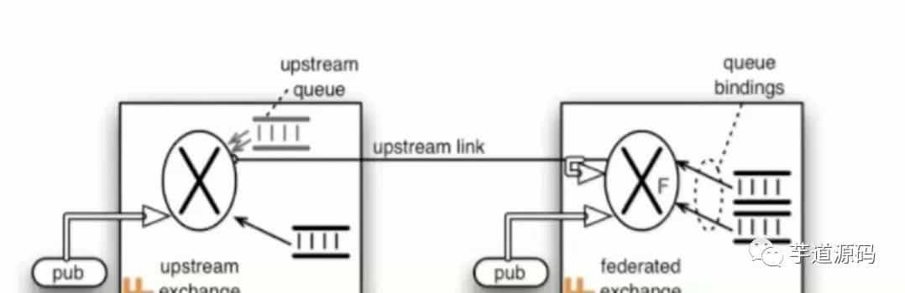

# RabbitMQ

RabbitMQ is the most widely deployed open source message broker.

---

References

- RabbitMQ 总结 : https://cloud.tencent.com/developer/article/1654903
- RabbitMQ 的应用场景以及基本原理介绍 | Laravel China 社区 : https://learnku.com/articles/27446
- 官网 : Messaging that just works - RabbitMQ : https://www.rabbitmq.com/

## 总结

Reference

- RabbitMQ 的应用场景以及基本原理介绍 | Laravel China 社区 : https://learnku.com/articles/27446

### 简介

Intro

- RabbitMQ : 一个由 Erlang 开发的 **AMQP ( Advanced Message Queuing Protocol )** 的开源实现
    - _最初起源于金融系统, 用于在分布式系统中存储转发消息, 在易用性 / 扩展性 / 高可用性 等方面表现不俗_
- AMQP : 高级消息队列协议, 是应用层协议的一个开放标准, 为面向消息的中间件设计
    - _消息中间件主要用于组件之间的解耦, 消息的发送者无需知道消息使用者的存在, 反之亦然_
    - _AMQP 的主要特征是面向消息、队列、路由 ( 包括点对点和发布 / 订阅 ) 、可靠性、安全_

### 应用场景

Applicable Scenes

- 1\. 异步处理
- 2\. 应用解耦
- 3\. 流量削峰 ( 填谷 )

### 特性

Features

- Reliability ( 可靠性 )
    - 持久化 / 传输确认 / 发布确认
- Flexible Routing ( 灵活的路由 )
    - 在消息进入队列之前, 通过 Exchange 来路由消息
        - 对于典型的路由功能, 已经提供了一些内置的 Exchange 来实现
        - 针对更复杂的路由功能, 可以将多个 Exchange 绑定在一起
        - 也通过插件机制实现自己的 Exchange
- Clustering _( 消息集群 )_
    - 多个 RabbitMQ 服务器可以组成一个集群, 形成一个逻辑 Broker
- _Highly Available Queues_ _( 高可用 )_
    - 队列可以在集群中的机器上进行镜像 _( icehe : 错字? )_ , 使得在部分节点出问题的情况下队列仍然可用
- _Multi-protocol_ _( 多种协议 )_
    - 支持多种消息队列协议, 比如 STOMP / MQTT 等
- Many Clients _( 多语言客户端 )_
    - 几乎支持所有常用语言, 比如 Java / .NET / Ruby 等
- _Management UI_ _( 管理界面 )_
    - _RabbitMQ 提供了一个易用的用户界面, 使得用户可以监控和管理消息 Broker 的许多方面_
- _Tracing_ _( 跟踪机制 )_
    - _如果消息异常, 提供了消息跟踪机制, 使用者可以找出发生了什么_
- _Plugin System_ _( 插件机制 )_
    - _提供了许多插件, 从多方面进行扩展, 也可以编写自己的插件_

### 基础概念

Basic Concepts

- **Message : 消息**, 消息是不具名的, 它 **由消息头和消息体组成**
    - 消息体是不透明的, 而消息头则由一系列的可选属性组成, 这些属性包括
        - **routing-key : 路由键**
        - **priority : 相对于其他消息的优先权**
        - **delivery-mode : 指出该消息可能需要持久性存储**
        - ……
- **Publisher : 消息的生产者**, 也是一个向交换器发布消息的客户端应用程序
- **Exchange : 交换器**, 用来接收生产者发送的消息并将这些消息路由给服务器中的队列
- **Routing Key : 路由关键字**, exchange 根据这个关键字进行消息投递
- **Binding : 绑定**, 用于消息队列和交换器之间的关联
    - **一个绑定就是基于路由键将交换器和消息队列连接起来的路由规则**
    - 所以 **可以将交换器理解成一个由绑定构成的路由表**
- **Queue : 消息队列**, 用来保存消息直到发送给消费者
    - 它是消息的容器, 也是消息的终点
    - **一个消息可投入一个或多个队列**
    - 消息一直在队列里面, 等待消费者连接到这个队列将其取走
- **Connection : 网络连接**, 比如一个 TCP 连接
- **Channel : 信道**, 多路复用连接中的一条独立的双向数据流通道
    - **信道是建立在真实的 TCP 连接内的虚拟连接**
    - AMQP 命令都是通过信道发出去的, 不管是发布消息、订阅队列还是接收消息, 这些动作都是通过信道完成
    - **因为对于操作系统来说建立和销毁 TCP 都是非常昂贵的开销, 所以引入了信道的概念, 以复用一条 TCP 连接**
- **Consumer : 消息的消费者**, 表示一个从消息队列中取得消息的客户端应用程序
- **Virtual Host : 虚拟主机**, 表示一批交换器、消息队列和相关对象
    - 虚拟主机是共享相同的身份认证和加密环境的独立服务器域
    - 每个 vhost 本质上就是一个 mini 版的 RabbitMQ 服务器, 拥有自己的队列、交换器、绑定和权限机制
    - vhost 是 AMQP 概念的基础, 必须在连接时指定, RabbitMQ 默认的 vhost 是 `/`
- **Broker : 表示消息队列服务器实体**
    - 它提供一种传输服务, 它的角色就是维护一条从生产者到消费者的路线, 保证数据能按照指定的方式进行传输

### Exchange 类型

Exchange 分发消息时根据类型的不同分发策略有区别, 目前共四种类型 : direct、fanout、topic、headers

_headers 匹配 AMQP 消息的 header 而不是路由键, 此外 headers 交换器和 direct 交换器完全一致, 但性能差很多, 目前几乎用不到了, 所以直接看另外三种类型_

#### Direct

- **消息中的路由键 ( routing key ) 如果和 Binding 中的 binding key 一致, 交换器就将消息发到对应的队列中**
- 路由键与队列名完全匹配, 如果一个队列绑定到交换机要求路由键为 "dog", 则只转发 routing key 标记为 "dog" 的消息, 不会转发 "dog.puppy", 也不会转发 "dog.guard" 等等
- 它是 **完全匹配、单播的模式**

#### Fanout

- **每个发到 fanout 类型交换器的消息都会分到所有绑定的队列上去**
- fanout 交换器不处理路由键, 只是简单的将队列绑定到交换器上, 每个发送到交换器的消息都会被转发到与该交换器绑定的所有队列上
- **很像子网广播，每台子网内的主机都获得了一份复制的消息**
- **fanout 类型转发消息是 <u>最快的</u>**

#### Topic

- **topic 交换器通过模式匹配分配消息的路由键属性, 将路由键和某个模式进行匹配, 此时队列需要绑定到一个模式上**
- 它将路由键和绑定键的字符串切分成单词, 这些单词之间用点隔开
- 它同样也会识别两个通配符 : 符号 `#` 和符号 `*`
    - `#` 匹配 0 个或多个单词, `*` 匹配不多不少一个单词
- References
    - Topic (using the Go RabbitMQ client)
 : https://www.rabbitmq.com/tutorials/tutorial-five-go.html

### ConnectionFactory, Connection, Channel

ConnectionFactory、Connection、Channel 都是 RabbitMQ 对外提供的 API 中最基本的对象

- Connection 是 RabbitMQ 的 socket 链接, 它封装了 socket 协议相关部分逻辑
- ConnectionFactory 为 Connection 的制造工厂
- Channel 是我们与 RabbitMQ 打交道的最重要的一个接口
    - 大部分的业务操作是在 Channel 这个接口中完成的
    - 包括定义 Queue、定义 Exchange、绑定 Queue 与 Exchange、发布消息等

### 任务分发机制

#### 循环分发

**Round-robin dispathching**

- **Round-robin 的分发机制非常适合扩展**, 而且它是专门为并发程序设计的
- 如果现在 load ( 负载 ) 加重，那么只需要创建更多的 Consumer 来进行任务处理

#### 消息确认

**Message acknowledgement**

- 在实际应用中, 可能会发生消费者收到 Queue 中的消息, 但没有处理完成就宕机 ( 或出现其他意外 ) 的情况, 这种情况下就可能会导致消息丢失
- 为了避免这种情况发生, 可以要求消费者在消费完消息后发送一个回执给 RabbitMQ, RabbitMQ 收到消息回执 ( Message acknowledgment ) 后才将该消息从 Queue 中移除
    - 如果 RabbitMQ 没有收到回执并检测到消费者的 RabbitMQ 连接断开, 则 RabbitMQ 会将该消息发送给其他消费者 ( 如果存在多个消费者 ) 进行处理
- **这里 不存在 timeout 概念, 一个消费者处理消息时间再长也不会导致该消息被发送给其他消费者, 除非它的 RabbitMQ 连接断开**
- **这里会产生另外一个问题，如果我们的开发人员在处理完业务逻辑后，忘记发送回执给 RabbitMQ**, 这将会导致严重的 bug :
    - **Queue 中堆积的消息会越来越多**
    - **消费者重启后会重复消费这些消息并重复执行业务逻辑**
- 另外 **pub message 是没有 ack 的**

#### 消息持久化

**Message durability**

- 如果希望即使在 RabbitMQ 服务重启的情况下, 也不会丢失消息, 可以将 Queue 与 Message 都设置为可持久化的 ( durable ) , 这样可以保证绝大部分情况下 RabbitMQ 消息不丢失
    - 但依然解决不了小概率丢失事件的发生 ( 例如 RabbitMQ 服务器已经接收到生产者的消息, 但还没来得及持久化该消息时 RabbitMQ 服务器就断电了 ) , 如果我们需要对这种小概率事件也要管理起来, 那么我们要用到事务
    - _由于这里仅为 RabbitMQ 的简单介绍, 所以这里将不讲解 RabbitMQ 相关的事务_
- 要持久化队列 queue 的持久化需要在声明时指定 `durable=True`
    - 这里要注意，**队列的名字一定要是 Broker 中不存在, 不然不能改变此队列的任何属性**
- **队列和交换机有一个创建时候指定的标志 durable, durable 的唯一含义就是具有这个标志的队列和交换机会在重启之后重新建立, 它不表示说在队列中的消息会在重启后恢复!**

> 消息持久化的 3 个部分

##### exchange 持久化

- 在声明时指定 `durable => true`

```go
channel.ExchangeDeclare(
    ExchangeName,
    "direct",
    durable:true,
    autoDelete:false,
    arguments:null
); // 声明消息队列，且为可持久化的
```

##### queue 持久化

- 在声明时指定 `durable => true`

```go
channel.QueueDeclare(
    QueueName,
    durable:true,
    exclusive:false,
    autoDelete:false,
    arguments:null
); // 声明消息队列，且为可持久化的
```

##### message 持久化

- 在投递时指定 `delivery_mode => 2` _( 1 是非持久化 )_

```go
channel.basic_publish(
    exchange = '',
    routing_key = "task_queue",
    body = message,
    properties = pika.BasicProperties(
       delivery_mode = 2, # make message persistent
    )
)
```

##### 相关说明

- **如果 exchange 和 queue 都是持久化的, 那么它们之间的 binding 也是持久化的**
- **如果 exchange 和 queue 两者之间有一个持久化, 一个非持久化, 则不允许建立绑定!**
- 注意 : **一旦创建了队列和交换机, 就不能修改其标志了!**
    - 例如, 创建了一个 non-durable 的队列, 然后想把它改变成 durable 的, 唯一的办法就是删除这个队列然后重现创建

关于持久化的进一步讨论

- 为了数据不丢失，采用了 :
    - 在数据处理结束后发送 ack : 这样 RabbitMQ Server 会认为 Message Deliver 成功
    - 持久化 queue : 可以防止 RabbitMQ Server 重启或者 crash 引起的数据丢失
    - 持久化 message : 理由同上
- 但是这样能保证数据 100% 不丢失吗? 不能保证!
    - 问题就在与 RabbitMQ 需要时间去把这些信息存到磁盘上
        - 这个 time window 虽然短, 但是它的确还是有
        - 在这个时间窗口内如果数据没有保存, 数据还会丢失
    - 还有另一个原因就是 **RabbitMQ 并不是为每个 Message 都做 fsync** :
        - **它可能仅仅是把它保存到 Cache 里, 还没来得及保存到物理磁盘上**
        - 因此这个持久化还是有问题, 但是对于大多数应用来说，这已经足够了
    - 当然为了保持一致性, 你可以把每次的 publish 放到一个 transaction 中
        - 这个 transaction 的实现需要 user defined codes
    - 那么商业系统会做什么呢?
        - 一种可能的方案 : **在系统 panic 时或者异常重启时或者断电时, 应该给各个应用留出时间去 flash cache, 保证每个应用都能 exit gracefully**

#### 公平分发

**Fair dispathing**

- 默认分发机制不是那么优雅
    - 默认状态下, RabbitMQ 将第 n 个 Message 分发给第 n 个 Consumer
    - n 是取余后的, 它不管 Consumer 是否还有 unacked Message, 只是按照这个默认的机制进行分发
    - 那么如果有个 Consumer 工作比较重, 那么就会导致有的 Consumer 基本没事可做, 有的 Consumer 却毫无休息的机会那么
- RabbitMQ 如何处理这种问题呢？ **Prefetch count**
    - 前面我们讲到如果有多个消费者同时订阅同一个 Queue 中的消息, Queue 中的消息会被平摊给多个消费者
    - 这时如果每个消息的处理时间不同, 就有可能会导致某些消费者一直在忙, 而另外一些消费者很快就处理完手头工作并一直空闲的情况.
    - 我们可以通过设置 `prefetchCount` 来限制 Queue 每次发送给每个消费者的消息数
        - 例如设置 `prefetchCount=1` , 则 Queue 每次给每个消费者发送一条消息;
        - 消费者处理完这条消息后 Queue 会再给该消费者发送一条消息.
- 通过 `basic.qos` 方法设置 `prefetch_count=1`, 这样 RabbitMQ 就会使得每个 Consumer 在同一个时间点最多处理一个 Message,
    - 换句话说，在接收到该 Consumer 的 ack 前，它不会将新的 Message 分发给它

```go
channel.basic_qos(prefetch_count=1)
```

- 注意 : **这种方法可能会导致 queue 满!**
    - 当然, 这种情况下可能需要添加更多的 Consumer, 或者创建更多的 virtualHost 来细化你的设计

### 消息序列化

**RabbitMQ 使用 ProtoBuf 序列化消息**

- 它可作为 RabbitMQ 的 Message 的数据格式进行传输
- 由于是结构化的数据，这样就极大的方便了 Consumer 的数据高效处理

当然也可以使用 XML, 与 XML 相比, **ProtoBuf 有以下优势 :**

- 1\. 协议简单
- 2\. size 小了 3~10 倍
- 3\. 速度快了 20~100 倍
- 4\. 易于编程
- 5\. 减少了语义的歧义

ProtoBuf 具有速度和空间的优势, 使得它现在应用非常广泛 _( icehe : 类似的协议如 Thrift )_

### RPC

- MQ 本身是基于异步的消息处理, 前面的示例中所有的生产者 ( P ) 将消息发送到 RabbitMQ 后, 不会知道消费者 ( C ) 处理成功或者失败 ( 甚至连有没有消费者来处理这条消息都不知道 )
- 但实际的应用场景中，我们很可能需要一些同步处理, 需要同步等待服务端将我的消息处理完成后再进行下一步处理
    - 这相当于 RPC ( Remote Procedure Call 远程过程调用 )
    - 在 RabbitMQ 中也支持 RPC

RabbitMQ 中实现 RPC 的机制

- 客户端发送请求 ( 消息 ) 时，在消息的属性 ( MessageProperties, 在 AMQP 协议中定义了 14 个 properties, 这些属性会随着消息一起发送 ) 中设置两个值 replyTo ( 一个 Queue 名称, 用于告诉服务器处理完成后将通知我的消息发送到这个 Queue 中 ) 和 correlationId ( 此次请求的标识号，服务器处理完成后需要将此属性返还, 客户端将根据这个 id 了解哪条请求被成功执行了或执行失败 )
- 服务器端收到消息并处理, 服务器端处理完消息后, 将生成一条应答消息到 replyTo 指定的 Queue, 同时带上 correlationId 属性
- 客户端之前已订阅 replyTo 指定的 Queue, 从中收到服务器的应答消息后, 根据其中的 correlationId 属性分析哪条请求被执行了, 根据执行结果进行后续业务处理

### RabbitMQ 选型和对比

1\. 从社区活跃度

- 按照目前网络上的资料, RabbitMQ 、activeM 、ZeroMQ 三者中, 综合来看, RabbitMQ 是首选

2\. 持久化消息比较

- ZeroMq 不支持, ActiveMq 和 RabbitMq 都支持
    - 持久化消息主要是指我们机器在不可抗力因素等情况下挂掉了, 消息不会丢失的机制

3\. 综合技术实现

- 可靠性、灵活的路由、集群、事务、高可用的队列、消息排序、问题追踪、可视化管理工具、插件系统等等
    - RabbitMq / Kafka 最好, ActiveMq 次之, ZeroMq 最差
    - 当然 ZeroMq 也可以做到, 不过自己必须手动写代码实现, 代码量不小
- 尤其是我们需要可靠性中的 : 持久性、投递确认、发布者证实和高可用性等

4\. 高并发

- 毋庸置疑, RabbitMQ 最高, 原因是它的实现语言是天生具备高并发高可用的 Erlang 语言
    - _( icehe : 这个说法存疑, 我之前了解的 RabbitMQ 优缺点如下 )_
    - _( 优点 : 轻量级, 功能齐全, 易用 )_
    - _( 缺点 : 在高并发/海量消息的场景下, 可靠性不足, 高并发的情况下延迟较高 )_

5\. 比较常见的比较， RabbitMQ 和 Kafka

- RabbitMq 比 Kafka 成熟, 在可用性、稳定性、可靠性上, RabbitMQ 胜于 Kafka ( 理论上 )
- 另外, Kafka 的定位主要在日志等方面, 因为 Kafka 设计的初衷就是处理日志的, 可以看做是一个日志 ( 消息 ) 系统一个重要组件
    - 针对性很强, 所以如果业务方面还是建议选择 RabbitMQ
    - _( icehe : 这里也存疑, 后来 kafka 的发展方向是 "流处理", 现在不太确定它已经是否变得足够好 )_
    - _( 但是国内互联网企业确实不常使用 kafka 作为可靠传输的消息队列中间件 )_
- 不过, kafka 的性能 ( 吞吐量、TPS ) 确实比 RabbitMq 要高出来很多

选型最后总结

- 如果我们系统中已经有选择 kafka 或者 RabbitMq , 并且完全可以满足现在的业务, 建议就不用重复去增加和造轮子
- 可以在 kafka 和 RabbitMq 中选择一个适合自己团队和业务的, 这个才是最重要的
    - 但是毋庸置疑现阶段, 综合考虑没有第三选择
- _( icehe : 总体来说, 互联网大厂, 一般都会提供 2 种 ( 甚至 3 种 ) 队列中间件 )_
    - _( 一种吞吐量大, 但是延迟较高 -- kafka )_
    - _( 一种延迟较低, 但是吞吐量小 -- RabbitMQ )_
    - _( 一种可靠性高, ( 尽可能 ) 保证消息不丢失, 但是吞吐量较小, 以及延迟较大 -- ActiveMQ / RocketMQ ? )_
    - _( RabbitMQ 属于功能齐全, 易用; 但是在高并发场景下 吞吐量较低, 延迟较大 )_

---

## 应用场景以及基本原理介绍

Reference

- RabbitMQ 总结 : https://cloud.tencent.com/developer/article/1654903

AMQP 协议

- Advanced Message Queuing Protocol

### 核心概念

- **Server : 又称 Broker** _( 掮客 )_ , 接受客户端连接, 实现 AMQP 实体服务
- **Connection** : 与具体 Broker 网络连接
- **Channel** : 网络信道, 几乎所有操作都在 Channel 中进行, Channel 是消息读写的通道
    - **客户端可以建立多个 Channel, 每个 Channel 表示一个会话任务**
- Message : 消息, 服务器和应用程序之间传递的数据, **由 Properties 和 Body 组成**
    - **Properties 可以对消息进行修饰, 比如消息的优先级, 延迟等高级特性**
    - Body 是消息实体内容
- **Virtual Host** : 虚拟主机, 用于逻辑隔离, 最上层消息的路由
    - 一个 Virtual Host 可以若干个 Exchange 和 Queue
    - 同一个 Virtual Host 不能有同名的 Exchange 或 Queue
- **Exchange : 交换机, 接受消息，根据路由键转发消息到绑定的队列上**
- **Binding : Exchange 和 Queue 之间的虚拟连接, binding 中可以包括 routing key**
- **Routing Key : 一个路由规则, 虚拟机根据他来确定如何路由一条消息**
- Queue : 消息队列, 用来存放消息的队列

### Exchange


**Exchange 类型**


- **Direct Exchange : 所有发送到 Direct Exchange 的消息被转发到 Routing Key 中指定的 Queue**
    - Direct Exchange 可以使用默认的 Exchange
    - 默认的 Exchange 会绑定所有的队列, 所以 Direct 可以直接使用 Queue 名 ( 作为 Routing Key ) 绑定 _( icehe : 要实际使用一下来理解 )_
    - 或者消费者和生产者的 Routing Key 完全匹配


- **Topic Exchange : 发送到 Topic Exchange 的消息被转发到所有关心的 Routing Key 中指定 Topic 的 Queue 上**
    - Exchange 将 Routing Key 和某 Topic 进行模糊匹配, 此时队列需要绑定一个 Topic
    - 所谓模糊匹配就是可以使用通配符, `#` 可以匹配一个或多个词, 只匹配一个词比如 `log.#` 可以匹配 `log.info.test` `log.` 就只能匹配 `log.error`


- **Fanout Exchange : 不处理路由键, 只需简单的将队列绑定到交换机上**
    - 发送到改 Exchange 上的消息都会被发送到与该 Exchange 绑定的 queues 上
    - Fanout 转发是最快的
- _Headers Exchange : 允许你匹配 AMQP 消息的 headers 而非路由键_
    - _除此之外, Headers Excahnge 和 Direct Exchange 完全一致, 但性能会差很多_
    - 因此它 **并不太实用，而且几乎再也用不到了**

其它配置

- Durability : 是否需要持久化, true 为需要
- Auto Delete : 当最后一个绑定 Exchange 上的队列被删除时, 该 Exchange 也会被删除

### 保证消息 100% 投递

什么是生产端的可靠性投递？

- 保证消息的成功发出
- 保证 MQ 节点的成功接收
- 发送端 MQ 节点 ( broker ) 收到消息确认应答
- 完善消息进行补偿机制

#### 可靠性投递保障方案

- A. 消息落库, 对消息进行打标


- B. 消息的延迟投递
    - 在高并发场景下，每次进行 DB 的操作都是每场消耗性能的
    - 使用延迟队列来减少一次数据库的操作
    - _( icehe : 这里看图不太理解 )_


#### 消息幂等性

- 对一个动作进行操作, 肯定要能执行 100次 甚至 1000 次, 对于这 1000 次执行的结果都必须一样的
    - 例如, 单线程方式下执行 `update count - 1` 的操作执行 1000 次结果都是一样的, 这时这个更新操作就是幂等的
    - 如果是在并发不做线程安全的处理的情况下 update 一千次操作结果可能就不是一样的, 这时并发情况下的 update 操作就不是幂等的
    - 对应到消息队列上来, 就是 **即使受到了多条一样的消息, 也和消费一条消息效果是一样的**

_( icehe : 意思是可以能够去重么? 是不是也允许重复给同一个消费者投递相同的消息多次? 感觉有点歧义 )_

#### 高并发的情况下避免消息重复消费

- A. 唯一ID + 加指纹码, 利用数据库主键去重
    - 优点 : 实现简单
    - 缺点 : 高并发下有数据写入瓶颈
- B. 利用 Redis 的原子性来实现去重
    - 使用 Redis 进行幂等是需要考虑的问题

其它问题

- 是否 DB 落库, 落库后 DB 和 Cache 如何做到保证幂等 ( Redis 和 DB 如何同时成功同时失败 ) ?
- 如果不 DB 落库, 都放在 Redis 中, 如何实现 Redis 和 DB 的数据同步策略? 还有放在缓存中就能百分之百的成功吗?

#### Confirm 确认消息 Return 返回消息

Confirm 消息确认机制

- 消息的确认, 指生产者收到投递消息后, 如果 Broker 收到消息就会给生产者一个应答, 生产者接受应答来确认 Broker 是否收到消息

如何实现 Confirm 确认消息?

- 在 Channel 上开启确认模式 : `channel.confirmSelect()`
- 在 Channel 上添加监听者 : `addConfirmListener` , 根据监听成功和失败的结果, 决定重新发送消息或者记录日志

Return 消息返回机制

- **Return 消息机制处理一些不可路由的消息, 生产者通过指定一个 Exchange 和 Routing Key, 把消息送达到某一个队列中去, 然后消费者监听该队列进行消费处理!**
    - _( icehe : Dead Latter Exchange 死信队列? 应该不是 )_
- 在某些情况下，如果在发送消息的时候当 Exchange 不存在或者指定的 Routing Key 路由找不到, 这个时候如果需要监听这种不可到达的消息, 就要使用 **Return Listener** !
- Mandatory 设置为 true 则会监听器会接受到路由不可达的消息, 然后处理
    - 如果设置为 false, Broker 将会自动删除该消息

#### 消费端限流

假设一个场景, 有个 RabbitMQ 服务器上有上万条消息未消费, 然后随便打开一个消费者客户端, 会出现 : 巨量的消息瞬间推送过来, 但是消费端无法同时处理这么多数据.

这时就会导致你的服务崩溃. 其他情况也会出现问题, 例如生产者与消费者能力不匹配, 在高并发的情况下生产端产生大量消息, 消费端无法消费那么多消息.

RabbitMQ 提供了一种 QoS ( 服务质量保证 ) 的功能, 即非自动确认消息的前提下, 如果有一定数目的消息 ( 通过 Consumer 或者 Channel 设置 QoS ) 未被确认, 不进行新的消费

```cpp
void basicQOS(unit prefetchSize, ushort prefetchCount, Boolean global)
```

- prefetchSize : 单条消息的大小限制, 0 就是不限制; 默认值为 0, 即不限制
- prefetchCount : 设置一个固定的值, 告诉 RabbitMQ 不要同时给一个消费者推送多于 N 个消息, 即一旦有 N 个消息还没有 ACK, 则 Consumer 将 Block 掉, 直到有消息 ACK
- global : 是否将上面的设置用于 Channel, 也是就是说上面设置的限制是用于 Channel 级别的还是 Consumer 级别

#### 消费端 ACK 与重回队列

消费端 ACK

- 消费端进行消费的时候, **如果消费端碰到业务异常, 可以进行日志的记录, 然后进行补偿 ( 也可以加上最大努力次数的尝试 )**
- **如果碰到服务器宕机等严重问题, 那就需要手动进行 ACK 保证消费端的消费成功!**

消息重回队列

- **重回队列 : 把没有处理成功的消息重新投递给 Broker**
- 实际应用中 **一般都不开启重回队列**

#### TTL 队列 / 消息

**TTL : Time To Live 生存时间**

- 支持 **消息的过期时间**, 在消息发送时可以指定
- 支持 **队列过期时间**, 在消息入队列开始计算时间, 只要超过了队列的超时时间配置, 那么消息就会自动的清除

#### 死信队列

**DLX : Dead-Letter-Exchange 死信队列**

利用 DLX, 当消息在一个队列中变成死信 ( Dead Message, 就是没有任何消费者消费 ) 之后, 他能被重新 publish 到另一个 Exchange, 这个 Exchange 就是 DLX

消息变为死信的几种情况

- 1\. 消息被拒绝 ( basic.reject / basic.nack ) 同时 requeue=false ( 不重回队列 )
- 2\. TTL 过期
- 3\. 队列达到最大长度

DLX 也是一个正常的 Exchange

- 和一般的 Exchange 没有任何的区别, 它能在任何的队列上被指定, 实际上就是设置某个队列的属性
- 当这个队列出现死信的时候, RabbitMQ 就会自动将这条消息重新发布到该 Exchange 上去, 进而被路由到另一个队列
- 可以监听这个队列中的消息作相应的处理, 这个特性可以弥补 RabbitMQ 以前支持的 immediate 参数的功能

死信队列的设置

- 设置 Exchange 和 Queue, 然后进行绑定
    - Exchange : dlx.exchange _( 自定义的名字 )_
    - Queue : dlx.queue _( 自定义的名字 )_
    - Routing Key : `#` _( `#` 表示任何 Routing Key 出现死信都会被路由过来 )_

然后在正常的声明 Exchange、Queue、Binding, 只需要我们在 Queue 加上以下参数即可 :

```c
arguments.put("x-dead-letter-exchange","dlx.exchange");
```

### 集群模式

- 主备模式 : 实现 RabbitMQ 高可用集群, 一般在并发量和数据不大的情况下
    - 这种模式好用简单, 又称 warren 模式
    - _( 区别于主从模式, 主从模式主节点提供写操作, 从节点提供读操作 )_
    - _( 主备模式从节点不提供任何读写操作, 只做备份 )_
    - 如果主节点宕机备份从节点会自动切换成主节点, 提供服务
- 集群模式 : 经典方式就是 Mirror 模式, 保证 100% 数据不丢失, 实现起来也是比较简单

Mirror Queue 镜像队列


- **镜像队列, 是 RabbitMQ 数据高可用的解决方案**
    - 主要实现数据同步, **一般来说是由 2~3节 点实现数据同步, ( 对于 100% 消息可靠性解决方案一般是 3 个节点 )**

多活模式

- **多活模式** : 也是实现 **异地数据复制的主流模式**
    - _因为 Shovel 模式配置相对复杂, 所以一般来说实现异地集群都是使用这种双活模式_
    - _多活模式需要依赖 RabbitMQ 的 federation 插件, 可以实现持续可靠的 AMQP 数据_
- RabbitMQ 部署架构采用双中心模式 ( 多中心 ) 在两套 ( 或多套 ) 数据中心个部署一套 RabbitMQ 集群
    - 各中心的 RabbitMQ 服务需要为提供正常的消息业务外, **数据中心之间还需要实现部分队列消息共享**


> Federation 插件是一个不需要构建 Cluster, 而在 Brokers 之间传输消息的高性能插件,
> Federation 可以在 Brokers 或者 Cluster 之间传输消息,
> 连接的双方可以使用不同的 Users 或者 Virtual Host,
> 双方也可以使用不同版本的 Erlang 或者 RabbitMQ 版本.
> Federation 插件可以使用 AMQP 协议作为通讯协议, 可以接受不连续的传输.



- **Federation Exchanges**, 可以看成 Downstream 从 Upstream 主动拉取消息
    - 但并不是拉取所有消息, 必须是在 Downstream 上已经明确定义 Bindings 关系的 Exchange
    - 也就是有实际的物理 Que ue来接收消息, 才会从 Upstream 拉取消息到 Downstream
- 使用 AMQP 协议实施代理间通信, Downstream 会将绑定关系组合在一起, 绑定/解除绑定命令将发送到 Upstream 交换机
- 因此, Federation Exchange 只接收订阅的消息

### 高性能的 HAProxy

> HAProxy 是一款提供高可用性、负载均衡
> 以及基于 TCP ( 第四层 ) 和 HTTP ( 第七层 ) 应用的代理软件,
> 支持虚拟主机 ( Virtual Host ), 它是免费、快速并且可靠的一种解决方案.
> HAProxy 特别适用于那些负载特大的 Web 站点, 这些站点通常又需要会话保持或七层处理.
> HAProxy 运行在时下的硬件上, 完全可以支持数以万计的并发连接.
> 并且它的运行模式使得它可以很简单安全的整合进您当前的架构中,
> 同时可以保护你的 Web 服务器不被暴露到网络上.

HAProxy 为何性能好?

- **单进程、事件驱动模型** 显著降低了上下文切换的开销及内存占用.
- 在任何可用的情况下, 单缓冲 ( **single buffering** ) 机制能 **以不复制任何数据的方式完成读写操作**, 这会节约大量的 CPU 时钟周期及内存带宽.
- 借助于 Linux 2.6 ( >= 2.6.27.19 ) 上的 `splice()` 系统调用, HAProxy 可以实现 **零复制转发** ( **Zero-copy forwarding** ) , 在 Linux 3.5 及以上的 OS 中还可以实现 **零复制启动** ( **zero-starting** )
- **内存分配器在固定大小的内存池中可实现即时内存分配**, 这能够显著减少创建一个会话的时长.
- **树型存储** : 侧重于使用 RabbitMQ 作者多年前开发的弹性二叉树, 实现了以 O(log(N)) 的低开销来保持计时器命令、保持运行队列命令及管理轮询及最少连接队列

#### KeepAlive

> **KeepAlive 软件主要是通过 VRRP 协议来实现高可用功能.**
> **VRRP : Virtual Router RedundancyProtocol ( 虚拟路由器冗余协议 )**.
> **VRRP 出现的目的就是为了解决静态路由单点故障问题的**,
> 它能够保证当个别节点宕机时, 整个网络可以不间断地运行,
> 所以 KeepAlive 一方面具有配置管理 LVS 的功能,
> 同时还具有对 LVS 下面节点进行健康检查的功能,
> 另一方面也可实现系统网络服务的高可用功能.

KeepAlive 的作用

- 管理 LVS 负载均衡软件
- 实现 LVS 集群节点的健康检查
- 作为系统网络服务的高可用性保证? ( failover )

KeepAlive 如何实现高可用?

- KeepAlive 高可用服务对之间的故障切换转移, 是通过 VRRP ( Virtual Router Redundancy Protocol 虚拟路由器冗余协议 ) 来实现的
    - 在 KeepAlive 服务正常工作时, 主 Master 节点会不断地向备节点发送 ( 多播的方式 ) 心跳消息, 用以告诉备 Backup 节点自己还活看
    - 当主 Master 节点发生故障时, 就无法发送心跳消息, 备节点也就因此无法继续检测到来自主 Master 节点的心跳了, 于是调用自身的接管程序, 接管主 Master 节点的 IP 资源及服务.
    - 而当主 Master 节点恢复时备 Backup 节点又会释放主节点故障时自身接管的 IP 资源及服务, 恢复到原来的备用角色.
