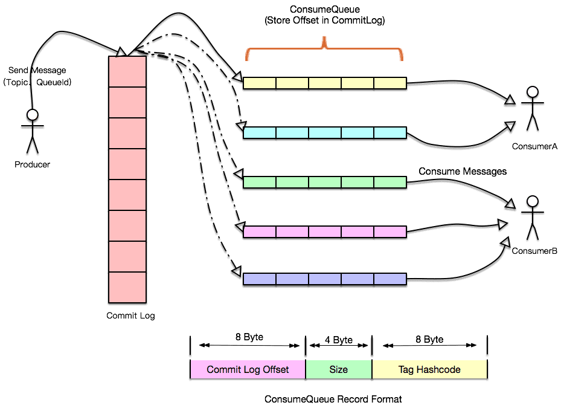
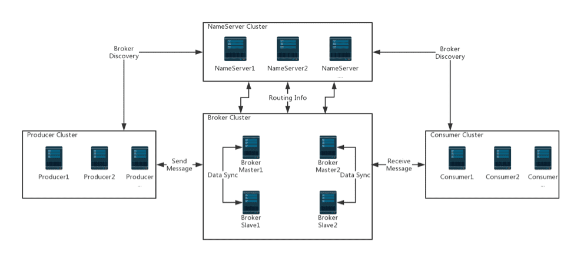
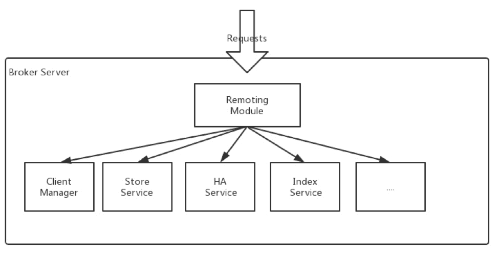
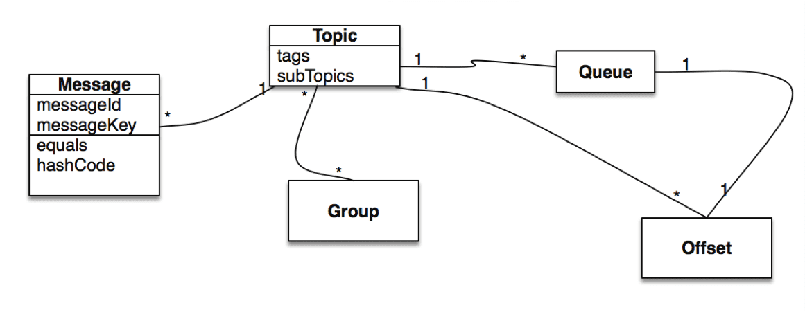

# RocketMQ

> A unified messaging engine，lightweight data processing platform.

References

- Home Page : https://rocketmq.apache.org
    - Why RocketMQ : https://rocketmq.apache.org/docs/motivation
        - How to Support More Queues in RocketMQ? : https://rocketmq.apache.org/rocketmq/how-to-support-more-queues-in-rocketmq
    - Quick Start : https://rocketmq.apache.org/docs/quick-start
    - ……
- Documentation - CN : https://github.com/apache/rocketmq/tree/master/docs/cn
- TODOs RocketMQ总结
    - https://www.jianshu.com/p/fabb2d14ffa1
    - https://www.cnblogs.com/Jtianlin/p/8427033.html
    - https://juejin.im/post/6844904201416359949
    - https://blog.csdn.net/u012385190/article/details/108120931
    - https://liuyanzhao.com/1307946145498140672.html
    - http://woshinlper.com/system-design/data-communication/RocketMQ/

## Intro

References

- Home Page : https://rocketmq.apache.org
    - Why RocketMQ : https://rocketmq.apache.org/docs/motivation

### Features

- **Low Latency**
    - **More than 99.6% response latency within 1 millisecond under high pressure.**
- **Finance Oriented**
    - High availability with **tracking and auditing** features.
- Industry Sustainable _( 产业可持续发展的 ( 工业级的? ) )_
    - **Trillion-level message capacity guaranteed.**
- Vendor Neutral _( 厂商中立性 )_
    - A new open distributed messaging and streaming standard since latest 4.1 version.
- BigData Friendly
    - Batch transferring with versatile integration for flooding throughput.
- **Massive Accumulation**
    - Given sufficient disk space, **accumulate messages without performance loss**.

### Motivation

- At early stages, we constructed our distributed messaging middleware based on ActiveMQ 5.x(prior to 5.3).
    - Our multinational _( 跨国的 )_ business uses it for asynchronous communication, search, social network activity stream, data pipeline, even in its trade processes.
    - As our trade business throughput rises, pressure originating from our messaging cluster also becomes urgent.

#### Why RocketMQ ?

- Based on our research, with increased queues and virtual topics in use, **ActiveMQ IO module reaches a bottleneck**.
    - We tried our best to solve this problem through throttling, circuit breaker or degradation, but it did not work well.
    - So we begin to focus on the popular messaging solution Kafka at that time.
    - Unfortunately, **Kafka can not meet our requirements especially in terms of low latency and high reliability**, see [here](https://rocketmq.apache.org/rocketmq/how-to-support-more-queues-in-rocketmq/) for details _( How to Support More Queues in RocketMQ? )_ .
- In this context, we decided to invent a new messaging engine to handle a broader set of use cases, ranging from traditional pub/sub scenarios to high volume real-time zero-loss tolerance transaction system.
    - We believe this solution can be beneficial, so we would like to open source it to the community.
    - Today, more than 100 companies are using the open source version of RocketMQ in their business.
- The following table demonstrates the comparison between RocketMQ, ActiveMQ and Kafka (Apache's most popular messaging solutions according to awesome-java):

#### RocketMQ vs. ActiveMQ vs. Kafka

<!--

- _Please note this documentation is written by the RocketMQ team._
    - _Although the ideal is a disinterested comparison of technology and features, the authors' expertise and biases obviously favor RocketMQ._
- _The table below is a handy quick reference for spotting the differences among RocketMQ and its most popular alternatives at a glance._

-->

|Messaging Product|ActiveMQ|Kafka|RocketMQ|
|-|-|-|-|
|Client SDK|Java, .NET, C++ etc.|Java, Scala etc.|Java, C++, Go|
|**Protocol and Specification**|**Push model**, <br/>support OpenWire, STOMP, AMQP, MQTT, JMS|**Pull model**, <br/>support TCP|**Pull model**, <br/>support TCP, JMS, OpenMessaging|
|**Ordered Message**|**Exclusive Consumer or Exclusive Queues** <br/>can ensure ordering|Ensure ordering of messages <br/>**within a partition**|**Ensure strict ordering** of messages, <br/>and can scale out gracefully|
|Scheduled Message|Supported|Not Supported|Supported|
|**Batched Message**|Not Supported|Supported, <br/>with **async producer**|Supported, <br/>with **sync mode to avoid message loss**|
|**BroadCast Message**|Supported|Not Supported|Supported|
|Message Filter|Supported|Supported, <br/>you can use Kafka Streams to filter messages|Supported, <br/>property filter expressions based on SQL92|
|**Server Triggered Redelivery**|Not Supported|Not Supported|Supported|
|**Message Storage**|Supports very fast persistence using JDBC along with a high performance journal，<br/>such as levelDB, kahaDB|High performance file storage|High performance and low latency file storage|
|**Message Retroactive**<br/>_(有追溯效力的)_|Supported|Supported **offset indicate**|Supported **timestamp and offset two indicates**|
|Message Priority|Supported|Not Supported|Not Supported|
|**High Availability and Failover**|Supported, <br/>depending on storage, **if using kahadb it requires a ZooKeeper server**|Supported, <br/>**requires a ZooKeeper server**|Supported, <br/>**Master-Slave model, without another kit**|
|Message Track|Not Supported|Not Supported|Supported|
|**Configuration**|The default configuration is low level, <br/>user **need to optimize the configuration parameters**|Kafka uses **key-value pairs format for configuration**. <br/>These values can be supplied either from a file or programmatically.|Work out of box, user **only need to pay attention to a few configurations**|
|Management and Operation Tools|Supported|Supported, <br/>use terminal command to expose core metrics|Supported, <br/>rich web and terminal command to expose core metrics|

### How to Support More Queues in RocketMQ?

References

- Home Page : https://rocketmq.apache.org
    - Why RocketMQ : https://rocketmq.apache.org/docs/motivation
    - How to Support More Queues in RocketMQ? : https://rocketmq.apache.org/rocketmq/how-to-support-more-queues-in-rocketmq

#### Summary

- **Kafka** is a distributed streaming platform, which was **born from logging aggregation cases.**
    - It does not need too high concurrency.
    - In some **large scale cases in alibaba**, we found that the **original model has been unable to meet our actual needs**.
    - So, we developed a messaging middleware, named RocketMQ, which can handle a broad set of use cases,
        - ranging from **traditional publish/subscribe scenario** to <u>**demandingly high volume realtime transaction system that tolerates no message loss**</u>.
    - Now, in alibaba, RocketMQ clusters process more than 500 billion events every day, provide services for more than 3000 core applications.

#### Partition design in kafka

- 1\. Producer parallelism of writing is bounded by the number of partitions.
- 2\. The degree of consumer consumption parallelism, is also bounded by the number of partitions being consumed.
    - **Assuming that the number of partitions is 20, the maximum number of concurrent consuming consumers is 20.**
- 3\. Each topic consists of a fixed number of partitions.
    - **Partition number determines the maximum number of topics that single broker may have <u>without significantly affecting performance</u>.**

More details please refer to [here](http://www.confluent.io/blog/how-to-choose-the-number-of-topicspartitions-in-a-kafka-cluster) _( How to choose the number of topics/partitions in a Kafka cluster? )_ .

##### Why Kafka can't support more partitions

- 1\. Each partition stores the whole message data.
    - **Although each partition is orderly written to the disk, as number of concurrently writing partitions increases, writing become random in the perspective of operating system.**
- 2\. Due to the scattered data files, it is difficult to use the Linux IO Group Commit mechanism.

#### How to support more partition in RocketMQ?



- 1\. **All message data are stored in commit log files.**
    - All writes are completely sequential whilst _( 同时 )_ reads are random.
- 2\. ConsumeQueue stores the actual user consumption location information, which are also flushed to disk in sequential manner.

> pros ：_( producers )_

- 1\. Each consume queue is lightweight and contains limited amount of meta data.
- 2\. **Access to disk is totally sequential**, which avoids disk lock contention, and will not incur high disk IO wait when a large number of queues has been created.
    - _( icehe : 思路都差不多, 尽可能顺序写 )_

> cons ：_( consumers )_

- 1\. Message consumption will **first read consume queue, then commit log**.
    - This process brings in certain cost in worst cases.
- 2\. Commit log and consume queues need to be logically consistent, which introduces extra complexities to programming model.

> Design Motivation :

- 1\. **Random read**.
    - **Read as much as possible to increase the page cache hit rate, and reduce read IO operations.**
    - So large memory is still preferable.
    - If massive messages are accumulated, would the read performance degrade badly? The answer is negative, reasons are as follows:
        - Even if size of the message is only 1KB, the system will read more data in advance, see PAGECACHE prefetch for reference.
            - This means for the sequel data read, it is access to main memory that will be carried out instead of slow disk IO read.
        - Random access CommitLog from disk.
            - If set the I/O scheduler to NOOP in case of SSD, the read qps will be greatly accelerated thus much faster than other elevator scheduler algorithm.
- 2\. Given ConsumeQueue stores fixed-size metadata only, which is mainly used to record consuming progress, random read is well supported.
    - Taking advantage of page cache prefetch, accessing ConsumeQueue is as efficiently fast as accessing main memory, even if it's in the case of massive message accumulation.
    - As a result，ConsumeQueue will NOT bring in _( 引入 )_ noticeable penalty to the read performance.
    - _( icehe : 硬盘内容在内存的读缓存, 以及预读, 真的这么有效吗? 存疑 )_
- 3\. CommitLog stores virtually all information, including the message data.
    - Similar to redo log of relational database, consume queues, message key indexes and all other required data can be completely recovered as long as commit log exists..

## Architecture

Reference

- RocketMQ Architecture https://rocketmq.apache.org/docs/rmq-arc/

### Overview

- Apache RocketMQ is a distributed messaging and streaming platform with low latency, high performance and reliability, trillion-level capacity and flexible scalability.
    - It consists of four parts: **name servers, brokers, producers and consumers**.
    - Each of them **can be horizontally extended without a single Point of Failure**.
    - _As shown in screenshot below._



#### NameServerCluster

- Name Servers provide **lightweight service discovery and routing**.
    - Each Name Server records full routing information, provides corresponding reading and writing service, and supports fast storage expansion.

#### Broker Cluster

- Brokers take care of **message storage by providing lightweight TOPIC and QUEUE mechanisms**.
    - They support the <u>**Push and Pull model**</u>, contains **fault tolerance mechanism (2 copies or 3 copies)**, and provides **strong padding of peaks** and capacity of **accumulating hundreds of billion messages in their original time order**.
    - In addition, Brokers provide **disaster recovery**, **rich metrics statistics**, and **alert mechanisms**, all of which are lacking in traditional messaging systems.

#### Producer Cluster

- Producers support **distributed deployment**.
    - Distributed Producers send messages to the Broker cluster through **multiple load balancing modes**.
    - The sending processes support **fast failure** and have low latency.

#### Consumer Cluster

- Consumers support **distributed deployment in the Push and Pull model** as well.
    - It also supports **cluster consumption** and **message broadcasting**.
    - It provides **real-time message subscription mechanism** and can meet most consumer requirements.
    - _RocketMQ's website provides a simple quick-start guide to interested users._

### NameServer

- NameServer is a fully functional server, which mainly includes two features:
    - **Broker Management**, NameServer accepts the register from Broker cluster and provides heartbeat mechanism to check whether a broker is alive.
    - **Routing Management**, each NameServer will hold whole routing info about the broker cluster and the queue info for clients query.
- As we know, RocketMQ clients(Producer/Consumer) will query the queue routing info from NameServer, but how do clients find NameServer address?
- There are four methods to feed NameServer address list to clients:
    - Programmatic Way, like `producer.setNamesrvAddr("ip:port")`.
    - Java Options, use `rocketmq.namesrv.addr`.
    - Environment Variable, use `NAMESRV_ADDR`.
    - HTTP Endpoint.
- More details about how to find NameServer address please refer to [here](https://rocketmq.apache.org/rocketmq/four-methods-to-feed-name-server-address-list/) _( Four Methods to Feed Name Server Address List )_ .

### Broker Server

- Broker server is responsible for **message store and delivery**, **message query**, **HA guarantee**, and so on.
- _As shown in image below,_ Broker server has several important sub modules:
    - **Remoting Module**, the entry of broker, handles the requests from clients.
    - **Client Manager**, manages the clients (Producer/Consumer) and maintains topic subscription of consumer.
    - **Store Service**, provides simple APIs to store or query message in physical disk.
    - **HA Service**, provides data sync feature between master broker and slave broker.
    - **Index Service**, builds index for messages by specified key and provides quick message query.



## Best Pratice

### Core Concept

Reference

- Core Concept : https://rocketmq.apache.org/docs/core-concept



According to the above model, we can dig deeper into some topics about messaging system design:

- Consumer Concurrency
- Consumer Hot Issues _( 热点问题 )_
- Consumer Load Balance
- Message Router
- Connection Multiplex
- Canary _( 金丝雀 )_ Deployments

#### Producer

- A producer sends messages generated by the business application systems to brokers.
    - RocketMQ provides **multiple paradigms _( 范例 )_ of sending** :
        - **synchronous**,
        - **asynchronous** _and_
        - **one-way**.

##### Producer Group

- Producers of the same role are grouped together.
    - A different producer instance of the same producer group may be contacted by a broker to commit or roll back a transaction in case the original producer crashed after the transaction.
- Warning :
    - Considering the provided producer is sufficiently powerful at sending messages, only one instance is allowed per producer group to avoid unnecessary initialization of producer instances.

#### Consumer

- A Consumer pulls messages from brokers and feeds them into application.
    - In perspective of user application, two types of consumers are provided :
        - **Pull Consumer**
        - **Push Consumer**

##### PullConsumer

- Pull consumer actively pulls messages from brokers.
    - Once batches of messages are pulled, user application initiates consuming process.

##### PushConsumer

- Push consumer, on the other hand, encapsulates message pulling, consuming progress and maintaining other work inside, **leaving a callback interface to end user to implement which will be executed on message arrival**.

##### Consumer Group

- Similar to previously mentioned producer group, consumers of the exactly same role are grouped together and named Consumer Group.
- Consumer Group is a great concept with which achieving goals of **load-balance** and **fault-tolerance**, in terms of message consuming, is super easy.
- Warning :
    - **consumer instances of a consumer group must have exactly the same topic subscription(s).**

#### Topic

- Topic is a category in which producers deliver messages and consumers pull messages.
    - Topics have very loose relationship with producers and consumers.
    - Specifically, a topic may have zero, one or multiple producers that sends messages to it;
        - conversely, a producer can send messages of different topics.
    - In consumer's perspective, a topic may be subscribed by zero, one or multiple consumer groups.
    - And a consumer group, similarly, may subscribe to one or more topics as long as instances of this group keep their subscription consistent.

#### Message

- Message is the information to be delivered.
    - **A message must have a topic**, which can be **interpreted as address** of your letter to mail to.
    - A message **may also have an <u>optional tag</u> and <u>extra key-value pairs</u>**.
    - For example, you may set a business key to your message and look up the message on a broker server to diagnose issues during development.

##### Message Queue

- **Topic is partitioned into one or more sub-topics**, “message queues”.

##### Tag

- **Tag, in other words <u>sub-topic</u>**, provides extra flexibility to users.
    - With tag, messages with different purposes from the same business module may have the same topic and different tag.
    - Tags would be helpful to keep your code clean and coherent, and tags also can facilitate _( 促进, 帮助, 使容易 )_ the query system RocketMQ provides.

##### Broker

- Broker is a major component of the RocketMQ system.
    - It receives messages sent from producers, store them and prepare to handle pull requests from consumers.
    - It also stores message related meta data, including consumer groups, consuming progress offsets and topic / queue info.

#### Name Server

- Name server serves as the **routing information provider**.
    - Producer/Consumer clients **look up topics to find the corresponding broker list**.

#### Message Model

- Clustering _( 聚集, 分类归并? )_
- Broadcasting _( 广播 )_

#### Message Order

- When DefaultMQPushConsumer is employed, you may **decide to consume messages orderly or concurrently.**

> **Orderly**

- Consuming messages orderly means messages are **consumed the same order they are sent by producers for each message queue**.
    - If you are dealing with scenario that global order is mandatory, make sure the topic you use has only one message queue.
- Warn :
    - If consuming orderly is specified, the maximum concurrency of message consuming is the number of message queues subscribed by the consumer group.

> **Concurrently**

- When consuming messages concurrently, maximum concurrency of message consuming is only limited by thread pool specified for each consumer client.
- Warn :
    - Message order is no longer guaranteed in this mode.

### Broker

Reference

- Best Practice For Broker : https://rocketmq.apache.org/docs/best-practice-broker

Some useful tips for users.

#### Broker Role

- **Broker Role is <u>ASYNC_MASTER</u>, <u>SYNC_MASTER</u> or <u>SLAVE</u>.**
    - **If you cannot tolerate message missing, we suggest you deploy SYNC_MASTER and attach a SLAVE to it.**
    - **If you feel ok about missing, but you want the Broker to be always available, you may deploy ASYNC_MASTER with SLAVE.**
    - **If you just want to make it easy, you may only need a ASYNC_MASTER without SLAVE.**

#### FlushDiskType

- **ASYNC_FLUSH** is recommended, for **SYNC_FLUSH is expensive** and will **cause too much performance loss**.
    - If you want **reliability**, we recommend you **use SYNC_MASTER with SLAVE**.

#### ReentrantLock vs CAS

- to be finished _( icehe : 持续关注 )_

#### os.sh

- to be finished _( icehe : 持续关注 )_

### Producer

Reference

- Best Practice For Producer : https://rocketmq.apache.org/docs/best-practice-producer

Some useful tips for users.

#### SendStatus

- When sending a message, you will get **SendResult which contains SendStatus**.
    - Firstly, we assume that Message's `isWaitStoreMsgOK=true` ( default is true ) .
    - If not, we will always get SEND_OK if no exception is thrown.
    - Below is a list of descriptions about each status:

##### FLUSH_DISK_TIMEOUT

- If the Broker set MessageStoreConfig's `FlushDiskType=SYNC_FLUSH` ( default is `ASYNC_FLUSH` ) , and the Broker doesn't finish flushing the disk within MessageStoreConfig's `syncFlushTimeout` ( default is **5 secs** ) , you will get this status.

##### FLUSH_SLAVE_TIMEOUT

- If the Broker's role is `SYNC_MASTER` ( default is `ASYNC_MASTER` ), and the slave Broker doesn't finish synchronizing with the master within the MessageStoreConfig's syncFlushTimeout ( default is **5 secs** ) , you will get this status.

##### SLAVE_NOT_AVAILABLE

- If the Broker's role is `SYNC_MASTER ( default is `ASYNC_MASTER` ) , but no slave Broker is configured, you will get this status.

##### SEND_OK

- **SEND_OK does not mean it is reliable.*
    - **To make sure no message would be lost, you should also enable `SYNC_MASTER` or `SYNC_FLUSH`.**

##### Duplication or Missing

- If you get `FLUSH_DISK_TIMEOUT`, `FLUSH_SLAVE_TIMEOUT` and the Broker happens to shutdown right the moment, you can find your message missing.
    - At this time, you have two choices,
        - one is to **let it go, which may cause this message to be lost**;
        - another is to **resend the message, which may get message duplication**.
    - Often we **suggest resend and find a way to handle the duplication removal when consuming**.
        - Unless you feel it doesn't matter when some messages are lost.
        - But keep in mind that resending is useless when you get `SLAVE_NOT_AVAILABLE`.
        - If this happens, you should keep the scene and alert the Cluster Manager.

#### Timeout

- The Client sends requests to Broker, and wait for the responses, but if the max wait time has elapsed and no response is returned, the Client will throw a `RemotingTimeoutException`.
    - The **default wait time is 3 seconds**.
    - You can also pass timeout argument using `send(msg, timeout)` instead of `send(msg)`.
    - Note that we do not suggest the wait time to be too small, as the Broker needs some time to flush the disk or synchronize with slaves.
    - Also the value may have little effect if it exceeds `syncFlushTimeout` by a lot as Broker may return a response with `FLUSH_SLAVE_TIMEOUT` or `FLUSH_SLAVE_TIMEOUT` before the timeout.
    - _( icehe : 注意监控处理这种异常, 必然时有发生, 要降低报警规则的噪音 )_

#### Message Size

We **suggest the size of message should be <u>no more than 512K</u>**.

#### Async Sending

- **Default `send(msg)` will block until the response is returned.**
    - So if you care about performance, we suggest you use **`send(msg, callback)` which will act in the async way**.

#### Producer Group

- Normally, the producer group has no effects.
    - But if you are involved in a transaction, you should pay attention to it.
    - By default, you can only create only one producer with the same producer group in the same JVM, which is usually enough.

#### Thread Safety

- The **producer is thread-safe**, you can just use it in your business solution.

#### Performance

- If you **want more than one producer in one JVM for big data processing**, we suggest:
    - **use async sending with a few producers ( 3~5 is enough )**
    - **`setInstanceName` for each producer**
        - _( icehe : 方便在打印错误日志时区分不同线程上的生产者, 用堆栈分析多线程的问题 )_

### Consumer

Reference

- Best Practice For Producer : https://rocketmq.apache.org/docs/best-practice-consumer

Some useful tips for users.

#### Consumer Group and Subscriptions

- The first thing you should be aware of is that different Consumer Group can consume the same topic independently, and each of them will have their own consuming offsets.
    - Please make sure each Consumer within the same Group to subscribe the same topics.

#### MessageListener

##### Orderly

- The Consumer will lock each MessageQueue to make sure it is consumed one by one in order.
    - This will cause a performance loss, but it is useful when you care about the order of the messages.
    - It is not recommended to throw exceptions, you can return `ConsumeOrderlyStatus.SUSPEND_CURRENT_QUEUE_A_MOMENT` instead.

##### Concurrently

- As the name tells, the Consumer will consume the messages concurrently.
    - It is recommended to use this for good performance.
    - It is not recommended to throw exceptions, you can return `ConsumeConcurrentlyStatus.RECONSUME_LATER` instead.

##### Consume Status

- For MessageListenerConcurrently, you can return RECONSUME_LATER to tell the consumer that you can not consume it right now and want to reconsume it later.
    - Then you can continue to consume other messages.
    - For MessageListenerOrderly, because you care about the order, you can not jump over the message, but you can return SUSPEND_CURRENT_QUEUE_A_MOMENT to tell the consumer to wait for a moment.

##### Blocking

- It is not recommend to block the Listener, because it will block the thread pool, and eventually may stop the consuming process.

#### Thread Number

- The consumer use a ThreadPoolExecutor to process consuming internally, so you can change it by setting setConsumeThreadMin or setConsumeThreadMax.

#### ConsumeFromWhere

- When a new Consumer Group is established, it will need to decide whether it needs to consume the historical messages which had already existed in the Broker.
    - CONSUME_FROM_LAST_OFFSET will ignore the historical messages, and consume anything produced after that.
    - CONSUME_FROM_FIRST_OFFSET will consume every message existed in the Broker.
    - You can also use CONSUME_FROM_TIMESTAMP to consume messages produced after the specified timestamp.

#### Duplication

- Many circumstances could cause duplication, such as:
    - Producer resend messages(i.e, in case of FLUSH_SLAVE_TIMEOUT)
    - Consumer shutdown with some offsets not updated to the Broker in time.
- So you may need to do some external work to handle this if your application cannot tolerate duplication.
    - For example, you may check the primary key of your DB.

### NameServer

Reference

- Best Practice For NameServer : https://rocketmq.apache.org/docs/best-practice-namesvr

In Apache RocketMQ,

- **name servers are designed to <u>coordinate each component of the distributed system</u>** and
- the coordination is **mainly achieved through <u>managing topic routing information</u>.**
    - _( icehe : 这里不太理解 )_

Management consists of two parts:

- Brokers periodically renew meta data kept in every name server.
- Name servers are serving clients, including producers, consumers and command line clients with the latest routing information.

Therefore, **before launching brokers and clients, we need to tell them how to reach name servers by feeding them with a name server address list.**

In Apache RocketMQ, this can be done in four ways.

#### Programmatic Way

- For brokers, we can specify `namesrvAddr=name-server-ip1:port;name-server-ip2:port` in broker configuration file.
- For producers and consumers, we can feed name server address list to them as follows:

```java
DefaultMQProducer producer = new DefaultMQProducer("please_rename_unique_group_name");
producer.setNamesrvAddr("name-server1-ip:port;name-server2-ip:port");

DefaultMQPushConsumer consumer = new DefaultMQPushConsumer("please_rename_unique_group_name");
consumer.setNamesrvAddr("name-server1-ip:port;name-server2-ip:port");
```

- If you use admin command line from shell, you can also specify this way:

```bash
sh mqadmin command-name -n name-server-ip1:port;name-server-ip2:port -X OTHER-OPTION
```

- A simple example is: `sh mqadmin -n localhost:9876 clusterList` assuming to query cluster info on the name server node.
- If you have integrated admin tool into your own dashboard, you can:

```java
DefaultMQAdminExt defaultMQAdminExt = new DefaultMQAdminExt("please_rename_unique_group_name");
defaultMQAdminExt.setNamesrvAddr("name-server1-ip:port;name-server2-ip:port");
```

#### Java Options

- Name server address list may also be fed to your application through specifying the sequel java option `rocketmq.namesrv.addr` before launching.

#### Environment Variable

- You can export `NAMESRV_ADDR` environment variable.
    - Brokers and clients will examine and use its value if set.

#### HTTP Endpoint

- If you do not specify name server address list using previously mentioned methods, Apache RocketMQ will access the following HTTP end point to acquire and update name server address list every two minutes with initial delay of ten seconds.
- By default, the end point is: `http://jmenv.tbsite.net:8080/rocketmq/nsaddr`
- You may override jmenv.tbsite.net using this Java option: `rocketmq.namesrv.domain`, You may also override `nsaddr` part using this Java option: `rocketmq.namesrv.domain.subgroup`
- If you are running Apache RocketMQ in production, this method is recommended because it gives you maximum flexibility – you can dynamically add or remove name server nodes without necessity of rebooting your brokers and clients according to your name servers' system load.

#### Priority

- Methods introduced first take precedence over the latter ones:
    - **Programmatic Way > Java Options > Environment Variable > HTTP Endpoint**

### JVM/Kernel Config

Reference

- RocketMQ JVM/Linux Configuration : https://rocketmq.apache.org/docs/system-config

This is an introduction for **configuring RocketMQ broker JVM/OS parameters**.

- It points out certain specified configurations that should be thinking about before deploying RocketMQ cluster.

#### JVM Options

The **latest released version of <u>JDK 1.8</u> is recommended**, with **server compiler and a <u>8g heap</u>**.

- **Set the same `Xms` and `Xmx` value to prevent the JVM from resizing the heap for better performance.**
- A simple JVM configurations looks like this:

```properties
-server -Xms8g -Xmx8g -Xmn4g
```

If you don't care about the boot time of RocketMQ broker, pre-touch the Java heap to make sure that every page will be allocated during JVM initialization is a better choice.

- Those who don't care about the boot time can enable it:

```properties
-XX:+AlwaysPreTouch
```

**Disable biased locking may reduce JVM pauses**:

```properties
-XX:-UseBiasedLocking
```

**As for garbage collection, G1 collector with JDK 1.8 is recommended** :

```properties
-XX:+UseG1GC -XX:G1HeapRegionSize=16m -XX:G1ReservePercent=25 -XX:InitiatingHeapOccupancyPercent=30
```

- These GC options looks a little aggressive, but it's proved to have good performance in our production environment.
- **Don't set a too small value for `-XX:MaxGCPauseMillis`, otherwise JVM will use a small young generation to achieve this goal which will cause very frequent minor GC.**

And use rolling GC log file is recommended:

```properties
-XX:+UseGCLogFileRotation -XX:NumberOfGCLogFiles=5 -XX:GCLogFileSize=30m
```

If write GC file will increase latency of broker, consider redirect GC log file to a memory file system:

```properties
-Xloggc:/dev/shm/mq_gc_%p.log
```

#### Linux Kernel Parameters

- There is a `os.sh` script that lists a lot of kernel parameters in folder bin which can be used for production use with minor changes.
    - Below parameters need attention, and more details please refer to documentation for `/proc/sys/vm/*` ( details : [sysctl/vm](https://www.kernel.org/doc/Documentation/sysctl/vm.txt) ).
- `vm.extra_free_kbytes`, tells the VM to keep extra free memory between the threshold where background reclaim (kswapd) kicks in _( 踢开; 支付; 开始生效; 死亡 )_, and the threshold where direct reclaim (by allocating processes) kicks in.
    - RocketMQ uses this parameter to avoid high latency in memory allocation.
- `vm.min_free_kbytes`, if you set this to lower than 1024KB, your system will become subtly broken, and prone to deadlock under high loads.
- `vm.max_map_count`, limits the maximum number of memory map areas a process may have.
    - RocketMQ will use mmap to load CommitLog and ConsumeQueue, so set a bigger value for this parameter is recommended.
- `vm.swappiness`, define how aggressive the kernel will swap memory pages.
    - **Higher values will increase agressiveness, lower values decrease the amount of swap.**
    - **10 for this value to avoid swap latency is recommended.**
- File descriptor limits, RocketMQ needs open file descriptors for files(CommitLog and ConsumeQueue) and network connections.
    - We **recommend set 655350 for file descriptors.**
- Disk scheduler, the deadline I/O scheduler is recommended for RocketMQ, which attempts to provide a guaranteed latency for requests ( details : [DEADLINE I/O SCHEDULER](https://access.redhat.com/documentation/en-us/red_hat_enterprise_linux/6/html/performance_tuning_guide/ch06s04s02) ) .
