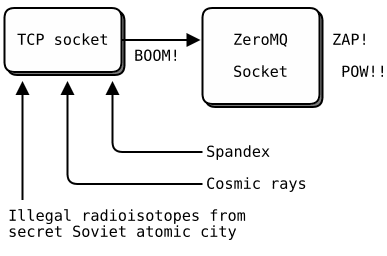

# ZeroMQ

> An open-source universal messaging library

References

- Home Page : https://zeromq.org
    - Get Started : https://zeromq.org/get-started
    - Downlowd : https://zeromq.org/download
    - Messages : https://zeromq.org/messages
    - Socket API : https://zeromq.org/socket-api
    - The Guide ( zguide ) : https://zguide.zeromq.org
    - Low-level API : http://api.zeromq.org

## Intro

### Why ZeroMQ?

- ZeroMQ (also known as ØMQ, 0MQ, or zmq) looks like an **embeddable networking library** but **acts like a concurrency framework**.
    - It **gives you sockets that carry atomic messages across various transports like in-process, inter-process, TCP, and multicast.**
    - You can **connect sockets N-to-N with patterns like fan-out, pub-sub, task distribution, and request-reply.**
    - It's fast enough to be the fabric _( 纤维织物 )_ for clustered products.
    - Its **asynchronous I/O model** gives you scalable multicore applications, **built as asynchronous message-processing tasks**.
    - It has a score of language APIs and runs on most operating systems.

### Features

- Universal
    - Connect your code in any language, on any platform.
        - _( icehe : just like Jupyter? )_
- Smart
    - Smart patterns like **pub-sub, push-pull, and client-server**.
- High-speed
    - **Asynchronous I/O engines**, in a tiny library.
- Multi-Transport
    - Carries messages across **inproc, IPC, TCP, UDP, TIPC, multicast and WebSocket**
- Community
    - Backed by a large and active open source community.
- The Guide
    - Explains how to use ØMQ with 60+ diagrams and 750 examples in 28 languages

## Get Started

- ZeroMQ (also spelled ØMQ, 0MQ or ZMQ) is a high-performance **asynchronous messaging library**, aimed at **use in distributed or concurrent applications**.
    - It **provides a message queue**, but **unlike message-oriented middleware**, a ZeroMQ system can **run without a dedicated _( 专用的 )_ message broker**.
- ZeroMQ **supports common messaging patterns ( pub/sub, request/reply, client/server and others ) over a variety of transports ( TCP, in-process, inter-process, multicast, WebSocket and more )** , making inter-process messaging as simple as inter-thread messaging.
    - This keeps your code clear, modular and extremely easy to scale.
- ZeroMQ is developed by a large community of contributors.
    - There are third-party bindings for many popular programming languages and native ports for C# and Java.

### The Zero in ZeroMQ

- The philosophy of ZeroMQ starts with the zero.
    - The zero is for **zero broker** (ZeroMQ is **brokerless**), **zero latency**, **zero cost** (it's free), and **zero administration**.
- More generally, "zero" refers to the culture of minimalism that permeates the project.
    - **We add power by removing complexity rather than by exposing new functionality.**

### The Guide

- [The guide](https://zguide.zeromq.org) _( zguide )_ explains how to use ØMQ, covers basic, intermediate and advanced use with 60+ diagrams and 750 examples in 28 languages.
- Also available as a [book](https://www.amazon.com/ZeroMQ-Messaging-Applications-Pieter-Hintjens-ebook/dp/B00BT0IELC/ref=sr_1_1?keywords=zeromq&qid=1560178380&s=gateway&sr=8-1) O'Reilly.

### Libzmq - the low level library

- [Libzmq](https://github.com/zeromq/libzmq) is the low-level library behind most of the different language bindings.
    - Libzmq expose C-API and implemented in C++.
    - You will rarely use libzmq directly, however if you want to contribute to the project or learn the internals of zeromq, that is the place to start.

### Pick Your Language and Library

- omitted…

### First example

- So let's start with some code, the "Hello world" example (of course).

```cpp
//  Hello World server
#include <zmq.h>
#include <string.h>
#include <stdio.h>
#include <unistd.h>
#include <assert.h>

int main (void)
{
    //  Socket to talk to clients
    void *context = zmq_ctx_new ();
    void *responder = zmq_socket (context, ZMQ_REP);
    int rc = zmq_bind (responder, "tcp://*:5555");
    assert (rc == 0);

    while (1) {
        char buffer [10];
        zmq_recv (responder, buffer, 10, 0);
        printf ("Received Hello\n");
        sleep (1);          //  Do some 'work'
        zmq_send (responder, "World", 5, 0);
    }
    return 0;
}
```

- The server creates a socket of type response (you will read more about request-response later), binds it to port 5555 and then waits for messages.
    - You can also see that we have zero configuration, we are just sending strings.

```cpp
//  Hello World client
#include <zmq.h>
#include <string.h>
#include <stdio.h>
#include <unistd.h>

int main (void)
{
    printf ("Connecting to hello world server…\n");
    void *context = zmq_ctx_new ();
    void *requester = zmq_socket (context, ZMQ_REQ);
    zmq_connect (requester, "tcp://localhost:5555");

    int request_nbr;
    for (request_nbr = 0; request_nbr != 10; request_nbr++) {
        char buffer [10];
        printf ("Sending Hello %d…\n", request_nbr);
        zmq_send (requester, "Hello", 5, 0);
        zmq_recv (requester, buffer, 10, 0);
        printf ("Received World %d\n", request_nbr);
    }
    zmq_close (requester);
    zmq_ctx_destroy (context);
    return 0;
}
```

- The **client creates a socket of type request**, connects and starts sending messages.
- **Both the send and receive methods are <u>blocking</u> ( by default )** .
    - For the receive it is simple : **if there are no messages, the method will block.**
    - For sending it is more complicated and depends on the socket type.
    - For request sockets, if the high watermark is reached or no peer is connected the method will block.

## Messages

Reference

- Messages : https://zeromq.org/messages

### Intro

- A ZeroMQ message is **a discrete unit of data passed between applications or components of the same application**.
    - From the point of view of ZeroMQ itself messages are considered to be **opaque binary data**.
- On the wire, ZeroMQ messages are **blobs of any size from zero upwards that fit in memory**.
    - You **do your own serialization using protocol buffers**, msgpack, JSON, or whatever else your applications need to speak.
    - It's wise to choose a data representation that is portable, but you can make your own decisions about trade-offs.
- The **simplest ZeroMQ message consist of one frame** ( also called **message part** ).
    - **Frames are the basic wire format for ZeroMQ messages.**
    - **A frame is a length-specified block of data**.
    - The **length can be zero upwards**.
    - ZeroMQ **guarantees to deliver all the parts ( one or more ) for a message, or none of them.**
    - This allows you to send or receive a list of frames as a single on-the-wire message.
- **A message ( single or multipart ) must fit in memory.**
    - If you want to send files of arbitrary sizes, you should break them into pieces and send each piece as separate single-part messages.
    - Using multipart data will not reduce memory consumption.

### Working with strings

- Passing data as strings is usually the easiest way to get a communication going as serialization is rather straightforward.
    - For ZeroMQ we established the rule that **strings are length-specified and are sent on the wire without a trailing null.**
- The following function sends a string to a socket where the string's length equals frame's length.

```c
static void
s_send_string (void *socket, const char *string) {
    zmq_send (socket, strdup(string), strlen(string), 0);
}
```

- To read a string from a socket we have to provide a buffer and its length.
    - The `zmq_recv` method write as much data into the buffer as possible.
    - If there's more data it will get discarded.
    - We use the returned frame's size to set appropriate null-terminator and return a duplicate of the retrieved string.

```c
//  Receive string from socket and convert into C string
//  Chops string at 255 chars, if it's longer
static char *
s_recv_string (void *socket) {
    char buffer [256];
    int size = zmq_recv (socket, buffer, 255, 0);
    if (size == -1)
        return NULL;
    if (size > 255)
        size = 255;
    buffer [size] = \0;
    /* use strndup(buffer, sizeof(buffer)-1) in *nix */
    return strdup (buffer);
}
```

- Because we utilise the frame's length to reflect the string's length we can send mulitple strings by putting each of them into a seperate frame.
- The following function sends an array of string to a socket.
    - The `ZMQ_SNDMORE` flag tells ZeroMQ to postpone sending until all frames are ready.

```c
static void
s_send_strings (void *socket, const char[] *strings, int no_of_strings) {
    for (index = 0; index < no_of_strings; index++) {
        int FLAG = (index + 1) == no_of_strings ? 0 : ZMQ_SNDMORE;
        zmq_send (socket, strdup(strings[index]), strlen(strings[index]), FLAG);
    }
}
```

- To retrieve a string frames from a multi-part messages we must use the ZMQ_RCVMORE `zmq_getsockopt()` option after calling `zmq_recv()` to determine if there are further parts to receive.

```c
char *strings[25];
int rcvmore;
size_t option_len = sizeof (int);
int index = 0;
do {
    strings[index++] = s_recv_string (socket);
    zmq_getsockopt (socket, ZMQ_RCVMORE, &rcvmore, &option_len);
} while (rcvmore);
```

### More

Find out more about working with messages:

- Initialise a message :
    - [`zmq_msg_init()`](http://api.zeromq.org/master:zmq-msg-init)
    - [`zmq_msg_init_size()`](http://api.zeromq.org/master:zmq-msg-init-size)
    - [`zmq_msg_init_data()`](http://api.zeromq.org/master:zmq-msg-init-data)
- Sending and receiving a message :
    - [`zmq_msg_send()`](http://api.zeromq.org/master:zmq-msg-send)
    - [`zmq_msg_recv()`](http://api.zeromq.org/master:zmq-msg-recv)
- Release a message :
    - [`zmq_msg_close()`(http://api.zeromq.org/master:zmq-msg-close)
- Access message content :
    - [`zmq_msg_data()`](http://api.zeromq.org/master:zmq-msg-data)
    - [`zmq_msg_size()`](http://api.zeromq.org/master:zmq-msg-size)
    - [`zmq_msg_more()`](http://api.zeromq.org/master:zmq-msg-more)
- Work with message properties :
    - [`zmq_msg_get()`](http://api.zeromq.org/master:zmq-msg-get)
    - [`zmq_msg_set()`](http://api.zeromq.org/master:zmq-msg-set)
- Message manipulation :
    - [`zmq_msg_copy()`](http://api.zeromq.org/master:zmq-msg-copy)
    - [`zmq_msg_move()`](http://api.zeromq.org/master:zmq-msg-move)

## ZMQ - The Guide

Reference

- The Guide ( zguide ) : https://zguide.zeromq.org

The Guide \zguide\ :

-  _Explains how to use ØMQ._
-  _Covers basic, intermediate and advanced use._
-  _With 60+ diagrams and 750 examples in 28 languages._
-  _Available online and in PDF format._
-  _Updated and revised for ZeroMQ/3.2 (older text for ZeroMQ/2.2 still available)._
-  _Written by Pieter Hintjens, CEO of iMatix, and 100+ contributors._
-  _Available in paper from O'Reilly._

### Preface

_( 序言, 前言 )_

- ……
- The Guide is originally in C, but also in PHP, Java, Python, Lua, and Haxe.
    - _We've also translated most of the examples into C++, C#, CL, Delphi, Erlang, F#, Felix, Haskell, Julia, Objective-C, Ruby, Ada, Basic, Clojure, Go, Haxe, Node.js, ooc, Perl, and Scala._

#### ZeroMQ in a Hundred Words

- ZeroMQ (also known as ØMQ, 0MQ, or zmq) looks like an **embeddable _( 可嵌入的 )_ networking library** but **acts like a concurrency framework**.
    - It gives you **sockets that carry atomic messages across various transports like in-process, inter-process, TCP, and multicast**.
    - You can **connect sockets N-to-N with patterns like fan-out, pub-sub, task distribution, and request-reply.**
    - It's **fast enough** to be the fabric for clustered products.
    - Its **asynchronous I/O model** gives you scalable multicore applications, built as asynchronous message-processing tasks.
    - _It has a score of language APIs and runs on most operating systems._
    - _ZeroMQ is from iMatix and is LGPLv3 open source._

#### How It Began

- We took a normal TCP socket, injected it with a mix of radioactive isotopes _( 放射性同位素 )_ stolen from a secret Soviet atomic research project, bombarded it with 1950-era cosmic rays _( 使用1950年代的宇宙射线轰击它 )_ , and put it into the hands of a drug-addled comic book author with a badly-disguised _( 塞翁失马焉知非福 )_ fetish _( 迷信 )_ for bulging muscles clad in spandex.
    - Yes, **ZeroMQ sockets are the world-saving superheroes of the networking world**.
        - _( icehe: 这段话看不太懂, 真的那么强吗? )_



#### The Zen of Zero

- The Ø in ZeroMQ is all about tradeoffs.
    - On the one hand this strange name lowers ZeroMQ's visibility on Google and Twitter.
    - _On the other hand it annoys the heck out of some Danish folk who write us things like “ØMG røtfl”, and “Ø is not a funny looking zero!” and “Rødgrød med fløde!”, which is apparently an insult that means "may your neighbours be the direct descendants of Grendel!" Seems like a fair trade._
    - _( icehe : 这段也看不太懂 )_
- **Originally the zero in ZeroMQ was meant as "zero broker" and ( as close to ) "zero latency" ( as possible ) .**
    - Since then, it has come to encompass _( 包含; 包围; 环绕; 完成 )_ different goals : **zero administration, zero cost, zero waste**.
    - More generally, "zero" refers to the culture of minimalism _( 极简派艺术; 最低纲领; 极保守行动 )_ that permeates _( 弥漫 )_ the project.
    - We **add power by removing complexity rather than by exposing new functionality.**

#### Others

- omitted…

### 1\. Basics

ToC of Basics

- Fixing the World
- _Starting Assumptions_
- _Getting the Examples_
- _Ask and Ye Shall Receive_
- _A Minor Note on Strings_
- _A Note on the Naming Convention_
- _Version Reporting_
- _Getting the Message Out_
- _Divide and Conquer_
- _Programming with ZeroMQ_
    - _Getting the Context Right_
    - _Making a Clean Exit_
- Why We Needed ZeroMQ
- Socket Scalability
- _Upgrading from ZeroMQ v2.2 to ZeroMQ v3.2_
    - _Compatible Changes_
    - _Incompatible Changes_
    - _Suggested Shim Macros_
- Warning: Unstable Paradigms!

Details see original text.

#### Fixing the World

- How to explain ZeroMQ? Some of us start by saying all the wonderful things it does.
    - It’s sockets on steroids.
    - It’s like mailboxes with routing.
    - It’s fast! Others try to share their moment of enlightenment, that zap-pow-kaboom satori paradigm-shift moment when it all became obvious.
    - Things just become simpler.
    - Complexity goes away.
    - It opens the mind.
    - Others try to explain by comparison.
    - It’s smaller, simpler, but still looks familiar.
    - Personally, I like to remember why we made ZeroMQ at all, because that’s most likely where you, the reader, still are today.
- Programming is science dressed up as art because most of us don’t understand the physics of software and it’s rarely, if ever, taught.
    - The physics of software is not algorithms, data structures, languages and abstractions.
    - These are just tools we make, use, throw away.
    - The real physics of software is the physics of people–specifically, our limitations when it comes to complexity, and our desire to work together to solve large problems in pieces.
    - This is the science of programming: make building blocks that people can understand and use easily, and people will work together to solve the very largest problems.

- We live in a connected world, and modern software has to navigate this world.
    - So the building blocks for tomorrow’s very largest solutions are connected and massively parallel.
    - It’s not enough for code to be “strong and silent” any more.
    - Code has to talk to code.
    - Code has to be chatty, sociable, well-connected.
    - Code has to run like the human brain, trillions of individual neurons firing off messages to each other, a massively parallel network with no central control, no single point of failure, yet able to solve immensely difficult problems.
    - And it’s no accident that the future of code looks like the human brain, because the endpoints of every network are, at some level, human brains.
- If you’ve done any work with threads, protocols, or networks, you’ll realize this is pretty much impossible.
    - It’s a dream.
    - Even connecting a few programs across a few sockets is plain nasty when you start to handle real life situations.
    - Trillions? The cost would be unimaginable.
    - Connecting computers is so difficult that software and services to do this is a multi-billion dollar business.
- So we live in a world where the wiring is years ahead of our ability to use it.
    - We had a software crisis in the 1980s, when leading software engineers like Fred Brooks believed there was no “Silver Bullet” to “promise even one order of magnitude of improvement in productivity, reliability, or simplicity”.
- Brooks missed free and open source software, which solved that crisis, enabling us to share knowledge efficiently.
    - Today we face another software crisis, but it’s one we don’t talk about much.
    - Only the largest, richest firms can afford to create connected applications.
    - There is a cloud, but it’s proprietary.
    - Our data and our knowledge is disappearing from our personal computers into clouds that we cannot access and with which we cannot compete.
    - Who owns our social networks? It is like the mainframe-PC revolution in reverse.
- We can leave the political philosophy for another book.
    - The point is that while the Internet offers the potential of massively connected code, the reality is that this is out of reach for most of us, and so large interesting problems (in health, education, economics, transport, and so on) remain unsolved because there is no way to connect the code, and thus no way to connect the brains that could work together to solve these problems.
- There have been many attempts to solve the challenge of connected code.
    - There are thousands of IETF specifications, each solving part of the puzzle.
    - For application developers, HTTP is perhaps the one solution to have been simple enough to work, but it arguably makes the problem worse by encouraging developers and architects to think in terms of big servers and thin, stupid clients.
- So today people are still connecting applications using raw UDP and TCP, proprietary protocols, HTTP, and Websockets.
    - It remains painful, slow, hard to scale, and essentially centralized.
    - Distributed P2P architectures are mostly for play, not work.
    - How many applications use Skype or Bittorrent to exchange data?
- Which brings us back to the science of programming.
    - To fix the world, we needed to do two things.
    - One, to solve the general problem of “how to connect any code to any code, anywhere”.
    - Two, to wrap that up in the simplest possible building blocks that people could understand and use easily.
- It sounds ridiculously simple.
    - And maybe it is.
    - That’s kind of the whole point.

#### Why We Needed ZeroMQ

### 2\. Sockets and Patterns

### 3\. Advanced Request-Reply Patterns

### 4\. Reliable Request-Reply Patterns

### 5\. Advanced Plub-Sub Patterns

### 6\. The ZeroMQ Community

### 7\. Advanced Architecture using ZeroMQ

### 8\. A Framework for Distributed Computing

### Postface

_( 刊后语 )_
