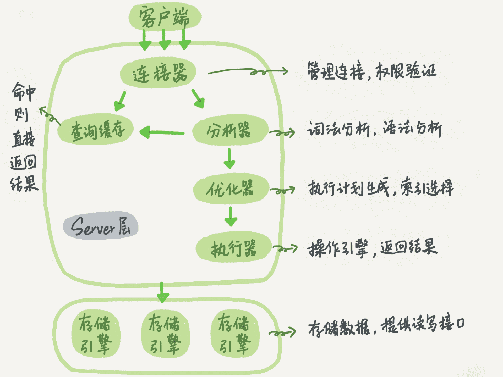
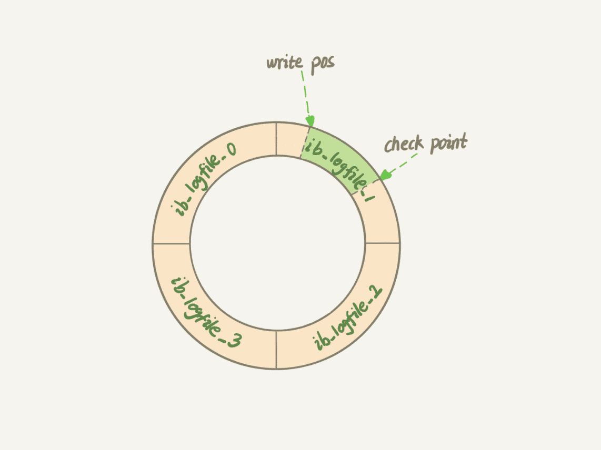

# MySQL 实战 45 讲

References

- MySQL 实战 45 讲 - 极客时间 : https://time.geekbang.org/column/article/68319

## 01. 基础架构 : SQL查询语句如何执行

MySQL 可以分为两部分

- **Server 层**
- **存储引擎层**

### Server 层

Server 层包括

- **连接器**
- ~~查询缓存~~ _( Discarded in MySQL 8.0 )_
- **分析器**
- **优化器**
- **执行器**

所有 **跨存储引擎的功能都在 Server 层实现**

- 涵盖 MySQL 的大多数核心服务功能 _( 包括上文提到的连接器到执行器 )_
- 以及所有的 **内置函数** ( 如日期、时间、数学和加密函数等 )
- 比如 **存储过程、触发器、视图** 等



### 存储引擎

而 **存储引擎** 层负责 **数据的存储和提取**. 其架构模式是插件式的, 支持多个存储引擎 :

- **InnoDB**
- **MyISAM**
- **Memory**

现在 **InnoDB 是最常用的存储引擎**, 从 MySQL 5.5.5 版本开始成为了 **默认存储引擎**

- _执行 `create table` 建表时, 如果不指定引擎类型, 默认使用的就是 InnoDB_
- 也可以通过指定存储引擎的类型来选择别的引擎, 比如在 `create table` 语句中使用 `engine=memory`, 来指定使用内存引擎创建表
    - _不同存储引擎的表数据存取方式不同, 支持的功能也不同_

### 连接器

第一步, 先连接到这个数据库上, 这时候接待你的就是连接器, 它负责

- 跟客户端建立连接
- 获取权限
- 维持和管理连接

_连接命令一般写法_

```bash
mysql -h$ip -P$port -u$user -p
```

一个用户成功建立连接后, 即使用管理员账号对这个用户的权限做了修改, 也不会影响已经存在连接的权限. 修改完成后, 只有再新建的连接才会使用新的权限设置.

_( icehe : 所以想保证绝对不越权, 就得在修改权限设置后, 强制关闭相关用户现存的 DB 连接, 对吧? )_

连接完成后, 如果你没有后续的动作, 这个连接就处于空闲状态, 你可以在 `show processlist` 命令中看到它

`show processlist` 的结果, 其中的 Command 列显示为 "Sleep" 的这一行, 就表示现在系统里面有一个空闲连接.

_( icehe : 先在另一个终端会话中登录创建一个DB连接, 再在另一个会话再登录创建另一个连接, `show processlist` 才能看到空闲连接 )_

```bash
$ mysql -h127.0.0.1 -P3306 -uroot -p
Enter password:
Welcome to the MySQL monitor.  Commands end with ; or \g.
Your MySQL connection id is 4
Server version: 5.7.32-log Homebrew

Copyright (c) 2000, 2020, Oracle and/or its affiliates. All rights reserved.

Oracle is a registered trademark of Oracle Corporation and/or its
affiliates. Other names may be trademarks of their respective
owners.

Type 'help;' or '\h' for help. Type '\c' to clear the current input statement.

mysql> show processlist;
+----+------+-----------------+------+---------+------+----------+------------------+
| Id | User | Host            | db   | Command | Time | State    | Info             |
+----+------+-----------------+------+---------+------+----------+------------------+
|  3 | root | localhost:51349 | NULL | Sleep   |  129 |          | NULL             |
|  4 | root | localhost:51364 | NULL | Query   |    0 | starting | show processlist |
+----+------+-----------------+------+---------+------+----------+------------------+
2 rows in set (0.00 sec)
```

**客户端如果太长时间没动静, 连接器就会自动将它断开**.

- 客户端连接超时的时长由参数 **`wait_timeout`** 控制, **默认值 8 小时** ( 8h x 60min/h x 60sec/min = 28800 secs )

```bash
mysql> show variables where Variable_name = "wait_timeout";
+---------------+-------+
| Variable_name | Value |
+---------------+-------+
| wait_timeout  | 28800 |
+---------------+-------+
1 row in set (0.00 sec)

mysql> show variables like "wait_timeout";
+---------------+-------+
| Variable_name | Value |
+---------------+-------+
| wait_timeout  | 28800 |
+---------------+-------+
1 row in set (0.00 sec)

mysql> show variables like "%wait_timeout%";
+--------------------------+----------+
| Variable_name            | Value    |
+--------------------------+----------+
| innodb_lock_wait_timeout | 50       |
| lock_wait_timeout        | 31536000 |
| wait_timeout             | 28800    |
+--------------------------+----------+
3 rows in set (0.00 sec)
```

- **长连接** : 连接成功后, 如果客户端持续有请求, 则一直使用同一个连接
- **短连接** : 每次执行完很少的几次查询就断开连接, 下次查询再重新建立一个

建立连接的过程通常比较复杂, 所以建议在使用中要尽量减少建立连接的动作, 也就是 **尽量使用长连接**

但是全部使用长连接后, 可能会发现, 有些时候 MySQL 占用内存涨得特别快

- 因为 MySQL 在执行过程中临时使用的内存是管理在连接对象里面的, 这些资源会在连接断开的时候才释放
- 所以如果长连接累积下来, 可能导致内存占用太大, 被系统强行杀掉 ( OOM ) , 从现象看就是 MySQL 异常重启了

可以考虑以下两种方案解决以上问题 :

- 1\. 定期断开长连接
    - 使用一段时间, 或者程序里面判断执行过一个占用内存的大查询后, 断开连接, 之后要查询再重连
- 2\. _如果你用的是 MySQL 5.7 或更新版本, 可以在每次执行一个比较大的操作后,_ 通过执行 `mysql_reset_connection` 来重新初始化连接资源
    - 这个过程不需要重连和重新做权限验证, 但是会将连接恢复到刚刚创建完时的状态

### 查询缓存

_连接建立完成后, 就可以执行 select 语句了. 执行逻辑就会来到第二步 : 查询缓存._

MySQL 拿到一个查询请求后, 会先到查询缓存看看, 之前是不是执行过这条语句.

**之前执行过的语句及其结果可能会以 key-value 对的形式, 被直接缓存在内存中. key 是查询的语句, value 是查询的结果.**

- 如果你的查询能够直接在这个缓存中找到 key, 那么这个 value 就会被直接返回给客户端.
- 如果语句不在查询缓存中, 就会继续后面的执行阶段. 执行完成后, 执行结果会被存入查询缓存中.

_你可以看到, 如果查询命中缓存, MySQL 不需要执行后面的复杂操作, 就可以直接返回结果, 这个效率会很高._

但是, **大多数情况下建议不要使用查询缓存**, _为什么呢? 因为查询缓存往往弊大于利_

查询缓存的失效非常频繁, **只要有对一个表的更新, 这个表上所有的查询缓存都会被清空.**

- _因此很可能你费劲地把结果存起来, 还没使用呢, 就被一个更新全清空了_
- 对于更新压力大的数据库来说, 查询缓存的命中率会非常低
- 除非你的业务就是有一张静态表, 很长时间才会更新一次
    - 比如, 一个系统配置表, 那这张表上的查询才适合使用查询缓存

MySQL 也提供了这种 "按需使用" 的方式

- 可以将参数 `query_cache_type` 设置成 `DEMAND`, 这样对于默认的 SQL 语句都不使用查询缓存
- 而对于你确定要使用查询缓存的语句, 可以用 `SQL_CACHE` 显式指定, 像下面这个语句一样 :

```sql
mysql> select SQL_CACHE * from T where ID=10;
```

**MySQL 8.0 版本直接将查询缓存的整块功能删掉了**, _也就是说 8.0 开始彻底没有这个功能了_

### 分析器

_如果没有命中查询缓存, 就开始真正执行语句了_

- 1\. 分析器先做 **词法分析**
    - 输入的是由多个字符串和空格组成的一条 SQL 语句, MySQL 需要识别出里面的字符串分别是什么, 代表什么
    - _MySQL 从你输入的 "select" 这个关键字识别出来, 这是一个查询语句_
        - _它也要把字符串 "T" 识别成 "表名 T" , 把字符串 "ID" 识别成 "列 ID"_
- 2\. 分析器再做 **语法分析**
    - 根据词法分析的结果, 语法分析器会根据语法规则, 判断你输入的这个 SQL 语句是否满足 MySQL 语法
    - _如果你的语句不对, 就会收到 "You have an error in your SQL syntax" 的错误提醒, 比如语句 select 少打了开头的字母 "s"_
    - 一般语法错误会提示第一个出现错误的位置, 所以你关注的是紧接 "use near" 的内容

### 优化器

用途

- 优化器是 **在表里面有多个索引的时候, 决定使用哪个索引**
- 或者在一个语句 **有多表关联 ( join ) 的时候, 决定各个表的连接顺序**

Omitted… ( 实例暂略, 详见原文 )

### 执行器

_MySQL 通过分析器知道了你要做什么, 通过优化器知道了该怎么做, 于是就进入了执行器阶段, 开始执行语句._

开始执行的时候, 要先判断一下你对这个表 T 有没有执行查询的权限. 如果没有, 就会返回没有权限的错误, 如下所示 _( 在工程实现上, 如果命中查询缓存, 会在查询缓存返回结果的时候, 做权限验证. 查询也会在优化器之前调用 precheck 验证权限 )_

会在数据库的慢查询日志中看到一个 **`rows_examined`** 的字段, **表示这个语句执行过程中扫描了多少行**. 这个值就是 **在执行器每次调用引擎获取数据行的时候累加.**

注意 : **执行器调用一次, 在引擎内部则扫描了多行, 因此引擎扫描行数跟 `rows_examined` 并不是完全相同的（可能是估算值）**

## 02. 日志系统 : SQL更新语句如何执行

与查询流程不一样的是, 更新流程还涉及两个重要的日志模块 :

- redo log 重做日志 ( InnoDB 存储引擎 )
- binlog 归档日志 ( Server 层 )

### Redo Log

如果每一次的更新操作都需要写进磁盘, 然后磁盘也要找到对应的那条记录, 然后再更新, 整个过程 IO 成本、查找成本都很高

_为了解决这个问题, MySQL 的设计者就用了类似 "酒店掌柜粉板" 的思路来提升更新效率._

_其实就是经常说到的_ **WAL ( Write-Ahead Logging ) 技术, 它的关键点就是先写日志, 再写磁盘**, _也就是先写粉板, 等不忙的时候再写账本_

- _具体来说,_ 当有一条记录需要更新的时候, InnoDB 引擎就会先把记录写到 redo log _( 粉板 )_ 里面, 并更新内存, 这个时候更新就算完成了.
- 同时, InnoDB 引擎会在适当的时候, 将这个操作记录更新到磁盘里面, 而这个更新往往是在系统比较空闲的时候做, _这就像打烊以后掌柜做的事._

_如果今天赊账的不多, 掌柜可以等打烊后再整理. 但如果某天赊账的特别多, 粉板写满了, 又怎么办呢?_

- _这个时候掌柜只好放下手中的活儿, 把粉板中的一部分赊账记录更新到账本中, 然后把这些记录从粉板上擦掉, 为记新账腾出空间._
- 与此类似, **InnoDB 的 redo log 是固定大小的, 比如可以配置为一组 4 个文件, 每个文件的大小是 1GB, 那么这块 "粉板" 总共就可以记录 4GB 的操作.**
    - 从头开始写, 写到末尾就又回到开头循环写, _如下面这个图所示._



- **write pos** 是当前记录的位置, 一边写一边后移, 写到第 3 号文件末尾后就回到 0 号文件开头.
- **checkpoint** 是当前要擦除的位置, 也是往后推移并且循环的, 擦除记录前要把记录更新到数据文件.
- write pos 和 checkpoint 之间的是 "粉板" 上还空着的部分, 可以用来记录新的操作.
    - 如果 write pos 追上 checkpoint, 表示 "粉板" 满了, 这时候不能再执行新的更新, 得停下来先擦掉一些记录, 把 checkpoint 推进一下.

有了 redo log, **InnoDB 可以保证即使数据库发生异常重启, 之前提交的记录都不会丢失**, 这个能力称为 **crash-safe**.

_要理解 crash-safe 这个概念, 可以想想我们前面赊账记录的例子. 只要赊账记录记在了粉板上或写在了账本上. 之后即使掌柜忘记了. 比如突然停业几天. 恢复生意后依然可以通过账本和粉板上的数据明确赊账账目._

### Binlog

_粉板 redo log 是 InnoDB 引擎特有的日志, 而 Server 层也有自己的日志, 称为 binlog ( 归档日志 )_

_为什么会有两份日志呢?_

- 因为最开始 MySQL 里并没有 InnoDB 引擎.
    - MySQL 自带的引擎是 MyISAM, 但是 MyISAM 没有 crash-safe 的能力, binlog 日志只能用于归档.
- 而 InnoDB 是另一个公司以插件形式引入 MySQL 的, 既然只依靠 binlog 是没有 crash-safe 能力的,
    - 所以 InnoDB 使用另外一套日志系统——也就是 redo log 来实现 crash-safe 能力

redo log 和 binlog 之间有以下三点不同 :

- 1\. redo log 是 InnoDB 引擎特有的；binlog 是 MySQL 的 Server 层实现的，所有引擎都可以使用。
- 2\. redo log 是物理日志，记录的是“在某个数据页上做了什么修改”；binlog 是逻辑日志，记录的是这个语句的原始逻辑，比如“给 ID=2 这一行的 c 字段加 1 ”。
- 3\. redo log 是循环写的，空间固定会用完；binlog 是可以追加写入的。“追加写”是指 binlog 文件写到一定大小后会切换到下一个，并不会覆盖以前的日志。
