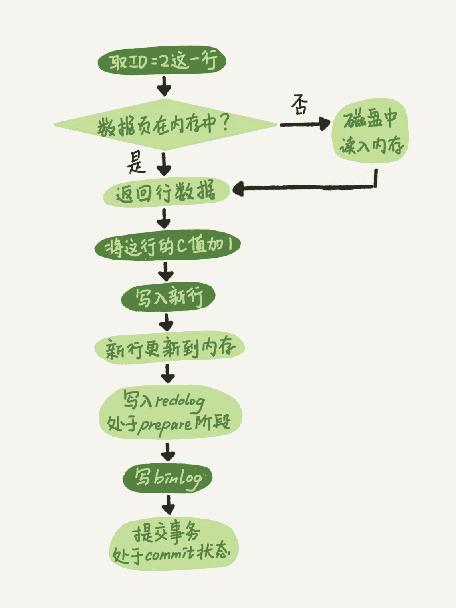
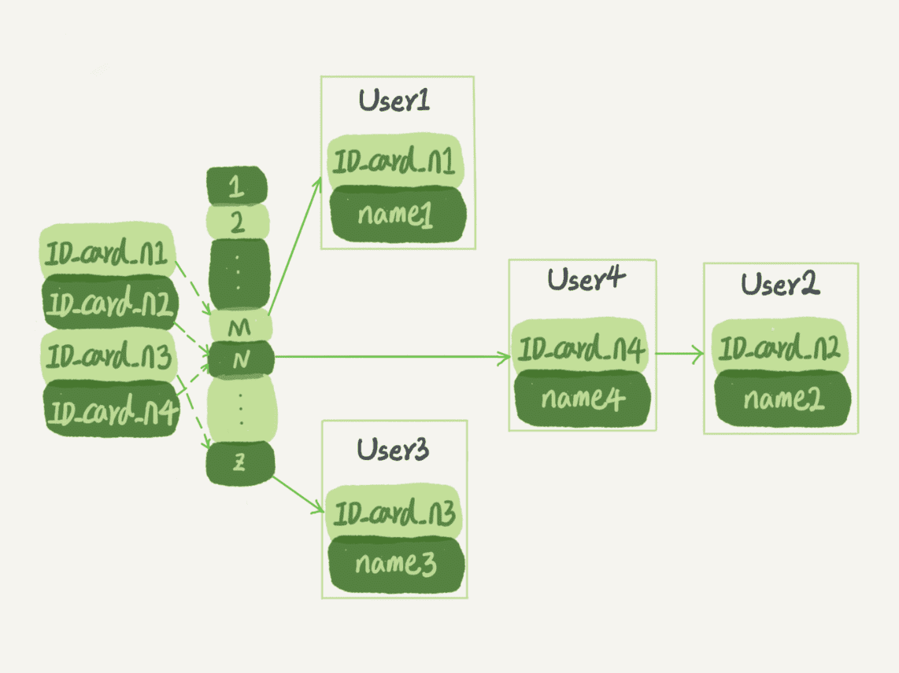
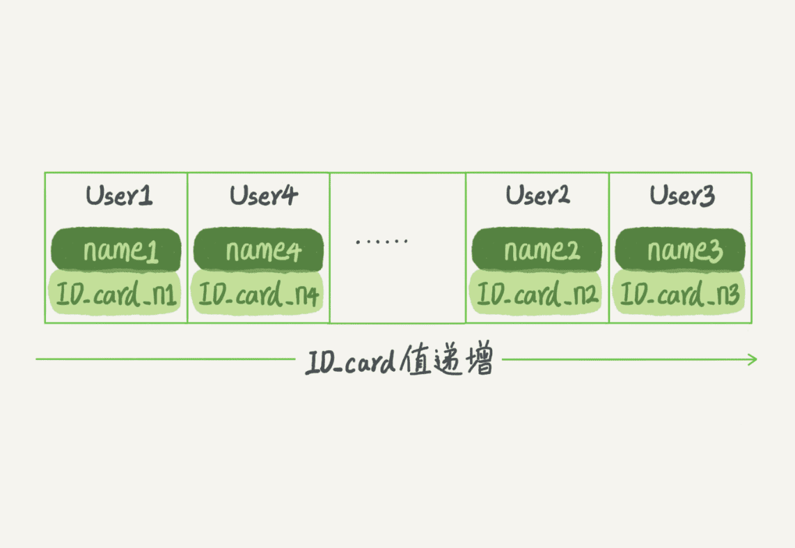
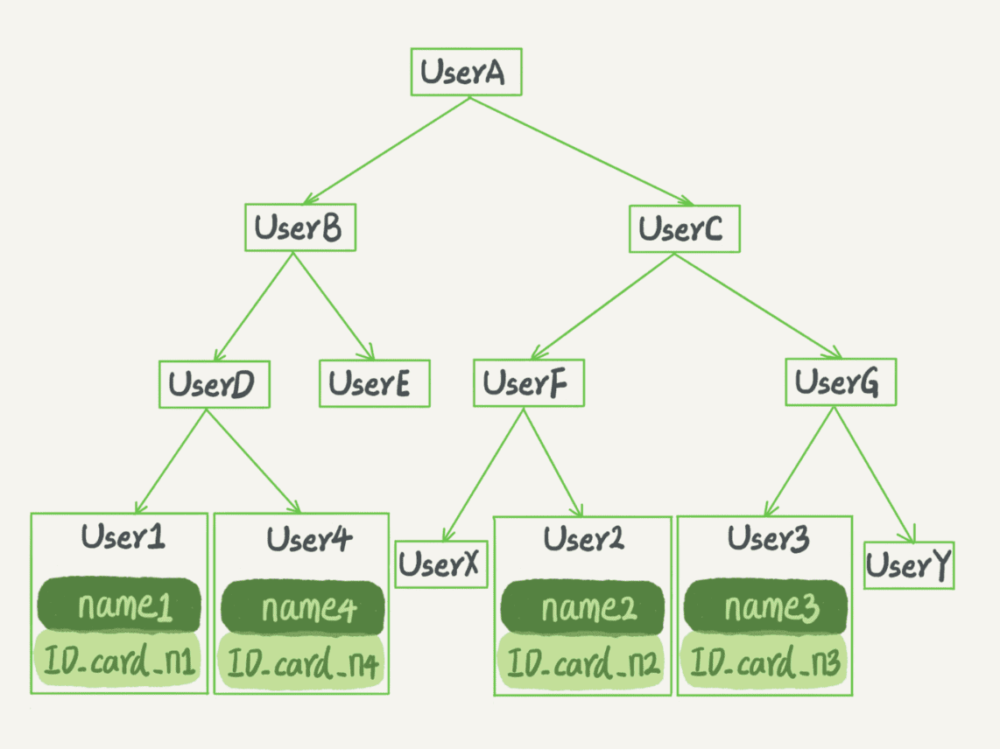

# MySQL 实战 45 讲

References

- MySQL 实战 45 讲 - 极客时间 : https://time.geekbang.org/column/article/68319

## 01. 基础架构 : SQL查询语句如何执行

MySQL 可以分为两部分

- **Server 层**
- **存储引擎层**

### Server 层

Server 层包括

- **连接器**
- ~~查询缓存~~ _( Discarded in MySQL 8.0 )_
- **分析器**
- **优化器**
- **执行器**

所有 **跨存储引擎的功能都在 Server 层实现**

- 涵盖 MySQL 的大多数核心服务功能 _( 包括上文提到的连接器到执行器 )_
- 以及所有的 **内置函数** ( 如日期、时间、数学和加密函数等 )
- 比如 **存储过程、触发器、视图** 等


### 存储引擎

而 **存储引擎** 层负责 **数据的存储和提取**. 其架构模式是插件式的, 支持多个存储引擎 :

- **InnoDB**
- **MyISAM**
- **Memory**

现在 **InnoDB 是最常用的存储引擎**, 从 MySQL 5.5.5 版本开始成为了 **默认存储引擎**

- _执行 `create table` 建表时, 如果不指定引擎类型, 默认使用的就是 InnoDB_
- 也可以通过指定存储引擎的类型来选择别的引擎, 比如在 `create table` 语句中使用 `engine=memory`, 来指定使用内存引擎创建表
    - _不同存储引擎的表数据存取方式不同, 支持的功能也不同_

### 连接器

第一步, 先连接到这个数据库上, 这时候接待你的就是连接器, 它负责

- 跟客户端建立连接
- 获取权限
- 维持和管理连接

_连接命令一般写法_

```bash
mysql -h$ip -P$port -u$user -p
```

一个用户成功建立连接后, 即使用管理员账号对这个用户的权限做了修改, 也不会影响已经存在连接的权限. 修改完成后, 只有再新建的连接才会使用新的权限设置.

_( icehe : 所以想保证绝对不越权, 就得在修改权限设置后, 强制关闭相关用户现存的 DB 连接, 对吧? )_

连接完成后, 如果你没有后续的动作, 这个连接就处于空闲状态, 你可以在 `show processlist` 命令中看到它

`show processlist` 的结果, 其中的 Command 列显示为 "Sleep" 的这一行, 就表示现在系统里面有一个空闲连接.

_( icehe : 先在另一个终端会话中登录创建一个DB连接, 再在另一个会话再登录创建另一个连接, `show processlist` 才能看到空闲连接 )_

```bash
$ mysql -h127.0.0.1 -P3306 -uroot -p
Enter password:
Welcome to the MySQL monitor.  Commands end with ; or \g.
Your MySQL connection id is 4
Server version: 5.7.32-log Homebrew

Copyright (c) 2000, 2020, Oracle and/or its affiliates. All rights reserved.

Oracle is a registered trademark of Oracle Corporation and/or its
affiliates. Other names may be trademarks of their respective
owners.

Type 'help;' or '\h' for help. Type '\c' to clear the current input statement.

mysql> show processlist;
+----+------+-----------------+------+---------+------+----------+------------------+
| Id | User | Host            | db   | Command | Time | State    | Info             |
+----+------+-----------------+------+---------+------+----------+------------------+
|  3 | root | localhost:51349 | NULL | Sleep   |  129 |          | NULL             |
|  4 | root | localhost:51364 | NULL | Query   |    0 | starting | show processlist |
+----+------+-----------------+------+---------+------+----------+------------------+
2 rows in set (0.00 sec)
```

**客户端如果太长时间没动静, 连接器就会自动将它断开**.

- 客户端连接超时的时长由参数 **`wait_timeout`** 控制, **默认值 8 小时** ( 8h x 60min/h x 60sec/min = 28800 secs )

```bash
mysql> show variables where Variable_name = "wait_timeout";
+---------------+-------+
| Variable_name | Value |
+---------------+-------+
| wait_timeout  | 28800 |
+---------------+-------+
1 row in set (0.00 sec)

mysql> show variables like "wait_timeout";
+---------------+-------+
| Variable_name | Value |
+---------------+-------+
| wait_timeout  | 28800 |
+---------------+-------+
1 row in set (0.00 sec)

mysql> show variables like "%wait_timeout%";
+--------------------------+----------+
| Variable_name            | Value    |
+--------------------------+----------+
| innodb_lock_wait_timeout | 50       |
| lock_wait_timeout        | 31536000 |
| wait_timeout             | 28800    |
+--------------------------+----------+
3 rows in set (0.00 sec)
```

- **长连接** : 连接成功后, 如果客户端持续有请求, 则一直使用同一个连接
- **短连接** : 每次执行完很少的几次查询就断开连接, 下次查询再重新建立一个

建立连接的过程通常比较复杂, 所以建议在使用中要尽量减少建立连接的动作, 也就是 **尽量使用长连接**

但是全部使用长连接后, 可能会发现, 有些时候 MySQL 占用内存涨得特别快

- 因为 MySQL 在执行过程中临时使用的内存是管理在连接对象里面的, 这些资源会在连接断开的时候才释放
- 所以如果长连接累积下来, 可能导致内存占用太大, 被系统强行杀掉 ( OOM ) , 从现象看就是 MySQL 异常重启了

可以考虑以下两种方案解决以上问题 :

- 1\. 定期断开长连接
    - 使用一段时间, 或者程序里面判断执行过一个占用内存的大查询后, 断开连接, 之后要查询再重连
- 2\. _如果你用的是 MySQL 5.7 或更新版本, 可以在每次执行一个比较大的操作后,_ 通过执行 `mysql_reset_connection` 来重新初始化连接资源
    - 这个过程不需要重连和重新做权限验证, 但是会将连接恢复到刚刚创建完时的状态

### 查询缓存

_连接建立完成后, 就可以执行 select 语句了. 执行逻辑就会来到第二步 : 查询缓存._

MySQL 拿到一个查询请求后, 会先到查询缓存看看, 之前是不是执行过这条语句.

**之前执行过的语句及其结果可能会以 key-value 对的形式, 被直接缓存在内存中. key 是查询的语句, value 是查询的结果.**

- 如果你的查询能够直接在这个缓存中找到 key, 那么这个 value 就会被直接返回给客户端.
- 如果语句不在查询缓存中, 就会继续后面的执行阶段. 执行完成后, 执行结果会被存入查询缓存中.

_你可以看到, 如果查询命中缓存, MySQL 不需要执行后面的复杂操作, 就可以直接返回结果, 这个效率会很高._

但是, **大多数情况下建议不要使用查询缓存**, _为什么呢? 因为查询缓存往往弊大于利_

查询缓存的失效非常频繁, **只要有对一个表的更新, 这个表上所有的查询缓存都会被清空.**

- _因此很可能你费劲地把结果存起来, 还没使用呢, 就被一个更新全清空了_
- 对于更新压力大的数据库来说, 查询缓存的命中率会非常低
- 除非你的业务就是有一张静态表, 很长时间才会更新一次
    - 比如, 一个系统配置表, 那这张表上的查询才适合使用查询缓存

MySQL 也提供了这种 "按需使用" 的方式

- 可以将参数 `query_cache_type` 设置成 `DEMAND`, 这样对于默认的 SQL 语句都不使用查询缓存
- 而对于你确定要使用查询缓存的语句, 可以用 `SQL_CACHE` 显式指定, 像下面这个语句一样 :

```sql
mysql> select SQL_CACHE * from T where ID=10;
```

**MySQL 8.0 版本直接将查询缓存的整块功能删掉了**, _也就是说 8.0 开始彻底没有这个功能了_

### 分析器

_如果没有命中查询缓存, 就开始真正执行语句了_

- 1\. 分析器先做 **词法分析**
    - 输入的是由多个字符串和空格组成的一条 SQL 语句, MySQL 需要识别出里面的字符串分别是什么, 代表什么
    - _MySQL 从你输入的 "select" 这个关键字识别出来, 这是一个查询语句_
        - _它也要把字符串 "T" 识别成 "表名 T" , 把字符串 "ID" 识别成 "列 ID"_
- 2\. 分析器再做 **语法分析**
    - 根据词法分析的结果, 语法分析器会根据语法规则, 判断你输入的这个 SQL 语句是否满足 MySQL 语法
    - _如果你的语句不对, 就会收到 "You have an error in your SQL syntax" 的错误提醒, 比如语句 select 少打了开头的字母 "s"_
    - 一般语法错误会提示第一个出现错误的位置, 所以你关注的是紧接 "use near" 的内容

### 优化器

用途

- 优化器是 **在表里面有多个索引的时候, 决定使用哪个索引**
- 或者在一个语句 **有多表关联 ( join ) 的时候, 决定各个表的连接顺序**

Omitted… ( 实例暂略, 详见原文 )

### 执行器

_MySQL 通过分析器知道了你要做什么, 通过优化器知道了该怎么做, 于是就进入了执行器阶段, 开始执行语句._

开始执行的时候, 要先判断一下你对这个表 T 有没有执行查询的权限. 如果没有, 就会返回没有权限的错误, 如下所示 _( 在工程实现上, 如果命中查询缓存, 会在查询缓存返回结果的时候, 做权限验证. 查询也会在优化器之前调用 precheck 验证权限 )_

会在数据库的慢查询日志中看到一个 **`rows_examined`** 的字段, **表示这个语句执行过程中扫描了多少行**. 这个值就是 **在执行器每次调用引擎获取数据行的时候累加.**

注意 : **执行器调用一次, 在引擎内部则扫描了多行, 因此引擎扫描行数跟 `rows_examined` 并不是完全相同的 (可能是估算值) **

## 02. 日志系统 : SQL更新语句如何执行

与查询流程不一样的是, 更新流程还涉及两个重要的日志模块 :

- redo log 重做日志 ( InnoDB 存储引擎 )
- binlog 归档日志 ( Server 层 )

### Redo Log

如果每一次的更新操作都需要写进磁盘, 然后磁盘也要找到对应的那条记录, 然后再更新, 整个过程 IO 成本、查找成本都很高

_为了解决这个问题, MySQL 的设计者就用了类似 "酒店掌柜粉板" 的思路来提升更新效率._

_其实就是经常说到的_ **WAL ( Write-Ahead Logging ) 技术, 它的关键点就是先写日志, 再写磁盘**, _也就是先写粉板, 等不忙的时候再写账本_

- _具体来说,_ 当有一条记录需要更新的时候, InnoDB 引擎就会先把记录写到 redo log _( 粉板 )_ 里面, 并更新内存, 这个时候更新就算完成了.
- 同时, InnoDB 引擎会在适当的时候, 将这个操作记录更新到磁盘里面, 而这个更新往往是在系统比较空闲的时候做, _这就像打烊以后掌柜做的事._

_如果今天赊账的不多, 掌柜可以等打烊后再整理. 但如果某天赊账的特别多, 粉板写满了, 又怎么办呢?_

- _这个时候掌柜只好放下手中的活儿, 把粉板中的一部分赊账记录更新到账本中, 然后把这些记录从粉板上擦掉, 为记新账腾出空间._
- 与此类似, **InnoDB 的 redo log 是固定大小的, 比如可以配置为一组 4 个文件, 每个文件的大小是 1GB, 那么这块 "粉板" 总共就可以记录 4GB 的操作.**
    - 从头开始写, 写到末尾就又回到开头循环写, _如下面这个图所示._


- **write pos** 是当前记录的位置, 一边写一边后移, 写到第 3 号文件末尾后就回到 0 号文件开头.
- **checkpoint** 是当前要擦除的位置, 也是往后推移并且循环的, 擦除记录前要把记录更新到数据文件.
- write pos 和 checkpoint 之间的是 "粉板" 上还空着的部分, 可以用来记录新的操作.
    - 如果 write pos 追上 checkpoint, 表示 "粉板" 满了, 这时候不能再执行新的更新, 得停下来先擦掉一些记录, 把 checkpoint 推进一下.

有了 redo log, **InnoDB 可以保证即使数据库发生异常重启, 之前提交的记录都不会丢失**, 这个能力称为 **crash-safe**.

_要理解 crash-safe 这个概念, 可以想想我们前面赊账记录的例子. 只要赊账记录记在了粉板上或写在了账本上. 之后即使掌柜忘记了. 比如突然停业几天. 恢复生意后依然可以通过账本和粉板上的数据明确赊账账目._

### Binlog

_粉板 redo log 是 InnoDB 引擎特有的日志, 而 Server 层也有自己的日志, 称为 binlog ( 归档日志 )_

_为什么会有两份日志呢?_

- 因为最开始 MySQL 里并没有 InnoDB 引擎.
    - MySQL 自带的引擎是 MyISAM, 但是 MyISAM 没有 crash-safe 的能力, binlog 日志只能用于归档.
- 而 InnoDB 是另一个公司以插件形式引入 MySQL 的, 既然只依靠 binlog 是没有 crash-safe 能力的,
    - 所以 InnoDB 使用另外一套日志系统——也就是 redo log 来实现 crash-safe 能力

redo log 和 binlog 之间有以下三点不同 :

- 1\. redo log 是 InnoDB 存储引擎特有的;
    - binlog 是 MySQL 的 Server 层实现的, 所有引擎都可以使用.
- 2\. **redo log 是物理日志, 记录的是 "在某个数据页上做了什么修改"**;
    - **binlog 是逻辑日志, 记录的是这个语句的原始逻辑**, 比如 "给 ID=2 这一行的 c 字段加 1".
- 3\. **redo log 是循环写的, 空间固定会用完**;
    - **binlog 是可以追加写入的**.
    - "追加写" 是指 binlog 文件写到一定大小后会切换到下一个, 并不会覆盖以前的日志.

有了对这两个日志的概念性理解, 再来看执行器和 InnoDB 引擎在执行这个简单的 update 语句时的内部流程 :

- 1\. 执行器先找引擎取 ID=2 这一行.
    - ID 是主键, 引擎直接用树搜索找到这一行.
    - 如果 ID=2 这一行所在的数据页本来就在内存中, 就直接返回给执行器;
    - 否则, 需要先从磁盘读入内存, 然后再返回.
- 2\. 执行器拿到引擎给的行数据, 把这个值加上 1, _比如原来是 N, 现在就是 N+1,_
    - 得到新的一行数据, 再调用引擎接口写入这行新数据.
- 3\. **存储引擎** 将这行新数据更新到内存中,
    - 同时 **将这个更新操作记录到 redo log 里面, 此时 redo log 处于 prepare 状态.**
    - 然后告知执行器执行完成了, 随时可以提交事务.
- 4\. **执行器生成这个操作的 binlog, 并把 binlog 写入磁盘.**
- 5\. **执行器调用存储引擎的提交事务接口, 存储引擎把刚刚写入的 redo log 改成提交 ( commit ) 状态**, 更新完成.

_给出这个 update 语句的执行流程图,_

- 图中浅色框表示是在 InnoDB 内部执行的
- 深色框表示是在执行器中执行的



其中第 3 到 5 步将 redo log 的写入拆成了两个步骤 : **prepare 和 commit —— "两阶段提交"**.

### 两阶段提交

_为什么必须有 "两阶段提交" 呢? 这是为了让两份日志之间的逻辑一致._

……

_为什么日志需要 "两阶段提交"? 不妨用反证法来进行解释._

_由于 redo log 和 binlog 是两个独立的逻辑, 如果不用两阶段提交, 要么就是先写完 redo log 再写 binlog, 或者采用反过来的顺序. 我们看看这两种方式会有什么问题._

_仍然用前面的 update 语句来做例子. 假设当前 ID=2 的行, 字段 c 的值是 0, 再假设执行 update 语句过程中在写完第一个日志后, 第二个日志还没有写完期间发生了 crash, 会出现什么情况呢?_

- 1\. **先写 redo log 后写 binlog.**
    - 假设在 redo log 写完, binlog 还没有写完的时候, MySQL 进程异常重启.
    - 由于我们前面说过的, redo log 写完之后, 系统即使崩溃, 仍然能够把数据恢复回来, 所以恢复后这一行 c 的值是 1.
    - 但是由于 binlog 没写完就 crash 了, 这时候 binlog 里面就没有记录这个语句.
    - 因此, 之后备份日志的时候, 存起来的 binlog 里面就没有这条语句.
    - 然后你会发现, 如果需要用这个 binlog 来恢复临时库的话, 由于这个语句的 binlog 丢失, 这个临时库就会少了这一次更新, 恢复出来的这一行 c 的值就是 0, 与原库的值不同.
- 2\. **先写 binlog 后写 redo log.**
    - 如果在 binlog 写完之后 crash, 由于 redo log 还没写, 崩溃恢复以后这个事务无效, 所以这一行 c 的值是 0.
    - 但是 binlog 里面已经记录了 "把 c 从 0 改成 1" 这个日志.
    - 所以, 在之后用 binlog 来恢复的时候就多了一个事务出来, 恢复出来的这一行 c 的值就是 1, 与原库的值不同.

如果不使用 "两阶段提交", 那么数据库的状态就有可能和用它的日志恢复出来的库的状态不一致.

不只是误操作后需要用这个过程来恢复数据. 当你需要扩容的时候, 也就是需要再多搭建一些备库来增加系统的读能力的时候

- 现在常见的做法也是 **用全量备份加上应用 binlog 来实现的, 这个 "不一致" 就会导致线上出现主从数据库不一致的情况.**
- 简单说, redo log 和 binlog 都可以用于表示事务的提交状态, 而两阶段提交就是让这两个状态保持逻辑上的一致.

### Summary

redo log 用于保证 crash-safe 能力

- **`innodb_flush_log_at_trx_commit` 参数设置成 1 时, 表示 每次事务的 redo log 都直接持久化到磁盘**
    - 建议设置成 1 以 **保证 MySQL 异常重启之后数据不丢失.**

( icehe : 感觉 binlog 用于保证备份恢复、主备同步 )

- **`sync_binlog` 参数设置成 1 时, 表示每次事务的 binlog 都持久化到磁盘**
    - 也建议设置成 1 以 **保证 MySQL 异常重启之后 binlog 不丢失.**

## 03. 事务隔离 : 为何改了还看不见

简单来说, **事务就是要保证一组数据库操作, 要么全部成功, 要么全部失败**.

**在 MySQL 中, 事务支持是在引擎层实现的**. _你现在知道, MySQL 是一个支持多引擎的系统, 但并不是所有的引擎都支持事务._

- 比如 MySQL 原生的 MyISAM 引擎就不支持事务, 这也是 MyISAM 被 InnoDB 取代的重要原因之一.

### 隔离性与隔离级别

提到事务, 必然想到 **ACID ( Atomicity, Consistency, Isolation, Durability, 即原子性、一致性、隔离性、持久性 )** , 先说其中 I —— 隔离性.

当数据库上有 **多个事务同时执行时**, 就可能出现一下问题 :

- **dirty read 脏读**
- **non-repeatable read 不可重复读**
- **phantom read 幻读**

为了解决这些问题, 就有了 **"隔离级别"** 的概念. 首先要知道, **隔离得越严实, 效率就会越低**.

因此很多时候, 都要在二者之间寻找一个平衡点. SQL 标准的事务隔离级别包括 :

- **read uncommitted 读未提交**
    - 一个事务还没提交时, 它做的变更就能被别的事务看到.
- **read committed 读提交**
    - 一个事务提交之后, 它做的变更才会被其他事务看到.
- **repeatable read 可重复读**
    - 一个事务执行过程中看到的数据, 总是跟这个事务在启动时看到的数据是一致的.
    - 当然在可重复读隔离级别下, 未提交变更对其他事务也是不可见的.
- **serializable 串行化**
    - _顾名思义是_ **对于同一行记录, "写" 会加 "写锁", "读" 会加 "读锁".**
    - **当出现读写锁冲突的时候, 后访问的事务必须等前一个事务执行完成, 才能继续执行.**

#### 隔离级别对事务的影响示例


假设数据表 T 中只有一列, 其中一行的值为 1, 上面是按照时间顺序执行两个事务的行为.

**在不同的隔离级别下, 事务 A 有不同的返回结果**, 即图中 V1、V2、V3 的返回值分别是什么 :

- 若隔离级别是 **"读未提交"** ,  则 V1 的值就是 2.
    - 这时候事务 B 虽然还没有提交, 但是结果已经被 A 看到了, 因此 V2、V3 也都是 2.
- 若隔离级别是 **"读提交"** , 则 **V1 是 1, V2 的值是 2**.
    - 事务 B 的更新在提交后才能被 A 看到, 所以 V3 的值也是 2.
- 若隔离级别是 **"可重复读"** , 则 **V1、V2 是 1, V3 是 2**.
    - 之所以 V2 还是 1, 遵循的就是这个要求 : 事务在执行期间看到的数据前后必须是一致的.
- 若隔离级别是 **"串行化"** , 则在 **事务 B 执行 "将 1 改成 2" 的时候, 会被锁住**.
    - **直到事务 A 提交后, 事务 B 才可以继续执行.**
    - 所以 **从 A 的角度看,  V1、V2 值是 1, V3 的值是 2**.

#### 从视图看隔离级别

在实现上, 数据库里面会创建一个 **视图**, 访问的时候以视图的逻辑结果为准.

- 在 "可重复读" 隔离级别下, 这个视图是在事务启动时创建的, 整个事务存在期间都用这个视图.
- 在 "读提交" 隔离级别下, 这个视图是在每个 SQL 语句开始执行的时候创建的.
- "读未提交" 隔离级别下直接返回记录上的最新值, 没有视图概念.
- 而 "串行化" 隔离级别下直接用加锁的方式来避免并行访问.

_可以看到在不同的隔离级别下, 数据库行为是有所不同的._

- **Oracle 数据库的默认隔离级别其实就是 "读提交"** ( icehe : Oracle 虚假的 "串行化" ) ,
- _因此对于一些从 Oracle 迁移到 MySQL 的应用, 为保证数据库隔离级别的一致, 一定要记得将 MySQL 的隔离级别设置为 "读提交" ._

隔离级别的配置方式 :

- 修改启动参数 `transaction_isolation` 的值
    - 例如, 设置成 READ-COMMITTED

**( icehe : 生产环境上, 通常使用 READ-COMMITTED 隔离级别! )**

查看当前的隔离级别 :

```bash
mysql> show variables like "transaction_isolation";
+-----------------------+-----------------+
| Variable_name         | Value           |
+-----------------------+-----------------+
| transaction_isolation | REPEATABLE-READ |
+-----------------------+-----------------+
1 row in set (0.00 sec)
```

使用 "可重复读" 的场景

- _总结来说, 存在即合理, 每种隔离级别都有自己的使用场景, 要根据自己的业务情况来定._
- 什么时候需要 "可重复读" 的场景呢? 例如数据校对逻辑的案例.
    - 假设你在管理一个个人银行的账户表.
    - 一个表存了账户余额, 一个表存了账单明细.
    - 到了月底你要做数据校对, 也就是判断上个月的余额和当前余额的差额, 是否与本月的账单明细一致.
    - 一定会希望在 **校对过程中, 即使有用户发生了一笔新的交易, 也不影响你的校对结果.**

### 事务隔离的实现 : 回滚日志

- 在 MySQL 中, 实际上 **每条记录在更新的时候都会同时记录一条回滚操作**.
- **记录上的最新值, 通过回滚操作, 都可以得到前一个状态的值**.

假设一个值从 1 被按顺序改成了 2、3、4, 在 **回滚日志** 里面就会有类似下面的记录 _( icehe : 就像是用 Git 进行版本控制 )_


- 当前值是 4, 但是在查询这条记录的时候, 不同时刻启动的事务会有不同的 read-view.
- 如图中看到的, 在视图 A、B、C 里面, 这一个记录的值分别是 1、2、4,
    - 同一条记录在系统中可以存在多个版本, **就是数据库的多版本并发控制 ( MVCC )**.
- **对于 read-view A, 要得到 1, 就必须将当前值依次执行图中所有的回滚操作得到.**
- 同时你会发现, 即使现在有另外一个事务正在将 4 改成 5, 这个事务跟 read-view A、B、C 对应的事务是不会冲突的.

回滚日志总不能一直保留, 什么时候删除呢?  在不需要的时候才删除.

- 也就是说, **系统会判断, 当没有事务再需要用到这些回滚日志时, 回滚日志会被删除**.
- 什么时候才不需要了呢? 就是当系统里没有比这个回滚日志更早的 read-view 的时候.

#### 尽量不要使用长事务

所以, 建议 **尽量不要使用长事务**.

- 长事务意味着系统里面会存在很老的事务视图.
    - 由于这些 **事务随时可能访问数据库里面的任何数据**,
    - 所以这个事务 **提交之前, 数据库里面它可能用到的回滚记录都必须保留**,
    - 这就会 **导致大量占用存储空间**.
- **在 MySQL 5.5 及以前的版本, 回滚日志是跟数据字典一起放在 ibdata 文件里的,**
    - **即使长事务最终提交, 回滚段被清理, 文件也不会变小.**
    - **见过数据只有 20GB, 而回滚段有 200GB 的库.**
    - **最终只好为了清理回滚段, 重建整个库.**
    - _( icehe : MySQL 5.6 及以后的版本, 回滚日志存在哪里? )_

除了对回滚段的影响, **长事务还占用锁资源, 也可能拖垮整个库**, _在后面讲锁的时候再展开, 在此不赘述._

### 事务的启动方式

_长事务有潜在风险\, 当然是建议尽量避免. 其实很多时候业务开发并不是有意使用长事务, 通常是由于误用所致._

MySQL 的事务启动方式有以下几种 :

- 1\. **显式启动事务语句 `begin` 或 `start transaction`**
    - 配套的提交语句是 `commit` , 回滚语句是 `rollback` .
- 2\. **`set autocommit=0` 命令会关掉这个线程的 "自动提交" .**
    - 意味着如果你 **只执行一个 `select` 语句, 这个事务就启动了, 而且并不会自动提交.**
    - 这个事务持续存在 **直到你主动执行 `commit` 或 `rollback` 语句, 或者断开连接.**

_有些客户端连接框架会默认连接成功后先执行一个 `set autocommit=0` 的命令, 就导致接下来的查询都在事务中, 如果是长连接, 就导致了意外的长事务._

**建议总是使用 `set autocommit=1`, 通过显式语句的方式来启动事务.**

- 但是有的开发人员会纠结 "多一次交互" 的问题.
- 对于一个需要频繁使用事务的业务, 第二种方式每个事务在开始时都不需要主动执行一次 "begin", 减少了语句的交互次数.

如果你也有这个顾虑, **建议使用 `commit work and chain` 语法**.

- 在 autocommit 为 1 的情况下, 用 `begin` 显式启动的事务, 如果执行 `commit` 则提交事务.
- 如果执行 **`commit work and chain`, 则是提交事务并自动启动下一个事务**, _这样也省去了再次执行 begin 语句的开销._
- _同时带来的好处是从程序开发的角度明确地知道每个语句是否处于事务中._

可以在 **`information_schema` 库的 `innodb_trx` 表中查询长事务**, 例如 **查找持续时间超过 60s 的事务** :

```sql
select *
from information_schema.innodb_trx
where TIME_TO_SEC(timediff(now(),trx_started)) > 60
```

### 避免长事务对业务的影响

_如何避免长事务对业务的影响?_

首先, 从应用开发端来看

- 1\. 确认是否使用了 `set autocommit=0`. _( **应该改成 `set autocommit=1`** )_
    - 这个确认工作可以在测试环境中开展, 把 MySQL 的 general_log 开起来, 然后随便跑一个业务逻辑, 通过 general_log 的日志来确认.
    - 一般框架如果会设置这个值, 也就会提供参数来控制行为, 你的目标就是把它改成 1.
- 2\. 确认是否有不必要的只读事务. _( **去掉不必要的只读事务**, 自动提交只读事务即可 )_
    - 有些框架会习惯不管什么语句先用 `begin` / `commit` 框起来.
    - 见过有些是业务并没有这个需要, 但是也把好几个 select 语句放到了事务中.
    - 这种只读事务可以去掉.
- 3\. 业务连接数据库的时候, 根据业务本身的预估, **通过 `SET MAX_EXECUTION_TIME` 命令, 来控制每个语句执行的最长时间, 避免单个语句意外执行太长时间.**

其次, 从数据库端来看

- 1\. 监控 `information_schema.Innodb_trx` 表, **设置长事务阈值, 超过就报警 / 或者 kill**
- 2\. 推荐使用 **Percona 的 `pt-kill`** 工具
- 3\. 在业务功能 **测试阶段要求输出所有的 general_log**, 分析日志行为提前发现问题
    - **开启 general_log, 会将所有到达 MySQL Server 的 SQL 语句记录.**
        - **一般不会开启该功能, 因为 log 的量会非常庞大.**
        - **但在特别情况下可能临时打开 general log 以供排障使用.**
        - _例如 : 不清楚程序执行了哪些 SQL 语句, 但是又要排除错误, 找不到原因, 就可以短暂开启._
- 4\. 如果使用的是 MySQL 5.6 或者更新版本, 把 `innodb_undo_tablespaces` 设置成 2 ( 或更大的值 )
    - **如果真的出现大事务导致回滚段过大, 这样设置后清理起来更方便.**
    - innodb_undo_tablespaces 用于设定创建的 undo 表空间的个数
        - _在 `mysql_install_db` 时初始化后, 就再也不能被改动了, 修改该值会导致 MySQL 无法启动._
        - **默认值为 0, 表示不独立设置 undo 的 tablespace, 默认记录到 ibdata 中;**
        - **否则在 undo 目录下创建指定个数的 undo 文件 ( 每个文件的默认大小为 10M ).**
        - 最多可以设置到 126.
        - _例如 : 假定设置该值为 4, 那么就会在 MySQL 的 data 目录下创建命名为undo001 ~ undo004 的 undo tablespace 文件._
        - 不支持后期修改

## 04. 深入浅出索引 (上)

_索引的出现其实就是为了提高数据查询的效率, 就像书的目录一样._

### 索引的常见模型

可以用于提高读写效率的数据结构很多, 先介绍三种常见、也比较简单的数据结构 :

- **哈希表 hash table**
- **有序数组 sorted array**
- **搜索树 search tree**

#### 哈希表

- _以键-值 ( key-value ) 存储数据的结构, 只要输入待查找的键即 key, 就可以找到其对应的值即 Value._
- _哈希的思路很简单, 把值放在数组里, 用一个哈希函数把 key 换算成一个确定的位置, 然后把 value 放在数组的这个位置._
- _多个 key 值经过哈希函数的换算, 会出现同一个值的情况. 处理这种情况的一种方法是, 拉出一个链表._
- 优点 :
    - 等值查询很快 _O(1)_
- 缺点 :
    - 区间查询很慢 _O(n)_
    - _( icehe : 因为它是无序的, 范围查询恐怕需要全表扫描 )_
- 适用场景 :
    - 只有等值查询的场景
    - _例如, Memcached 及其它一些 NoSQL 引擎._



#### 有序数组

- 优点 :
    - 等值查询快 _O(log(n))_ _( 二分查找 )_
    - 范围查询快 _O(2 \* log(n) + c)_ _( 二分查找两次, 再遍历指定范围 )_
- 缺点 :
    - 插入数据很慢 _O(n \* log(n) + c)_ _( 插入 + 排序 )_
- 适用场景 :
    - 静态存储引擎
    - _例如, 某年某城市的归档 (不再修改) 的人口信息_



#### 搜索树

二叉搜索树

- 优点 :
    - 等值查询快 _O(log(n))_ _( 二分查找 )_
        - 为了保证 O(log(n)) 的查询复杂度, **需要维持平衡二叉树**, 其更新的时间复杂度也是 O(log(n))
    - 范围查询快 _O(2 \* log(n) + c)_ _( 二分查找两次, 再遍历指定范围 )_
- 缺点 :
    - 插入数据很慢 _O(n \* log(n) + c)_ _( 插入 + 排序 )_
- 适用场景 :
    - 静态存储引擎
    - _例如, 某年某城市的归档 (不再修改) 的人口信息_



- 树可以有二叉, 也可以有多叉.
    - 多叉树就是每个节点有多个儿子, 儿子之间的大小保证从左到右递增.
    - **二叉树是搜索效率最高的, 但是实际上大多数的数据库存储却并不使用二叉树.**
    - **因为索引不止存在内存中, 还要写到磁盘上**.
- 例如, 一棵 100 万节点的平衡二叉树, 树高 20, 一次查询可能需要访问 20 个数据块.
    - _( **100w = 1 million =** 10^6 = 10^3 \* 10^3 = 2^10 \* 2^10 **= 2^20** )_
    - 在机械硬盘时代, 从磁盘随机读一个数据块需要 10 ms 左右的寻址时间.
    - 也就是说, 对于一个 100 万行的表, 如果使用二叉树来存储, 单独访问一个行可能需要 20 个 10 ms 的时间, 这个查询可真够慢的.
- **为了让一个查询尽量少地读磁盘, 就必须让查询过程访问尽量少的数据块.**
    - 那么, 就不应该使用二叉树, 而是要使用 "N 叉" 树.
    - 这里,  "N 叉" 树中的 "N" 取决于数据块的大小.
    - <u>**以 InnoDB 的一个整数字段索引为例, 这个 N 差不多是 1200.**</u>
    - <u>**这棵树高是 4 的时候, 就可以存 1200 的 3 次方个值, 这已经 17 亿了.**</u>
    - 考虑到树根的数据块总是在内存中的, 一个 10 亿行的表上一个整数字段的索引, 查找一个值最多只需要访问 3 次磁盘.
    - 其实, 树的第二层也有很大概率在内存中, 那么访问磁盘的平均次数就更少了.
- **N 叉树由于在读写上的性能优点, 以及适配磁盘的访问模式, 已经被广泛应用在数据库引擎中了.**
- _不管是哈希还是有序数组, 或者 N 叉树, 它们都是不断迭代、不断优化的产物或者解决方案._
    - 数据库技术发展到今天, **跳表**、**LSM** 树等数据结构也被用于引擎设计中, 在此不赘述.
- 在 MySQL 中, 索引是在存储引擎层实现的,
    - 所以并没有统一的索引标准, 即不同存储引擎的索引的工作方式并不一样.
    - _而即使多个存储引擎支持同一种类型的索引, 其底层的实现也可能不同._
    - _由于 InnoDB 存储引擎在 MySQL 数据库中使用最为广泛, 所以下面就以 InnoDB 为例, 分析一下其中的索引模型._

### InnoDB 的索引模型

- 在 InnoDB 中, **表都是根据主键顺序以索引的形式存放的**, 这种存储方式的表称为 **索引组织表**.
    - InnoDB 使用了 **B+ 树索引模型**, 所以 **数据都是存储在 B+ 树中的.**
- **每一个索引在 InnoDB 里面对应一棵 B+ 树.**

假设, 我们有一个主键列为 ID 的表, 表中有字段 k, 并且在 k 上有索引. 这个表的建表语句是 :

```sql
create table T (
    id int primary key,
    k int not null,
    name varchar(16),
    index (k)
) engine=InnoDB;
```

表中 R1~R5 的 (ID, k) 值分别为 (100, 1), (200, 2), (300, 3), (500, 5) 和 (600, 6), 两棵树的示例示意图如下 :


根据叶子节点的内容, 索引类型分为 :

- **主键索引**
    - **主键索引的叶子节点存的是整行数据.**
    - 在 InnoDB 里, **主键索引也被称为聚簇索引 ( clustered index )** .
- **非主键索引**
    - **非主键索引的叶子节点内容是主键的值.**
    - 在 InnoDB 里, **非主键索引也被称为二级索引 ( secondary index )** .

基于主键索引和普通索引的查询有什么区别?

- 如果语句是 `select * from T where ID=500`,
    - 即主键查询方式, 则只需要搜索 ID 这棵 B+ 树;
- 如果语句是 `select * from T where k=5`,
    - 即普通索引查询方式, 则需要先搜索 k 索引树, 得到 ID 的值为 500, 再到 ID 索引树搜索一次.
    - 这个过程称为 **回表**.

即 **基于非主键索引的查询需要多扫描一棵索引树**.

- 因此, **在应用中应该尽量使用主键查询**.

### 索引维护

B+ 树 **为了维护索引有序性**,

- 在插入新值的时候需要做必要的维护.
    - 例如 **页分裂**
        - 页分裂操作还影响数据页的利用率.
        - 原本放在一个页的数据, 现在分到两个页中, 整体空间利用率降低大约 50%.
- 当相邻两个页由于删除了数据, 利用率很低之后, 会将数据页做 **合并**.
    - 合并的过程, 可以认为是分裂过程的逆过程.

#### 自增主键

可能在一些建表规范里面见到过类似的描述, **要求建表语句里一定要有自增主键**. 当然事无绝对, 分析哪些场景下应该使用自增主键, 而哪些场景下不应该.

自增主键是指自增列上定义的主键, 在建表语句中一般是这么定义的 :

```sql
NOT NULL PRIMARY KEY AUTO_INCREMENT
```

- 插入新记录的时候可以不指定 ID 的值, 系统会获取当前 ID 最大值加 1 作为下一条记录的 ID 值.
- 即 **自增主键的插入数据模式, 正符合了递增插入的场景**.
    - 每次插入一条新记录, 都是追加操作, 都不涉及到挪动其他记录, 也不会触发叶子节点的分裂.
    - 而有 **业务逻辑的字段做主键, 则往往不容易保证有序插入, 这样写数据成本相对较高**.
- 除了考虑性能外, 还可以从存储空间的角度来看.
    - _假设表中确实有一个唯一字段, 比如字符串类型的身份证号, 那应该用身份证号做主键, 还是用自增字段做主键呢?_
    - 由于每个非主键索引的叶子节点上都是主键的值.
    - 如果用身份证号做主键, 那么每个二级索引的叶子节点占用约 20 个字节, 而如果用整型做主键, 则只要 4 个字节, 如果是长整型 (bigint) 则是 8 个字节.
    - 显然, **主键长度越小, 普通索引的叶子节点就越小, 普通索引占用的空间也就越小**.

所以, 从性能和存储空间方面考量, **自增主键往往是更合理的选择**!

有没有什么场景适合用业务字段直接做主键的呢?

- 就是典型的 KV 场景
    - 1\. 只有一个索引
    - 2\. 该索引必须是唯一索引
- 由于没有其他索引, 所以也就不用考虑其他索引的叶子节点大小的问题.
    - 这时就要优先考虑 "尽量使用主键查询" 原则, 直接将这个索引设置为主键,
    - 可以避免每次查询需要搜索两棵树.

## 05. 深入浅出索引 (下)

```sql

create table T (
    ID int primary key,
    k int NOT NULL DEFAULT 0,
    s varchar(16) NOT NULL DEFAULT '',
    index k(k)
) engine=InnoDB;

insert into T values
    (100, 1, 'aa'),
    (200, 2, 'bb'),
    (300, 3, 'cc'),
    (500, 5, 'ee'),
    (600, 6, 'ff'),
    (700, 7, 'gg');
```


现在, 我们一起来看看这条 SQL 查询语句的执行流程 :

- 1\. 在 k 索引树上找到 k=3 的记录, 取得 ID = 300;
- 2\. 再到 ID 索引树查到 ID=300 对应的 R3;
- 3\. 在 k 索引树取下一个值 k=5, 取得 ID=500;
- 4\. 再回到 ID 索引树查到 ID=500 对应的 R4;
- 5\. 在 k 索引树取下一个值 k=6, 不满足条件, 循环结束.

在这个过程中, **回到主键索引树搜索的过程**, 称为 **回表**. 可以看到, 这个查询过程 :

- 读了 k 索引树的 3 条记录 ( 步骤 1、3 和 5 )
- 回表了 2 次 ( 步骤 2 和 4 )

_在这个例子中, 由于查询结果所需要的数据只在主键索引上有, 所以不得不回表. 那么, 如何通过索引优化, 避免回表过程呢?_

### 覆盖索引

### 最左前缀原则
