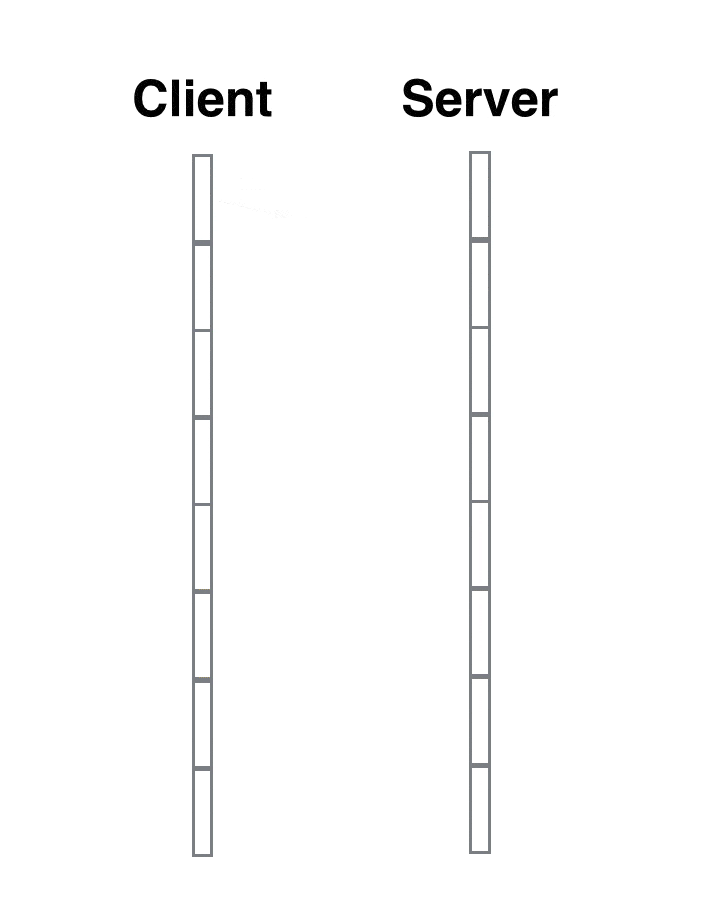
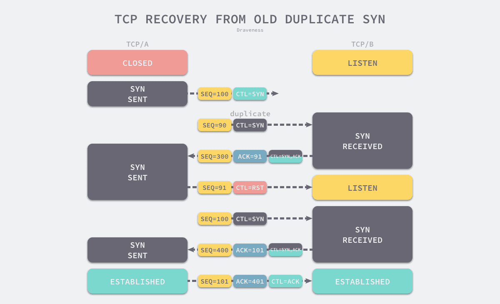
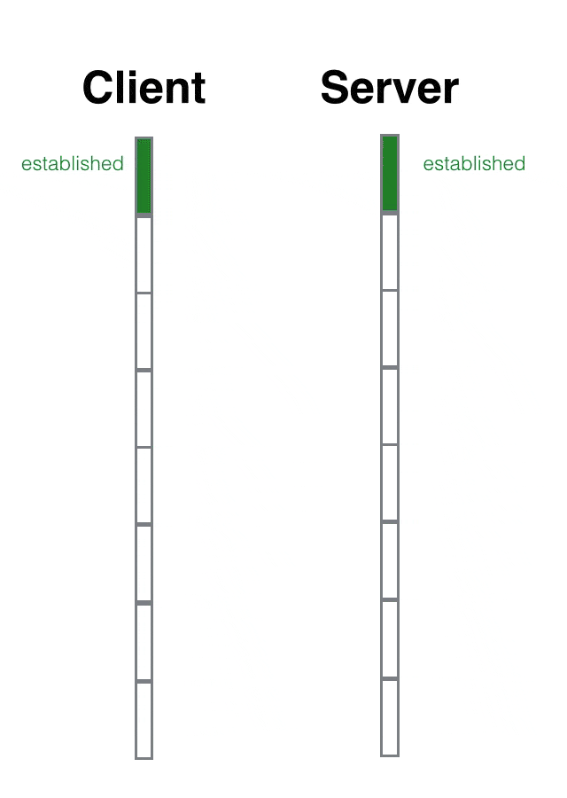
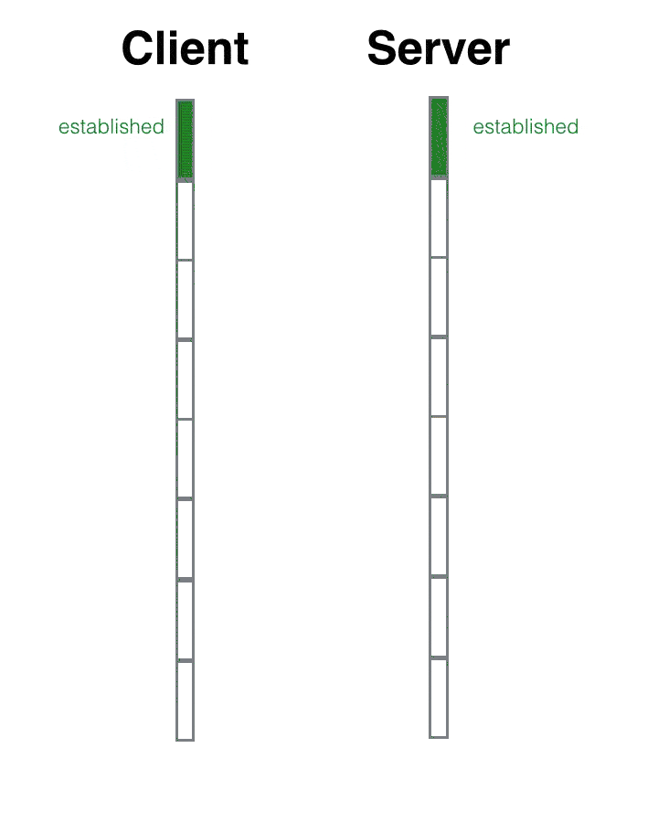

# Network Notes

## OSI Model

Reference

- https://en.wikipedia.org/wiki/OSI_model

> Open System Interconnection Model

|Layer  Type|Layer  Number|Layer  Name|Protocol  Data Unit (PDU)|Protocols|
|-|-|-|-|-|
|Host  layers|7|Application|Data|**HTTP**, HTTPS,  **FTP**, SMTP,  **DNS, DHCP**,  TELNET|
||6|Presentation|↑|TLS, ~~SSL~~, MIME|
||5|Session|↑|**Sockets**  ( session estabilishment  in TCP / RTP / PPTP )|
||4|Transport|Segment,  Datagram|**TCP, UDP**, TLS|
|Media  layers|3|Network|Packet|**IP**, IPsec,  ICMP, IGMP,  OSPF, RIP|
||2|Data Link|Frame|PPP|
||1|Physical|Bit,  Symbol|-|-|

- 7\. **应用层** Application Layer
    - High-level APIs,
    - including resource sharing, remote file access
    - e.g., **HTTP**
- 6\. **表现层** Presentation Layer
    - Translation of data between a networking service and an application;
    - including **character encoding, data compression & encryption/decryption**
- 5\. **会话层** Session Layer
    - Managing communication sessions,
    - i.e., continuous exchange of information in the form of multiple back-and-forth transmissions between two nodes
- 4\. **传输层** Transport Layer :
    - Reliable transmission of data segments between points on a network,
    - including **segmentation, acknowledgement & multiplexing**
    - e.g., **TCP / UDP**
- 3\. **网络层** Network Layer
    - Structuring and managing a multi-node network,
    - including **addressing, routing & traffic control**
    - e.g., IP
- 2\. **数据链路层** Data Link Layer :
    - **Reliable transmission of data frames between two nodes connected by a physical layer**
    - e.g., PPP ( Point-to-Point Protocol )
- 1\. **物理层** Physical Layer
    - **Transmission and reception of raw bit streams over a physical medium**

### _L1 Physical_

The physical layer is responsible for the transmission and reception of unstructured raw data between a device and a physical transmission medium.

- It converts the digital bits into electrical, radio, or optical signals.

### L2 Data Link

The data link layer **provides node-to-node data transfer** — a link between two directly connected nodes.

- It **detects and possibly corrects errors** that may occur in the physical layer.
- It **defines the protocol to establish and terminate a connection between two physically connected devices**.
- It also **defines the protocol for flow control** between them.

Sublayers

- MAC ( Medium Access Control )
- LLC (Logical Link Control )

……

The [Point-to-Point Protocol](https://en.wikipedia.org/wiki/Point-to-Point_Protocol) (PPP) is a data link layer protocol that can operate over several different physical layers, such as synchronous and asynchronous serial lines.

### L3 Network

The network layer provides the functional and procedural means of transferring packets from one node to another connected in "different networks".

- A network is a medium to which many nodes can be connected,
    - on which **every node has an address** and which permits nodes connected to it to **transfer messages to other nodes** connected to it
    - **by merely providing the content of a message and the address of the destination node** and **letting the network find the way to deliver** the message to the destination node,
    - possibly routing it through intermediate nodes.
- If the message is too large to be transmitted from one node to another on the data link layer between those nodes, the network may **implement message delivery by splitting the message into several fragments at one node, sending the fragments independently, and reassembling the fragments at another node**.
- It may, but **does not need to, report delivery errors**.

### L4 Transport

The transport layer provides the functional and procedural means of transferring variable-length data sequences from a source to a destination host, while maintaining the quality of service functions.

- The transport layer **controls the reliability of a given link through flow control, segmentation/desegmentation, & error control**.

……

- [Transmission Control Protocol](https://en.wikipedia.org/wiki/Transmission_Control_Protocol) (TCP) & [User Datagram Protocol](https://en.wikipedia.org/wiki/User_Datagram_Protocol) (UDP)
    - of the Internet Protocol Suite are commonly categorized as layer-4 protocols within OSI.
- [Transport Layer Security](https://en.wikipedia.org/wiki/Transport_Layer_Security) (TLS) provide security at this layer.

### _L5 Session_

The session layer controls the dialogues (connections) between computers.

- It **establishes, manages and terminates the connections between the local and remote application.**
- It provides for **full-duplex, half-duplex, or simplex operation, and establishes procedures for checkpointing, suspending, restarting, and terminating a session**.

### _L6 Presentation_

The presentation layer establishes context between application-layer entities,

- in which the application-layer entities may use different syntax and semantics if the presentation service provides a mapping between them.

### _L7 Application_

The application layer is the OSI layer closest to the end user, which means both the OSI application layer and the user interact directly with the software application.

## HTTP

References

- https://en.wikipedia.org/wiki/Hypertext_Transfer_Protocol
- https://en.wikipedia.org/wiki/List_of_HTTP_status_codes

### Status Codes

All HTTP response status codes are separated into **5 classes or categories**.

- **1xx informational response** _( 继续 )_
    - the request was received, continuing process
- **2xx successful** _( 成功 )_
    - the request was successfully received, understood, and accepted
- **3xx redirection** _( 重定向 )_
    - further action needs to be taken in order to complete the request
- **4xx client error**
    - the request contains bad syntax or cannot be fulfilled
- **5xx server error**
    - the server failed to fulfil an apparently valid request

_The first digit of the status code defines the class of response, while the last two digits do not have any classifying or categorization role._

### 1xx Informational Response

- **100 Continues**
- 101 Switching Protocols
- 102 Processing
- _103 Early Hints_

### 2xx Successful

- **200 OK**
- **201 Created**
- **202 Accepted**
- _203 Non-Authoritative Information_
- **204 No Content**
- _205 Reset Content_
- ……

### 3xx Redirection

- _300 Multiple Choices_
- **301 Move Permanently**
- **302 Found** _( Previously "Move Temporarily" )_
- _303 See Other_
- **304 Not Modified**
- _305 Use Proxy_
- _306 Switch Proxy_
- _307 Temporary Redirect_
- _308 Permanent Redirect_

### 4xx Client Error

- **400 Bad Request**
- **401 Unauthorized**
- 402 Payment Required
- **403 Forbidden**
- **404 Not Found**
- 405 Method Not Allowed
- _406 Not Acceptable_
- _407 Proxy Authentication Required_
- _408 Request Timeout_
- _409 Conflict_
- _410 Gone_
- _411 Length Required_
- _412 Precondition Failed_
- _413 Payload Too Large_
- _414 URI Too Long_
- _415 Unsupported Media Type_
- ……
- ~~_418 I'm a teapot_~~
- ……
- _426 Upgrade Required_
- ……
- _429 Too Many Requests_
- _431 Request Header Fields Too Large_
- _451 Unavailable For Legal Reasons_

### 5xx Server Error

- **500 Internal Server Error**
- _501 Not Implemented_
- **502 Bad Gateway**
- **503 Service Unavailable**
- **504 Gateway Timeout**
- **505 HTTP Version Not Supported**
- ……
- _507 Insufficient Storage_
- _508 Loop Detected_
- _510 Not Extended_
- _511 Network Authentication Required_

## TCP

Reference

- https://en.wikipedia.org/wiki/Transmission_Control_Protocol
- 跟着动画来学习TCP三次握手和四次挥手 - 掘金 : https://juejin.cn/post/6844903625513238541

### Three-Way Handshake

Client

- 1\. `sync_sent` _( syn package has been sent )_
    - syn = 90
- 3\. `established`
    - ack = 101

Server

- 2\. `sync_rcvd` _( syn package has been received )_
    - ack = 91
    - syn = 100
- 4\. `established`

#### Why three-way ?

Reference

- 为什么 TCP 建立连接需要三次握手 https://draveness.me/whys-the-design-tcp-three-way-handshake/

为什么我们需要通过三次握手才可以初始化 Sockets、窗口大小、初始序列号并建立 TCP 连接 :

- **通过三次握手才能阻止重复历史连接的初始化**
- 通过三次握手才能对通信双方的初始序列号进行初始化
- 讨论其他次数握手建立连接的可能性

> The principle reason for the three-way handshake is to prevent old duplicate connection initiations from causing confusion.

Summary

- TCP 建立连接时通过三次握手可以有效地 **避免历史错误连接的建立**, 减少通信双方不必要的资源消耗,
- 三次握手能够 **帮助通信双方获取初始化序列号**,
    - 它们能够保证数据包传输的不重不丢, 还能保证它们的传输顺序, 不会因为网络传输的问题发生混乱,
- 到这里不使用『两次握手』和『四次握手』的原因已经非常清楚了 :
    - 两次握手 ：无法避免历史错误连接的初始化, 浪费接收方的资源;
    - 四次握手 ：TCP 协议的设计可以让我们同时传递 ACK 和 SYN 两个控制信息, 减少了通信次数,
        - _所以不需要使用更多的通信次数传输相同的信息_

### Transport

_Keywords_

- 去重
- 重传
- TCP 窗口大小

### Four-Way Handshake

Client

- 1\. `fin_wait_1`
    - fin = 500
- 3\. `fin_wait_2`
- 5\. `time_wait`
    - ack = 1001
- 7\. _wait for some time_
    - _default 4 min_
- 6\. `closed`

Server

- 2\. `close_wait`
    - ack = 501
- 4\. `last_ack`
    - fin = 1000
- 6\. `closed`

Why `time_wait` ?

- 在 `time_wait` 这段时间内, 该链接在对话期间于网际路由上产生的残留报文 ( 因为路径过于崎岖, 数据报文走的时间太长, 重传的报文都收到了, 原始报文还在路上 ) 传过来时, 都会被立即丢弃掉.
    - 4 分钟的时间足以使得这些残留报文彻底消逝.
    - **不然当新的端口被重复利用时, 这些残留报文可能会干扰新的链接.**
- 4 分钟就是 2 个 MSL, 每个 MSL 是2分钟.
    - MSL 就是 Maximium Segment Lifetime —— 最长报文寿命.
    - 这个时间是由官方 RFC 协议规定的.
    - _至于为什么是 2 个 MSL 而不是 1 个 MSL, 暂时还没有一个足够合理的解释._

## UDP

Reference

- https://en.wikipedia.org/wiki/User_Datagram_Protocol

## IP

Reference

- https://en.wikipedia.org/wiki/Transport_Layer_Security
